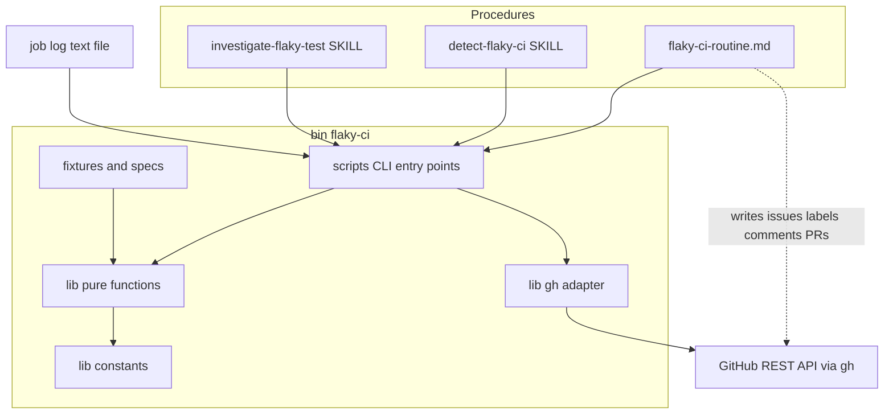
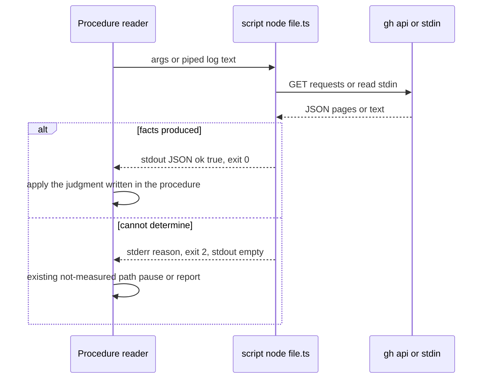
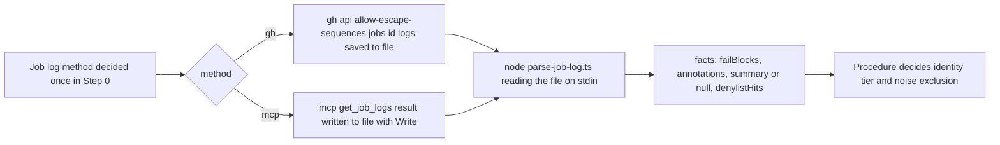
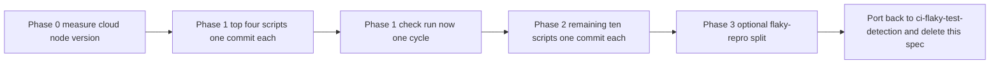

# Design Document — flaky-ci-script-extraction

## Amend target

`.kiro/specs/ci-flaky-test-detection/` の design.md — File Structure Plan、Components（detect-flaky-ci / investigate-flaky-test / flaky-ci-routine の内部構成）、Testing Strategy、Revalidation Triggers。Requirement 1〜11 の契約は変えない。本 spec は実装後に元 spec へ移し戻して自己削除する（`.claude/rules/spec-lifecycle.md`）。

## Overview

**Purpose**: flaky-CI routine の手順書 3 本から、判断を通らない機械的な処理を TypeScript のスクリプト群（`bin/flaky-ci/`）に切り出し、手順書を「スクリプトを呼び、返ってきた事実を見て判断する」形に縮める。利用者から見える振る舞い（何を検出し、どう issue を扱い、いつ PR を開くか）は変えない。

**Users**: 無人で routine を実行する cloud セッション（Sonnet、REST 専用 `gh`、MongoDB 無し）と、手元（devcontainer）で同じ手順を再現・検証するメンテナ。

**Impact**: 手順書の中のシェル片（`gh api … | jq …`、`date -d`、`grep`、`sort | tail -1`）が `node bin/flaky-ci/scripts/<name>.ts …` の 1 行と出力欄の説明に置き換わる。Bash ツール内（zsh・ugrep・uutils・mawk）と bash スクリプト内（GNU）で別のプログラムが動くという環境差は、処理を JS に寄せることで消える。各スクリプトは vitest のテストを持ち、`ci-bin.yml` が `bin/**` と手順書（`flaky-ci-routine.md`）の変更ごとに実行する。

### Goals
- 監査の 14 候補（brief.md の表）を、事実だけを返すスクリプトとして順に導入する（上位 4 本 → 残り）
- 導入した処理について、手順書から手順の記述と不要になった注意書きを消す（定義はスクリプトだけが持つ）
- 各スクリプトに実データ由来のフィクスチャを使うテストを付け、リポジトリの通常のテスト実行で走らせる
- 両環境で同じ結果を返す（環境差の根拠になっていた `date`/`awk`/`grep`/`sort`/`jq` への依存を無くす）

### Non-Goals
- 判断のスクリプト化（Introduction of requirements.md に挙げた 7 点）
- `ci-flaky-test-detection` の Requirement 1〜11 の振る舞い変更
- ログ**取得**手段の統一（cloud は MCP ツール、手元は `gh api` — 分岐は手順書に残る）
- `flaky-repro.yml` の分割は任意（Requirement 6）。routine のトークンには効かない
- 手順書の文章整理（PR #11915 で実施済み）

## Boundary Commitments

### This Spec Owns
- 新規 package 配下 `bin/flaky-ci/`（スクリプト・共有ライブラリ・フィクスチャ・テスト・契約の README）
- 手順書 3 本のうち、スクリプトで置き換える節の本文（呼び出し行・出力欄の意味・判断だけを残す）と、置き換えで不要になる注意書きの削除
- `detect-flaky-ci/SKILL.md` frontmatter の `allowed-tools` の整合（`Write` と `mcp__github__get_job_logs` の追記）
- 手順書と `lib/constants.ts` の固定文字列の一致を検証するテスト
- （任意）`.github/scripts/flaky-repro/` と `flaky-repro.yml` の呼び出し行

### Out of Boundary
- 判断点（7 点）の実装。スクリプトは事実を返し、結論を返さない
- GitHub への書き込み（issue・ラベル・コメント・PR）。すべて手順書の明示的な手順に残る
- `ci-flaky-test-detection` の要件・ラベル体系・コメント見出しの変更
- `apps/app` のテスト基盤やテスト本体の修正

### Allowed Dependencies
- Node.js 24（型除去による `.ts` 直接実行。`enum`・パラメータプロパティ・namespace は使わない）と Node 標準ライブラリのみ。外部 npm 依存を追加しない
- `gh` CLI（認証・egress proxy の扱いを任せる。REST `gh api -X GET` のみ、GraphQL 系サブコマンド不可）
- 既存の workspace package `@growi/bin`（`bin/package.json`、`bin/vitest.config.ts`）、`vitest.workspace.mts` の `bin` エントリ、`.github/workflows/ci-bin.yml`、`biome.json` の `bin/**`
- 手順書 3 本が定義する固定文字列（`flaky-ci-routine.md` → Shared constants）
- `.github/workflows/ci-bin.yml` の `paths` に `.claude/commands/flaky-ci-routine.md` を加える（Shared constants を変えたときにも `constants.spec.ts` が走るようにする。守りたい方向は手順書側の変更）

### Revalidation Triggers
- スクリプトの出力 JSON の欄名・型の変更 → 手順書 3 本の該当節と `bin/flaky-ci/README.md` を同じコミットで更新する
- `flaky-ci-routine.md` の Shared constants（ラベル名・コメント見出し・マーカー・署名・保留窓）の変更 → `lib/constants.ts` と `constants.spec.ts` を更新する（spec が失敗して知らせる）
- `.github/workflows/ci-app.yml` の job 名（`ci-app-…`）や `flaky-repro.yml` の `### Repro result` 7 行の変更 → `check-runs-facts.ts` / `read-repro-result.ts` のフィクスチャと判定
- Node の最低版の変更（`engines`）→ 呼び出し行と `--help` 起動テスト
- cloud routine の実行環境の変更（`gh` 版、Node 版、Write ツールの可否）→ Requirement 3.5 の実測を取り直す

## Architecture

### Existing Architecture Analysis
- 手順書 3 本は「規則＋理由＋シェル片」の散文で、Bash ツール（zsh）から `gh api` / `jq` / `date` / `grep` を直接呼ぶ。Shared constants（`flaky-ci-routine.md`）が固定文字列の唯一の定義場所
- 前例: `.claude/skills/suggest-path-evaluator/scripts/*.ts`（`node` 直接実行、テスト無し）、`apps/app/tools/i18n-audit/`（`node tools/…/run-audit.ts` と隣の `*.spec.ts`）、`bin/`（`@growi/bin`、vitest と CI が配線済み）
- 維持する境界: detect（検出・issue 追跡）／investigate（調査・修正）／routine（順序付け・ダッシュボード・自動クローズ）の 3 分割。スクリプトはこの 3 者に**使われる道具**であり、判断も書き込みも持たない

### Architecture Pattern & Boundary Map



**Architecture Integration**:
- 選んだ形: 「事実を返す小さな CLI」の集合。スクリプト 1 本 = 手順書の 1 節に対応し、入力（引数または stdin）→ stdout の JSON 1 個。判断と書き込みは手順書に残る
- 依存の向き: `constants` → `lib`（純粋関数）→ `scripts`（CLI）。`gh` を呼ぶのは `lib/gh.ts` だけ。テストは `lib` を直接、`scripts` は `node script.ts` の起動と stdin/stdout で検証
- 既存パターン: `node file.ts` 直接実行（steering tech.md）、`bin/` package の vitest 配線、REST 専用 `gh api -X GET`
- 新しい構成要素の理由: `lib/gh.ts` は `--paginate -q` の落とし穴と `--slurp` 非互換を JS 側のページングで消すため。`lib/constants.ts` は固定文字列の機械可読な定義と手順書との一致検証のため
- steering との整合: 「Executors take their work-set as input」（`coding-style.md`）— denylist・ラベル名・見出しはデータとして宣言し、スクリプト本体は入力を受けて処理する

### Technology Stack

| Layer | Choice / Version | Role in Feature | Notes |
|-------|------------------|-----------------|-------|
| CLI / Scripts | TypeScript on Node.js 24（型除去、`#!/usr/bin/env node`） | 事実を返す CLI | 外部依存なし。`enum`・パラメータプロパティ・namespace 禁止 |
| GitHub access | `gh` CLI（`gh api -X GET`） | 認証・proxy 越しの REST 読み取り | 子プロセス。ページングは JS 側 |
| Tests | vitest（`@growi/bin` の設定） | 純粋関数と CLI 起動の検証 | `turbo run test --filter=./bin`、`ci-bin.yml` |
| Lint | biome（`bin/**`） | 整形と静的検査 | 型除去で落ちる構文は `--help` 起動テストで捕まえる |
| Optional | GNU bash on Actions runner | `flaky-repro.yml` の分割スクリプト | Requirement 6 のみ |

## File Structure Plan

### Directory Structure
```
bin/
└── flaky-ci/
    ├── README.md                         # 契約の一覧（スクリプト名 / 引数 / stdin / 出力欄 / 終了コード）。手順書はここを参照する
    ├── scripts/                          # CLI 入口（1 本 = 手順書の 1 節）。引数解釈と出力の整形だけ
    │   ├── lockfile-overlap.ts           # #1  PR の lockfile 差分とログ抜粋のパッケージ名の交差
    │   ├── read-repro-result.ts          # #2  issue の `### Repro result` を SHA で選んで読む
    │   ├── newest-observation.ts         # #3  issue の最新観測日時（本文 + 観測コメント）
    │   ├── awaiting-decision-rows.ts     # #4  needs-decision issue の Paused at / Recommendation / 保留窓
    │   ├── list-candidate-runs.ts        # #5  時間窓内の run 一覧（workflow ごと、手動ページング）
    │   ├── check-runs-facts.ts           # #6  SHA の check-run を同名で重複排除し状態を返す（単発）
    │   ├── pr-owns-failure.ts            # #7  master 祖先性・紐づく PR・spec パス一致の事実
    │   ├── parse-identity-key.ts         # #8  issue 題名から kind / browser / spec / title
    │   ├── parse-job-log.ts              # #9+#10 stdin のログから FAIL ブロック・Playwright 注釈と集計・denylist 一致
    │   ├── fetch-flaky-issues.ts         # #11 flaky/* issue の本体とコメント全文
    │   ├── pr-gate-facts.ts              # #12 ゲート条件 1・2 の事実（tally、ci-app-* の総数と非 success）
    │   ├── mining-signals.ts             # #13 判定②（挟み込み）③（matrix 食い違い）の真偽と根拠
    │   └── render-dashboard.ts           # #14 issue 一覧 JSON → ダッシュボード本文の Markdown
    ├── lib/                              # 純粋関数。scripts からだけ import される
    │   ├── constants.ts                  # 固定文字列（ラベル・見出し・マーカー・署名・保留窓 120 秒）の機械可読な定義
    │   ├── gh.ts                         # GhApi インターフェースと `gh api -X GET` 実装、JS 側ページング
    │   ├── ansi.ts                       # ANSI 除去（正規表現は 1 つ: ESC [ 数字;* 英字）
    │   ├── time.ts                       # ISO-8601 の比較・差分・窓計算（`date -d` の代替）
    │   ├── identity.ts                   # 識別キーの解析・正規化（Playwright title の location 除去など）
    │   ├── job-log.ts                    # FAIL ブロック抽出、Playwright 注釈と集計行の抽出
    │   ├── denylist.ts                   # インフラノイズの denylist（データ）と FAIL ブロック単位の照合
    │   ├── repro-result.ts               # `### Repro result` 7 行の解析
    │   ├── check-runs.ts                 # check-run の同名重複排除（started_at→id）と ci-app-* の集計。check-runs-facts と pr-gate-facts が共用
    │   ├── lockfile.ts                   # lockfile 差分からのパッケージ名抽出（peer 接尾辞の除去、`(…)`・`_` の切り落とし）
    │   ├── dashboard.ts                  # 表と 2 節の描画、行順、65536 字の切り詰め
    │   └── output.ts                     # `{ ok: true, … }` の出力と、終了コード 2 の失敗の書き方
    ├── fixtures/                         # 実データ由来（抜粋・匿名化不要な公開 CI ログと API 応答）
    │   ├── job-logs/                     # vitest FAIL ブロック、Playwright 0 failed / 1 flaky、1 failed / 0 flaky、共有 setup フック timeout
    │   ├── api/                          # issues / comments / check-runs / pulls files / compare の記録
    │   └── lockfile/                     # `@codemirror/state` 二重化 PR の patch 抜粋
    └── *.spec.ts                         # lib と scripts の隣に置く（scripts は `node` 起動で検証）
```

### Modified Files
- `.claude/commands/flaky-ci-routine.md` — 4-B/4-E（newest-observation）、Step 5 item 2〜3（awaiting-decision-rows、render-dashboard）の節を「呼び出し・出力欄・判断」に置き換え。Shared constants に「機械可読な定義は `bin/flaky-ci/lib/constants.ts`、一致は spec で検証」の 1 文を追加
- `.claude/skills/detect-flaky-ci/SKILL.md` — Step 1（list-candidate-runs）、Step 1.5（fetch-flaky-issues）、Step 2（parse-job-log、denylist の一覧参照）、判定①（lockfile-overlap）②③（mining-signals）、Step 3 の Playwright 事実（parse-job-log の出力）、「PR 自身の失敗」（pr-owns-failure）の節を置き換え。frontmatter `allowed-tools` に `Write` と `mcp__github__get_job_logs` を追記。MCP 経路は「結果を Write でファイルに保存 → `node … < file`」の 1 段を追加
- `.claude/skills/investigate-flaky-test/SKILL.md` — Step 1（parse-identity-key）、2-C/2-D と 6-A（check-runs-facts、read-repro-result）、6-B 条件 1・2（pr-gate-facts）の節を置き換え。条件 3 と判定表は残す
- `bin/package.json` — 変更不要（`test: vitest run` 既存）。`exports` は追加しない（CLI は `node` パスで呼ぶ）
- （任意）`.github/workflows/flaky-repro.yml` — `run:` の中身を `.github/scripts/flaky-repro/{parse-request,run-repro,render-result}.sh` に移し、`bash -n` を最初のステップに追加
- `.kiro/specs/ci-flaky-test-detection/{design,research}.md` — 移し戻し（File Structure Plan・Components・Testing Strategy・Revalidation Triggers、設計決定）

## System Flows

### スクリプト呼び出しの共通の形（手順書側）



- 終了コード 0 と 2 の 2 分岐だけを手順書に書く。1（想定外の例外）は 2 と同じ扱い
- スクリプトは同じ入力に対して決定的（同着は `started_at`→`id`、コメントは `created_at`→`id` で解く）

### ログ解析（両経路）



- 取得経路の判定と分岐は手順書に残る（スクリプトから MCP ツールは呼べない）
- `summary: null` は「集計行が無かった」ではなく「取れなかった＝不明」。0 と区別して返す

## Requirements Traceability

| Requirement | Summary | Components | Interfaces | Flows |
|-------------|---------|------------|------------|-------|
| 1.1 | 採用候補はスクリプト呼び出し、本文は呼び出し・欄・判断だけ | 14 scripts、Procedure Rewrite | README 契約表 | 共通の形 |
| 1.2 | 手順の定義はスクリプトだけが持つ | Procedure Rewrite | — | — |
| 1.3 | 同じ入力に同じ結果 | lib（純粋関数）、fixtures | 各 spec の入出力一致 | — |
| 1.4 | 不要になった注意書きの削除 | Procedure Rewrite | — | — |
| 1.5 | 元 spec の Requirement 1〜11 を同じように満たす | 全体 | 6.3 相当の run now 検証（Testing Strategy） | — |
| 2.1 | 出力は事実のみ、結論を含めない | output.ts、各 script の出力スキーマ | JSON 欄の定義 | 共通の形 |
| 2.2 | 書き込みはスクリプトから行わない | gh.ts（GET のみ） | `GhApi.get/getAll` | — |
| 2.3 | 判断 7 点は手順書に残す | Procedure Rewrite | — | ログ解析の最終段 |
| 2.4 | どの欄をどの判断に使うか明記 | README、Procedure Rewrite | 契約表の「使う判断」列 | — |
| 3.1 | 両環境で追加準備なしに実行 | Node 24 直接実行、外部依存なし | `node bin/flaky-ci/scripts/*.ts` | — |
| 3.2 | ログ本文を入力に取り取得手段に依存しない | parse-job-log.ts（stdin） | stdin 契約 | ログ解析 |
| 3.3 | 前提を満たせなければ失敗終了、空の成功を返さない | output.ts | 終了コード 2 + stderr | 共通の形 |
| 3.4 | 失敗時は既存の「測定できなかった」扱い、即興で書き直さない | Procedure Rewrite | — | 共通の形 |
| 3.5 | 実行手段の存在を実測して記録 | 導入タスク | cloud の `node --version` | — |
| 4.1 | 実データ由来の自動テスト | fixtures、*.spec.ts | — | — |
| 4.2 | 通常のテスト実行で走り、契約が崩れたら失敗 | `@growi/bin` vitest、`ci-bin.yml` | `turbo run test --filter=./bin` | — |
| 4.3 | 事故事例を再現する入力をテストに含める | fixtures（別 attempt のログ、`head -1`、空値、同一ミリ秒） | — | — |
| 4.4 | 契約をスクリプトの近くに文書化し手順書はそれを参照 | README、各 script 先頭の説明 | — | — |
| 5.1 | 1 本ずつ、旧新の同時存在なし | 導入タスク（1 スクリプト = 1 コミット） | — | — |
| 5.2 | 優先順（上位 4 本）、前後の行数・容量を記録 | 導入タスク、tasks.md Implementation Notes | — | — |
| 5.3 | 完了時に routine + detect の合計容量が減ったことを記録 | 導入タスク | — | — |
| 5.4 | スクリプト一覧と呼び出し箇所を元 spec の design.md に記述 | 移し戻しタスク | — | — |
| 6.1 | 分割の前後で同じ trailer 契約・同じ結果コメント | `.github/scripts/flaky-repro/*.sh`（任意） | — | — |
| 6.2 | 分割スクリプトを構文検査 | workflow 内 `bash -n` ステップ | — | — |
| 6.3 | push 先ブランチに本体とスクリプトの両方が存在することだけを前提 | `flaky-repro.yml` | — | — |

## Components and Interfaces

| Component | Domain/Layer | Intent | Req Coverage | Key Dependencies (P0/P1) | Contracts |
|-----------|--------------|--------|--------------|--------------------------|-----------|
| output.ts | lib | 成功 JSON と失敗（exit 2）の唯一の書き方 | 2.1, 3.3 | — | Service |
| gh.ts | lib | REST 読み取りアダプタ、JS 側ページング | 2.2, 3.1 | gh CLI (P0) | Service |
| constants.ts | lib | 固定文字列の機械可読な定義 | 1.2, 4.2 | flaky-ci-routine.md Shared constants (P0) | State |
| ansi.ts / time.ts / identity.ts / job-log.ts / denylist.ts / repro-result.ts / lockfile.ts / dashboard.ts | lib | 純粋関数 | 1.3, 3.1 | constants (P1) | Service |
| 14 scripts | CLI | 手順書の 1 節に対応する事実の取り出し | 1.1, 2.1, 2.4, 3.2 | lib (P0), gh.ts (P0/一部) | Batch |
| README.md | docs | 契約表（引数 / stdin / 出力欄 / 終了コード / 使う判断） | 2.4, 4.4 | — | — |
| Procedure Rewrite | docs | 3 本の手順書の置き換え節 | 1.1, 1.2, 1.4, 2.3, 3.4 | scripts (P0) | — |
| constants.spec.ts | test | 手順書と constants.ts の一致検証 | 4.2 | flaky-ci-routine.md (P0) | — |
| flaky-repro scripts (任意) | CI | workflow の `run:` の外出し | 6.1, 6.2, 6.3 | GNU bash on runner (P0) | Batch |

### lib

#### output.ts

| Field | Detail |
|-------|--------|
| Intent | すべてのスクリプトが同じ成功／失敗の形で終わる |
| Requirements | 2.1, 3.3 |

**Responsibilities & Constraints**
- 成功: stdout に `{"ok":true, ...facts}` を 1 行 JSON で出し、終了コード 0
- 失敗（前提を満たせない）: stdout に何も出さず、stderr に 1 行の理由、終了コード 2。想定外の例外は終了コード 1（手順書は 2 と同じ扱い）
- 「0 件で正常」は `ok:true` かつ空配列で表す。「取れなかった」は必ず終了コード 2。各スクリプトの契約で両者の意味を明記する

##### Service Interface
```typescript
type Facts = Record<string, unknown>;
type Failure = { readonly reason: string };            // stderr 1 行
type ScriptResult = { readonly ok: true; readonly facts: Facts } | { readonly ok: false; readonly failure: Failure };

function emit(result: ScriptResult): never;              // stdout/stderr へ書き、process.exit(0 | 2)
```
- Preconditions: `facts` は JSON 化できる値のみ
- Postconditions: 終了コード 0 のとき stdout は JSON 1 個、2 のとき stdout は空

#### gh.ts

| Field | Detail |
|-------|--------|
| Intent | GitHub REST 読み取りの唯一の入口。書き込み API を持たない |
| Requirements | 2.2, 3.1 |

**Responsibilities & Constraints**
- `gh api -X GET <path> -F key=value …` を `execFile` で呼ぶ。GraphQL 系サブコマンドは使わない
- ページングは `page=N` を JS 側で回し、配列を結合する（`--paginate -q` を使わない）
- `gh` が無い／非 0 終了／JSON でない応答は `GhError` として投げ、スクリプトは終了コード 2 に写す

##### Service Interface
```typescript
interface GhApi {
  get<T>(path: string, params?: Readonly<Record<string, string | number>>): Promise<T>;
  getAll<T>(path: string, params?: Readonly<Record<string, string | number>>, perPage?: number): Promise<readonly T[]>;
}
class GhError extends Error { readonly kind: 'not-installed' | 'exit-nonzero' | 'invalid-json'; }
function createGhApi(exec?: ExecFn): GhApi;              // テストでは exec を差し替える
```

#### constants.ts

| Field | Detail |
|-------|--------|
| Intent | 手順書の Shared constants と同じ文字列を、スクリプトが参照できる形で 1 か所に置く |
| Requirements | 1.2, 4.2 |

**Responsibilities & Constraints**
- ラベル名（`flaky/observing` `flaky/suspected` `flaky/confirmed` `flaky/needs-decision` `flaky/dashboard`）、コメント見出し（`### Additional observation` `### Backfilled observation` `### Repro result` `### Collateral candidate` `### Auto-closed: not reproduced within ` `### Closed: deterministic cause, not flaky`）、マーカー `**Fix PR**: `、`- Recommendation: `、署名 2 種、保留窓 120 秒、`### Repro result` の 7 行の見出し語
- `constants.spec.ts` が `.claude/commands/flaky-ci-routine.md` の `## Shared constants` 節のコードブロックを読み、ここに定義された各文字列が現れることを検証する（ドリフト検知）。人が読む定義は手順書、機械が読む定義はここ

##### State Management
- 変更は両方を同じコミットで行う（Revalidation Trigger）

#### 純粋関数群（ansi / time / identity / job-log / denylist / repro-result / lockfile / dashboard）

| Field | Detail |
|-------|--------|
| Intent | 文字列・日時・JSON の処理を Node 標準ライブラリだけで行い、環境差を無くす |
| Requirements | 1.3, 3.1 |

**Responsibilities & Constraints**
- `ansi.strip(text)`: 正規表現 `\x1b\[[0-9;]*[A-Za-z]` と行末 `\r` の除去（手順書内に 2 種類あった正規表現をこれに統一）
- `time.compareIso(a,b)` / `time.minusSeconds(iso, s)` / `time.daysBetween(a,b)`: ISO-8601 UTC のみ受け付け、形式が違えば例外（`date -d ""` の黙った成功を再現しない）
- `identity.parse(title)`: `flaky: ` 前置きを外し、kind / browser / spec / title に分解。戻り値は判別可能な 3 種（`precise` / `playwright-job-level` / `malformed`）。その後の扱いは手順書
- `job-log.extractFailBlocks(text)` / `extractPlaywrightAnnotations(text)` / `extractSummary(text) → Summary | null`
- `denylist.match(block) → string | null`: 一覧はこのモジュールのデータ。共有 setup フック（`test/setup/**`）の一致は `scope: 'job'`、それ以外は `scope: 'failure'` を返す。一覧を広げる判断は手順書
- `repro-result.parse(body, sha) → { runs, failed, perRun[], workflowRunUrl } | null`: `- Commit:` が一致するコメントだけ。同一 SHA に複数あれば `created_at`→`id` で最新
- `lockfile.packagesInPatch(patch)` / `packagesInLog(excerpt)`: peer 接尾辞（`_…`）の切り落とし、`(…)` の除去、交差
- `dashboard.render(input) → string`: 表（行順は tier → issue 番号昇順）、`## Awaiting human decision`、`## Auto-closed this run`、決まり文句 3 つ、65536 字の切り詰め（表の行だけを上から残す、節は落とさない）。**内容の決定（どの issue を載せるか）は入力で受け取る**

### scripts（CLI）

各スクリプトの契約は `bin/flaky-ci/README.md` の表が唯一の一覧。ここでは境界の要点だけを書く。

| Script | 入力 | 主な出力欄 | 手順書に残る判断 |
|---|---|---|---|
| lockfile-overlap | `--sha --pr --log-excerpt-file` | `overlap[]`, `patchPackages[]`, `logPackages[]` | 判定①を発火させるか |
| read-repro-result | `--issue --sha` | `runs`, `failed`, `perRun[]`, `workflowRunUrl`, `commentUrl`；該当コメント無しは exit 2 | 2-E の判定表、6-B 条件 1 |
| newest-observation | `--issue` | `newest`（ISO）, `source`（body / comment id）；読めなければ exit 2 | 「読めなければ閉じない」（4-D）、閉じる／閉じない |
| awaiting-decision-rows | `--issue`（複数可） | 行ごとに `pausedAt`, `pausedAtStatus`（`ok` / `unavailable`）, `recommendation`, `recommendationSource`（`in-window` / `widened` / `none`）, `newObservations` | `(may be stale) ` を付ける条件の解釈、再選択しない規則 |
| list-candidate-runs | `--workflow --window-hours --max-runs` | JSONL 相当の配列（`id, conclusion, headSha, createdAt, url, event, attempt`）、`truncated` | 同一 SHA の attempt 反転の扱い |
| check-runs-facts | `--sha` | 同名重複排除後の `checks[]`、`ciApp: { total, notSuccess[] }`、`flakyRepro: { status, conclusion }` | 待つか諦めるか（手順書の短いループ） |
| pr-owns-failure | `--sha --spec-path` | `ancestryStatus`, `pulls[]`, `touchesSpec`, `noPr`；API 失敗は exit 2 | 除外する／続行する（失敗時は除外しない） |
| parse-identity-key | `--title` | `kind`, `browser`, `specPath`, `testTitle`, `shape`（`precise` / `playwright-job-level` / `malformed`） | 3 種それぞれの扱い |
| parse-job-log | stdin | `vitest.failBlocks[]`, `playwright.annotations[]`, `playwright.summary | null`, `denylistHits[]` | 段位（tier）の決定、denylist の拡張、巻き添え・連鎖の畳み先 |
| fetch-flaky-issues | `--labels`（既定 3 種） | `issues[]`（number, title, state, body, labels, comments[]） | — |
| pr-gate-facts | `--issue --sha --base origin/master` | `tally`（read-repro-result と同じ）, `ciApp`（check-runs-facts と同じ）, `changedFiles[]` | 条件 3（差分の範囲）、HIGH/MEDIUM/LOW |
| mining-signals | `--runs-file --identity` | `sandwich: { hit, evidence }`, `matrixSplit: { hit, evidence }` | tier の付け方 |
| render-dashboard | stdin（issue 一覧・判断待ち行・自動クローズ 3 リストの JSON） | Markdown 本文 | 何を載せるか（入力を組む側） |

##### Batch / Job Contract（共通）
- Trigger: 手順書の該当節が `node bin/flaky-ci/scripts/<name>.ts …` を実行
- Input / validation: 引数は名前付き（`--key value`）。必須欠落・形式不正は exit 2。stdin を取るスクリプトは空入力を exit 2
- Output / destination: stdout の JSON 1 個。ファイルは書かない（手順書がリダイレクトで保存する）
- Idempotency & recovery: 読み取りのみで冪等。再実行しても GitHub 側は変わらない

**Implementation Notes**
- Integration: 手順書の置き換え節は「実行行 → 出力欄と意味 → 判断」の 3 段で書く。`README.md` の契約表と欄名が一致することを各 spec で確認する（欄名の定数を共有）
- Validation: 各 script の spec は (a) `node script.ts --help` が exit 0（型除去で落ちる構文の検知）、(b) フィクスチャ入力での出力一致、(c) 失敗入力で exit 2 かつ stdout 空
- Risks: cloud の Node 版（3.5 で実測）。`gh` 2.45（cloud）と 2.100（手元）の `gh api` の差は既知の範囲では無いが、`-F` の型変換は両方で確認する

### docs

#### Procedure Rewrite

| Field | Detail |
|-------|--------|
| Intent | 手順書の該当節を、呼び出し・出力欄・判断だけに縮める |
| Requirements | 1.1, 1.2, 1.4, 2.3, 3.4 |

**Responsibilities & Constraints**
- 置き換えた節にシェル片を残さない（`jq`/`date -d`/`grep`/`sort | tail -1` の記述と、それに付随する注意書きを削除）
- 判断 7 点と誤読防止の文のうちスクリプトが引き受けないもの（`success` ≠ measured、見出しの先頭行一致、REST のみ、など）は残す
- 失敗（exit 2）の扱いは各節で「確認未実施」「観測日が読めず飛ばす」「実行サマリーで明示」のどれかを名指しする
- MCP 経路: 「ツールの結果を Write で `${TMPDIR:-/tmp}/flaky-job-<id>.log` に保存し、`node bin/flaky-ci/scripts/parse-job-log.ts < そのファイル`」と書く。`gh` 経路は `gh api --allow-escape-sequences … > file` のまま
- `detect-flaky-ci/SKILL.md` の `allowed-tools` に `Write`, `mcp__github__get_job_logs` を追記

**Implementation Notes**
- Integration: 1 スクリプト導入 = 手順書の該当節置き換え = 1 コミット（5.1）
- Validation: 置き換え前後で fenced code の diff（消えたシェル片）と、残すべき規範文の存在を確認する（PR #11915 の文章整理と同じ手法）。上位 4 本の導入後に `/flaky-ci-routine` を run now で 1 サイクル回す（1.5）
- Risks: 置き換え漏れで旧シェル片が残ると「定義が 2 か所」になる → 各節の置き換え後に `grep -n 'gh api' <file>` で該当節に残っていないことを確認

### CI（任意）

#### flaky-repro scripts

| Field | Detail |
|-------|--------|
| Intent | `flaky-repro.yml` の `run:` の中身を `.github/scripts/flaky-repro/` にそのまま移す |
| Requirements | 6.1, 6.2, 6.3 |

**Responsibilities & Constraints**
- `parse-request.sh`（trailer 解析・検証）、`run-repro.sh`（N 回実行と集計）、`render-result.sh`（`### Repro result` 7 行）。中身は移動のみ（振る舞い同一）
- workflow の最初のステップで `bash -n .github/scripts/flaky-repro/*.sh`
- 環境変数の受け渡し（`GITHUB_OUTPUT`、`RESULT_MD` 等）は現在と同じ

## Data Models

### Domain Model
- **Fact**（値オブジェクト）: スクリプトが返す観測結果。結論を含まない。`ok:true` の JSON
- **Judgment**（手順書の概念）: Fact を読んで下す結論。スクリプトの外
- **Constant**（値オブジェクト）: 手順書とスクリプトが共有する固定文字列。定義は手順書（人向け）と `constants.ts`（機械向け）で、一致をテストが保証

### Data Contracts & Integration
- スクリプト出力の JSON は `README.md` の契約表が唯一の定義。欄名は `lib/output.ts` の定数として共有し、spec が README の表と突き合わせる
- 入力の JSON（`render-dashboard`、`mining-signals` の run 一覧）は他スクリプトの出力をそのまま渡せる形にする（`list-candidate-runs` → `mining-signals`、`fetch-flaky-issues` + `awaiting-decision-rows` → `render-dashboard`）

## Error Handling

### Error Strategy
- 前提不成立（引数欠落、stdin 空、`gh` 無し／非 0、JSON 不正、該当コメント無し、日時形式不正）→ exit 2 + stderr 1 行。手順書は既存の「測定・取得できなかった」経路へ
- 想定外の例外 → exit 1（スタックトレースは stderr）。手順書は 2 と同じ扱い
- 「0 件」は正常な事実（`ok:true` + 空配列）。手順書は 0 件をそのまま結果として扱う（例: 判断待ち 0 件 → `No issues are waiting for a human decision.`）
- **複数行を返すスクリプト**（`awaiting-decision-rows`、`fetch-flaky-issues`、`list-candidate-runs`）では、1 行分の値が読めなかったことはその行の欄で示す事実（例: `pausedAtStatus: "unavailable"`）として扱い、全体は `ok:true`。一覧のうち 1 件が読めないだけで全体を失敗にすると、他の行が出なくなるため。行全体が 1 件も取れないときは終了コード 2

### Monitoring
- スクリプトの失敗は Step 6 の報告に「スクリプト失敗: <name> <reason>」として 1 行ずつ載せる（routine の報告項目を 1 つ追加。Shared constants の変更は不要）

## Testing Strategy

- **Unit（lib）**: `ansi.strip` が 2 種類の旧正規表現の入力を同じ結果にする／`time` が形式不正で例外、空文字を今日 0 時に化けさせない／`identity.parse` が 65 件の実 issue 題名（フィクスチャ）を全件解析し、#11752 の共有 setup フック・#11903 の `:` 含み題名・#11818 の `.js` 含み題名を正しく分ける／`job-log` が `0 failed / 1 flaky`・`1 failed / 0 flaky`・集計行なし（`summary: null`）・共有 setup フック timeout を区別する／`denylist` が 97 件失敗中 1 件の `getaddrinfo ENOTFOUND` を `scope:'failure'` にし、`test/setup/**` 内の一致だけを `scope:'job'` にする／`repro-result.parse` が同一 SHA 2 件で新しい方を取り、`- Per-run:` を保持する／`lockfile.packagesInPatch` が `@codemirror/state@6.5.2(…)` 形式と peer 接尾辞を正しく落とす／`dashboard.render` が行順・決まり文句・切り詰め時に節を落とさないことを守る
- **CLI（scripts）**: 各スクリプトで `node script.ts --help` が exit 0（型除去の構文検知）／フィクスチャ入力で契約表どおりの欄／失敗入力で exit 2 かつ stdout 空／`GhApi` を偽物に差し替えた `read-repro-result`・`newest-observation`・`awaiting-decision-rows`・`pr-owns-failure` が記録済み応答から期待値を返す（別 attempt のログ取り違え、空 `PAUSED_AT`、`head -1` の順序 = 同着解決、の事故事例を入力に含める — 4.3）
- **ドリフト検知**: `constants.spec.ts` が手順書の Shared constants と一致／各 script の spec が README の契約表に自分の欄名があることを確認
- **統合（手順書）**: 上位 4 本の導入後、`/flaky-ci-routine` を run now で 1 サイクル回し、ダッシュボード・自動クローズ・判断待ちの結果が導入前と同じ形であることを確認（1.5）。cloud routine の `node --version` を同時に記録（3.5）
- **任意（Requirement 6）**: 分割後に `flaky-repro/selftest-*` ブランチで 1 回測定し、`### Repro result` 7 行が同一であることを確認

## Migration Strategy



- Phase 0 で Node 24 が cloud に無ければ、呼び出し行を `node --experimental-strip-types` に変えるか、対象を `.js` 出力にする判断を行う（設計の他の部分は変わらない）
- 各 Phase の前後で手順書 3 本の行数・容量を tasks.md の Implementation Notes に記録する（5.2、5.3）
- 切り戻しは「そのコミットを revert する」だけで済む（1 スクリプト = 1 コミットで手順書も同時に戻る）
