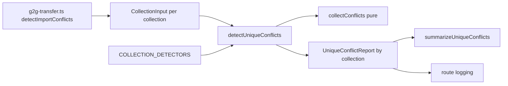

# Design Document

## Write / Don't-Write Test

このドキュメントを将来編集するときの判定基準。**読者がコードとテストファイルを読めば再現できる内容は書かない**。

| 書く | 書かない |
|---|---|
| 調査して初めてわかった事実(コードをざっと読んだだけでは自明でない挙動、外部ライブラリの隠れた振る舞い) | 関数シグネチャ・ファイル配置図・「どのファイルに何があるか」 |
| 異例な設計を選んだ理由(**特に、試して却下した案とその理由**) | 素直な実装の素直な説明 |
| 自動テストが**カバーできない**残差 | どのテストが何をカバーしているかの一覧(spec/testファイルを読めばわかる。書くと陳腐化する) |
| コードから再現できない手動検証の手順(再現環境の作り方、確認する観点、合否を分ける基準値) | 差分の有無・実装時期などの時点情報 |

迷ったら書かない。

## Amend Target

このspecは`.claude/rules/spec-lifecycle.md`が定義する**amend spec**である。実装完了後、以下をport-backし、本spec自身を削除する(最終タスク)。

- **Target**: `g2g-import-conflict-detection`
- **書き換わる契約**: requirements.mdのOut of scope(`users`/`usergroups`以外・ExternalUserGroup系を除外している記述)、design.mdのBoundary Commitments(This Spec Owns/Out of Boundary)とRevalidation Triggers(宣言リストとのドリフトを追加)。要件番号は既存のものを変更せず、末尾に追記する。
- **Out of scope for this amend**: `g2g-transfer-migration-mode`。「置き換え対象集合の算出」(`deriveReplaceTargets`)は`importSettingsMap`から汎用的に導かれており、コレクション名をハードコードしていないことをコードで確認済み(research.md参照)。この変更の影響を受けず、契約変更は不要。

## Overview

**Purpose**: G2G転送の一意制約衝突検知(`g2g-import-conflict-detection`が確立)の対象範囲を`externalaccounts`(`providerType`+`accountId`の複合キー)と`externalusergroups`(`externalId`単体、`name`+`provider`の複合キー)に拡張し、SSO/LDAP/SAML連携環境でissue #10151と同一の症状が再現する経路を塞ぐ。

**Users**: SSO/LDAP/SAML連携を使うGROWI間でG2G転送を行う管理者。

**Impact**: `detect-unique-conflicts.ts`の型とアルゴリズムを、単一フィールド一致から「フィールドの組(1つ以上)一致」へ一般化する。これに伴い`UniqueConflictReport`の形も、コレクション名で分岐する固定2フィールドから汎用的な形へ変わる。受信側の中断ゲート・通知経路(`g2g-import-conflict-detection`が確立)自体は変更しない。

### Goals

- `externalaccounts`(複合キー)・`externalusergroups`(単一+複合キー)の一意制約衝突を、書き込み開始前に検知する。
- 複合キーを「フィールドの組すべてが一致」で正しく判定し、片方だけの一致を衝突としない。
- 一意キーの宣言(コレクション→フィールドの組)を1箇所にまとめ、将来コレクションが増えても検知の骨格(orchestrator・通知・ログ)を変更せずに済む形にする。
- 宣言と実際のデータモデルの一意制約とのドリフトを検出する試験を用意する。

### Non-Goals

- `g2g-transfer-migration-mode`の「置き換え対象集合の算出」ロジックの変更(不要と判断済み)。
- `externalusergrouprelations`の検知(一意インデックスが存在しないことを確認済み)。
- 受信ルートの中断ゲート・通知経路そのものの変更(既存のまま使う)。
- 手動zip取り込み画面への検知組み込み(`g2g-import-conflict-detection`が既に対象外としている範囲を踏襲)。

## Boundary Commitments

### This Spec Owns

- **一意キー宣言の一般化**: 単一/複合キーを同じ形(`UniqueKeySpec`)で表現し、コレクションごとの宣言(`users`/`usergroups`/`externalaccounts`/`externalusergroups`)を1箇所にまとめる。
- **`collectConflicts`の複合キー対応**: フィールドの組すべてが一致し、かつ`_id`が異なるものだけを衝突とする判定への一般化。
- **`UniqueConflictReport`の汎用化**: コレクション名→衝突配列という形へ変更し、消費側(通知生成・ログ出力)がコレクション数の増減に追随不要になるようにする。
- **`externalaccounts`/`externalusergroups`の抽出・照会アダプタ**: アーカイブJSONからの一意フィールド抽出、既存データの`$in`バッチ照会(既存の`users`/`usergroups`用アダプタと同じパターン)。
- **一意キー宣言と実際のデータモデルのドリフト検出試験**。

### Out of Boundary

- 受信ルートの中断ゲート配置・通知経路(`admin:g2gError`等)そのもの。`g2g-import-conflict-detection`が確立した仕組みにそのまま乗る。
- `g2g-transfer-migration-mode`の置き換え対象集合の算出。
- ページ閲覧可否判定、認証・認可の仕組み。
- `ImportService`の取り込み挙動そのもの(`insert`/`upsert`/`flushAndInsert`の意味)。
- `externalusergrouprelations`の検知(一意制約が存在しない)。

### Allowed Dependencies

- `detect-unique-conflicts.ts`が既に確立した`ExistingDocumentLookup`・`readArchiveUniqueFields`・`findExistingCandidates`等の内部ヘルパー(汎用化した上で再利用)。
- Mongooseモデル`User`/`UserGroup`(既存)、`mongoose.model('ExternalAccount')`(モデルレジストリ経由、`User`の取得と同じ手法)、`ExternalUserGroup`(デフォルトエクスポート)。
- `g2g-import-conflict-detection`が確立した受信ルートの中断ゲート・エラーコード(`growi_data_conflict`)・通知経路。
- `g2g-transfer-migration-mode`が確立した`deriveReplaceTargets`/`replaceTargetCollections`の受け渡し。

### Revalidation Triggers

- `users`/`usergroups`/`externalaccounts`/`externalusergroups`の一意インデックス定義が変わったとき(宣言側の追随が必要。ドリフト試験が検出する)。
- `UniqueConflictReport`の形が再度変わったとき(消費側3ファイルの追随が必要)。
- 新しいコレクションが一意制約を持って転送対象に加わったとき(宣言に1エントリ追加するだけで済むことを維持する)。
- **`externalaccounts`のMongoose→Prisma移行(`.claude/rules/model.md`)が完了し、索引作成の責務がMongooseスキーマから外れたとき。** ドリフト試験(要件5)は現時点で`Model.schema.indexes()`(Mongooseのスキーマ定義)を「実際の一意制約」の参照先として使うが、`external-account.ts`のスキーマは「全モデルの移行完了後に削除する」と明記された暫定コードである。全モデルの移行が完了する(`model.md`が定義する移行完了段階に達する)ときは、ドリフト試験の参照先をMongooseスキーマから`prisma/schema.prisma`の`@@unique`定義へ切り替える必要がある。

## Architecture

### Existing Architecture Analysis

- 検知の中核は`detect-unique-conflicts.ts`(433行)。`collectConflicts`(純関数)・`detectForCollection`(1コレクション分のI/O駆動、既に`T`について汎用)・`detectUniqueConflicts`(orchestrator、現在は`users`/`usergroups`の2分岐をハードコード)。
- `UniqueFieldConflict.collection`は現在`'users' | 'usergroups'`のリテラル合併型。`UniqueConflictReport`は`{ userConflicts, groupConflicts }`の固定2フィールド。
- `g2g-transfer.ts`の`detectImportConflicts`(L1511-1528)が`innerFileStats`から`users`/`usergroups`のJSONパスを解決し、`mongoose.model<IUser>('User')`/`UserGroup`とともに`detectUniqueConflicts`へ渡す。`replaceTargetCollections`は既に汎用的に受け渡されている。
- `summarize-unique-conflicts.ts`と受信ルート(`routes/apiv3/g2g-transfer.ts` L664-665)が、それぞれ`report.userConflicts`/`report.groupConflicts`を直接読む。
- `externalaccounts`はMongooseのデフォルトエクスポートを持たない(Prisma移行のTODOコメントあり、スキーマはインデックス作成のためだけに残置)。`mongoose.model('ExternalAccount')`で取得する(`User`の取得と同じ手法の前例が既にある)。

### Architecture Pattern & Boundary Map

パターン: 既存のpure-core + thin-adapterを維持しつつ、orchestratorの入力を「コレクションごとの宣言データ」へ一般化する(coding-styleの「executorは work-set を引数で受け取る」原則)。



**Architecture Integration**:
- Selected pattern: 宣言駆動のexecutor。呼び出し側(`g2g-transfer.ts`)は「どのコレクションを、どのJSONパス・モデルで検知するか」だけを配列で渡す。「そのコレクションの一意キーが何か」は検知モジュール内の`COLLECTION_DETECTORS`が単一の情報源として持つ。
- Domain/feature boundaries: 一意キーの意味(どのフィールドの組で一意か)は import ドメインが持つ。G2G固有の配線(ファイルパス解決・モデル取得)は`g2g-transfer.ts`側が持つ。既存の分離をそのまま維持する。
- Existing patterns preserved: pure関数と薄いI/Oアダプタの分離、`replaceTargetCollections`の受け渡し方式。
- New components rationale: `UniqueKeySpec`と`CollectionInput`は、単一/複合キーとコレクション数の増減を同じ抽象で吸収するために追加する。
- Steering compliance: 宣言された集合をexecutorが引数で受け取る(`.claude/rules/coding-style.md`)。型アサーション回避、named export。

## File Structure Plan

### Modified Files
- `apps/app/src/server/service/import/detect-unique-conflicts.ts` — `UniqueKeySpec`型の追加、`collectConflicts`を複合キー対応へ一般化、`UniqueFieldConflict.collection`を4コレクションの合併型へ拡張、`UniqueConflictReport`をコレクション名→衝突配列の形へ変更、`ExternalAccountUniqueFields`/`ExternalUserGroupUniqueFields`とその抽出関数を追加、`COLLECTION_DETECTORS`(内部、コレクション名→キー宣言+pick関数)を追加、`detectUniqueConflicts`を`CollectionInput[]`を受け取る形に一般化。
- `apps/app/src/server/service/import/summarize-unique-conflicts.ts` — `report.userConflicts`/`groupConflicts`の直接参照を、`conflictsByCollection`を走査する形に変更。
- `apps/app/src/server/service/g2g-transfer.ts` — `detectImportConflicts`が`externalaccounts`/`externalusergroups`のJSONパス解決とモデル取得(`mongoose.model('ExternalAccount')`/`ExternalUserGroup`)を追加し、`CollectionInput[]`を組み立てて`detectUniqueConflicts`へ渡す。
- `apps/app/src/server/routes/apiv3/g2g-transfer.ts` — 衝突時のログ出力(L664-665)を、`conflictsByCollection`から件数を汎用的に集計する形に変更。
- `apps/app/src/server/service/g2g-transfer.integ.ts` — **`UniqueConflictReport`の形が変わることの影響がここにも及ぶ。** このファイルは現在、`report.userConflicts`/`report.groupConflicts`という今の形を前提にした`expect`を10箇所前後持っており(例: L204, L213, L252, L280-281, L312-313, L341, L379-380)、`{ userConflicts: [...], groupConflicts: [...] }`というオブジェクトの形そのものをテストしている箇所もある。`UniqueConflictReport`の形を変更すると、このファイルは新しいケースを追加するだけでは足りず、既存のアサーションすべてを`conflictsByCollection`経由の読み方へ書き換えないとコンパイルが通らない。
- `apps/app/src/server/service/import/detect-unique-conflicts.integ.ts` — 返り値の読み方(アサーション)だけでなく、**呼び出し方そのもの**が変わる。`detectUniqueConflicts({...})`の呼び出しが約20箇所あり、そのすべてが現在の引数の形(`usersJsonPath`/`groupsJsonPath`/`userModel`/`userGroupModel`という4つの固定プロパティ)を直接書いている。新しいシグネチャ(`{ collections: CollectionInput[] }`)に合わせて、この約20箇所すべてを書き直す。
- `apps/app/src/server/service/import/detect-unique-conflicts.spec.ts` — 同様に呼び出し方そのものが変わる。`collectConflicts('users', ...)`/`collectConflicts('usergroups', ...)`という呼び出しが約8箇所あり、第4引数の型が`readonly UniqueField[]`から`readonly UniqueKeySpec<T>[]`へ変わるため、この約8箇所すべてを書き直す。
- `apps/app/src/server/service/import/summarize-unique-conflicts.spec.ts` — `UniqueConflictReport`/`UniqueFieldConflict`の新しい形に合わせて既存のアサーションを書き換える。

上記3ファイルはいずれも、単に複合キー・externalaccounts/externalusergroupsのケースを追加するだけでなく、型変更に伴う破壊的な影響として、既存の呼び出し・アサーションの書き直しを移行作業として見積もる。
- `apps/app/src/server/service/import/rescue-admins.spec.ts` — `USER_UNIQUE_FIELDS`(文字列配列)を`for (const field of USER_UNIQUE_FIELDS) { expect(rescued.user[field])... }`という形で直接参照している(187-201行目)。`USER_UNIQUE_KEYS`(オブジェクト配列)への変更に合わせて、`USER_UNIQUE_KEYS.flatMap(key => key.fields)`のように文字列配列へ変換してから使う形に書き換える。`rescue-admins.ts`本体(実装)は影響を受けない。

### New Files
- `apps/app/src/server/service/import/detect-unique-conflicts.drift.spec.ts` — 宣言(`COLLECTION_DETECTORS`)と各モデルの`schema.indexes()`(`unique: true`のもの)を突き合わせる試験(要件5)。DBへの接続は不要(スキーマの静的な構造を読むだけ)なので`.spec.ts`とする。**この試験は現時点でMongooseのスキーマ定義を「実際の一意制約」の正として読む。`externalaccounts`のMongoose→Prisma移行が完了しMongooseスキーマが削除される段階になったら、参照先を`prisma/schema.prisma`へ切り替える必要がある(Revalidation Triggers参照)。**

## System Flows

受信側の中断ゲートの配置・シーケンスは`g2g-import-conflict-detection`のdesign.mdに既にある図から変わらない(検知対象コレクションが増えるだけで、ゲートの位置・応答コード・通知経路は同一)。このspecで新しいフロー図は追加しない。

## Requirements Traceability

| Requirement | Summary | Components |
|-------------|---------|------------|
| 1.1 | providerType+accountId複合キー衝突検知 | collectConflicts, EXTERNAL_ACCOUNT_UNIQUE_KEYS |
| 1.2 | 複合キーの部分一致は非衝突 | collectConflicts |
| 1.3 | externalId衝突検知 | collectConflicts, EXTERNAL_USER_GROUP_UNIQUE_KEYS |
| 1.4 | name+provider複合キー衝突検知 | collectConflicts, EXTERNAL_USER_GROUP_UNIQUE_KEYS |
| 1.5 | 同一_idは非衝突 | collectConflicts |
| 1.6 | 対象コレクション欠如時はスキップ | detectUniqueConflicts (CollectionInput.jsonPath null) |
| 2.1 | 衝突時は取り込みを開始しない | 既存の受信ルートゲート(変更なし) |
| 2.2 | 成功扱いにせず通知 | 既存の受信ルートゲート・通知経路(変更なし) |
| 2.3 | 検知中に既存データ不変 | detectForCollection(read-only) |
| 3.1 | 種別・件数・フィールド・値を通知 | summarizeUniqueConflicts |
| 3.2 | 既存経路・形式との統一 | summarizeUniqueConflicts, UniqueConflictReport |
| 4.1 | externalaccountsの解決可能性維持 | detectUniqueConflicts(read-only判定のみ。取り込み自体はImportService既存のまま) |
| 4.2 | externalusergroupsの解決可能性維持 | detectUniqueConflicts(同上) |
| 4.3 | 従来の転送成功挙動の非回帰 | 既存の受信ルート(変更なし) |
| 5.1 | 宣言と実際の一意制約の突き合わせ試験 | detect-unique-conflicts.drift.spec.ts, COLLECTION_DETECTORS |
| 5.2 | 不一致の報告 | detect-unique-conflicts.drift.spec.ts |
| 6.1 | externalaccountsの実DB再現試験 | detect-unique-conflicts.integ.ts(拡張) |
| 6.2 | externalusergroupsの実DB再現試験 | detect-unique-conflicts.integ.ts(拡張) |

## Components and Interfaces

| Component | Domain/Layer | Intent | Req Coverage | Key Dependencies (P0/P1) | Contracts |
|-----------|--------------|--------|--------------|--------------------------|-----------|
| detect-unique-conflicts (拡張) | import service | 複合キー対応の衝突判定+4コレクションの宣言 | 1, 2.3, 5, 6 | Mongooseモデル4種(P0) | Service |
| summarize-unique-conflicts (拡張) | import service | 汎用化したレポートからの通知文生成 | 3 | detect-unique-conflicts (P0) | Service |
| ReceiverService.detectImportConflicts (拡張) | g2g service | 4コレクションのパス解決とCollectionInput組み立て | 1.6, 2 | detect-unique-conflicts (P0) | Service |

### Import service

#### detect-unique-conflicts(拡張)

| Field | Detail |
|-------|--------|
| Intent | 単一/複合の一意キーをコレクションごとに宣言し、フィールドの組一致で衝突を判定する |
| Requirements | 1.1, 1.2, 1.3, 1.4, 1.5, 1.6, 2.3, 5.1, 5.2 |

**Responsibilities & Constraints**
- `UniqueKeySpec<T> = { label: string; fields: readonly (keyof T & string)[] }`。単一フィールドの既存キーは`fields`が1要素の配列になる(判定結果は変わらない)。
- **複合キーの合成値は、文字列連結ではなく`JSON.stringify(fields.map(f => doc[f]))`で作る。** キーの`fields`すべてが非空文字列のときだけ、この合成値でMap索引し、既存の「値一致かつ`_id`相違」判定を適用する。1つでも空値があるキーはそのドキュメントについて照合しない(既存のsparseフィールド除外方針を複合キーへ拡張したもの)。
  - **文字列連結を採用しない理由**: 例えば区切り文字`|`で`providerType + '|' + accountId`のように連結すると、`providerType="a", accountId="b|c"`というアーカイブ側のドキュメントと、`providerType="a|b", accountId="c"`という転送先の既存ドキュメントが、どちらも連結後は同じ文字列`"a|b|c"`になってしまう。これらは実際には別の組み合わせなのに、連結した結果が偶然一致するというだけで衝突と誤判定してしまい、要件1.2(組み合わせの一部だけが一致する場合は衝突として扱わない)に違反する。SAMLの`accountId`のように任意の文字列が入り得るフィールドでは、区切り文字と同じ文字が値の中に現れることを排除できないため、区切り文字を選ぶ方式では安全性を保証できない。`JSON.stringify`による配列表現なら、各要素の境界が引用符とカンマで明示されるため、値の中身がどんな文字列であってもフィールドごとの値が混ざり合うことがない。
- **複合キーの既存候補取得は、フィールド単独の`$in`ではなく、合成キー単位のバッチ`$or`で行う。** 既存の`findExistingCandidates`(単一フィールド向け)は、キーのフィールドごとに1本`$in`クエリを打ち、アーカイブ側がそのフィールドで実際に使っている値に一致する既存ドキュメントを取得する。これは`username`/`email`のように値の種類が非常に多いフィールドでは有効な絞り込みになるが、`externalaccounts`の`providerType`(`ldap`/`saml`/`oidc`/`google`/`github`の5種類しか値を取らない)のような値の種類が少ないフィールドを含む複合キーにこのまま適用すると、`providerType`単体の`$in`が転送先コレクションのほぼ全件に一致してしまい、既存コードが前提としている「既存データを一括で全部メモリに乗せない」という性能上の制約を崩す。複合キーの候補取得は、アーカイブ側が実際に使っているキーの組み合わせ(タプル)ごとに、そのタプルの全フィールドに完全一致する条件を組み立て、それらをバッチにまとめた`$or`クエリ(例: `{ $or: [{ providerType: 'saml', accountId: 'x' }, { providerType: 'saml', accountId: 'y' }, ...] }`)で取得する。この方式は`externalaccounts`/`externalusergroups`が実際に持つ複合インデックス(`{providerType, accountId}`/`{name, provider}`)をそのまま使えるため、単一フィールドの絞り込みに頼らない。単一フィールドキー(`username`等)は既存の`$in`方式のままでよい(値の種類が多く、この問題が起きないため)。
- `UniqueFieldConflict.collection`は`'users' | 'usergroups' | 'externalaccounts' | 'externalusergroups'`へ拡張する。
- **`UniqueFieldConflict.field`の型を`UniqueField`(既存の閉じた合併型)から`string`へ広げる。** 現状の`UniqueField`は`'username' | 'email' | 'slackMemberId' | 'name'`という決まった文字列だけを受け付ける型で、複合キーのラベル(例: `providerType+accountId`)はこの型に含まれず代入できない。プロパティ名(`field`)自体は変更せず(呼び出し側3ファイルの不要な差分を避けるため)、型だけを`string`へ広げることで、単一フィールド名・複合キーのラベルのどちらも型エラーなく保持できるようにする。`summarize-unique-conflicts.ts`は`conflict.field`をテンプレートリテラルに埋め込むだけなので、型を`string`に広げても書き換えは不要。
- `UniqueConflictReport`は`{ conflictsByCollection: ReadonlyMap<CollectionName, readonly UniqueFieldConflict[]> }`。`hasConflicts`はMapの全値を走査する。
- 既存データは read-only 照会のみ(要件2.3)。

**Dependencies**
- Outbound: Mongooseモデル4種 — 既存一意フィールドの`$in`照会 (P0)
- External: `JSONStream`(既存依存) (P1)

**Contracts**: Service [x]

##### Service Interface

`detect-unique-conflicts.ts`が公開する契約:

- `UniqueKeySpec<T>`、`CollectionName`(4コレクションの合併型)、`UniqueFieldConflict`、`UniqueConflictReport`、`hasConflicts`。
- `collectConflicts<T extends { _id: string }>(collection, archiveDocs, existingDocs, keys: readonly UniqueKeySpec<T>[]): UniqueFieldConflict[]` — 純関数。フィールドの組一致で衝突を列挙する。
- `CollectionInput = { collection: CollectionName; jsonPath: string | null; lookup: ExistingDocumentLookup }` — 呼び出し側(`g2g-transfer.ts`)がコレクションごとに渡す入力。`lookup`は既存の`toLookup(model)`(このモジュールが新たに公開する)で作る。モデルの型変数をこの境界で消去することで、`Model<IUser>`等の具体的な型を`detectUniqueConflicts`に直接渡す必要がなくなり、Mongooseの`Model<T>`が持つ分散(variance)の問題を避ける。
- `detectUniqueConflicts(input: { collections: readonly CollectionInput[]; replaceTargetCollections?: ReadonlySet<string> }): Promise<UniqueConflictReport>` — orchestrator。`collections`を走査し、`jsonPath`が`null`、または`replaceTargetCollections`に含まれるコレクションはスキップする(要件1.6)。各コレクションの一意キー宣言と抽出関数は、モジュール内部の`COLLECTION_DETECTORS`(宣言の単一の情報源、下記参照)から取り出す — 呼び出し側はキーの内容を知らなくてよい。

**`COLLECTION_DETECTORS`の型付け方式(4巡目の設計レビューで確定)**: コレクションごとに一意キーの型`T`(`UserUniqueFields`/`GroupUniqueFields`/`ExternalAccountUniqueFields`/`ExternalUserGroupUniqueFields`)が異なるため、`Record<CollectionName, {keys, pick}>`のような単純な連想配列では`T`をコレクションごとに一貫させたまま格納できず、型アサーション(`as`)なしには成立しない。これは`.claude/rules/coding-style.md`が避けるべきとする型アサーションに当たるため、代わりに**宣言の時点で`T`を閉じ込めるヘルパー関数**を使う。

```typescript
interface CollectionDetector {
  readonly collection: CollectionName;
  detect(jsonPath: string, lookup: ExistingDocumentLookup): Promise<UniqueFieldConflict[]>;
}

function declareDetector<T extends { _id: string }>(
  collection: CollectionName,
  keys: readonly UniqueKeySpec<T>[],
  pick: (doc: RawDocument) => T,
): CollectionDetector {
  return { collection, detect: (jsonPath, lookup) => detectForCollection({ collection, jsonPath, fields: keys, pick, lookup }) };
}

const COLLECTION_DETECTORS: readonly CollectionDetector[] = [
  declareDetector('users', USER_UNIQUE_KEYS, pickUserUniqueFields),
  declareDetector('usergroups', GROUP_UNIQUE_KEYS, pickGroupUniqueFields),
  declareDetector('externalaccounts', EXTERNAL_ACCOUNT_UNIQUE_KEYS, pickExternalAccountUniqueFields),
  declareDetector('externalusergroups', EXTERNAL_USER_GROUP_UNIQUE_KEYS, pickExternalUserGroupUniqueFields),
];
```

`declareDetector`の呼び出し1回1回が独立したジェネリック呼び出しなので、その場で`T`が確定し、返り値の`CollectionDetector`自体はジェネリック引数を持たない(`detect`メソッドの中に`T`が閉じ込められる)。そのため`COLLECTION_DETECTORS`は型アサーションなしで均質な配列として持てる。`detectUniqueConflicts`は`collection`名で`COLLECTION_DETECTORS`から対応する`CollectionDetector`を探し、その`detect`を呼ぶだけで、コレクション名による分岐(`switch`等)を持たない。
- Preconditions: `jsonPath`はunzip済みで読み取り可能。`lookup`は対象コレクションへの読み取り専用アクセスのみ持つ。
- Postconditions: 返り値は衝突の全列挙。既存データは無変更。
- Invariants: `archiveId !== existingId`。キーのいずれかのフィールドが空値のドキュメントは照合しない。

**Implementation Notes**
- Integration: `USER_UNIQUE_FIELDS`/`GROUP_UNIQUE_FIELDS`という既存の定数名は`USER_UNIQUE_KEYS`/`GROUP_UNIQUE_KEYS`(`UniqueKeySpec[]`)へ置き換える。`rescue-admins.ts`(実装本体)は`UserUniqueField`/`ArchiveUserIdentity`という個別フィールド名の合併型に依存しているだけで、この配列自体は参照していない。**ただし`rescue-admins.spec.ts`(テストファイル、187-201行目)が`USER_UNIQUE_FIELDS`を文字列配列として直接importし、`for (const field of USER_UNIQUE_FIELDS) { expect(rescued.user[field])... }`という形でプロパティアクセスに使っている(3巡目の設計レビューで発見)。** `USER_UNIQUE_KEYS`が`{label, fields}`のオブジェクト配列になると、この参照はコンパイルできなくなる。`rescue-admins.spec.ts`側で`USER_UNIQUE_KEYS.flatMap(key => key.fields)`のように文字列配列へ変換してから使う形に書き換える(File Structure Plan参照)。
- Integration: `ExternalAccountUniqueFields`/`ExternalUserGroupUniqueFields`は既存の`UserUniqueFields`/`GroupUniqueFields`と同じ「アーカイブ/既存から抽出する最小ドキュメント形」パターンで追加する。
- Risks: `mongoose.model('ExternalAccount')`は、そのモデルファイルが一度もインポートされていないプロセスでは`MissingSchemaError`を投げる。G2G受信ルートが動く実行時にはサーバ起動時のモデル読み込みで解決済みだが、単体テストでは明示的に`~/server/models/external-account`をインポートする必要がある。

#### summarize-unique-conflicts(拡張)

| Field | Detail |
|-------|--------|
| Intent | 汎用化した衝突レポートから、種別・件数・代表例を含む通知文を生成する |
| Requirements | 3.1, 3.2 |

**Responsibilities & Constraints**
- `conflictsByCollection`を走査し、コレクションごとに既存と同じ形式(件数・代表例・残数)の説明文を生成する。コレクションの追加時にこの関数のコード自体は変更不要(Mapの走査に一般化するため)。

**Contracts**: Service [x]

### G2G service

#### ReceiverService.detectImportConflicts(拡張)

| Field | Detail |
|-------|--------|
| Intent | `innerFileStats`から4コレクションのJSONパスを解決し、`CollectionInput[]`を組み立てる |
| Requirements | 1.6, 2.1, 2.3 |

**Responsibilities & Constraints**
- `externalaccounts`/`externalusergroups`についても、`users`/`usergroups`と同じ`resolvePath`ヘルパー(解決できないファイルは例外、対象外は`null`)を適用する。
- `mongoose.model('ExternalAccount')`と`ExternalUserGroup`(デフォルトエクスポート)を取得し、`toLookup`で`CollectionInput.lookup`を作る。

**Contracts**: Service [x]

## Data Models

### Logical Data Model(検知が読むフィールドのみ)
- `externalaccounts`: `_id`, `providerType`, `accountId`(複合unique)。本文・トークン等は読まない。
- `externalusergroups`: `_id`, `externalId`(unique)、`name`+`provider`(複合unique)。

### Data Contracts & Integration
- `UniqueConflictReport`(上記Service Interface)。API応答本文の衝突サマリは既存と同じ、値を大量露出しない方針(代表例+件数)を維持する。

## Error Handling

既存(`g2g-import-conflict-detection`)のFail fast・非破壊の方針をそのまま適用する。検知処理自体の失敗(ファイル読み取り不能・DB照会失敗)は500系、衝突検知は409、という既存の分岐に新しい分岐は増えない。

## Testing Strategy

複合キーの判定(部分一致は非衝突、両方一致は衝突)と、externalaccounts/externalusergroupsの検知は、既存の`detect-unique-conflicts.spec.ts`(unit)・`.integ.ts`(実DB)に要件6.1/6.2のケースを追加する形で検証する。宣言と実際のデータモデルのドリフトは新規の`detect-unique-conflicts.drift.spec.ts`で検証する(要件5)。個々のテストケースは spec/test ファイル自体を参照。

## Security Considerations

既存(`g2g-import-conflict-detection`)の方針を維持する: 検知は一意フィールドのみ読み、通知への値の露出は代表例+件数に留める。`providerType`/`accountId`はメールアドレスと同様に運用上の識別情報であり、既存の`email`/`slackMemberId`と同じ扱い(件数+代表例)で十分とする。
