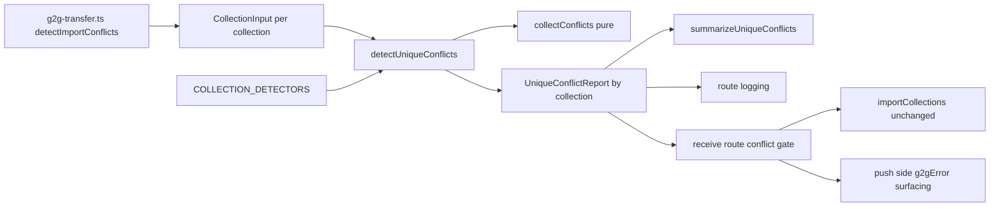
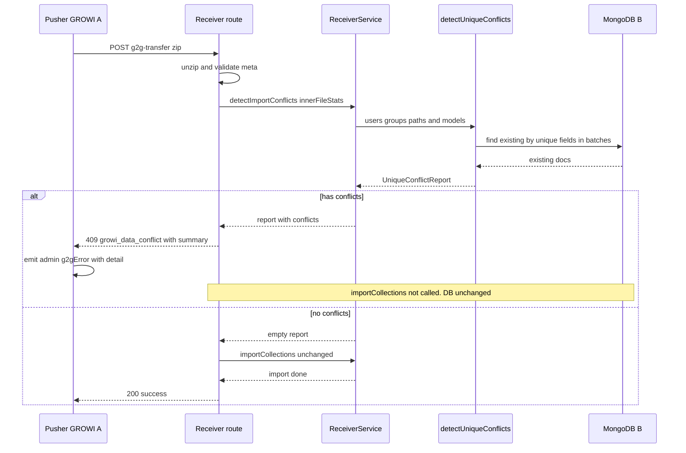
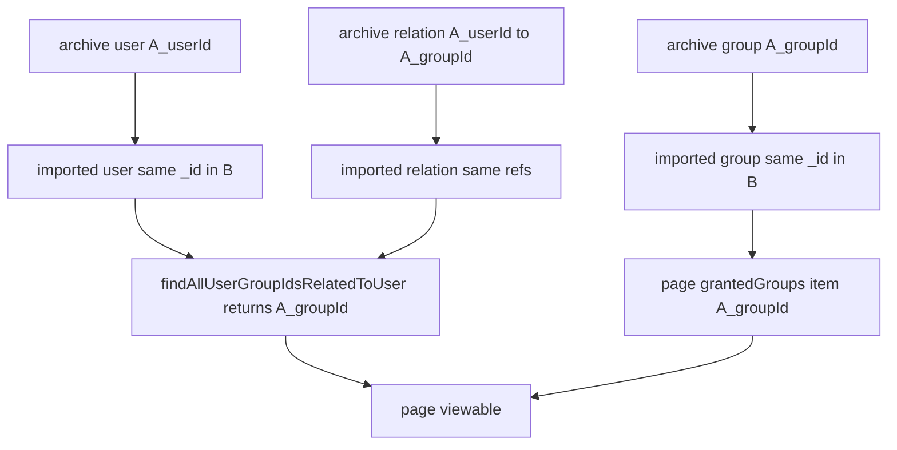

# Design Document

## Write / Don't-Write Test

このドキュメントを将来編集するときの判定基準。**読者がコードとテストファイルを読めば再現できる内容は書かない**。

| 書く | 書かない |
|---|---|
| 調査して初めてわかった事実(コードをざっと読んだだけでは自明でない挙動、外部ライブラリの隠れた振る舞い) | 関数シグネチャ・ファイル配置図・「どのファイルに何があるか」 |
| 異例な設計を選んだ理由(**特に、試して却下した案とその理由**) | 素直な実装の素直な説明 |
| 自動テストが**カバーできない**残差 | どのテストが何をカバーしているかの一覧(spec/testファイルを読めばわかる。書くと陳腐化する) |
| コードから再現できない手動検証の手順(再現環境の作り方、確認する観点、合否を分ける基準値) | 差分の有無・実装時期などの時点情報 |

迷ったら書かない。

## Overview

**Purpose**: G2G（GROWI-to-GROWI）転送で、取り込むアーカイブと転送先 GROWI の既存データとの間に `users` / `usergroups` / `externalaccounts`（`providerType` + `accountId` の複合キー）/ `externalusergroups`（`externalId` 単体、`name` + `provider` の複合キー）の一意制約衝突があるとき、それを**取り込み開始前に検知して転送を中断し、操作者へ具体的に通知**する。これにより、issue #10151 のサイレントなデータ破壊（insert 失敗をログに残しつつ続行し、グループ公開ページを閲覧不能にする）を止める。SSO/LDAP/SAML 連携を使う環境では、この破壊が `username`/`email` とは独立した外部識別子系（`externalaccounts`/`externalusergroups`）経由でも起こり得るため、検知対象にこの 2 コレクションを含む。

**Users**: G2G 転送でデータ移行を行う GROWI 管理者。SSO/LDAP/SAML 連携を使う環境も含め、転送が「成功」表示なのにグループ公開ページが開けない・ログインできない、という原因不明の状態に陥らなくなる。

**Impact**: 受信側は unzip・meta 検証の直後に無条件で `importCollections` を呼ばず、その間に**衝突検知ゲート**を1段挟む。衝突が無ければ従来どおり全コレクションを取り込む（挙動不変）。衝突があれば取り込みを一切開始せず、衝突情報を含むエラーを push 側へ返し、push 側が転送元管理者へ WebSocket で通知する。検知対象コレクションが増えても、この中断ゲート・通知経路自体は変わらない。一意キーの宣言（コレクション→フィールドの組）を1箇所にまとめ、単一/複合の両方を同じ形（`UniqueKeySpec`）で表現することで、将来コレクションが増えてもゲート・通知の骨格を変更せずに済む。

本設計は research.md の Decision（near-term は Option A＝事前検知＋中断を採用。Option B は典型シナリオを直せず不採用、Option C＝ID 再マッピングは取り込みの直列化が前提で将来拡張）に基づく。検知対象の一般化（`UniqueKeySpec` による複合キー対応）も research.md の Decision に基づく。

### Goals
- 取り込み開始前に `users`（`username` / `email` / `slackMemberId`）・`usergroups`（`name`）・`externalaccounts`（`providerType` + `accountId`）・`externalusergroups`（`externalId`、`name` + `provider`）の一意制約衝突を検知する（要件 1）。
- 複合キーを「フィールドの組すべてが一致」で正しく判定し、片方だけの一致を衝突としない（要件 1）。
- 衝突時は書き込みを一切行わず、転送を成功扱いにせず、操作者へ実行可能な通知を返す（要件 2, 3）。
- 衝突が無い転送では従来の正常系（全コレクション取り込み・グループアクセス維持・SSO/LDAP/SAML ログインの維持）を変えない（要件 4）。
- 検知とアクセス維持を実データベース上で検証可能にする（要件 5）。
- 一意キーの宣言を1箇所にまとめ、将来コレクションが増えても検知の骨格（orchestrator・通知・ログ）を変更せずに済む形にする。
- 宣言と実際のデータモデルの一意制約とのドリフトを検出する試験を用意する（要件 6）。

### Non-Goals
- 一意制約衝突があっても転送を自動的に成功させる完全修復（ID 再マッピング＝Option C）。将来拡張として Migration Strategy 節に方針のみ残す。
- 管理画面からの手動 GROWI アーカイブ取り込み（zip アップロード）UI への検知組み込み。中核ロジックは経路非依存の純関数に保つが、手動 UI 対応は本 spec 対象外。
- 取り込みモード（`insert` / `upsert` / `flushAndInsert`）の意味変更、MongoDB 一意インデックス定義の変更。
- `externalusergrouprelations`（外部連携グループとユーザーの関係コレクション）の衝突検知。一意インデックスが存在しない（`usergrouprelations` と同様）。
- G2G の「引っ越し（移行先を置き換える）」モードが算出する「置き換え対象集合」（`deriveReplaceTargets`）の変更。この算出はコレクション名をハードコードせず宣言データから汎用的に導かれており、検知対象コレクションが増えてもそのまま正しく動作する。

## Boundary Commitments

### This Spec Owns
- **一意キー宣言の一般化**: 単一/複合キーを同じ形（`UniqueKeySpec<T> = { label, fields }`）で表現し、コレクションごとの宣言（`users` / `usergroups` / `externalaccounts` / `externalusergroups`）を1箇所（`COLLECTION_DETECTORS`）にまとめる。
- **衝突検知ロジック**: アーカイブ側ドキュメントと転送先既存ドキュメントを突き合わせ、「一意キーのフィールドの組がすべて一致し、かつ `_id` が異なる」ものを衝突として算出する純粋な判定（`collectConflicts`）と、それを駆動する I/O（アーカイブ JSON の読み取り・既存データ照会）。
- **衝突検知ゲート**: G2G 受信フローの「unzip・meta 検証済み」〜「`importCollections` 呼び出し」の間に挟む中断判定。検知対象コレクションが増えても、ゲートの位置・応答コード・通知経路は変わらない。
- **衝突の通知契約**: 受信側が返すエラー（コード `growi_data_conflict` と衝突サマリ）と、push 側がそれを転送元管理者へ届ける WebSocket メッセージの形。`UniqueConflictReport` はコレクション名→衝突配列の汎用形（`conflictsByCollection`）を持ち、消費側（通知生成・ログ出力）がコレクション数の増減に追随不要になっている。
- **`externalaccounts` / `externalusergroups` の抽出・照会アダプタ**: アーカイブ JSON からの一意フィールド抽出、既存データの照会（既存の `users` / `usergroups` 用アダプタと同じパターン）。
- **一意キー宣言と実際のデータモデルのドリフト検出試験**。

### Out of Boundary
- ページ閲覧可否判定（`PageQueryBuilder` / `grantedGroups.item` 照合）。本設計は変更しない。「アクセス維持」は 3 者（users / usergroups / usergrouprelations）が整合取り込みされる結果として成立する。
- `ImportService.import` / `execUnorderedBulkOpSafely` の insert 挙動そのもの。これは変えず、その手前でゲートする。
- 手動取り込み経路の UI・ルート。
- Option C（ID 再マッピング）とその前提となる取り込みの直列化。
- `externalusergrouprelations`（外部連携グループとユーザーの関係コレクション）の検知。一意制約が存在しない。
- G2G の「引っ越し」モードが算出する「置き換え対象集合」（`deriveReplaceTargets`）そのもの。宣言データから汎用的に導かれており、本 spec の検知対象拡張の影響を受けない。

### Allowed Dependencies
- `ImportService`（`baseDir` / `getFile` によるアーカイブファイルパス解決のみ利用。取り込み挙動は変更しない）。
- Mongoose モデル `User` / `UserGroup`（既存データの一意フィールド照会）、`mongoose.model('ExternalAccount')`（モデルレジストリ経由、`User` の取得と同じ手法。`ExternalAccount` はデフォルトエクスポートを持たない）、`ExternalUserGroup`（デフォルトエクスポート）。
- G2G 既存の通知経路（`admin:g2gError` WebSocket、`ErrorV3` / `G2GTransferError`）。
- `growiBridgeService.parseZipFile` が返す `innerFileStats`（`{ fileName, collectionName }`）。
- G2G の「引っ越し」モードが渡す `replaceTargetCollections`（置き換え対象コレクションはこのゲートでの検知をスキップする。要件 1.6）。

### Revalidation Triggers
- `users` / `usergroups` / `externalaccounts` / `externalusergroups` の一意インデックス定義が変わったとき（宣言側の追随が必要。ドリフト試験が検出する）。
- 一意キー宣言のリスト（`COLLECTION_DETECTORS`）が実際のデータモデルの一意制約からずれたとき（ドリフト試験が機械的に検出する）。
- `UniqueConflictReport` の形が再度変わったとき（消費側の追随が必要）。
- 新しいコレクションが一意制約を持って転送対象に加わったとき（宣言に1エントリ追加するだけで済むことを維持する）。
- G2G 受信フローの順序（unzip → validate → importCollections）が変わったとき（ゲートの差し込み位置が動く）。
- 取り込みが並行から直列に変わったとき（Option C の前提が満たされ、本 spec の中断方針を再検討できる）。
- push 側 `startTransfer` のエラーハンドリング・WebSocket メッセージ契約が変わったとき（通知の届け方に影響）。
- **`externalaccounts` の Mongoose→Prisma 移行（`.claude/rules/model.md`）が完了し、索引作成の責務が Mongoose スキーマから外れたとき。** ドリフト試験（要件 6）は現時点で `Model.schema.indexes()`（Mongoose のスキーマ定義）を「実際の一意制約」の参照先として使うが、`external-account.ts` のスキーマは「全モデルの移行完了後に削除する」と明記された暫定コードである。全モデルの移行が完了する段階に達するときは、ドリフト試験の参照先を Mongoose スキーマから `prisma/schema.prisma` の `@@unique` 定義へ切り替える必要がある。

## Architecture

### Existing Architecture Analysis
- **受信フロー**（`server/routes/apiv3/g2g-transfer.ts` `receiveRouter.post('/')`）: body parse → `importService.unzip` + `growiBridgeService.parseZipFile`（`innerFileStats`）→ `importService.validate(meta)` → `g2gTransferReceiverService.getImportSettingMap` → `g2gTransferReceiverService.importCollections`。**この最後の呼び出しの直前が唯一の非破壊な差し込み点**（アーカイブは tmp 展開済み・DB 書き込みはまだ 0）。
- **取り込み**（`server/service/import/import.ts`）: `insert` 時 `bulk.insert()`、`execUnorderedBulkOpSafely` が一意違反をサイレントに続行。コレクション取り込みは**並行**（`import()`）。
- **一意制約**: `users` = `username` / `email`(sparse) / `slackMemberId`(sparse)（`models/user/index.js`）、`usergroups` = `name`（`models/user-group.ts`）、`externalaccounts` = `providerType` + `accountId` の複合キー（`models/external-account.ts`。デフォルトエクスポートを持たず `mongoose.model('ExternalAccount')` で取得する。Mongoose→Prisma 移行の暫定コードで、索引作成のためだけに残置）、`externalusergroups` = `externalId` 単体、および `name` + `provider` の複合キー（`features/external-user-group/server/models/external-user-group.ts`）。
- **通知**: push 側 `startTransfer`（`service/g2g-transfer.ts`）は fire-and-forget、失敗時に `admin:g2gError` を転送元 admin socket へ emit。受信側の応答本文（衝突サマリ）を読んで具体化する。

### Architecture Pattern & Boundary Map

パターン: **既存パイプラインへの前段ゲート挿入（pure-core + thin-adapter）**。検知の中核は I/O を持たない純関数、その外周に「アーカイブ読み取り」「既存データ照会」の薄いアダプタ、さらに外周に受信サービスのメソッドとルートのゲートを置く。依存方向は左（型・純関数）→右（I/O・サービス・ルート）で、逆流させない。呼び出し側（`g2g-transfer.ts`）は「どのコレクションを、どの JSON パス・モデルで検知するか」だけを配列（`CollectionInput[]`）で渡し、「そのコレクションの一意キーが何か」は検知モジュール内の宣言（`COLLECTION_DETECTORS`）が単一の情報源として持つ。



**Architecture Integration**:
- Selected pattern: pure-core + thin-adapter（コーディング規約「framework wrapper から純関数を抽出」「executor は work-set を引数で受け取る」に沿う。純関数はアーカイブ/既存の配列を受け取り、データセットを import しない）。宣言駆動の executor: 呼び出し側は work-set（`CollectionInput[]`）だけを渡し、一意キーの意味は検知モジュール内部の宣言が持つ。
- Domain/feature boundaries: 一意キーの意味（どのフィールドの組で一意か）は import ドメイン（`server/service/import/`）が持つ。G2G 固有の配線（ファイルパス解決・モデル取得・通知）は `g2g-transfer.ts` / ルート側に置く。
- Existing patterns preserved: `ImportService` の取り込み挙動、`ErrorV3` / `G2GTransferError`、`admin:g2gError` 通知経路、`replaceTargetCollections` の受け渡し方式。
- New components rationale: 検知は経路非依存で再利用可能・実 DB テスト可能にするため独立モジュールにする。`UniqueKeySpec` と `CollectionInput` は、単一/複合キーとコレクション数の増減を同じ抽象で吸収する。
- Steering compliance: named export、`import type`、no-extension import、English comments、型アサーション回避（テストは `mock<T>()`）、宣言された集合を executor が引数で受け取る。

## File Structure Plan

検知の純ロジック/I-O は `service/import/detect-unique-conflicts.ts` に集約し、G2G 固有の配線(ファイルパス解決・通知)は `g2g-transfer.ts` とルート側に置く。境界は import ドメイン(経路非依存で再利用可能)と G2G ドメイン(配線)の分離。

### Modified Files
- `apps/app/src/server/service/g2g-transfer.ts` — `Receiver` インターフェースと `G2GTransferReceiverService` に `detectImportConflicts(innerFileStats)` を追加（`innerFileStats` から `users` / `usergroups` / `externalaccounts` / `externalusergroups` の JSON パスを解決し、対応する Mongoose モデルを取得して `CollectionInput[]` を組み立て、`detectUniqueConflicts` を呼ぶ）。`G2GTransferPusherService.startTransfer` のアーカイブ POST の catch で、応答本文の衝突エラーを判別し具体的な `admin:g2gError` を emit。
- `apps/app/src/server/routes/apiv3/g2g-transfer.ts` — 受信ルートの `getImportSettingMap` と `importCollections` の間に衝突検知ゲートを追加。衝突ありなら `importCollections` を呼ばず `res.apiv3Err(new ErrorV3(summary, 'growi_data_conflict'), 409)` を返す（衝突サマリを本文に含める）。衝突時のログ出力は `conflictsByCollection` からコレクションごとの件数を汎用的に集計する。
- `apps/app/src/server/models/vo/g2g-transfer-error.ts` — `G2GTransferErrorCode` に `DATA_CONFLICT` を追加（型付きエラーで扱う場合の識別子）。
- `apps/app/src/client/components/Admin/G2GDataTransfer.tsx` — `socket.on('admin:g2gError', ({ key, message }) => ...)` を `message`（衝突詳細）も表示するよう更新。
- `apps/app/src/client/../locales`（`admin` 名前空間） — 衝突通知の見出しキー（例 `admin:g2g:error_data_conflict`）を英語で追加。翻訳は後続タスク。

### New Files
- `apps/app/src/server/service/import/detect-unique-conflicts.drift.spec.ts` — 一意キー宣言（`USER_UNIQUE_KEYS` / `GROUP_UNIQUE_KEYS` / `EXTERNAL_ACCOUNT_UNIQUE_KEYS` / `EXTERNAL_USER_GROUP_UNIQUE_KEYS`）と、各モデルの `schema.indexes()`（`unique: true` のもの）を突き合わせる試験（要件 6）。DB への接続は不要（スキーマの静的な構造を読むだけ）。

> 各ファイルは単一責務: 検知の純ロジック/I-O は `detect-unique-conflicts.ts`、G2G 固有の配線は `g2g-transfer.ts` とルート、通知表示は client。

## System Flows

### 受信側の衝突検知ゲート（中断シーケンス）



ゲート判定は書き込み前に完結するため、中断時に転送先 DB は無変更（要件 2.1, 2.4）。衝突なしの分岐は現行と同一（要件 4.3）。

### グループアクセスが維持される条件（衝突なし時の ID の流れ）



衝突が無ければ 3 者が同一 `_id` で取り込まれ、`relatedUser = A_userId` の関係がそのまま生き、閲覧判定が成立する（要件 4.1, 4.2）。issue #10151 は「`ArchiveUser` の insert が失敗して `ImportUser` が欠落」する経路であり、ゲートがそれを事前に弾く。

## Components and Interfaces

| Component | Domain/Layer | Intent | Req Coverage | Key Dependencies (P0/P1) | Contracts |
|-----------|--------------|--------|--------------|--------------------------|-----------|
| detect-unique-conflicts | import service | 複合キー対応の衝突判定＋4コレクションの宣言＋読み取り/照会 | 1, 2.4, 5, 6 | User/UserGroup/ExternalAccount/ExternalUserGroup models (P0), JSONStream (P1) | Service |
| summarize-unique-conflicts | import service | 汎用化したレポートからの通知文生成 | 3 | detect-unique-conflicts (P0) | Service |
| ReceiverService.detectImportConflicts | g2g service | 4コレクションのパス解決＋`CollectionInput` 組み立て＋検知駆動 | 1.6, 2 | detect-unique-conflicts (P0), ImportService.baseDir (P1) | Service |
| receive route conflict gate | apiv3 route | 中断判定＋エラー応答 | 2, 4.3 | ReceiverService (P0), ErrorV3 (P0) | API |
| pusher error surfacing | g2g service | 衝突詳細を転送元へ通知 | 2.2, 3 | admin socket (P0), axios error body (P0) | Event |
| g2g conflict i18n + client toast | client | 通知の表示 | 3 | next-i18next (P1) | State |

### Import service

#### detect-unique-conflicts

| Field | Detail |
|-------|--------|
| Intent | 単一/複合の一意キーをコレクションごとに宣言し、フィールドの組一致で衝突を判定する |
| Requirements | 1.1, 1.2, 1.3, 1.4, 1.5, 1.6, 1.7, 1.8, 1.9, 1.10, 2.4, 6.1, 6.2 |

**Responsibilities & Constraints**
- `UniqueKeySpec<T> = { label: string; fields: readonly (keyof T & string)[] }`。単一フィールドの既存キーは `fields` が1要素の配列になる。
- 「一意キーのフィールドの組がすべて一致し、かつ `_id` が異なる」ものだけを衝突とする（要件 1.5）。キーのいずれかのフィールドが空値のドキュメントは照合しない（sparse フィールドの空値除外を複合キーへ拡張したもの）。
- 既存データは read-only 照会のみ。書き込み・更新を一切行わない（要件 2.4）。
- 純関数 `collectConflicts` はデータセットを import せず、比較対象を引数で受け取る（executor は work-set を引数で受け取る規約）。
- コレクションごとの一意キー宣言（`USER_UNIQUE_KEYS` / `GROUP_UNIQUE_KEYS` / `EXTERNAL_ACCOUNT_UNIQUE_KEYS` / `EXTERNAL_USER_GROUP_UNIQUE_KEYS`）と抽出関数は、`declareDetector<T>` ヘルパーで `CollectionDetector`（`{ collection, detect(jsonPath, lookup) }`）としてまとめ、`COLLECTION_DETECTORS` に集約する。呼び出し側（orchestrator）はコレクション名で対応する `CollectionDetector` を探して `detect` を呼ぶだけで、コレクション名による分岐を持たない。

**Dependencies**
- Outbound: Mongoose `User` / `UserGroup` / `ExternalAccount`（`mongoose.model('ExternalAccount')` 経由） / `ExternalUserGroup` モデル — 既存一意フィールドの照会 (P0)
- External: `JSONStream`（既存依存）— アーカイブから一意フィールドのみ stream 抽出 (P1)

**Contracts**: Service [x]

##### Service Interface

`detect-unique-conflicts.ts` が公開する契約:
- `UniqueKeySpec<T>`、`CollectionName`（`'users' | 'usergroups' | 'externalaccounts' | 'externalusergroups'`）、`UniqueFieldConflict`（衝突コレクション種別・一意フィールド名またはラベル・衝突値・アーカイブ側 `_id`・既存側 `_id` を持つ）、`UniqueConflictReport`、`hasConflicts`。
- `collectConflicts<T extends { _id: string }>(collection, archiveDocs, existingDocs, keys: readonly UniqueKeySpec<T>[]): UniqueFieldConflict[]` — 純関数。フィールドの組一致で衝突を列挙する。
- `CollectionInput = { collection: CollectionName; jsonPath: string | null; lookup: ExistingDocumentLookup }` — 呼び出し側（`g2g-transfer.ts`）がコレクションごとに渡す入力。`lookup` は `toLookup(model)`（このモジュールが公開する）で作る。
- `detectUniqueConflicts(input: { collections: readonly CollectionInput[]; replaceTargetCollections?: ReadonlySet<string> }): Promise<UniqueConflictReport>` — orchestrator。`collections` を走査し、`jsonPath` が `null`、または `replaceTargetCollections` に含まれるコレクションはスキップする（要件 1.6）。
- `UniqueConflictReport = { conflictsByCollection: ReadonlyMap<CollectionName, readonly UniqueFieldConflict[]> }`。スキップしたコレクションのキーは Map に存在しない（空配列ではなく不在）。`hasConflicts` は Map の全値を走査する。

- Preconditions: 渡す JSON パスは unzip 済みで読み取り可能。`lookup` は対象コレクションへの読み取り専用アクセスのみ持つ。null は「そのコレクションは転送対象外」を意味する。
- Postconditions: 返り値は衝突の全列挙。既存データは無変更。
- Invariants: `archiveId !== existingId`（値一致かつ同一 `_id` は含めない）。キーのいずれかのフィールドが空値のドキュメントは照合しない。

**Implementation Notes**
- Integration: `collectConflicts` は Map ベース（既存側を合成キーで索引）で N+1 を避ける。単一フィールドキーの既存候補取得は `find({ [field]: { $in: values } })` によるバッチ取得、複合キーはフィールドの組（タプル）ごとの完全一致条件をバッチにまとめた `$or` クエリで取得する（低カーディナリティなフィールドを含む複合キーで転送先コレクションのほぼ全件を取得しないため）。
- Validation: sparse フィールド・複合キーの空値除外、同一 `_id` 除外、複合キーの部分一致の非衝突を unit/integ で固定（要件 1.5, 1.10）。
- Risks: `mongoose.model('ExternalAccount')` は、そのモデルファイルが一度もインポートされていないプロセスでは `MissingSchemaError` を投げる。G2G 受信ルートが動く実行時にはサーバ起動時のモデル読み込みで解決済みだが、テストでは `~/server/models/external-account` を明示的にインポートする必要がある。
- アーカイブが巨大な場合のメモリ/時間。まず正しさ優先、性能は Performance 節の方針で必要時に最適化。

#### summarize-unique-conflicts

| Field | Detail |
|-------|--------|
| Intent | 汎用化した衝突レポートから、種別・件数・代表例を含む通知文を生成する |
| Requirements | 3.1, 3.2 |

**Responsibilities & Constraints**
- `conflictsByCollection` を走査し、コレクションごとに既存と同じ形式（件数・代表例・残数）の説明文を生成する。コレクションの追加時にこの関数のコード自体は変更不要。

**Contracts**: Service [x]

### G2G service

#### ReceiverService.detectImportConflicts

| Field | Detail |
|-------|--------|
| Intent | `innerFileStats` から4コレクションの JSON パスを解決し、`CollectionInput[]` を組み立てて検知を駆動する |
| Requirements | 1.6, 2.1, 2.4 |

**Responsibilities & Constraints**
- `innerFileStats`（`{ fileName, collectionName }[]`）から `users` / `usergroups` / `externalaccounts` / `externalusergroups` のファイル名を引き、`importService.getFile(fileName)` でパスを解決する。該当が無ければ `null` を渡す（要件 1.6）。
- `mongoose.model('ExternalAccount')` と `ExternalUserGroup`（デフォルトエクスポート）を取得し、`toLookup` で `CollectionInput.lookup` を作る。
- 検知のみを行い、取り込みは行わない。返り値 `UniqueConflictReport` を呼び出し元（ルート）へ渡す。

**Dependencies**
- Outbound: `detectUniqueConflicts` (P0)、`getImportService().baseDir` / `getFile` (P1)、Mongoose `User` / `UserGroup` / `ExternalAccount` / `ExternalUserGroup` (P0)

**Contracts**: Service [x]

##### Service Interface
```typescript
// interface Receiver に追加
detectImportConflicts(
  innerFileStats: { fileName: string; collectionName: string }[],
): Promise<UniqueConflictReport>;
```
- Preconditions: `importService.unzip` 済み。
- Postconditions: DB 無変更。衝突の全列挙を返す。

#### PusherService.startTransfer (error surfacing)

| Field | Detail |
|-------|--------|
| Intent | 受信側の衝突エラーを転送元管理者へ具体的に通知する |
| Requirements | 2.2, 3.1, 3.2, 3.3 |

**Contracts**: Event [x]

##### Event Contract
- Published events: `admin:g2gError`（既存）に `message` を追加。
  - Payload: `{ key: 'admin:g2g:error_data_conflict', message: string }`。`message` は衝突サマリ（種別・件数・代表的な衝突フィールド/値）。
- Trigger: アーカイブ POST の catch で `err.response?.data` の code が `growi_data_conflict` の場合。
- Delivery: 転送元 admin socket（既存経路）。順序/再送保証は既存どおり。

**Implementation Notes**
- Integration: 現状 catch は固定 key を emit。code 判別を追加し、衝突時は専用 key + `message` を emit。それ以外は従来の汎用エラー。
- Risks: `err.response` の形（apiv3Err は `{ errors: [{ message, code }] }` を返す）に依存。実装時に応答本文の形を要確認（research.md リスク参照）。

### apiv3 route

#### receive route conflict gate

| Field | Detail |
|-------|--------|
| Intent | 検知結果で取り込みを中断し、衝突サマリ付きエラーを返す |
| Requirements | 2.1, 2.2, 2.3, 4.3 |

**Contracts**: API [x]

##### API Contract
| Method | Endpoint | Request | Response | Errors |
|--------|----------|---------|----------|--------|
| POST | /_api/v3/g2g-transfer/ | 既存（zip + collections + optionsMap + operatorUserId + uploadConfigs） | 既存 200 | 409 `growi_data_conflict`（衝突あり）／既存 500 系 |

- 配置: `getImportSettingMap` の後、`importCollections` の前。
- 衝突あり: `importCollections` を呼ばず `res.apiv3Err(new ErrorV3(summary, 'growi_data_conflict'), 409)`。`summary` に種別・件数・代表衝突を含める。
- 衝突なし: 従来どおり `importCollections`（挙動不変・要件 4.3）。

### Client

#### G2GDataTransfer toast + i18n

| Field | Detail |
|-------|--------|
| Intent | 衝突通知を転送元管理者に見せる |
| Requirements | 3.1, 3.2, 3.3 |

**Contracts**: State [x]

**Implementation Notes**
- `socket.on('admin:g2gError', ({ key, message }) => toastError(...))` に更新し、翻訳した見出し（key）に加えて `message`（衝突詳細）を表示する。
- i18n: `admin:g2g:error_data_conflict` を英語で追加（見出し＋解消指針の骨子。要件 3.3）。他言語は後続タスク（i18n はゲートにしない）。

## Data Models

### Logical Data Model（検知が読むフィールドのみ）
- `users`: `_id`, `username`(unique), `email`(unique, sparse), `slackMemberId`(unique, sparse)。検知はこの 4 フィールドのみ抽出（本文・パスワード等は読まない）。
- `usergroups`: `_id`, `name`(unique)。
- `externalaccounts`: `_id`, `providerType`, `accountId`(複合 unique)。本文・トークン等は読まない。
- `externalusergroups`: `_id`, `externalId`(unique)、`name` + `provider`(複合 unique)。
- 参照整合の観点: 衝突なし取り込みでは `usergrouprelations.relatedUser`→`users._id`、`relatedGroup`→`usergroups._id`、`pages.grantedGroups[].item`→`usergroups._id`、`externalaccounts`→`users._id`、`externalusergrouprelations`→`externalusergroups._id` が同一 `_id` で保たれる（本設計は照会のみで、これらを変更しない）。

### Data Contracts & Integration
- `UniqueConflictReport` / `UniqueFieldConflict`（上記 Service Interface）。API 応答本文の衝突サマリはこの report から生成する文字列（値はそのまま露出せず、代表例＋件数に留めることを許容。プライバシー観点は Security 参照）。

## Error Handling

### Error Strategy
- **Fail fast, non-destructive**: 衝突は書き込み前に検知し中断する。中断時に DB は無変更。
- 検知処理自体の失敗（ファイル読み取り不能・DB 照会失敗）は、サイレントに取り込みへ進まず、受信側 500 系エラーとして扱う（＝安全側に倒す。壊れたデータを作るより中断する）。

### Error Categories and Responses
- **Business Logic (409) — 衝突検知**: `growi_data_conflict`。取り込み未実行。push 側が `admin:g2g:error_data_conflict` を emit。message に種別・件数・解消指針。
- **System (5xx) — 検知処理の失敗**: 既存の `mongo_collection_import_failure` 等と同様に 500 で返し、取り込みへ進めない。
- 既存の insert サイレント続行は G2G 経路では到達しない（ゲートが手前で弾く。要件 2.3）。

### Monitoring
- 衝突検知時は衝突件数・種別を logger に出す（値そのものは出さない）。

## Testing Strategy

検知の中核(衝突あり/なし/同一 `_id`/sparse 空値/複合キーの部分一致)と、衝突なし時の関係解決(グループ公開ページ・SSO/LDAP/SAML ログインが当該ユーザーから到達可能であること)は、モック単体ではなく実 DB(レプリカセット rs0)を読み直す結合試験で合否を判定する。宣言と実際のデータモデルの一意制約とのドリフトは、DB 接続不要な `detect-unique-conflicts.drift.spec.ts` で検証する(要件 6)。個々のテストケースと対応要件は `detect-unique-conflicts.spec.ts` / `.integ.ts` / `.drift.spec.ts` を参照(spec/testファイル自体が最新の一覧)。

E2E/UI テストは本 spec では必須としない(G2G の 2 インスタンス E2E は重い)。通知表示は client の単体で担保する。

## Security Considerations
- 検知は `username` / `email` / `slackMemberId` / `name` / `providerType` / `accountId` / `externalId` / `provider` のみ読む。パスワードハッシュ・トークン等は読まない。
- 通知の `message` に衝突値（email、accountId 等）を大量露出しない。**件数＋種別＋代表例（先頭数件）**に留める。`providerType` / `accountId` はメールアドレスと同様に運用上の識別情報であり、`email` / `slackMemberId` と同じ扱い（件数+代表例）で十分とする。操作は admin 限定経路（既存 `adminRequired`）。

## Performance & Scalability
- 既存側照会は、単一フィールドの一意キー（`username` / `email` / `slackMemberId` / `name` / `externalId`）ではフィールドごとの `$in` バッチ（値集合はアーカイブから stream 抽出）、複合の一意キー（`providerType`+`accountId` / `name`+`provider`）ではアーカイブ側が実際に使っているタプルごとの完全一致条件をバッチにまとめた `$or` クエリで取得する（低カーディナリティなフィールドを含む複合キーで `$in` を使うと転送先コレクションのほぼ全件に一致してしまうため、実装 Notes・research.md 参照）。いずれの方式でも全ユーザーを丸ごとメモリに載せない。
- 計算量は「アーカイブ側ユニーク値数 × 定数（Map 索引）」。まず正しさ優先。数万ユーザー規模で問題が出た場合はバッチサイズ調整で対応（本 spec は目標値を課さない）。

## Migration Strategy
- スキーマ変更なし・データ移行なし。既存インデックス定義に依存するのみ。
- **将来拡張（Option C, 本 spec 対象外）**: 一意衝突があっても転送を成功させるには、(1) 取り込みを users/usergroups → usergrouprelations/pages の依存順に**直列化**し、(2) 衝突ユーザー/グループの `archiveId → existingId` 対応表を作り、(3) 後続コレクションの `relatedUser`/`relatedGroup`/`grantedGroups.item`/`grantedUsers` 等を貼り替える。本 spec の `collectConflicts` はこの対応表の素になり得る（`archiveId`/`existingId` を保持済み）。直列化は `ImportService.import` の並行実行（本設計 Existing Architecture Analysis 参照）を変える必要があり、別 spec とする。
