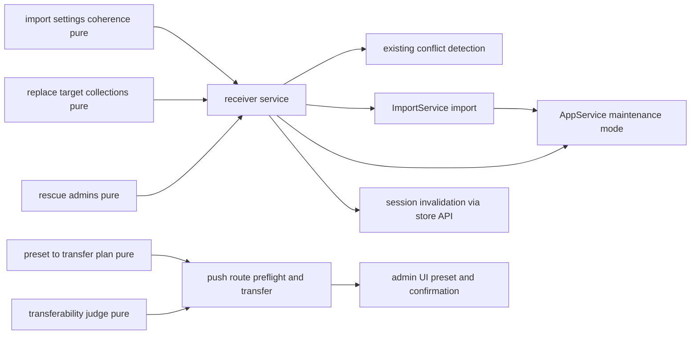
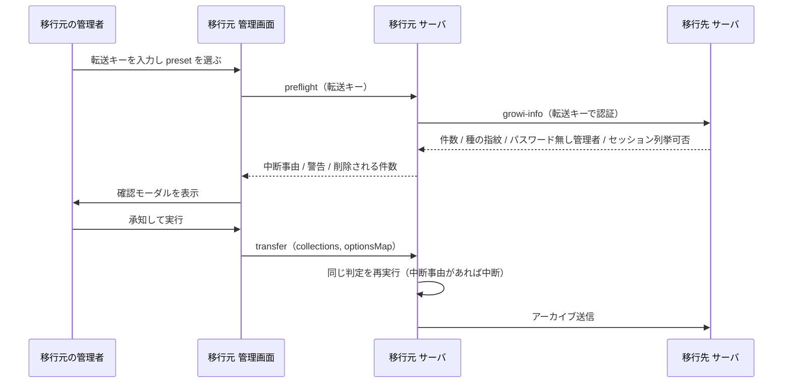
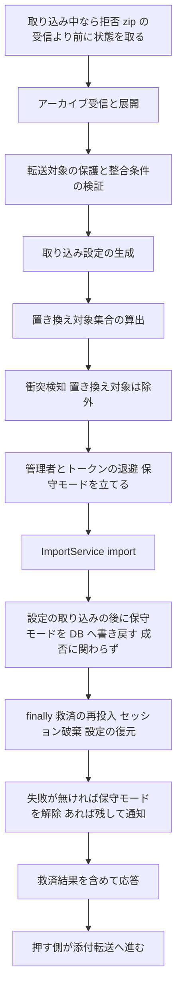
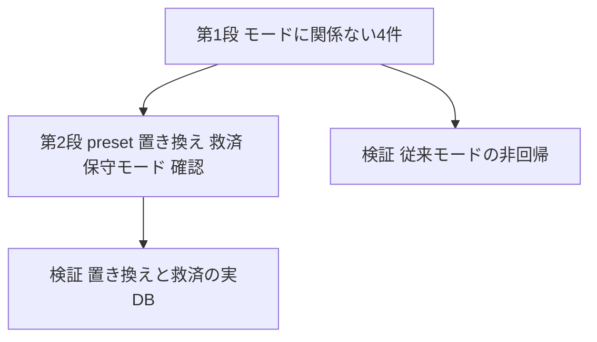

# Technical Design Document

## Write / Don't-Write Test

このドキュメントを将来編集するときの判定基準。**読者がコードとテストファイルを読めば再現できる内容は書かない**。

| 書く | 書かない |
|---|---|
| 調査して初めてわかった事実(コードをざっと読んだだけでは自明でない挙動、外部ライブラリの隠れた振る舞い) | 関数シグネチャ・ファイル配置図・「どのファイルに何があるか」 |
| 異例な設計を選んだ理由(**特に、試して却下した案とその理由**) | 素直な実装の素直な説明 |
| 自動テストが**カバーできない**残差 | どのテストが何をカバーしているかの一覧(spec/testファイルを読めばわかる。書くと陳腐化する) |
| コードから再現できない手動検証の手順(再現環境の作り方、確認する観点、合否を分ける基準値) | 差分の有無・実装時期などの時点情報 |

迷ったら書かない。

## Overview

**Purpose**: G2G 転送に「引っ越し（移行先を置き換える）」を既定の意味として与え、初期セットアップ済みの移行先へも転送が完了するようにする。置き換えなら移行元の識別子がそのまま入るため、ユーザー・グループ・グループ関係・ページの対応が保たれ、一意制約の衝突は原理的に発生しない。

**Users**: G2G 転送で GROWI 間のデータ移行を行う管理者。転送を開始する前に、移行先で削除されるものとログインできなくなる条件を知り、承知したうえで実行する。

**Impact**: 転送の既定の意味が「移行先に追加する」から「移行先を置き換える」へ変わる。**引っ越しモードでは転送対象コレクションの選択も取り込み方法の選択も操作者に求めない**（1 つの意味に固定する）。従来の「既存データに追加する」は、対象コレクションの選択の自由度をそのまま維持する。取り込み方法の選択だけは、判定の対象になるコレクションから置き換えを外す（要件 1.4。これが無いと画面が提示した組み合わせをサーバが断る状態になる）。既存の衝突検知ゲート（spec `g2g-import-conflict-detection`）は従来モードの番人として働き続ける。

### Goals

- 転送方法を 2 つの preset から 1 回選ぶだけにし、引っ越し側からは選択肢を取り除く。
- 引っ越しモードで、移行先の既存データを取り除いてから取り込み、移行元のアクセス権の対応関係を保ったまま転送を完了させる。
- 移行先の管理者アカウントとそのアクセストークンを救済し、取り込みが失敗しても移行先に管理者が残る状態を保つ。
- 転送を開始する前に、削除される件数とログインできなくなる条件を提示し、明示的な確認を得る。
- 従来モードの挙動と、そこに入れた衝突検知ゲートを維持する。ただし要件 1.4 のとおり、判定の対象になるコレクションでは取り込み方法から置き換えを外す（要件 6.1 が挙げる 2 つ目の意図的な変更）。

### Non-Goals

- 移行元と移行先の識別子の再マッピング。置き換えでは不要になる。
- 手動 zip 取り込み画面の UI 変更。
- 従来モードに残る `externalaccounts` の複合一意制約の衝突検知。
- 移行先のファイルストレージに元からあった添付ファイルの削除。
- 取り込みの並行実行を直列化すること（D3 により不要と結論した）。
- 引っ越しモードで一部のコレクションだけを移すこと（部分転送が必要なら従来モードを使う）。

## Boundary Commitments

### This Spec Owns

- **転送方法の preset**: 引っ越しでは「転送可能なコレクションすべてを置き換える」1 通りに固定し、従来では今の自由度を保つ。preset から転送対象と取り込み方法を組み立てる規則。
- **取り込み方法の整合条件**: 「すべて置き換え」か「置き換えを含まない」のどちらかであることの判定。ただし取り込み方法がシステム側で強制されるコレクションは判定の対象から除く。
- **置き換え対象集合の算出**: 取り込み設定から「このコレクションは置き換えられるか」を導く規則。受信側のすべての判断（検知を止めるか、救済が必要か）はこの集合だけを入力にする。
- **取り込み中の保護の手順**: 取り込み前に保守モードを立て、設定の取り込みの後に DB へ書き戻し、取り込み後に失敗の有無で戻すか残すかを決める一連の手順。判定の仕組みそのものは持たない。
- **取り込みの同時実行の拒否**: 取り込みが走っている間に別の取り込みを開始させない。
- **移行先の管理者の救済**: 管理者ドキュメントとそのアクセストークンから、再投入する内容（付け替え後の `username`、除去する `email`、識別子の再割り当て）と操作者への通知内容を算出する規則、およびその再投入の実行。
- **転送前の点検の契約**: 受信側が返す自分の状態（件数・パスワードの種の指紋・パスワードを持たない管理者の数・セッションの列挙に対応するか）と、押す側が返す判定（中断事由と警告の一覧）。
- **転送対象に含めないコレクションの宣言**: 「GROWI のコンテンツではなく、その環境の運用状態を持つ」コレクションの一覧を 1 か所で宣言し、転送を組み立てる側と受信して拒否する側の双方がそれを参照する。
- **移行先の値を保つ設定キーの宣言**。

### Out of Boundary

- `ImportService` の取り込み挙動（`deleteMany` による置き換え、コレクション単位の並行実行、書き込みエラーを握って続行すること）。**ただし 3 点だけ変更する**: 設定の取り込みの後に保守モードを立て直すこと、取り込みの同時実行を拒否すること、失敗したコレクション名を戻り値で返すこと。いずれも G2G 固有ではない一般の修正で、管理画面からの zip 取り込みにも同じく効く。**エラーを握って続行するという方針そのものは変えない**（返すのは事実だけで、中断はしない）。
- ページの閲覧可否判定。「アクセス権が保たれる」は 3 者（users / usergroups / usergrouprelations）が整合して取り込まれた結果として成立する。
- 衝突検知の判定そのもの（`collectConflicts`）。本設計は「どのコレクションを検知対象にするか」を渡すだけで、判定の意味は変えない。
- **保守モードの判定の仕組み**（`isMaintenanceMode()` と 2 つの middleware）。既存のまま使う。呼び出し元も変更しない。
- 認証・認可の仕組み。preflight は既存の認可（押す側は管理者、受信側は転送キー）に載せる。
- 従来モードの**コレクション選択**の自由度。どのコレクションを転送するかは今のまま操作者が選ぶ。
  - **取り込み方法の選択は範囲内**（要件 1.4）。判定の対象になるコレクション（`configs` と `pages` 以外）から置き換えを外す。絞るのは G2G の画面だけで、手動 zip 取り込み画面の選択肢は変えない（それは上の Non-Goals のまま）。

### Allowed Dependencies

- `ImportService`（`baseDir` / `getFile` / `import`）。
- `AppService` の `startMaintenanceMode` / `endMaintenanceMode` / `isMaintenanceMode`（既存のまま呼ぶ）。
- Mongoose モデル `User` / `UserGroup` / `Page` / `AccessToken`（件数の取得、管理者とトークンの退避・再投入）。
- セッションの保存先。Redis のときは `express-session` の store API（`all` / `destroy`）、MongoDB のときは `sessions` コレクションを直接扱う（`connect-mongo` の `all()` はセッション ID を返さないため。D5 の節を参照）。
- 既存の衝突検知（`detectUniqueConflicts` とアーカイブからの一意フィールド抽出）。
- 既存の G2G 通知経路（`admin:g2gProgress` / `admin:g2gError`、`ErrorV3` / `G2GTransferError`）。
- `crowi.env.PASSWORD_SEED`（指紋の生成にのみ使用。値そのものは送出しない）。

### Revalidation Triggers

- `ImportService.import` の例外の扱いが変わったとき（救済を `finally` に置く前提が影響を受ける。D3）。
- `validateImportSettings` の強制ルールが変わったとき（整合条件の除外対象が変わる。D2）。
- `IDataGROWIInfo` の形が変わったとき（点検の契約が乗っている）。
- セッションストアの構成が変わったとき（Redis / MongoDB のどちらでも動く前提で store API を使っている）。
- パスワードのハッシュ生成が環境変数の種に依存しなくなったとき（救済したパスワードが有効であるという前提が崩れる）。
- 保守モードの旗の保存先が設定コレクションから移ったとき（設定の取り込み後に書き戻す手順が不要になる）。
- `getConfig()` が呼び出しごとに DB を読む形に変わったとき（書き戻しの意味が変わる）。
- `configs` の取り込み方法の強制が外れたとき（書き戻しの位置が変わる）。
- 実データベースに新しいコレクションが増えたとき（転送対象に含めるかの判断が必要になる）。

## Architecture

### Existing Architecture Analysis

- **押す側の転送開始**（`routes/apiv3/g2g-transfer.ts` pushRouter `POST /transfer`）: 転送キーの検証 → `askGROWIInfo(tk)` → `getTransferability(destGROWIInfo)` → 不可なら中断 → `startTransfer` を fire-and-forget で起動。**アーカイブ生成前に中断できる同期の点検が既に存在する**。
- **押す側の送信**（`service/g2g-transfer.ts` `startTransfer`）: アーカイブを POST し、**成功応答が返ってから**添付ファイルの転送に進む。POST が例外になるとその場で `throw` するため、添付は 1 件も転送されない。
- **受信側**（receiveRouter）: `POST /` が unzip → `validate(meta)` → `getImportSettingMap` → 衝突検知ゲート → `importCollections` → 応答。
- **取り込み**（`service/import/import.ts`）: `importCollection` は置き換え指定なら `collection.deleteMany({})` の後に挿入する。`import()` は全コレクションの取り込みを同時に起動し、コレクション単位の例外（`ImportingCollectionError`）を内部で捕捉して続行する。ただしループの後に `configManager.loadConfigs()` と、条件が合えば `normalizeAllPublicPages()` を捕捉せずに呼ぶ。
- **取り込み方法の強制**: サーバ側 `validateImportSettings` は `configs` に置き換えを強制する。クライアント側 `MODE_RESTRICTED_COLLECTION` は `users` に置き換えを許さず、`pages` に追加を許さない。
- **設定の扱い**: `importCollections` は `app:fileUploadType !== 'none'` のときだけアップロード設定を退避・復元し、そうでなければ移行元の値を採用する。条件付きの枠であり、無条件の枠ではない。
- **保守モードの適用範囲**: middleware は `apiV3Router`（`routes/index.js:207`）・apiv1（同 `:347`）・ページ（同 `:349`）に付き、SSR のページ props も同じ値を読む。一方 `/g2g-transfer/*` と `/app-settings/*` はどちらも `apiV3AdminRouter` 側（同 `:88`）なので、**保守モード中でも転送を受けられ、解除もできる**。判定はすべて `isMaintenanceMode()` 経由。
- **保守モードの旗の在処**: `app:isMaintenanceMode` は設定コレクションの値であり、そのコレクションは転送で必ず置き換えられる。さらに取り込みの最後に `configManager.loadConfigs()` が走る。

### Architecture Pattern & Boundary Map

パターン: **純粋な判定を核に置き、既存のオーケストレーションを薄く拡張する**（pure-core + thin-adapter）。preset の組み立て・整合条件・置き換え対象の算出・救済内容の算出・点検の判定はいずれも I/O を持たない純関数として置き、既存のサービスとルートはそれらを呼ぶだけにする。依存の向きは左（型・純関数）から右（サービス・ルート・UI）で、逆流させない。

**Architecture Integration**:

- 選択したパターン: 既存パイプラインへの拡張。新しい経路は preflight の 1 本だけで、転送の流れ自体は変えない。
- 責務の分離: 「どう転送するか」を決めるのは押す側（preset）、「何が置き換えられるか」を解釈するのは受信側（置き換え対象集合）。受信側は preset の名前を知らない。
- 維持する既存パターン: 純関数＋薄いアダプタ（spec `g2g-import-conflict-detection` で確立）、転送キーによる受信側認証、条件付きのアップロード設定の復元（そのまま残し、別枠を足す）。
- Steering 準拠: モード名で分岐せず宣言されたデータ（置き換え対象集合）で判断する、実行する側は対象集合を引数で受け取る（`.claude/rules/coding-style.md`）。

### 主要な設計判断

- **D1: 引っ越しモードから選択肢を取り除く。** 転送対象は「転送可能なコレクションすべて」に固定し、取り込み方法は全て置き換えに固定する。依存し合うコレクション（users / usergroups / usergrouprelations / externalaccounts）を一緒に選ばせる規則も、混在を避ける規則も、操作者からは見えなくなる（システムが常に満たす）。従来モードでは対象の選択の自由度を残すが、**混在を避ける規則だけは従来モードにも及ぶ**（要件 1.4）。画面から置き換えを外して混在を作れなくし、受信側の判定は画面を通らない呼び出しへの安全網として置く（要件 1.5）。
- **D2: 整合条件は、取り込み方法がシステム側で強制されるコレクションを除いて判定する。** 除かないと、従来モードの通常の転送（`configs` は置き換え・`users` は追加）が混在と判定されて止まる。
- **D3: 取り込みを直列化しない。** 要件 4.8 は、`importCollections` が `import()` の呼び出しを **`try/finally` で包み、救済・セッション破棄・設定の復元・保守モードの後始末を `finally` 側に置く**ことで満たす。`import()` はコレクション単位の例外を内部で捕捉するが、取り込み後の `normalizeAllPublicPages()` は捕捉していないため、「`import()` は必ず正常終了する」に依存してはならない。
- **D4: 受信側に preset を送らない。** wire に乗るのは従来どおり `collections` と `optionsMap` だけ。受信側は取り込み設定から置き換え対象集合を導く。
- **D5: 取り込み中の保護は既存の保守モードで行い、設定の取り込みの後に DB へ旗を書き戻す。** 判定の仕組み（`isMaintenanceMode()` と middleware）は変更しない。新しい概念も新しいモジュールも作らない。
  - **機構**: `getConfig()` はメモリに読み込んだ値を返すだけで、呼ぶたびに DB を読まない（`config-manager.ts:65-91`）。取り込みは `mongoose.connection.collection()` の生ドライバで書くので（`import.ts:206`）、設定コレクションを空にした時点では旗は落ちない。落ちるのは**次に `loadConfigs()` が走ったとき**で、それは取り込み末尾（`import.ts:176`）と、他の管理操作が `updateConfig` 系を呼んだとき（`config-manager.ts:113-137`）である。
  - **したがって書き戻しの役目は「DB から消えた旗を戻し、以後のあらゆる再読込が同じ値を読む状態にすること」**。設定の取り込みの後に一度書き戻せば、末尾の `loadConfigs()` も、その後の v5 正規化の間も、アップロード設定の復元による再読込も、同じ値を読む。
  - **書き戻す値は `true` 固定**（要件 2.9）。設定の取り込みは移行先のあらゆる設定を移行元のもので置き換えるので、終わった時点の移行先は「他人の設定で動いていて、転送なら添付が 1 件も届いていない」状態にある。そこへ通常利用者を入れてよい理由が無いため、アーカイブを書いた側の値に従わず、常に閉じる。
  - **下ろすのは操作者**。取り込みの共通処理は旗を下ろさない。代わりに、取り込み／転送を始める前に「完了後にご自身で解除してください」と予告する（要件 2.10）。転送では保守モードになるのが移行先なので、解除は移行先の管理画面から行う旨も示す。
  - この判断は**従来モードの挙動を意図的に変える**。以前は設定コレクションが丸ごと置き換わる副産物として、移行先の旗が「移行元の値」になっていた（移行元が保守モードなら移行先も保守モード、そうでなければ開いたまま）。偶然の挙動であり、しかも「移行元が保守モードだった場合、移行先は閉じたまま誰も下ろさない」という結果とセットだった。要件 6.1 の例外として明記する。
  - 引っ越しモード（第 2 段）では受信側が取り込み前に自分で旗を立てるので、この固定値と結果が一致する。受信側の後始末（タスク 9.3）で「失敗が無ければ解除する」かどうかは、この決定と揃えるかも含めて 9.3 の設計時に決める。
  - **設定の取り込みが失敗した場合も書き戻す**。空にした後にパイプラインが失敗すると DB に旗が無い状態で残り、以後の再読込で保護が外れる。したがって設定の取り込みを `try/finally` で包み、成否に関わらず書き戻す。
  - **順序の保証**: 書き戻しは設定の取り込みの完了（成否）に連なる形で `await` し、末尾の `loadConfigs()` より先に走ることをコードで保証する。横で走らせてはならない。
  - **残る窓**: 設定を空にしてから書き戻すまでの間に再読込が走ると旗が落ちる。窓は設定コレクションの挿入時間だけだが、ゼロにはできない（許容するリスクとして記録する）。引き金は同一プロセスの管理操作だけではない。`handleS2sMessage()` は**どの設定キーが変わったかを見ずに常に全件を再読込する**（`config-manager.ts:261-264`。判定は `configUpdated` かどうかと時刻だけ）ので、**複数プロセス構成では、別プロセスでの任意の設定変更が引き金になる**。しかも引き金はこの汎用の通知だけではない。カスタマイズ設定・Slack 連携設定・認証設定・メール設定の各サービスは自分専用の通知ハンドラの中でも `loadConfigs()` を呼び（`customize.ts:65`、`slack-integration.ts:80`、`passport.ts:184`、`mail/mail.ts:89`）、これらの管理画面の保存処理は汎用の通知を止めて専用の通知だけを送る（`skipPubsub: true`。`customize-setting.js:897,1017`、`slack-integration-settings.js:97`、`security-settings/index.js:442`）。したがってテーマの変更のような日常的な操作も引き金になり、踏まれる確率は汎用の通知だけを数えた場合より高い。緩和したい場合は、書き戻しが終わるまでこのプロセスで `configUpdated` の受信を無視する手があるが、本 spec は単一プロセスを前提として実装しない。
  - 書き戻しは取り込みの共通処理に置く。受信側からは設定の取り込みが終わる瞬間が分からない（全コレクションを同時に取り込むため）。分かるようにするには取り込みを 2 回に分けて呼ぶ必要があり、進捗の管理が 2 回始まって 2 回終わる形になって表示が壊れる。共通処理に置く副産物として、管理画面からの zip 取り込みでも同じ保護が効く（あちらは保守モードを立てるよう管理者に要求しておきながら、設定の取り込みでその旗を消している既存の不具合）。
  - 転送中は「保守モードなら実行してよい」という合図も立つため、取り込みの同時実行を拒否する（D9）。
- **D10: 転送キーの寿命を、転送の所要時間に対して足りるようにする。** キーは作成時刻から 30 分で MongoDB の TTL に消される（`models/transfer-key.ts:18` の `expireAt: { default: () => new Date(), expires: '30m' }`）。寿命を延ばす処理はどこにも無く、受信側の検証は読み取りだけ（`service/g2g-transfer.ts:690-703`）。一方この 30 分の枠には「エクスポート＋zip 生成＋送信＋全コレクションの取り込み＋v5 正規化」がすべて入り、**そのあとに添付ファイルの転送が同じキーで始まる**（`service/g2g-transfer.ts:636, 672-676`、受信側は `routes/apiv3/g2g-transfer.ts:499`）。引っ越しはこの枠を構造的に伸ばす（対象が全コレクションになり、`pages` が必ず入るので `normalizeAllPublicPages()` が毎回走る）。
  - 放置すると、**DB は置き換わったのに添付が 1 件も入らない移行先**が残る。要件 5.2 が破れ、しかも失敗は後からページの画像切れとして気づく——この spec が消そうとした体験そのもの。
  - **要求のたびに延ばすだけでは足りない**。アーカイブの `POST /` は取り込みと v5 正規化を**すべて 1 回の要求の中で終えてから応答する**（`routes/apiv3/g2g-transfer.ts:438-457` が `importCollections` を `await` してから `res.apiv3()`）。押す側はその応答を待って添付へ進む。要求到着時の延長（middleware は `:188-205`）で枠から外せるのは「エクスポート＋zip 生成＋送信」だけで、**いちばん長い区間（全コレクションの取り込み＋毎回走る v5 正規化）がそのまま 1 つの枠に残る**。
  - **要求が届かない区間は 2 つある**（上記の棚卸しの表を参照）。取り込みの区間だけを延ばしても足りない。**エクスポートと zip 生成の間も移行先へ要求が 1 本も届かない**——押す側は `growi-info` を 1 回問い、`exportService.export(collections)` を 1 回の `await` で完走させ、それが終わってからアーカイブを POST する（`service/g2g-transfer.ts:580-583` → `:615`）。書き出しは取り込みと同じ規模のデータを扱うので、取り込みが 30 分を超える規模なら書き出しも同程度かかる。ここで失効すると**アーカイブが 1 バイトも渡らずに終わる**。
  - 対処は担い手を 2 つに分けて決める。
    - **押す側**: エクスポートと zip 生成の間、一定間隔（5 分程度）で移行先へ要求を出してキーを延ばし、`finally` で止める。**`growi-info` を叩いてはならない**——`answerGROWIInfo` は移行先のストレージへ書き込み試験のファイルを保存して**削除しない**（`service/file-uploader/file-uploader.ts:92-110` にその旨の TODO がある）。5 分間隔で叩けばゴミが増え続け、本 spec が足す 3 件の件数照会も毎回走る。**延長専用の軽い口を足す**（キーの寿命を延ばして 204 を返すだけ）。件数は preflight のときだけ返す。
    - **受信側**: **キーの検証の直後（要求の先頭）で延長を始め、`res` の `close` で止める**（`finish` だけでは接続が切れた場合に止まらず、キーが無期限に延び続けて「30 分で失効する」という前提が崩れる）。取り込みの間だけでは足りない——1 回の要求の中で `importCollections` に入る前に、zip 全体のネットワーク受信・展開・版の照合・衝突検知が順に走り、これらも同じ規模のデータを扱うので前半だけで寿命を超えうる。要求の先頭で始めればこの全部が覆え、**副産物として `importCollections` に「キーを延ばす手段」を渡す必要が無くなる**（`ImportService` に転送キーの関心を漏らさずに済む）。
    - あわせて要求到着時の延長も行う（無操作 30 分で失効という意味は保たれる）。
  - **試験はキーのフィールドを直接いじる形にしない**。`expireAt` を過去へ寄せた文書は TTL の掃除（およそ 60 秒周期）で消え、消えた文書は延長できないので、掃除との競争になって守りたい場面を一度も通らない。**寿命より長くかかる取り込みを作り（1 コレクションの取り込みを遅延させる等）、その間にキーが生き残ることを見る**。
- **D9: 取り込みの同時実行を拒否する。状態は 1 つにまとめ、両方の入口が展開の前に取る。** 現状は `import()` に同時実行のガードが無く、`importService.baseDir` に固定名で JSON を書くため相互に上書きする（既存の穴）。D5 で転送中に合図が立つようになるので、この穴を塞ぐ。
  - `import()` の入口だけでは足りない。受信側は `import()` の**前**に管理者を退避し、`import()` を `try/finally` で包む（D3）。入口で拒否されると 2 本目も自分の `finally` を走らせ、1 本目が書いている最中のデータに古い救済内容を書き戻し、さらに「自分は失敗が無い」と判断して保守モードを解除しかねない。
  - **守りたい区間は「共有ディレクトリに何かを書き始めた瞬間から取り込みが終わるまで」**。これは 1 つの状態でしか表せない。**`ImportService` に「取り込みの作業が動いている」という状態を 1 つ持たせ、両方の入口（G2G の受信ルート／管理画面からの取り込み）が展開の前にそれを取り、終わりに返す**（`import()` 自身も未取得なら取る）。
  - **旗を 2 つ持ってはならない**。受信側の旗と `ImportService` の旗を別に持つと、`ImportService` 側が立つのは `import()` に入ったときなので、**受信側の展開・版の照合・衝突検知の間が無防備になる**。衝突検知はアーカイブの `users.json` を丸ごと流し読みして移行先へバッチで問うので、大きな移行では分単位で居座る。その間に管理画面から zip 取り込みを始めると、`ImportService` の旗はまだ立っていないので通過し、受信側がこれから取り込む JSON を上書きする。逆向きも同じ（管理画面の展開も `import()` の外にある）。
  - **取る位置は `uploads.single(...)` より前**（`validateTransferKey` の直後）。壊れる瞬間は展開ではなく、その前の **multer による zip の受信**である（上記の棚卸しの表を参照）。ハンドラの 1 行目に置いても間に合わない。
  - **管理画面からの zip 取り込みも同じ状態を見る**。あちらは「保守モードでなければ拒否」というゲートを持つが（`routes/apiv3/import.ts:284-289`）、引っ越しの最中はまさに保守モードなのでゲートを通ってしまう。D5 がこの扉を開ける側に働くので、この状態で塞ぐ必要がある。
  - **解放の合図は入口ごとに違う。`try/finally` だけでは足りない。**
    - G2G の受信は `uploads.single` より**前**の middleware で取るので、multer が失敗すると（`.zip` 以外の拒否、アップロード中の切断、multipart の破損）`next(err)` でハンドラを飛ばし、**ハンドラの `finally` は 1 度も走らない**。したがって **`res` の `close`（および `error`）でも解放する**（`close` は正常完了でも中断でも発火する）。放置すると以後この移行先のあらゆる取り込みが永久に拒否され、しかも起こりやすい引き金が「大きなアーカイブのアップロード中に接続が切れる」なので、**切れた転送を再実行しようとすると必ず拒否される**という最悪の組み合わせになる。
    - 管理画面からの取り込みは**同じ方式にしてはならない**。あちらは展開と取り込みの前に応答を返して非同期に続ける作りなので（`routes/apiv3/import.ts:305,318`）、応答のイベントで解放すると取り込み中に状態が下りる。あちらは `try/finally` のままが正しい。
  - `finally` の「救済の再投入と保守モードの後始末をやるか」の判断は、**状態を取れたかではなく退避に入れたか**を見る（この 2 つは別の区間になる）。設定の復元は既存の無条件の処理なので、この判断の対象にしない。
  - **既存の `currentProgressingStatus` を流用してはならない**。この変数はコレクションの取り込みループを抜けた直後（`import.ts:173`）に null へ戻り、その後に `loadConfigs()`（:176）と `normalizeAllPublicPages()`（:184、長時間）が続く。流用すると 1 本目が v5 正規化をしている最中と、受信側の `finally` が走る前が「取り込み中でない」と見え、2 本目が `users` を空にして救済済みの管理者を消し、しかも「自分は失敗なし」と判断して保守モードを解除しうる。D9 が塞ぐと宣言した筋書きそのものになる。
  - 判定に使う状態は**守りたい区間と一致させる**。進捗表示のための `currentProgressingStatus` とは別の関心として持ち、末尾の `normalizeAllPublicPages()` まで含めた全体を覆う。**解放するのは取った入口**（`import()` は自分が取ったときだけ返す）。受信側の区間の終端は自分の `finally` の完了（救済の再投入を含む）。
  - この判定はプロセス内の状態に基づくため、**複数プロセス構成では取りこぼす**。既存の穴と同じ範囲までしか塞がない（リスクとして記録する）。
- **D6: 点検は受信側の既存 `growi-info` を拡張し、押す側に preflight を 1 本足す。** 受信側に新しいエンドポイントは作らない。押す側の `POST /transfer` は最終確認として同じ判定を再実行する。
- **D7: パスワードの種は指紋（一方向のハッシュ）だけを送る。** 種そのものは転送元・転送先の間を流れない。
- **D8: 救済はアクセストークンも対象にする。** `users.apiToken` とは別に `accesstokens` コレクションが主系として存在し、置き換えの対象になるため、救済対象の管理者に紐づくトークンも退避して再投入する。

### 状態ごとの経路の棚卸し

本 spec が触る 3 つの状態について、**書く経路・読む経路・戻す経路をすべて数えた結果**を残す。過去のレビューで繰り返し出た誤りは「1 本の経路だけ直して、同じ状態に触る別の経路を放置する」ことだったので、数えた結果を文書に残して数え直しを不要にする。

**状態 1: 保守モードの旗（`app:isMaintenanceMode`、設定コレクションの中）**

| 経路 | 誰が | いつ | 本 spec での扱い |
|---|---|---|---|
| 書く（立てる） | 受信サービス | 保護の条件を満たす取り込みの前 | 立てる前に**転送前の値を控える** |
| 書く（立てる） | 取り込みの共通処理 | 設定の取り込みの後（成否に関わらず） | **常に `true`**。下ろすのは操作者で、開始前に予告する |
| 書く（戻す） | 受信サービスの `finally` | 取り込みの後 | **自分が立てたときだけ、控えた値へ戻す**。無条件の解除にしない |
| 書く（管理者の操作） | 管理画面 | 任意 | 触らない |
| 書く（移行元の値の挿入） | 設定コレクションの取り込み | 取り込み中 | **書き戻しはこの挿入より後に置く**。前に動かすと移行元の値が勝つ（順序の制約） |
| 読む（保護の判定） | 保守モードの middleware（apiv3 / apiv1 / ページ）、`/vault.git`、トップページ | リクエストごと | 変えない |
| 読む（実行の許可） | 手動取り込み・v5 正規化 | 操作時 | 変えない（合図としての意味を保つ） |
| 読む（表示） | SSR のページ props、管理 UI へ返す 2 つの API | リクエストごと | 変えない |

**状態 2: 転送キーの寿命（`transferkeys.expireAt`、作成時刻から 30 分の TTL）**

| 区間 | 移行先に要求が届くか | 本 spec での扱い |
|---|---|---|
| キー発行〜転送開始の操作 | 届かない（鍵を人が運ぶ間は要求が無い） | 30 分の枠内に転送を開始してもらう（既存の制約。文言で案内する） |
| **エクスポートと zip 生成** | **届かない**（押す側が 1 回の `await` で完走させる） | **押す側が一定間隔で移行先へ要求を出して延ばす** |
| アーカイブの送信〜取り込み〜v5 正規化 | 1 回の要求の中（応答まで届かない） | **受信側が取り込み中、一定間隔で延ばす** |
| 添付ファイルの転送 | 届く（ファイルごと） | 到着時に延ばす |
| 消す | MongoDB の TTL（約 60 秒周期の掃除） | 消えた文書は延長できないので、消される前に延ばし続ける |

**状態 3: 展開先のディレクトリ（`<tmpDir>/imports`、固定名）**

| 経路 | 誰が | いつ | 本 spec での扱い |
|---|---|---|---|
| 書く（zip の受信） | multer（`uploads.single`） | **ハンドラより前**（`routes/apiv3/g2g-transfer.ts:295-298`） | **旗はここより前**。保存先は `importService.baseDir`、名前はアップロードされた名前そのまま（`:111-127`。コメントも「同名は上書き」と書いている）。しかも押す側が付ける名前は `${appTitle}-${Date.now}.growi.zip` で **`Date.now` に `()` が無く関数参照が文字列化されるため、同じサイト名なら毎回同じ名前**（`service/g2g-transfer.ts:604-608`）。既定のサイト名は "GROWI" なので別々の移行元でも衝突する |
| 書く（展開） | 受信ルートのハンドラ冒頭 | 旗の後 | 展開先は固定名。ファイル名はアーカイブの中身どおり |
| 書く（zip の受信と展開） | 管理画面からの zip 取り込み | — | 同じ状態を展開の前に取る |
| 書く（添付の受信） | multer（添付用） | 添付ごと | 名前はハッシュなので JSON と衝突しない。ただし一時ファイルが削除されず残る（既存の取りこぼし。本 spec の範囲外） |
| 読む（取り込み） | 取り込みの共通処理 | — | 変えない |
| 読む（版の照合） | 受信ハンドラ（展開の直後に zip を再読み） | 展開の直後 | 上書きされると**取り込む対象と違うアーカイブの meta を見る**ことになる |
| 消す | 成功したコレクションの JSON | 取り込み中 | 変えない |
| 消す | `deleteAllZipFiles`（`.zip` のみ）／`DELETE /import/all` | 任意 | 変えない |

**あわせて受信の一時ファイル名を要求ごとに一意にする**（multer の `filename` に乱数を足し、ハンドラは `req.file.path` を使う）。旗と合わせて二重の守りになる。

## File Structure Plan

新規に足すのは 5 つの純関数モジュール(preset の組み立てと整合条件判定、置き換え対象集合の算出、救済内容の算出、点検の判定、セッション無効化)と、確認モーダルのコンポーネント 1 つ。純関数はいずれも I/O を持たず、既存のサービス層・ルートがそれを呼ぶだけの薄いアダプタになる(上記 Architecture Pattern のとおり)。各モジュールの責務と要件対応は下の Components and Interfaces に記載する。

既存ファイルの変更は、受信側サービス(管理者とトークンの退避・救済の再投入・保守モードの入切・置き換え対象集合の受け渡し)、押す側ルート(preflight の追加)、取り込み共通処理(保守モードの書き戻し・同時実行の拒否・失敗一覧の返却)、衝突検知(置き換え対象集合の受け取りとアーカイブ側一意フィールドの公開)、管理画面(preset の選択・確認モーダル・救済結果の表示)に及ぶ。個々のファイルの変更点はコードと該当タスクの Boundary 注記を読めば分かるため、ここには列挙しない。

決めておく必要があるのは 1 点だけ:「**`/mongo/collections` は変更しない**」。この API はバックアップ用のエクスポート画面(`stores/admin/export.ts` の `useSWRxExportCollections`)からも呼ばれており、あちらは自前の 4 件だけを除いた一覧を出してバックアップに含められるようにしている。ここをサーバ側で G2G の宣言で絞ると、G2G と無関係なバックアップ機能から選べるコレクションが減る(要件が Out of scope としている手動 zip 画面の劣化になる)。G2G の画面には別の専用の一覧取得口を新設し、エクスポート画面は現状のまま据え置く。

## System Flows

### 転送前の点検と確認

確認を得るまではアーカイブの生成も送信も始まらない（要件 3.2 / 3.3）。中断事由（バージョン不一致など既存の互換チェック）は従来どおり転送を止め、警告（種の不一致・パスワードを持たない管理者・セッションを無効化できない）は承知があれば通す（要件 3.4 / 3.5 / 3.7）。

### 受信側の置き換えの手順

`Busy` は **1 つの状態**（`ImportService` が持つ）を両方の入口が取る形で、G2G の受信も管理画面からの取り込みも zip を受け取る前にここを通る（D9）。取れなかった場合は退避も `Finally` の実処理も行わない（1 本目が書いている最中のデータに、2 本目が退避した古い内容を書き戻さないため）。

`Reassert` は取り込みの共通処理の中にある（受信側からは設定の取り込みが終わる瞬間が分からないため）。DB に旗を書き戻すので、以後の再読込はすべて true を読む。保護が外れうるのは、設定を空にしてから書き戻すまでの間に他の管理操作が設定を書いた場合だけ。

`Finally` の 3 つと `Decide` は `import()` が例外を投げた場合も実行する（要件 4.8）。さらに **これらの処理が失敗しても応答は成功として返す**（失敗はログと通知に落とす）。押す側は応答が成功しないと添付転送に進まないため、後処理の失敗で添付が 1 件も転送されない事態を避ける（要件 5.2）。

## Components and Interfaces

| Component | Domain/Layer | Intent | Req Coverage | Key Dependencies (P0/P1) | Contracts |
|-----------|--------------|--------|--------------|--------------------------|-----------|
| non-transferable-collections | import（宣言） | 転送対象に含めないコレクションを宣言し判定する | 5.1, 5.6, 5.7, 5.8, 7.5 | なし | Service |
| g2g-transfer-preset | 共有（純） | preset から転送計画を組み立て、整合条件を判定する | 1.1–1.4, 2.1, 2.2, 2.6, 6.1 | なし（対象一覧は引数で受け取る） | Service |
| replace-target-collections | import（純） | 取り込み設定から置き換え対象集合を導く | 2.3 | なし | Service |
| rescue-admins | import（純） | 救済の内容と通知を算出する | 4.1–4.5, 4.7, 4.9, 4.10 | なし | Service |
| g2g-transfer-transferability | service（純） | 中断事由と警告を算出する | 3.4, 3.5, 3.7, 6.3 | なし | Service |
| ImportService（既存を拡張） | import | 保守モードの書き戻し、同時実行の拒否、失敗一覧の返却 | 2.4, 2.7, 2.8 | AppService (P0) | Service |
| g2g-transfer-session-invalidation | service（I/O） | 救済対象以外のセッションを破棄する | 4.3, 5.5 | express-session store (P0) | Service |
| ReceiverService（既存を拡張） | service | 置き換えの手順を統括する | 2.1–2.5, 2.8, 4.6, 4.8, 4.10, 5.2–5.4 | ImportService (P0), AppService (P0) | Service |
| PusherService（既存を拡張） | service | 点検の判定と通知を担う | 2.5, 3.1–3.7, 4.6 | 受信側 API (P0) | Service, Event |
| 受信ルート（既存を拡張） | route | 保護と整合条件の検証、救済結果の応答 | 1.3, 2.3, 5.1, 6.2 | ReceiverService (P0) | API |
| 押す側ルート（既存を拡張） | route | preflight を提供する | 3.1–3.7 | PusherService (P0) | API |
| G2GTransferConfirmModal | client | 削除件数と警告を提示し確認を得る | 3.1, 3.2 | preflight API (P0) | State |
| G2GDataTransfer / ExportForm（既存を拡張） | client | preset の選択と結果の表示 | 1.1, 1.2, 1.4, 4.6, 4.10 | preset (P0) | State |

### 共有（純関数）

#### g2g-transfer-preset

| Field | Detail |
|-------|--------|
| Intent | preset から転送対象と取り込み方法を組み立て、指定が整合していることを判定する |
| Requirements | 1.1, 1.2, 1.3, 1.4, 2.1, 2.2, 2.6, 6.1 |

**Responsibilities & Constraints**

- preset は押す側（クライアント）の概念であり、wire には乗らない（D4）。
- 引っ越しでは、転送可能なコレクションすべてを対象にし、すべてに置き換えを割り当てる。操作者に選択させない（D1）。これにより要件 2.2 / 2.6（依存するコレクションを一緒に含める）が構造的に満たされる。
- 従来では、操作者が選んだ対象と方法をそのまま使う。新しい規則を適用しない。
- 整合条件は「すべて置き換え」または「置き換えを 1 つも含まない」。ただし**取り込み方法がシステム側で強制されるコレクションは判定の対象から除く**（D2）。除外対象は宣言として持ち、判定側で条件分岐しない。除外は `configs`（置き換えのみ）と `pages`（追加が不可＝置き換えと upsert の 2 つが許される）の 2 つで、`pages` は「方法が 1 つに強制される」形では表せないため、除外集合と強制モードの対応を別の宣言に分ける。`pages` を除外に入れないと、従来モードで今できている組み合わせ（`pages` を置き換え ＋ 他は追加）が混在と判定されて 400 になる（要件 6.1 違反）。
- **`optionsMap` は二重の役割を持つ**。整合条件の判定に使われるだけでなく、そのまま wire に乗って受信側の取り込みオプションになる。したがって `mode` だけでは足りない。
- **`pages` と `revisions` には追加のオプションを必ず載せる**。受信側の取り込み設定の生成は、コレクションが `pages` / `revisions` のとき `'isOverwriteAuthorWithCurrentUser' in option` を見て、無ければ `Invalid option for pages` を投げる（`overwrite-params/index.ts:18-27`、`import-option-for-pages.ts:39-43`）。引っ越しでは操作者にオプションの画面を出さないので、preset がこの値を補わなければ**引っ越しの転送は `pages` の取り込み設定を作る段階で必ず失敗する**（DB 書き込みの前なので壊れはしないが、転送が一度も成立しない）。
- 補う値は既存の既定値をそのまま使う（すべて `false`。`import-option-for-pages.ts` / `import-option-for-revisions.ts` の `DEFAULT_PROPS`）。グループ制限のページを公開に変えない選択なので、要件 2.2（アクセス権を保つ）と整合する。
- このガードは、キーの存在で判定する形が意図的に選ばれている箇所である（`declare` によるフィールドの型のみ宣言と合わせて、#11341 のインポート不具合の修正で load-bearing になった）。値ではなくキーの有無を見るので、`undefined` を入れても通らない。

**Dependencies**: なし（純関数。データセットを import しない）

**Contracts**: Service [x]

##### Service Interface

preset(`'migration' | 'merge'`)から転送計画(対象コレクションと `optionsMap`)を組み立てる 2 つの関数(`buildMigrationTransferPlan` / `buildMergeTransferPlan`)と、整合条件を判定する `isCoherentOptionsMap`、判定から外すコレクションの宣言(`COLLECTIONS_EXCLUDED_FROM_COHERENCE`)と強制モードの対応(`FORCED_MODE_COLLECTIONS`)を公開する。`ImportOptionsMap` は `pages` / `revisions` について追加オプションのキーを必須で持つ(上記の理由により)。型・シグネチャの詳細は実装ファイルを参照。

- Preconditions: `transferableCollections` は宣言されたコレクションを取り除いた一覧。
- Postconditions: どちらの `build*` の出力も `isCoherentOptionsMap` を満たす。`pages` / `revisions` が対象に含まれるとき、その要素は追加オプションのキーをすべて持つ。
- Invariants: `FORCED_MODE_COLLECTIONS` の割り当ては両 preset で同じ（`configs` は常に置き換え）。

#### replace-target-collections

| Field | Detail |
|-------|--------|
| Intent | 取り込み設定から置き換え対象のコレクション名の集合を導く |
| Requirements | 2.3 |

**Responsibilities & Constraints**

- 受信側の分岐（検知を外すか、救済が必要か）の唯一の入力になる。モード名を受け取らない。
- 引数で受け取った設定だけを見る。データセットを import しない。

**Contracts**: Service [x]

公開関数は `deriveReplaceTargets`(取り込み設定の Map を受け取り、置き換え対象のコレクション名の集合を返す)の 1 つのみ。

#### rescue-admins

| Field | Detail |
|-------|--------|
| Intent | 退避した管理者とそのアクセストークンから、再投入する内容と通知内容を算出する |
| Requirements | 4.1, 4.2, 4.3, 4.4, 4.5, 4.7, 4.9, 4.10 |

**Responsibilities & Constraints**

- **救済した管理者がログインできるかは、移行先ではなく移行元の設定で決まる。** `configs` は必ず置き換えられるので、転送後の `security:passport-local:isEnabled`（`config-definition.ts:715`。`service/passport.ts:292` がこれを見てローカル認証を組む）は**移行元の値**になる。移行元が SSO 専用でローカル認証を切っていると、パスワードを保って救済した管理者も誰もログインできない。`loginableAdminCount` は移行先の状態しか数えないのでこれを捕まえられない。**移行元のこの設定を点検の入力に加え、無効なら転送前に警告する**（`local_auth_disabled_at_source`）。認証設定を「移行先の値を保つ鍵」に入れる案は採らない——引っ越しは認証方式も移行元に揃えるのが自然なので、警告して操作者に決めさせる。
- **救済対象は「管理者権限を持ち、かつログインできる状態にある」ユーザーに限る**。有効でない状態（停止中など）の管理者を救済しても `loginRequiredStrictly` で弾かれるため、「ログインできる管理者が残る」ことにならない。既存の `User.findAdmins()` が既定で有効な状態に絞るので、それを使う。
- `password` ハッシュ・`admin`・`apiToken`・`_id` を保持する。パスワードの再ハッシュは行わない（移行先の種は環境変数なので置き換えの影響を受けない）。
- `username` は移行元に存在する場合のみ付け替える（スキーマ上必須なので空にできない）。`email` と **`slackMemberId`** は移行元と衝突する場合に限り外す（どちらも一意かつ sparse なので不在にできる）。
- **一意フィールドは 3 つある**（`username` / `email` / `slackMemberId`。`models/user/index.js:73-75`）。`slackMemberId` を落とすと、同じ Slack ワークスペースを両インスタンスで使っている環境で再投入が一意検証に失敗し、**移行先に管理者が 1 人も残らない**（要件 4.1 / 4.8 が未達）。対象フィールドの一覧は `detect-unique-conflicts.ts` の `USER_UNIQUE_FIELDS`（`:103-107`）を**単一の出所として参照する**。そうすれば索引が増えたときの取りこぼしも防げる。
- **退避は `toObject()` を使ってはならない。** `users` スキーマの `toObject.transform` は `omitInsecureAttributes` を通しており（`models/user/index.js:103-106`）、**`password` と `apiToken` を落とす**（`isEmailPublished` が偽なら `email` も落とす）。`IUser.password` は必須の `string` と宣言されているので型検査は何も言わず、救済後に「同じパスワードでログインできる」が黙って壊れる。`lean()` か、`password` / `apiToken` を明示的に含める projection で取る。
- **`_id` は文字列へ正規化して突き合わせる。** 実ドキュメントの `_id` は ObjectId で、アーカイブ側の集合は 16 進文字列（`detect-unique-conflicts.ts:133-136` が `String(value)` で正規化している）。正規化しないと衝突判定が常に偽になり、要件 4.10 が一度も発火しない。
- **アクセストークンの退避に `findTokenByUserId` を使ってはならない。** あれは `_id expiredAt scopes description` しか select せず、**再投入に必須かつ一意な `tokenHash` と `user` を返さない**（`models/access-token.ts:145-149`）。返り値は `IAccessToken` を満たすと主張するので型検査は通り、再投入時に失敗する。`tokenHash` と `user` を含む projection で取る。
- グループ関係は作らない（要件 4.7）。救済されたアカウントは緊急用の管理者である。
- **アクセストークンも救済する**（D8）。`accesstokens` の当該ユーザー分を再投入し、識別子を再割り当てした場合はトークンの `user` 参照も新しい識別子に合わせる。
- **再投入は Mongoose のモデル経由で行う**（生ドライバではなく）。スキーマの必須検証と一意索引の検査を通すことで、付け替えた `username` や外した `email` が実際に入る形になっていることをその場で確かめられる。取り込み本体が生ドライバを使うのとは別の判断で、救済は件数が少なく、静かに落ちるより失敗を見せたい。
- この経路が安全であることは既存のスキーマで裏が取れている。`users` と `accesstokens` はどちらも保存前後のフックを持たず（`mongoosePaginate` と `uniqueValidator` のプラグインだけ）、**退避したパスワードのハッシュが保存時に作り直されることはない**。`uniqueValidator` が入っているので、付け替えた `username` が実は衝突していた場合は静かに失敗せず検証エラーになる。アクセストークンの `tokenHash` も一意なので、退避した値をそのまま戻せる（置き換えで空になっているため衝突しない）。
- `_id` が移行元のユーザーと衝突する場合は、新しい `_id` で救済し、セッションが失われることを通知内容に含める（要件 4.10）。
- 入力のドキュメントを変更せず、新しいオブジェクトを返す。

**Dependencies**: なし（純関数）

**Contracts**: Service [x]

公開関数は `planAdminRescue`(移行先の管理者・アクセストークン・アーカイブ側の一意フィールド集合を受け取り、救済計画を返す)。救済計画は救済後の各管理者(付け替え後の `username`・除去した項目・識別子再割り当ての有無・トークンを含む)と、ログインできない管理者の一覧を持つ。一意フィールドの集合は `USER_UNIQUE_FIELDS`(`detect-unique-conflicts.ts`)を単一の出所として導く。

- Postconditions: `rescuedUsername` は `archiveIdentity.usernames` に含まれない。`user` は入力のハッシュと `admin` を保持する。`accessTokens` の `user` は `user._id` と一致する。

#### g2g-transfer-transferability

| Field | Detail |
|-------|--------|
| Intent | 移行元と移行先の状態から、転送を止める事由と、承知を求める警告を算出する |
| Requirements | 3.4, 3.5, 3.7, 6.3 |

**Responsibilities & Constraints**

- 既存の互換チェック（バージョン不一致・利用者数上限・アップロード設定・保存先の書き込み可否・総容量）は**中断事由**として移設する。挙動は変えない。
- 新しい 3 つは**警告**として返す（中断させない）。
- 判定は純関数。ネットワーク越しの取得は呼び出し側が行う。
- **既存の呼び出し元との接続**: 現在の `getTransferability()` は `{ canTransfer: false; reason: string }` を返し、ルートが `reason` をそのままエラーメッセージに使っている。`describeBlocker` / `describeWarning` を文字列化の唯一の場所とし、`getTransferability()` はそれを通した文字列を返す形に保つ。これを決めておかないと、判別可能な union にした意味（表示と i18n の改善）が失われ、英語のハードコードが別の場所に再生産される。

**Contracts**: Service [x]

`evaluateTransferability(src, dest)` が中断事由(`TransferBlocker`。バージョン不一致・利用者数上限・アップロード設定・保存先の書き込み可否・総容量)と警告(`TransferWarning`。種の不一致・ログインできる管理者が 0 人・セッション無効化不可・移行元のローカル認証無効)をそれぞれ判別可能な値の配列として返す。`describeBlocker` / `describeWarning` が唯一の文字列化の場所で、既存の `reason: string` はこれを通して組み立てる。

### import（宣言）

#### non-transferable-collections

| Field | Detail |
|-------|--------|
| Intent | 転送対象に含めないコレクションを 1 か所で宣言し、判定を提供する |
| Requirements | 5.1, 5.6, 5.7, 7.5 |

**Responsibilities & Constraints**

- 宣言の基準は「**GROWI のコンテンツではなく、その環境の運用状態を持つ**」こと。この基準を宣言のそばに書き、追加・削除の判断ができるようにする。
- 実データベース（58 コレクション）を調べた結果、宣言に含めるのは次の系統。転送キー（`transferkeys`）、移行スクリプトの適用記録（`migrations`）、変更ストリームの再開位置（`changestream_resume_tokens`）、セッション（`sessions`）、通信量の制限（`rlflx`）、監査ログとその同期状態（`activities` / `auditlog_es_sync_status`）、進行中ジョブの状態（`auditlogbulkexportjobs` / `pagebulkexportjobs` / `pagebulkexportpagesnapshots` / `pageoperations`）、送信失敗キュー（`failedemails`）、モデルカタログの控え（`mastra_refreshed_model_catalog`）、Vault の同期状態（`vault_namespace_state` / `vault_reconcile_log` / `vault_sync_state` / `vault_user_views`）、添付ファイルの実体（`attachmentFiles.files` / `attachmentFiles.chunks`。添付は専用の経路で転送する）、共同編集の作業データ（`yjs-writings`）。
- **この一覧は実装タスクで最終確認する**。上記は実データベースのコレクション名と各機能の役割から分類したもので、`vault_instructions` / `growiplugins` / `vault_namespace_state` / `vault_user_views` のように「コンテンツか運用状態か」の判断が分かれうるもの、またモデル定義をまだ突き合わせていないものは、タスクで根拠を確認して確定させる。
- **除外しすぎる誤りも同じ重さで扱う**。宣言に入れたコレクションは引っ越しで移らないので、コンテンツを持つものを誤って入れるとデータが移行されない不具合になる。判断に迷うものは「移す」側に倒し、根拠をタスクで残す。
- 参照するのは、転送計画を組み立てる側（押す側）と、受信して拒否する側の双方。どちらもサーバ側にある。
- **押す側は、選ばれた対象から宣言のコレクションを必ず除いてから送る**（引っ越しでも従来でも）。**除去は押す側のサーバ（`routes/apiv3/g2g-transfer.ts` の pushRouter が `startTransfer` を起動する前）で行う。クライアントの表示だけに頼らない。** 画面を経由しない呼び出し（自動化スクリプトが押す側の API を直接叩く等）でも除去が効くので、受信側には宣言されたコレクションが原理的に届かず、受信側の拒否は本当に安全網になる。クライアント側だけで除いていると、その経路で受信側の 400 に落ち、要件 5.8 が求める「除いて続行する」ではなく転送全体の失敗になる。
- こうしないと、既定で全コレクションが選択されている従来モードの転送が 400 で止まり、要件 6.1 を破る。
- **除くのは `collections` だけでなく `optionsMap` の対応するキーも同時に**。片方だけ絞ると、残った指定を整合条件が「混在」と誤判定して 400 になり、要件 5.8 が想定する場面でまさに壊れる。整合条件の判定自体も `collections` の範囲だけを見る形にして、二重に守る。
- **G2G 画面に出す一覧は G2G 専用の経路で取る**。押す側に「転送してよいコレクションの一覧」を返す口を足し、画面はそれを使う。`/mongo/collections` は変更しない（バックアップ用のエクスポート画面が同じ API を使っており、そちらの選択肢を減らしてはならない）。

**Dependencies**: なし（宣言と純粋な判定のみ）

**Contracts**: Service [x]

転送対象に含めないコレクションの宣言(`NON_TRANSFERABLE_COLLECTIONS`)と、実データベースのコレクション一覧から転送してよいものだけを返す `selectTransferableCollections` を公開する。

**Implementation Notes**

- Validation: 実データベースのコレクション一覧と宣言を突き合わせる試験を置き、新しいコレクションが増えたときに「宣言に加えるべきか」を機械的に気づけるようにする（要件 7.5）。
- Risks: 今は既定で全コレクションが選択される（`setSelectedCollections(new Set(filteredCollections))`）。従来モードは `insert` なので帳簿系も「行が増えるだけ」で済んでいたが、引っ越しは置き換えなので**消える**。宣言が漏れると移行先の運用が壊れる（`migrations` が古い内容になると、適用済みの移行スクリプトが再実行される）。

### import（既存を拡張）

#### ImportService

| Field | Detail |
|-------|--------|
| Intent | 設定の取り込み後に保守モードを書き戻し、同時実行を拒否し、失敗したコレクション名を返す |
| Requirements | 2.4, 2.7, 2.8 |

**Responsibilities & Constraints**

- 設定（`configs`）の取り込みの後に、保守モードの旗を **DB へ書き戻す**。`getConfig()` はメモリを読むだけなので旗はその場では落ちず、落ちるのは次の `loadConfigs()`。書き戻しておけば以後のあらゆる再読込が同じ値を読む（D5）。
- **書き込む値は常に `true`**（要件 2.9）。この処理は G2G の両モードと管理画面からの zip 取り込みのすべてを通り、どの経路でも「移行先の設定が他人のものに入れ替わった直後」という同じ状態を作る。下ろすのは操作者で、開始前に予告する（要件 2.10）。
- **設定の取り込みが失敗した場合も書き戻す**（`try/finally` で包む）。空にした後に失敗すると DB に旗が無い状態で残る。
- 書き戻しは設定の取り込みの完了に連なる形で `await` し、末尾の `loadConfigs()` より先に走ることを保証する。横で走らせてはならない。
- 取り込みが走っている間の別の取り込みを、入口で拒否する（D9）。
- **失敗したコレクション名を戻り値で返す**。現在は `Promise<void>` で、コレクション単位の例外を内部で握ってログとイベント通知だけ行うため、呼び出し元が失敗を知る手段が無い。エラーを握って続行する方針そのものは変えず、事実を返すだけにする。
- これ以外の取り込み挙動（置き換えの方法、並行実行、エラーを握って続行すること）は変更しない。

**Dependencies**

- Outbound: AppService — 保守モードを立てる（P0）

**Contracts**: Service [x]

`import(...)` の戻り値を `Promise<void>` から `Promise<ImportResult>`(`failedCollections: readonly string[]` を持つ)に変える。

**Implementation Notes**

- Integration: 書き戻しは設定の取り込みの `finally`。同時実行の拒否は `import()` の入口（受信側の入口にも別途置く。D9）。
- Validation: 書き戻し・拒否・失敗一覧の 3 つを、管理画面からの取り込み経路でも検証する。
- Risks: 戻り値の変更は既存の呼び出し元（管理画面からの取り込み経路）に影響する。戻り値を無視しても壊れない形（追加のみ）にする。

#### g2g-transfer-session-invalidation

| Field | Detail |
|-------|--------|
| Intent | 置き換えられたユーザーのセッションを、救済対象を残して破棄する |
| Requirements | 4.3, 5.5 |

**Responsibilities & Constraints**

- **保存先ごとに経路が違う。「store API だけを使う」では既定構成で動かない。** `connect-mongo` の `all()` は `unserialize(session.session)` の配列を返すだけで**セッション ID を返さない**（`connect-mongo/build/main/lib/MongoStore.js` の `all`）。`destroy(sid)` は ID を要求するので、救済対象以外を選んで破棄できない。GROWI は Redis の URL が無ければ `connect-mongo` を使う（`crowi/index.ts:427-437`）ので、**既定構成がまさに動かない側**。`connect-redis` の `all()` は各セッションに ID を添えて返すのでそちらは store API で足りる。
- したがって: **MongoDB のときは `sessions` コレクションを直接扱う**（`session.passport.user` を見て対象を選ぶ）。**Redis のときは store API（`all` / `destroy`）を使う**。どちらでもない保存先は破棄を行わず、その事実を返す。
- **どのセッションが誰のものかは `session.passport.user` に依存する**（`service/passport.ts:1192-1194` の `serializeUser` が `user.id` を入れる）。「セッションの構造に依存しない」とは言えないので、この依存を明示する。
- 「列挙に対応する」の判定は **`all` の有無ではなく「セッション ID 付きで対象を選べるか」**で行う。`all` の有無で判定すると `connect-mongo` でも真になり、「対応している」と申告したうえで 1 件も破棄しないという黙った未達になる。
- **`sessionsCollection` を渡すかどうかは、保存先の判定と同じ 1 か所から導く**。常に渡すと Redis 構成でも `canSelectSessions` が真になり、同じ黙った未達が再発する。受信側が `growi-info` で申告する値（要件 3.7 の警告の入力）と、破棄の実行に渡す `SessionAccess` を、**同じ判定関数の結果から作る**。
- 対応しない保存先の場合は取り込みを止めず、**この可否を受信側が `growi-info` で申告し、押す側が転送前の警告にする**（要件 3.7）。
- 救済されたアカウントの識別子に紐づくセッションは残す（要件 4.3）。

**Contracts**: Service [x]

`resolveSessionAccess(store)` が設定された store から手段を選び、`SessionAccess` として返す(コレクションへの到達手段を運ぶ MongoDB 用、`store` の `all`/`destroy` で足りる Redis 用、対応しない場合の 3 種を判別可能な値として分ける)。`invalidateSessionsExcept(access, keepUserIds)` が実際に破棄する。`canSelectSessions(access)` は `resolveSessionAccess` が選んだ手段だけを見て判定する(`all` の有無では判定しない)。

**当初は `{ store, sessionsCollection? }` という 1 つの型にしていたが却下した**。その形だと Redis 構成が `sessionsCollection == null` になるため、`canSelectSessions` が「これは Redis か」をもう一度判定しないと真を返せず、上の Responsibilities が禁じている 2 回目の判定が復活してしまう。種類で分けた判別可能な型にすると「対応していると申告できるのに破棄する手段が無い」状態を型として作れなくなる。

**残す利用者の識別子は `ObjectId` でも受ける**。救済対象の管理者を `lean()` で読むと手元にあるのは `ObjectId` になるため、文字列だけを受ける形にすると呼び出し側が `.toString()` を忘れた瞬間に 1 件も一致せず、静かに 0 件破棄で成功を返してしまう。型で `ObjectId` も受けて内側で文字列にそろえることで、この取り違えを起こせなくする。

**Implementation Notes**

- Risks: セッションを残すと、削除済みユーザーの `deserializeUser` が例外になり、そのブラウザは匿名に落ちずリクエストが失敗し続ける。破棄する方が体験として良い。

### service（既存を拡張）

#### ReceiverService

| Field | Detail |
|-------|--------|
| Intent | 置き換えの手順を統括する |
| Requirements | 2.1–2.5, 2.8, 4.6, 4.8, 4.10, 5.2, 5.3, 5.4 |

**Responsibilities & Constraints**

- 置き換え対象集合を算出し、検知に渡す。自分で「モード」を判断しない。
- **3 つの関心を 1 つの条件で駆動してはならない。** 必要になる場面が違うので、それぞれの条件を分ける。
  - **保護（保守モードを立てる）**: **取り込み方法がシステム側で制約されるコレクション（`COLLECTIONS_EXCLUDED_FROM_COHERENCE` = `configs` と `pages`）を除いた**置き換え対象集合が空でないとき。素の集合を条件にすると、`configs` は置き換えに強制されるので（`service/g2g-transfer.ts:794-801`）**どの転送でも必ず真**になり、従来モードでも移行先が保守モードに入る（要件 6.1 違反）。
    - **`configs` だけを引く（`FORCED_MODE_COLLECTIONS`）のでは足りない**（9.3 の実装とレビューで確定）。`pages` は従来モードでも置き換えを選べるので、タスク 11.2 が求める「ページを置き換え ＋ 他は追加」の転送で保守モードが立ってしまい、同じ 6.1 の退行になる。9.1 の整合ゲートが読む宣言と同じものを単一の出所として使う。
  - **救済**: **`users` が置き換え対象に含まれるときだけ**。置き換え対象集合の空でなさを条件にすると、従来モードで「`pages` を置き換え ＋ 他は追加」（`MODE_RESTRICTED_COLLECTION.pages` が置き換えを許すので選べる）を選んだときに救済が走る。`users` は空になっていないので、**まだ存在する同じ管理者を入れ直そうとして `_id` と `username` で必ず失敗し**、`rescueApplied` が false になって保守モードが残り、成功した転送が失敗として通知される（要件 6.1 / 4.1 違反）。
  - **設定の復元（アップロード設定・サイト URL）**: **条件に関わらず常に走る**。既存の無条件の処理（`service/g2g-transfer.ts:854-885`）なので、新しい条件を被せてはならない。被せると従来モードで移行先のアップロード設定が移行元の値に置き換わる（要件 5.3 / 6.1 の退行）。
- 判断に使う集合も書き分ける。**検知を外す用**は素の置き換え対象集合（`configs` を含んでよい）。**保護を起こす用**は `COLLECTIONS_EXCLUDED_FROM_COHERENCE` を除いた集合。**救済を起こす用**は `users` が含まれるか。
- 保護の条件を満たす取り込みでは、`import()` の前に保守モードを立てる（要件 2.4）。設定コレクションを含む取り込みでは `ImportService` が設定の取り込み後に**常に `true`** で書き戻す（要件 2.9）。
- 管理者とアクセストークンの退避は `import()` の前。**`import()` の呼び出しは `try/finally` で包み、救済の再投入・セッション破棄・設定の復元・保守モードの後始末を `finally` 側に置く**（D3、要件 4.8）。
- 保護の条件を満たした転送についての後始末は**解除ではなく復元**。`startMaintenanceMode()` を呼ぶ前に `isMaintenanceMode()` を控え、**自分が立てたときだけ、控えた値へ戻す**。取り込みに失敗したコレクションがある・救済の再投入が失敗した・**設定コレクションが置き換え対象に含まれていた**、のいずれか 1 つでも該当すれば戻さず**立てたまま残して通知する**（要件 2.8, 2.9）。設定コレクションは強制モードで常に置き換えられるため、実際に復元まで進むのは設定コレクションを転送対象から外した取り込みだけになる。
  - 無条件の解除にしてはならない。理由は 2 つある。従来モードでは保護の条件が偽なので旗を立てないが、後始末の条件が「失敗の有無」だけだと**移行先の管理者が自分で立てていた保守モードを勝手に下ろす**（要件 6.1 の退行）。引っ越しでも、転送前から保守モードだった移行先が開いてしまう（GROWI は破壊的なデータ操作の前に保守モードを要求する作りなので、立てているのは十分ありうる）。
  - **保護を起こさなかった転送では、旗に一切触れない。**
  - **この復元は添付ファイルの転送より前に起きる**（受信ルートは取り込みを待って応答し、押す側はその応答を見てから添付へ進む）。つまり移行先は添付が 1 件も届いていない状態で通常利用者に開く。受信側には「転送が全部終わった」合図が届かないので構造的に避けにくい。**受け入れるリスクとして記録する**（合図を足すのは本 spec の範囲外）。
- **解除の判断には救済が実際に入ったかも含める。** 救済の再投入は失敗しうる前提でこの方式を選んでいる（一意検証を通したいので Mongoose 経由にした）。コレクションはすべて成功したが救済の再投入だけが失敗した場合、コレクションの失敗だけを見ると**救済された管理者が居ないまま通常運用へ戻り、押す側には完了として通知される**。要件 3.4 の警告（種の不一致）を承知して続行した転送では、移行元のユーザーも旧パスワードで入れないので、**誰も入れないのに通常運用に戻る**。したがって「救済を計画したのに再投入が失敗した」場合は、コレクションの失敗が無くても保守モードを残し、完了ではなく失敗として通知する。
- **`import()` が例外で抜けた場合は失敗一覧が手に入らない**（`failedCollections` は戻り値なので）。`normalizeAllPublicPages()` は捕捉されていないため、これは起こりうる。その場合は「失敗あり」として扱い、保守モードを残して通知する。応答自体は成功で返す（添付転送を止めないため。要件 5.2 が要件 2.8 より優先する）。
- **`finally` の各処理が失敗しても、応答は成功として返す**。押す側は応答が成功しないと添付転送に進まないため（要件 5.2）。失敗はログと通知に落とす。
- サイト URL の復元は、既存のアップロード設定の条件付き復元とは**別の無条件のステップ**にする（要件 5.4）。移行元の保守モードの値は使わない（この手順で明示的に管理する）。
- 救済結果を戻り値として返し、ルートが応答本体に載せる（要件 4.6 / 4.10）。

**Dependencies**

- Outbound: ImportService — 取り込み（P0）
- Outbound: AppService — 保守モードの入切（P0）
- Outbound: rescue-admins / replace-target-collections / session-invalidation（P0）

**Contracts**: Service [x]

移行先の値を無条件に保つ設定キー(`DESTINATION_OWNED_CONFIG_KEYS`。`app:siteUrl` を含む)を宣言する。`importCollections` の呼び出しには、救済の算出に必要なアーカイブ側の一意フィールド集合の取得元(`innerFileStats`。検知の呼び出しと同じ入力)を引数に足す。戻り値(`ImportCollectionsResult`)は、救済計画とその適用可否(`rescueApplied`。false なら保守モードを残す)、セッション無効化の結果、失敗したコレクション名、`finally` 側で失敗した後処理のラベル、保守モードを解除したかを持つ。

#### PusherService

| Field | Detail |
|-------|--------|
| Intent | 点検の実行と、結果・救済内容の通知 |
| Requirements | 2.5, 3.1–3.7, 4.6 |

**Responsibilities & Constraints**

- `askGROWIInfo` で移行先の状態を取得し、`evaluateTransferability` に渡す。判定そのものは持たない。
- `POST /transfer` では同じ判定を再実行し、中断事由があれば開始しない（D6）。
- **受信側の応答本体を読み**、救済結果を進捗の完了通知に載せる（要件 4.6。現状は応答本体を読んでいない）。
- **失敗の事実も同じ応答から読んで通知する**。移行元と移行先は別プロセスなので、移行先で起きた「一部のコレクションが失敗し、移行先が保守モードのまま残っている」という事実が移行元へ渡る経路は、この応答本体だけである（進捗の通知は移行元プロセスの WebSocket から出るため）。`failedCollections` が空でなければ、完了ではなく `admin:g2gError` で「移行先が中途の状態で残っている」ことを通知する。これを落とすと、実際には失敗しているのに移行元の管理者には完了しか見えない——要件が避けたかった「時間をかけた後に初めて失敗に気づく」体験になる（要件 2.5, 2.8）。

**Contracts**: Service [x] / API [x] / Event [x]

##### API Contract

| Method | Endpoint | Request | Response | Errors |
|--------|----------|---------|----------|--------|
| GET | `/_api/v3/g2g-transfer/transferable-collections` | 管理者認可 | `{ collections }`（宣言を除いた一覧） | 500 |
| POST | `/_api/v3/g2g-transfer/keep-alive` | 転送キー | 204（キーの寿命を延ばすだけ。移行先の状態は問わない） | 403（キー不正） |
| POST | `/_api/v3/g2g-transfer/preflight` | `{ transferKey }` | `{ destinationCounts, blockers, warnings }` | 400（キー不正）, 500 |
| GET | `/_api/v3/g2g-transfer/growi-info` | 転送キー（既存） | 既存 + `destinationCounts`, `passwordSeedFingerprint`, `loginableAdminCount`, `sessionStoreSupportsEnumeration` | 既存のまま |
| POST | `/_api/v3/g2g-transfer/` | 既存 | 既存 + `rescue`（救済結果）+ `rescueApplied` + `failedCollections` + `maintenanceModeReleased` | 既存 + `mixed_import_modes`(400), `protected_collection_included`(400), `import_already_in_progress`(409), `growi_data_conflict`(409) |

同時実行の拒否（`import_already_in_progress`）は押す側の失敗処理にも枝を足す（`toArchivePostErrorEvent` に対応する分岐が無いと汎用のエラーになる）。この 409 は要求のヘッダだけで決まるので、アーカイブが届き終わる前に返せてしまうが、**未読の本文を残したまま応答すると、その応答は押す側に届かない**（接続が本文の下で壊れ、押す側は応答ではなく送信エラーを受け取る）。受信ルートはアーカイブを最後まで読んで捨ててから 409 を返す。断られた側は送るはずだった転送量を払うが、それと引き換えに理由が届く。受信側が「取り込み中か」を問う口は、進捗表示のための既存の状態とは別に `ImportService` の契約として明示する（D9 のとおり `currentProgressingStatus` は流用しない）。

##### Event Contract

- 送出: `admin:g2gError`（中断事由・失敗・後処理の失敗）、`admin:g2gProgress`（完了時に救済結果を含む）
- 進捗の型に救済結果を載せる領域を追加する（現状は `{ mongo, attachments }` の 2 状態のみで、文字列を運べない）。

## Data Models

### Domain Model

コレクションのスキーマは変更しない。扱う概念は 4 つ。

- **転送計画**: 転送対象コレクションと、各コレクションの取り込み方法の組。preset から導かれる。
- **置き換え対象集合**: 取り込み設定から導かれる、そのコレクションが空にされるかどうかの事実。受信側の分岐の唯一の入力。
- **救済計画**: 移行先の管理者ドキュメントとそのアクセストークンに、付け替え後の `username`・除去する `email`・識別子の再割り当ての有無を添えたもの。
- **点検結果**: 中断事由の一覧と警告の一覧、および移行先の削除対象の件数。

### Logical Data Model（本 spec が読み書きするフィールドのみ）

- `users`: `_id`, `username`（必須・一意）, `email`（一意・sparse）, `password`（ハッシュ）, `admin`, `apiToken`
- `accesstokens`: `_id`, `user`（参照）, `tokenHash`（一意）, `expiredAt`, `scopes`
- `usergroups`: `_id`, `name` / `pages`: 件数のみ
- `configs`: 移行先の値を保つ鍵（アップロード設定は条件付き、`app:siteUrl` は無条件）
- セッションの保存先: Redis は store API による列挙と破棄。MongoDB は `sessions` の `session` フィールド（既定で文字列なので JSON として解析する）の `passport.user` で対象を選び、その文書を消す。

### Data Contracts & Integration

- `IDataGROWIInfo` に 4 つ追加する。`destinationCounts: { users: number; userGroups: number; pages: number }`、`passwordSeedFingerprint: string`、`loginableAdminCount: number`、`sessionStoreSupportsEnumeration: boolean`。3 つ目は「パスワードを持ち、かつ有効な状態にある管理者の数」を返す（`findAdmins()` は既定で有効な状態のみを返すので、そこからパスワードを持つものを数える）。**「ログインできない数」ではなく「ログインできる数」を返す**——要件 3.5 の条件は「ログインできる管理者が居ない」なので、`=== 0` で判定できる形にする。数だけを渡す設計で「居ない」を判定しようとすると、管理者が 5 人居て 1 人が停止中でも警告が出る偽陽性になる。
- 指紋は種の一方向のハッシュ（sha256）で、比較のためだけに使う。種そのものは送出しない（要件 3.6）。
- 件数は数値のみで、ユーザー名やメールアドレスなどの内容は返さない。
- 受信側の応答本体に救済結果（付け替え後の `username`、`email` を外したか、識別子を再割り当てしたか）を含める。押す側がこれを読んで通知に載せる。

## Error Handling

### Error Strategy

- **点検で止めるもの**（中断事由）: 既存の互換チェック。押す側が `growi_incompatible_to_transfer` で返し、転送を開始しない。
- **点検で警告するもの**: 種の不一致、パスワードを持たない管理者、セッションを無効化できない。中断せず、確認モーダルで承知を求める。
- **受信側で止めるもの**: 保護対象コレクションの混入（400）、取り込み設定の混在（400）、従来モードでの一意制約衝突（409、既存）、検知処理そのものの失敗（500、既存）。
- **置き換えの途中で失敗した場合**: 取り込みは中断せず（既存の挙動）、`finally` の 4 つを必ず実行する。**`finally` の失敗は応答を失敗にしない**（添付転送を止めないため）。失敗と中途状態は `admin:g2gError` で通知する（要件 2.5）。

### Monitoring

- 救済の結果（対象数・付け替えた `username`・識別子の再割り当ての有無・再投入したトークン数）とセッション破棄の件数をログに残す。
- 保守モードを立てた・書き戻した・解除した／残したことをログに残す。残した場合は理由（失敗したコレクション名）も残す。

## Testing Strategy

各純関数モジュール(preset の組み立て・整合条件・置き換え対象集合・救済計画・点検の判定)を単体試験で固定し、受信側の統括処理(保守モードの入切・同時実行の拒否・救済の再投入・従来モードの非回帰)を実 DB(レプリカセット rs0)の結合試験で検証する。UI は preset の出し分けと確認モーダルの E2E で確認する。どの受け入れ基準をどの試験がカバーするかは spec/test ファイルを参照。

結合試験を書くうえで押さえておくべき、コードから再現できない制約が 2 つある。

- **置き換え系の試験は per-worker 共有 DB の他ファイルを壊す**。「コレクションを丸ごと空にする」試験は、既存の `detect-unique-conflicts.integ.ts` が使う「固有プレフィックスの fixture を `$in` で消す」方式と両立しない。`pool: 'forks'` / `singleFork` はファイル内から指定できない（vitest のプロジェクト単位の設定）ため、専用ファイルへの切り出しに加えて **`vitest.workspace.mts` に専用プロジェクトを追加し、既存の `app-integration` の `exclude` に同じ glob を足す**必要がある（`growi-vault` の E2E が同じ形で worker を専有している）。
- **保守モードの旗が立っていることを `isMaintenanceMode()` で確かめてはならない**。あれはメモリ上の値を返すだけなので、書き戻しの実装を丸ごと削っても緑のまま通る（何も守らない試験になる）。DB 由来の値を読む形にすること。同様に、コレクション単位の失敗を仕込むには「閉じ括弧が無いだけの JSON」では例外にならない（JSONStream が黙って正常終了する）ため、存在しないファイル名（ENOENT）かトークン自体が不正な JSON を使う。

### 試験で固定できない事項（受け入れるリスク）

- **設定を空にしてから書き戻すまでの窓**。この間に設定の再読込が走ると旗が落ちる。引き金は同一プロセスの管理操作に限らず、複数プロセス構成では別プロセスでの任意の設定変更でも起きる（`handleS2sMessage()` がキーを問わず全件再読込する。さらにカスタマイズ・Slack 連携・認証・メールの各サービスは専用の通知ハンドラでも `loadConfigs()` を呼ぶ）。窓の長さに上限を設ける手段は無く、窓が広がる退行を検知する基準も定義できない。
- **取り込み中のプロセス停止**。`try/finally` は同一プロセス内の例外しか救えない。コンテナの再起動や強制終了では救済が走らず、保守モードが立ったまま残る。転送キーは残るので転送の再実行で復旧できる（要件 5.1 の帰結）。
- **複数プロセス構成での同時実行の拒否**。判定はプロセス内の状態に基づくため、別プロセスが受けた取り込みは見えない。既存の穴と同じ範囲までしか塞がない。

## Security Considerations

- **移行先の情報の露出を最小にする**: `growi-info` は件数と指紋、真偽値だけを追加し、ユーザー名やメールアドレスは返さない。既存の転送キー認証の内側にある。
- **パスワードの種を流さない**: 点検の経路では一方向のハッシュのみを送る（要件 3.6）。指紋から種は復元できない。
  - **ただしアーカイブには種が平文で同梱されている**。`createMetaJson()` が `passwordSeed: this.crowi.env.PASSWORD_SEED` を meta.json に書き（`service/export.ts:117-126`）、その zip がそのまま移行先へ送られる（`envVars` も同じ meta に入る）。要件 3.6 は点検の経路に対する制約であり、この既存の同梱は別の話。受信側は `validate(meta)` でバージョンだけを見て種を使っていないので（`import.ts:587-592`）、取り除いても機能は壊れない。**本 spec では取り除かず、既存の挙動として受け入れる**（種の比較は指紋で行うため、同梱は不要になるが削除は別の変更として扱う）。
- **preflight の認可**: 押す側は管理者のみ。受信側は既存の転送キー認証のまま。未認証で移行先の件数が読めてはならない。
- **保護対象の拒否はサーバ側で行う**: クライアントの除外リストは表示上の都合であり、認可の役割を持たせない。
- **転送中は「保守モードなら実行してよい」という合図も立つ**: 手動取り込みと v5 正規化がこれを見ているため、転送中にそれらを開始できてしまう。取り込みの同時実行を拒否することで塞ぐ（D9）。v5 正規化は取り込みの外なので、この拒否では防げない。同時に走らせない運用を文言で案内する。

## Performance & Scalability

- 件数の取得は 3 回の件数照会のみ。preflight は移行先の DB のデータを変更しない（キーの `expireAt` は延びる）。ただし移行先の状態を問う既存の処理は**ストレージへ書き込み試験のファイルを残す**（`service/file-uploader/file-uploader.ts:92-110` の既存の取りこぼし）。だから延長には専用の軽い口を使い、この処理を繰り返し呼ばない。
- 置き換えは既存の `deleteMany` に従う。取り込みの並行実行は変えないので、所要時間は現状と同等。
- セッションの列挙は store の `all` に依存する。セッション数が非常に多い環境では時間がかかるため、破棄件数をログに残して観測できるようにする。

## Migration Strategy

スキーマ変更は無い。2 段階で入れる。

- **第 1 段**: 転送対象に含めないコレクションの宣言と、押す側で送る前に除くこと、検知への置き換え対象集合の受け渡し、種の不一致の警告、整合条件の強制モード除外、そして `ImportService` の 3 点（設定の取り込み後に保守モードを書き戻す・同時実行を拒否する・失敗一覧を返す）。いずれも引っ越しモードの有無と独立に価値があり、管理画面からの取り込み経路の既存の不具合も直る。単独で出せる。
- **第 2 段**: preset の導入（引っ越しから選択肢を取り除く）、置き換えの手順（退避・救済・セッション・保守モードの入切と後始末）、確認モーダル。
- 巻き戻しの契機: 第 2 段の投入後に、従来モードの転送が失敗するようになった場合（要件 6.1 の非回帰が破れた場合）。
