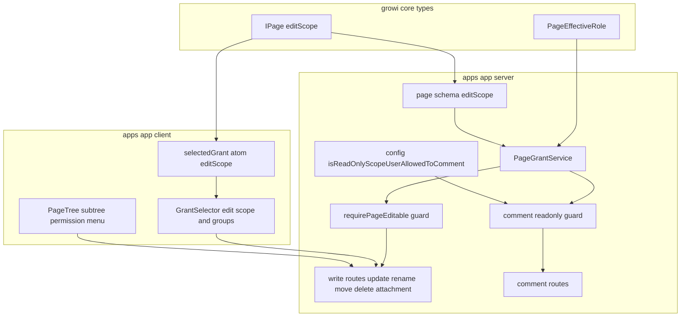
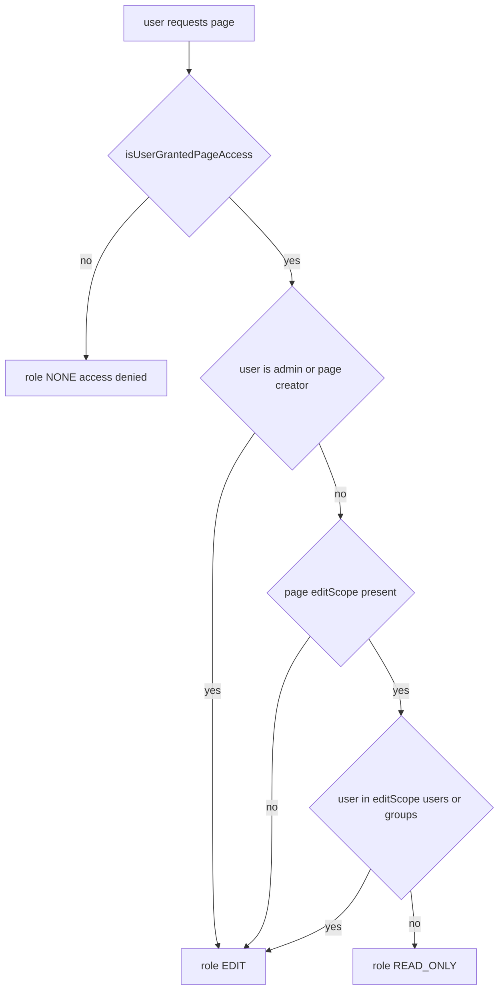
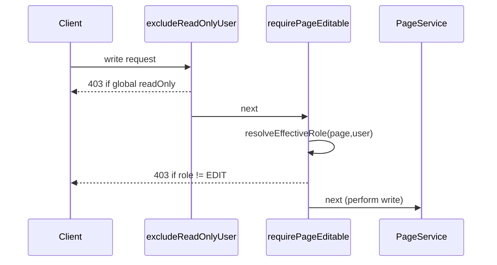

# Design Document: granular-page-permissions

## Overview

**Purpose**: ページに対して **閲覧範囲（read scope）と編集範囲（edit scope）を独立して**設定できる
ようにし、編集範囲に含まれないユーザーの書き込みをサーバーで遮断する。あわせて非所属グループへの
付与、⋮メニューからの配下ツリー一括付与を提供する。

**Users**: ページ作成者・管理者が公開範囲を設定する際に利用する。閲覧者は自分の実効ロールに応じて
閲覧のみ／編集可が決まる。

**Impact**: GROWI の権限は現在 read と edit が一体化しており（閲覧できれば編集できる）、書き込み経路は
グローバル ROM（`User.readOnly`）と削除時の `canDelete()` のみで守られている。本機能は **ページ単位の
編集可否判定 `isUserGrantedPageEdit()` を新設**し、全書き込み経路に編集ゲートを追加する。read 判定
（`isUserGrantedPageAccess()`）と read 経路の正規化・継承は温存する。

### Goals
- ページごとに read scope と edit scope を独立設定でき、「閲覧=Public・編集=特定グループ」を表現できる。
- 実効ロール（編集可 / 閲覧のみ / アクセス不可）に基づき、閲覧のみロールの書き込みを全経路で遮断する。
- 非所属グループへの付与、⋮メニューからの配下ツリー付与を可能にする。
- 既存ページのアクセス可否を移行後も完全に保つ（データ移行なしで達成）。

### Non-Goals
- Public ページが自動では見えないゲスト（`guest-users` が所有）。
- 有効期限／自動失効（`time-limited-access` が所有）。
- 管理者向けの権限俯瞰／棚卸し画面。
- グローバル `User.readOnly` の挙動変更。承認/編集ワークフロー（#9453）。匿名公開ポリシー変更。
- ページ単位の grant 種別（Public/リンク/自分のみ）の意味変更。

## Boundary Commitments

### This Spec Owns
- ページの **edit scope** データモデル（`IPage.editScope`）とそのバリデーション（edit ⊆ read、非空）。
- **実効ロール算出** `PageEffectiveRole` と `PageGrantService.isUserGrantedPageEdit()` / `resolveEffectiveRole()`。
- 全書き込み経路への **編集ゲート**（page-editable guard）の適用。
- 閲覧のみロールユーザーの **コメント可否設定**（新 config）とコメント経路のゲート。
- grant 選択 UI における **edit scope 設定**・**非所属グループ選択**・**⋮配下ツリー付与**。
- read scope 正規化・継承への **edit 次元の追加**（既存挙動は不変、edit を上乗せ）。

### Out of Boundary
- read 判定 `isUserGrantedPageAccess()` のロジック（温存。改名や挙動変更はしない）。
- グローバル ROM（`exclude-read-only-user`）の挙動。
- ゲスト userType、有効期限、管理俯瞰 UI（兄弟/下流 spec）。

### Allowed Dependencies
- `@growi/core` の `IPage` / `IGrantedGroup` / `PageGrant` 型。
- 既存 `PageGrantService`（`page-grant.ts`）、`PageService`、`config-manager`。
- 既存 UI 配管（`selectedGrantAtom` / `toPageUpdateGrantParams` / `useSWRxCurrentGrantData` /
  `useSWRxUserGroupList` / `PageItemControl` の `additionalMenuItemRenderer` /
  `overwriteScopesOfDescendants`）。
- 依存方向: `@growi/core 型` → `page schema` → `PageGrantService` → `routes/middleware` →
  `client states` → `UI`。上位から下位へのみ依存。

### Revalidation Triggers
- `IPage.editScope` の形が変わる（`guest-users` がアクセス評価でこれを参照するため）。
- `PageEffectiveRole` の値・意味が変わる。
- grant-data エンドポイントのレスポンス契約が変わる。
- 書き込み経路インベントリに新経路が追加される（編集ゲート未適用は権限バイパス）。

## Architecture

### Existing Architecture Analysis
- **read 判定**: `PageGrantService.isUserGrantedPageAccess()`（`page-grant.ts:1153`）。`grant` と
  `grantedUsers`/`grantedGroups` を見る。**edit 専用判定は存在しない**。
- **書き込みゲート**: apiv3 `PUT /page`・apiv1 `pages.remove`/`unlink`/`tags.update`・`attachments.remove`
  は `excludeReadOnlyUser`（グローバル ROM）のみ。削除は `canDelete()`（author/admin）。
  → **per-page 編集ゲートが無いことが「閲覧=編集」の実体**。
- **正規化・継承**: `isGrantNormalized`/`validateGrant`/`canOverwriteDescendants`（read scope 前提）。
- **grant 種別**: `GRANT_PUBLIC=1`/`RESTRICTED=2`/`OWNER=4`/`USER_GROUP=5`。

### Architecture Pattern & Boundary Map



**Architecture Integration**:
- Selected pattern: **既存サービス拡張＋単一編集ゲート**。read 経路は不変、edit を上乗せ。
- Boundaries: 型は `@growi/core`、判定は `PageGrantService`、強制は guard、UI は既存配管に追加。
- Preserved patterns: read 判定・正規化・継承・grant 保存パイプライン・config-manager・⋮拡張点。
- New components rationale: `isUserGrantedPageEdit`（欠落判定の新設）、`requirePageEditable`（散在する
  書き込み経路を一点で守る）、edit scope モデル（read と独立した編集範囲）。
- Steering compliance: 純関数の判定をサービスに集約しミドルウェアは薄い adapter（coding-style）。

### Technology Stack

| Layer | Choice / Version | Role in Feature | Notes |
|-------|------------------|-----------------|-------|
| Frontend | React 18 / Next.js Pages Router, Jotai, SWR | edit scope 設定 UI・非所属グループ選択・⋮メニュー | 既存配管を拡張 |
| Backend | Express, Mongoose ^6 | 編集判定・編集ゲート・config | 新規依存なし |
| Data | MongoDB | `editScope` サブドキュメント（任意） | 移行不要（後述） |
| Shared | `@growi/core` (workspace) | `IPage.editScope` / `PageEffectiveRole` / 型 | 変更は changeset 対象 |

新規外部依存なし。

## File Structure Plan

### Created
```
packages/core/src/interfaces/
  page.ts (modify)                         # IPageEditScope, IPage.editScope?, PageEffectiveRole
apps/app/src/server/middlewares/
  require-page-editable.ts                 # 書き込み経路の編集ゲート（純関数判定を呼ぶ薄い adapter）
apps/app/src/client/components/PageEditor/EditorNavbarBottom/
  EditScopeSelector.tsx                    # edit scope（編集範囲）設定 UI（GrantSelector から開く）
apps/app/src/client/components/Sidebar/PageTreeItem/
  SubtreePermissionMenuItem.tsx            # ⋮メニュー項目（additionalMenuItemRenderer 経由）
apps/app/src/client/components/SubtreePermissionModal/
  SubtreePermissionModal.tsx               # 配下ツリーへの read/edit 一括付与モーダル
apps/app/src/client/components/MoveDestinationPermissionModal/
  MoveDestinationPermissionModal.tsx       # 移動時 (A)阻止 /(B)公開範囲変更 確認モーダル（既存の移動 UI から呼ぶ）
```

### Modified
- `packages/core/src/interfaces/page.ts` — `IPageEditScope`、`IPage.editScope?`、`PageEffectiveRole` 追加。
- `apps/app/src/server/models/page.ts` — schema に `editScope`（任意サブドキュメント）追加。
- `apps/app/src/server/service/page-grant.ts` — `isUserGrantedPageEdit()` / `resolveEffectiveRole()` /
  `validateEditScope()` 追加。`validateGrant`・`canOverwriteDescendants` に edit 次元を通す。read 判定は不変。
- `apps/app/src/server/routes/apiv3/page/update-page.ts` ほか書き込みルート — `requirePageEditable` 付与、
  `editScope` を受理。
- `apps/app/src/server/routes/apiv3/page/index.ts` — grant-data に edit scope を含める／grant 更新で editScope を保存。
- `apps/app/src/server/routes/index.js`（apiv1 remove/unlink/tags）/`attachment.js` — `requirePageEditable` 付与。
- `apps/app/src/server/middlewares/exclude-read-only-user.ts` 付近 — コメント用 page-scoped guard
  `excludePageReadOnlyUserIfCommentNotAllowed` 追加（または新ファイル）。コメントルートに付与。
- `apps/app/src/server/service/config-manager/config-definition.ts` — `security:isReadOnlyScopeUserAllowedToComment` 追加。
- `apps/app/src/client/states/ui/editor/selected-grant.ts` — `IPageSelectedGrant.editScope`、
  `toSelectedGrant`/`toPageUpdateGrantParams` 拡張。
- `apps/app/src/client/components/PageEditor/EditorNavbarBottom/GrantSelector.tsx` /（inline）SelectGroupModal —
  非所属グループ選択（`useSWRxUserGroupList`）、EditScopeSelector 起動。
- `apps/app/src/client/components/Sidebar/PageTreeItem/use-page-item-control.tsx` — `additionalMenuItemRenderer`
  に SubtreePermissionMenuItem を追加。

## System Flows

### 実効ロール決定（read 温存・edit 上乗せ）



`editScope` 未設定 → 全閲覧者が編集可（現状挙動）。これが移行不要の根拠。

### 書き込みゲート（全経路共通）



`requirePageEditable` はグローバル ROM ゲートの**後段**に、全書き込みルートへ一律に付与する。

## Requirements Traceability

| Requirement | Summary | Components | Interfaces | Flows |
|-------------|---------|------------|------------|-------|
| 1.1, 1.3, 1.4, 1.5 | read/edit 範囲の独立設定・edit ⊆ read・編集者非空 | page schema, PageGrantService, EditScopeSelector | `validateEditScope`, update API editScope | — |
| 1.2 | 閲覧=Public・編集=グループ | page schema (grant + editScope), PageGrantService | editScope payload | 実効ロール決定 |
| 2.1, 2.5 | 実効ロール算出・最強権限採用 | PageGrantService | `resolveEffectiveRole` | 実効ロール決定 |
| 2.2, 2.3, 2.4, 2.6 | 閲覧のみ/アクセス不可の書き込み遮断（UI 非経由・添付含む） | requirePageEditable, write routes | guard | 書き込みゲート |
| 2.7, 2.8, 2.9 | 作成は親への EDIT を要求（開放領域は従来どおり） | PageService.create/duplicate/renamePage（サービス層・親判定） | resolveEffectiveRole on findNonEmptyClosestAncestor | 書き込みゲート |
| 3.1, 3.2, 3.3 | 閲覧のみロールのコメント可否（既定不可） | config, comment guard | `security:isReadOnlyScopeUserAllowedToComment` | 書き込みゲート（comment 版） |
| 4.1, 4.2, 4.3 | 非所属グループ付与（全ユーザー可） | GrantSelector, useSWRxUserGroupList | grant-data / update editScope+grant | — |
| 5.1, 5.2, 5.3, 5.4 | ⋮から配下ツリー付与 | SubtreePermissionMenuItem, SubtreePermissionModal | `overwriteScopesOfDescendants` | — |
| 6.1, 6.2, 6.3, 6.4 | ツリー整合・ロール継承 | PageGrantService (validateGrant, canOverwriteDescendants), 継承モーダル | normalization API | — |
| 7.1, 7.2, 7.3 | 後方互換移行 | page schema (optional editScope) | 遅延既定 | 実効ロール決定 |
| 8.1, 8.2 | グローバル ROM との分離 | PageGrantService, requirePageEditable | 独立判定 | 書き込みゲート |

## Components and Interfaces

| Component | Domain/Layer | Intent | Req Coverage | Key Dependencies | Contracts |
|-----------|--------------|--------|--------------|------------------|-----------|
| IPage.editScope / PageEffectiveRole | Types (@growi/core) | edit 範囲と実効ロールの型 | 1, 2, 7 | — | State |
| PageGrantService (拡張) | Server service | 編集判定・実効ロール・edit 検証 | 1,2,6,8 | page schema (P0) | Service |
| requirePageEditable | Server middleware | 書き込み経路の編集ゲート | 2,8 | PageGrantService (P0) | Service |
| comment readonly guard + config | Server | 閲覧のみロールのコメント制御 | 3 | config-manager (P0) | Service, API |
| update/grant API (拡張) | Server route | editScope の受理・grant-data 返却 | 1,4 | PageGrantService (P0) | API |
| EditScopeSelector / GrantSelector (拡張) | Client UI | edit 範囲設定・非所属グループ選択 | 1,4 | selectedGrant atom (P0), useSWRxUserGroupList (P1) | State |
| SubtreePermissionMenuItem / Modal | Client UI | ⋮から配下ツリー付与 | 5 | additionalMenuItemRenderer (P1), overwriteScopesOfDescendants (P1) | — |

### Types (@growi/core)

#### IPage.editScope / PageEffectiveRole

| Field | Detail |
|-------|--------|
| Intent | edit 範囲（read の部分集合）と実効ロールの共有型 |
| Requirements | 1.1, 1.2, 1.3, 2.1, 7.1 |

**Contracts**: State [x]

```typescript
// packages/core/src/interfaces/page.ts
export interface IPageEditScope {
  grantedUsers: Ref<IUser>[];      // 編集を許す個別ユーザー
  grantedGroups: IGrantedGroup[];  // 編集を許すグループ（既存 IGrantedGroup を再利用）
}

// IPage に追加（任意）。absent ⇒ 編集権限 == 閲覧権限（後方互換の既定）
//   editScope?: IPageEditScope;

export const PageEffectiveRole = {
  EDIT: 'edit',
  READ_ONLY: 'readOnly',
  NONE: 'none',
} as const;
export type PageEffectiveRole =
  (typeof PageEffectiveRole)[keyof typeof PageEffectiveRole];
```
- Invariants: `editScope` が存在するとき、その全 subject は read scope の部分集合であり、かつ非空。

### Server

#### PageGrantService（拡張）

| Field | Detail |
|-------|--------|
| Intent | 編集可否判定・実効ロール算出・edit scope 検証を追加（read 判定は不変） |
| Requirements | 1.3, 1.4, 1.5, 2.1, 2.5, 6.4, 8.1 |

**Responsibilities & Constraints**
- read 判定 `isUserGrantedPageAccess()` は変更しない（Out of Boundary）。
- edit 判定・実効ロールを新設。`editScope` 未設定時は read 結果に従い EDIT を返す（後方互換）。
- `validateEditScope()` で edit ⊆ read と非空を保証（Req 1.3, 1.5）。
- 正規化・継承（`validateGrant`/`canOverwriteDescendants`）に edit 次元を通す（Req 6.4）。

**Dependencies**: Outbound: page schema (P0)。Inbound: requirePageEditable, comment guard, routes。

**Contracts**: Service [x]

##### Service Interface
```typescript
interface PageGrantService {
  // 既存（read）: 不変
  isUserGrantedPageAccess(
    page: PageDocument, user: IUserHasId,
    userRelatedGroups: PopulatedGrantedGroup[], allowAnyoneWithTheLink?: boolean,
  ): boolean;

  // 新規（edit）
  isUserGrantedPageEdit(
    page: PageDocument, user: IUserHasId,
    userRelatedGroups: PopulatedGrantedGroup[],
  ): boolean;

  resolveEffectiveRole(
    page: PageDocument, user: IUserHasId | null,
    userRelatedGroups: PopulatedGrantedGroup[], allowAnyoneWithTheLink?: boolean,
  ): PageEffectiveRole;

  // editScope ⊆ readScope かつ 非空 を検証
  validateEditScope(
    page: Pick<IPage, 'grant' | 'grantedUsers' | 'grantedGroups' | 'editScope'>,
  ): { valid: true } | { valid: false; reason: string };
}
```
- Preconditions: `userRelatedGroups` は populate 済み（既存パターン）。
- Postconditions: `resolveEffectiveRole` は admin およびページ作成者に対し常に EDIT、read 不可に対し NONE を返す。
- Invariants: edit ⇒ read（編集可なら必ず閲覧可）。

#### requirePageEditable（ミドルウェア）

| Field | Detail |
|-------|--------|
| Intent | 全書き込み経路で実効ロール EDIT を要求する単一チョークポイント | 
| Requirements | 2.2, 2.3, 2.4, 2.6, 8.2 |

**Responsibilities & Constraints**
- req から対象ページを解決（pageId/path）、`resolveEffectiveRole` を呼び、EDIT 以外は 403。
- `excludeReadOnlyUser`（グローバル ROM）の**後段**に置く（責務を混ぜない、Req 8）。
- 純粋判定は `PageGrantService` に委譲し、本体は薄い adapter（coding-style）。

**Contracts**: Service [x]
```typescript
// 強制は二段構成:
// (1) 既存ページ単体の書き込み → route ミドルウェアで対象ページに EDIT を要求
function generateRequirePageEditable(): RequestHandler;
// (2) 作成/複製/移動先 → 親が未作成・パス決定後に確定するため、サービス層で親 EDIT を判定
//     PageService.create()/duplicate()/renamePage() 内、canProcessCreate 直前で
//     findNonEmptyClosestAncestor(path) に対し resolveEffectiveRole が EDIT かを検証
// 適用インベントリ（網羅必須）:
//  route ミドルウェア(1): PUT /page(update), rename(元), PUT /page/:id/grant,
//                         apiv1 pages.remove/revertRemove/unlink/tags.update, attachments add/remove
//  サービス層(2):         POST /page(create→親), duplicate(複製先親), move(移動先親)
```

##### 書き込み操作ごとの権限意味論

単一の既存ページに閉じない操作は、対象を明示して判定する（ルートだけで判定しない）。

| 操作 | 必要な権限 |
|------|-----------|
| 更新 / リネーム / タグ / 添付追加・削除 / 削除 | 対象ページに EDIT 実効ロール |
| **作成（新規ページ）** | **作成先の親ページに EDIT 実効ロール**（親が editScope 未設定の開放領域なら従来どおり作成可） |
| move（移動） | 移動元ページに EDIT ＋ 移動先の親ページに EDIT |
| duplicate（複製） | 複製元は READ で可 ＋ 複製先の親ページに EDIT |
| 配下ツリー一括付与（5.2） | **対象サブツリーの各ページに EDIT を要求**。EDIT 不可のページはスキップし、結果に含めて通知（ルートのみで判定しない） |
| grant 変更（`PUT /page/:id/grant`） | 対象ページに EDIT（編集者が公開範囲を管理） |

- **作成 ⟺ 親への EDIT**: 「ページ X を作成できる ⟺ X の親に対する実効ロールが EDIT」で統一（Req 2.7–2.9）。
  per-page 閲覧のみロールのユーザーはその配下に作成できない。逆に editScope 未設定の開放領域では従来どおり
  閲覧可能な誰もが作成できる。グローバル `User.readOnly` は従来どおり全作成を禁止。
- **トップレベル（親なし）作成**: 既存挙動に従う（root 直下の扱いは変えない）。
- **rename/move は二重チェック**: 単一の `renamePage`/move 操作は「移動元への EDIT」と「移動先の親への
  EDIT」の**両方**をサーバーで検証する（片方だけにしない）。クライアントは移動時に移動先の実効ロールを
  事前確認し、**(A)** 移動先が編集不可なら**阻止モーダル**、**(B)** 編集可だが公開範囲が変わる場合は
  **確認モーダル**を表示する。ただしサーバーの二重チェックが最終権威（UI 非経由でも遮断、Req 2.4）。

**Implementation Notes**
- Risks: **経路の網羅漏れ＝権限バイパス**。tasks で書き込み経路インベントリを明示し、guard 適用を1経路ずつ確認。配下一括は「ルートのみ判定」にならないよう特に注意。
- Validation: 防御多重化として `PageService` の中核 mutator にも assert を入れることを検討（design 段階の推奨）。

#### コメント read-only ゲート + config

| Field | Detail |
|-------|--------|
| Intent | 閲覧のみロールのコメント可否を設定で制御 |
| Requirements | 3.1, 3.2, 3.3 |

**Contracts**: Service [x] / API [x]
- 新 config `security:isReadOnlyScopeUserAllowedToComment`（`defineConfig<boolean>({ defaultValue: false })`）。
  既定は不可（Req 3.3）。admin security-settings に read/write を追加。
- 新ガード `excludePageReadOnlyUserIfCommentNotAllowed`: コメント対象ページの実効ロールを算出し、
  READ_ONLY かつ config が無効なら 403。`comments.add/update/remove` に付与。
- 既存グローバル ROM 用 `excludeReadOnlyUserIfCommentNotAllowed`（`isRomUserAllowedToComment`）は不変・併存。

#### update / grant-data API（拡張）

**Contracts**: API [x]

| Method | Endpoint | Request 追加 | Response 追加 | Errors |
|--------|----------|-------------|--------------|--------|
| PUT | /_api/v3/page (update) | `editScope?: { grantedUserIds: string[]; grantedGroups: IGrantedGroup[] }` | — | 400(検証), 403(編集権限) |
| PUT | /_api/v3/page/:id/grant | `editScope?` | — | 400, 403 |
| GET | /_api/v3/page/grant-data | — | `currentPageEditScope`, `myEffectiveRole`, edit 選択用グループ | — |

- `IOptionsForUpdate` に `editScope` を追加。`toPageUpdateGrantParams` が送出、保存時 `validateEditScope` 実行。
- grant-data は `myEffectiveRole: PageEffectiveRole` を返す。クライアントはこれで編集 UI（編集ボタン・
  保存）を事前に無効化／案内表示し、READ_ONLY ユーザーが保存時 403 まで気づかない事態を防ぐ（Req 2.2）。

### Client（UI）

#### EditScopeSelector / GrantSelector 拡張

| Field | Detail |
|-------|--------|
| Intent | read 設定に加え、edit 範囲の限定と非所属グループ選択を提供 |
| Requirements | 1.1, 1.2, 4.1, 4.2, 4.3 |

**Implementation Notes**
- `IPageSelectedGrant` に `editScope?` を追加。GrantSelector で「編集を限定する」トグル → EditScopeSelector
  でユーザー/グループの部分集合を選択。
- 非所属グループ: `useSWRxUserGroupList()`（`/api/v3/user-groups`）で全グループを候補に出す。全ユーザー許可
  （Req 4.2）。「所属グループ／その他のグループ」のセクション分割で開示を明示（要件で許容済み）。
- Validation: クライアントでも edit ⊆ read・edit 非空をガイド（最終検証はサーバー `validateEditScope`）。

#### SubtreePermissionMenuItem / SubtreePermissionModal

| Field | Detail |
|-------|--------|
| Intent | ⋮メニューから配下ツリーへ read/edit を一括付与 |
| Requirements | 5.1, 5.2, 5.3, 5.4 |

**Implementation Notes**
- `use-page-item-control.tsx` の `additionalMenuItemRenderer` に項目追加（growi-vault `PageReconcileMenuItem` が前例）。
- モーダルで read/edit scope を指定し、保存時 `overwriteScopesOfDescendants: true` 相当で配下へ適用（既存配下上書き機構を再利用、Req 5.4）。進行/完了を通知（Req 5.3）。

## Data Models

### Domain Model
- **Aggregate**: Page。read scope（`grant`/`grantedUsers`/`grantedGroups`）と edit scope（`editScope`）を持つ。
- **Invariants**:
  - edit ⇒ read（編集可能 subject は必ず閲覧可能）。
  - `editScope` 存在時は非空（編集者不在のページを作らない、Req 1.5）。
  - **ページ作成者（`page.creator`）は `editScope` の内容によらず常に EDIT**（自己ロックアウト防止）。
  - 子ページの read scope ⊆ 祖先の read scope（既存正規化、不変）。
- **Domain event**: なし（同期判定）。

### Physical Data Model (MongoDB / Mongoose)
`page` ドキュメントに任意フィールドを追加（既存フィールドは不変）:

```
editScope: {                      // 任意。未設定 ⇒ 編集権限 == 閲覧権限
  grantedUsers:  [ObjectId(ref User)],
  grantedGroups: [{ type: 'UserGroup'|'ExternalUserGroup', item: ObjectId(refPath) }]
}
```
- 既存 `grantedGroups`（read）の形をそのまま踏襲（`IGrantedGroup` 再利用）。
- インデックス追加は不要（編集判定はページ取得後にメモリ上で実施。read のクエリフィルタは不変）。

### Data Contracts & Integration
- grant-data レスポンスに `currentPageEditScope` を追加（`useSWRxCurrentGrantData` の型が追従）。
- `IOptionsForUpdate` / `PageUpdateGrantParams` に `editScope` を追加。

## Error Handling

### Error Strategy
- **検証エラー（400）**: `validateEditScope` 失敗（edit ⊄ read、編集者非空違反）→ フィールド単位の理由を返す（Req 1.4, 1.5）。
- **権限エラー（403）**: `requirePageEditable` が EDIT 以外を拒否（Req 2.2–2.4, 2.6）。コメント不可（Req 3.2）。
- **アクセス不可（403/404）**: read 不可は既存挙動を踏襲。
- **冪等性**: 配下一括付与は既存の overwrite 機構の冪等性に従う。

### Monitoring
- 編集ゲートでの 403 を既存 activity/logger 経路で記録（baseline は steering に従う）。

## Testing Strategy

### Unit Tests (PageGrantService)
- `resolveEffectiveRole`: editScope 未設定 → read 可なら EDIT（後方互換）。
- `resolveEffectiveRole`: read=Public・editScope=GroupA → A メンバーは EDIT、非メンバーは READ_ONLY（Req 1.2, 2.1）。
- `resolveEffectiveRole`: 複数グループ該当時に最強（EDIT 優先）を採用（Req 2.5）。
- `validateEditScope`: edit ⊄ read を拒否（Req 1.4）、編集者非空違反を拒否（Req 1.5）。
- admin は常に EDIT、read 不可は NONE（Req 8.1）。

### Integration Tests
- `PUT /page`：閲覧のみロールのユーザーが更新→403、編集可ユーザー→成功（Req 2.2, 2.4）。
- rename/move/duplicate/delete/attachment add+remove で閲覧のみロールが全て 403（経路網羅、Req 2.2, 2.6）。
- コメント：config 無効時に閲覧のみロールが 403、有効時に成功（Req 3.1, 3.2）。
- 後方互換：editScope 未設定の既存ページで、従来編集できたユーザーが引き続き編集可（Req 7.2）。
- 配下一括付与：⋮から read/edit を配下へ適用し、子ページの実効ロールが反映される（Req 5.2）。

### E2E (critical path)
- 「閲覧=全体公開・編集=グループ」を UI で設定 → 非編集ユーザーで編集 UI がブロックされる（Req 1.2, 2.2）。
- 非所属グループを edit scope に追加して保存できる（Req 4.1, 4.2）。

## Security Considerations
- **網羅性が最重要**: 書き込み経路の1つでも `requirePageEditable` が欠けると権限バイパス。tasks で経路
  インベントリを固定し、各経路に統合テストを付ける。
- **UI 非経由の遮断**: 判定はサーバーの guard が最終権威（Req 2.4）。クライアント検証は UX 補助のみ。
- **read と edit の分離**: edit ⇒ read 不変を `validateEditScope` で保証し、編集できるが閲覧できない状態を作らない。
- **グローバル ROM 分離**: per-page ロールと `User.readOnly` を独立判定（Req 8）。
- **非所属グループ開示**: 全ユーザー付与可（要件決定）。グループ名が選択 UI に露出することを UI で明示。
- **公開範囲の変更権限（決定: a）**: grant（read/edit scope）の変更は対象ページの EDIT 実効ロールで許可する
  （既存 GROWI 挙動を踏襲）。一編集者が read 範囲を拡大したり editScope を変更できることは**許容する**。
  作成者は常に EDIT のため締め出されない。将来さらに機密性を絞る必要が生じた場合は、「権限管理」操作を
  作成者＋admin に限定する余地を残す（本 spec では行わない）。

## Migration Strategy
- **データ移行は不要**。`editScope` は任意フィールドで、未設定は「編集権限 == 閲覧権限」と解釈する遅延既定。
  既存ページは `editScope` を持たないため、移行直後のアクセス可否は完全に従来どおり（Req 7.1, 7.2, 7.3）。
- ロールアウト後、ユーザーが明示的に edit scope を設定したページのみ新挙動になる。
- ロールバック: `editScope` を無視すれば全ページが従来挙動に戻る（フィールドは無害に残置）。
