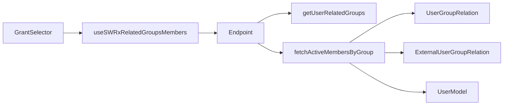
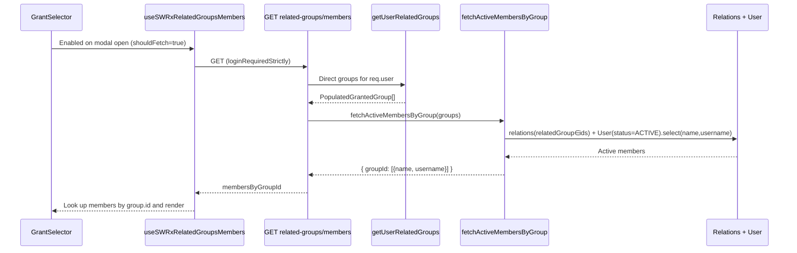

# Technical Design: group-selection-ui

Target requirements: [requirements.md](./requirements.md) / Prior research: [research.md](./research.md)

## Overview

**Purpose**: A technical design document for the GrantSelector (group selection UI) displayed when setting page visibility to "group-limited". This document serves as the design foundation for the ongoing maintenance of GrantSelector, describing the technical implementation of each Feature.

**Users**: General logged-in users (no admin privileges required).

**Scope**: Covers all features that make up the GrantSelector (group selection modal at the bottom of the editor). The currently implemented Feature is "Group Member Visibility" (Feature 1).

---

## Feature 1: Group Member Visibility

**Purpose**: Display the members (name, username) of each group that the user directly belongs to, listed as options in the GrantSelector group selection UI. This allows users to decide which group to grant access to based on its member composition.

**Impact**: Adds member list display below the group name in the existing GrantSelector (page visibility selection modal in the editor). Member information is fetched lazily from a new independent endpoint without touching the existing grant determination flow (`/api/v3/page/grant-data`).

### Goals
- View members of directly-belonging UserGroups / ExternalUserGroups in GrantSelector
- Limit display to name and username of active users only; do not expose other information
- Do not impact the responsibilities or performance of existing grant determination (separation of concerns, lazy fetching)

### Non-Goals
- Member display in FixPageGrantModal (grant inconsistency fix modal, existing TODO)
- Member display for non-belonging groups (`nonUserRelatedGrantedGroups`)
- Expansion of parent/descendant group members
- Editing group membership, admin features, adding feature ON/OFF settings

### Boundary Commitments

#### This Spec Owns
- The `GrantSelector` component and its direct subcomponents (`SelectGroupModal`, `GroupMembersLabel`)
- **[Feature 1]** New API `GET /api/v3/user/related-groups/members` and its response contract
- **[Feature 1]** Server service function `fetchActiveMembersByGroup` (group set → active members by group)
- **[Feature 1]** Member DTO types (`IUserGroupMember` / `RelatedGroupsMembers`)
- **[Feature 1]** Member list rendering in the **userRelatedGroups** section of GrantSelector, and presentation when the user is the only member

#### Out of Boundary
- FixPageGrantModal member display TODO ([FixPageGrantModal.tsx:328](../../../apps/app/src/components/PageView/PageAlerts/FixPageGrantAlert/FixPageGrantModal.tsx)) — not modified
- GrantSelector's **nonUserRelatedGrantedGroups** (groups already granted but not user-related) section — no member rendering
- Modification of existing `/api/v3/page/grant-data` flow (`getPageGroupGrantData`)
- Admin member list API (`/api/v3/user-groups/:id/users`)
- Creation, update, or deletion of group membership relationships

#### Allowed Dependencies
- `pageGrantService.getUserRelatedGroups(user)` — source for directly-belonging groups (both types), read-only
- `UserGroupRelation` / `ExternalUserGroupRelation` model membership queries
- `User` model and `UserStatus.STATUS_ACTIVE` constant (active filtering)
- Existing auth middleware (`accessTokenParser` / `loginRequiredStrictly`), SWR (`stores/user.tsx`)

#### Revalidation Triggers
- Changes to the return type of `getUserRelatedGroups` (`PopulatedGrantedGroup`)
- Changes to membership fetch logic in relation models
- Changes to the response DTO shape (`RelatedGroupsMembers`)
- Changes to the group list source displayed by GrantSelector (`useSWRxCurrentGrantData`)

### Architecture

#### Existing Architecture Analysis
- GrantSelector fetches `GroupGrantData` (`userRelatedGroups` / `nonUserRelatedGrantedGroups`) via `useSWRxCurrentGrantData(pageId)` → `GET /api/v3/page/grant-data` → `getPageGroupGrantData`, rendering only group names. A member display TODO exists at [GrantSelector.tsx:338](../../../apps/app/src/client/components/PageEditor/EditorNavbarBottom/GrantSelector.tsx).
- The existing API `GET /api/v3/user/related-groups` ([get-related-groups.ts](../../../apps/app/src/server/routes/apiv3/user/get-related-groups.ts)) exposes `pageGrantService.getUserRelatedGroups(req.user)` under `loginRequiredStrictly` + `SCOPE.READ.USER_SETTINGS.INFO`. This design adds a **sibling endpoint** with the same `loginRequiredStrictly` + factory pattern, but **diverges on the scope**: the new endpoint uses a newly-introduced `SCOPE.READ.FEATURES.USER_GROUP` instead of inheriting the sibling's `user_settings:info` (see scope rationale under the endpoint design below).
- `getUserRelatedGroups` joins internal/external `findAllGroupsForUser` on a direct-membership basis (no recursion). Using this as the work-set source structurally satisfies "direct membership only (2.1)" and "no parent-child expansion (2.2)".

#### Architecture Pattern & Boundary Map



**Key Decisions**:
- **Group set is derived server-side from the session** (`getUserRelatedGroups(req.user)`). Since no group IDs are accepted from the client, there is no pathway to query another user's groups, structurally preventing IDOR (satisfies 3.2/3.3).
- **Member information is fetched lazily under a separate contract from grant-data**. Fetched only when the GrantSelector modal is opened (SWR key conditionally enabled), avoiding bloating existing grant determination responsibilities and unnecessary eager fetching.
- **DTO is name/username only**. `.select('name username')` at the DB query level means email, etc. are never loaded into memory. `serializeUserSecurely` may conditionally include email, so it is not used here; a stricter projection structurally satisfies 1.2/3.4.

**Dependency Direction**: Types → Service → Route → Store (hook) → UI (each layer depends only leftward).

#### Technology Stack

| Layer | Choice / Version | Role in Feature | Notes |
|-------|------------------|-----------------|-------|
| Frontend | React 18 / SWR | Member rendering and lazy fetching in GrantSelector | Hook added to existing `stores/user.tsx` |
| Backend | Express (apiv3) | New GET endpoint | Same pattern as existing `get-related-groups` |
| Data | Mongoose ^6 | Active-filtered projection queries on relation + User | No new schema or migration |

No new library dependencies. No schema changes or data migrations.

### File Structure Plan

#### New Files
```
apps/app/src/
├── interfaces/
│   └── user-group-member.ts                         # IUserGroupMember, RelatedGroupsMembers, IResRelatedGroupsMembers
├── server/
│   ├── service/user-group/
│   │   └── fetch-active-members-by-group.ts          # work-set (group set) → active members by groupId
│   └── routes/apiv3/user/
│       └── get-related-groups-members.ts             # GET /related-groups/members handler (factory)
```

#### Modified Files
- `apps/app/src/server/routes/apiv3/user/index.ts` — register `router.get('/related-groups/members', ...)`
- `apps/app/src/stores/user.tsx` — add `useSWRxRelatedGroupsMembers(shouldFetch)` next to `useSWRxUserRelatedGroups`
- `apps/app/src/client/components/PageEditor/EditorNavbarBottom/GrantSelector.tsx` — replace L338 TODO with member list rendering, enable hook when modal is open, present "only yourself" case
- i18n resources — add translation keys for member label and "only yourself" display

> Each file has a single responsibility. Matches the Types → Service → Route → Store → UI dependency direction.

### System Flows



Gating: the hook uses key `null` when the modal is hidden (no request sent). On fetch failure, group names remain visible without member display (graceful degradation).

### Requirements Traceability

| Requirement | Summary | Components | Interfaces |
|-------------|---------|------------|------------|
| 1.1 | Present members per group | GrantSelector, hook, Endpoint, Service | `IResRelatedGroupsMembers` |
| 1.2 | Display name and username | Service (projection), GrantSelector | `IUserGroupMember` |
| 1.3 | Both UserGroup and ExternalUserGroup | Service (both relation models) | — |
| 1.4 | Present "only yourself" group | GrantSelector (self check) | — |
| 2.1 | Direct membership groups only | Endpoint (`getUserRelatedGroups`) | — |
| 2.2 | Exclude parent/child groups | Service (only relations of provided groups, no recursion) | — |
| 2.3 | Active users only | Service (`status: STATUS_ACTIVE`) | — |
| 3.1 | Login required | Endpoint (`loginRequiredStrictly`) | — |
| 3.2 | Hide members of non-belonging groups | Endpoint (group set derived from session), GrantSelector (no render for nonUserRelated) | — |
| 3.3 | No admin privileges required | Endpoint (`SCOPE.READ.FEATURES.USER_GROUP`) | — |
| 3.4 | Only name/username exposed | Service (`.select('name username')`) | `IUserGroupMember` |
| 3.5 | Always enabled (no settings) | Endpoint (unconditionally public, no feature flag) | — |

### Components and Interfaces

| Component | Domain/Layer | Intent | Req Coverage | Key Dependencies | Contracts |
|-----------|--------------|--------|--------------|------------------|-----------|
| `fetchActiveMembersByGroup` | Backend/Service | Group set → active member projection | 1.2,1.3,2.2,2.3,3.4 | UserGroupRelation, ExternalUserGroupRelation, User (P0) | Service |
| related-groups/members route | Backend/API | Authorization, group set derivation, formatting | 1.1,2.1,3.1,3.2,3.3,3.5 | getUserRelatedGroups, fetchActiveMembersByGroup (P0) | API |
| `useSWRxRelatedGroupsMembers` | Frontend/Store | Lazy fetch | 1.1 | SWR (P0) | State |
| GrantSelector (modified) | Frontend/UI | Member rendering, "only yourself" presentation | 1.1,1.2,1.4,3.2 | hook, current user state (P1) | — |

#### Backend / Service

##### fetchActiveMembersByGroup

| Field | Detail |
|-------|--------|
| Intent | Return active members (name, username) per group for a given set of groups |
| Requirements | 1.2, 1.3, 2.2, 2.3, 3.4 |

**Responsibilities & Constraints**
- Receives the group set (work-set) **as input from the caller** (does not self-import the dataset / coding-style executor convention).
- Splits groups by `type` (internal / external) and queries each relation model for memberships where `relatedGroup ∈ ids` (selects only `relatedGroup` and `relatedUser`; no populate).
- Bulk-fetches collected user IDs via `User.find({ _id: { $in }, status: UserStatus.STATUS_ACTIVE }).select('name username')` (avoids N+1, active filtering, minimal projection). Inactive users are naturally excluded.
- Does not expand to parent/descendant groups (only queries relations of the input groups).
- Returns a map of `groupId` (string) → member array. Groups with no members return an empty array.

**Contracts**: Service [x]

```typescript
// Input is the return type of getUserRelatedGroups
function fetchActiveMembersByGroup(
  groups: PopulatedGrantedGroup[],
): Promise<RelatedGroupsMembers>;
```
- Preconditions: `groups` contains only groups the calling user directly belongs to (guaranteed by the route layer).
- Postconditions: Each member has `status === STATUS_ACTIVE`; fields are `name`/`username` only.
- Invariants: No groupId that is not in the input will appear as a key.

#### Backend / API

##### GET /api/v3/user/related-groups/members

| Field | Detail |
|-------|--------|
| Intent | Return the member map of the session user's directly-belonging groups |
| Requirements | 1.1, 2.1, 3.1, 3.2, 3.3, 3.5 |

**Responsibilities & Constraints**
- Auth: `accessTokenParser([SCOPE.READ.FEATURES.USER_GROUP], { acceptLegacy: true })` + `loginRequiredStrictly`. No admin required (3.3); unauthenticated requests rejected (3.1).
  - **Scope rationale**: this endpoint returns *other users'* identity via group membership — a directory read, not "my settings". The pre-existing `user_settings:info` scope used by sibling endpoints semantically means "read the session user's own settings", so reusing it would over-grant any token scoped only to read its own profile. A dedicated `read:features:user_group` scope is therefore newly introduced (`packages/core/src/interfaces/scope.ts`) and used here.
  - **Deferred (out of this spec's boundary)**: the sibling `GET /api/v3/user/related-groups` and `GET /api/v3/users` carry the same mis-categorization (`user_settings:info`). Re-gating them to `read:features:user_group` / `read:features:user` is a **breaking change for already-issued tokens** and is intentionally NOT done here; it should be tracked as a separate ticket.
- Group set is **derived server-side** from `crowi.pageGrantService.getUserRelatedGroups(req.user)` (no client-supplied input → 3.2).
- Returns the result of `fetchActiveMembersByGroup(groups)` as `res.apiv3({ membersByGroupId })`. On failure, returns `apiv3Err(new ErrorV3(...))`.
- Handler uses factory pattern (same structure as `get-related-groups.ts`); registered in `index.ts` at `/related-groups/members`.

**Contracts**: API [x]

| Method | Endpoint | Request | Response | Errors |
|--------|----------|---------|----------|--------|
| GET | /api/v3/user/related-groups/members | (none; user derived from session) | `IResRelatedGroupsMembers` | 401 (not logged in), 500 |

#### Frontend / Store

##### useSWRxRelatedGroupsMembers

| Field | Detail |
|-------|--------|
| Intent | Lazily fetch the member map only when the modal is visible |
| Requirements | 1.1 |

**Contracts**: State [x]
```typescript
function useSWRxRelatedGroupsMembers(
  shouldFetch: boolean,
): SWRResponse<RelatedGroupsMembers, Error>;
```
- While `shouldFetch` is false, key is `null` (no request sent). Added to `stores/user.tsx`; key is `['/user/related-groups/members']`.

#### Frontend / UI

##### GrantSelector (modified — summary)

**Implementation Notes**
- Integration: In the `userRelatedGroups` rendering of `useSWRxCurrentGrantData` ([GrantSelector.tsx:338](../../../apps/app/src/client/components/PageEditor/EditorNavbarBottom/GrantSelector.tsx)), look up members by `group.id` from `membersByGroupId` and display a list of names/usernames. The hook is enabled by the modal open state.
- Validation (1.4): When the only member matches the current user's `username`, display the i18n "only yourself" text.
- Validation (3.2): Do not render members in the `nonUserRelatedGrantedGroups` section (they are also absent from the map).
- Risks: Long list display when a group has many members. No upper limit in requirements; initial version shows all members. A "and N more" UX cap is a future item (see Open Questions).

### Data Models

No new collections or schema changes. Existing models are used read-only.

#### Data Contracts
```typescript
// apps/app/src/interfaces/user-group-member.ts
export type IUserGroupMember = {
  username: string;
  name: string;
};

// key: group _id (string) → members
export type RelatedGroupsMembers = Record<string, IUserGroupMember[]>;

export type IResRelatedGroupsMembers = {
  membersByGroupId: RelatedGroupsMembers;
};
```

### Error Handling
- **401** (not logged in): Rejected by `loginRequiredStrictly` (3.1).
- **500**: On service exception, return `apiv3Err(new ErrorV3(...))` and log on the server (same as `get-related-groups`). The client can continue group selection with members hidden (graceful degradation).
- Group with no members / all members inactive: Returns an empty array; UI shows "only yourself" or empty display (1.4).

### Testing Strategy

#### Unit Tests (`fetch-active-members-by-group.spec.ts`)
- Mixed internal + external groups: members of both types are correctly bundled by groupId (1.3)
- Inactive users are excluded from the result (2.3)
- Returned fields are `name`/`username` only — no email or other fields (1.2, 3.4)
- Only queries relations for the provided groups; does not include parent/child group members (2.2)
- Groups with no members return an empty array (1.4)

#### Integration Tests (route)
- Returns 401 when not logged in (3.1)
- Returns 200 for a general (non-admin) user and only the user's own groups appear in the map (2.1, 3.3)
- No pathway for the client to specify other groups; session-external groups do not appear in the map (3.2)

#### E2E/UI Tests (GrantSelector)
- Opening the modal with visibility set to group-limited shows members (name, username) under each belonging group (1.1, 1.2)
- Groups where the user is the only member display the "only yourself" text (1.4)
- Members are not displayed for nonUserRelatedGrantedGroups (3.2)

### Security Considerations
- **Structural authorization guarantee**: Group set is derived from the session and no client-supplied IDs are accepted, so there is no pathway to fetch another user's group members (3.2/3.3).
- **Minimal information exposure**: Only `name`/`username` are fetched at the DB projection level. `email`, `apiToken`, `password`, etc. are never loaded into memory (1.2/3.4).
- **Active users only**: Deactivated or withdrawn users are excluded (2.3).

### Open Questions / Risks
- Display cap / "and N more" UX for groups with many members (no upper limit in requirements; initial version shows all, follow-up if needed).
- Whether to include the current user in the list or show only other members: this design returns all members and lets the UI detect the current user via `username` match to satisfy 1.4. Whether to highlight or exclude the current user in the display is to be decided at UI implementation time.
