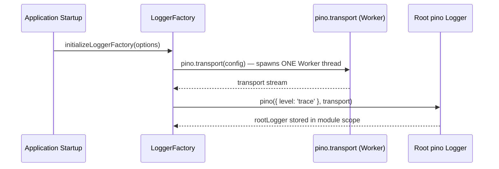
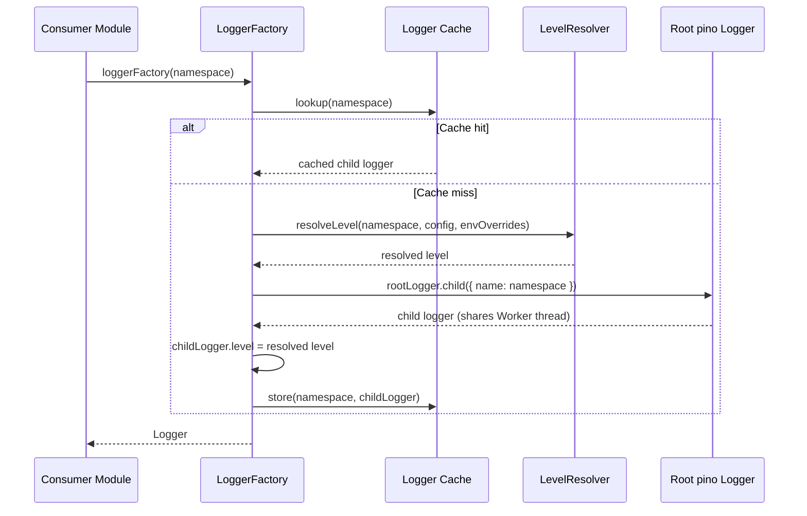
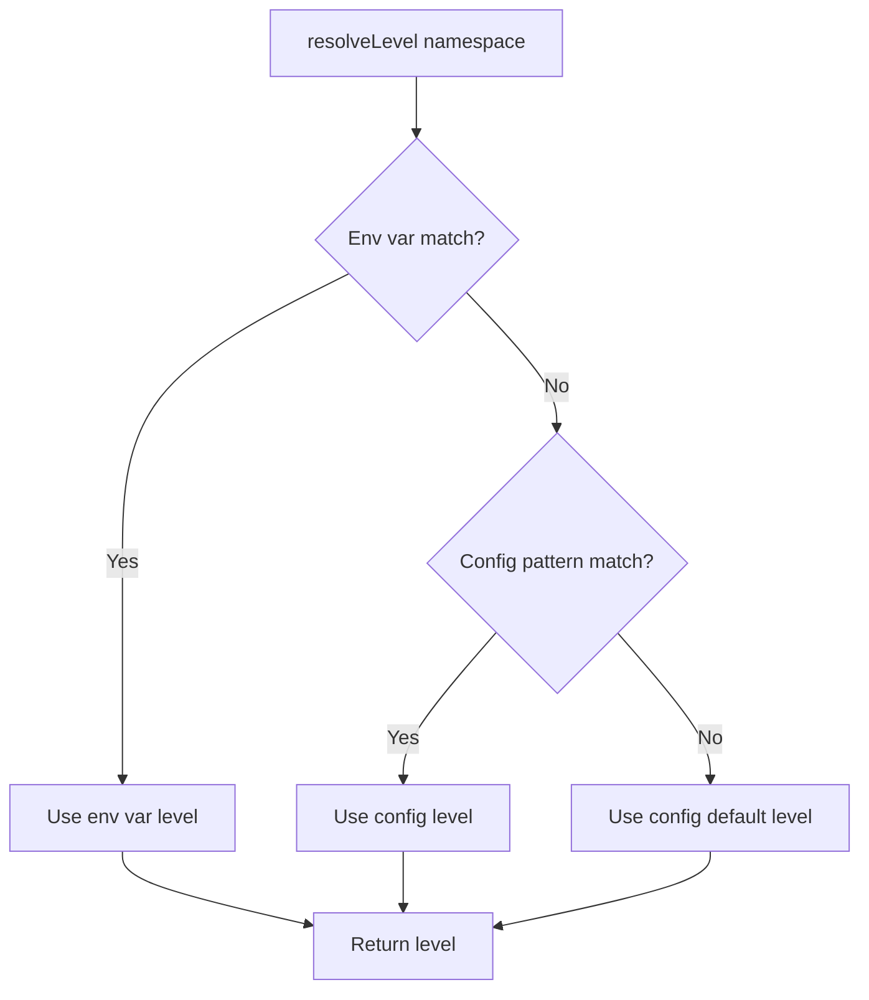

# Design Document: growi-logger

## Overview

**Purpose**: `@growi/logger` is the shared logging infrastructure for the GROWI monorepo, providing namespace-based level control, platform detection (Node.js/browser), and Express HTTP middleware — built on pino.

**Users**: All GROWI developers (logger consumers), operators (log level configuration), and the CI/CD pipeline.

**Scope**: All GROWI applications (`apps/app`, `apps/slackbot-proxy`) and packages (`packages/slack`, `packages/remark-attachment-refs`, `packages/remark-lsx`) import from `@growi/logger` as the single logging entry point. Consumer applications do not import pino or pino-http directly.

### Goals
- Provide namespace-based log level control via config objects and environment variable overrides
- Consolidate HTTP request logging under `createHttpLoggerMiddleware()` (pino-http encapsulated)
- Maintain OpenTelemetry diagnostic logger integration
- Serve as the single `@growi/logger` entry point for all monorepo consumers
- Preserve pino's worker-thread performance model (single Worker thread, child loggers)

### Non-Goals
- Adding new logging capabilities (structured context propagation, remote log shipping)
- Changing the namespace naming convention (e.g., `growi:service:page`)
- Publishing `@growi/logger` to npm (private package, monorepo-internal only)
- Migrating to pino v10 (blocked on `@opentelemetry/instrumentation-pino` v10 support)

## Architecture

### Architecture Overview

`@growi/logger` is organized into these layers:

1. **LoggerFactory** — creates and caches namespace-bound pino child loggers; `initializeLoggerFactory` spawns one Worker thread; `loggerFactory(name)` returns `rootLogger.child({ name })` with resolved level
2. **LevelResolver + EnvVarParser** — resolve log level from config patterns and env var overrides via minimatch glob matching
3. **TransportFactory** — produces pino transport config for Node.js (dev: bunyan-format, prod+FORMAT_NODE_LOG: pino-pretty singleLine, prod: raw JSON) and browser (console)
4. **HttpLoggerFactory** — encapsulates pino-http as `createHttpLoggerMiddleware()`; dev-mode morgan-like formatting dynamically imported from `src/dev/`

Key invariants:
- `loggerFactory(name: string): Logger<string>` as the sole logger creation API
- Hierarchical colon-delimited namespaces with glob pattern matching
- `pino.transport()` called **once** in `initializeLoggerFactory`; all namespace loggers share the Worker thread
- Dev-only modules (`src/dev/`) are never statically imported in production paths
- Browser-unsafe modules (pino-http) are imported lazily inside function bodies

### Architecture Pattern & Boundary Map

```mermaid
graph TB
    subgraph ConsumerApps[Consumer Applications]
        App[apps/app]
        Slackbot[apps/slackbot-proxy]
    end

    subgraph ConsumerPkgs[Consumer Packages]
        Slack[packages/slack]
        Remark[packages/remark-attachment-refs]
    end

    subgraph GrowiLogger[@growi/logger]
        Factory[LoggerFactory]
        LevelResolver[LevelResolver]
        EnvParser[EnvVarParser]
        TransportSetup[TransportFactory]
        HttpLogger[HttpLoggerFactory]
    end

    subgraph External[External Packages]
        Pino[pino v9.x]
        PinoPretty[pino-pretty]
        PinoHttp[pino-http]
        Minimatch[minimatch]
    end

    App --> Factory
    App --> HttpLogger
    Slackbot --> Factory
    Slackbot --> HttpLogger
    Slack --> Factory
    Remark --> Factory

    Factory --> LevelResolver
    Factory --> TransportSetup
    LevelResolver --> EnvParser
    LevelResolver --> Minimatch

    Factory --> Pino
    TransportSetup --> PinoPretty

    HttpLogger --> Factory
    HttpLogger --> PinoHttp
```

**Architecture Integration**:
- `@growi/logger` wraps pino with namespace-level control, transport setup, and HTTP middleware — the single logging entry point for all monorepo consumers
- Domain boundary: `@growi/logger` owns all logger creation, level resolution, and transport setup; consumer apps only call `loggerFactory(name)`
- Existing patterns preserved: factory function signature, namespace conventions, config file structure
- New components: `LevelResolver` (namespace-to-level matching), `TransportFactory` (dev/prod stream setup), `EnvVarParser` (env variable parsing)
- Steering compliance: shared package in `packages/` follows monorepo conventions
- **Dev-only isolation**: modules that are only used in development (`bunyan-format`, `morgan-like-format-options`) reside under `src/dev/` to make the boundary explicit; all are loaded via dynamic import, never statically bundled in production

### Technology Stack

| Layer | Choice / Version | Role in Feature | Notes |
|-------|------------------|-----------------|-------|
| Logging Core | pino v9.x | Structured JSON logger for Node.js and browser | Pinned to v9.x for OTel compatibility; see research.md |
| Dev Formatting | pino-pretty v13.x | Human-readable log output in development | Used as transport (worker thread) |
| HTTP Logging | pino-http v11.x | Express middleware for request/response logging | Dependency of @growi/logger; not directly imported by consumer apps |
| Glob Matching | minimatch (existing) | Namespace pattern matching for level config | Already a transitive dependency via universal-bunyan |
| Shared Package | @growi/logger | Logger factory with namespace/config/env support and HTTP middleware | New package in packages/logger/ |

## System Flows

### Logger Creation Flow





### Level Resolution Flow



## Requirements Traceability

| Requirement | Summary | Components | Interfaces | Flows |
|-------------|---------|------------|------------|-------|
| 1.1–1.4 | Logger factory with namespace support | LoggerFactory, LoggerCache | `loggerFactory()` | Logger Creation |
| 2.1–2.4 | Config-file level control | LevelResolver, ConfigLoader | `LoggerConfig` type | Level Resolution |
| 3.1–3.5 | Env var level override | EnvVarParser, LevelResolver | `parseEnvLevels()` | Level Resolution |
| 4.1–4.4 | Platform-aware logger | LoggerFactory, TransportFactory | `createTransport()` | Logger Creation |
| 5.1–5.4 | Dev/prod output formatting | TransportFactory | `TransportOptions` | Logger Creation |
| 6.1–6.4 | HTTP request logging | HttpLoggerMiddleware | `createHttpLogger()` | — |
| 7.1–7.3 | OpenTelemetry integration | DiagLoggerPinoAdapter | `DiagLogger` interface | — |
| 8.1–8.5 | Multi-app consistency | @growi/logger package | Package exports | — |
| 10.1–10.3 | Pino logger type export | LoggerFactory | `Logger<string>` export | — |
| 11.1–11.4 | Pino performance preservation | LoggerFactory | `initializeLoggerFactory`, shared root logger | Logger Creation |
| 12.1–12.6 | Bunyan-like output format | BunyanFormatTransport, TransportFactory | Custom transport target | Logger Creation |
| 13.1–13.5 | HTTP logger encapsulation | HttpLoggerFactory | `createHttpLoggerMiddleware()` | — |

## Components and Interfaces

| Component | Domain/Layer | Intent | Req Coverage | Key Dependencies | Contracts |
|-----------|-------------|--------|--------------|-----------------|-----------|
| LoggerFactory | @growi/logger / Core | Create and cache namespace-bound pino loggers | 1, 4, 8, 10, 11 | pino (P0), LevelResolver (P0), TransportFactory (P0) | Service |
| LevelResolver | @growi/logger / Core | Resolve log level for a namespace from config + env | 2, 3 | minimatch (P0), EnvVarParser (P0) | Service |
| EnvVarParser | @growi/logger / Core | Parse env vars into namespace-level map | 3 | — | Service |
| TransportFactory | @growi/logger / Core | Create pino transport/options for Node.js and browser | 4, 5, 12 | pino-pretty (P1) | Service |
| BunyanFormatTransport | @growi/logger / Transport | Custom pino transport producing bunyan-format "short" output | 12 | pino-pretty (P1) | Transport |
| HttpLoggerFactory | @growi/logger / Core | Factory for pino-http Express middleware | 6, 13 | pino-http (P0), LoggerFactory (P0) | Service |
| DiagLoggerPinoAdapter | apps/app / OpenTelemetry | Wrap pino logger as OTel DiagLogger | 7 | pino (P0) | Service |
| ConfigLoader | Per-app | Load dev/prod config files | 2 | — | — |

### @growi/logger Package

#### LoggerFactory

| Field | Detail |
|-------|--------|
| Intent | Central entry point for creating namespace-bound pino loggers with level resolution and caching |
| Requirements | 1.1, 1.2, 1.3, 1.4, 4.1, 8.5, 10.1, 10.3 |

**Responsibilities & Constraints**
- Create pino logger instances with resolved level and transport configuration
- Cache logger instances per namespace to ensure singleton behavior
- Detect platform (Node.js vs browser) and apply appropriate configuration
- Expose `loggerFactory(name: string): pino.Logger` as the public API

**Dependencies**
- Outbound: LevelResolver — resolve level for namespace (P0)
- Outbound: TransportFactory — create transport options (P0)
- External: pino v9.x — logger creation (P0)

**Contracts**: Service [x]

##### Service Interface

```typescript
import type { Logger } from 'pino';

interface LoggerConfig {
  [namespacePattern: string]: string; // pattern → level ('info', 'debug', etc.)
}

interface LoggerFactoryOptions {
  config: LoggerConfig;
}

/**
 * Initialize the logger factory module with configuration.
 * Must be called once at application startup before any loggerFactory() calls.
 */
function initializeLoggerFactory(options: LoggerFactoryOptions): void;

/**
 * Create or retrieve a cached pino logger for the given namespace.
 */
function loggerFactory(name: string): Logger;
```

- Preconditions: `initializeLoggerFactory()` called before first `loggerFactory()` call
- Postconditions: Returns a pino.Logger bound to the namespace with resolved level
- Invariants: Same namespace always returns the same logger instance

**Implementation Notes**
- The `initializeLoggerFactory` is called once per app at startup, receiving the merged dev/prod config
- Browser detection: `typeof window !== 'undefined' && typeof window.document !== 'undefined'`
- In browser mode, skip transport setup and use pino's built-in `browser` option
- The factory is a module-level singleton (module scope cache + config)
- **Performance critical**: `pino.transport()` spawns a Worker thread. It MUST be called **once** inside `initializeLoggerFactory`, not inside `loggerFactory`. Each `loggerFactory(name)` call creates a child logger via `rootLogger.child({ name })` which shares the single Worker thread. Calling `pino.transport()` per namespace would spawn N Worker threads for N namespaces, negating pino's core performance advantage.

#### LevelResolver

| Field | Detail |
|-------|--------|
| Intent | Determine the effective log level for a given namespace by matching against config patterns and env var overrides |
| Requirements | 2.1, 2.3, 2.4, 3.1, 3.2, 3.3, 3.4, 3.5 |

**Responsibilities & Constraints**
- Match namespace against glob patterns in config (using minimatch)
- Match namespace against env var-derived patterns (env vars take precedence)
- Return the most specific matching level, or the `default` level as fallback
- Parse is done once at module initialization; resolution is per-namespace at logger creation time

**Dependencies**
- Outbound: EnvVarParser — get env-derived level map (P0)
- External: minimatch — glob pattern matching (P0)

**Contracts**: Service [x]

##### Service Interface

```typescript
interface LevelResolver {
  /**
   * Resolve the log level for a namespace.
   * Priority: env var match > config pattern match > config default.
   */
  resolveLevel(
    namespace: string,
    config: LoggerConfig,
    envOverrides: LoggerConfig,
  ): string;
}
```

- Preconditions: `config` contains a `default` key
- Postconditions: Returns a valid pino log level string
- Invariants: Env overrides always take precedence over config

#### EnvVarParser

| Field | Detail |
|-------|--------|
| Intent | Parse environment variables (DEBUG, TRACE, INFO, WARN, ERROR, FATAL) into a namespace-to-level map |
| Requirements | 3.1, 3.4, 3.5 |

**Responsibilities & Constraints**
- Read `process.env.DEBUG`, `process.env.TRACE`, etc.
- Split comma-separated values into individual namespace patterns
- Return a flat `LoggerConfig` map: `{ 'growi:*': 'debug', 'growi:service:page': 'trace' }`
- Parsed once at module load time (not per-logger)

**Contracts**: Service [x]

##### Service Interface

```typescript
/**
 * Parse log-level environment variables into a namespace-to-level map.
 * Reads: DEBUG, TRACE, INFO, WARN, ERROR, FATAL from process.env.
 */
function parseEnvLevels(): LoggerConfig;
```

- Preconditions: Environment is available (`process.env`)
- Postconditions: Returns a map where each key is a namespace pattern and value is a level string
- Invariants: Only the six known env vars are read; unknown vars are ignored

#### TransportFactory

| Field | Detail |
|-------|--------|
| Intent | Create pino transport configuration appropriate for the current environment |
| Requirements | 4.1, 4.2, 4.3, 4.4, 5.1, 5.2, 5.3, 5.4, 12.1, 12.6, 12.7, 12.8 |

**Responsibilities & Constraints**
- Node.js development: return BunyanFormatTransport config (`singleLine: false`) — **dev only, not imported in production**
- Node.js production + `FORMAT_NODE_LOG`: return standard `pino-pretty` transport with `singleLine: true` (not bunyan-format)
- Node.js production default: return raw JSON (stdout) — no transport
- Browser: return pino `browser` option config (console output, production error-level default)
- Include `name` field in all output via pino's `name` option

**Contracts**: Service [x]

##### Service Interface

```typescript
import type { LoggerOptions } from 'pino';

interface TransportConfig {
  /** Pino options for Node.js environment */
  nodeOptions: Partial<LoggerOptions>;
  /** Pino options for browser environment */
  browserOptions: Partial<LoggerOptions>;
}

/**
 * Create transport configuration based on environment.
 * @param isProduction - Whether NODE_ENV is 'production'
 */
function createTransportConfig(isProduction: boolean): TransportConfig;
```

- Preconditions: Called during logger factory initialization
- Postconditions: Returns valid pino options for the detected environment
- Invariants: Browser options never include Node.js transports

**Implementation Notes**
- Dev transport: `{ target: '<resolved-path>/dev/bunyan-format.js' }` — target path resolved via `path.join(path.dirname(fileURLToPath(import.meta.url)), 'dev', 'bunyan-format.js')`; no `options` passed (singleLine defaults to false inside the module)
- Prod with FORMAT_NODE_LOG: `{ target: 'pino-pretty', options: { translateTime: 'SYS:standard', ignore: 'pid,hostname', singleLine: true } }` — standard pino-pretty, no custom prettifiers
- Prod without FORMAT_NODE_LOG (or false): raw JSON to stdout (no transport)
- Browser production: `{ browser: { asObject: false }, level: 'error' }`
- Browser development: `{ browser: { asObject: false } }` (inherits resolved level)
- **Important**: The bunyan-format transport path is only resolved/referenced in the dev branch, ensuring the module is never imported in production

#### BunyanFormatTransport

| Field | Detail |
|-------|--------|
| Intent | Custom pino transport that produces bunyan-format "short" mode output (development only) |
| Requirements | 12.1, 12.2, 12.3, 12.4, 12.5, 12.6, 12.7 |

**Responsibilities & Constraints**
- Loaded by `pino.transport()` in a Worker thread — must be a module file, not inline functions
- Uses pino-pretty internally with `customPrettifiers` to match bunyan-format "short" layout
- **Development only**: This module is only referenced by TransportFactory in the dev branch; never imported in production

**Dependencies**
- External: pino-pretty v13.x (P1) — used internally for colorization and base formatting

**Contracts**: Transport [x]

##### Transport Module

```typescript
// packages/logger/src/dev/bunyan-format.ts
// Default export: function(opts) → Writable stream (pino transport protocol)

interface BunyanFormatOptions {
  singleLine?: boolean;
  colorize?: boolean;
  destination?: NodeJS.WritableStream;
}
```

**Implementation Notes**
- Uses `messageFormat` in pino-pretty to produce the full line: timestamp + level + name + message
- `ignore: 'pid,hostname,name,req,res,responseTime'` — suppresses pino-http's verbose req/res objects in dev; the morgan-like `customSuccessMessage` already provides method/URL/status/time on the same line
- `customPrettifiers: { time: () => '', level: () => '' }` — suppresses pino-pretty's default time/level rendering (handled inside `messageFormat`)
- Level right-alignment and colorization are implemented inside `messageFormat` using ANSI codes
- `singleLine` defaults to `false` inside the module; no `options` need to be passed from TransportFactory
- Since the transport is a separate module loaded by the Worker thread, function options work (no serialization issue)
- Vite's `preserveModules` ensures `src/dev/bunyan-format.ts` → `dist/dev/bunyan-format.js`
- `NO_COLOR` environment variable is respected to disable colorization

##### Output Examples

**Dev** (bunyan-format, singleLine: false):
```
10:06:30.419Z DEBUG growi:service:PassportService: LdapStrategy: serverUrl is invalid
10:06:30.420Z  WARN growi:service:PassportService: SamlStrategy: cert is not set.
    extra: {"field":"value"}
```

**Dev HTTP log** (bunyan-format + morgan-like format, req/res suppressed):
```
10:06:30.730Z  INFO express: GET /applicable-grant?pageId=abc 304 - 16ms
```

**Prod + FORMAT_NODE_LOG** (standard pino-pretty, singleLine: true):
```
[2026-03-30 12:00:00.000] INFO (growi:service:search): Elasticsearch is enabled
```

**Prod default**: raw JSON (no transport, unchanged)

### HTTP Logging Layer

#### HttpLoggerFactory

| Field | Detail |
|-------|--------|
| Intent | Encapsulate pino-http middleware creation within @growi/logger so consumers don't depend on pino-http |
| Requirements | 6.1, 6.2, 6.3, 6.4, 13.1, 13.2, 13.3, 13.4, 13.5, 13.6 |

**Responsibilities & Constraints**
- Create pino-http middleware using a logger from LoggerFactory
- In development mode: dynamically import and apply `morganLikeFormatOptions` (customSuccessMessage, customErrorMessage, customLogLevel)
- In production mode: use pino-http's default message format (no morgan-like module imported)
- Accept optional `autoLogging` configuration for route filtering
- Return Express-compatible middleware
- Encapsulate `pino-http` as an internal dependency of `@growi/logger`

**Dependencies**
- External: pino-http v11.x (P0)
- Inbound: LoggerFactory — provides base logger (P0)

**Contracts**: Service [x]

##### Service Interface

```typescript
import type { RequestHandler } from 'express';

interface HttpLoggerOptions {
  /** Logger namespace, defaults to 'express' */
  namespace?: string;
  /** Auto-logging configuration (e.g., route ignore patterns) */
  autoLogging?: {
    ignore: (req: { url?: string }) => boolean;
  };
}

/**
 * Create Express middleware for HTTP request logging.
 * In dev: uses pino-http with morgan-like formatting (dynamically imported).
 * In prod: uses pino-http with default formatting.
 */
async function createHttpLoggerMiddleware(options?: HttpLoggerOptions): Promise<RequestHandler>;
```

- Preconditions: LoggerFactory initialized
- Postconditions: Returns Express middleware that logs HTTP requests
- Invariants: morganLikeFormatOptions applied only in dev; static file paths skipped when autoLogging.ignore provided

**Implementation Notes**
- The type assertion for Logger<string> → pino-http's Logger is handled internally, hidden from consumers
- `pino-http` moves from apps' dependencies to `@growi/logger`'s dependencies
- **Browser compatibility**: `pino-http` is imported lazily inside the function body (`const { default: pinoHttp } = await import('pino-http')`) rather than at the module top-level. This prevents bundlers (Turbopack/webpack) from pulling the Node.js-only `pino-http` into browser bundles when `@growi/logger` is imported by shared code
- `morganLikeFormatOptions` is dynamically imported (`await import('./dev/morgan-like-format-options')`) only when `NODE_ENV !== 'production'`, ensuring the module is not loaded in production
- The function is `async` to support the dynamic imports; consumers call: `express.use(await createHttpLoggerMiddleware({ autoLogging: { ignore: ... } }))`

### OpenTelemetry Layer

#### DiagLoggerPinoAdapter

| Field | Detail |
|-------|--------|
| Intent | Adapt a pino logger to the OpenTelemetry DiagLogger interface |
| Requirements | 7.1, 7.2, 7.3 |

**Responsibilities & Constraints**
- Implement the OTel `DiagLogger` interface (`error`, `warn`, `info`, `debug`, `verbose`)
- Map `verbose()` to pino's `trace()` level
- Parse JSON strings in message arguments (preserving current behavior)
- Disable `@opentelemetry/instrumentation-pino` if enabled by default

**Dependencies**
- External: pino v9.x (P0)
- External: @opentelemetry/api (P0)

**Contracts**: Service [x]

##### Service Interface

```typescript
import type { DiagLogger } from '@opentelemetry/api';

/**
 * Create a DiagLogger that delegates to a pino logger.
 * Maps OTel verbose level to pino trace level.
 */
function createDiagLoggerAdapter(): DiagLogger;
```

- Preconditions: LoggerFactory initialized, pino logger available for OTel namespace
- Postconditions: Returns a valid DiagLogger implementation
- Invariants: All DiagLogger methods delegate to the corresponding pino level

**Implementation Notes**
- Minimal change from current `DiagLoggerBunyanAdapter` — rename class, update import from bunyan to pino
- `parseMessage` helper can remain largely unchanged
- In OTel SDK configuration, replace `'@opentelemetry/instrumentation-bunyan': { enabled: false }` with `'@opentelemetry/instrumentation-pino': { enabled: false }` if the instrumentation package is present

## Data Models

Not applicable. This feature modifies runtime logging behavior and does not introduce or change persisted data models.

## Error Handling

### Error Strategy
Logging infrastructure must be resilient — a logger failure must never crash the application.

### Error Categories and Responses
- **Missing config file**: Fall back to `{ default: 'info' }` and emit a console warning
- **Invalid log level in config/env**: Ignore the entry and log a warning to stderr
- **Transport initialization failure** (pino-pretty not available): Fall back to raw JSON output
- **Logger creation failure**: Return a no-op logger that silently discards messages

### Monitoring
- Logger initialization errors are written to `process.stderr` directly (cannot use the logger itself)
- No additional monitoring infrastructure required — this is the monitoring infrastructure

