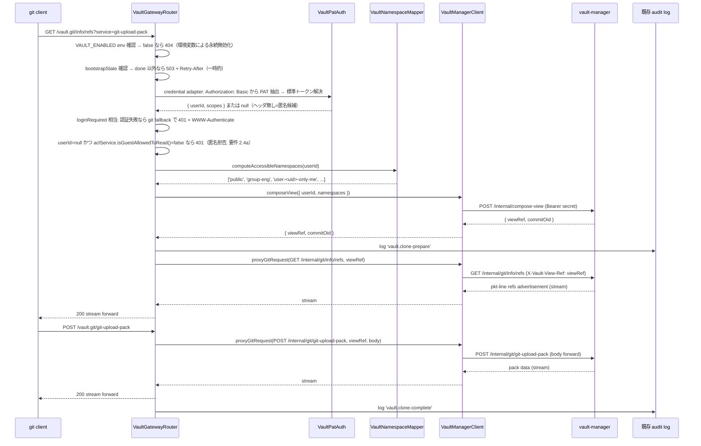
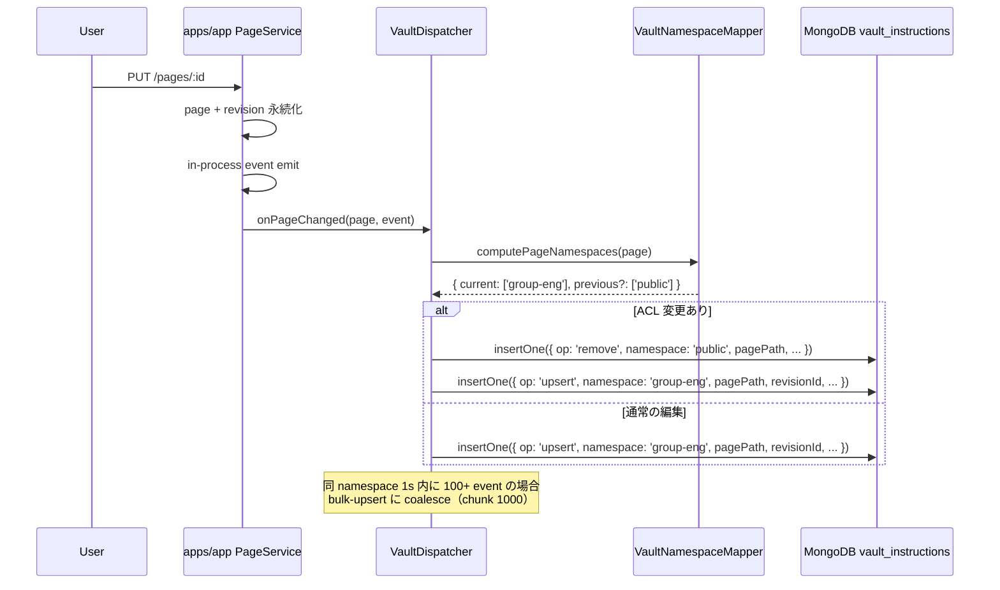
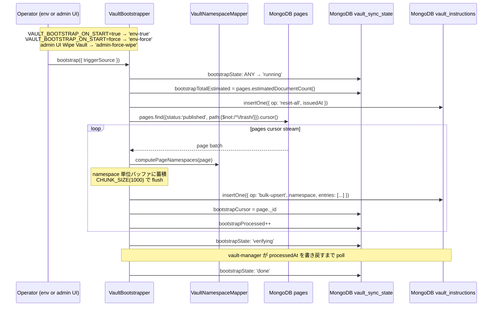

# 設計書: growi-vault-gateway

## 概要

`growi-vault-gateway` は、`apps/app` 内の feature として実装される GROWI Vault の **唯一の security perimeter** である。外部 git クライアントからの clone / fetch リクエストを受信し、GROWI 既存資産（PAT 認証 / ACL / Page・Revision モデル / audit log）を使用して認証・認可・namespace 判定・instruction dispatch を行う。

本 spec は `apps/app/src/features/growi-vault/` 配下の全コンポーネントと、`packages/core/src/interfaces/vault/` の共通 DTO 型を対象とする。git bare repo 操作・namespace tree 更新・per-user view ref 合成は `growi-vault-manager` spec の責務であり、本 spec のスコープ外である。

### Goals

- git smart HTTP エンドポイント `GET/POST /vault.git/...` を提供する
- GROWI 既存 PAT 認証基盤を再利用し、HTTP Basic Auth → ユーザー解決を実現する
- GROWI ACL に基づいて per-user の accessible namespace 集合を決定論的に計算する
- ページ変更イベントを durable な `vault_instructions` outbox に書き込む
- 初回有効化・災害復旧時の bootstrap を apps/app 主導で実行する
- vault-manager への compose-view RPC と git body proxy を提供する
- 管理者が機能 ON/OFF・bootstrap 進捗・audit log を管理できる UI を提供する

### Non-Goals

- bare repo 操作・git object I/O・git upload-pack の spawn（→ growi-vault-manager）
- namespace tree の更新・per-user view ref 合成（→ growi-vault-manager）
- vault_instructions の change stream 消化（→ growi-vault-manager）
- PAT 発行・管理 UI（→ 既存 AccessToken 機能）
- GROWI ACL 評価ロジック本体（→ page-grant.ts）

---

## 境界コミットメント

### apps/app の追加責務（`src/features/growi-vault/`）

- `GET/POST /vault.git/...` を唯一の対外エンドポイントとして提供する
- 認証・認可は apps/app 標準 middleware 構成を共有する（要件 11）。git 固有の差異のみを 2 つの seam に局所化する: (a) `Authorization: Basic base64(x:PAT)` から PAT を抽出し標準トークン解決へ橋渡しする credential adapter、(b) 認証失敗時に `/login` リダイレクトではなく git 互換の `401 + WWW-Authenticate: Basic` を返す `loginRequired` の `fallback`
- ゲスト/匿名アクセスの可否は `aclService.isGuestAllowedToRead()`（= `loginRequiredFactory(crowi, true)` の判定）に委譲する。許可されない場合（デフォルト `restrictGuestMode='Deny'` / `wikiMode='private'`）は匿名 clone を 401 で拒否する（要件 2.4a）
- ユーザーがアクセス可能な namespace 集合の決定（GROWI ACL 評価）
- ページの所属 namespace の決定（grant / grantedGroups / creator から）
- ページ変更イベントの購読 → vault_instructions コレクション書き込み
- 初回有効化 / 災害復旧時の bootstrap 主導（pages cursor stream + seed instructions 発行）
- vault-manager への compose-view RPC 呼び出し
- git request body の vault-manager への透過 proxy
- 既存 audit log への vault イベント記録
- bootstrap 操作 / Wipe Vault (kill switch) / 状態観測の admin 設定 UI

### 許可された依存関係

- 既存 `Page` / `Revision` Mongoose モデル（read-only）
- `access-token-parser` ミドルウェア（標準トークン解決）
- `extractAccessToken` / `X_GROWI_ACCESS_TOKEN_HEADER_NAME`（PR #11244。token-source 単一情報源、`X-GROWI-ACCESS-TOKEN` 対応。master → dev/8.0.x → feat/growi-vault 経由で到達）
- `loginRequiredFactory(crowi, isGuestAllowed, fallback)` ミドルウェア（ゲスト判定 + ユーザー必須化、第3引数で git 用 fallback を差し替え）
- `aclService.isGuestAllowedToRead()`（ゲスト読み取り可否の単一情報源）
- `page-grant.ts` の `isUserGrantedPageAccess`、`generateGrantCondition`
- `UserGroupRelation` / `ExternalUserGroupRelation` の group resolution
- 既存 audit log インフラ
- `@growi/core` の DTO 型

### 再検証トリガー

- GROWI Page モデルの grant / grantedGroups スキーマ変更
- access-token-parser / `loginRequiredFactory` / `aclService` のインターフェース変更
- `security:restrictGuestMode` / `security:wikiMode` の仕様変更（ゲスト判定への影響）
- `@growi/core` の Vault DTO 型の breaking change
- ページパスエンコーディング規則の変更

---

## アーキテクチャ

### コンポーネント構成図

```mermaid
graph TB
    subgraph External [外部]
        Cli[git クライアント]
    end

    subgraph AppsApp [apps/app - features/growi-vault/]
        VGate[VaultGatewayRouter]
        VAuth[VaultPatAuth middleware]
        VMap[VaultNamespaceMapper]
        VDisp[VaultDispatcher]
        VBoot[VaultBootstrapper]
        VClient[VaultManagerClient]
        VSettings[VaultSettingsService]
        VAdmin[VaultAdminSettings UI]
        AuditLog[(既存 audit log)]
    end

    subgraph VaultMgr [apps/growi-vault-manager - internal only]
        Compose[POST /internal/compose-view]
        GitProxy[GET|POST /internal/git/...]
    end

    subgraph Mongo [MongoDB]
        Pages[pages]
        AT[accesstokens]
        UGR[user-group-relations]
        Inst[vault_instructions]
        SyncState[vault_sync_state bootstrap* fields]
        Settings[configs app:vault*]
    end

    Cli -->|HTTPS git smart HTTP| VGate
    VGate --> VAuth
    VAuth -->|PAT 検証| AT
    VGate --> VMap
    VMap --> Pages
    VMap --> UGR
    VGate -->|shared secret| VClient
    VClient -->|POST /internal/compose-view| Compose
    VClient -->|GET|POST /internal/git/...| GitProxy
    VDisp -->|on PageService event| Inst
    VBoot -->|reset-all + bulk-upsert| Inst
    VBoot --> Pages
    VBoot --> SyncState
    VGate -->|bootstrapState read| SyncState
    VAdmin --> Settings
    VGate -->|feature flag| Settings
    VGate --> AuditLog
```

---

## ファイル構成計画

### apps/app に追加

```
apps/app/src/features/growi-vault/
├── interfaces/
│   ├── vault-instruction.ts           # @growi/core からの re-export（ローカル利用のため）
│   └── index.ts
├── server/
│   ├── routes/
│   │   ├── vault-gateway.ts           # GET/POST /vault.git/* — auth + proxy
│   │   └── vault-admin.ts             # admin API（bootstrap 開始 / 進捗 / wipe (kill switch) / storage stats）
│   ├── services/
│   │   ├── vault-namespace-mapper.ts  # ACL → namespace 集合 / page → namespace 計算
│   │   ├── vault-dispatcher.ts        # PageService event 購読 + vault_instructions 書き込み
│   │   ├── vault-bootstrapper.ts      # bootstrap 主導（reset-all + pages cursor → seed instructions）
│   │   ├── vault-manager-client.ts    # vault-manager との HTTP RPC + body proxy
│   │   └── vault-settings-service.ts  # vaultEnabled, endpoint, secret の取得（全て ConfigSource.env で env のみから読む）
│   ├── middlewares/
│   │   └── vault-pat-auth.ts          # access-token-parser を vault scope で composition
│   ├── models/
│   │   ├── vault-instruction.ts       # 書き込み用 Mongoose model（owned: apps/app）
│   │   └── vault-sync-state.ts        # bootstrap 進捗 owned by apps/app（bootstrap* fields）
│   └── index.ts                       # feature 登録
└── client/
    └── admin/
        ├── VaultAdminSettings.tsx     # 機能 ON/OFF + bootstrap 進捗表示 + audit log filter リンク
        └── index.ts
```

### packages/core に追加

```
packages/core/src/interfaces/vault/
├── vault-instruction.ts   # VaultInstructionDoc, VaultInstructionOp, VaultBulkUpsertEntry, VaultInstructionPayload
├── vault-compose-view.ts  # ComposeViewRequest, ComposeViewResponse, Namespace
└── index.ts               # barrel
```

### 既存ファイルへの修正

- `apps/app/src/server/models/config-definition.ts` — `app:vaultEnabled`・`app:vaultManagerEndpoint`・`app:vaultManagerInternalSecret` を追加
- `apps/app/src/server/routes/index.ts`（または app 起動箇所）— `VaultGatewayRouter` を登録
- `packages/core/package.json` — `./dist/interfaces/vault` の export を追加

---

## システムフロー

### clone / fetch / pull 同期フロー



### page edit → vault sync 非同期フロー



### Initial Bootstrap フロー



---

## コンポーネントとインターフェース

### VaultGatewayRouter

| フィールド | 詳細 |
|-----------|------|
| Intent | git smart HTTP の唯一の対外エンドポイント。feature flag・auth・ACL・proxy・audit を統括する |
| 要件カバレッジ | 1, 2.4, 6, 7.1, 8.1, 10 |

**API コントラクト**

| Method | Endpoint | Auth | Response Content-Type | Errors |
|--------|----------|------|----------------------|--------|
| GET | `/vault.git/info/refs?service=git-upload-pack` | HTTP Basic | `application/x-git-upload-pack-advertisement` | 401, 404, 503 |
| POST | `/vault.git/git-upload-pack` | HTTP Basic | `application/x-git-upload-pack-result` | 401, 404, 503 |
| ANY | `/vault.git/git-receive-pack` | — | — | 403 |
| OTHER | `/vault.git/*` | — | — | 404 |

**責務と制約**
- `VAULT_ENABLED` 環境変数が false の場合、`info/refs` および `git-upload-pack` に対して 404 を返す（環境変数による永続的な設定状態であり「一時的に処理できない」を意味する 503 ではない。Retry-After も付与しない）
- `bootstrapState !== 'done'` の場合、全 clone / fetch に `503 + Retry-After`（bootstrap は一時的な状態であり 503 が適切）
- `git-receive-pack` への全リクエストに 403 `read-only repository`
- 成功・失敗とも既存 audit log にイベントを記録する
- 認証・認可は標準 middleware チェーンに委譲する（下記「認証・認可ミドルウェア構成」参照）。匿名は `aclService.isGuestAllowedToRead()` が許可する場合のみ通す（要件 2.4a）
- apps/app は git wire format を解釈せず、HTTP body を vault-manager にパイプし stdout をクライアントにパイプするだけ

---

### 認証・認可ミドルウェア構成（標準チェーンとの整合）

| フィールド | 詳細 |
|-----------|------|
| Intent | `/vault.git/*` を apps/app 標準の middleware チェーンに乗せ、認可ロジックの並行実装を排除する |
| 要件カバレッジ | 11, 2.4a, 10.3 |

**標準チェーンとの対応**

canonical な apiv3 ルート（例: `apiv3/pages`）は次の合成を使う:

```
rateLimiter → [maintenanceMode] → accessTokenParser([SCOPE...]) → loginRequired(crowi, true) → [excludeReadOnlyUser] → handler
```

`/vault.git/*` も同じ並びを共有し、git 固有の差異だけを 2 つの seam に局所化する:

| チェーン要素 | vault gateway での扱い |
|---|---|
| rateLimiter | 既存をそのまま適用（mount は rate limiter の後段。要件 10.3） |
| maintenanceMode | 標準 middleware を適用（停止時は gateway も一貫して unavailable を返す） |
| トークン解決 | `extractAccessToken`（PR #11244）と同一 precedence を共有（`Bearer` > `X-GROWI-ACCESS-TOKEN` > query > body）。git 用に Basic password の fallback を 1 段足すだけ（seam #1 = VaultPatAuth）。下記「reverse proxy の Basic 認証共存」参照 |
| ゲスト / ユーザー必須化 | `loginRequiredFactory(crowi, isGuestAllowed=true, gitFallback)` を再利用。`isGuestAllowedToRead()` がゲスト可否の単一情報源 |
| 認証失敗時の応答 | seam #2: `gitFallback` が `/login` リダイレクトの代わりに `401 + WWW-Authenticate: Basic`（git 互換）を返す |
| readOnly ユーザー | clone は read 操作のため `excludeReadOnlyUser` は適用しない（意図的逸脱・下記） |
| CSRF / `certifyOrigin` | git クライアントは origin/CSRF を持たないため適用しない（意図的逸脱・下記） |

**意図的逸脱（要件 11.4 — 暗黙差分にしない）**

- **CSRF / `certifyOrigin` 非適用**: git smart HTTP はブラウザ same-origin の枠外。`info/refs`(GET) と `git-upload-pack`(POST) はいずれも GROWI のデータを変更しない read 系であり、認可は PAT で担保される。
- **`excludeReadOnlyUser` 非適用**: vault clone は読み取り専用のため read-only ユーザーにも許可する。標準 `accessTokenParser` は readOnly ユーザーを一律弾く（`access-token.ts`）が、それは write 系 API 向けの制約であり read-only clone には過剰。この判断は design 上の明示決定として記録する。

> これにより `vault-admin` / `vault-page` ルータ（既に `loginRequiredFactory(crowi)` を使用）と gateway の middleware 方針が feature 内で一貫する。

---

### VaultPatAuth

| フィールド | 詳細 |
|-----------|------|
| Intent | git 固有の認証トランスポートを標準 middleware 構成へ橋渡しする credential adapter（seam #1）。Basic password を PAT として解釈し、標準トークン解決でユーザーを解決する。認可判定（ゲスト可否・ユーザー必須化）は `loginRequired` / `aclService` に委譲し、自前で再実装しない（要件 11） |
| 要件カバレッジ | 2, 11 |

```typescript
type VaultAuthResult = {
  readonly userId: string;
  readonly scopes: ReadonlyArray<string>;
} | null; // null = 匿名（public のみアクセス可）

interface VaultPatAuth {
  authenticate(req: Request): Promise<VaultAuthResult>;
}
```

**実装ノート**
- git クライアントは `Authorization: Basic base64(anyuser:TOKEN)` を送る。adapter は password 部のみを PAT として取り出す（username は無視）
- トークンソース解決は PR #11244 の `extractAccessToken(req)`（`Bearer` > `X-GROWI-ACCESS-TOKEN` > query > body）を再利用し、それが null のとき `Authorization: Basic` の password 部を git ネイティブ fallback として使う。検証は `AccessToken.findUserIdByToken(rawToken, [SCOPE.READ.FEATURES.PAGE])` を共有する
- `Authorization` ヘッダーが存在しない場合は `null`（匿名候補）を返す。匿名の最終可否は後段の guest gate（`aclService.isGuestAllowedToRead()`）が決める — adapter は可否を判断しない
- 認証失敗（無効/期限切れ/revoke）および guest 拒否時は `WWW-Authenticate: Basic realm="GROWI Vault"` を含む 401。これは `loginRequiredFactory(crowi, true, gitFallback)` の `fallback` から返す（`/login` リダイレクトを git 用に置換）
- エラーメッセージにページ情報を含めない（要件 2.3）

> 設計移行ノート: 旧実装は adapter 内で「ヘッダ無し → 即 `['public']` 許可」を独自に決めていたため、`restrictGuestMode='Deny'` でも匿名 clone が通る ACL すり抜けがあった（要件 2.4a で是正）。可否判定を `aclService` に一本化し、adapter は transport 変換のみを担う。

---

### VaultNamespaceMapper

| フィールド | 詳細 |
|-----------|------|
| Intent | (1) ユーザーがアクセス可能な namespace 集合を計算、(2) page が所属する namespace を計算する |
| 要件カバレッジ | 3 |

```typescript
type Namespace = string; // 'public' | `group-${string}` | `user-${string}-only-me` | 'restricted-link'

interface VaultNamespaceMapper {
  // clone/pull 時: ユーザーがアクセスできる namespace 全集合
  computeAccessibleNamespaces(userId: string | null): Promise<ReadonlyArray<Namespace>>;

  // page edit 時: ページが属する namespace（ACL 変更時は前後 namespace を返す）
  // 1 ページが複数の grantedGroups を持つ場合、current に複数の namespace が返る
  computePageNamespaces(page: IPage): { current: ReadonlyArray<Namespace>; previous?: ReadonlyArray<Namespace> };
}
```

**マッピングルール**

| GRANT 種別 | namespace |
|------------|-----------|
| GRANT_PUBLIC | `'public'` |
| GRANT_RESTRICTED（anyone-with-link） | `'restricted-link'` |
| GRANT_USER_GROUP（grantedGroups[i]） | グループごとに `'group-<gid>'`（複数 group ACL は複数 namespace） |
| GRANT_OWNER（creator） | `'user-<creator-id>-only-me'` |
| `/trash` 配下 | namespace 不発行（除外） |
| status !== 'published' | namespace 不発行（除外） |

**accessible namespaces 計算**
- 認証済みユーザー: `['public', 'restricted-link', 'group-<g1>', ..., 'user-<uid>-only-me']`
- 匿名: `['public']`（要件 3.2）。ただしこの匿名分岐は guest gate を通過した場合のみ到達する（`isGuestAllowedToRead()=false` の匿名は gateway 層で 401 済み・要件 2.4a）

**実装ノート**
- 既存 `generateGrantCondition` / `isUserGrantedPageAccess` を再利用
- group descendants 解決は既存 `findAllUserGroupIdsRelatedToUser` を利用

---

### VaultDispatcher

| フィールド | 詳細 |
|-----------|------|
| Intent | PageService の in-process event を購読し、vault_instructions コレクションに durable instruction を書き込む |
| 要件カバレッジ | 4 |

```typescript
type VaultInstructionOp =
  | 'upsert'
  | 'bulk-upsert'
  | 'remove'
  | 'rename-prefix'
  | 'grant-change-prefix'
  | 'reset-all';

interface VaultBulkUpsertEntry {
  readonly pageId: string;
  readonly pagePath: string;
  readonly revisionId: string;
}

interface VaultInstructionPayload {
  readonly op: VaultInstructionOp;
  readonly namespace: Namespace;
  readonly pageId?: string;
  readonly pagePath?: string;
  readonly revisionId?: string;
  readonly entries?: ReadonlyArray<VaultBulkUpsertEntry>;
  readonly oldPrefix?: string;
  readonly newPrefix?: string;
  readonly fromNamespace?: Namespace;
}

interface VaultDispatcher {
  onPageChanged(event: PageChangedEvent): Promise<void>;
  onBulkOperation(event: BulkPageOperationEvent): Promise<void>;
}
```

**単一ページ操作の挙動**

- `create` / `update`: `current` 配列の各 namespace に `upsert` 1 件ずつ（pagePath・revisionId・pageId を含む）
- `delete`: `current` 配列の各 namespace から `remove` 1 件ずつ（pagePath は削除直前の値）
- ACL 変更: `previous` 配列の各 namespace に `remove` + `current` 配列の各 namespace に `upsert`（各 namespace ごとに 1 件ずつ）
- 単一ページ rename（`onPageRenamed`）: `current` 配列の各 namespace に `remove`（oldPath）+ `upsert`（newPath）を 1 件ずつ。ページ自身は namespace tree 上で blob（`<name>.md`）として保持されるため、ディレクトリ subtree 移動である `rename-prefix` では再配置できない（`rename-prefix` は `type === 'tree'` のエントリのみ移動する）。remove + upsert で blob を確実に旧パスから削除し新パスに再作成する。grant は rename で不変なので old/new は同一 namespace 集合に属する

**coalesce 挙動**

- 同一 namespace 向けの `upsert` が coalesce window（既定 1 秒）内に 100 件以上発生した場合、dispatcher は 1 件の `bulk-upsert` にまとめる
- coalesce 対象は `create` / `update` のみ（`remove` / `rename-prefix` / `grant-change-prefix` は混在させない）
- chunk size 上限はデフォルト 1000 entries / instruction

**prefix primitive（親ページのバルク操作）**

- 親ページ rename: 2 経路に分離する。(1) rename されたページ**自身**の blob は `'rename'` イベント購読 → `onPageRenamed`（remove + upsert、上記「単一ページ操作」参照）で再配置する。(2) **descendants** の subtree は `pageEvent.emit('updateMany', pages, user, { oldPagePathPrefix, newPagePathPrefix })` 購読 → 影響を受ける各 namespace に `rename-prefix` 1 件（descendants 数 N によらず namespace 数 M 件）で移動する。`rename-prefix` は subtree（`type === 'tree'`）専用であり、ページ自身の blob には作用しないため、両経路の併用で旧パスの blob・subtree がともに残らないことを保証する
- 親ページ grant 一括変更: 影響を受けた各 page に対して per-page `acl-change` instruction を発行（remove from previous namespaces + upsert to current namespaces）。`pageEvent.emit('descendantsGrantChanged', { affectedPages, user })` を購読する
- 当初設計で想定した `grant-change-prefix` op は subtree 単位の prefix scope を持たないため、現状は使用していない（将来の vault-manager 設計改修で再評価）

**実装ノート**
- 既存 GROWI `PageEvent`（`apps/app/src/server/events/page.ts`）に subscribe
- `syncDescendants` 完了 event 等の境界 event を購読し、descendants 処理途中での per-page event を受信しないようにする
- 書き込み失敗時は WARN ログ + リトライ（ページ編集 response とは切り離す）

---

### VaultBootstrapper

| フィールド | 詳細 |
|-----------|------|
| Intent | 起動時の env-driven bootstrap、および admin UI からの kill switch (forceWipe) を主導する。pages cursor stream を回し seed instructions を vault_instructions に発行することで vault-manager が steady state と同一パスで処理できるようにする |
| 要件カバレッジ | 5 |

```typescript
type TriggerSource = 'env-true' | 'env-force' | 'admin-force-wipe';

interface VaultBootstrapper {
  /**
   * Kill switch from admin UI. Returns once state='running' is committed
   * (and reset-all is queued); the full pipeline continues asynchronously.
   * This is the only admin-triggered bootstrap entry point.
   */
  wipeAndRebootstrap(opts: {
    triggerSource: 'admin-force-wipe';
    onRunning?: () => void;
  }): Promise<void>;
  getStatus(): Promise<{
    state: 'pending' | 'running' | 'verifying' | 'done' | 'failed' | 'retrying' | 'escalated';
    processed: number;
    totalEstimated: number | null;
    cursor: string | null;
    startedAt: Date | null;
    completedAt: Date | null;
    lastError: string | null;
  }>;
}
```

> NOTE: 過去の MVP では `start({ triggerSource: 'admin-ui' })` および対応する管理 UI ボタン (Prepare GROWI Vault) を提供していたが、内部マッピング (`admin-ui` → `'force'` → FORCE_WIPE) により Wipe Vault と機能的に等価であった。admin が 2 つのボタンに別々の振る舞いを期待することによる UX 混乱を避けるため削除し、admin-triggered bootstrap は `wipeAndRebootstrap` のみに統一した。初回有効化は `VAULT_BOOTSTRAP_ON_START=true` env で行う。

**wipeAndRebootstrap() の挙動**

既存の `forceWipe` 経路（`VAULT_BOOTSTRAP_ON_START=force` で発火するのと同じパス）を共有する。

```
1. triggerSource='admin-force-wipe' で executeBootstrap({ forceWipe: true, ... }) を呼び出す
2. bootstrap state machine が forceOverride イベントで ANY state → running に強制遷移
3. vault_instructions に op: 'reset-all' を 1 件 insert（vault-manager 側で全 namespace の repository が破棄される）
4. onRunning callback を発火（HTTP route がここで 202 を返す）
5. pages cursor stream を走査して seed instructions を発行
6. bootstrapState = 'verifying' に遷移
7. vault-manager が processedAt を書き戻すまで poll
8. 完走で bootstrapState = 'done' へ
```

> kill switch 中はもちろん `bootstrapState !== 'done'` のため、すべての clone / fetch リクエストは 503 + Retry-After で応答される。これにより repository が空 / 不完全な状態でユーザに不整合なデータが見えることはない。

**Bootstrap SLA**

| ページ数 | 期待完走時間 |
|---|---|
| 10,000 pages | < 10 分 |
| 30,000 pages | < 30 分 |

---

### VaultManagerClient

| フィールド | 詳細 |
|-----------|------|
| Intent | vault-manager との HTTP 通信。compose-view RPC と git protocol body の透過 proxy を提供する |
| 要件カバレッジ | 6 |

```typescript
interface ComposeViewRequest {
  readonly userId: string | null;
  readonly namespaces: ReadonlyArray<Namespace>;
}

interface ComposeViewResponse {
  readonly viewRef: string;  // 'user-<uid>-view' または 'anonymous-view'
  readonly commitOid: string;
}

interface VaultManagerClient {
  composeView(req: ComposeViewRequest): Promise<ComposeViewResponse>;

  proxyGitRequest(opts: {
    method: 'GET' | 'POST';
    path: '/internal/git/info/refs' | '/internal/git/git-upload-pack';
    viewRef: string;
    queryString?: string;
    requestBody?: NodeJS.ReadableStream;
  }): Promise<{ status: number; headers: Record<string, string>; body: NodeJS.ReadableStream }>;

  // admin UI のストレージ観測用。vault_namespace_state を直接 read する代わりに RPC 経由で取得する
  getStorageStats(): Promise<StorageStatsResponse>;
}
```

**実装ノート**
- 全 request に `Authorization: Bearer ${VAULT_MANAGER_INTERNAL_SECRET}` を付与
- `proxyGitRequest` のリクエストには `Authorization: Bearer <secret>` および `X-Vault-View-Ref: {viewRef}` ヘッダーを付与して vault-manager の GitProxyController に伝達する
- proxy は streaming（apps/app 上でフルバッファ化しない）
- vault-manager エラー時は 502 としてクライアントに返す
- timeout は長め（10 分）に設定可能

---

### VaultSettingsService

| フィールド | 詳細 |
|-----------|------|
| Intent | apps/app の config から Vault 関連設定を解決する |
| 要件カバレッジ | 7 |

```typescript
interface VaultSettings {
  readonly enabled: boolean;
  readonly managerEndpoint: string;
  readonly managerInternalSecret: string;
}

interface VaultSettingsService {
  getSettings(): Promise<VaultSettings>;
}
```

**config-definition.ts への追加**

```typescript
'app:vaultEnabled': {
  envVarName: 'VAULT_ENABLED',
  isSecret: false,
  publishToClient: false,
  defaultValue: false,
  // VaultSettingsService は ConfigSource.env を指定して env のみから読み込む
},
'app:vaultManagerEndpoint': {
  envVarName: 'VAULT_MANAGER_ENDPOINT',
  isSecret: false,
  publishToClient: false,
  // env からのみ読み込み（DB ストア無効）
},
'app:vaultManagerInternalSecret': {
  envVarName: 'VAULT_MANAGER_INTERNAL_SECRET',
  isSecret: true,
  publishToClient: false,
  // env からのみ読み込み（DB ストア無効）
},
```

---

### VaultAdminSettings（UI）

| フィールド | 詳細 |
|-----------|------|
| Intent | 管理者向けの Vault 状態観測 + bootstrap 操作 + kill switch (Wipe) + audit log リンク UI |
| 要件カバレッジ | 8 |

**画面構成**

| セクション | 内容 |
|---|---|
| Feature status (read-only) | `VAULT_ENABLED` の現在値を表示（環境変数で設定されているため UI からは変更不可。変更は再起動を要する旨を併記） |
| Kill switch | "Wipe Vault" ボタン（`POST /_api/v3/vault/wipe` を発火）。確認モーダル (Yes / Cancel) を表示。発火すると全 namespace の repository が破棄され bootstrapState は未完了状態に戻る。これが admin UI からの唯一の bootstrap 発火経路 |
| Bootstrap status | `state` (pending/running/verifying/done/failed/retrying/escalated) + 進捗バー (`processed / totalEstimated`) + `startedAt` / `completedAt` / `lastError` |
| Storage observability | `GET /internal/storage-stats` 経由で取得した namespace 数 / 合計 commit 数 / loose object 数 / repo size / 最終 squash・gc 時刻（vault_namespace_state を直接 read しない） |
| Audit log filter link | 既存 audit log UI に "vault.*" フィルターを適用するリンク |

**UX のポイント**
- `vaultEnabled` トグルは提供しない（環境変数 `VAULT_ENABLED` でデプロイ時に固定）
- 「Prepare GROWI Vault」「Bootstrap」等の独立した非破壊的 bootstrap ボタンは提供しない。初回有効化は `VAULT_BOOTSTRAP_ON_START=true` env で行い、運用中の手動再 bootstrap は Wipe Vault で発火する
- Wipe Vault は破壊的操作であるため確認モーダルを介する（テキスト入力は不要、Yes/Cancel のみ）。発火は audit log に `vault.wipe` として必ず記録する
- bootstrap 中の `vault_instructions.processedAt` の遅れは内部観測のみ（admin に過剰情報を出さない）

---

## データモデル

### vault_instructions コレクション（apps/app が write、vault-manager が read + processedAt 更新）

```
{
  _id: ObjectId,
  op: 'upsert' | 'bulk-upsert' | 'remove' | 'rename-prefix' | 'grant-change-prefix' | 'reset-all',
  payload: {
    namespace: string,
    pageId: ObjectId | null,
    pagePath: string | null,
    revisionId: ObjectId | null,
    entries: Array<{
      pageId: ObjectId,
      pagePath: string,
      revisionId: ObjectId
    }> | null,                    // bulk-upsert: 1 chunk に同 namespace の N entries（上限 1000）
    oldPrefix: string | null,
    newPrefix: string | null,
    fromNamespace: string | null
  },
  issuedAt: Date,
  processedAt: Date | null,
  attempts: number,
  lastError: string | null
}
インデックス:
  { processedAt: 1, issuedAt: 1 }
  { processedAt: 1 } TTL: expireAfterSeconds 86400
```

### vault_sync_state コレクション（フィールド単位で owner 分離）

```
{
  _id: 'singleton',

  // vault-manager owned（本 spec はこれらを read のみ）
  resumeToken: object | null,
  lastProcessedAt: Date,
  watcherInstanceId: string,

  // apps/app owned（本 spec が write）
  bootstrapState: 'pending' | 'running' | 'done' | 'failed',
  bootstrapCursor: ObjectId | null,       // 最後に処理した page._id（resume 用）
  bootstrapStartedAt: Date | null,
  bootstrapCompletedAt: Date | null,
  bootstrapTotalEstimated: number | null,
  bootstrapProcessed: number,
  bootstrapLastError: string | null       // 失敗時のメッセージ。BootstrapStatus.lastError として API に surface
}
```

> VaultGatewayRouter は `bootstrapState` を read して gating 判定に使う。`bootstrap*` フィールドは apps/app の VaultBootstrapper が write し、`resumeToken` 等は vault-manager が write する。両者の write は disjoint なフィールド集合であるため write 競合は発生しない。

### Configuration（configs コレクションへの追加）

| key | type | 設定方法 | 用途 |
|-----|------|---------|------|
| `app:vaultEnabled` | boolean | **env var only** | 機能 ON/OFF（デプロイ時固定、ランタイム変更不可） |
| `app:vaultManagerEndpoint` | string | **env var only** | vault-manager の URL |
| `app:vaultManagerInternalSecret` | string | **env var only** | shared secret |

### @growi/core 共通 DTO 型

**packages/core/src/interfaces/vault/vault-instruction.ts**

```typescript
export type VaultInstructionOp =
  | 'upsert'
  | 'bulk-upsert'
  | 'remove'
  | 'rename-prefix'
  | 'grant-change-prefix'
  | 'reset-all';

export type Namespace = string;

export interface VaultBulkUpsertEntry {
  readonly pageId: string;
  readonly pagePath: string;
  readonly revisionId: string;
}

export interface VaultInstructionPayload {
  readonly namespace?: Namespace; // undefined when op === 'reset-all'
  readonly pageId?: string;
  readonly pagePath?: string;
  readonly revisionId?: string;
  readonly entries?: ReadonlyArray<VaultBulkUpsertEntry>;
  readonly oldPrefix?: string;
  readonly newPrefix?: string;
  readonly fromNamespace?: Namespace;
}

export interface VaultInstructionDoc {
  readonly _id: string;
  readonly op: VaultInstructionOp;
  readonly payload: VaultInstructionPayload;
  readonly issuedAt: Date;
  readonly processedAt: Date | null;
  readonly attempts: number;
  readonly lastError: string | null;
}
```

**packages/core/src/interfaces/vault/vault-compose-view.ts**

```typescript
export interface ComposeViewRequest {
  readonly userId: string | null;
  readonly namespaces: ReadonlyArray<Namespace>;
}

export interface ComposeViewResponse {
  readonly viewRef: string;
  readonly commitOid: string;
}
```

**packages/core/src/interfaces/vault/vault-storage-stats.ts**

```typescript
export interface StorageStatsResponse {
  readonly namespaceCount: number;        // vault_namespace_state の distinct namespace 数
  readonly totalCommitCount: number;       // 全 namespace の commit chain depth の合計
  readonly looseObjectCount: number;       // bare repo 内の loose object 数
  readonly repoSizeBytes: number;          // bare repo ディレクトリの総バイト数
  readonly lastSquashAt: string | null;    // ISO 8601、未実行時は null
  readonly lastGcAt: string | null;        // ISO 8601、未実行時は null
}
```

---

## エラーハンドリング

| エラー種別 | HTTP 応答 | 挙動 |
|-----------|---------|------|
| 認証失敗 | 401 + `WWW-Authenticate` | ページ情報を含まないメッセージ |
| 匿名アクセス（ゲスト拒否設定） | 401 + `WWW-Authenticate` | `aclService.isGuestAllowedToRead()=false` のとき匿名 clone を拒否し PAT を要求（要件 2.4a）。public すら応答しない |
| 機能無効（`VAULT_ENABLED=false`） | 404 + git エラー文字列 | `info/refs` / `git-upload-pack` に適用。環境変数による永続的な設定状態のため 503 ではなく 404。Retry-After なし |
| bootstrap 未完了 | 503 + `Retry-After` | bootstrapState が done 以外（一時的な状態） |
| push 試行 | 403 `read-only repository` | git クライアントに表示 |
| ACL 評価エラー | 500 | ログ記録後、接続を閉じる |
| compose-view RPC 失敗 | 502 | apps/app から client へ |
| upload-pack proxy 失敗 | 502 | 同上 |
| vault-manager 全体不到達 | 503 | apps/app は warning ログ |
| vault_instructions 書き込み失敗 | — | WARN ログ + リトライ（ページ編集 response とは切り離す） |

---

## セキュリティ考慮事項

- **single security perimeter**: vault-manager は外部からアクセス不可（k8s NetworkPolicy）。認証・ACL 評価は全て apps/app で完結する
- **shared secret**: env var only、DB に保存しない。GROWI Cloud は k8s Secret で両 pod に注入
- **情報漏洩防止**: ACL フィルターは apps/app の VaultNamespaceMapper で確定し、vault-manager に渡る namespace 集合は既にフィルター済み（要件 3.8 / Req 3.5）
- **認証失敗レスポンス**: エラーメッセージにページリスト・存在情報を含めない（要件 2.3）
- **既存 audit log への統合**: 認証失敗（auth-failure）も記録しブルートフォース検出を可能にする
- **レート制限**: 既存 GROWI の rate limiting を `/vault.git/*` にも適用する
- **ゲストモード準拠**: 匿名アクセスは `aclService.isGuestAllowedToRead()` が true の場合のみ許可。デフォルト（`restrictGuestMode='Deny'`）や private wiki では匿名 clone を 401 で拒否し、GROWI 本体の閲覧ポリシーと一致させる（要件 2.4a / 11）

### reverse proxy の Basic 認証共存（確定 — 要件 2.6）

GROWI が Basic 認証を行う reverse proxy 配下にある場合、proxy の Basic 資格情報と vault の PAT が単一の `Authorization` ヘッダーで衝突する。**PR #11244** が GROWI 全体の解として `X-GROWI-ACCESS-TOKEN` リクエストヘッダーを追加し、`extractAccessToken(req)` を token-source の単一情報源にした（precedence: `Bearer` > `X-GROWI-ACCESS-TOKEN` > `?access_token=` > body）。vault gateway はこれを再利用する:

- **proxy 配下**: git は `git config http.<url>.extraHeader "X-GROWI-ACCESS-TOKEN: <PAT>"` で PAT を送る。`Authorization` は proxy の Basic 用に空く。URL/ログにトークンを漏らさない（`?access_token=` の OWASP 漏洩問題を回避）
- **proxy 無し（通常）**: git ネイティブの `Authorization: Basic base64(x:PAT)` をそのまま受理する

**vault credential adapter（seam #1）の解決順序**:

```
PAT = extractAccessToken(req)                       // Bearer > X-GROWI-ACCESS-TOKEN > query > body
   ?? <Authorization: Basic の password 部>          // git ネイティブ fallback
```

`extractAccessToken` は `Authorization: Basic` を Bearer ではないとして無視する（`extractBearerToken` が `'Bearer '` 始まりのみ受理）。したがって proxy 配下で `Authorization` に proxy の Basic 資格情報が載っていても、それが PAT と誤認されることはなく、`X-GROWI-ACCESS-TOKEN` が優先される。`X-GROWI-ACCESS-TOKEN` 未設定かつ proxy 有りの誤設定時は Basic fallback が proxy パスワードを PAT として検証して fail-closed（401）となる。

> **依存と順序**: `extractAccessToken` / `X_GROWI_ACCESS_TOKEN_HEADER_NAME`（`apps/app/src/server/middlewares/access-token-parser/extract-access-token.ts`）は PR #11244 で **master** に入った。現ブランチ `feat/growi-vault` には **master → dev/8.0.x → feat/growi-vault** のマージ経由で到達する。vault gateway の本改修（seam #1 での `extractAccessToken` 再利用）は、その helper が現ブランチに入った後に実装する（tasks 側で依存順を明示する）。

---

## 要件トレーサビリティ

| 要件 | コンポーネント |
|------|--------------|
| 1（git HTTP エンドポイント） | VaultGatewayRouter |
| 2（PAT 認証 / ゲスト gate / reverse proxy 共存） | VaultPatAuth（credential adapter）、認証・認可ミドルウェア構成、VaultGatewayRouter |
| 3（namespace 計算） | VaultNamespaceMapper（匿名分岐はゲスト許可時のみ到達） |
| 4（vault_instructions 書き込み） | VaultDispatcher、VaultInstructionModel |
| 5（bootstrap） | VaultBootstrapper、VaultSyncStateModel |
| 6（vault-manager 通信） | VaultManagerClient |
| 7（設定管理） | VaultSettingsService |
| 8（admin UI） | VaultAdminSettings、vault-admin.ts |
| 9（共通 DTO） | @growi/core interfaces/vault/ |
| 10（エラーハンドリング / セキュリティ） | VaultGatewayRouter、VaultPatAuth |
| 11（標準 middleware 構成との整合） | 認証・認可ミドルウェア構成、VaultPatAuth、VaultNamespaceMapper |
