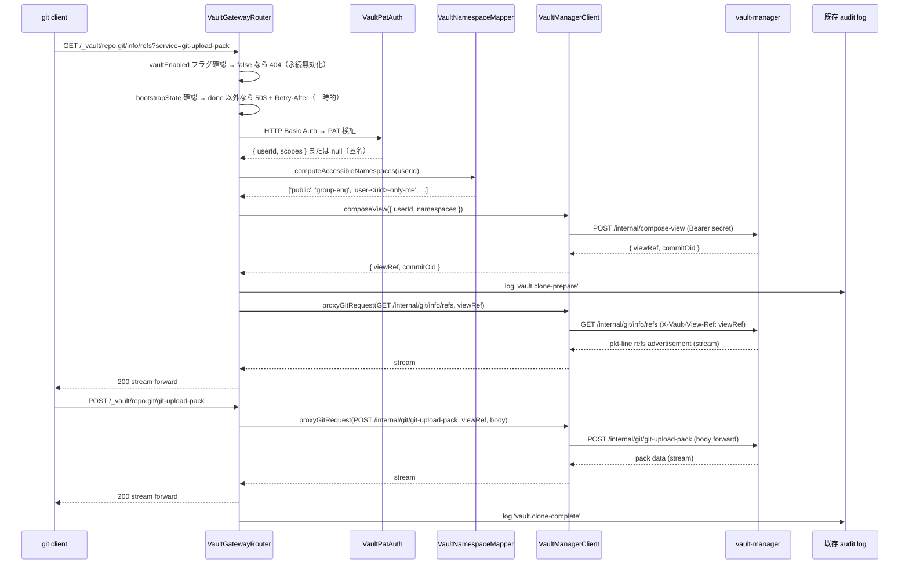
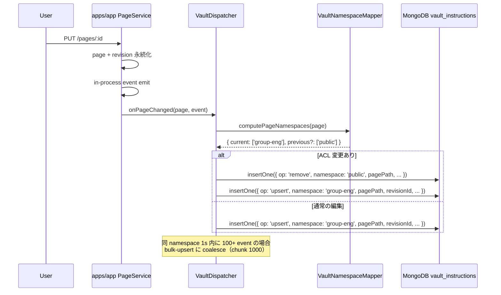
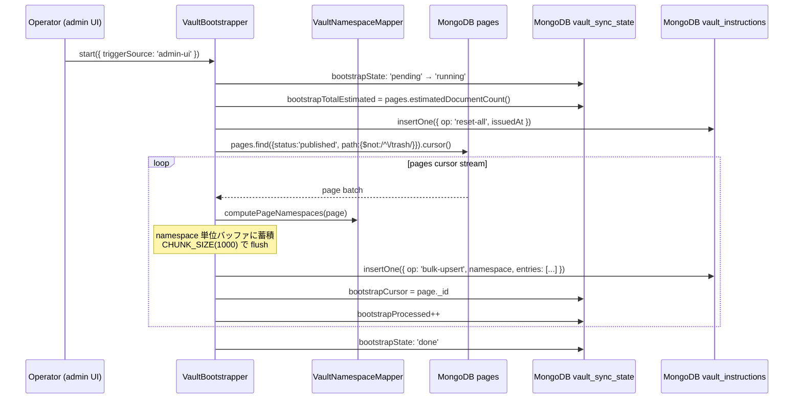

# 設計書: growi-vault-gateway

## 概要

`growi-vault-gateway` は、`apps/app` 内の feature として実装される GROWI Vault の **唯一の security perimeter** である。外部 git クライアントからの clone / fetch リクエストを受信し、GROWI 既存資産（PAT 認証 / ACL / Page・Revision モデル / audit log）を使用して認証・認可・namespace 判定・instruction dispatch を行う。

本 spec は `apps/app/src/features/growi-vault/` 配下の全コンポーネントと、`packages/core/src/interfaces/vault/` の共通 DTO 型を対象とする。git bare repo 操作・namespace tree 更新・per-user view ref 合成は `growi-vault-manager` spec の責務であり、本 spec のスコープ外である。

### Goals

- git smart HTTP エンドポイント `GET/POST /_vault/repo.git/...` を提供する
- GROWI 既存 PAT 認証基盤を再利用し、HTTP Basic Auth → ユーザー解決を実現する
- GROWI ACL に基づいて per-user の accessible namespace 集合を決定論的に計算する
- ページ変更イベントを durable な `vault_instructions` outbox に書き込む
- 初回有効化・災害復旧時の bootstrap を apps/app 主導で実行する
- vault-manager への compose-view RPC と git body proxy を提供する
- 管理者が機能 ON/OFF・bootstrap 進捗・audit log を管理できる UI を提供する

### Non-Goals

- bare repo 操作・git object I/O・git upload-pack の spawn（→ growi-vault-manager）
- namespace tree の更新・per-user view ref 合成（→ growi-vault-manager）
- vault_instructions の change stream 消化（→ growi-vault-manager）
- PAT 発行・管理 UI（→ 既存 AccessToken 機能）
- GROWI ACL 評価ロジック本体（→ page-grant.ts）

---

## 境界コミットメント

### apps/app の追加責務（`src/features/growi-vault/`）

- `GET/POST /_vault/repo.git/...` を唯一の対外エンドポイントとして提供する
- HTTP Basic Auth → PAT 認証（既存 access-token-parser に委譲）→ ユーザー解決
- ユーザーがアクセス可能な namespace 集合の決定（GROWI ACL 評価）
- ページの所属 namespace の決定（grant / grantedGroups / creator から）
- ページ変更イベントの購読 → vault_instructions コレクション書き込み
- 初回有効化 / 災害復旧時の bootstrap 主導（pages cursor stream + seed instructions 発行）
- vault-manager への compose-view RPC 呼び出し
- git request body の vault-manager への透過 proxy
- 既存 audit log への vault イベント記録
- `vaultEnabled` 等の admin 設定 UI

### 許可された依存関係

- 既存 `Page` / `Revision` Mongoose モデル（read-only）
- `access-token-parser` ミドルウェア
- `page-grant.ts` の `isUserGrantedPageAccess`、`generateGrantCondition`
- `UserGroupRelation` / `ExternalUserGroupRelation` の group resolution
- 既存 audit log インフラ
- `@growi/core` の DTO 型

### 再検証トリガー

- GROWI Page モデルの grant / grantedGroups スキーマ変更
- access-token-parser ミドルウェアのインターフェース変更
- `@growi/core` の Vault DTO 型の breaking change
- ページパスエンコーディング規則の変更

---

## アーキテクチャ

### コンポーネント構成図

```mermaid
graph TB
    subgraph External [外部]
        Cli[git クライアント]
    end

    subgraph AppsApp [apps/app - features/growi-vault/]
        VGate[VaultGatewayRouter]
        VAuth[VaultPatAuth middleware]
        VMap[VaultNamespaceMapper]
        VDisp[VaultDispatcher]
        VBoot[VaultBootstrapper]
        VClient[VaultManagerClient]
        VSettings[VaultSettingsService]
        VAdmin[VaultAdminSettings UI]
        AuditLog[(既存 audit log)]
    end

    subgraph VaultMgr [apps/growi-vault-manager - internal only]
        Compose[POST /internal/compose-view]
        GitProxy[GET|POST /internal/git/...]
    end

    subgraph Mongo [MongoDB]
        Pages[pages]
        AT[accesstokens]
        UGR[user-group-relations]
        Inst[vault_instructions]
        SyncState[vault_sync_state bootstrap* fields]
        Settings[configs app:vault*]
    end

    Cli -->|HTTPS git smart HTTP| VGate
    VGate --> VAuth
    VAuth -->|PAT 検証| AT
    VGate --> VMap
    VMap --> Pages
    VMap --> UGR
    VGate -->|shared secret| VClient
    VClient -->|POST /internal/compose-view| Compose
    VClient -->|GET|POST /internal/git/...| GitProxy
    VDisp -->|on PageService event| Inst
    VBoot -->|reset-all + bulk-upsert| Inst
    VBoot --> Pages
    VBoot --> SyncState
    VGate -->|bootstrapState read| SyncState
    VAdmin --> Settings
    VGate -->|feature flag| Settings
    VGate --> AuditLog
```

---

## ファイル構成計画

### apps/app に追加

```
apps/app/src/features/growi-vault/
├── interfaces/
│   ├── vault-instruction.ts           # @growi/core からの re-export（ローカル利用のため）
│   └── index.ts
├── server/
│   ├── routes/
│   │   ├── vault-gateway.ts           # GET/POST /_vault/repo.git/* — auth + proxy
│   │   └── vault-admin.ts             # admin API（bootstrap 開始 / 進捗 / enable 切替）
│   ├── services/
│   │   ├── vault-namespace-mapper.ts  # ACL → namespace 集合 / page → namespace 計算
│   │   ├── vault-dispatcher.ts        # PageService event 購読 + vault_instructions 書き込み
│   │   ├── vault-bootstrapper.ts      # bootstrap 主導（reset-all + pages cursor → seed instructions）
│   │   ├── vault-manager-client.ts    # vault-manager との HTTP RPC + body proxy
│   │   └── vault-settings-service.ts  # vaultEnabled, endpoint, secret の取得
│   ├── middlewares/
│   │   └── vault-pat-auth.ts          # access-token-parser を vault scope で composition
│   ├── models/
│   │   ├── vault-instruction.ts       # 書き込み用 Mongoose model（owned: apps/app）
│   │   └── vault-sync-state.ts        # bootstrap 進捗 owned by apps/app（bootstrap* fields）
│   └── index.ts                       # feature 登録
└── client/
    └── admin/
        ├── VaultAdminSettings.tsx     # 機能 ON/OFF + bootstrap 進捗表示 + audit log filter リンク
        └── index.ts
```

### packages/core に追加

```
packages/core/src/interfaces/vault/
├── vault-instruction.ts   # VaultInstructionDoc, VaultInstructionOp, VaultBulkUpsertEntry, VaultInstructionPayload
├── vault-compose-view.ts  # ComposeViewRequest, ComposeViewResponse, Namespace
└── index.ts               # barrel
```

### 既存ファイルへの修正

- `apps/app/src/server/models/config-definition.ts` — `app:vaultEnabled`・`app:vaultManagerEndpoint`・`app:vaultManagerInternalSecret` を追加
- `apps/app/src/server/routes/index.ts`（または app 起動箇所）— `VaultGatewayRouter` を登録
- `packages/core/package.json` — `./dist/interfaces/vault` の export を追加

---

## システムフロー

### clone / fetch / pull 同期フロー



### page edit → vault sync 非同期フロー



### Initial Bootstrap フロー



---

## コンポーネントとインターフェース

### VaultGatewayRouter

| フィールド | 詳細 |
|-----------|------|
| Intent | git smart HTTP の唯一の対外エンドポイント。feature flag・auth・ACL・proxy・audit を統括する |
| 要件カバレッジ | 1, 2.4, 6, 7.1, 8.1, 10 |

**API コントラクト**

| Method | Endpoint | Auth | Response Content-Type | Errors |
|--------|----------|------|----------------------|--------|
| GET | `/_vault/repo.git/info/refs?service=git-upload-pack` | HTTP Basic | `application/x-git-upload-pack-advertisement` | 401, 404, 503 |
| POST | `/_vault/repo.git/git-upload-pack` | HTTP Basic | `application/x-git-upload-pack-result` | 401, 404, 503 |
| ANY | `/_vault/repo.git/git-receive-pack` | — | — | 403 |
| OTHER | `/_vault/repo.git/*` | — | — | 404 |

**責務と制約**
- `vaultEnabled` が false の場合、`info/refs` および `git-upload-pack` に対して 404 を返す（永続的な設定状態であり「一時的に処理できない」を意味する 503 ではない。Retry-After も付与しない）
- `bootstrapState !== 'done'` の場合、全 clone / fetch に `503 + Retry-After`（bootstrap は一時的な状態であり 503 が適切）
- `git-receive-pack` への全リクエストに 403 `read-only repository`
- 成功・失敗とも既存 audit log にイベントを記録する
- apps/app は git wire format を解釈せず、HTTP body を vault-manager にパイプし stdout をクライアントにパイプするだけ

---

### VaultPatAuth

| フィールド | 詳細 |
|-----------|------|
| Intent | HTTP Basic Auth の password を PAT として解釈し、access-token-parser に委譲してユーザーを解決する |
| 要件カバレッジ | 2 |

```typescript
type VaultAuthResult = {
  readonly userId: string;
  readonly scopes: ReadonlyArray<string>;
} | null; // null = 匿名（public のみアクセス可）

interface VaultPatAuth {
  authenticate(req: Request): Promise<VaultAuthResult>;
}
```

**実装ノート**
- git クライアントは `Authorization: Basic base64(anyuser:TOKEN)` を送る
- 検証は既存 `access-token-parser` の `findUserIdByToken(rawToken, requiredScopes)` を呼ぶ
- 認証失敗時は `WWW-Authenticate: Basic realm="GROWI Vault"` を含む 401
- エラーメッセージにページ情報を含めない（要件 2.3）
- `Authorization` ヘッダーが存在しない場合は `null`（匿名）を返す

---

### VaultNamespaceMapper

| フィールド | 詳細 |
|-----------|------|
| Intent | (1) ユーザーがアクセス可能な namespace 集合を計算、(2) page が所属する namespace を計算する |
| 要件カバレッジ | 3 |

```typescript
type Namespace = string; // 'public' | `group-${string}` | `user-${string}-only-me` | 'restricted-link'

interface VaultNamespaceMapper {
  // clone/pull 時: ユーザーがアクセスできる namespace 全集合
  computeAccessibleNamespaces(userId: string | null): Promise<ReadonlyArray<Namespace>>;

  // page edit 時: ページが属する namespace（ACL 変更時は前後 namespace を返す）
  // 1 ページが複数の grantedGroups を持つ場合、current に複数の namespace が返る
  computePageNamespaces(page: IPage): { current: ReadonlyArray<Namespace>; previous?: ReadonlyArray<Namespace> };
}
```

**マッピングルール**

| GRANT 種別 | namespace |
|------------|-----------|
| GRANT_PUBLIC | `'public'` |
| GRANT_RESTRICTED（anyone-with-link） | `'restricted-link'` |
| GRANT_USER_GROUP（grantedGroups[i]） | グループごとに `'group-<gid>'`（複数 group ACL は複数 namespace） |
| GRANT_OWNER（creator） | `'user-<creator-id>-only-me'` |
| `/trash` 配下 | namespace 不発行（除外） |
| status !== 'published' | namespace 不発行（除外） |

**accessible namespaces 計算**
- 認証済みユーザー: `['public', 'restricted-link', 'group-<g1>', ..., 'user-<uid>-only-me']`
- 匿名: `['public']`（要件 3.2）

**実装ノート**
- 既存 `generateGrantCondition` / `isUserGrantedPageAccess` を再利用
- group descendants 解決は既存 `findAllUserGroupIdsRelatedToUser` を利用

---

### VaultDispatcher

| フィールド | 詳細 |
|-----------|------|
| Intent | PageService の in-process event を購読し、vault_instructions コレクションに durable instruction を書き込む |
| 要件カバレッジ | 4 |

```typescript
type VaultInstructionOp =
  | 'upsert'
  | 'bulk-upsert'
  | 'remove'
  | 'rename-prefix'
  | 'grant-change-prefix'
  | 'reset-all';

interface VaultBulkUpsertEntry {
  readonly pageId: string;
  readonly pagePath: string;
  readonly revisionId: string;
}

interface VaultInstructionPayload {
  readonly op: VaultInstructionOp;
  readonly namespace: Namespace;
  readonly pageId?: string;
  readonly pagePath?: string;
  readonly revisionId?: string;
  readonly entries?: ReadonlyArray<VaultBulkUpsertEntry>;
  readonly oldPrefix?: string;
  readonly newPrefix?: string;
  readonly fromNamespace?: Namespace;
}

interface VaultDispatcher {
  onPageChanged(event: PageChangedEvent): Promise<void>;
  onBulkOperation(event: BulkPageOperationEvent): Promise<void>;
}
```

**単一ページ操作の挙動**

- `create` / `update`: `current` 配列の各 namespace に `upsert` 1 件ずつ（pagePath・revisionId・pageId を含む）
- `delete`: `current` 配列の各 namespace から `remove` 1 件ずつ（pagePath は削除直前の値）
- ACL 変更: `previous` 配列の各 namespace に `remove` + `current` 配列の各 namespace に `upsert`（各 namespace ごとに 1 件ずつ）

**coalesce 挙動**

- 同一 namespace 向けの `upsert` が coalesce window（既定 1 秒）内に 100 件以上発生した場合、dispatcher は 1 件の `bulk-upsert` にまとめる
- coalesce 対象は `create` / `update` のみ（`remove` / `rename-prefix` / `grant-change-prefix` は混在させない）
- chunk size 上限はデフォルト 1000 entries / instruction

**prefix primitive（親ページのバルク操作）** — **[MVP・実装完了]**

> _MVP として 2 段階で実装完了:_
>
> - **Stage 1 (タスク 21.1-A、実装済み)**: `'updateMany'` を購読し、4 つ目の payload が無い legacy emit ではフォールバックとして per-page upsert を発行する。
> - **Stage 2 (タスク 21.1-B、実装済み)**: GROWI core の event payload を拡張し、subscriber がそれらを受け取って instruction を発行する:
>   - `pageEvent.emit('rename', { page, oldPath, newPath, user })` → vault subscriber が `rename-prefix` instruction を namespace 数ぶん発行
>   - `pageEvent.emit('updateMany', pages, user, { oldPagePathPrefix, newPagePathPrefix })` → vault subscriber が影響 namespace 集合を de-dup して `rename-prefix` を 1 件 / namespace 発行
>   - 新規イベント `pageEvent.emit('descendantsGrantChanged', { affectedPages, user })` → vault subscriber が per-page `acl-change` instruction（remove + upsert）を発行（既存 dispatcher 経路を流用）

- 親ページ rename: 影響を受ける各 namespace に `rename-prefix` 1 件（descendants 数 N によらず namespace 数 M 件）— **実装済み**
- 親ページ grant 一括変更: 影響を受けた各 page に対して per-page `acl-change` instruction を発行（remove from previous namespaces + upsert to current namespaces）— **実装済み**（`grant-change-prefix` op は subtree 単位の prefix scope を持たないため、将来の vault-manager 設計改修まで使用しない）

**実装ノート**
- 既存 GROWI `PageEvent`（`apps/app/src/server/events/page.ts`）に subscribe
- `syncDescendants` 完了 event 等の境界 event を購読し、descendants 処理途中での per-page event を受信しないようにする
- 書き込み失敗時は WARN ログ + リトライ（ページ編集 response とは切り離す）

---

### VaultBootstrapper

| フィールド | 詳細 |
|-----------|------|
| Intent | 初回有効化 / 災害復旧時の bootstrap を主導する。pages cursor stream を回し seed instructions を vault_instructions に発行することで vault-manager が steady state と同一パスで処理できるようにする |
| 要件カバレッジ | 5 |

```typescript
interface VaultBootstrapper {
  start(opts?: { triggerSource: 'admin-ui' | 'env-var' }): Promise<void>;
  getStatus(): Promise<{
    state: 'pending' | 'running' | 'done' | 'failed';
    processed: number;
    totalEstimated: number | null;
    cursor: string | null;
    startedAt: Date | null;
    completedAt: Date | null;
    lastError: string | null;
  }>;
}
```

**start() の挙動**

```
1. bootstrapState が 'running' なら即リターン（二重起動防止）
2. vault_sync_state.bootstrapState を 'pending' → 'running' に遷移
3. vault_sync_state.bootstrapTotalEstimated = pages.estimatedDocumentCount()
4. vault_instructions に op: 'reset-all' を 1 件 insert
5. pages.find({status:'published', path:{$not:/^\/trash/}}).cursor() で stream 処理:
   namespaceBuffers: Map<Namespace, VaultBulkUpsertEntry[]> = new Map()
   for each page:
     namespaces = VaultNamespaceMapper.computePageNamespaces(page)
     for each ns in namespaces:
       buf.push({ pageId, pagePath, revisionId })
       if buf.length >= CHUNK_SIZE (default 1000):
         insertOne(vault_instructions, { op: 'bulk-upsert', namespace: ns, entries: buf })
         namespaceBuffers.set(ns, [])
     vault_sync_state.bootstrapCursor = page._id
     vault_sync_state.bootstrapProcessed++
6. 残バッファを flush
7. vault_sync_state.bootstrapState = 'done'
```

**Bootstrap SLA**

| ページ数 | 期待完走時間 |
|---|---|
| 10,000 pages | < 10 分 |
| 30,000 pages | < 30 分 |

---

### VaultManagerClient

| フィールド | 詳細 |
|-----------|------|
| Intent | vault-manager との HTTP 通信。compose-view RPC と git protocol body の透過 proxy を提供する |
| 要件カバレッジ | 6 |

```typescript
interface ComposeViewRequest {
  readonly userId: string | null;
  readonly namespaces: ReadonlyArray<Namespace>;
}

interface ComposeViewResponse {
  readonly viewRef: string;  // 'user-<uid>-view' または 'anonymous-view'
  readonly commitOid: string;
}

interface VaultManagerClient {
  composeView(req: ComposeViewRequest): Promise<ComposeViewResponse>;

  proxyGitRequest(opts: {
    method: 'GET' | 'POST';
    path: '/internal/git/info/refs' | '/internal/git/git-upload-pack';
    viewRef: string;
    queryString?: string;
    requestBody?: NodeJS.ReadableStream;
  }): Promise<{ status: number; headers: Record<string, string>; body: NodeJS.ReadableStream }>;

  // admin UI のストレージ観測用。vault_namespace_state を直接 read する代わりに RPC 経由で取得する
  getStorageStats(): Promise<StorageStatsResponse>;
}
```

**実装ノート**
- 全 request に `Authorization: Bearer ${VAULT_MANAGER_INTERNAL_SECRET}` を付与
- `proxyGitRequest` のリクエストには `Authorization: Bearer <secret>` および `X-Vault-View-Ref: {viewRef}` ヘッダーを付与して vault-manager の GitProxyController に伝達する
- proxy は streaming（apps/app 上でフルバッファ化しない）
- vault-manager エラー時は 502 としてクライアントに返す
- timeout は長め（10 分）に設定可能

---

### VaultSettingsService

| フィールド | 詳細 |
|-----------|------|
| Intent | apps/app の config から Vault 関連設定を解決する |
| 要件カバレッジ | 7 |

```typescript
interface VaultSettings {
  readonly enabled: boolean;
  readonly managerEndpoint: string;
  readonly managerInternalSecret: string;
}

interface VaultSettingsService {
  getSettings(): Promise<VaultSettings>;
}
```

**config-definition.ts への追加**

```typescript
'app:vaultEnabled': {
  envVarName: 'VAULT_ENABLED',
  isSecret: false,
  publishToClient: false,
  defaultValue: false,
},
'app:vaultManagerEndpoint': {
  envVarName: 'VAULT_MANAGER_ENDPOINT',
  isSecret: false,
  publishToClient: false,
  // env からのみ読み込み（DB ストア無効）
},
'app:vaultManagerInternalSecret': {
  envVarName: 'VAULT_MANAGER_INTERNAL_SECRET',
  isSecret: true,
  publishToClient: false,
  // env からのみ読み込み（DB ストア無効）
},
```

---

### VaultAdminSettings（UI）

| フィールド | 詳細 |
|-----------|------|
| Intent | 管理者向けの Vault 機能 ON/OFF + bootstrap 操作 + 進捗観測 UI |
| 要件カバレッジ | 8 |

**画面構成**

| セクション | 内容 |
|---|---|
| Feature toggle | `vaultEnabled` の ON/OFF トグル |
| Bootstrap operation | "Prepare GROWI Vault" ボタン（`POST /_api/v3/vault/bootstrap` を発火） |
| Bootstrap status | `state` (pending/running/done/failed) + 進捗バー (`processed / totalEstimated`) + `startedAt` / `completedAt` / `lastError` |
| Storage observability | `GET /internal/storage-stats` 経由で取得した namespace 数 / 合計 commit 数 / loose object 数 / repo size / 最終 squash・gc 時刻（vault_namespace_state を直接 read しない） |
| Audit log filter link | 既存 audit log UI に "vault.*" フィルターを適用するリンク |

**UX のポイント**
- `vaultEnabled=true` への切替前に bootstrap done でなければ警告を表示（切替後も 503 が継続するため）
- bootstrap 中の `vault_instructions.processedAt` の遅れは内部観測のみ（admin に過剰情報を出さない）

---

## データモデル

### vault_instructions コレクション（apps/app が write、vault-manager が read + processedAt 更新）

```
{
  _id: ObjectId,
  op: 'upsert' | 'bulk-upsert' | 'remove' | 'rename-prefix' | 'grant-change-prefix' | 'reset-all',
  payload: {
    namespace: string,
    pageId: ObjectId | null,
    pagePath: string | null,
    revisionId: ObjectId | null,
    entries: Array<{
      pageId: ObjectId,
      pagePath: string,
      revisionId: ObjectId
    }> | null,                    // bulk-upsert: 1 chunk に同 namespace の N entries（上限 1000）
    oldPrefix: string | null,
    newPrefix: string | null,
    fromNamespace: string | null
  },
  issuedAt: Date,
  processedAt: Date | null,
  attempts: number,
  lastError: string | null
}
インデックス:
  { processedAt: 1, issuedAt: 1 }
  { processedAt: 1 } TTL: expireAfterSeconds 86400
```

### vault_sync_state コレクション（フィールド単位で owner 分離）

```
{
  _id: 'singleton',

  // vault-manager owned（本 spec はこれらを read のみ）
  resumeToken: object | null,
  lastProcessedAt: Date,
  watcherInstanceId: string,

  // apps/app owned（本 spec が write）
  bootstrapState: 'pending' | 'running' | 'done' | 'failed',
  bootstrapCursor: ObjectId | null,       // 最後に処理した page._id（resume 用）
  bootstrapStartedAt: Date | null,
  bootstrapCompletedAt: Date | null,
  bootstrapTotalEstimated: number | null,
  bootstrapProcessed: number,
  bootstrapLastError: string | null       // 失敗時のメッセージ。BootstrapStatus.lastError として API に surface
}
```

> VaultGatewayRouter は `bootstrapState` を read して gating 判定に使う。`bootstrap*` フィールドは apps/app の VaultBootstrapper が write し、`resumeToken` 等は vault-manager が write する。両者の write は disjoint なフィールド集合であるため write 競合は発生しない。

### Configuration（configs コレクションへの追加）

| key | type | 設定方法 | 用途 |
|-----|------|---------|------|
| `app:vaultEnabled` | boolean | DB / env var | 機能 ON/OFF |
| `app:vaultManagerEndpoint` | string | **env var only** | vault-manager の URL |
| `app:vaultManagerInternalSecret` | string | **env var only** | shared secret |

### @growi/core 共通 DTO 型

**packages/core/src/interfaces/vault/vault-instruction.ts**

```typescript
export type VaultInstructionOp =
  | 'upsert'
  | 'bulk-upsert'
  | 'remove'
  | 'rename-prefix'
  | 'grant-change-prefix'
  | 'reset-all';

export type Namespace = string;

export interface VaultBulkUpsertEntry {
  readonly pageId: string;
  readonly pagePath: string;
  readonly revisionId: string;
}

export interface VaultInstructionPayload {
  readonly namespace?: Namespace; // undefined when op === 'reset-all'
  readonly pageId?: string;
  readonly pagePath?: string;
  readonly revisionId?: string;
  readonly entries?: ReadonlyArray<VaultBulkUpsertEntry>;
  readonly oldPrefix?: string;
  readonly newPrefix?: string;
  readonly fromNamespace?: Namespace;
}

export interface VaultInstructionDoc {
  readonly _id: string;
  readonly op: VaultInstructionOp;
  readonly payload: VaultInstructionPayload;
  readonly issuedAt: Date;
  readonly processedAt: Date | null;
  readonly attempts: number;
  readonly lastError: string | null;
}
```

**packages/core/src/interfaces/vault/vault-compose-view.ts**

```typescript
export interface ComposeViewRequest {
  readonly userId: string | null;
  readonly namespaces: ReadonlyArray<Namespace>;
}

export interface ComposeViewResponse {
  readonly viewRef: string;
  readonly commitOid: string;
}
```

**packages/core/src/interfaces/vault/vault-storage-stats.ts**

```typescript
export interface StorageStatsResponse {
  readonly namespaceCount: number;        // vault_namespace_state の distinct namespace 数
  readonly totalCommitCount: number;       // 全 namespace の commit chain depth の合計
  readonly looseObjectCount: number;       // bare repo 内の loose object 数
  readonly repoSizeBytes: number;          // bare repo ディレクトリの総バイト数
  readonly lastSquashAt: string | null;    // ISO 8601、未実行時は null
  readonly lastGcAt: string | null;        // ISO 8601、未実行時は null
}
```

---

## エラーハンドリング

| エラー種別 | HTTP 応答 | 挙動 |
|-----------|---------|------|
| 認証失敗 | 401 + `WWW-Authenticate` | ページ情報を含まないメッセージ |
| 機能無効（`vaultEnabled=false`） | 404 + git エラー文字列 | `info/refs` / `git-upload-pack` に適用。永続的な設定状態のため 503 ではなく 404。Retry-After なし |
| bootstrap 未完了 | 503 + `Retry-After` | bootstrapState が done 以外（一時的な状態） |
| push 試行 | 403 `read-only repository` | git クライアントに表示 |
| ACL 評価エラー | 500 | ログ記録後、接続を閉じる |
| compose-view RPC 失敗 | 502 | apps/app から client へ |
| upload-pack proxy 失敗 | 502 | 同上 |
| vault-manager 全体不到達 | 503 | apps/app は warning ログ |
| vault_instructions 書き込み失敗 | — | WARN ログ + リトライ（ページ編集 response とは切り離す） |

---

## セキュリティ考慮事項

- **single security perimeter**: vault-manager は外部からアクセス不可（k8s NetworkPolicy）。認証・ACL 評価は全て apps/app で完結する
- **shared secret**: env var only、DB に保存しない。GROWI Cloud は k8s Secret で両 pod に注入
- **情報漏洩防止**: ACL フィルターは apps/app の VaultNamespaceMapper で確定し、vault-manager に渡る namespace 集合は既にフィルター済み（要件 3.8 / Req 3.5）
- **認証失敗レスポンス**: エラーメッセージにページリスト・存在情報を含めない（要件 2.3）
- **既存 audit log への統合**: 認証失敗（auth-failure）も記録しブルートフォース検出を可能にする
- **レート制限**: 既存 GROWI の rate limiting を `/_vault/*` にも適用する

---

## テスト戦略

### 単体テスト（apps/app side）

- **`VaultNamespaceMapper.computeAccessibleNamespaces`**: GRANT 種別ごと（public / restricted-link / group / only-me）、認証済み / 匿名、scope 制限の組み合わせ（要件 3）
- **`VaultNamespaceMapper.computePageNamespaces`**: 各 grant パターン、ACL 変更時の previous/current（要件 3.7）
- **`VaultDispatcher.onPageChanged`**: イベント種別ごとに正しい instruction が発行されるか（要件 4）。同 namespace への高頻度 event が `bulk-upsert` に coalesce されること、coalesce window 外の event は単発 `upsert` で発行されること
- **`VaultBootstrapper.start`**: `reset-all` 発行 → pages cursor stream → namespace 単位バッファ蓄積 → CHUNK_SIZE で `bulk-upsert` 発行 → 残バッファ flush の順序、resume 時の cursor 続行（要件 5）
- **`VaultPatAuth`**: 有効 / 無効 / 期限切れ / scope 不足の各 PAT パターン（要件 2）
- **`VaultManagerClient`**: shared secret 付与、proxy stream の正常系・異常系（要件 6）
- **`VaultSettingsService`**: env-only 設定の DB 非保存確認（要件 7）

### 統合テスト

- **clone E2E**: apps/app + vault-manager + MongoDB を docker-compose で起動し、実際に `git clone` を実行してファイル一覧と内容を検証（要件 1、9）
- **incremental fetch**: ページ更新後 `git fetch`、変更ファイルのみ転送（要件 1.2、4）
- **ACL 隔離**: ユーザー A の clone に、A が閲覧権限を持たないページのファイル名・中間ディレクトリが存在しないことを確認（要件 3）
- **匿名アクセス**: PAT なしで public ページのみが取得できる（要件 2.4、3.2）
- **push 拒否**: `git push` が 403（要件 1.3）
- **機能無効化**: `vaultEnabled=false` で `info/refs` / `git-upload-pack` が 404 を返す（要件 1.4、7）
- **bootstrap 中の 503 gating**: bootstrapState が running の間、clone が 503 + Retry-After を返す（一時的な状態のため 503 が適切）（要件 1.5）
- **ACL 変更伝播**: grant 変更後、後続 fetch でファイル追加 / 削除（要件 4.3）
- **shared secret 不一致**: vault-manager が apps/app 以外からの request を 401 で拒否
- **Initial Bootstrap（apps/app 主導、bulk-upsert）**: 数千ページ規模の seed DB に対し `VaultBootstrapper.start()` を実行。`reset-all` + namespace 単位 `bulk-upsert` が発行され、bootstrapState 遷移と clone 503 gating を確認。再起動による cursor resume、CHUNK_SIZE 境界（999/1000/1001）での flush 動作を確認（要件 5）
- **coalesce 動作**: 同 namespace に 1 秒間に 500 page edit event を発生させ、`bulk-upsert` に coalesce されることを確認（要件 4.6）

---

## 要件トレーサビリティ

| 要件 | コンポーネント |
|------|--------------|
| 1（git HTTP エンドポイント） | VaultGatewayRouter |
| 2（PAT 認証） | VaultPatAuth、VaultGatewayRouter |
| 3（namespace 計算） | VaultNamespaceMapper |
| 4（vault_instructions 書き込み） | VaultDispatcher、VaultInstructionModel |
| 5（bootstrap） | VaultBootstrapper、VaultSyncStateModel |
| 6（vault-manager 通信） | VaultManagerClient |
| 7（設定管理） | VaultSettingsService |
| 8（admin UI） | VaultAdminSettings、vault-admin.ts |
| 9（共通 DTO） | @growi/core interfaces/vault/ |
| 10（エラーハンドリング / セキュリティ） | VaultGatewayRouter、VaultPatAuth |
