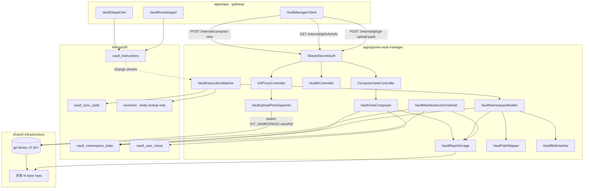

# 設計書

## 概要

`apps/growi-vault-manager` は GROWI Vault の内部実行エンジンである。`apps/app`（gateway 側）が `vault_instructions` MongoDB コレクションに書き込む指示を change stream 経由で受信し、共有ファイルシステム上の git bare repository を namespace 単位で維持する。per-user の view ref 合成・`git upload-pack` によるクローン配信・周期的な squash と gc を担い、GROWI のドメイン知識（ACL 評価・PAT 認証・グループ解決）を一切持たない実行エンジンに純化される。

Ts.ED v7.x ベースのマイクロサービスとして、`apps/pdf-converter` のデプロイスケルトン（独立コンテナ・共有 volume・Dockerfile）を継承する。bare repo の object I/O は isomorphic-git v1.37.x で実装し、pack 生成・delta 圧縮・wire protocol は OS の git binary v2.30+ に委譲する。

### Goals

- `vault_instructions` の change stream を at-least-once 配送で冪等に処理し、namespace ref を常に最新状態に保つ
- 全 6 instruction op（upsert / bulk-upsert / remove / rename-prefix / grant-change-prefix / reset-all）を正確に実行する
- per-user view ref を namespace tree merge として lazy 合成し、`sourceVersions` キャッシュで重複合成を回避する
- `git upload-pack` spawn による pack streaming で 30,000 ページ規模のクローンをメモリ O(1) で処理する
- namespace ref の squash と `git gc` を外部スケジューラ不要で自走させる

### Non-Goals

- PAT 認証・ACL 評価・グループ解決（apps/app の責務）
- bootstrap 主導・管理 UI（apps/app の責務）
- git push（書き込み）受付（将来 spec）
- bare repo の delta 圧縮・pack format 実装（git binary に委譲）
- shared secret の発行・rotation 機構

---

## 境界コミットメント

### This Spec Owns

- `apps/growi-vault-manager/` 配下の全ファイル（server.ts / controllers / services / models / middlewares / Dockerfile）
- `vault_namespace_state` / `vault_user_views` コレクションの所有（読み書き）
- `vault_sync_state` の resume token / lastProcessedAt / watcherInstanceId フィールドの書き込み
- `vault_instructions` の `processedAt` / `attempts` / `lastError` フィールドへの書き込み（ops の実行後更新）
- 共有 fs 上の bare repo（object pool + namespace refs）の維持

### Out of Boundary

- `vault_instructions` への insert（apps/app の `VaultDispatcher` / `VaultBootstrapper` が所有）
- `vault_sync_state` の `bootstrap*` フィールド（apps/app の `VaultBootstrapper` が所有）
- PAT 認証・ACL 評価・ユーザーグループ解決
- 監査ログの書き込み（apps/app の `VaultGatewayRouter` が所有）
- `@growi/core` の DTO 型定義（gateway spec が主導し、本 spec は import するのみ）

### Allowed Dependencies

- `vault_instructions` コレクション（change stream 購読 + processedAt 書き込み）
- `revisions` コレクション（read-only。body フィールドのみ ID 指定 lookup。pages コレクションは直接 read しない）
- `vault_namespace_state` / `vault_user_views` / `vault_sync_state` コレクション（所有）
- isomorphic-git v1.37.x（blob / tree / commit 書き込み・hash 計算のみ）
- git binary v2.30+（`git upload-pack` 実行のため container image に同梱）
- 共有 filesystem（local / NFS / Filestore — POSIX semantics + atomic rename + 真の file locking 前提）
- `@growi/core` の DTO 型・interface 型（`packages/core/src/interfaces/vault/`）

### Revalidation Triggers

- `@growi/core` の Vault DTO 型の breaking change（ComposeViewRequest / ComposeViewResponse / VaultInstructionPayload 等）
- `vault_instructions` スキーマの変更（op 種別追加・payload 構造変更）
- `compose-view` RPC contract の変更（エンドポイント・リクエスト/レスポンス形式）
- isomorphic-git のメジャーバージョンアップ
- git binary が container image から外れる事態
- GROWI Revision モデルの `body` フィールド形式変更
- ページパスエンコーディング規則の変更（既存 clone 履歴との互換破壊）

---

## アーキテクチャ

### Architecture Pattern & Boundary Map



### Technology Stack

| レイヤー | 選択 / バージョン | 役割 | 備考 |
|---------|----------------|------|------|
| HTTP Server | Ts.ED v7.x | DI + lifecycle + HTTP server | pdf-converter と同スタック |
| Git object I/O | isomorphic-git v1.37.x | blob/tree/commit 書き込み・hash 計算 | pure JS、ネイティブ依存なし |
| Git protocol | git binary v2.30+ | upload-pack 実行・pack 生成 | container image に `apk add git` |
| Storage（dev） | local filesystem | bind mount | docker-compose で共有 volume |
| Storage（Cloud） | Filestore（GCP managed NFS）必須 | bare repo 物理配置 | POSIX semantics + atomic rename 必須 |
| Data（MongoDB） | Mongoose + MongoDB change stream | vault_* コレクション RW + revisions ID lookup | replica set 必須（既存要件） |
| Logger | @growi/logger（pino） | pod ローカルログ | 監査ログは apps/app に委譲 |

---

## ファイル構成

### vault-manager（新規アプリ）

```
apps/growi-vault-manager/
├── package.json                              # Ts.ED + isomorphic-git + mongoose
├── tsconfig.json                             # strict TypeScript
├── docker/
│   ├── Dockerfile                            # build: node:24-bookworm / release: dhi.io dev (git binary)
│   ├── Dockerfile.dockerignore               # build-context trimming
│   └── docker-entrypoint.ts                  # root prepares /data repo, then drops to node (uid 1000)
├── src/
│   ├── server.ts                             # Ts.ED bootstrap + DI container
│   ├── controllers/
│   │   ├── compose-view-controller.ts        # POST /internal/compose-view
│   │   ├── git-proxy-controller.ts           # GET /internal/git/info/refs, POST /internal/git/git-upload-pack
│   │   ├── health-controller.ts             # GET /health
│   │   └── storage-stats-controller.ts      # GET /internal/storage-stats
│   ├── services/
│   │   ├── vault-instruction-watcher.ts     # change stream 購読 + 起動時 drain
│   │   ├── vault-namespace-builder.ts       # instruction → blob/tree/commit + ref 更新
│   │   ├── vault-view-composer.ts           # 複数 namespace tree merge → user view ref
│   │   ├── vault-repo-storage.ts            # bare repo 物理操作の抽象（git object I/O）
│   │   ├── vault-path-mapper.ts             # ページパス → base filePath（エンコード・orphan、suffix なし）
│   │   ├── vault-tree-normalizer.ts         # merged tree の compose-time 正規化（大小衝突 suffix）
│   │   ├── vault-blob-hasher.ts             # isomorphic-git hashObject
│   │   ├── vault-upload-pack-spawner.ts     # git upload-pack 子プロセス起動
│   │   └── vault-maintenance-scheduler.ts  # squash + 周期 gc 自走スケジューラ
│   ├── models/
│   │   ├── revision.ts                      # read-only (_id, body のみ・ID lookup 用)
│   │   ├── vault-instruction.ts             # change stream watch + processedAt 更新
│   │   ├── vault-namespace-state.ts         # owned（namespace → commitOid + version）
│   │   ├── vault-user-view.ts               # owned（per-user view cache）
│   │   └── vault-sync-state.ts              # resumeToken / lastProcessedAt / watcherInstanceId
│   └── middlewares/
│       └── shared-secret-auth.ts            # Authorization: Bearer <secret> constant-time 検証
└── README.md
```

### 既存ファイルへの修正

- `pnpm-workspace.yaml` — `apps/growi-vault-manager` を workspace に追加（自動検出されない場合のみ）
- `turbo.json`（root）— vault-manager の build / dev / test task 設定を追加
- `docker-compose.yml` — vault-manager サービスと共有 volume の定義を追加

---

## Dockerfile 構成戦略

vault-manager は `VaultUploadPackSpawner` が `git upload-pack` を spawn するため、release stage に **git binary v2.30+ が必須**（apps/app の DHI distroless にはない制約）。distroless に git を持ち込むと共有ライブラリの tracking コストが高いため、release stage には git/bash/coreutils を含む DHI dev variant（`dhi.io/node:24-debian13-dev`）を採用する。

---

## 要件トレーサビリティ

| 要件 | サマリ | コンポーネント |
|------|--------|--------------|
| 1.1–1.6 | change stream 購読・冪等処理 | VaultInstructionWatcher |
| 2.1–2.8 | 全 op の namespace tree 更新 | VaultNamespaceBuilder, VaultPathMapper, VaultBlobHasher, VaultRepoStorage |
| 3.1–3.7 | ページパス純関数マッピング | VaultPathMapper |
| 4.1–4.8 | per-user view 合成・キャッシュ | ComposeViewController, VaultViewComposer |
| 5.1–5.5 | git smart HTTP lower-half | GitProxyController, VaultUploadPackSpawner |
| 6.1–6.7 | メンテナンス自走スケジューリング | VaultMaintenanceScheduler |
| 7.1–7.5 | shared secret 認証 | SharedSecretAuth |
| 8.1–8.4 | health endpoint | HealthController |
| 9.1–9.5 | bare repo ストレージ抽象化 | VaultRepoStorage |
| 10.1–10.4 | アプリスケルトン・デプロイ | server.ts, Dockerfile, docker-compose |
| 11.1–11.5 | storage stats RPC | StorageStatsController, VaultMaintenanceScheduler |

---

## コンポーネントとインタフェース

### コンポーネントサマリー

| コンポーネント | レイヤー | Intent | 要件カバレッジ |
|--------------|---------|--------|--------------|
| ComposeViewController | HTTP Controller | POST /internal/compose-view の RPC handler | 4.1 |
| GitProxyController | HTTP Controller | git smart HTTP lower-half（spawn pipe） | 5.1–5.5 |
| HealthController | HTTP Controller | GET /health の監視用エンドポイント | 8.1–8.4 |
| StorageStatsController | HTTP Controller | GET /internal/storage-stats（admin UI 観測用） | 11.1–11.5 |
| VaultInstructionWatcher | Service | change stream 購読 + drain + retry | 1.1–1.6 |
| VaultNamespaceBuilder | Service | instruction → blob/tree/commit + ref 更新 | 2.1–2.8 |
| VaultViewComposer | Service | namespace merge → user view ref（delta merge + cache） | 4.2–4.8 |
| VaultRepoStorage | Service | bare repo object I/O 抽象 | 9.1–9.5 |
| VaultPathMapper | Service | pagePath → filePath 純関数 | 3.1–3.7 |
| VaultBlobHasher | Service | git blob OID 計算（isomorphic-git） | 2.1, 2.2 |
| VaultUploadPackSpawner | Service | git upload-pack 子プロセス起動 | 5.1–5.5 |
| VaultMaintenanceScheduler | Service | squash + gc 自走スケジューラ | 6.1–6.7 |
| SharedSecretAuth | Middleware | Bearer token constant-time 検証 | 7.1–7.5 |

---

### HTTP Controllers

#### ComposeViewController

| フィールド | 詳細 |
|-----------|------|
| Intent | apps/app からの compose-view 指示を受け、namespace 集合を tree merge して user view ref を更新する |
| 要件 | 4.1 |

**API Contract**

| Method | Endpoint | Auth | Body | Response | Errors |
|--------|----------|------|------|----------|--------|
| POST | `/internal/compose-view` | Bearer | ComposeViewRequest | ComposeViewResponse | 401, 500 |

```typescript
// @growi/core から import
interface ComposeViewRequest {
  readonly userId: string | null; // null = 匿名（public namespace のみで合成）
  readonly namespaces: ReadonlyArray<string>;
}

interface ComposeViewResponse {
  readonly viewRef: string;     // 例: 'user-<uid>-view' or 'anonymous-view'
  readonly commitOid: string;   // 40-char SHA-1
}
```

委譲先: `VaultViewComposer.compose(userId, namespaces)`

---

#### GitProxyController

| フィールド | 詳細 |
|-----------|------|
| Intent | apps/app から forward された git smart HTTP request を受け、`git upload-pack` を spawn してレスポンスを返す |
| 要件 | 5.1–5.5 |

**API Contract**

| Method | Endpoint | Headers | 動作 |
|--------|----------|---------|------|
| GET | `/internal/git/info/refs?service=git-upload-pack` | `X-Vault-View-Ref` | `--advertise-refs` モードで spawn、stdout を stream |
| POST | `/internal/git/git-upload-pack` | `X-Vault-View-Ref` | `--stateless-rpc` モードで spawn、body を stdin に pipe |

**Implementation Notes**
- `X-Vault-View-Ref` ヘッダから viewRef を取得し、`GIT_NAMESPACE=<viewRef>` を spawn 環境変数に設定
- stdout を HTTP body に直接 pipe（Node.js プロセスはメモリ O(1)）
- プロセスエラー時は 502、タイムアウト・クライアント切断時はプロセスを kill

---

#### HealthController

| フィールド | 詳細 |
|-----------|------|
| Intent | MongoDB 接続・change stream・bare repo 到達性を報告する監視用 endpoint |
| 要件 | 8.1–8.4 |

**API Contract**

| Method | Endpoint | Auth | Response（正常） | Response（異常） |
|--------|----------|------|----------------|----------------|
| GET | `/health` | なし | 200 `{"status":"ok"}` | 503 `{"status":"error","details":{...}}` |

---

#### StorageStatsController

| フィールド | 詳細 |
|-----------|------|
| Intent | apps/app の admin UI に bare repo のストレージ使用状況を提供する。`vault_namespace_state` の owner 越境を回避するための専用 RPC |
| 要件 | 11.1–11.5 |

**API Contract**

| Method | Endpoint | Auth | Response | Errors |
|--------|----------|------|----------|--------|
| GET | `/internal/storage-stats` | Bearer | StorageStatsResponse | 401, 500 |

```typescript
// @growi/core から import
interface StorageStatsResponse {
  readonly namespaceCount: number;        // vault_namespace_state の distinct namespace 数
  readonly totalCommitCount: number;       // 全 namespace の commit chain depth の合計
  readonly looseObjectCount: number;       // bare repo 内の loose object 数
  readonly repoSizeBytes: number;          // bare repo ディレクトリの総バイト数
  readonly lastSquashAt: string | null;    // ISO 8601、未実行時は null
  readonly lastGcAt: string | null;        // ISO 8601、未実行時は null
}
```

owner 越境を避け `vault_namespace_state` の集約と git 統計（`git count-objects` 等）で取得する。`lastSquashAt` / `lastGcAt` は `VaultMaintenanceScheduler.getStatus()` から取得し、未実行時は null。O(repo size) の重い走査は行わない。

---

### Services

#### VaultInstructionWatcher

| フィールド | 詳細 |
|-----------|------|
| Intent | vault_instructions コレクションの change stream を購読し、起動時は未処理 instruction を drain する |
| 要件 | 1.1–1.6 |

```typescript
interface VaultInstructionWatcher {
  start(): Promise<void>;  // drain → change stream subscribe
  stop(): Promise<void>;
}
```

起動時に `resumeToken` で change stream を再開しつつ、並行して `processedAt: null` の未処理 instruction を drain する（resume token 期限切れ耐性）。`processedAt != null` チェックで at-least-once 配送を冪等化し、失敗時は `attempts++` / `lastError` を記録して retry に委ねる。

---

#### VaultNamespaceBuilder

| フィールド | 詳細 |
|-----------|------|
| Intent | 1 件の instruction を実行し、blob/tree/commit を構築して namespace ref を更新する |
| 要件 | 2.1–2.8 |

```typescript
interface VaultNamespaceBuilder {
  applyInstruction(instruction: VaultInstructionDoc): Promise<{ namespace: string; commitOid: string }>;
}
```

**各 op の動作（要点）**

`instruction` は `VaultInstructionDoc` 型。`op` はトップレベル（`instruction.op`）でアクセスし、ページ固有フィールドは `instruction.payload.*` でアクセスする。

- **upsert / remove**: `VaultPathMapper.map` で filePath を求め、blob write（content-addressed・既存 OID は no-op）→ tree を root まで再計算 → commit → `updateRef` → `vault_namespace_state.upsert({ version++ })`
- **bulk-upsert**: revisions を `$in` 1 クエリで取得し、blob hash/write を並列（concurrency 16）化。全 entry を 1 度の tree rebuild・1 commit・1 ref update に集約する（N entries でも state は 1 step）
- **rename-prefix / grant-change-prefix**: subtree を抽出し移動先 prefix / namespace に mount する。blob は再書き込み不要（content-addressing で OID 不変）。grant-change-prefix は両 namespace で namespace 単位 atomic に commit + updateRef
- **reset-all**: `payload.namespace` は **undefined**（特定 namespace を対象としない全体操作）。全 namespace ref と `vault_namespace_state` / `vault_user_views` を wipe するが、**object pool は保持**し後続 upsert で content-addressing により再利用する

**Commit message フォーマット**（要件 2.8）

```
vault: <namespace> [op] <pagePath or "N entries" or oldPrefix→newPrefix>

operation: <op>
pageId: <oid>           (upsert / remove)
revisionId: <oid>       (upsert)
entryCount: <number>    (bulk-upsert)
firstPageId: <oid>      (bulk-upsert)
lastPageId: <oid>       (bulk-upsert)
oldPrefix: <path>       (rename-prefix / grant-change-prefix)
newPrefix: <path>       (rename-prefix)
fromNamespace: <ns>     (grant-change-prefix)
issuedAt: <iso8601>
```

---

#### VaultViewComposer

| フィールド | 詳細 |
|-----------|------|
| Intent | 複数 namespace を path-level で tree merge し、user view ref を生成する。sourceVersions キャッシュで同一 versions の再合成を回避する |
| 要件 | 4.2–4.8 |

```typescript
interface VaultViewComposer {
  compose(userId: string | null, namespaces: ReadonlyArray<string>): Promise<{ viewRef: string; commitOid: string }>;
}
```

**Behavior（要点）**

`viewRef` は `userId ? 'user-<uid>-view' : 'anonymous-view'`。各 namespace の現 `commitOid` から `currentVersions` を構築し、既存 view の `sourceVersions` と deep-equal ならキャッシュヒットで既存 `viewCommitOid` を返す。初回は full merge（`fullMergeTreesByPath`）、それ以降は変動 namespace のみ再計算する delta merge（`applyNamespaceDeltas`、base から未変動 subtree OID を継承）。結果を commit → `updateRef` し `vault_user_views` を upsert する。

**衝突解消（同一 path に複数 namespace のエントリ）**:
優先順位: `user-<uid>-only-me` > `group-*` > `restricted-link` > `public`

**Tree 正規化（compose-time, per-view / 要件 4.9–4.11）**:
merged tree 確定後、view ごとに大小衝突解消を行う。merged tree の構造のみから決定論的に導出し、状態を永続化しない（reactive）。

- **大小衝突解消**: 各ディレクトリ直下で小文字化キーが一致する 2 件以上のエントリ（blob・subtree 双方）に対し、各メンバー名へ `__<sha1(suffix付与前filePath)[0..7]>` を付与する。衝突が解消（メンバー 1 件）したら suffix を外す。

実装は `vault-tree-normalizer.ts`（純関数: merged tree → normalized tree）に集約し、composer から呼ぶ。delta merge では membership が変化したディレクトリのみ再正規化すればよく、`sourceVersions` 一致時は正規化ごとスキップされる（キャッシュ維持）。

**delta merge のフォールバック**: base tree が gc で消失している場合は full merge にフォールバック（要件 4.8）

---

#### VaultRepoStorage

| フィールド | 詳細 |
|-----------|------|
| Intent | bare repo の物理操作を抽象化する。dev local fs / self-host NFS / GROWI Cloud Filestore のいずれでも動作 |
| 要件 | 9.1–9.5 |

```typescript
interface VaultRepoStorage {
  init(): Promise<void>;   // 起動時に bare repo が存在しなければ git init --bare（冪等）

  // git object I/O（isomorphic-git の薄いラッパ）
  writeBlob(content: Buffer): Promise<string>;   // returns OID
  writeTree(entries: ReadonlyArray<TreeEntry>): Promise<string>;
  writeCommit(opts: CommitOptions): Promise<string>;
  readTree(oid: string): Promise<ReadonlyArray<TreeEntry>>;

  // ref 操作（POSIX atomic rename ベース）
  updateRef(refPath: string, newOid: string): Promise<void>;
  readRef(refPath: string): Promise<string | null>;
  deleteRef(refPath: string): Promise<void>;

  // upload-pack 用 path
  getRepoPath(): string;
}

interface TreeEntry {
  readonly mode: string;    // '100644' for blob, '040000' for tree
  readonly path: string;
  readonly oid: string;
  readonly type: 'blob' | 'tree';
}

interface CommitOptions {
  readonly tree: string;
  readonly parents: ReadonlyArray<string>;
  readonly message: string;
  readonly author: { readonly name: string; readonly email: string; readonly timestamp: number };
  readonly committer: { readonly name: string; readonly email: string; readonly timestamp: number };
}
```

---

#### VaultPathMapper

| フィールド | 詳細 |
|-----------|------|
| Intent | GROWI ページパスを git tree 内のファイルパスに変換する純関数 |
| 要件 | 3.1–3.7 |

```typescript
interface VaultPathMapper {
  // pagePath → base filePath（純関数・tree state 非依存・suffix なし）
  map(pagePath: string): string;
  // page path prefix → file path prefix（rename-prefix / grant-change-prefix 用）
  mapPrefix(pagePath: string): string;
}
```

**エンコーディング規則**:
- Windows 予約文字（`<>:"/\|?*`）→ `%XX` パーセントエンコーディング
- 先頭・末尾空白 → `%20`
- 制御文字（U+0000–U+001F, U+007F）→ `%XX`
- Windows 予約ファイル名（CON / PRN / AUX / NUL / COM0–9 / LPT0–9）→ `_` プレフィックス付加

**suffix 方針**:
- `map()` は大小衝突回避の suffix を付与しない。素の `<encoded-name>.md`（base path）を返し、pageId を取らない
- 大文字小文字非区別 fs での衝突解消は per-view の tree 正規化（VaultViewComposer / 要件 4）が担う。理由: 大小衝突の有無は ACL merge 後の view 単位でしか確定せず（例: `/Foo` が public、`/foo` が group namespace にあると merge 後の view で初めて衝突する）、純関数 `map()` の管轄外であるため
- index 化（子を持つページの本文を `README.md` に集約）は行わない。子を持つページも `<name>.md` のままフォルダ `<name>/` の隣に置く（`.md` の有無で別名となり衝突しない）。これによりレイアウトが生きた子孫数に依存せず、子の増減で親ファイルが rename される churn を回避する

**Orphan 規則**: 親ページが不可視または存在しない → `_orphaned/<encoded-path>.md`

**Implementation Notes**:
- エンコーディング規則および tree 正規化規則（大小衝突 suffix）は v1 確定後 immutable（Revalidation Trigger）
- `map()` は pageId を取らない（suffix を扱わないため）
- `mapPrefix('/A/B')` はセグメント単位でエンコードして `/` 結合、末尾 `.md` なし

---

#### VaultBlobHasher

| フィールド | 詳細 |
|-----------|------|
| Intent | git blob OID を計算する。同一内容で同一 OID（content-addressing）を保証 |
| 要件 | 2.1, 2.2 |

```typescript
interface VaultBlobHasher {
  hashBlob(content: Buffer | string): string;  // 40-char SHA-1
}
```

**Implementation Notes**: isomorphic-git の `hashObject({ type: 'blob', object })` を利用

---

#### VaultUploadPackSpawner

| フィールド | 詳細 |
|-----------|------|
| Intent | `git upload-pack` 子プロセスを起動し、stdin/stdout を HTTP body にパイプする |
| 要件 | 5.1–5.5 |

```typescript
interface UploadPackOptions {
  readonly viewRef: string;           // GIT_NAMESPACE に渡す
  readonly mode: 'advertise' | 'rpc';
  readonly stdin?: NodeJS.ReadableStream;
}

interface VaultUploadPackSpawner {
  spawn(opts: UploadPackOptions): { process: ChildProcess; stdout: NodeJS.ReadableStream };
}
```

**Implementation Notes**:
- `mode: 'advertise'` → `git upload-pack --stateless-rpc --advertise-refs <repoPath>`
- `mode: 'rpc'` → `git upload-pack --stateless-rpc <repoPath>`（stdin: request body）
- env: `GIT_NAMESPACE=<viewRef>`
- `uploadpack.allowAnySHA1InWant=false`（git デフォルト）で OID 直接 fetch を禁止
- クライアント切断時・タイムアウト時はプロセスを kill

---

#### VaultMaintenanceScheduler

| フィールド | 詳細 |
|-----------|------|
| Intent | namespace ref の commit chain と bare repo の object pool を bounded に保つ自走スケジューラ |
| 要件 | 6.1–6.7 |

```typescript
interface VaultMaintenanceScheduler {
  start(): Promise<void>;
  stop(): Promise<void>;
  triggerSquash(namespace?: string): Promise<{ squashed: ReadonlyArray<string> }>;
  triggerGc(): Promise<{ before: number; after: number; durationMs: number }>;
  getStatus(): Promise<MaintenanceStatus>;
}

interface MaintenanceStatus {
  readonly lastSquashAt: Date | null;
  readonly lastGcAt: Date | null;
  readonly nextSquashAt: Date;
  readonly nextGcAt: Date;
  readonly inFlight: 'idle' | 'squashing' | 'gc' | 'squash-then-gc';
}
```

**Schedule Policy**

| ジョブ | トリガ | 動作 |
|--------|--------|------|
| **Squash** | commit 数 > N（デフォルト 1000）**または** 経過時間 > T（デフォルト 1h）。5 分間隔チェック | 現 tree OID を取得 → `parents: []` の新 commit → `updateRef` → `vault_namespace_state.version++` |
| **GC** | 24h ごと **または** loose object 数 > L（デフォルト 50,000） | `git gc --prune=2.weeks.ago` を spawn |

**env var override**: `VAULT_SQUASH_COMMIT_THRESHOLD` / `VAULT_SQUASH_AGE_HOURS` / `VAULT_GC_INTERVAL_HOURS` / `VAULT_GC_LOOSE_OBJECT_THRESHOLD`

**squash 後の影響**: 各 user の `sourceVersions` が対象 namespace で mismatch → 次回 compose 時に delta merge による recompose が走る

---

#### SharedSecretAuth

| フィールド | 詳細 |
|-----------|------|
| Intent | 内部 RPC の Bearer token 認証（constant-time 比較） |
| 要件 | 7.1–7.5 |

```typescript
// Authorization: Bearer ${VAULT_MANAGER_INTERNAL_SECRET}
// token 不一致 → 401 Unauthorized
// secret は env var only（DB 保存禁止）
// constant-time 比較: crypto.timingSafeEqual を使用
```

---

## データモデル

### ドメインモデル

- **VaultInstruction**: apps/app から vault-manager への durable な指示。MongoDB outbox として機能。vault-manager は `processedAt` / `attempts` / `lastError` フィールドのみ書き込む
- **VaultNamespaceState**: 各 namespace の現在の HEAD commit OID と version（view 合成キャッシュ判定用）
- **VaultUserView**: per-user の合成 view ref キャッシュ。source namespace versions のスナップショットで再合成の要否を判定
- **VaultSyncState**: change stream resume token と vault-manager の稼働状態（`bootstrap*` フィールドは apps/app owned）

### 論理データモデル

**vault_instructions コレクション**（apps/app が write、vault-manager が processedAt 書き込み）

```
{
  _id: ObjectId,
  op: 'upsert' | 'bulk-upsert' | 'remove' | 'rename-prefix' | 'grant-change-prefix' | 'reset-all',
  payload: {
    namespace: string,          // 操作対象 namespace

    // upsert / remove
    pageId: ObjectId | null,
    pagePath: string | null,    // 操作対象 path（remove 時は削除直前の path）
    revisionId: ObjectId | null,  // upsert のみ

    // bulk-upsert
    entries: Array<{
      pageId: ObjectId,
      pagePath: string,
      revisionId: ObjectId
    }> | null,

    // rename-prefix / grant-change-prefix
    oldPrefix: string | null,
    newPrefix: string | null,     // rename-prefix のみ
    fromNamespace: string | null  // grant-change-prefix のみ
  },
  issuedAt: Date,
  processedAt: Date | null,       // vault-manager が書き込む
  attempts: number,               // vault-manager が書き込む
  lastError: string | null        // vault-manager が書き込む
}
インデックス:
  { processedAt: 1, issuedAt: 1 }
  TTL: { processedAt: 1, expireAfterSeconds: 86400 }
```

**vault_namespace_state コレクション**（vault-manager owned）

```
{
  _id: ObjectId,
  namespace: string,   // unique（例: 'public', 'group-<gid>', 'user-<uid>-only-me'）
  commitOid: string,   // 40-char SHA-1
  version: number,     // monotonic counter（view 合成キャッシュ判定に利用）
  updatedAt: Date
}
インデックス: { namespace: 1 } unique
```

> **Note**: pageId → filePath の reverse index はこのコレクションに持たない。`VaultPathMapper.map(pagePath, pageId)` が純関数として決定論的に同一 filePath を返すため reverse-index が不要。30K ページ規模でも 1 doc は固定サイズに収まる。

**vault_user_views コレクション**（vault-manager owned）

```
{
  _id: ObjectId,
  userId: ObjectId | null,    // null = anonymous (singleton row)
  viewRef: string,            // 'user-<uid>-view' or 'anonymous-view'
  viewCommitOid: string,      // 40-char SHA-1
  mergedTreeOid: string,      // delta merge の base として利用される merged tree OID
  sourceVersions: { [namespace: string]: string },  // namespace → commitOid スナップショット
  composedAt: Date
}
インデックス: { userId: 1 } unique sparse
```

**vault_sync_state コレクション**（フィールド単位の owner 分離）

```
{
  _id: 'singleton',

  // vault-manager owned
  resumeToken: object | null,       // MongoDB change stream resume token
  lastProcessedAt: Date,
  watcherInstanceId: string,        // 多重起動検出用

  // apps/app owned（read のみ）
  bootstrapState: 'pending' | 'running' | 'done' | 'failed',
  bootstrapCursor: ObjectId | null,
  bootstrapStartedAt: Date | null,
  bootstrapCompletedAt: Date | null,
  bootstrapTotalEstimated: number | null,
  bootstrapProcessed: number
}
```

### namespace ref 命名規則

```
refs/namespaces/public/refs/heads/main                   # 公開ページ tree
refs/namespaces/group-<gid>/refs/heads/main             # グループ ACL ページ tree
refs/namespaces/user-<uid>-only-me/refs/heads/main      # only-me ページ tree
refs/namespaces/user-<uid>-view/refs/heads/main         # per-user 合成 view ref
refs/namespaces/anonymous-view/refs/heads/main          # 匿名 view ref
```

---

## エラーハンドリング

### エラーカテゴリとレスポンス

| エラー種別 | HTTP 応答 | 挙動 |
|-----------|---------|------|
| shared secret 不一致 | 401 Unauthorized | SharedSecretAuth が全 endpoint に適用 |
| compose-view 処理失敗 | 500 Internal Server Error | VaultViewComposer の例外をキャッチしてログ記録 |
| upload-pack spawn 失敗 | 502 Bad Gateway | GitProxyController がプロセスエラーをキャッチ |
| instruction 処理失敗 | — | `attempts++` / `lastError` 記録、次回 drain で retry |
| MongoDB 接続失失 | 503（health endpoint） | watcher は接続回復まで待機、health は 503 |
| bare repo 到達不能 | 503（health endpoint） | health check で fs アクセスを確認 |

### Monitoring

- `@growi/logger`（pino）で全エラーをログ記録
- `/health` endpoint で MongoDB・change stream・bare repo 到達性をチェック
- `vault_instructions` の未処理件数（`processedAt: null`）は apps/app の admin 画面に surface される（本 spec はログのみ）
- `VaultMaintenanceScheduler` の job 実行結果（所要時間・対象 namespace 数・before/after object 数）をログに記録
- `VaultInstructionWatcher` の起動時 drain は処理結果を以下の粒度でログ記録する:

| イベント | レベル | 内容 |
|---------|--------|------|
| 起動 drain 完了 | INFO | `{ processed, failed, durationMs }` の 1 行 summary（0 件でも出力。watcher が drain phase を完走したことの観測点として機能） |
| instruction 単発失敗 | DEBUG | `{ instructionId, op, attempts, lastError }`（`attempts < DEAD_LETTER_THRESHOLD` の段階の失敗を可視化。本番では default で抑制されるが、debug 有効時にリトライ挙動を追跡可能） |
| dead-letter 到達 | ERROR | `attempts === DEAD_LETTER_THRESHOLD` の瞬間のみ。`>=` ではなく `===` で flooding を防ぐ |
| change stream エラー | ERROR | change stream の `error` イベントを記録 |

---


## セキュリティ考慮事項

- **single security perimeter**: vault-manager は外部から到達不可（k8s NetworkPolicy で apps/app からのみ許可）。Ingress には登録しない
- **shared secret**: env var only（`VAULT_MANAGER_INTERNAL_SECRET`）、DB に保存しない。k8s Secret で両 pod に注入
- **constant-time 比較**: `crypto.timingSafeEqual` で timing attack を防止（要件 7.5）
- **OID 直接 fetch 禁止**: `uploadpack.allowAnySHA1InWant=false`（git デフォルト）で namespace 外の OID を fetch させない
- **pages コレクション非アクセス**: vault-manager は `revisions` のみ ID 指定 body lookup（namespace 判定は apps/app に集約済み）
- **情報漏洩防止**: namespace 集合は apps/app が ACL 評価済みで渡す。vault-manager は受け取った namespace をそのまま処理するのみ

---

## パフォーマンスとスケーラビリティ

### リクエスト時メモリ

git binary が pack 生成・delta 圧縮・転送を担当するため、vault-manager の Node.js プロセスは O(1) メモリ（HTTP body の chunk 単位 forward のみ）。

| 観点 | 値 |
|------|-----|
| vault-manager Node.js プロセス（per request） | < 50MB |
| git upload-pack 子プロセス（per request） | 10–50MB |
| pack ファイルサイズ（10K ページ、delta 圧縮後） | 推定 30–50MB |

### ストレージ要件

| 環境 | 採用 fs | 不採用 |
|------|---------|--------|
| dev / docker-compose | local bind mount | — |
| self-host 単一 pod | local fs（SSD 推奨） | — |
| self-host multi pod | NFSv4 / Filestore / EFS | — |
| **GROWI Cloud** | **Filestore（GCP managed NFS）必須** | **GCSFuse 等の object storage backed FUSE は非対応** |

### スケーラビリティ

- **MVP**: StatefulSet replicas=1 で物理的に単一 pod 運用（leader election 機構なし）
- **failover**: k8s の Pod 再生成（1–2 分の clone 不可は MVP SLO で許容）
- **post-MVP**: read sidecar pattern（`vault-manager-reader` replicas=N の Deployment を追加し、write pod と分離）
- **read sidecar 発動条件**: 同時 compose-view 100 user/秒以上、p95 latency 1500ms 超 5 分継続、user の group 数 100+、pod CPU 80% 継続超過

---

## 参考情報

- [git namespaces](https://git-scm.com/docs/gitnamespaces) — `GIT_NAMESPACE` 環境変数の仕様
- [git smart HTTP protocol](https://git-scm.com/docs/http-protocol) — upload-pack wire format
- [isomorphic-git GitHub](https://github.com/isomorphic-git/isomorphic-git) — v1.37.x API リファレンス
- [MongoDB change streams](https://www.mongodb.com/docs/manual/changeStreams/) — resume token の挙動
- `.kiro/specs/growi-vault/research.md` — アーキテクチャ選定の詳細な根拠（isomorphic-git vs git binary の評価、namespace モデルの選定等）
