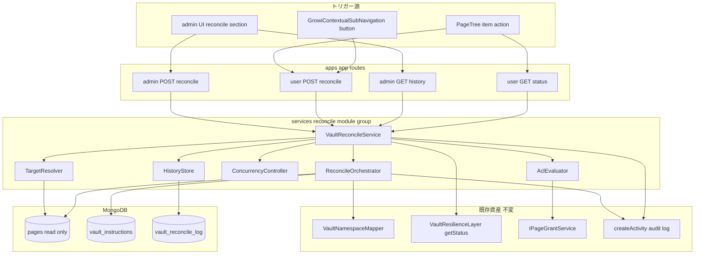
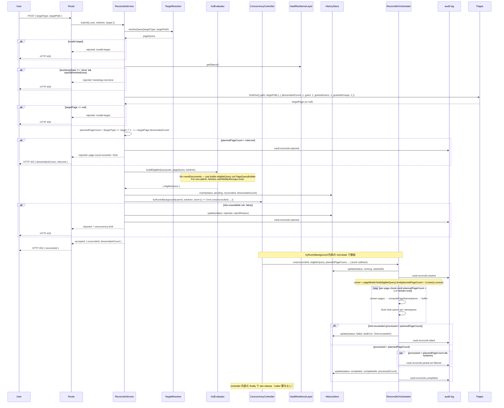
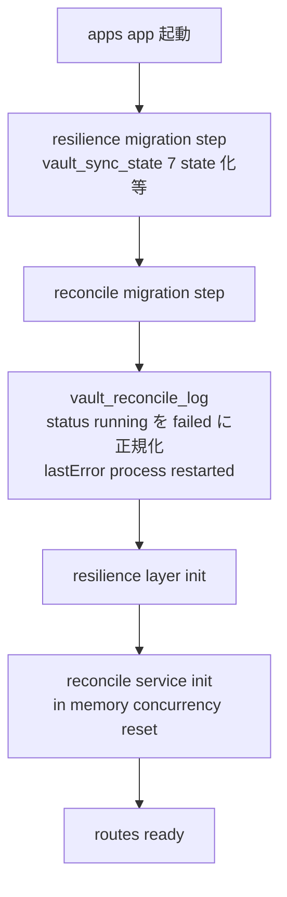
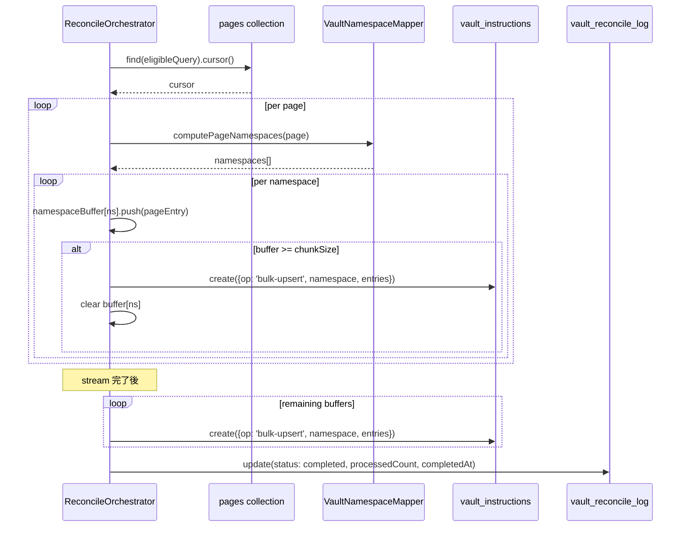

# 設計書: growi-vault-reconcile

## 概要

`growi-vault-reconcile` は GROWI Vault に **user-triggered targeted reconcile** を導入する spec である。`growi-vault-resilience` が確立した system-triggered correctness（自動 drift detection）が構造的に拾えない局所 drift（path change drift / grant drop drift / hard delete drift など）を、admin または一般ユーザーが UI から ACL-scoped に手動補修できる経路を提供する。

実装本体は `apps/app/src/features/growi-vault/server/services/reconcile/` 配下の新規 module group、新規 `vault_reconcile_log` collection、admin / user 向け API endpoint、UI 拡張（`/admin/vault` セクション + PageTree action + GrowiContextualSubNavigation button）で構成される。`apps/growi-vault-manager` 側および `packages/core` の DTO 型は **不変** ——本 spec は既存 `bulk-upsert` op を再利用し、新規 instruction op を導入しないため、vault-manager の冪等性契約と既存 sub-spec の reference 性が維持される。

`growi-vault-gateway`（cleanup 済み reference）の PAT 認証 / ACL 評価 / namespace 計算 interface は本 spec の依存として再利用し、`growi-vault-resilience`（完了）の `vault_instructions` outbox 経路と `VaultNamespaceMapper` を共有する。Trash 責務分離原則（apps/app trash-agnostic / vault-manager 側 `isExcludedFromVault` filter）は resilience で確立済みであり、reconcile も同原則を踏襲する。

### Goals

- admin / 一般ユーザーが UI から page 単位または sub-tree 単位で reconcile を起動できる経路を提供する
- ACL 評価により、一般ユーザーは write 権を持つページのみ reconcile 対象に含める
- 既存 `bulk-upsert` op を再利用し、`vault-manager` の冪等性契約 / at-least-once 配送保証を破壊しない
- リソース食い潰しを防ぐため、role 別の target page 数上限 + per-user / system-wide 同時実行上限を強制し、上限超過時はユーザーへ明示的な誘導メッセージを返す
- reconcile の起動・進捗・完了・失敗・拒否を admin UI / PageTree / audit log の 3 経路で観測可能にする

### Non-Goals

- 新規 `vault_instructions` op の追加 → 既存 `bulk-upsert` を再利用
- `growi-vault-manager` 側の op handler / dispatcher 挙動変更
- `growi-vault-resilience` の state machine / 自動 drift detection ロジック変更
- `growi-vault-gateway` の PAT 認証 / ACL 評価 / namespace 計算ロジック本体の変更
- 双方向同期 / git → MongoDB push（vault は read-only 公開面のまま）
- マルチレプリカ writer の serialize（`growi-vault-ha` の責務）
- 新規 admin UI 画面の独立構築（既存 `/admin/vault` を拡張する形に閉じる）
- Reconcile 中の自動 abort / 強制停止（要件 4.2 で禁止）

---

## 境界コミットメント

### This Spec Owns

- `apps/app/src/features/growi-vault/server/services/reconcile/` 配下の全モジュール（orchestrator / ACL evaluator / concurrency controller / target resolver / history store / barrel + factory）
- 新規 `vault_reconcile_log` Mongoose model および collection schema
- `apps/app/src/features/growi-vault/server/routes/vault-admin.ts` への admin 用 reconcile endpoint 追加（`POST /vault/reconcile`、`GET /vault/reconcile-history`）
- `apps/app/src/features/growi-vault/server/routes/vault-page.ts` 新規ファイル — 一般ユーザー用 reconcile endpoint（`POST /vault/page/reconcile`、`GET /vault/page/reconcile-status/:pageId`）
- `apps/app/src/features/growi-vault/client/admin/VaultAdminSettings.tsx` の Reconcile セクション追加（trigger UI + history table）
- PageTree item action / GrowiContextualSubNavigation への reconcile entry point 追加
- `apps/app/src/interfaces/activity.ts` への `ACTION_VAULT_RECONCILE_*` 定数追加
- `apps/app/src/server/service/config-manager/config-definition.ts` への `app:vaultReconcile*` config 追加
- `apps/app/src/features/growi-vault/server/index.ts` への reconcile service init + 起動時 stale-running 正規化ステップの追加
- `vault.reconcile.*` audit log イベントの emission

### Out of Boundary

- `apps/growi-vault-manager/` 配下の op handler および dispatcher の挙動変更
- `packages/core/src/interfaces/vault/` の `VaultInstructionOp` 型（新規 op 追加なし）
- `growi-vault-resilience` の state machine / drift detector / bootstrap runner の挙動変更
- `growi-vault-gateway` の `VaultPatAuth` / `VaultNamespaceMapper`（ACL 評価ロジック本体）の変更
- 既存 `pages` / `revisions` / `accesstokens` / `vault_sync_state` / `vault_instructions` model のスキーマ変更
- Reconcile 中の vault-manager 側 in-flight 処理への介入
- Hard delete drift / path change drift / grant drop drift の検出ロジック自体（reconcile はユーザーがそれらを発見した後の **補修経路** であり、検出機構ではない）
- マルチレプリカ writer 単一化の物理保証
- PAT 認証 / git smart HTTP gateway / read-only 公開面（既存 gateway の責務範囲）

### Allowed Dependencies

- 既存 `Page` Mongoose model（read-only、`pageModel.find(query).cursor()` で stream）
- 既存 `Revision` Mongoose model（read-only、revisionId 解決）
- 既存 `VaultInstruction` model（write のみ、`bulk-upsert` op のみ発行）
- 既存 `VaultNamespaceMapper`（read-only、`computePageNamespaces(page)` で grant → namespace 計算）
- 既存 `growi-vault-resilience` の `VaultResilienceLayer.getStatus()`（read-only、`bootstrap.state` 取得）
- 既存 `loginRequiredFactory(crowi)` / `adminRequiredFactory(crowi)` middleware
- 既存 `IPageGrantService` および page-grant 評価 utility（ACL 評価の真実源）
- 既存 `createActivity` audit log API
- 既存 `configManager.getConfig(...)` 設定読み出し
- 既存 `apiv3Get` / `apiv3Post` SWR pattern
- React + reactstrap（admin UI セクション拡張、Modal、Alert）

### Revalidation Triggers

- 新規 `vault_reconcile_log` collection を追加 → 既存 spec / vault-manager への影響なし（read-only な参照もしない）
- 起動時 migration ステップ（`status === 'running'` の正規化）を `features/growi-vault/server/index.ts` に追加 → 既存 resilience の migration block と並列、依存方向は resilience init → reconcile init で固定
- 新規 env var `VAULT_RECONCILE_*` 追加 → consumer は reconcile service 内部のみ
- `VaultInstructionOp` 型の不変 → 下流の vault-manager / gateway への再検証は不要
- 一般ユーザー endpoint の追加 → 既存 GROWI 認証 middleware で保護される範囲内、外部公開 surface は変わらない

---

## アーキテクチャ

### Existing Architecture Analysis

| 既存資産 | 役割 | 本 spec での扱い |
|----------|------|------------------|
| `VaultNamespaceMapper`（gateway） | grant → namespace 配列を返す純関数 | **read-only で再利用**、変更なし |
| `vault_instructions` outbox（gateway / resilience） | apps/app → vault-manager の命令キュー | write 元として再利用（`bulk-upsert` op のみ発行） |
| `VaultResilienceLayer`（resilience） | bootstrap state machine + drift detector + auto retry | **read-only で参照**、reconcile は `getStatus().bootstrap.state` を読む |
| `VaultBootstrapper` facade（resilience の delegation） | bootstrap 開始 / 状態取得の公開 interface | 不変、reconcile は facade を経由せず直接 resilience layer を参照する場合も既存 import 経路を尊重 |
| `Page` model + `pageModel.find().cursor()` | MongoDB の page collection への read access | resilience の bootstrap-runner / drift-detector と同 pattern で stream |
| `loginRequiredFactory` / `adminRequiredFactory` | 既存 web セッション認証 middleware | reconcile endpoint の保護に再利用 |
| `IPageGrantService` / page-grant 評価 | Page ACL 評価の真実源 | ACL filter のために再利用 |
| `VaultAdminSettings.tsx` | 既存 8 セクションの admin UI（resilience までで 8 セクション） | **1 セクション追加** (Reconcile Section: trigger + history) |
| PageTree `usePageItemControl` hook | bookmark / rename / delete 等の item action 集約 | reconcile action を追加 |
| GrowiContextualSubNavigation `PageControls` | sub-navigation の dropdown action 集約 | reconcile button を追加 |

### Architecture Pattern & Boundary Map

採用パターン: **target-bounded sweep + accept/reject gate**。reconcile orchestrator は resilience の drift detector と同じ「cursor stream + namespace 計算 + chunk flush」pattern を target-bounded な query で実行する。受付時に accept/reject ゲート（ACL filter / role 別 page 数上限 / concurrency slot / bootstrap state check）を直列に通過させ、accept した request のみ async に処理を開始する。



**Architecture Integration**:
- Selected pattern: **gate-then-execute**（accept/reject の同期判定 → accept した request を async orchestrator が処理）。これにより API は即時応答（要件 1.3）し、long-running な page traversal を background で行える。
- **Accept gate は cheap な single-document read のみで構成する**: target page を `findOne({ path: targetPath })` で取得し `descendantCount` を読むことで上限判定する（要件 6.2）。`countDocuments` 等の全 scan 系 query は accept gate で発行しない。これにより accept gate p99 ≤ 200ms（要件 6.10）を index-only seek だけで満たせる。
- **手動 reconcile は局所補修用途に閉じる**: 1 reconcile あたり default 1000 ページ上限、system-wide 同時実行 default 3。大規模 sweep が必要な場合は resilience 経路（`VAULT_BOOTSTRAP_ON_START=force`）に誘導する。
- **Defense in depth — orchestrator 側ハードキャップ**: `descendantCount` は eventually consistent なので、orchestrator の cursor に `limit(maxPages + 1)` を付け、+1 件目を見たら `limit-exceeded` で失敗させる（要件 6.11）。受付ゲートの見積もり違いによる暴走を有界化する。
- Domain/feature boundaries: reconcile service は admin / user の差を request meta で受け取り、内部 logic は role に応じた env var で上限を切り替える。Endpoint 自体は admin / user で分離し、middleware で保護する。
- Existing patterns preserved: factory + DI（`createXxx`）、`createActivity?.({...})` audit pattern、`configManager.getConfig(...)` 設定読み出し、`vault_instructions` outbox への write、cursor-based stream（`.lean()` 指定で memory 削減）、namespace バッファ + chunk flush。
- New components rationale: reconcile orchestrator / ACL evaluator / concurrency controller / target resolver / history store は responsibility-based 分解（coding-style.md の「責務ベース module 分解」）に従う。各々 200 行以内、test 容易、parallel 実装可能。
- Steering compliance: feature-based 構成（`features/growi-vault/`）に閉じる、@growi/core への変更なし、Biome 配下の新規ファイルのみ、changeset 不要（apps/app 内部）。

### Technology Stack

| Layer | Choice / Version | Role in Feature | Notes |
|-------|------------------|-----------------|-------|
| Backend / Services | Node.js 22.x（既存）/ TypeScript | reconcile service モジュール群 | 新規依存なし |
| Data / Storage | MongoDB（既存 mongoose 6.13.x） | 新規 `vault_reconcile_log` collection、既存 `vault_instructions` write、`pages` read | 新規 collection 1 件のみ |
| Frontend | React 18 + reactstrap（既存） | `VaultAdminSettings.tsx` セクション拡張、新規 modal / table コンポーネント、PageTree / SubNav の menu item | 新規依存なし |
| Config | `configManager`（既存） | `VAULT_RECONCILE_*` env var 追加 | `defineConfig` パターン踏襲 |
| Messaging | `vault_instructions` outbox（既存） | reconcile 補修 instruction の発行先 | 既存 `bulk-upsert` op のみ使用 |
| i18n | 既存 next-i18next（既存） | reject reason → user-facing message の解決 | 新規 message key 追加（`growi-vault.reconcile.*`） |

新規外部依存ゼロ。全て既存パターンの拡張で実装可能。

---

## File Structure Plan

### Directory Structure

```
apps/app/src/features/growi-vault/server/
├── services/
│   └── reconcile/                          # 新規 module group
│       ├── index.ts                        # 公開 API: createVaultReconcileService + 型
│       ├── reconcile-service.ts            # Orchestrator: gate + 受付 + 非同期処理 dispatch
│       ├── reconcile-target-resolver.ts    # target spec → pageModel.find query 生成（純関数）
│       ├── reconcile-acl-evaluator.ts      # user + page list → 編集権がある page list（adapter）
│       ├── reconcile-concurrency-controller.ts # in-memory per-user + system-wide slot 管理
│       ├── reconcile-orchestrator.ts       # async: cursor stream + namespace 計算 + bulk-upsert 発行
│       ├── reconcile-history-store.ts      # vault_reconcile_log の CRUD wrapper
│       └── __tests__/                      # *.spec.ts 群（テスト共置）
│           ├── reconcile-service.spec.ts
│           ├── reconcile-target-resolver.spec.ts
│           ├── reconcile-acl-evaluator.spec.ts
│           ├── reconcile-concurrency-controller.spec.ts
│           ├── reconcile-orchestrator.spec.ts
│           ├── reconcile-history-store.spec.ts
│           └── reconcile-flow.integ.ts     # 実 MongoDB を含む end-to-end
├── models/
│   └── vault-reconcile-log.ts              # 新規 Mongoose model + schema
└── routes/
    ├── vault-admin.ts                      # 修正: admin endpoint 追加
    └── vault-page.ts                       # 新規: 一般ユーザー endpoint

apps/app/src/features/growi-vault/client/
├── admin/
│   └── VaultAdminSettings.tsx              # 修正: Reconcile セクション追加
└── components/                              # 新規ディレクトリ（または既存 components/ に追加）
    ├── ReconcileTriggerModal.tsx           # target 選択 + confirm modal
    ├── ReconcileHistoryTable.tsx           # admin 用 history 表示
    └── PageReconcileMenuItem.tsx           # PageTree item action 内で使う
```

> 各サブモジュールは単一責任を持ち、1 ファイル < 300 行に収める。`reconcile-service.ts` は唯一の I/O orchestrator として target resolver / ACL evaluator / concurrency controller / orchestrator / history store を組み立てる factory + facade。`reconcile-orchestrator.ts` のみが async で長時間動作する。

### Modified Files

- `apps/app/src/features/growi-vault/server/index.ts` — reconcile service の init を resilience init の後に追加。起動時 migration ステップとして `vault_reconcile_log.status === 'running'` を `failed` に正規化する処理を追加。graceful shutdown で reconcile service の `stop()` を呼ぶ。
- `apps/app/src/features/growi-vault/server/routes/vault-admin.ts` — `POST /vault/reconcile`（任意 target、admin auth）と `GET /vault/reconcile-history`（history list）を追加。
- `apps/app/src/features/growi-vault/client/admin/VaultAdminSettings.tsx` — Reconcile section を追加（trigger UI + history table）。SWR で `/vault/reconcile-history` を読み 5s 周期 refresh。
- `apps/app/src/interfaces/activity.ts` — `ACTION_VAULT_RECONCILE_STARTED` / `_COMPLETED` / `_FAILED` / `_REJECTED` / `_PARTIAL_ACL_FILTERED` の 5 定数を追加。
- `apps/app/src/server/service/config-manager/config-definition.ts` — `app:vaultReconcileMaxPagesPerUserRequest` / `_MaxPagesPerAdminRequest` / `_MaxConcurrentPerUser` / `_MaxConcurrentSystem` / `_ChunkSize` / `_HistoryRetentionDays` / `_RejectWhenBootstrapNotDone` / `_AdminBypassCapacityLimit` の 8 keys を追加。
- `apps/app/src/client/components/Sidebar/PageTreeItem/use-page-item-control.tsx` — reconcile action（callback + menu item rendering）を追加。
- `apps/app/src/client/components/Navbar/GrowiContextualSubNavigation.tsx`（または `PageControls.tsx` 配下） — reconcile button を sub-navigation に追加。

> @growi/vault-manager / packages/core への変更なし。`@growi/core/interfaces/vault` の DTO 型は不変（新規 op 追加なし）。

---

## System Flows

### Reconcile 受付 → accept/reject 判定 → async 処理



**Key Decisions**:
- 受付ゲートは **同期 cheap path** で実行し、target page 1 件の `findOne` のみ追加 DB I/O とする（要件 6.2 / 6.10）。accept/reject を即時に返す（要件 1.3）。
- ACL filter は受付時点で確定し、実行中の ACL 変更は無視する（要件 2.5）。
- ACL filter で 0 件 = no-op の判定は orchestrator 側に委ねる（cursor stream で 0 件処理 → `completed` で `processedCount: 0`）。受付ゲートでは `eligibleQuery` の build までしか行わない。
- 受付ゲート上限判定は target page の `descendantCount`（raw value、pages collection の field）を読み、`plannedPageCount = (targetType === 'page') ? 1 : 1 + descendantCount` を計算して role 別上限（default 1000）と比較する。`descendantCount` は eventually consistent のため、**orchestrator 側で `cursor.limit(plannedPageCount + 1)` のハードキャップ**を併設し、+1 件目を見たら `limit-exceeded` で停止する（要件 6.11）。
- `partial-acl-filtered` audit は accept 時ではなく orchestrator 完了時に emit する（accept 時に countDocuments を発行しないため、ACL filter 後の正確な処理対象件数は accept 時点では確定しない）。`processedCount < plannedPageCount` かつ非 admin なら ACL filter で差分が出たと判定する（trash 配下の空 namespace page 等も差分に含まれる ambiguous な heuristic である点は accepted trade-off）。
- Concurrency slot は accept 時に acquire、orchestrator の `finally` で release。プロセス再起動時の orphan slot は起動 migration で正規化（後述）。
- bootstrapState check は default で reject、`VAULT_RECONCILE_REJECT_WHEN_BOOTSTRAP_NOT_DONE=false` で override 可能（要件 4.4）。

### 起動時 stale-running 正規化



**Key Decisions**:
- in-memory concurrency counter はプロセス起動時に 0 から始まる。停止前に `running` だった reconcile log は migration で `failed` 正規化される（resilience の `running + null instanceId` 正規化と同 pattern）。
- migration の順序は `resilience migration → reconcile migration → resilience init → reconcile init` で固定し、依存方向を守る。

### Reconcile orchestrator の内部処理



**Key Decisions**:
- cursor stream pattern は resilience の bootstrap-runner / drift-detector と同 pattern（page-by-page、namespace バッファ、chunk flush）。
- chunk size は `VAULT_RECONCILE_CHUNK_SIZE`（default 100）で env 制御。
- trash 判定は行わない（apps/app trash-agnostic、vault-manager 側 `isExcludedFromVault` filter に委譲）。
- 失敗時は orchestrator が catch し、`vault_reconcile_log.lastError` に記録、audit log に `failed` event を emit、concurrency slot を release。orchestrator は他の reconcile を巻き込まずに自身のみ失敗する。

---

## Requirements Traceability

| Requirement | Summary | Components | Interfaces | Flows |
|-------------|---------|------------|------------|-------|
| 1.1 | 管理者: `/admin/vault` から target を指定して reconcile 起動 | VaultAdminSettings, ReconcileTriggerModal, ReconcileService, POST `/vault/reconcile` | API + Service | 受付フロー |
| 1.2 | 一般ユーザー: PageTree / SubNav から reconcile 起動 | PageReconcileMenuItem, ReconcileTriggerModal, ReconcileService, POST `/vault/page/reconcile` | API + Service | 同上 |
| 1.3 | reconcile ID 即時発行 + 同期完了を待たない | ReconcileService（accept 時に reconcileId 返却）, ReconcileOrchestrator（async 開始） | Service contract | 同上 |
| 1.4 | target は page / sub-tree の 2 種類のみ | TargetResolver | 純関数 contract | (内部 logic) |
| 1.5 | 無効 target → HTTP 400 | TargetResolver + ReconcileService | error envelope | 同上 |
| 2.1 | 既存 web セッション認証要求 | route middleware (loginRequiredFactory) | middleware chain | — |
| 2.2 | admin → 制約なし全ページ対象 | AclEvaluator（admin path） | Service contract | 同上 |
| 2.3 | 一般ユーザー → write 権を持つページのみ | AclEvaluator（page-grant 評価） | Service contract | 同上 |
| 2.4 | 未認可ページは silent に除外 | AclEvaluator | Service contract | 同上 |
| 2.5 | ACL 評価は受付時点で確定 | AclEvaluator | timing contract | 同上 |
| 2.6 | ACL 全除外 → no-op completed | ReconcileService（accept-as-noop） | Service contract | 同上 |
| 3.1 | 対象ページ MongoDB から走査 + namespace 解決 | ReconcileOrchestrator（cursor stream） | (内部) | orchestrator フロー |
| 3.2 | 既存 `bulk-upsert` op で `vault_instructions` 発行 | ReconcileOrchestrator | event contract | 同上 |
| 3.3 | 新規 op 追加なし | (設計判断: VaultInstructionOp 不変) | — | — |
| 3.4 | vault-manager op handler 不変 | (Out of Boundary 明示) | — | — |
| 3.5 | 冪等性 / at-least-once 維持 | (設計判断、依存) | — | — |
| 3.6 | trash 判定は vault-manager 側 filter に委譲 | ReconcileOrchestrator（trash-agnostic） | (内部) | orchestrator フロー |
| 4.1 | drift detector と並行発行 → 最終状態一意収束 | (vault-manager 冪等性に依存) | — | — |
| 4.2 | reconcile の自動 abort なし | ReconcileService / Orchestrator | lifecycle contract | — |
| 4.3 | resilience の bootstrapState 遷移に介入しない | (Out of Boundary 明示) | — | — |
| 4.4 | bootstrapState != done で default reject | ReconcileService（getStatus 参照） + 設定 `VAULT_RECONCILE_REJECT_WHEN_BOOTSTRAP_NOT_DONE` | Service contract | 受付フロー |
| 4.5 | 並行発行で破壊しない | (vault-manager 冪等性に依存) | — | — |
| 5.1 | 履歴永続化（reconcileId / 起動時刻 / user / target / processed / status / 完了時刻 / lastError） | HistoryStore + `vault_reconcile_log` schema | data model | — |
| 5.2 | admin UI に history section | VaultAdminSettings + ReconcileHistoryTable + GET `/vault/reconcile-history` | API + UI | — |
| 5.3 | admin UI に trigger UI | VaultAdminSettings + ReconcileTriggerModal | UI | — |
| 5.4 | `vault.reconcile.*` audit event 記録 | ReconcileService + ReconcileOrchestrator + activity.ts 定数 | audit log contract | — |
| 5.5 | 失敗時 lastError + WARN log + audit log | ReconcileOrchestrator + HistoryStore | error path | orchestrator フロー |
| 5.6 | history は admin のみに閲覧許可 | route auth (adminRequiredFactory) | middleware | — |
| 6.1 | role 別 max pages per request（default 一般 1000 / 管理 1000） | ReconcileService + config | config + Service contract | 受付フロー |
| 6.2 | accept gate は `descendantCount` のみで判定、countDocuments 不発行 | ReconcileService（target findOne） | Service contract | 同上 |
| 6.3 | 一般ユーザー上限超過 → 範囲を絞る / admin 依頼の誘導 | ReconcileService（reject reason） + i18n | error envelope | 同上 |
| 6.4 | 管理者上限超過 → 範囲を絞る / force re-bootstrap の誘導 | 同上 | 同上 | 同上 |
| 6.5 | 自動分割なし | ReconcileService | Service contract | — |
| 6.6 | per-user 同時実行数上限（default 1） | ConcurrencyController | in-memory slot | 同上 |
| 6.7 | system-wide 同時実行数上限（default 3） | ConcurrencyController | 同上 | 同上 |
| 6.8 | 同時上限超過 → 進行中完了後再試行 案内 | ReconcileService（reject reason） + i18n | error envelope | 同上 |
| 6.9 | 拒否を `vault.reconcile.rejected` audit event 記録 | ReconcileService + activity.ts | audit log contract | 同上 |
| 6.10 | accept gate p99 ≤ 200ms / orchestrator ≤ 120s / instruction insert 件数有界 | ReconcileService + ReconcileOrchestrator + chunkSize config | non-functional target | — |
| 6.11 | orchestrator cursor に `limit(plannedPageCount + 1)` のハードキャップ、`limit-exceeded` 失敗 | ReconcileOrchestrator | Service contract | orchestrator フロー |
| 7.1 | vault-manager 冪等性破壊しない | (依存) | — | — |
| 7.2 | at-least-once 配送破壊しない | (依存) | — | — |
| 7.3 | resilience state machine 不変 | (Out of Boundary) | — | — |
| 7.4 | gateway PAT / ACL / mapper 不変 | (Out of Boundary、依存利用のみ) | — | — |
| 7.5 | 既存 op の挙動変更なし | (Out of Boundary) | — | — |
| 7.6 | single-replica 運用前提 | (設計判断、in-memory concurrency) | — | — |
| 7.7 | cleanup 済み sub-spec を再編集しない | (運用方針、新規 spec として置き換え設計) | — | — |
| 7.8 | read-only 公開面の前提維持 | (Out of Boundary、git → MongoDB push なし) | — | — |

---

## Design Decisions

将来 refactor 時に押さえるべき設計判断と、却下した代替案。

### Decision: Reconcile orchestrator は resilience drift-detector pattern を独立に流用

- **Context**: reconcile は `pageModel.find(query).cursor()` で stream → namespace 計算 → `bulk-upsert` 発行という I/O pattern を持ち、これは resilience の drift-detector とほぼ同じ。
- **Rejected**:
  1. drift-detector 内部を library 化して共有 — 過剰な抽象化。watermark 更新 / `bootstrapState !== 'done'` 早期 return 等は drift-detector 固有の責務
  2. drift-detector の private 関数を export して再利用 — barrel 設計原則違反、internal 詳細の漏洩
- **Selected**: 両 component は同 pattern を **independent** に実装。pure な page→namespace 計算 (`VaultNamespaceMapper`) のみ共有、instruction 発行は両者が独立に `VaultInstruction.create` を呼ぶ。
- **Rationale**: drift-detector は「watermark sweep + observability」、reconcile orchestrator は「target-bounded sweep + user-triggered」と異なる責務に閉じる。同 pattern 2 箇所の duplication は spec boundary 維持コストより低い。
- **Follow-up**: code duplication が痛点になれば、`services/_shared/` 等に pure helper（例: `streamPagesAndEmitBulkUpsert(query, mapper, ...)`）を抽出する検討（本 spec scope 外）。

### Decision: Concurrency 制御は in-memory counter + MongoDB log で実装

- **Context**: per-user + system-wide 同時実行上限の強制（要件 6.6 / 6.7）。
- **Rejected**:
  1. Redis lease — 分散環境前提、GROWI に Redis 依存を追加するコスト大
  2. MongoDB atomic counter doc — race 制御は可能だが、in-memory より overhead 大
- **Selected**: in-memory `Map<userId, count>` + system-wide active counter（Node.js single-thread の atomic 性に依存）。`vault_reconcile_log` は user-visible history の persist 専用で、concurrency 判定の source of truth ではない。
- **Follow-up (multi-replica 化)**: `growi-vault-ha` 適用時に Redis lease 等への移行が必要 — Revalidation Triggers に記録済み。

### Decision: Reject reason は enum 値で API 返却、UI 側で i18n key 解決

- **Context**: reject 時の誘導メッセージ（「範囲を絞る or admin 依頼」「範囲を絞る or force re-bootstrap」）の表示（要件 6.3 / 6.4）。
- **Rejected**: サーバー側で i18n された message string を直接返す — locale 解決をサーバー側に持たせる必要があり、既存 REST API pattern と不整合。
- **Selected**: API response は `{ status: 'rejected', reason: RejectReason, descendantCount?, roleLimit? }` の形で enum 値を返し、UI が `growi-vault.reconcile.rejected.<reason>` の i18n key を解決してローカライズ表示。
- **Rationale**: API contract が pure data、UI が presentation を担う既存 GROWI pattern と整合。

### Decision: `bootstrapState !== 'done'` の reject は default 有効、env override 可能

- **Context**: 要件 4.4 で「拒否を default とする」と明示。一方で resilience retry が長引いている間も reconcile を試したい運用ニーズもありうる。
- **Selected**: `VAULT_RECONCILE_REJECT_WHEN_BOOTSTRAP_NOT_DONE` env var、default `true`。`false` 設定時は bootstrap state によらず reconcile を受け付ける。
- **Trade-off**: override 時に reconcile が部分的にしか効果を持たない可能性（bootstrap がまだ partial にしか書いていない状態で reconcile しても、後続 bootstrap で上書きされる）— admin UI で「override 中」を可視化する。

### Decision: Reconcile history は `vault_reconcile_log` 専用 collection に永続化

- **Context**: 要件 5.1 で reconcile 履歴の永続化が必要。
- **Rejected**:
  1. `vault_sync_state` singleton 拡張 — singleton doc 肥大化、N 件管理困難
  2. `activities` collection（既存 audit log）に統合 — audit log は append-only event 記録に特化、reconcile の status 更新（pending → running → completed）と相性が悪い
- **Selected**: 新規 `vault_reconcile_log` collection、retention は env var `VAULT_RECONCILE_HISTORY_RETENTION_DAYS`（default 30 日）、TTL index を `triggeredAt` に張る。
- **Caveat**: TTL の `expireAfterSeconds` は collection 作成時に固定。retention 日数を運用中に変更する場合は手動 `collMod` または index 再作成が必要。

## Risks & Mitigations

- **R1: 大量 reconcile による DoS** — per-user 同時 1（default）で個人レベルの暴走を抑制、system-wide 3（default）で全体上限。admin bypass option (`VAULT_RECONCILE_ADMIN_BYPASS_CAPACITY_LIMIT`、default `false`) で緊急対応経路を確保。
- **R2: ACL 評価と実行中の ACL 変更の race** — 要件 2.5 通り、ACL 評価はリクエスト時点で確定し、実行中の変更は次回 reconcile で反映する。途中の ACL 変更は冪等性に委ねる（vault-manager の content-addressing で最終状態は一意収束）。
- **R3: drift-detector と user-triggered reconcile の同時発行** — vault-manager の冪等性で最終状態が一意収束（要件 4.1）。outbox の processedAt + ack 機構で attempts 重複は許容範囲。実運用で観測すれば coalesce を後付け検討。
- **R4: 一般ユーザーが上限超過 reject 時に状況把握できない** — reject response に `descendantCount` を含めて返し、UI で「N 件が対象でした。上限 M 件以下に絞ってください」と明示。
- **R5: in-memory concurrency counter のプロセス再起動リセット** — 起動時 migration で `vault_reconcile_log.status === 'running' | 'pending'` を `failed: process-restarted` に正規化（resilience の stale-running detection と同 pattern）。

---

## Components and Interfaces

### Summary

| Component | Domain/Layer | Intent | Req Coverage | Key Dependencies (P0/P1) | Contracts |
|-----------|--------------|--------|--------------|--------------------------|-----------|
| VaultReconcileService | services/reconcile | 受付 gate（target findOne + descendantCount 判定）+ accept 後 orchestrator dispatch + history 管理 | 1.1, 1.2, 1.3, 2.6, 4.4, 6.1-6.10 | TargetResolver (P0), AclEvaluator (P0), ConcurrencyController (P0), HistoryStore (P0), VaultResilienceLayer.getStatus (P0), Page model (P0) | Service, API |
| TargetResolver | services/reconcile | target spec → `pageModel.find` query を生成する純関数 | 1.4, 1.5 | (pure) | Service |
| AclEvaluator | services/reconcile | user + base query → ACL filter 後 `eligibleQuery` を生成する adapter（count は持たない） | 2.2, 2.3, 2.4, 2.5 | PageQueryBuilder (P0), IPageGrantService (P0) | Service |
| ConcurrencyController | services/reconcile | per-user + system-wide slot の in-memory 管理 + tryRunInBackground による work dispatch | 6.6, 6.7, 6.8 | (in-memory) | State, Service |
| ReconcileOrchestrator | services/reconcile | async cursor stream（`limit(plannedPageCount + 1).lean()`）+ namespace 計算 + bulk-upsert 発行 + ハードキャップ + 失敗ハンドリング | 3.1, 3.2, 3.6, 5.4, 5.5, 6.10, 6.11 | VaultNamespaceMapper (P0), VaultInstruction (P0), Page model (P0) | Service, Batch, Event |
| HistoryStore | services/reconcile | `vault_reconcile_log` CRUD wrapper + retention | 5.1, 5.6 | vault_reconcile_log model (P0) | Service, State |
| VaultReconcileLog | models | reconcile lifecycle record の Mongoose schema | 5.1, 7.6 (in-memory + persisted 整合) | mongoose (P0) | State |
| Admin Route Handler | routes/vault-admin | admin reconcile + history endpoint | 1.1, 5.2, 5.6 | VaultReconcileService (P0) | API |
| User Route Handler | routes/vault-page | 一般ユーザー reconcile endpoint | 1.2 | VaultReconcileService (P0) | API |
| VaultAdminSettings Reconcile Section | client/admin | trigger UI + history table | 5.2, 5.3 | apiv3Get/Post, ReconcileHistoryTable (P1), ReconcileTriggerModal (P1) | UI |
| PageReconcileMenuItem | client/components | PageTree item action としての reconcile 起動 | 1.2 | usePageItemControl (P1) | UI |

### services/reconcile

#### VaultReconcileService

| Field | Detail |
|-------|--------|
| Intent | reconcile request の受付ゲート（target validate / bootstrapState / ACL filter / page count / concurrency slot）を直列に通し、accept 時に reconcileId を即時返却して async orchestrator を kick する。reject 時は reason enum を返す。 |
| Requirements | 1.1, 1.2, 1.3, 2.6, 4.4, 6.1, 6.2, 6.3, 6.4, 6.5, 6.6, 6.7, 6.8 |

**Responsibilities & Constraints**
- 単一の I/O orchestrator として、TargetResolver / AclEvaluator / ConcurrencyController / HistoryStore / VaultResilienceLayer / ReconcileOrchestrator を組み立てる factory + facade。
- 受付ゲートは **同期** で順次評価し、最初の reject 条件で即時 return（短絡評価）。
- accept 時の reconcileId は UUID v4。
- domain boundary: 「受付の決定（accept/reject）」と「accept 後の non-blocking dispatch」までを所有し、cursor stream や instruction 発行は orchestrator に委ねる。
- 同時実行枠の制御は `ConcurrencyController.tryRunInBackground` に **委譲する** ことで本 component に閉じる。acquire / release の責務は controller の内部に閉じ、`submit` は枠の獲得失敗時の reject 分岐のみを扱う。

**Dependencies**
- Inbound: route handler — purpose: HTTP endpoint adapter (P0)
- Outbound: TargetResolver — purpose: target spec の純関数 decode (P0)
- Outbound: AclEvaluator — purpose: eligibleQuery build（ACL filter を Mongo query に AND merge、count は取らない） (P0)
- Outbound: ConcurrencyController — purpose: `tryRunInBackground` 経由で枠取得 + work dispatch (P0)
- Outbound: HistoryStore — purpose: lifecycle record の persist (P0)
- Outbound: VaultResilienceLayer.getStatus — purpose: bootstrapState 取得 (P0)
- Outbound: ReconcileOrchestrator — purpose: async 処理本体（controller の `work` callback として渡す） (P0)
- Outbound: createActivity — purpose: audit log emit (P1)

**Contracts**: Service [x] / API [ ] / Event [ ] / Batch [ ] / State [ ]

##### Service Interface

```typescript
export type ReconcileTargetType = 'page' | 'sub-tree';

export interface ReconcileRequest {
  readonly targetType: ReconcileTargetType;
  readonly targetPath: string;
  readonly triggeredBy: {
    readonly userId: string;
    readonly isAdmin: boolean;
  };
}

export type ReconcileRejectReason =
  | 'invalid-target'
  | 'bootstrap-not-done'
  | 'page-count-exceeds-user-limit'
  | 'page-count-exceeds-admin-limit'
  | 'user-concurrency-limit'
  | 'system-concurrency-limit';

export type ReconcileSubmitResult =
  | {
      readonly status: 'accepted';
      readonly reconcileId: string;
      /** Target page の descendantCount（raw value、pages collection の field）。
       *  targetType === 'page' のときも target page 自身の descendantCount を記録するが、
       *  実際の処理対象は target page 1 件のみ。UI 側は targetType と合わせて表示判断する。
       *  plannedPageCount = (targetType === 'page') ? 1 : 1 + descendantCount として導出可能。 */
      readonly descendantCount: number;
    }
  | {
      readonly status: 'rejected';
      readonly reason: ReconcileRejectReason;
      /** page-count-exceeds-*-limit の reject 時のみ含む。target page の生 descendantCount。 */
      readonly descendantCount?: number;
      readonly roleLimit?: number;
    };

export interface VaultReconcileService {
  submit(request: ReconcileRequest): Promise<ReconcileSubmitResult>;
  listHistory(opts: { limit?: number; offset?: number }): Promise<readonly ReconcileLogEntry[]>;
  stop(): Promise<void>;
}

export function createVaultReconcileService(
  deps: VaultReconcileServiceDeps,
): VaultReconcileService;
```

- Preconditions: `deps` の `pageModel` / `vaultInstruction` / `vaultReconcileLog` / `vaultNamespaceMapper` / `vaultResilienceLayer` / `pageGrantService` / `configManager` がすべて初期化済み。
- Postconditions: `submit` は accept 後ただちに reconcileId を返し、orchestrator は非同期で動作する。reject の場合、`vault_reconcile_log` には status: `rejected` の record が `vault.reconcile.rejected` audit event とともに 1 件残る。
- Invariants: 同時実行枠の獲得 / 解放はすべて `ConcurrencyController.tryRunInBackground` の内部に閉じる。`submit` 自身は acquire / release を直接扱わないため、release 漏れは型レベルで防がれる。

##### State Management

- State model: 受付の進行状態は呼び出しスタック上に閉じる（no persistent in-service state）。永続状態は `vault_reconcile_log` に閉じる。
- Persistence & consistency: ACL filter の結果は受付時点で確定し、orchestrator 実行中の ACL 変更は次回 reconcile で反映する（要件 2.5）。
- Concurrency strategy: ConcurrencyController が in-memory slot を管理。`submit` は `tryRunInBackground` の戻り値が `ok: false` ならその reason をそのまま reject reason に転写する。

**Acceptance gate ordering** (target page 1 件の findOne のみ追加 DB I/O):
1. TargetResolver で `targetPath` を validate → invalid なら invalid-target reject
2. VaultResilienceLayer.getStatus で bootstrap state 確認 → bootstrap-not-done reject
3. `pageModel.findOne({ path: targetPath }, { descendantCount: 1, grant: 1, grantedUsers: 1, grantedGroups: 1 }).lean()` で target page 解決
4. `plannedPageCount = (targetType === 'page') ? 1 : 1 + targetPage.descendantCount` を roleLimit と比較
5. AclEvaluator で `{ eligibleQuery }` build（count は取らない）
6. HistoryStore に `status: pending` insert
7. `ConcurrencyController.tryRunInBackground` で work dispatch

**Lifecycle invariants**:
- ACL 全除外による no-op completed（要件 2.6）と `partial-acl-filtered` 判定は accept gate ではなく orchestrator 完了時の `processedCount` で決定する（accept gate は `countDocuments` を打たないため正確な ACL filter 件数を知らない）。
- 手順 6（`pending` insert）と手順 7（microtask schedule）の間で process crash した場合、`pending` 残留 record は起動時 migration の `normalizeStaleLifecycle('running' + 'pending')` で `failed: process-restarted` に正規化される。
- bootstrapState check の race（getStatus 直後に bootstrap 完了）は受付タイミングを優先し、UI 側でリトライ提示する設計。

---

#### TargetResolver

| Field | Detail |
|-------|--------|
| Intent | `{ targetType, targetPath }` から `pageModel.find` 用の query object を生成する純関数。invalid path（空文字 / `/` 開始でない / 連続スラッシュ等）は decode 段階で `Err` を返す。 |
| Requirements | 1.4, 1.5 |

**Service Interface**

```typescript
export type TargetResolveResult =
  | { readonly ok: true; readonly query: PageQueryFilter }
  | { readonly ok: false; readonly reason: 'invalid-target' };

export function resolveTarget(
  targetType: ReconcileTargetType,
  targetPath: string,
): TargetResolveResult;
```

- `PageQueryFilter` は `mongoose.FilterQuery<IPageDocument>` の最小 subset。
- `targetType === 'page'` → `{ path: targetPath }`（厳密一致、page 単体）。
- `targetType === 'sub-tree'` → `{ $or: [{ path: targetPath }, { path: { $regex: '^' + escapeRegExp(targetPath) + '/' } }] }`（自身 + descendants）。

**Design invariants**: 正規表現エスケープ必須（regex injection 対策）。`null` / 空文字 / 改行を含む path は invalid。

---

#### AclEvaluator

| Field | Detail |
|-------|--------|
| Intent | user + base query → ACL 評価で許可された page のみに絞り込んだ `eligibleQuery` を build する純 adapter。**count は持たない**（受付ゲートの上限判定は `descendantCount` ベースに移譲、ACL filter 由来の差分判定は orchestrator 完了時に `processedCount < plannedPageCount` の heuristic で行う）。admin は filter skip、一般ユーザーは既存 `PageQueryBuilder.addConditionToFilteringByViewer` を再利用して grant 条件を Mongo query 側に AND merge する。 |
| Requirements | 2.2, 2.3, 2.4, 2.5 |

**Service Interface**

```typescript
export interface AclFilterResult {
  readonly eligibleQuery: PageQueryFilter;
}

export interface AclEvaluator {
  buildEligibleQuery(opts: {
    user: IUserHasId;
    isAdmin: boolean;
    baseQuery: PageQueryFilter;
  }): Promise<AclFilterResult>;
}

export function createAclEvaluator(deps: {
  pageModel: PageModel;
  pageGrantService: IPageGrantService;
}): AclEvaluator;
```

- `isAdmin === true` の場合: `eligibleQuery = baseQuery` をそのまま返す（追加の DB I/O なし）。
- `isAdmin === false` の場合:
  1. `userRelatedGroups = await pageGrantService.getUserRelatedGroups(user)` で user の所属 group を解決（1 query）
  2. `new PageQueryBuilder(Page.find(baseQuery)).addConditionToFilteringByViewer(user, userRelatedGroups.map(g => g._id), false, false, false)` で grant 条件を AND merge した builder を作成
  3. `eligibleQuery` は builder が保持する Mongoose query を `getFilter()` で取り出した object

**Dependencies**
- Outbound: PageQueryBuilder — purpose: `addConditionToFilteringByViewer` で grant 条件を Mongo FilterQuery にマージ (P0)
- Outbound: IPageGrantService — purpose: `getUserRelatedGroups` で user の所属 group 解決 (P0)

**Design invariants**:
- Grant semantics: `addConditionToFilteringByViewer(user, groups, false, false, false)` で GRANT_PUBLIC / GRANT_OWNER / GRANT_SPECIFIED / 所属 group の GRANT_USER_GROUP を許可（GRANT_RESTRICTED と非所属 group は除外）。GROWI page-grant model の「閲覧 ≡ 編集」原則（read-only 専用 grant なし）により viewer 条件で「編集権」要件 2.3 を代用する。
- DB cost: admin path は DB I/O なし、非 admin path も `getUserRelatedGroups` の 1 query のみ。`countDocuments` は呼ばない（accept gate cost は ReconcileService 側 `findOne` 1 件に閉じる）。
- 副作用なし。`partial-acl-filtered` 判定は orchestrator 完了時。

---

#### ConcurrencyController

| Field | Detail |
|-------|--------|
| Intent | per-user および system-wide の reconcile 同時実行数を in-memory counter で管理。public surface は `tryRunInBackground` 1 本に集約し、「枠の獲得 → background 実行 → finally で枠の返却」を内部に閉じる。caller は release を呼ぶ責任を持たない。 |
| Requirements | 6.5, 6.6, 6.7 |

**Service Interface**

```typescript
export type SlotAcquireRejection = {
  readonly ok: false;
  readonly reason: 'user-concurrency-limit' | 'system-concurrency-limit';
};
export type SlotAcquireSuccess = { readonly ok: true };
export type SlotAcquireResult = SlotAcquireSuccess | SlotAcquireRejection;

export interface ConcurrencyController {
  /**
   * 同時実行枠が取れたら work を background で実行し、完了/失敗にかかわらず必ず枠を返す。
   * 枠が取れなければ ok: false を返し、work は実行しない。
   * 内部で acquire → microtask schedule → try { await work() } finally { release } を行うため、
   * caller は release を呼ぶ責任を持たない（release は public surface に出さない）。
   */
  tryRunInBackground(opts: {
    userId: string;
    isAdmin: boolean;
    work: () => Promise<void>;
  }): SlotAcquireResult;

  getActiveCount(opts?: { userId?: string }): number;
  reset(): void; // test only
}

export function createConcurrencyController(config: {
  maxConcurrentPerUser: number;
  maxConcurrentSystem: number;
  adminBypassCapacityLimit: boolean;
}): ConcurrencyController;
```

**Internal contract**: `tryRunInBackground` は (a) Node.js single-thread の atomic な sync check-then-increment で acquire → (b) `Promise.resolve().then(...)` で `try { await work() } finally { release() }` を microtask schedule → (c) `ok: true | false` を即時 return。release は private に閉じ、caller は呼ばない。これにより increment と finally の間に例外が割り込む隙間がなく、release 漏れを型レベルで防ぐ。

**State Management**
- State model: `Map<userId, number>` + system-wide active count (number)。
- Persistence & consistency: in-memory のみ。プロセス再起動時はリセット。再起動時に残留する `vault_reconcile_log.status === 'running'` は migration で `failed` 正規化される（in-memory counter はゼロから始まる）。
- Concurrency strategy: Node.js single-threaded model に依存。private な acquire は check-then-increment を同期的に行い、JS event loop は atomic に動作するため race condition は発生しない。

**Implementation Notes**
- Public API は `tryRunInBackground` / `getActiveCount` / `reset` のみ。`releaseSlot` 相当は private に閉じ、外から呼ばせない（release 漏れを型レベルで防ぐ）。
- `reset()` は test 用にのみ public、production runtime では呼ばない。
- private な release は不正に多く呼ばれても counter が負にならないようガード。
- Risks: multi-replica 化時には Redis lease 等への移行が必要 — Revalidation Triggers に明示済み（`growi-vault-ha` の責務）。

---

#### ReconcileOrchestrator

| Field | Detail |
|-------|--------|
| Intent | accept された reconcile を async に処理する worker。eligibleQuery を `pageModel.find().limit(plannedPageCount + 1).lean().cursor()` で stream し、`computePageNamespaces` で namespace 計算、namespace ごとの buffer に積み、`chunkSize` 到達時または stream 終了時に `bulk-upsert` instruction を `vault_instructions` に発行する。`plannedPageCount + 1` 件目を見たら `limit-exceeded` 失敗としてハードキャップを適用する。完了時 / 失敗時に `vault_reconcile_log` を更新し、audit event を emit する。concurrency slot 制御は `ConcurrencyController.tryRunInBackground` 側に閉じているため、本 component は枠の獲得 / 解放を直接扱わない。 |
| Requirements | 3.1, 3.2, 3.6, 5.4, 5.5, 6.10, 6.11 |

**Service Interface**

```typescript
export interface ReconcileOrchestrator {
  run(opts: {
    reconcileId: string;
    eligibleQuery: PageQueryFilter;
    /** ReconcileService が `(targetType === 'page') ? 1 : 1 + descendantCount` で計算した処理予定 page 数。
     *  orchestrator は `cursor.limit(plannedPageCount + 1)` のハードキャップに使用する。 */
    plannedPageCount: number;
    triggeredBy: { userId: string; isAdmin: boolean };
    targetType: ReconcileTargetType;
    targetPath: string;
  }): Promise<void>;
}

export function createReconcileOrchestrator(deps: {
  pageModel: PageModel;
  vaultInstruction: Pick<VaultInstructionModel, 'create'>;
  vaultNamespaceMapper: VaultNamespaceMapper;
  vaultReconcileLog: VaultReconcileLogModel;
  createActivity?: CreateActivity;
  chunkSize: number;
}): ReconcileOrchestrator;
```

**`run` の主要 invariants**:
- `pageModel.find(eligibleQuery).limit(plannedPageCount + 1).lean().cursor()` で stream（`.lean()` 必須、`+1` ハードキャップで `descendantCount` stale 由来の暴走を有界化）
- 各 page を `VaultNamespaceMapper.computePageNamespaces` で namespace 配列に展開、namespace ごとの buffer に積み、buffer ≥ `chunkSize` で `vault_instructions` に `bulk-upsert` instruction を発行、stream 完了後に残バッファ flush
- `plannedPageCount + 1` 件目を見たら stream 停止、`status: 'failed', lastError: 'limit-exceeded'` で audit `failed` emit（要件 6.11、defense-in-depth）
- 非 admin かつ `processedCount < plannedPageCount` のとき `vault.reconcile.partial-acl-filtered` audit を emit（ACL filter 由来か空 namespace page か mid-flight 削除かを区別できない ambiguous heuristic）
- 例外時は `status: 'failed'`、自身のみ失敗（他の reconcile を巻き込まない）
- slot release は `ConcurrencyController` の finally に閉じるため、`run` 自身は slot 状態に依存しない

**Dependencies**
- Outbound: Page model — purpose: cursor stream (P0)
- Outbound: VaultNamespaceMapper — purpose: page → namespace 計算 (P0)
- Outbound: VaultInstruction — purpose: bulk-upsert instruction 発行 (P0)
- Outbound: VaultReconcileLog — purpose: lifecycle persist (P0)
- Outbound: createActivity — purpose: audit log emit (P1)

**Contracts**: Service [x] / API [ ] / Event [x] / Batch [x] / State [x]

##### Event Contract

- Published events（audit log 経由）:
  - `vault.reconcile.started` — payload: `{ reconcileId, userId, isAdmin, targetType, targetPath, descendantCount, plannedPageCount }`
  - `vault.reconcile.completed` — payload: `{ reconcileId, processedCount, durationMs }`
  - `vault.reconcile.failed` — payload: `{ reconcileId, processedCount, error }`
  - `vault.reconcile.partial-acl-filtered` — payload: `{ reconcileId, plannedPageCount, processedCount }`（`processedCount < plannedPageCount` で一部除外時、ACL 由来とは限らない ambiguous な heuristic）
- Ordering / delivery guarantees: audit log の既存契約に従う（at-least-once）。

##### Batch / Job Contract

- Trigger: ReconcileService.submit が accept 後に kick（async）
- Input / validation: eligibleQuery は ReconcileService 側で validated 済み
- Output / destination: `vault_instructions` への bulk-upsert instruction insert
- Idempotency & recovery: 同一 reconcileId に対する run の二重実行は ConcurrencyController が防ぐ。失敗時に再 run はしない（要件 4.2 で abort を禁止しているが、retry も導入しない — user が再 trigger することで再実行可能）。

##### State Management

- State model: `vault_reconcile_log` の status 遷移を所有。`pending → running → completed | failed` の単方向遷移のみ。
- Persistence & consistency: 各遷移は単一 `updateOne` で atomic。
- Concurrency strategy: 同一 reconcileId に対する run は 1 process 内で 1 回のみ。

**Design invariants**: chunkSize は config（default 100、drift detector と同等以下）。空 namespace 配列を返す page は skip。namespace バッファは namespace 単位で独立し chunk flush でクリアされるため memory は有界。

---

#### HistoryStore

| Field | Detail |
|-------|--------|
| Intent | `vault_reconcile_log` collection の CRUD wrapper。retention（TTL index）の管理。admin による history list 取得を提供。 |
| Requirements | 5.1, 5.6 |

**Service Interface**

```typescript
export interface ReconcileLogEntry {
  readonly reconcileId: string;
  readonly triggeredBy: { userId: string; isAdmin: boolean };
  readonly targetType: ReconcileTargetType;
  readonly targetPath: string;
  /** target page の descendantCount（raw value、pages collection の field）。
   *  rejected 時で target page が解決できない（invalid-target 等）場合は null。
   *  plannedPageCount = (targetType === 'page') ? 1 : 1 + descendantCount として導出。 */
  readonly descendantCount: number | null;
  readonly processedCount: number;
  readonly status: 'pending' | 'running' | 'completed' | 'failed' | 'rejected';
  readonly rejectReason?: ReconcileRejectReason;
  readonly triggeredAt: Date;
  readonly startedAt?: Date;
  readonly completedAt?: Date;
  readonly lastError?: string;
}

export interface HistoryStore {
  create(entry: Omit<ReconcileLogEntry, 'startedAt' | 'completedAt' | 'lastError'>): Promise<void>;
  updateStatus(
    reconcileId: string,
    patch: Partial<Pick<ReconcileLogEntry, 'status' | 'startedAt' | 'completedAt' | 'processedCount' | 'lastError' | 'rejectReason'>>,
  ): Promise<void>;
  listRecent(opts: { limit: number; offset?: number }): Promise<readonly ReconcileLogEntry[]>;
  /** 起動時 migration が呼ぶ。status が 'running' / 'pending' の record を
   *  status: 'failed', lastError: 'process-restarted', completedAt: now に bulk update し、件数を返す。
   *  'pending' を含めるのは accept gate が log insert 後 / orchestrator promotion 前に crash した場合の
   *  残留 record を吸収するため（VaultReconcileService の Acceptance gate ordering / Lifecycle invariants 参照）。 */
  normalizeStaleLifecycle(): Promise<number>;
}
```

**Implementation Notes**
- `normalizeStaleLifecycle()` は起動時 migration から呼ばれ、`status: { $in: ['running', 'pending'] }` の record を `status: 'failed', lastError: 'process-restarted', completedAt: now` に正規化する。`pending` を対象に含めることで、accept gate の log insert（`status: 'pending'`）と `tryRunInBackground` の microtask schedule の間に process crash した場合の残留を吸収する。
- TTL index は `triggeredAt` に `expireAfterSeconds = retentionDays * 86400` で張る。

---

### routes

#### Admin Route Handler — `vault-admin.ts` 追記

| Field | Detail |
|-------|--------|
| Intent | `POST /vault/reconcile` と `GET /vault/reconcile-history` を追加。既存の `loginRequiredFactory + adminRequiredFactory` middleware chain で保護。 |
| Requirements | 1.1, 5.2, 5.6 |

##### API Contract

| Method | Endpoint | Request | Response | Errors |
|--------|----------|---------|----------|--------|
| POST | `/vault/reconcile` | `{ targetType: 'page' \| 'sub-tree', targetPath: string }` | `{ ok: true, data: ReconcileSubmitResult }` | 400 (invalid-target), 409 (bootstrap-not-done), 422 (page-count-exceeds-admin-limit), 429 (concurrency), 500 |
| GET | `/vault/reconcile-history` | query: `limit, offset` | `{ ok: true, data: { entries: ReconcileLogEntry[], total: number } }` | 500 |

#### User Route Handler — `vault-page.ts` 新規

| Field | Detail |
|-------|--------|
| Intent | 一般ユーザー向け endpoint。`loginRequiredFactory` のみで保護（admin 不要）。 |
| Requirements | 1.2 |

##### API Contract

| Method | Endpoint | Request | Response | Errors |
|--------|----------|---------|----------|--------|
| POST | `/vault/page/reconcile` | `{ targetType: 'page' \| 'sub-tree', targetPath: string }` | `{ ok: true, data: ReconcileSubmitResult }` | 400, 409, 422, 429, 500 |

- HTTP status code 対応:
  - 400: invalid-target
  - 409: bootstrap-not-done
  - 422: page-count-exceeds-{user|admin}-limit（reject reason を body に含める）
  - 429: user-concurrency-limit / system-concurrency-limit
- response body には `reason`（reject 時） / `descendantCount` / `roleLimit` を含め、UI が i18n key 解決に使う。UI 側で `plannedPageCount = (targetType === 'page') ? 1 : 1 + descendantCount` を計算して「対象ページ数 N 件、上限 M 件」の表示に使う。

---

### client

#### VaultAdminSettings Reconcile Section

| Field | Detail |
|-------|--------|
| Intent | 既存 VaultAdminSettings.tsx に Reconcile Section（trigger UI + history table）を追加。SWR で `/vault/reconcile-history` を 5 秒周期 refresh。 |
| Requirements | 5.2, 5.3 |

既存 8 セクションの並びに 9 番目として追加。trigger ボタン押下で `ReconcileTriggerModal` を表示、submit 後は SWR の `mutate` で history を即時更新。presentational のみで business logic を持たない。

#### ReconcileTriggerModal

reactstrap Modal、内部に target type select + path input + confirm button。送信後の response が `rejected` ならエラー表示（reason に応じた i18n key）。`accepted` で modal close + history mutate。

#### ReconcileHistoryTable

history list を table 形式で表示。column: `triggeredAt / triggeredBy / target / processed / status / completedAt / lastError`。status が `failed` の行は danger 系の reactstrap badge。

#### PageReconcileMenuItem

PageTree item action として `usePageItemControl` 内で `onClickReconcile` callback を追加。クリック時に小型 modal で `targetType: 'page' | 'sub-tree'` を選び、`POST /vault/page/reconcile` を呼ぶ。submit 結果は modal 内のメッセージで feedback する（accepted / rejected reason をその場で表示）。

---

## Data Models

### Domain Model

| Aggregate | Root entity | Owned entities | Invariants |
|-----------|-------------|----------------|------------|
| Reconcile Lifecycle | `ReconcileLogEntry` (reconcileId) | — | status 遷移は `pending → running → completed \| failed` の単方向のみ。`rejected` は受付段階で `pending` を経ずに直接記録される派生形。 |

### Logical Data Model

`vault_reconcile_log` collection:

| Field | Type | Index | Notes |
|-------|------|-------|-------|
| `_id` | ObjectId | — | mongoose default |
| `reconcileId` | string (UUID v4) | unique | submit 時に発行、外部 referenceable |
| `triggeredAt` | Date | TTL (`expireAfterSeconds = retentionDays * 86400`) | 受付時刻、retention 起点 |
| `triggeredBy.userId` | ObjectId | (compound with triggeredAt) | reconcile を起動した user |
| `triggeredBy.isAdmin` | boolean | — | 起動時点の admin 判定をスナップショット |
| `targetType` | 'page' \| 'sub-tree' | — | enum |
| `targetPath` | string | — | reconcile target |
| `descendantCount` | number \| null | — | accept 時に target page から読んだ raw `descendantCount`（pages collection の field）。target page が解決できない reject（invalid-target / bootstrap-not-done 等）では null。`plannedPageCount = (targetType === 'page') ? 1 : 1 + descendantCount` として処理予定数を導出。 |
| `processedCount` | number | — | orchestrator が処理した page 数（完了時に確定。`processedCount < plannedPageCount` で `partial-acl-filtered` を判定する heuristic に使用） |
| `status` | enum | (compound with triggeredAt) | pending / running / completed / failed / rejected |
| `rejectReason` | string \| null | — | rejected 時のみ |
| `startedAt` | Date \| null | — | orchestrator 実行開始時刻 |
| `completedAt` | Date \| null | — | 完了 / 失敗 / 拒否時刻 |
| `lastError` | string \| null | — | failed 時の error message |

### Data Contracts & Integration

- 既存 `vault_instructions` collection への write: `bulk-upsert` op を既存 schema どおりに insert（payload shape は `growi-vault-gateway` design.md §VaultInstructionPayload を参照、変更なし）。
- 新規 `vault_reconcile_log` collection は本 spec 内部のみで read/write される（vault-manager / gateway / resilience からの参照なし）。

---

## Audit Events

`apps/app/src/interfaces/activity.ts` に以下 5 定数を追加（既存 `ACTION_VAULT_RESILIENCE_*` の並びの直後）:

```typescript
export const ACTION_VAULT_RECONCILE_STARTED = 'vault.reconcile.started';
export const ACTION_VAULT_RECONCILE_COMPLETED = 'vault.reconcile.completed';
export const ACTION_VAULT_RECONCILE_FAILED = 'vault.reconcile.failed';
export const ACTION_VAULT_RECONCILE_REJECTED = 'vault.reconcile.rejected';
export const ACTION_VAULT_RECONCILE_PARTIAL_ACL_FILTERED = 'vault.reconcile.partial-acl-filtered';
```

Emission point:
- `ReconcileService.submit`: rejected 時に `vault.reconcile.rejected` を emit。
- `ReconcileService.submit` (no-op path): no-op completed として `vault.reconcile.completed` を emit。
- `ReconcileOrchestrator.run`: started / completed / failed / partial-acl-filtered を emit。`partial-acl-filtered` は完了時に `!isAdmin && processedCount < plannedPageCount` のとき emit する（accept 時は countDocuments を打たないため正確な ACL filter 件数を知らず、orchestrator 完了時の `processedCount` を heuristic に使う）。

---

## Error Handling

### Error Strategy

- **400 (invalid-target)**: TargetResolver が `reason: 'invalid-target'` を返したケース。response body に reason を含めて UI が i18n 解決。
- **409 (bootstrap-not-done)**: resilience の `bootstrapState !== 'done'` で `VAULT_RECONCILE_REJECT_WHEN_BOOTSTRAP_NOT_DONE=true`（default）。UI に「bootstrap 完了後に再試行」を提示。
- **422 (page-count-exceeds-*-limit)**: response body に `descendantCount` と `roleLimit` と `targetType` を含め、UI 側で `plannedPageCount = (targetType === 'page') ? 1 : 1 + descendantCount` を計算して「N 件が対象、上限 M 件以下に絞る」または admin 依頼への誘導を表示。
- **429 (concurrency-limit)**: response body に reason（user / system）を含め、UI に「進行中の reconcile 完了後に再試行」を表示。
- **500 (unexpected)**: lastError を server log に記録、UI には generic error メッセージ。

### Error Categories and Responses

- **User Errors (4xx)**: 上記すべて、`reject reason` 列挙型を返し UI が i18n 翻訳。
- **System Errors (5xx)**: 想定外の例外。reconcile log には `status: 'failed', lastError: <message>` を記録。
- **Business Logic Errors**: ACL 全除外 → 422 ではなく 200 + `noop: true` で返す（要件 2.6）。

### Monitoring

- 全 reject / failed は `vault.reconcile.*` audit event として記録される。
- `vault_reconcile_log` の `status: 'failed'` 件数が異常に多い場合は運用側で確認するための観測点。

---

## Security Considerations

- 認証は GROWI 既存 web セッション middleware（`loginRequiredFactory` / `adminRequiredFactory`）に統一。PAT は使わない。
- 一般ユーザーが他ユーザーの ACL を侵さないよう、AclEvaluator が必ず page-grant 評価で write 権を持つページのみを対象にする（要件 2.3 / 2.4）。
- reject reason の enum 値以外に内部情報を response に含めない（情報漏洩の防止）。例えば「ACL で N 件除外された」を一般ユーザーには出さず、admin の history 画面でのみ集計を可視化する。
- `targetPath` の regex injection を TargetResolver で escape。

---

## Performance & Scalability

**設計方針**: 手動 reconcile は **局所補修用途に閉じる**。大規模 sweep が必要な drift は resilience の自動補修（drift detector）または `VAULT_BOOTSTRAP_ON_START=force` の全 wipe 経路に誘導する。本 spec の reconcile は default で「1 request あたり最大 1000 page、system-wide 同時 3 reconcile」までしか受け付けない。

**Accept gate（同期 path）の予算**
- 追加 DB I/O: target page の `findOne({ path: targetPath }, { descendantCount: 1, grant: 1, grantedUsers: 1, grantedGroups: 1 }).lean()` のみ（`path` index による単一 lookup）。
- 加えて非 admin path で `pageGrantService.getUserRelatedGroups(user)` 1 query。
- 上限判定は `targetPage.descendantCount` の単純比較。**`countDocuments` は accept gate で発行しない**（要件 6.2）。
- target SLO: accept gate p99 ≤ 200ms（要件 6.10）。

**Orchestrator（非同期 path）の予算**
- 1 reconcile あたり最大 `plannedPageCount = (targetType === 'page') ? 1 : 1 + descendantCount`（≤ 1000）件の page を `pageModel.find(eligibleQuery).limit(plannedPageCount + 1).lean().cursor()` で stream。
- `.lean()` 指定で Mongoose document inflate を回避（plain object は Mongoose document の概ね 1/3〜1/5 のメモリ）。
- 同時保持 memory: 1 reconcile あたり namespace buffer の合計エントリ数 ≤ `plannedPageCount + chunkSize`（chunk flush 後のクリアと、unique namespace 数の上限が page 数で押さえられるため）。エントリ 1 件は数百 bytes 程度のため、1 reconcile あたり数 MB 以内。**system-wide 3 並列で peak ≈ 10 MB 程度**。
- `vault_instructions` への insert 件数: 1 reconcile あたり ≤ `ceil(plannedPageCount / chunkSize) × (unique namespace 数)`。実用上は chunkSize=100 / plannedPageCount=1000 で最大数十件、3 並列でも 100 件オーダー以内。
- target SLO: 1 reconcile の orchestrator 実行時間 ≤ 120 秒（default 上限値で完了する保守的目安、要件 6.10）。

**Defense-in-depth: orchestrator 側ハードキャップ**
- `descendantCount` は GROWI 内部で `$inc` により eventually consistent に維持されるため瞬間的に stale になる可能性がある。
- accept gate の見積もり違いに対する保険として、orchestrator の cursor に `limit(plannedPageCount + 1)` を付与し、+1 件目を見たら `status: 'failed', lastError: 'limit-exceeded'` で停止する（要件 6.11）。これにより accept gate が underestimate しても実処理 page 数は厳格に `plannedPageCount + 1` 以内に有界化される。

**同時実行と outbox 負荷**
- per-user 同時 1（default）、system-wide 同時 3（default）。一般ユーザーの DoS を抑制しつつ、admin による複数並行操作の選択肢は残す。
- outbox 滞留: peak で 3 並列 × 数十 instruction = 100 件オーダー。drift detector の通常負荷より十分小さく、vault-manager consumer の throughput に対して backpressure 機構は不要と判断。運用観測点として `vault_instructions` の depth を既存 resilience の監視に相乗りさせる。

**Retention**
- `vault_reconcile_log` の retention は TTL index（`expireAfterSeconds = retentionDays * 86400`）で自動削除。
- 注意: TTL の `expireAfterSeconds` は collection 作成時に固定。`VAULT_RECONCILE_HISTORY_RETENTION_DAYS` を運用中に変更しても既存 index は更新されないため、変更時は manual `collMod` または再起動 + index 再作成が必要（運用ドキュメント側に明記）。

**Multi-replica 化（将来）**
- multi-replica 化（`growi-vault-ha`）が将来適用された場合、in-memory concurrency は Redis lease 等への移行が必要 — Revalidation Triggers に明示済み。

---

## Supporting References

- `.kiro/specs/growi-vault-gateway/design.md` — PAT 認証 / ACL / `VaultNamespaceMapper` の既存 interface
- `.kiro/specs/growi-vault-manager/design.md` — `applyBulkUpsert` の冪等性契約 / `isExcludedFromVault` filter
- `.kiro/specs/growi-vault-resilience/design.md` — Trash 責務分離原則 / drift-detector の cursor stream pattern / 7-state bootstrap state machine / `vault_instructions` outbox
- `apps/app/src/features/growi-vault/server/services/resilience/drift-detector.ts` — cursor stream + namespace 計算 + chunk flush の参照実装
- `apps/app/src/features/growi-vault/server/routes/vault-admin.ts` — admin route の既存 pattern
- `apps/app/src/features/growi-vault/client/admin/VaultAdminSettings.tsx` — admin UI セクション拡張の参照実装
