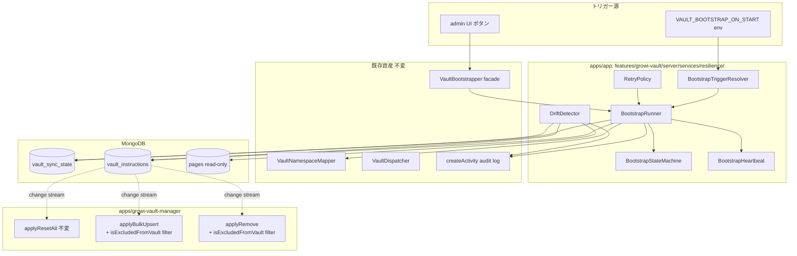
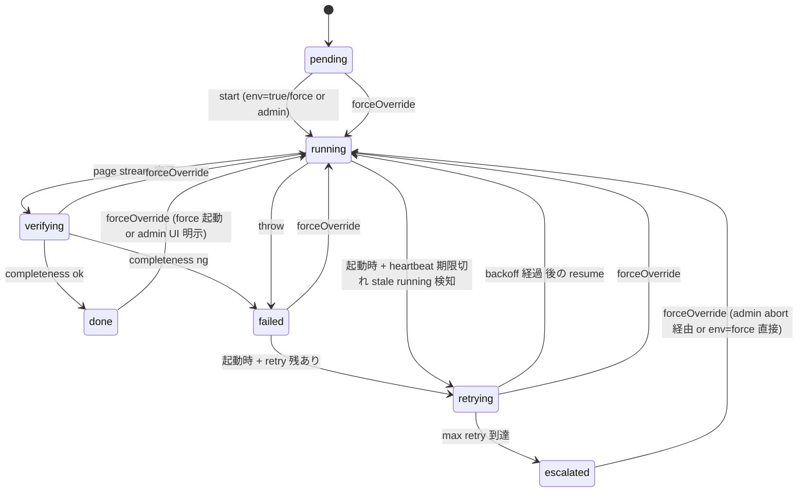
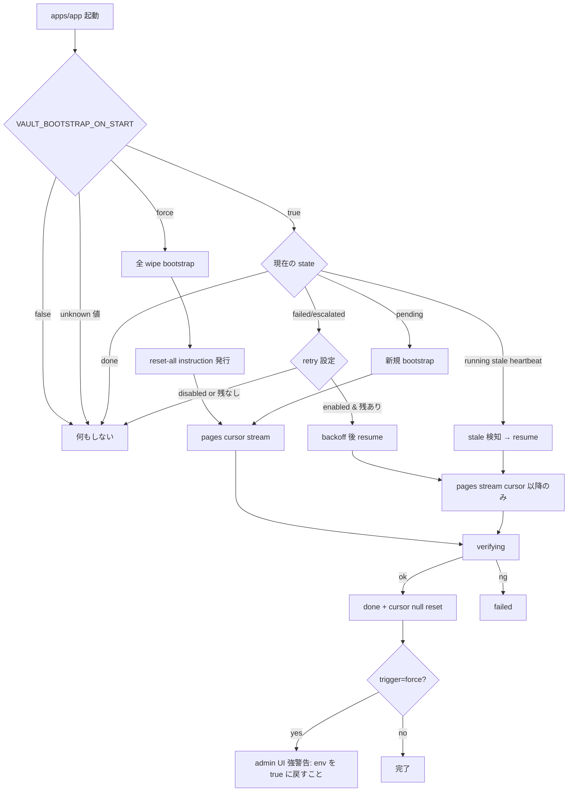
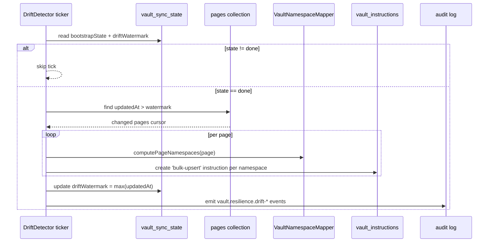

# 設計書: growi-vault-resilience

## 概要

`growi-vault-resilience` は GROWI Vault に **system-triggered correctness 保証** を導入する resilience レイヤである。既存 `VaultBootstrapper` の構造的欠陥（完了状態の信頼性欠如、resume 時の無条件 `reset-all`、握り潰される失敗、drift 未検出）を解消し、`VAULT_BOOTSTRAP_ON_START` をつけっぱなしの運用でも vault データを破壊しない安全性と、bootstrap 後の **軽量 drift 検出（observability 主、自動補修副）** を提供する。

実装本体は `apps/app/src/features/growi-vault/server/services/resilience/` 配下の新規モジュール群および `vault_sync_state` schema 拡張、admin UI 拡張、audit log 拡張で構成される。`apps/growi-vault-manager` 側は `applyResetAll` の挙動変更を **行わない**——op の意味を変えず、apps/app 側が emit するタイミングだけを変えるため `@growi/core` の DTO 型および vault-manager の冪等性契約は破壊されない。

**責務範囲の整理**: change stream 長時間取りこぼし耐性および hard delete 由来の drift 回収は、本 spec の責務に **含めない**。これらは将来 `growi-vault-ha` spec（vault-manager 冗長化、Competing Consumers パターン）が担う。本 spec の drift detection は「event-driven sync が想定通り動いていることの監視装置」として位置付け、検出された drift は既存 instruction 経路で軽量に補修するが、頻発する場合は根本原因（インフラ / コード bug）の調査トリガーとして observability に格上げされる。

`growi-vault-gateway`（Req 5）と `growi-vault-manager`（Req 2.6）は `/kiro-spec-cleanup` 済み reference として残置し、本 spec が置き換え設計を提示する。

### Goals

- Bootstrap 完了状態を「state machine 完了」かつ「structural な完全性が確認済み」を意味するものに昇格する
- `VAULT_BOOTSTRAP_ON_START` を 3 値（`true` / `false` / `force`）化し、暗黙 / 明示トリガーを分離する
- 中断や failed からの自動再試行（有界 exponential backoff + escalation）を提供する
- O(N) 全件 scan を伴わない watermark-based drift 検出 + 既存 instruction 経路を再利用した軽量補修を実装する（**observability 主、自動補修副**）
- 既存 admin UI に completion 信頼性指標 / 自動再試行状況 / drift 活動を surface する

### Non-Goals

- User-triggered な手動 targeted reconcile UI（PageTree / SubNavigation）→ `growi-vault-gateway` 拡張 spec の責務
- vault-manager の冗長化（HA）と change stream 長時間取りこぼし耐性 → 将来 `growi-vault-ha` spec の責務
- **hard delete (`pages` doc の物理削除) 由来の drift の自動回収** → 本 spec の責務外。event-driven sync の信頼性に委ね、構造的回収は将来 `growi-vault-ha` 適用後に「change stream 取りこぼしが起きない」前提で実用上解消する想定（要件 4.9）
- マルチレプリカ対応（writer 単一化、leader election） → `growi-vault-ha`
- Squash / GC 戦略の変更 → `growi-vault-manager` Req 6 のまま
- 既存 op（upsert / bulk-upsert / remove / rename-prefix / grant-change-prefix）の挙動変更
- 新規 admin UI 画面の独立構築（既存 `/admin/vault` を拡張する形のみ）
- PAT 認証 / ACL 評価ロジックの変更

---

## 境界コミットメント

### This Spec Owns

- `apps/app/src/features/growi-vault/server/services/resilience/` 配下の全モジュール
- `vault_sync_state` singleton の `bootstrap*` フィールド拡張（後述 §Data Models）
- `config-definition.ts:555-559` の `app:vaultBootstrapOnStart` 型変更（`boolean` → `'true' | 'false' | 'force'`）
- 既存 `vault-bootstrapper.ts` の内部実装（公開 interface `VaultBootstrapper` および factory `createVaultBootstrapper` は維持）
- `apps/app/src/features/growi-vault/server/routes/vault-admin.ts` の新規 endpoint 追加（retry abort 等）
- `apps/app/src/features/growi-vault/client/admin/VaultAdminSettings.tsx` の section 拡張
- `apps/app/src/interfaces/activity.ts` への `ACTION_VAULT_RESILIENCE_*` 追加
- `VAULT_BOOTSTRAP_RETRY_*` / `VAULT_DRIFT_*` 等の新規 env var 定義
- vault.resilience.* audit log イベントの emission
- `apps/growi-vault-manager/src/services/vault-path-mapper.ts` への `isExcludedFromVault(pagePath)` helper の新設（純関数 export）、および既存 `_orphaned/` 振り分け（`isOrphan` 分岐 + `_orphaned/` prefix 付与、[vault-path-mapper.ts:122-124, 172-174](../../../apps/growi-vault-manager/src/services/vault-path-mapper.ts#L122-L174)）の **撤廃**——trash exclusion semantics（trash page を git に一切出さない）を成立させる責務
- `apps/growi-vault-manager/src/services/vault-namespace-builder.ts` の `applyBulkUpsert` / `applyRemove` 入口に `isExcludedFromVault()` filter を追加（trash entry を skip、空になった instruction は commit なしで ack）

### Out of Boundary

- `apps/growi-vault-manager` 側の op handler 実装のうち、`applyResetAll` / `applyRenamePrefix` / `applyGrantChangePrefix` の挙動は不変。**ただし `applyBulkUpsert` / `applyRemove` には `isExcludedFromVault()` filter を新たに入口処理として加え、`vault-path-mapper.ts` には `isExcludedFromVault()` helper を新設しつつ既存 `_orphaned/` 振り分けを撤廃する**（上記 §This Spec Owns）。これらは trash exclusion semantics を成立させるための本 spec 固有の責務。
- `@growi/core/interfaces/vault` の `VaultInstructionOp` 型（新規 op 追加なし）
- `VaultDispatcher` の event-driven incremental sync（前提として依存、不変）
- `VaultMaintenanceScheduler` の squash / gc トラック（不変、参考にするのみ）
- User-triggered な reconcile API / UI（gateway 拡張 spec へ）
- **vault-manager の HA / 冗長化、change stream 長時間取りこぼし耐性** → 将来 `growi-vault-ha` spec の責務
- **Hard delete (`Page.deleteCompletely`) 由来の drift 回収** → event-driven sync の信頼性に委ね、構造的耐性は将来 `growi-vault-ha` で実用上解消する
- マルチレプリカ writer 単一化の物理保証
- 既存の `pages` / `revisions` / `accesstokens` モデルのスキーマ

### Allowed Dependencies

- 既存 `VaultSyncState` Mongoose model（書き込みオーナーは本 spec、`bootstrap*` 系フィールド拡張可）
- 既存 `VaultInstruction` model（書き込みのみ、`reset-all` / `bulk-upsert` op を発行。drift detector は `remove` を発行しない——§Drift Detector v1 のスコープ縮退 参照）
- 既存 `Page` model（read-only、`updatedAt` を watermark として参照）
- 既存 `configManager.getConfig('app:vaultBootstrapOnStart')`
- 既存 `VaultNamespaceMapper`（read-only、ページ → namespace 判定）
- 既存 `createActivity` audit log API
- React + reactstrap（admin UI セクション拡張）

### Revalidation Triggers

- `vault_sync_state.bootstrap*` の field 追加 → vault-manager は read のみのため影響なし。ただし `BootstrapState` 型の `'pending' | 'running' | 'done' | 'failed'` enum 拡張は `vault-sync-state.ts:101` の schema enum 制約に反映する必要があり、既存 doc の migration を要する
- `VAULT_BOOTSTRAP_ON_START` の型変更（boolean → enum）→ consumer は `index.ts:396` の 1 箇所のみ
- drift 検出 watermark の追加 → 既存 spec に影響なし
- `VaultInstructionOp` 型の不変 → 下流の vault-manager / gateway への再検証は不要

---

## 設計前提: Trash の責務分離

本 spec は以下の **layering 原則** を絶対前提とする。design 内に登場する全モジュール（dispatcher / drift detector / namespace mapper）の挙動はこの原則から導出される。

### 原則

> **apps/app 層は trash 状態を判定しない。ページの change を grant 情報から導いた namespace に対してそのまま instruction として記録する。**
> **「trash 配下を git に置かない」exclusion は vault-manager 側の materialization 層（各 op handler 入口で `vault-path-mapper.isExcludedFromVault()` を呼んで entry を skip）が担う。**

具体的には:

| 層 | 責務 | trash の扱い |
|----|------|------------|
| apps/app (dispatcher / drift detector) | page change → namespace → instruction の emit | **trash filter なし**。`/trash/` 配下のページも grant に基づき namespace を計算し、`bulk-upsert` / `remove` を発行する |
| vault-manager (`applyBulkUpsert` / `applyRemove`) | instruction → git tree への materialize | 入口で `isExcludedFromVault(pagePath)` を呼び、`/trash/` 配下の entry を skip する。git tree には trash page が一切現れない |

この layering により、drift detector 設計は **trash 特殊処理を一切持たない**。「trashed page から remove instruction をどう作るか」「path strip 後に何の namespace を渡すか」といった分岐は **design に登場すべきでない**——登場すれば layering 違反のサイン。

### この前提の含意

1. **既存 `vault-namespace-mapper.ts` の trash filter は layering 違反**: [vault-namespace-mapper.ts:58-67](../../../apps/app/src/features/growi-vault/server/services/vault-namespace-mapper.ts#L58-L67) の `if (page.path?.startsWith('/trash')) return []` および `if (page.status !== STATUS_PUBLISHED) return []` は apps/app 層に materialization 責務が漏れているため、本 spec で **削除する**。
2. **既存 dispatcher の delete event 経路は不変**: pre-deletion state を受け取って `remove` を emit する flow は変わらない（変えるのは「trashed page の update / sweep が空集合に潰れない」点だけ）。
3. **Drift detector の trash 処理は一行で済む**: `mapper.computePageNamespaces(page)` を呼んで返ってきた namespace 群に `bulk-upsert` を emit するだけ。trash 配下のページは vault-manager 側 `applyBulkUpsert` 入口の `isExcludedFromVault()` filter で skip されるため、apps/app 側は無関心。
4. **`vault-namespace-mapper.ts` の trash filter 削除は design.md §Modified Files に列挙する**: 既存 dispatcher の挙動回帰がないことを test で担保する。

### vault-path-mapper の責務確定（trash exclusion helper 新設 + `_orphaned/` 撤廃）

trash page を git に一切出さない exclusion semantics を満たすため、本 spec は `apps/growi-vault-manager` に以下の変更を加える。

#### 1. 新規 helper `isExcludedFromVault(pagePath)` を export

`vault-path-mapper.ts` に純関数として追加し、各 op handler が一律に呼ぶ単一の判定点とする:

```typescript
export function isExcludedFromVault(pagePath: string): boolean {
  return pagePath === '/trash' || pagePath.startsWith('/trash/');
}
```

- **位置**: 既存 internal `isOrphan` 関数（[vault-path-mapper.ts:122-124](../../../apps/growi-vault-manager/src/services/vault-path-mapper.ts#L122-L124)）を `isExcludedFromVault` に rename して export 化する。
- **純関数性**: 副作用なし、入力のみで決定。content-addressing / path mapper の冪等性原則に整合。
- **将来拡張**: trash 以外の exclusion 条件（例: 特定 grant、特定 prefix）が必要になった場合もこの helper を拡張する単一の判定点とする。

#### 2. `vault-path-mapper.map()` から `_orphaned/` 振り分けを撤廃

[vault-path-mapper.ts:172-174](../../../apps/growi-vault-manager/src/services/vault-path-mapper.ts#L172-L174) の `if (isOrphan(pagePath)) return _orphaned/${relativePath};` 分岐を **削除**。`map()` は trash を判定しない純粋な path → encoded git path 変換関数に純化する。

- actual signature は `map(pagePath: string, pageId: string): string` のまま不変（`pageId` は case-collision suffix 用）。
- trash page も含めて `map()` は常に通常の encoded path を返す。trash exclusion は呼び側（op handler）が `isExcludedFromVault()` を見て entry 自体を skip することで実現する。

#### 3. `applyBulkUpsert` / `applyRemove` の入口で skip

`apps/growi-vault-manager/src/services/vault-namespace-builder.ts` の両 op handler の冒頭で entry を filter する:

```typescript
// 例: applyBulkUpsert 冒頭
const filtered = entries.filter((e) => !isExcludedFromVault(e.pagePath));
if (filtered.length === 0) {
  // trash entry のみの instruction → commit 発生なし、vault_namespace_state 更新なしで ack
  return;
}
// 以下既存処理に filtered を渡す
```

`applyRemove` も同様に filter を入れ、trash path を狙った `remove` は no-op として ack する（dispatcher が pre-deletion state で `remove('/foo')` を emit するケースは pagePath が `/foo` のため通常通り処理される——trash 移動 _後の_ `bulk-upsert('/trash/foo')` のみが skip 対象）。

#### 4. 帰結（trash 関連操作の semantics）

| 操作 | apps/app の出力 | vault-manager の挙動 | git tree への影響 |
|------|-----------------|----------------------|-------------------|
| trash 移動（`/foo` → `/trash/foo`、grant 不変）| `remove(group-A, '/foo')` ＋ `bulk-upsert(group-A, '/trash/foo')` | (1) 通常通り削除 ／ (2) `isExcludedFromVault` で skip | `group-A/foo.md` 削除、新規追加なし → trash page は git に現れない |
| restore（`/trash/foo` → `/foo`）| `bulk-upsert(group-A, '/foo')` | 通常通り追加 | `group-A/foo.md` 新規 add（旧 stale は最初から存在しないため発生しない）|
| trash 配下の編集 | `bulk-upsert(group-A, '/trash/foo')` | `isExcludedFromVault` で skip | 影響なし |

これにより、git tree には trash page が一切出現せず、layering 原則（apps/app trash-agnostic / vault-manager が exclusion 判定）が exclusion semantics として両端で成立する。

### Drift Detector v1 のスコープ縮退（per-page state tracking が無いことの構造的帰結）

`vault_namespace_state` collection は `{ namespace, commitOid, version, updatedAt }` のみで **per-page 情報を持たない**（[vault-namespace-state.ts:15-26](../../../apps/growi-vault-manager/src/models/vault-namespace-state.ts#L15-L26)）。`applyBulkUpsert` は新 path に書き込むだけで、同一 `pageId` の旧 path の掃除は行わない（[vault-namespace-builder.ts:487-499](../../../apps/growi-vault-manager/src/services/vault-namespace-builder.ts#L487-L499)）。

この 2 制約により、drift detector は「旧 namespace」「旧 path」を知る手段を持たない。よって v1 のスコープを以下に縮退する:

| Drift 種別 | v1 検出可否 | 理由 |
|----------|--------|------|
| **`pages.updatedAt` shift（編集 / restore / 等）の取りこぼし → 新 path への upsert** | ✅ 対応 | watermark sweep + `bulk-upsert(currentNamespaces, currentPath)` で吸収 |
| **Path change drift（trash 移動 / rename の event 取りこぼし → 旧 path の stale file）** | ❌ 不可（v1 out-of-scope） | drift detector は旧 path を知る state が無い。trash 移動時の `remove('/foo')` event drop、または `/foo → /bar` rename の `remove('/foo')` event drop が起きると `<namespace>/foo.md` が stale として残る。**restore は exclusion semantics により旧 stale が存在しないため、drift sweep の `bulk-upsert('/foo')` で完全 recover される** |
| **Grant drop drift（acl-change event 取りこぼし → 旧 namespace の stale entry）** | ❌ 不可（v1 out-of-scope） | 旧 namespace を知る state が無い |
| **Hard delete drift（`pages` doc 物理削除 → vault に残る）** | ❌ 不可（既存通り out-of-scope） | `pages` から消えるので watermark cursor に乗らない |

**Out-of-scope drift の処理経路**:
- 構造的回収は将来 `growi-vault-ha`（event-driven sync の取りこぼし耐性）で実用上解消する想定。
- 個別ケースは `growi-vault-gateway` 拡張 spec の **user-triggered targeted reconcile**（PageTree / SubNavigation / admin UI からの sub-tree 単位の補修）で吸収する。
- 全 wipe を伴う再構築は本 spec の `VAULT_BOOTSTRAP_ON_START=force` または admin UI 明示トリガーで実行する（要件 1.6）。

**重要**: 本縮退は「trash exclusion」が vault-manager 側で正しく機能することを前提とする。trash filter 撤廃により `update` event 経路で trashed page が drift detector / dispatcher を通った場合、その出力は vault-manager 側 `applyBulkUpsert` 入口の `isExcludedFromVault()` filter により skip され、git tree には現れない。drift detector が掃除できないのは「path 遷移（trash 移動 / rename）の前段で発生した `remove` event drop による旧 path stale」のみ。

### Out of Boundary（再確認）

- Path change drift（trash 移動 / rename の `remove` event 取りこぼし時の旧 path stale）/ grant drop drift / hard delete drift の構造的回収は本 spec の責務外（上記 §Drift Detector v1 のスコープ縮退 参照）。

### Implementation Tasks Hint（最小分解）

tasks phase で以下を独立タスクとして発行する想定:

1. **vault-namespace-mapper.ts の trash filter / status filter 撤廃（apps/app 側）**
   - [vault-namespace-mapper.ts:58-67](../../../apps/app/src/features/growi-vault/server/services/vault-namespace-mapper.ts#L58-L67) の 2 ガードを削除し、grant 情報のみから namespace を導く純関数にする。
   - test: `vault-namespace-mapper.spec.ts` に trashed path / non-published でも namespace が返ることを assert する 2 ケースを追加。

2. **vault-path-mapper.ts への `isExcludedFromVault()` helper 新設 + `_orphaned/` 撤廃（vault-manager 側）**
   - 既存 internal `isOrphan` 関数（[vault-path-mapper.ts:122-124](../../../apps/growi-vault-manager/src/services/vault-path-mapper.ts#L122-L124)）を `isExcludedFromVault` に rename して export 化。
   - `map()` 内の `if (isOrphan(pagePath)) return _orphaned/...;` 分岐（[vault-path-mapper.ts:172-174](../../../apps/growi-vault-manager/src/services/vault-path-mapper.ts#L172-L174)）を削除。
   - test: `vault-path-mapper.spec.ts` の既存 `_orphaned/` 振り分けケースを削除し、以下に置換:
     - `isExcludedFromVault('/trash/foo') === true`、`isExcludedFromVault('/trash') === true`、`isExcludedFromVault('/foo') === false`
     - `map('/trash/foo', pageId)` が `_orphaned/` prefix なしの encoded path を返すこと（trash 判定は呼び側責務であることの担保）

3. **`applyBulkUpsert` / `applyRemove` への `isExcludedFromVault()` filter 追加（vault-manager 側）**
   - `vault-namespace-builder.ts` の両 op handler 入口で `entries.filter((e) => !isExcludedFromVault(e.pagePath))` を実行。
   - 空 entry になった instruction は commit 発生なし / `vault_namespace_state` 更新なしで ack する（既存の ack 機構と整合）。
   - test: `vault-namespace-builder.spec.ts` に以下を追加:
     - trash entry のみの `bulk-upsert` → no-op で ack、`commitAndUpdateRef` が呼ばれないこと
     - trash + 通常 entry 混在の `bulk-upsert` → 通常 entry のみ commit に含まれること
     - trash path を狙った `remove` → no-op で ack

4. **既存 dispatcher の delete event 回帰確認**
   - `vault-dispatcher.spec.ts` を再実行し、`delete` event（pre-deletion state を渡す）経路で `remove` instruction が grant 由来 namespace に対して発行される flow が変わらないことを確認。
   - pre-deletion pagePath は `/foo`（trash 移動 _前_）なので `isExcludedFromVault` は false → 通常通り削除される。

タスク 1・2・3 は同時着手可能、4 は 1+2+3 完了後の verification。

---

## アーキテクチャ

### Existing Architecture Analysis

| 既存資産 | 役割 | 本 spec での扱い |
|----------|------|------------------|
| `VaultBootstrapper` (`vault-bootstrapper.ts`, 329 行) | bootstrap 主導、state 遷移、cursor resume、failure 記録 | **内部を resilience/ 配下に分解、公開 interface 維持** |
| `vault_sync_state` singleton | bootstrap state + resume cursor + vault-manager 側 watcher 状態 | **schema 拡張**（後述 §Data Models） |
| `vault_instructions` outbox | apps/app → vault-manager の命令キュー | 書き込み元として再利用（新規 op 追加なし） |
| `VaultMaintenanceScheduler`（vault-manager 側） | 5 分 tick で squash / gc を駆動 | パターン参考のみ、本 spec の drift 検出は apps/app 側で別実装 |
| `VaultDispatcher` | PageService event → instruction outbox 書き込み | **不変**、drift 補修は dispatcher を bypass して直接書き込み |
| `VaultAdminSettings.tsx` | 既存 5 セクションの admin UI | **3 セクション追加** |

### Architecture Pattern & Boundary Map

採用パターン: **state-machine + scheduled-verifier**。Bootstrap 系は明示的な state machine（7 状態 + 純関数遷移）で表現し、drift 検出は周期 scheduler としてバックグラウンドで動作する。両者は `vault_sync_state` を通じて疎結合に観測情報を共有する。



**Architecture Integration**:
- Selected pattern: **状態機械 (Bootstrap) + 周期検証器 (Drift)**。明示的遷移と純関数による副作用分離で testability を確保。
- Domain/feature boundaries: 既存 `VaultBootstrapper` の public interface（`start()` / `getStatus()`）は維持し、内部を `resilience/` サブモジュールに分解。`VaultDispatcher` / `applyResetAll` は触らない。
- Existing patterns preserved: factory + DI（`createXxx`）、`createActivity?.({...})` audit pattern、`configManager.getConfig(...)` 設定読み出し、`vault_sync_state` singleton 書き込みパターン。
- New components rationale: 1 ファイル肥大化（329 → 600+ 行予想）を避け、coding-style.md の「単一責任 + 200-400 行/ファイル」に整合。drift 検出は green-field のため独立サービス化が自然。
- Steering compliance: feature-based 構成（`features/growi-vault/`）に閉じる、@growi/core への変更なし、Biome 配下の新規ファイルのみ、changeset 不要（apps/app 内部）。

### Technology Stack

| Layer | Choice / Version | Role in Feature | Notes |
|-------|------------------|-----------------|-------|
| Backend / Services | Node.js 22.x（既存）/ TypeScript | resilience サブモジュール + scheduler | 新規依存なし |
| Data / Storage | MongoDB（既存 mongoose 6.13.x） | `vault_sync_state` schema 拡張、`vault_instructions` 書き込み | 新規 collection なし |
| Frontend | React 18 + reactstrap（既存） | `VaultAdminSettings.tsx` セクション拡張 | 新規依存なし |
| Config | `configManager`（既存） | `app:vaultBootstrapOnStart` 型変更 + 新規 retry/drift 系 env | `defineConfig` パターン踏襲 |
| Messaging | `vault_instructions` outbox（既存） | drift 補修 instruction の発行先 | 既存 op のみ使用 |

新規外部依存ゼロ。全て既存パターンの拡張で実装可能。

---

## File Structure Plan

### Directory Structure

```
apps/app/src/features/growi-vault/server/services/resilience/
├── index.ts                          # 公開 API: createVaultResilienceLayer + 型
├── bootstrap-state-machine.ts        # 純関数の状態遷移（BootstrapState union + transition）
├── bootstrap-trigger-resolver.ts     # env 値 → BootstrapAction の decode
├── bootstrap-heartbeat.ts            # 起動 instance ID + heartbeat 書き込み / 異常検知
├── retry-policy.ts                   # exponential backoff 計算（純関数）
├── bootstrap-runner.ts               # Orchestrator: state machine + heartbeat + retry を駆動
├── drift-detector.ts                 # watermark-based sweep + 補修 instruction 発行
└── __tests__/                        # *.spec.ts 群（テスト共置）
    ├── bootstrap-state-machine.spec.ts
    ├── bootstrap-trigger-resolver.spec.ts
    ├── retry-policy.spec.ts
    ├── bootstrap-runner.spec.ts
    ├── drift-detector.spec.ts
    └── resilience-flow.integ.ts      # MongoDB を含む end-to-end
```

> 各サブモジュールは 1 つの責務のみを持つ。`bootstrap-runner.ts` は唯一の I/O orchestrator として state-machine / trigger-resolver / heartbeat / retry-policy を組み立てる。`drift-detector.ts` は独立した scheduler として動作。

### Modified Files

- [apps/app/src/features/growi-vault/server/services/vault-bootstrapper.ts](../../../apps/app/src/features/growi-vault/server/services/vault-bootstrapper.ts) — 公開 interface `VaultBootstrapper` と factory `createVaultBootstrapper` を維持し、内部実装を `resilience/createVaultResilienceLayer` への delegation に置き換える。既存 consumer（admin route、`index.ts:401`）は変更不要。
- [apps/app/src/features/growi-vault/server/services/vault-namespace-mapper.ts](../../../apps/app/src/features/growi-vault/server/services/vault-namespace-mapper.ts) — **layering 違反の trash filter / status filter を削除**（§設計前提: Trash の責務分離 参照）。`derivePageNamespaces` の冒頭にある `if (page.path?.startsWith('/trash')) return [];` および `if (page.status !== STATUS_PUBLISHED) return [];` の 2 ガードを撤廃し、grant 情報のみから namespace を導く純関数にする。これにより drift detector / dispatcher / 将来 consumer が同じ mapper を例外なく使える。既存 dispatcher の delete event 経路は pre-deletion state を受け取るため挙動回帰なし——回帰テストは `vault-dispatcher.spec.ts` で確認する。
- [apps/app/src/features/growi-vault/server/models/vault-sync-state.ts](../../../apps/app/src/features/growi-vault/server/models/vault-sync-state.ts) — `BootstrapState` enum に 3 値追加、新規フィールド 6 件追加（後述 §Data Models）
- [apps/app/src/server/service/config-manager/config-definition.ts](../../../apps/app/src/server/service/config-manager/config-definition.ts) — `app:vaultBootstrapOnStart` を boolean から `'true' | 'false' | 'force'` の string enum に変更、新規 retry/drift 系 config 追加
- [apps/app/src/features/growi-vault/server/index.ts](../../../apps/app/src/features/growi-vault/server/index.ts) — bootstrap 起動分岐（L396-404）を `BootstrapTriggerResolver` 経由に置き換え、resilience layer 初期化追加
- [apps/app/src/features/growi-vault/server/routes/vault-admin.ts](../../../apps/app/src/features/growi-vault/server/routes/vault-admin.ts) — 新規 endpoint: `POST /vault/retry/abort`、`GET /vault/resilience-status`
- [apps/app/src/features/growi-vault/client/admin/VaultAdminSettings.tsx](../../../apps/app/src/features/growi-vault/client/admin/VaultAdminSettings.tsx) — 3 セクション追加（completion 信頼性 / retry 状態 / drift 活動）、force 警告 banner
- [apps/app/src/interfaces/activity.ts](../../../apps/app/src/interfaces/activity.ts) — `ACTION_VAULT_RESILIENCE_*` 定数追加（具体名は §Audit Events）
- [apps/growi-vault-manager/src/services/vault-path-mapper.ts](../../../apps/growi-vault-manager/src/services/vault-path-mapper.ts) — internal `isOrphan` を `isExcludedFromVault` に rename して **export 化**、`map()` 内の `_orphaned/` prefix 分岐（line 172-174）を **削除**（§設計前提: Trash の責務分離 参照）
- [apps/growi-vault-manager/src/services/vault-namespace-builder.ts](../../../apps/growi-vault-manager/src/services/vault-namespace-builder.ts) — `applyBulkUpsert` / `applyRemove` の入口に `isExcludedFromVault(pagePath)` filter を追加し、trash entry を skip。空 entry になった instruction は commit せず ack（§設計前提: Trash の責務分離 参照）

---

## System Flows

### Bootstrap 状態遷移



**Key Decisions**:
- `verifying` を独立状態とすることで「page stream 完了 ≠ done」を構造的に担保する（要件 1.1）。
- **Structural completeness check の定義**: `verifying → done` の判定は **structural な不変条件の充足** で行う。具体的には以下 3 条件の AND を取る:
  1. Bootstrap stream の cursor が stream 開始時点で記録した `streamSnapshotMaxId`（= 開始時点の `Page.find({status:'published'}).sort({_id:-1}).limit(1)` の `_id`）に到達している
  2. 全 per-namespace buffer の flush が完了し、`namespaceBuffers` が空である
  3. 最後の bulk-upsert instruction の `_id` が `vault_instructions` に commit 済みである（`VaultInstruction.create` の戻り値で確認）
- **件数比較 (`processed` vs `bootstrapTotalEstimated`) は判定条件から外す** — `estimatedDocumentCount()` は collection 全体の概算値であり、filter 後の `processed` と原理的に一致しないため。両者は admin UI の **観測指標** として保持するが、`failed` 判定からは独立。
- 並行 page 増減への耐性: `streamSnapshotMaxId` を「stream 開始時点のスナップショット」として固定することで、stream 中に追加された新規ページは次回 incremental sync（`VaultDispatcher`）が拾う責務とし、bootstrap の完了判定とは分離する。これにより bootstrap 中の page 増減を吸収する。
- `retrying` を `running` と区別することで、admin UI が「自動再試行中」と「正常実行中」を見分けられる（要件 3.5）。
- `escalated` を `failed` の進化として独立させ、自動再試行ループを抜けた事実を不可逆に記録する（要件 3.2）。
- `done` → `running` 遷移は **force 起動** または **admin UI 明示トリガー** の場合のみ（要件 1.3 / 1.6）。

### Force 起動と暗黙トリガーの分岐



**Key Decisions**:
- `reset-all` instruction は **force / 新規 bootstrap でのみ発行**。resume / retry では発行しない（要件 2.1）。
- 不明値（型外）は `false` 同等にフォールバック（要件 1.13）。
- `force` 完了時の警告は admin UI で持続表示。env を `true` に戻すまで banner が残る（要件 1.8 / 5.6）。
- **Schema migration step は env 解決の前に必ず実行**（§Data Models §Migration 参照）。migration 直後に `bootstrapState === 'running' && bootstrapInstanceId == null` の doc を検出した場合は `failed` に正規化してから env トリガーフローに入る → 上記 diagram の `CheckState -->|failed/escalated|` 経路に合流する（要件 3.3 と整合）。

### Drift Detector の周期処理



**Key Decisions**:
- Watermark は **`pages.updatedAt` の最大値**を `vault_sync_state.driftLastWatermark` に保存。次回 tick は `updatedAt > watermark` で sweep。
- **trash 特殊処理なし** — §設計前提: Trash の責務分離 の原則に従い、apps/app 層は trash 状態を判定しない。drift detector は cursor に乗った全ページについて `computePageNamespaces(page)` を呼び、返ってきた namespace 群に `bulk-upsert` instruction を emit するだけ。trashed page も grant に基づく namespace に `bulk-upsert` を出し、vault-manager 側 `applyBulkUpsert` 入口の `isExcludedFromVault()` filter で skip される（git tree に現れない）。これは既存 dispatcher と同じ pattern。
- **Hard delete (`pages` doc 物理削除) は本 sweep の対象外** — `pages` collection 自体から消えるため `updatedAt > watermark` cursor では構造的に検出不能。これは event-driven sync の信頼性に委ね、将来 `growi-vault-ha` で change stream 取りこぼし耐性を獲得することで実用上解消する想定（要件 4.9 / §Out of Boundary）。
- 検出範囲は「event-driven sync が拾い損ねた create / update / trash 移動 / restore」を `bulk-upsert` として再送する形。trash 移動と restore は path / status の変化が `updatedAt` を bump させることで cursor に乗る。冪等性により重複しても害なし。
- `bootstrapState !== 'done'` の間は完全 skip（要件 4.8）。

---

## Requirements Traceability

| Requirement | Summary | Components | Interfaces | Flows |
|-------------|---------|------------|------------|-------|
| 1.1 | completeness check 実行 | BootstrapRunner, BootstrapStateMachine | `transitionTo('verifying' → 'done' / 'failed')` | Bootstrap 状態遷移 |
| 1.2 | done 遷移時 cursor null reset | BootstrapRunner | state machine 遷移時の副作用 | 同上 |
| 1.3 | `true` + done → no-op | BootstrapTriggerResolver | `resolveAction(env, state)` | Force/暗黙 分岐 |
| 1.4 | `true` + pending/failed/stale → 自動開始 | BootstrapTriggerResolver, BootstrapRunner, RetryPolicy | 同上 | 同上 |
| 1.5 | `false` → 自動開始しない | BootstrapTriggerResolver | 同上 | 同上 |
| 1.6 | `force` → 全 wipe 新規 bootstrap | BootstrapTriggerResolver, BootstrapRunner | 同上 | 同上 |
| 1.7 | force 起動時の log 記録 | BootstrapRunner | `createActivity` 呼び出し | 同上 |
| 1.8 | force 完了時の強警告 | BootstrapRunner, VaultAdminSettings | force 完了 → `lastTriggerSource` 永続化 | 同上 |
| 1.9 | 二重起動防止（running 中）| BootstrapStateMachine, BootstrapHeartbeat | `start()` 時の state 判定 | 同上 |
| 1.10 | admin UI からの再 bootstrap 確認手順 | VaultAdminSettings | reactstrap Modal による confirm | (UI flow) |
| 1.11 | state model 過渡状態を表現 | BootstrapStateMachine | `BootstrapState` 7 値 union | Bootstrap 状態遷移 |
| 1.12 | `getStatus()` 観測可能 | BootstrapRunner | `BootstrapStatus` 拡張 | (read API) |
| 1.13 | 不明値フォールバック | BootstrapTriggerResolver | `resolveAction` の default 分岐 | Force/暗黙 分岐 |
| 2.1 | resume では reset-all 発行しない | BootstrapRunner | `runBootstrap({ resumeCursor })` 分岐 | Force/暗黙 分岐 |
| 2.2 | 初回 / force で全 wipe + bulk-upsert | BootstrapRunner | 同上 | 同上 |
| 2.3 | 全 wipe instruction → `applyResetAll` | `vault_instructions` outbox | 既存 reset-all op | (instruction flow) |
| 2.4 | resume で既存 ref 保持 | BootstrapRunner | reset-all を emit しないことで自動成立 | Force/暗黙 分岐 |
| 2.5 | op 名 / payload 不変 | (設計判断: 既存 reset-all を再利用) | `VaultInstructionOp` 不変 | — |
| 2.6 | 責務境界（apps/app 判定、manager 素朴）| BootstrapRunner / `applyResetAll` (不変) | — | — |
| 3.1 | failed → exponential backoff 自動再試行 | BootstrapRunner, RetryPolicy | `nextBackoffMs(attempt)` | Force/暗黙 分岐 |
| 3.2 | max 到達 → escalated | BootstrapStateMachine, BootstrapRunner | state 遷移 `retrying → escalated` | Bootstrap 状態遷移 |
| 3.3 | running stale → resume | BootstrapHeartbeat, BootstrapRunner | heartbeat 期限切れ検知 | Force/暗黙 分岐 |
| 3.4 | done → 再試行しない | BootstrapTriggerResolver | resolve 結果 = skip | Force/暗黙 分岐 |
| 3.5 | retrying 状態 + getStatus に retry 情報 | BootstrapStateMachine, BootstrapRunner | `BootstrapStatus.retry` フィールド | — |
| 3.6 | 再試行抑止（env + admin abort）| BootstrapRunner, vault-admin route | `POST /vault/retry/abort` | — |
| 3.7 | retry 失敗 audit log + backoff 待機 | BootstrapRunner | `vault.resilience.retry-*` | — |
| 4.1 | done 中の `pages.updatedAt` watermark sweep（軽量、trash 移動 / restore による update を `currentNamespaces` への upsert として吸収。grant drop / path change の stale 掃除は v1 out-of-scope——§Drift Detector v1 のスコープ縮退 参照） | DriftDetector | scheduler tick | Drift 周期 |
| 4.2 | 既存 `bulk-upsert` op の再利用（trash 特殊処理なし、§設計前提: Trash の責務分離 参照。`remove` は v1 では発行しない） | DriftDetector | 既存 op を直接 `VaultInstruction.create` | 同上 |
| 4.3 | 冪等性 / at-least-once 維持 | DriftDetector | 既存 op を使うことで自動成立 | — |
| 4.4 | 周期 / 範囲を env で設定可能 | config-definition | `VAULT_DRIFT_*` | — |
| 4.5 | drift 活動を admin UI surface（**observability 主目的**） | VaultAdminSettings | resilience-status endpoint | — |
| 4.6 | event-driven sync との重複は冪等性で吸収 | (vault-manager 冪等性) | — | — |
| 4.7 | drift 失敗 WARN log + 次回再試行 | DriftDetector | try/catch + next tick | Drift 周期 |
| 4.8 | done 以外では drift 検出しない | DriftDetector | tick 内 early return | 同上 |
| 4.9 | hard delete drift は本 spec の責務外（`growi-vault-ha` で実用上解消） | (out of scope, §Non-Goals / §Out of Boundary に明記) | — | — |
| 5.1 | completion 信頼性指標表示 | VaultAdminSettings | 拡張済 status API | — |
| 5.2 | 自動再試行状態表示 | VaultAdminSettings | 同上 | — |
| 5.3 | drift 活動状態表示 | VaultAdminSettings | 同上 | — |
| 5.4 | トリガー源表示 | BootstrapRunner, VaultAdminSettings | `lastTriggerSource` 永続化 | — |
| 5.5 | escalation 視覚的強調 | VaultAdminSettings | reactstrap Alert | — |
| 5.6 | force 完了 + env=force の強警告 | VaultAdminSettings | banner condition | Force/暗黙 分岐 |
| 5.7 | `vault.resilience.*` audit log | BootstrapRunner, DriftDetector | `createActivity` + `ACTION_VAULT_RESILIENCE_*` (in interfaces/activity.ts) | — |
| 5.8 | 新規 admin UI 画面を作らない | VaultAdminSettings | 既存ファイル拡張のみ | — |
| 6.1-6.6 | 既存契約維持 | (アーキテクチャ全体決定) | 新規 op / dispatcher 変更なし | — |

---

## Components and Interfaces

### サマリ

| Component | Domain/Layer | Intent | Req Coverage | Key Dependencies (P0/P1) | Contracts |
|-----------|--------------|--------|--------------|--------------------------|-----------|
| BootstrapStateMachine | Pure logic | 7 状態 + 純関数遷移を提供 | 1.6, 1.9, 1.11, 3.2 | (なし) | Service, State |
| BootstrapTriggerResolver | Pure logic | env + 現状から起動アクションを決定 | 1.3-1.6, 1.13, 3.4 | configManager (P0) | Service |
| BootstrapHeartbeat | Persistence I/O | instance ID + heartbeat の書き込み / 異常検知 | 1.9, 3.3 | VaultSyncState (P0) | Service, State |
| RetryPolicy | Pure logic | exponential backoff 計算 | 3.1, 3.2, 3.5 | (なし) | Service |
| BootstrapRunner | Orchestrator | state-machine + heartbeat + retry の I/O 駆動 | 1.1-1.13, 2.1-2.6, 3.1, 3.5-3.7 | VaultSyncState (P0), VaultInstruction (P0), Page (P0), VaultNamespaceMapper (P0), createActivity (P1) | Service, Event |
| DriftDetector | Scheduler | watermark sweep + 補修 instruction 発行 | 4.1-4.8 | VaultSyncState (P0), VaultInstruction (P0), Page (P0), VaultNamespaceMapper (P0), createActivity (P1) | Batch, Event |
| VaultBootstrapper (facade) | Adapter | 既存公開 interface 維持 | (全体) | resilience layer (P0) | Service |
| VaultAdminSettings (拡張) | UI | resilience 状態の surface + 操作 UI | 5.1-5.8 | resilience-status endpoint (P0) | State |
| vault-admin route (拡張) | API | resilience-status / retry-abort の HTTP 表面 | 3.6, 5.1-5.7 | VaultBootstrapper facade (P0) | API |

### Logic Layer

#### BootstrapStateMachine

| Field | Detail |
|-------|--------|
| Intent | 7 状態の純関数的遷移と不変条件を提供 |
| Requirements | 1.6, 1.9, 1.11, 3.2 |

**Responsibilities & Constraints**
- 状態は discriminated union（純データ）。永続化 I/O は持たない。
- 全遷移を `transition(current, event)` に集約し、不正遷移を `Result.error` で返す。

**Dependencies**
- なし（pure）

**Contracts**: Service [x] / State [x]

##### Service Interface
```typescript
export type BootstrapState =
  | 'pending'    // 初回起動前
  | 'running'    // page stream 中
  | 'verifying'  // completeness check 中
  | 'done'       // 検証済み完了
  | 'failed'     // 直近の試行が失敗
  | 'retrying'   // 自動再試行待機 / 実行中
  | 'escalated'; // max retry 到達

export type BootstrapEvent =
  | { type: 'start'; triggerSource: TriggerSource }  // env=true / env=force / admin-ui
  | { type: 'streamCompleted' }
  | { type: 'verifyPassed' }
  | { type: 'verifyFailed'; reason: string }
  | { type: 'throw'; reason: string }
  | { type: 'staleRunningDetected' }                 // heartbeat 期限切れ
  | { type: 'retryScheduled'; attemptNo: number }
  | { type: 'retryExhausted' }
  | { type: 'forceOverride' };                       // done からの force / admin-ui 明示

export type TransitionResult =
  | { ok: true; next: BootstrapState; sideEffects: readonly SideEffect[] }
  | { ok: false; reason: string };

export const transition: (
  current: BootstrapState,
  event: BootstrapEvent,
) => TransitionResult;
```
- Preconditions: `current` は永続化されている state。`event` は外部入力（runner が組み立てる）。
- Postconditions: `ok: true` → 次状態 + 副作用記述（log / instruction 発行など、副作用自体は runner が解釈）。`ok: false` → 不正遷移として呼び出し側で握りつぶさず audit log に warn を流す。
- Invariants:
  - `running → done` は必ず `verifying` を経由する。
  - `forceOverride` イベントは **任意の state から `running` への遷移を許可する**（`pending` / `running` / `verifying` / `done` / `failed` / `retrying` / `escalated` のいずれが current でも `running` に遷移し、副作用として reset-all instruction を runner が emit する）。これは「データ乖離 → 全 wipe で再構築したい」運用要求（要件 1.6）への逃げ道を全 state で保証するため。
  - `done` から `running` への遷移は `forceOverride` でのみ可（通常 `start` イベントでは不可）。

**Implementation Notes**
- Integration: `BootstrapRunner` から呼ばれる唯一の状態遷移エントリ。
- Validation: 全イベント × 全状態の組み合わせを `bootstrap-state-machine.spec.ts` で網羅。
- Risks: 状態追加時に全テーブルの見直しが必要 → 不正遷移は `ok: false` で fail-safe。

#### BootstrapTriggerResolver

| Field | Detail |
|-------|--------|
| Intent | 起動時の env + 現状 state から実行すべきアクションを決定 |
| Requirements | 1.3, 1.4, 1.5, 1.6, 1.13, 3.4 |

**Responsibilities & Constraints**
- 純関数：env value（string）と現在の `BootstrapState` を受け取り、`BootstrapAction` を返す。
- 副作用なし。runner が `BootstrapAction` を解釈して実行する。

**Contracts**: Service [x]

##### Service Interface
```typescript
export type BootstrapEnvValue = 'true' | 'false' | 'force' | 'unknown';

export type BootstrapAction =
  | { kind: 'skip' }                                          // env=false / unknown / done in env=true
  | { kind: 'startNew'; triggerSource: 'env-true' }           // pending in env=true
  | { kind: 'resumeFromCursor'; triggerSource: 'env-true' }   // failed/escalated/stale in env=true
  | { kind: 'forceWipe'; triggerSource: 'env-force' };        // env=force always

export const resolveAction: (
  envValue: BootstrapEnvValue,
  currentState: BootstrapState,
  retryAllowed: boolean,
  isStaleRunning: boolean,
) => BootstrapAction;
```
- Preconditions: env 値は `configManager` で normalize 済み（`true` / `false` / `force` / `unknown` のいずれか）。
- Postconditions: `kind: 'skip'` の場合 runner は何もしない。`kind: 'forceWipe'` の場合 runner は reset-all + 全 wipe を実行。
- Invariants: `env=force` は state に関わらず `forceWipe`。`env=false` または `unknown` は常に `skip`。

#### RetryPolicy

| Field | Detail |
|-------|--------|
| Intent | exponential backoff 計算（純関数） |
| Requirements | 3.1, 3.2, 3.5 |

**Contracts**: Service [x]

##### Service Interface
```typescript
export interface RetryConfig {
  readonly maxAttempts: number;          // env: VAULT_BOOTSTRAP_RETRY_MAX (default 5)
  readonly baseBackoffMs: number;        // env: VAULT_BOOTSTRAP_RETRY_BASE_MS (default 30_000)
  readonly maxBackoffMs: number;         // env: VAULT_BOOTSTRAP_RETRY_MAX_MS (default 30 * 60_000)
}

export interface RetryDecision {
  readonly shouldRetry: boolean;
  readonly attemptNo: number;
  readonly backoffMs: number;
}

export const decideRetry: (
  config: RetryConfig,
  previousAttempts: number,
) => RetryDecision;
```
- Postconditions: `shouldRetry: false` → escalated 遷移を runner が起こす。`backoffMs` は `min(maxBackoffMs, baseBackoffMs * 2 ** previousAttempts) + jitter` で算出。
- Invariants: `previousAttempts >= maxAttempts` の場合 `shouldRetry: false`。

### Persistence & Runtime Layer

#### BootstrapHeartbeat

| Field | Detail |
|-------|--------|
| Intent | 起動 instance ID + heartbeat 書き込みによる stale running 検知 |
| Requirements | 1.9, 3.3 |

**Responsibilities & Constraints**
- 起動時に `bootstrapInstanceId`（UUID）を生成し `vault_sync_state` に書き込む。
- `running` 中は `VAULT_BOOTSTRAP_HEARTBEAT_INTERVAL_MS`（default 10_000）ごとに `bootstrapHeartbeatAt` を更新。
- 起動時に既存 `bootstrapState === 'running'` を検出した場合、`bootstrapHeartbeatAt` が `VAULT_BOOTSTRAP_HEARTBEAT_STALE_MS`（default 60_000）以上古ければ stale running と判定。

**Dependencies**
- VaultSyncState (P0, Outbound)

**Contracts**: Service [x] / State [x]

##### Service Interface
```typescript
export interface BootstrapHeartbeat {
  acquireInstance(): Promise<{ instanceId: string }>;
  refresh(): Promise<void>;             // 周期呼び出し
  stop(): void;                          // interval clear
  detectStaleRunning(): Promise<boolean>;
}
```
- Invariants: 同一プロセス内では `instanceId` は永続。crash → 再起動で別 ID に更新されるため、stale 検知の信頼性を担保。

#### BootstrapRunner

| Field | Detail |
|-------|--------|
| Intent | state machine / heartbeat / retry / I/O を統合する唯一の orchestrator |
| Requirements | 1.1, 1.2, 1.7, 1.8, 1.10, 1.12, 2.1, 2.2, 2.4, 3.1, 3.5, 3.6, 3.7 |

**Responsibilities & Constraints**
- 単一責任: BootstrapStateMachine と BootstrapTriggerResolver と RetryPolicy の決定を実 I/O に変換する。
- 永続化: 状態遷移を `vault_sync_state` に反映。bulk-upsert / reset-all instruction を `vault_instructions` に書き込む。
- 観測: 全状態遷移を audit log（`vault.resilience.*`）に emit。

**Dependencies**
- BootstrapStateMachine (P0, Outbound), BootstrapTriggerResolver (P0, Outbound), BootstrapHeartbeat (P0, Outbound), RetryPolicy (P0, Outbound)
- VaultSyncState (P0, Outbound), VaultInstruction (P0, Outbound), Page model (P0, Outbound), VaultNamespaceMapper (P0, Outbound)
- createActivity (P1, External)

**Contracts**: Service [x] / Event [x]

##### Service Interface
```typescript
export interface VaultResilienceLayer {
  // 既存 VaultBootstrapper interface を内部で実装するための入口
  bootstrap(opts: { triggerSource: TriggerSource }): Promise<void>;

  // 起動時の自動ディスパッチ（trigger resolver → action 解釈 → 実行）
  initOnStartup(): Promise<void>;

  // 観測 API
  getStatus(): Promise<ResilienceStatus>;

  // 自動再試行の手動 abort（admin UI からの呼び出し用）
  //
  // Postconditions (vault_sync_state への副作用):
  //   - bootstrapRetryAttempts = 0
  //   - bootstrapRetryAborted = true
  //   - bootstrapRetryNextAt = null
  //   - bootstrapState === 'escalated' の場合のみ 'failed' に降格、それ以外は不変
  // 次回 start() で:
  //   - bootstrapRetryAborted は false に clear される
  //   - BootstrapTriggerResolver が `failed + retryAllowed=true` を見て
  //     resumeFromCursor 経路に入れる
  //
  // In-flight runner との関係（採用方針: 永続化スケジュール打ち切りのみ）:
  //   - 本メソッドは永続化された retry スケジュール（backoff 待機）の打ち切りのみを
  //     行い、既に `running` 状態で実行中の bootstrap Promise には影響しない。
  //   - 実行中の bootstrap は通常通り `verifying → done` または `failed` のいずれかに
  //     到達する。`bootstrapRetryAborted = true` は永続化されたまま残り、次の `start()`
  //     呼び出しまで保持される。
  //   - in-flight が `done` に到達した場合: state は `done`、retry 関連フィールドは
  //     既に 0 / null / true に書き換え済み → 次回起動の resolver は env=true + done で
  //     skip 経路に入る（正常完了として扱う）。
  //   - in-flight が `failed` に到達した場合: state は `failed`、`bootstrapRetryAborted=true`
  //     のため resolver は retry を起こさず skip。admin が env=true で再起動 or UI から
  //     再 trigger するまで停止する。
  //   - 想定: admin は abort を「次の自動 retry を抑止する」操作として理解し、現在
  //     実行中の処理が完了するか自然失敗するまでは待つ（強制 kill が必要な場合は
  //     プロセス再起動を選ぶ）。
  //
  // 設計意図: `escalated` から手動復帰した admin が「abort してから env で再起動 or
  // admin UI で trigger」する一連の operation を、state machine の forceOverride
  // を経由せずに resolver が自然に拾える経路に正規化する。in-flight に対しては
  // cancel signal を流さないことで、AbortController の伝搬コストを排し、page stream
  // / instruction emission の途中中断による half-written 状態を作らない。
  abortAutoRetry(): Promise<void>;

  // 寿命管理
  stop(): Promise<void>;
}

export interface ResilienceStatus {
  readonly bootstrap: BootstrapStatus;       // 既存 BootstrapStatus を拡張
  readonly retry: RetryStatus | null;
  readonly drift: DriftStatus | null;
  readonly lastTriggerSource: TriggerSource | null;
  readonly forceWarningActive: boolean;       // env=force + lastTriggerSource=env-force
}

export interface RetryStatus {
  readonly attemptNo: number;
  readonly nextAttemptAt: Date | null;
  readonly lastError: string | null;
  readonly aborted: boolean;
}

export interface DriftStatus {
  readonly lastSweepAt: Date | null;
  readonly lastWatermark: Date | null;
  readonly detectedSinceBoot: number;
  readonly repairsEmittedSinceBoot: number;
  readonly lastError: string | null;
}
```
- Preconditions: `initOnStartup()` は MongoDB 接続後・event handler 登録後に呼ぶ。
- Postconditions: `bootstrap()` は exit 時に必ず state が `done` / `failed` / `escalated` のいずれかに遷移。中断時は `running` のまま heartbeat 停止して終了し、次回起動が stale 検知で resume する。
- Invariants: `done` 遷移時に `bootstrapCursor = null`（要件 1.2）。`force` トリガー時のみ `reset-all` を emit（要件 2.1）。`verifying → done` 遷移は §Bootstrap 状態遷移の "Structural completeness check" で定義された 3 条件 AND を満たす場合のみ（要件 1.1）。`bootstrapTotalEstimated` / `processed` は admin UI の観測指標として保持するが、完了判定には用いない。

##### Event Contract (Audit log)
発行イベント:
- `vault.resilience.bootstrap-started` — trigger source 込み（env-true / env-force / admin-ui）
- `vault.resilience.bootstrap-completed`
- `vault.resilience.bootstrap-failed` — reason 込み
- `vault.resilience.completeness-check-failed`
- `vault.resilience.retry-scheduled` — attemptNo, backoffMs
- `vault.resilience.retry-failed`
- `vault.resilience.retry-escalated`
- `vault.resilience.retry-aborted`
- `vault.resilience.force-warning-active` — env=force のまま完了した起動で 1 回
- `vault.resilience.stale-running-detected`

**Implementation Notes**
- Integration: `VaultBootstrapper` facade の内部実装として組み込む。`createVaultBootstrapper(namespaceMapper)` の戻り値は変わらず `VaultBootstrapper`。
- Validation: `bootstrap-runner.spec.ts` で全 trigger × state の組み合わせをモック DB で検証。`resilience-flow.integ.ts` で MongoDB 込みの end-to-end。
- Risks: heartbeat 周期が短すぎると DB 書き込み負荷増、長すぎると stale 検知遅延 → デフォルト 10s / 60s で運用テスト。

#### DriftDetector

| Field | Detail |
|-------|--------|
| Intent | done 中の周期 watermark sweep + 補修 instruction 発行 |
| Requirements | 4.1-4.8, 5.3, 5.7 |

**Responsibilities & Constraints**
- 独立 setInterval（`VAULT_DRIFT_DETECTION_INTERVAL_MS`、default 300_000 ＝ 5 分）。
- 各 tick で `bootstrapState !== 'done'` なら早期 return。
- Sweep: `pages` から `{ updatedAt: { $gt: driftLastWatermark } }` を cursor で読む（**trash filter なし、status filter なし**——§設計前提: Trash の責務分離 に従い apps/app 層は trash 判定をしない）。
- **上限超過時の挙動（scope-out signal）**: cursor が `VAULT_DRIFT_MAX_PAGES_PER_TICK`（default 10_000）件に到達した場合、それ以上は **drift sweep のスコープを逸脱した状態** と判断し、自動回収を試みない。具体的には:
  - cursor を閉じ、`driftLastWatermark` は **更新しない**（次 tick で同じ範囲を再 scan しても上限超過のまま再到達する）
  - WARN ログを 1 行出力: `[vault-resilience] drift sweep exceeded VAULT_DRIFT_MAX_PAGES_PER_TICK (current=${limit}). Drift is out of sweep scope. Choose one: (1) raise VAULT_DRIFT_MAX_PAGES_PER_TICK and restart, or (2) run full bootstrap via VAULT_BOOTSTRAP_ON_START=force.`
  - audit log に `vault.resilience.drift-sweep-out-of-scope` イベントを emit（payload: `{ limit, sampledCount }`）
  - admin UI 側にも `driftLastError` 経由でメッセージを surface（同じ 2 択を表示）
  - **「途中まで処理」「次 tick に繰り越し」「instruction 発行打ち切り」のいずれも行わない**——観測装置としての drift sweep が能力上限に達したという事実を運用者に渡し、判断を委ねる
- 各ページについて: `VaultNamespaceMapper.computePageNamespaces(page)` を呼んで `currentNamespaces` を得て、各 namespace に対して `bulk-upsert` instruction を発行する（payload は dispatcher と同形式）。trashed page も含めて同じ処理で済む——trash exclusion は vault-manager 側 `applyBulkUpsert` 入口の `isExcludedFromVault()` filter が担う（git tree に出ない）。
- **`remove` 発行はしない（v1 制約）**: drift detector は「旧 namespace」「旧 path」を知る state を持たないため、grant drop / path change の stale 掃除は v1 スコープ外。詳細は §Drift Detector v1 のスコープ縮退 を参照。
- **Hard delete は対象外** — `pages` collection 自体から消えたページは cursor に出現しない（要件 4.9 / §Out of Boundary 参照）。
- Sweep が上限到達せずに完走した場合のみ watermark を `max(updatedAt)` で更新。失敗時は WARN ログ + audit log emit、watermark は更新しない。

> **設計の不変条件**: drift detector の責務は「changed page について `currentNamespaces` に `bulk-upsert` を emit する」のみ。`/trash` 分岐 / status 分岐 / path strip / `remove` 発行は **すべて存在しない**——前 3 者は trash 責務分離の layering により vault-manager 側に閉じ、`remove` は per-page state tracking 不在により v1 では原理的に成立しない。

> **設計判断: 上限超過 = 自動回収しない**: drift sweep は「軽い drift の observability + 軽量補修」を担う装置であり、「長期間 sync が止まっていた」「大量 import が走った」等の構造的事象による大量 drift は本装置のスコープ外。範囲超過時は admin に判断を委ねるほうが安全（無理に途中まで補修すると watermark の前進可否で永久欠落 or 永久 redo のいずれかが発生する）。運用者は WARN ログ提示の 2 択（上限引き上げ / full bootstrap）から選ぶ。

**Dependencies**
- VaultSyncState (P0, Outbound), VaultInstruction (P0, Outbound), Page model (P0, Outbound, read-only), VaultNamespaceMapper (P0, Outbound)
- createActivity (P1, External)

**Contracts**: Batch [x] / Event [x]

##### Batch / Job Contract
- Trigger: `setInterval(tick, intervalMs)` を `initOnStartup` 内で開始。
- Input / validation: `bootstrapState === 'done'` + `driftLastWatermark` を読む（初回は `bootstrapCompletedAt` を watermark の初期値とする）。
- Output / destination: `vault_instructions` に `bulk-upsert` を発行（既存 dispatcher を bypass、直接 `VaultInstruction.create`）。`remove` は v1 では発行しない（§Drift Detector v1 のスコープ縮退 参照）。
- Idempotency & recovery: vault-manager 側の冪等性により重複は無害。tick 失敗時は watermark を進めず次回 tick で同範囲を再 sweep。

##### Event Contract (Audit log)
- `vault.resilience.drift-sweep-started`
- `vault.resilience.drift-detected` — detectedCount
- `vault.resilience.drift-repaired` — repairInstructionsEmitted
- `vault.resilience.drift-sweep-failed` — error
- `vault.resilience.drift-sweep-out-of-scope` — `{ limit, sampledCount }`（上限超過によりスコープ外と判断、自動回収を見送り運用者判断に委ねた事実を記録）

**Implementation Notes**
- Integration: `BootstrapRunner` 同様に `resilience/index.ts` の facade から起動。スケジューラ停止は graceful shutdown フックで呼ぶ。
- Validation: `drift-detector.spec.ts` で「sync ロストを意図的に発生 → drift 検出 → 補修 instruction 発行」のシナリオを検証。
- Risks: 大量ページの bulk-upsert 発行で vault-manager に burst 負荷 → chunk size 1000（既存 `CHUNK_SIZE`）と整合、tick 単位の page 件数上限 `VAULT_DRIFT_MAX_PAGES_PER_TICK`（default 10_000）を設ける。

### Adapter / UI Layer

#### VaultBootstrapper (facade)
- 公開ファイル `vault-bootstrapper.ts` は import 元（admin route / index.ts）を変えないために残す。
- 内部実装は `createVaultResilienceLayer(...)` への delegation のみ。
- 既存 `BootstrapStatus` type は `ResilienceStatus.bootstrap` の subset として再エクスポート（後方互換）。

#### vault-admin route (拡張)
新規 endpoint:

| Method | Endpoint | Request | Response | Errors |
|--------|----------|---------|----------|--------|
| GET | `/vault/resilience-status` | (none) | `ResilienceStatus` | 500 |
| POST | `/vault/retry/abort` | (none) | `{ aborted: boolean }` | 409 (retry 中でない), 500 |

既存 `GET /vault/status` は後方互換のため維持（内部で `resilience-status` から `bootstrap` 部分を抽出）。

#### VaultAdminSettings (UI 拡張)

新規 3 セクション + 1 banner:

1. **Completion Reliability** — 最終 completeness check 時刻、check 結果、processed / estimated、トリガー源（env-true / env-force / admin-ui）
2. **Auto-Retry Status** — 現在の attemptNo / nextAttemptAt / lastError、abort ボタン、escalated 状態の警告強調
3. **Drift Activity** — lastSweepAt、lastWatermark、detectedSinceBoot、repairsEmittedSinceBoot、lastError
4. **Force Warning Banner** — `forceWarningActive === true` の場合に reactstrap Alert（color="danger"）で永続表示「`VAULT_BOOTSTRAP_ON_START=force` のままです。次回起動で再度全 wipe が走るため、`true` に戻してください。」

既存 "Prepare GROWI Vault" ボタンには、`bootstrapState === 'done'` のときに reactstrap Modal による confirm ダイアログを挟む（要件 1.10）。

---

## Data Models

### Logical Data Model (vault_sync_state 拡張)

既存 `vault_sync_state` singleton（`_id: 'singleton'`）に以下を追加。書き込みオーナーは全て apps/app（本 spec）。vault-manager 側からは read-only。

| 既存フィールド | 変更 |
|----------------|------|
| `bootstrapState: 'pending' \| 'running' \| 'done' \| 'failed'` | **enum 拡張** → `'pending' \| 'running' \| 'verifying' \| 'done' \| 'failed' \| 'retrying' \| 'escalated'` |
| `bootstrapCursor`, `bootstrapStartedAt`, `bootstrapCompletedAt`, `bootstrapTotalEstimated`, `bootstrapProcessed`, `bootstrapLastError` | 不変 |

| 新規フィールド | 型 | 説明 |
|----------------|-----|------|
| `bootstrapInstanceId` | `string \| null` | 起動 instance UUID。crash detection 用 |
| `bootstrapHeartbeatAt` | `Date \| null` | 直近 heartbeat 時刻 |
| `bootstrapLastTriggerSource` | `'env-true' \| 'env-force' \| 'admin-ui' \| null` | 直近 bootstrap のトリガー源 |
| `bootstrapRetryAttempts` | `number` | `failed` 連続回数。`done` 遷移時に 0 にリセット |
| `bootstrapRetryNextAt` | `Date \| null` | 次回 retry 予定時刻 |
| `bootstrapRetryAborted` | `boolean` | admin による abort 状態 |
| `bootstrapCompletenessLastCheckedAt` | `Date \| null` | 直近 completeness check 時刻 |
| `bootstrapCompletenessLastResult` | `'ok' \| 'failed' \| null` | 直近 structural completeness check 結果 |
| `bootstrapStreamSnapshotMaxId` | `ObjectId \| null` | Bootstrap stream 開始時点で記録した `pages._id` の最大値（structural completeness check の cursor 到達判定に使用） |
| `driftLastWatermark` | `Date \| null` | 直近 drift sweep の watermark（`max(pages.updatedAt)`）|
| `driftLastSweepAt` | `Date \| null` | 直近 drift tick 完了時刻 |
| `driftDetectedSinceBoot` | `number` | プロセス起動以降の検出件数累積（再起動で 0 リセット）|
| `driftRepairsEmittedSinceBoot` | `number` | 同上、補修 instruction 累積 |
| `driftLastError` | `string \| null` | 直近 sweep の失敗理由 |

**Consistency & Integrity**:
- 全フィールドは singleton doc 上に集約。`findOneAndUpdate({ _id: 'singleton' }, ...)` で原子的更新。
- `bootstrapState` の遷移は `BootstrapStateMachine.transition` を通すことで invariants を担保（runner 内で enforce）。
- vault-manager 側は新規フィールドを **読まない**（schema 拡張の影響なし）。

### Migration

既存 `vault_sync_state` singleton doc は本 spec 適用前から存在しうるため、`$setOnInsert` だけでは既存 doc に新規フィールド group が反映されない（既存 doc は insert ではなく update path に入る）。Mongoose 6.x は schema default を「読み出し時には補完しない」ので、undefined 読み出しを runner 側で扱うのも fragile。

**重要な制約**: `findOneAndUpdate` で `{ _id: 'singleton', <追加フィルタ> }` + `upsert: true` を併用すると、追加フィルタが match しない（= 既に migrate 済の）ケースで MongoDB が `_id: 'singleton'` の新規 insert を試み、**E11000 duplicate key error** を起こす。これを避けるため、migration は **2 段階に分離**する。

**ステップ 1: singleton doc の存在保証**（fresh install 用、doc が無いときだけ新規作成、あれば無変化）:

```typescript
await VaultSyncState.findOneAndUpdate(
  { _id: 'singleton' },
  {
    $setOnInsert: {
      bootstrapState: 'pending',
      bootstrapCursor: null,
      bootstrapStartedAt: null,
      bootstrapCompletedAt: null,
      bootstrapTotalEstimated: null,
      bootstrapProcessed: 0,
      bootstrapLastError: null,
      bootstrapInstanceId: null,
      bootstrapHeartbeatAt: null,
      bootstrapLastTriggerSource: null,
      bootstrapRetryAttempts: 0,
      bootstrapRetryNextAt: null,
      bootstrapRetryAborted: false,
      bootstrapCompletenessLastCheckedAt: null,
      bootstrapCompletenessLastResult: null,
      bootstrapStreamSnapshotMaxId: null,
      resumeToken: null,
      lastProcessedAt: null,
      watcherInstanceId: null,
      driftLastWatermark: null,
      driftLastSweepAt: null,
      driftDetectedSinceBoot: 0,
      driftRepairsEmittedSinceBoot: 0,
      driftLastError: null,
    },
  },
  { upsert: true },
);
```

**ステップ 2: 未 migrate doc への新フィールド埋め**（既存環境用、upsert 無し）:

```typescript
await VaultSyncState.updateOne(
  { _id: 'singleton', bootstrapRetryAttempts: { $exists: false } }, // 未 migrate doc のみ対象
  {
    $set: {
      bootstrapInstanceId: null,
      bootstrapHeartbeatAt: null,
      bootstrapLastTriggerSource: null,
      bootstrapRetryAttempts: 0,
      bootstrapRetryNextAt: null,
      bootstrapRetryAborted: false,
      bootstrapCompletenessLastCheckedAt: null,
      bootstrapCompletenessLastResult: null,
      bootstrapStreamSnapshotMaxId: null,
      driftLastWatermark: null,
      driftLastSweepAt: null,
      driftDetectedSinceBoot: 0,
      driftRepairsEmittedSinceBoot: 0,
      driftLastError: null,
    },
  },
);
```

- ステップ 1 は何度実行しても安全（doc 存在時は `$setOnInsert` が無効化される）。
- ステップ 2 は `upsert: false`（暗黙の `updateOne` default）のため、フィルタ不一致時は単に no-op し、duplicate key error を起こさない。
- 条件 `{ bootstrapRetryAttempts: { $exists: false } }` は idempotent guard。既に migrate 済 doc を上書きしない。
- 両ステップとも複数回起動で繰り返し実行されても無害（idempotent）。
- `BootstrapState` enum 拡張（4 → 7 値）は Mongoose schema 側の enum 制約を更新するだけで、既存 doc の値（`pending` / `running` / `done` / `failed`）はそのまま valid。

#### Migration 直後の stale running 正規化

migration 実行直後、既存 doc が `bootstrapState === 'running'` かつ `bootstrapInstanceId == null` の状態になる可能性がある（schema 移行前にプロセスが crash で `running` のまま残っていたケース）。これは「真にクラッシュ直後の null」と「単に未 migrate の null」を区別不能 → **常に stale running として扱う**:

```typescript
// 起動時、上記 $set migration の直後に実行
const doc = await VaultSyncState.findOne({ _id: 'singleton' }).lean();
if (doc?.bootstrapState === 'running' && doc?.bootstrapInstanceId == null) {
  // schema migration 直後 or 未 migrate からの起動 → 安全側に倒して failed 正規化
  await VaultSyncState.updateOne(
    { _id: 'singleton' },
    {
      $set: {
        bootstrapState: 'failed',
        bootstrapLastError: 'normalized stale running on first startup after schema migration',
      },
    },
  );
}
```

- 偽陽性（実際は正常 running だった）リスクは無い: schema migration は本 spec 適用後の初回起動 1 回限りで、その時点で同 process が `running` に書き込んだ instanceId は必ず非 null になる。
- 偽陰性は排除される: `failed` 正規化後は retry resolver が exponential backoff で resume を試みる（要件 3.1 / 3.3）。
- これにより `bootstrapInstanceId === null` を理由に stale 検知を skip する初期化分岐は **不要**（以前の §Open Questions に書かれていた緩和策は本節の正規化で置き換え）。

### Config (config-definition.ts) 拡張

| Config key | 型 | env var | default | 用途 |
|-----------|-----|---------|---------|------|
| `app:vaultBootstrapOnStart` | **変更** `'true' \| 'false' \| 'force'` | `VAULT_BOOTSTRAP_ON_START` | `'false'` | 起動時自動 bootstrap トリガー |
| `app:vaultBootstrapRetryMax` | `number` | `VAULT_BOOTSTRAP_RETRY_MAX` | `5` | 自動再試行上限 |
| `app:vaultBootstrapRetryBaseMs` | `number` | `VAULT_BOOTSTRAP_RETRY_BASE_MS` | `30_000` | exponential backoff の base |
| `app:vaultBootstrapRetryMaxMs` | `number` | `VAULT_BOOTSTRAP_RETRY_MAX_MS` | `1_800_000` | backoff の上限 |
| `app:vaultBootstrapHeartbeatIntervalMs` | `number` | `VAULT_BOOTSTRAP_HEARTBEAT_INTERVAL_MS` | `10_000` | heartbeat 書き込み周期 |
| `app:vaultBootstrapHeartbeatStaleMs` | `number` | `VAULT_BOOTSTRAP_HEARTBEAT_STALE_MS` | `60_000` | stale running 判定閾値 |
| `app:vaultBootstrapRetryDisabled` | `boolean` | `VAULT_BOOTSTRAP_RETRY_DISABLED` | `false` | 自動再試行を完全無効化（env による緊急 abort） |
| `app:vaultDriftDetectionIntervalMs` | `number` | `VAULT_DRIFT_DETECTION_INTERVAL_MS` | `300_000` | drift sweep tick 周期 |
| `app:vaultDriftMaxPagesPerTick` | `number` | `VAULT_DRIFT_MAX_PAGES_PER_TICK` | `10_000` | 1 tick あたりの最大ページ数 |
| `app:vaultDriftDetectionDisabled` | `boolean` | `VAULT_DRIFT_DETECTION_DISABLED` | `false` | drift 検出を完全無効化 |

---

## Error Handling

### Error Strategy

| カテゴリ | 例 | 対応 |
|----------|----|------|
| **Transient I/O** | MongoDB 一時断、`vault_instructions` write 失敗 | runner: try/catch → `failed` 遷移 → 次回起動で retry。drift: try/catch → next tick まで watermark 据え置き |
| **Logical violation** | 不正な state 遷移、env 不明値 | state machine が `Result.error` を返す → audit log warn、起動は skip |
| **Completeness failure** | Structural check の 3 条件 AND が不成立 (cursor 未到達 / buffer 未 flush / 最終 instruction 未 commit のいずれか) | `verifying → failed` 遷移、`bootstrapLastError` に失敗条件名を記録、自動再試行へ |
| **Stale running** | crash で `running` のまま残った state | heartbeat 検知 → `running → retrying` 遷移、resume として継続 |
| **Retry exhausted** | max attempts 到達 | `retrying → escalated` 遷移、admin UI で永続表示、audit log emit |
| **Force misuse** | env=force のまま再起動 | bootstrap は走るが完了時に強警告 banner + audit log emit |
| **Drift sweep failure** | `pages` cursor 中断、namespace 計算 throw | WARN ログ + audit log emit、watermark 据え置き、次回 tick で再試行（fire-and-forget で握り潰さない）|
| **Drift sweep out-of-scope** | 1 tick で `VAULT_DRIFT_MAX_PAGES_PER_TICK` 超過 | 自動回収を見送り、WARN ログに 2 択（上限引き上げ / `VAULT_BOOTSTRAP_ON_START=force` で full bootstrap）を提示。`vault.resilience.drift-sweep-out-of-scope` audit event emit。watermark 据え置きで次 tick も同じシグナルを再発信し続け、admin の介入を促す |

### Monitoring

- audit log 経由で全状態遷移と drift 活動を観測可能。
- admin UI の resilience-status セクションが運用者向けの primary surface。
- `bootstrapLastError` / `driftLastError` は admin UI に最後のエラー文字列を表示。詳細スタックは server logger で確認。

---

## Testing Strategy

### Unit Tests
1. **bootstrap-state-machine.spec.ts** — 全 (state × event) ペアの transition 結果の網羅（正常 + 不正遷移）。`done → running` が `forceOverride` 以外でブロックされること。
2. **bootstrap-trigger-resolver.spec.ts** — `env × currentState × retryAllowed × isStaleRunning` の組み合わせ table。`unknown` env 値の skip フォールバック。
3. **retry-policy.spec.ts** — backoff 計算（exponential growth、max cap、jitter 範囲）、`attemptNo >= maxAttempts` の `shouldRetry: false`。
4. **bootstrap-heartbeat.spec.ts** — `acquireInstance` の UUID 生成、`refresh` の周期更新、`detectStaleRunning` の閾値判定。

### Integration Tests
1. **bootstrap-runner.spec.ts** — モック MongoDB で:
   (a) `env=true` + `pending` → `done` 遷移、`reset-all` + bulk-upsert を発行、cursor が null になる
   (b) `env=true` + `done` → no-op、`reset-all` が発行されない
   (c) `env=force` + `done` → 全 wipe + 新規 bootstrap、警告 banner state が立つ
   (d) `env=true` + `failed` → 自動 resume、`bulk-upsert` のみ発行（reset-all なし）
   (e) `env=true` + stale `running` → 自動 resume
   (f) completeness check 失敗 → `failed` 遷移、`bootstrapLastError` 記録
   (g) max retry → `escalated`、`abortAutoRetry` で復旧可能
2. **drift-detector.spec.ts** — モック MongoDB で:
   (a) 既存 `done` 状態で published page を変更 → 次 tick で drift 検出 + `bulk-upsert` instruction 発行
   (b) **trashed page (`path=/trash/foo`, `status=deleted`) を変更 → 次 tick で `bulk-upsert` が grant 由来の namespace に対して発行される**（apps/app 層が trash を判定しないことの担保。vault-manager 側 `applyBulkUpsert` 入口の `isExcludedFromVault()` filter で skip される動作は本テストの範囲外）
   (c) **trash からの restore (`path=/foo`, `status=published`) → 次 tick で `bulk-upsert` が発行される**（exclusion semantics により旧 stale は最初から存在しないため、restore は drift sweep で完全 recover される）
   (d) `bootstrapState !== 'done'` → tick が早期 return
   (e) namespace 計算が throw → watermark 据え置き、次 tick で再 sweep
   (f) **drift detector は `remove` instruction を発行しない**（v1 スコープ縮退の固定 test。grant drop / path change の stale 掃除責務が drift detector に漏れていないことを assert）
   (g) **上限超過時のスコープアウト動作**: `VAULT_DRIFT_MAX_PAGES_PER_TICK=10` の状態で 11 件以上の changed page を準備 → 1 tick 実行 → (i) `vault_instructions` に instruction が 1 件も発行されない、(ii) `driftLastWatermark` が更新されない、(iii) `vault.resilience.drift-sweep-out-of-scope` audit event が emit、(iv) `driftLastError` に 2 択メッセージが格納されること
3. **vault-namespace-mapper.spec.ts** — 既存テストを更新:
   (a) trashed path (`/trash/foo`) でも grant に基づく namespace を返す（trash filter 削除の担保）
   (b) `status !== published` でも grant に基づく namespace を返す（status filter 削除の担保）
4. **vault-dispatcher.spec.ts** — 既存 delete event 経路の回帰がないこと（pre-deletion state で `remove` per namespace を emit する flow が変わらないこと）
5. **resilience-flow.integ.ts** — 実 MongoDB（devcontainer の `mongo` service）で end-to-end:
   (a) `VAULT_BOOTSTRAP_ON_START=true` 起動 → bootstrap 完了 → drift sweep 開始
   (b) 既存 `vault-bootstrapper.spec.ts` の resume シナリオが回帰しないこと（facade の後方互換）

### UI Tests
1. **VaultAdminSettings completion section** — `bootstrap.completenessLastResult === 'failed'` の表示
2. **VaultAdminSettings retry section** — `retry.aborted === true` で abort ボタン状態が disabled
3. **VaultAdminSettings drift section** — 数値の累積表示が再起動で 0 にリセットされること
4. **Force warning banner** — `forceWarningActive === true` で Alert が表示されること
5. **Prepare GROWI Vault confirm modal** — `done` 状態でクリック → confirm モーダル表示

### Performance / Load
1. **Drift sweep tick** — 30,000 ページ × `updatedAt > watermark` のうち変更 100 件想定で 1 tick が `< 5s` で完了すること（既存 page cursor の典型性能の範囲内）
2. **Heartbeat overhead** — 10s 間隔 heartbeat の DB 書き込みが 1 op/tick で済むこと（findOneAndUpdate 1 回）

---

## Performance & Scalability

- **Drift tick の負荷**: watermark sweep により sweep 対象は「前回 tick 以降に変更されたページ」のみ。GROWI の典型編集頻度（数件/分）では 1 tick あたりのページ数は十分小さい。`VAULT_DRIFT_MAX_PAGES_PER_TICK` で上限を設けて burst を防ぐ。
- **Heartbeat overhead**: 10s 間隔の `findOneAndUpdate` 1 回のみ。vault-manager の `watcherInstanceId` パターンと同等の overhead プロファイル。
- **Retry backoff**: `30s → 60s → 120s → 240s → 480s` のデフォルト推移で max 5 回（合計 ~15 分以内）。`maxBackoffMs = 30 min` で 1 回の試行が hang しない限り max 30 分以内に escalation。

---

## Security Considerations

- 新規 endpoint `POST /vault/retry/abort` は既存 admin auth middleware（`accessTokenParser + loginRequiredStrictly + adminRequired`）配下に置く（既存 vault-admin route と同じ構造）。
- `VAULT_BOOTSTRAP_*` / `VAULT_DRIFT_*` env var に機密値なし（数値 + boolean + enum のみ）→ `isSecret: false`。
- audit log の event payload には `triggerSource` / `attemptNo` / `detectedCount` 等の運用情報のみを含め、ページ内容や user 情報は含めない（既存 vault.* event と同等のスコープ）。

---

## Open Questions / Risks

| 項目 | リスク | 緩和策 |
|------|--------|--------|
| 大規模インスタンスでの drift sweep | 数十万ページ環境で watermark window が大きいと burst が起きる | `VAULT_DRIFT_MAX_PAGES_PER_TICK` で上限。**超過時は drift sweep のスコープ外と判断し自動回収を見送り、WARN ログ + audit log + admin UI で運用者に 2 択（上限引き上げ / full bootstrap via `VAULT_BOOTSTRAP_ON_START=force`）を提示**（§DriftDetector Responsibilities & Constraints 参照）|
| heartbeat 周期と stale 判定の調整 | デフォルト 10s / 60s が短すぎる / 長すぎる可能性 | 運用フェーズで Prometheus メトリクス導入時に再調整、env で運用側 override 可能 |
| state machine の 7 値化による既存 audit log 互換 | 既存ダッシュボードが 4 値前提なら破壊的 | audit log の `bootstrapState` 文字列を素朴に渡し、新規値は新規イベント種別で区別 |
| 既存 production の `running` 中 doc に対する初回適用 | schema 移行直後で `bootstrapInstanceId` が null のため stale 検知が成立しない | 起動時に `bootstrapState === 'running' && bootstrapInstanceId == null` を検出した時点で `failed` に正規化してから retry resolver に渡す（§Force 起動と暗黙トリガーの分岐 §Migration 参照）|
| 要件 1.1 の括弧書き「processed vs estimated の一致など」 | 件数比較は filter 不整合と並行更新で false negative を起こす旨が要件文に残っている | 要件 1.1 の括弧書きを「structural な完了条件の検証（cursor が初期 max(_id) 到達 + buffer flush + 最終 instruction commit など、O(N) 全件 scan を伴わない軽量検証）」に書き換える提案を tasks phase で実施。design は structural check を採用済 |
| Hard delete drift が頻発した場合 | 本 spec のスコープ外として未回収のまま残る | `growi-vault-ha` 実装後、change stream 長時間取りこぼし耐性で実用上解消する想定。本 spec 公開後の運用観測で頻度を測定し、必要なら `growi-vault-ha` の優先度を上げる |
| `vault-namespace-mapper.ts` の trash filter 削除による既存 dispatcher 挙動回帰 | 既存 dispatcher の delete event 経路で「pre-deletion state なのに mapper が空集合を返す」依存があった場合に regression | 既存 dispatcher は delete event を **pre-deletion state**（path 原本 / status published）で受け取るため、trash filter があってもなくても同じ namespace を返す。`vault-dispatcher.spec.ts` に既存テスト一式があり、本 spec 修正後も全 pass することで担保する。trashed page の update event が今後 mapper に渡った場合、従来は空集合で no-op だったものが grant 由来 namespace への `bulk-upsert` emit に変わるが、vault-manager 側 `applyBulkUpsert` の `isExcludedFromVault()` filter で skip されるため git tree への副作用は発生しない |
| **Drift detector v1 が path change / grant drop の stale を掃除しない** | trash 移動 / rename の `remove` event 取りこぼし時に旧 `<namespace>/foo.md` stale、grant 縮退後の旧 namespace 残骸が `growi-vault-ha` / gateway 拡張まで残る可能性 | (1) event-driven sync が正常動作すれば stale は発生しない——dispatcher が trash 移動 / rename 時に pre-deletion state で `remove` を emit する。(2) event 取りこぼし時の構造的回収は `growi-vault-ha` の責務、個別補修は `growi-vault-gateway` 拡張の user-triggered targeted reconcile に委ねる。(3) drift detector が `remove` を出さないことを test で固定（`drift-detector.spec.ts` (f)）し、将来 per-page state tracking を導入する際に意図せず復活しないよう防ぐ。**restore（`bulk-upsert` 単独 event の drop）は exclusion semantics により旧 stale が存在しないため、drift sweep で完全 recover される** |
| **`applyBulkUpsert` が同一 pageId の旧 path を掃除しない（vault-manager 側の制約）** | `bulk-upsert` 単独では path 遷移後の stale が残る | 本 spec の責務外。`growi-vault-ha` または `growi-vault-manager` の将来 spec で per-pageId 索引 (`namespace × pageId → filePath`) の導入を検討する。本 spec はこの制約の存在を design に明記し、drift detector v1 のスコープがそれに従って縮退していることを示す |

---

## Supporting References

- Gap analysis: [research.md](./research.md) — 既存資産と要件のマッピング、4 つの drift 検出候補比較、5 つの key decisions
- Brief: [brief.md](./brief.md) — discovery 段階の問題定義 / desired outcome / boundary candidates
- Roadmap: [../../steering/roadmap.md](../../steering/roadmap.md) — 関連 future spec（`growi-vault-ha`）の design direction
- Existing reference specs（cleanup 済み、編集禁止）:
  - [growi-vault-gateway/requirements.md](../growi-vault-gateway/requirements.md) Req 5 — 現行 bootstrap の挙動定義
  - [growi-vault-manager/requirements.md](../growi-vault-manager/requirements.md) Req 2.6 — 現行 `reset-all` op の挙動定義
