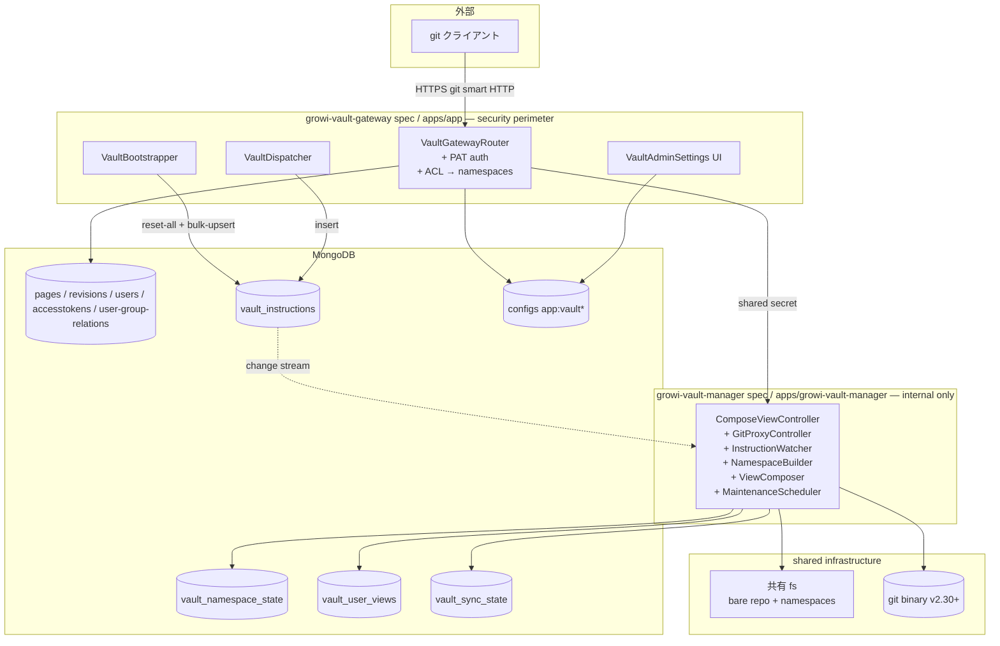

# Design Document(Umbrella)

> **Umbrella spec**: 本ドキュメントは GROWI Vault 機能全体の **user-facing 仕様** と **2 子 spec を束ねる境界・共有契約** のみを記述する。コンポーネント単位の詳細設計・データモデル・テスト戦略・実装計画は各子 spec の `design.md` / `tasks.md` に委譲する。
>
> - 子 spec(apps/app 側): [`growi-vault-gateway`](../growi-vault-gateway/design.md)
> - 子 spec(vault-manager 側): [`growi-vault-manager`](../growi-vault-manager/design.md)
> - 設計判断の根拠(Build vs Adopt / Architecture Pattern Evaluation 等): [`research.md`](./research.md)

---

## 概要

GROWI Vault は、GROWI のページ群を標準 git クライアントで read-only に取得できる機能である。ユーザーは既存の GROWI 認証情報(Personal Access Token)を用いて、自分が閲覧権限を持つページのみを含むリポジトリを `git clone` でき、AI エージェント・CLI ツール・Obsidian 型ワークフローなどのファイルシステム前提の外部ツールから GROWI のナレッジを活用できるようになる。

本機能は **2 つのコンポーネントの協調** として実装する:

- **`apps/app`**(既存アプリの拡張、`growi-vault-gateway` spec) — 唯一の外部公開エンドポイント。PAT 認証・ACL 評価・vault-manager への指示と git protocol の透過 proxy を担当する
- **`apps/growi-vault-manager`**(新規マイクロサービス、`growi-vault-manager` spec) — 内部専用。共有 filesystem 上の git bare repository(namespace 構造)を維持し、`git upload-pack` を spawn して clone/fetch を提供する

エンドユーザーは `apps/app` のエンドポイントだけを叩き、vault-manager は外部から到達不可能(k8s NetworkPolicy / 内部 service)。これにより認証境界(security perimeter)が `apps/app` 一箇所に集約され、vault-manager は ACL 評価や PAT 検証などの GROWI ドメインロジックを一切持たない実行エンジンに純化される。

ストレージ戦略は 10,000+ ページ規模を MVP スコープとするため、**bare repo + namespace ref + git binary** を選択した。pack 生成・delta 圧縮・wire protocol を成熟した git binary に委譲することで、リクエスト時メモリは O(1)、転送量も最小化できる。namespace は GROWI の ACL 種別(public / group / only-me)に対応した「コンテンツの分類軸」として運用し、per-user の view ref はそれら namespace を tree-level で merge した合成 ref として表現する。

### Goals

- 標準 git クライアント(`git clone`, `git fetch`, `git pull`)での read-only アクセスを実現する
- GROWI 既存 ACL(public / group / owner)に基づく per-user ページフィルタリングを保証する
- 既存 PAT 認証基盤を活用し、ユーザーが追加の認証情報なしに利用開始できる
- 10,000 ページを超える GROWI インスタンスでもリクエスト時メモリ O(1) で動作する
- 管理者が機能を有効化・無効化し、利用状況を監査できる
- コンテンツの freshness を維持し、ページ変更を文書化された境界内で後続 fetch に反映する

### Non-Goals

- git push(書き込み)— 将来 spec に委ねる
- 添付ファイル・ページ間メタデータ(コメント、タグ等)の export
- 外部 git ホスティング(GitHub/GitLab)との bidirectional 同期 — post-MVP の別 spec で扱う
- 機能有効化以前の revision 履歴の import
- vault-manager をエンドユーザーから直接アクセス可能にすること(常に apps/app gateway 経由)

---

## Sub-specs(子 spec ポインタ)

| Spec | 物理境界 | 責務サマリ |
|------|---------|-----------|
| [`growi-vault-gateway`](../growi-vault-gateway/design.md) | `apps/app/src/features/growi-vault/` | git smart HTTP の唯一の対外エンドポイント・PAT 認証・GROWI ACL 評価・namespace 集合計算・`vault_instructions` への durable 書き込み・bootstrap 主導・vault-manager RPC クライアント・admin UI |
| [`growi-vault-manager`](../growi-vault-manager/design.md) | `apps/growi-vault-manager/`(新規 Ts.ED アプリ) | `vault_instructions` change stream 購読・namespace tree 更新・per-user view ref 合成・`git upload-pack` spawn・周期 squash + gc の自走スケジューリング・shared secret 認証 |

両 spec は共有契約(下記「Shared Contracts」)を介してのみ結合し、互いに hard dependency を持たない。並列実装可能。

---

## Architecture Overview

### Boundary Map



詳細な component-level architecture diagram と decision rationale は [`research.md`](./research.md) および各子 spec の design.md を参照。

---

## Boundary Commitments(umbrella レベル)

> 各子 spec の境界詳細(Allowed Dependencies / This Spec Owns / Out of Boundary 全項目)は子 spec の `design.md` 「境界コミットメント」を参照。本セクションは spec-to-spec の関係性に絞る。

### apps/app(`growi-vault-gateway`)の責務

- git smart HTTP の唯一の対外エンドポイント `GET/POST /_vault/repo.git/...` を提供する
- HTTP Basic Auth → PAT 認証(既存 access-token-parser に委譲)
- GROWI ACL に基づく per-user accessible namespace 集合の計算
- ページ変更イベントの購読 → `vault_instructions` への durable 書き込み(coalesce / prefix primitives 含む)
- 初回有効化 / 災害復旧時の bootstrap 主導(`reset-all` + pages cursor stream + seed instructions 発行)
- vault-manager への `compose-view` 同期 RPC + git request body の透過 proxy
- 既存 audit log への vault イベント記録(clone / fetch / auth-failure)
- `vaultEnabled` 設定 UI と bootstrap 進捗表示

### vault-manager(`growi-vault-manager`)の責務

- 共有 filesystem 上の bare repository の維持(object pool + namespace refs)
- `vault_instructions` の change stream 購読 → 6 op(upsert / bulk-upsert / remove / rename-prefix / grant-change-prefix / reset-all)の冪等実行
- `revisions` コレクションからの **body フィールドのみ ID 指定 lookup**(`pages` は直接 read しない)
- per-user view ref の合成(指定 namespace 集合の tree merge + sourceVersions cache)
- `git upload-pack` の spawn と stdin/stdout の HTTP body へのパイプ
- namespace ref の squash と `git gc` の自走スケジューリング(外部 cron 非依存)
- shared secret による service-to-service 認証

### Out of Boundary(両 spec 共通)

- GROWI の ACL 評価ロジック本体(既存 `page-grant.ts` に委譲)
- PAT 発行・管理 UI(既存 AccessToken 機能に委譲)
- git push / 書き込み受付(将来 spec)
- 添付ファイルの配信
- vault-manager への外部からの直接アクセス(常に apps/app gateway 経由)
- bare repo の delta 圧縮・pack format 実装(git binary に委譲)
- 監査ログ専用コレクションの新設(既存 audit log に統合)
- **[MVP・実装完了]** 親ページ rename / grant 一括変更に伴う vault 伝播: MVP スコープとして 2 段階で実装完了。Stage 1 (タスク 21.1-A) で `'updateMany'` イベントの per-page upsert フォールバック経路、Stage 2 (タスク 21.1-B) で GROWI page service の event payload を拡張（`'rename'`、`'updateMany'`、新規 `'descendantsGrantChanged'`）。vault は `rename-prefix` instruction（rename）と per-page `acl-change` instruction（grant 一括変更、既存 dispatcher 経路を流用）で自動伝播する。`grant-change-prefix` op は subtree 単位の prefix scope を持たないため将来の vault-manager 設計改修まで使用しない（詳細は `growi-vault-gateway/design.md` および `growi-vault/dev-verification.md` 参照）

### Revalidation Triggers(umbrella レベル)

以下の変更は両子 spec の design 整合性を再確認する必要がある:

- GROWI Page モデルの grant / grantedGroups スキーマ変更
- GROWI Revision モデルの body フィールド形式変更
- access-token-parser ミドルウェアのインタフェース変更
- ページパスエンコーディング規則の変更(既存 clone 履歴との互換破壊)
- `@growi/core` の Vault DTO 型の breaking change
- isomorphic-git のメジャーバージョンアップ
- git binary が container image から外れる事態

---

## Shared Contracts(共有契約サマリ)

両子 spec が同期して維持すべき契約。詳細スキーマ・型定義は `growi-vault-gateway/design.md` の「データモデル」「@growi/core 共通 DTO 型」セクションを normative source とし、`growi-vault-manager` 側はそれを import して整合させる。

### 1. `vault_instructions` コレクション(durable outbox)

- **Owner(write)**: `growi-vault-gateway` の `VaultDispatcher` / `VaultBootstrapper` が `op` / `payload` / `issuedAt` を insert
- **Owner(processedAt 更新)**: `growi-vault-manager` の `VaultInstructionWatcher` が `processedAt` / `attempts` / `lastError` を update
- **op 種別(6 種)**: `upsert` / `bulk-upsert` / `remove` / `rename-prefix` / `grant-change-prefix` / `reset-all`
- **TTL**: `processedAt` に対して `expireAfterSeconds: 86400`(処理済み doc の自動削除)
- **at-least-once 配送**: change stream + 起動時 drain で取りこぼしを回避。冪等性は manager 側の op 実装が保証

### 2. `compose-view` RPC

- **Endpoint**: `POST /internal/compose-view`(vault-manager)
- **Auth**: `Authorization: Bearer ${VAULT_MANAGER_INTERNAL_SECRET}`
- **Request**: `{ userId: string | null, namespaces: ReadonlyArray<Namespace> }`
- **Response**: `{ viewRef: string, commitOid: string }`
- **匿名アクセス**: `userId: null` のとき、namespace 集合は `['public']` で gateway が呼び出し、manager は `'anonymous-view'` ref を返す

### 2.1 `storage-stats` RPC(admin UI 観測用)

- **Endpoint**: `GET /internal/storage-stats`(vault-manager)
- **Auth**: `Authorization: Bearer ${VAULT_MANAGER_INTERNAL_SECRET}`
- **Response**: `StorageStatsResponse { namespaceCount, totalCommitCount, looseObjectCount, repoSizeBytes, lastSquashAt, lastGcAt }`
- **動機**: `vault_namespace_state` は manager owned のため、gateway が直接 read することは owner 越境となる。admin UI のストレージ観測に必要なデータは本 RPC 経由でのみ取得する

### 3. shared secret 認証

- **環境変数**: `VAULT_MANAGER_INTERNAL_SECRET`(両 pod に同値を注入、DB 保存禁止)
- **ヘッダ**: `Authorization: Bearer <secret>` を全 vault-manager endpoint に必須化
- **比較**: `crypto.timingSafeEqual` による constant-time 比較

### 4. namespace ref naming

```
refs/namespaces/public/refs/heads/main                   # 公開ページ tree
refs/namespaces/restricted-link/refs/heads/main          # anyone-with-link tree
refs/namespaces/group-<gid>/refs/heads/main             # グループ ACL ページ tree
refs/namespaces/user-<uid>-only-me/refs/heads/main      # only-me ページ tree
refs/namespaces/user-<uid>-view/refs/heads/main         # per-user 合成 view ref
refs/namespaces/anonymous-view/refs/heads/main          # 匿名 view ref
```

衝突解消優先順位(per-user view 合成時): `user-<uid>-only-me` > `group-*` > `restricted-link` > `public`

### 5. `vault_sync_state` コレクションの field-level owner 分離

| フィールド | Owner(write) | 用途 |
|-----------|------------|------|
| `bootstrapState` / `bootstrapCursor` / `bootstrapStartedAt` / `bootstrapCompletedAt` / `bootstrapTotalEstimated` / `bootstrapProcessed` / `bootstrapLastError` | `growi-vault-gateway` | bootstrap 進捗(gateway は read + write、manager は read のみ)。`bootstrapLastError` は失敗時にメッセージを記録し admin UI に surface する |
| `resumeToken` / `lastProcessedAt` / `watcherInstanceId` | `growi-vault-manager` | change stream resume(gateway は read のみ) |

両者の write は disjoint なフィールド集合のため write 競合は発生しない。

### 6. `@growi/core/interfaces/vault/` DTO 型

- **配置**: `packages/core/src/interfaces/vault/`(barrel: `index.ts`)
- **型**: `VaultInstructionDoc` / `VaultInstructionOp` / `VaultBulkUpsertEntry` / `VaultInstructionPayload` / `ComposeViewRequest` / `ComposeViewResponse` / `StorageStatsResponse` / `Namespace`
- **Owner(define)**: `growi-vault-gateway` spec が定義し、`packages/core/package.json` の exports に `./dist/interfaces/vault` を追加する
- **Consumer**: `growi-vault-manager` は import して contract に整合させる(独自定義しない)

---

## Architecture Decisions(要約)

意思決定の根拠は [`research.md`](./research.md) を参照。本セクションは結論のみ列挙する。

| # | 決定 | 根拠の所在 |
|---|-----|-----------|
| 1 | 2 アプリ構成(`apps/app` + `apps/growi-vault-manager`) | research.md Decision 1 |
| 2 | 認証境界は apps/app に集約、vault-manager は内部専用 | research.md Decision 2 |
| 3 | bare repo + git binary + namespace モデル | research.md Decision 3 |
| 4 | per-user view ref は namespace tree merge による合成 | research.md Decision 4 |
| 5 | 通信路は MongoDB outbox + change stream(Redis 不採用) | research.md Decision 5 |
| 6 | shared secret は env var only(DB 保存なし) | research.md Decision 6 |
| 7 | 監査ログは既存 audit log collection を再利用 | research.md Decision 7 |
| 8 | パスマッピング・ACL 規則は v1 確定後 immutable | research.md Decision 8 |
| 9 | 単一 writer は StatefulSet replicas=1 で物理保証(leader election 機構なし) | 子 spec design.md / research.md |
| 10 | GROWI Cloud は Filestore(POSIX NFS)必須・GCSFuse 非対応 | 子 spec design.md "Storage Requirements" |

---

## Storage Requirements(umbrella レベル)

| 環境 | 採用 fs | 不採用 |
|------|---------|--------|
| dev / docker-compose | local bind mount | — |
| self-host 単一 pod | local fs(SSD 推奨) | — |
| self-host multi pod | NFSv4 / Filestore / EFS | — |
| **GROWI Cloud** | **Filestore(GCP managed NFS)必須** | **GCSFuse 等の object storage backed FUSE は非対応** |

理由: vault-manager は random small object I/O + ref atomic rename を要求するため、`apps/pdf-converter` の sequential single-file I/O 前提とは workload profile が異なる。詳細は [`research.md`](./research.md) "共有 filesystem の選定" 参照。

---

## User-facing Documentation Deliverables

以下は user-facing 要件(`requirements.md`)が要求するドキュメント成果物。子 spec の実装タスクとは別に、umbrella spec の責務として明示する:

- **要件 2.6**: path-to-filename マッピング規則の利用者向け文書化(エンコード規則・衝突 suffix・orphan 配置)
- **要件 2.8**: `/user` 配下を `git sparse-checkout` で除外する手順の文書化
- **要件 8(将来スコープ)**: MVP 範囲外の機能(push / 添付 / メタデータ / 履歴 import / 下書き)の境界をリリースノート / 利用者ガイドに明示

これらは `growi-vault-manager` の README または `apps/app` の admin help 画面に配置することを推奨する(配置先は実装フェーズで確定)。

---

## Open Items

> **災害復旧**: bare repo 全消失時の再構築は "Initial Bootstrap フロー" と完全に同一のコードパスで吸収される(apps/app から `reset-all` + 全 page bulk-upsert を再発行)。詳細は `growi-vault-gateway/design.md` の VaultBootstrapper 節を参照。

### MVP 段階実装の完了状況

| # | 課題 | Stage 1（実装済み） | Stage 2（実装済み） | 関連タスク |
|---|------|-----------------|-----------------|-----------|
| 1 | **rename 伝播**: 親ページ rename 後、旧パス削除 + 新パス追加を vault に反映する | `'updateMany'` 購読のフォールバック経路（per-page upsert） | GROWI core の `'rename'` / `'updateMany'` payload を拡張し、vault subscriber が `rename-prefix` instruction を namespace 数ぶん発行 | `growi-vault-gateway` タスク 21.1-A / 21.1-B |
| 2 | **grant 一括変更伝播**: 親ページ grant 一括変更を vault に反映する | — | GROWI core に新規イベント `'descendantsGrantChanged'` を追加し、vault subscriber が per-page `acl-change` instruction（既存 dispatcher 経路）を発行 | `growi-vault-gateway` タスク 21.1-B |

> **運用注意**: rename / grant 一括変更は GROWI core からの emit によって vault に自動伝播される。通常運用では手動 bootstrap 再実行は不要。例外として、既存 vault が Stage 2 リリース以前の状態でリレジリエンスが取れていない場合や vault-manager 側で instruction 処理が失敗してリトライ上限を超えた場合のみ手動 bootstrap が必要（手順は `growi-vault/dev-verification.md` のトラブルシュート節を参照）。
