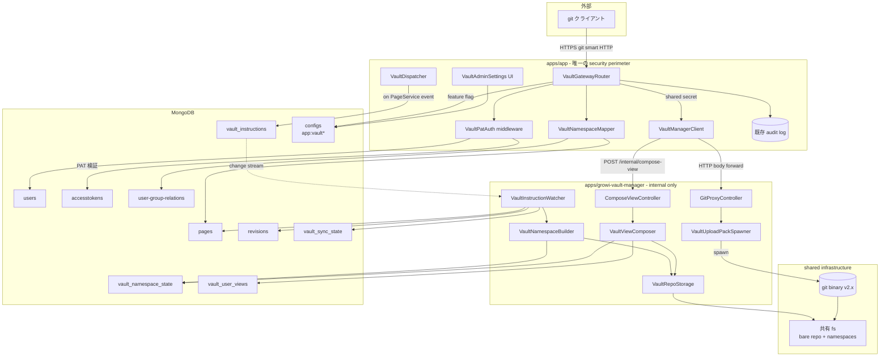
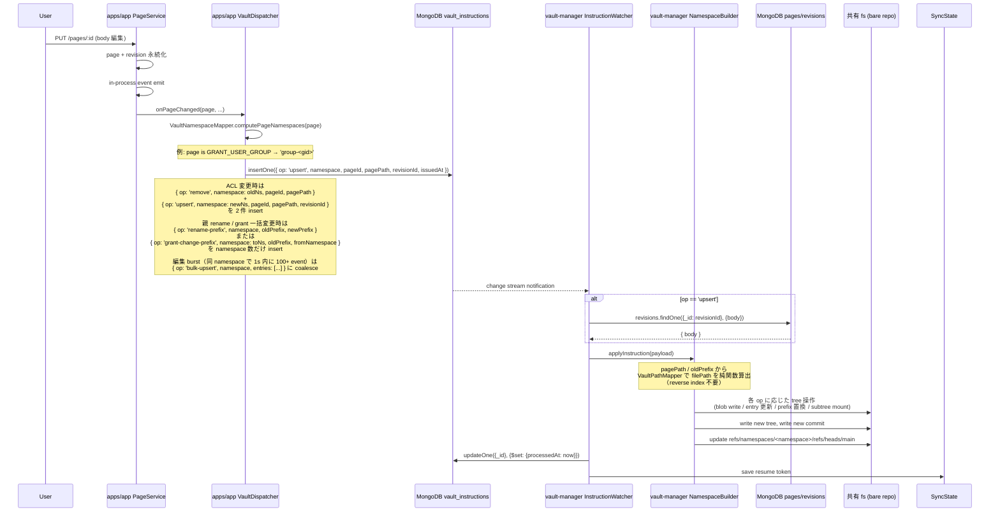
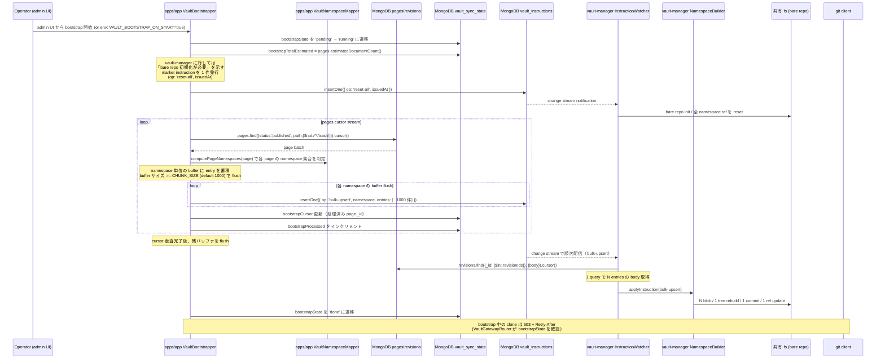
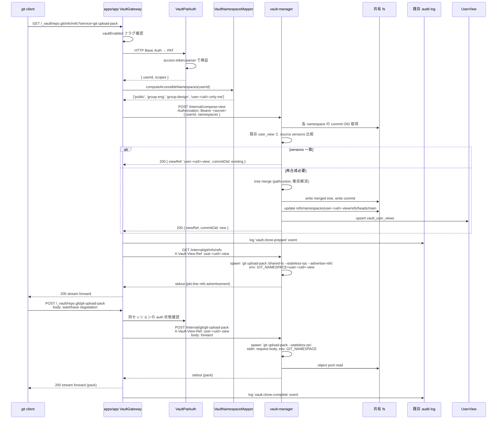

# Design Document

## 概要

GROWI Vault は、GROWI のページ群を標準 git クライアントで read-only に取得できる機能である。ユーザーは既存の GROWI 認証情報（Personal Access Token）を用いて、自分が閲覧権限を持つページのみを含むリポジトリを `git clone` でき、AI エージェント・CLI ツール・Obsidian 型ワークフローなどのファイルシステム前提の外部ツールから GROWI のナレッジを活用できるようになる。

本機能は **2 つのコンポーネントの協調**として実装する:

- **`apps/app`**（既存アプリの拡張）— 唯一の外部公開エンドポイント。PAT 認証・ACL 評価・vault-manager への指示と git protocol の透過 proxy を担当する
- **`apps/growi-vault-manager`**（新規マイクロサービス）— 内部専用。共有 filesystem 上の git bare repository（namespace 構造）を維持し、`git upload-pack` を spawn して clone/fetch を提供する

エンドユーザーは `apps/app` のエンドポイントだけを叩き、vault-manager は外部から到達不可能（k8s NetworkPolicy / 内部 service）。これにより認証境界（security perimeter）が `apps/app` 一箇所に集約され、vault-manager は ACL 評価や PAT 検証などの GROWI ドメインロジックを一切持たない実行エンジンに純化される。

ストレージ戦略は 10,000+ ページ規模を MVP スコープとするため、**bare repo + namespace ref + git binary** を選択した。pack 生成・delta 圧縮・wire protocol を成熟した git binary に委譲することで、リクエスト時メモリは O(1)、転送量も最小化できる。namespace は GROWI の ACL 種別（public / group / only-me）に対応した「コンテンツの分類軸」として運用し、per-user の view ref はそれら namespace を tree-level で merge した合成 ref として表現する。

### Goals

- 標準 git クライアント (`git clone`, `git fetch`, `git pull`) での read-only アクセスを実現する
- GROWI 既存 ACL（public / group / owner）に基づく per-user ページフィルタリングを保証する
- 既存 PAT 認証基盤を活用し、ユーザーが追加の認証情報なしに利用開始できる
- 10,000 ページを超える GROWI インスタンスでもリクエスト時メモリ O(1) で動作する
- 管理者が機能を有効化・無効化し、利用状況を監査できる
- コンテンツの freshness を維持し、ページ変更を文書化された境界内で後続 fetch に反映する

### Non-Goals

- git push（書き込み）— 将来 spec に委ねる
- 添付ファイル・ページ間メタデータ（コメント、タグ等）の export
- 外部 git ホスティング（GitHub/GitLab）との bidirectional 同期 — post-MVP の別 spec で扱う
- 機能有効化以前の revision 履歴の import
- vault-manager をエンドユーザーから直接アクセス可能にすること（常に apps/app gateway 経由）

---

## Boundary Commitments

### apps/app の追加責務（`src/features/growi-vault/`）

- git smart HTTP の唯一の対外エンドポイント `GET/POST /_vault/repo.git/...` を提供する
- HTTP Basic Auth → PAT 認証（既存 access-token-parser に委譲）
- ユーザーがアクセス可能な namespace 集合の決定（GROWI ACL 評価）
- ページの所属 namespace の決定（grant / grantedGroups / creator から）
- ページ変更イベントの購読 → vault-manager 向け instruction の `vault_instructions` コレクション書き込み
- **初回有効化 / 災害復旧時の bootstrap 主導**: pages cursor stream を回し、各 page について namespace 判定 → seed instructions を `vault_instructions` に発行する（vault-manager は steady state と同一パスで処理）
- vault-manager への `compose-view` 同期 RPC 呼び出し
- git request body の vault-manager への透過 proxy（HTTP body forward）
- 既存 audit log への clone / fetch / auth-failure イベント記録
- `vaultEnabled` フラグ等の admin 設定 UI（bootstrap 進捗表示を含む）

### vault-manager の責務（`apps/growi-vault-manager/`）

- 共有 filesystem 上の git bare repository の維持（object pool + namespace refs）
- `vault_instructions` コレクションの change stream 購読 → 受信した指示の実行
- `revisions` コレクションからの **body フィールドのみ ID 指定 lookup**（instruction に含まれる `revisionId` から body 取得のため）
- namespace tree の更新（指示に従って blob/tree/commit を構築し ref を更新）
- per-user view ref の合成（指示された namespace 集合の tree merge）
- `git upload-pack` の spawn と stdin/stdout の HTTP body へのパイプ
- namespace ref の squash と `git gc` の自走スケジューリング（環境非依存、外部 cron 依存なし）
- shared secret による service-to-service 認証

### Out of Boundary

- GROWI の ACL 評価ロジック本体（既存 PageService / page-grant.ts に委譲）
- PAT 発行・管理 UI（既存 AccessToken 機能に委譲）
- git push / 書き込み受付
- 添付ファイルの配信
- vault-manager への外部からの直接アクセス（apps/app gateway を必ず経由）
- vault-manager 内での GROWI ドメイン知識（ACL, PAT, group, scope evaluation 等）
- bare repo の delta 圧縮・pack format 実装（git binary に委譲）
- 監査ログ専用コレクションの新設（既存 audit log collection に統合）

### Allowed Dependencies

**apps/app side:**
- 既存 Page / Revision Mongoose モデル
- access-token-parser ミドルウェア
- page-grant.ts の `isUserGrantedPageAccess`, `generateGrantCondition`
- UserGroupRelation / ExternalUserGroupRelation の group resolution
- 既存 audit log infra

**vault-manager side:**
- `revisions` コレクション（read-only, **body フィールドのみ・ID 指定 lookup のみ**） — bootstrap 用 cursor stream 含めて pages コレクションは直接 read しない（page → namespace 判定は apps/app に集約）
- vault-manager 専用コレクション（`vault_instructions`, `vault_namespace_state`, `vault_user_views`, `vault_sync_state`）
- isomorphic-git v1.37.x（オブジェクト書き込み・hash 計算のみ）
- git binary（v2.30+）— `git upload-pack` 実行のため container image に同梱
- 共有 filesystem（local / NFS / Filestore — 環境別。GROWI Cloud は **Filestore 必須**、詳細は "Storage Requirements" 参照）
- @growi/core の DTO 型・interface 型

### Revalidation Triggers

- GROWI Page モデルの grant / grantedGroups スキーマ変更
- GROWI Revision モデルの body フィールド形式変更
- access-token-parser ミドルウェアのインタフェース変更
- ページパスエンコーディング規則の変更（既存 clone 履歴との互換破壊）
- @growi/core の Vault DTO 型の breaking change
- isomorphic-git のメジャーバージョンアップ
- git binary が container image から外れる事態

---

## Architecture

### Existing Architecture Analysis

GROWI は以下のサービス構成を持つ:

- **apps/app**（Next.js + Express + MongoDB）— メインアプリケーション。`src/features/{name}/server/{routes,services,models}` の feature-based 構成
- **apps/pdf-converter**（Ts.ED + Puppeteer）— PDF 生成マイクロサービス。GROWI Cloud では FUSE 共有 fs 経由で apps/app と連携
- **apps/slackbot-proxy**（Ts.ED + TypeORM + MySQL）— Slack 連携プロキシ

GROWI Vault は `apps/growi-vault-manager` を pdf-converter と同じ Ts.ED ベースの新規マイクロサービスとして追加する。pdf-converter のデプロイ skeleton（独立コンテナ / 共有 volume 連携）を継承する一方、**ストレージ層は workload profile が異なる** ため別選定: pdf-converter は sequential single-file I/O で GCSFuse が機能するが、vault は random small object I/O + ref atomic rename を要求するため GROWI Cloud では Filestore（POSIX NFS）を採用する（"Storage Requirements" 参照）。dev は local volume で十分。

### Architecture Pattern & Boundary Map



### Architecture Decision Rationale

#### Why Option III（apps/app gateway + vault-manager backend executor）

検討した代替案:

| 案 | 概要 | 不採用理由 |
|----|------|---------|
| Option I: apps/app feature 一体型（直接 DB read） | apps/app 内部で全て完結 | CPU/メモリ分離なし、独立スケール不可 |
| Option II: vault-manager が apps/app の internal API を pull | vault-manager が外部公開 + auth 自前 | security perimeter が 2 箇所、vault-manager の外部認証経路が必要 |
| Option N (in-process streaming pack encoder, no git binary) | 純 TS で pack format 自前実装 | 10K+ ページで delta 圧縮なし、pack format 実装リスク大 |
| External git service 中継（GitLab/Gitea） | 既存 git service を裏に置く | per-user ACL を表現できない、push amplification、外部依存追加 |
| **Option III: apps/app gateway + vault-manager backend** | apps/app が認証境界、vault-manager は内部実行エンジン | **採用** |

Option III の決定理由:

1. **single security perimeter** — 外部からの認証・ACL は apps/app の既存基盤に一元化、vault-manager は内部のみ
2. **vault-manager の責務最小化** — namespace と git protocol の 2 概念だけを扱う実行エンジン
3. **CPU/メモリ分離** — pdf-converter 同様、heavy clone load が main app の SLA を侵食しない
4. **独立スケール** — clone トラフィックに合わせて vault-manager のみスケール
5. **将来拡張容易性** — push 対応・GitLab 連携などは apps/app → vault-manager の指示チャネルを増やすだけ

#### Why bare repo + git binary + namespace

10,000+ ページ規模で memory O(1) を実現するには pack 生成のストリーミングが必須。検討した実装手段:

- isomorphic-git の `packObjects` は Uint8Array を返すストリーミング非対応 API → 不採用
- 自前 streaming pack encoder（pack format + pkt-line）→ 実装リスク大、delta 圧縮非対応で転送量 2-3x
- **git binary `git upload-pack`** → 成熟した実装に委譲、delta 自動、protocol v2 自動追従

GROWI の ACL モデルは public / group（数十個程度）/ only-me / restricted の 4 種で、namespace 数が小さく抑えられるため namespace ベースの bare repo 設計と相性が良い:

- `refs/namespaces/public/refs/heads/main` — 公開ページ tree
- `refs/namespaces/group-<gid>/refs/heads/main` — グループ ACL ページ tree（≤数十個）
- `refs/namespaces/user-<uid>-only-me/refs/heads/main` — only-me ページ tree
- `refs/namespaces/user-<uid>-view/refs/heads/main` — clone で実際に提供される合成 view ref

per-user view ref は、ユーザーがアクセス可能な ACL namespace 群を path-level で merge した合成 tree を指す。git の content-addressing により、被覆しない部分のサブツリー OID は再利用される。

#### Why MongoDB outbox + change stream（Redis 不採用）

apps/app から vault-manager への page 変更通知は、Redis Pub/Sub を使わず MongoDB の `vault_instructions` コレクションを durable な outbox として用いる:

- apps/app は instruction を MongoDB に書き込むだけ（vault-manager の生死から独立）
- vault-manager は change stream で push 受信
- resume token で再起動時に取りこぼしなし
- GROWI 既存の MongoDB replica set 要件と一致、追加 infra 不要

#### Why writer 単一化は StatefulSet replicas=1 で物理保証する（leader election 機構を持たない）

bare repo の ref 更新は POSIX `rename(2)` の atomic rename に依存しており、同一 ref に対する **同時 writer は ref 上書き → 到達不能 commit → `git gc` でサイレントなページ消失** を引き起こす。これを防ぐには writer の単一化が必須。検討した方式:

| 案 | 概要 | 不採用理由 |
|---|---|---|
| MongoDB-based lease + fencing token | `vault_sync_state` に lease + monotonic fence、write 時に共有 fs の token file と照合 | fence file 配置・write path 全箇所への check 挿入で MVP スコープ膨張 |
| K8s Lease object | k8s native の lease API を Node から利用 | self-host で k8s 非前提、抽象が分裂 |
| **StatefulSet replicas=1 で物理単一化** | k8s 機構で replica 数を 1 に固定、failover は Pod 再生成 | **採用** |

採用理由:
1. **コード側に lease/fence 機構が一切混入しない** — vault-manager は "自分が唯一の writer である" 前提でロジックを書ける
2. **GROWI Cloud の運用パターンと整合** — pdf-converter も同様に単一 pod 運用で問題ない
3. **failover の所要時間（1〜2 分の clone 不可）は MVP の SLO に許容範囲**
4. **read scale が必要になった時点で post-MVP で sidecar pattern に拡張可能** — write pod は無変更のまま read sidecar (replicas=N) を追加するだけ

self-host multi pod デプロイの場合も MVP は単一 pod 運用を推奨し、multi pod は post-MVP の Future optimizations で扱う。

### Technology Stack

| Layer | Choice / Version | Role | Notes |
|-------|-----------------|------|-------|
| apps/app | Express（既存） | gateway / proxy / dispatcher | 既存 feature pattern に追加 |
| vault-manager | Ts.ED v7.x | HTTP server / DI / lifecycle | pdf-converter と同 stack |
| Git server | git binary v2.30+ | upload-pack 実行 | container image に `apk add git` |
| Git writes | isomorphic-git v1.37.x | blob/tree/commit の書き込み（node fs 上） | pure JS、ネイティブ依存なし |
| Storage（dev） | local filesystem | volume mount | docker-compose で共有 volume |
| Storage（self-host 単一 pod） | local fs | bare repo の物理配置 | 最小構成 |
| Storage（self-host multi pod） | NFS | bare repo の物理配置 | POSIX semantics + atomic rename + 真の locking が必須 |
| Storage（GROWI Cloud） | **Filestore（GCP managed NFS）必須** | shared fs | git ワークロードは random small read 多発 + ref atomic rename 依存のため、object storage backed FUSE（GCSFuse 等）は採用しない |
| Eventing | MongoDB change stream | apps/app → vault-manager 指示伝達 | replica set 必須（既存要件） |
| Inter-service auth | shared secret（Bearer token） | apps/app ↔ vault-manager | env var only via config-definition |
| Data | MongoDB + Mongoose | apps/app: pages/revisions read + vault_* write / vault-manager: revisions body lookup + vault_* read/write | vault-manager は専用 connection pool、pages 直接 read なし |
| Admin UI | React + SWR（既存 admin パターン） | 機能 ON/OFF | apps/app 側に配置 |

---

## File Structure Plan

### apps/app に追加

```
apps/app/src/features/growi-vault/
├── interfaces/
│   ├── vault-instruction.ts           # 共通 DTO（@growi/core から re-export）
│   └── index.ts
├── server/
│   ├── routes/
│   │   ├── vault-gateway.ts           # GET/POST /_vault/repo.git/* — auth + proxy
│   │   └── vault-admin.ts             # admin API（bootstrap 開始 / 進捗 / enable 切替）
│   ├── services/
│   │   ├── vault-namespace-mapper.ts  # ACL → namespace 集合 / page → namespace 計算
│   │   ├── vault-dispatcher.ts        # PageService event 購読 + vault_instructions 書き込み
│   │   ├── vault-bootstrapper.ts      # bootstrap 主導（reset-all + pages cursor → seed instructions）
│   │   ├── vault-manager-client.ts    # vault-manager との HTTP RPC + body proxy
│   │   └── vault-settings-service.ts  # vaultEnabled, endpoint, secret の取得
│   ├── middlewares/
│   │   └── vault-pat-auth.ts          # access-token-parser を vault scope で composition
│   ├── models/
│   │   ├── vault-instruction.ts       # 書き込み用 Mongoose model（owned: apps/app）
│   │   └── vault-sync-state.ts        # bootstrap 進捗 owned by apps/app（bootstrap* fields）
│   └── index.ts                       # feature 登録
└── client/
    └── admin/
        ├── VaultAdminSettings.tsx     # 機能 ON/OFF + bootstrap 進捗表示 + audit log filter リンク
        └── index.ts
```

### vault-manager（新規アプリ）

```
apps/growi-vault-manager/
├── package.json
├── tsconfig.json
├── Dockerfile                          # node + git binary
├── src/
│   ├── interfaces/
│   │   └── (DTOs from @growi/core)
│   ├── controllers/
│   │   ├── compose-view-controller.ts  # POST /internal/compose-view
│   │   ├── git-proxy-controller.ts     # GET /internal/git/info/refs, POST /internal/git/git-upload-pack
│   │   └── health-controller.ts        # GET /health
│   ├── services/
│   │   ├── vault-instruction-watcher.ts  # change stream subscriber + 起動時 drain
│   │   ├── vault-namespace-builder.ts    # instruction → blob/tree/commit + namespace ref 更新
│   │   ├── vault-view-composer.ts        # 複数 namespace を tree merge → user view ref
│   │   ├── vault-repo-storage.ts         # bare repo 操作の抽象（git object I/O）
│   │   ├── vault-path-mapper.ts          # ページパス → ファイルパス（エンコード・衝突解消・orphan）
│   │   ├── vault-blob-hasher.ts          # isomorphic-git の hashObject 利用
│   │   ├── vault-upload-pack-spawner.ts  # `git upload-pack` 子プロセス起動
│   │   └── vault-maintenance-scheduler.ts # squash + 周期 gc の自走スケジューラ
│   ├── models/
│   │   ├── revision.ts                   # read-only subset (_id, body のみ・ID lookup 用)
│   │   ├── vault-instruction.ts          # change stream watch + processedAt 更新
│   │   ├── vault-namespace-state.ts      # owned
│   │   ├── vault-user-view.ts            # owned
│   │   └── vault-sync-state.ts           # read: resume token / write: resume token のみ（bootstrap* fields は apps/app owned）
│   ├── middlewares/
│   │   └── shared-secret-auth.ts         # Authorization: Bearer <secret> 検証
│   └── server.ts                         # Ts.ED bootstrap
└── README.md
```

### 既存ファイルへの修正

- `apps/app/src/server/models/config-definition.ts` — `app:vaultEnabled`, `app:vaultManagerEndpoint`, `app:vaultManagerInternalSecret` を追加（後者 2 つは env var only）
- `apps/app/src/server/routes/index.ts`（または app 起動箇所）— `VaultGatewayRouter` 登録
- `apps/app/src/server/service/page.ts`（既存 PageService）— page 変更時に in-process EventEmitter で event 発火（既存実装ある場合は不要）
- `packages/core/src/interfaces/vault/` — 新規ディレクトリ。Vault DTO 型を配置:
  - `vault-instruction.ts` — VaultInstructionDoc, VaultInstructionOp 等
  - `vault-compose-view.ts` — ComposeViewRequest, ComposeViewResponse
  - `index.ts` — barrel
- `packages/core/package.json` — `./dist/interfaces/vault` の export 追加
- `pnpm-workspace.yaml` — `apps/growi-vault-manager` を workspace に追加（自動検出される場合は不要）
- `turbo.json`（root）— vault-manager の build/dev/test task 設定が必要なら追加
- `docker-compose.yml` — vault-manager サービスと共有 volume の定義

---

## System Flows

### page edit → vault sync 非同期フロー



key decisions:
- **apps/app は MongoDB に書くだけ**で vault-manager の死活に依存しない（durable outbox）
- **vault-manager は ACL を評価しない** — どの namespace に属するかは apps/app が判断済み
- **idempotency** — `processedAt` で二重実行を防止。change stream のリトライや起動時 drain で安全
- **freshness SLA**: 通常 1〜5 秒、最悪 60 秒以内に後続 fetch に反映

### Initial Bootstrap（初回有効化 / 災害復旧）フロー

既存 GROWI インスタンス（10K〜30K ページ）に GROWI Vault を新規導入する場合、および bare repo が破損・消失した場合の再構築は、**apps/app 側で seed instructions を発行 → vault-manager は steady state と同一パスで処理** する。これにより vault-manager は bootstrap 専用コードを持たず、page → namespace 判定（GROWI ドメイン知識）が apps/app に集約される。



key decisions:
- **bootstrap 主導は apps/app**: pages cursor stream + namespace 判定は apps/app の `VaultBootstrapper` サービスが担当。vault-manager は bootstrap 専用ロジックを持たず、`vault_instructions` の change stream を steady state と同一パスで消費する
- **bulk-upsert で throughput を確保**: bootstrap 中の instruction は **すべて `bulk-upsert`**（CHUNK_SIZE=1000 で chunk 化）。30K page × ~1.5 namespace = 45K page-namespace pair が **約 45 件の `bulk-upsert` instruction に圧縮**され、DB lookup・tree rebuild・commit・ref update がそれぞれ 1000 倍 amortize される。同 primitive は steady state での編集 burst（API 一括投入等）にも転用される
- **トリガ**: (1) admin UI からの "Prepare" 操作、または (2) apps/app 起動時 env var `VAULT_BOOTSTRAP_ON_START=true`。両者は同じ `VaultBootstrapper.start()` を呼ぶ。冪等で何度実行しても結果収束（git の content-addressing）
- **`reset-all` marker instruction**: bootstrap 開始時に apps/app が `op: 'reset-all'` を 1 件 insert。vault-manager の watcher はこの instruction を受けて bare repo の全 namespace ref を reset する。これにより「bare repo 初期化」も instruction stream 経由で行われる
- **gating**: `vault_sync_state.bootstrapState ∈ {'pending', 'running'}` の間、apps/app 側 VaultGatewayRouter は全 clone / fetch を `503 + Retry-After` で拒否（**Req 7.2 解釈**: "受付開始" は "受付プロセスの開始" を意味し、bootstrap 完了までの一時 503 は許容される）
- **resume**: `bootstrapCursor` に最後に処理した `page._id` を保存（apps/app 側で更新）。failure 後の再起動で続行可能
- **観測**: 進捗（`bootstrapProcessed` / `bootstrapTotalEstimated`）を admin 画面に surface（Req 7.4 の系列）。`pages.estimatedDocumentCount()` を分母として表示
- **災害復旧との統合**: bare repo 全消失や namespace 不整合検出時にも同じ flow で再構築可能（apps/app から `reset-all` + 全 page upsert を再発行）
- **namespace 判定の所在**: apps/app の `VaultNamespaceMapper.computePageNamespaces` を steady state と完全に同じ実装で利用。vault-manager は GROWI ドメイン知識（grant / grantedGroups の意味解釈）を一切持たない

### clone / fetch / pull 同期フロー



key decisions:
- **apps/app は git wire format を解釈しない** — HTTP body を vault-manager にパイプし、stdout を client にパイプするだけ
- **compose-view は冪等** — 同じ namespace + version なら recompose せず existing OID を返す
- **incremental fetch（pull）は git binary 任せ** — `have` を含む POST が来ても vault-manager の追加処理不要
- **memory O(1) per request** — pack 生成は git binary が担当、apps/app は body forward のみ

---

## Requirements Traceability

| Requirement | Summary | Components | Key Contract / Flow |
|-------------|---------|------------|---------------------|
| 1.1 | 認証済み clone → ACL フィルタ済みリポジトリ | VaultGatewayRouter, VaultNamespaceMapper, ComposeViewController | clone 同期フロー |
| 1.2 | fetch/pull で変更を反映 | VaultDispatcher, VaultInstructionWatcher | page edit 非同期フロー |
| 1.3 | 標準 git クライアント互換 transport | VaultGatewayRouter (proxy), git upload-pack subprocess | git binary 委譲 |
| 1.4 | push を拒否 | VaultGatewayRouter | git-receive-pack を 403 |
| 2.1 | `/A/B/C` → `A/B/C.md` | VaultPathMapper（vault-manager 内） | applyInstruction 内 |
| 2.2 | `.md` 拡張子 | VaultPathMapper | mapPath |
| 2.3 | 特殊文字エンコーディング | VaultPathMapper | encodeSegment |
| 2.4 | 大文字小文字衝突解消 | VaultPathMapper | resolveCollisions |
| 2.5 | orphan ページ → `_orphaned/` | VaultPathMapper | ORPHAN_PREFIX |
| 2.6 | パスマッピング規則のドキュメント化 | — | ユーザードキュメント |
| 2.7 | `/trash` 除外 | VaultNamespaceMapper（apps/app） | 'trash' namespace 不発行 |
| 2.8 | `/user` を含む・sparse-checkout 推奨 | VaultNamespaceMapper, ドキュメント | 除外なし |
| 3.1 | ACL フィルタ済みページのみ応答 | VaultNamespaceMapper, ComposeViewController | accessible namespaces |
| 3.2 | only-me ページの完全除外 | VaultNamespaceMapper | GRANT_OWNER は user-<uid>-only-me に隔離 |
| 3.3 | group ACL ページの除外 | VaultNamespaceMapper | grantedGroups と user の groups の積 |
| 3.4 | 匿名アクセス → public のみ | VaultPatAuth, VaultNamespaceMapper | userId === null パス |
| 3.5 | 不可視ページの存在を露出しない | VaultViewComposer | tree merge 前にフィルタ済み |
| 4.1 | PAT 認証 | VaultPatAuth | access-token-parser 利用 |
| 4.2 | 無効認証 → git 認証失敗応答 | VaultGatewayRouter, VaultPatAuth | 401 + WWW-Authenticate |
| 4.3 | スコープ制限 PAT の尊重 | VaultPatAuth, VaultNamespaceMapper | tokenScope check |
| 4.4 | 操作ログ記録 | VaultGatewayRouter | 既存 audit log |
| 5.1 | freshness 境界内の反映 | VaultDispatcher → VaultInstructionWatcher | <60s SLA。編集 burst 時は bulk-upsert で coalesce |
| 5.2 | 変更なし → 新規 commit なし | VaultViewComposer | sourceVersions キャッシュ |
| 5.3 | 変更種別 commit メタデータ | VaultNamespaceBuilder | commit message フォーマット |
| 5.4 | 失敗時は最終成功状態を維持 | VaultInstructionWatcher | retry + lastError、ref はそのまま |
| 6.1 | ACL 変更 → 次 fetch でページ削除 | VaultDispatcher | rename-namespace instruction |
| 6.2 | ACL 変更 → 次 fetch でページ追加 | 同上 | 同上 |
| 6.3 | ACL 変更を content 変更と同等 SLA で反映 | 同上 | 同じ instruction パス |
| 7.1 | 無効時は全リクエスト拒否 | VaultGatewayRouter | vaultEnabled flag → 503 |
| 7.2 | 有効化で受付開始 | VaultGatewayRouter, VaultAdminSettings, VaultBootstrapper | "受付開始" は受付プロセスの開始を意味する。bootstrap 完了までの一時 503 + Retry-After は受付プロセスの一部として許容（Initial Bootstrap フロー参照） |
| 7.3 | 監査記録（タイムスタンプ・ユーザー・操作種別） | VaultGatewayRouter | 既存 audit log |
| 7.4 | ストレージ閾値超過を管理者へ surface | vault-manager（監視） + VaultAdminSettings UI | admin alert + bootstrap 進捗表示 |
| 8.1 | push を受理しない | VaultGatewayRouter | git-receive-pack 拒否 |
| 8.2–8.5 | 添付・メタデータ・draft・旧履歴は含めない | VaultNamespaceMapper, VaultInstructionWatcher | status フィルタ等 |

---

## Components and Interfaces

### コンポーネントサマリー

| Component | Side | Layer | Intent | Req Coverage |
|-----------|------|-------|--------|--------------|
| VaultGatewayRouter | apps/app | HTTP | 唯一の対外 endpoint。認証・ACL・proxy・audit | 1.3, 1.4, 4.1, 4.2, 4.4, 7.1, 7.2, 8.1 |
| VaultPatAuth | apps/app | Middleware | git Basic Auth → GROWI ユーザー解決 | 4.1, 4.2, 4.3 |
| VaultNamespaceMapper | apps/app | Service | ACL → 可視 namespace 集合 / page → 所属 namespace | 2.7, 2.8, 3.1–3.5, 6.x |
| VaultDispatcher | apps/app | Service | PageService event → vault_instructions 書き込み | 5.1, 5.3, 6.1–6.3 |
| VaultBootstrapper | apps/app | Service | bootstrap 主導: reset-all 発行 + pages cursor → seed instructions | 7.2 (bootstrap 経路) |
| VaultManagerClient | apps/app | Client | vault-manager との HTTP RPC + body proxy | 1.3, 5.1 |
| VaultSettingsService | apps/app | Service | vaultEnabled / endpoint / secret 解決 | 7.1, 7.2 |
| VaultAdminSettings | apps/app | UI | 管理者 ON/OFF + bootstrap 進捗表示 + audit log link | 7.1, 7.2, 7.3, 7.4 |
| ComposeViewController | vault-manager | HTTP | per-user view ref の合成 RPC | 1.1, 3.1–3.5 |
| GitProxyController | vault-manager | HTTP | git smart HTTP の subprocess piping | 1.3 |
| VaultInstructionWatcher | vault-manager | Service | change stream 購読 + 起動時 drain | 5.1, 5.4 |
| VaultNamespaceBuilder | vault-manager | Service | instruction → blob/tree/commit + ref 更新 | 5.1, 5.3 |
| VaultViewComposer | vault-manager | Service | namespace 集合 → tree merge → user view ref | 3.5, 5.2 |
| VaultRepoStorage | vault-manager | Service | bare repo 物理操作の抽象（local / shared fs） | — |
| VaultPathMapper | vault-manager | Service | ページパス → ファイルパス | 2.1–2.5 |
| VaultBlobHasher | vault-manager | Service | git blob OID 計算 | 1.3 |
| VaultUploadPackSpawner | vault-manager | Service | `git upload-pack` 子プロセス起動 | 1.3 |
| VaultMaintenanceScheduler | vault-manager | Service | namespace ref の squash と periodic `git gc` の自走スケジューラ | 5.1, 7.4 |
| SharedSecretAuth | vault-manager | Middleware | 内部 RPC の Bearer 認証 | — |

---

### apps/app side

#### VaultGatewayRouter

| Field | Detail |
|-------|--------|
| Intent | git smart HTTP の唯一の対外 endpoint。feature flag、auth、ACL、proxy、audit を統括 |
| Requirements | 1.3, 1.4, 4.1, 4.2, 4.4, 7.1, 7.2, 8.1 |

**Responsibilities & Constraints**
- `GET /_vault/repo.git/info/refs?service=git-upload-pack` を受信
- `POST /_vault/repo.git/git-upload-pack` を受信
- `vaultEnabled` が false の場合、全リクエストに 503
- `vault_sync_state.bootstrapState !== 'done'` の場合、全リクエストに `503 Service Unavailable + Retry-After`（Initial Bootstrap フロー参照）
- `git-receive-pack`（push）は 403 `read-only repository`
- 全 request で auth → namespace 計算 → vault-manager への RPC + proxy
- 成功・失敗とも既存 audit log にイベント記録

**Contracts**: API [x]

##### API Contract

| Method | Endpoint | Auth | Response Content-Type | Errors |
|--------|----------|------|----------------------|--------|
| GET | `/_vault/repo.git/info/refs?service=git-upload-pack` | HTTP Basic | `application/x-git-upload-pack-advertisement` | 401, 503 |
| POST | `/_vault/repo.git/git-upload-pack` | HTTP Basic | `application/x-git-upload-pack-result` | 401, 503 |
| ANY | `/_vault/repo.git/git-receive-pack` | — | — | 403 |

---

#### VaultPatAuth

| Field | Detail |
|-------|--------|
| Intent | HTTP Basic Auth の password を PAT として解釈し、access-token-parser に委譲してユーザーを解決する |
| Requirements | 4.1, 4.2, 4.3 |

**Contracts**: Service [x]

```typescript
type VaultAuthResult = {
  readonly userId: string;
  readonly scopes: ReadonlyArray<string>;
} | null; // null = 匿名（public のみアクセス可）

interface VaultPatAuth {
  authenticate(req: Request): Promise<VaultAuthResult>;
}
```

**Implementation Notes**
- git クライアントは `Authorization: Basic base64(anyuser:TOKEN)` を送る
- 検証は既存 `access-token-parser` の `findUserIdByToken(rawToken, requiredScopes)` を呼ぶ
- 認証失敗時は `WWW-Authenticate: Basic realm="GROWI Vault"` を含む 401
- エラーメッセージにページ情報を含めない（Req 4.2）

---

#### VaultNamespaceMapper

| Field | Detail |
|-------|--------|
| Intent | (1) ユーザーがアクセス可能な namespace 集合を計算する、(2) page が所属する namespace を計算する |
| Requirements | 2.7, 2.8, 3.1–3.5, 6.x |

**Contracts**: Service [x]

```typescript
type Namespace = string; // 'public' | `group-${string}` | `user-${string}-only-me` | 'restricted-link'

interface VaultNamespaceMapper {
  // clone/pull 時: ユーザーがアクセスできる namespace 全集合
  computeAccessibleNamespaces(userId: string | null): Promise<ReadonlyArray<Namespace>>;

  // page edit 時: ページが属する namespace（ACL 変更時は前後 namespace を返す）
  computePageNamespaces(page: IPage): { current: Namespace; previous?: Namespace };
}
```

**Mapping rules**

| GRANT 種別 | namespace |
|------------|-----------|
| GRANT_PUBLIC | `'public'` |
| GRANT_RESTRICTED（anyone-with-link） | `'restricted-link'` |
| GRANT_USER_GROUP（grantedGroups[i]） | グループごとに `'group-<gid>'`（複数 group ACL 持つページは複数 namespace に複製） |
| GRANT_OWNER（creator） | `'user-<creator-id>-only-me'` |
| `/trash` | namespace 不発行（除外、Req 2.7） |
| status !== 'published' | namespace 不発行（Req 8.5） |

**accessible namespaces 計算**:
- 認証済みユーザー: `['public', 'restricted-link', 'group-<g1>', ..., 'user-<uid>-only-me']`
- 匿名: `['public']`（Req 3.4）

**Implementation Notes**
- 既存 `generateGrantCondition` / `isUserGrantedPageAccess` をそのまま利用
- group descendants 解決は既存 `findAllUserGroupIdsRelatedToUser` 利用
- 1 ページが複数 namespace に存在することを許容（PageGrant の semantics より基本的に発生しないが、グループの subgroup 等で起こりうる）

---

#### VaultDispatcher

| Field | Detail |
|-------|--------|
| Intent | PageService の in-process event を購読し、vault_instructions コレクションに durable instruction を書き込む |
| Requirements | 5.1, 5.3, 6.1–6.3 |

**Contracts**: Event [x], Service [x]

```typescript
type VaultInstructionOp =
  | 'upsert'                // 単一 page の content / path / grant 変更
  | 'bulk-upsert'           // 同一 namespace に属する N pages を 1 commit で一括反映（bootstrap / 編集 burst coalesce）
  | 'remove'                // 単一 page の削除 / 別 namespace への移動
  | 'rename-prefix'         // 親 rename に伴う prefix 置換（同一 namespace 内で path prefix 一括書き換え）
  | 'grant-change-prefix'   // 親 grant 一括変更に伴う prefix 配下の namespace 移動
  | 'reset-all';            // bootstrap 開始時に bare repo の全 namespace ref を reset

interface VaultBulkUpsertEntry {
  readonly pageId: string;
  readonly pagePath: string;
  readonly revisionId: string;
}

interface VaultInstructionPayload {
  readonly op: VaultInstructionOp;
  readonly namespace: Namespace;        // 操作対象 namespace（grant-change-prefix では適用先）

  // upsert / remove で利用
  readonly pageId?: string;
  readonly pagePath?: string;           // 操作対象 path（remove 時は削除直前の path）
  readonly revisionId?: string;         // upsert のみ

  // bulk-upsert で利用（同一 namespace に属するエントリのチャンク）
  readonly entries?: ReadonlyArray<VaultBulkUpsertEntry>;

  // rename-prefix / grant-change-prefix で利用
  readonly oldPrefix?: string;          // 元 path prefix（GROWI page path）
  readonly newPrefix?: string;          // rename-prefix の新 prefix
  readonly fromNamespace?: Namespace;   // grant-change-prefix の移動元 namespace
}

interface VaultDispatcher {
  // 購読対象（既存 PageEvent）: 'create', 'update', 'delete', 'rename', 'syncDescendants', 'grant-changed' 等
  onPageChanged(event: PageChangedEvent): Promise<void>;
  onBulkOperation(event: BulkPageOperationEvent): Promise<void>;
}
```

**Behavior**

単一 page 操作:
- `create`, `update`: `current` namespace に `upsert` 1 件（`pagePath`, `revisionId`, `pageId` を payload に含める）
- `delete`: 直前の `current` namespace から `remove` 1 件（`pagePath` は削除直前の path）
- 単一 page の grant 変更: `previous` から `remove` + `current` に `upsert` の 2 件
- 同一 page に複数 namespace（subgroup の overlap 等）が紐づく場合、それぞれの namespace に対して 1 件ずつ発行

編集 burst の coalesce（高頻度 import / API 一括投入）:
- 同一 namespace 行きの `upsert` event が短時間に大量発生する場合（既定: 1 秒の coalesce window 内に同 namespace で 100 件以上）、dispatcher は **window 内の event を 1 件の `bulk-upsert` instruction にまとめる**
- coalesce 対象は `create` / `update` のみ（`remove` / `rename-prefix` / `grant-change-prefix` は混在させない）
- chunk size 上限はデフォルト 1000 entries / instruction（payload size を MongoDB 16MB 上限に対し安全マージン込みで抑える、後述 `VaultBootstrapper` と同値）。1000 件超は複数 `bulk-upsert` に分割
- 通常の編集（per-user の散発的な page 編集）は coalesce 閾値に達しないので従来通り `upsert` 1 件で発行され、freshness SLA（Req 5.1）への影響なし

親ページのバルク操作（**prefix primitive**）:
- 親ページ rename `/A` → `/X` が発生した場合: 影響を受ける namespace ごとに **`rename-prefix` 1 件** を発行（descendants 数 N によらず O(namespace 数)）
  - 影響 namespace は `VaultNamespaceMapper` で `/A` 配下に存在する全 ACL を集約して算出
- 親ページ grant 変更（descendants 一括）が発生した場合: `(fromNamespace, toNamespace)` のペアごとに **`grant-change-prefix` 1 件** を発行
- 5,000 descendants × M namespace でも instruction 件数は M 件に収束。tree 操作は builder 側で prefix 一括書き換えとして O(影響 entry 数) で適用

なお bulk envelope（gating 用 transaction object）は **導入しない**。各 prefix primitive は namespace 単位 atomic として直接 commit されるため、cross-namespace の inconsistency window は GROWI 側 PageOperation の per-doc 書き込み順と同 order に収まり、Req 5.1 freshness SLA に十分間に合う。

**Implementation Notes**
- in-process event は既存 GROWI `PageEvent`（`apps/app/src/server/events/page.ts`）に subscribe。既存の `'create' | 'update' | 'delete' | 'rename' | 'syncDescendants' | ...` event 名にマッピングする
- 親ページ操作（rename / grant 一括変更）は GROWI 側で `PageOperation` collection を介した非同期 descendants 処理として実装されているため、dispatcher は **descendants 完了後に 1 度だけ** prefix primitive を発行する（descendants 処理途中で個別 event を per-page 受信しないよう、`syncDescendants` 完了 event 等の境界 event を購読）
- 書き込みはリトライ可能（write 失敗時は WARN ログ + alert、自動リトライは page edit response とは切り離す）
- prefix primitive 発行時、`oldPrefix`/`newPrefix` は GROWI page path（先頭 `/`、末尾 `/` 無し）で表現。vault-manager 側で `VaultPathMapper` を通して filePath prefix に変換する

---

#### VaultBootstrapper

| Field | Detail |
|-------|--------|
| Intent | 初回有効化 / 災害復旧時の bootstrap を主導する。pages cursor stream を回し、seed instructions を `vault_instructions` に発行することで vault-manager が steady state と同一パスで bare repo を構築できるようにする |
| Requirements | 7.2 (bootstrap 経路) |

**Contracts**: Service [x]

```typescript
interface VaultBootstrapper {
  start(opts?: { triggerSource: 'admin-ui' | 'env-var' }): Promise<void>;
  getStatus(): Promise<{
    state: 'pending' | 'running' | 'done' | 'failed';
    processed: number;
    totalEstimated: number | null;
    cursor: string | null;
    startedAt: Date | null;
    completedAt: Date | null;
    lastError: string | null;
  }>;
}
```

**Behavior** (`start()`):

```
1. vault_sync_state.bootstrapState を 'pending' → 'running' に遷移
2. vault_sync_state.bootstrapTotalEstimated = pages.estimatedDocumentCount()
3. vault_instructions に op: 'reset-all' を 1 件 insert
   → vault-manager が bare repo の全 namespace ref を reset
4. pages.find({status:'published', path:{$not:/^\/trash/}}).cursor() で stream 処理:
   namespaceBuffers: Map<Namespace, VaultBulkUpsertEntry[]> = new Map()
   for each page:
     namespaces = VaultNamespaceMapper.computePageNamespaces(page)  // 既存ロジックを再利用
     for each ns in namespaces:
       buf = namespaceBuffers.get(ns) ?? []
       buf.push({ pageId, pagePath, revisionId })
       if buf.length >= CHUNK_SIZE (default 1000):
         insertOne(vault_instructions, { op: 'bulk-upsert', namespace: ns, entries: buf })
         namespaceBuffers.set(ns, [])
       else:
         namespaceBuffers.set(ns, buf)
     vault_sync_state.bootstrapCursor = page._id
     vault_sync_state.bootstrapProcessed++
5. flush 残バッファ:
   for each (ns, buf) in namespaceBuffers where buf.length > 0:
     insertOne(vault_instructions, { op: 'bulk-upsert', namespace: ns, entries: buf })
6. vault_sync_state.bootstrapState = 'done'
```

**Implementation Notes**
- bootstrap は **apps/app 側で完結する**。vault-manager は `vault_instructions` の change stream を steady state と同一パスで消費する
- bootstrap 中の instruction はすべて `bulk-upsert`（namespace 単位で chunk 化）として発行する。30K page × 平均 1.5 namespace = 45K page-namespace pair が、CHUNK_SIZE=1000 で **約 45 件の `bulk-upsert` instruction に圧縮される**（45,000 → 45 で **約 1000 倍の throughput 改善**）
- chunk size は config 化可能（既定 1000）。entry 1 件あたり ~120 byte (ObjectId + path + revisionId) で 1000 entries は payload ~120KB、MongoDB 16MB 上限に対し十分なマージン
- トリガは (1) admin UI からの "Prepare" 操作 (`POST /_api/admin/vault/bootstrap`)、または (2) apps/app 起動時 env var `VAULT_BOOTSTRAP_ON_START=true`
- 冪等性: `reset-all` で先頭から再実行、`bulk-upsert` は git content-addressing で重複書き込みが no-op
- resume: failure 後再起動時は `bootstrapCursor` から続行。途中で発行済みの bulk-upsert instruction は idempotent なので再処理されても結果は変わらない
- 起動時 env var は **dev / disaster recovery 用途**であり、production では admin UI からの操作を推奨
- vault-manager が一時不可達でも `vault_instructions` に書き込まれ続けるため、復活時に change stream + drain で順次処理される

**Bootstrap SLA**

| ページ数 | 期待完走時間（Filestore 上） | 内訳目安 |
|---|---|---|
| 10,000 pages | < 10 分 | bulk-upsert ~15 件 × 1 commit |
| 30,000 pages | < 30 分 | bulk-upsert ~45 件 × 1 commit |

完走時間は Performance Tests で実測し、SLA 外れ時は `CHUNK_SIZE` チューニング・並列化検討の trigger とする。

---

#### VaultManagerClient

| Field | Detail |
|-------|--------|
| Intent | vault-manager との HTTP 通信。compose-view RPC と git protocol body の透過 proxy を提供する |
| Requirements | 1.3, 5.1 |

**Contracts**: Service [x]

```typescript
interface ComposeViewRequest {
  readonly userId: string | null; // null = 匿名（public namespace のみで合成）
  readonly namespaces: ReadonlyArray<Namespace>;
}

interface ComposeViewResponse {
  readonly viewRef: string; // 例: 'user-<uid>-view' または 'anonymous-view'
  readonly commitOid: string;
}

interface VaultManagerClient {
  composeView(req: ComposeViewRequest): Promise<ComposeViewResponse>;

  // git protocol を vault-manager に proxy。stream IN/OUT
  proxyGitRequest(opts: {
    method: 'GET' | 'POST';
    path: '/internal/git/info/refs' | '/internal/git/git-upload-pack';
    viewRef: string;
    queryString?: string;
    requestBody?: NodeJS.ReadableStream;
  }): Promise<{ status: number; headers: Record<string, string>; body: NodeJS.ReadableStream }>;
}
```

**Implementation Notes**
- 全 request に `Authorization: Bearer ${VAULT_MANAGER_INTERNAL_SECRET}` を付与
- proxy は streaming（apps/app 上でフルバッファ化しない）
- vault-manager がエラーを返した場合は 502 として client に返す
- timeout は clone 全体を考慮して長め（10 分など）に設定可能

---

#### VaultSettingsService

| Field | Detail |
|-------|--------|
| Intent | apps/app の config から Vault 関連設定を解決する |
| Requirements | 7.1, 7.2 |

**Contracts**: Service [x]

```typescript
interface VaultSettings {
  readonly enabled: boolean;                  // app:vaultEnabled (DB 可)
  readonly managerEndpoint: string;            // app:vaultManagerEndpoint (env only)
  readonly managerInternalSecret: string;      // app:vaultManagerInternalSecret (env only)
}

interface VaultSettingsService {
  getSettings(): Promise<VaultSettings>;
}
```

**config-definition.ts への追加**

```typescript
'app:vaultEnabled': {
  envVarName: 'VAULT_ENABLED',
  isSecret: false,
  publishToClient: false,
  defaultValue: false,
},
'app:vaultManagerEndpoint': {
  envVarName: 'VAULT_MANAGER_ENDPOINT',
  isSecret: false,
  publishToClient: false,
  // env からのみ読み込み（DB ストア無効）
},
'app:vaultManagerInternalSecret': {
  envVarName: 'VAULT_MANAGER_INTERNAL_SECRET',
  isSecret: true,
  publishToClient: false,
  // env からのみ読み込み（DB ストア無効）
},
```

---

#### VaultAdminSettings (UI)

| Field | Detail |
|-------|--------|
| Intent | 管理者向けの Vault 機能 ON/OFF + bootstrap 操作 + 進捗観測の UI |
| Requirements | 7.1, 7.2, 7.3, 7.4 |

**画面構成**:

| セクション | 内容 |
|---|---|
| Feature toggle | `vaultEnabled` の ON/OFF トグル |
| Bootstrap operation | "Prepare GROWI Vault" ボタン（`POST /_api/admin/vault/bootstrap` を発火） |
| Bootstrap status | `state` (pending/running/done/failed) + 進捗バー (`processed / totalEstimated`) + `startedAt` / `completedAt` / `lastError` |
| Storage observability | `vault_namespace_state` の合計 commit 数 / object pool size（Req 7.4） |
| Audit log filter link | 既存 audit log UI に "vault.*" フィルタを適用するリンク |

**ユーザー体験の要点**:
- `vaultEnabled=true` への切替は admin が任意のタイミングで可能。bootstrap が未完了の状態で enable しても機能上は問題ないが、利用者から見て 503 + Retry-After が継続するため、admin UI 上では bootstrap done 前の enable に対して警告を出す
- bootstrap 中は `vault-manager` 側の change stream が遅延する可能性があるが、`vault_instructions.processedAt` の遅れは UI に表示せず内部観測のみに留める（admin に過剰情報を出さない）
- Operator runbook（次節）で「初回有効化時、ページ数に応じて 503 期間が発生する」を明記

**Operator Runbook（admin docs に追記）**:

1. GROWI Vault の有効化手順（推奨）
   - admin UI の "Prepare GROWI Vault" を押す → bootstrap 実行（数分〜数時間、ページ数に依存）
   - 進捗バーを確認、`state=done` になったら `vaultEnabled` を ON に切替
2. enable 中の挙動
   - bootstrap 完了前に enable した場合、git クライアントは 503 + Retry-After を受信。標準 git は Retry-After を尊重しないので、ユーザーは手動で再試行
3. 災害復旧
   - bare repo 全消失時は admin UI から再度 "Prepare" を実行（`reset-all` + 全 page bulk-upsert が再発行され冪等に再構築）
4. メンテナンス（自走、運用者操作不要）
   - vault-manager 内蔵の `VaultMaintenanceScheduler` が namespace ref の squash と `git gc` を自動実行する。docker-compose / k8s ともに追加の cron job 設定不要
   - 2 週間以上 fetch していない client は次回 pull で full pack を返される可能性がある（squash により共通 base が消失するケース）。ユーザーには「2 週間以上 access 間隔が空いた場合は再 clone を推奨」と告知

---

### vault-manager side

#### ComposeViewController

| Field | Detail |
|-------|--------|
| Intent | apps/app からの compose-view 指示を受け、namespace 集合を tree merge して user view ref を更新する |
| Requirements | 1.1, 3.1–3.5, 5.2 |

**Contracts**: API [x]

```typescript
// POST /internal/compose-view
// Authorization: Bearer <secret>
// Body: ComposeViewRequest
// Response: ComposeViewResponse
```

委譲先: `VaultViewComposer.compose(userId, namespaces)`

---

#### GitProxyController

| Field | Detail |
|-------|--------|
| Intent | apps/app からの forward された git smart HTTP request を受け、`git upload-pack` を spawn して response を返す |
| Requirements | 1.3 |

**Contracts**: API [x]

```typescript
// GET /internal/git/info/refs?service=git-upload-pack
// X-Vault-View-Ref: user-<uid>-view
// → spawn `git upload-pack /shared-fs --stateless-rpc --advertise-refs`
//    env: GIT_NAMESPACE=user-<uid>-view
//    pipe stdout to response

// POST /internal/git/git-upload-pack
// X-Vault-View-Ref: user-<uid>-view
// Body: git negotiation
// → spawn `git upload-pack /shared-fs --stateless-rpc`
//    stdin: request body
//    pipe stdout to response
```

---

#### VaultInstructionWatcher

| Field | Detail |
|-------|--------|
| Intent | vault_instructions コレクションの change stream を購読し、新規 instruction を NamespaceBuilder に渡す。再起動時は未処理エントリを drain する |
| Requirements | 5.1, 5.4 |

**Contracts**: Event [x], Service [x]

```typescript
interface VaultInstructionWatcher {
  start(): Promise<void>;  // 起動時に drain → change stream subscribe
  stop(): Promise<void>;
}
```

**Behavior**:

```
start():
  1. vault_sync_state.findOne({_id: 'singleton'}) → resumeToken
  2. db.vault_instructions.watch(pipeline, { resumeAfter: resumeToken })
     - pipeline: [{ $match: { operationType: 'insert' } }]
  3. 並行に vault_instructions.find({ processedAt: null }).cursor() を drain
     （restart 中に来た未処理を回収。resume token 期限切れ時の保険でもある）
  4. for each event/doc:
       processInstruction(doc)
       saveResumeToken(event._id)
```

**Implementation Notes**
- `processedAt` のチェックで idempotency 保証
- 失敗時は `attempts` インクリメント + `lastError` 記録、`processedAt` は null のまま → 次回 drain or change で retry
- TTL index で 1 日後に処理済みを自動削除

---

#### VaultNamespaceBuilder

| Field | Detail |
|-------|--------|
| Intent | 1 件の instruction を実行する。pages/revisions を読み、blob/tree/commit を構築し namespace ref を更新する |
| Requirements | 5.1, 5.3 |

**Contracts**: Service [x]

```typescript
interface VaultNamespaceBuilder {
  applyInstruction(instruction: VaultInstructionPayload): Promise<{ namespace: Namespace; commitOid: string }>;
}
```

**Behavior**:

- `op: 'upsert'`:
  1. `filePath = VaultPathMapper.map(pagePath, pageId)` （instruction payload の `pagePath` / `pageId` から純関数で算出）
  2. `revisions.findOne({_id: revisionId}, { body })` → revision
  3. `blobOid = VaultBlobHasher.hashBlob(body)`
  4. write blob to object pool（既存 OID なら no-op）
  5. 既存 namespace tree 取得 → `filePath` に対応する entry を新 blobOid で置き換え or 追加
  6. ルートに向かって変更された tree の OID を再計算 → 各 tree write
  7. parent commit = 旧 namespace HEAD、新 commit を `commit-tree` で作成
  8. update `refs/namespaces/<namespace>/refs/heads/main` to new commit
  9. `vault_namespace_state.upsert({ namespace, commitOid, version: ++ })`

- `op: 'bulk-upsert'`:
  1. `revisionIds = entries.map(e => e.revisionId)`
  2. `revisions.find({_id: {$in: revisionIds}}, {body}).cursor()` で **1 query で全 body を取得**（cursor stream で memory 圧迫を回避）
  3. 各 entry に対し並列に `filePath = VaultPathMapper.map(pagePath, pageId)` + `blobOid = VaultBlobHasher.hashBlob(body)` を計算（`Promise.all` w/ concurrency limit, 既定 16）
  4. 全 blob を object pool に write（既存 OID なら no-op）
  5. 既存 namespace tree を 1 度だけ取得 → 全 entry の `(filePath, blobOid)` を **一括で apply**（同一親 tree への複数 entry 追加を 1 回の rebuild にまとめる）
  6. ルートに向かって tree の OID を再計算 → 各 tree write
  7. parent commit = 旧 namespace HEAD、**1 件の新 commit** を `commit-tree` で作成
  8. update `refs/namespaces/<namespace>/refs/heads/main` to new commit
  9. `vault_namespace_state.upsert({ namespace, commitOid, version: ++ })` — version は 1 だけインクリメント（N entries でも 1 step）
  - **効果**: N entries に対して DB lookup 1 回、commit + ref update 1 回、tree rebuild 1 回。N=1000 で 1000 倍の throughput 改善
  - **冪等性**: 同一 entries で再実行すると blob は content-addressed で no-op、tree も同一 OID に収束、commit は重複作成されるが ref は同 OID に上書きされ実質 no-op

- `op: 'remove'`:
  1. `filePath = VaultPathMapper.map(pagePath, pageId)` （`pagePath` は削除直前 path、純関数で同一 filePath が得られる）
  2. 既存 namespace tree から `filePath` の entry を削除
  3. ルートに向かって tree 再計算
  4. write trees, write commit, update ref, update state

- `op: 'rename-prefix'`:
  1. `oldFilePrefix = VaultPathMapper.mapPrefix(oldPrefix)`、`newFilePrefix = VaultPathMapper.mapPrefix(newPrefix)`
  2. 既存 namespace tree を walk し、`oldFilePrefix` 配下の subtree を抽出
  3. `newFilePrefix` の親 tree 配下に subtree を mount し、`oldFilePrefix` 配下を削除
  4. 影響を受けた tree 群を root まで再 hash → write trees, write commit, update ref, update state
  5. blob は再書き込み不要（content-addressing で OID 不変）→ 5,000 descendants でも tree 操作のみで完結

- `op: 'grant-change-prefix'`:
  1. `fromNamespace` 側で `op: 'rename-prefix'` 相当の subtree 抽出 → 削除（実体は subtree を切り離す）
  2. `namespace`（移動先）側で同 subtree を `oldPrefix` の filePath prefix 位置に mount
  3. 両 namespace で commit + ref 更新（namespace 単位 atomic）
  4. blob 共有のため object pool 上の重複書き込みなし

- `op: 'reset-all'` (bootstrap 開始時):
  1. 全 namespace の `refs/namespaces/<ns>/refs/heads/main` を delete
  2. `vault_namespace_state` の全 doc を削除
  3. `vault_user_views` の全 doc を削除（user view も再合成必須）
  4. bare repo のオブジェクト pool は **削除しない**（git content-addressing により後続 upsert で再利用される。`git gc` で孤立 object が回収されるのは別途）

**Commit message フォーマット**（Req 5.3）

```
vault: <namespace> [op] <pagePath or oldPrefix→newPrefix or "N entries">

operation: upsert | bulk-upsert | remove | rename-prefix | grant-change-prefix
pageId: <oid>                 (upsert / remove)
revisionId: <oid>             (upsert)
entryCount: <number>          (bulk-upsert)
firstPageId / lastPageId      (bulk-upsert: chunk の先頭・末尾を識別子として記録)
oldPrefix: <path>             (rename-prefix / grant-change-prefix)
newPrefix: <path>             (rename-prefix)
fromNamespace: <namespace>    (grant-change-prefix)
issuedAt: <iso8601>
```

**Implementation Notes**
- `pageId → filePath` の reverse index は **保持しない**。`VaultPathMapper.map(pagePath, pageId)` が pagePath / pageId のみから決定論的に同じ filePath を返すため、`vault_instructions.payload.pagePath` を信頼すれば十分（衝突 suffix も pageId hash ベースで純関数化されている — VaultPathMapper の項参照）
- isomorphic-git の `writeBlob`, `writeTree`, `writeCommit`, `writeRef` を node fs 上で利用
- prefix primitive により親 rename / grant 一括変更が O(影響 entry 数) で完結するため、同 namespace 内で連続する単一 instruction を bulk 適用する最適化は MVP では非対応で良い

---

#### VaultViewComposer

| Field | Detail |
|-------|--------|
| Intent | 複数 namespace を path-level で tree merge し、user view ref を生成する。同一 source versions なら recompose せずキャッシュ命中する |
| Requirements | 3.5, 5.2 |

**Contracts**: Service [x]

```typescript
interface VaultViewComposer {
  compose(userId: string | null, namespaces: ReadonlyArray<Namespace>): Promise<{ viewRef: string; commitOid: string }>;
}
```

**Behavior**:

```
compose(userId, namespaces):
  1. viewRef = userId ? `user-${userId}-view` : 'anonymous-view'
  2. currentVersions = {}
     for ns in namespaces:
       state = vault_namespace_state.findOne({ namespace: ns })
       currentVersions[ns] = state?.commitOid ?? EMPTY_TREE_OID
  3. existing = vault_user_views.findOne({ userId })
  4. if existing.sourceVersions === currentVersions:
       return { viewRef, commitOid: existing.viewCommitOid }   # キャッシュヒット
  5. mergedTreeOid = (existing == null)
       ? fullMergeTreesByPath(namespaces.map(ns => ns.rootTreeOid))
       : applyNamespaceDeltas(existing.mergedTreeOid, ...)   # 上述の delta merge
  6. commitOid = writeCommit({ tree: mergedTreeOid, parents: [existing?.viewCommitOid].filter(Boolean), message: 'vault: view composed' })
  7. updateRef(`refs/namespaces/${viewRef}/refs/heads/main`, commitOid)
  8. vault_user_views.upsert({ userId, viewCommitOid: commitOid, mergedTreeOid, sourceVersions: currentVersions })
  9. return { viewRef, commitOid }
```

**Tree merge 衝突 decision rule**:
- 同 path に複数 namespace の entry がある場合（実運用では稀）、precedence: `user-<uid>-only-me` > `group-*` > `restricted-link` > `public`
- 文書化（admin 向け）: 衝突時の挙動

**Delta merge 最適化（必須）**

`mergeTreesByPath` は **previous merged tree からの delta merge** として実装する。GROWI.cloud で典型的な「1 user × 50+ groups × public 30K pages」構成で全 namespace を毎回 full merge すると root entry 数万を毎回 walk することになるため、cache miss 時も以下の手順で **変動した namespace の subtree のみ** を再計算する:

```
compose(userId, namespaces):
  existing = vault_user_views.findOne({ userId })
  if existing == null:
    # 初回 compose のみ full merge
    mergedTreeOid = fullMergeTreesByPath(namespaces.map(ns => ns.rootTreeOid))
  else:
    # delta merge: 変動した namespace を特定
    changedNs = namespaces.filter(ns => existing.sourceVersions[ns] !== currentVersions[ns])
    unchangedNs = namespaces.filter(ns => existing.sourceVersions[ns] === currentVersions[ns])

    # base tree = existing.viewCommitOid から、unchangedNs 由来の subtree を継承
    # changedNs の rootTree を path-level で previous merged tree に重ね描き
    mergedTreeOid = applyNamespaceDeltas(
      base: existing.mergedTreeOid,
      removedSources: changedNs.map(ns => existing.sourceVersions[ns]),
      addedSources: changedNs.map(ns => currentVersions[ns])
    )
  ...
```

- git の content-addressing により、変動なし namespace の subtree OID は再利用可能
- delta merge により compose 時間は **変動 namespace の subtree size に比例**し、全 namespace の合計 size には依存しない
- 実装は `vault_user_views` に `mergedTreeOid` を保持し、次回 compose の base に利用する

**Implementation Notes**
- empty namespace（まだ何も書かれていない）は skip
- 匿名は public のみで合成
- view ref の lifetime は user 生存期間（user 削除時に cleanup）
- delta merge の base tree が gc で消失しているケース（`VaultMaintenanceScheduler` の squash 後）は full merge にフォールバック

---

#### VaultRepoStorage

| Field | Detail |
|-------|--------|
| Intent | bare repo の物理操作を抽象化する。dev local fs / self-host NFS / GROWI Cloud Filestore のいずれでも動作（POSIX semantics + atomic rename 前提、"Storage Requirements" 参照） |
| Requirements | — |

**Contracts**: Service [x]

```typescript
interface VaultRepoStorage {
  init(): Promise<void>;  // 起動時に bare repo が存在しなければ `git init --bare`

  // git object I/O（isomorphic-git の薄いラッパ）
  writeBlob(content: Buffer): Promise<string>;  // returns oid
  writeTree(entries: ReadonlyArray<TreeEntry>): Promise<string>;
  writeCommit(opts: CommitOptions): Promise<string>;
  readTree(oid: string): Promise<ReadonlyArray<TreeEntry>>;

  // ref 操作（並行更新の lock を含む）
  updateRef(refPath: string, newOid: string, expectedOid?: string): Promise<void>;
  readRef(refPath: string): Promise<string | null>;

  // upload-pack 用 path
  getRepoPath(): string;
}
```

**Implementation Notes**
- 単一実装で local fs / NFS / Filestore をサポート（**POSIX semantics + atomic rename + 真の file locking** が前提）
- ref lock: file-system の atomic rename を利用。POSIX 準拠 fs（local / NFS / Filestore）でのみ動作保証
- 起動時 init は冪等（既存 repo を再 init しない）
- object pool と commit chain の bounded 化は `VaultMaintenanceScheduler` に委譲する（squash + 周期 `git gc`、本ファイル "VaultMaintenanceScheduler" の項参照）。`VaultRepoStorage` 自身は単発の git object I/O と ref 操作に責務を限定する
- **GCSFuse 等の object storage backed FUSE は非対応**: random small read 多発（pack idx 走査・loose object 読み）と ref atomic rename semantics の組み合わせが GCSFuse の弱点に直撃するため、storage requirement から除外する

---

#### VaultPathMapper

| Field | Detail |
|-------|--------|
| Intent | GROWI ページパスをファイルシステム安全なパスに変換する |
| Requirements | 2.1–2.5 |

**Contracts**: Service [x]

```typescript
interface VaultPathMapper {
  // 単一 page path → filePath（衝突 suffix は pageId hash で決定論的に算出）
  map(pagePath: string, pageId: string): string;

  // GROWI page path prefix → filePath prefix（rename-prefix / grant-change-prefix で利用）
  // 末尾の `.md` を付けず、ディレクトリ prefix を返す
  mapPrefix(pagePath: string): string;
}
```

**エンコーディング規則**（Req 2.3）
- Windows 予約文字（`<>:"/\|?*`）、先頭・末尾空白、制御文字（U+0000–U+001F, U+007F）→ `%XX` パーセントエンコーディング
- Windows 予約ファイル名（`CON`, `PRN`, `AUX`, `NUL`, `COM[0-9]`, `LPT[0-9]`）→ `_` プレフィックスを付加

**衝突解消規則**（Req 2.4）: 衝突解消は **入力 `(pagePath, pageId)` に対する純関数** とし、tree state や挿入順に依存しない。
- まず Windows 予約文字エンコードを適用
- 大文字小文字非区別 fs 上で衝突しうる pagePath（小文字化後の basename が他と一致しうるもの）を **常に** suffix 付きで出力するのではなく、衝突 risk のある条件（大文字を含む / case-sensitive 表記の組み合わせ）を満たす pagePath には決定論的に `pageId` の SHA-1 先頭 8 文字を suffix として付加: `<encoded-name>__<hash>.md`
- これにより同一 page は **すべての namespace で常に同一 filePath** を持ち、tree merge / rename-prefix / reverse-index 不要 が成立する
- 「衝突しないなら suffix を付けない」最適化は MVP では行わない（純関数性を優先）

**Orphan 規則**（Req 2.5）: 親ページが不可視または存在しないページ → `_orphaned/<encoded-path>.md`

**Prefix mapping 規則**（rename-prefix / grant-change-prefix 用）:
- `mapPrefix('/A/B')` は `/A/B` 配下を表すディレクトリ prefix を返す。GROWI page path のセグメント単位で encode したものを `/` で結合
- prefix は basename 衝突 suffix の影響を受けないディレクトリ列なので純関数として安全

**Implementation Notes**
- エンコーディング規則は `docs/growi-vault-path-mapping.md` に公開（Req 2.6）
- v1 確定後は不変（Revalidation Trigger）

---

#### VaultBlobHasher

| Field | Detail |
|-------|--------|
| Intent | git blob OID を計算する。同一内容で同一 OID（content-addressing）を保証 |
| Requirements | 1.3 |

**Contracts**: Service [x]

```typescript
interface VaultBlobHasher {
  hashBlob(content: Buffer | string): string;  // 40-char SHA-1
}
```

**Implementation Notes**
- isomorphic-git の `hashObject({ type: 'blob', object })` を利用

---

#### VaultUploadPackSpawner

| Field | Detail |
|-------|--------|
| Intent | `git upload-pack` 子プロセスを起動し、stdin/stdout を HTTP body にパイプする |
| Requirements | 1.3 |

**Contracts**: Service [x]

```typescript
interface UploadPackOptions {
  readonly viewRef: string;          // GIT_NAMESPACE に渡す
  readonly mode: 'advertise' | 'rpc';
  readonly stdin?: NodeJS.ReadableStream;
}

interface VaultUploadPackSpawner {
  spawn(opts: UploadPackOptions): { process: ChildProcess; stdout: NodeJS.ReadableStream };
}
```

**Implementation Notes**
- env: `GIT_NAMESPACE=<viewRef>`
- args: `upload-pack --stateless-rpc [--advertise-refs] <repoPath>`
- security: `uploadpack.allowAnySHA1InWant=false`（git default）で OID 直接 fetch を禁止
- timeout / kill on disconnect

---

#### VaultMaintenanceScheduler

| Field | Detail |
|-------|--------|
| Intent | namespace ref の commit chain と bare repo の object pool を bounded に保つ自走スケジューラ。**vault-manager プロセス内蔵** で k8s CronJob 等の外部スケジューラに依存せず、docker-compose / k8s / bare-metal で同一動作する |
| Requirements | 5.1（freshness を時間経過後も維持）, 7.4（ストレージ閾値の能動的抑制） |

**Contracts**: Service [x]

```typescript
interface VaultMaintenanceScheduler {
  start(): Promise<void>;  // vault-manager 起動時に呼ぶ
  stop(): Promise<void>;   // shutdown 時に in-flight job を待って終了

  // 観測 / 手動 trigger（admin UI 等から）
  triggerSquash(namespace?: Namespace): Promise<{ squashed: ReadonlyArray<Namespace> }>;
  triggerGc(): Promise<{ before: number; after: number; durationMs: number }>;
  getStatus(): Promise<MaintenanceStatus>;
}

interface MaintenanceStatus {
  readonly lastSquashAt: Date | null;
  readonly lastGcAt: Date | null;
  readonly nextSquashAt: Date;
  readonly nextGcAt: Date;
  readonly inFlight: 'idle' | 'squashing' | 'gc' | 'squash-then-gc';
}
```

**設計方針: GROWI が SSOT であることの活用**

GROWI Vault の git history は GROWI page の SSOT に対する **派生表現**であり、git 上の commit history に独立した情報価値はない。したがって namespace ref の commit chain は **squash により大胆に短縮できる**。これは本来 git 運用で通常選ばれない判断だが、本機能のドメインでは安全:

- ユーザー側の clone は最新 tree を取得するのが目的（pull は変更分の delta blob/tree を取れば良い）
- 監査ログは既存 GROWI audit log で確保される（commit message に依存しない）
- 災害復旧は `bulk-upsert` での再構築で完結（commit history からの復旧は不要）

**Schedule policy**

| Job | トリガ | 動作 |
|---|---|---|
| **Squash** | namespace ref の commit 数 > N（既定 1000）**または** ref 経過時間 > T（既定 1 時間）でいずれか先に到達した namespace を対象。check は 5 分間隔 | 現在の tree OID を取得 → `parents: []` で新 commit を作成 → `updateRef` で namespace ref を上書き → `vault_namespace_state.commitOid` を新 OID で更新、`version` をインクリメント |
| **GC** | 24 時間ごと **または** loose object 数 > L（既定 50,000）でいずれか先に到達 | `git gc --prune=2.weeks.ago` を spawn。`--prune=now` ではなく 2 週間マージンを取り、stale client が pull した際の base object 喪失リスクを抑える |

`vault_user_views` への影響:
- squash 後、各 user の `sourceVersions` は対象 namespace で mismatch するため、次回 compose 時に **delta merge による recompose** が走る（VaultViewComposer の挙動と整合）
- delta merge の base tree (`mergedTreeOid`) が gc で消えていた場合は full merge にフォールバック（既述）

**Implementation Notes**

- スケジューラは pure node の `setInterval` で実装。cron 式が必要な場合のみ最小限のライブラリ (`node-cron` 等) を導入検討
- StatefulSet replicas=1 + writer 単一化により squash / gc の排他制御は不要。in-flight 中は新 instruction の処理を **blocking しない**（同 namespace の squash と同 namespace への upsert は順序通りに直列化されるよう `inFlight` 状態を namespace 単位で持つ）
- gc 中に `git upload-pack` が active な場合でも、`--prune=2.weeks.ago` により読み込み中の object は保持される
- 各 job 実行は所要時間・対象 namespace 数・before/after の object 数を既存 audit log に記録（Req 7.4 の admin surfacing と統合）
- 設定は env var で override 可能: `VAULT_SQUASH_COMMIT_THRESHOLD`, `VAULT_SQUASH_AGE_HOURS`, `VAULT_GC_INTERVAL_HOURS`, `VAULT_GC_LOOSE_OBJECT_THRESHOLD`
- **stale client の re-clone trade-off**: squash + gc により非常に古い commit を `have` する client が pull した際、server が共通 base を見つけられず full pack を返す可能性がある（2 週間以上 fetch していない client が該当）。これは GROWI Vault の主要 use case（AI agent / CLI ツールの能動的 fetch）では稀であり、Operator Runbook に「2 週間以上 fetch していない場合は再 clone を推奨」と明記する

---

#### SharedSecretAuth

| Field | Detail |
|-------|--------|
| Intent | 内部 RPC の Bearer token 認証 |
| Requirements | — |

**Contracts**: Middleware [x]

```typescript
// Authorization: Bearer ${VAULT_MANAGER_INTERNAL_SECRET}
// 不一致 → 401
// secret は env var only
```

---

## Data Models

### Domain Model

- **VaultInstruction**: apps/app から vault-manager への durable な指示。MongoDB outbox として機能
- **VaultNamespaceState**: 各 namespace の現在の HEAD commit OID と version（合成キャッシュ用）
- **VaultUserView**: per-user の合成 view ref。source namespace versions のスナップショットでキャッシュ判定
- **VaultSyncState**: change stream resume token と稼働状態

### Logical Data Model

**vault_instructions コレクション**（apps/app が write、vault-manager が read + processedAt 更新）

```
{
  _id: ObjectId,
  op: 'upsert' | 'bulk-upsert' | 'remove' | 'rename-prefix' | 'grant-change-prefix' | 'reset-all',
  payload: {
    namespace: string,                  // 操作対象 namespace（grant-change-prefix では適用先 namespace）

    // upsert / remove
    pageId: ObjectId | null,
    pagePath: string | null,            // 操作対象 path（remove 時は削除直前の path）
    revisionId: ObjectId | null,        // upsert のみ

    // bulk-upsert
    entries: Array<{
      pageId: ObjectId,
      pagePath: string,
      revisionId: ObjectId
    }> | null,                          // 1 chunk に同 namespace の N entries（既定上限 1000、payload ~120KB）

    // rename-prefix / grant-change-prefix
    oldPrefix: string | null,           // 元 path prefix（GROWI page path）
    newPrefix: string | null,           // rename-prefix のみ（新 path prefix）
    fromNamespace: string | null        // grant-change-prefix のみ（移動元 namespace）
  },
  issuedAt: Date,
  processedAt: Date | null,
  attempts: number,
  lastError: string | null
}
インデックス:
  { processedAt: 1, issuedAt: 1 }
  { processedAt: 1 } TTL: expireAfterSeconds 86400
```

**vault_namespace_state コレクション**（vault-manager owned）

```
{
  _id: ObjectId,
  namespace: string,                    // unique
  commitOid: string,                    // 40-char SHA-1
  version: number,                      // monotonic counter, recomposition 判定に利用
  updatedAt: Date
}
インデックス: { namespace: 1 } unique
```

> **Note**: pageId → filePath の reverse index はこのコレクションに持たない。`VaultPathMapper.map(pagePath, pageId)` を pagePath / pageId に対する純関数として実装し、`vault_instructions.payload.pagePath` から決定論的に filePath を再算出することで reverse-index を不要化している（VaultPathMapper "衝突解消規則" 参照）。これにより 30K ページ規模でも `vault_namespace_state` 1 doc は固定サイズに収まり、MongoDB 16MB 上限と array 更新時の write contention の両リスクを排除する。

**vault_user_views コレクション**（vault-manager owned）

```
{
  _id: ObjectId,
  userId: ObjectId | null,              // null = anonymous (singleton row)
  viewRef: string,                      // 'user-<uid>-view' or 'anonymous-view'
  viewCommitOid: string,
  mergedTreeOid: string,                // delta merge の base として利用される merged tree OID
  sourceVersions: { [namespace: string]: string },  // namespace → commitOid スナップショット
  composedAt: Date
}
インデックス: { userId: 1 } unique sparse
```

**vault_sync_state コレクション**（field 単位で owner 分離）

```
{
  _id: 'singleton',

  // vault-manager owned (change stream resume 用)
  resumeToken: object | null,           // MongoDB change stream resume token
  lastProcessedAt: Date,
  watcherInstanceId: string,            // 多重起動検出用

  // apps/app owned (bootstrap 主導 - "Initial Bootstrap フロー" 参照)
  bootstrapState: 'pending' | 'running' | 'done' | 'failed',
  bootstrapCursor: ObjectId | null,     // 最後に処理した page._id（resume 用）
  bootstrapStartedAt: Date | null,
  bootstrapCompletedAt: Date | null,
  bootstrapTotalEstimated: number | null,  // pages.estimatedDocumentCount() スナップショット
  bootstrapProcessed: number             // 処理済み件数
}
```

> **Field 単位の owner 分離**: `vault_sync_state` は単一 doc（singleton）だが、`bootstrap*` フィールドは apps/app の `VaultBootstrapper` が write、`resumeToken` / `lastProcessedAt` / `watcherInstanceId` は vault-manager の `VaultInstructionWatcher` が write する。VaultGatewayRouter は `bootstrapState` を read して gating 判定に使う。両者の write は disjoint なフィールド集合に対して行われるため write 競合は発生しない。

既存の `pages` / `revisions` / `accesstokens` / `usergrouprelations` などは **read-only** で利用、スキーマ変更は Revalidation Trigger となる。なお vault-manager 側は `pages` を直接 read しない（`revisions` のみ ID 指定 body lookup）。

### Configuration

`configs` コレクション（既存）に以下の document を追加:

| key | type | 設定方法 | 用途 |
|-----|------|---------|------|
| `app:vaultEnabled` | boolean | DB / env var | 機能 ON/OFF |
| `app:vaultManagerEndpoint` | string | **env var only** | vault-manager の URL（例: `http://growi-vault-manager:3001`） |
| `app:vaultManagerInternalSecret` | string | **env var only** | apps/app ↔ vault-manager の shared secret |

vault-manager 側は同一の `VAULT_MANAGER_INTERNAL_SECRET` を環境変数として受け取る（k8s Secret 経由で両 pod に注入）。

---

## Error Handling

| エラー種別 | HTTP 応答 | 挙動 |
|-----------|---------|------|
| 認証失敗 | 401 + `WWW-Authenticate` | ページ情報を含まないメッセージ |
| 機能無効 (`vaultEnabled=false`) | 503 + git エラー文字列 | 全リクエストに適用 |
| push 試行 | 403 `read-only repository` | git クライアントに表示 |
| ACL 評価エラー | 500 | ログ記録後、接続を閉じる |
| compose-view RPC 失敗 | 502 | apps/app から client へ |
| upload-pack 失敗 | 502 | 同上 |
| vault-manager 全体不到達 | 503 | apps/app は warning ログ |
| 指示処理失敗 | — | retry + lastError 記録、namespace ref はそのまま（Req 5.4） |

### Monitoring

- `@growi/logger`（pino）で全エラーログ
- 既存 audit log に clone / fetch / auth-failure イベント記録（Req 4.4, 7.3）
- vault-manager: `/health` endpoint で MongoDB 接続・change stream・bare repo 到達性をチェック
- `vault_instructions` の未処理件数（`processedAt: null`）を admin 画面に surface
- `vault_namespace_state` の合計 commit 数 / size を admin 画面に surface（ストレージ閾値超過判定、Req 7.4）

---

## Testing Strategy

### Unit Tests

**apps/app side:**
- `VaultNamespaceMapper.computeAccessibleNamespaces`: GRANT 種別ごと、認証済み / 匿名、scope 制限の組み合わせ（Req 3.1–3.5, 4.3）
- `VaultNamespaceMapper.computePageNamespaces`: 各 grant パターン、ACL 変更時の previous/current（Req 6.x）
- `VaultDispatcher.onPageChanged`: イベント種別ごとに正しい instruction が発行されるか（Req 5.1, 5.3, 6.x）。同 namespace への高頻度 event が `bulk-upsert` に coalesce されること、coalesce window 外の event は単発 `upsert` で発行されること
- `VaultBootstrapper.start`: `reset-all` 発行 + pages cursor stream + 各 page の namespace 判定 → namespace 単位の buffer に累積 → CHUNK_SIZE で `bulk-upsert` 発行 → 残バッファ flush の順序で行われること、resume 時の cursor 続行
- `VaultPatAuth`: 有効/無効/期限切れ/scope 不足の各 PAT パターン（Req 4.1, 4.2, 4.3）
- `VaultManagerClient`: shared secret 付与、proxy stream の正常系・異常系

**vault-manager side:**
- `VaultPathMapper.map`: 特殊文字エンコーディング・衝突 suffix が pageId に対する純関数化されていること・orphan 配置（Req 2.1–2.5）
- `VaultPathMapper.mapPrefix`: prefix mapping の純関数性（同 prefix 入力で常に同 filePath prefix）
- `VaultNamespaceBuilder.applyInstruction`:
  - `upsert` / `remove` の tree 更新、commit 構築、ref 更新の冪等性
  - `bulk-upsert`: N entries の `$in` lookup・並列 hash・1 度の tree rebuild・1 commit・1 ref update が成立、N=1 / N=1000 / chunk size 上限境界での冪等性、再実行時の no-op 性
  - `rename-prefix`: subtree 抽出 → 別 prefix 配下への mount、blob 再書き込みなし
  - `grant-change-prefix`: 2 namespace 跨ぎの subtree 移動、両 namespace の ref 更新
  - `reset-all`: 全 namespace ref 削除 + `vault_namespace_state` / `vault_user_views` クリア
- `VaultViewComposer.compose`: tree merge、versions 一致時のキャッシュヒット（Req 5.2）
- `VaultBlobHasher`: 同一内容 → 同一 OID
- `VaultInstructionWatcher`: change stream 受信、起動時 drain、idempotency（Req 5.4）
- `VaultMaintenanceScheduler`: 閾値（commit 数 / age / loose object 数）到達検知、squash 動作（ref 上書き + state version 更新）、`git gc` spawn の手動 trigger 経路、env var による閾値 override

### Integration Tests

- **clone E2E**: apps/app + vault-manager + MongoDB + 共有 fs を docker-compose で起動、実際に `git clone` を実行してファイル一覧と内容を検証（Req 1.1, 1.3）
- **incremental fetch**: ページ更新後 `git fetch`、変更ファイルのみ転送されることを確認（Req 1.2, 5.1, 5.2）
- **ACL 隔離**: ユーザー A のクローンに、A が閲覧権限を持たないページのファイル名・中間ディレクトリの痕跡が無いことを確認（Req 3.2, 3.3, 3.5）
- **匿名アクセス**: PAT なしで public ページのみが取れる（Req 3.4）
- **push 拒否**: `git push` が 403（Req 1.4, 8.1）
- **機能無効化**: `vaultEnabled=false` で全 request が 503（Req 7.1）
- **ACL 変更伝播**: page の grant 変更後、後続 fetch でファイル追加 / 削除（Req 6.1, 6.2）
- **shared secret 不一致**: vault-manager が apps/app 以外からの request を 401 で拒否
- **freshness SLA**: 編集から 60 秒以内に fetch で反映（Req 5.1）
- **失敗時の最終成功状態維持**: instruction 処理失敗時に namespace ref が保たれる（Req 5.4）
- **Initial Bootstrap (apps/app 主導, bulk-upsert)**: 数千 page 規模の seed DB に対し apps/app の `VaultBootstrapper.start()` を実行 → `reset-all` + namespace 単位の `bulk-upsert` instruction が発行され、vault-manager が steady state パスでこれを処理 → bootstrapState 遷移と clone 503 gating の確認、再起動による cursor resume 動作、CHUNK_SIZE 境界（999 / 1000 / 1001 page）での flush 動作
- **親 rename の prefix primitive**: 数百 descendants を持つ親 rename が `rename-prefix` 1 件で反映され、blob 再書き込みなし・対象 namespace のみ commit が増えることを確認
- **親 grant 一括変更の prefix primitive**: descendants が `fromNamespace` から `namespace` に subtree 単位で移動することを確認
- **災害復旧フロー**: vault-manager の bare repo を物理削除した状態で apps/app から `VaultBootstrapper.start()` を再実行 → 同一の OID で全 namespace ref が再構築されることを確認（content-addressing による冪等性）
- **vault-manager pages 直接 read 不在の検証**: vault-manager から `pages` コレクションへの read query が一切発行されないことを確認（`revisions` の ID 指定 lookup のみ許可）
- **`VaultMaintenanceScheduler` 自走動作**: vault-manager を稼働させた状態で 1000+ commit を namespace ref に積み、squash が自動 trigger されて ref が depth=1 に縮約されること。loose object 数閾値到達で gc が自動 trigger されること。docker-compose 環境（k8s 非依存）でも同一動作することを確認

### Performance / Load Tests

- **10,000 / 30,000 ページ clone**: 同時 1 クライアントで pack 転送が完了する時間 / メモリ使用量（vault-manager pod の RSS）— GROWI.cloud 実利用シナリオを Filestore 上で検証
- **100 同時 clone**: 1 pod でのスループット限界、CPU/メモリ使用量
- **10,000 ページ × 1,000 ユーザー**: bare repo の object pool size、tree merge の実行時間
- **編集 burst**: 100 page/sec の編集が発生した際の vault_instructions 滞留と change stream lag
- **mass rename**: 5,000 descendants を持つ親 rename の e2e 反映時間（rename-prefix 1 件で完結することを確認）
- **memory ceiling**: 1 リクエスト当たりのメモリは O(1) を満たすか確認（git binary の RSS が clone サイズに比例しないこと）
- **bootstrap 完走時間 (SLA 検証)**: 10K page < 10 分 / 30K page < 30 分 を Filestore 上で達成すること。`CHUNK_SIZE=1000` 既定値で `bulk-upsert` instruction が約 45 件発行され、各 instruction で revisions の `$in` lookup + N blob 並列 hash + 1 tree rebuild + 1 commit + 1 ref update が完結することを確認。SLA 外れ時は CHUNK_SIZE / 並列度のチューニングを trigger
- **bulk-upsert vs 単発 upsert 比較**: 同一 30K page seed を `bulk-upsert` モードと `upsert` 単発モードで構築し、所要時間と vault-manager pod RSS を比較。bulk-upsert で **少なくとも 100 倍のスループット改善**を確認（45 commit vs 45,000 commit の差）
- **steady-state 編集 burst の coalesce**: 同 namespace に向けて 1 秒間に 500 page edit event を発生させ、dispatcher が `bulk-upsert` 1〜数件に coalesce することを確認。namespace ref に積まれる commit が event 数に比例しないこと（O(burst 数 / chunk_size)）を検証
- **compose-view cold latency (SLA 検証)**: `1 user × 50 namespaces × public 30K pages` の構成で、`existing == null` ケース（新規 user の初回 clone 相当）の compose latency を計測。**p50 < 500ms / p95 < 1500ms** を SLA とする。これを超える場合は read sidecar pattern の発動条件と判定
- **compose-view delta latency 兼 高同時実行 (SLA 検証)**: 上記構成で public namespace の version を 1 だけ進めた状態で 100 user 同時 compose を実行（朝の業務開始シナリオ）。delta merge により p95 latency が **cold compose の 1/10 以下**に収まること、vault-manager pod RSS が 200MB 以内に収まることを確認

- **Maintenance scheduler の動作検証**: 1000 commit を超える namespace ref に対し squash が動作し、commit chain が depth=1 に縮約されること。`git gc --prune=2.weeks.ago` の実行時間が 30K page object pool に対して 5 分以内に収まること。`git upload-pack` と並行して gc を実行しても進行中 clone が壊れないこと（fault injection）。loose object 数閾値・age 閾値・commit 数閾値の各 trigger が想定通り発火すること

**Read sidecar pattern の発動条件（運用基準）**

以下のいずれかを満たした場合、Future optimizations の **read sidecar pattern を MVP 期間中であっても投入**する:

| 条件 | 閾値（既定） |
|---|---|
| 同時 compose-view 数 | 100 user / 秒を継続的に超過 |
| compose-view p95 latency | 上記 SLA の 1500ms を 5 分以上連続超過 |
| 単一 user が所属する group 数 | 100+ |
| `vault-manager` pod CPU | 80% を継続超過 |

これらは `vault_namespace_state` の更新頻度・`vault_user_views.composedAt` の集計・既存 audit log のリクエスト集計から admin 画面に surface し、運用判断のトリガとする

---

## Security Considerations

- **single security perimeter**: vault-manager は外部からアクセス不可（k8s NetworkPolicy で apps/app からのみ許可、Ingress に登録しない）
- **shared secret**: env var only、DB に保存しない（誤って publish される事故防止）。GROWI Cloud は k8s Secret で両 pod に注入
- **情報漏洩防止**: ACL フィルタは apps/app の VaultNamespaceMapper で確定し、vault-manager に渡る namespace 集合は既にフィルタ済み。vault-manager は ACL を評価しないため、誤って外部に出る経路がない（Req 3.5）
- **認証失敗レスポンス**: エラーメッセージにページリスト・存在情報を含めない（Req 4.2）
- **既存 audit log への統合**: 認証失敗（auth-failure）も記録しブルートフォース検出を可能にする（Req 4.4）
- **レート制限**: 既存 GROWI の rate limiting を `/_vault/*` にも適用
- **OID 直接 fetch 禁止**: vault-manager の git config で `uploadpack.allowAnySHA1InWant=false`（git default）。namespace 外の OID を fetch されない
- **bare repo の物理アクセス制御**: 共有 fs に直接読み書きできるのは vault-manager pod のみ（k8s ServiceAccount + volume mount 制限）
- **shared secret rotation**: env var を更新後、両 pod を rolling restart する運用手順を文書化

---

## Performance & Scalability

### リクエスト時メモリ

git binary が pack 生成・delta 圧縮・転送を担当するため、**vault-manager の Node.js プロセスは O(1) メモリ**（HTTP body の chunk 単位 forward のみ）。git binary 子プロセスの RSS は clone 内容によらず小さい（10-50MB 程度）。apps/app 側も streaming proxy のみで O(1) メモリ。

10,000 ページ規模:

| 観点 | 値 |
|---|---|
| vault-manager Node.js プロセス（per request） | < 50MB |
| git upload-pack 子プロセス（per request） | 10-50MB |
| apps/app proxy（per request） | < 5MB |
| pack ファイルサイズ（10K ページ × 平均 9KB、delta 圧縮あり） | 推定 30-50MB |

### スループット

- **同時 clone**: vault-manager pod 内で `git upload-pack` を子プロセス並列起動。OS スケジューラが CPU を分配。pod 内 CPU 数 × N 程度の並列性
- **page edit**: vault_instructions への insert は MongoDB への単純 write 1 回。change stream で vault-manager にほぼリアルタイム伝達
- **freshness**: 通常 1〜5 秒、worst case でも 60 秒以内（Req 5.1）

### スケーラビリティ

- **horizontal scaling (MVP)**:
  - vault-manager は **StatefulSet replicas=1 で物理的に単一 pod 運用**（Architecture Decision Rationale "Why writer 単一化は StatefulSet replicas=1 で物理保証する" 参照）
  - leader election や fencing token 等の lease 機構は **MVP では持たない** — k8s 機構が writer 単一化を保証する
  - failover は k8s の Pod 再生成で行われる（所要 1〜2 分の clone 不可は MVP の SLO で許容）
  - self-host も MVP は単一 pod 推奨。multi pod は post-MVP で扱う
- **bare repo size**:
  - 10,000 ページ × 平均 10KB = ~100MB（圧縮後 30MB 程度）
  - 30,000 ページでも 1GB 未満（圧縮後）に収まる想定
  - 1,000 ユーザー の view tree（per-user で OID 異なるが共有も多い） ≈ 50-200MB
  - `git gc --auto` で定期 maintenance
- **storage threshold（Req 7.4）**: vault_namespace_state の合計サイズと object pool の合計を集計し、設定値超過で admin に surface
- **mass operation の挙動**: 親 rename / grant 一括変更の N descendants は prefix primitive により M namespace × 1 instruction（M ≦ 数十）に収束。tree 操作は subtree mount / 切り離しで O(影響 entry 数) で完結し、freshness SLA に影響しない

### Storage Requirements

GROWI Vault は git bare repo の write workload（ref atomic rename、loose object 多数 random read、`git upload-pack` の pack/idx 走査）を前提とする。これは **POSIX semantics + 真の file locking + 低 latency small read** が揃った fs でのみ正しく動作する。

| 環境 | 必須要件 | 採用 fs | 不採用 |
|---|---|---|---|
| dev / docker-compose | local volume mount で十分 | host bind mount | — |
| self-host 単一 pod | local fs（ssd 推奨） | local fs | — |
| self-host multi pod | POSIX NFS 互換 + atomic rename | NFSv4 / Filestore / EFS | — |
| **GROWI Cloud（production）** | **Filestore（GCP managed NFS）必須** | Filestore | **GCSFuse 等の object storage backed FUSE は非対応**（random small read 性能不足、ref atomic rename semantics の保証が弱い） |

これにより design 全体で「ストレージ層がどこまで頑張るか」を 1 通りに固定でき、運用上の trade-off と検証スコープが明確化される。pdf-converter で確立した GCSFuse パターンとは workload profile が真逆（pdf-converter = sequential single-file I/O、vault = random small object I/O）であることに留意。

### Future optimizations（post-MVP）

- **read sidecar pattern**: clone read を担当する `vault-manager-reader` (replicas=N, Deployment) を追加し、write pod (`vault-manager-writer` replicas=1, StatefulSet) と分離する。共有 fs 経由で同一 bare repo を read する。write 単一化は維持されるため lease/fence 不要。**発動条件は "Performance / Load Tests" の "Read sidecar pattern の発動条件" 参照**（MVP 期間中でも閾値超過時は投入）
- 複数 vault-manager pod への write 分散（namespace 単位の sharding） — read sidecar が頭打ちになった先の選択肢
- 大規模 group の view tree の差分計算最適化
- per-user view ref の precomputation（poll-based vs lazy 切り替え）
- pack 配信での CDN 利用（snapshot pack を CDN にキャッシュ）

---

## Open Items

> 本 spec 時点で未解決の設計課題は **なし**。
>
> **災害復旧**: bare repo 全消失時の再構築は "Initial Bootstrap フロー" と完全に同一のコードパスで吸収される（apps/app から `reset-all` + 全 page bulk-upsert を再発行）。
>
> **解決済み Open Items**:
> - ~~leader election の実装詳細~~ — Architecture Decision Rationale "Why writer 単一化は StatefulSet replicas=1 で物理保証する" にて MVP は単一 pod 運用で確定、leader election 機構は持たない
> - ~~bare repo の周期的 `git gc` / `git repack` の運用手順~~ — `VaultMaintenanceScheduler` を vault-manager 内蔵 service として導入し、squash + 周期 gc を pod 内で完結（k8s CronJob 等の外部スケジューラ非依存、docker-compose 環境でも同一動作）
> - ~~page → namespace pure mapping の `@growi/core` 抽出範囲~~ — bootstrap も apps/app 主導に変更したため `@growi/core` 抽出は不要。`VaultNamespaceMapper` は apps/app 内に閉じる
