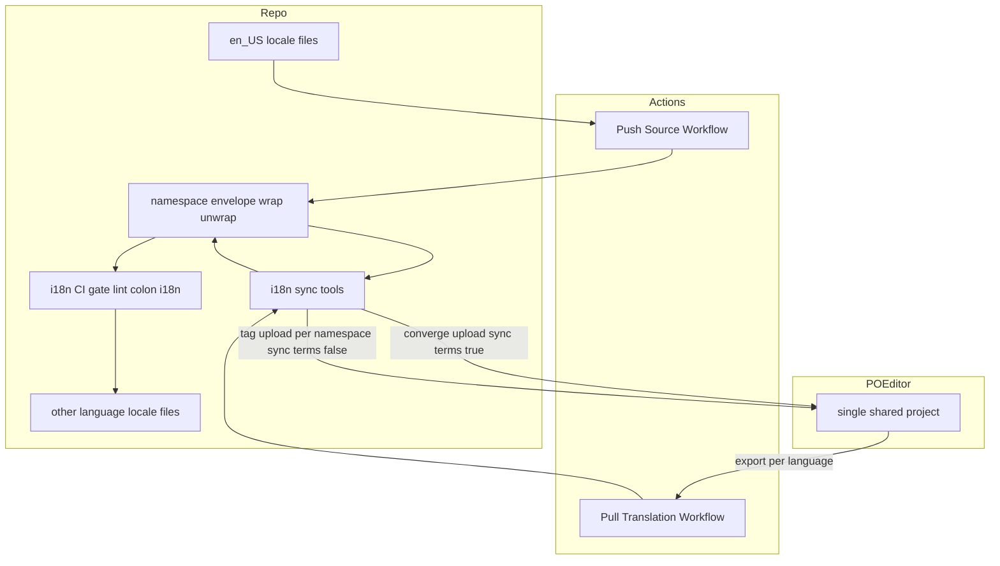
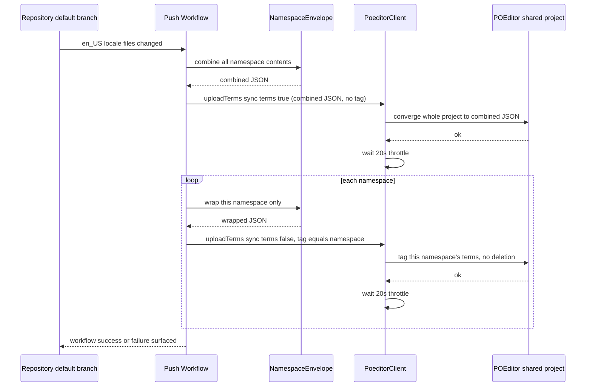
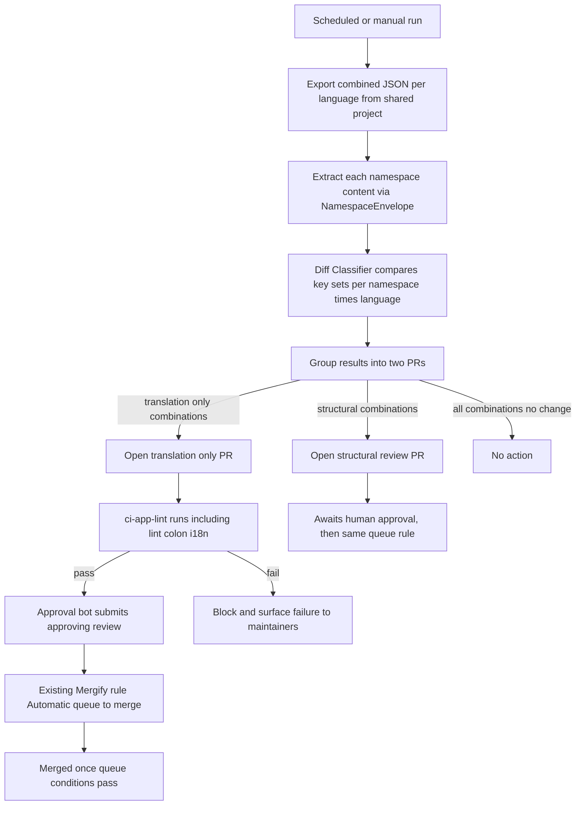

# Design Document

## Write / Don't-Write Test

このスペックの各セクションは、次の問いを基準に書く・書かないを判断する: **読み手がコードとテストファイルを読めば再構築できる内容か?**

| 書く | 書かない |
|---|---|
| 実際に調査しないと分からない事実(コードを軽く読んだだけでは分からない挙動、外部サービスの隠れた仕様) | 関数シグネチャ、ファイル配置図、「どのファイルに何があるか」 |
| 通常と違う設計を選んだ理由(**特に、試して却下した案とその理由**) | 素直な実装のありのままの説明 |
| 自動テストが**カバーできていない**残存ギャップ | どのテストが何をカバーしているかの列挙(スペック/テストファイルを読めば分かる) |
| コードから再構築できない手動検証手順(再現環境の作り方、確認すべき観点、合否を分ける閾値) | 差分の有無や実装時期などの時系列の記録 |

迷ったら書かない。コードから読み取れる内容をスペックに書くと、コードが変わった瞬間に静かに陳腐化し、ドキュメント全体の信頼性を落とす。

この基準は `design.md`/`research.md` などの**説明的な内容**に対するものであり、`requirements.md` の EARS 形式 Acceptance Criteria には適用しない。Acceptance Criteria は実装の説明ではなく、実装を測る**契約**である。

## Overview

GROWI は5言語の翻訳ファイルを `apps/app/public/static/locales/` に持つが、コミュニティが翻訳に貢献する導線が無い。本機能は、翻訳管理サービス POEditor を受け皿として接続し、(1) GitHub 操作なしで翻訳に参加できる導線、(2) リポジトリと POEditor 間の双方向同期、(3) 変更の種類（訳文更新か、キー構造の変更か）に応じたレビュー体制を実現する。

**Users**: GitHub アカウントを持たない翻訳ボランティア（POEditor 上で翻訳を投稿する）と、GROWI メンテナー（構造変更を伴う取り込みをレビューする）。

**Impact**: 現在の翻訳ファイルは手動の PR でのみ更新されている。本機能により、ソース言語（en_US）の変更が自動的に POEditor へ反映され、翻訳者が投稿した訳文のうち訳文のみの変更は既存の i18n CI ゲートを条件に自動でリポジトリへ反映される。

### Goals
- GitHub アカウント不要で翻訳に参加できる導線を確立する
- ソース言語（en_US）の変更を人手のコピーなしに POEditor へ反映する
- POEditor から取り込む変更を、訳文のみの変更（自動反映）とキー構造の変更（人レビュー必須）に機械的に分岐する
- 既存の i18n CI ゲート（`lint:i18n`）を、どちらの反映経路でも迂回しない
- 翻訳内容は引き続き git にコミットされたファイルのみから配信し、GROWI の実行時に POEditor への依存を作らない

### Non-Goals
- 翻訳そのものを埋める作業（本 spec は導線と同期の仕組みのみを扱う）
- `apps/app/resource/locales/`（markdown・メール ejs テンプレート）への対応
- i18next の namespace 再編、または Paraglide 等コンパイラ方式への移行（`.kiro/specs/i18n/roadmap.md` の未決事項として別途判断）
- 翻訳内容の品質保証・機械翻訳の導入
- GROWI 側で独自の翻訳進捗表示 UI を新設すること（POEditor 自体の画面を使う）

## Boundary Commitments

### This Spec Owns
- リポジトリの翻訳ファイル（`apps/app/public/static/locales/*/{admin,translation,commons}.json`）と単一の共有 POEditor プロジェクト間の双方向同期ロジック（push/pull それぞれの GitHub Actions ワークフローとその実装コード）
- 取り込む変更が「訳文のみ」か「キー構造の変更」かを判定するロジックと、それに応じた反映経路（自動反映 or 人レビュー必須の変更提案）の分岐
- POEditor 側のプロジェクト構成（全 namespace を単一の共有プロジェクトへ集約する）の決定と、単一プロジェクト内で namespace を区別する方法（JSON 構造での namespace ラップ、翻訳者向けの namespace タグ付け）
- GROWI のロケールコード（`en_US` 等）と POEditor が受け付ける言語コード（`en` 等）の対応付け
- 貢献者向けガイド文書の設置場所と内容

### Out of Boundary
- POEditor の OSS プラン申請そのもの（人手の手続き。本 spec は「承認されるまで本番運用を進めない」という条件だけを持つ）
- 翻訳の投稿・レビュー内容そのものの品質判断（POEditor 上のワークフローに委ねる）
- 既存の i18n CI ゲート（`apps/app/tools/i18n-audit/`）自体の変更。本機能はこのゲートを**呼び出す側**であり、ゲートの検出ロジックには一切手を入れない
- i18next の namespace 構成の変更。本機能は既存の3 namespace（`admin`/`translation`/`commons`）をそのまま同期単位として使う
- GROWI アプリケーション本体（`apps/app/src/`）のコード変更。本機能が触れるのは同期用ツール（`apps/app/tools/i18n-sync/`）と GitHub Actions ワークフローのみ

### Allowed Dependencies
- 既存の i18n CI ゲート（`pnpm run lint:i18n` / `apps/app/tools/i18n-audit/`）: 同期が取り込む変更の合否判定に使う。呼び出すだけで内部には依存しない
- POEditor API v2（`https://api.poeditor.com/v2/*`）: `projects/upload` / `projects/export` / `languages/list` を使う
- リポジトリの既存 CI 慣習（`paths:` トリガー、`concurrency` グループ、`secrets.*` によるトークン注入）
- `.github/mergify.yml` の既存ルール「Automatic queue to merge」（条件: `#approved-reviews-by >= 1` かつ変更要求レビューが無いこと）。**このルール自体は変更しない。** 人レビューなしで反映する経路は、このルールに乗せるために「PR作成者とは別のIDが承認レビューを送る」ことで実現する（GitHub は PR 作成者自身による自己承認を拒否するため）。もう一方の既存ルール「Automatic merge for Preparing next version」は `queue_rules` のCI条件（`ci-app-lint` 等）を経由しない direct merge であり、Requirement 3.4（CIゲートを迂回しない）に反するため使わない

### 承認ボットの必要性（新しい依存）
- 上記の「別ID承認」を実現するには、同期ワークフローの既定の `GITHUB_TOKEN` とは別に、レビュー承認を送れるボットID（GitHub App のインストールトークン、または専用ボットアカウントの PAT）が要る。これは本 spec が新たに用意する依存であり、`Security Considerations` に持ち越して扱う

### Revalidation Triggers
- `apps/app/public/static/locales/` の namespace 構成が変わる（分割・統合・ファイル名変更）→ `SyncConfig` の宣言、`namespace-envelope.ts` のラップ/アンラップ対象、両ワークフローのトリガーパスをすべて見直す必要がある
- POEditor が `projects/upload` の `tags` パラメータの仕様を変更する → namespace 単位のタグ付けを今の2段階アップロード（統合アップロード1回＋namespace ごとの非破壊的なタグ付けアップロード）で実現できなくなるため、タグ付け方式を再設計する必要がある
- namespace 単位ではなく機能単位（`comment`/`search`/`ai-agent` 等）のタグ付けを追加する場合 → キー→機能の対応表（未着手）を前提に、タグ付けアップロードの対象範囲（現在は namespace 単位）を機能単位へ広げる必要がある。既存の2段階構成はそのまま使えるため、この変更は追加であって設計のやり直しではない
- POEditor プロジェクトを複数に分ける判断がされた場合 → 単一プロジェクトを前提にした `NamespaceEnvelope` のラップ方式・タグ付け方式・`SHARED_POEDITOR_PROJECT_ID` の宣言を見直す必要がある
- i18next から Paraglide 等コンパイラ方式へ移行する（`.kiro/specs/i18n/roadmap.md` 未決事項2）→ 同期対象のファイル形式・POEditor のフォーマット指定（`type=i18next`）が成立しなくなるため、同期設定の作り直しが要る
- 既存の i18n CI ゲート（`apps/app/tools/i18n-audit/`）の検出ロジックが変わる → 自動反映経路が誤って通過/ブロックするようになっていないか再確認が要る
- `master` の branch protection / Mergify ルールが変わる → 「訳文のみの変更を人レビューなしで反映する」ための自動マージ機構が引き続き機能するか再確認が要る

## Architecture

### Existing Architecture Analysis
- 翻訳ファイルは `apps/app/public/static/locales/<lang>/{admin,translation,commons}.json` に5言語×3 namespace で存在し、実行時は `next-i18next` がこれをそのまま読み込む（`apps/app/config/next-i18next.config.mjs`）
- 既存の i18n CI ゲート（`i18n-key-audit` spec で実装済み）は `apps/app/tools/i18n-audit/run-audit.ts` が `i18next-cli status` を実行し、未使用キー・言語間欠損・存在しないキー参照を検出して `pnpm run lint:i18n`（`turbo run lint` の一部）で強制している。これは「pure function（判定ロジック）＋ 薄い I/O ラッパー」という構成を取っており、本機能もこのパターンを踏襲する
- リポジトリの GitHub Actions は `paths:` フィルタでトリガー範囲を絞り、`concurrency` グループで多重実行を防ぐ慣習がある
- `master` の branch protection は classic Required Reviews を使っておらず、Mergify アプリと merge queue に委ねている

### Architecture Pattern & Boundary Map

**Architecture Integration**:
- Selected pattern: 既存リポジトリを起点にした双方向 ETL（push = リポジトリ→POEditor、pull = POEditor→リポジトリ）。GitHub Actions を実行基盤とし、独立した常駐サービスは持たない
- Domain/feature boundaries: 単一の共有 POEditor プロジェクトが全 namespace の翻訳を保持する。namespace 間の区別は JSON 構造（`{namespace: content}`）とタグで表現し、プロジェクト境界では表現しない。これにより、namespace 間で意図的に重複しているキー（`commons.json` が `translation.json` から複製しているキーなど）も、1つのプロジェクトの中で互いを上書きせずに共存できる（`research.md` 参照）
- Existing patterns preserved: i18n CI ゲートの呼び出し方（`pnpm run lint:i18n`）、既存ツールの pure function 分離、GitHub Actions の `paths:`/`concurrency` 慣習
- New components rationale: POEditor という新しい外部システムとの通信・変更分類ロジックが必要なため、`apps/app/tools/i18n-sync/` を新設した。namespace の JSON ラップ/アンラップは `PoeditorClient`（POEditor API の抽象化）にも `PushSourceSync`/`PullTranslationSync`（同期オーケストレーション）にも属さない責務のため、独立した pure function モジュール（`namespace-envelope.ts`）として切り出した。ロケールコードの変換も同様に独立させている（`language-code-map.ts`）
- Steering compliance: Executors はマッピング（namespace↔ロケールファイルパス）を宣言データとして受け取り、ハードコードしない（`coding-style.md` の Executor パターン）。`namespace-envelope.ts`/`language-code-map.ts` は pure function（同 Pure Function Extraction パターン）
- 依存方向: `SyncConfig` → `PoeditorClient` → `PushSourceSync` / `PullTranslationSync` → GitHub Actions ワークフロー。`NamespaceEnvelope` と `LanguageCodeMap` はどこにも依存しない pure function で、2つのCLIだけが直接呼ぶ（`PoeditorClient` はこれらを参照しない）。逆方向の参照（ワークフローが `PoeditorClient` を直接呼ぶ、`PoeditorClient` が `SyncConfig` を書き換える等）は禁止

## File Structure Plan

同期ツール一式は `apps/app/tools/i18n-sync/` に集約し、既存の `apps/app/tools/i18n-audit/` と同じ実行方式（Node.js Native ESM の CLI + pure function モジュール）に揃えた。ワークフローは `.github/workflows/i18n-sync-push.yml` / `i18n-sync-pull.yml` の2本、貢献者向け・メンテナー向けの文書はそれぞれ `docs/i18n-community-translation.md` / `docs/i18n-community-translation-setup.md` に置く（`docs/` はこの機能で新設した）。ファイル単位の内訳は現在のディレクトリ構成をそのまま参照すること。

## System Flows

### Push: ソース言語の同期（Requirement 2）

- 統合アップロード（`syncTerms: true`）は1回のpush実行につき必ず1回だけ行う。`sync_terms` はプロジェクト全体を「今回アップロードしたファイルの内容」に収束させる操作なので、これを namespace ごとに分けて呼ぶと、後続の呼び出しが前の namespace のキーを「今回のファイルに無いキー」とみなして削除してしまう（`research.md` 参照）
- タグ付けアップロード（`syncTerms: false`）は namespace ごとに行い、削除を発生させずにタグだけを付与する。これにより翻訳者は共有プロジェクトの中を namespace で絞り込める
- アップロードは直列に実行し、POEditor の20秒レート制限を守るために呼び出し間隔を空ける
- いずれかの namespace ファイルが読み込めない場合、アップロードを一切行わずに中止する（プロジェクトが一部の namespace だけの状態へ収束してしまうことを避ける）。統合アップロードとタグ付けアップロードのいずれかが失敗した場合も、以降の呼び出しを中止する
- POEditor は GROWI のロケールコード（`en_US`）を受け付けないため、`LanguageCodeMap.toPoeditorLanguageCode` で POEditor の言語コード（`en`）へ変換してから `PoeditorClient` を呼ぶ。変換は API 呼び出しの直前だけで行い、ファイルパスの解決や namespace の処理は GROWI のロケールコードのまま扱う
- 統合アップロードは `overwrite: true` を明示して呼ぶ。POEditor 側の `overwrite` パラメータの既定値は 0（上書きしない）で、これを送らないと既存キーの文言変更が反映されない（`research.md` のDecision参照）

### Pull: 翻訳の取り込みと分岐（Requirement 3）

- export は namespace ごとではなく**言語ごとに1回**行う。単一の共有プロジェクトなので、1回の export で全 namespace を含む統合JSONが得られる。これを namespace ごとに分割してから分類する
- 判定基準: namespace×言語ごとに、取り込み前後のキー集合（ネストしたリーフパス）が完全一致すれば「訳文のみ」、1件でも増減があれば「構造変更」
- **PRの粒度（不変条件）**: 1回のpull実行で対象になる最大12通り（namespace3×非ソース言語4）の判定結果は、**必ず2本以下のPRに分ける**。「訳文のみ」の組み合わせは1本のPRにまとめ、「構造変更」の組み合わせは（本 spec では）別の1本のPRにまとめる。**同一PRの中に構造変更の組み合わせを1件でも含めてはならない。** これに違反すると、構造変更が人レビューを経ずに反映されてしまい Requirement 3.2 を破る
- 「訳文のみ」PRは人レビューを要求しないが、必ず PR を経由し既存の i18n CI ゲート（`ci-app-lint` が包含する `lint:i18n`）を通過させる。通過した場合のみ、PR作成者とは別のID（承認ボット、`Security Considerations`参照）が承認レビューを送り、既存の `.github/mergify.yml` の「Automatic queue to merge」ルール（`#approved-reviews-by >= 1`）にそのまま乗せる。ゲートに失敗した場合は承認を送らず、default branch には反映しない（Requirement 3.3, 3.4）
- 「構造変更」PRは通常の人レビュー待ちとし、承認ボットは関与しない。人が承認すれば同じ「Automatic queue to merge」ルールでキューに乗る
- POEditor の未翻訳キーは export 結果で空文字列 `""` として現れる（キー自体は省略されない）。この空文字列は「POEditor側で未翻訳（情報なし）」を意味するため、分類（追加・削除・変更のどれにも数えない）でも、実際にファイルへ書き込む内容の合成でも、既存の非空の値を上書きしないよう扱う。生の値をそのまま書き込むと、同じファイル内の別キーが実際に変更されただけで未翻訳キーが空文字列に上書きされる、より発見しにくい不具合になる（実装レビューで発見。`research.md` のDecision参照）

## Components and Interfaces

| Component | Domain/Layer | Intent | Req Coverage |
|-----------|--------------|--------|--------------|
| SyncConfig | Sync Tooling | 共有POEditorプロジェクトIDとnamespace↔ロケールファイルパスの宣言データ | 2.1, 6.1, 7.1 |
| NamespaceEnvelope | Sync Tooling | namespaceのJSONラップ/アンラップを行うpure function | 2.1, 2.2, 3.1, 9.1 |
| LanguageCodeMap | Sync Tooling | GROWIロケールコード→POEditor言語コードの対応表（pure function） | 10.1, 10.2 |
| PoeditorClient | Sync Tooling | POEditor API v2 の薄いラッパー（`sync_terms`/`tags` に対応） | 2.1, 3.1, 9.1 |
| DiffClassifier | Sync Tooling | 訳文のみ/構造変更を判定するpure function | 3.1, 3.2 |
| PushSourceSync | Sync Tooling | en_USを統合アップロード+namespace別タグ付けの2段階でpushするCLI | 2.1, 2.2, 2.3, 8.1, 9.1, 10.1 |
| PullTranslationSync | Sync Tooling | 言語ごとに統合exportし、namespaceへ分割して分類結果に応じて反映するCLI | 3.1, 3.2, 3.3, 3.4, 8.1, 10.1 |
| Contributor Guide | Docs | 貢献手順・進捗の見方の文書 | 1.3, 5.1, 5.2 |
| Operational Prerequisites | Ops（非コード） | OSSプラン申請、共有プロジェクトの作成、public join page有効化（いずれも1プロジェクト分で完結する） | 1.1, 1.2, 7.1, 7.2, 9.2 |

`Operational Prerequisites` は `docs/i18n-community-translation-setup.md` に手順として記録されている（対応する file path を持つ非コード成果物）。

各コンポーネントの入出力・型・エラー分類は実装（`apps/app/tools/i18n-sync/`）とそのテストファイルを参照。以下は実装だけでは読み取れない設計判断のみを記す。

- **SyncConfig**: 全 namespace が同期先とする単一の共有プロジェクトIDを持つ（namespace 単位のプロジェクトIDは持たない）。namespace名やプロジェクトIDはコード中にハードコードせず、宣言データとしてのみ持つ（`coding-style.md` の Executor パターンに準拠）
- **NamespaceEnvelope**: 該当 namespace のキーが存在しない、またはオブジェクトでない場合は例外ではなく空オブジェクトを返す（POEditor にまだその namespace の内容が無いことを表現するため）
- **LanguageCodeMap**: `en_US`（米国英語）には POEditor 公式の言語コード一覧にある `en-us`（English (US)）を使う。単なる `en` は POEditor 画面上でイギリス国旗アイコンが表示されるため使わない。変換は `PoeditorClient` を呼ぶ直前にのみ適用し、ファイルパスの解決や namespace の処理は GROWI のロケールコードのまま行う（変換を POEditor API 境界の直前だけに閉じる）
- **PoeditorClient**: API トークンは呼び出し元から注入される（`process.env.POEDITOR_API_TOKEN` を直接読まない。Config層が読み、Clientには値として渡す）。`syncTerms: false` のときは POEditor の `sync_terms` パラメータ自体を送らない（POEditor は値に関わらずパラメータの存在だけで削除を有効にするため、無効化はパラメータを送らないことで表す）。export はダウンロードURL取得までを行い、10分の有効期限内にファイル取得まで完了させる
- **DiffClassifier**: `classify`（何を報告するかの判定）と `mergeTranslations`（実際に書き込む内容を作る合成）を分離している。生の `after`（空文字列を含む）をそのまま書き込む実装は `classify` が正しくても、同じファイル内の別キーが変更された瞬間に未翻訳キーを上書きしてしまう不具合になることが実装レビューで判明したための分離（`research.md` 参照）。`filterToKnownKeys` は `seed-existing-translations.ts` が非ソース言語ファイルを en_US の既存キー集合へ絞り込むために使う（`sync_terms:false` でも新規term作成は防げないため。`research.md` のDecision参照）
- **PushSourceSync**: 3 namespace のいずれか1つでも読み込み・パースに失敗した場合、アップロードを一度も行わずに中止する（プロジェクトが一部の namespace だけの状態へ収束することを避ける）
- **PullTranslationSync**: 同じ差分に対して複数回実行しても、既存の未マージPRがあれば更新する（重複PRを作らない）

## Data Models

本機能はデータベースを持たない。唯一の永続構造は `SyncConfig`（上記）と、リポジトリ内の翻訳JSONファイルそのものである。

## Error Handling

### Error Strategy
- POEditor API呼び出しの失敗（レート制限・ネットワークエラー・不正リクエスト）は握りつぶさず、呼び出し元に伝播させる
- Push/Pullいずれも、POEditor API の呼び出しが1つ失敗した場合は残りを継続せず、ワークフロー全体を失敗として終了する（部分反映によるリポジトリとPOEditor間のドリフトを避ける）

### Error Categories and Responses
- **外部サービスエラー**（POEditor APIの4xx/5xx、レート制限）: ワークフローを失敗させ、GitHub Actionsの実行失敗として既存の通知経路（リポジトリの標準的なワークフロー失敗通知）に乗せる。新しい通知チャネルは作らない（Requirement 8.1 はこれで満たす）
- **既存i18n CIゲートの失敗**: 自動反映経路であってもPRを自動マージせず、失敗したチェックとして残す(Requirement 3.3)
- **統合アップロードの失敗**: 以降のタグ付けアップロードを行わず、ワークフローを失敗させる（POEditor側の内容が中途半端に更新された可能性はあるが、`sync_terms=1` は冪等なため再実行で正しい状態に収束する）
- **タグ付けアップロードの失敗**: 内容の同期（統合アップロード）はすでに成功しているため翻訳内容の正しさには影響しないが、これもワークフロー失敗として扱い、タグ付けが不完全なまま放置されないようにする
- **不正な形式のexportデータ**: `DiffClassifier`に渡す前段でJSONパースに失敗した場合、その言語に属する全namespaceの組み合わせをまとめてスキップ扱いとし、他の言語の処理は継続する(exportは読み取り専用でリポジトリを変更しないため、pushと異なり部分失敗の許容度が高い。1回のexportが全namespaceを含むため、スキップの単位も言語ごとになる)

### Monitoring
- 既存のGitHub Actions実行ログとワークフロー失敗通知に委ねる。本機能独自のログ基盤・アラートは新設しない

## Testing Strategy

自動テストの範囲・観点は各モジュールの `*.spec.ts`/`*.integ.ts` を参照。以下は実装・テストファイルからは読み取れない、実環境での手動検証観点のみを記す。

- POEditor の実プロジェクトに対する dry-run では、統合アップロードの `sync_terms=1` によるキー追加・削除が意図通り反映されること、namespace別のタグ付けが他namespaceの用語を削除しないことを、POEditor のプロジェクト画面上で目視確認する必要がある（レート制限・タグ表示の実際の挙動は自動テストのモックでは代替できない）
- POEditor プロジェクトの Fallback Language 設定は、テストプロジェクトでも本番と同じ値（未設定）にしてから検証すること。設定が違うと未翻訳キーの export 結果（空文字列 vs フォールバック言語の文言）が変わり、`DiffClassifier` の判定結果も変わる

## Security Considerations

- POEditor APIトークンは GitHub Actions の `secrets.POEDITOR_API_TOKEN` として注入し、コード・ログに平文で出力しない(`security.md`のSecret Management原則に準拠)
- 同期ワークフローに付与するGitHub側の権限(`contents: write` / `pull-requests: write`)は同期ジョブに必要な範囲に限定し、他のワークフロー権限を流用しない
- 「訳文のみ」PRを承認するボットID(専用GitHub Appのインストールトークン、または専用ボットアカウントのPAT)は、`secrets.I18N_SYNC_APPROVAL_TOKEN`のような専用シークレットとして注入し、他の用途と共有しない。このIDに付与する権限は「PRへの承認レビュー(pull-requests: write相当)」に限定し、`contents: write`のような書き込み権限は持たせない(承認だけができれば十分で、それ以上の権限は攻撃対象を広げるだけのため)
- POEditorから取り込む翻訳文字列はそのままJSONファイルへ書き込まれる。GROWI側での表示時のサニタイズは既存のi18next/Reactのレンダリング経路にすでに存在するため、本機能側で追加のサニタイズは行わない(Non-Goal)
