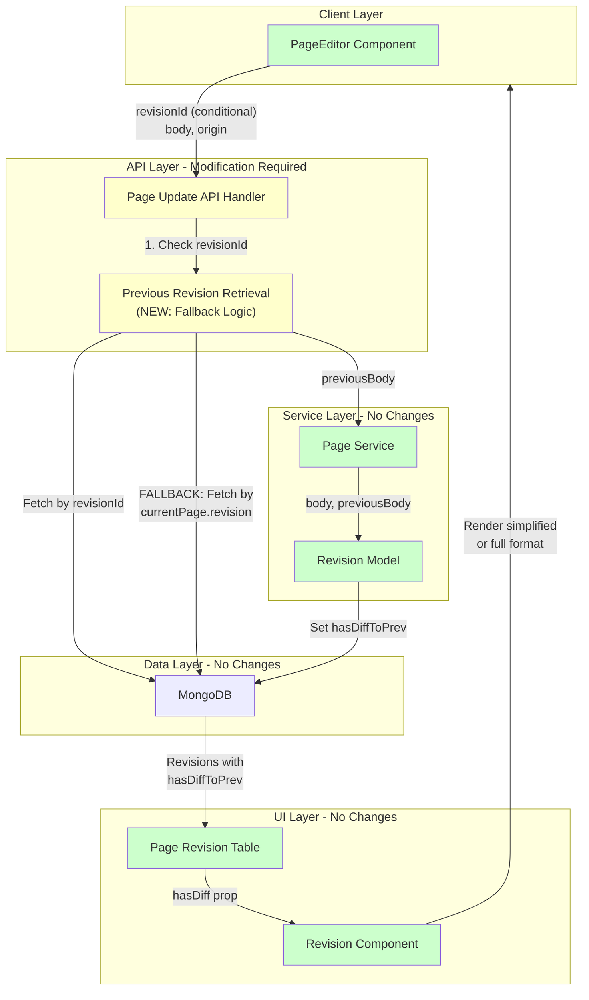
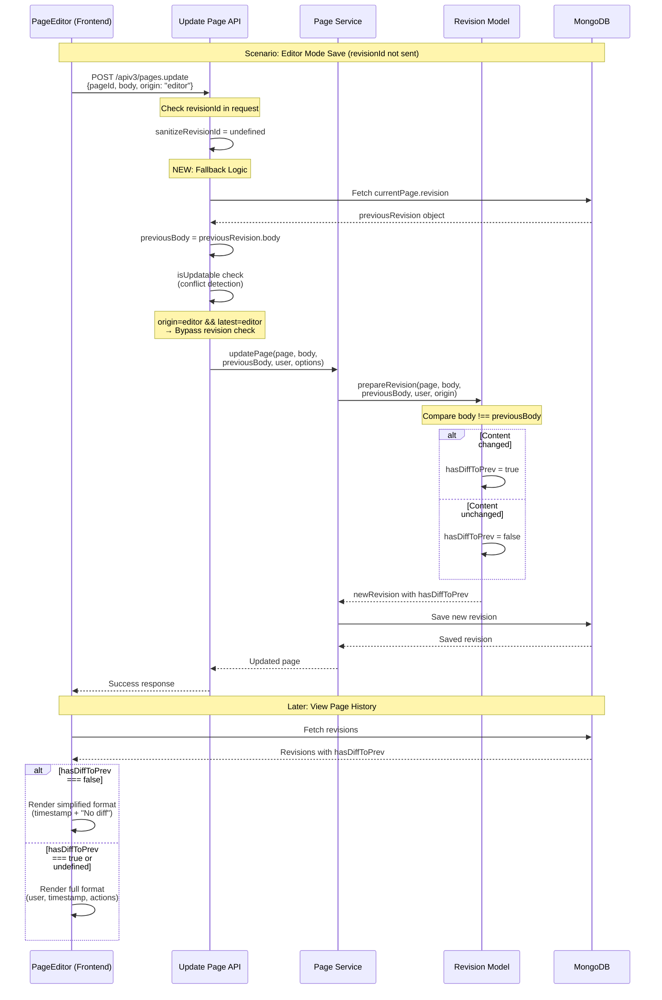
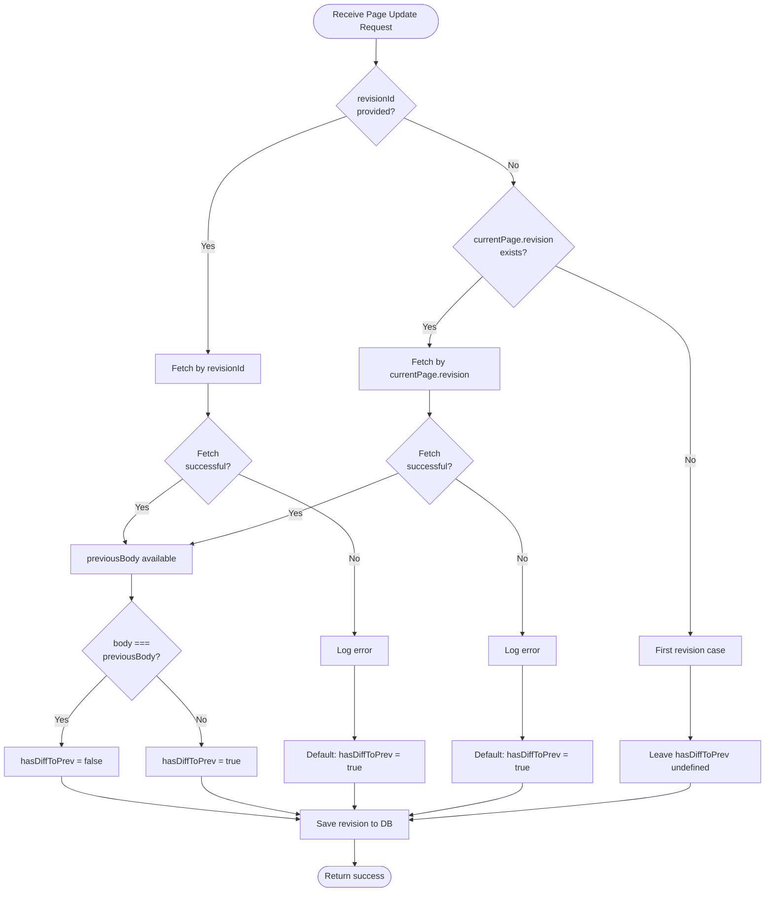

# Technical Design: Unchanged Revision Detection

## Overview

This feature restores accurate diff detection for page revisions by fixing broken data flow in the page save operation. When users save pages without making changes, these "unchanged revisions" will be visually distinguished in the page history through a simplified display format, reducing visual clutter and improving content navigation.

**Purpose**: Enable accurate detection and display of unchanged revisions to help users quickly identify meaningful content changes in page history.

**Users**: GROWI wiki users viewing page history will benefit from clearer visual distinction between revisions with actual content changes versus unchanged saves (e.g., accidental saves, permission changes, or metadata updates).

**Impact**: Fixes existing broken functionality by restoring the data flow that populates `hasDiffToPrev` field. The UI already implements simplified display for unchanged revisions but cannot function correctly because the field is not set. This fix requires minimal changes (2-3 files) to enable the complete feature.

### Goals

- Accurately detect unchanged revisions during page save operations
- Persist unchanged revision metadata (`hasDiffToPrev` field) to the database
- Enable simplified display of unchanged revisions in page history UI
- Maintain backward compatibility with existing revisions lacking metadata
- Preserve existing origin-based conflict detection semantics

### Non-Goals

- Modifying frontend revision ID logic (conflict detection works correctly)
- Migrating existing revisions to populate `hasDiffToPrev` retroactively
- Implementing hash-based comparison optimization (defer until performance data available)
- Changing UI rendering logic (already complete and functional)
- Client-side diff detection (security and consistency concerns)

## Architecture

### Existing Architecture Analysis

**Current State**:
- **Data Model**: `IRevision` interface includes `hasDiffToPrev?: boolean` field (defined, ready to use)
- **Business Logic**: `prepareRevision()` method implements comparison logic (`body !== previousBody`)
- **UI Components**: Simplified (`renderSimplifiedNodiff`) and full (`renderFull`) display formats implemented
- **API Layer**: Page Update API accepts `previousBody` parameter and passes to service layer

**Problem Identified**:
The data flow is broken at the API layer. When `revisionId` is not provided in the request (most common case in Editor mode), the API does not fetch the previous revision, resulting in `previousBody = null`. This prevents `prepareRevision()` from accurately setting `hasDiffToPrev`.

**Origin-Based Conflict Detection System**:
- **Two-stage check**: Frontend determines if `revisionId` is required based on latest revision's origin; Backend bypasses revision validation for collaborative editing scenarios
- **By design**: `revisionId` is omitted when latest revision has `origin=editor/view` and current save has `origin=editor` (Yjs collaborative editing)
- **Critical insight**: Conflict detection (revision check) and diff detection (hasDiffToPrev) serve different purposes and require separate logic

**Architectural Constraints**:
- Must preserve origin-based conflict detection logic (carefully designed for Yjs)
- Must maintain API backward compatibility (existing clients rely on current behavior)
- Must handle all save scenarios (Editor mode, View mode, API-based, legacy pages)

### Architecture Pattern & Boundary Map

**Selected Pattern**: Server-side Fallback with Separation of Concerns

**Architecture Integration**:
- **Pattern rationale**: Adds minimal fallback logic to API layer without modifying conflict detection or business logic layers
- **Domain boundaries**: API layer handles request processing and previous revision retrieval; Business logic layer (PageService) handles revision comparison; UI layer handles display formatting
- **Existing patterns preserved**: Origin-based conflict detection, service layer separation, data model structure
- **New component rationale**: No new components needed; extends existing API handler with fallback retrieval logic
- **Steering compliance**: Maintains layered architecture (API → Service → Model), preserves immutability principles, follows error handling patterns



**Key Design Decisions**:
- **Fallback priority**: Use provided `revisionId` if available (for conflict detection), otherwise fetch from `currentPage.revision` (for diff detection)
- **Error handling**: Default to `hasDiffToPrev: true` (assume changes) if previous revision cannot be retrieved
- **Frontend unchanged**: Preserves carefully designed origin-based conflict detection semantics

### Technology Stack

| Layer | Choice / Version | Role in Feature | Notes |
|-------|------------------|-----------------|-------|
| Backend / API | Express.js (existing) | API route handler modification | Add fallback logic to update-page handler |
| Backend / Services | PageService (existing) | Business logic layer | No changes required, already accepts previousBody |
| Backend / Models | Mongoose (existing) | Revision model and prepareRevision | No changes required, comparison logic exists |
| Data / Storage | MongoDB (existing) | Revision document storage | No schema changes, field already defined |
| Frontend / UI | React (existing) | Page history display components | No changes required, UI already implemented |

**Dependencies**:
- All dependencies are existing and validated
- No new external libraries required
- No version upgrades needed

## System Flows

### Page Save Flow with Unchanged Revision Detection

This sequence diagram shows the complete flow from page save initiation to diff detection and storage.



**Flow-level Decisions**:
- **Fallback trigger**: Activates only when `revisionId` is undefined (no impact on API saves or legacy pages)
- **Conflict check order**: Performed before diff detection to maintain existing conflict prevention behavior
- **Error handling**: If previousRevision fetch fails, defaults to `hasDiffToPrev: true` with error logging

### Edge Case Handling Flow



**Edge Case Decisions**:
- **First revision**: Leave `hasDiffToPrev` undefined (matches existing behavior, no previous content to compare)
- **Fetch failure**: Log error and default to `true` (conservative assumption, save operation continues)
- **Corrupted data**: Handled by defensive null checks throughout the flow

## Requirements Traceability

| Requirement | Summary | Components | Interfaces | Flows |
|-------------|---------|------------|------------|-------|
| 1.1 | Retrieve previous revision for comparison | Update Page API (RevisionRetrieval) | Mongoose findById | Page Save Flow |
| 1.2 | Determine if content is identical | Revision Model (prepareRevision) | String comparison | Page Save Flow |
| 1.3 | Mark revision with hasDiffToPrev: false when identical | Revision Model (prepareRevision) | IRevision.hasDiffToPrev | Page Save Flow |
| 1.4 | Mark revision with hasDiffToPrev: true when different | Revision Model (prepareRevision) | IRevision.hasDiffToPrev | Page Save Flow |
| 1.5 | Default to hasDiffToPrev: true on retrieval failure | Update Page API (error handling) | Error logging | Edge Case Flow |
| 2.1 | Persist hasDiffToPrev field to database | Revision Model | MongoDB schema | Page Save Flow |
| 2.2 | Include hasDiffToPrev in API responses | Page Revisions API (existing) | API response serialization | (No changes) |
| 2.3 | Support boolean or undefined type | IRevision interface (existing) | TypeScript type definition | (No changes) |
| 3.1 | Check hasDiffToPrev field value | Revision Component (existing) | React props | (No changes) |
| 3.2 | Render simplified format when false | Revision Component (existing) | renderSimplifiedNodiff | (No changes) |
| 3.3 | Render full format when true/undefined | Revision Component (existing) | renderFull | (No changes) |
| 3.4 | Use smaller visual space for simplified format | Revision Component (existing) | CSS styling | (No changes) |
| 4.1 | Frontend includes revisionId when required | PageEditor (existing) | isRevisionIdRequiredForPageUpdate | (No changes) |
| 4.2 | Include revisionId in saveWithShortcut | PageEditor (existing) | Conditional logic | (No changes) |
| 4.3 | Enforce revisionId requirement | isUpdatable method (existing) | Conflict detection | (No changes) |
| 5.1 | Treat undefined as hasDiffToPrev: true | PageRevisionTable (existing) | hasDiff !== false check | (No changes) |
| 5.2 | Render both old and new revisions correctly | Revision Component (existing) | Conditional rendering | (No changes) |
| 5.3 | No database migration required | (Design decision) | Optional field type | (No schema changes) |
| 6.1 | Set hasDiffToPrev: true when previousBody is null | prepareRevision (existing logic) | String comparison | Page Save Flow |
| 6.2 | Log error and set hasDiffToPrev: true on fetch failure | Update Page API (new error handling) | Error logging | Edge Case Flow |
| 6.3 | Leave hasDiffToPrev undefined for first revision | prepareRevision (existing logic) | pageData.revision check | Edge Case Flow |
| 6.4 | Normalize line endings before comparison | Revision Model (existing) | body getter | (No changes) |

**Coverage Summary**: All 24 acceptance criteria (across 6 requirements) are addressed. 18 criteria require no changes (infrastructure already exists). 6 criteria require modifications to the Update Page API and error handling logic.

## Components and Interfaces

**Component Summary**:

| Component | Domain/Layer | Intent | Req Coverage | Key Dependencies | Contracts |
|-----------|--------------|--------|--------------|------------------|-----------|
| Page Update API Handler | API Layer | HTTP request handling and previous revision retrieval with fallback | 1.1, 1.5, 6.2 | Page Model (P0), Revision Model (P0), Page Service (P0) | API |
| Revision Retrieval Logic | API Layer | Fetch previous revision with priority-based fallback | 1.1, 1.5 | Revision Model (P0) | Service |
| Page Service | Service Layer | Business logic for page updates | None (existing) | Revision Model (P0) | Service |
| Revision Model | Model Layer | Data model and prepareRevision logic | 1.2, 1.3, 1.4, 2.1, 6.1, 6.3, 6.4 | MongoDB (P0) | Service, State |
| Page Revision Table | UI Layer | Display page history with revision list | 3.1, 5.1, 5.2 | Revision API (P0) | State |
| Revision Component | UI Layer | Render individual revision (simplified or full) | 3.2, 3.3, 3.4 | None | None |

**Note**: Only components requiring modification are detailed below. UI components and existing business logic components require no changes.

### API Layer

#### Page Update API Handler

| Field | Detail |
|-------|--------|
| Intent | Process page update requests and ensure previousBody is available for diff detection |
| Requirements | 1.1, 1.5, 6.2 |
| File | `apps/app/src/server/routes/apiv3/page/update-page.ts` (lines 198-326) |

**Responsibilities & Constraints**:
- Retrieve previous revision using priority-based fallback logic
- Pass previousBody to Page Service for revision creation
- Handle errors gracefully without blocking save operations
- Maintain backward compatibility with existing API clients

**Dependencies**:
- **Inbound**: PageEditor component → HTTP POST request (Criticality: P0)
- **Outbound**: Revision Model → findById() for previous revision retrieval (Criticality: P0)
- **Outbound**: Page Service → updatePage() for business logic execution (Criticality: P0)
- **Outbound**: Logger → error logging for observability (Criticality: P1)

**Contracts**: API [X] Service [ ] Event [ ] Batch [ ] State [ ]

##### API Contract

| Method | Endpoint | Request | Response | Errors |
|--------|----------|---------|----------|--------|
| POST | /apiv3/pages.update | `IApiv3PageUpdateParams` | `{ page: IPage, revision: IRevision }` | 400 (validation), 409 (conflict), 500 (server error) |

**Request Schema** (no changes to existing):
```typescript
interface IApiv3PageUpdateParams {
  pageId: string;
  revisionId?: string;  // Optional, may be undefined
  body: string;
  origin?: Origin;
  grant?: PageGrant;
  // ... other fields
}
```

**Implementation Notes**:
- **Integration**: Modify lines 301-308 to add fallback logic after existing revisionId-based fetch
- **Validation**: Existing validation middleware handles request parameter validation
- **Risks**: Additional database query when revisionId is undefined (mitigated by indexed lookup on _id field)

**Modified Logic** (pseudo-code):
```typescript
// Priority 1: Use provided revisionId (for conflict detection)
let previousRevision: IRevisionHasId | null = null;
if (sanitizeRevisionId != null) {
  try {
    previousRevision = await Revision.findById(sanitizeRevisionId);
  } catch (error) {
    logger.error('Failed to fetch previousRevision by revisionId', {
      revisionId: sanitizeRevisionId,
      error
    });
  }
}

// Priority 2: Fallback to currentPage.revision (for diff detection)
if (previousRevision == null && currentPage.revision != null) {
  try {
    previousRevision = await Revision.findById(currentPage.revision);
  } catch (error) {
    logger.error('Failed to fetch previousRevision by currentPage.revision', {
      pageId: currentPage._id,
      revisionId: currentPage.revision,
      error
    });
  }
}

// Priority 3: Default behavior (first revision or error case)
const previousBody = previousRevision?.body ?? null;

// Continue with existing logic
updatedPage = await crowi.pageService.updatePage(
  currentPage,
  body,
  previousBody,
  req.user,
  options,
);
```

### Model Layer

#### Revision Model (prepareRevision Method)

| Field | Detail |
|-------|--------|
| Intent | Create new revision with accurate hasDiffToPrev metadata |
| Requirements | 1.2, 1.3, 1.4, 2.1, 6.1, 6.3, 6.4 |
| File | `apps/app/src/server/models/revision.ts` (lines 84-112) |

**Responsibilities & Constraints**:
- Compare new body with previous body to determine diff status
- Set `hasDiffToPrev` field based on comparison result
- Handle first revision case (no previous revision) by leaving field undefined
- Normalize line endings automatically via body getter

**Dependencies**:
- **Inbound**: Page Service → prepareRevision() call (Criticality: P0)
- **Outbound**: MongoDB → document creation and persistence (Criticality: P0)

**Contracts**: Service [X] API [ ] Event [ ] State [X]

##### Service Interface

```typescript
interface IRevisionModel {
  prepareRevision(
    pageData: PageDocument,
    body: string,
    previousBody: string | null,
    user: HasObjectId,
    origin?: Origin,
    options?: { format: string }
  ): IRevisionDocument;
}
```

**Preconditions**:
- `user._id` must not be null
- `pageData._id` must not be null
- `body` must be a string (may be empty)
- `previousBody` may be null (first revision or fetch failure)

**Postconditions**:
- Returns new revision document with all required fields
- `hasDiffToPrev` field is set based on comparison or left undefined
- Line endings in body are normalized (CR/CRLF → LF)

**Invariants**:
- When `pageData.revision != null`, `hasDiffToPrev` must be a boolean
- When `pageData.revision == null`, `hasDiffToPrev` must be undefined
- Line ending normalization is always applied before comparison

##### State Management

**State model**: Mongoose document representing a revision with comparison metadata

**Persistence & consistency**:
- Document saved as part of page update transaction
- `hasDiffToPrev` field persisted alongside body, author, and timestamp
- Optional field supports gradual migration (undefined for old revisions)

**Concurrency strategy**: None required (revision creation is sequential per page update)

**Implementation Notes**:
- **Integration**: Existing implementation is correct; no code changes required
- **Validation**: Defensive checks already present for null values (lines 93-98, 106)
- **Risks**: None identified; comparison logic is straightforward and tested in existing scenarios

**Current Implementation** (no changes needed):
```typescript
const prepareRevision: PrepareRevision = function (
  this: IRevisionModel,
  pageData,
  body,
  previousBody,
  user,
  origin,
  options = { format: 'markdown' },
) {
  // Validation checks
  if (user._id == null) {
    throw new Error('user should have _id');
  }
  if (pageData._id == null) {
    throw new Error('pageData should have _id');
  }

  const newRevision = new this();
  newRevision.pageId = pageData._id;
  newRevision.body = body;
  newRevision.format = options.format;
  newRevision.author = user._id;
  newRevision.origin = origin;

  // Diff detection (existing logic handles all edge cases correctly)
  if (pageData.revision != null) {
    newRevision.hasDiffToPrev = body !== previousBody;
  }

  return newRevision;
};
```

## Data Models

### Domain Model

**Existing Model** (no changes):

The Revision aggregate is already well-defined with clear boundaries:
- **Aggregate Root**: Revision (contains all revision-specific data)
- **Value Objects**: body (content), format (content type), origin (save source)
- **Domain Event**: Revision creation triggers page update event
- **Business Rules**:
  - Every revision must have an author
  - Every revision belongs to exactly one page
  - First revision has undefined `hasDiffToPrev`
  - Subsequent revisions have boolean `hasDiffToPrev` based on content comparison

**Transactional Boundary**: Revision creation is part of page update transaction

**Invariants**:
- Body content must be a string (may be empty)
- Line endings are normalized to LF
- `hasDiffToPrev` is undefined for first revision, boolean for subsequent revisions

### Logical Data Model

**Structure** (existing schema, no changes):

```typescript
interface IRevision {
  pageId: Ref<IPage>;           // Foreign key to page
  body: string;                 // Content (line-ending normalized)
  author: Ref<IUser>;           // Foreign key to user
  format: string;               // Content format (default: "markdown")
  hasDiffToPrev?: boolean;      // Diff status (optional for backward compatibility)
  origin?: Origin;              // Save source ("view" | "editor" | undefined)
  createdAt: Date;              // Timestamp
  updatedAt: Date;              // Timestamp
}
```

**Consistency & Integrity**:
- **Referential integrity**: pageId and author reference valid documents
- **Cascading rules**: Revisions deleted when page is permanently deleted
- **Temporal aspects**: createdAt is immutable, updatedAt is timestamp-only (no content updates)

### Physical Data Model

**MongoDB Collection**: `revisions`

**Indexes** (existing, no changes):
- Primary key: `_id` (ObjectId, auto-indexed)
- Page query: `pageId` (indexed for page history retrieval)

**Document Structure** (existing schema, unchanged):
```javascript
{
  pageId: { type: Schema.Types.ObjectId, ref: 'Page', required: true, index: true },
  body: { type: String, required: true, get: normalizeLineEndings },
  format: { type: String, default: 'markdown' },
  author: { type: Schema.Types.ObjectId, ref: 'User' },
  hasDiffToPrev: { type: Boolean },  // Optional field
  origin: { type: String, enum: ['view', 'editor'] },
  // timestamps: true (createdAt, updatedAt)
}
```

**Performance Considerations**:
- `_id` index enables fast previousRevision lookup (O(log n))
- `pageId` index enables efficient page history queries
- Optional `hasDiffToPrev` field adds negligible storage overhead (1 byte per document)

## Error Handling

### Error Strategy

**Philosophy**: Save operations should never fail due to diff detection errors. Metadata calculation is best-effort; missing or incorrect metadata is acceptable, but losing user edits is not.

**Recovery Mechanism**: Default to `hasDiffToPrev: true` (assume changes) when errors occur, ensuring revisions display in full format rather than being hidden.

### Error Categories and Responses

**System Errors (5xx) - Infrastructure Failures**:

| Error Scenario | Cause | Response | Recovery |
|----------------|-------|----------|----------|
| Database connection failure | Network issue, DB down | Log error, default `hasDiffToPrev: true`, continue save | Monitor DB health, alert on connection failures |
| Revision fetch timeout | Slow query, overload | Log warning with query time, default to true | Monitor query performance, add query timeout |
| MongoDB query error | Corrupted index, disk full | Log error with full stack trace, default to true | DB maintenance alerts, capacity monitoring |

**Data Errors - Unexpected State**:

| Error Scenario | Cause | Response | Recovery |
|----------------|-------|----------|----------|
| Previous revision not found | Deleted, corrupted data | Log warning with missing ID, default to true | Data integrity checks, backup validation |
| Revision body is null/undefined | Data corruption | Log error, treat as different (true) | Database consistency checks |
| currentPage.revision is invalid | Race condition, corruption | Log error, leave hasDiffToPrev undefined | Investigate concurrency issues |

**Business Logic Errors - Edge Cases**:

| Error Scenario | Cause | Response | Recovery |
|----------------|-------|----------|----------|
| First revision (no previous) | Normal case | Leave hasDiffToPrev undefined | (Expected behavior, no error) |
| Body comparison throws exception | Unexpected data type | Log error, default to true | Add defensive type checks |

**Error Handling Implementation**:

```typescript
// API Layer Error Handling
let previousRevision: IRevisionHasId | null = null;

// Priority 1: Fetch by revisionId
if (sanitizeRevisionId != null) {
  try {
    previousRevision = await Revision.findById(sanitizeRevisionId);
  } catch (error) {
    logger.error('Failed to fetch previousRevision by revisionId', {
      revisionId: sanitizeRevisionId,
      pageId: currentPage._id,
      error: error.message,
      stack: error.stack
    });
    // Continue with null (will default to hasDiffToPrev: true)
  }
}

// Priority 2: Fallback to currentPage.revision
if (previousRevision == null && currentPage.revision != null) {
  try {
    previousRevision = await Revision.findById(currentPage.revision);
  } catch (error) {
    logger.error('Failed to fetch previousRevision by currentPage.revision', {
      pageId: currentPage._id,
      revisionId: currentPage.revision,
      error: error.message,
      stack: error.stack
    });
    // Continue with null (will default to hasDiffToPrev: true)
  }
}

// Model Layer (existing defensive checks)
if (pageData.revision != null) {
  try {
    newRevision.hasDiffToPrev = body !== previousBody;
  } catch (error) {
    logger.error('Comparison failed in prepareRevision', {
      pageId: pageData._id,
      bodyLength: body?.length,
      previousBodyLength: previousBody?.length,
      error: error.message
    });
    newRevision.hasDiffToPrev = true;  // Default to true on error
  }
}
```

### Monitoring

**Metrics to Track**:
- `revision.diff_detection.fetch_errors` - Count of previousRevision fetch failures
- `revision.diff_detection.comparison_time_ms` - Histogram of comparison execution time
- `revision.diff_detection.large_body_count` - Count of bodies > 100KB
- `revision.diff_detection.unchanged_count` - Count of revisions with hasDiffToPrev: false

**Logging Requirements**:
- **ERROR level**: Database fetch failures, comparison exceptions
- **WARN level**: Comparison time > 10ms, body size > 100KB
- **INFO level**: Fallback logic activated (revisionId not provided)

**Alerting Thresholds**:
- Alert if error rate > 1% of total saves
- Alert if P95 comparison time > 50ms
- Alert if database fetch failures > 10/minute

**Health Check Integration**:
- No specific health check needed (save operation health is existing metric)
- Monitor overall save operation success rate

## Testing Strategy

### Unit Tests

**Revision Model - prepareRevision Method**:
1. Test `hasDiffToPrev = false` when body matches previousBody exactly
2. Test `hasDiffToPrev = true` when body differs from previousBody
3. Test `hasDiffToPrev = true` when previousBody is null (fetch failure case)
4. Test `hasDiffToPrev` is undefined when pageData.revision is null (first revision)
5. Test line ending normalization (CRLF → LF) before comparison

**API Layer - Previous Revision Retrieval**:
1. Test revisionId provided → fetch by revisionId
2. Test revisionId undefined + currentPage.revision exists → fetch by currentPage.revision
3. Test revisionId undefined + currentPage.revision null → previousBody is null
4. Test fetch failure → error logged, previousBody is null
5. Test both fetch attempts fail → error logged twice, previousBody is null

### Integration Tests

**Page Update Flow - All Origin Scenarios**:
1. Test Editor mode save (origin=editor, latest revision origin=editor) → revisionId not sent, fallback activates, hasDiffToPrev set correctly
2. Test Editor mode save (origin=editor, latest revision origin=undefined) → revisionId sent, no fallback, hasDiffToPrev set correctly
3. Test API save (origin=undefined) → revisionId sent, no fallback, hasDiffToPrev set correctly
4. Test View mode save (origin=view) → revisionId sent or not depending on latest origin, hasDiffToPrev set correctly

**Error Scenarios**:
1. Test previousRevision fetch fails → save succeeds with hasDiffToPrev: true
2. Test database connection error during fetch → save succeeds with hasDiffToPrev: true
3. Test corrupted currentPage.revision ID → save succeeds with hasDiffToPrev undefined

**Backward Compatibility**:
1. Test existing revisions without hasDiffToPrev display correctly (full format)
2. Test mixed history (old + new revisions) displays correctly
3. Test API clients that don't send revisionId still work

### E2E/UI Tests

**Page History Display**:
1. User saves page without changes → revision appears in simplified format
2. User saves page with changes → revision appears in full format
3. User views history with mix of changed/unchanged revisions → correct formats displayed
4. User saves multiple unchanged revisions in a row → all display in simplified format

**Collaborative Editing (Yjs)**:
1. Multiple users edit simultaneously → saves succeed without conflicts
2. Unchanged saves during collaborative editing → display in simplified format
3. Changed saves during collaborative editing → display in full format

### Performance/Load Tests

**Comparison Performance**:
1. Test comparison time for small pages (< 10KB) → verify < 1ms
2. Test comparison time for large pages (100KB - 1MB) → verify < 10ms
3. Test comparison time for very large pages (> 1MB) → verify < 50ms or implement size-based skip
4. Test memory usage during high-concurrency saves (100 simultaneous) → verify no memory leaks

**Database Query Performance**:
1. Test previousRevision fetch time → verify < 5ms (indexed lookup)
2. Test fallback query performance under load → verify no contention
3. Test page save throughput with diff detection → verify no significant regression vs. baseline

## Optional Sections

### Performance & Scalability

**Target Metrics**:
- Comparison time P95 < 10ms for typical pages (< 50KB)
- Comparison time P99 < 50ms for all pages
- No more than 5% increase in save operation latency
- Memory overhead < 50MB for 100 concurrent saves

**Optimization Strategies**:

**Phase 1: Simple Implementation with Monitoring** (current design):
- Implement string comparison as-is
- Add performance logging for comparison time > 10ms
- Monitor metrics in production for 2-4 weeks

**Phase 2: Size-Based Optimization** (if metrics show issues):
```typescript
const MAX_BODY_SIZE_FOR_DIFF_CHECK = 100_000; // 100KB

if (body.length > MAX_BODY_SIZE_FOR_DIFF_CHECK ||
    previousBody.length > MAX_BODY_SIZE_FOR_DIFF_CHECK) {
  // Skip comparison for very large pages
  logger.info('Skipped diff check for large page', {
    bodyLength: body.length,
    previousBodyLength: previousBody.length
  });
  newRevision.hasDiffToPrev = true;  // Default to true
} else {
  newRevision.hasDiffToPrev = body !== previousBody;
}
```

**Phase 3: Hash-Based Comparison** (if size-based optimization insufficient):
- Add `bodyHash` field to Revision schema (SHA-256 of body)
- Compare hashes instead of full bodies (O(1) vs O(n))
- Requires migration to populate hashes for existing revisions
- Deferred until proven necessary by real-world metrics

**Caching Considerations**:
- Current page's latest revision could be cached in memory
- Benefit: Avoid database query for fallback case
- Trade-off: Cache invalidation complexity, memory overhead
- Decision: Defer until profiling shows database query is bottleneck

**Scaling Approach**:
- Horizontal scaling: No changes needed (stateless API handler)
- Vertical scaling: Additional memory for concurrent saves (minimal impact)
- Database scaling: Indexed queries scale well, no hotspot concerns

### Migration Strategy

**No Migration Required**:
- `hasDiffToPrev` field is optional in the schema
- Existing revisions without the field are treated as "has changes" (true) by UI
- New revisions will have the field populated going forward
- No database migration script needed
- No downtime required for deployment

**Gradual Rollout Plan**:

**Phase 1: Deploy with Feature Flag** (Week 1):
- Deploy code to production with feature flag disabled
- Verify deployment stability and no regressions
- Monitor system metrics (save latency, error rates)

**Phase 2: Enable for Internal Testing** (Week 2):
- Enable feature flag for internal users/test pages
- Verify diff detection works correctly across all scenarios
- Collect performance metrics from real usage
- Validate error handling and fallback logic

**Phase 3: Gradual Rollout** (Week 3-4):
- Enable for 10% of users, monitor for 48 hours
- Increase to 50% of users, monitor for 48 hours
- Enable for 100% of users if no issues detected

**Rollback Plan**:
- Feature flag can be disabled instantly if issues detected
- No data corruption risk (field is optional and ignored when not set)
- UI continues to function normally without field (treats all as "has changes")

**Monitoring During Rollout**:
- Alert on error rate increase > 0.5%
- Alert on save latency P95 increase > 10%
- Monitor "unchanged revision" display in page history
- Verify no user complaints about save operation failures
