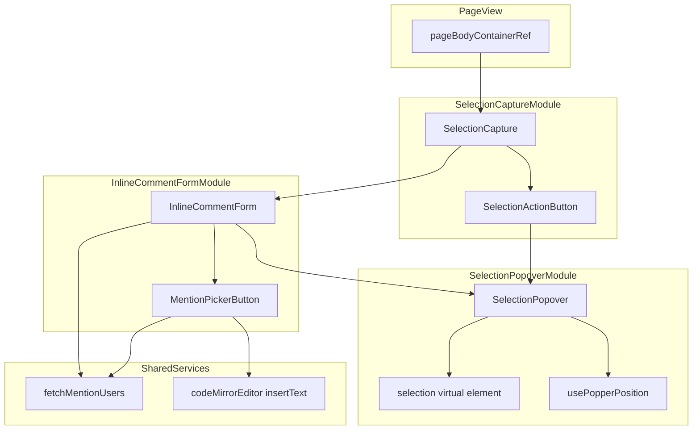
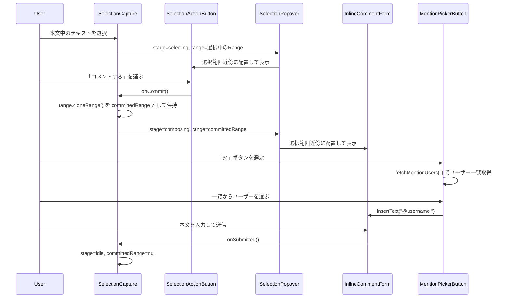
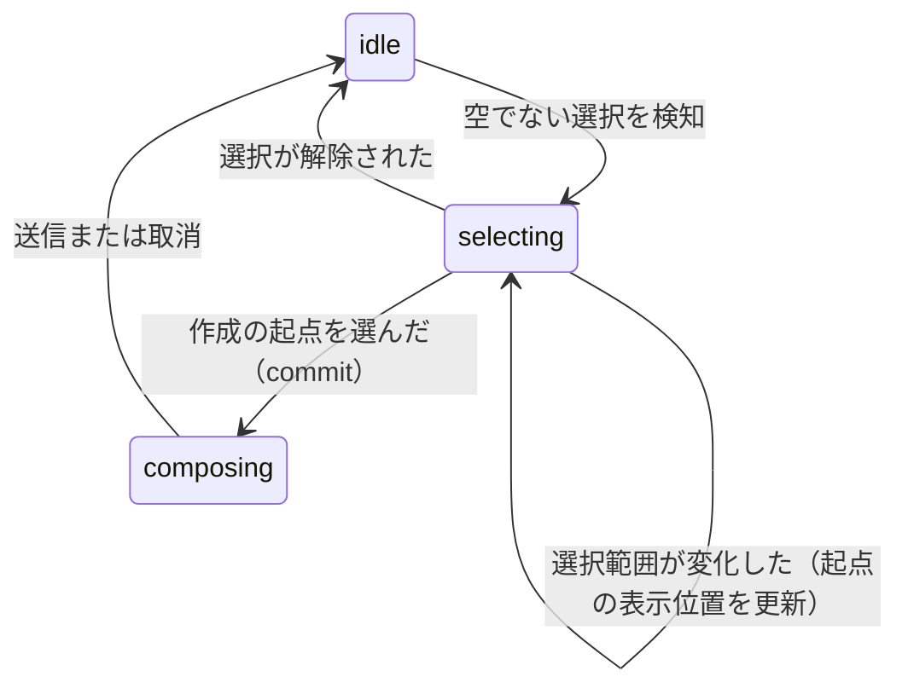

# Design Document

## Overview

**Purpose**: 実装済みの`inline-comment`機能（本文テキスト選択によるコメント作成）のうち、選択してから送信するまでの操作の見た目と流れを、ユーザー提供のUIモックアップ4枚（`assets/01-selection-popup.png`〜`assets/04-comments-list-inline-comment.png`）に沿って作り込む。

**Users**: ページ閲覧者・編集者が、本文テキストを選択してインラインコメントを作成する際に使う。

**Impact**: `apps/app/src/features/inline-comment/client/components/SelectionCapture/`と`InlineCommentForm/`の表示・操作フローを差し替える。`PageView.tsx`側の配線（`<SelectionCapture containerRef pageId anchorOriginRevisionId />`の呼び出し方）は変更しない——`SelectionCapture`の外部インターフェース（props）は今回の変更で変わらないため。サーバー側（apiv3ルート、`InlineCommentService`、Prisma/Mongooseモデル）・アンカー計算/再アンカリングロジック（`use-text-selection.ts`、`quote-matcher.ts`、`useAnchorResolver`）・返信/解決管理・メンション通知経路には一切手を入れない。

### Goals
- テキスト選択直後は軽量な作成の起点（ボタン）のみを表示し、選択解除で消える（Requirement 1）
- 作成の起点を選んだときだけ入力フォームへ展開する（Requirement 2）
- 入力フォーム内に、`@`タイプ補完とは別の明示的なメンション相手選択ボタンを追加する（Requirement 3）
- 作成の起点・入力フォームを選択範囲の近くに表示する（Requirement 4）

### Non-Goals
- アンカー（クオート・前後文脈・おおよその位置）の計算・保存方式や、本文編集後の再アンカリングロジックの変更（`inline-comment` spec のまま）
- 返信作成・解決/未解決管理・メンション通知の送信経路の変更
- 共有リンク閲覧者への非公開化「の仕組み自体」の変更（既存ガードに引き続き乗るだけ）
- メンション一覧内でのインクリメンタル検索（一覧からの選択のみを対象とする）
- フォーム展開後に選択し直した場合のアンカー更新（既存の`inline-comment` spec Implementation Notes記載の既知の未対応事項であり、本amendの対象外）

## Boundary Commitments

### This Spec Owns
- 選択直後の軽量な作成起点（ポップアップボタン）の表示・選択追随・消去（`SelectionCapture`内部の状態遷移）
- 作成起点から入力フォームへの展開・入力フォームのクローズ（送信/キャンセル時）というUI状態遷移
- 作成起点・入力フォームを選択範囲近傍に配置するための新規汎用コンポーネント（`SelectionPopover`）とその位置計算ロジック
- 入力フォーム内の明示的なメンション選択ボタン（`MentionPickerButton`）と、`inline-comment`機能内で閉じたメンション候補取得の共通化

### Out of Boundary
- クオート・前後文脈・おおよその位置の計算/保存（`use-text-selection.ts`の`captureSelection`本体、`InlineCommentService`）
- 再アンカリング・あいまい一致（`quote-matcher.ts`、`useAnchorResolver`、`InlineCommentHighlight`）
- 返信作成・解決/未解決トグル（`InlineCommentList`/`InlineCommentReplies`、`inline-comments/:id/replies`・`resolve`エンドポイント）
- メンション通知の送信（`prepareMentionNotifications`、`InlineCommentService`）
- 共有リンク非公開化の判定ロジック自体（`useShareLinkId()`によるマウント抑止は既存のまま利用するのみ）
- `@growi/editor`パッケージ本体（`useCodeMirrorEditorIsolated`・`insertText`・`createMentionCompletionExtension`は既存のまま呼び出すだけで変更しない）

### Allowed Dependencies
- `@popperjs/core`（モノレポに既存。`apps/app`では`dependencies`へ格上げする）
- `react-dom`の`createPortal`（既存の標準API、新規依存なし）
- `@growi/editor/dist/client/stores/codemirror-editor`の`useCodeMirrorEditorIsolated`が返す`insertText`（既存契約、変更なし）
- `apiv3Get('/users/')`（既存エンドポイント、`InlineCommentForm.tsx`が現在使っているものと同一）
- `reactstrap`の`Dropdown`/`DropdownMenu`/`DropdownItem`（既存依存、メンション一覧の表示に使う）

### Revalidation Triggers
- `use-text-selection.ts`の`CapturedSelection`型・`useTextSelection`の返り値契約が変わった場合——`SelectionCapture`の状態遷移がこれに依存する
- `@growi/editor`側で`useCodeMirrorEditorIsolated`の`insertText`シグネチャが変わる、または削除された場合——`MentionPickerButton`がこれに依存する
- `PageView.tsx`側で`pageBodyContainerRef`が本文以外の要素も包むように変わった場合——選択Rangeの矩形計算が本文外の要素を含んでしまう可能性がある
- `SelectionCapture`のprops契約（`containerRef`/`pageId`/`anchorOriginRevisionId`）を変える場合——`PageView.tsx`側の呼び出しの再確認が必要

## Architecture

### Existing Architecture Analysis
- `SelectionCapture.tsx`は現在、`useTextSelection`の戻り値（`CapturedSelection | null`）をそのまま「ロック」して`InlineCommentForm`を表示するか`null`を返すかの二値の状態しか持たない。今回はこれを「未選択／起点表示中／フォーム表示中」の三値の状態機械に拡張する。
- `InlineCommentForm.tsx`は位置決めロジックを持たず、`PageView.tsx`内の通常のドキュメントフロー上に配置されている。今回、位置決めは`InlineCommentForm`自身ではなく新設する`SelectionPopover`が担う——`InlineCommentForm`は「どこに出るか」を意識しない。
- `PageView.tsx`側の配線（`<SelectionCapture containerRef={pageBodyContainerRef} pageId={page._id} anchorOriginRevisionId={page.revision._id} />`）は、`SelectionCapture`のprops契約が変わらないため、変更しない。

### Architecture Pattern & Boundary Map



**Architecture Integration**:
- 選択パターン: 状態機械（`SelectionCapture`）＋汎用ポジショニング（`SelectionPopover`）＋既存フォーム/ストアの合成。新規ドメインロジックは持たず、既存の`inline-comment`データ層（SWRストア、apiv3）にはまったく触れない。
- ドメイン境界: `SelectionCapture`は「いつ・何を出すか」の状態管理のみを持ち、「どこに出すか」は`SelectionPopover`に、「送信内容」は`InlineCommentForm`に委譲する——単一責務を維持。
- 既存パターン維持: `SelectionCapture`/`InlineCommentHighlight`/`InlineCommentList`は引き続き`next/dynamic(..., { ssr: false })`経由で`PageView.tsx`に組み込まれる（変更なし）。
- 新規コンポーネントの理由: `SelectionPopover`はテキスト選択という「実体を持たない対象」に浮動要素を追随させるという、既存コンポーネントのどれとも異なる新しい責務を持つため独立コンポーネントとする。
- Steering準拠: `coding-style.md`のPure Function Extraction（`selection-virtual-element.ts`を純粋関数として分離）、Factory/Barrel構成（`SelectionPopover/`をディレクトリ単位のモジュールとする）に従う。

### Technology Stack

| Layer | Choice / Version | Role in Feature | Notes |
|-------|------------------|-----------------|-------|
| Frontend | React 18 / Next.js（既存） | UI状態管理・レンダリング | 既存スタックのまま |
| Positioning | `@popperjs/core` ^2.11.8 | 選択範囲近傍へのポップオーバー配置（はみ出し防止・反転・スクロール追随） | `apps/app`では`devDependencies`→`dependencies`へ格上げ（`research.md`参照） |
| Portal | `react-dom`の`createPortal`（既存） | ポップオーバーを本文の祖先要素のスタッキングコンテキストから独立させる | 新規依存なし |
| Editor連携 | `@growi/editor`の`insertText`（既存） | メンションボタンからのテキスト挿入 | 変更なし、既存API呼び出しのみ |
| UI部品 | `reactstrap`の`Dropdown`系（既存） | メンション候補一覧のドロップダウン表示 | 新規依存なし |

## File Structure Plan

### Directory Structure
```
apps/app/src/features/inline-comment/client/
├── components/
│   ├── SelectionCapture/
│   │   ├── SelectionCapture.tsx        # [MODIFIED] 3値の状態機械（idle/selecting/composing）に拡張
│   │   ├── use-text-selection.ts       # 変更なし
│   │   └── SelectionActionButton.tsx   # [NEW] 「コメントする」ボタン（提示のみ）
│   ├── SelectionPopover/               # [NEW] 選択範囲近傍への配置を担う独立モジュール
│   │   ├── SelectionPopover.tsx        # {range, children} を受け取り、portal+popperで配置する
│   │   ├── use-popper-position.ts      # createPopperのライフサイクルを管理する薄いフック
│   │   └── selection-virtual-element.ts# Range→Popper仮想要素への変換（純粋関数）
│   ├── InlineCommentForm/
│   │   ├── InlineCommentForm.tsx       # [MODIFIED] MentionPickerButtonを追加、fetchUsersをfetchMentionUsersに置換
│   │   └── MentionPickerButton.tsx     # [NEW] 「@」ボタン→ユーザー一覧→選択でinsertText
│   ├── InlineCommentHighlight/         # 変更なし
│   └── InlineCommentList/              # 変更なし
└── services/
    └── fetch-mention-users.ts          # [NEW] inline-comment機能内で閉じたメンション候補取得の共通化
```

### Modified Files
- `apps/app/src/features/inline-comment/client/components/SelectionCapture/SelectionCapture.tsx` — 状態を`lockedAnchor: CapturedSelection | null`の二値から、`stage: 'idle' | 'selecting' | 'composing'`＋確定時の`committedRange`（`Range`のクローン）を持つ三値の状態機械に変更する
- `apps/app/src/features/inline-comment/client/components/InlineCommentForm/InlineCommentForm.tsx` — ローカルの`fetchUsers`実装を`services/fetch-mention-users.ts`の`fetchMentionUsers`に置き換え、`MentionPickerButton`を追加する。フォーム自体の配置ロジックは持たない（親の`SelectionCapture`が`SelectionPopover`で包む）
- `apps/app/package.json` — `@popperjs/core`を`devDependencies`から`dependencies`へ移動する

`PageView.tsx`は変更しない——`SelectionCapture`のprops契約（`containerRef`/`pageId`/`anchorOriginRevisionId`）が変わらないため、呼び出し側の配線に影響しない。

## System Flows

### 選択→作成起点→フォーム展開→メンション選択→送信



### 状態遷移（SelectionCapture）



Key Decisions:
- `selecting`段階では、`useTextSelection`が返す生の`Selection`から取得したライブな`Range`をそのまま`SelectionPopover`に渡す。ライブな`Range`は選択が変化するたびに参照先が変わるため、選択の追随（Requirement 1.3）は自然に実現される。
- `composing`段階に入る瞬間に`range.cloneRange()`でクローンを取り、以後はそのクローンを使う。クローンはドキュメントにアタッチされたまま位置を追跡し続けるため、フォーム表示中にユーザーが別の操作でブラウザの選択状態を変えても（例: 入力欄へのフォーカス移動）、フォームの表示位置は影響を受けない。

## Requirements Traceability

| Requirement | Summary | Components | Interfaces | Flows |
|-------------|---------|------------|------------|-------|
| 1.1 | 選択時に作成の起点を表示 | SelectionCapture, SelectionActionButton, SelectionPopover | `useTextSelection` | 選択→作成起点 |
| 1.2 | 空選択では起点を表示しない | SelectionCapture | `useTextSelection`が`null`を返す | — |
| 1.3 | 選択変更に起点位置を追随 | SelectionPopover | ライブ`Range`の再取得 | 選択→作成起点 |
| 1.4 | 展開前の選択解除で起点を消す | SelectionCapture | `stage: selecting → idle` | 状態遷移 |
| 2.1 | 起点選択でフォームへ展開 | SelectionCapture, SelectionActionButton | `onCommit` | 作成起点→フォーム展開 |
| 2.2 | 展開後も引用文を表示し続ける | InlineCommentForm | `anchor.quote`（既存、変更なし） | — |
| 2.3 | 入力欄フォーカスでフォームを閉じない | SelectionCapture | `committedRange`は選択状態と独立 | — |
| 2.4 | 送信/取消でフォームを閉じる | SelectionCapture, InlineCommentForm | `onSubmitted`/`onCanceled`（既存、変更なし） | 送信 |
| 3.1 | メンション選択操作を別途用意 | InlineCommentForm, MentionPickerButton | — | メンション選択 |
| 3.2 | 選択操作でユーザー一覧を表示 | MentionPickerButton | `fetchMentionUsers` | メンション選択 |
| 3.3 | 一覧選択でメンションを本文に挿入 | MentionPickerButton, InlineCommentForm | `codeMirrorEditor.insertText`（既存API） | メンション選択 |
| 3.4 | 既存の`@`タイプ補完を維持 | InlineCommentForm | `createMentionCompletionExtension`（既存、変更なし） | — |
| 4.1 | 起点・フォームを選択範囲近くに表示 | SelectionPopover | `usePopperPosition`, `selection-virtual-element` | 全フロー |
| 4.2 | 共有リンク画面では表示しない | SelectionCapture（既存の`useShareLinkId()`ガード、変更なし） | — | — |

## Components and Interfaces

| Component | Domain/Layer | Intent | Req Coverage | Key Dependencies (P0/P1) | Contracts |
|-----------|--------------|--------|--------------|--------------------------|-----------|
| SelectionCapture | Client / State | 選択→起点→フォームの状態機械を管理する | 1.1-1.4, 2.1, 2.3, 2.4, 4.2 | useTextSelection (P0), SelectionPopover (P0) | State |
| SelectionActionButton | Client / UI | 「コメントする」ボタンの提示 | 1.1, 2.1 | SelectionCapture (P0) | — |
| SelectionPopover | Client / UI | 選択範囲近傍への浮動配置 | 1.3, 4.1 | @popperjs/core (P0) | State |
| InlineCommentForm | Client / UI | コメント入力・送信（既存、メンションボタン追加のみ） | 2.2, 2.4, 3.1, 3.3, 3.4 | useSWRxInlineComments (P0, 既存), MentionPickerButton (P1) | Service |
| MentionPickerButton | Client / UI | メンション相手の選択・挿入 | 3.1-3.3 | fetchMentionUsers (P0), insertText (P0, 既存API) | Service |
| fetchMentionUsers | Client / Service | ユーザー検索APIの呼び出し | 3.2 | apiv3Get (P0, 既存) | Service |

### Client / State

#### SelectionCapture

| Field | Detail |
|-------|--------|
| Intent | 本文選択の監視から入力フォームのクローズまでの状態機械を管理する |
| Requirements | 1.1, 1.2, 1.3, 1.4, 2.1, 2.3, 2.4, 4.2 |

**Responsibilities & Constraints**
- `useTextSelection(containerRef)`の戻り値を`stage: 'idle' | 'selecting' | 'composing'`に写像する（既存の二値ロックを三値に拡張）
- `selecting`段階でユーザーが`SelectionActionButton`を選んだら、その時点のライブ`Range`を`cloneRange()`し`committedRange`として保持、`stage`を`composing`に進める
- `composing`段階中は`useTextSelection`の再発火を無視する（既存の「入力欄フォーカスでロックが崩れない」実装をそのまま踏襲——今回は`stage`自体を切り替えないことで同じ効果を得る）
- `onSubmitted`/`onCanceled`で`stage`を`idle`に戻し、`committedRange`を破棄する（既存の`closeForm`相当）
- 共有リンク文脈での非表示（`useShareLinkId()`ガード）は既存のまま——今回変更しない

**Dependencies**
- Inbound: `PageView.tsx` — 唯一の呼び出し元（props契約は変更なし）
- Outbound: `SelectionActionButton`（stage=selecting時）、`InlineCommentForm`（stage=composing時）、いずれも`SelectionPopover`で包んで配置する

**Contracts**: State [x]

##### State Management
- State model: `{ stage: 'idle' | 'selecting' | 'composing', liveRange: Range | null, committedAnchor: CapturedSelection | null, committedRange: Range | null }`。`liveRange`は`useTextSelection`が内部で参照している`Range`を`selecting`段階の間だけ保持する派生値（`useTextSelection`自体は変更しないため、`SelectionCapture`側で`window.getSelection()?.getRangeAt(0)`から都度取得する）
- Persistence & consistency: コンポーネントローカルstateのみ、永続化なし（既存`lockedAnchor`と同じ位置づけ）
- Concurrency strategy: 単一ユーザー・単一タブのUI状態のため並行性の考慮は不要

**Implementation Notes**
- Integration: `PageView.tsx`側の呼び出しは変更不要（props契約が同じため）
- Validation: 空選択（`useTextSelection`が`null`を返す）では`selecting`に遷移しない（既存のRequirement 1.7の枠組みを踏襲）
- Risks: なし（既存コンポーネントのstate拡張のみ）

### Client / UI

#### SelectionPopover

| Field | Detail |
|-------|--------|
| Intent | 与えられた`Range`の近傍に子要素を浮動配置する汎用コンポーネント |
| Requirements | 1.3, 4.1 |

**Responsibilities & Constraints**
- `range: Range`と`children: ReactNode`を受け取り、`react-dom`の`createPortal`で`document.body`直下に描画する
- `selection-virtual-element.ts`の`rangeToVirtualElement(range)`で`Range`を`@popperjs/core`の仮想要素（`{ getBoundingClientRect(): DOMRect }`）に変換する
- `use-popper-position.ts`の`usePopperPosition(virtualElement, popperElementRef)`で`createPopper`のライフサイクル（生成・`options`更新・`destroy`）を管理する。`flip`・`preventOverflow`・`offset`の標準modifierのみ使用する
- 選択そのものの意味（クオート・アンカー）は一切扱わない——純粋にレイアウトの責務のみ

**Dependencies**
- Inbound: `SelectionCapture`（`SelectionActionButton`/`InlineCommentForm`いずれかを子として渡す）
- Outbound: なし
- External: `@popperjs/core` (P0)

**Contracts**: State [x]

##### State Management
- State model: `createPopper`インスタンス自体をrefで保持し、位置更新はPopper内部のDOM操作（`style.transform`）に委譲する——Reactの再レンダリングをスクロール毎に発生させない
- Persistence & consistency: マウント中のみ存在、アンマウント時に`popperInstance.destroy()`を呼ぶ
- Concurrency strategy: 対象外（単一インスタンス）

**Implementation Notes**
- Integration: `SelectionActionButton`/`InlineCommentForm`はどちらも「配置される中身」としてのみ扱われ、`SelectionPopover`に位置決めの詳細を意識させない
- Validation: `rangeToVirtualElement`が返す`getBoundingClientRect()`がゼロ矩形（幅・高さとも0）の場合、直前に取得できていた矩形を暫定的に使い続けるフォールバックを持つ（`research.md`のRisks参照）
- Risks: 本文の再レンダリングで`Range`が指すノードが入れ替わるケース——`inline-comment` spec側の既存対策（本文サブツリーの`useMemo`化）により、フォーム表示中の意図しない再マウントは既に防止されている

#### SelectionActionButton

| Component | Detail |
|-----------|--------|
| Intent | 「コメントする」ボタンの提示のみを担う |
| Requirements | 1.1, 2.1 |

**Implementation Note**: `onCommit: () => void`を1つ受け取るだけの提示コンポーネント。新しい境界（ロジック・永続化・外部依存）を導入しないため、summary行のみでフル詳細ブロックは省略する。

#### MentionPickerButton

| Field | Detail |
|-------|--------|
| Intent | メンション相手をボタン操作で選び、選択されたユーザーをコメント本文に挿入する |
| Requirements | 3.1, 3.2, 3.3 |

**Responsibilities & Constraints**
- ボタン押下で`fetchMentionUsers('')`を呼び、`reactstrap`の`Dropdown`でユーザー一覧を表示する
- 一覧からユーザーが選ばれたら`onInsert(username: string)`を呼ぶ（呼び出し元の`InlineCommentForm`が`codeMirrorEditor.insertText(`@${username} `)`を実行する）
- 一覧内でのインクリメンタル検索は行わない（Non-Goals参照）

**Dependencies**
- Inbound: `InlineCommentForm`
- Outbound: `services/fetch-mention-users.ts`のP0

**Contracts**: Service [x]

##### Service Interface
```typescript
interface MentionPickerButtonProps {
  onInsert: (username: string) => void;
}
```
- Preconditions: なし
- Postconditions: ユーザーが選ばれた場合のみ`onInsert`が1回呼ばれる
- Invariants: 一覧取得中はボタンを無効化しない（既存`InlineCommentForm`の送信ボタン無効化パターンとは独立）

**Implementation Notes**
- Integration: `InlineCommentForm.tsx`が`onInsert`を`codeMirrorEditor?.insertText(`@${username} `)`に接続する
- Validation: `fetchMentionUsers`が失敗した場合は空配列を返す（既存`fetchUsers`のtry/catchパターンを踏襲）
- Risks: なし

### Client / Service

#### fetchMentionUsers

| Field | Detail |
|-------|--------|
| Intent | `inline-comment`機能内で閉じたユーザー検索の共通実装 |
| Requirements | 3.2 |

**Responsibilities & Constraints**
- `InlineCommentForm.tsx`の既存ローカル`fetchUsers`実装（`apiv3Get('/users/', { searchText, sort: 'username', sortOrder: 'asc', page: 1 })`）をそのまま移設する
- `InlineCommentForm.tsx`の`createMentionCompletionExtension(fetchMentionUsers)`と`MentionPickerButton`の両方から呼ばれる
- `CommentEditor.tsx`側の同種ローカル実装とは共通化しない（Out of Boundary参照）

**Contracts**: Service [x]

##### Service Interface
```typescript
type FetchUsersFn = (query: string) => Promise<{ username: string; name: string }[]>;
export const fetchMentionUsers: FetchUsersFn;
```
- Preconditions: なし
- Postconditions: API呼び出しが失敗した場合は空配列を返す
- Invariants: なし

## Data Models

本amendはデータモデル（Prisma/Mongooseスキーマ、apiv3の入出力スキーマ）を一切変更しない。既存の`inline-comment` spec が定義した`comments`テーブルの拡張フィールド、`InlineCommentService`のAPI契約をそのまま利用する。

## Error Handling

### Error Strategy
本amendはUI表示・配置ロジックのみを扱い、新しいエラー系統は導入しない。

### Error Categories and Responses
- `fetchMentionUsers`の失敗: 既存`InlineCommentForm.tsx`の`fetchUsers`と同じパターンで空配列にフォールバックし、ユーザーには「候補なし」として見せる（エラーダイアログは出さない）
- `SelectionPopover`のゼロ矩形フォールバック: エラーとして扱わず、直前の有効な位置を暫定的に使い続ける（`Implementation Notes`参照）
- コメント送信自体のエラー（`InlineCommentForm.tsx`の`create`呼び出し失敗）: 既存のまま変更しない

## Testing Strategy

### Unit Tests
- `SelectionCapture`の状態遷移: `idle→selecting→composing→idle`、および`selecting`段階で選択が解除された場合に`idle`へ戻ることを、`useTextSelection`をモックして検証する
- `selection-virtual-element.ts`の`rangeToVirtualElement`: モック`Range`の`getBoundingClientRect()`をそのまま仮想要素へ委譲することを検証する
- `fetchMentionUsers`: 成功時のマッピングと、API失敗時に空配列を返すことを検証する

### Component Tests
- `SelectionActionButton`: クリックで`onCommit`が1回呼ばれることを検証する
- `MentionPickerButton`: ボタン押下でユーザー一覧が表示され、一覧項目の選択で`onInsert`が呼ばれることを検証する（`fetchMentionUsers`はモック）
- `SelectionPopover`: 渡した`Range`から生成した仮想要素が`createPopper`に渡されること（`@popperjs/core`はモック）と、アンマウント時に`destroy()`が呼ばれることを検証する

### E2E Tests
- 本文テキストを選択→作成の起点ボタンが選択範囲近傍に表示される→選択解除でボタンが消えることを確認する
- 作成の起点ボタンを選ぶ→入力フォームへ展開し、引用文が表示されることを確認する
- フォーム内でメンションボタンを選ぶ→一覧からユーザーを選ぶ→本文にメンションが挿入されることを確認する
- フォーム送信→コメントが末尾コメント一覧に「インラインコメント」として（既存`inline-comment` E2Eが確認済みの表示形式で）現れることを確認する

### Visual Verification（モックアップとの目視比較）

自動テストは振る舞い（要素の出現・遷移・挿入結果）のみを検証し、見た目の細部（配置・余白・スタイル）までは保証しない。見た目の作り込みはモックアップ画像との目視比較で担保する。この比較は自動合否判定（pixel diff等）ではなく、実装エージェント自身の自己修正ループと、人間レビューへの一次資料提供という2つの役割に限定する。

- **実装時（自己修正ループ）**: 各タスクの実装後、Playwrightで対応する画面状態のスクリーンショットを撮影し、`assets/`内の対応するモックアップ（`01-selection-popup.png`＝作成の起点表示時、`02-form-expanded-with-mention-button.png`＝フォーム展開時、`03-form-multiline.png`＝複数行入力時、`04-comments-list-inline-comment.png`＝コメント一覧表示時）と実装エージェント自身が見比べる。明らかな差異（要素の欠落、配置の大きなズレ、モックアップにある操作が存在しない等）があれば、その場で実装を修正する。微細なスタイル差（色味・フォントの細部）まで一致させることは求めない。
- **PRレビュー時（人間判断への引き継ぎ）**: 最終的な見た目の合否はCIで自動判定せず、人間のレビューに委ねる。実装完了時に撮影したスクリーンショットをPR本文に添付し、モックアップとの対応関係が分かる形（画面ごとの対応付け）で提示する。
- この比較は`kiro-validate-impl`のGO/NO-GO判定のメカニカルチェックには含めない——見た目の良し悪しは人間が最終判断する領域であり、自動ゲートで機能の完成をブロックしない。

## Security Considerations

新しい認可境界は発生しない。`MentionPickerButton`が呼ぶ`fetchMentionUsers`は既存の`/users/`検索エンドポイント（既存の認可・入力検証がそのまま適用される既存API）をそのまま利用する。

## Supporting References
- モックアップ画像: `.kiro/specs/inline-comment-selection-ux/assets/01-selection-popup.png`〜`04-comments-list-inline-comment.png`
