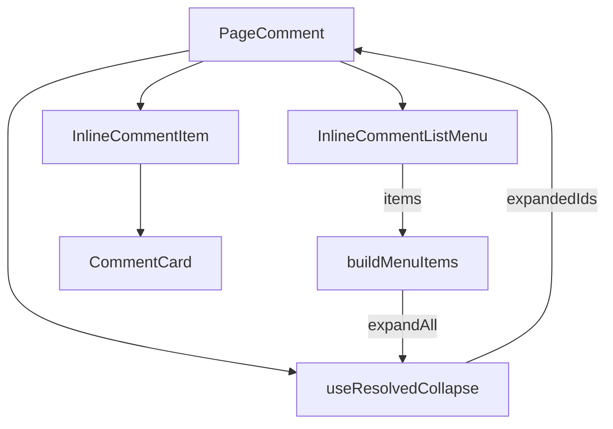
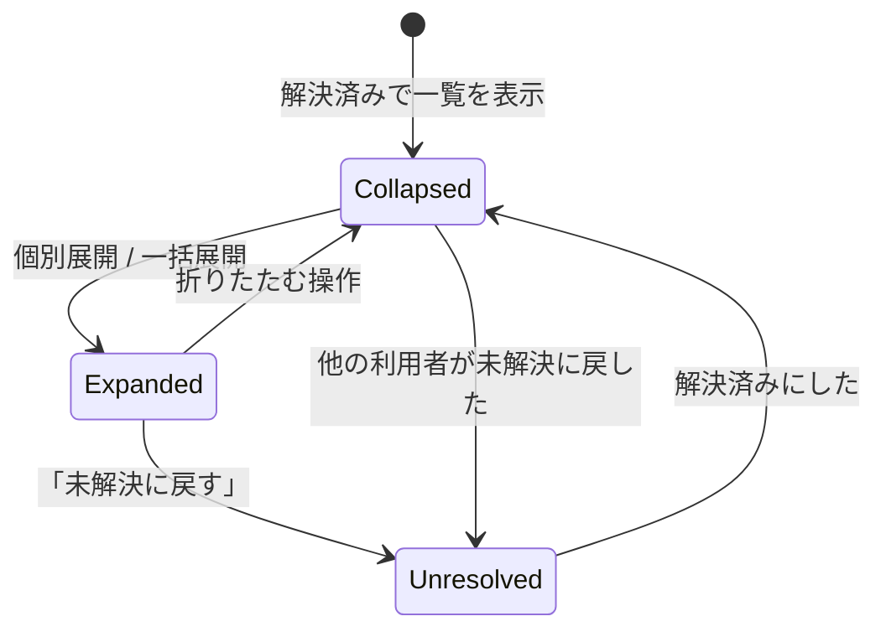

# 設計書: inline-comment-ui-refinement

## Overview

完了済みの [inline-comment](../inline-comment/) の画面の使いにくさを2点直す。(1) テキストを選択したときの「コメント」ボタンと入力フォームを、選択範囲の上側・カーソル側の端に出し、フォームの幅を内容と画面幅に合わせる（Requirement 19・23）。(2) コメント一覧で解決済みのコメントを既定で折りたたみ、1件ずつ、または一覧右端の三点メニューからまとめて展開できるようにする（Requirement 20〜22）。

**Users**: ページ閲覧者・編集者が、インラインコメントを作るとき（1）と、一覧から未解決のコメントを探すとき（2）に使う。

**Impact**: 一覧の表示（`InlineCommentItem` と `PageComment`）に「折りたたみ状態」という画面だけの状態が加わる。データ（API・DB・型）は変わらない。（1）はすでに実装・コミット済みで、この設計書では残りの（2）の設計を中心に書く。

この spec は amend spec（[spec-lifecycle](../../../.claude/rules/spec-lifecycle.md)）であり、実装が終わったら inline-comment へ書き戻して自分自身を削除する。

### Goals

- 解決済みコメントを既定で折りたたみ、引用文は残して何のコメントか分かるようにする
- 個別展開・個別折りたたみ・一括展開ができる
- 一覧メニューは、今後項目が増えても表示側を変えずに足せる

### Non-Goals

- 折りたたみ状態の保存（サーバー・ブラウザとも）。ページを開き直したら既定に戻る
- 本文中のハイライトの変更（Requirement 15）、通常コメントの表示の変更
- 「全ての解決済みのコメントを展開する」以外のメニュー項目の追加

## Amend target

| 対象 spec | 変わる契約 | 書き戻し先 |
|---|---|---|
| inline-comment | 作成の起点・入力フォームの位置と幅（Requirement 19・23 として追記） | `design.md` の `SelectionPopover` の行・シーケンス図・既知の制約、`requirements.md` の末尾 |
| inline-comment | 一覧での解決済みコメントの見せ方（Requirement 20〜22 として追記） | `design.md` の `InlineCommentItem` / 一覧まわり、`requirements.md` の末尾 |
| inline-comment | `Revalidation Triggers` | 下の「Revalidation Triggers」を参照。書き戻し時に inline-comment 側へ反映する |

既存の Requirement 1〜18 の番号は変えない。

## Boundary Commitments

### This Spec Owns

- 作成の起点・入力フォームの配置と幅（実装済み。`SelectionPopover` の配置指定、`SelectionCapture` の選択方向の受け渡し、`InlineCommentForm` の幅指定）
- 解決済みインラインコメントの折りたたみ状態（画面だけの状態）と、その表示の切り替え
- 一覧右端のメニュー（表示部品と、項目を宣言する形）

### Out of Boundary

- コメントのデータ・API・保存（折りたたみ状態は保存しない）
- 本文中のハイライトと、その場での内容確認（Requirement 15）
- 通常コメント（`Comment`）の表示。折りたたみの対象は解決済みインラインコメントだけ
- 「全ての解決済みのコメントを展開する」以外の項目の中身

### Allowed Dependencies

- `CommentCard`（枠と見出しの行。スロットで差し込む）、reactstrap の `Dropdown` 系（`MentionPickerButton` と同じ使い方）、`@popperjs/core`（既存）
- 依存の向きは `PageComment` → `InlineCommentItem` / メニュー部品。`InlineCommentItem` は折りたたみ状態を自分では持たず、親から受け取る

### Revalidation Triggers

- `InlineCommentItem` の props に「折りたたみ中か」「展開・折りたたみの操作」が加わるため、`InlineCommentItem` を直接使う別の呼び出し元（現在は `PageComment` のみ）は再確認が必要
- 「解決済み＝既定で折りたたみ」という表示規則が加わるため、解決済みコメントの内容を一覧で読む前提の機能（一覧からハイライトへのスクロール、E2E）は再確認が必要
- `SelectionPopover` の `cursorEdge` 指定の有無で配置が変わる（指定なしは従来の下・中央）。ほかの呼び出し元を足すときは指定の要否を決める

## Architecture

### Existing Architecture Analysis

- 一覧は `PageComment.tsx` が通常コメントとインラインコメントを投稿日時順に混ぜて描く。インラインコメント1件は `InlineCommentItem` が枠・引用文・返信まで持つ
- `InlineCommentItem` は `CommentCard` の見出し右側（`headerEnd`）・本文の前（`beforeBody`）・後（`footer`）のスロットを使って組み立てている
- 解決済みかどうかは `comment.resolvedAt != null` で決まる（`opacity-75` の薄い表示だけが違い）
- 状態管理は、画面だけの状態は React の state、サーバー由来のデータは SWR（既存方針）。折りたたみは前者

### Architecture Pattern & Boundary Map



- **折りたたみ状態は `PageComment` が持つ**。理由は、一括展開が「全件に同時に効く」ため、各行が自分の状態を持つと親から操作できないから
- **状態は「展開済みの id の集合」**とし、折りたたみ中かどうかは「解決済み かつ 集合にない」で導く。未解決に戻ったコメントは集合の有無に関わらず展開されて見える（Requirement 20.4 が自然に満たされる）
- **メニュー項目は宣言（データ）として渡す**。メニュー部品は項目の配列を受け取って描くだけで、個々の項目の中身を知らない。項目を足すときは宣言側の1か所だけを変える（Requirement 22.6）

### Technology Stack

| Layer | Choice | Role | Notes |
|---|---|---|---|
| Frontend | React 18 + reactstrap `Dropdown` | 折りたたみの表示切り替え、三点メニュー | 新しい依存は追加しない |
| State | React state（`PageComment` 内） | 展開済み id の集合 | 保存しない（Requirement 20.5） |
| i18n | `inline_comment.*` の英語キーのみ追加 | 展開・折りたたみ・メニューの文言 | 他言語は後続タスク（方針） |

## File Structure Plan

### Directory Structure

```
apps/app/src/features/inline-comment/client/
├── services/
│   └── resolved-collapse.ts               # 新規: 展開済み id の集合に対する純粋関数（展開・折りたたみ・一括展開・折りたたみ中かの判定）
├── hooks/
│   └── use-resolved-collapse.ts           # 新規: 上の純粋関数を React state に載せる薄い hook
└── components/
    ├── InlineCommentItem/
    │   ├── InlineCommentItem.tsx          # 変更: 折りたたみ表示と展開・折りたたみの操作を追加
    │   └── InlineCommentItem.module.scss  # 変更: 折りたたみ中の引用文の省略表示を追加
    └── InlineCommentListMenu/
        ├── InlineCommentListMenu.tsx      # 新規: 三点ボタン＋ドロップダウン。項目の配列を受け取って描く
        └── inline-comment-list-menu-items.ts  # 新規: メニュー項目の宣言（現在は「全ての解決済みのコメントを展開する」のみ）
```

`hooks/` は inline-comment の client 配下に初めて作るディレクトリ。`features/{name}/client/hooks/` は apps/app の標準構成（AGENTS.md）に沿う。

### Modified Files

- `apps/app/src/client/components/PageComment.tsx` — 折りたたみ状態の hook を使い、各 `InlineCommentItem` に折りたたみ中か・操作を渡す。`resolve` を包み、未解決に戻したときに展開済みの記録を消す。一覧の右端にメニューを置く（インラインコメントが1件以上のとき）
- `apps/app/public/static/locales/en_US/translation.json` — `inline_comment` に `expand`, `collapse`, `expand_all_resolved`, `list_menu` を追加
- `apps/app/src/features/inline-comment/client/i18n-keys.spec.ts` — 追加キーを守りのテストに加える
- `apps/app/playwright/20-basic-features/inline-comment.spec.ts` — 折りたたみ・展開のブラウザ確認を追加

（Requirement 19・23 の実装済みファイルは `SelectionCapture.tsx`、`SelectionPopover/*`、`InlineCommentForm.tsx` など。書き戻し時に inline-comment の design.md へ反映する。）

## System Flows

折りたたみの状態の動き。



- 解決済みにした直後は、そのコメントは折りたたまれる（既定の状態が「解決済み＝折りたたみ」のため）。未解決に戻したときに展開済みの記録を消すので、再び解決済みにしても展開されたままにならない
- 展開済みの集合は `PageComment` の state なので、ページを開き直すと空に戻る（Requirement 20.5）

## Requirements Traceability

| Requirement | 要約 | Components | 備考 |
|---|---|---|---|
| 19.1, 19.2, 19.3, 19.4 | 作成の起点を上側・カーソル側の端に、余白がなければ下に | `SelectionPopover`（上向き配置＋端の位置を返す仮想要素）、`SelectionCapture`（選択方向を保持） | 実装済み |
| 19.5, 19.6, 19.7 | フォームも同じ基準で、上方向に伸び、余白がなければ下に | `SelectionCapture`（composing 状態に選択方向を持ち越す）、`use-popper-position`（サイズ変化で再配置） | 実装済み |
| 20.1 | 解決済みは既定で折りたたみ | `resolved-collapse`（折りたたみ中の判定）、`PageComment`、`InlineCommentItem` | |
| 20.2 | 折りたたみ中は投稿者・日時・札・引用文・展開の操作だけ | `InlineCommentItem`（本文・返信・返信フォーム・編集/削除/解決の操作を出さない）、SCSS（引用文の省略） | 引用文は残す |
| 20.3 | 未解決・通常コメントは常に展開 | `resolved-collapse`（未解決は常に展開と判定）、`PageComment`（通常コメントは対象外） | |
| 20.4 | 未解決に戻したら展開して見せる | 判定が「解決済み かつ 集合にない」であること | 追加の処理は不要 |
| 20.5 | 状態を保存しない | 展開済み集合が `PageComment` の React state のみ | |
| 21.1, 21.2 | 個別の展開操作、他は変えない | `InlineCommentItem`（展開ボタン）、`use-resolved-collapse`（1件だけ集合に足す） | |
| 21.3 | 展開中は同じ場所に折りたたむ操作 | `InlineCommentItem`（バッジの左隣に、展開・折りたたみのボタンを同じ位置で出し分け） | |
| 21.4 | 展開中は未解決と同じ内容・操作 | `InlineCommentItem`（展開中は従来の描画をそのまま使う） | Requirement 4・16・18 の既存動作 |
| 22.1, 22.2, 22.3 | 右端の三点メニュー、ドロップダウン、1項目 | `InlineCommentListMenu`、`inline-comment-list-menu-items`、`PageComment`（インラインコメントが1件以上のとき配置） | |
| 22.4 | 一括展開 | `resolved-collapse`（解決済み全件の id を集合に足す） | |
| 22.5 | 解決済みがなければ項目を無効に | `inline-comment-list-menu-items`（項目の `disabled`） | |
| 22.6 | 項目を今後足せる | `InlineCommentListMenu` が項目の配列を受け取る形 | |
| 22.7 | リードオンリー利用者にも表示・操作可 | 一覧メニューは書き込み権限の判定を通さない | データを変えないため |
| 23.1, 23.2, 23.3, 23.4, 23.5 | フォームの幅の下限・上限・画面幅への追従・再配置 | `InlineCommentForm`（幅の指定）、`use-popper-position`（サイズ変化の監視） | 実装済み |

## Components and Interfaces

| Component | 責務 | 主な要件 |
|---|---|---|
| `resolved-collapse`（純粋関数） | 展開済み id の集合に対する操作と、折りたたみ中かの判定 | 20.1, 20.3, 20.4, 21.2, 22.4 |
| `use-resolved-collapse`（hook） | 上を React state に載せる。`PageComment` から使う | 20.5 |
| `InlineCommentItem` | 折りたたみ中／展開中の描き分け | 20.2, 21.1, 21.3, 21.4 |
| `InlineCommentListMenu` | 三点ボタンとドロップダウン。項目の配列を描く | 22.1, 22.2, 22.3, 22.6 |
| `inline-comment-list-menu-items` | 項目の宣言。現状は1項目 | 22.3, 22.5 |

### `resolved-collapse`

```typescript
type ExpandedIds = ReadonlySet<string>;

export const isCollapsed = (comment: Pick<InlineCommentWithReplies, 'id' | 'resolvedAt'>, expanded: ExpandedIds): boolean;
export const expand = (expanded: ExpandedIds, id: string): ExpandedIds;
export const collapse = (expanded: ExpandedIds, id: string): ExpandedIds;
export const forget = (expanded: ExpandedIds, id: string): ExpandedIds;
export const expandAllResolved = (expanded: ExpandedIds, comments: readonly Pick<InlineCommentWithReplies, 'id' | 'resolvedAt'>[]): ExpandedIds;
```

- どの関数も引数の集合を書き換えず、新しい集合を返す（イミュータブル。`coding-style.md`）
- `isCollapsed` は `resolvedAt != null && !expanded.has(id)`。未解決は常に `false`

### `use-resolved-collapse`

```typescript
export const useResolvedCollapse = (comments: readonly InlineCommentWithReplies[]): {
  isCollapsed: (comment: InlineCommentWithReplies) => boolean;
  expand: (id: string) => void;
  collapse: (id: string) => void;
  forget: (id: string) => void;
  expandAllResolved: () => void;
  hasResolved: boolean;
};
```

### `InlineCommentItem` に足す props

```typescript
collapsed: boolean;
onExpand: () => void;
onCollapse: () => void;
```

- `collapsed` が真のとき: 見出しには投稿者・日時・解決済みの札・展開ボタンだけを出す（履歴リンク・編集/削除・解決の切り替えは出さない）。引用文は残し、行数を絞って省略する。本文と返信（返信フォームを含む）は描かない
- 解決済みで `collapsed` が偽のとき: 従来の描画に、札の左隣の折りたたみボタンを足す
- 未解決のとき: 展開・折りたたみのボタンは出さない

### `InlineCommentListMenu`

```typescript
export type InlineCommentListMenuItem = {
  id: string;
  labelKey: string;
  disabled: boolean;
  onSelect: () => void;
};

type InlineCommentListMenuProps = {
  items: readonly InlineCommentListMenuItem[];
};
```

- 項目は `inline-comment-list-menu-items.ts` の `buildInlineCommentListMenuItems({ hasResolved, onExpandAllResolved })` が作る。項目を足すときはこの関数だけを変える
- 三点ボタンは reactstrap の `Dropdown` を使い、`MentionPickerButton` と同じく `color="link"` にする（テーマに追従させるため）。`useId()` の値を `target` に渡さない（`ui-pitfalls.md`）

## Data Models

なし。API・DB・共有の型は変えない。

## Error Handling

新しいエラー経路はない。解決／未解決の切り替えの失敗は、既存の `InlineCommentItem` の表示（`inline-comment-resolve-error`）のまま。

## Testing Strategy

TDD（先に落ちるテストを書く）で進める。テストの観点は essential-test-design に従い、内部の呼び出しではなく見える結果を確かめる。

- **単体**: `resolved-collapse` — 未解決は常に展開／解決済みは既定で折りたたみ／展開・折りたたみが対象の1件だけを変える／一括展開が解決済みの全件を足し未解決は足さない／元の集合を書き換えない（20.1, 20.3, 20.4, 21.2, 22.4）
- **hook**: 展開済み集合が state に載り、`forget` で再び折りたたまれる（20.4 の続きの挙動）
- **コンポーネント**: `InlineCommentItem` — 折りたたみ中に本文・返信・編集/削除/解決の操作が出ず、投稿者・日時・札・引用文・展開ボタンが出る（20.2）／展開ボタンで `onExpand`（21.1）／展開中の解決済みに折りたたみボタン（21.3）／展開中は未解決と同じ操作が出る（21.4）／未解決にはボタンが出ない（20.3）
- **コンポーネント**: `InlineCommentListMenu` — 三点ボタンでメニューが開き、項目を選ぶと `onSelect` が呼ばれる（22.2, 22.3）／`disabled` の項目は選べない（22.5）／項目を足しても表示側の変更が不要（22.6）
- **コンポーネント**: `PageComment` — インラインコメントが1件以上のときだけメニューが出る（22.1）／リードオンリー利用者にも出る（22.7）／「全て展開」で解決済みの全件が展開される（22.4）／未解決に戻すと展開され、再び解決済みにすると折りたたまれる（20.4）
- **守りのテスト**: `i18n-keys.spec.ts` に新キー、`no-literal-colors.spec.ts`（既存）が SCSS の色の直書きを止める
- **ブラウザ（E2E）**: 解決済みコメントのあるページを開くと折りたたまれ、個別展開・一括展開ができる。ページを開き直すと折りたたみに戻る（20.1, 20.5, 21, 22）

手動確認（自動化しにくい）: 引用文が長いときの省略の見た目、狭い画面での三点メニューの位置、ダークテーマでの三点ボタンの見た目。

## 既知の制約

- 他の利用者が解決／未解決を切り替えた場合は、自分の画面で再取得されたときに反映される。そのときの折りたたみは「解決済みなら折りたたみ、集合にあれば展開」の規則どおりになる（自分の操作を経由しない切り替えでは展開済みの記録は消えない）
