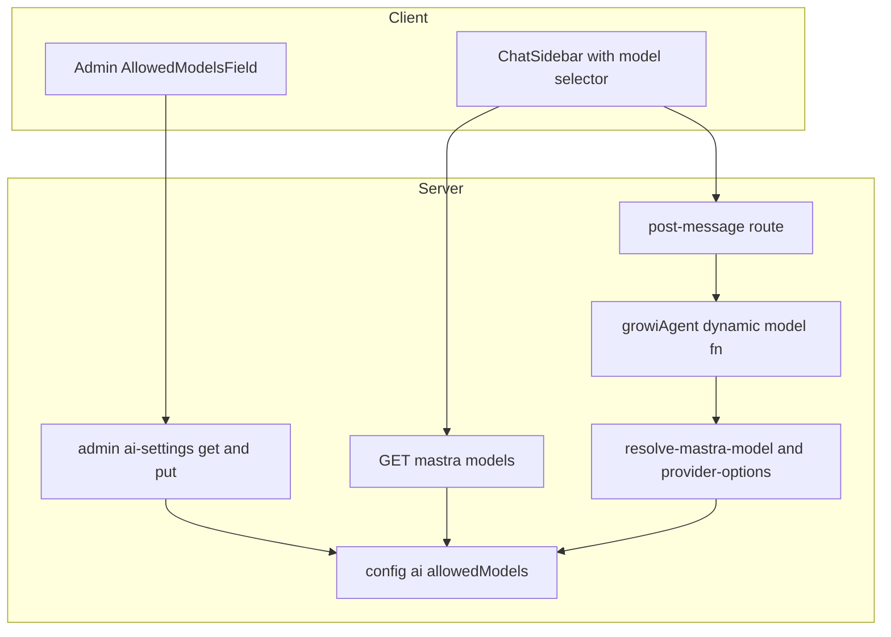
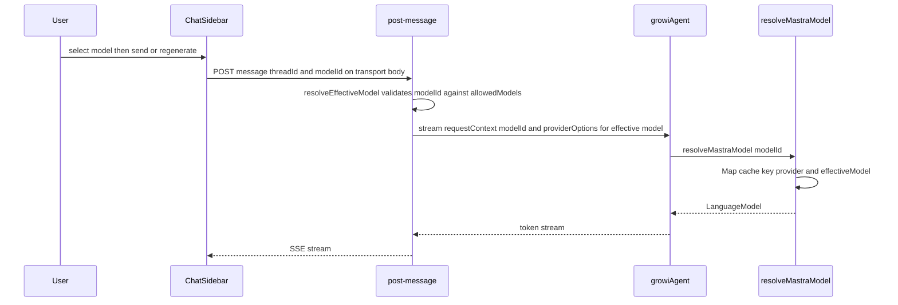
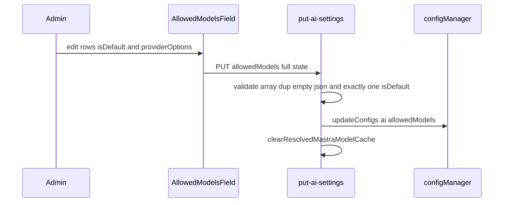

# Technical Design: mastra-multi-model-chat

## Overview

**Purpose**: Mastra AI チャットを「1 App = 1 モデル固定」から「管理者が許可した同一プロバイダ内の複数モデルを、エンドユーザーがチャットごとに選べる」形へ拡張する。

**Users**: 管理者は AI 設定画面で許可モデル集合（各モデルに任意の providerOptions、リスト内 1 つを既定に指定）を設定する。エンドユーザーはチャットのモデルセレクタからメッセージ単位でモデルを選ぶ。

**Impact**: 単一の `ai:model`（文字列）+ `ai:providerOptions`（単一 JSON、全 stream に一律適用）を、`ai:allowedModels`（モデル + providerOptions + 既定フラグを同梱した配列）+ リクエスト単位のモデル解決へ置き換える。既定モデルは別キーではなく**配列エントリの `isDefault` フラグ**で表す。**`ai:model` / `ai:providerOptions`（env `AI_MODEL` / `AI_PROVIDER_OPTIONS` 含む）は完全廃止**（自動移行なし。運用者は `ai:allowedModels` で再設定）。プロバイダ/API キー（単一）と AI 有効性ゲーティングは不変。

### Goals
- 管理者が複数の許可モデル、モデルごとの providerOptions、既定モデル（リスト内 1 つ）を設定できる。
- エンドユーザーがチャットで許可モデルから選択し、その応答に選択モデル（とそのモデルの providerOptions）が使われる。再生成（regenerate）でも選択モデルが保持される。
- ユーザーの選択モデルが個人設定として記憶され、次回の初期選択に使われる（許可外ならデフォルト）。
- 許可外モデルがサーバ側で使われない（クライアント値を信用しない）。

### Non-Goals
- 異なるプロバイダのモデルを 1 つの許可リストに混在させること。`ai:provider`/`ai:apiKey` は単一のまま。
- ベンダー API / レジストリからのモデル一覧自動取得。許可モデルは管理者の手入力。
- 会話（スレッド）ごとの選択モデルのサーバ永続化。
- 旧 `ai:model` / `ai:providerOptions` からの自動移行（完全廃止・運用者が再設定）。
- AI 有効性ゲーティング・スレッド永続化・ストリーミング・エラーサニタイズの挙動変更。

## Boundary Commitments

### This Spec Owns
- 設定キー `ai:allowedModels`（`AllowedModel[]`、`isDefault` 含む）の定義・読取・書込・検証。
- 既定モデルの決定（`isDefault` フラグ、無指定時は先頭）。
- ユーザー選択モデルの永続化（`UserUISettings.aiChatSelectedModel`）。書込は共有 `scheduleToPut`、読取は `/mastra/models` がサーバ側で検証して返す（専用 atom・SSR ハイドレートは持たない）。
- 実効モデルと providerOptions の解決（`resolveEffectiveModel` / `getDefaultModel` / `resolveProviderOptions` / `resolveMastraModel(modelId?)`）と、許可リストに対するサーバ側検証。
- AI 構成済み判定（`isAiConfigured`）を allowedModels ベースへ更新。
- `growiAgent` のリクエスト単位モデル解決（動的モデル関数 + RequestContext の `modelId`）。
- 管理 UI の許可モデルリストエディタ（`ProviderCommonSettings` 内に単一配置）と GET/PUT 契約の拡張。
- チャット用モデル一覧エンドポイント `GET /_api/v3/mastra/models` と、チャット UI のモデルセレクタ配線（transport への modelId 固定を含む）。

### Out of Boundary
- 複数プロバイダ混在（別 spec / 将来）。`multi-llm-provider` のベンダー切替は据え置き。
- ベンダー API からのモデル一覧取得。会話固定モデルのサーバ永続化。
- 旧 `ai:model` / `ai:providerOptions` からの自動移行（完全廃止。運用者は `ai:allowedModels` で再設定）。
- 既存 spec（`admin-ai-settings` / `multi-llm-provider`）のドキュメント更新は本 spec の**タスク**として行うが、本設計の実装対象コードではない。
- スレッド永続化 / ストリーミング / エラーサニタイズ / AI 有効性ゲーティングの内部実装。

### Allowed Dependencies
- `~/server/service/config-manager`（`configManager`, `defineConfig`, config-loader のオブジェクト配列対応）。
- `@mastra/core`（Agent 動的モデル関数、`RequestContext`）、`@ai-sdk/*`（provider factory）。
- 既存 `provider-options-validation`（`isProviderNamespacedObject` / `isValidProviderOptionsJson`）。
- ベンダリング済み `~/components/ai-elements/prompt-input`（`PromptInputModelSelect*`）、`react-hook-form`（`useFieldArray`）、SWR。
- `~/interfaces/user-ui-settings`、`~/client/services/user-ui-settings`（`scheduleToPut`・共有サービス）、`UserUISettings` model（選択モデル永続化の読書き）。
- 依存方向（左→右、上位は下位を import しない）: `interfaces` → `config-definition` → `ai-sdk-modules`（resolvers）→ `mastra-modules`（agent）→ `routes` → `client`。

### Revalidation Triggers
- `AllowedModel` / `AiSettingsResponse` / `AiSettingsUpdateRequest` の形変更 → 管理 UI・`admin-ai-settings` spec 再確認。
- `ai:allowedModels` の意味・`isDefault` 規約の変更、または旧 `ai:model`/`ai:providerOptions` 廃止に伴う設定方針の変更 → `admin-ai-settings`・`multi-llm-provider` spec 再確認。
- `GET /_api/v3/mastra/models` のレスポンス形変更、または post-message の `modelId` 受理契約変更 → チャットクライアント再確認。
- `resolveMastraModel` / `isAiConfigured` の意味変更 → `multi-llm-provider` の解決設計・AI 有効性ゲートと整合確認。

## Architecture

### Existing Architecture Analysis
現状は単一モデルの一本道カスケード（詳細は research.md §1）。要点:
- config: `ai:provider` / `ai:apiKey` / `ai:model`（単一）/ `ai:providerOptions`（単一 JSON）/ `ai:azureOpenaiSettings`。`config-loader` は `typeof defaultValue === 'object'` のとき env を `JSON.parse`、DB 値も `JSON.parse`（オブジェクト配列対応済み）。
- 解決: `resolveMastraModel()`（引数なし・単一スロット memo）→ `modelResolvers[provider]()` → 各 resolver が `requireModel()` で `ai:model` を読む。
- agent: `growiAgent.model = () => resolveMastraModel()`（`requestContext` 無視）。
- 呼出: `post-message` が `RequestContext`（`user`/`searchService`）を構築し `growiAgent.stream(messages, { requestContext, memory, providerOptions: resolveProviderOptions() })`。
- 管理 UI: `ProviderCommonSettings`（provider/apiKey/model[非Azure]/providerOptions textarea）+ `AzureOpenaiSettings`（model=デプロイ名 + 接続）。FULL-STATE-REPLACE PUT、env-only ロック、保存後 `clearResolvedMastraModelCache()`。
- 有効性: `isAiConfigured()` が `ai:model` 等を確認、`isAiReady()`（SSR）/`ai-ready-guard` がチャットをゲート。

維持する統合点: AI 有効性ゲート、スレッド永続化、ストリーミング、`clearResolvedMastraModelCache()` の既存呼出（PUT / `model-config-sync`）。

### Architecture Pattern & Boundary Map



**Architecture Integration**:
- Selected pattern: 既存のデータ駆動ディスパッチ（`modelResolvers`）+ レイヤード解決を踏襲し、解決ロジックに `modelId` を一引数として通す Extension。
- 責務分離: 「解決の中核」(`ai-sdk-modules`) / 「リクエスト供給」(`routes`) / 「設定・表示」(`client`)。検証と既定解決は `ai-sdk-modules` に集約。
- 既存パターン維持: data-driven resolver マップ、RequestContext プラミング、FULL-STATE-REPLACE PUT、`clearResolvedMastraModelCache` 無効化。
- 新コンポーネント根拠: 許可リスト型（複数モデル + 既定 + options）、リストエディタ UI、chat models エンドポイント（クライアントは現状 AI 設定を取得しない）。
- Steering 整合: feature ベース構成 / named export / co-located tests / `mock<T>` / immutable。

### Technology Stack

| Layer | Choice / Version | Role in Feature | Notes |
|-------|------------------|-----------------|-------|
| Frontend | React 18 + react-hook-form（`useFieldArray`）+ SWR + ベンダリング済み AI Elements `PromptInputModelSelect*` | 許可モデルリストエディタ / チャットのモデルセレクタ | 新規ライブラリ導入なし |
| Backend | Express apiv3 + `@mastra/core`（動的モデル関数・RequestContext）+ `@ai-sdk/*@3` | リクエスト単位モデル解決・検証・新 GET エンドポイント | 既存依存のみ。動的モデル関数 `({ requestContext }) => model` を要するため実効最小は 1.41（package.json の floor は `^1.32.1` だが caret で 1.41 系へ解決され、インストール実体は 1.41.0）。floor を巻き戻す場合はこの機能の可用性を再確認 |
| Data | MongoDB config（`config-manager`/`config-loader`） | `ai:allowedModels`（オブジェクト配列）永続化 | env `AI_ALLOWED_MODELS` は JSON 文字列 |

新規依存なし。逸脱: 既定を別キーから `isDefault` フラグへ移行、`ai:model`/`ai:providerOptions` を完全廃止、モデル欄を Azure 専用セクション → 共通設定へ移設。

## File Structure Plan

### Created
```
apps/app/src/features/mastra/
├── interfaces/
│   └── allowed-model.ts                 # AllowedModel(isDefault含む) / ModelProviderOptions
├── server/routes/
│   └── get-models.ts                    # GET /_api/v3/mastra/models（許可モデル + 既定 + ユーザー選択を検証して返す）
└── client/
    ├── admin/
    │   └── AllowedModelsField.tsx        # useFieldArray の許可モデルリストエディタ（ModelField を置換）
    └── stores/
        └── models.tsx                    # SWR: チャット用フック（{models, defaultModelId, selectedModelId}）
```
（各 `*.spec.ts(x)` を co-located で追加）

### Modified
- `apps/app/src/server/service/config-manager/config-definition.ts` — `ai:allowedModels` 追加、env-only `targetKeys` に追加。**`ai:model` / `ai:providerOptions` の config 定義を削除**（env `AI_MODEL`/`AI_PROVIDER_OPTIONS` も読まなくなる）。
- `apps/app/src/features/mastra/interfaces/ai-settings.ts` — `AiSettingsResponse`/`AiSettingsUpdateRequest` から `model`/`providerOptions` を除去し `allowedModels` 追加。`AI_SETTING_KEYS` を `[app:aiEnabled, ai:provider, ai:apiKey, ai:allowedModels, ai:azureOpenaiSettings]` に。
- `ai-sdk-modules/llm-providers/config.ts` — `requireModel()` を撤去し `getAllowedModels()` / `getDefaultModel()` / `resolveEffectiveModel(modelId?)` を提供。
- `ai-sdk-modules/llm-providers/{index,openai,anthropic,google,azure-openai}.ts` — resolver を `(model: string) => MastraModelConfig` に（model を引数受け取り）。
- `ai-sdk-modules/resolve-mastra-model.ts` — `resolveMastraModel(modelId?)` + `Map` キャッシュ。
- `ai-sdk-modules/resolve-provider-options.ts` — `resolveProviderOptions(modelId?)`（許可リストのエントリから解決）。
- `mastra-modules/agents/growi-agent.ts` — `model: ({ requestContext }) => resolveMastraModel(requestContext.get('modelId'))`。
- `mastra-modules/types/request-context.ts` — `MastraRequestContextShape` に `modelId?: string`。
- `server/services/is-ai-configured.ts` — 構成済み判定を `provider + apiKey + 非空 getAllowedModels()` に更新（5/6 整合）。
- `server/routes/post-message.ts` / `post-message-validator.ts` / `routes/index.ts` — `modelId` 受理・RequestContext 設定・providerOptions を実効モデルで解決 / 新 GET ルート登録。
- `server/routes/admin-ai-settings/{get,put}-ai-settings.ts` — `allowedModels` 読取/検証/保存、`model`/`providerOptions` 書込み除去。
- `client/admin/ai-settings-form-values.ts` — 作業コピーを `allowedModels:{model;providerOptionsText;isDefault}[]` に変更（`model`/`providerOptions`/別 `defaultModel` 廃止）、変換追加。
- `client/admin/ProviderCommonSettings.tsx` — `AllowedModelsField` を配置（provider 監視でラベル切替）、providerOptions textarea と 非Azure ModelField 呼出を除去。
- `client/admin/AzureOpenaiSettings.tsx` — `ModelField` 呼出を除去（接続設定のみ）。
- `client/admin/ModelField.tsx` — 削除（`AllowedModelsField` へ置換）。
- `client/components/ChatSidebar/ChatSidebar.tsx` / `chat-sidebar-helpers.ts` — モデルセレクタ mount、transport body に `modelId` を固定（`modelId` 変更時に transport 再生成）、許可モデル取得フックの `selectedModelId` で `useState` 初期化、選択変更時に共有 `scheduleToPut({ aiChatSelectedModel })` で永続化。
- `apps/app/src/interfaces/user-ui-settings.ts` — `IUserUISettings` に `aiChatSelectedModel?: string` 追加。
- `apps/app/src/server/models/user-ui-settings.ts` — schema に `aiChatSelectedModel: { type: String }` 追加。
- （再利用・無改変）`components/ai-elements/prompt-input.tsx`、`client/services/user-ui-settings.ts`（`scheduleToPut`・feature→共有サービス）。新 atom・SSR ハイドレートは追加しない。

依存方向（再掲）: `interfaces` → `config-definition` → `ai-sdk-modules` → `mastra-modules` → `routes` → `client`。

## System Flows

### チャット送信時のモデル解決

ゲート: `modelId` 未指定/許可外 → `resolveEffectiveModel` が既定（`isDefault` ?? 先頭）に丸め（4.2/4.3）。**`modelId` は transport body に固定する**ため `sendMessage` でも `regenerate()` でも常に送られる（3.3/3.4、Critical Issue 1 対応）。providerOptions は実効モデルのエントリから解決（4.4/2.2）。

### 管理保存

env-only 有効時は PUT を 422（1.6）。保存後キャッシュ全消去で再起動なし反映（1.2）。既定はリストの `isDefault` 要素（1.3/1.5）。

## Requirements Traceability

| Requirement | Summary | Components | Interfaces / Contracts | Flows |
|-------------|---------|------------|------------------------|-------|
| 1.1 | 許可集合の永続化 | Config, put-ai-settings, AllowedModelsField | `ai:allowedModels`, `AiSettingsUpdateRequest.allowedModels`, PUT | 管理保存 |
| 1.2 | 再起動なし反映 | put-ai-settings, resolve-mastra-model | `clearResolvedMastraModelCache()` | 管理保存 |
| 1.3 | 既定保持 | Config, AllowedModelsField, model 解決 | `AllowedModel.isDefault`, `getDefaultModel()` | 管理保存 |
| 1.4 | 空/重複の拒否 | put-ai-settings (validator) | array validator | 管理保存 |
| 1.5 | 既定はちょうど 1 つ | put-ai-settings (validator) | `isDefault===true` がちょうど 1 件（0 個/複数は 422。既定は `isDefault` フラグなので本質的に集合内） | 管理保存 |
| 1.6 | env-only 読取専用 | put-ai-settings, AllowedModelsField | env-only 422 / disabled | 管理保存 |
| 2.1 | モデル別 options 設定 | AllowedModelsField, Config | `AllowedModel.providerOptions` | 管理保存 |
| 2.2 | 使用モデルにのみ適用 | resolve-provider-options, post-message | `resolveProviderOptions(modelId)` | チャット送信 |
| 2.3 | 空=options なし | AllowedModelsField, put-ai-settings | parse 省略 | 管理保存 |
| 2.4 | 不正 JSON 拒否 | AllowedModelsField, put-ai-settings | `isValidProviderOptionsJson` | 管理保存 |
| 2.5 | グローバル options なし | resolve-provider-options | `resolveProviderOptions(modelId?)` のみ | チャット送信 |
| 3.1 | 許可モデルのセレクタ | ChatSidebar, models store, GET models | `GET /_api/v3/mastra/models` | — |
| 3.2 | 初期=前回選択 ?? 既定 | ChatSidebar, GET models | `selectedModelId`（サーバ検証） | — |
| 3.3 | メッセージ単位選択 | ChatSidebar, chat-sidebar-helpers | transport body `modelId` | チャット送信 |
| 3.4 | 会話途中切替（再生成含む） | ChatSidebar, chat-sidebar-helpers | transport 再生成 on modelId | チャット送信 |
| 3.5 | 単一許可時の選択状態 | ChatSidebar | selector value | — |
| 3.6 | 選択の永続化 | ChatSidebar, user-ui-settings | `scheduleToPut({ aiChatSelectedModel })` | — |
| 3.7 | 永続値が許可外→既定 | GET models（サーバ検証） | `saved ∈ allowed ? saved : default` | — |
| 4.1 | 許可内モデルを使用 | post-message, resolve-mastra-model | `resolveEffectiveModel` | チャット送信 |
| 4.2 | 許可外→既定 | resolve-mastra-model (config) | `resolveEffectiveModel` fallback | チャット送信 |
| 4.3 | 未指定→既定 | post-message, resolve-mastra-model | 同上 | チャット送信 |
| 4.4 | options を使用モデルに一致 | post-message, resolve-provider-options | `resolveProviderOptions(effective)` | チャット送信 |
| 4.5 | provider エラーは安全表示 | post-message（既存） | `resolveChatErrorMessage`（無改変） | チャット送信 |
| 5.1 | 既存スレッド維持 | （無改変） | — | — |
| 6.1 | AI 無効時チャット不可 | is-ai-configured（更新）, 既存ゲート | `isAiConfigured`（allowedModels ベース）, `isAiReady` | — |
| 6.2 | AI 無効でも設定可 | get/put-ai-settings | ai-ready ガードなし（既存） | — |

## Components and Interfaces

| Component | Domain/Layer | Intent | Req Coverage | Key Dependencies | Contracts |
|-----------|--------------|--------|--------------|------------------|-----------|
| AllowedModel 型 | interfaces | 許可モデル1件の型（既定フラグ含む） | 1,2 | `ai`(JSONValue, type-only) (P0) | State |
| config `ai:allowedModels` | config | 許可リスト永続化 | 1,2,5 | config-loader (P0) | State |
| model 解決サービス | server/ai-sdk-modules | 実効モデル+既定+options 解決・検証 | 2,4,5,6 | config (P0), modelResolvers (P0) | Service |
| growiAgent 動的モデル | server/mastra-modules | per-request モデル適用 | 4 | resolve-mastra-model (P0), RequestContext (P0) | Service |
| post-message 拡張 | server/routes | modelId 受理・適用 | 3,4 | 解決サービス (P0), validator (P0) | API |
| admin ai-settings 拡張 | server/routes | 許可リスト read/write/検証 | 1,2,6 | config (P0), validators (P0) | API |
| GET mastra models | server/routes | チャットへ許可リスト供給 | 3 | config (P0), ai-ready-guard (P1) | API |
| AllowedModelsField | client/admin | 許可リストエディタ UI | 1,2 | useFieldArray (P0), 既存バリデータ (P1) | State |
| ChatSidebar 拡張 | client/chat | モデルセレクタ+送信 | 3 | PromptInputModelSelect (P0), models store (P0) | State |

### interfaces / config

#### AllowedModel（型）
**Contracts**: State

```typescript
import type { JSONValue } from 'ai';

/** AI SDK providerOptions 形（provider 名前空間 -> オプション）。既存 MastraProviderOptions と同形。 */
export type ModelProviderOptions = Record<string, Record<string, JSONValue>>;

/** 許可モデル1件。model はモデル ID（Azure OpenAI ではデプロイ名）。isDefault はリスト内ちょうど1つ。 */
export interface AllowedModel {
  readonly model: string;
  readonly providerOptions?: ModelProviderOptions;
  readonly isDefault?: boolean;
}
```

#### config `ai:allowedModels`
```typescript
'ai:allowedModels': defineConfig<AllowedModel[] | undefined>({
  envVarName: 'AI_ALLOWED_MODELS',  // JSON 配列文字列
  defaultValue: [],                 // object → loader が env/DB を JSON 透過
}),
```
- **`ai:model` / `ai:providerOptions` は完全廃止**（config 定義・env `AI_MODEL`/`AI_PROVIDER_OPTIONS` ともに削除）。自動移行は提供しない（運用者は `ai:allowedModels` で再設定）。
- env-only `targetKeys` に `ai:allowedModels` 追加（旧 2 キーは除去）。

### server / ai-sdk-modules（model 解決サービス）

**Responsibilities & Constraints**: 実効モデルの決定・許可検証・既定解決・providerOptions 解決・LanguageModel 構築を担う唯一の場所。クライアント値（`modelId`）は信用せず必ず許可リストで検証（Security）。

**Dependencies**: Inbound: post-message / growiAgent / is-ai-configured / get-models (P0)。Outbound: `configManager` (P0), `modelResolvers` (P0)。

**Contracts**: Service

```typescript
// llm-providers/config.ts（共通アクセサ）
/** 許可モデル一覧。`configManager.getConfig('ai:allowedModels') ?? []`。自動移行・合成は行わない。 */
export const getAllowedModels = (): AllowedModel[];

/** 既定モデル ID。allowedModels.find(isDefault)?.model ?? allowedModels[0]?.model（リスト空なら undefined）。 */
export const getDefaultModel = (): string | undefined;

/** 実効モデル ID。modelId が許可集合内ならそれ、無ければ既定、リスト空なら throw（4.1/4.2/4.3）。 */
export const resolveEffectiveModel = (modelId?: string): string;

// resolve-provider-options.ts
/** 実効モデルのエントリの providerOptions を返す（無ければ {}）。グローバル一律は持たない（2.2/2.5）。 */
export const resolveProviderOptions = (modelId?: string): MastraProviderOptions;

// llm-providers/index.ts（model を引数受け取りに変更）
export const modelResolvers: Record<AiProvider, (model: string) => MastraModelConfig>;

// resolve-mastra-model.ts
/** 実効モデルを解決し provider 別 resolver で構築。Map キャッシュ key=`${provider}:${effective}`。 */
export const resolveMastraModel = (modelId?: string): MastraModelConfig;
export const clearResolvedMastraModelCache = (): void; // Map 全消去
```
- Preconditions: `ai:provider` が有効（既存 `isAiProvider` 検証を維持）。
- Postconditions: 返る `MastraModelConfig` は実効モデルに対応。Azure+Entra のトークンキャッシュはキャッシュ済みオブジェクト内に保持。
- Invariants: 実効モデルは常に許可集合内（フォールバック後も）。リスト空のときのみ throw。

**Implementation Notes**
- Integration: `growi-agent.ts` の `model` を `({ requestContext }) => resolveMastraModel(requestContext.get('modelId'))` に。各 provider resolver は `create*({apiKey})(model)` の `model` を引数化。`is-ai-configured.ts` は `provider + apiKey + getAllowedModels().length > 0` で判定。
- Validation: `resolveEffectiveModel` に許可検証を集約（防御の最終段）。
- Risks: 単一スロット→Map 化で Azure+Entra トークンキャッシュを退行させない（モデルオブジェクト単位でキャッシュ）。

### server / routes

#### post-message 拡張
**Contracts**: API

##### API Contract
| Method | Endpoint | Request | Response | Errors |
|--------|----------|---------|----------|--------|
| POST | `/_api/v3/mastra/message` | `{ threadId?, modelId?: string, messages }` | SSE UI message stream | 400(validation), 500 |

- `post-message-validator`: `body('modelId').isString().optional()` を追加。
- route: `requestContext.set('modelId', modelId)`、`providerOptions: resolveProviderOptions(modelId)`。許可外/未指定はサービス側で既定に丸め（4.2/4.3）。provider エラーは既存 `resolveChatErrorMessage` で安全表示（4.5、無改変）。

#### GET mastra models（新規）
**Contracts**: API

##### API Contract
| Method | Endpoint | Request | Response | Errors |
|--------|----------|---------|----------|--------|
| GET | `/_api/v3/mastra/models` | — | `{ models: { id: string; name: string }[]; defaultModelId: string; selectedModelId: string }` | 401, 403 |

- 認証: login required + 既存 get-threads / get-messages と同じ scope（login + `READ.FEATURES.AI`）+ `router.use(aiReadyGuard)` による一括ゲート。
- `models = getAllowedModels().map(m => ({ id: m.model, name: m.model }))`（フレンドリ名は無いので id=name）。`defaultModelId = getDefaultModel()`。
- `selectedModelId`: `req.user` の `UserUISettings.aiChatSelectedModel` を読み、**許可リスト検証して `saved ∈ allowed ? saved : defaultModelId`**（R3.7 の許可外フォールバックをサーバに一元化）。
- **providerOptions はクライアントへ返さない**（サーバ専用）。

#### admin ai-settings 拡張（get/put）
**Contracts**: API

##### API Contract
| Method | Endpoint | Request | Response | Errors |
|--------|----------|---------|----------|--------|
| GET | `/_api/v3/ai-settings` | — | `AiSettingsResponse`（`allowedModels` 追加, `model`/`providerOptions` 削除） | 401,403 |
| PUT | `/_api/v3/ai-settings` | `AiSettingsUpdateRequest`（`allowedModels?` 追加, `model`/`providerOptions` 削除） | 204 | 400,422(env-only / 整合) |

```typescript
export interface AiSettingsResponse {
  aiEnabled: boolean;
  provider?: AiProvider;
  allowedModels: AllowedModel[];  // isDefault 込み。getAllowedModels() が `?? []` するため常に配列（合成はしない）
  azureOpenaiSettings: AzureOpenaiConfig;
  isApiKeySet: boolean;
  useOnlyEnvVars: boolean;
  isConfigured: boolean;
}
export interface AiSettingsUpdateRequest {
  aiEnabled?: boolean;
  provider?: AiProvider;
  apiKey?: string;
  allowedModels?: AllowedModel[];  // FULL-STATE-REPLACE（isDefault 込み）
  azureOpenaiSettings?: AzureOpenaiConfig;
}
```
- PUT バリデーション（`allowedModels` が**非空**のとき）: 配列・各 `model` 非空・重複禁止（1.4）、各 `providerOptions` は `isValidProviderOptionsJson` 相当（2.4）、`isDefault: true` は**ちょうど 1 つ**（0 個・複数のいずれも 422 で拒否し、許可集合内から既定を 1 つ選ぶよう促す）（1.3/1.5）。env-only 422（1.6）。保存後 `clearResolvedMastraModelCache()`（1.2）。
  - 解決層の `getDefaultModel = find(isDefault) ?? 先頭` は、上記検証をすり抜けた不正な保存値（手動 DB 編集・env 直書き等）に対する**防御的フォールバック**であり、PUT 経路では非空かつ 0 個 isDefault の状態は保存され得ない。
- **空配列 `[]` / 未指定の扱い（FULL-STATE-REPLACE のクリア経路）**: `allowedModels` が空配列または未指定のときは「許可モデルなし（＝AI 未構成）」として扱い、`buildUpdates` は `ai:allowedModels` に `undefined` を設定する。`updateConfigs({ removeIfUndefined: true })`（既存呼出）がキーを DB から削除し、`getConfig('ai:allowedModels')` は既定値 `[]`（env `AI_ALLOWED_MODELS` 設定時はその値）を返す。この状態で `isAiConfigured()` は false（6.1）。**空配列は 422 ではなく正当な「無効化」状態**であり、`isDefault` 単一性検証は非空リストのときにのみ適用する（Critical 整合: 0 件の空配列を 0 個 isDefault として 422 にしない）。`azureOpenaiSettings` の「全フィールド未設定→undefined に collapse→キー削除」と同型のパターン。
- `AI_SETTING_KEYS`: `ai:model`/`ai:providerOptions` を除去し `ai:allowedModels` を追加。

### client / admin（AllowedModelsField）
**Contracts**: State（presentational + RHF）

**Implementation Notes**
- `useFieldArray({ name: 'allowedModels' })`。各行 = モデル ID 入力 + 「既定」ラジオ（行の `isDefault` を立て、リスト内 1 つ）+ 折りたたみ providerOptions JSON textarea（`isValidProviderOptionsJson` で `validate`）+ 削除。「+ モデルを追加」。既定行を削除したら先頭へ既定を再付与。
- `ProviderCommonSettings` に単一配置。ラベルは `watch('provider') === 'azure-openai'` のとき「デプロイ名」、他は「モデル」。env-only 時 `disabled`。旧 `ModelField`/providerOptions textarea を撤去。
- フォーム作業コピー（`ai-settings-form-values.ts`）:
```typescript
export interface AiSettingsFormValues {
  aiEnabled: boolean;
  provider: AiProvider | '';
  apiKey: string;
  allowedModels: { model: string; providerOptionsText: string; isDefault: boolean }[];
  azureOpenaiSettings: Required<AzureOpenaiConfig>;
}
```
`toFormValues`: `response.allowedModels` の `providerOptions` を `JSON.stringify`（無ければ ''）→ `providerOptionsText`、`isDefault` をコピー。`buildUpdateRequest`: `providerOptionsText` を `JSON.parse`（空→省略）して `AllowedModel.providerOptions`、`isDefault` をコピー。別 `defaultModel` フィールドは持たない。

### client / chat（ChatSidebar 拡張）
**Contracts**: State

**Implementation Notes**
- 新 SWR フック（`stores/models.tsx`）で `GET /_api/v3/mastra/models` を取得 → `{ models, defaultModelId, selectedModelId }`（`selectedModelId` はサーバが許可検証済み）。
- `const [model, setModel] = useState(selectedModelId)`（feature ローカル）。`PromptInputModelSelect`（value/onValueChange）+ `PromptInputModelSelectItem` を `models` で map。選択変更で `setModel` し、併せて共有サービス `scheduleToPut({ aiChatSelectedModel })` でデバウンス DB 永続化（専用 atom・SSR ハイドレートは持たない）。
- **`modelId` は transport body に固定**: `chat-sidebar-helpers` の `buildMessageRequestBody(threadId, modelId)` → `{ threadId, modelId }`、`createMastraChatTransport(threadId, modelId)`。`ChatSidebar` の `useMemo` 依存に `model` を追加し、選択変更時に transport を再生成。これにより `sendMessage` も `regenerate()` も常に現在の `modelId` を送る（Critical Issue 1 対応、3.3/3.4）。
- 単一モデル時はその値を選択状態表示（3.5）。

## Data Models

### config（保存値）
- `ai:allowedModels: AllowedModel[]`（DB は JSON 配列、env `AI_ALLOWED_MODELS` は JSON 文字列）。`isDefault` を含む。
- **空 vs 未設定**: DB に非空配列が保存されている場合のみ「許可モデルあり」。PUT のクリア経路（空配列/未指定）ではキーが削除され、`getConfig` は既定 `[]` を返す（env 設定時はそれ）。`[]` は env にフォールバックする一方、DB に明示保存された非空配列は env を上書きする。したがって「許可モデルなし」状態は常に `getConfig() === []`（DB 不在 or 既定）として観測され、`isAiConfigured()` の判定基準（非空 allowedModels）と一致する。
- 旧 `ai:model` / `ai:providerOptions` は廃止（定義削除・自動移行なし）。

### ユーザー個人設定（DB）
- `IUserUISettings.aiChatSelectedModel?: string`（`UserUISettings` コレクション、user 単位 unique）。未設定 = 未選択。**読取は `/mastra/models`（サーバが検証して `selectedModelId` を返す）、書込は共有 `scheduleToPut`**。グローバル config ではなくユーザー単位。

### API DTO
- GET/PUT は上記 `AiSettingsResponse`/`AiSettingsUpdateRequest`。`allowedModels` は providerOptions をネストオブジェクト、`isDefault` を真偽値で授受。
- `GET /_api/v3/mastra/models` は providerOptions を含まない `{ id, name }[]` + `defaultModelId` + `selectedModelId`。

### フォーム作業コピー
- providerOptions は textarea 編集のため **生 JSON 文字列**（`providerOptionsText`）で保持し、保存/読込時に parse/stringify 変換。`isDefault` はラジオにバインド。

## Error Handling

### Error Strategy
- 入力検証は早期・フィールド単位（fail fast）。チャットの実行時失敗は安全メッセージで graceful degradation。

### Error Categories and Responses
- User(4xx/422): 空/重複モデル ID、`isDefault` が 0 個または複数、不正 providerOptions JSON → PUT 422 + フィールドエラー（1.4/1.5/2.4）。env-only 中の PUT → 422（1.6）。
- System(5xx): provider 呼出失敗はストリームのエラーチャンク → `resolveChatErrorMessage` で機密を含まない 1 行に（4.5、無改変）。
- Business(防御): クライアント `modelId` が許可外 → エラーではなく既定に丸め（4.2、監査ログ出力）。

### Monitoring
- 許可外 `modelId` のフォールバック発生時に `logger.warn`（モデル名のみ、秘匿情報なし）。トークン使用量ログは既存どおり。

## Testing Strategy

### Unit Tests
- `resolveEffectiveModel`: 許可内→そのまま / 許可外→既定 / 未指定→既定 / リスト空→throw（4.1-4.3）。
- `getDefaultModel`: `isDefault` 要素 / 無指定→先頭 / 空→undefined（1.3）。
- `getAllowedModels`: `ai:allowedModels` 有→そのまま / 空→`[]`（自動移行・合成なし）。
- `resolveProviderOptions(modelId)`: 該当エントリの options / 無し→`{}` / 許可外→既定の options（2.2/2.5）。
- `resolveMastraModel`: Map キャッシュキー（同 model は 1 回構築）/ `clearResolvedMastraModelCache` で再構築。
- `isAiConfigured`: provider+apiKey+非空 allowedModels（フォールバック含む）で true / それ以外 false（6.1）。
- put-ai-settings バリデータ: 配列・重複・空・`isDefault` ちょうど 1・不正 providerOptions JSON（1.4/1.5/2.4）。

### Integration Tests
- PUT→GET ラウンドトリップで `allowedModels`（`isDefault` 含む）が往復（1.1/1.3）。env-only で PUT 422（1.6）。
- post-message: 許可内 `modelId` がそのモデルで応答 / 許可外 `modelId` が既定にフォールバック（4.1/4.2）。providerOptions が実効モデルのものを使用（4.4）。
- `GET /_api/v3/mastra/models` が許可モデル + 既定 + 検証済み `selectedModelId` を返す（保存値が許可内ならそれ、許可外/未保存なら既定、providerOptions 非含、3.1/3.2/3.7）。

### Component Tests
- `AllowedModelsField`: 行の追加/削除 / `isDefault` ラジオ単一性 + 既定行削除時の再付与 / providerOptions 折りたたみ・不正 JSON エラー / env-only disabled / Azure 時ラベル「デプロイ名」（1.x/2.x）。
- `ChatSidebar`: セレクタ初期値 = エンドポイントの `selectedModelId` / 選択変更で transport 再生成 + `modelId` 送信 + `scheduleToPut({ aiChatSelectedModel })` 呼出 / regenerate でも `modelId` 保持（3.2/3.3/3.4/3.6）。
- テストは観測可能な契約をアサート、`mock<T>()`（vitest-mock-extended）を使用。

## Security Considerations
- **サーバ側許可検証（必須）**: チャットの `modelId` はクライアント由来のため信用しない。`resolveEffectiveModel` で必ず `ai:allowedModels` に対し検証し、許可外は使用しない（既定に丸め）。改ざん/古いクライアントが任意モデルを選ぶことを防ぐ。
- **秘匿情報**: `ai:apiKey` は GET で返さない（既存）。providerOptions はチャットクライアントへ送らない。`GET /_api/v3/mastra/models` はモデル ID のみ返す。
- 管理 API は `READ/WRITE.ADMIN.AI`、チャット API は login + `*.FEATURES.AI`（既存スキーム踏襲）。

## Migration Strategy
**自動移行は提供しない（破壊的変更）。** 旧 `ai:model` / `ai:providerOptions`（env `AI_MODEL` / `AI_PROVIDER_OPTIONS`）は config 定義ごと削除する。本機能はプレリリース段階（Mastra AI チャットは未リリース・`multi-llm-provider` 未実装）で移行対象がないため、運用者は `ai:allowedModels`（env `AI_ALLOWED_MODELS`）で再設定する。
- `ai:allowedModels` 未設定のときチャットは未構成（`isAiConfigured` が false）としてゲートされる（6.1）。
- DB に残る旧 `ai:model`/`ai:providerOptions` の値は未定義キーとして無視される（実害なし）。
- ロールバック: 設定方式の変更のみで、データ移行を伴わない。
- **前提確認（実装着手前）**: 本戦略は「Mastra AI チャットが未リリースで移行対象が存在しない」ことに全面的に依存する。万一すでにリリース済み（旧 `ai:model`/`ai:providerOptions` を本番運用しているユーザーが存在する）であれば、移行欠如が設定消失事故になり得るため、着手前にリリース状態を最終確認すること。
