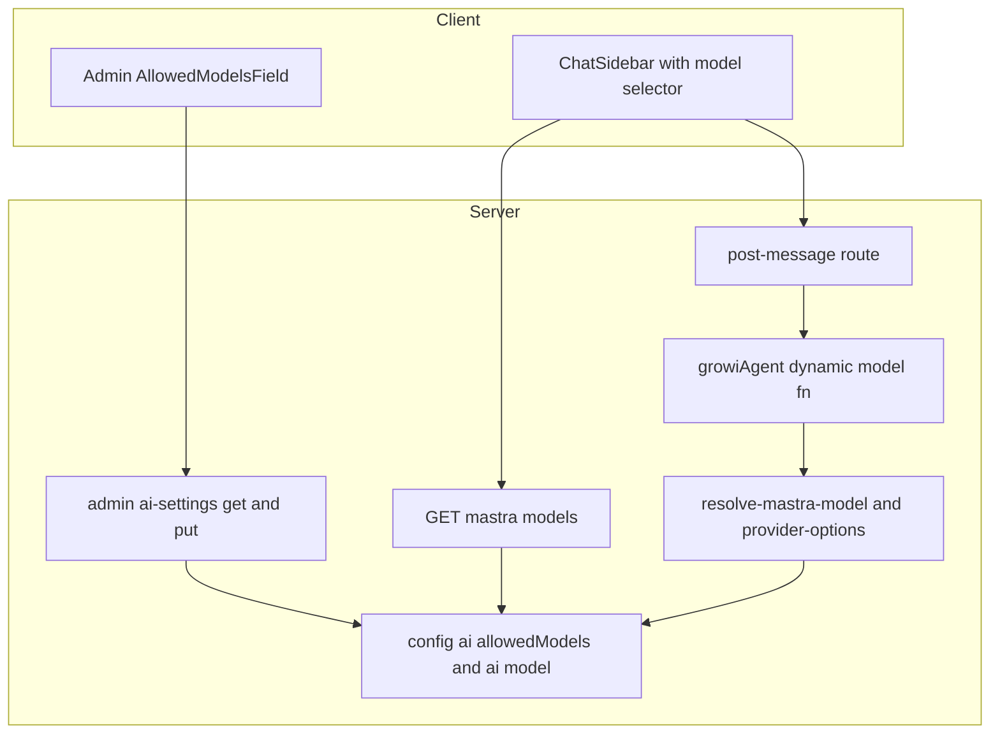
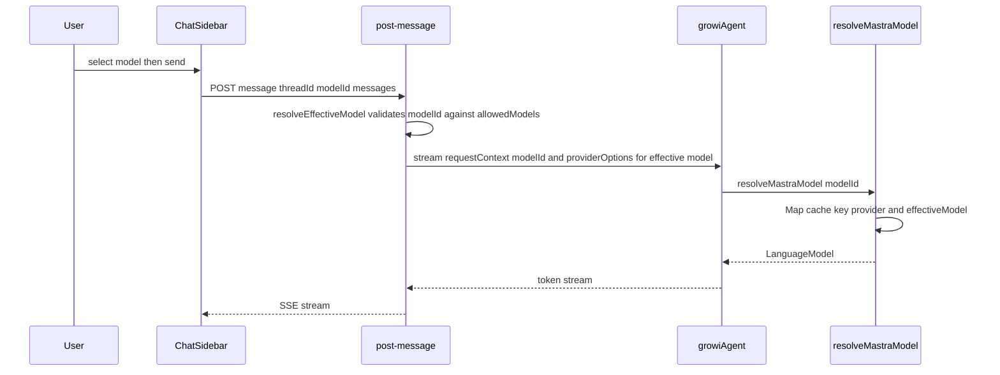
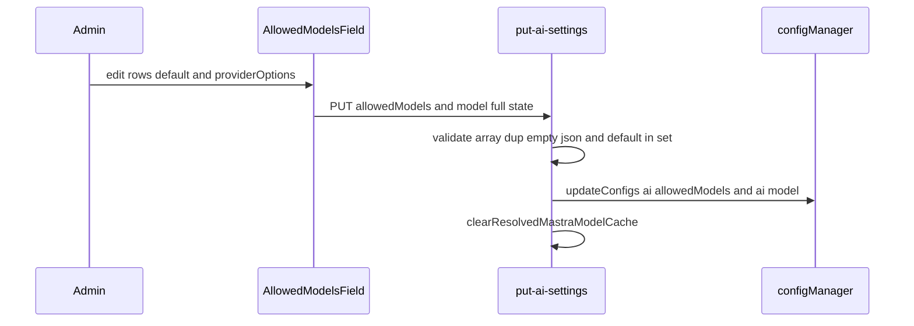
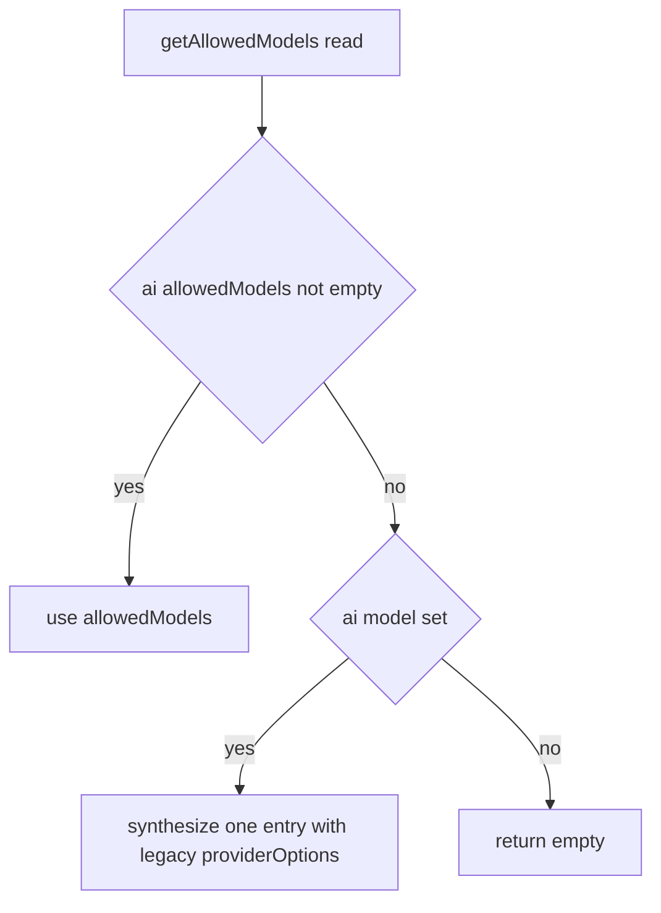

# Technical Design: mastra-multi-model-chat

## Overview

**Purpose**: Mastra AI チャットを「1 App = 1 モデル固定」から「管理者が許可した同一プロバイダ内の複数モデルを、エンドユーザーがチャットごとに選べる」形へ拡張する。

**Users**: 管理者は AI 設定画面で許可モデル集合（各モデルに任意の providerOptions）とデフォルトモデルを設定する。エンドユーザーはチャットのモデルセレクタからメッセージ単位でモデルを選ぶ。

**Impact**: 単一の `ai:model`（文字列）+ `ai:providerOptions`（単一 JSON、全 stream に一律適用）という現状を、`ai:allowedModels`（モデル + providerOptions を同梱した配列）+ デフォルト `ai:model` + リクエスト単位のモデル解決へ置き換える。プロバイダ/API キー（単一）と AI 有効性ゲーティングは不変。

### Goals
- 管理者が複数の許可モデルとモデルごとの providerOptions、デフォルトモデルを設定できる。
- エンドユーザーがチャットで許可モデルから選択し、その応答に選択モデル（とそのモデルの providerOptions）が使われる。
- 許可外モデルがサーバ側で使われない（クライアント値を信用しない）。
- 既存の単一モデル設定（DB / 環境変数）が無改変で動作し続ける。

### Non-Goals
- 異なるプロバイダのモデルを 1 つの許可リストに混在させること（モデル単位の別 provider/別 apiKey）。`ai:provider`/`ai:apiKey` は単一のまま。
- ベンダー API / レジストリからのモデル一覧自動取得。許可モデルは管理者の手入力。
- 会話（スレッド）ごとの選択モデルのサーバ永続化（選択は per-message）。
- AI 有効性ゲーティング・スレッド永続化・ストリーミング・エラーサニタイズの挙動変更。

## Boundary Commitments

### This Spec Owns
- 設定キー `ai:allowedModels`（`AllowedModel[]`）の定義・読取・書込・検証、および `ai:model` の「デフォルトモデル」への意味付け。
- 実効モデルと providerOptions の解決ロジック（`resolveEffectiveModel` / `resolveProviderOptions` / `resolveMastraModel(modelId?)`）と、許可リストに対するサーバ側検証。
- `growiAgent` のリクエスト単位モデル解決（動的モデル関数 + RequestContext の `modelId`）。
- 管理 UI の許可モデルリストエディタ（`ProviderCommonSettings` 内に単一配置）と GET/PUT 契約の拡張。
- チャット用モデル一覧エンドポイント `GET /_api/v3/mastra/models` と、チャット UI のモデルセレクタ配線。
- 単一モデル設定からの読取時フォールバック（後方互換）。

### Out of Boundary
- 複数プロバイダ混在（別 spec / 将来）。`multi-llm-provider` が扱うベンダー切替は据え置き。
- ベンダー API からのモデル一覧取得。
- 会話固定モデルのサーバ永続化。
- 既存 spec（`admin-ai-settings` / `multi-llm-provider`）のドキュメント更新は本 spec の**タスク**として行うが、本設計の実装対象コードではない（doc 同期は実装完了後）。
- スレッド永続化 / ストリーミング / エラーサニタイズ / AI 有効性ゲーティングの内部実装。

### Allowed Dependencies
- `~/server/service/config-manager`（`configManager`, `defineConfig`, config-loader のオブジェクト配列対応）。
- `@mastra/core`（Agent 動的モデル関数、`RequestContext`）、`@ai-sdk/*`（provider factory）。
- 既存 `provider-options-validation`（`isProviderNamespacedObject` / `isValidProviderOptionsJson`）。
- ベンダリング済み `~/components/ai-elements/prompt-input`（`PromptInputModelSelect*`）、`react-hook-form`（`useFieldArray`）、SWR。
- 依存方向（左→右、上位は下位を import しない）: `interfaces` → `config-definition` → `ai-sdk-modules`（resolvers）→ `mastra-modules`（agent）→ `routes` → `client`。

### Revalidation Triggers
- `AllowedModel` / `AiSettingsResponse` / `AiSettingsUpdateRequest` の形変更 → 管理 UI・`admin-ai-settings` spec 再確認。
- `ai:allowedModels` / `ai:model` / `ai:providerOptions` の意味・キー変更 → `admin-ai-settings`・`multi-llm-provider` spec 再確認。
- `GET /_api/v3/mastra/models` のレスポンス形変更、または post-message の `modelId` 受理契約変更 → チャットクライアント再確認。
- `resolveMastraModel` の引数/キャッシュ意味変更 → `multi-llm-provider` の解決設計と整合確認。

## Architecture

### Existing Architecture Analysis
現状は単一モデルの一本道カスケード（詳細は research.md §1）。要点のみ:
- config: `ai:provider` / `ai:apiKey` / `ai:model`（単一）/ `ai:providerOptions`（単一 JSON）/ `ai:azureOpenaiSettings`。`config-loader` は `typeof defaultValue === 'object'` のとき env を `JSON.parse`、DB 値も `JSON.parse`（オブジェクト配列対応済み）。
- 解決: `resolveMastraModel()`（引数なし・単一スロット memo）→ `modelResolvers[provider]()` → 各 resolver が `requireModel()` で `ai:model` を読む。
- agent: `growiAgent.model = () => resolveMastraModel()`（`requestContext` 無視）。
- 呼出: `post-message` が `RequestContext`（`user`/`searchService`）を構築し `growiAgent.stream(messages, { requestContext, memory, providerOptions: resolveProviderOptions() })`。
- 管理 UI: `ProviderCommonSettings`（provider/apiKey/model[非Azure]/providerOptions textarea）+ `AzureOpenaiSettings`（model=デプロイ名 + 接続）。FULL-STATE-REPLACE PUT、env-only ロック、保存後 `clearResolvedMastraModelCache()`。

維持する統合点: AI 有効性ゲート（`isAiReady()`/`ai-ready-guard`）、スレッド永続化、ストリーミング、`clearResolvedMastraModelCache()` の既存呼出（PUT / `model-config-sync`）。

### Architecture Pattern & Boundary Map



**Architecture Integration**:
- Selected pattern: 既存のデータ駆動ディスパッチ（`modelResolvers`）+ レイヤード解決を踏襲し、解決ロジックに `modelId` を一引数として通す Extension。
- 責務分離: 「解決の中核」(`ai-sdk-modules`) と「リクエスト供給」(`routes`) と「設定/表示」(`client`) を分離。検証は `resolveEffectiveModel` の一点に集約。
- 既存パターン維持: data-driven resolver マップ、RequestContext プラミング、FULL-STATE-REPLACE PUT、`clearResolvedMastraModelCache` 無効化。
- 新コンポーネント根拠: 許可リスト型（複数モデル表現）、リストエディタ UI（複数行編集）、chat models エンドポイント（クライアントは現状 AI 設定を取得しないため）。
- Steering 整合: feature ベース構成 / named export / co-located tests / `mock<T>` / immutable。

### Technology Stack

| Layer | Choice / Version | Role in Feature | Notes |
|-------|------------------|-----------------|-------|
| Frontend | React 18 + react-hook-form（`useFieldArray`）+ SWR + ベンダリング済み AI Elements `PromptInputModelSelect*` | 許可モデルリストエディタ / チャットのモデルセレクタ | 新規ライブラリ導入なし |
| Backend | Express apiv3 + `@mastra/core@1.41`（動的モデル関数・RequestContext）+ `@ai-sdk/*@3` | リクエスト単位モデル解決・検証・新 GET エンドポイント | 既存依存のみ |
| Data | MongoDB config（`config-manager`/`config-loader`） | `ai:allowedModels`（オブジェクト配列）永続化 | ローダーは object/array を JSON 透過。env `AI_ALLOWED_MODELS` は JSON 文字列 |

新規依存なし。逸脱は「`ai:providerOptions` を deprecated（読取専用 legacy）化」「モデル欄を Azure 専用セクション → 共通設定へ移設」。

## File Structure Plan

### Created
```
apps/app/src/features/mastra/
├── interfaces/
│   └── allowed-model.ts                 # AllowedModel / ModelProviderOptions（leaf 型）
├── server/routes/
│   └── get-models.ts                    # GET /_api/v3/mastra/models（許可モデル+デフォルト）
└── client/
    ├── admin/
    │   └── AllowedModelsField.tsx        # useFieldArray の許可モデルリストエディタ（ModelField を置換）
    └── stores/
        └── models.tsx                    # SWR: チャット用許可モデル取得フック
```
（各 `*.spec.ts(x)` を co-located で追加）

### Modified
- `apps/app/src/server/service/config-manager/config-definition.ts` — `ai:allowedModels` 追加、env-only `targetKeys` 更新（`ai:allowedModels` 追加 / `ai:providerOptions` は legacy として残置）。
- `apps/app/src/features/mastra/interfaces/ai-settings.ts` — `AiSettingsResponse`/`AiSettingsUpdateRequest` に `allowedModels` 追加、`AI_SETTING_KEYS` から `ai:providerOptions` 除去・`ai:allowedModels` 追加。
- `ai-sdk-modules/llm-providers/config.ts` — `requireModel()` → `resolveEffectiveModel(modelId?)` / `getAllowedModels()` / `resolveProviderOptions(modelId?)`（後者は resolve-provider-options へ移すか本ファイルに集約：下記 Components 参照）。
- `ai-sdk-modules/llm-providers/{index,openai,anthropic,google,azure-openai}.ts` — resolver を `(model: string) => MastraModelConfig` に変更（model を引数受け取り）。
- `ai-sdk-modules/resolve-mastra-model.ts` — `resolveMastraModel(modelId?)` + `Map` キャッシュ。
- `ai-sdk-modules/resolve-provider-options.ts` — `resolveProviderOptions(modelId?)`（許可リストのエントリから解決）。
- `mastra-modules/agents/growi-agent.ts` — `model: ({ requestContext }) => resolveMastraModel(requestContext.get('modelId'))`。
- `mastra-modules/types/request-context.ts` — `MastraRequestContextShape` に `modelId?: string`。
- `server/routes/post-message.ts` / `post-message-validator.ts` / `routes/index.ts` — `modelId` 受理・RequestContext 設定・providerOptions を実効モデルで解決 / 新 GET ルート登録。
- `server/routes/admin-ai-settings/{get,put}-ai-settings.ts` — `allowedModels` 読取/検証/保存、`model ∈ allowedModels` 検証、`ai:providerOptions` 書込み除去。
- `client/admin/ai-settings-form-values.ts` — 作業コピーを `allowedModels:{model;providerOptionsText}[]` + `defaultModel` に変更、`toFormValues`/`buildUpdateRequest` の変換追加。
- `client/admin/ProviderCommonSettings.tsx` — `AllowedModelsField` を配置（provider 監視でラベル切替）、providerOptions textarea と 非Azure ModelField 呼出を除去。
- `client/admin/AzureOpenaiSettings.tsx` — `ModelField` 呼出を除去（接続設定のみ）。
- `client/admin/ModelField.tsx` — 削除（`AllowedModelsField` へ置換）。
- `client/components/ChatSidebar/ChatSidebar.tsx` / `chat-sidebar-helpers.ts` — モデルセレクタ mount、`sendMessage(...,{ body:{ modelId } })`、許可モデル取得フック利用。
- （再利用・無改変）`components/ai-elements/prompt-input.tsx`。

依存方向（再掲）: `interfaces` → `config-definition` → `ai-sdk-modules` → `mastra-modules` → `routes` → `client`。上位 import 禁止。

## System Flows

### チャット送信時のモデル解決

ゲート: `modelId` 未指定/許可外 → `resolveEffectiveModel` がデフォルトに丸め（4.2/4.3）。providerOptions は実効モデルのエントリから解決し stream に渡す（4.4/2.2）。

### 管理保存

env-only 有効時は PUT を 422（1.6）。保存後キャッシュ全消去で再起動なし反映（1.2）。

## Requirements Traceability

| Requirement | Summary | Components | Interfaces / Contracts | Flows |
|-------------|---------|------------|------------------------|-------|
| 1.1 | 許可集合の永続化 | Config, put-ai-settings, AllowedModelsField | `ai:allowedModels`, `AiSettingsUpdateRequest.allowedModels`, PUT | 管理保存 |
| 1.2 | 再起動なし反映 | put-ai-settings, resolve-mastra-model | `clearResolvedMastraModelCache()` | 管理保存 |
| 1.3 | デフォルト保持 | Config, get/put-ai-settings | `ai:model`, `AiSettingsResponse.model` | 管理保存 |
| 1.4 | 空/重複の拒否 | put-ai-settings (validator) | array validator | 管理保存 |
| 1.5 | デフォルト∈集合 検証 | put-ai-settings (validator) | 422 | 管理保存 |
| 1.6 | env-only 読取専用 | put-ai-settings, ProviderCommonSettings/AllowedModelsField | env-only 422 / disabled | 管理保存 |
| 2.1 | モデル別 options 設定 | AllowedModelsField, Config | `AllowedModel.providerOptions` | 管理保存 |
| 2.2 | 使用モデルにのみ適用 | resolve-provider-options, post-message | `resolveProviderOptions(modelId)` | チャット送信 |
| 2.3 | 空=options なし | AllowedModelsField, put-ai-settings | parse 省略 | 管理保存 |
| 2.4 | 不正 JSON 拒否 | AllowedModelsField, put-ai-settings | `isValidProviderOptionsJson` | 管理保存 |
| 2.5 | グローバル options なし | resolve-provider-options | `resolveProviderOptions(modelId?)` のみ | チャット送信 |
| 3.1 | 許可モデルのセレクタ | ChatSidebar, models store, GET models | `GET /_api/v3/mastra/models` | — |
| 3.2 | 初期=デフォルト | ChatSidebar | `defaultModelId` | — |
| 3.3 | メッセージ単位選択 | ChatSidebar, chat-sidebar-helpers | `sendMessage body modelId` | チャット送信 |
| 3.4 | 会話途中切替 | ChatSidebar | per-call body | チャット送信 |
| 3.5 | 単一許可時の選択状態 | ChatSidebar | selector value | — |
| 4.1 | 許可内モデルを使用 | post-message, resolve-mastra-model | `resolveEffectiveModel` | チャット送信 |
| 4.2 | 許可外→デフォルト | resolve-mastra-model (config) | `resolveEffectiveModel` fallback | チャット送信 |
| 4.3 | 未指定→デフォルト | post-message, resolve-mastra-model | 同上 | チャット送信 |
| 4.4 | options を使用モデルに一致 | post-message, resolve-provider-options | `resolveProviderOptions(effective)` | チャット送信 |
| 4.5 | provider エラーは安全表示 | post-message（既存） | `resolveChatErrorMessage`（無改変） | チャット送信 |
| 5.1 | 単一→デフォルト+1エントリ | config (getAllowedModels) | 読取時フォールバック | — |
| 5.2 | legacy global options 引継 | config (getAllowedModels) | `ai:providerOptions` legacy 読取 | — |
| 5.3 | 既存スレッド維持 | （無改変） | — | — |
| 6.1 | AI 無効時チャット不可 | （既存ゲート無改変） | `isAiReady`/`ai-ready-guard` | — |
| 6.2 | AI 無効でも設定可 | get/put-ai-settings | ai-ready ガードなし（既存） | — |

## Components and Interfaces

| Component | Domain/Layer | Intent | Req Coverage | Key Dependencies | Contracts |
|-----------|--------------|--------|--------------|------------------|-----------|
| AllowedModel 型 | interfaces | 許可モデル1件の型 | 1,2 | `ai`(JSONValue, type-only) (P0) | State |
| config `ai:allowedModels` | config | 許可リスト永続化 | 1,2,5 | config-loader (P0) | State |
| model 解決サービス | server/ai-sdk-modules | 実効モデル+options 解決・検証 | 2,4,5 | config (P0), modelResolvers (P0) | Service |
| growiAgent 動的モデル | server/mastra-modules | per-request モデル適用 | 4 | resolve-mastra-model (P0), RequestContext (P0) | Service |
| post-message 拡張 | server/routes | modelId 受理・適用 | 3,4 | 解決サービス (P0), validator (P0) | API |
| admin ai-settings 拡張 | server/routes | 許可リスト read/write/検証 | 1,2,6 | config (P0), validators (P0) | API |
| GET mastra models | server/routes | チャットへ許可リスト供給 | 3 | config (P0), ai-ready-guard (P1) | API |
| AllowedModelsField | client/admin | 許可リストエディタ UI | 1,2 | useFieldArray (P0), 既存バリデータ (P1) | State |
| ChatSidebar 拡張 | client/chat | モデルセレクタ+送信 | 3 | PromptInputModelSelect (P0), models store (P0) | State |

### interfaces / config

#### AllowedModel（型）
**Contracts**: State

```typescript
import type { JSONValue } from 'ai';

/** AI SDK providerOptions 形（provider 名前空間 -> オプション）。既存 MastraProviderOptions と同形。 */
export type ModelProviderOptions = Record<string, Record<string, JSONValue>>;

/** 許可モデル1件。model はモデル ID（Azure OpenAI ではデプロイ名）。 */
export interface AllowedModel {
  readonly model: string;
  readonly providerOptions?: ModelProviderOptions;
}
```

#### config `ai:allowedModels`
```typescript
'ai:allowedModels': defineConfig<AllowedModel[] | undefined>({
  envVarName: 'AI_ALLOWED_MODELS',  // JSON 配列文字列
  defaultValue: [],                 // object → loader が env/DB を JSON 透過
}),
```
- `ai:model`（既存、デフォルトモデル）は維持。`ai:providerOptions` は deprecated（読取専用 legacy・`AI_SETTING_KEYS`/UI/PUT から除去、env-only には残置）。
- env-only `targetKeys` に `ai:allowedModels` 追加。

### server / ai-sdk-modules（model 解決サービス）

**Responsibilities & Constraints**: 実効モデルの決定・許可検証・providerOptions 解決・LanguageModel 構築を担う唯一の場所。クライアント値（`modelId`）は信用せず必ず許可リストで検証（Security）。

**Dependencies**: Inbound: post-message / growiAgent (P0)。Outbound: `configManager` (P0), `modelResolvers` (P0)。

**Contracts**: Service

```typescript
// llm-providers/config.ts（共通アクセサ）
/** 許可モデル一覧。空かつ ai:model 有のとき読取時フォールバックで [{model: ai:model, providerOptions?: legacy}] を合成（5.1/5.2）。 */
export const getAllowedModels = (): AllowedModel[];

/** 実効モデル ID を決定。modelId が許可集合内ならそれ、無ければ ai:model、どちらも無ければ throw（4.1/4.2/4.3）。 */
export const resolveEffectiveModel = (modelId?: string): string;

// resolve-provider-options.ts
/** 実効モデルのエントリの providerOptions を返す（無ければ {}）。グローバル一律は持たない（2.2/2.5）。 */
export const resolveProviderOptions = (modelId?: string): MastraProviderOptions;

// llm-providers/index.ts（model を引数受け取りに変更）
export const modelResolvers: Record<AiProvider, (model: string) => MastraModelConfig>;

// resolve-mastra-model.ts
/** 実効モデルを解決し provider 別 resolver で構築。Map キャッシュ key=`${provider}:${effective}`。 */
export const resolveMastraModel = (modelId?: string): MastraModelConfig;
export const clearResolvedMastraModelCache = (): void; // Map 全消去
```
- Preconditions: `ai:provider` が有効（既存 `isAiProvider` 検証を維持）。
- Postconditions: 返る `MastraModelConfig` は実効モデルに対応。Azure+Entra のトークンキャッシュはキャッシュ済みオブジェクト内に保持。
- Invariants: 実効モデルは常に許可集合内（フォールバック後も）か、構築不能なら throw。

**Implementation Notes**
- Integration: `growi-agent.ts` の `model` を `({ requestContext }) => resolveMastraModel(requestContext.get('modelId'))` に。各 provider resolver は `create*({apiKey})(model)` の `model` を引数化。
- Validation: `resolveEffectiveModel` に許可検証を集約（防御の最終段）。
- Risks: 単一スロット→Map 化で Azure+Entra トークンキャッシュを退行させない（モデルオブジェクト単位でキャッシュ）。

### server / routes

#### post-message 拡張
**Contracts**: API

##### API Contract
| Method | Endpoint | Request | Response | Errors |
|--------|----------|---------|----------|--------|
| POST | `/_api/v3/mastra/message` | `{ threadId?, modelId?: string, messages }` | SSE UI message stream | 400(validation), 500 |

- `post-message-validator`: `body('modelId').isString().optional()` を追加。
- route: `modelId` を `requestContext.set('modelId', modelId)`、`providerOptions: resolveProviderOptions(modelId)`（実効モデルで解決）。許可外/未指定はサービス側でデフォルトに丸め（4.2/4.3）。provider エラーは既存 `resolveChatErrorMessage` で安全表示（4.5、無改変）。

#### GET mastra models（新規）
**Contracts**: API

##### API Contract
| Method | Endpoint | Request | Response | Errors |
|--------|----------|---------|----------|--------|
| GET | `/_api/v3/mastra/models` | — | `{ models: { id: string; name: string }[]; defaultModelId: string }` | 401, 403 |

- 認証: login required + scope `READ.FEATURES.AI` + ai-ready ガード（AI 有効時のみ）。
- `models` は `getAllowedModels().map(m => ({ id: m.model, name: m.model }))`（フレンドリ名は無いので id=name）。`defaultModelId = resolveEffectiveModel()`。**providerOptions はクライアントへ返さない**（サーバ専用）。

#### admin ai-settings 拡張（get/put）
**Contracts**: API

##### API Contract
| Method | Endpoint | Request | Response | Errors |
|--------|----------|---------|----------|--------|
| GET | `/_api/v3/ai-settings` | — | `AiSettingsResponse`（`allowedModels` 追加） | 401,403 |
| PUT | `/_api/v3/ai-settings` | `AiSettingsUpdateRequest`（`allowedModels?` 追加, `providerOptions` 削除） | 204 | 400,422(env-only / 整合) |

```typescript
export interface AiSettingsResponse {
  aiEnabled: boolean;
  provider?: AiProvider;
  model?: string;                 // デフォルトモデル
  allowedModels: AllowedModel[];  // 常に存在（既定 []）
  azureOpenaiSettings: AzureOpenaiConfig;
  isApiKeySet: boolean;
  useOnlyEnvVars: boolean;
  isConfigured: boolean;
}
export interface AiSettingsUpdateRequest {
  aiEnabled?: boolean;
  provider?: AiProvider;
  apiKey?: string;
  model?: string;                  // デフォルトモデル
  allowedModels?: AllowedModel[];  // FULL-STATE-REPLACE
  azureOpenaiSettings?: AzureOpenaiConfig;
}
```
- PUT バリデーション: `allowedModels` は配列・各要素 `model` 非空文字列・`model` 重複禁止（1.4）、各 `providerOptions` は `isValidProviderOptionsJson` 相当（2.4）、`model`(デフォルト) ∈ `allowedModels`（1.5・両者指定時）。env-only 422（1.6）。保存後 `clearResolvedMastraModelCache()`（1.2）。
- `AI_SETTING_KEYS`: `ai:providerOptions` を除去し `ai:allowedModels` を追加。

### client / admin（AllowedModelsField）
**Contracts**: State（presentational + RHF）

**Implementation Notes**
- `useFieldArray({ name: 'allowedModels' })`。各行 = モデル ID 入力 + 「既定」ラジオ（`defaultModel` にバインド、リスト内 1 つ）+ 折りたたみ providerOptions JSON textarea（`isValidProviderOptionsJson` で `validate`）+ 削除。「+ モデルを追加」。
- `ProviderCommonSettings` に単一配置。ラベルは `watch('provider') === 'azure-openai'` のとき「デプロイ名」、他は「モデル」。env-only 時 `disabled`。
- 旧 `ModelField`/providerOptions textarea を撤去。
- フォーム作業コピー（`ai-settings-form-values.ts`）:
```typescript
export interface AiSettingsFormValues {
  aiEnabled: boolean;
  provider: AiProvider | '';
  apiKey: string;
  defaultModel: string;
  allowedModels: { model: string; providerOptionsText: string }[];
  azureOpenaiSettings: Required<AzureOpenaiConfig>;
}
```
`toFormValues`: `allowedModels` の `providerOptions` を `JSON.stringify`（無ければ ''）→ `providerOptionsText`、`model`→`defaultModel`。`buildUpdateRequest`: `providerOptionsText` を `JSON.parse`（空→省略）して `AllowedModel.providerOptions`、`defaultModel`→`model`。

### client / chat（ChatSidebar 拡張）
**Contracts**: State

**Implementation Notes**
- 新 SWR フック（`stores/models.tsx`）で `GET /_api/v3/mastra/models` を取得 → `{ models, defaultModelId }`。
- `const [model, setModel] = useState(defaultModelId)`。`PromptInputModelSelect`（value/onValueChange）+ `PromptInputModelSelectItem` を `models` で map。
- 送信は `sendMessage({ text }, { body: { modelId: model } })`（transport は `[chatThreadId]` メモ化のため per-call body）。`chat-sidebar-helpers` の transport body は `{ threadId }` のまま、`modelId` は per-call で合流（サーバは `{threadId, modelId, messages}` を受領）。
- 単一モデル時はその値を選択状態表示（3.5）。

## Data Models

### config（保存値）
- `ai:allowedModels: AllowedModel[]`（DB は JSON 配列、env `AI_ALLOWED_MODELS` は JSON 文字列）。
- `ai:model: string`（デフォルトモデル、既存）。`ai:providerOptions: string`（legacy・読取専用）。

### API DTO
- GET/PUT は上記 `AiSettingsResponse`/`AiSettingsUpdateRequest`。`allowedModels` は providerOptions をネストオブジェクトで授受。
- `GET /_api/v3/mastra/models` は providerOptions を含まない `{ id, name }[]` + `defaultModelId`。

### フォーム作業コピー
- providerOptions は textarea 編集のため **生 JSON 文字列**（`providerOptionsText`）で保持し、保存/読込時に parse/stringify 変換（上記）。

## Error Handling

### Error Strategy
- 入力検証は早期・フィールド単位（fail fast）。チャットの実行時失敗は安全メッセージで graceful degradation。

### Error Categories and Responses
- User(4xx/422): 空/重複モデル ID、デフォルト∈集合違反、不正 providerOptions JSON → PUT 422 + フィールドエラー（1.4/1.5/2.4）。env-only 中の PUT → 422（1.6）。
- System(5xx): provider 呼出失敗はストリームのエラーチャンク → `resolveChatErrorMessage` で機密を含まない 1 行に（4.5、無改変）。
- Business(防御): クライアント `modelId` が許可外 → エラーではなくデフォルトに丸め（4.2、監査ログ出力）。

### Monitoring
- 許可外 `modelId` のフォールバック発生時に `logger.warn`（モデル名のみ、秘匿情報なし）。トークン使用量ログは既存どおり。

## Testing Strategy

### Unit Tests
- `resolveEffectiveModel`: 許可内→そのまま / 許可外→デフォルト / 未指定→デフォルト / 許可・デフォルト共に無→throw（4.1-4.3）。
- `getAllowedModels`: `ai:allowedModels` 有→そのまま / 空かつ `ai:model` 有→`[{model, providerOptions: legacy}]` 合成（5.1/5.2）。
- `resolveProviderOptions(modelId)`: 該当エントリの options / 無し→`{}` / 許可外→デフォルトの options（2.2/2.5）。
- `resolveMastraModel`: Map キャッシュキー（同 model は 1 回構築）/ `clearResolvedMastraModelCache` で再構築。
- put-ai-settings バリデータ: 配列・重複・空・`model∈allowedModels`・不正 providerOptions JSON（1.4/1.5/2.4）。

### Integration Tests
- PUT→GET ラウンドトリップで `allowedModels`/`model` が往復（1.1/1.3）。env-only で PUT 422（1.6）。
- post-message: 許可内 `modelId` がそのモデルで応答 / 許可外 `modelId` がデフォルトにフォールバック（4.1/4.2）。providerOptions が実効モデルのものを使用（4.4）。
- `GET /_api/v3/mastra/models` が許可モデル+デフォルトを返す（providerOptions 非含、3.1/3.2）。

### Component Tests
- `AllowedModelsField`: 行の追加/削除 / 既定ラジオ単一性 / providerOptions 折りたたみ・不正 JSON エラー / env-only disabled / Azure 時ラベル「デプロイ名」（1.x/2.x）。
- `ChatSidebar`: セレクタ初期値=デフォルト、選択変更で `sendMessage` の body に `modelId` が載る（3.2/3.3）。
- テストは観測可能な契約をアサート、`mock<T>()`（vitest-mock-extended）を使用。

## Security Considerations
- **サーバ側許可検証（必須）**: チャットの `modelId` はクライアント由来のため信用しない。`resolveEffectiveModel` で必ず `ai:allowedModels` に対し検証し、許可外は使用しない（デフォルトに丸め）。これにより改ざん/古いクライアントが任意モデルを選ぶことを防ぐ。
- **秘匿情報**: `ai:apiKey` は GET で返さない（既存）。providerOptions はチャットクライアントへ送らない。`GET /_api/v3/mastra/models` はモデル ID のみ返す。
- 管理 API は `READ/WRITE.ADMIN.AI`、チャット API は login + `*.FEATURES.AI`（既存スキームを踏襲）。

## Migration Strategy
方式 = **読取時フォールバック（非破壊・マイグレーションスクリプト不採用）**。理由: env-only 構成は DB を持たないため DB マイグレーションで移行不可。読取時フォールバックは DB / env 両構成を同一ロジックで吸収する。


- 管理者が新 UI で保存すると `ai:allowedModels` が埋まり、以降フォールパスは通らない（legacy `ai:providerOptions` も以後無視）。
- ロールバック: `ai:allowedModels` を削除すれば旧単一モデル挙動（`ai:model`+legacy options）に戻る。
