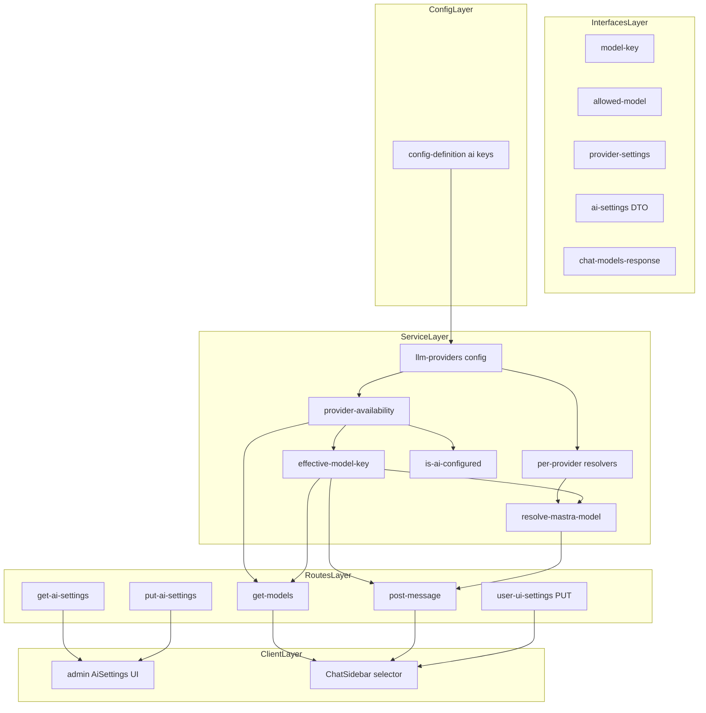
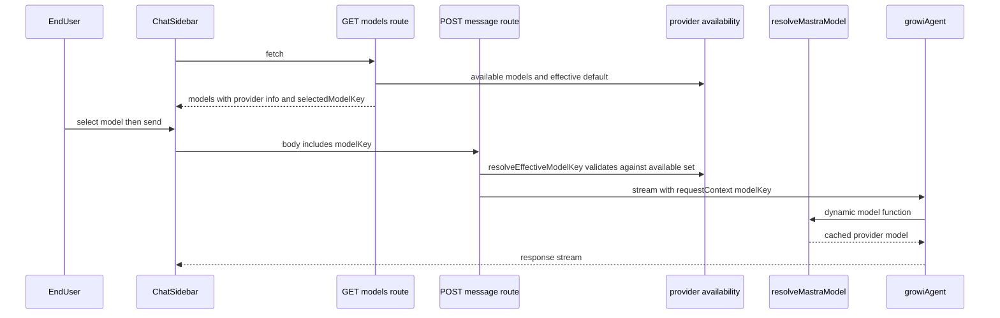

# Technical Design: mastra-multi-provider

## Overview

**Purpose**: 本機能は GROWI の AI 機能(Mastra チャット)を「1 App = 単一プロバイダ」から「1 App = 複数プロバイダの同時利用」へ拡張する。管理者は対応 4 プロバイダ(OpenAI / Anthropic / Google / Azure OpenAI)を固定の設定領域で同時に構成・有効/無効切替し、エンドユーザーはプロバイダ横断の許可モデルからチャットごとにモデルを選択できる。

**Users**: セルフホスティング GROWI の管理者・運用者(プロバイダ構成・モデル統制)、チャットを利用するエンドユーザー(横断モデル選択)。

**Impact**: 既存の単一プロバイダ設定(`ai:provider` / `ai:apiKey` / `ai:azureOpenaiSettings`)を新しい複数プロバイダ設定(`ai:providers` / `ai:providerApiKeys`)へ**置換**する(移行なし・プレリリース前提)。許可モデルは (provider, modelId) の組となり、境界を渡るモデル識別子は複合キー `${provider}/${modelId}`(**modelKey**)に統一する。モデル解決・可用性判定・管理 UI・チャット UI を多プロバイダ前提へ再構成するが、既存の検証済み機構(動的モデル関数・解決キャッシュ・カタログ picker・ライブ getter 注入・選択永続化)はすべて温存・流用する。

### Goals

- 対応 4 プロバイダの同時構成(各種 1 つ、資格情報の独立永続化・有効/無効トグル)
- プロバイダ横断の許可モデル集合とグローバル既定モデル(ちょうど 1 つ)
- チャットでのプロバイダ横断モデル選択(判別可能な表示・選択の永続化・サーバ検証)
- env-only モードの部分ロック(接続設定 = env のみ、モデル設定 = UI 編集可)
- 一部プロバイダ不備時の部分縮退(除外 + ログ + 継続)

### Non-Goals

- 同一プロバイダ種の複数構成、プロバイダ種の追加、プロバイダ設定領域の動的な追加・削除
- 保存済み API キーの消去操作(上書きのみ)
- レガシー `openai:*` 系統(suggest-path 等)の統合・変更
- 実行時の外部通信によるモデル一覧取得、カタログ vendoring の変更(ai-settings-model-picker の資産をそのまま利用)
- 旧設定からの自動移行(migration)

## Boundary Commitments

### This Spec Owns

- AI プロバイダ構成の**データモデルと config スキーマ**: `ai:providers` / `ai:providerApiKeys` / `ai:allowedModels`(provider フィールド付き)、および env-only グループ `env:useOnlyEnvVars:ai` の targetKeys
- **モデル識別子の規約**: modelKey(`${provider}/${modelId}`)の生成・解析ルール
- **可用性判定の意味論**: 構成済み/有効の述語、部分縮退、実効既定モデルの決定
- 管理 AI 設定 API(GET/PUT `/ai-settings`)と管理画面 UI(AiSettings 一式)
- チャットモデル選択 API(GET `/mastra/models`、POST `/mastra/message` の modelKey)とチャット側セレクタ UI(`ai-elements/prompt-input` への Group/Label ラッパの**追加的** export を含む — 既存 export の変更は不可)
- `UserUISettings.aiChatSelectedModelKey` フィールド(旧 `aiChatSelectedModelId` の置換)

### Out of Boundary

- レガシー `openai:*` 設定と `features/ai-tools`(suggest-path)・`features/openai` — 現状のまま
- カタログデータの vendoring・フィルタ(`model-catalog-data.json` / `chat-model-filter.ts` / `bin/vendor-model-catalog.ts`)— ai-settings-model-picker の所管
- Mastra エージェント本体(tools・memory・stream 処理)— `growi-agent.ts` は modelKey の受け渡し行のみ変更
- `crowi.isAiReady()` の外部契約(boolean のまま。内部意味論のみ本 spec が変更)
- SSR 共通 props(`aiEnabled: boolean` のまま変更なし)

### Allowed Dependencies

- config-manager 基盤(`defineConfig` / `ENV_ONLY_GROUPS` / s2s `configUpdated`)
- `@ai-sdk/{openai,anthropic,google,azure}` ^3 の provider factory、`@mastra/core` ^1.32 の動的モデル関数と `RequestContext`
- picker 資産: `get-available-models` ルート・`use-selectable-models` フック・同梱カタログ(provider 引数を取る現行契約のまま)
- `~/components/ui/select`(SelectGroup / SelectLabel)と `ai-elements/prompt-input` のベンダリング部品
- UserUISettings 基盤(mongoose モデル・PUT ルート・`scheduleToPut`)

依存方向(右のモジュールが左を import する。逆は違反): **interfaces → config-manager 定義 → server services(config アクセサ → provider-availability → 実効キー解決 → resolve)→ routes → client stores/hooks → client components**。client から server への import も違反。

### Revalidation Triggers

- `AllowedModel` / `AiSettingsResponse` / `AiSettingsUpdateRequest` / `ChatModelsResponse` の形状変更
- modelKey の書式(セパレータ・解析規則)変更
- env var 名(`AI_PROVIDERS` / `AI_PROVIDER_API_KEYS` / `AI_ALLOWED_MODELS`)・`ENV_ONLY_GROUPS` targetKeys の変更
- `UserUISettings` フィールドの変更(PUT ルートのハードコード allow-list と連動)
- **前提条件**: 本 spec の実装は ai-settings-model-picker(現行ブランチ)のマージ後に着手する(同一ファイル群を変更するため)

## Architecture

### Existing Architecture Analysis

現行(mastra-multi-model-chat + ai-settings-model-picker 実装済み)は「グローバル単一 `ai:provider` + 共用 `ai:apiKey`」を前提に、`modelResolvers: Record<AiProvider, (modelId) => MastraModelConfig>` で resolver をディスパッチする。温存するパターン:

- **メタデータ駆動のプロバイダ宣言**(`AI_PROVIDER_DEFS`)と Record ディスパッチ
- **動的モデル関数**: `growiAgent` の `model: ({ requestContext }) => resolveMastraModel(...)`
- **解決キャッシュ + 無効化**: `resolvedModelCache`(Map)+ `clearResolvedMastraModelCache()`(設定保存時 + s2s `configUpdated`)
- **サーバ検証 = 認可境界**: クライアント値を信用せず allow-list へ丸める
- **秘匿規律**: キー値を返さない・request body をログに出さない
- **full-state replace の PUT** と write-only apiKey フィールド

変更する単一プロバイダ前提: グローバル provider 読取(resolve-mastra-model L30)、共用 `getApiKey()`、素の modelId による許可判定・重複禁止・永続化。

### Architecture Pattern & Boundary Map



**Key Decisions**:

- **modelKey 規約(D1)**: 境界を渡るスカラー識別子は `${provider}/${modelId}`。解析は「最初の `/` で分割」する pure 関数のみが行い、他所は不透明文字列として扱う。config 保存形は `AllowedModel.provider`(必須)で構造化し、保存データに文字列エンコードを持ち込まない。Azure デプロイ名の文字種(英数字・`_`・`()`・`-`・`.`、`/` 不可)によりセパレータは衝突しない。
- **秘匿/非秘匿の key 分離(D2)**: `ai:providers`(非秘匿: enabled + Azure 接続設定)と `ai:providerApiKeys`(isSecret)を分ける。管理 API は前者を素通しで返せ、後者は存在フラグのみ返す。
- **可用性判定の一元化(D3)**: 「有効なプロバイダ」(enabled ∧ 構成済み)と「有効なモデル集合」の導出を `provider-availability.ts` に集約し、`isAiConfigured` / `get-models` / `resolveEffectiveModelKey` が共有する。判定 drift を構造的に防ぐ。
- **Mastra ルーター文字列は不使用**: resolver は ai-sdk factory で構築済みモデルを返すため、modelKey は GROWI コード内でのみ解釈される(Mastra の "provider/model" マジック文字列と競合しない)。

### Technology Stack

| Layer | Choice / Version | Role in Feature | Notes |
|-------|------------------|-----------------|-------|
| Frontend | React 18 + Next.js Pages Router / react-hook-form / SWR | 管理フォーム(providers Record + allowedModels 配列)・チャットセレクタ | 新規依存なし。`ui/select` の SelectGroup/SelectLabel を再利用 |
| Backend | Express apiv3 + express-validator / config-manager | 設定 API・検証・env-only 部分ロック | ENV_ONLY_GROUPS の targetKeys 差し替えのみ |
| LLM | `@ai-sdk/*` ^3 / `@mastra/core` ^1.32 | provider factory・動的モデル関数・RequestContext | バージョン変更なし |
| Data | MongoDB Config KV(JSON 値)/ UserUISettings | 新 config キー 2 つ・選択モデルキー永続化 | スキーマ変更は UserUISettings の 1 フィールドのみ |

## File Structure Plan

すべて `apps/app/src` 配下。**依存方向**(Boundary Commitments 参照)に従い、下層から実装する。

### New Files

```
features/mastra/interfaces/
├── model-key.ts                  # modelKey の生成・解析 (buildModelKey / parseModelKey / MAX_MODEL_KEY_LENGTH)
└── provider-settings.ts          # AiProviderSettings / AiProvidersConfig / AiProviderApiKeys 型

features/mastra/server/services/ai-sdk-modules/llm-providers/
├── warn-dedup.ts                 # (キー/プロバイダ, 理由) 単位の warn dedup レジストリ + clearAvailabilityLogDedup()。config アクセサと provider-availability が共用
├── provider-availability.ts      # 有効プロバイダ判定・有効モデル集合・不備ログ (warn-dedup を利用)
└── effective-model-key.ts        # 実効既定モデルの決定・リクエスト時の実効キー解決 (availability 連携。config.ts に置くと config ⇄ availability の循環 import になるため分離)

features/mastra/client/admin/
├── DefaultModelSelector.tsx      # グローバル既定モデルのプロバイダ横断ドロップダウン (モック gd 部)
├── ProviderTabs.tsx              # プロバイダタブバー + 構成状態ドット (モック tabs 部)
└── ProviderPanel.tsx             # プロバイダ 1 件分: 有効トグル・API キー・モデル一覧・Azure 設定の配置 (モック ProviderPanel)
```

### Modified Files

**interfaces(共有 DTO)**
- `features/mastra/interfaces/allowed-model.ts` — `AllowedModel` に必須 `provider` 追加。`isModelInAllowList(provider, modelId, list)` へ変更。`MAX_MODEL_ID_LENGTH` は model-key.ts の `MAX_MODEL_KEY_LENGTH` へ移管
- `features/mastra/interfaces/ai-settings.ts` — `AiSettingsResponse` / `AiSettingsUpdateRequest` を providers Record 形へ。`AI_SETTING_KEYS` を新キー集合へ
- `features/mastra/interfaces/chat-models-response.ts` — `{ models: ChatModelEntry[]; selectedModelKey }` へ
- `interfaces/user-ui-settings.ts` — `aiChatSelectedModelId` → `aiChatSelectedModelKey`

**config**
- `server/service/config-manager/config-definition.ts` — `ai:provider` / `ai:apiKey` / `ai:azureOpenaiSettings` を削除、`ai:providers`(`AI_PROVIDERS`)・`ai:providerApiKeys`(`AI_PROVIDER_API_KEYS`, isSecret)を追加。`ENV_ONLY_GROUPS` の ai グループ targetKeys を `['app:aiEnabled', 'ai:providers', 'ai:providerApiKeys']` へ(allowedModels を除外 = R5.3)

**server services**
- `.../llm-providers/config.ts` — アクセサをプロバイダ引数付きへ(`getApiKey(p)` / `requireApiKey(p)` / `getProviderSettings(p)`)。availability / effective-model-key は import しない(現行 `resolveEffectiveModelId` / `getDefaultModelId` 相当は新設 `effective-model-key.ts` へ移設 — New Files 参照)
- `.../llm-providers/{openai,anthropic,google,azure-openai}.ts` — 自プロバイダ名で `requireApiKey('openai')` 等を呼ぶ。azure は `getProviderSettings('azure-openai')?.azureOpenaiSettings` を読む
- `.../resolve-mastra-model.ts` — `resolveMastraModel(modelKey?)`: 実効キー解決 → parse → dispatch。キャッシュキー = modelKey。`clearResolvedMastraModelCache` は現行の呼び出し契約のまま
- `.../resolve-provider-options.ts` — `getProviderOptionsForModel(modelKey)`: (provider, modelId) 照合
- `features/mastra/server/services/is-ai-configured.ts` — 「有効なプロバイダ ≥1 ∧ その配下の許可モデル ≥1」(provider-availability 委譲)
- `.../mastra-modules/types/request-context.ts` — `modelId` → `modelKey`
- `.../mastra-modules/agents/growi-agent.ts` — `resolveMastraModel(requestContext.get('modelKey'))`

**server routes**
- `.../routes/admin-ai-settings/get-ai-settings.ts` — providers Record + isApiKeySet(プロバイダ別)を返す
- `.../routes/admin-ai-settings/put-ai-settings.ts` — providers 単位の full-state replace(apiKey のみ merge)。env-only 時は allowedModels のみ受理、providers / aiEnabled を含む場合 400
- `.../routes/admin-ai-settings/validate-allowed-models.ts` — (provider, modelId) 一意・provider 妥当性・既定ちょうど 1 つ
- `.../routes/get-models.ts` — 有効モデルのみの `ChatModelsResponse`。selected は保存キー ∈ 有効集合 ? 保存キー : 実効既定
- `.../routes/post-message.ts` / `post-message-validator.ts` — body `modelKey`(長さ上限 `MAX_MODEL_KEY_LENGTH`)、requestContext へ `modelKey`
- `server/routes/apiv3/user-ui-settings.ts` — validator・updateData allow-list・OpenAPI を `aiChatSelectedModelKey` へ(**ハードコード allow-list の拡張を忘れない**)
- `server/models/user-ui-settings.ts` — スキーマフィールド改名

**client**
- `features/mastra/client/admin/AiSettings.tsx` — モック構成(AI トグル → DefaultModelSelector → ProviderTabs → ProviderPanel → Update)へ再構成
- `features/mastra/client/admin/ai-settings-form-values.ts` — `AiSettingsFormValues = { aiEnabled, providers: Record<AiProvider, ProviderFormValue>, allowedModels: AllowedModelFormValue[] }` と双方向マッピング
- `features/mastra/client/admin/AllowedModelsField.tsx` — `provider` prop を受け、グローバル `allowedModels` 配列の該当プロバイダ行のみを編集(追加時は provider + namespace テンプレートをシード。★ = グローバル既定の付替え)
- `features/mastra/client/admin/AzureOpenaiSettings.tsx` — `providers.azure-openai.azureOpenaiSettings` 配下のフィールドへ(グローバル provider watch を廃止)
- `features/mastra/client/admin/use-ai-settings.ts` — 新 DTO 対応
- `features/mastra/client/components/ChatSidebar/ChatSidebar.tsx` — modelKey 状態・プロバイダ別グループ表示・`scheduleToPut({ aiChatSelectedModelKey })`
- `features/mastra/client/components/ChatSidebar/chat-sidebar-helpers.ts` — `getModelKey` ライブ getter(機構は不変)
- `features/mastra/client/stores/models.tsx` — 新 `ChatModelsResponse` 型
- `components/ai-elements/prompt-input.tsx` — `PromptInputModelSelectGroup` / `PromptInputModelSelectLabel`(ui/select の再輸出ラッパ)を追加
- `public/static/locales/{en_US,ja_JP,zh_CN,fr_FR}/admin.json` — providers タブ・有効トグル・既定モデルセレクタ等のキー追加、単一プロバイダ前提キー(`provider_label` / `api_key_provider_change_warning` 等)の削除

### Deleted Files

- `features/mastra/client/admin/ProviderCommonSettings.tsx`(+ `.spec.tsx`)— DefaultModelSelector / ProviderTabs / ProviderPanel に置換

## System Flows

チャット 1 メッセージのモデル解決(4.3, 4.6, 6.1, 6.4 の実現点):



- 検証点は `resolveEffectiveModelKey` の 1 箇所(post-message で 1 回だけ解決し、その実効キーを requestContext と providerOptions 解決の両方に渡す — 現行パターン踏襲)。
- 有効集合外の modelKey は実効既定へ丸め(warn ログ、キー値のみ)。既定自体が無効なら「有効なエントリの先頭」へ(決定的、6.4)。
- 管理設定保存 → `clearResolvedMastraModelCache()` + s2s で他インスタンスも無効化(再起動なし反映、現行機構)。

## Requirements Traceability

| Req | Summary | Components / Interfaces |
|-----|---------|-------------------------|
| 1.1 | 固定領域で複数構成 | config-definition `ai:providers`, ProviderTabs / ProviderPanel |
| 1.2 | 各種 1 つに限定 | `AiProvidersConfig`(AiProvider キーの Record が型で保証) |
| 1.3 | プロバイダ独立の永続化 | put-ai-settings(providers 単位 replace) |
| 1.4 | キー未入力 = 維持 | put-ai-settings(apiKey merge 例外) |
| 1.5 | 有効/無効切替の提供 | `AiProviderSettings.enabled`, ProviderPanel トグル |
| 1.6 | 無効化 = 除外・設定保持 | provider-availability(disabled 判定)、put-ai-settings(保持) |
| 1.7 | 有効復帰 | provider-availability(enabled ∧ 構成済みで復帰) |
| 1.8 | キーのマスク表示 | get-ai-settings `isApiKeySet`、ProviderPanel `(configured)` placeholder |
| 1.9 | 秘匿値の非出力 | get/put-ai-settings(値を返さない・body 非ログ)、requireApiKey(メッセージにキー値なし) |
| 1.10 | Azure 接続設定 | `AiProviderSettings.azureOpenaiSettings`, AzureOpenaiSettings, azure-openai resolver |
| 2.1 | (provider, modelId) の組 | `AllowedModel.provider`(必須), model-key.ts |
| 2.2 | パネル内追加で所属確定 | AllowedModelsField(provider prop でシード) |
| 2.3 | 異プロバイダ同名共存 | validate-allowed-models((provider, modelId) 一意) |
| 2.4 | 同一プロバイダ内重複拒否 | validate-allowed-models, AllowedModelsField(行エラー表示) |
| 2.5 | 不正プロバイダ拒否 | validate-allowed-models(`isAiProvider` 検証) |
| 2.6 | カタログ選択 | AllowedModelsField + use-selectable-models(既存 picker、provider 引数) |
| 2.7 | 自由入力(Azure 等) | AllowedModelsField(enumerable=false フォールバック、既存) |
| 2.8 | provider オプション | AllowedModelsField(行内 JSON、既存)+ resolve-provider-options(modelKey 照合) |
| 2.9 | 未構成プロバイダでも編集可 | put-ai-settings(構成状態と独立に検証・保存)、利用可否は 6.x |
| 3.1 | グローバル既定 1 つ | `AllowedModel.isDefault` + DefaultModelSelector / 行内★ |
| 3.2 | 既定 0 or 2+ 拒否 | validate-allowed-models(defaultCount === 1) |
| 4.1 | 横断モデルセレクタ | get-models(有効集合)、ChatSidebar + PromptInputModelSelect* |
| 4.2 | プロバイダ判別表示 | `ChatModelEntry.provider` + SelectGroup / SelectLabel 表示 |
| 4.3 | 選択プロバイダで生成 | modelKey → parse → modelResolvers dispatch(resolve-mastra-model) |
| 4.4 | 一意特定で永続化・初期選択 | `aiChatSelectedModelKey`(UserUISettings)+ get-models の selected 解決 |
| 4.5 | 選択肢外はフォールバック | get-models(保存キー ∉ 有効集合 → 実効既定) |
| 4.6 | サーバ検証・丸め | resolveEffectiveModelKey(post-message で 1 回解決) |
| 4.7 | メッセージ単位・途中切替 | chat-sidebar-helpers ライブ getter(機構不変) |
| 5.1 | env のみで構成可 | `AI_PROVIDERS` / `AI_PROVIDER_API_KEYS` / `AI_ALLOWED_MODELS`(JSON env) |
| 5.2 | 接続設定 env-only・読み取り専用 | ENV_ONLY_GROUPS targetKeys、put-ai-settings(400)、ProviderPanel disabled 表示 |
| 5.3 | モデル設定は編集可 | targetKeys から `ai:allowedModels` 除外、put-ai-settings(allowedModels 受理)、buildUpdateRequest(env-only 時 allowedModels のみ送出) |
| 5.4 | env-only 時も同一検証 | validate-allowed-models(経路共通) |
| 6.1 | 不備プロバイダ除外 + ログ | provider-availability(reason 付き warn、dedup) |
| 6.2 | 有効 1 つ以上で利用可 | is-ai-configured(available provider ∧ model ≥1) |
| 6.3 | 全滅 → 未設定扱い・継続 | is-ai-configured → ai-ready-guard 501(既存機構) |
| 6.4 | 既定無効 → 代替初期選択 | getEffectiveDefaultModelKey(有効エントリ先頭へ決定的フォールバック) |
| 7.1 | 旧設定の置換 | config-definition(旧 3 キー削除) |
| 7.2 | 自動移行なし | migration 追加なし(設計上の不作為を明示) |
| 7.3 | 旧のみ → 未設定扱い | 新キー不在 → available provider 0 → 6.3 と同経路 |

## Components and Interfaces

| Component | Layer | Intent | Req | Key Deps | Contracts |
|-----------|-------|--------|-----|----------|-----------|
| model-key | interfaces | modelKey の生成・解析の単一実装 | 2.1, 4.3, 4.4 | ai-provider (P0) | Service |
| provider-settings / allowed-model / DTO 群 | interfaces | クロスレイヤ型の単一宣言 | 1.2, 2.1, 4.2 | — | State |
| config-definition ai keys | config | 新キー定義・env 対応・env-only 部分ロック | 1.1, 5.1–5.3, 7.1 | config-manager (P0) | State |
| provider-availability | service | 有効プロバイダ/有効モデルの単一述語 + 不備ログ | 1.6, 1.7, 6.1–6.4 | config accessors, warn-dedup (P0) | Service |
| llm-providers config | service | プロバイダ別 config アクセサ(availability 非依存の最下層) | 1.4, 1.9 | config-manager, warn-dedup (P0) | Service |
| effective-model-key | service | 実効既定モデルの決定・リクエスト時の実効キー解決 | 4.6, 6.4 | provider-availability, config accessors (P0) | Service |
| per-provider resolvers | service | 各社 factory の薄いアダプタ | 1.10, 4.3 | @ai-sdk/* (P0) | Service |
| resolve-mastra-model | service | modelKey → キャッシュ済みモデル | 4.3 | resolvers (P0) | Service |
| is-ai-configured | service | AI 有効判定(ガード・SSR 用) | 6.2, 6.3, 7.3 | provider-availability (P0) | Service |
| get/put ai-settings | routes | 管理 API(マスク・merge 例外・env-only 分割) | 1.3–1.9, 2.3–2.5, 3.2, 5.2–5.4 | validate-allowed-models (P0) | API |
| get-models / post-message | routes | チャット API(有効集合・検証) | 4.1–4.6 | availability, resolver (P0) | API |
| user-ui-settings PUT | routes | 選択キーの永続化 | 4.4 | UserUISettings model (P0) | API |
| AiSettings + 新 3 コンポーネント | client | モック準拠の管理画面 | 1.1, 1.5, 1.8, 3.1, 5.2, 5.3 | RHF, use-ai-settings (P0) | State |
| AllowedModelsField(provider スコープ) | client | プロバイダ別モデル編集 | 2.2, 2.4, 2.6–2.8 | use-selectable-models (P1) | State |
| ChatSidebar selector | client | 横断セレクタ・永続化 | 4.1, 4.2, 4.4, 4.7 | stores/models, prompt-input (P0) | State |

### interfaces / model-key

| Field | Detail |
|-------|--------|
| Intent | modelKey の生成・解析を 1 箇所に閉じ込める(他所は不透明文字列として扱う) |
| Requirements | 2.1, 4.3, 4.4, 4.6 |

```typescript
// features/mastra/interfaces/model-key.ts
export type ModelKey = string; // `${AiProvider}/${modelId}`

/** 防御上限 (旧 MAX_MODEL_ID_LENGTH の移管。意味上の制限ではない) */
export const MAX_MODEL_KEY_LENGTH = 256;

export const buildModelKey = (provider: AiProvider, modelId: string): ModelKey;

/**
 * 最初の '/' で分割。prefix が AiProvider でない・modelId 部が空・'/' 不在は null。
 * modelId 側の '/' は許容 (2 番目以降は modelId の一部)。
 */
export const parseModelKey = (
  key: string,
): { provider: AiProvider; modelId: string } | null;
```

- Invariants: `parseModelKey(buildModelKey(p, id))` は常に `{ p, id }`(id が空でない限り)。
- **Implementation Notes** — Validation: post-message validator は長さのみ検査し、意味検証は `resolveEffectiveModelKey` に委ねる(検証点を 1 つに保つ)。

### config / config-definition(ai keys)

| Field | Detail |
|-------|--------|
| Intent | 複数プロバイダ設定の保存形と env 対応の宣言 |
| Requirements | 1.1, 1.2, 5.1, 5.2, 5.3, 7.1 |

```typescript
// features/mastra/interfaces/provider-settings.ts
export interface AiProviderSettings {
  readonly enabled?: boolean; // 省略 = false (無効)
  readonly azureOpenaiSettings?: AzureOpenaiConfig; // 'azure-openai' エントリのみ有意
}
export type AiProvidersConfig = Partial<Record<AiProvider, AiProviderSettings>>;
export type AiProviderApiKeys = Partial<Record<AiProvider, string>>;
```

| Config key | 型 | env var | isSecret |
|---|---|---|---|
| `ai:providers` | `AiProvidersConfig` | `AI_PROVIDERS`(JSON) | no |
| `ai:providerApiKeys` | `AiProviderApiKeys` | `AI_PROVIDER_API_KEYS`(JSON) | **yes** |
| `ai:allowedModels` | `AllowedModel[]`(provider 必須) | `AI_ALLOWED_MODELS`(JSON) | no |

- `ENV_ONLY_GROUPS` の ai グループ: `targetKeys: ['app:aiEnabled', 'ai:providers', 'ai:providerApiKeys']`(モデル設定を外す = 5.3)。
- 削除: `ai:provider` / `ai:apiKey` / `ai:azureOpenaiSettings`(7.1。migration なし = 7.2。新キー不在時は available provider が 0 になり自然に未設定扱い = 7.3)。
- **単一 JSON env への集約 — トレードオフの記録(5.1)**: `AI_PROVIDER_API_KEYS` は全プロバイダの API キーを 1 つの JSON env 値に合成する形であり、K8s の `secretKeyRef` 等でプロバイダごとに別々のシークレットソースから注入することはできない。config-manager の機構(1 config key = 1 env var)と D2 の Record 保存形に整合するため、この形を採る。**非採用代替**: per-provider env var(`AI_OPENAI_API_KEY` 等)は、config key の per-provider 分割(Record 設計の放棄)か config-loader への例外機構の追加を要するため見送り。運用要望が生じた場合は、loader 段で per-provider env を Record へマージする「追加エイリアス」として後方互換に導入できる(拡張余地 — 本 spec では実装しない)。JSON エスケープ誤りは malformed config warn(Error Handling 参照)で観測可能。env 記述例(JSON エスケープ・複数キー合成の具体例)のドキュメント整備は tasks で 1 タスク化する。
- config-manager は値をランタイム検証しないため、アクセサ側で `Array.isArray` / object ガードを行う(現行 `getAllowedModels` の防御パターン踏襲)。ガードが不正形状を検出した場合は「未設定」として fail-soft しつつ、`(config key, 理由)` の warn を dedup 付きで出力する(fail-silent の排除 — Error Handling 参照)。JSON env のタイポ等で `ai:providers` 自体が読めないケースは 6.1 の不備ログ(enabled 判定後)に到達しないため、この warn が唯一の手がかりになる。
- **env 値と DB 値の混在(シャドーイング)の規則**: config-manager の標準解決(env-only グループ外は「DB 値 ?? env 値」を**キー全体**に適用。Record の deep merge はしない)をそのまま踏襲し、アクセサ側で per-provider の deep merge を自作しない(env-only 判定の複製 = drift 源になるため)。したがって `AI_PROVIDERS` / `AI_PROVIDER_API_KEYS` / `AI_ALLOWED_MODELS` の env 値が効くのは同キーの DB 値が存在しない間だけで、管理画面の保存で DB 値が書かれた後は env 側の変更は反映されない(env 値 = 初期値として振る舞う)。接続設定を env で恒久的に統制したい運用は env-only モード(R5.2)を使う — それがモード分割の意図。観測性のため、アクセサは同一キーで DB 値と env 値が同時に定義されているのを検出したら「env 値が DB 値にシャドーされている」旨を dedup 付き info で出力する(「env を変えたのに反映されない」調査の観測点。値そのものは出力しない)。

### service / provider-availability

| Field | Detail |
|-------|--------|
| Intent | 「有効なプロバイダ」「有効なモデル集合」の単一述語と不備ログ |
| Requirements | 1.6, 1.7, 6.1, 6.2, 6.3, 6.4 |

```typescript
export type ProviderUnavailableReason =
  | 'disabled'            // enabled !== true (1.6 — ログ対象外: 管理者の意図)
  | 'missing-api-key'     // 鍵必須プロバイダで未設定 (6.1 — warn)
  | 'missing-azure-endpoint'; // azure で resourceName / baseURL とも未設定 (6.1 — warn)

export const getProviderAvailability = (
  provider: AiProvider,
): { available: true } | { available: false; reason: ProviderUnavailableReason };

/** enabled ∧ 構成済み のプロバイダ集合 */
export const getAvailableProviders = (): AiProvider[];

/** 許可リストのうち所属プロバイダが available なエントリ (6.1 の除外を実装) */
export const getAvailableModels = (): AllowedModel[];
```

- Preconditions: なし(config 未設定でも安全に空集合)。
- Postconditions: `getAvailableModels()` ⊆ `getAllowedModels()`。
- **不備ログ(6.1)**: enabled なのに構成不備のプロバイダは `(provider, reason)` 単位で warn。同一内容はモジュール内 dedup し、`clearAvailabilityLogDedup()`(設定保存 / s2s 更新時に `clearResolvedMastraModelCache` と同時に呼ぶ)でリセット — リクエスト毎のログ洪水を防ぎつつ、設定変更後は再通知する。
- **malformed config warn も同一の dedup・リセット契約を共有**: アクセサの防御ガード(config-definition 節)が出す `(config key, 理由)` warn は、この dedup レジストリと `clearAvailabilityLogDedup()` を共用する。レジストリは共有ヘルパ `warn-dedup.ts`(New Files 参照)に置き、config アクセサと availability の双方がそこへ依存する — config アクセサ → availability の一方向依存を保ち、循環 import を作らない。
- azure の構成済み条件: endpoint(resourceName または baseURL)必須。Entra ID 時は apiKey 免除(現行 `isAiConfigured` の条件を per-provider 化)。

### service / llm-providers config(アクセサ)

| Field | Detail |
|-------|--------|
| Intent | プロバイダ別 config 読取(availability 非依存の最下層) |
| Requirements | 1.4, 1.9 |

```typescript
export const getProviderSettings = (provider: AiProvider): AiProviderSettings | undefined;
export const getApiKey = (provider: AiProvider): string | undefined;
export const requireApiKey = (provider: AiProvider): string; // 不在時 throw (メッセージは provider 名 + env var 名のみ。キー値なし)
export const getAllowedModels = (): AllowedModel[];
```

- per-provider resolvers(openai/anthropic/google/azure-openai)は署名 `(modelId: string) => MastraModelConfig` を維持し、内部で自プロバイダ名の `requireApiKey` / `getProviderSettings` を呼ぶ。`modelResolvers` Record は不変。
- config.ts は provider-availability / effective-model-key を import しない(依存方向: config アクセサ → availability → 実効キー解決。共用するのは warn-dedup のみ)。

### service / effective-model-key(実効キー解決)

| Field | Detail |
|-------|--------|
| Intent | 実効既定モデルの決定と、リクエスト時の単一検証点 |
| Requirements | 4.6, 6.4 |

```typescript
/** 実効既定: isDefault エントリが available ならそれ、でなければ available なエントリの先頭。0 件なら throw */
export const getEffectiveDefaultModelKey = (): ModelKey;

/**
 * リクエスト時の単一検証点 (4.6):
 *  - modelKey が有効集合内 → そのまま
 *  - 有効集合外 / 省略 → 実効既定へ (集合外は warn、キー値のみ)
 *  - 有効モデル 0 件 → throw (ai-ready-guard が事前に 501 を返すため通常到達しない)
 */
export const resolveEffectiveModelKey = (modelKey?: string): ModelKey;
```

- `resolveMastraModel(modelKey?)`: 実効キー解決 → `parseModelKey` → dispatch → `resolvedModelCache.set(modelKey, model)`。`clearResolvedMastraModelCache()` の呼び出し契約(put-ai-settings + s2s)は不変。

### routes / admin ai-settings API

| Field | Detail |
|-------|--------|
| Intent | 複数プロバイダ設定の取得・保存(マスク・merge 例外・env-only 分割) |
| Requirements | 1.3, 1.4, 1.5, 1.8, 1.9, 2.3, 2.4, 2.5, 2.9, 3.2, 5.2, 5.3, 5.4 |

```typescript
// features/mastra/interfaces/ai-settings.ts
export interface AiProviderStatus {
  enabled: boolean;
  isApiKeySet: boolean;                    // キー値は返さない (1.8, 1.9)
  azureOpenaiSettings?: AzureOpenaiConfig; // 'azure-openai' のみ
}
export interface AiSettingsResponse {
  aiEnabled: boolean;
  providers: Record<AiProvider, AiProviderStatus>; // 4 種すべて常に返す (固定スロット)
  allowedModels: AllowedModel[];
  useOnlyEnvVars: boolean;
  isConfigured: boolean;
}

export interface AiProviderUpdateRequest {
  enabled?: boolean;                        // 省略 = false (full-state replace)
  apiKey?: string;                          // merge 例外: 空/省略 = 保存済みキー維持 (1.4)
  azureOpenaiSettings?: AzureOpenaiConfig;  // full-state replace ('azure-openai' のみ)
}
export interface AiSettingsUpdateRequest {
  aiEnabled?: boolean;
  providers?: Record<AiProvider, AiProviderUpdateRequest>; // 存在する場合は 4 プロバイダ全エントリ必須 (validator 強制)
  allowedModels?: AllowedModel[];           // full-state replace
}
```

| Method | Endpoint | Request | Response | Errors |
|--------|----------|---------|----------|--------|
| GET | /_api/v3/ai-settings | — | AiSettingsResponse | 500 |
| PUT | /_api/v3/ai-settings | AiSettingsUpdateRequest | AiSettingsResponse 相当 | 400(検証・env-only 違反), 500 |

- **PUT セマンティクス**: 現行の full-state replace を踏襲。`providers` を含むリクエストは**対応 4 プロバイダの全エントリ必須**(validator で強制 — 固定スロットモデルに整合し、省略エントリの暗黙リセットという解釈余地を契約から排除する)。各プロバイダの `apiKey` のみ merge 例外(非空のみ更新、消去操作なし)。`ai:providerApiKeys` は「現在値 + 今回の非空キー」で再構成する(1.3, 1.4)。merge の「現在値」の読取ソースは **`getConfig('ai:providerApiKeys')` のマージ後ビュー(DB ?? env)** とする — `isApiKeySet` と同じビューなので、管理画面で「設定済み」と見えているキーは env 由来であっても保存後に必ず維持され(1.4)、稼働中の構成が UI 保存で壊れない。副作用として env 由来キーが DB へ複製され以後その env 変更は効かなくなるが、これはシャドーイング規則(config-definition 節)どおりの標準挙動。さらに**非空の `apiKey` を 1 つも含まないリクエストでは `ai:providerApiKeys` を updates に含めない**(書かない = DB 値を作らない)— トグルや許可モデルだけの保存で env 運用中のキーが DB に複製・固定化されることを防ぐ。
- **並行更新(lost update)の扱い**: PUT は last-write-wins とし、楽観ロック等の並行制御は導入しない(現行 AiSettings と同じ特性。管理画面の同時編集の直列化は保証しない — R1.3 の「独立」は、1 リクエストが他プロバイダの保存値を意図的に変更しないことを指す)。ただし `apiKey` merge の「現在値」は**保存処理内で読み取ることを必須とする**(GET 時点のスナップショットやフォーム由来の値から Record を再構成してはならない)。キー値は応答に含まれず「空 = 維持」のため、フォームの古い状態からキー素材が巻き戻ることは構造的に起きず、他プロバイダのキー(例: ローテーション直後の新キー)が旧値へ戻り得るのは同時 PUT のハンドラ内 read→write 間の短い窓のみに限定される(マルチインスタンス構成では、他インスタンスの直前の保存が s2s `configUpdated` で自インスタンスの config キャッシュに反映されるまでの伝搬遅延分だけ窓が延びる)。`ai:providers`(トグル・Azure 設定)はフォーム全量置換のため同時編集では後勝ちが先の変更を上書きし得るが、これは管理画面上で可視であり再設定で回復可能。
- **env-only 分割(5.2/5.3)**: `env:useOnlyEnvVars:ai` 有効時、`providers` または `aiEnabled` を含むリクエストは 400(明示拒否)。`allowedModels` のみのリクエストは通常どおり検証・保存(5.4: validate-allowed-models は経路共通)。この 400 契約と対になるクライアント側の送出分岐(env-only 時は `allowedModels` のみの body を構成する)は管理画面の `buildUpdateRequest` が担う(client / 管理画面 節参照)— 分岐がないと env-only 時に Update が常に 400 になり R5.3 を満たせない。
- **validate-allowed-models**: 各エントリ = `isAiProvider(provider)`(2.5)∧ modelId 非空 ∧ (provider, modelId) 一意(2.3, 2.4)∧ providerOptions namespace 形式 ∧ isDefault ちょうど 1 つ(3.2)。所属プロバイダの構成状態は検証しない(2.9)。
- **秘匿規律(1.9)**: catch でも request body を stringify しない(現行パターン)。保存成功後 `clearResolvedMastraModelCache()` + availability ログ dedup リセット。

### routes / chat API(get-models・post-message)

| Field | Detail |
|-------|--------|
| Intent | 有効モデル集合の提供と、リクエスト単位のモデル検証・切替 |
| Requirements | 4.1, 4.2, 4.3, 4.4, 4.5, 4.6, 6.2 |

```typescript
// features/mastra/interfaces/chat-models-response.ts
export interface ChatModelEntry {
  key: ModelKey;         // クライアントが送信・保存に使う不透明キー
  provider: AiProvider;  // 表示用 (グループ見出し)
  modelId: string;       // 表示用
}
export interface ChatModelsResponse {
  models: ChatModelEntry[];      // 有効なプロバイダのモデルのみ・許可リスト順
  selectedModelKey: ModelKey;    // 保存キーが有効なら保存キー、でなければ実効既定 (4.4, 4.5)
}
```

| Method | Endpoint | Request | Response | Errors |
|--------|----------|---------|----------|--------|
| GET | /_api/v3/mastra/models | — | ChatModelsResponse | 501(ai-ready-guard), 500 |
| POST | /_api/v3/mastra/message | `{ threadId, modelKey?, messages }` | SSE stream | 400, 501, 500 |

- post-message は `resolveEffectiveModelKey(modelKey)` を**リクエストで 1 回だけ**解決し、その実効キーを requestContext(`modelKey`)と `getProviderOptionsForModel` の両方に渡す(現行パターン)。
- `UserUISettings.aiChatSelectedModelKey`: PUT /_api/v3/user-ui-settings の validator(長さ ≤ `MAX_MODEL_KEY_LENGTH`)と updateData ハードコード allow-list を改名フィールドへ更新。サーバは保存時に意味検証しない(読出し側 get-models で丸める — 現行方針)。

### client / 管理画面(モック準拠)

Summary-only(新規境界なし。契約は上記 DTO と RHF フォーム値)。

```typescript
// ai-settings-form-values.ts
export interface ProviderFormValue {
  enabled: boolean;
  apiKey: string; // write-only。'' = 変更なし
  azureOpenaiSettings: Required<AzureOpenaiConfig>; // azure-openai パネルのみ使用
}
export interface AllowedModelFormValue {
  provider: AiProvider;
  modelId: string;
  providerOptionsText: string;
  isDefault: boolean;
}
export interface AiSettingsFormValues {
  aiEnabled: boolean;
  providers: Record<AiProvider, ProviderFormValue>;
  allowedModels: AllowedModelFormValue[]; // フラット単一配列 (グローバル既定検証のため)
}
```

- **buildUpdateRequest(フォーム → 更新リクエスト)**: 通常時は `{ aiEnabled, providers(4 エントリすべて), allowedModels }` を送出。**env-only 時(`useOnlyEnvVars: true`)は `{ allowedModels }` のみを送出**し、`providers` / `aiEnabled` を body に含めない(PUT の env-only 400 契約に対応するクライアント側責務 — 5.3)。
- **AiSettings.tsx**: AI 有効トグル → DefaultModelSelector → ProviderTabs(アクティブタブ state)→ ProviderPanel(アクティブのみ mount)→ Update。
- **DefaultModelSelector**: `allowedModels` を provider でグループ表示し、選択 = 対象行の `isDefault` を true・他を false(3.1)。ProviderPanel 行内の★と同一の書き換え(共有ヘルパ)。
- **ProviderPanel**: 有効トグル(1.5)・API キー入力(設定済みは `(configured)` placeholder、1.8)・「API key set / not set」チップ・AllowedModelsField(provider prop)・azure のみ AzureOpenaiSettings。env-only 時は接続設定系フィールドを disabled(5.2)、モデル編集は活性のまま(5.3)。
- **AllowedModelsField**: カタログ対応プロバイダは select(登録済み除外)、非対応は自由入力(2.6, 2.7 — picker 実装を provider スコープで流用)。同一プロバイダ内重複はクライアントでも行エラー表示(2.4。最終判定はサーバ)。**index 整合の制約**: グローバル `allowedModels` 配列に対する単一 `useFieldArray` を維持し、provider によるフィルタは**表示のみ**とする。remove/update/★付替えは必ず原配列 index を保持した対応付け(表示行 → 原 index のマップ)経由で行い、フィルタ後 index を配列操作に直接使わない(越境操作バグの防止。component テストで検証)。
- i18n: 新キーは `ai_settings.providers_*` / `ai_settings.default_model_*` 系。4 ロケール同時更新。

### client / ChatSidebar セレクタ

Summary-only。`useSWRxChatModels` の新型に追従し、`models` を provider でグループ化して `PromptInputModelSelectGroup` + `PromptInputModelSelectLabel`(新設ラッパ、実体は `ui/select` の SelectGroup/SelectLabel)で表示(4.1, 4.2)。選択状態は `modelKey`(feature ローカル useState + ライブ getter — 機構不変、4.7)。変更時 `scheduleToPut({ aiChatSelectedModelKey })`(4.4)。トリガ表示は「provider · modelId」(モックの既定モデルセレクタと同一形式。プロバイダ間で同名 modelId が共存しても閉状態で判別可能 — 4.2)。

## Data Models

### Physical Data Model(MongoDB Config KV)

Config コレクションは key-value(値 JSON)のため**スキーマ変更なし**。保存例:

```json
// ai:providers
{ "openai":  { "enabled": true },
  "azure-openai": { "enabled": true,
    "azureOpenaiSettings": { "resourceName": "my-res", "useEntraId": true } },
  "google":  { "enabled": false } }

// ai:providerApiKeys  (isSecret)
{ "openai": "sk-...", "anthropic": "sk-ant-..." }

// ai:allowedModels
[ { "provider": "openai", "modelId": "gpt-5", "isDefault": true },
  { "provider": "anthropic", "modelId": "claude-sonnet-5",
    "providerOptions": { "anthropic": { "thinking": { "type": "enabled", "budgetTokens": 12000 } } } },
  { "provider": "azure-openai", "modelId": "prod-deployment" } ]
```

- 不変条件: `ai:allowedModels` 内で (provider, modelId) 一意・`isDefault: true` はちょうど 1 件(PUT validator が保証。env 直書きの逸脱値はアクセサの防御ガード + 実効既定フォールバックで fail-soft)。
- UserUISettings: `aiChatSelectedModelKey: { type: String }`(旧 `aiChatSelectedModelId` は削除。プレリリースにつき残存値は放置 = 参照されない)。

## Error Handling

- **管理 PUT(400)**: 検証失敗(2.4, 2.5, 3.2, providerOptions 不正)は該当箇所を特定できるメッセージで拒否。env-only 違反(5.2)は「接続設定は環境変数でのみ変更可能」の明示エラー。エラーメッセージ・ログに API キー値を含めない(1.9)。
- **チャット経路**: AI 未設定(有効モデル 0)は ai-ready-guard の 501(6.3、既存)。有効集合外の modelKey は例外にせず実効既定へ丸め + warn(4.6 — ユーザー操作を止めない)。resolver の構成不備 throw はキャッシュされず、修正が次リクエストから効く(現行原則)。
- **部分縮退(6.1)**: enabled ∧ 構成不備は選択肢から除外し、`(provider, reason)` dedup 付き warn。アプリ本体は常に継続(6.3)。
- **不正な設定値(malformed config)の観測性**: JSON env(`AI_PROVIDERS` / `AI_PROVIDER_API_KEYS` / `AI_ALLOWED_MODELS`)や DB 値が期待形状でない場合、アクセサは「未設定」として fail-soft しつつ `(config key, 理由)` の warn を dedup 付きで出力する — ログゼロでの AI 機能無効化(fail-silent)を排除する(R5.1 の env-only 運用で特に重要)。warn には値そのもの(特に `ai:providerApiKeys`)を含めず、config key 名と理由のみ。dedup のリセットは 6.1 の不備ログと同一契約(設定保存 / s2s 更新時)。
- **観測性**: ログはプロバイダ名・reason・モデルキーのみ(秘匿値なし)。

## Testing Strategy

### Unit Tests

1. `model-key.spec`: buildModelKey/parseModelKey の往復・最初の `/` で分割(modelId 内 `/` 許容)・不正 prefix / 空 modelId → null(2.1)
2. `validate-allowed-models.spec`: 異プロバイダ同名共存 OK(2.3)/同一プロバイダ重複拒否(2.4)/不正 provider 拒否(2.5)/既定 0・2+ 拒否(3.2)/providerOptions namespace 検証(2.8)
3. `provider-availability.spec`: enabled × apiKey × azure endpoint/Entra のマトリクス(1.6, 1.7, 6.1)、有効モデル集合の導出、warn dedup とリセット
4. `config.spec`(llm-providers): `requireApiKey(p)` のメッセージにキー値が含まれない(1.9)、malformed な `ai:providers` / `ai:providerApiKeys` / `ai:allowedModels` → 未設定として扱い `(key, 理由)` warn が dedup で 1 回だけ出る・warn に値/キー値を含まない、同一キーの DB 値 + env 値の同時定義でシャドーイング info が dedup 付きで出る(値は含まない)
5. `effective-model-key.spec`: `resolveEffectiveModelKey` の丸め(4.6)・実効既定のフォールバック(既定が無効プロバイダ → 有効先頭、6.4)・0 件 throw
6. `resolve-mastra-model.spec`: modelKey ディスパッチ(4.3)・キャッシュ・clear 後の再構築

### Integration Tests

1. `put/get-ai-settings.spec`: プロバイダ独立更新(1.3)・apiKey merge 例外(1.4)・isApiKeySet マスク(1.8)・無効化しても設定保持(1.6)・未構成プロバイダのモデル保存可(2.9)・`providers` の不完全エントリ(4 種未満)→ 400・連続する 2 つの PUT(openai キーのみ → anthropic キーのみ)後に両キーが保持される(merge の現在値が保存時読み取りであることの回帰検証)・env でキーを注入した状態で非空キーなしの PUT をしても `ai:providerApiKeys` の DB 値が作られない(env フォールバック維持)/ 非空キーありの PUT では env 由来キーがマージ後ビューから引き継がれる(1.4)
2. `env-only-mode.integ.spec`(書き換え): env-only 時に providers/aiEnabled を含む PUT → 400(5.2)、allowedModels のみの PUT → 反映(5.3)+ 同一検証(5.4)、GET の useOnlyEnvVars
3. `get-models.spec`: 有効プロバイダのみの models(4.1, 6.1)・保存キー有効時はそれ / 無効時は実効既定(4.4, 4.5)
4. `post-message.spec`: body modelKey の受理・集合外の丸め・requestContext への実効キー設定(4.3, 4.6)
5. `user-ui-settings` PUT: `aiChatSelectedModelKey` の保存(allow-list 拡張の確認、4.4)

### Component Tests

1. `AiSettings.spec`: タブ 4 種常時表示(1.1)・構成状態ドット・Update で buildUpdateRequest の形(通常時: providers Record + allowedModels / env-only 時: allowedModels のみで providers・aiEnabled を含まない — 5.3)
2. `ProviderPanel.spec`: 有効トグル(1.5)・`(configured)` placeholder(1.8)・env-only で接続設定 disabled かつモデル編集活性(5.2, 5.3)
3. `AllowedModelsField.spec`(改修): provider スコープの追加(2.2)・カタログ select / 自由入力の切替(2.6, 2.7)・同一プロバイダ重複エラー(2.4)
4. `DefaultModelSelector.spec`: プロバイダ別グループ表示・選択で isDefault が単一に付替わる(3.1)
5. `ChatSidebar.spec`: グループ表示(4.2)・選択変更で scheduleToPut 呼び出し(4.4)・送信 body に modelKey(4.7)

## Security Considerations

- **秘匿情報**: `ai:providerApiKeys` を isSecret 指定。API 応答は `isApiKeySet` のみ(1.8)。全 catch/ログで request body・キー値を出力しない(1.9)。validator エラーにもキー値を含めない。
- **キーローテーションの巻き戻り窓**: 同時 PUT では `ai:providerApiKeys` の read-modify-write により直前のキーローテーションが旧キーで上書きされ得る。merge の現在値を保存処理内で読む契約(routes 節)により窓はハンドラ内 read→write 間に限定されるが、ゼロにはならない(検知手段も `isApiKeySet` では得られない)。楽観ロックは導入せず既知の制約として許容する。
- **認可境界**: クライアント供給の modelKey は常にサーバの有効集合で検証(4.6)。許可リスト = 認可境界の原則を (provider, modelId) 単位に拡張。
- 管理 API は既存の admin 権限ミドルウェア構成を変更しない。

## Supporting References

- UI 構造の参照: [ui-design/](./ui-design/)(Claude Design モック。README に注意事項)
- 調査ログ・判断の経緯: [research.md](./research.md)(gap 分析、D1–D12、RN-1/RN-2 の解決)
