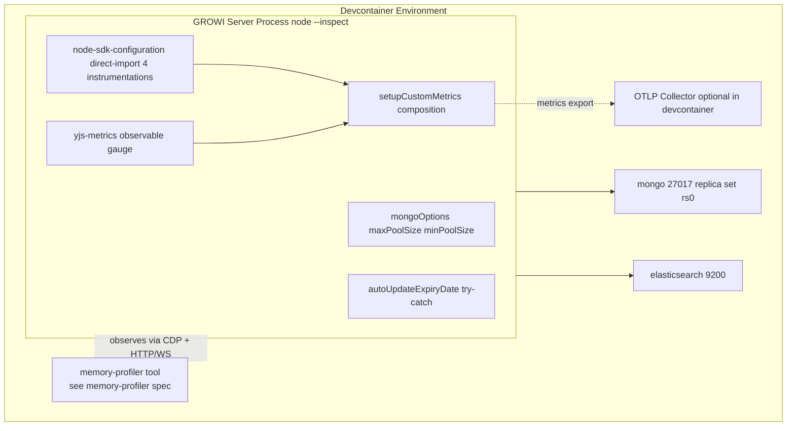

# Design Document

## Overview

本 spec は、`apps/app` (GROWI server, Node.js) のメモリ特性を **dynamic profiling で実測** し、静的解析レポート [research.md (Part 1)](./research.md) の 5 findings (L1-L5) を裏付け／棄却する。確認できた問題に対してのみ修正を入れ、リーク面には常時可観測な metric を追加する。

**Purpose**: GROWI.cloud のテナント専用 `apps/app` コンテナの baseline RSS を、機能を損なわずに 20–40 MB 程度削減する。並行して、`y-websocket` の collaborative document 数を常時観測可能にし、production でのリーク兆候を OTel ダッシュボードから検知できるようにする。

**Impact**: `apps/app` の server コードを 3 ファイル局所修正 + 1 新規 custom-metrics module（合計 4 server-side fix surface）。profiling ツール本体（`bin/memory-profiler/`）は **`memory-profiler` spec の責務**であり本 spec は変更しない。

> **Dependency**: 本 spec は `memory-profiler` spec の **downstream consumer**。profiling ツールの interface 仕様・operational procedure は `memory-profiler` spec の design.md を参照。

### Goals
- 5 findings (L1-L5) ごとに **confirmed / refuted / inconclusive** 判定を数値根拠付きで残す。
- L1 + L2 適用後の baseline RSS を Drain 後計測で **20–40 MB 削減** を達成する。
- `growi.yjs.docs.count` metric を OTLP に常時 emit し、receiver 側ダッシュボードで閲覧可能にする。
- 全ての変更を環境変数で従来動作へ切り戻し可能とする（再ビルド不要）。

### Non-Goals
- **profiling ツール本体（`bin/memory-profiler/`）の実装・設計変更** — `memory-profiler` spec の責務。
- 既存 `growi.*` / `system.*` / `process.*` metrics の名称・schema 変更。
- OpenTelemetry SDK ライフサイクルや `BatchSpanProcessor` の全面設計変更。
- `y-websocket` persistence プロトコルや `WSSharedDoc` 構造の変更。
- ブラウザ／クライアント側のメモリ分析。
- Mongoose / `y-websocket` / `@opentelemetry/auto-instrumentations-node` の major version upgrade。

## Boundary Commitments

### This Spec Owns
- `apps/app/src/server/util/mongoose-utils.ts` の `mongoOptions` への `maxPoolSize` / `minPoolSize` 追加（L1）。
- `apps/app/src/features/opentelemetry/server/node-sdk-configuration.ts` の auto-instrumentation 設定を direct-import 形へ置換（L2、最終 shipped 形）。
- `apps/app/src/features/opentelemetry/server/custom-metrics/yjs-metrics.ts`（新規。`growi.yjs.docs.count` Observable Gauge）。
- `apps/app/src/features/opentelemetry/server/custom-metrics/index.ts` への `yjs-metrics` 統合（barrel re-export + `setupCustomMetrics()` への組み込み）。
- `apps/app/src/server/service/page-operation.ts` の `autoUpdateExpiryDate` への try/catch + logger 追加（L5）。
- `.kiro/specs/memory-leak-investigation/verification-report.md` の作成（dynamic profiling 結果を 5 findings ごとに記録）。
- 関連する CHANGESET エントリ（default 値変更の告知）。

### Out of Boundary
- **profiling ツール本体（`bin/memory-profiler/` / `@growi/bin`）の実装・設計・interface** — `memory-profiler` spec の責務。
- 既存 `opentelemetry` spec が定義する SDK ライフサイクル、Resource Attribute 体系、HTTP anonymization、既存 4 custom-metrics module の構造。
- 既存 `collaborative-editor` spec が定義する `y-websocket` セッションの寿命ポリシーと `create-mongodb-persistence.ts` の persistence プロトコル。
- `BatchSpanProcessor` / `PeriodicExportingMetricReader` のパラメータチューニング（L2 の direct-import 化を超える変更）。
- Mongoose / mongoose-driver の API 変更や major version upgrade。
- `growi-info` / `config-manager` / `growi-logger` の API 変更。
- GROWI.cloud 本番監視ダッシュボードの設定変更（receiver 側）。
- L3 sweeper / L4 backpressure の **無条件** 実装（dynamic 検証で confirmed の場合のみ実装、refuted/inconclusive 時は本 spec 外）。

### Allowed Dependencies
- `mongoose` / `@growi/core/dist/consts` — 既存依存。L1 で `mongoOptions` 経由のみ利用。
- `@opentelemetry/instrumentation-http` / `-express` / `-mongodb` / `-mongoose` — L2 の direct-import 化で 4 instrumentation を直接 instantiate。`@opentelemetry/auto-instrumentations-node` 依存は撤廃。
- `@opentelemetry/api` の `metrics` モジュール — 既存パターンに従う（`system-metrics.ts` 参照）。
- `y-websocket/bin/utils` の `docs` Map — **read-only** に限定（`.size` 読み出しのみ。L3 metric callback で利用）。L3 sweeper を実装する場合は `closeConn` 経由の既存 close パスのみ使用。
- `~/utils/logger`（`@growi/logger` 経由）— 既存利用パターンに従う。
- devcontainer の `mongo:27017` / `elasticsearch:9200` — profiling 実行時のみの前提（参照: `.claude/rules/devcontainer.md`）。

### Revalidation Triggers
- `setupCustomMetrics()` の合成構造を変更する PR — `yjs-metrics` の組み込み箇所が影響を受ける。
- `y-websocket` package の major version upgrade — `docs` Map の export 形式が変更されると L3 metric が壊れる。
- OTel instrumentation package（`-http` / `-express` / `-mongodb` / `-mongoose`）の major version upgrade — direct-import の constructor / config API が変わる可能性。
- Mongoose の major version upgrade — `ConnectOptions` の `maxPoolSize` / `minPoolSize` の意味変化を確認。
- Node.js の major version upgrade — `inspector` / CDP の挙動を再確認。
- L3 sweeper / L4 backpressure を実装する判断が下された場合 — `collaborative-editor` spec との境界整合を再確認。Phase 6 で L3 / L4 ともに REFUTED と確定済みのため再発時のみ起動。

## Architecture

### Architecture Pattern & Boundary Map

採用パターン: **Server-side targeted fixes + config-driven baseline tuning**（profiling ツール本体は `memory-profiler` spec の責務）。



**Existing patterns preserved**:
- OTel custom-metrics の `add*Metrics()` + `setupCustomMetrics()` 合成パターン（`opentelemetry` spec 準拠）。
- mongoose `mongoOptions` を `mongoose.connect()` に渡すパターン。
- `growi-logger` (pino) 経由の構造化ログ。

## File Structure Plan

```
apps/app/
├── src/
│   ├── server/
│   │   ├── util/
│   │   │   └── mongoose-utils.ts                    # [MODIFY] L1: maxPoolSize / minPoolSize 追加
│   │   └── service/
│   │       └── page-operation.ts                    # [MODIFY] L5: setInterval callback の try/catch
│   └── features/
│       └── opentelemetry/server/
│           ├── node-sdk-configuration.ts            # [MODIFY] L2: direct-import 4 instrumentations
│           └── custom-metrics/
│               ├── index.ts                         # [MODIFY] yjs-metrics の barrel と setupCustomMetrics への追加
│               ├── yjs-metrics.ts                   # [NEW] growi.yjs.docs.count Observable Gauge
│               └── yjs-metrics.spec.ts              # [NEW] yjs-metrics の unit test
.kiro/specs/memory-leak-investigation/
├── brief.md
├── requirements.md
├── design.md                                        # 本ファイル
├── research.md
├── tasks.md
└── verification-report.md                           # 検証結果の集約
```

> `bin/memory-profiler/`（`@growi/bin` workspace）は `memory-profiler` spec が所有。

## Requirements Traceability

| Requirement | Summary | Components | Notes |
|-------------|---------|------------|-------|
| 1.x / 2.x | profiling ツール利用と op 設定 | (consumer of `memory-profiler`) | env var / CLI 引数を本 spec 用に設定 |
| 3.1, 3.2, 3.4 | MongoDB pool 上下限の env 制御と切戻し | MongoosePoolConfig | env var: `MONGO_MAX_POOL_SIZE` / `MONGO_MIN_POOL_SIZE` |
| 3.3 | OTel auto-instrumentation 限定 | OtelDirectInstrumentations | direct-import 4 instrumentations |
| 3.5, 3-bis | 削減効果の数値記録 | VerificationReport | RSS delta section |
| 4.1–4.5 | `growi.yjs.docs.count` emit | YjsDocsMetric | Observable Gauge + setupCustomMetrics 統合 |
| 5.1 | L3 sweeper 条件付き | YjsIdleSweeper (NOT triggered, Phase 6 REFUTED) | — |
| 5.2 | L4 backpressure 条件付き | HandlerBackpressure (NOT triggered, Phase 6 REFUTED) | — |
| 5.3 | L5 try/catch + log (常時) | DefensivePageOperationTimer | — |
| 5.4 | refuted 時の除外記録 | VerificationReport | — |
| 6.x | verification report の要件 | VerificationReport | structured sections |
| 7.x | 既存運用への非破壊性 | 全 server-side コンポーネント | env var による切戻し |

## Components and Interfaces

| Component | Domain / Layer | Intent | Req Coverage |
|-----------|----------------|--------|--------------|
| MongoosePoolConfig | Server / Persistence | mongoose 接続プールの上下限を env var で制御 | 3.1, 3.2, 3.4, 7.2 |
| OtelDirectInstrumentations | Server / Observability | 4 instrumentation を直接 instantiate（auto-instrumentations-node 依存撤廃） | 3.3, 7.2 |
| YjsDocsMetric | Server / Observability | `growi.yjs.docs.count` Observable Gauge を emit | 4.1, 4.2, 4.3, 4.4, 4.5 |
| DefensivePageOperationTimer | Server / Reliability | `autoUpdateExpiryDate` の例外を捕捉してログ | 5.3 |
| YjsIdleSweeper (conditional) | Server / yjs | idle session を `closeConn`。Phase 6 で REFUTED のため未実装 | 5.1, 5.5 |
| HandlerBackpressure (conditional) | Server / events | concurrent in-flight handler 上限。Phase 6 で REFUTED のため未実装 | 5.2 |
| VerificationReport | Documentation | 検証結果の構造化レポート | 3.5, 5.4, 6.x, 7.4 |

### MongoosePoolConfig — Config Contract

| Env Var | Default | Allowed Range | Effect |
|---------|---------|---------------|--------|
| `MONGO_MAX_POOL_SIZE` | `15` | positive integer | mongoose pool 上限 |
| `MONGO_MIN_POOL_SIZE` | `2` | non-negative integer, `<= MONGO_MAX_POOL_SIZE` | mongoose pool 下限 |

サイジング根拠と運用ガイダンスは [verification-report.md の Pool sizing guidance](./verification-report.md#pool-sizing-guidance-per-single-nodejs-process) を参照。

**Risks**: 大規模デプロイ（数百〜数千ユーザー）で `maxPoolSize=15` が飽和する可能性 → release notes と verification-report の Pool sizing guidance で env var override を案内。

### OtelDirectInstrumentations

**Final shipped 形（commit `19c56368fc`）**: `@opentelemetry/auto-instrumentations-node` 依存を撤廃し、`HttpInstrumentation` / `ExpressInstrumentation` / `MongoDBInstrumentation` / `MongooseInstrumentation` の 4 つを `node-sdk-configuration.ts` 内で直接 `new` する。`OTEL_AUTO_INSTRUMENTATION_PROFILE` env var は存在しない（追加 instrumentation が必要なら同ファイルを編集する運用）。

設計変遷の詳細経緯と RSS 計測結果は [verification-report.md / L2](./verification-report.md#l2--otel-instrumentation-set-task-22) を参照。

**Risks**: 意図しないスパン欠落 → 4 instrumentation 集合は `http` / `express` / `mongodb` / `mongoose` に固定。GROWI が他 instrumentation を実利用していないことは Phase 5 計測で確認済み。

### YjsDocsMetric — Service Interface

```typescript
export function addYjsMetrics(): void;
```

- Preconditions: OpenTelemetry SDK 初期化済み、`otel:enabled` = `true`、`setupCustomMetrics()` から呼ばれる。
- Postconditions: `growi.yjs.docs.count` Observable Gauge が登録され、以降のエクスポート周期で `docs.size` を観測する。
- Invariants: 既存 metrics の登録順序・名称・schema に影響しない。

**Risks**: `y-websocket` の major version upgrade で `docs` の export 形式が変わると壊れる → Revalidation Triggers に記載済。

### DefensivePageOperationTimer

`PageOperationService.autoUpdateExpiryDate` の `setInterval` callback を try/catch でラップし、catch 内で `growi-logger` を介して `{ err, operationId }` を含む `error` レベルの構造化ログを残す。`setInterval` の周期自体は継続する。

### YjsIdleSweeper / HandlerBackpressure (conditional, NOT IMPLEMENTED)

Phase 6 / Task 6.2（L3）/ Task 6.3（L4）で両者とも REFUTED と確定したため、本 spec では実装しない。再発時の起動条件と `collaborative-editor` spec との整合方針は requirements.md / 5.1, 5.2, 5.5 に保持。

### VerificationReport — Required Sections

1. **Environment** — GROWI commit hash, Node.js version, MongoDB / Elasticsearch version, profiling 実行日時、シナリオ op count。
2. **Per-finding verdicts** — L1–L5 ごとに verdict / evidence / decision を記録。
3. **RSS delta** — L1+L2 適用前後の Baseline RSS を MB 単位で記録、20–40 MB 目標との比較。
4. **Behavior changes** — metric 値の意味的変化、env var default 変更の運用影響、運用者向け sizing guidance。
5. **Open issues / follow-ups** — refuted / inconclusive 判定の理由と再調査トリガー。

## Investigation Session Flow

profiling ツール本体のシーケンス（CDP 接続、snapshot 取得、シナリオ実行）は `memory-profiler` spec の design.md を参照。本 spec での investigation session の流れ:

1. 調査担当者が `memory-profiler` の README に従って GROWI server（`--inspect`）を起動する。
2. `memory-profiler` の `run-scenario` を本調査用の env var / CLI 引数で起動する。
3. ツールが Baseline → Load → Drain を実行し、snapshot A/B/C と RSS CSV を `apps/app/tmp/memory-leak-investigation/runs/<run-name>/` に出力する。
4. 調査担当者が出力を `verification-report.md` に集約し、L1-L5 の verdict を確定する。

## Security Considerations

- `apps/app/tmp/memory-leak-investigation/*.heapsnapshot` には admin user / page content など機密情報を含む可能性がある。リポジトリにコミットしない、共有しない、不要になり次第削除する。
- 追加 metric `growi.yjs.docs.count` はカウント値のみで PII / 機密情報を含まない。
- Inspector エンドポイント (`:9229`) は devcontainer ローカルでのみ listen する前提（profiling ツール側の制約）。
