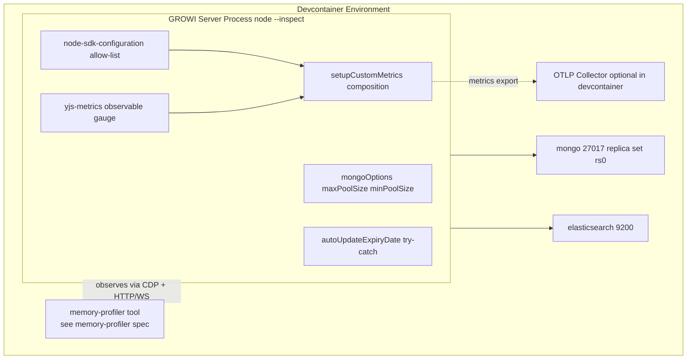
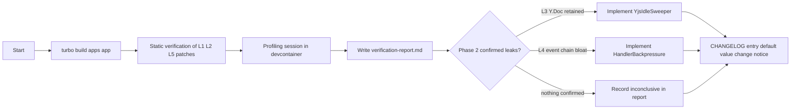

# Design Document

## Overview

本 spec は、`apps/app` (GROWI server, Node.js) のメモリ特性を **dynamic profiling で実測** し、静的解析レポート [research.md (Part 1)](./research.md) の 5 findings (L1-L5) を裏付け／棄却する。確認できた問題に対してのみ修正を入れ、リーク面には常時可観測な metric を追加する。

**Purpose**: GROWI.cloud のテナント専用 `apps/app` コンテナの baseline RSS を、機能を損なわずに 20–40 MB 程度削減する。並行して、`y-websocket` の collaborative document 数を常時観測可能にし、production でのリーク兆候を OTel ダッシュボードから検知できるようにする。

**Users**:
- メモリ調査担当者 — `memory-profiler` spec が提供する profiling ツール（`bin/memory-profiler/`）を使って Baseline / Load / Drain シナリオを実行し、本 spec の verification-report に結果を記録する。
- GROWI.cloud 運用担当者 — 環境変数で `MONGO_MAX_POOL_SIZE` / `MONGO_MIN_POOL_SIZE` / OTel auto-instrumentation profile を制御し、必要時に従来動作へ切り戻す。

**Impact**: `apps/app` の server コードを 3 ファイル局所修正 + 1 新規 custom-metrics module（合計 4 server-side fix surface）。profiling ツール本体（`bin/memory-profiler/`）は **`memory-profiler` spec の責務**であり本 spec は変更しない。Default 値の変更（pool size、auto-instrumentation 範囲）は release notes / CHANGELOG で明示する。

> **Dependency**: 本 spec は `memory-profiler` spec の **downstream consumer**。profiling ツールの interface 仕様・operational procedure は `memory-profiler` spec の design.md を参照。本 spec は同 spec の内容を引用せず、参照のみで完結する。

### Goals
- 5 findings (L1-L5) ごとに **confirmed / refuted / inconclusive** 判定を数値根拠付きで残す。
- L1 + L2 適用後の baseline RSS を Drain 後計測で **20–40 MB 削減** を達成する。
- `growi.yjs.docs.count` metric を OTLP に常時 emit し、receiver 側ダッシュボードで閲覧可能にする。
- 全ての変更を環境変数で従来動作へ切り戻し可能とする（再ビルド不要）。

### Non-Goals
- **profiling ツール本体（`bin/memory-profiler/`）の実装・設計変更** — `memory-profiler` spec の責務。
- 既存 `growi.*` / `system.*` / `process.*` metrics の名称・schema 変更。
- OpenTelemetry SDK ライフサイクルや `BatchSpanProcessor` の全面設計変更。
- `y-websocket` persistence プロトコルや `WSSharedDoc` 構造の変更。
- ブラウザ／クライアント側のメモリ分析。
- Mongoose / `y-websocket` / `@opentelemetry/auto-instrumentations-node` の major version upgrade。

## Boundary Commitments

### This Spec Owns
- `apps/app/src/server/util/mongoose-utils.ts` の `mongoOptions` への `maxPoolSize` / `minPoolSize` 追加（L1）。
- `apps/app/src/features/opentelemetry/server/node-sdk-configuration.ts` の auto-instrumentation 設定を allow-list 方式へ置換（L2）。
- `apps/app/src/features/opentelemetry/server/custom-metrics/yjs-metrics.ts`（新規。`growi.yjs.docs.count` Observable Gauge）。
- `apps/app/src/features/opentelemetry/server/custom-metrics/index.ts` への `yjs-metrics` 統合（barrel re-export + `setupCustomMetrics()` への組み込み）。
- `apps/app/src/server/service/page-operation.ts` の `autoUpdateExpiryDate` への try/catch + logger 追加（L5）。
- `.kiro/specs/memory-leak-investigation/verification-report.md` の作成（dynamic profiling 結果を 5 findings ごとに記録）。
- 関連する CHANGESET エントリ（default 値変更の告知）。

### Out of Boundary
- **profiling ツール本体（`bin/memory-profiler/` / `@growi/bin`）の実装・設計・interface** — `memory-profiler` spec の責務。本 spec は同ツールの consumer。
- 既存 `opentelemetry` spec が定義する SDK ライフサイクル、Resource Attribute 体系、HTTP anonymization、既存 4 custom-metrics module の構造。
- 既存 `collaborative-editor` spec が定義する `y-websocket` セッションの寿命ポリシーと `create-mongodb-persistence.ts` の persistence プロトコル。
- `BatchSpanProcessor` / `PeriodicExportingMetricReader` のパラメータチューニング（L2 の allow-list 化を超える変更）。
- Mongoose / mongoose-driver の API 変更や major version upgrade。
- `growi-info` / `config-manager` / `growi-logger` の API 変更。
- GROWI.cloud 本番監視ダッシュボードの設定変更（receiver 側）。
- L3 sweeper / L4 backpressure の **無条件** 実装（dynamic 検証で confirmed の場合のみ実装、refuted/inconclusive 時は本 spec 外）。

### Allowed Dependencies
- `mongoose` / `@growi/core/dist/consts` — 既存依存。L1 で `mongoOptions` 経由のみ利用。
- `@opentelemetry/auto-instrumentations-node` / `@opentelemetry/sdk-node` — 既存依存。L2 の allow-list 化で個別 instrumentation package を import する場合がある（既存 transitive 内で完結）。
- `@opentelemetry/api` の `metrics` モジュール — 既存パターンに従う（`system-metrics.ts` 参照）。
- `y-websocket/bin/utils` の `docs` Map — **read-only** に限定（`.size` 読み出しのみ。L3 metric callback で利用）。L3 sweeper を実装する場合は `closeConn` 経由の既存 close パスのみ使用。
- Node.js 標準: `node:inspector` — sidecar から CDP 接続用に間接的に利用。runtime dependency 追加なし。
- `~/utils/logger`（`@growi/logger` 経由）— 既存利用パターンに従う。
- devcontainer の `mongo:27017` / `elasticsearch:9200` — profiling 実行時のみの前提（参照: `.claude/rules/devcontainer.md`）。

### Revalidation Triggers
- `setupCustomMetrics()` の合成構造を変更する PR — `yjs-metrics` の組み込み箇所が影響を受ける。
- `y-websocket` package の major version upgrade — `docs` Map の export 形式が変更されると L3 metric が壊れる。
- `@opentelemetry/auto-instrumentations-node` の major version upgrade — allow-list 形式の API が変わる可能性。
- Mongoose の major version upgrade — `ConnectOptions` の `maxPoolSize` / `minPoolSize` の意味変化を確認。
- Node.js の major version upgrade — `inspector` / CDP の挙動を再確認。
- L3 sweeper を本 spec で実装する判断が下された場合 — `collaborative-editor` spec との境界整合を再確認。

## Architecture

### Existing Architecture Analysis

GROWI server (`apps/app`) は Next.js Pages Router + Express ベースで、以下の関連サブシステムが既に存在する。

- **OpenTelemetry custom-metrics 統合パス** — [apps/app/src/features/opentelemetry/server/custom-metrics/index.ts](../../apps/app/src/features/opentelemetry/server/custom-metrics/index.ts) の `setupCustomMetrics()` が dynamic import + `add*Metrics()` 呼び出し列で 4 つの metrics module を合成する。`opentelemetry` spec の Boundary に従い、本 spec は **新規 module の追加** で参加する。
- **`y-websocket` の集約点** — [apps/app/src/server/service/yjs/yjs.ts](../../apps/app/src/server/service/yjs/yjs.ts) で `docs`, `setPersistence`, `setupWSConnection` を import し、`WebSocketServer` に接続する。`docs` Map への read-only アクセスはこの import 経路を共有する。
- **mongoose 接続初期化** — [apps/app/src/server/util/mongoose-utils.ts](../../apps/app/src/server/util/mongoose-utils.ts) の `mongoOptions` が [apps/app/src/server/crowi/index.ts:352](../../apps/app/src/server/crowi/index.ts#L352) の `mongoose.connect()` 呼び出しに渡される。`maxPoolSize` 未指定により driver default `100` が効いている。
### Architecture Pattern & Boundary Map

採用パターン: **Server-side targeted fixes + config-driven baseline tuning**（profiling ツール本体は `memory-profiler` spec の責務）。



**Architecture Integration**:
- **Selected pattern**: Server-side targeted fixes + config-driven baseline tuning。観測手段（profiling ツール）は別 spec で提供される downstream の前提。
- **Domain/feature boundaries**: 本 spec の変更面は `apps/app` の既存 4 ファイルへの局所修正と新規 1 module のみ。profiling ツールは `memory-profiler` spec が所有し、本 spec は CDP / HTTP / WS 越しに観測対象として扱われるのみ。
- **Existing patterns preserved**:
  - OTel custom-metrics の `add*Metrics()` + `setupCustomMetrics()` 合成パターン（`opentelemetry` spec 準拠）。
  - mongoose `mongoOptions` を `mongoose.connect()` に渡すパターン。
  - `growi-logger` (pino) 経由の構造化ログ。
- **New components rationale**:
  - `yjs-metrics.ts`: L3 で必要となる「y-websocket の document 数を時系列観測可能にする」唯一の最小実装。
- **Steering compliance**:
  - `.claude/rules/coding-style.md` — 1 ファイル 1 責務、named exports、`import type` の徹底、英語コメント、co-located tests。
  - `.claude/rules/devcontainer.md` — `mongo:27017` / `elasticsearch:9200` は常時前提。接続性チェックは行わない。
  - `apps/app/.claude/rules/package-dependencies.md` — 本 spec は新規 runtime dependency を追加しない（既存 `mongoose`, `@opentelemetry/*` のみ利用）。

### Technology Stack

| Layer | Choice / Version | Role in Feature | Notes |
|-------|------------------|-----------------|-------|
| Backend / Services | Node.js ^24 (existing) | Server runtime、`--inspect` で CDP endpoint 公開（profiling 時のみ） | 既存 runtime。追加なし。 |
| Backend / Services | `mongoose` ^6.13.6 (existing) | `ConnectOptions.maxPoolSize` / `minPoolSize` 設定 | 既存依存。設定面のみ修正。 |
| Observability | `@opentelemetry/api` ^1.9.0 (existing) | Observable Gauge 登録 | 既存。`yjs-metrics.ts` で利用。 |
| Observability | `@opentelemetry/auto-instrumentations-node` ^0.75.0 (existing) | allow-list 方式へ置換 | 既存。`getNodeAutoInstrumentations()` を allow-list で wrap。 |
| Persistence | MongoDB (devcontainer `mongo:27017`, replica set `rs0`) | profiling 中の DB 接続先 | devcontainer 既設。 |
| Persistence | Elasticsearch (devcontainer `elasticsearch:9200`) | profiling 中の search backend | devcontainer 既設。 |

> Profiling tooling の technology stack（`ws`, `undici`, `tsx`/`ts-node`, `node:inspector` 等）は `memory-profiler` spec を参照。

## File Structure Plan

### Directory Structure

```
apps/app/
├── src/
│   ├── server/
│   │   ├── util/
│   │   │   └── mongoose-utils.ts                    # [MODIFY] L1: maxPoolSize / minPoolSize 追加
│   │   └── service/
│   │       └── page-operation.ts                    # [MODIFY] L5: setInterval callback の try/catch
│   └── features/
│       └── opentelemetry/server/
│           ├── node-sdk-configuration.ts            # [MODIFY] L2: auto-instrumentation を allow-list 化
│           └── custom-metrics/
│               ├── index.ts                         # [MODIFY] yjs-metrics の barrel と setupCustomMetrics への追加
│               ├── yjs-metrics.ts                   # [NEW] growi.yjs.docs.count Observable Gauge
│               └── yjs-metrics.spec.ts              # [NEW] yjs-metrics の unit test
.kiro/specs/memory-leak-investigation/
├── brief.md                                         # 既存
├── requirements.md                                  # 既存
├── design.md                                        # 本ファイル
├── research.md                                      # 既存 (Part 1: 静的解析 + Part 2: design discovery)
├── tasks.md                                         # 既存
└── verification-report.md                           # [Phase 5+] 検証結果の集約
```

> `bin/memory-profiler/`（`@growi/bin` workspace）は `memory-profiler` spec が所有。本 spec はそのツールを利用するのみで、ファイル構造の責任は持たない。

### Modified Files
- `apps/app/src/server/util/mongoose-utils.ts` — `mongoOptions` に `maxPoolSize` / `minPoolSize` を追加。env var から読み出し（default 15 / 2）。
- `apps/app/src/features/opentelemetry/server/node-sdk-configuration.ts` — `getNodeAutoInstrumentations()` の引数を allow-list ベースに置換。allow set は `http`, `express`, `mongodb`, `mongoose`。`OTEL_AUTO_INSTRUMENTATION_PROFILE=all` で従来動作復元可能。
- `apps/app/src/features/opentelemetry/server/custom-metrics/index.ts` — `yjs-metrics` の re-export を追加し、`setupCustomMetrics()` の dynamic import 列と `add*Metrics()` 呼び出し列に組み込む。
- `apps/app/src/server/service/page-operation.ts` — `autoUpdateExpiryDate` の `setInterval` callback を try/catch でラップし、catch 内で `logger.error` を呼ぶ。

## System Flows

### Investigation Session Flow

profiling ツール本体のシーケンス図（CDP 接続、snapshot 取得、シナリオ実行）は `memory-profiler` spec の design.md を参照。本 spec での investigation session は以下のように進む:

1. 調査担当者が `memory-profiler` の README に従って GROWI server（`--inspect`）を起動する。
2. 調査担当者が `memory-profiler` の `run-scenario` を起動し、本調査用の env var / CLI 引数を渡す。
3. ツールが Baseline → Load → Drain を実行し、snapshot A/B/C と RSS CSV を `apps/app/tmp/memory-leak-investigation/runs/<run-name>/` に出力する。
4. 調査担当者が出力を本 spec の `verification-report.md` に集約し、L1-L5 の verdict を確定する。

## Requirements Traceability

| Requirement | Summary | Components | Interfaces | Flows |
|-------------|---------|------------|------------|-------|
| 1.x | profiling ツール利用と検証成果物の保存 | (consumer of `memory-profiler`) | `memory-profiler` の CLI / env var を本 spec 用 op count で起動 | Investigation Session Flow |
| 2.x | 検証シナリオ op 設定 | (consumer of `memory-profiler`) | env var: `LOAD_*`, `BASELINE_IDLE_SECONDS`, `DRAIN_IDLE_SECONDS` | — |
| 3.1, 3.2 | MongoDB pool 上下限の env 制御 | MongoosePoolConfig | `mongoOptions: ConnectOptions` extension | — |
| 3.3 | OTel auto-instrumentation allow-list | OtelInstrumentationAllowList | `node-sdk-configuration.ts` の `instrumentations` 配列 | — |
| 3.4 | 従来動作への切戻し | OtelInstrumentationAllowList, MongoosePoolConfig | env var `OTEL_AUTO_INSTRUMENTATION_PROFILE`, `MONGO_MAX_POOL_SIZE` | — |
| 3.5 | 削減効果の数値記録 | VerificationReport | report の RSS delta section | — |
| 3.6 | 機能非破壊 | 全 server-side コンポーネント | 既存テスト群 | — |
| 4.1, 4.2 | `growi.yjs.docs.count` emit | YjsDocsMetric | `addCallback` で `docs.size` 観測 | — |
| 4.3 | 既存エクスポート機構の周期に追随 | YjsDocsMetric | `meter.createObservableGauge` (PeriodicExportingMetricReader と統合) | — |
| 4.4 | `otel:enabled=false` で disable | YjsDocsMetric | `setupCustomMetrics()` のガードを継承 | — |
| 4.5 | 既存 metric 不変更 | YjsDocsMetric | 既存 modules を一切触らない | — |
| 5.1 | L3 sweeper 条件付き | YjsIdleSweeper (conditional) | 内部 idle timer + `closeConn` の既存 path | — |
| 5.2 | L4 backpressure 条件付き | HandlerBackpressure (conditional) | EventEmitter wrapper の concurrent cap | — |
| 5.3 | L5 try/catch + log (常時) | DefensivePageOperationTimer | `setInterval(async () => { try {...} catch (err) { logger.error(...) } })` | — |
| 5.4 | refuted 時の除外記録 | VerificationReport | report の verdict section | — |
| 5.5 | L3 sweeper と collaborative-editor 整合 | YjsIdleSweeper (conditional) | 既存 `closeConn` 経由のみ | — |
| 6.1 | finding ごとの verdict | VerificationReport | report の structured section | — |
| 6.2 | L1+L2 数値比較 | VerificationReport | report の RSS delta section | — |
| 6.3 | 環境メタ情報 | VerificationReport | report の environment section | — |
| 6.4 | 手順ドキュメント化 | (consumer of `memory-profiler`) | `memory-profiler` の README を参照 | — |
| 6.5 | snapshot 非コミット | `.gitignore` 確認 / report への集計値のみ記載 | — | — |
| 7.1 | 既存機能非破壊（page CRUD / 検索 / 認証 / yjs / OTel 送出） | 全 server-side コンポーネント | 既存テスト pass、`memory-profiler` の Load 段階で実測 | Investigation Session Flow |
| 7.2 | env var による切戻し | MongoosePoolConfig, OtelInstrumentationAllowList | env var contracts | — |
| 7.3 | lint/test/build pass | CI 既存パイプライン | turbo run lint/test/build | — |
| 7.4 | metric 意味的変化の告知 | VerificationReport | report の "behavior changes" section | — |

## Components and Interfaces

### Summary Table

| Component | Domain / Layer | Intent | Req Coverage | Key Dependencies (P0/P1) | Contracts |
|-----------|----------------|--------|--------------|--------------------------|-----------|
| MongoosePoolConfig | Server / Persistence | mongoose 接続プールの上下限を env var で制御 | 3.1, 3.2, 3.4, 7.2 | `mongoose` (P0) | Config |
| OtelInstrumentationAllowList | Server / Observability | auto-instrumentation を必要集合のみ enable | 3.3, 3.4, 7.2 | `@opentelemetry/auto-instrumentations-node` (P0) | Config |
| YjsDocsMetric | Server / Observability | `growi.yjs.docs.count` Observable Gauge を emit | 4.1, 4.2, 4.3, 4.4, 4.5 | `y-websocket/bin/utils.docs` (P0), `@opentelemetry/api` (P0), custom-metrics index (P0) | Service (metric registration) |
| DefensivePageOperationTimer | Server / Reliability | `autoUpdateExpiryDate` の例外を捕捉してログ | 5.3 | `growi-logger` (P0) | — |
| YjsIdleSweeper (conditional) | Server / yjs | 確認時のみ idle session を `closeConn` | 5.1, 5.5 | `y-websocket/bin/utils` (P0) | Service |
| HandlerBackpressure (conditional) | Server / events | 確認時のみ concurrent in-flight handler 上限 | 5.2 | EventEmitter (P0) | Service |
| VerificationReport | Documentation | 検証結果の構造化レポート | 3.5, 5.4, 6.1, 6.2, 6.3, 7.4 | snapshots, RSS CSV (P0) | — |

> Profiling 経路の component（ScenarioRunner / CdpSnapshotClient / LoadDriver / RssTimeSeriesLogger）は `memory-profiler` spec の責務。本 spec はそれらを consumer として参照するのみ。詳細ブロックは新規コンポーネントと既存コンポーネントへの **責務境界が増減するもの** に絞る。`DefensivePageOperationTimer` は単純な try/catch 追加のため Implementation Note のみで足る。

### Server / Persistence

#### MongoosePoolConfig

| Field | Detail |
|-------|--------|
| Intent | mongoose 接続プールの上下限を env var で制御し、テナント専用コンテナの idle socket を削減 |
| Requirements | 3.1, 3.2, 3.4, 7.2 |

**Responsibilities & Constraints**
- `mongoOptions` に `maxPoolSize` / `minPoolSize` を追加するのみ。pool 周辺の他オプション（read preference 等）は変更しない。
- Default は `maxPoolSize=15`, `minPoolSize=2`。env var で override 可能。サイジング根拠は [verification-report.md の Pool sizing guidance](./verification-report.md#pool-sizing-guidance-per-single-nodejs-process) を参照。

**Dependencies**
- Inbound: `apps/app/src/server/crowi/index.ts:352` — `mongoose.connect(uri, mongoOptions)` (P0)
- External: `mongoose` `ConnectOptions` 型 (P0)

**Contracts**: Service [ ] / API [ ] / Event [ ] / Batch [ ] / State [ ] / Config [x]

##### Config Contract
| Env Var | Default | Allowed Range | Effect |
|---------|---------|---------------|--------|
| `MONGO_MAX_POOL_SIZE` | `15` | positive integer | mongoose pool 上限 |
| `MONGO_MIN_POOL_SIZE` | `2` | non-negative integer, `<= MONGO_MAX_POOL_SIZE` | mongoose pool 下限 |

**Implementation Notes**
- Integration: `mongoose-utils.ts:52` の `mongoOptions` を `{ useUnifiedTopology: true, maxPoolSize: ..., minPoolSize: ... }` に変更。
- Validation: env var が NaN の場合は default にフォールバック（`Number.isFinite` チェック）。
- Risks: 大規模デプロイ（数百〜数千ユーザー）で `maxPoolSize=15` が飽和する可能性 → release notes と [verification-report.md の Pool sizing guidance](./verification-report.md#pool-sizing-guidance-per-single-nodejs-process) で env var override の指針を案内。

### Server / Observability

#### OtelInstrumentationAllowList

| Field | Detail |
|-------|--------|
| Intent | auto-instrumentation を GROWI が実際に利用する集合のみに限定 |
| Requirements | 3.3, 3.4, 7.2 |

**Responsibilities & Constraints**
- `getNodeAutoInstrumentations({...})` の deny-list（pino / fs を off）方式から、明示的な allow-list 方式へ置換。
- Allow set 既定: `@opentelemetry/instrumentation-http`, `@opentelemetry/instrumentation-express`, `@opentelemetry/instrumentation-mongodb`, `@opentelemetry/instrumentation-mongoose`。
- `OTEL_AUTO_INSTRUMENTATION_PROFILE=all` の場合は従来動作（pino / fs だけ off の `getNodeAutoInstrumentations`）に戻す。

**Dependencies**
- External: `@opentelemetry/auto-instrumentations-node` (P0)
- Inbound: `node-sdk.ts` 経由で `generateNodeSDKConfiguration()` を呼び出す boot path

**Contracts**: Config [x]

##### Config Contract
| Env Var | Default | Allowed Values | Effect |
|---------|---------|----------------|--------|
| `OTEL_AUTO_INSTRUMENTATION_PROFILE` | `minimal` | `minimal` \| `all` | `minimal` = allow-list、`all` = 既存挙動 |

**Implementation Notes**
- Integration: `node-sdk-configuration.ts:51-66` の `instrumentations: [...]` 配列を分岐させる。
- Validation: 不明な値は warn ログを出して `minimal` 扱い。
- Risks: 意図しないスパン欠落 → 実装前に「現状スパン種」を `OTEL_SDK_DISABLED` を使い実測し、allow-list と diff を取って確認する。

#### YjsDocsMetric

| Field | Detail |
|-------|--------|
| Intent | `y-websocket` の `docs` Map サイズを Observable Gauge として emit |
| Requirements | 4.1, 4.2, 4.3, 4.4, 4.5 |

**Responsibilities & Constraints**
- 既存 `custom-metrics/*.ts` のパターン（`addXxxMetrics()` 関数 export + `meter.createObservableGauge` + `addCallback`）に厳密に従う。
- `docs.size` を読み出すのみ。`docs` の状態変更や iterate は行わない。
- Metric 名: `growi.yjs.docs.count`、unit `{document}`、description は「Current number of collaborative documents held by y-websocket」。

**Dependencies**
- External: `y-websocket/bin/utils` の `docs` Map (P0, read-only)
- External: `@opentelemetry/api` の `metrics` (P0)
- Inbound: `setupCustomMetrics()` の合成パス (P0)

**Contracts**: Service [x] / API [ ] / Event [ ] / Batch [ ] / State [ ]

##### Service Interface
```typescript
export function addYjsMetrics(): void;
```
- Preconditions: OpenTelemetry SDK 初期化済み、`otel:enabled` = `true`、`setupCustomMetrics()` から呼ばれる。
- Postconditions: `growi.yjs.docs.count` Observable Gauge が登録され、以降のエクスポート周期で `docs.size` を観測する。
- Invariants: 既存 metrics の登録順序・名称・schema に影響しない。

**Implementation Notes**
- Integration: `custom-metrics/index.ts` の barrel に `export { addYjsMetrics } from './yjs-metrics';` と、`setupCustomMetrics()` の dynamic import / 呼び出し列に 1 行ずつ追加。
- Validation: callback 内で `docs` が undefined だった場合の defensive check（パッケージ未初期化時用）。
- Risks: `y-websocket` の major version upgrade で `docs` の export 形式が変わると壊れる → Revalidation Triggers に記載済。

### Server / Reliability

#### DefensivePageOperationTimer

**Intent**: `PageOperationService.autoUpdateExpiryDate` の `setInterval` callback を try/catch でラップし、例外を `growi-logger` で構造化ログとして残す（要件 5.3）。

**Implementation Notes**
- Integration: `page-operation.ts:236` の `setInterval(async () => { await PageOperation.extendExpiryDate(operationId); }, ...)` を `setInterval(async () => { try { await PageOperation.extendExpiryDate(operationId); } catch (err) { logger.error({ err, operationId }, 'extendExpiryDate failed'); } }, ...)` に変更。
- Validation: 既存 caller `apps/app/src/server/service/page/index.ts:821–851` の try/finally と二重ハンドリングにならないことを確認。
- Risks: なし（純粋に defensive）。

### Server / yjs (Conditional — implemented only if Phase 2 confirms)

#### YjsIdleSweeper

| Field | Detail |
|-------|--------|
| Intent | confirmed の場合のみ、idle セッションを既存 `closeConn` 経由でクローズ |
| Requirements | 5.1, 5.5 |

**Responsibilities & Constraints**
- Sweep 間隔と idle 判定閾値は env var で制御（default は design-time に未確定、検証結果で決める）。
- `closeConn` 等の既存 close path のみ使用。`docs` から直接 delete しない。
- `collaborative-editor` spec の session 寿命ポリシーに整合（要件 5.5）。

**Implementation Notes**
- Phase 2 検証で `Y.Doc` 残存が Baseline 比で有意に確認された場合に限り、本 spec で実装。
- 実装時は別 PR / 別 task として分離し、verification-report.md の confirmed 判定を根拠資料として参照する。

### Server / events (Conditional)

#### HandlerBackpressure

| Field | Detail |
|-------|--------|
| Intent | confirmed の場合のみ、emitter ごとの concurrent in-flight handler 上限を設定 |
| Requirements | 5.2 |

**Implementation Notes**
- 同じく Phase 2 で確認された場合に限る。実装は `Activity → InAppNotification`、`pageEvent → search` 経路の handler に concurrency limiter を導入。

### Tooling / Profiling — Out of Scope

本 spec は profiling ツール本体を所有しない。CDP snapshot client / Load driver / RSS time-series logger / scenario orchestrator の各コンポーネント仕様は **`memory-profiler` spec の design.md を参照**。

本 spec はそれらの interface を consumer として利用するのみで、実装・interface 変更・新規シナリオ追加等は `memory-profiler` spec の責務。

### Documentation

#### VerificationReport

**Intent**: 5 findings ごとの判定（confirmed / refuted / inconclusive）、L1+L2 の RSS delta、環境メタデータ、metric の意味的変化、を構造化されたセクションで残す。

**Required sections**:
1. **Environment** — GROWI commit hash, Node.js version, MongoDB version, Elasticsearch version, profiling 実行日時、シナリオ op count（要件 6.3）。
2. **Per-finding verdicts** — L1, L2, L3, L4, L5 ごとに `verdict`, `evidence`（snapshot 差分 / retained constructor counts / RSS delta）, `decision`（修正実施／不実施／後続 spec へ送る）を記録（要件 6.1, 5.4）。
3. **RSS delta** — L1+L2 適用前後の Baseline RSS を MB 単位で記録、20–40 MB 目標との比較（要件 3.5, 6.2）。
4. **Behavior changes** — metric 値の意味的変化、env var の default 変更の運用影響（要件 7.4）。
5. **Open issues / follow-ups** — refuted / inconclusive 判定の理由と再調査トリガー。

## Error Handling

### Error Strategy
- **L5 callback のエラー**: `extendExpiryDate` 失敗時は構造化ログのみ。`setInterval` 自体は継続。
- **Profiling 中の失敗**: ツール側 (`memory-profiler` spec) の error handling 仕様に従う。本 spec の investigation workflow は失敗を verification-report に記録する。

### Error Categories and Responses
- **System errors**: MongoDB 接続失敗 → 既存 GROWI server の startup error path を継承。
- **Business logic errors**: なし（本 spec が触る範囲は config + 1 metric + 1 defensive try/catch のみ）。

### Monitoring
- 本 spec で追加する metric `growi.yjs.docs.count` は GROWI 既存の OTLP 経由で receiver に送られる。

## Testing Strategy

### Unit Tests
1. **YjsDocsMetric**: `addYjsMetrics()` 呼出し後、`OpenTelemetry meter` から `growi.yjs.docs.count` が取得可能で、`docs.size` の現在値を返すこと（`y-websocket/bin/utils` の `docs` を mock）。
2. **MongoosePoolConfig**: `MONGO_MAX_POOL_SIZE` / `MONGO_MIN_POOL_SIZE` env var が読み取られ、未指定で `15` / `2`、NaN で fallback、正常値でその値が `mongoOptions` に入ること。
3. **OtelInstrumentationAllowList**: `OTEL_AUTO_INSTRUMENTATION_PROFILE=minimal`（または未指定）で allow-list 由来の instrumentation のみ enabled、`=all` で従来挙動と等価になること。
4. **DefensivePageOperationTimer**: `extendExpiryDate` が reject した時に `logger.error` が呼ばれ、`setInterval` 周期が継続することを fake timer で検証。

### Integration Tests
1. **`setupCustomMetrics()` 合成**: 全 5 modules（既存 4 + `yjs-metrics`）が登録された状態で OTel meter から各 metric を解決できること。
2. **mongoose 接続**: `MONGO_MAX_POOL_SIZE=3` 環境で server を起動した時、mongoose client の `topology.s.maxPoolSize` が 3 を反映していること（devcontainer mongo 利用）。
3. **OTel allow-list 実効性**: `OTEL_AUTO_INSTRUMENTATION_PROFILE=minimal` 時に `@opentelemetry/instrumentation-dns` 等の不要 instrumentation が patch されないこと（patching を spy）。

### E2E / 手動シナリオ
1. **Investigation session 1 周回し**: `memory-profiler` の README 手順に従って GROWI server + scenario runner を起動し、本調査用の env var で 1 周回す。出力が `apps/app/tmp/memory-leak-investigation/runs/<run-name>/` に揃うことを確認。
2. **L1+L2 適用前後の Baseline RSS 計測**: 同シナリオを「fix なし build」と「fix あり build」で実行し、Drain 後 RSS の delta が 20–40 MB レンジに入ることを確認（verification-report.md に記録）。
3. **`growi.yjs.docs.count` の OTLP 受信**: 受信側 collector のログまたは debug exporter で `growi.yjs.docs.count` が export されることを確認。

### Performance Tests
- E2E #2 が performance 検証を兼ねる（baseline RSS の数値検証）。明示的な load benchmark は本 spec では行わない。

## Migration Strategy



**Migration & rollout notes**:
- L1 / L2 / L3 metric / L5 は単独で independent に merge 可能。共通の release 単位とすることで CHANGELOG エントリを 1 つにまとめる。
- 既存 deployment の振る舞い変化（pool size default、auto-instrumentation 範囲）は CHANGELOG / release notes で明示し、env var による rollback 手順を併記。
- 条件付きコンポーネント（YjsIdleSweeper / HandlerBackpressure）は Phase 2 の検証結果次第で、本 spec 内で別 task として追加するか、別 PR / 別 spec に切り出すかを決定する。

## Performance & Scalability

- **Target**: Baseline RSS 削減 20–40 MB（L1 + L2 適用後、Drain 後計測）。
- **Measurement**: `memory-profiler` の RSS time-series logger（CDP `Runtime.evaluate` 経由で `process.memoryUsage().rss` を取得）で計測した値を verification-report に集約し、5 分 idle の平均を baseline 値とする。
- **Trade-offs**: `maxPoolSize=15` は per-tenant low-traffic（数十〜数百ユーザー想定）。大規模デプロイ（500+ users）では env var で引き上げ — レンジ指針は [verification-report.md の Pool sizing guidance](./verification-report.md#pool-sizing-guidance-per-single-nodejs-process)。auto-instrumentation 絞り込みでスパン種が減るが、減るのは GROWI が使っていない module の wrapping のみで、観測可能性に支障は出ない想定（実装前に diff で確認）。

## Security Considerations

- **`apps/app/tmp/memory-leak-investigation/*.heapsnapshot` には機密情報を含む可能性** — devcontainer ローカル開発の admin user / page content が snapshot に乗る。リポジトリにコミットしない、共有しない、不要になり次第削除する旨は `memory-profiler` の README が示す。
- 本 spec で追加する metric `growi.yjs.docs.count` はカウント値のみで PII / 機密情報を含まない。
- Inspector エンドポイント (`:9229`) は devcontainer ローカルでのみ listen する前提（profiling ツール側の制約 — `memory-profiler` spec を参照）。

## Future Work

- **Production dist server (Node.js v24) の Prisma ESM/CJS 不整合解消**: `dist/generated/prisma/client.js` が `import.meta.url`（ESM）と `exports`（CJS）を併用しているため、Node.js v24 strict ESM 下で `ReferenceError: exports is not defined` を起こす。これを解消することで dist server 起動下での計測が可能となる（[Phase 6 / Task 6.4](./tasks.md) で対応）。
