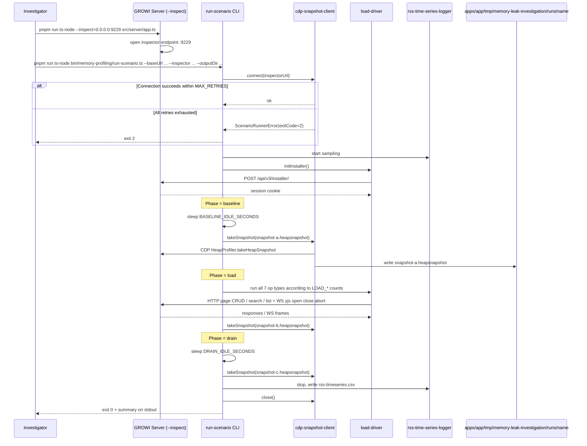

# Design Document

## Overview

本 spec は、GROWI のメモリ調査用 profiling ツール群（`bin/memory-profiling/`、`@growi/bin` workspace package）を **公式仕様としてベースライン化** する。既に実装され 58 unit tests が green の状態にある現状ツールを、requirements / design / tasks の 3 文書として明文化し、(1) 今後のツール変更時の change review 基準を確立し、(2) downstream の memory 調査 spec（`memory-leak-investigation` 等）が本ツールに対して安定した consumer-side dependency を持てるようにする。

**Purpose**: `bin/memory-profiling/` の現状アーキテクチャ・interface・operational procedure を spec として固定し、ツール本体の変更レビュー基準と downstream 提供 contract を確立する。

**Users**: 現在および将来のメモリ調査担当者と、本ツールを利用する隣接 spec（`memory-leak-investigation` 等）のメンテナ。

**Impact**: 既存実装に対するコード変更は最小限（lint / test / interface 安定性チェックのみ）。代わりに、CLI surface・env var contract・出力ファイル命名規約・LoadDriver interface が **stable contract** として固定され、downstream 参照の安定性が保証される。

### Goals
- 現状のツール構造・interface・operational procedure を **公式仕様（requirements / design / tasks）として明文化** し、change review の基準にする。
- 外部公開（stable contract）と internal（実装詳細）の境界を明確化し、breaking change の判定基準を提供する。
- 本 spec を **片方向参照モデル**（consumer → tool）の安定した downstream 提供 spec として確立する。
- 将来の進化（OTLP receiver 連携、dist server サポート、scenario DSL 化等）の出発点を準備する（実装は follow-up spec）。

### Non-Goals
- `apps/app` の server-side コード変更（各 owner spec の責務）。
- 具体の memory 調査結果や finding（`memory-leak-investigation` 等の downstream spec の責務）。
- 本 spec を起点とする新機能実装（OTLP 連携 / dist server / DSL 等）。
- 汎用 npm package 化 / 外部公開。
- `bin/memory-profiling/` 配下の architecture や interface の大幅な再設計（baseline-only spec）。

## Boundary Commitments

### This Spec Owns
- `bin/memory-profiling/` 配下の全モジュールの振る舞い仕様（要件 1–4 で定義）。
- `bin/package.json` および `pnpm-workspace.yaml` の `bin` エントリ（`@growi/bin` workspace package 定義）と、`exports` field による公開境界。
- **Stable contract（CLI surface）**: `run-scenario.ts` の引数 `--baseUrl` / `--inspector` / `--outputDir`、9 種類の env var、exit code `0` / `1` / `2`、出力ファイル命名規約。
- **Stable contract（TypeScript public API）**: `bin/memory-profiling/index.ts`（top-level barrel）から re-export される `runScenario`、`ScenarioRunnerOptions`、`LoadOpCounts`、`ScenarioRunnerError`、`LoadDriver` 型。CLI surface と一貫した形で programmatic consumer にも安定供給する。
- **Module Public Surface**（GROWI 共通規約に整合）: `bin/memory-profiling/` および各 sub-directory（`scenarios/`、`lib/`）に `index.ts` を 1 つ置き、sibling / parent からの import は barrel 経由とする（[.claude/rules/coding-style.md](../../.claude/rules/coding-style.md) の Module Public Surface 規約に準拠）。
- **LoadDriver interface の stable contract**: 7 op 関数（`pageCreate` / `pageEdit` / `pageGet` / `pageList` / `pageSearch` / `yjsSessionCleanClose` / `yjsSessionAbort`）+ `initInstaller` のシグネチャ。top-level barrel から型として export。
- **Scenario module の op count 規約**: 各 op 回数の env var 名と default 値。
- **出力ディレクトリ構造規約**: `--outputDir` 引数で指定された run ディレクトリ配下に snapshot A/B/C + `rss-timeseries.csv` を配置する命名規約。default は user-controlled（ツール側で具体パスを hard-code しない）。
- `bin/memory-profiling/README.md` の operational procedure 記述。
- Test 戦略（unit test の scope、fake-LoadDriver パターン、co-located test、**stable contract surface test**）。

### Out of Boundary
- `apps/app` の server-side コード（各 owner spec の責務）。
- `apps/app/src/features/opentelemetry/` の custom metrics や SDK 構成（`opentelemetry` spec の責務）。
- `apps/app/src/server/service/yjs/` の y-websocket persistence プロトコル（`collaborative-editor` spec の責務）。
- 各 downstream consumer の調査内容・verdict・finding（`memory-leak-investigation` 等の責務）。
- 新シナリオ・新メトリクス・dist server サポート・OTLP 受信側連携の **実装**（必要時は follow-up spec で扱う）。
- 本ツールの汎用 npm package 化や外部公開。
- 本ツールの CI / GitHub Actions 組み込み（現状 devcontainer ローカル前提）。
- top-level barrel に **含まれない** 内部実装（`createCdpSnapshotClient`、`createRssTimeSeriesLogger`、`createLoadDriver`、`scenarios/` の `run*` 関数、`lib/*` の factory 等）の interface — これらは internal とし、変更可能。barrel に上げる際は本 spec の更新を伴う。

### Allowed Dependencies
- **Runtime**: `ws` ^8.17.1（既存）、Node.js v24 built-in（`undici` / `node:inspector` / `node:fs` / `node:path`）。新規 runtime dependency なし。
- **DevDependency**: `vitest` ^3.2.4（既存）。`tsx` / `ts-node` は monorepo の既存 devDep を経由して利用。
- **外部システム（profiling target）**: GROWI server の `--inspect` で公開される CDP endpoint（標準 Node.js inspector protocol）、HTTP API、y-websocket endpoint。
- **devcontainer 前提**: `mongo:27017`（replica set `rs0`）/ `elasticsearch:9200` への到達性（参照: `.claude/rules/devcontainer.md`）。
- **隣接 spec**: `opentelemetry` / `collaborative-editor` は adjacency としてのみ存在（profiling target としての挙動に影響）。本 spec から **import / depend on** することはない。
- **依存方向**: `apps/app` → `bin/`（および `@growi/bin` → `@growi/app`）の依存方向はゼロ。`bin/memory-profiling/` 内では `run-scenario` → `cdp-snapshot-client` / `load-driver` / `rss-time-series-logger` / `scenarios/*`、`load-driver` → `lib/*` の単方向。

### Revalidation Triggers
以下の変更が発生した場合、downstream consumer（`memory-leak-investigation` 等）への影響評価を伴う change review を要求する。

- **CLI surface の変更**: `run-scenario.ts` の引数名・env var 名・exit code 体系の変更（breaking change として扱う）。
- **Top-level barrel から export される TypeScript public API の変更**: `runScenario` のシグネチャ、`ScenarioRunnerOptions` / `LoadOpCounts` / `ScenarioRunnerError` / `LoadDriver` の型定義の変更。
- **LoadDriver interface の変更**: 7 op 関数のシグネチャ・命名・戻り値型の変更。
- **`bin/package.json` の `exports` field の変更**: 公開する subpath や entry point の追加・削除。
- **出力ファイル命名規約 / ディレクトリ構造の変更**: snapshot A/B/C のファイル命名、CSV schema (`timestamp,phase,rss,heap_used,heap_total,external`) の変更。
- **依存方向の変更**: `bin/memory-profiling/` から `apps/app` への workspace 依存追加、または `@growi/bin` の workspace 登録解除。
- **runtime 前提の変更**: Node.js major version upgrade（v25+）、`ws` の major version upgrade、`y-websocket` の major version upgrade（minimal yjs client への影響）、`undici` API の major version 変更。
- **CDP プロトコル前提の変更**: `HeapProfiler.takeHeapSnapshot` の signature 変化等（Node.js 側 protocol upgrade）。
- **scenario op の追加・削除**: 7 op を超える新規 op の追加、または既存 op の廃止。

## Architecture

### Existing Architecture Analysis

本 spec は既存実装のベースライン化のため、ここでは「現状アーキテクチャの明文化」を主目的とする。新規 architecture 探索は行わない。実装ソースは [bin/memory-profiling/](../../bin/memory-profiling/) に揃っており、本 design はそれを構造化して記述する。

### Architecture Pattern & Boundary Map

採用パターン: **External profiling sidecar (CDP-only) + workspace-isolated package**。

```mermaid
graph TB
    subgraph DevcontainerEnv[Devcontainer Environment]
        subgraph GrowiServer[GROWI Server Process node --inspect]
            InspectorEp[Inspector Endpoint 9229]
            HttpApi[HTTP API]
            YjsWs[y-websocket Endpoint]
        end
        subgraph BinMemoryProfiling[bin/memory-profiling - growi-bin workspace]
            RunScenario[run-scenario CLI entry]
            CdpClient[cdp-snapshot-client]
            LoadDriver[load-driver]
            RssLogger[rss-time-series-logger]
            Scenarios[scenarios baseline load drain]
            Lib[lib installer-driver http-client yjs-client]
        end
        subgraph OutputFs[apps/app/tmp/memory-leak-investigation]
            RunsDir[runs name dir]
            Snapshots[snapshot a b c heapsnapshot]
            RssCsv[rss-timeseries csv]
        end
        Mongo[mongo 27017 replica set rs0]
        ES[elasticsearch 9200]
    end
    RunScenario --> CdpClient
    RunScenario --> LoadDriver
    RunScenario --> RssLogger
    RunScenario --> Scenarios
    Scenarios -.uses LoadDriver type.-> LoadDriver
    LoadDriver --> Lib
    CdpClient -.CDP over WebSocket.-> InspectorEp
    RssLogger -.CDP Runtime.evaluate.-> InspectorEp
    LoadDriver -.HTTP.-> HttpApi
    LoadDriver -.WS.-> YjsWs
    CdpClient --> Snapshots
    RssLogger --> RssCsv
    Snapshots -.contained in.-> RunsDir
    RssCsv -.contained in.-> RunsDir
    GrowiServer --> Mongo
    GrowiServer --> ES
```

**Architecture Integration**:
- **Selected pattern**: External profiling sidecar (CDP-only) + workspace-isolated package（[research.md / Decision: ベースライン化方針](./research.md#design-decisions) 参照）。
- **Domain/feature boundaries**: profiling tooling は `bin/memory-profiling/`（`@growi/bin` workspace）に完全隔離。`apps/app` への直接依存（import / workspace dep）はゼロ。GROWI server に対しては CDP（観測）と HTTP / WS（負荷）の 2 経路のみで到達する。
- **Dependency direction**:
  - **Module 間**: `run-scenario` → `{cdp-snapshot-client, load-driver, rss-time-series-logger, scenarios/*}`、`load-driver` → `lib/*`。逆方向の import はなし。
  - **Scenario → LoadDriver**: 型のみ（`import type`）で結合。実装には依存しない（fake-LoadDriver による test を可能にする）。
- **Existing patterns preserved**:
  - Named export + factory pattern (`createXxx()`) — `.claude/rules/coding-style.md` の **Pure Function Extraction** に整合。
  - Co-located test (`*.spec.ts` を実装ファイルの隣に置く) — `.claude/rules/coding-style.md` の **Test File Placement** に整合。
  - Single Responsibility per file — 1 module 1 責務（CDP / Load / RSS / Scenario / Lib の 5 領域分離）。
- **New components rationale**: 本 spec は新規 component を導入しない（baseline-only）。
- **Steering compliance**:
  - `.claude/rules/coding-style.md` — Module Public Surface（barrel/index は本パッケージでは持たず、各ファイルが直接 export する。`run-scenario.ts` が CLI entry として唯一の external entry）、Immutability、Type Safety、Cross-platform（Node.js 標準で完結）。
  - `.claude/rules/devcontainer.md` — `mongo:27017` / `elasticsearch:9200` への到達性を前提。
  - `.claude/rules/security.md` — heap snapshot に機密情報を含み得るため `.gitignore` で除外、外部送信なし。
  - `apps/app/.claude/rules/package-dependencies.md` — 本 package は `apps/app/.next/node_modules/` に乗らない（依存方向ゼロ）。

### Technology Stack

| Layer | Choice / Version | Role in Feature | Notes |
|-------|------------------|-----------------|-------|
| Runtime | Node.js ^24 | CLI 実行環境、CDP / `node:inspector` 利用 | 既存。GROWI 全体と統一。 |
| WebSocket | `ws` ^8.17.1 | CDP WebSocket クライアント、yjs クライアント | `bin/package.json` の唯一の runtime dep。 |
| HTTP | `undici` (Node.js v24 built-in) | HTTP load 駆動 | 標準。新規依存追加なし。 |
| Test | `vitest` ^3.2.4 | Unit test runner | 既存。`pnpm --filter @growi/bin test`。 |
| TypeScript Execution | `tsx` / `ts-node`（monorepo 既存 devDep） | CLI を TS のまま実行 | 既存。本 package には独自に追加しない。 |

> 新規 dependency 追加なし。既存 dependency の version 変更も本 spec では行わない。

## File Structure Plan

### Directory Structure

```
bin/                                        # @growi/bin workspace package
├── package.json                            # [MODIFY] exports field 追加（後述）
├── memory-profiling/                       # Memory profiling toolchain (本 spec の対象)
│   ├── index.ts                            # [NEW] Top-level barrel: stable TypeScript public API
│   ├── README.md                           # [MODIFY] stable contract 明記 / change-review プロセス追記
│   ├── run-scenario.ts                     # CLI entry: parse args/env, orchestrate phases, exit codes
│   ├── run-scenario.spec.ts                # Unit test (with fake CdpClient / LoadDriver / RssLogger)
│   ├── stable-contract.spec.ts             # [NEW] Stable contract surface test (env var 名 / exit code / file 命名 / CSV header)
│   ├── cdp-snapshot-client.ts              # CDP WebSocket: connect / takeSnapshot / sendCommand / close
│   ├── cdp-snapshot-client.spec.ts         # Unit test (with fake WS server)
│   ├── load-driver.ts                      # Composite LoadDriver: 7 op + initInstaller
│   ├── load-driver.spec.ts                 # Unit test (with fake http-client / yjs-client)
│   ├── rss-time-series-logger.ts           # CDP Runtime.evaluate ベースの CSV ロガー
│   ├── rss-time-series-logger.spec.ts      # Unit test
│   ├── scenarios/
│   │   ├── index.ts                        # [NEW] Sub-barrel: scenarios の内部公開面
│   │   ├── baseline.ts                     # Idle phase scenario (BASELINE_IDLE_SECONDS)
│   │   ├── load.ts                         # Mixed load scenario, 7 op count constants exported
│   │   ├── drain.ts                        # Post-load idle phase (DRAIN_IDLE_SECONDS)
│   │   └── scenarios.spec.ts               # Unit test with fake-LoadDriver
│   └── lib/                                # Internal building blocks
│       ├── index.ts                        # [NEW] Sub-barrel: lib の内部公開面
│       ├── installer-driver.ts             # /api/v3/installer/ 自動 admin 作成
│       ├── http-client.ts                  # undici-based cookie-aware HTTP client
│       └── yjs-client.ts                   # ws + minimal Y.Doc client (open / clean close / abort)
```

> 各ディレクトリは 1 つの barrel (`index.ts`) を持ち、sibling / parent からは barrel 経由で import する（[.claude/rules/coding-style.md](../../.claude/rules/coding-style.md) の **Module Public Surface** 規約に準拠）。これにより GROWI 他パッケージと同じ「内部からの見え方 / 外部からの見え方」のスタイルに揃う。

#### Barrel Exposure Rules

**`bin/memory-profiling/index.ts`（top-level barrel — 外部公開面）**
re-export するのは **stable contract** に該当するもののみ:

| Symbol | Kind | Source |
|--------|------|--------|
| `runScenario` | function | `./run-scenario` |
| `ScenarioRunnerOptions` | type | `./run-scenario` |
| `LoadOpCounts` | type | `./run-scenario` |
| `ScenarioRunnerError` | class | `./run-scenario` |
| `LoadDriver` | type | `./load-driver` |

**含めない**: `createCdpSnapshotClient` / `createLoadDriver` / `createRssTimeSeriesLogger` / `CdpSnapshotClient` interface / `RssTimeSeriesLogger` interface / scenario の `run*` 関数 / scenario の `LOAD_*` 定数 / lib/* の全 symbol。これらは内部実装詳細。

**`bin/memory-profiling/scenarios/index.ts`（sub-barrel — パッケージ内部公開面）**
`run-scenario.ts` が import するためのもの。外部（barrel 経由 import するもの以外）には露出しない:
- `runBaseline`、`runLoad`、`runDrain` 関数
- `LOAD_PAGE_CREATE` 等の op count 定数

**`bin/memory-profiling/lib/index.ts`（sub-barrel — パッケージ内部公開面）**
`load-driver.ts` が import するためのもの:
- `createHttpClient`、`createInstallerDriver`、`createYjsSession` factory

#### `bin/package.json` の `exports` field

GROWI 他 private package（例: [`@growi/presentation`](../../packages/presentation/package.json)）と同じ pattern で、package 名経由の import path を top-level barrel に限定する:

```jsonc
{
  "name": "@growi/bin",
  "private": true,
  "exports": {
    "./memory-profiling": "./memory-profiling/index.ts"
  },
  // ...
}
```

これにより `import { runScenario } from '@growi/bin/memory-profiling'` のみが公式パスとなり、`'@growi/bin/memory-profiling/load-driver'` のような深い path での import は package boundary レベルで block される。

### Modified Files
- `bin/package.json` — `exports` field 追加（top-level barrel のみ公開）。dependency は変更しない。
- `bin/memory-profiling/run-scenario.ts` 等の既存ファイル — barrel 経由 import への書き換え（sibling 間も `./scenarios` / `./lib` のような barrel path に変更）。
- `bin/memory-profiling/README.md` — stable contract（CLI 引数 / env var 名 / exit code / barrel 公開 symbol）の明記と、change-review プロセスを追記。

### New Files
- `bin/memory-profiling/index.ts` — top-level barrel。
- `bin/memory-profiling/scenarios/index.ts` — scenarios sub-barrel。
- `bin/memory-profiling/lib/index.ts` — lib sub-barrel。
- `bin/memory-profiling/stable-contract.spec.ts` — stable contract surface test（env var 名・exit code・出力ファイル命名・CSV header の文字列リテラル assertion）。

## System Flows

### Profiling Session Sequence



**Key flow decisions**:
- Snapshot 取得は CDP のみ（SIGUSR2 fallback は採用しない）。`HeapProfiler.takeHeapSnapshot` を WS で発行し chunk を結合してファイルに書き出す。
- RSS 時系列は phase ラベル付きで 1 行/秒（CSV）。Phase 切替は `RssLogger.mark(phase)` で記録。
- Exit code: `0` = 成功、`1` = snapshot 失敗、`2` = CDP 接続失敗。`ScenarioRunnerError.exitCode` を通じて伝播。

## Requirements Traceability

| Requirement | Summary | Components | Interfaces | Flows |
|-------------|---------|------------|------------|-------|
| 1.1 | Baseline → Load → Drain 順次実行 | ScenarioRunner | `runScenario(opts)` | Profiling Session Sequence |
| 1.2 | Phase ラベル付き観測 | ScenarioRunner, RssTimeSeriesLogger | `RssLogger.mark(phase)` | Profiling Session Sequence |
| 1.3 | env var による idle 期間制御 | ScenarioRunner, scenarios/baseline, scenarios/drain | `BASELINE_IDLE_SECONDS` / `DRAIN_IDLE_SECONDS` | — |
| 1.4 | env var による op count 制御 | scenarios/load | 9 種類の `LOAD_*` env var | — |
| 1.5 | 同条件で再現可能な結果 | ScenarioRunner, scenarios/load | 固定 `SEARCH_QUERY`、deterministic op 順序 | — |
| 2.1 | Snapshot A | ScenarioRunner, CdpSnapshotClient | `CdpSnapshotClient.takeSnapshot()` | Profiling Session Sequence |
| 2.2 | Snapshot B | 同上 | 同上 | 同上 |
| 2.3 | Snapshot C | 同上 | 同上 | 同上 |
| 2.4 | CDP 経由の snapshot 取得 | CdpSnapshotClient | CDP `HeapProfiler.takeHeapSnapshot` | Profiling Session Sequence |
| 2.5 | 接続失敗時の exit code 2 | CdpSnapshotClient, ScenarioRunner | exponential backoff（MAX_RETRIES=5）、`ScenarioRunnerError` | Profiling Session Sequence |
| 2.6 | snapshot 失敗時の exit code 1 + connection close | CdpSnapshotClient, ScenarioRunner | `ScenarioRunnerError(exitCode=1)`、`close()` 確実発火 | — |
| 3.1 | 7 op 混在実行 | LoadDriver, scenarios/load | LoadDriver の 7 関数 | Profiling Session Sequence |
| 3.2 | installer endpoint 経由の admin 作成 | LoadDriver, lib/installer-driver | `LoadDriver.initInstaller()` | Profiling Session Sequence |
| 3.3 | 固定 query pattern | LoadDriver | `SEARCH_QUERY = 'profiling-test'` | — |
| 3.4 | yjs abort = TCP RST 相当 | LoadDriver, lib/yjs-client | `socket.destroy()` 経由 | — |
| 3.5 | LoadDriver interface の stable contract | LoadDriver | 7 op 関数のシグネチャ | — |
| 4.1 | RSS 1 秒間隔取得 | RssTimeSeriesLogger | CDP `Runtime.evaluate` | — |
| 4.2 | CSV schema | RssTimeSeriesLogger | `timestamp,phase,rss,heap_used,heap_total,external` | — |
| 4.3 | phase ラベル切替 | RssTimeSeriesLogger | `mark(phase)` | — |
| 4.4 | 既存 CSV の archive | RssTimeSeriesLogger | rename to `rss-timeseries.{ISO8601}.csv` | — |
| 5.1 | 出力先構造 | ScenarioRunner, CdpSnapshotClient, RssTimeSeriesLogger | `--outputDir` 引数 | — |
| 5.2 | heap snapshot 非コミット | (operational policy) | `.gitignore` rule、README 記述 | — |
| 5.3 | snapshot 命名規約 | ScenarioRunner | `snapshot-{a,b,c}.heapsnapshot` | — |
| 5.4 | 上書き / 識別可能命名 | ScenarioRunner | run ディレクトリ単位の隔離 | — |
| 6.1 | CLI 引数定義 | ScenarioRunner | `--baseUrl` / `--inspector` / `--outputDir` | — |
| 6.2 | env var 定義 | scenarios/load, ScenarioRunner | 9 種類の env var | — |
| 6.3 | exit code 定義 | ScenarioRunner | `0` / `1` / `2` | — |
| 6.4 | breaking change の change review | (process) | README + design.md 明記 | — |
| 6.5 | README に起動手順 | (documentation) | `bin/memory-profiling/README.md` | — |
| 7.1 | workspace package 登録 | (package manifest) | `bin/package.json`、`pnpm-workspace.yaml` | — |
| 7.2 | apps/app 依存ゼロ | (package manifest) | `bin/package.json` の dependency 限定 | — |
| 7.3 | production 成果物に含めない | (build config) | apps/app 側の build がこの dir を参照しない | — |
| 7.4 | server への作用を CDP + HTTP/WS に限定 | (architecture) | (architecture diagram) | Profiling Session Sequence |
| 8.1 | unit test green 維持 | (test suite) | `pnpm --filter @growi/bin test` | — |
| 8.2 | fake-LoadDriver パターン | scenarios/scenarios.spec.ts | scenario が `LoadDriver` 型のみに依存 | — |
| 8.3 | 新 op の fake mock 可能性 | (test convention) | scenario test の構造 | — |
| 8.4 | co-located test | (file convention) | `*.spec.ts` を実装と同じ dir | — |
| 9.1 | downstream の調査内容に依存しない | (architecture) | one-way reference | — |
| 9.2 | env var / CLI のみで consumer 判断 | ScenarioRunner | CLI + env var contract | — |
| 9.3 | change review プロセス | (process) | design.md + README 明記 | — |
| 9.4 | 新要望の判断ルート | (process) | follow-up spec の方針明示 | — |

## Components and Interfaces

### Summary Table

| Component | Domain/Layer | Intent | Req Coverage | Key Dependencies (P0/P1) | Contracts |
|-----------|--------------|--------|--------------|--------------------------|-----------|
| ScenarioRunner | Orchestration | Baseline → Load → Drain を順次実行し snapshot / CSV を出力する CLI entry | 1.1, 1.2, 2.1-2.6, 5.x, 6.x, 9.2 | cdp-snapshot-client (P0), load-driver (P0), rss-time-series-logger (P0), scenarios/* (P0) | Service, CLI |
| CdpSnapshotClient | CDP Communication | inspector endpoint に WS 接続し snapshot を取得 | 2.1-2.6 | `ws` (P0), CDP protocol (P0) | Service |
| LoadDriver | Load Generation | 7 op を混在実行し GROWI server に負荷を生成 | 3.1-3.5 | lib/http-client (P0), lib/installer-driver (P0), lib/yjs-client (P0) | Service |
| RssTimeSeriesLogger | Observation | CDP 経由で `process.memoryUsage()` を 1 秒間隔取得し CSV 出力 | 4.1-4.4 | cdp-snapshot-client (P0) | Service, Batch |
| ScenarioModules | Scenario Definitions | Baseline / Load / Drain 各 phase の振る舞いと op count default を定義 | 1.1, 1.3, 1.4, 1.5, 3.1, 8.3 | LoadDriver type (P0, type-only) | Service |
| LibModules | Internal Building Blocks | installer-driver / http-client / yjs-client の最小単位 | 3.2, 3.3, 3.4 | `undici` (Node built-in), `ws` (P0) | Service |
| BinPackage | Package Boundary | `@growi/bin` workspace 定義と依存方向の隔離 | 7.1-7.4 | `pnpm-workspace.yaml`、`package.json` | Config |

### Orchestration

#### ScenarioRunner

| Field | Detail |
|-------|--------|
| Intent | 3 phase の順次実行と CLI surface 提供 |
| Requirements | 1.1, 1.2, 2.1-2.6, 5.1, 5.3, 5.4, 6.1, 6.2, 6.3, 9.2 |

**Responsibilities & Constraints**
- Baseline → snapshot A → Load → snapshot B → Drain → snapshot C → CSV finalize → close の順序固定。
- Exit code を `0` / `1` / `2` の 3 値に固定（**stable contract**）。
- `ScenarioRunnerError` で `exitCode: 1 | 2` を伝播。
- 既存の `run-scenario.ts` を CLI entry とし、`runScenario(opts)` 関数も export する。

**Dependencies**
- Outbound: `cdp-snapshot-client` (P0), `load-driver` (P0), `rss-time-series-logger` (P0), `scenarios/{baseline,load,drain}` (P0)
- External: Node.js `process.argv` / `process.env` / `process.exit` (P0)

**Contracts**: Service [x] / CLI [x]

##### Service Interface
```typescript
export interface LoadOpCounts {
  readonly pageCreate: number;
  readonly pageEdit: number;
  readonly pageGet: number;
  readonly pageList: number;
  readonly pageSearch: number;
  readonly yjsSessionsCleanClose: number;
  readonly yjsSessionsAbort: number;
}

export interface ScenarioRunnerOptions {
  readonly inspectorUrl: string;
  readonly outputDir: string;
  readonly baseUrl: string;
  readonly idleSeconds: number;
  readonly loadOpCounts: LoadOpCounts;
}

export class ScenarioRunnerError extends Error {
  readonly exitCode: 1 | 2;
}

export function runScenario(opts: ScenarioRunnerOptions): Promise<void>;
```
- Preconditions: GROWI server が `--inspect` で起動済み、output ディレクトリが作成可能。
- Postconditions: 出力 dir に `snapshot-a.heapsnapshot` / `snapshot-b.heapsnapshot` / `snapshot-c.heapsnapshot` / `rss-timeseries.csv` の 4 ファイルが揃う、または `ScenarioRunnerError` で失敗。
- Invariants: 失敗時もすでに開いた CDP 接続は close する。

##### CLI Contract (stable)
| Arg / Env | Type | Default | Effect |
|-----------|------|---------|--------|
| `--baseUrl <url>` | string | (required) | GROWI server の base URL |
| `--inspector <url>` | string | (required) | Inspector endpoint URL |
| `--outputDir <path>` | string | (required) | 出力先ディレクトリ |
| `BASELINE_IDLE_SECONDS` | integer | `300` | Baseline phase の idle 秒数 |
| `DRAIN_IDLE_SECONDS` | integer | `300` | Drain phase の idle 秒数 |
| `LOAD_PAGE_CREATE` | integer | `20` | page 作成 op 回数 |
| `LOAD_PAGE_EDIT` | integer | `20` | page 編集 op 回数 |
| `LOAD_PAGE_GET` | integer | `50` | page 取得 op 回数 |
| `LOAD_PAGE_LIST` | integer | `10` | page list op 回数 |
| `LOAD_PAGE_SEARCH` | integer | `30` | page 検索 op 回数 |
| `LOAD_YJS_CLEAN_CLOSE` | integer | `10` | yjs clean close op 回数 |
| `LOAD_YJS_ABORT` | integer | `10` | yjs abort op 回数 |

Exit codes: `0` = 成功、`1` = snapshot 失敗、`2` = CDP 接続失敗。

**Implementation Notes**
- Integration: 既存 `run-scenario.ts` を変更しない。CLI parse、orchestration 順序、exit code 伝播はすべて現状実装の維持。
- Validation: env var が NaN の場合は default にフォールバック（既存実装で `Number(env) || default` パターン）。
- Risks: ユーザーが GROWI server を `--inspect` 抜きで起動するケース → エラーメッセージで明示。本 spec の責務ではないが README に注意書きを残す。

### CDP Communication

#### CdpSnapshotClient

| Field | Detail |
|-------|--------|
| Intent | Inspector endpoint への WS 接続と heap snapshot 取得 |
| Requirements | 2.1, 2.2, 2.3, 2.4, 2.5, 2.6 |

**Responsibilities & Constraints**
- `/json/list` から `webSocketDebuggerUrl` を取得し WS 接続。
- `HeapProfiler.takeHeapSnapshot` を発行し chunk を結合して `.heapsnapshot` ファイルに書き出す。
- 接続失敗時は exponential backoff（base 1000ms × 2^retry、`MAX_RETRIES=5`）で再試行。
- snapshot 失敗時もコネクションは確実に close する。

**Dependencies**
- External: `ws` ^8.17.1 (P0)
- External: Node.js built-in (`undici` 経由の HTTP fetch、`node:fs`、`node:path`) (P0)

**Contracts**: Service [x]

##### Service Interface (internal — not stable contract)
```typescript
export interface CdpSnapshotClient {
  connect(inspectorUrl: string): Promise<void>;
  takeSnapshot(outputPath: string): Promise<void>;
  sendCommand(method: string, params?: Record<string, unknown>): Promise<unknown>;
  close(): Promise<void>;
}

export function createCdpSnapshotClient(): CdpSnapshotClient;
```
- Preconditions: GROWI server の inspector endpoint が listen 中。
- Postconditions: `outputPath` に `.heapsnapshot` ファイルが生成される。
- Invariants: 失敗時もコネクションは閉じる。

> このシグネチャは内部実装詳細であり、将来変更可能。Stable contract は CLI surface（[ScenarioRunner](#scenariorunner) の Config Contract）。

**Implementation Notes**
- Integration: `run-scenario.ts` から `createCdpSnapshotClient()` を 1 度だけ呼び、3 回 `takeSnapshot()` する。
- Validation: chunk 結合中の `data` event を逐次 file 書き出しせず、`HeapProfiler.reportHeapSnapshotProgress` で全体終了を待つ。
- Risks: GROWI server が snapshot 取得中に長時間 pause する → README にユーザー体感の遅延を記載。

### Load Generation

#### LoadDriver

| Field | Detail |
|-------|--------|
| Intent | HTTP（page CRUD / search / read / list）+ yjs（open / close / abort）の 7 op を提供 |
| Requirements | 3.1, 3.2, 3.3, 3.4, 3.5 |

**Responsibilities & Constraints**
- 7 op を独立した関数として提供。`count` を受け取り Promise を返す共通シグネチャ。
- `pageSearch` は固定 query 文字列 `'profiling-test'` を使用（再現可能性）。
- `yjsSessionAbort` は `socket.destroy()` で TCP RST 相当の半閉鎖を試行。
- `initInstaller()` で `/api/v3/installer/` を叩き admin user を作成、cookie を保持。

**Dependencies**
- Outbound: `lib/installer-driver` (P0), `lib/http-client` (P0), `lib/yjs-client` (P0)
- External: `undici` (Node built-in, P0), `ws` ^8.17.1 (P0)

**Contracts**: Service [x]

##### Service Interface (stable contract for downstream consumers)
```typescript
export interface LoadDriver {
  initInstaller(): Promise<{
    adminEmail: string;
    adminPassword: string;
    cookie: string;
  }>;
  pageCreate(count: number): Promise<void>;
  pageEdit(count: number): Promise<void>;
  pageGet(count: number): Promise<void>;
  pageList(count: number): Promise<void>;
  pageSearch(count: number): Promise<void>;
  yjsSessionCleanClose(count: number): Promise<void>;
  yjsSessionAbort(count: number): Promise<void>;
}

export function createLoadDriver(baseUrl: string): LoadDriver;
```
- Preconditions: GROWI server が listen 中、`initInstaller()` が成功している（`pageCreate` 等の write 系を呼ぶ前）。
- Postconditions: 指定 count 回数の op が完了する。
- Invariants: `pageSearch` は同じ query パターンを毎回使用、abort は TCP RST 相当を試行。
- **Stable contract**: 7 op 関数のシグネチャと `initInstaller()` の戻り値型は breaking change として扱う（[Revalidation Triggers](#revalidation-triggers) 参照）。

**Implementation Notes**
- Integration: `scenarios/load.ts` が `LoadDriver` 型のみを `import type` で受け取り実装には依存しない。
- Validation: page path / id は `LoadDriver` 内部で連番管理し、複数回の呼び出しでも衝突しない。
- Risks: 大量の `pageCreate` で MongoDB / Elasticsearch を圧迫する可能性 → op count は env var で可変。

### Observation

#### RssTimeSeriesLogger

| Field | Detail |
|-------|--------|
| Intent | CDP 経由で `process.memoryUsage()` を 1 秒間隔取得し CSV に追記 |
| Requirements | 4.1, 4.2, 4.3, 4.4 |

**Responsibilities & Constraints**
- 1 秒以下の一定間隔で RSS / heapUsed / heapTotal / external を取得。
- CSV schema: `timestamp,phase,rss,heap_used,heap_total,external`（**stable contract**）。
- `mark(phase)` で phase ラベルを切り替え。
- 既存 CSV があれば `rss-timeseries.{ISO8601}.csv` に archive してから新規作成。

**Dependencies**
- Outbound: `cdp-snapshot-client`（`sendCommand('Runtime.evaluate', ...)` 経由） (P0)
- External: Node.js `node:fs` (P0)

**Contracts**: Service [x] / Batch [x]

##### Service Interface (internal)
```typescript
export interface RssTimeSeriesLogger {
  start(outputPath: string): Promise<void>;
  mark(phase: 'baseline' | 'load' | 'drain'): void;
  stop(): Promise<void>;
}

export function createRssTimeSeriesLogger(cdpClient: CdpSnapshotClient): RssTimeSeriesLogger;
```

##### Batch Contract
- Trigger: `ScenarioRunner` が phase 開始時に `mark(phase)`、終了時に `stop()` を呼ぶ。
- Input: CDP `Runtime.evaluate` の戻り値（`process.memoryUsage()` シリアライズ済み）。
- Output: `rss-timeseries.csv`（schema は固定）。
- Idempotency: 既存ファイルは ISO8601 タイムスタンプ付きに rename して archive。

**Implementation Notes**
- Integration: `cdp-snapshot-client` の共有接続を使い、独立 WS 接続は持たない。
- Validation: `Runtime.evaluate` の戻り値が parse できない場合は当該行を skip し logger には記録（既存実装）。
- Risks: GROWI server が応答停止すると CSV に gap が発生 → `phase` 列で gap の発生 phase を識別可能。

### Scenario Definitions

#### ScenarioModules

| Field | Detail |
|-------|--------|
| Intent | Baseline / Load / Drain 各 phase の振る舞いと op count default を定義 |
| Requirements | 1.1, 1.3, 1.4, 1.5, 3.1, 8.3 |

**Responsibilities & Constraints**
- 3 module（`baseline.ts` / `load.ts` / `drain.ts`）に分割。
- `load.ts` から 7 種類の `LOAD_*` 定数を named export（env var 経由で override 可、default 値は **stable contract**）。
- `LoadDriver` interface を **`import type`** のみで参照し、実装には依存しない（fake-LoadDriver による test を可能にする）。

**Dependencies**
- Type-only: `load-driver.ts` の `LoadDriver` 型 (P0)
- 実装依存なし。

**Contracts**: Service [x]

##### Service Interface
```typescript
// scenarios/baseline.ts
export function runBaseline(idleSeconds: number): Promise<void>;

// scenarios/load.ts
export const LOAD_PAGE_CREATE: number;        // default 20
export const LOAD_PAGE_EDIT: number;          // default 20
export const LOAD_PAGE_GET: number;           // default 50
export const LOAD_PAGE_LIST: number;          // default 10
export const LOAD_PAGE_SEARCH: number;        // default 30
export const LOAD_YJS_CLEAN_CLOSE: number;    // default 10
export const LOAD_YJS_ABORT: number;          // default 10
export function runLoad(driver: LoadDriver, opCounts: LoadOpCounts): Promise<void>;

// scenarios/drain.ts
export function runDrain(idleSeconds: number): Promise<void>;
```

**Implementation Notes**
- Integration: `ScenarioRunner` から各 `run*()` を直列で呼ぶ。
- Validation: op count は `Number(env) || default` で読み取り、NaN の場合 default にフォールバック。
- Risks: 新 op の追加時、scenario 側と LoadDriver 側の interface 同期が必要 → change review で必須化。

### Internal Building Blocks

#### LibModules

| Field | Detail |
|-------|--------|
| Intent | installer-driver / http-client / yjs-client の最小単位 |
| Requirements | 3.2, 3.3, 3.4 |

**Responsibilities & Constraints**
- `installer-driver.ts`: `/api/v3/installer/` を叩き admin user を作成、cookie を返す。
- `http-client.ts`: `undici` ベースの cookie-aware HTTP client。共通の headers / cookie 管理を提供。
- `yjs-client.ts`: `ws` + minimal `Y.Doc` 模倣の WebSocket クライアント。`open` / `cleanClose` / `abort` を提供。

**Dependencies**
- External: `undici` (Node built-in, P0)、`ws` ^8.17.1 (P0)

**Contracts**: Service [x]

> これら lib モジュールは LoadDriver 内部の implementation detail。stable contract は LoadDriver の interface（[LoadDriver](#loaddriver) 参照）であり、lib 内部 API は将来 refactor 可能。

**Implementation Notes**
- Integration: `load-driver.ts` のみが lib を import する。external entry にはならない。
- Risks: GROWI の installer endpoint payload 仕様変更で `installer-driver.ts` が壊れる → change review で要監視。

### Package Boundary

#### BinPackage

| Field | Detail |
|-------|--------|
| Intent | `@growi/bin` workspace package の境界定義 |
| Requirements | 7.1, 7.2, 7.3, 7.4 |

**Responsibilities & Constraints**
- `bin/package.json` に `name: "@growi/bin"`、`private: true`、`dependencies: { ws }`、`devDependencies: { vitest }` を持つ。
- `pnpm-workspace.yaml` の `packages` 配列に `bin` エントリ。
- `apps/app` への workspace 依存ゼロ（双方向ともゼロ）。
- `apps/app` の production 成果物（`dist/` / `.next/`）に本 package のコードを含めない。

**Contracts**: Config [x]

##### Config Contract
```jsonc
// bin/package.json
{
  "name": "@growi/bin",
  "private": true,
  "scripts": { "test": "vitest run" },
  "exports": {
    "./memory-profiling": "./memory-profiling/index.ts"
  },
  "dependencies": { "ws": "^8.17.1" },
  "devDependencies": { "vitest": "^3.2.4" }
}
```

```yaml
# pnpm-workspace.yaml (関連部分)
packages:
  - "apps/*"
  - "packages/*"
  - "bin"
```

**Implementation Notes**
- Integration: 既存設定に `exports` field を追加する（本 spec で唯一の package.json 変更）。`@growi/bin` の package 名経由 import は `'@growi/bin/memory-profiling'` のみを許可し、深い path (`'@growi/bin/memory-profiling/load-driver'` 等) は package boundary レベルで block される。
- Validation: 既存の `pnpm install` を再実行し、`pnpm --filter @growi/bin test` が green であることを確認。
- Risks:
  - `apps/app` への workspace 依存が誤って追加される → change review で `bin/package.json` の diff を必須レビュー。
  - 既存の relative path import（`bin/memory-profiling/` 内の sibling 間）は `exports` field の影響を受けないため、内部 import は barrel 経由に整理することで「内部からの見え方」も整える。

## Error Handling

### Error Strategy
- **CDP 接続失敗**: exponential backoff（max 5 retries）→ それでも失敗なら `ScenarioRunnerError(exitCode=2)`。
- **Snapshot 取得失敗**: `ScenarioRunnerError(exitCode=1)`、開いた接続を確実に close。
- **RSS Runtime.evaluate 失敗**: 当該行 skip、CSV 出力続行（gap として後から識別可能）。
- **LoadDriver op 失敗**: 当該 op を fail し scenario を中断、`ScenarioRunnerError(exitCode=1)`。

### Error Categories and Responses
- **Investigator errors**: 必須引数（`--baseUrl` / `--inspector` / `--outputDir`）の不足 → CLI 起動時に明示的なエラーメッセージで終了。
- **System errors**: GROWI server 未起動、inspector ポート未 listen → CDP 接続 retry 後 exit code 2。
- **External errors**: GROWI server 内部エラー（5xx）→ LoadDriver で fail し scenario 中断。

### Monitoring
- CLI の stdout に scenario summary（phase 完了時刻、snapshot 出力パス、CSV 行数等）を出力。
- `growi-logger` は使用せず、`console.*` で直接出力（依存簡素化）。

## Testing Strategy

### Unit Tests（既存）
本 spec はベースライン化のため、既存の behavior test を維持する:

1. **CdpSnapshotClient**（既存 [cdp-snapshot-client.spec.ts](../../bin/memory-profiling/cdp-snapshot-client.spec.ts)）: fake WS server で `connect()` / `takeSnapshot()` / `close()` の挙動を検証。retry / backoff の境界も含む。
2. **LoadDriver**（既存 [load-driver.spec.ts](../../bin/memory-profiling/load-driver.spec.ts)）: fake http-client / yjs-client を注入し 7 op の挙動を検証。`SEARCH_QUERY` の固定性、`yjsSessionAbort` の destroy 呼出を assertion。
3. **RssTimeSeriesLogger**（既存 [rss-time-series-logger.spec.ts](../../bin/memory-profiling/rss-time-series-logger.spec.ts)）: fake CdpClient と fake `node:fs` で CSV 出力 schema を検証。
4. **ScenarioRunner**（既存 [run-scenario.spec.ts](../../bin/memory-profiling/run-scenario.spec.ts)）: fake CdpClient / LoadDriver / RssLogger を注入し、phase 順序・snapshot 出力呼出順・exit code を検証。
5. **Scenarios**（既存 [scenarios.spec.ts](../../bin/memory-profiling/scenarios/scenarios.spec.ts)）: fake LoadDriver を渡して各 op が想定回数呼ばれることを assertion。

### Stable Contract Surface Tests（新規）
**目的**: 「変えてはいけない」と宣言した stable contract（CLI 引数名・env var 名・exit code・出力ファイル命名・CSV header・barrel から export される symbol）の名前変更や削除を、リネーム時の偶発で見落とさないようにする mechanical な safety net。

新規ファイル `bin/memory-profiling/stable-contract.spec.ts` に以下を含む:

1. **Env var 名の存在検証**: `LOAD_PAGE_CREATE`、`LOAD_PAGE_EDIT`、`LOAD_PAGE_GET`、`LOAD_PAGE_LIST`、`LOAD_PAGE_SEARCH`、`LOAD_YJS_CLEAN_CLOSE`、`LOAD_YJS_ABORT`、`BASELINE_IDLE_SECONDS`、`DRAIN_IDLE_SECONDS` の 9 個が `scenarios/load.ts` または `run-scenario.ts` の source 文字列内に存在することを `fs.readFileSync` + 文字列マッチで検証。
2. **Exit code 値の検証**: `ScenarioRunnerError` を `exitCode: 1` / `exitCode: 2` で構築でき、型上 `1 | 2` であることを TypeScript の型 assertion + runtime 比較で検証。
3. **Snapshot ファイル命名規約の検証**: scenario runner を fake CdpClient で実行した時、`takeSnapshot()` に渡される path が `snapshot-a.heapsnapshot` / `snapshot-b.heapsnapshot` / `snapshot-c.heapsnapshot` のパターンで終わることを assertion。
4. **CSV header の検証**: `RssTimeSeriesLogger.start()` 後の最初の書き出し内容が `timestamp,phase,rss,heap_used,heap_total,external\n` で始まることを assertion。
5. **Top-level barrel re-export の検証**: `import * as Public from './index'` が `runScenario` / `ScenarioRunnerOptions` / `LoadOpCounts` / `ScenarioRunnerError` / `LoadDriver` を含み、`createLoadDriver` / `createCdpSnapshotClient` / `createRssTimeSeriesLogger` を **含まない** ことを assertion。

> これらは behavior test ではなく **「契約として宣言した名前 / 値 / シグネチャが意図せず変わっていないこと」のみ** を検証する。実装の正しさは既存の behavior test が担保する。

### Integration Tests
- 本 spec の範囲では integration test を新規追加しない（既存 unit test と CLI smoke で contract を確保）。
- Downstream consumer の investigation セッションが integration test を兼ねる（`memory-leak-investigation` Phase 5 / 6）。

### E2E / Smoke
- **CLI smoke**: `pnpm run ts-node bin/memory-profiling/run-scenario.ts --baseUrl http://localhost:3000 --inspector http://127.0.0.1:9229 --outputDir /tmp/smoke-test` を起動し、exit code 0、4 ファイル（snapshot A/B/C + CSV）の生成を目視確認。手動実行のみ（CI 自動化は本 spec の範囲外）。

### Performance Tests
- 本 spec では行わない（profiling tool 自体の性能は GROWI server の挙動次第で、optimization 対象は別 spec の調査結果次第）。

## Performance & Scalability

- **Profiling tool 自体の overhead**: CDP snapshot 取得時に GROWI server を一時 pause する（CDP の標準挙動）。ユーザー体感の数秒〜数十秒の遅延が発生するが、これは Node.js inspector の仕様であり本ツールの責務外。
- **Output file size**: heap snapshot は 50–500 MB に達する可能性あり。複数 run を保持する場合は disk 容量に注意（README に明記）。
- **Sampling overhead**: RSS 時系列ロガーは 1 秒間隔の `Runtime.evaluate` で CPU / network 負荷は無視可能レベル。

## Security Considerations

- **Heap snapshot の機密情報**: snapshot には devcontainer ローカルの admin user / page content / session token が含まれる可能性がある。
  - `.gitignore` で `*.heapsnapshot` を除外（既存）。
  - README に「snapshot をリポジトリ・チャット・外部ストレージに共有しない」旨を明記。
  - 不要になった snapshot は手動削除する運用（自動削除は本 spec では行わない）。
- **Inspector endpoint の露出**: GROWI server の `--inspect` は devcontainer ローカル listen のみ。production 環境では `--inspect` を付けない（GROWI 側の deployment 仕様）。
- **Installer endpoint の利用**: `/api/v3/installer/` は通常 1 度しか叩けないため、profiling 用には fresh な devcontainer / DB 状態で使う想定。

## Future Work

- **Memory profiler の汎用化**: 本 spec は GROWI 専用ツール。汎用 npm package 化や別プロジェクトでの再利用は別 spec で扱う。
- **OTLP receiver 連携**: profiling 中の `growi.yjs.docs.count` 等の OTel metrics を receiver 側で可視化する仕組み。`opentelemetry` spec との境界調整が必要。
- **Dist server サポート**: Production `dist/server/app.js` 起動下での計測サポート。Prisma ESM 不整合等の解消が前提（[memory-leak-investigation Phase 6 / Task 6.4](../memory-leak-investigation/tasks.md) で扱う）。
- **Scenario DSL 化**: YAML / JSON で scenario を宣言できる仕組み。現状はコードで定義。
- **CI 組み込み**: GitHub Actions 等で定期 profiling を自動化する仕組み。現状は devcontainer ローカルの手動実行のみ。

## Supporting References

- [research.md](./research.md) — 本 spec の discovery findings、design decisions、architecture pattern 評価
- [brief.md](./brief.md) — Discovery 段階の問題設定とアプローチ
- [bin/memory-profiling/README.md](../../bin/memory-profiling/README.md) — Operational procedure（起動手順、出力レイアウト）
- [.claude/rules/coding-style.md](../../.claude/rules/coding-style.md) — Module Public Surface、Pure Function Extraction、Single Responsibility 規約
- [.claude/rules/devcontainer.md](../../.claude/rules/devcontainer.md) — devcontainer service 前提
- [memory-leak-investigation spec](../memory-leak-investigation/) — 本 spec の主要 downstream consumer（歴史的に本ツールが生まれた経緯を持つ調査 spec）
