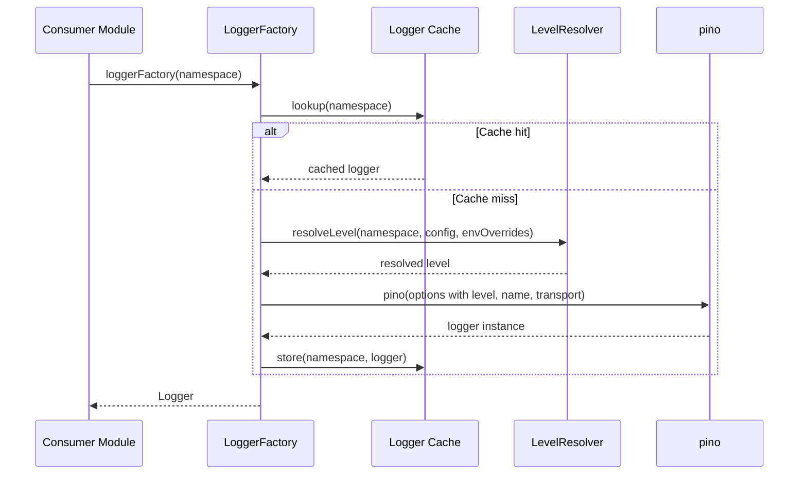
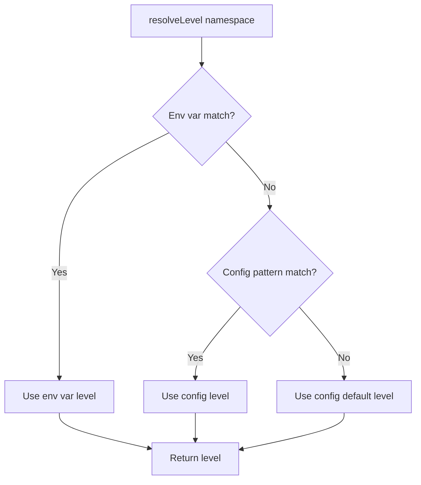
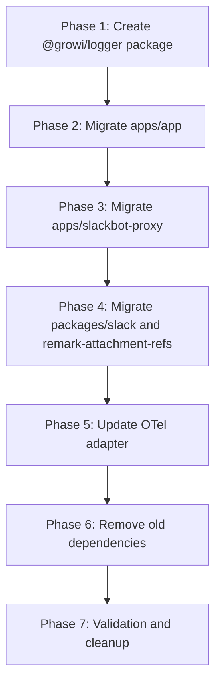

# Design Document: migrate-logger-to-pino

## Overview

**Purpose**: This feature migrates GROWI's logging infrastructure from bunyan (with the custom `universal-bunyan` wrapper) to pino, delivering faster structured logging with a smaller dependency footprint.

**Users**: All GROWI developers (logger consumers), operators (log level configuration), and the CI/CD pipeline (dependency management).

**Impact**: Replaces 7 logging-related packages (`bunyan`, `universal-bunyan`, `bunyan-format`, `express-bunyan-logger`, `morgan`, `browser-bunyan`, `@browser-bunyan/console-formatted-stream`) with 3 (`pino`, `pino-pretty`, `pino-http`) plus a new shared package `@growi/logger`.

### Goals
- Replace bunyan with pino across all apps and packages without functional degradation
- Preserve namespace-based log level control (config files + env var overrides)
- Eliminate morgan by consolidating HTTP logging into pino-http
- Maintain OpenTelemetry diagnostic logger integration
- Provide a shared `@growi/logger` package as the single logging entry point

### Non-Goals
- Changing log output semantics (field names, message format) beyond what pino naturally produces
- Adding new logging capabilities (structured context propagation, remote log shipping)
- Migrating to pino v10 (deferred until OTel instrumentation supports it)
- Changing the namespace naming convention (e.g., `growi:service:page`)

## Architecture

### Existing Architecture Analysis

The current logging stack has these layers:

1. **universal-bunyan** — custom wrapper providing: namespace-based level control via config + env vars, platform detection (Node.js/browser), stream selection (bunyan-format for Node.js, ConsoleFormattedStream for browser), logger caching
2. **Per-app loggerFactory** — thin wrapper that loads dev/prod config and delegates to universal-bunyan
3. **bunyan / browser-bunyan** — underlying logger implementations
4. **express-bunyan-logger / morgan** — HTTP request logging middleware

Key patterns to preserve:
- `loggerFactory(name: string): Logger` as the sole logger creation API
- Hierarchical colon-delimited namespaces with glob pattern matching
- Environment variables (`DEBUG`, `TRACE`, etc.) overriding config file levels
- Dev: human-readable output; Prod: JSON output (toggleable via `FORMAT_NODE_LOG`)
- Browser: console output with error-level default in production

### Architecture Pattern & Boundary Map

```mermaid
graph TB
    subgraph ConsumerApps[Consumer Applications]
        App[apps/app]
        Slackbot[apps/slackbot-proxy]
    end

    subgraph ConsumerPkgs[Consumer Packages]
        Slack[packages/slack]
        Remark[packages/remark-attachment-refs]
    end

    subgraph GrowiLogger[@growi/logger]
        Factory[LoggerFactory]
        LevelResolver[LevelResolver]
        EnvParser[EnvVarParser]
        TransportSetup[TransportFactory]
    end

    subgraph External[External Packages]
        Pino[pino v9.x]
        PinoPretty[pino-pretty]
        PinoHttp[pino-http]
        Minimatch[minimatch]
    end

    App --> Factory
    Slackbot --> Factory
    Slack --> Factory
    Remark --> Factory

    Factory --> LevelResolver
    Factory --> TransportSetup
    LevelResolver --> EnvParser
    LevelResolver --> Minimatch

    Factory --> Pino
    TransportSetup --> PinoPretty

    App --> PinoHttp
    Slackbot --> PinoHttp
    PinoHttp --> Factory
```

**Architecture Integration**:
- Selected pattern: Wrapper package (`@growi/logger`) encapsulating pino configuration — mirrors universal-bunyan's role
- Domain boundary: `@growi/logger` owns all logger creation, level resolution, and transport setup; consumer apps only call `loggerFactory(name)`
- Existing patterns preserved: factory function signature, namespace conventions, config file structure
- New components: `LevelResolver` (namespace-to-level matching), `TransportFactory` (dev/prod stream setup), `EnvVarParser` (env variable parsing)
- Steering compliance: shared package in `packages/` follows monorepo conventions

### Technology Stack

| Layer | Choice / Version | Role in Feature | Notes |
|-------|------------------|-----------------|-------|
| Logging Core | pino v9.x | Structured JSON logger for Node.js and browser | Pinned to v9.x for OTel compatibility; see research.md |
| Dev Formatting | pino-pretty v13.x | Human-readable log output in development | Used as transport (worker thread) |
| HTTP Logging | pino-http v11.x | Express middleware for request/response logging | Replaces both morgan and express-bunyan-logger |
| Glob Matching | minimatch (existing) | Namespace pattern matching for level config | Already a transitive dependency via universal-bunyan |
| Shared Package | @growi/logger | Logger factory with namespace/config/env support | New package in packages/logger/ |

## System Flows

### Logger Creation Flow



### Level Resolution Flow



## Requirements Traceability

| Requirement | Summary | Components | Interfaces | Flows |
|-------------|---------|------------|------------|-------|
| 1.1–1.4 | Logger factory with namespace support | LoggerFactory, LoggerCache | `loggerFactory()` | Logger Creation |
| 2.1–2.4 | Config-file level control | LevelResolver, ConfigLoader | `LoggerConfig` type | Level Resolution |
| 3.1–3.5 | Env var level override | EnvVarParser, LevelResolver | `parseEnvLevels()` | Level Resolution |
| 4.1–4.4 | Platform-aware logger | LoggerFactory, TransportFactory | `createTransport()` | Logger Creation |
| 5.1–5.4 | Dev/prod output formatting | TransportFactory | `TransportOptions` | Logger Creation |
| 6.1–6.4 | HTTP request logging | HttpLoggerMiddleware | `createHttpLogger()` | — |
| 7.1–7.3 | OpenTelemetry integration | DiagLoggerPinoAdapter | `DiagLogger` interface | — |
| 8.1–8.5 | Multi-app consistency | @growi/logger package | Package exports | — |
| 9.1–9.3 | Dependency cleanup | — (removal task) | — | — |
| 10.1–10.3 | Backward-compatible API | LoggerFactory | `Logger` type export | — |

## Components and Interfaces

| Component | Domain/Layer | Intent | Req Coverage | Key Dependencies | Contracts |
|-----------|-------------|--------|--------------|-----------------|-----------|
| LoggerFactory | @growi/logger / Core | Create and cache namespace-bound pino loggers | 1, 4, 8, 10 | pino (P0), LevelResolver (P0), TransportFactory (P0) | Service |
| LevelResolver | @growi/logger / Core | Resolve log level for a namespace from config + env | 2, 3 | minimatch (P0), EnvVarParser (P0) | Service |
| EnvVarParser | @growi/logger / Core | Parse env vars into namespace-level map | 3 | — | Service |
| TransportFactory | @growi/logger / Core | Create pino transport/options for Node.js and browser | 4, 5 | pino-pretty (P1) | Service |
| HttpLoggerMiddleware | apps/app, apps/slackbot-proxy | Express middleware for HTTP request logging | 6 | pino-http (P0), LoggerFactory (P0) | Service |
| DiagLoggerPinoAdapter | apps/app / OpenTelemetry | Wrap pino logger as OTel DiagLogger | 7 | pino (P0) | Service |
| ConfigLoader | Per-app | Load dev/prod config files | 2 | — | — |

### @growi/logger Package

#### LoggerFactory

| Field | Detail |
|-------|--------|
| Intent | Central entry point for creating namespace-bound pino loggers with level resolution and caching |
| Requirements | 1.1, 1.2, 1.3, 1.4, 4.1, 8.5, 10.1, 10.3 |

**Responsibilities & Constraints**
- Create pino logger instances with resolved level and transport configuration
- Cache logger instances per namespace to ensure singleton behavior
- Detect platform (Node.js vs browser) and apply appropriate configuration
- Expose `loggerFactory(name: string): pino.Logger` as the public API

**Dependencies**
- Outbound: LevelResolver — resolve level for namespace (P0)
- Outbound: TransportFactory — create transport options (P0)
- External: pino v9.x — logger creation (P0)

**Contracts**: Service [x]

##### Service Interface

```typescript
import type { Logger } from 'pino';

interface LoggerConfig {
  [namespacePattern: string]: string; // pattern → level ('info', 'debug', etc.)
}

interface LoggerFactoryOptions {
  config: LoggerConfig;
}

/**
 * Initialize the logger factory module with configuration.
 * Must be called once at application startup before any loggerFactory() calls.
 */
function initializeLoggerFactory(options: LoggerFactoryOptions): void;

/**
 * Create or retrieve a cached pino logger for the given namespace.
 */
function loggerFactory(name: string): Logger;
```

- Preconditions: `initializeLoggerFactory()` called before first `loggerFactory()` call
- Postconditions: Returns a pino.Logger bound to the namespace with resolved level
- Invariants: Same namespace always returns the same logger instance

**Implementation Notes**
- The `initializeLoggerFactory` is called once per app at startup, receiving the merged dev/prod config
- Browser detection: `typeof window !== 'undefined' && typeof window.document !== 'undefined'`
- In browser mode, skip transport setup and use pino's built-in `browser` option
- The factory is a module-level singleton (module scope cache + config)

#### LevelResolver

| Field | Detail |
|-------|--------|
| Intent | Determine the effective log level for a given namespace by matching against config patterns and env var overrides |
| Requirements | 2.1, 2.3, 2.4, 3.1, 3.2, 3.3, 3.4, 3.5 |

**Responsibilities & Constraints**
- Match namespace against glob patterns in config (using minimatch)
- Match namespace against env var-derived patterns (env vars take precedence)
- Return the most specific matching level, or the `default` level as fallback
- Parse is done once at module initialization; resolution is per-namespace at logger creation time

**Dependencies**
- Outbound: EnvVarParser — get env-derived level map (P0)
- External: minimatch — glob pattern matching (P0)

**Contracts**: Service [x]

##### Service Interface

```typescript
interface LevelResolver {
  /**
   * Resolve the log level for a namespace.
   * Priority: env var match > config pattern match > config default.
   */
  resolveLevel(
    namespace: string,
    config: LoggerConfig,
    envOverrides: LoggerConfig,
  ): string;
}
```

- Preconditions: `config` contains a `default` key
- Postconditions: Returns a valid pino log level string
- Invariants: Env overrides always take precedence over config

#### EnvVarParser

| Field | Detail |
|-------|--------|
| Intent | Parse environment variables (DEBUG, TRACE, INFO, WARN, ERROR, FATAL) into a namespace-to-level map |
| Requirements | 3.1, 3.4, 3.5 |

**Responsibilities & Constraints**
- Read `process.env.DEBUG`, `process.env.TRACE`, etc.
- Split comma-separated values into individual namespace patterns
- Return a flat `LoggerConfig` map: `{ 'growi:*': 'debug', 'growi:service:page': 'trace' }`
- Parsed once at module load time (not per-logger)

**Contracts**: Service [x]

##### Service Interface

```typescript
/**
 * Parse log-level environment variables into a namespace-to-level map.
 * Reads: DEBUG, TRACE, INFO, WARN, ERROR, FATAL from process.env.
 */
function parseEnvLevels(): LoggerConfig;
```

- Preconditions: Environment is available (`process.env`)
- Postconditions: Returns a map where each key is a namespace pattern and value is a level string
- Invariants: Only the six known env vars are read; unknown vars are ignored

#### TransportFactory

| Field | Detail |
|-------|--------|
| Intent | Create pino transport configuration appropriate for the current environment |
| Requirements | 4.1, 4.2, 4.3, 4.4, 5.1, 5.2, 5.3, 5.4 |

**Responsibilities & Constraints**
- Node.js development: return pino-pretty transport config (`singleLine`, `ignore: 'pid,hostname'`, `translateTime`)
- Node.js production: return raw JSON (stdout) by default; formatted output when `FORMAT_NODE_LOG` is truthy
- Browser: return pino `browser` option config (console output, production error-level default)
- Include `name` field in all output via pino's `name` option

**Contracts**: Service [x]

##### Service Interface

```typescript
import type { LoggerOptions } from 'pino';

interface TransportConfig {
  /** Pino options for Node.js environment */
  nodeOptions: Partial<LoggerOptions>;
  /** Pino options for browser environment */
  browserOptions: Partial<LoggerOptions>;
}

/**
 * Create transport configuration based on environment.
 * @param isProduction - Whether NODE_ENV is 'production'
 */
function createTransportConfig(isProduction: boolean): TransportConfig;
```

- Preconditions: Called during logger factory initialization
- Postconditions: Returns valid pino options for the detected environment
- Invariants: Browser options never include Node.js transports

**Implementation Notes**
- Dev transport: `{ target: 'pino-pretty', options: { translateTime: 'SYS:standard', ignore: 'pid,hostname', singleLine: false } }`
- Prod with FORMAT_NODE_LOG: use pino-pretty transport with long format
- Prod without FORMAT_NODE_LOG (or false): raw JSON to stdout (no transport)
- Browser production: `{ browser: { asObject: false }, level: 'error' }`
- Browser development: `{ browser: { asObject: false } }` (inherits resolved level)

### HTTP Logging Layer

#### HttpLoggerMiddleware

| Field | Detail |
|-------|--------|
| Intent | Provide Express middleware for HTTP request/response logging via pino-http |
| Requirements | 6.1, 6.2, 6.3, 6.4 |

**Responsibilities & Constraints**
- Create pino-http middleware using a logger from LoggerFactory
- Skip `/_next/static/` paths in development
- Include method, URL, status code, and response time in log entries
- Unified middleware for both dev and prod (replaces morgan + express-bunyan-logger)

**Dependencies**
- External: pino-http v11.x (P0)
- Inbound: LoggerFactory — provides base logger (P0)

**Contracts**: Service [x]

##### Service Interface

```typescript
import type { RequestHandler } from 'express';

/**
 * Create Express middleware for HTTP request logging.
 * Uses pino-http with the 'express' namespace logger.
 */
function createHttpLoggerMiddleware(): RequestHandler;
```

- Preconditions: LoggerFactory initialized
- Postconditions: Returns Express middleware that logs HTTP requests
- Invariants: Static file paths are skipped in non-production mode

**Implementation Notes**
- Use `autoLogging.ignore` for route filtering: `(req) => req.url?.startsWith('/_next/static/')`
- In production, do not skip any routes (current express-bunyan-logger uses `excludes: ['*']` which excludes fields, not routes; pino-http's `customAttributeKeys` can control which fields are included)
- `quietReqLogger: true` for lighter child loggers on `req.log`

### OpenTelemetry Layer

#### DiagLoggerPinoAdapter

| Field | Detail |
|-------|--------|
| Intent | Adapt a pino logger to the OpenTelemetry DiagLogger interface |
| Requirements | 7.1, 7.2, 7.3 |

**Responsibilities & Constraints**
- Implement the OTel `DiagLogger` interface (`error`, `warn`, `info`, `debug`, `verbose`)
- Map `verbose()` to pino's `trace()` level
- Parse JSON strings in message arguments (preserving current behavior)
- Disable `@opentelemetry/instrumentation-pino` if enabled by default

**Dependencies**
- External: pino v9.x (P0)
- External: @opentelemetry/api (P0)

**Contracts**: Service [x]

##### Service Interface

```typescript
import type { DiagLogger } from '@opentelemetry/api';

/**
 * Create a DiagLogger that delegates to a pino logger.
 * Maps OTel verbose level to pino trace level.
 */
function createDiagLoggerAdapter(): DiagLogger;
```

- Preconditions: LoggerFactory initialized, pino logger available for OTel namespace
- Postconditions: Returns a valid DiagLogger implementation
- Invariants: All DiagLogger methods delegate to the corresponding pino level

**Implementation Notes**
- Minimal change from current `DiagLoggerBunyanAdapter` — rename class, update import from bunyan to pino
- `parseMessage` helper can remain largely unchanged
- In OTel SDK configuration, replace `'@opentelemetry/instrumentation-bunyan': { enabled: false }` with `'@opentelemetry/instrumentation-pino': { enabled: false }` if the instrumentation package is present

## Data Models

Not applicable. This feature modifies runtime logging behavior and does not introduce or change persisted data models.

## Error Handling

### Error Strategy
Logging infrastructure must be resilient — a logger failure must never crash the application.

### Error Categories and Responses
- **Missing config file**: Fall back to `{ default: 'info' }` and emit a console warning
- **Invalid log level in config/env**: Ignore the entry and log a warning to stderr
- **Transport initialization failure** (pino-pretty not available): Fall back to raw JSON output
- **Logger creation failure**: Return a no-op logger that silently discards messages

### Monitoring
- Logger initialization errors are written to `process.stderr` directly (cannot use the logger itself)
- No additional monitoring infrastructure required — this is the monitoring infrastructure

## Testing Strategy

### Unit Tests
- `LevelResolver.resolveLevel()` with exact matches, glob patterns, env overrides, and fallback
- `EnvVarParser.parseEnvLevels()` with various env var combinations
- `TransportFactory.createTransportConfig()` for dev, prod, and browser environments
- `LoggerFactory` caching behavior (same namespace returns same instance)
- `DiagLoggerPinoAdapter` level mapping (verbose → trace)

### Integration Tests
- Logger factory initialization with real config files (dev and prod)
- HTTP middleware logging with Express (verify request/response logging, route skipping)
- End-to-end: `loggerFactory('growi:test')` produces correctly formatted output in dev mode

### Migration Validation
- Verify no imports of removed packages remain after migration
- Verify all `package.json` files are clean of bunyan/morgan references
- Verify existing log call sites work without modification (compile check + sample runtime test)

## Migration Strategy



- **Phase 1**: Build and test `@growi/logger` package independently
- **Phase 2–4**: Migrate consumers one at a time; each migration is independently deployable
- **Phase 5**: Update OTel adapter (isolated to one file + config)
- **Phase 6**: Remove all bunyan/morgan packages from `package.json` files
- **Phase 7**: Final grep verification, lint, build, test across monorepo

Rollback: Each phase can be reverted independently by restoring the previous `loggerFactory` implementation and dependencies.
