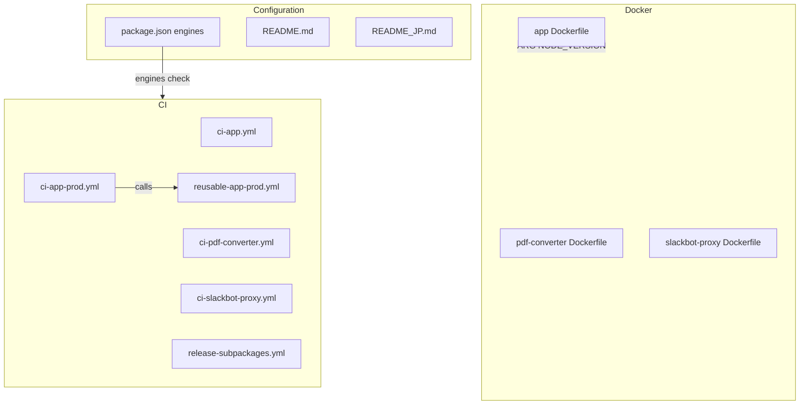
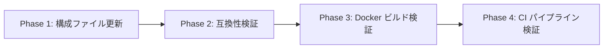

# Design Document

## Overview

**Purpose**: GROWI プロジェクトの Node.js ランタイムを v18/v20 から v24 に移行し、全環境（開発・CI・Docker）で一貫して v24 を使用する。

**Users**: 開発者、デプロイ担当者、コントリビューターが影響を受ける。開発環境のセットアップ、Docker ビルド、CI パイプラインの全てが v24 ベースに統一される。

**Impact**: package.json のエンジン制約、Docker ベースイメージ、CI ワークフローの Node.js バージョン指定、およびドキュメントのバージョン記載を変更する。アプリケーションコード自体には変更不要（コードベース分析で非推奨 API の使用なしを確認済み）。

### Goals
- Node.js v24 のみ対応に移行する
- 全構成ファイル（package.json、Dockerfile、CI）のバージョン指定を v24 に統一する
- 将来の v26 追加に備えて複数バージョン対応の仕組みを維持する
- ドキュメントを最新のバージョン情報に更新する

### Non-Goals
- アプリケーションコードのリファクタリング（v24 非推奨 API の使用なしを確認済み）
- Node.js v24 の新機能（Float16Array、URLPattern 等）の積極的な採用
- pnpm バージョンのアップグレード（v10.4.1 は v24 互換）
- TypeScript 設定の変更（ESNext ターゲットは v24 互換）
- 依存パッケージの大規模アップグレード（互換性問題が発生した場合のみ対応）

## Architecture

> 詳細な調査結果は `research.md` を参照。

### Existing Architecture Analysis

GROWI の Node.js バージョン管理は以下の構成ファイルで制御されている：

| 構成レイヤー | ファイル | 現在の設定 |
|-------------|---------|-----------|
| エンジン制約 | `package.json` (root) | `"node": "^18 \|\| ^20"` |
| Docker ビルド | `apps/*/docker/Dockerfile` (3 ファイル) | `FROM node:20-slim` (ハードコード) |
| CI テスト | `.github/workflows/ci-*.yml` (3 ファイル) | `node-version: [20.x]` |
| CI 本番テスト | `.github/workflows/ci-app-prod.yml` | 個別ジョブ（node18, node20） |
| CI 再利用ワークフロー | `.github/workflows/reusable-app-prod.yml` | `default: 22.x` |
| リリース | `.github/workflows/release-subpackages.yml` | `node-version: '20'` |
| ドキュメント | `README.md`, `README_JP.md` | `Node.js v18.x or v20.x` |

**既存パターンの保持**:
- `ci-app-prod.yml` の個別ジョブパターン（`test-prod-nodeXX`）を維持
- `reusable-app-prod.yml` の `workflow_call` / `workflow_dispatch` の入力パラメータ構造を維持
- Dockerfile のマルチステージビルド構造を維持

### Architecture Pattern & Boundary Map



**Architecture Integration**:
- **Selected pattern**: 構成ファイル一括更新。v24 のみ対応に切り替え、将来の拡張性は機構レベルで維持
- **Domain boundaries**: 構成変更は 3 レイヤー（package.json、Docker、CI）に分離されており、各レイヤーは独立して変更可能
- **Existing patterns preserved**: CI の個別ジョブパターン、Docker のマルチステージビルド、pnpm の `ignoredBuiltDependencies` 設定
- **New components**: なし（既存ファイルの値変更のみ）
- **Steering compliance**: モノレポ構造の原則に従い、ルート `package.json` でエンジン制約を一元管理

### Technology Stack

| Layer | Choice / Version | Role in Feature | Notes |
|-------|------------------|-----------------|-------|
| Runtime | Node.js v24 LTS (Krypton) | アプリケーション実行環境 | 2028 年 4 月まで LTS サポート |
| Container | node:24-slim (bookworm) | Docker ベースイメージ | Docker Hub で利用可能 |
| Package Manager | pnpm 10.4.1 | 依存管理 | 変更なし、v24 互換 |
| CI Runner | actions/setup-node@v4 | CI での Node.js セットアップ | v24.x をサポート |

## Requirements Traceability

| Requirement | Summary | Components | Interfaces | Flows |
|-------------|---------|------------|------------|-------|
| 1.1 | engines.node を `^24` に設定 | PackageJsonConfig | — | — |
| 1.2 | v24 未満でのインストール拒否 | PackageJsonConfig | — | — |
| 1.3 | ワークスペースの engines 統一 | PackageJsonConfig | — | — |
| 2.1 | app Dockerfile を node:24-slim に | DockerConfig | — | DockerBuildFlow |
| 2.2 | pdf-converter Dockerfile を node:24-slim に | DockerConfig | — | DockerBuildFlow |
| 2.3 | slackbot-proxy Dockerfile を node:24-slim に | DockerConfig | — | DockerBuildFlow |
| 2.4 | 全ステージで node:24-slim を使用 | DockerConfig | — | DockerBuildFlow |
| 3.1 | ci-app.yml を 24.x に | CIConfig | — | — |
| 3.2 | ci-pdf-converter.yml を 24.x に | CIConfig | — | — |
| 3.3 | ci-slackbot-proxy.yml を 24.x に | CIConfig | — | — |
| 3.4 | ci-app-prod.yml を v24 のみに | CIConfig | — | — |
| 3.5 | reusable-app-prod.yml のデフォルトを 24.x に | CIConfig | — | — |
| 3.6 | release-subpackages.yml を 24 に | CIConfig | — | — |
| 4.1 | CI マトリクス構造の維持 | CIConfig | — | — |
| 4.2 | engines の SemVer 範囲指定維持 | PackageJsonConfig | — | — |
| 4.3 | Docker ARG によるバージョン外部指定 | DockerConfig | — | DockerBuildFlow |
| 5.1 | README.md を v24.x に更新 | DocumentationConfig | — | — |
| 5.2 | README_JP.md を v24.x に更新 | DocumentationConfig | — | — |
| 5.3 | その他ドキュメントの更新 | DocumentationConfig | — | — |
| 6.1 | pnpm install が v24 で成功 | CompatibilityVerification | — | VerificationFlow |
| 6.2 | turbo run build が v24 で成功 | CompatibilityVerification | — | VerificationFlow |
| 6.3 | テストスイートが v24 で合格 | CompatibilityVerification | — | VerificationFlow |
| 6.4 | 非互換パッケージの解消 | CompatibilityVerification | — | — |
| 7.1 | 非推奨 API を使用しない | CompatibilityVerification | — | — |
| 7.2 | デフォルト動作変更への適合 | CompatibilityVerification | — | — |
| 7.3 | deprecation warning の排除 | CompatibilityVerification | — | VerificationFlow |

## Components and Interfaces

| Component | Domain/Layer | Intent | Req Coverage | Key Dependencies | Contracts |
|-----------|-------------|--------|--------------|------------------|-----------|
| PackageJsonConfig | Configuration | engines.node の v24 制約設定 | 1.1, 1.2, 1.3, 4.2 | — | — |
| DockerConfig | Infrastructure | 全 Dockerfile の v24 ベースイメージ化 + ARG パラメータ化 | 2.1-2.4, 4.3 | node:24-slim (P0) | — |
| CIConfig | Infrastructure | 全 CI ワークフローの v24 対応 | 3.1-3.6, 4.1 | actions/setup-node@v4 (P0) | — |
| DocumentationConfig | Documentation | README 等のバージョン記載更新 | 5.1-5.3 | — | — |
| CompatibilityVerification | Validation | v24 環境での install/build/test 検証 | 6.1-6.4, 7.1-7.3 | Node.js v24 runtime (P0) | — |

### Configuration Layer

#### PackageJsonConfig

| Field | Detail |
|-------|--------|
| Intent | ルート package.json の engines.node を v24 のみに変更 |
| Requirements | 1.1, 1.2, 1.3, 4.2 |

**Responsibilities & Constraints**
- ルート `package.json` の `engines.node` フィールドを `"^24"` に設定
- ワークスペース内の個別 `package.json` に `engines` フィールドが存在する場合は `"^24"` に統一
- SemVer 範囲指定形式を維持し、将来 `"^24 || ^26"` への拡張を容易にする

**Dependencies**
- External: pnpm 10.4.1 — engines チェックの実行主体 (P0)

**Implementation Notes**
- 変更箇所: `package.json` line 120 の `"node": "^18 || ^20"` → `"node": "^24"`
- ワークスペース内の `package.json` には独自の `engines` フィールドは存在しないことを確認済み（変更不要）
- pnpm はデフォルトで `engine-strict=false` のため、`.npmrc` に `engine-strict=true` が設定されていない場合は警告のみ。厳密な制約にはこの設定が必要

#### DockerConfig

| Field | Detail |
|-------|--------|
| Intent | 全 Dockerfile のベースイメージを node:24-slim に変更し、ARG でバージョンをパラメータ化 |
| Requirements | 2.1, 2.2, 2.3, 2.4, 4.3 |

**Responsibilities & Constraints**
- 3 つの Dockerfile（app, pdf-converter, slackbot-proxy）の全ステージで `node:24-slim` を使用
- `ARG NODE_VERSION=24` を導入し、`FROM node:${NODE_VERSION}-slim` で参照
- マルチステージビルドの全ステージで同一バージョンを使用
- pnpm バージョン（10.4.1）のピン留めは変更しない

**Dependencies**
- External: Docker Hub node:24-slim — ベースイメージ (P0)
- External: node-gyp — ネイティブモジュールビルド (P1)

**Implementation Notes**
- 各 Dockerfile の変更パターン:
  ```dockerfile
  # Before
  FROM node:20-slim AS base

  # After
  ARG NODE_VERSION=24
  FROM node:${NODE_VERSION}-slim AS base
  ```
- release ステージも同様に ARG を参照:
  ```dockerfile
  # Before
  FROM node:20-slim

  # After
  ARG NODE_VERSION=24
  FROM node:${NODE_VERSION}-slim
  ```
- 注意: Docker の `ARG` はステージをまたぐ場合、各 `FROM` の前に再宣言が必要。グローバル ARG として `FROM` 前に宣言し、各ステージ内で `ARG NODE_VERSION` で再参照する
- 対象ファイル:
  - `apps/app/docker/Dockerfile` (lines 9, 75)
  - `apps/pdf-converter/docker/Dockerfile` (lines 9, 66)
  - `apps/slackbot-proxy/docker/Dockerfile` (lines 6, 55)

#### CIConfig

| Field | Detail |
|-------|--------|
| Intent | 全 CI ワークフローの Node.js バージョンを v24 に更新し、マトリクス拡張性を維持 |
| Requirements | 3.1, 3.2, 3.3, 3.4, 3.5, 3.6, 4.1 |

**Responsibilities & Constraints**
- 開発 CI（ci-app, ci-pdf-converter, ci-slackbot-proxy）のマトリクスを `[24.x]` に変更
- 本番 CI（ci-app-prod.yml）の個別ジョブを v24 のみに変更（`test-prod-node24` に統合）
- reusable ワークフローのデフォルト node-version を `24.x` に変更
- リリースワークフローの node-version を `24` に変更
- 個別ジョブパターンを維持し、将来 v26 追加時にジョブ追加で拡張可能にする

**Dependencies**
- External: actions/setup-node@v4 — Node.js v24 のセットアップ (P0)
- External: GitHub Actions Ubuntu runner — Node.js v24 の実行環境 (P0)

**Implementation Notes**
- `ci-app.yml`, `ci-pdf-converter.yml`, `ci-slackbot-proxy.yml`:
  - `node-version: [20.x]` → `node-version: [24.x]`（全マトリクス箇所）
- `ci-app-prod.yml`:
  - `test-prod-node18` と `test-prod-node20` の 2 ジョブを `test-prod-node24` の 1 ジョブに統合
  - E2E テスト（skip-e2e-test）の制御は node20 ジョブのロジックを引き継ぐ
- `reusable-app-prod.yml`:
  - `workflow_dispatch.inputs.node-version.default` を `22.x` → `24.x` に変更
- `release-subpackages.yml`:
  - `node-version: '20'` → `node-version: '24'`

#### DocumentationConfig

| Field | Detail |
|-------|--------|
| Intent | Node.js バージョン記載のあるドキュメントを v24 に更新 |
| Requirements | 5.1, 5.2, 5.3 |

**Responsibilities & Constraints**
- `README.md` と `README_JP.md` の Node.js バージョン記載を `v24.x` に更新
- その他のドキュメントに Node.js バージョン参照がある場合も同様に更新

**Implementation Notes**
- `README.md` line 84: `Node.js v18.x or v20.x` → `Node.js v24.x`
- `README_JP.md` line 84: `Node.js v18.x or v20.x` → `Node.js v24.x`

### Validation Layer

#### CompatibilityVerification

| Field | Detail |
|-------|--------|
| Intent | Node.js v24 環境での install/build/test の成功を検証 |
| Requirements | 6.1, 6.2, 6.3, 6.4, 7.1, 7.2, 7.3 |

**Responsibilities & Constraints**
- Node.js v24 環境で `pnpm install --frozen-lockfile` が成功することを確認
- `turbo run build` が全ワークスペースで成功することを確認
- 既存テストスイートが全て合格することを確認
- deprecation warning が出力されないことを確認
- 非互換パッケージが発見された場合はアップデートまたは代替で解消

**Dependencies**
- External: Node.js v24 runtime — 実行環境 (P0)
- Inbound: PackageJsonConfig — engines 制約による互換性チェック (P0)

**Implementation Notes**
- 検証コマンド（Node.js v24 環境で実行）:
  1. `pnpm install --frozen-lockfile`
  2. `turbo run build --filter @growi/app`
  3. `turbo run test --filter @growi/app`
  4. `turbo run lint:typecheck --filter @growi/app`
- コードベース分析の結果、以下の v24 非推奨/削除 API は GROWI ソースコードでは未使用:
  - `url.parse()`, `Buffer()`, `require('punycode')`, `util.is*()`, `tls.createSecurePair()`, `dirent.path`, `SlowBuffer`, `domain` module
- ネイティブ依存パッケージ（@swc/core 等）はプリビルドバイナリ方式のため、v24 対応版が自動的にインストールされる想定
- 依存パッケージ内部での非推奨 API 使用による警告は `--redirect-warnings` オプションで監視可能
- OpenSSL 3.5 のセキュリティレベル 2 により、LDAP/SAML 連携で 2048 bit 未満の RSA 鍵を使用する外部サービスとの接続に影響する可能性がある（運用レベルの確認事項）

## Error Handling

### Error Strategy
この機能は構成ファイルの変更が主であり、ランタイムのエラーハンドリング変更は不要。

### Error Categories and Responses
- **Install Failure**: `pnpm install` 時にネイティブモジュールのビルド失敗 → 依存パッケージのアップデートまたは `ignoredBuiltDependencies` への追加
- **Build Failure**: TypeScript コンパイルエラーまたは webpack/turbo エラー → エラーメッセージに基づく個別対応
- **Test Failure**: v24 の動作変更（AsyncLocalStorage、fetch() 等）に起因するテスト失敗 → テストコードまたはアプリケーションコードの修正
- **Docker Build Failure**: ベースイメージのプルエラーまたは node-gyp ビルドエラー → イメージタグの確認、node-gyp バージョンの更新

## Testing Strategy

### Compatibility Tests（互換性検証）
1. `pnpm install --frozen-lockfile` が Node.js v24 環境で成功する
2. `turbo run build --filter @growi/app` が成功する
3. `turbo run lint:typecheck --filter @growi/app` が成功する
4. `turbo run test --filter @growi/app` が全テスト合格する
5. Node.js v24 起動時に deprecation warning が出力されない

### Docker Build Tests
1. `docker build --build-arg NODE_VERSION=24 -f apps/app/docker/Dockerfile .` が成功する
2. `docker build --build-arg NODE_VERSION=24 -f apps/pdf-converter/docker/Dockerfile .` が成功する
3. `docker build --build-arg NODE_VERSION=24 -f apps/slackbot-proxy/docker/Dockerfile .` が成功する
4. デフォルト（ARG なし）でも v24 イメージでビルドされる

### CI Validation
1. 各ワークフローの YAML が GitHub Actions のスキーマに準拠している
2. `ci-app-prod.yml` の `test-prod-node24` ジョブが `reusable-app-prod.yml` を正しく呼び出す

## Migration Strategy



- **Phase 1**: package.json、Dockerfile、CI ワークフロー、ドキュメントの値変更
- **Phase 2**: ローカルの Node.js v24 環境で install/build/test を実行
- **Phase 3**: Docker ビルドの成功を確認
- **Phase 4**: CI パイプラインの全ジョブが成功することを確認
- **Rollback**: 全変更は Git revert で即座にロールバック可能
