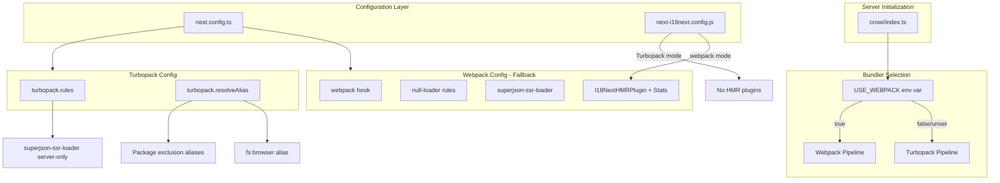
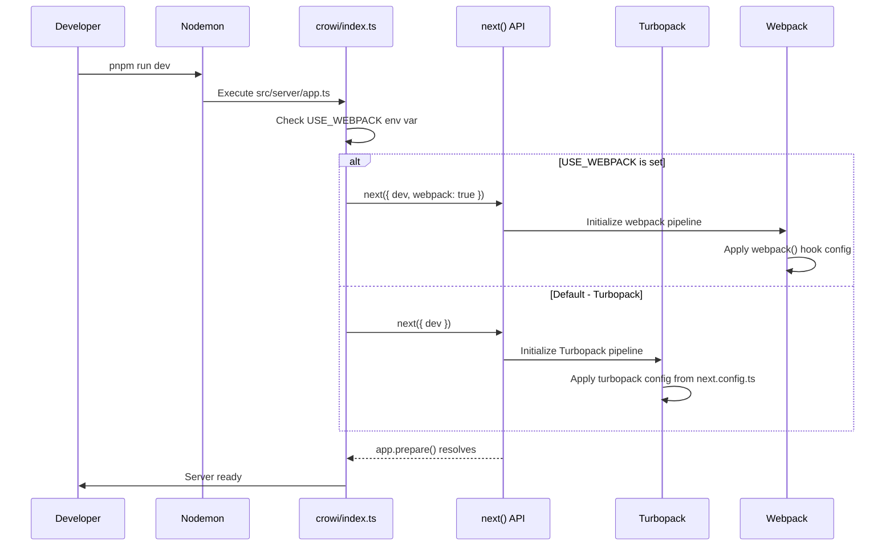
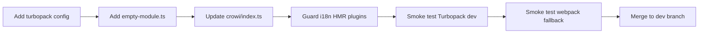

# Design Document: Migrate to Turbopack

## Overview

**Purpose**: This feature migrates GROWI's Next.js bundler from webpack to Turbopack, delivering dramatically faster dev server compilation (5-10x faster Fast Refresh) and improved build performance for the development team.

**Users**: All GROWI developers will benefit from faster HMR, shorter page compilation times, and reduced dev server startup latency.

**Impact**: Changes the build pipeline in `apps/app` by replacing the webpack bundler configuration with Turbopack equivalents while preserving all existing custom functionality (SuperJSON SSR, server-only package exclusion, ESM transpilation).

### Goals
- Enable Turbopack as the default bundler for `next dev` with the custom Express server
- Migrate all 6 webpack customizations to Turbopack-compatible equivalents
- Maintain webpack fallback via environment variable during the transition period
- Enable Turbopack for production `next build` after dev stability is confirmed

### Non-Goals
- Migrating from Pages Router to App Router
- Replacing next-i18next with a different i18n library
- Rewriting the custom Express server architecture
- Achieving feature parity for dev module analysis tooling (deferred)
- Implementing i18n HMR under Turbopack (acceptable tradeoff)

## Architecture

### Existing Architecture Analysis

The current build pipeline uses webpack exclusively, configured via:

1. **Server initialization**: `src/server/crowi/index.ts` calls `next({ dev, webpack: true })` to explicitly opt out of Turbopack
2. **next.config.ts**: Contains `webpack()` hook with 6 custom configurations (loaders, plugins, resolve fallbacks)
3. **Build scripts**: `next build --webpack` and `next dev` (via nodemon) both use webpack
4. **i18n config**: `config/next-i18next.config.js` loads `I18NextHMRPlugin` conditionally in dev mode

Key constraints:
- Pages Router with `.page.{ts,tsx}` extension convention
- Custom Express server with middleware stack
- 70+ ESM packages requiring transpilation
- Server/client boundary enforcement via null-loader

### Architecture Pattern & Boundary Map



**Architecture Integration**:
- Selected pattern: Feature-flag phased migration with dual configuration
- Domain boundaries: Build configuration layer only — no changes to application code, server logic, or page components
- Existing patterns preserved: Express custom server, Pages Router, SuperJSON SSR, server-client boundary
- New components: Empty module file, Turbopack config block, env-based bundler selection
- Steering compliance: Maintains server-client boundary enforcement; aligns with existing build optimization strategy

### Technology Stack

| Layer | Choice / Version | Role in Feature | Notes |
|-------|------------------|-----------------|-------|
| Bundler (primary) | Turbopack (Next.js 16 built-in) | Dev and build bundler | Replaces webpack as default |
| Bundler (fallback) | Webpack (Next.js 16 built-in) | Fallback during transition | Retained via `--webpack` flag |
| Runtime | Next.js ^16.0.0 | Framework providing both bundler options | `next()` API supports `turbopack` parameter |
| Loader compat | loader-runner (Turbopack built-in) | Executes webpack loaders in Turbopack | Subset of webpack loader API |

No new external dependencies are introduced. The migration uses only built-in Next.js 16 capabilities.

## System Flows

### Dev Server Startup with Bundler Selection



## Requirements Traceability

| Requirement | Summary | Components | Interfaces | Flows |
|-------------|---------|------------|------------|-------|
| 1.1 | Remove webpack: true from next() | ServerInit | next() options | Dev startup |
| 1.2 | Turbopack config in next.config.ts | TurbopackConfig | turbopack key | - |
| 1.3 | Fast Refresh equivalent | TurbopackConfig | Built-in | Dev startup |
| 1.4 | Faster HMR for .page.tsx | TurbopackConfig | Built-in | Dev startup |
| 2.1 | Alias server packages to empty module | ResolveAliasConfig | resolveAlias | - |
| 2.2 | Resolve fs to false in browser | ResolveAliasConfig | resolveAlias | - |
| 2.3 | No server packages in client output | ResolveAliasConfig | resolveAlias | - |
| 3.1 | Register superjson-ssr-loader | TurbopackRulesConfig | turbopack.rules | - |
| 3.2 | Auto-wrap getServerSideProps | TurbopackRulesConfig | turbopack.rules | - |
| 3.3 | Identical SuperJSON output | TurbopackRulesConfig | Loader output | - |
| 3.4 | Fallback mechanism if loader incompatible | TurbopackRulesConfig | - | - |
| 4.1 | ESM packages without ERR_REQUIRE_ESM | TranspileConfig | transpilePackages | - |
| 4.2 | Remark/rehype ecosystem bundles correctly | TranspileConfig | transpilePackages | - |
| 5.1 | Translation changes reflected in browser | I18nConfig | Manual refresh | - |
| 5.2 | Alternative i18n HMR or documented tradeoff | I18nConfig | Documentation | - |
| 5.3 | next-i18next functions under Turbopack | I18nConfig | Runtime config | - |
| 6.1 | Production bundle works | BuildConfig | next build | - |
| 6.2 | Turbopack or webpack fallback for build | BuildConfig | --webpack flag | - |
| 6.3 | Production tests pass | BuildConfig | Test suite | - |
| 7.1 | Alternative module analysis | Deferred | - | - |
| 7.2 | DUMP_INITIAL_MODULES report | Deferred | - | - |
| 8.1 | Switch via env var or CLI flag | BundlerSwitch | USE_WEBPACK env | Dev startup |
| 8.2 | Webpack mode fully functional | WebpackFallback | webpack() hook | - |
| 8.3 | Dual config in next.config.ts | NextConfigDual | Both configs | - |

## Components and Interfaces

| Component | Domain/Layer | Intent | Req Coverage | Key Dependencies | Contracts |
|-----------|-------------|--------|--------------|------------------|-----------|
| ServerInit | Server | Toggle bundler via env var in next() call | 1.1, 1.3, 1.4, 8.1 | next() API (P0) | - |
| TurbopackConfig | Config | Define turbopack block in next.config.ts | 1.2, 3.1, 3.2 | next.config.ts (P0) | - |
| ResolveAliasConfig | Config | Alias server-only packages and fs in browser | 2.1, 2.2, 2.3 | empty-module.ts (P0) | - |
| EmptyModule | Util | Provide empty export file for resolveAlias | 2.1, 2.2 | None | - |
| I18nConfig | Config | Remove HMR plugins when Turbopack is active | 5.1, 5.2, 5.3 | next-i18next (P1) | - |
| BuildScripts | Config | Update package.json scripts for Turbopack | 6.1, 6.2, 8.1 | package.json (P0) | - |
| WebpackFallback | Config | Maintain webpack() hook for fallback | 8.2, 8.3 | next.config.ts (P0) | - |

### Configuration Layer

#### ServerInit — Bundler Toggle

| Field | Detail |
|-------|--------|
| Intent | Select Turbopack or webpack based on environment variable when initializing Next.js |
| Requirements | 1.1, 1.3, 1.4, 8.1 |

**Responsibilities & Constraints**
- Read `USE_WEBPACK` environment variable to determine bundler choice
- Pass appropriate option to `next()` API: omit `webpack: true` for Turbopack (default), keep it for webpack fallback
- Preserve existing ts-node hook save/restore logic around `app.prepare()`

**Dependencies**
- External: Next.js `next()` API — bundler selection (P0)

**Implementation Notes**
- Integration: Minimal change in `src/server/crowi/index.ts` — replace hardcoded `webpack: true` with conditional
- Validation: Verify server starts correctly with both `USE_WEBPACK=1` and without
- Risks: None — `next()` API parameter is officially documented

#### TurbopackConfig — Rules and Loaders

| Field | Detail |
|-------|--------|
| Intent | Configure Turbopack-specific rules for custom loaders in next.config.ts |
| Requirements | 1.2, 3.1, 3.2, 3.3, 3.4 |

**Responsibilities & Constraints**
- Register `superjson-ssr-loader` for `*.page.ts` and `*.page.tsx` files with server-only condition
- Use `turbopack.rules` with `condition: { not: 'browser' }` for server-side targeting
- Loader must return JavaScript code (already satisfied by existing loader)

**Dependencies**
- Inbound: next.config.ts — configuration host (P0)
- External: Turbopack loader-runner — loader execution (P0)
- External: superjson-ssr-loader.ts — existing loader (P0)

**Contracts**: Service [ ] / API [ ] / Event [ ] / Batch [ ] / State [ ]

**Implementation Notes**
- Integration: Add `turbopack` key to nextConfig object alongside existing `webpack()` hook
- Validation: Verify pages with `getServerSideProps` still have SuperJSON wrapping applied
- Risks: If loader-runner subset causes issues, fallback to code generation approach (pre-process files before build). See `research.md` Risk 2.

##### Turbopack Rules Configuration Shape

```typescript
// Type definition for the turbopack.rules config
interface TurbopackRulesConfig {
  turbopack: {
    rules: {
      // Server-only: superjson-ssr-loader for .page.ts/.page.tsx
      '*.page.ts': Array<{
        condition: { not: 'browser' };
        loaders: string[];  // [path.resolve(__dirname, 'src/utils/superjson-ssr-loader.ts')]
        as: '*.ts';
      }>;
      '*.page.tsx': Array<{
        condition: { not: 'browser' };
        loaders: string[];
        as: '*.tsx';
      }>;
    };
    resolveAlias: Record<string, string | { browser: string }>;
  };
}
```

#### ResolveAliasConfig — Package Exclusion

| Field | Detail |
|-------|--------|
| Intent | Exclude server-only packages from client bundle using Turbopack resolveAlias |
| Requirements | 2.1, 2.2, 2.3 |

**Responsibilities & Constraints**
- Map 7 server-only packages to empty module in browser context
- Map `fs` to empty module in browser context
- Use conditional `{ browser: '...' }` syntax for client-only aliasing

**Dependencies**
- External: EmptyModule file — alias target (P0)

##### Resolve Alias Mapping

```typescript
// resolveAlias configuration mapping
interface ResolveAliasConfig {
  // fs fallback for browser
  fs: { browser: string };  // path to empty module

  // Server-only packages aliased to empty module in browser
  'dtrace-provider': { browser: string };
  mongoose: { browser: string };
  'mathjax-full': { browser: string };
  'i18next-fs-backend': { browser: string };
  bunyan: { browser: string };
  'bunyan-format': { browser: string };
  'core-js': { browser: string };
}
```

**Implementation Notes**
- Integration: Add `resolveAlias` under `turbopack` key in next.config.ts
- Validation: Verify client pages render without "Module not found" errors for each aliased package
- Risks: The current webpack null-loader uses regex patterns (e.g., `/\/bunyan\//`) which match file paths. Turbopack resolveAlias uses package names. The `bunyan` alias should match imports of `bunyan` but must not interfere with `browser-bunyan`. Test carefully. See `research.md` Risk 3.

#### EmptyModule — Alias Target

| Field | Detail |
|-------|--------|
| Intent | Provide a minimal JavaScript module that exports nothing, used as alias target for excluded packages |
| Requirements | 2.1, 2.2 |

**Responsibilities & Constraints**
- Export an empty default and named export to satisfy any import style
- File location: `src/lib/empty-module.ts`

**Implementation Notes**
- Minimal file: `export default {}; export {};`

#### I18nConfig — HMR Plugin Removal

| Field | Detail |
|-------|--------|
| Intent | Conditionally remove i18next-hmr plugins when Turbopack is active |
| Requirements | 5.1, 5.2, 5.3 |

**Responsibilities & Constraints**
- Detect whether Turbopack or webpack is active
- When Turbopack: exclude `I18NextHMRPlugin` from webpack plugins and `HMRPlugin` from i18next `use` array
- When webpack: preserve existing HMR plugin behavior

**Dependencies**
- Inbound: next.config.ts — plugin registration (P1)
- Inbound: next-i18next.config.js — i18next plugin registration (P1)
- External: i18next-hmr — webpack-only HMR (P1)

**Implementation Notes**
- Integration: In `next.config.ts`, the `I18NextHMRPlugin` is inside the `webpack()` hook which only runs when webpack is active — no change needed there. In `next-i18next.config.js`, the `HMRPlugin` is loaded regardless of bundler — need to guard it with the same `USE_WEBPACK` env var check or detect Turbopack via absence of webpack context.
- Validation: Verify next-i18next functions correctly (routing, SSR translations) under Turbopack without HMR plugins
- Risks: `HMRPlugin` in next-i18next.config.js may reference webpack internals that fail under Turbopack. Guard with env var check. See `research.md` Risk 1.

#### BuildScripts — Package.json Updates

| Field | Detail |
|-------|--------|
| Intent | Update build and dev scripts to reflect Turbopack as default with webpack opt-in |
| Requirements | 6.1, 6.2, 8.1 |

**Responsibilities & Constraints**
- `build:client` script: keep `next build --webpack` initially (Phase 1), migrate to `next build` in Phase 2
- `dev` script: no change needed (bundler selection happens in crowi/index.ts, not CLI)
- `launch-dev:ci` script: inherits bundler from crowi/index.ts

**Implementation Notes**
- Phase 1: Only server initialization changes. Build scripts remain unchanged.
- Phase 2: Remove `--webpack` from `build:client` after Turbopack build verification.

## Error Handling

### Error Strategy

Build-time errors from Turbopack migration are the primary concern. All errors surface during compilation and are visible in terminal output.

### Error Categories and Responses

**Module Resolution Errors**: `Cannot resolve 'X'` — indicates a package not properly aliased in `resolveAlias`. Fix: add the missing package to the alias map.

**Loader Execution Errors**: `Turbopack loader failed` — indicates `superjson-ssr-loader` incompatibility. Fix: check loader-runner API usage; fallback to code generation if needed.

**Runtime Errors**: `SuperJSON deserialization failed` — indicates loader transform produced different output. Fix: compare webpack and Turbopack loader output for affected pages.

**i18n Errors**: `Cannot find module 'i18next-hmr'` or HMR plugin crash — indicates HMR plugin loaded in Turbopack mode. Fix: guard HMR plugin loading with env var check.

## Testing Strategy

### Smoke Tests (Manual, Phase 1)
1. Start dev server with Turbopack (default): verify all pages load without errors
2. Start dev server with `USE_WEBPACK=1`: verify webpack fallback works identically
3. Edit a `.page.tsx` file: verify Fast Refresh applies the change
4. Navigate to a page with `getServerSideProps`: verify SuperJSON data renders correctly
5. Navigate to a page importing remark/rehype plugins: verify Markdown rendering works
6. Verify no "Module not found" errors in browser console for server-only packages

### Regression Tests (Automated)
1. Run existing `vitest run` test suite — all tests must pass (tests don't depend on bundler)
2. Run `turbo run lint --filter @growi/app` — all lint checks must pass
3. Run `next build --webpack` — verify webpack build still works (fallback)
4. Run `next build` (Turbopack) — verify Turbopack production build works (Phase 2)

### Integration Verification
1. Test i18n: Switch locale in the UI, verify translations load correctly
2. Test SuperJSON: Visit pages with complex serialized props (ObjectId, dates), verify correct rendering
3. Test client bundle: Check browser DevTools network tab to confirm excluded packages are not in client JS

## Migration Strategy

### Phase 1: Dev Server Migration (Immediate)



1. Add `turbopack` configuration block to `next.config.ts` (rules + resolveAlias)
2. Create `src/lib/empty-module.ts`
3. Update `src/server/crowi/index.ts`: replace `webpack: true` with `USE_WEBPACK` env var check
4. Guard `HMRPlugin` in `next-i18next.config.js` with env var check
5. Run smoke tests with both Turbopack and webpack modes
6. Merge — all developers now use Turbopack by default for dev

### Phase 2: Production Build Migration (After Verification)

1. Verify Turbopack dev has been stable for a sufficient period
2. Remove `--webpack` from `build:client` script
3. Test production build with Turbopack
4. Run full CI pipeline to validate

### Phase 3: Cleanup (After Full Stability)

1. Remove `webpack()` hook from `next.config.ts`
2. Remove `USE_WEBPACK` env var check from `crowi/index.ts`
3. Remove `I18NextHMRPlugin` imports and `HMRPlugin` references entirely
4. Remove `ChunkModuleStatsPlugin` and related code
5. Evaluate removing unnecessary `transpilePackages` entries
