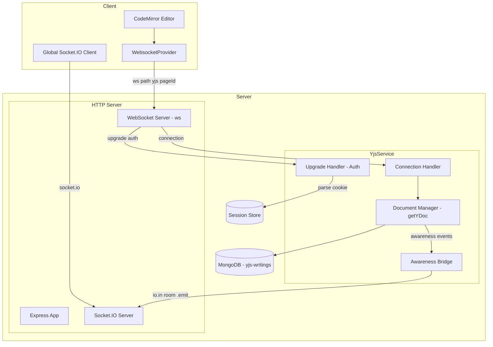
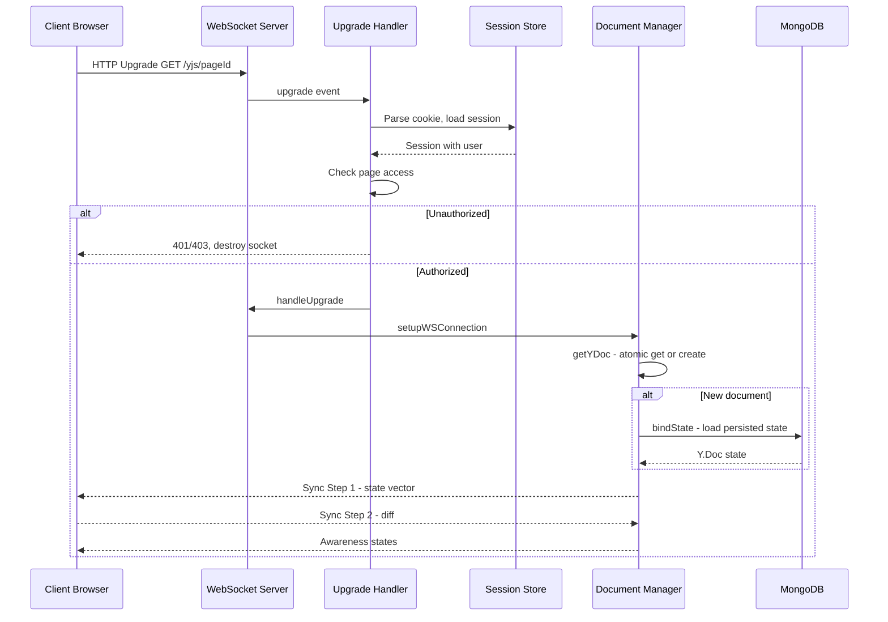
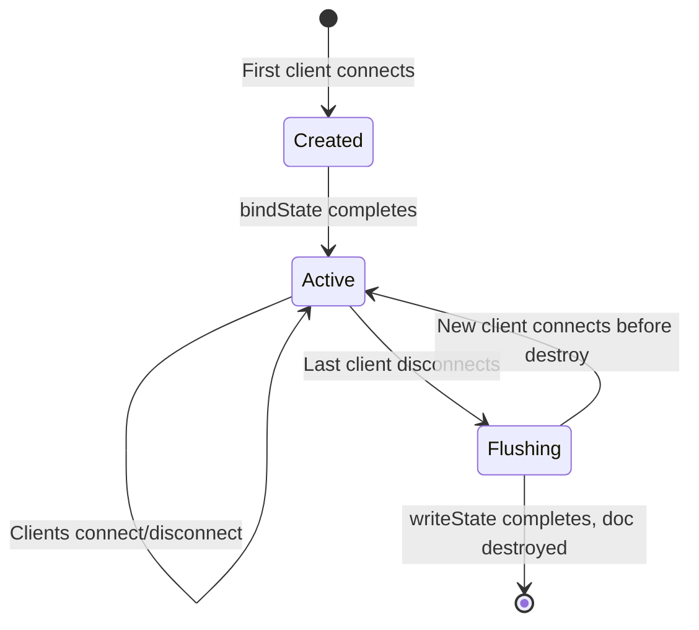

# Design Document: migrate-to-y-websocket

## Overview

**Purpose**: This feature replaces the `y-socket.io` Yjs transport layer with `y-websocket` to eliminate a critical race condition in document initialization that causes collaborative editing clients to permanently desynchronize.

**Users**: All GROWI users who use real-time collaborative page editing. System operators benefit from switching to an actively maintained library.

**Impact**: Replaces the internal transport layer for Yjs document synchronization. External behavior (editor UI, awareness indicators, draft detection, save flow) remains unchanged. Socket.IO continues to serve non-Yjs real-time events.

### Goals
- Eliminate the `initDocument` race condition that causes client desynchronization
- Maintain all existing collaborative editing functionality (sync, awareness, persistence, draft detection)
- Use `y-websocket@2.x` which is compatible with the current `yjs@^13` stack
- Coexist with the existing Socket.IO infrastructure without disruption

### Non-Goals
- Upgrading to yjs v14 (separate future effort)
- Changing the Yjs document model, CodeMirror integration, or page save/revision logic
- Migrating Socket.IO-based UI events (page room broadcasts) to WebSocket
- Changing the `yjs-writings` MongoDB collection schema or data format

## Architecture

### Existing Architecture Analysis

The current system uses two transport layers on the same HTTP server:

1. **Socket.IO** (`/socket.io/` path): Handles general app events (page join/leave, notifications) and Yjs document sync via y-socket.io's dynamic namespaces (`/yjs|{pageId}`)
2. **Express HTTP** (all other paths): REST API, SSR pages

y-socket.io creates Socket.IO namespaces dynamically for each page's Yjs document. Authentication piggybacks on Socket.IO's middleware chain (express-session + passport). The `YjsService` singleton wraps `YSocketIO` and integrates persistence, access control, and awareness event bridging.

**Key constraint**: Socket.IO rooms (`page:{pageId}`) are used by non-editor UI components to receive awareness state size updates and draft status notifications. This Socket.IO room broadcast mechanism must be preserved.

### Architecture Pattern & Boundary Map



**Architecture Integration**:
- **Selected pattern**: Replace Socket.IO-based Yjs transport with native WebSocket, keeping Socket.IO for non-Yjs events
- **Domain boundaries**: YjsService encapsulates all Yjs document management; Socket.IO only receives bridged awareness events
- **Existing patterns preserved**: Singleton YjsService, MongoDB persistence via y-mongodb-provider, session-based authentication
- **New components rationale**: WebSocket upgrade handler needed because raw ws does not have Socket.IO's middleware chain
- **Steering compliance**: Server-client boundary enforced; `ws` already in dependencies

### Technology Stack

| Layer | Choice / Version | Role in Feature | Notes |
|-------|------------------|-----------------|-------|
| Client Provider | `y-websocket@^2.0.4` (WebsocketProvider) | Yjs document sync over WebSocket | Replaces `y-socket.io` SocketIOProvider; yjs v13 compatible |
| Server WebSocket | `ws@^8.17.1` (WebSocket.Server) | Native WebSocket server for Yjs | Already installed; `noServer: true` mode for HTTP upgrade sharing |
| Server Yjs Utils | `y-websocket@^2.0.4` (`bin/utils`) | `setupWSConnection`, `getYDoc`, `WSSharedDoc` | Bundled server utilities; atomic document management |
| Persistence | `y-mongodb-provider` (existing) | Yjs document persistence to MongoDB | No changes; same `yjs-writings` collection |
| Event Bridge | Socket.IO `io` instance (existing) | Awareness state broadcasting to page rooms | Bridged from y-websocket awareness events |
| Auth | express-session + passport (existing) | WebSocket upgrade authentication | Cookie-based session parsing on upgrade request |

## System Flows

### Client Connection Flow



Key decisions: Authentication happens before `handleUpgrade`, so unauthorized connections never reach the Yjs layer. Document creation uses `getYDoc`'s atomic `map.setIfUndefined` pattern — no race condition window.

### Document Lifecycle



## Requirements Traceability

| Requirement | Summary | Components | Interfaces | Flows |
|-------------|---------|------------|------------|-------|
| 1.1, 1.2 | Single Y.Doc per page | DocumentManager | getYDoc | Connection Flow |
| 1.3, 1.4, 1.5 | Sync integrity on reconnect | DocumentManager, WebsocketProvider | setupWSConnection | Connection Flow |
| 2.1 | y-websocket server transport | YjsService, DocumentManager | setupWSConnection, setPersistence | Connection Flow |
| 2.2 | y-websocket client provider | WebsocketProvider (use-collaborative-editor-mode) | WebsocketProvider constructor | Connection Flow |
| 2.3 | Coexist with Socket.IO | UpgradeRouter | server.on upgrade | Connection Flow |
| 2.4 | resyncInterval | WebsocketProvider | resyncInterval option | — |
| 3.1, 3.2, 3.3 | Auth on upgrade | UpgradeHandler | authenticateUpgrade, checkPageAccess | Connection Flow |
| 3.4 | Guest access | UpgradeHandler | checkPageAccess | Connection Flow |
| 4.1, 4.2 | MongoDB persistence | PersistenceAdapter | bindState, writeState | Document Lifecycle |
| 4.3 | Load before sync | PersistenceAdapter | bindState | Connection Flow |
| 4.4 | Persist updates | PersistenceAdapter | doc.on update | — |
| 4.5 | Flush on disconnect | PersistenceAdapter | writeState | Document Lifecycle |
| 5.1 | Client awareness broadcast | WebsocketProvider | awareness.setLocalStateField | — |
| 5.2, 5.3 | Awareness bridge to Socket.IO | AwarenessBridge | awareness.on update, io.in.emit | — |
| 5.4 | Display editor list | use-collaborative-editor-mode | awareness.on update | — |
| 6.1, 6.2 | YDoc status API | YjsService | getYDocStatus, getCurrentYdoc | — |
| 6.3 | Sync on document load | YjsService | contentInitializor / bindState | Connection Flow |
| 6.4 | Force sync API | YjsService | syncWithTheLatestRevisionForce | — |
| 7.1, 7.2 | Dev environment | ViteDevConfig | — | — |
| 8.1, 8.2, 8.3 | Dependency cleanup | package.json changes | — | — |

## Components and Interfaces

| Component | Domain/Layer | Intent | Req Coverage | Key Dependencies | Contracts |
|-----------|-------------|--------|-------------|-----------------|-----------|
| YjsService | Server / Service | Orchestrates Yjs document lifecycle, exposes public API | 1.1-1.5, 2.1, 6.1-6.4 | ws (P0), y-websocket/bin/utils (P0), MongodbPersistence (P0) | Service |
| UpgradeHandler | Server / Auth | Authenticates and authorizes WebSocket upgrade requests | 3.1-3.4, 2.3 | express-session (P0), passport (P0), Page model (P0) | Service |
| PersistenceAdapter | Server / Data | Bridges MongodbPersistence to y-websocket persistence interface; handles sync-on-load and awareness registration | 4.1-4.5, 6.3, 5.2, 5.3 | MongodbPersistence (P0), syncYDoc (P0), Socket.IO io (P1) | Service, Event |
| AwarenessBridge | Server / Events | Bridges y-websocket awareness events to Socket.IO rooms | 5.2, 5.3 | Socket.IO io (P0), docs Map (P1) | Event |
| use-collaborative-editor-mode | Client / Hook | Manages WebsocketProvider lifecycle and awareness | 2.2, 2.4, 5.1, 5.4 | y-websocket (P0), yjs (P0) | State |
| ViteDevConfig | Dev / Config | Configures dev server WebSocket proxy/setup | 7.1, 7.2 | — | — |

### Server / Service Layer

#### YjsService

| Field | Detail |
|-------|--------|
| Intent | Manages Yjs document lifecycle, WebSocket server setup, and public API for page save/status integration |
| Requirements | 1.1, 1.2, 1.3, 1.4, 1.5, 2.1, 6.1, 6.2, 6.3, 6.4 |

**Responsibilities & Constraints**
- Owns the `ws.WebSocketServer` instance and the y-websocket `docs` Map
- Initializes persistence and content initialization via y-websocket's `setPersistence` and `setContentInitializor`
- Registers the HTTP `upgrade` handler (delegating auth to UpgradeHandler)
- Exposes the same public interface as the current `IYjsService` for downstream consumers
- Must attach to the existing `httpServer` without interfering with Socket.IO's upgrade handling

**Dependencies**
- Inbound: crowi/index.ts — initialization (P0)
- Inbound: PageService, API routes — getYDocStatus, syncWithTheLatestRevisionForce (P0)
- Outbound: UpgradeHandler — authentication (P0)
- Outbound: PersistenceAdapter — document persistence (P0)
- Outbound: AwarenessBridge — awareness event fan-out (P1)
- External: y-websocket `bin/utils` — getYDoc, setupWSConnection, docs, WSSharedDoc (P0)
- External: ws — WebSocket.Server (P0)

**Contracts**: Service [x]

##### Service Interface

```typescript
interface IYjsService {
  getYDocStatus(pageId: string): Promise<YDocStatus>;
  syncWithTheLatestRevisionForce(
    pageId: string,
    editingMarkdownLength?: number,
  ): Promise<SyncLatestRevisionBody>;
  getCurrentYdoc(pageId: string): Y.Doc | undefined;
}
```

- Preconditions: Service initialized with httpServer and io instances
- Postconditions: Public API behavior identical to current implementation
- Invariants: At most one Y.Doc per pageId in the docs Map at any time

**Implementation Notes**
- Constructor changes: Accept `httpServer: http.Server` and `io: Server` instead of just `io: Server`
- Replace `new YSocketIO(io)` with `new WebSocket.Server({ noServer: true })` + y-websocket utils setup
- Replace `ysocketio.documents.get(pageId)` with `docs.get(pageId)` from y-websocket utils
- Replace `ysocketio['persistence'] = ...` with `setPersistence(...)` public API
- Do NOT use `setContentInitializor` — instead, place sync-on-load logic (`syncYDoc`) inside `bindState` after persisted state is applied, to guarantee correct ordering (persistence load → YDocStatus check → syncYDoc)
- Use `httpServer.on('upgrade', ...)` with path check for `/yjs/`
- Socket.IO's internal upgrade handling for `/socket.io/` is not affected because Socket.IO only intercepts its own path

#### UpgradeHandler

| Field | Detail |
|-------|--------|
| Intent | Authenticates WebSocket upgrade requests using session cookies and verifies page access |
| Requirements | 3.1, 3.2, 3.3, 3.4 |

**Responsibilities & Constraints**
- Parses session cookie from the HTTP upgrade request
- Loads session from the session store (Redis or MongoDB)
- Deserializes the user via passport
- Checks page access using `Page.isAccessiblePageByViewer`
- Extracts `pageId` from the URL path (`/yjs/{pageId}`)
- Rejects unauthorized requests before `wss.handleUpgrade`

**Dependencies**
- Inbound: YjsService — called on upgrade event (P0)
- Outbound: Session Store (Redis/MongoDB) — session lookup (P0)
- Outbound: Page model — access check (P0)
- External: cookie (npm) — cookie parsing (P0)

**Contracts**: Service [x]

##### Service Interface

```typescript
type AuthenticatedRequest = IncomingMessage & {
  user: IUserHasId | null;
};

type UpgradeResult =
  | { authorized: true; request: AuthenticatedRequest; pageId: string }
  | { authorized: false; statusCode: number };

interface IUpgradeHandler {
  handleUpgrade(
    request: IncomingMessage,
    socket: Duplex,
    head: Buffer,
  ): Promise<UpgradeResult>;
}
```

- Preconditions: Request has valid URL matching `/yjs/{pageId}`
- Postconditions: Returns authorized result with deserialized user and pageId, or rejection with HTTP status
- Invariants: Never calls `wss.handleUpgrade` for unauthorized requests

**Implementation Notes**
- Use `cookie` package to parse `request.headers.cookie`
- Use the session store's `get(sessionId, callback)` to load session data
- Attach `user` to `request` object for downstream use in `setupWSConnection`
- Guest access: if `user` is null but page allows guest access, proceed with authorization

#### PersistenceAdapter

| Field | Detail |
|-------|--------|
| Intent | Adapts the existing MongodbPersistence to y-websocket's persistence interface |
| Requirements | 4.1, 4.2, 4.3, 4.4, 4.5 |

**Responsibilities & Constraints**
- Implements the y-websocket persistence interface (`bindState`, `writeState`)
- Loads persisted Y.Doc state from MongoDB on document creation
- After applying persisted state, determines YDocStatus and calls `syncYDoc` to synchronize with the latest revision — this guarantees correct ordering (persistence first, then sync)
- Persists incremental updates on every document change
- Registers awareness event listeners for the AwarenessBridge on document creation
- Flushes document state on last-client disconnect
- Maintains the `updatedAt` metadata for draft detection

**Dependencies**
- Inbound: y-websocket utils — called on document lifecycle events (P0)
- Outbound: MongodbPersistence (extended y-mongodb-provider) — data access (P0)

**Contracts**: Service [x]

##### Service Interface

```typescript
interface YWebsocketPersistence {
  bindState: (docName: string, ydoc: Y.Doc) => void;
  writeState: (docName: string, ydoc: Y.Doc) => Promise<void>;
  provider: MongodbPersistence;
}
```

- Preconditions: MongoDB connection established, `yjs-writings` collection accessible
- Postconditions: Document state persisted; `updatedAt` metadata updated
- Invariants: Same persistence behavior as current `createMongoDBPersistence`

**Implementation Notes**
- Extends the current `createMongoDBPersistence` pattern with additional responsibilities: after applying persisted state, `bindState` also runs `syncYDoc` and registers the awareness event bridge
- This consolidation into `bindState` is intentional: y-websocket does NOT await `contentInitializor` or `bindState`, but within `bindState` itself the ordering is guaranteed (load → sync → awareness registration)
- The `doc.on('update', ...)` handler for incremental persistence remains unchanged
- Accepts `io` (Socket.IO server) and `syncYDoc` as dependencies via closure or factory parameters

### Server / Events Layer

#### AwarenessBridge

| Field | Detail |
|-------|--------|
| Intent | Bridges y-websocket per-document awareness events to Socket.IO room broadcasts |
| Requirements | 5.2, 5.3 |

**Responsibilities & Constraints**
- Listens to awareness update events on each WSSharedDoc
- Emits `YjsAwarenessStateSizeUpdated` to the page's Socket.IO room on awareness changes
- Emits `YjsHasYdocsNewerThanLatestRevisionUpdated` when the last editor disconnects

**Dependencies**
- Inbound: y-websocket document awareness — awareness update events (P0)
- Outbound: Socket.IO io instance — room broadcast (P0)

**Contracts**: Event [x]

##### Event Contract
- Published events (to Socket.IO rooms):
  - `YjsAwarenessStateSizeUpdated` with `awarenessStateSize: number`
  - `YjsHasYdocsNewerThanLatestRevisionUpdated` with `hasNewerYdocs: boolean`
- Subscribed events (from y-websocket):
  - `WSSharedDoc.awareness.on('update', ...)` — per-document awareness changes
- Ordering: Best-effort delivery via Socket.IO; eventual consistency acceptable

**Implementation Notes**
- Awareness listener is registered inside `bindState` of the PersistenceAdapter (not in `setContentInitializor`), ensuring it runs after persistence is loaded
- In y-websocket, awareness state count is `doc.awareness.getStates().size` (same API as y-socket.io's `doc.awareness.states.size`)
- When awareness size drops to 0 (last editor leaves), check YDoc status and emit draft notification

### Client / Hook Layer

#### use-collaborative-editor-mode

| Field | Detail |
|-------|--------|
| Intent | Manages WebsocketProvider lifecycle, awareness state, and CodeMirror extensions |
| Requirements | 2.2, 2.4, 5.1, 5.4 |

**Responsibilities & Constraints**
- Creates `WebsocketProvider` with the correct WebSocket URL and room name
- Sets local awareness state with editor metadata (name, avatar, color)
- Handles provider lifecycle (create on mount, destroy on unmount/deps change)
- Provides CodeMirror extensions (yCollab, yUndoManagerKeymap) bound to the active Y.Doc

**Dependencies**
- Outbound: WebSocket server at `/yjs/{pageId}` — document sync (P0)
- External: y-websocket `WebsocketProvider` — client provider (P0)
- External: y-codemirror.next — CodeMirror binding (P0)

**Contracts**: State [x]

##### State Management
- State model: `provider: WebsocketProvider | undefined` (local React state)
- Persistence: None (provider is ephemeral, tied to component lifecycle)
- Concurrency: Single provider per page; cleanup on deps change prevents duplicates

**Implementation Notes**
- Replace `SocketIOProvider` import with `WebsocketProvider` from `y-websocket`
- Construct WebSocket URL: `${wsProtocol}//${window.location.host}/yjs` where `wsProtocol` is `wss:` or `ws:` based on `window.location.protocol`
- Room name: `pageId` (same as current)
- Options mapping: `autoConnect: true` → `connect: true`; `resyncInterval: 3000` unchanged
- Awareness API is identical (`provider.awareness.setLocalStateField`, `.on('update', ...)`)
- Event API mapping: `.on('sync', handler)` is the same

### Dev / Config Layer

#### ViteDevConfig

| Field | Detail |
|-------|--------|
| Intent | Configures Vite dev server to support y-websocket collaborative editing |
| Requirements | 7.1, 7.2 |

**Implementation Notes**
- Replace `YSocketIO` import with y-websocket server utils (`setupWSConnection`, `getYDoc`)
- Create `ws.WebSocketServer` in Vite's `configureServer` hook
- Handle WebSocket upgrade on dev server's `httpServer`

## Data Models

No changes to data models. The `yjs-writings` MongoDB collection schema, indexes, and the `MongodbPersistence` extended class remain unchanged. The persistence interface (`bindState` / `writeState`) is compatible between y-socket.io and y-websocket.

## Error Handling

### Error Strategy

| Error Type | Scenario | Response |
|------------|----------|----------|
| Auth Failure | Invalid/expired session cookie | 401 Unauthorized on upgrade, socket destroyed |
| Access Denied | User lacks page access | 403 Forbidden on upgrade, socket destroyed |
| Persistence Error | MongoDB read failure in bindState | Log error, serve empty doc (clients will sync from each other) |
| WebSocket Close | Client network failure | Automatic reconnect with exponential backoff (built into WebsocketProvider) |
| Document Not Found | getCurrentYdoc for non-active doc | Return undefined (existing behavior) |

### Monitoring

- Log WebSocket upgrade auth failures at `warn` level
- Log document lifecycle events (create, destroy) at `debug` level
- Log persistence errors at `error` level
- Existing Socket.IO event monitoring unchanged

## Testing Strategy

### Unit Tests
- UpgradeHandler: cookie parsing, session loading, access check for authorized/unauthorized/guest users
- PersistenceAdapter: bindState loads and applies persisted state, writeState flushes document
- AwarenessBridge: awareness event triggers correct Socket.IO room emission
- WebSocket URL construction in use-collaborative-editor-mode

### Integration Tests
- Full connection flow: WebSocket upgrade → auth → document creation → sync step 1/2
- Multi-client sync: Two clients connect, both receive each other's updates via same Y.Doc
- Reconnection: Client disconnects and reconnects, receives updates missed during disconnection
- Persistence round-trip: Document persisted on disconnect, restored on next connection

### Concurrency Tests
- Simultaneous connections: Multiple clients connect at the same instant — verify single Y.Doc instance (the race condition fix)
- Disconnect during connect: Client disconnects while another is initializing — verify no document corruption

## Security Considerations

- **Authentication boundary**: Auth check happens in the HTTP upgrade handler BEFORE WebSocket connection is established — unauthorized clients never receive any Yjs data
- **Session fixation**: Uses same session mechanism as the rest of GROWI; no new attack surface
- **Data leakage**: PageId extracted from URL path is validated against `Page.isAccessiblePageByViewer` — same check as current y-socket.io middleware
- **DoS**: WebSocket connections are subject to the same connection limits as Socket.IO (enforced at HTTP level)

## Migration Strategy

This is a code-level replacement, not a data migration. No changes to the `yjs-writings` MongoDB collection.

**Phase 1**: Implement server-side changes (YjsService, UpgradeHandler, PersistenceAdapter, AwarenessBridge)
**Phase 2**: Implement client-side changes (use-collaborative-editor-mode, ViteDevConfig)
**Phase 3**: Remove y-socket.io dependency, update package.json classifications
**Phase 4**: Test all collaborative editing scenarios

Rollback: Revert the code changes; no data migration to undo.
