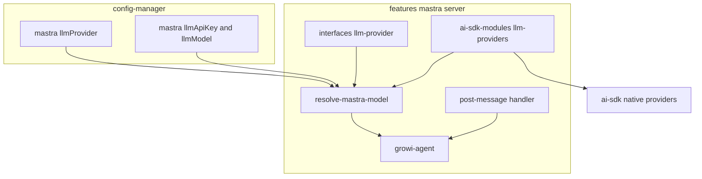
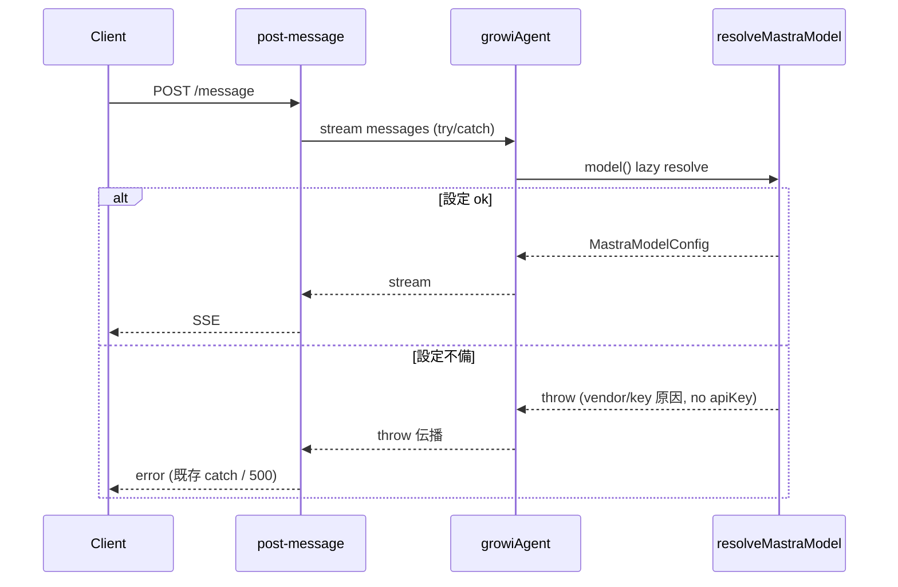

# Design Document: multi-llm-provider

## Overview

**Purpose**: mastra チャットエージェント（`growiAgent`）が使用する LLM ベンダーを **OpenAI / Anthropic / Google / Azure OpenAI** から選択可能にし、自己ホストする GROWI 運用者がポリシー・契約・コストに応じた LLM を利用できるようにする。

**Users**: GROWI を運用する管理者・運用者（環境変数でベンダー・API キー・モデルを設定）と、AI チャットを利用するエンドユーザー。

**Impact**: 現状 OpenAI に固定されている mastra のプロバイダー生成・モデル選択・API キー取得を、ベンダー非依存の**モデルリゾルバ**へ置き換える。LLM クライアントは `@mastra/core` のモデルルーター（models.dev ゲートウェイ経由）ではなく、**AI SDK の native provider（`@ai-sdk/openai` / `@ai-sdk/anthropic` / `@ai-sdk/google` / `@ai-sdk/azure`）** を生成して `@mastra/core` の `Agent.model` に渡す方式を採る（決定根拠は research.md D-3）。設定は**ベンダー非依存の単一キーセット**（1 App = 1 Vendor）を基本とし、Azure OpenAI のみエンドポイント等の固有設定を追加で受け付ける（詳細は末尾「Scope Expansion (Azure OpenAI)」）。

### Goals
- OpenAI / Anthropic / Google / Azure OpenAI を環境変数で選択し、その native provider で `growiAgent` を駆動する。
- ベンダー・API キー・モデルを**単一の env キーセット**で設定する（管理画面 UI なし）。
- ベンダー・モデルに既定値は持たず、いずれも**明示指定を必須**とする（config の `defaultValue` は `undefined`）。未指定はモデル解決時に throw。
- 設定不備時はモデル解決時に **throw**（既存 `OpenaiClientDelegator` と同流儀）。import 時には解決しないためアプリ起動は継続。
- LLM provider options（reasoning 等）を単一 JSON 環境変数で指定し、チャット呼び出しに適用する（既定値は持たず、未指定時は空 `{}`）。<br>本実装に整合（mastra-multi-model-chat）: グローバル単一の provider options は廃止され、provider options は許可モデルごと（`ai:allowedModels` の各エントリ）に保持・使用モデル単位で解決される。

### Non-Goals
- 同一アプリ内での複数**ベンダー**同時利用／ベンダー（プロバイダ）単位のリクエスト切替（1 App = 1 Vendor）。
  - 本実装に整合（mastra-multi-model-chat）: **モデル単位の per-request 選択**は mastra-multi-model-chat spec で扱う（同一プロバイダ内）。ベンダー（プロバイダ）切替は引き続き本 spec の対象外。
- mastra チャットエージェント以外の LLM 利用機能（`suggest-path` 等）のベンダー切替。
- ベンダー・モデル設定の管理画面 UI。
- OpenAI/Anthropic/Google 以外のベンダー追加。
- provider options の **intent レベル per-vendor 自動マッピング**（"effort=low" を各ベンダー固有の形へ変換する等）。生 JSON を運用者が指定する方式（Req 6）とし、モデル世代依存のマッピングロジックはコードに持たない（research D-7/D-8 は参考資料として保持）。
- 起動時の可用性ゲート／専用 HTTP ステータス（503）。設定不備は使用時 throw を `post-message` の既存 try/catch が処理する（route 変更なし）。

## Boundary Commitments

### This Spec Owns
- mastra の **LLM モデル解決**（ベンダー選択 → API キー/モデル取得 → native provider 生成 → `MastraModelConfig` 返却。不備時は throw）。
- mastra 用の **単一 LLM 設定キー**（`ai:provider` / `ai:apiKey` / `ai:model`）の定義（いずれも既定値なし＝必須）。ベンダー別の既定モデル map は持たない。
- `growiAgent` の `model` 供給方法（resolver を遅延呼び出しする dynamic function）。
- **provider options の解決**（`ai:providerOptions` JSON の parse + fail-soft）と、`post-message` のチャットストリーム呼び出しへの適用。

### Out of Boundary
- `features/ai-tools/suggest-path` および `features/openai` の client-delegator 経由の LLM 呼び出し（現行どおり `openai:serviceType` / `openai:apiKey` を使用、不変）。
- mastra の memory（`@mastra/mongodb`、ベンダー非依存）・tools・thread 機能。
- `mastra/server/routes/index.ts`（**変更しない**）。設定不備時のエラー応答は `post-message.ts` の既存 try/catch が担う。
- provider options の **値の妥当性検証・モデル整合**（生 JSON をそのまま AI SDK へ渡す。アクティブ provider 名前空間内の不正値は provider/request 時の責任）。`post-message.ts` の `providerOptions` 結線は本仕様が owns（ハードコードを `resolveProviderOptions()` に置換）。
- 管理画面 UI／AI 連携設定ページ（[deprecate-openai-features](../deprecate-openai-features/) で廃止済みの方針に従い env のみ）。

### Allowed Dependencies
- `~/server/service/config-manager`（`configManager.getConfig`）。
- `@mastra/core/agent`（`Agent`, `DynamicArgument<MastraModelConfig>`）, `@mastra/core/llm`（`MastraModelConfig` 型）, `@ai-sdk/openai`, `@ai-sdk/anthropic`, `@ai-sdk/google`。
- 依存方向: `llm-providers(factories)` → `resolve-mastra-model`（`config-definition` と `interfaces` の双方を参照）→ `growi-agent`。`config-definition`（core 層）は `AiProvider` を **型のみ（`import type`）** 参照する — 実行時に消えるため runtime の core→feature エッジは無く、`llm-provider` は依存ゼロの leaf なので循環もない。型は DX 用で実行時強制ではないため、不正値検証は resolver の `isAiProvider`。

### Revalidation Triggers
- `ai:provider` の有効値集合（`AI_PROVIDERS`）の変更。
- LLM 設定キー名（env 名）の変更。
- `resolveMastraModel` の戻り値型（`MastraModelConfig`）または throw 契約の変更。
- `growiAgent` の `model` 供給契約（dynamic function 形式）の変更。

## Architecture

### Existing Architecture Analysis
- `growi-agent.ts` は **module 読み込み時**に `new Agent({ model: getOpenaiProvider()(model) })` を実行し、`getOpenaiProvider()` は不備時に `throw`。→ Req 4.3（起動継続）と矛盾するため、`model` を遅延 dynamic function 化する。
- 既存 `OpenaiClientDelegator`（`features/openai`）はコンストラクタで API キー欠落時に `throw` する。本仕様の resolver もこの**throw 流儀**に揃える。
- `routes/index.ts` は `isAiEnabled()` で全ルートを 501 短絡する既存ゲートを持つ。本仕様では**これを変更しない**（設定不備の throw は `post-message` の既存 try/catch が捕捉してエラー応答）。
- 設定は `defineConfig<T>({ envVarName, defaultValue, isSecret })`（`config-definition.ts`）。secret 設定（`openai:apiKey`）の前例あり。
- `suggest-path` は別経路（client-delegator）で LLM を呼ぶため、本変更の影響を受けない。

### Architecture Pattern & Boundary Map



**Architecture Integration**
- 選択パターン: **データ駆動の provider 解決**（`AI_PROVIDERS` 配列＋provider→自己解決関数 `() => MastraModelConfig` のマップ `modelResolvers`）。consumer は provider 名で分岐しない。
- 既存パターン踏襲: `defineConfig` 設定、`OpenaiClientDelegator` の throw 流儀、純関数 + 薄いアダプタ、barrel 公開。
- 新規コンポーネント根拠: 「モデル解決」を `growi-agent` から分離した単一責務の純関数に集約し、Req 1–4 を 1 箇所でテスト可能にする。
- Steering 準拠: 不変更新／named export／server-client 分離／secret は env・非ログ。

### Technology Stack

| Layer | Choice / Version | Role in Feature | Notes |
|-------|------------------|-----------------|-------|
| Backend / Services | `@mastra/core` 1.41.0 | `Agent.model` に dynamic function（`MastraModelConfig` を返す）を受理 | `model: DynamicArgument<MastraModelConfig>`（検証済 research D-1） |
| Backend / Services | `@ai-sdk/openai` ^3（既存 3.0.68） | OpenAI native provider（`createOpenAI`） | 既存利用を踏襲 |
| Backend / Services | `@ai-sdk/anthropic` ^3（**新規**） | Anthropic native provider（`createAnthropic`） | runtime `ai@6` と同 provider IF（v6） |
| Backend / Services | `@ai-sdk/google` ^3（**新規**） | Google native provider（`createGoogleGenerativeAI`） | 同上 |
| Backend / Services | `@ai-sdk/azure` ^3（**新規・Scope Expansion**） | Azure OpenAI native provider（`createAzure`） | `resourceName` か `baseURL`（排他）＋任意 `apiVersion`。`azure(deploymentName)` の引数はデプロイ名 |
| Data / Config | config-manager（既存） | env から vendor / apiKey / model（＋ Azure 固有: resourceName / baseURL / apiVersion）を解決 | `isSecret` で API キーをマスク |

> 方式比較（native provider vs models.dev ルーター）の詳細根拠は research.md D-2/D-3。新規依存は `@ai-sdk/anthropic` / `@ai-sdk/google` / `@ai-sdk/azure`（`^3.x`）。

## File Structure Plan

### Directory Structure
```
apps/app/src/features/mastra/
├── interfaces/
│   └── ai-provider.ts                         # AiProvider 型, AI_PROVIDERS, isAiProvider ガード
└── server/services/
    ├── ai-sdk-modules/
    │   ├── llm-providers/
    │   │   ├── index.ts                       # barrel: modelResolvers (provider → () => MastraModelConfig マップ) の組み立てのみ
    │   │   ├── config.ts                       # 共有アクセサ: requireApiKey() / getApiKey() / getModel()
    │   │   ├── openai.ts                       # resolveOpenaiModel(): createOpenAI({apiKey:requireApiKey()})(getModel())
    │   │   ├── anthropic.ts                    # resolveAnthropicModel() 〃
    │   │   ├── google.ts                       # resolveGoogleModel() 〃
    │   │   └── azure-openai.ts                 # resolveAzureOpenaiModel(): 自分の config を読み endpoint/Entra ID/apiKey を処理（自己完結）
    │   ├── resolve-mastra-model.ts             # provider 検証 → modelResolvers[provider]() を dispatch → MastraModelConfig（memoize / 不備時 throw）
    │   ├── resolve-mastra-model.spec.ts        # 解決/throw/secret-safe のユニットテスト
    │   ├── resolve-provider-options.ts         # AI_PROVIDER_OPTIONS JSON を parse（fail-soft）→ ProviderOptions
    │   └── resolve-provider-options.spec.ts    # parse/既定/不正 JSON fail-soft のユニットテスト
    └── mastra-modules/agents/
        └── growi-agent.ts                      # [変更] model を resolver 経由の dynamic function に
```

### Modified Files
- `apps/app/src/server/service/config-manager/config-definition.ts` — `CONFIG_KEYS` / `CONFIG_DEFINITIONS` に `ai:provider`（`AiProvider` 型・type-only import）/ `ai:apiKey`（secret）/ `ai:model` を追加し、未使用化した `openai:assistantModel:mastraAgent`（＋ `openai` 型 import）を削除（`ConfigKey`/`ConfigValues` は自動導出。`ENV_ONLY_GROUPS` には追加しない）。**Scope Expansion**: さらに Azure 固有の接続設定を単一のオブジェクトキー `ai:azureOpenaiSettings`（型 `AzureOpenaiConfig` = `{ resourceName?, baseURL?, apiVersion?, useEntraId? }`・JSON オブジェクト・default `{}`・env `AI_AZURE_OPENAI_SETTINGS`（JSON 文字列）・非 secret）として追加（4 つの論理設定を 1 つの JSON オブジェクト／単一 env にまとめて永続化）。
- `apps/app/src/features/mastra/server/services/mastra-modules/agents/growi-agent.ts` — `getOpenaiProvider()(model)` を `model: () => resolveMastraModel()` の dynamic function へ置換。
- `apps/app/src/features/mastra/server/routes/post-message.ts` — ハードコードの `providerOptions: { openai: {...} }` を `providerOptions: resolveProviderOptions()` に置換。
- `apps/app/src/features/mastra/interfaces/ai-provider.ts` — **Scope Expansion**: `AI_PROVIDERS` に `'azure-openai'` を追加（型・ガードは自動拡張。識別子は既存 `openai:serviceType` の `'azure-openai'` と表記統一）。
- `apps/app/src/features/mastra/server/services/ai-sdk-modules/llm-providers/index.ts` — barrel。`modelResolvers: Record<AiProvider, () => MastraModelConfig>`（provider → 自己解決関数のマップ）を組み立てて export するのみ。
- `apps/app/src/features/mastra/server/services/ai-sdk-modules/llm-providers/config.ts` — **新規**。共有アクセサ `requireApiKey()` / `getApiKey()` / `getModel()`（apiKey/model は全 provider 共通なのでここに集約）。
- `apps/app/src/features/mastra/server/services/ai-sdk-modules/llm-providers/{openai,anthropic,google}.ts` — 各 `resolve<Provider>Model(): MastraModelConfig`（config を読み `create*({apiKey:requireApiKey()})(getModel())`）。
- `apps/app/src/features/mastra/server/services/ai-sdk-modules/llm-providers/azure-openai.ts` — **新規**。`resolveAzureOpenaiModel(): MastraModelConfig`。自分の config（resourceName/baseURL/apiVersion/useEntraId/apiKey/model）を読み、endpoint 排他・API キー/Entra ID 認証を**自己完結**で処理。`@azure/identity` は static import（既存依存）。
- `apps/app/src/features/mastra/server/services/ai-sdk-modules/resolve-mastra-model.ts` — provider を検証し `modelResolvers[provider]()` を dispatch するだけ（apiKey/model/azure config の読取は各 provider へ移動）。memoize / 不備時 throw（`post-message` の既存 catch が処理）。
- `apps/app/package.json` — `@ai-sdk/anthropic`・`@ai-sdk/google`・`@ai-sdk/azure`（`^3.x`）を `dependencies` に追加（プロバイダ系は最新へ bump 済み）。`@azure/identity`（Entra ID 用）は**既存依存のため追加不要**。
- `apps/app/src/features/mastra/server/services/mastra-modules/agents/growi-agent.spec.ts` — dynamic model / 使用時 throw 伝播を反映。
- spec テスト: `llm-providers.spec.ts`（key-based resolver + map）／**`azure-openai.spec.ts`（新規・azure resolver）**／`resolve-mastra-model.spec.ts`（検証 + dispatch + memo）。

### Deleted Files
- `apps/app/src/features/mastra/server/services/ai-sdk-modules/get-openai-provider.ts` — `llm-providers/openai.ts` + resolver に置換。

> `routes/index.ts` は変更しない（FB により可用性ゲートを撤回）。`openai:apiKey`（suggest-path と共有）は不変。`openai:assistantModel:mastraAgent`（旧 mastra agent 専用・`OPENAI_MASTRA_AGENT_MODEL`）は未使用化したため**削除**（mastra は `ai:model` を使用）。

## System Flows

### リクエスト時のモデル供給と設定不備の throw



判定: モデル解決は **import 時でなく使用時**（`growiAgent.stream()` 内の dynamic `model()`）に走る。設定不備なら `resolveMastraModel()` が throw し、`post-message` の既存 try/catch がエラー応答を返す（Req 4.4）。`logger.error(error)` が原因（vendor/欠落 env 名）をログ出力し、**API キー値は throw メッセージにもログにも含めない**（Req 2.5）。import 時は解決しないためアプリ・他機能の起動は継続（Req 4.3）。

## Requirements Traceability

| Requirement | Summary | Components | Interfaces | Flows |
|-------------|---------|------------|------------|-------|
| 1.1 | 3 ベンダーを選択可能 | llm-provider, config | `AI_PROVIDERS`, `ai:provider` | — |
| 1.2 | 指定ベンダーを使用 | resolver, llm-providers | `resolveMastraModel`, `modelResolvers` | リクエスト時供給 |
| 1.3 | 未指定→設定不備（throw） | config, resolver | `ai:provider` 既定なし（`undefined`）, `isAiProvider` で弾く | リクエスト時供給 |
| 1.4 | 不正ベンダー名→throw | llm-provider, resolver | `isAiProvider`, throws | リクエスト時供給 |
| 2.1 | API キーを env から取得 | config, resolver | `ai:apiKey` | — |
| 2.2 | モデルを env で設定 | config, resolver | `ai:model` | — |
| 2.3 | モデル未指定→設定不備（throw） | config, resolver | `ai:model` 既定なし（`undefined`）, `requireModel()` | リクエスト時供給 |
| 2.4 | env のみ・管理 UI なし | config | `envVarName` のみ（UI 追加なし） | — |
| 2.5 | API キーをログ等に非出力 | config, resolver | `isSecret`, throw メッセージに key 不含 | リクエスト時供給 |
| 3.1 | 1 App = 1 ベンダー | config, resolver | 単一キーセット | — |
| 3.2 | 単一キーのみ参照 | resolver | `ai:apiKey` のみ読む | — |
| 3.3 | リクエスト内混在なし | growi-agent | 単一 `model` 供給 | リクエスト時供給 |
| 4.1 | 不備時に無効化（throw） | resolver, growi-agent | `resolveMastraModel` throws | リクエスト時供給 |
| 4.2 | 原因をログ | growi-agent, post-message | 既存 `logger.error(error)` | リクエスト時供給 |
| 4.3 | アプリ・他 AI は継続 | growi-agent | import 時 no-throw（dynamic model） | — |
| 4.4 | チャット要求→エラー応答 | post-message | 既存 try/catch | リクエスト時供給 |
| 5.1 | 適用は growiAgent のみ | growi-agent, resolver | `model` 供給のみ | — |
| 5.2 | 他 LLM 機能は不変 | （境界） | `suggest-path` は別経路 | — |
| 6.1 | provider options を適用 | resolve-provider-options, post-message | `resolveProviderOptions()` | リクエスト時供給 |
| 6.2 | 単一 JSON env で受付 | config, resolve-provider-options | `ai:providerOptions` | — |
| 6.3 | 未指定→空 `{}` | config, resolve-provider-options | `ai:providerOptions` 既定なし（`undefined`）→ `{}` | リクエスト時供給 |
| 6.4 | 不正 JSON→fail-soft＋warn | resolve-provider-options | parse try/catch → `{}` | リクエスト時供給 |

> 本実装に整合（mastra-multi-model-chat）: Req 2.2/2.3 の `ai:model`（単一）と Req 6.x の `ai:providerOptions`（グローバル単一）は `ai:allowedModels`（`modelId` + per-model providerOptions + isDefault）へ統合・廃止された。インタフェースは `resolveEffectiveModelId(modelId?)` / `getDefaultModelId()` / `getAllowedModels()` / `getProviderOptionsForModel(effectiveModelId)` に置換。本表の `ai:model` / `ai:providerOptions` / `requireModel()` 列はベンダー解決の枠組み（本 spec の対象）を示す歴史的記述として読む。

## Components and Interfaces

| Component | Domain/Layer | Intent | Req Coverage | Key Dependencies | Contracts |
|-----------|--------------|--------|--------------|------------------|-----------|
| LLM Vendor types | interfaces | ベンダー集合と型ガード | 1.1, 1.4, 3 | — | State/型 |
| Config definitions | config | env↔単一 LLM 設定キー | 1, 2, 3 | configManager (P0) | State |
| LLM provider factories | services | vendor→native MastraModelConfig | 1.2, 2.1, 2.2 | ai-sdk (P0) | Service |
| Model resolver | services | 解決/検証（不備時 throw） | 1.2–1.4, 2.1–2.3, 2.5, 3, 4.1 | config, factories, llm-provider (P0) | Service |
| GROWI agent | services | dynamic model 供給（throw 伝播） | 3.3, 4.1, 4.3, 5.1 | resolver (P0), Agent (P0) | Service |
| Provider options resolver | services | provider options JSON の parse（fail-soft）＋ post-message 適用 | 6.1–6.4 | config (P0) | Service |

### interfaces

#### LLM Vendor types (`interfaces/ai-provider.ts`)

| Field | Detail |
|-------|--------|
| Intent | ベンダー集合・型・型ガードを単一定義（データ駆動の源泉） |
| Requirements | 1.1, 1.4, 3 |

**Contracts**: State [x]

```typescript
export const AI_PROVIDERS = ['openai', 'anthropic', 'google'] as const;
export type AiProvider = (typeof AI_PROVIDERS)[number];

export const isAiProvider = (value: unknown): value is AiProvider =>
  typeof value === 'string' && (AI_PROVIDERS as readonly string[]).includes(value);
```

**Implementation Notes**
- Integration: `resolve-mastra-model` が参照。client からは import しない（server-only 利用）。
- Validation: `ai:provider`（env 由来の任意文字列）の検証点はここ（Req 1.4）。

### config

#### Config definitions (`config-definition.ts` 追加)

| Field | Detail |
|-------|--------|
| Intent | ベンダー非依存の単一 LLM 設定キーを env から解決 |
| Requirements | 1.1, 2.1, 2.2, 2.4, 3.1 |

**Contracts**: State [x]

| 設定キー | 型 | env 名 | default | isSecret |
|---|---|---|---|---|
| `ai:provider` | `AiProvider \| undefined`（共有型・type-only import。実行時は resolver の `isAiProvider` で再検証） | `AI_PROVIDER` | `undefined` | no |
| `ai:apiKey` | `string \| undefined` | `AI_API_KEY` | `undefined` | yes |
| `ai:model` | `string \| undefined`（既定なし＝必須。Azure では deployment 名） | `AI_MODEL` | `undefined` | no |
| `ai:providerOptions` | `string \| undefined`（生 JSON。resolver で parse + fail-soft） | `AI_PROVIDER_OPTIONS` | `undefined` | no |

> 本実装に整合（mastra-multi-model-chat）: 上記 `ai:model`（単一）/ `ai:providerOptions`（グローバル単一）は **`ai:allowedModels`**（`{ modelId; providerOptions?; isDefault? }[]`、env `AI_ALLOWED_MODELS`、JSON 配列）へ統合・廃止された（env `AI_MODEL` / `AI_PROVIDER_OPTIONS` も廃止、自動移行なし）。モデルは許可リスト内から選び、既定は `isDefault` エントリ、provider オプションはモデルごとに保持する。ベンダー（プロバイダ）自体は引き続き単一（`ai:provider` / `ai:apiKey`）。

**Implementation Notes**
- Integration: 1 App = 1 Vendor のため**単一キーセット**。provider は `ai:provider` で選択し、resolver が `modelResolvers[provider]()` を呼ぶ。`openai:apiKey` 等の既存キーは suggest-path 用に不変（mastra は参照しない）。
- **env-only の実装方針（確定）**: Req 2.4「env のみ」は **「設定用の管理画面 UI を持たない」** と解釈する。新規キーは既存 `openai:apiKey` と同じ **DB＋env フォールバック**で統一し、**`ENV_ONLY_GROUPS` には登録しない**。UI から書き込まれる経路が存在しないため実運用上は env 駆動。
- **設定キー追加で編集する箇所**: `config-definition.ts` の `CONFIG_KEYS` 配列＋`CONFIG_DEFINITIONS`。`ConfigKey`/`ConfigValues` は自動導出。
- Validation: `ai:provider` は共有 **`AiProvider | undefined`** で型付け（`import type` の type-only＝実行時に消えるため依存逆転の実害なし・`llm-provider` は leaf で循環なし・単一ソース）。**型は DX/補完のためで実行時強制ではない**（config-manager は env 文字列を宣言型で検証しない）。よって resolver は依然 `isAiProvider` で実行時検証する（`AI_PROVIDER=azure` 等の untrusted env、および未指定（`undefined`）を弾く。Req 1.3/1.4）。既定ベンダーは持たないため未指定時は resolver が throw（Req 1.3/4.1）。
- Model 必須: `ai:model` は既定値を持たない（`undefined`）。全ベンダーで `AI_MODEL` の明示指定が必要で、未指定時は `requireModel()` が throw（Req 2.3/4.1）。resolver は per-vendor 既定 map を持たない。
  - 本実装に整合（mastra-multi-model-chat）: `requireModel()` は撤去され、`getAllowedModels()` / `getDefaultModelId()` / `resolveEffectiveModelId(modelId?)` が新アクセサ。許可リストが空のときに `resolveEffectiveModelId` が throw する（モデル未設定＝未構成）。
- Secret: `ai:apiKey` は `isSecret: true`。クライアントへ返す apiv3 エンドポイントは存在せず露出経路なし（Req 2.5）。

### services

#### Provider model resolvers (`ai-sdk-modules/llm-providers/`)

| Field | Detail |
|-------|--------|
| Intent | provider ごとに config から native model を自己解決する関数（`() => MastraModelConfig`）。共有キーは `config.ts` の共有アクセサ経由 |
| Requirements | 1.2, 2.1, 2.2 |

**Contracts**: Service [x]

```typescript
// config.ts — 共有アクセサ
export const requireApiKey = (): string => { /* ai:apiKey、欠落で throw */ };
export const getModel = (): string => configManager.getConfig('ai:model');
// 本実装に整合（mastra-multi-model-chat）: getModel() は撤去され、
// getAllowedModels() / getDefaultModelId() / resolveEffectiveModelId(modelId?) に置換。

// openai.ts（anthropic / google も同形）
// 本実装に整合（mastra-multi-model-chat）: resolver は modelId を引数受け取りに変更:
//   export const resolveOpenaiModel = (modelId: string): MastraModelConfig =>
//     createOpenAI({ apiKey: requireApiKey() })(modelId);
export const resolveOpenaiModel = (): MastraModelConfig =>
  createOpenAI({ apiKey: requireApiKey() })(getModel());

// index.ts — barrel: provider → 自己解決関数のマップ
export const modelResolvers: Record<AiProvider, () => MastraModelConfig> = {
  openai: resolveOpenaiModel, anthropic: resolveAnthropicModel,
  google: resolveGoogleModel, 'azure-openai': resolveAzureOpenaiModel,
};
```
- Postconditions: `Agent.model` に渡せる `MastraModelConfig`。
- Invariants: API キーは明示注入のみ（`process.env` 自動検出に依存しない）。値は関数（遅延）＝import 時に config を読まない。

> 本実装に整合（mastra-multi-model-chat）: 各 provider resolver は **`modelId` 引数を受け取る** `(modelId: string) => MastraModelConfig` に変更され（`createOpenAI({ apiKey })(modelId)` の `modelId` を引数化）、`getModel()`（単一 `ai:model` 読取）は撤去された。`modelResolvers` の型も `Record<AiProvider, (modelId: string) => MastraModelConfig>`。実効モデルは `resolveEffectiveModelId(modelId?)` が許可リストに対し検証して決める（同一プロバイダ内のモデル単位の選択。ベンダー切替ではない）。

**Implementation Notes**
- 戻り型は `@mastra/core/llm` の `MastraModelConfig`（`ai` の広い `LanguageModel` union ではない）。native provider オブジェクトは `MastraModelConfig` の正当なメンバーなのでパイプライン全体が cast-free（research D-9）。
- 各ファイルは 1 provider 1 責務（自己解決）。barrel は map を組み立てるだけで consumer は provider 名で分岐しない。azure-openai は非均一な接続/認証を**自分の resolver 内に局在**（Scope Expansion 参照）。

#### Model resolver (`ai-sdk-modules/resolve-mastra-model.ts`)

| Field | Detail |
|-------|--------|
| Intent | provider 検証 + `modelResolvers` への dispatch + memoize。不備時は選択 resolver が throw（`OpenaiClientDelegator` 流儀） |
| Requirements | 1.2, 1.3, 1.4, 2.1, 2.3, 2.5, 3.1, 3.2, 4.1 |

**Contracts**: Service [x]

```typescript
import type { MastraModelConfig } from '@mastra/core/llm';

export const resolveMastraModel: () => MastraModelConfig; // 不備時は throw
```
> 本実装に整合（mastra-multi-model-chat）: シグネチャは **`resolveMastraModel(modelId?: string): MastraModelConfig`** に拡張され、memoize は単一スロットから **`${provider}:${effective}` をキーとする Map** に変更された（`clearResolvedMastraModelCache()` は Map 全消去）。`modelId` は `resolveEffectiveModelId` で許可リストに対し検証され（許可外/未指定は既定へ丸め）、その実効モデルで `modelResolvers[provider](effective)` を呼ぶ。
- Preconditions: config-manager ロード済み。
- Postconditions: 成功時 native model（memoize）。不備時は throw（選択 resolver 由来。メッセージは provider 名／欠落 env 名のみ、API キー値を含まない）。
- Invariants: resolver 自身は provider 値のみ読む（apiKey/model/azure config の読取は各 provider の resolver へ移譲）。throw メッセージに API キー値を含めない（Req 2.5）。per-vendor 既定モデル map は持たない（モデルは必須・既定なし）。

解決手順:
1. memoize 済みなら即返す（Req 3.1）。
2. `ai:provider` 取得（既定なし。未指定（`undefined`）は次段の `isAiProvider` で弾く。Req 1.3）。
3. `isAiProvider` 失敗なら throw（不正 provider 名を含むメッセージ。untrusted env を弾く。Req 1.4）。
4. `modelResolvers[provider]()` を dispatch（各 provider が自分の config を読みモデルを構築。apiKey 欠落等の不備はその resolver が throw。Req 4.1）。結果を memoize して返す（throw は非 memoize）。

**Implementation Notes**
- Integration: `growi-agent` の dynamic model から呼ばれる。memoize で provider 重複生成を防止。throw は memoize しない（config 修正が次回呼び出しで反映）。
- 既存 `OpenaiClientDelegator`（コンストラクタで API キー欠落時 throw）と同じ流儀。`isAiEnabled()` チェックは行わない（resolver は vendor 解決に専念）。

#### GROWI agent (`mastra-modules/agents/growi-agent.ts` 変更)

| Field | Detail |
|-------|--------|
| Intent | `model` を resolver 経由の dynamic function とし、import 時 throw を排除。不備時の throw は使用時に伝播 |
| Requirements | 3.3, 4.1, 4.3, 5.1 |

**Contracts**: Service [x]

```typescript
export const growiAgent = new Agent({
  id: 'growiAgent',
  name: 'GROWI Agent',
  instructions: `... (現行維持) ...`,
  model: () => resolveMastraModel(), // DynamicArgument<MastraModelConfig>; 不備時は throw を伝播
  tools: { fullTextSearchTool, getPageContentTool },
  memory,
});
```
> 本実装に整合（mastra-multi-model-chat）: `model` は **`({ requestContext }) => resolveMastraModel(requestContext.get('modelId'))`** に変更され、リクエスト単位で実効モデルを解決する（同一プロバイダ内のモデル選択。ベンダーは引き続き単一）。`MastraRequestContextShape` に `modelId?: string` が追加された。
- Preconditions: なし（import 時に resolver を呼ばない）。
- Postconditions: 単一ベンダーのモデルを供給（実効モデルは許可リスト内・リクエスト単位。Req 3.3）。
- Invariants: 構築時に例外を投げない（Req 4.3）。使用時の throw は `post-message` の既存 try/catch に伝播（Req 4.4）。

**Implementation Notes**
- `mastra-modules/index.ts`（`new Mastra({agents:{growiAgent}})`）は不変。
- resolver の throw を swallow せず素通し（`post-message` が捕捉）。throw メッセージに API キーは含まれない（resolver 側で保証）。

#### Provider options resolver (`ai-sdk-modules/resolve-provider-options.ts` 新規 + `post-message.ts` 変更)

| Field | Detail |
|-------|--------|
| Intent | `ai:providerOptions` JSON を parse（fail-soft）し、AI SDK 形式の `providerOptions` を返す |
| Requirements | 6.1, 6.2, 6.3, 6.4 |

**Contracts**: Service [x]

```typescript
import type { JSONValue } from 'ai';

export type MastraProviderOptions = Record<string, Record<string, JSONValue>>;

// 不正 JSON / 非オブジェクトは {} にフォールバック（warn）。例外は投げない。
export const resolveProviderOptions: () => MastraProviderOptions;
```
> 本実装に整合（mastra-multi-model-chat）: シグネチャは **`getProviderOptionsForModel(effectiveModelId: string): ModelProviderOptions`** に変更され、グローバル単一 `ai:providerOptions` ではなく**実効モデルの `ai:allowedModels` エントリ**の `providerOptions` から解決する（該当なしは `{}`）。さらに**純粋な lookup** に変わり、丸め/検証/警告は一切行わない: `post-message` ハンドラが `resolveEffectiveModelId` で実効モデルを **1 回だけ**解決し、その id を requestContext と `getProviderOptionsForModel` の双方へ渡す（実効モデルがリクエストごとに二重解決されない）。型 `MastraProviderOptions` は撤去され、唯一の providerOptions 型は `interfaces/allowed-model.ts` 宣言の `ModelProviderOptions`（DTO とサーバ resolver の双方が参照）に統一。全モデル一律のグローバルオプションは廃止（オプションは常に使用モデル単位）。
- Postconditions: 実効モデルのエントリの `providerOptions` を返す。未設定/空/不正/非オブジェクトは `{}`（warn）。
- Invariants: **生 JSON を解釈せずそのまま返す（variant A）** — per-vendor マッピングを持たない。例外を投げない（チャットを壊さない。Req 6.4）。
- 型: `ProviderOptions` は `ai` から未 export のため、`JSONValue`（`ai` から export 済）を用いた構造型 `Record<string, Record<string, JSONValue>>` で表現。

**Implementation Notes**
- Integration: `post-message.ts` の `growiAgent.stream(messages, { ..., providerOptions })` を、ハードコード `{ openai: {...} }` から `resolveProviderOptions()` の戻り値へ置換。
- Validation: 単一 JSON env 文字列で受け、object 型 config（loader の JSON.parse が malformed で起動クラッシュ）を避けるため **`string` 型 config ＋ resolver 側 graceful parse**。未知 provider 名前空間は AI SDK が無視（検証済）。アクティブ provider 名前空間内の不正値は request 時に provider が扱う（post-message の既存 catch）。
- Test: route handler の結線は post-message.spec（validator のみ test、handler は sandbox 制約で未 test）方針に倣い、resolver を単体で厚くテスト＋結線は型チェックで担保。

## Error Handling

### Error Strategy
- **設定不備（fail at use, not at import）**: resolver は不備時に throw。`growiAgent.model` は dynamic function なので throw は**使用時**（`stream()`）に発生し、import／起動は throw しない（Req 4.3）。
- **エラー応答**: 使用時 throw は `post-message.ts` の既存 try/catch が捕捉し、エラー応答（500）を返す（Req 4.4）。原因（vendor/欠落 env 名）は `logger.error(error)` でログ出力（Req 4.2）。API キー値は throw メッセージにもログにも出さない（Req 2.5）。

### Error Categories and Responses
- **Operator 設定エラー**: vendor 未指定/不正/キー欠落 → resolver throw → post-message catch → 500 + 原因ログ。
- **System (5xx)**: stream 失敗は既存 `Failed to post message`（500）。

### Monitoring
- `post-message` の既存 `logger.error(error)` が throw（vendor/env 名を含む）を記録。**API キー値は出力しない**（Req 2.5）。

## Testing Strategy

### Unit Tests
- **resolver**: vendor 未指定→throw（`AI_PROVIDER`）（1.3/4.1）／不正 vendor→throw（値を含む）（1.4）／apiKey 欠落→throw（`AI_API_KEY`）（4.1）／model 欠落→throw（`AI_MODEL`）（2.3/4.1）／3 ベンダー各成功で正しい factory を `{apiKey, model}` で呼ぶ（1.2/2.1/2.2）／throw メッセージに apiKey 値を含まない（2.5）／単一キーのみ参照（3.2）／memoize（同一 instance, factory 1 回）と throw は非 memoize。本実装に整合（mastra-multi-model-chat）: model 欠落 throw は許可リスト空のときの `resolveEffectiveModelId` throw に置換、memoize は `${provider}:${effective}` キーの Map、resolver は `modelId` 引数を受け取る。
- **isAiProvider**: 3 値を受理・他を拒否（1.1/1.4）。
- **provider factories**: 各 factory が対応 `create*` を `{ apiKey }` で呼び `(model)` を適用（ai-sdk を mock）（1.2/2.1/2.2）。

### Integration / Component Tests
- **growi-agent**: import 時 no-throw（resolver が throw する状態でも構築成功・resolver 未呼出）（4.3）／成功時 `model()` が resolver の model を返す（3.3/5.1）／不備時 `model()` が resolver の throw を伝播（swallow しない）（4.1/4.4）。

### Regression
- **suggest-path 不変**: `ai:provider` 設定に関わらず `suggest-path` は `openai:serviceType`/`openai:apiKey` 経路で動作（5.2）。

## Security Considerations
- API キーは `isSecret: true` で config-manager がマスク（DB/API 応答）。throw メッセージ・ログは vendor 名／欠落 env 名のみ（Req 2.5）。
- API キーは env からの明示注入のみ（provider の env 自動検出に依存しない）。

## Open Questions / Risks
- **モデル必須（既定なし）**: `ai:model` は既定値を持たず、全ベンダーで `AI_MODEL` の明示指定が必要（未指定なら `requireModel()` が throw）。per-vendor 既定 map も持たない。PR FB で「default `o4-mini`」案を撤回（将来の SLM 対応・特定モデルへの先入れを避ける）。本実装に整合（mastra-multi-model-chat）: `ai:model` 単一・`requireModel()` は `ai:allowedModels` + `resolveEffectiveModelId(modelId?)` / `getDefaultModelId()` へ置換（許可リスト空のとき throw）。
- **provider options（本仕様で対応・Req 6）**: `ai:providerOptions`（単一 JSON env）を `resolveProviderOptions()` が parse し `post-message` の stream 呼び出しへ適用。既定値は持たず、未指定時は空 `{}`（PR FB で OpenAI reasoning 既定を撤回）。指定された名前空間がアクティブ provider と異なる場合は AI SDK が無視（検証済：`parseProviderOptions` は当該 provider 名前空間が無ければ throw しない）。intent レベルの per-vendor 自動マッピングは非対応（生 JSON を運用者が指定）。各ベンダーの reasoning オプション一覧は research.md D-7/D-8 を参照。本実装に整合（mastra-multi-model-chat）: グローバル単一 `ai:providerOptions` は廃止され、`getProviderOptionsForModel(effectiveModelId)` が実効モデルの許可リストエントリから per-model に解決する（純粋な lookup。実効モデルは `resolveEffectiveModelId` で一度だけ解決して渡す）。
- **依存分類（検証済 D-?）**: `@ai-sdk/anthropic`/`@ai-sdk/google` は Express サーバ（`dist/`、`build:server`）経由の server-only パッケージで `.next/node_modules` には externalise されない（既存 `@ai-sdk/openai` と同一）。`dependencies` 配置で正しい。確定的 prod ロード検証は CI Level 2（`server:ci`）。
- **削除した config キー**: `openai:assistantModel:mastraAgent`（`OPENAI_MASTRA_AGENT_MODEL`）は未使用化したため本仕様で削除（`OpenAI.Chat.ChatModel` 用の `openai` 型 import も除去）。
- **pre-existing branch 課題（本仕様スコープ外）**: `apiv3/index.js` の `mastraRouteFactory` import 欠落、`post-message.ts:77` TS2769。support/mastra ブランチのマージ未完状態で、別途対応が必要（tasks.md Implementation Notes 参照）。
- **設定キー命名（PR FB で確定）**: `mastra:llm*` 案を撤回し、`ai:` 名前空間＋`llm` 語の除去で `ai:provider` / `ai:apiKey` / `ai:model` / `ai:providerOptions` に確定。型族も `AiProvider` にリネーム。将来の SLM 等を見据えキー名に `llm` を持ち込まない。

## Scope Expansion (Azure OpenAI)

OpenAI / Anthropic / Google に **Azure OpenAI** を 4 番目のベンダーとして追加する（Req 1, 7）。Azure は他 3 ベンダーと異なり「`apiKey` + `model`」だけでは接続できず、**リソース固有のエンドポイント**を要するため、データ駆動設計を壊さない形で「ファクトリ入力の非統一化」を最小限に取り込む。

### 設計上の差分と方針

| 項目 | 他 3 ベンダー | Azure OpenAI |
|---|---|---|
| 必要な接続情報 | `apiKey`, `model` | `apiKey`, `model`(=デプロイ名), **resourceName または baseURL（排他）**, apiVersion（任意） |
| エンドポイント | SDK 既定 | `resourceName` → `https://<name>.openai.azure.com/...` を構成 / `baseURL` → 直接指定（主権クラウド・APIM ゲートウェイ・カスタムドメイン） |
| `AI_MODEL` の意味 | モデル ID | **デプロイ名**（運用者が Azure 上で命名） |

**設計方針（最終形）**:
1. **各 provider が config から自己解決する**: 共有契約は `() => MastraModelConfig`（provider ごとに「config を読んでモデルを返す」関数）。key-based（openai/anthropic/google）は 1 行の薄い resolver、azure-openai は自分のエンドポイント/認証ロジックを内包した resolver。**ファクトリ引数のユニオン型も generic dispatch も持たない**。
2. **共有キーは対称な共有アクセサに集約**: `apiKey` / `model` は全 provider 共通なので `config.ts` の `requireApiKey()` / `getApiKey()` / `getModel()` に置き、どの provider も対称に使う。provider 固有キー（Azure のエンドポイント等）は各 provider が自分で読む。
3. **データ駆動ディスパッチ（consumer は provider 非依存）**: `modelResolvers: Record<AiProvider, () => MastraModelConfig>` を barrel で組み立て、resolver は `modelResolvers[provider]()` を呼ぶだけ。**provider 追加で resolver（consumer）は不変** → `.claude/rules/coding-style.md`「Data-Driven Control over Hard-Coded Mode Checks」に準拠。
4. **azure の非均一性は azure モジュールに局在**: エンドポイント排他（baseURL 優先）・apiVersion 任意・API キー/Entra ID 認証の分岐は**すべて `resolveAzureOpenaiModel()` 内**。共有経路はこれを一切知らない。検証失敗は使用時 throw（`post-message` の既存 try/catch が処理。Req 4.4）・メッセージは env 名のみ（キー値非含。Req 2.5）。
5. **遅延評価で起動時 throw なし**: `modelResolvers` の値は関数（使用時に config を読む）。import 時には config を読まず throw もしない（Req 4.3）。

### config（追加キー）

| 設定キー | 型 | env 名 | default | isSecret |
|---|---|---|---|---|
| `ai:azureOpenaiSettings` | `AzureOpenaiConfig`（JSON オブジェクト: `{ resourceName?, baseURL?, apiVersion?, useEntraId? }`） | `AI_AZURE_OPENAI_SETTINGS`（JSON 文字列） | `{}` | no |

> Azure 固有の 4 つの論理設定（リソース名・ベース URL・API バージョン・認証フラグ）は、機密ではないため非 secret な単一の JSON オブジェクトキー `ai:azureOpenaiSettings` として永続化する（DB 上は 1 件の Config ドキュメントに JSON 文字列で保存し、書込み時に `JSON.stringify`／読取り時に `JSON.parse`。env は単一の `AI_AZURE_OPENAI_SETTINGS` に JSON 文字列で与える）。`defaultValue` がオブジェクト（`{}`）のため config loader は env を JSON として parse し、不正な JSON は fail-soft で `null` になる（consumer は `?? {}` で防御的に読む）。各フィールドは任意で、`apiVersion` 未指定→SDK 既定、`useEntraId` 既定 false。値の型は `apps/app/src/features/mastra/interfaces/azure-openai-config.ts` の `AzureOpenaiConfig`（既存 `AzureOpenaiSettings.tsx` React コンポーネントとの衝突回避のため `*Config` 命名）。Azure の API キーは既存の `ai:apiKey`（secret）、デプロイ名は既存の `ai:model` を流用する（1 App = 1 Vendor の単一キーセットを維持）。`useEntraId: true` のときは API キーを使わず Microsoft Entra ID（`DefaultAzureCredential`）で認証する（Req 8）。

### provider resolvers（`llm-providers/`）

```typescript
// config.ts — 共有アクセサ（apiKey / model は全 provider 共通）
export const getApiKey = (): string | undefined => configManager.getConfig('ai:apiKey');
export const requireApiKey = (): string => { /* 欠落で throw（AI_API_KEY 案内・キー値非含） */ };
export const getModel = (): string => configManager.getConfig('ai:model');

// openai.ts（anthropic / google も同形の 1 行 resolver）
export const resolveOpenaiModel = (): MastraModelConfig =>
  createOpenAI({ apiKey: requireApiKey() })(getModel());

// azure-openai.ts — 自己完結（エンドポイント排他 / Entra ID / apiKey をすべて内包）
export const resolveAzureOpenaiModel = (): MastraModelConfig => { /* ... */ };

// index.ts — データ駆動マップ（組み立てのみ）
export const modelResolvers: Record<AiProvider, () => MastraModelConfig> = {
  openai: resolveOpenaiModel,        anthropic: resolveAnthropicModel,
  google: resolveGoogleModel,        'azure-openai': resolveAzureOpenaiModel,
};
```
> 本実装に整合（mastra-multi-model-chat）: 上記 resolver は **`modelId` 引数を受け取る** `(modelId: string) => MastraModelConfig` に変更され（`getModel()` は撤去）、`modelResolvers` の型も `Record<AiProvider, (modelId: string) => MastraModelConfig>`。Azure では渡される `modelId`（=実効モデル）が `ai:allowedModels` 内のデプロイ名を指す。エンドポイント排他・Entra ID 認証など Azure 固有ロジックは引き続き `resolveAzureOpenaiModel` 内に局在する。
azure の検証/排他/認証ルール（`resolveAzureOpenaiModel` 内・`configManager.getConfig('ai:azureOpenaiSettings') ?? {}` から `{ resourceName, baseURL, apiVersion, useEntraId }` を分解して読む）:
- 検証: `resourceName == null && baseURL == null` なら throw（`AI_AZURE_OPENAI_SETTINGS` 内の `resourceName` / `baseURL` を名指し・キー値非含。Req 7.4）。
- 排他: `baseURL` 設定時は `baseURL` のみ、未設定時は `resourceName` のみを `createAzure` に渡す（AI SDK は両指定不可・baseURL 優先。Req 7.3）。`apiVersion` は設定時のみ付与（未設定→SDK 既定。Req 7.5）。
- 認証（Req 8）: `useEntraId` が真なら `getBearerTokenProvider(new DefaultAzureCredential(), 'https://cognitiveservices.azure.com/.default')` を `tokenProvider` として `createAzure` に渡す（API キー不使用・既存 `AzureOpenaiClientDelegator` と同スコープ）。偽なら `getApiKey()`、欠落で throw（`AI_API_KEY`、または `AI_AZURE_OPENAI_SETTINGS` の `"useEntraId": true` を案内・キー値非含）。`@azure/identity` は static import（既存依存・vi.mock で確定的テスト）。

### resolver の差分（`resolve-mastra-model.ts`）

```
if (memoizedModel != null) return memoizedModel;
const provider = configManager.getConfig('ai:provider');
if (!isAiProvider(provider)) throw Unsupported...;   // Req 1.4（未検証 env を弾く）
memoizedModel = modelResolvers[provider]();           // ← 分岐なしの generic dispatch
return memoizedModel;
```
（apiKey/model/azure 固有 config の読取は各 provider の resolver 内に移動。resolver 本体は provider 検証 + dispatch + memo のみ。）

> 本実装に整合（mastra-multi-model-chat）: 本体は `resolveMastraModel(modelId?)` となり、実効モデルを `resolveEffectiveModelId(modelId)`（許可リスト検証・許可外/未指定は既定へ丸め）で決めてから `modelResolvers[provider](effective)` を dispatch する。memo は単一スロットから `${provider}:${effective}` キーの Map に変更（`clearResolvedMastraModelCache()` は Map 全消去）。provider（ベンダー）選択は単一のまま変わらない。

### Requirements Traceability（追加分）

| Requirement | Summary | Components | Interfaces | Flows |
|-------------|---------|------------|------------|-------|
| 1.1（拡張） | 4 ベンダーを選択可能 | llm-provider, config | `AI_PROVIDERS` に `'azure-openai'` | — |
| 7.1, 7.2 | Azure エンドポイントを env 指定（リソース名/ベース URL 両対応） | config, azure resolver | `ai:azureOpenaiSettings`（の `resourceName`/`baseURL` フィールド） | リクエスト時供給 |
| 7.3 | 両指定時は baseURL 優先 | azure resolver | `createAzure` への排他渡し | リクエスト時供給 |
| 7.4 | いずれも無い→使用時 throw＋原因ログ | azure resolver, post-message | resolver throws（キー値非含） | リクエスト時供給 |
| 7.5 | apiVersion 任意（未指定→SDK 既定） | config, azure resolver | `ai:azureOpenaiSettings`（の `apiVersion` フィールド） | — |
| 7.6 | Azure では model=デプロイ名 | azure resolver | 実効モデル（`ai:allowedModels` のデプロイ名）を deployment として渡す | — |
| 8.1, 8.2 | API キー / Entra ID の 2 方式を env フラグで選択（既定 API キー） | config, azure resolver | `ai:azureOpenaiSettings`（の `useEntraId` フィールド・既定 false） | リクエスト時供給 |
| 8.3 | Entra ID 時は tokenProvider 認証・apiKey 不要 | azure resolver | `getBearerTokenProvider(DefaultAzureCredential, scope)` | リクエスト時供給 |
| 8.4 | 非 Entra ID（既定）は apiKey 必須 | config（requireApiKey）, azure resolver | key-based は `requireApiKey()`／azure は !useEntraId 時に apiKey 検証 | リクエスト時供給 |
| 8.5 | いずれの認証でもエンドポイント必須 | azure resolver | endpoint 検証（Req 7.4 と共通） | リクエスト時供給 |

### Testing（追加分）
- **azure resolver**（`azure-openai.spec.ts`）: resourceName 経路（`createAzure({apiKey, resourceName})` を呼び `(model)` 適用）／baseURL 経路／両指定→baseURL 優先（resourceName を渡さない）／apiVersion 指定時のみ付与／**いずれも無い→throw（env 名・apiKey 値非含）**（7.2–7.5）／**Entra ID 経路**（`useEntraId` 時に `tokenProvider` を渡し apiKey 非送出）／**apiKey も Entra ID も無い→throw**（8.1–8.5）。configManager + `@ai-sdk/azure` + `@azure/identity` を vi.mock。
- **key-based resolvers**（`llm-providers.spec.ts`）: `resolveOpenai/Anthropic/Google` が config の apiKey+model で `create*` を呼ぶ／apiKey 欠落で throw（`requireApiKey`／`AI_API_KEY`）／model 欠落で throw（`requireModel`／`AI_MODEL`）／provider の env 自動検出を使わない。
  - 本実装に整合（mastra-multi-model-chat）: resolver は `modelId` 引数を受け取り（`getModel()` 撤去）、model 欠落 throw は許可リスト空のときの `resolveEffectiveModelId` throw に置換。
- **modelResolvers map**: `Object.keys` が `AI_PROVIDERS` と一致／各 key が対応 resolver に振り分け。
- **resolver**（`resolve-mastra-model.spec.ts`）: provider 検証 throw／4 provider を対応 resolver に dispatch／memo（同一 instance・1 回・throw は非 memo）。
  - 本実装に整合（mastra-multi-model-chat）: `resolveMastraModel(modelId?)` の memo は `${provider}:${effective}` キーの Map、実効モデルは `resolveEffectiveModelId` で許可検証して決める。
- **isAiProvider**: `'azure-openai'` を受理。**未対応の例示**は別の文字列（例 `'cohere'`、旧 `'azure'`）へ差し替え。

### Open Questions（Azure 固有）
- **provider options 名前空間**: `@ai-sdk/azure` は OpenAI 互換のため、reasoning 等の provider options は運用者が `AI_PROVIDER_OPTIONS` で指定する（variant A）。既定値は持たない（未指定なら空 `{}`）。どの名前空間が Azure デプロイに効くかはモデル/バージョン依存で、運用者責務。本拡張ではマッピングロジックを追加しない（Req 6 の方針を踏襲）。
- **Entra ID 認証（Req 8 で対応）**: `AI_AZURE_OPENAI_SETTINGS` の `useEntraId: true` で `createAzure({ tokenProvider })`（`DefaultAzureCredential`）認証に切替（API キー不要）。`@azure/identity` は既存依存（legacy `features/openai` の `AzureOpenaiClientDelegator` が使用）で追加不要。`DefaultAzureCredential` は周辺環境（マネージド ID / 環境変数 / az CLI 等）から認証情報を**自動検出**するため、本機能の他経路で貫いている「明示注入のみ」方針の例外となる点に留意（Entra ID の設計上、自動検出が前提）。実質的な恩恵は Azure 上で動く GROWI（マネージド ID）中心。
- **`@ai-sdk/azure` の依存分類**: 他 `@ai-sdk/*` と同じく Express サーバ（`dist/`）経由の server-only。`.next/node_modules` には externalise されない見込みで `dependencies` 配置が正しい（確定検証は CI Level 2 / `server:ci`）。
