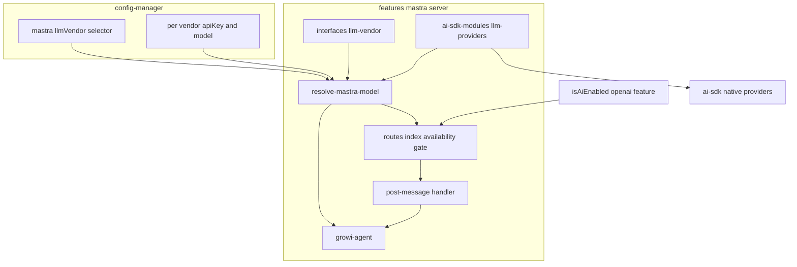
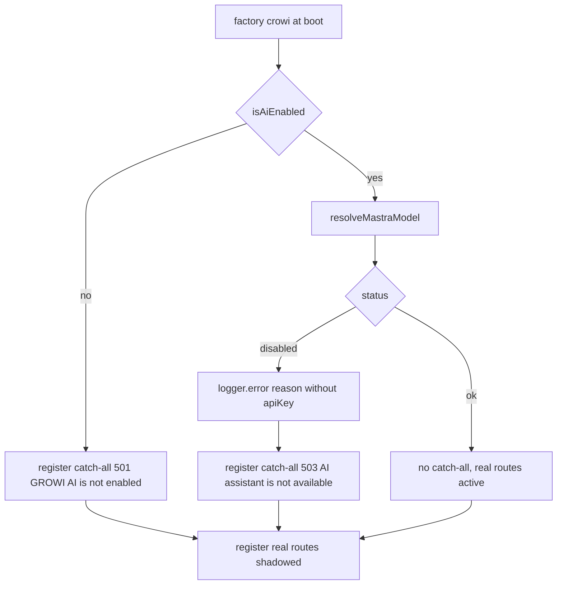
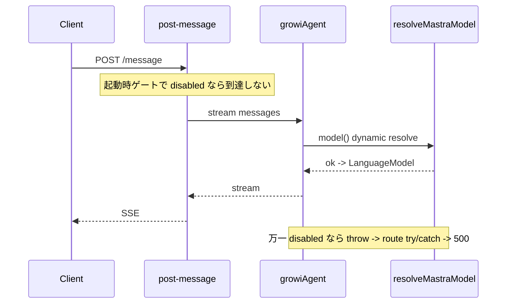

# Design Document: multi-llm-provider

## Overview

**Purpose**: mastra チャットエージェント（`growiAgent`）が使用する LLM ベンダーを **OpenAI / Anthropic / Google** から選択可能にし、自己ホストする GROWI 運用者がポリシー・契約・コストに応じた LLM を利用できるようにする。

**Users**: GROWI を運用する管理者・運用者（環境変数でベンダー・API キー・モデルを設定）と、AI チャットを利用するエンドユーザー。

**Impact**: 現状 OpenAI に固定されている mastra のプロバイダー生成・モデル選択・API キー取得を、ベンダー非依存の**モデルリゾルバ**へ置き換える。LLM クライアントは `@mastra/core` のモデルルーター（models.dev ゲートウェイ経由）ではなく、**AI SDK の native provider（`@ai-sdk/openai` / `@ai-sdk/anthropic` / `@ai-sdk/google`）** を生成して `@mastra/core` の `Agent.model` に渡す方式を採る（決定根拠は research.md D-3）。

### Goals
- OpenAI / Anthropic / Google を環境変数で選択し、その native provider で `growiAgent` を駆動する。
- ベンダー・API キー・（任意の）モデルを環境変数のみで設定する（管理画面 UI なし）。
- ベンダーは明示指定必須（既定ベンダーへのフォールバックなし）。
- 設定不備時は `growiAgent` のみ無効化し、アプリ本体・他 AI 機能は継続。原因をログ出力（API キー非出力）。

### Non-Goals
- 同一アプリ内での複数ベンダー同時利用／リクエスト単位の切替（1 App = 1 Vendor）。
- mastra チャットエージェント以外の LLM 利用機能（`suggest-path` 等）のベンダー切替。
- ベンダー・モデル設定の管理画面 UI。
- OpenAI/Anthropic/Google 以外のベンダー追加。
- ベンダー別 reasoning provider options のパリティ（`reasoningEffort` / `reasoningSummary` 相当）。モデル世代依存で保守コストが高いため、OpenAI は現状維持・Anthropic/Google はモデル既定に委ね、reasoning パリティは別仕様へ後追い（research D-7/D-8 参照）。

## Boundary Commitments

### This Spec Owns
- mastra の **LLM モデル解決**（ベンダー選択 → API キー/モデル取得 → native provider 生成 → `LanguageModel` 返却）。
- mastra 用の **ベンダー設定キー**（セレクタ＋ベンダー別 API キー/モデル）の定義。
- `growiAgent` の `model` 供給方法と、**設定不備時の無効化・ログ・可用性ゲート**。

### Out of Boundary
- `features/ai-tools/suggest-path` および `features/openai` の client-delegator 経由の LLM 呼び出し（現行どおり `openai:serviceType` / `openai:apiKey` を使用、不変）。
- mastra の memory（`@mastra/mongodb`、ベンダー非依存）・tools・thread 機能。
- `post-message.ts` の `providerOptions.openai`（OpenAI 専用。非 OpenAI ベンダーでは無視されるが本仕様では変更しない。ベンダー別 reasoning パリティは別仕様へ後追い）。
- 管理画面 UI／AI 連携設定ページ（[deprecate-openai-features](../deprecate-openai-features/) で廃止済みの方針に従い env のみ）。

### Allowed Dependencies
- `~/server/service/config-manager`（`configManager.getConfig`）。
- `~/features/openai/server/services`（`isAiEnabled`）。
- `@mastra/core/agent`（`Agent`, `DynamicArgument<MastraModelConfig>`）, `@ai-sdk/openai`, `@ai-sdk/anthropic`, `@ai-sdk/google`, `ai`（`LanguageModel` 型）。
- `@growi/logger`（pino）。
- 依存方向（厳守）: `config-definition`（core 層）と `interfaces(llm-vendor)`（feature 層）はそれぞれ独立した上流。`llm-providers(factories)` → `resolve-mastra-model`（`config-definition` と `interfaces` の双方を参照）→ `growi-agent` / `routes/index`。左方向のみ import 可。**core の `config-definition` は `features/mastra` を import しない**（`mastra:llmVendor` は `string` 型で定義し、`LlmVendor` への絞り込みは resolver 側で行う）。

### Revalidation Triggers
- `mastra:llmVendor` の有効値集合（`LLM_VENDORS`）の変更。
- ベンダー設定キー名（env 名）の変更。
- `MastraModelResolution` の形（status/reason 種別）の変更。
- `growiAgent` の `model` 供給契約（dynamic function 形式）の変更。
- 起動時可用性ゲートの判定条件・HTTP ステータスの変更。

## Architecture

### Existing Architecture Analysis
- `growi-agent.ts` は **module 読み込み時**に `new Agent({ model: getOpenaiProvider()(model) })` を実行し、`getOpenaiProvider()` は不備時に `throw`。→ Req 4（起動継続）と矛盾するため除去する。
- `routes/index.ts` の `factory(crowi)` は起動時に `isAiEnabled()` で全ルートを 501 短絡（catch-all を先に登録して後続実ルートを shadow するパターン）。→ このゲートを「AI 有効 かつ ベンダー解決成功」に拡張する。
- 設定は `defineConfig<T>({ envVarName, defaultValue, isSecret })`（`config-definition.ts`）。Union 型設定（`openai:serviceType`）と secret 設定（`openai:apiKey`）の前例あり。
- `suggest-path` は別経路（client-delegator）で LLM を呼ぶため、本変更の影響を受けない。

### Architecture Pattern & Boundary Map



**Architecture Integration**
- 選択パターン: **データ駆動のベンダー解決**（`LLM_VENDORS` 配列＋ベンダー→factory map）。consumer はベンダー名で分岐しない。
- 既存パターン踏襲: `defineConfig` 設定、route の catch-all 短絡ゲート、純関数 + 薄いアダプタ、barrel 公開。
- 新規コンポーネント根拠: 「モデル解決」を `growi-agent` と route から分離した単一責務の純関数に集約し、Req 1–4 を 1 箇所でテスト可能にする。
- Steering 準拠: 不変更新／named export／server-client 分離／secret は env・非ログ。

### Technology Stack

| Layer | Choice / Version | Role in Feature | Notes |
|-------|------------------|-----------------|-------|
| Backend / Services | `@mastra/core` 1.41.0 | `Agent.model` に native `LanguageModel` または dynamic function を受理 | `model: DynamicArgument<MastraModelConfig>`（検証済 research D-1） |
| Backend / Services | `@ai-sdk/openai` ^3（既存 3.0.68） | OpenAI native provider（`createOpenAI`） | 既存利用を踏襲 |
| Backend / Services | `@ai-sdk/anthropic` ^3（**新規**） | Anthropic native provider（`createAnthropic`） | runtime `ai@6` と同 provider IF（v6）。server-only import → `dependencies` |
| Backend / Services | `@ai-sdk/google` ^3（**新規**） | Google native provider（`createGoogleGenerativeAI`） | 同上 |
| Data / Config | config-manager（既存） | env からベンダー・API キー・モデルを解決 | `isSecret` で API キーをマスク |
| Infrastructure / Runtime | `@growi/logger`（pino） | 設定不備の原因ログ（key 非出力） | — |

> 方式比較（native provider vs models.dev ルーター）の詳細根拠は research.md D-2/D-3。新規依存は `@ai-sdk/anthropic` / `@ai-sdk/google`（`^3.x`）。

## File Structure Plan

### Directory Structure
```
apps/app/src/features/mastra/
├── interfaces/
│   └── llm-vendor.ts                         # LlmVendor 型, LLM_VENDORS, isLlmVendor ガード
└── server/services/
    ├── ai-sdk-modules/
    │   ├── llm-providers/
    │   │   ├── index.ts                       # barrel: llmModelFactories (vendor→factory map) + 型
    │   │   ├── openai.ts                       # createOpenAI({apiKey})(model)
    │   │   ├── anthropic.ts                    # createAnthropic({apiKey})(model)
    │   │   └── google.ts                       # createGoogleGenerativeAI({apiKey})(model)
    │   ├── resolve-mastra-model.ts             # ベンダー解決 → MastraModelResolution(判別共用体, memoize)
    │   └── resolve-mastra-model.spec.ts        # 解決/不備/secret-safe のユニットテスト
    └── mastra-modules/agents/
        └── growi-agent.ts                      # [変更] model を resolver 経由の dynamic function に
```

### Modified Files
- `apps/app/src/server/service/config-manager/config-definition.ts` — `CONFIG_KEYS` 配列と `CONFIG_DEFINITIONS` に `mastra:llmVendor`・`anthropic:*`・`google:*`（apiKey・model）を追加（`ConfigKey`/`ConfigValues` は自動導出。`ENV_ONLY_GROUPS` には追加しない）。
- `apps/app/src/features/mastra/server/services/mastra-modules/agents/growi-agent.ts` — `getOpenaiProvider()(model)` を `model: () => resolveMastraModel()` の dynamic function へ置換。
- `apps/app/src/features/mastra/server/routes/index.ts` — 可用性ゲートを「`isAiEnabled()` かつ resolver=ok」に拡張、不備時に原因ログ＋エラールート。
- `apps/app/package.json` — `@ai-sdk/anthropic`・`@ai-sdk/google`（`^3.x`）を `dependencies` に追加（導入後 Turbopack externalise 検証）。
- `apps/app/src/features/mastra/server/services/mastra-modules/agents/growi-agent.spec.ts` — dynamic model / 無効時 throw を反映。

### Deleted Files
- `apps/app/src/features/mastra/server/services/ai-sdk-modules/get-openai-provider.ts` — `llm-providers/openai.ts` + resolver に置換（唯一の import 元は `growi-agent.ts`。実装時に他参照がないことを確認）。

## System Flows

### モデル解決と起動時ゲート



判定: catch-all を実ルートより**先**に登録することで shadow させる（既存パターン踏襲）。`disabled` の理由（`vendor-unset` / `vendor-invalid` / `api-key-missing`）はログにのみ出力し、クライアントへは汎用メッセージのみ返す（情報漏えい防止）。

### リクエスト時のモデル供給（dynamic model）



## Requirements Traceability

| Requirement | Summary | Components | Interfaces | Flows |
|-------------|---------|------------|------------|-------|
| 1.1 | 3 ベンダーを選択可能 | llm-vendor, config | `LLM_VENDORS`, `mastra:llmVendor` | — |
| 1.2 | 指定ベンダーを使用 | resolver, llm-providers | `resolveMastraModel`, `llmModelFactories` | リクエスト時供給 |
| 1.3 | 未指定→不備・フォールバックなし | resolver | `MastraModelResolution(vendor-unset)` | 起動ゲート |
| 1.4 | 不正ベンダー名→不備 | llm-vendor, resolver | `isLlmVendor`, `(vendor-invalid)` | 起動ゲート |
| 2.1 | API キーを env から取得 | config, resolver | `<vendor>:apiKey` | — |
| 2.2 | モデルを env で設定 | config, resolver | `<vendor>:assistantModel:mastraAgent` | — |
| 2.3 | モデル未指定→既定 | config | 各 model キーの `defaultValue` | — |
| 2.4 | env のみ・管理 UI なし | config | `envVarName` のみ（UI 追加なし） | — |
| 2.5 | API キーをログ等に非出力 | config, resolver, gate | `isSecret`, reason 判別子に key 不含 | 起動ゲート Log |
| 3.1 | 1 App = 1 ベンダー | resolver | 単一 `mastra:llmVendor` 解決 | — |
| 3.2 | 複数キー併存でも選択 1 つ | resolver | 選択 vendor のキーのみ参照 | — |
| 3.3 | リクエスト内混在なし | growi-agent | 単一 `model` 供給 | リクエスト時供給 |
| 4.1 | 不備時に無効化 | resolver, gate, growi-agent | `MastraModelResolution(disabled)` | 起動ゲート |
| 4.2 | 原因をログ | gate | `logger.error(reason)` | 起動ゲート Log |
| 4.3 | アプリ・他 AI は継続 | gate, growi-agent | import 時 no-throw（dynamic model） | 起動ゲート |
| 4.4 | チャット要求→エラー応答 | gate | catch-all 501/503 | 起動ゲート |
| 5.1 | 適用は growiAgent のみ | growi-agent, resolver | `model` 供給のみ | — |
| 5.2 | 他 LLM 機能は不変 | （境界） | `suggest-path` は別経路 | — |

## Components and Interfaces

| Component | Domain/Layer | Intent | Req Coverage | Key Dependencies | Contracts |
|-----------|--------------|--------|--------------|------------------|-----------|
| LLM Vendor types | interfaces | ベンダー集合と型ガード | 1.1, 1.4, 3 | — | State/型 |
| Config definitions | config | env↔設定キー定義 | 1, 2, 3 | configManager (P0) | State |
| LLM provider factories | services | vendor→native LanguageModel | 1.2, 2.1–2.3 | ai-sdk (P0) | Service |
| Model resolver | services | 解決/検証/判別共用体 | 1.2–1.4, 2.5, 3, 4.1 | config, factories, llm-vendor (P0) | Service |
| GROWI agent | services | dynamic model 供給 | 3.3, 4.1, 4.3, 5.1 | resolver (P0), Agent (P0) | Service |
| Availability gate | routes | 起動時可用性判定＋ログ＋ルート | 4.2–4.4 | isAiEnabled, resolver (P0) | API |

### interfaces

#### LLM Vendor types (`interfaces/llm-vendor.ts`)

| Field | Detail |
|-------|--------|
| Intent | ベンダー集合・型・型ガードを単一定義（データ駆動の源泉） |
| Requirements | 1.1, 1.4, 3 |

**Contracts**: State [x]

```typescript
export const LLM_VENDORS = ['openai', 'anthropic', 'google'] as const;
export type LlmVendor = (typeof LLM_VENDORS)[number];

export const isLlmVendor = (value: unknown): value is LlmVendor =>
  typeof value === 'string' && (LLM_VENDORS as readonly string[]).includes(value);
```

**Implementation Notes**
- Integration: `resolve-mastra-model` と config 定義が参照。client からは import しない（server-only 利用）。
- Validation: `mastra:llmVendor`（env 由来の任意文字列）の検証点はここ（Req 1.4）。

### config

#### Config definitions (`config-definition.ts` 追加)

| Field | Detail |
|-------|--------|
| Intent | ベンダーセレクタとベンダー別 API キー/モデルを env から解決 |
| Requirements | 1.1–1.4, 2.1–2.4, 3.1–3.2 |

**Contracts**: State [x]

| 設定キー | 型 | env 名 | default | isSecret |
|---|---|---|---|---|
| `mastra:llmVendor` | `string \| undefined`（resolver で `LlmVendor` に検証） | `MASTRA_LLM_VENDOR` | `undefined` | no |
| `openai:apiKey`（既存・再利用） | `string \| undefined` | `OPENAI_API_KEY` | `undefined` | yes |
| `openai:assistantModel:mastraAgent`（既存・再利用） | `OpenAI.Chat.ChatModel` | `OPENAI_MASTRA_AGENT_MODEL` | `o4-mini` | no |
| `anthropic:apiKey`（新規） | `string \| undefined` | `ANTHROPIC_API_KEY` | `undefined` | yes |
| `anthropic:assistantModel:mastraAgent`（新規） | `string` | `ANTHROPIC_MASTRA_AGENT_MODEL` | `claude-sonnet-4-5`（暫定） | no |
| `google:apiKey`（新規） | `string \| undefined` | `GOOGLE_API_KEY` | `undefined` | yes |
| `google:assistantModel:mastraAgent`（新規） | `string` | `GOOGLE_MASTRA_AGENT_MODEL` | `gemini-2.5-flash`（暫定） | no |

**Implementation Notes**
- Integration: openai は既存キーを再利用（`suggest-path` と共有のため Req 5 と整合）。anthropic/google を対称に新設。
- **env-only の実装方針（確定）**: Req 2.4「env のみ」は **「設定用の管理画面 UI を持たない」** と解釈する（AI 連携設定画面は [deprecate-openai-features](../deprecate-openai-features/) で廃止済み）。新規キーは既存 `openai:apiKey` と同じ **DB＋env フォールバック**で統一し、**`ENV_ONLY_GROUPS` には登録しない**（openai キー再利用との非対称を回避）。これにより UI から書き込まれる経路が存在しないため、実運用上は env 駆動となり Req 2.4 を満たす。
- **設定キー追加で編集する箇所**: `config-definition.ts` の `CONFIG_KEYS` 配列（手動追加）＋ `CONFIG_DEFINITIONS`（手動追加）。`ConfigKey` 型・`ConfigValues` 型は自動導出のため編集不要。`ENV_ONLY_GROUPS` は上記方針により追加しない。
- Validation: `mastra:llmVendor` は **`string | undefined`** で定義（union 化しない）。理由は2つ — (1) env 由来の不正値を保持できる必要があり、`isLlmVendor` 検証を resolver 側に置くことで Req 1.4 を追跡可能化、(2) `LlmVendor` 型で定義すると core 層の `config-definition.ts` が feature 層 `features/mastra/interfaces` を import する**依存逆転**になるため、これを避ける。`LlmVendor` への絞り込みは resolver の `isLlmVendor` で実施。
- Secret: 新規 `anthropic:apiKey` / `google:apiKey` は `isSecret: true`。`openai:apiKey` 同様、クライアントへ返す apiv3 エンドポイントは存在せず（AI 設定画面廃止）露出経路なし（Req 2.5）。
- Risks: model 既定値（anthropic/google）は最新提供モデルで確定（research D-5）。`OpenAI.Chat.ChatModel` 限定型は openai キーのみに留め、他は `string`。

### services

#### LLM provider factories (`ai-sdk-modules/llm-providers/`)

| Field | Detail |
|-------|--------|
| Intent | ベンダーごとに native provider を生成し `LanguageModel` を返す薄いアダプタ |
| Requirements | 1.2, 2.1, 2.2, 2.3 |

**Contracts**: Service [x]

```typescript
// llm-providers/index.ts
import type { LanguageModel } from 'ai';
import type { LlmVendor } from '~/features/mastra/interfaces/llm-vendor';

export type LlmModelFactory = (params: { apiKey: string; model: string }) => LanguageModel;

export const llmModelFactories: Record<LlmVendor, LlmModelFactory> = {
  openai:    createOpenAiModel,    // createOpenAI({ apiKey })(model)
  anthropic: createAnthropicModel, // createAnthropic({ apiKey })(model)
  google:    createGoogleModel,    // createGoogleGenerativeAI({ apiKey })(model)
};
```
- Preconditions: `apiKey` は非 null（resolver が保証）。
- Postconditions: `MastraModelConfig` に代入可能な `LanguageModel`（AI SDK v6 = LanguageModelV3）。
- Invariants: API キーは明示注入のみ（`process.env` 自動検出に依存しない）。

**Implementation Notes**
- Integration: 各ファイルは 1 ベンダー 1 責務。barrel が map を公開（consumer は名前分岐しない）。
- Risks: provider 関数名／apiKey option は `createOpenAI`/`createAnthropic`/`createGoogleGenerativeAI` の `{ apiKey }`（research §3 検証済）。

#### Model resolver (`ai-sdk-modules/resolve-mastra-model.ts`)

| Field | Detail |
|-------|--------|
| Intent | ベンダー解決・検証・native model 生成を 1 箇所に集約（判別共用体で可用性表現） |
| Requirements | 1.2, 1.3, 1.4, 2.1, 2.3, 2.5, 3.1, 3.2, 4.1 |

**Contracts**: Service [x]

```typescript
import type { LanguageModel } from 'ai';
import type { LlmVendor } from '~/features/mastra/interfaces/llm-vendor';

export type MastraModelDisabledReason =
  | { type: 'vendor-unset' }
  | { type: 'vendor-invalid'; value: string }     // value = raw env 文字列（key ではない）
  | { type: 'api-key-missing'; vendor: LlmVendor };

export type MastraModelResolution =
  | { status: 'ok'; vendor: LlmVendor; model: LanguageModel }
  | { status: 'disabled'; reason: MastraModelDisabledReason };

export const resolveMastraModel: () => MastraModelResolution;
```
- Preconditions: config-manager ロード済み。
- Postconditions: `ok` の場合 native `LanguageModel`、`disabled` の場合 key を含まない理由。`ok` は memoize（既存 singleton 挙動を踏襲）。
- Invariants: 選択 `mastra:llmVendor` に対応するキーのみ参照（Req 3.2）。reason は API キー値を一切含まない（Req 2.5）。

解決手順:
1. `mastra:llmVendor` 取得 → null なら `vendor-unset`（Req 1.3, 4.1）。
2. `isLlmVendor` 失敗なら `vendor-invalid`（Req 1.4）。
3. 当該 vendor の `apiKey` 取得 → null なら `api-key-missing`（Req 4.1）。
4. 当該 vendor の model 取得（未指定は config default = Req 2.3）。
5. `llmModelFactories[vendor]({ apiKey, model })` → `ok`（memoize）。

**Implementation Notes**
- Integration: `growi-agent`（dynamic model）と `routes/index`（ゲート）の両方から呼ばれる。memoize で provider 重複生成を防止。
- Validation: 起動時とリクエスト時で同一判定。
- Risks: memoize は env 変更に再起動を要する（現行と同じ・許容）。

#### GROWI agent (`mastra-modules/agents/growi-agent.ts` 変更)

| Field | Detail |
|-------|--------|
| Intent | `model` を resolver 経由の dynamic function とし、import 時 throw を排除 |
| Requirements | 3.3, 4.1, 4.3, 5.1 |

**Contracts**: Service [x]

```typescript
export const growiAgent = new Agent({
  id: 'growiAgent',
  name: 'GROWI Agent',
  instructions: `... (現行維持) ...`,
  model: () => {                                  // DynamicArgument<MastraModelConfig>
    const resolution = resolveMastraModel();
    if (resolution.status !== 'ok') {
      throw new Error(`Mastra LLM provider is not available: ${resolution.reason.type}`);
    }
    return resolution.model;
  },
  tools: { fullTextSearchTool, getPageContentTool },
  memory,
});
```
- Preconditions: なし（import 時に resolver を呼ばない）。
- Postconditions: 単一ベンダーの単一 model を供給（Req 3.3）。`ok` 時のみ model を返す。
- Invariants: 構築時に例外を投げない（Req 4.3）。

**Implementation Notes**
- Integration: `mastra-modules/index.ts`（`new Mastra({agents:{growiAgent}})`）は不変。throw は通常到達しない（ゲートで遮断）が、二重防御として残す。throw 文に key を含めない（type のみ）。
- Risks: dynamic model 形式は `DynamicArgument<MastraModelConfig>`（検証済 research D-1）。

#### Availability gate (`routes/index.ts` 変更)

| Field | Detail |
|-------|--------|
| Intent | 起動時に可用性を判定し、不備をログ・エラールート化、正常時のみ実ルート有効化 |
| Requirements | 4.2, 4.3, 4.4 |

**Contracts**: API [x]

| 条件 | 応答 | ログ |
|---|---|---|
| `!isAiEnabled()` | catch-all 501 `GROWI AI is not enabled`（既存） | — |
| AI 有効 ＋ resolver `disabled` | catch-all 503 `AI assistant is not available` | `logger.error` に reason.type（key 非出力）（Req 4.2） |
| AI 有効 ＋ resolver `ok` | catch-all なし（実ルート有効） | — |

**Implementation Notes**
- Integration: catch-all を実ルートより先に登録して shadow（既存パターン）。`disabled` 理由はログのみ、クライアントには汎用メッセージ（Req 2.5/情報漏えい防止）。
- Validation: アプリ全体・他 AI 機能の起動は継続（Req 4.3）。
- Risks: 503 はミドルウェア層の既存 `ErrorV3`/`apiv3Err` を流用。

## Error Handling

### Error Strategy
- **設定不備（fail-soft）**: import 時に throw せず、resolver の判別共用体で `disabled` を表現。起動時ゲートでログ＋エラールート、アプリ継続（Req 4.1–4.4）。
- **二重防御（fail-fast at use）**: dynamic model が万一 `disabled` を受けたら throw → `post-message` の既存 try/catch が 500 を返す。

### Error Categories and Responses
- **User/Operator 設定エラー**: vendor 未指定/不正/キー欠落 → 503 + ログ（reason.type）。
- **System (5xx)**: stream 失敗は既存 `Failed to post message`（500）。

### Monitoring
- `@growi/logger`（pino）で `logger.error({ reason: reason.type, vendor? }, 'Mastra chat agent disabled')`。**API キー値は出力しない**（Req 2.5）。

## Testing Strategy

### Unit Tests
- **resolver**: `vendor-unset`（1.3/4.1）／`vendor-invalid`（1.4）／`api-key-missing`（4.1）／3 ベンダー各 `ok` で正しい factory 呼び出し（1.2/2.1）／model 未指定で default 使用（2.3）／`disabled.reason` に apiKey 値を含まない（2.5）／memoize 動作。
- **isLlmVendor**: 3 値を受理・他を拒否（1.1/1.4）。
- **provider factories**: 各 factory が対応 `create*` を `{ apiKey }` で呼び `(model)` を適用（ai-sdk を mock）（1.2/2.1/2.2）。

### Integration Tests
- **routes/index ゲート**: AI 無効→501／AI 有効＋vendor 未指定→503＋`logger.error` 呼出（reason に key 非出力）＋実ルート shadow（4.2/4.4）／AI 有効＋有効 vendor→実ルート有効（4.3）。
- **growi-agent**: import 時 no-throw（4.3）／`ok` 時 `model()` が LanguageModel を返す／`disabled` 時 `model()` が throw（4.1）。

### Regression
- **suggest-path 不変**: `mastra:llmVendor` 設定に関わらず `suggest-path` は `openai:serviceType`/`openai:apiKey` 経路で動作（5.2）。

## Security Considerations
- API キーは `isSecret: true` で config-manager がマスク（DB/API 応答）。ログは reason.type と vendor 名のみ（Req 2.5）。
- `vendor-invalid` の `value`（raw env のベンダー名文字列）はキーではないためログ可。エラールートのクライアント応答は汎用文言のみ（設定詳細を漏らさない）。
- API キーは env からの明示注入のみ（provider の env 自動検出に依存しない）。

## Open Questions / Risks
- **モデル既定値**: anthropic/google の `defaultValue`（暫定 `claude-sonnet-4-5` / `gemini-2.5-flash`）は実装時に最新提供モデルで確定（research D-5）。
- **provider options パリティ（Out of scope・別仕様へ後追い）**: `post-message.ts` の `providerOptions.openai`（reasoning summary/effort）は OpenAI 専用のまま現状維持。非 OpenAI ベンダーでは AI SDK 側で**無視される（検証済）** — `@ai-sdk/provider-utils@4.0.27` の `parseProviderOptions` は当該 provider 名前空間が無ければ `undefined` を返し throw しない（クロス名前空間でエラーにならない）。
  - Anthropic/Google は本仕様では各モデル既定の reasoning に委ねる（providerOptions 未設定）。ベンダー別 reasoning パリティ（コスト抑制・サマリ表示の出し分け）は、**モデル世代依存で保守コストが高い**ため別仕様へ後追い。調査結果（各ベンダーの reasoning オプション・マッピング案）は research.md D-7/D-8 に保持。
- **依存分類**: `@ai-sdk/anthropic`/`@ai-sdk/google` 導入後、`apps/app/.next/node_modules` で externalise を確認し `dependencies` 分類を検証（package-dependencies ルール）。
- **設定キー命名**: `mastra:llmVendor` は提案。レビューで `app:aiAssistant:*` 等への変更余地あり。
- **suggest-path の OpenAI 依存（運用者向け明示）**: mastra ベンダーを anthropic/google にしても `suggest-path` は独立に `OPENAI_API_KEY` を要する（Req 5 で対象外）。運用者の誤解を避けるため、起動ログ／運用ドキュメントに「ベンダー選択は suggest-path に影響しない」旨を明示する（Req 5.2）。
- **env-only 方針（解決済み）**: 新規ベンダーキーは DB＋env フォールバックで統一し `ENV_ONLY_GROUPS` 非登録。管理 UI 不在により Req 2.4 を充足（Components → config の Implementation Notes 参照）。
