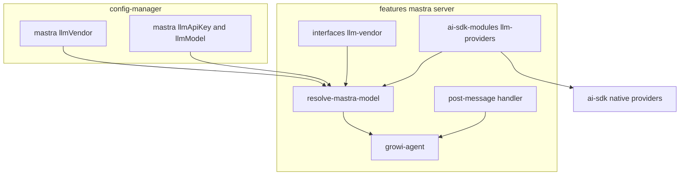
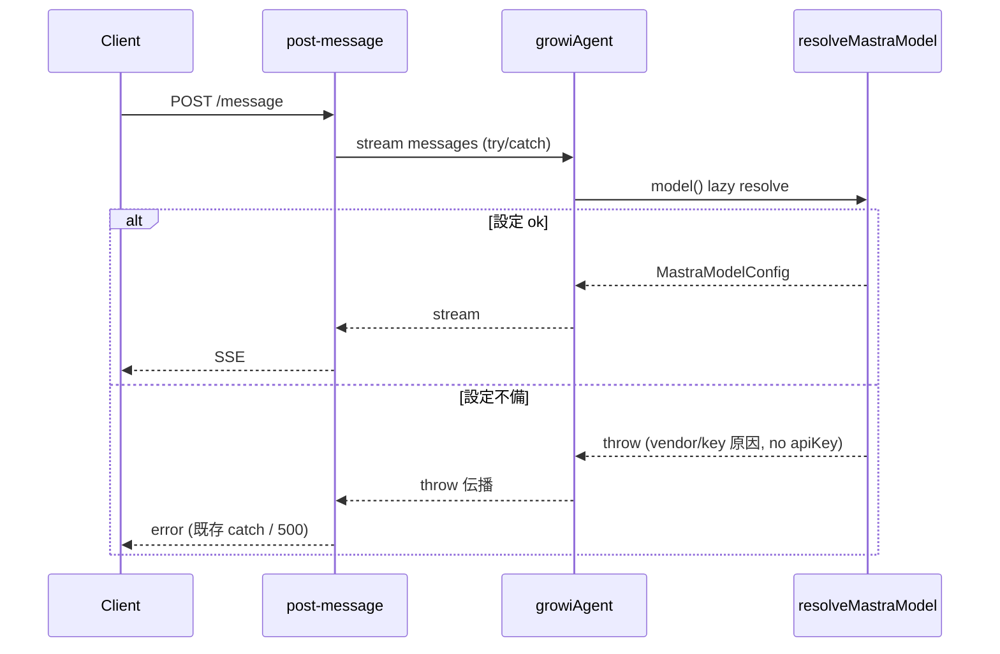

# Design Document: multi-llm-provider

## Overview

**Purpose**: mastra チャットエージェント（`growiAgent`）が使用する LLM ベンダーを **OpenAI / Anthropic / Google** から選択可能にし、自己ホストする GROWI 運用者がポリシー・契約・コストに応じた LLM を利用できるようにする。

**Users**: GROWI を運用する管理者・運用者（環境変数でベンダー・API キー・モデルを設定）と、AI チャットを利用するエンドユーザー。

**Impact**: 現状 OpenAI に固定されている mastra のプロバイダー生成・モデル選択・API キー取得を、ベンダー非依存の**モデルリゾルバ**へ置き換える。LLM クライアントは `@mastra/core` のモデルルーター（models.dev ゲートウェイ経由）ではなく、**AI SDK の native provider（`@ai-sdk/openai` / `@ai-sdk/anthropic` / `@ai-sdk/google`）** を生成して `@mastra/core` の `Agent.model` に渡す方式を採る（決定根拠は research.md D-3）。設定は**ベンダー非依存の単一キーセット**（1 App = 1 Vendor）。

### Goals
- OpenAI / Anthropic / Google を環境変数で選択し、その native provider で `growiAgent` を駆動する。
- ベンダー・API キー・（任意の）モデルを**単一の env キーセット**で設定する（管理画面 UI なし）。
- ベンダー未指定時は既定で OpenAI を使用する（config の defaultValue）。
- 設定不備時はモデル解決時に **throw**（既存 `OpenaiClientDelegator` と同流儀）。import 時には解決しないためアプリ起動は継続。
- LLM provider options（reasoning 等）を単一 JSON 環境変数で指定し、チャット呼び出しに適用する（既定は OpenAI の reasoning オプション）。

### Non-Goals
- 同一アプリ内での複数ベンダー同時利用／リクエスト単位の切替（1 App = 1 Vendor）。
- mastra チャットエージェント以外の LLM 利用機能（`suggest-path` 等）のベンダー切替。
- ベンダー・モデル設定の管理画面 UI。
- OpenAI/Anthropic/Google 以外のベンダー追加。
- provider options の **intent レベル per-vendor 自動マッピング**（"effort=low" を各ベンダー固有の形へ変換する等）。生 JSON を運用者が指定する方式（Req 6）とし、モデル世代依存のマッピングロジックはコードに持たない（research D-7/D-8 は参考資料として保持）。
- 起動時の可用性ゲート／専用 HTTP ステータス（503）。設定不備は使用時 throw を `post-message` の既存 try/catch が処理する（route 変更なし）。

## Boundary Commitments

### This Spec Owns
- mastra の **LLM モデル解決**（ベンダー選択 → API キー/モデル取得 → native provider 生成 → `MastraModelConfig` 返却。不備時は throw）。
- mastra 用の **単一 LLM 設定キー**（`mastra:llmVendor` / `mastra:llmApiKey` / `mastra:llmModel`）の定義と、ベンダー別**既定モデルのコード内 map**。
- `growiAgent` の `model` 供給方法（resolver を遅延呼び出しする dynamic function）。
- **provider options の解決**（`mastra:llmProviderOptions` JSON の parse + fail-soft）と、`post-message` のチャットストリーム呼び出しへの適用。

### Out of Boundary
- `features/ai-tools/suggest-path` および `features/openai` の client-delegator 経由の LLM 呼び出し（現行どおり `openai:serviceType` / `openai:apiKey` を使用、不変）。
- mastra の memory（`@mastra/mongodb`、ベンダー非依存）・tools・thread 機能。
- `mastra/server/routes/index.ts`（**変更しない**）。設定不備時のエラー応答は `post-message.ts` の既存 try/catch が担う。
- provider options の **値の妥当性検証・モデル整合**（生 JSON をそのまま AI SDK へ渡す。アクティブ provider 名前空間内の不正値は provider/request 時の責任）。`post-message.ts` の `providerOptions` 結線は本仕様が owns（ハードコードを `resolveProviderOptions()` に置換）。
- 管理画面 UI／AI 連携設定ページ（[deprecate-openai-features](../deprecate-openai-features/) で廃止済みの方針に従い env のみ）。

### Allowed Dependencies
- `~/server/service/config-manager`（`configManager.getConfig`）。
- `@mastra/core/agent`（`Agent`, `DynamicArgument<MastraModelConfig>`）, `@mastra/core/llm`（`MastraModelConfig` 型）, `@ai-sdk/openai`, `@ai-sdk/anthropic`, `@ai-sdk/google`。
- 依存方向: `llm-providers(factories)` → `resolve-mastra-model`（`config-definition` と `interfaces` の双方を参照）→ `growi-agent`。`config-definition`（core 層）は `LlmVendor` を **型のみ（`import type`）** 参照する — 実行時に消えるため runtime の core→feature エッジは無く、`llm-vendor` は依存ゼロの leaf なので循環もない。型は DX 用で実行時強制ではないため、不正値検証は resolver の `isLlmVendor`。

### Revalidation Triggers
- `mastra:llmVendor` の有効値集合（`LLM_VENDORS`）の変更。
- LLM 設定キー名（env 名）の変更。
- `resolveMastraModel` の戻り値型（`MastraModelConfig`）または throw 契約の変更。
- `growiAgent` の `model` 供給契約（dynamic function 形式）の変更。

## Architecture

### Existing Architecture Analysis
- `growi-agent.ts` は **module 読み込み時**に `new Agent({ model: getOpenaiProvider()(model) })` を実行し、`getOpenaiProvider()` は不備時に `throw`。→ Req 4.3（起動継続）と矛盾するため、`model` を遅延 dynamic function 化する。
- 既存 `OpenaiClientDelegator`（`features/openai`）はコンストラクタで API キー欠落時に `throw` する。本仕様の resolver もこの**throw 流儀**に揃える。
- `routes/index.ts` は `isAiEnabled()` で全ルートを 501 短絡する既存ゲートを持つ。本仕様では**これを変更しない**（設定不備の throw は `post-message` の既存 try/catch が捕捉してエラー応答）。
- 設定は `defineConfig<T>({ envVarName, defaultValue, isSecret })`（`config-definition.ts`）。secret 設定（`openai:apiKey`）の前例あり。
- `suggest-path` は別経路（client-delegator）で LLM を呼ぶため、本変更の影響を受けない。

### Architecture Pattern & Boundary Map



**Architecture Integration**
- 選択パターン: **データ駆動のベンダー解決**（`LLM_VENDORS` 配列＋ベンダー→factory map＋ベンダー→既定モデル map）。consumer はベンダー名で分岐しない。
- 既存パターン踏襲: `defineConfig` 設定、`OpenaiClientDelegator` の throw 流儀、純関数 + 薄いアダプタ、barrel 公開。
- 新規コンポーネント根拠: 「モデル解決」を `growi-agent` から分離した単一責務の純関数に集約し、Req 1–4 を 1 箇所でテスト可能にする。
- Steering 準拠: 不変更新／named export／server-client 分離／secret は env・非ログ。

### Technology Stack

| Layer | Choice / Version | Role in Feature | Notes |
|-------|------------------|-----------------|-------|
| Backend / Services | `@mastra/core` 1.41.0 | `Agent.model` に dynamic function（`MastraModelConfig` を返す）を受理 | `model: DynamicArgument<MastraModelConfig>`（検証済 research D-1） |
| Backend / Services | `@ai-sdk/openai` ^3（既存 3.0.68） | OpenAI native provider（`createOpenAI`） | 既存利用を踏襲 |
| Backend / Services | `@ai-sdk/anthropic` ^3（**新規**） | Anthropic native provider（`createAnthropic`） | runtime `ai@6` と同 provider IF（v6） |
| Backend / Services | `@ai-sdk/google` ^3（**新規**） | Google native provider（`createGoogleGenerativeAI`） | 同上 |
| Data / Config | config-manager（既存） | env から vendor / apiKey / model を解決 | `isSecret` で API キーをマスク |

> 方式比較（native provider vs models.dev ルーター）の詳細根拠は research.md D-2/D-3。新規依存は `@ai-sdk/anthropic` / `@ai-sdk/google`（`^3.x`）。

## File Structure Plan

### Directory Structure
```
apps/app/src/features/mastra/
├── interfaces/
│   └── llm-vendor.ts                         # LlmVendor 型, LLM_VENDORS, isLlmVendor ガード
└── server/services/
    ├── ai-sdk-modules/
    │   ├── llm-providers/
    │   │   ├── index.ts                       # barrel: llmModelFactories (vendor→factory map) + 型
    │   │   ├── openai.ts                       # createOpenAI({apiKey})(model)
    │   │   ├── anthropic.ts                    # createAnthropic({apiKey})(model)
    │   │   └── google.ts                       # createGoogleGenerativeAI({apiKey})(model)
    │   ├── resolve-mastra-model.ts             # vendor 解決 → MastraModelConfig 返却 or throw（memoize）+ 既定モデル map
    │   ├── resolve-mastra-model.spec.ts        # 解決/throw/secret-safe のユニットテスト
    │   ├── resolve-provider-options.ts         # MASTRA_LLM_PROVIDER_OPTIONS JSON を parse（fail-soft）→ ProviderOptions
    │   └── resolve-provider-options.spec.ts    # parse/既定/不正 JSON fail-soft のユニットテスト
    └── mastra-modules/agents/
        └── growi-agent.ts                      # [変更] model を resolver 経由の dynamic function に
```

### Modified Files
- `apps/app/src/server/service/config-manager/config-definition.ts` — `CONFIG_KEYS` / `CONFIG_DEFINITIONS` に `mastra:llmVendor`（`LlmVendor` 型・type-only import）/ `mastra:llmApiKey`（secret）/ `mastra:llmModel` を追加し、未使用化した `openai:assistantModel:mastraAgent`（＋ `openai` 型 import）を削除（`ConfigKey`/`ConfigValues` は自動導出。`ENV_ONLY_GROUPS` には追加しない）。
- `apps/app/src/features/mastra/server/services/mastra-modules/agents/growi-agent.ts` — `getOpenaiProvider()(model)` を `model: () => resolveMastraModel()` の dynamic function へ置換。
- `apps/app/src/features/mastra/server/routes/post-message.ts` — ハードコードの `providerOptions: { openai: {...} }` を `providerOptions: resolveProviderOptions()` に置換。
- `apps/app/package.json` — `@ai-sdk/anthropic`・`@ai-sdk/google`（`^3.x`）を `dependencies` に追加。
- `apps/app/src/features/mastra/server/services/mastra-modules/agents/growi-agent.spec.ts` — dynamic model / 使用時 throw 伝播を反映。

### Deleted Files
- `apps/app/src/features/mastra/server/services/ai-sdk-modules/get-openai-provider.ts` — `llm-providers/openai.ts` + resolver に置換。

> `routes/index.ts` は変更しない（FB により可用性ゲートを撤回）。`openai:apiKey`（suggest-path と共有）は不変。`openai:assistantModel:mastraAgent`（旧 mastra agent 専用・`OPENAI_MASTRA_AGENT_MODEL`）は未使用化したため**削除**（mastra は `mastra:llmModel` を使用）。

## System Flows

### リクエスト時のモデル供給と設定不備の throw



判定: モデル解決は **import 時でなく使用時**（`growiAgent.stream()` 内の dynamic `model()`）に走る。設定不備なら `resolveMastraModel()` が throw し、`post-message` の既存 try/catch がエラー応答を返す（Req 4.4）。`logger.error(error)` が原因（vendor/欠落 env 名）をログ出力し、**API キー値は throw メッセージにもログにも含めない**（Req 2.5）。import 時は解決しないためアプリ・他機能の起動は継続（Req 4.3）。

## Requirements Traceability

| Requirement | Summary | Components | Interfaces | Flows |
|-------------|---------|------------|------------|-------|
| 1.1 | 3 ベンダーを選択可能 | llm-vendor, config | `LLM_VENDORS`, `mastra:llmVendor` | — |
| 1.2 | 指定ベンダーを使用 | resolver, llm-providers | `resolveMastraModel`, `llmModelFactories` | リクエスト時供給 |
| 1.3 | 未指定→既定 OpenAI | config | `mastra:llmVendor` default `'openai'` | — |
| 1.4 | 不正ベンダー名→throw | llm-vendor, resolver | `isLlmVendor`, throws | リクエスト時供給 |
| 2.1 | API キーを env から取得 | config, resolver | `mastra:llmApiKey` | — |
| 2.2 | モデルを env で設定 | config, resolver | `mastra:llmModel` | — |
| 2.3 | モデル未指定→単一既定（OpenAI 向け） | config | `mastra:llmModel` default `o4-mini` | — |
| 2.4 | env のみ・管理 UI なし | config | `envVarName` のみ（UI 追加なし） | — |
| 2.5 | API キーをログ等に非出力 | config, resolver | `isSecret`, throw メッセージに key 不含 | リクエスト時供給 |
| 3.1 | 1 App = 1 ベンダー | config, resolver | 単一キーセット | — |
| 3.2 | 単一キーのみ参照 | resolver | `mastra:llmApiKey` のみ読む | — |
| 3.3 | リクエスト内混在なし | growi-agent | 単一 `model` 供給 | リクエスト時供給 |
| 4.1 | 不備時に無効化（throw） | resolver, growi-agent | `resolveMastraModel` throws | リクエスト時供給 |
| 4.2 | 原因をログ | growi-agent, post-message | 既存 `logger.error(error)` | リクエスト時供給 |
| 4.3 | アプリ・他 AI は継続 | growi-agent | import 時 no-throw（dynamic model） | — |
| 4.4 | チャット要求→エラー応答 | post-message | 既存 try/catch | リクエスト時供給 |
| 5.1 | 適用は growiAgent のみ | growi-agent, resolver | `model` 供給のみ | — |
| 5.2 | 他 LLM 機能は不変 | （境界） | `suggest-path` は別経路 | — |
| 6.1 | provider options を適用 | resolve-provider-options, post-message | `resolveProviderOptions()` | リクエスト時供給 |
| 6.2 | 単一 JSON env で受付 | config, resolve-provider-options | `mastra:llmProviderOptions` | — |
| 6.3 | 未指定→既定（OpenAI reasoning） | config | defaultValue JSON | — |
| 6.4 | 不正 JSON→fail-soft＋warn | resolve-provider-options | parse try/catch → `{}` | リクエスト時供給 |

## Components and Interfaces

| Component | Domain/Layer | Intent | Req Coverage | Key Dependencies | Contracts |
|-----------|--------------|--------|--------------|------------------|-----------|
| LLM Vendor types | interfaces | ベンダー集合と型ガード | 1.1, 1.4, 3 | — | State/型 |
| Config definitions | config | env↔単一 LLM 設定キー | 1, 2, 3 | configManager (P0) | State |
| LLM provider factories | services | vendor→native MastraModelConfig | 1.2, 2.1, 2.2 | ai-sdk (P0) | Service |
| Model resolver | services | 解決/検証（不備時 throw）/既定モデル | 1.2–1.4, 2.1–2.3, 2.5, 3, 4.1 | config, factories, llm-vendor (P0) | Service |
| GROWI agent | services | dynamic model 供給（throw 伝播） | 3.3, 4.1, 4.3, 5.1 | resolver (P0), Agent (P0) | Service |
| Provider options resolver | services | provider options JSON の parse（fail-soft）＋ post-message 適用 | 6.1–6.4 | config (P0) | Service |

### interfaces

#### LLM Vendor types (`interfaces/llm-vendor.ts`)

| Field | Detail |
|-------|--------|
| Intent | ベンダー集合・型・型ガードを単一定義（データ駆動の源泉） |
| Requirements | 1.1, 1.4, 3 |

**Contracts**: State [x]

```typescript
export const LLM_VENDORS = ['openai', 'anthropic', 'google'] as const;
export type LlmVendor = (typeof LLM_VENDORS)[number];

export const isLlmVendor = (value: unknown): value is LlmVendor =>
  typeof value === 'string' && (LLM_VENDORS as readonly string[]).includes(value);
```

**Implementation Notes**
- Integration: `resolve-mastra-model` が参照。client からは import しない（server-only 利用）。
- Validation: `mastra:llmVendor`（env 由来の任意文字列）の検証点はここ（Req 1.4）。

### config

#### Config definitions (`config-definition.ts` 追加)

| Field | Detail |
|-------|--------|
| Intent | ベンダー非依存の単一 LLM 設定キーを env から解決 |
| Requirements | 1.1, 2.1, 2.2, 2.4, 3.1 |

**Contracts**: State [x]

| 設定キー | 型 | env 名 | default | isSecret |
|---|---|---|---|---|
| `mastra:llmVendor` | `LlmVendor`（共有型・type-only import。実行時は resolver の `isLlmVendor` で再検証） | `MASTRA_LLM_VENDOR` | `'openai'` | no |
| `mastra:llmApiKey` | `string \| undefined` | `MASTRA_LLM_API_KEY` | `undefined` | yes |
| `mastra:llmModel` | `string`（単一既定値。既定 vendor=OpenAI 向け） | `MASTRA_LLM_MODEL` | `o4-mini` | no |
| `mastra:llmProviderOptions` | `string`（生 JSON。resolver で parse + fail-soft） | `MASTRA_LLM_PROVIDER_OPTIONS` | `{"openai":{"reasoningEffort":"low","reasoningSummary":"auto"}}` | no |

**Implementation Notes**
- Integration: 1 App = 1 Vendor のため**単一キーセット**。ベンダーは `mastra:llmVendor` で選択し、resolver がそれに応じて factory を選ぶ。`openai:apiKey` 等の既存キーは suggest-path 用に不変（mastra は参照しない）。
- **env-only の実装方針（確定）**: Req 2.4「env のみ」は **「設定用の管理画面 UI を持たない」** と解釈する。新規キーは既存 `openai:apiKey` と同じ **DB＋env フォールバック**で統一し、**`ENV_ONLY_GROUPS` には登録しない**。UI から書き込まれる経路が存在しないため実運用上は env 駆動。
- **設定キー追加で編集する箇所**: `config-definition.ts` の `CONFIG_KEYS` 配列＋`CONFIG_DEFINITIONS`。`ConfigKey`/`ConfigValues` は自動導出。
- Validation: `mastra:llmVendor` は共有 **`LlmVendor`** で型付け（`import type` の type-only＝実行時に消えるため依存逆転の実害なし・`llm-vendor` は leaf で循環なし・単一ソース）。**型は DX/補完のためで実行時強制ではない**（config-manager は env 文字列を宣言型で検証しない）。よって resolver は依然 `isLlmVendor` で実行時検証する（`MASTRA_LLM_VENDOR=azure` 等の untrusted env を弾く。Req 1.4）。default `'openai'` により未指定時は OpenAI（Req 1.3）。
- Model 既定: `mastra:llmModel` は config の defaultValue（`o4-mini`、既定 vendor=OpenAI 向け）に集約。resolver は per-vendor 既定 map を持たない。非 OpenAI ベンダー利用時は `MASTRA_LLM_MODEL` の明示指定が必要。
- Secret: `mastra:llmApiKey` は `isSecret: true`。クライアントへ返す apiv3 エンドポイントは存在せず露出経路なし（Req 2.5）。

### services

#### LLM provider factories (`ai-sdk-modules/llm-providers/`)

| Field | Detail |
|-------|--------|
| Intent | ベンダーごとに native provider を生成し `MastraModelConfig` を返す薄いアダプタ |
| Requirements | 1.2, 2.1, 2.2 |

**Contracts**: Service [x]

```typescript
// llm-providers/index.ts
import type { MastraModelConfig } from '@mastra/core/llm';
import type { LlmVendor } from '~/features/mastra/interfaces/llm-vendor';

export type LlmModelFactory = (params: { apiKey: string; model: string }) => MastraModelConfig;

export const llmModelFactories: Record<LlmVendor, LlmModelFactory> = {
  openai:    createOpenAiModel,    // createOpenAI({ apiKey })(model)
  anthropic: createAnthropicModel, // createAnthropic({ apiKey })(model)
  google:    createGoogleModel,    // createGoogleGenerativeAI({ apiKey })(model)
};
```
- Preconditions: `apiKey` は非 null（resolver が保証）。
- Postconditions: `Agent.model` に渡せる `MastraModelConfig`。
- Invariants: API キーは明示注入のみ（`process.env` 自動検出に依存しない）。

**Implementation Notes**
- 戻り型は `@mastra/core/llm` の `MastraModelConfig`（`ai` の広い `LanguageModel` union ではない）。native provider オブジェクトは `MastraModelConfig` の正当なメンバーなのでパイプライン全体が cast-free（research D-9）。
- 各ファイルは 1 ベンダー 1 責務。barrel が map を公開（consumer は名前分岐しない）。

#### Model resolver (`ai-sdk-modules/resolve-mastra-model.ts`)

| Field | Detail |
|-------|--------|
| Intent | vendor 解決・検証・native model 生成を 1 関数に集約。不備時は throw（`OpenaiClientDelegator` 流儀） |
| Requirements | 1.2, 1.3, 1.4, 2.1, 2.3, 2.5, 3.1, 3.2, 4.1 |

**Contracts**: Service [x]

```typescript
import type { MastraModelConfig } from '@mastra/core/llm';

export const resolveMastraModel: () => MastraModelConfig; // 不備時は throw
```
- Preconditions: config-manager ロード済み。
- Postconditions: 成功時 native model（memoize）。不備時は throw（メッセージは vendor 名／欠落 env 名のみ、API キー値を含まない）。
- Invariants: 単一の `mastra:llmApiKey` のみ参照（Req 3.2）。throw メッセージに API キー値を含めない（Req 2.5）。per-vendor 既定モデル map は持たない（既定は config の `mastra:llmModel` defaultValue に集約）。

解決手順:
1. `mastra:llmVendor` 取得（config default `'openai'`。未指定時は OpenAI。Req 1.3）。
2. `isLlmVendor` 失敗なら throw（不正 vendor 名を含むメッセージ。untrusted env を弾く。Req 1.4）。
3. `mastra:llmApiKey` 取得 → null なら throw（`MASTRA_LLM_API_KEY` 未設定。Req 4.1）。
4. `mastra:llmModel` 取得（config default `o4-mini`。Req 2.2, 2.3）。
5. `llmModelFactories[vendor]({ apiKey, model })` を memoize して返す（Req 3.1）。

**Implementation Notes**
- Integration: `growi-agent` の dynamic model から呼ばれる。memoize で provider 重複生成を防止。throw は memoize しない（config 修正が次回呼び出しで反映）。
- 既存 `OpenaiClientDelegator`（コンストラクタで API キー欠落時 throw）と同じ流儀。`isAiEnabled()` チェックは行わない（resolver は vendor 解決に専念）。

#### GROWI agent (`mastra-modules/agents/growi-agent.ts` 変更)

| Field | Detail |
|-------|--------|
| Intent | `model` を resolver 経由の dynamic function とし、import 時 throw を排除。不備時の throw は使用時に伝播 |
| Requirements | 3.3, 4.1, 4.3, 5.1 |

**Contracts**: Service [x]

```typescript
export const growiAgent = new Agent({
  id: 'growiAgent',
  name: 'GROWI Agent',
  instructions: `... (現行維持) ...`,
  model: () => resolveMastraModel(), // DynamicArgument<MastraModelConfig>; 不備時は throw を伝播
  tools: { fullTextSearchTool, getPageContentTool },
  memory,
});
```
- Preconditions: なし（import 時に resolver を呼ばない）。
- Postconditions: 単一ベンダーの単一 model を供給（Req 3.3）。
- Invariants: 構築時に例外を投げない（Req 4.3）。使用時の throw は `post-message` の既存 try/catch に伝播（Req 4.4）。

**Implementation Notes**
- `mastra-modules/index.ts`（`new Mastra({agents:{growiAgent}})`）は不変。
- resolver の throw を swallow せず素通し（`post-message` が捕捉）。throw メッセージに API キーは含まれない（resolver 側で保証）。

#### Provider options resolver (`ai-sdk-modules/resolve-provider-options.ts` 新規 + `post-message.ts` 変更)

| Field | Detail |
|-------|--------|
| Intent | `mastra:llmProviderOptions` JSON を parse（fail-soft）し、AI SDK 形式の `providerOptions` を返す |
| Requirements | 6.1, 6.2, 6.3, 6.4 |

**Contracts**: Service [x]

```typescript
import type { JSONValue } from 'ai';

export type MastraProviderOptions = Record<string, Record<string, JSONValue>>;

// 不正 JSON / 非オブジェクトは {} にフォールバック（warn）。例外は投げない。
export const resolveProviderOptions: () => MastraProviderOptions;
```
- Postconditions: `mastra:llmProviderOptions` を JSON.parse し、provider 名前空間オブジェクトなら返す。未指定/空/不正/非オブジェクトは `{}`（warn）。
- Invariants: **生 JSON を解釈せずそのまま返す（variant A）** — per-vendor マッピングを持たない。例外を投げない（チャットを壊さない。Req 6.4）。
- 型: `ProviderOptions` は `ai` から未 export のため、`JSONValue`（`ai` から export 済）を用いた構造型 `Record<string, Record<string, JSONValue>>` で表現。

**Implementation Notes**
- Integration: `post-message.ts` の `growiAgent.stream(messages, { ..., providerOptions })` を、ハードコード `{ openai: {...} }` から `resolveProviderOptions()` の戻り値へ置換。
- Validation: 単一 JSON env 文字列で受け、object 型 config（loader の JSON.parse が malformed で起動クラッシュ）を避けるため **`string` 型 config ＋ resolver 側 graceful parse**。未知 provider 名前空間は AI SDK が無視（検証済）。アクティブ provider 名前空間内の不正値は request 時に provider が扱う（post-message の既存 catch）。
- Test: route handler の結線は post-message.spec（validator のみ test、handler は sandbox 制約で未 test）方針に倣い、resolver を単体で厚くテスト＋結線は型チェックで担保。

## Error Handling

### Error Strategy
- **設定不備（fail at use, not at import）**: resolver は不備時に throw。`growiAgent.model` は dynamic function なので throw は**使用時**（`stream()`）に発生し、import／起動は throw しない（Req 4.3）。
- **エラー応答**: 使用時 throw は `post-message.ts` の既存 try/catch が捕捉し、エラー応答（500）を返す（Req 4.4）。原因（vendor/欠落 env 名）は `logger.error(error)` でログ出力（Req 4.2）。API キー値は throw メッセージにもログにも出さない（Req 2.5）。

### Error Categories and Responses
- **Operator 設定エラー**: vendor 未指定/不正/キー欠落 → resolver throw → post-message catch → 500 + 原因ログ。
- **System (5xx)**: stream 失敗は既存 `Failed to post message`（500）。

### Monitoring
- `post-message` の既存 `logger.error(error)` が throw（vendor/env 名を含む）を記録。**API キー値は出力しない**（Req 2.5）。

## Testing Strategy

### Unit Tests
- **resolver**: vendor 未指定→throw（`MASTRA_LLM_VENDOR`）（1.3/4.1）／不正 vendor→throw（値を含む）（1.4）／apiKey 欠落→throw（`MASTRA_LLM_API_KEY`）（4.1）／3 ベンダー各成功で正しい factory を `{apiKey, model}` で呼ぶ（1.2/2.1/2.2）／model 未指定で per-vendor 既定（2.3）／throw メッセージに apiKey 値を含まない（2.5）／単一キーのみ参照（3.2）／memoize（同一 instance, factory 1 回）と throw は非 memoize。
- **isLlmVendor**: 3 値を受理・他を拒否（1.1/1.4）。
- **provider factories**: 各 factory が対応 `create*` を `{ apiKey }` で呼び `(model)` を適用（ai-sdk を mock）（1.2/2.1/2.2）。

### Integration / Component Tests
- **growi-agent**: import 時 no-throw（resolver が throw する状態でも構築成功・resolver 未呼出）（4.3）／成功時 `model()` が resolver の model を返す（3.3/5.1）／不備時 `model()` が resolver の throw を伝播（swallow しない）（4.1/4.4）。

### Regression
- **suggest-path 不変**: `mastra:llmVendor` 設定に関わらず `suggest-path` は `openai:serviceType`/`openai:apiKey` 経路で動作（5.2）。

## Security Considerations
- API キーは `isSecret: true` で config-manager がマスク（DB/API 応答）。throw メッセージ・ログは vendor 名／欠落 env 名のみ（Req 2.5）。
- API キーは env からの明示注入のみ（provider の env 自動検出に依存しない）。

## Open Questions / Risks
- **モデル既定値**: `mastra:llmModel` の単一 default は `o4-mini`（既定 vendor=OpenAI 向け）。per-vendor 既定 map は撤去。非 OpenAI ベンダー利用時は `MASTRA_LLM_MODEL` の明示指定が必要（未指定だと OpenAI 向け既定が非互換ベンダーへ渡る）。
- **provider options（本仕様で対応・Req 6）**: `mastra:llmProviderOptions`（単一 JSON env）を `resolveProviderOptions()` が parse し `post-message` の stream 呼び出しへ適用。既定は OpenAI の reasoning オプション、非 OpenAI ベンダーでは AI SDK が無視（検証済：`parseProviderOptions` は当該 provider 名前空間が無ければ throw しない）。intent レベルの per-vendor 自動マッピングは非対応（生 JSON を運用者が指定）。各ベンダーの reasoning オプション一覧は research.md D-7/D-8 を参照。
- **依存分類（検証済 D-?）**: `@ai-sdk/anthropic`/`@ai-sdk/google` は Express サーバ（`dist/`、`build:server`）経由の server-only パッケージで `.next/node_modules` には externalise されない（既存 `@ai-sdk/openai` と同一）。`dependencies` 配置で正しい。確定的 prod ロード検証は CI Level 2（`server:ci`）。
- **削除した config キー**: `openai:assistantModel:mastraAgent`（`OPENAI_MASTRA_AGENT_MODEL`）は未使用化したため本仕様で削除（`OpenAI.Chat.ChatModel` 用の `openai` 型 import も除去）。
- **pre-existing branch 課題（本仕様スコープ外）**: `apiv3/index.js` の `mastraRouteFactory` import 欠落、`post-message.ts:77` TS2769。support/mastra ブランチのマージ未完状態で、別途対応が必要（tasks.md Implementation Notes 参照）。
- **設定キー命名**: `mastra:llmVendor` / `mastra:llmApiKey` / `mastra:llmModel` は提案。レビューで調整余地あり。
