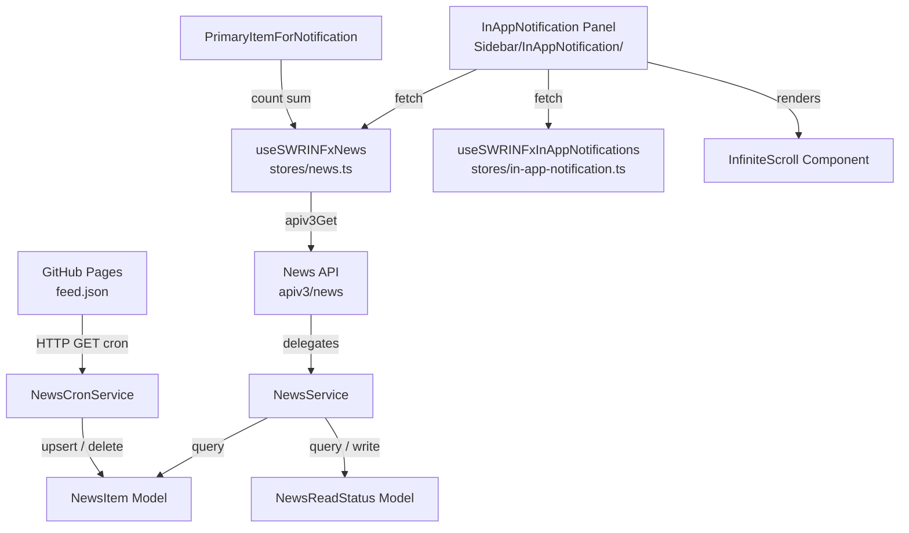
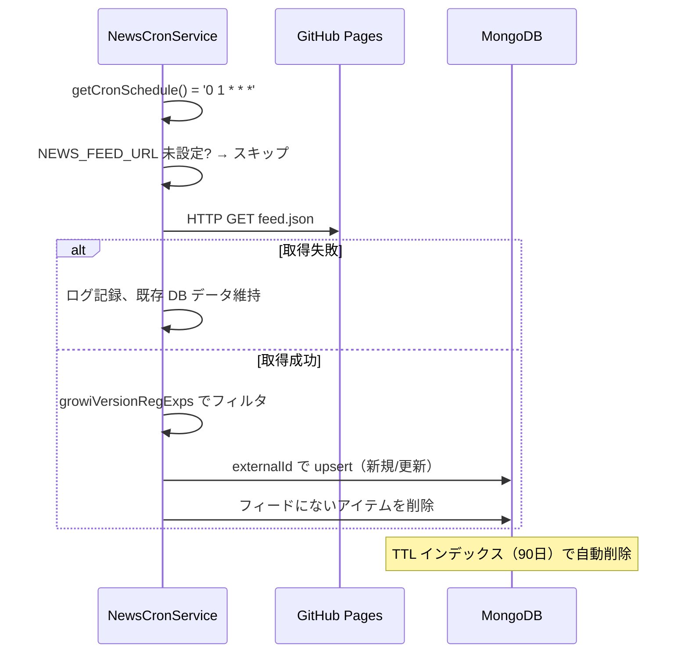
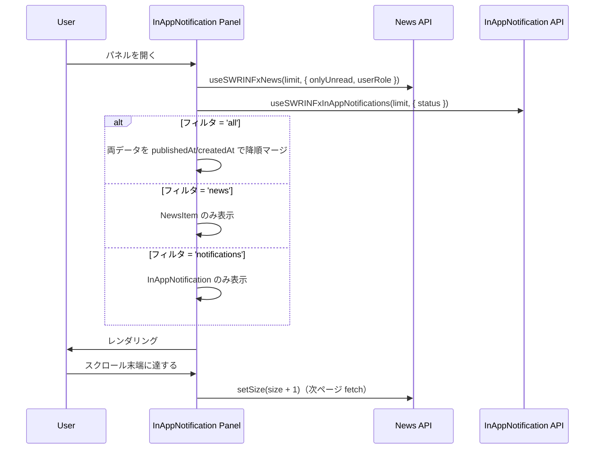
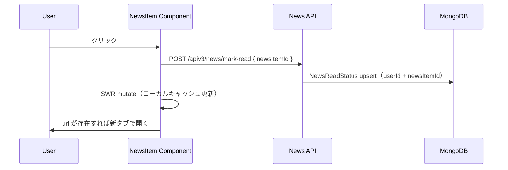
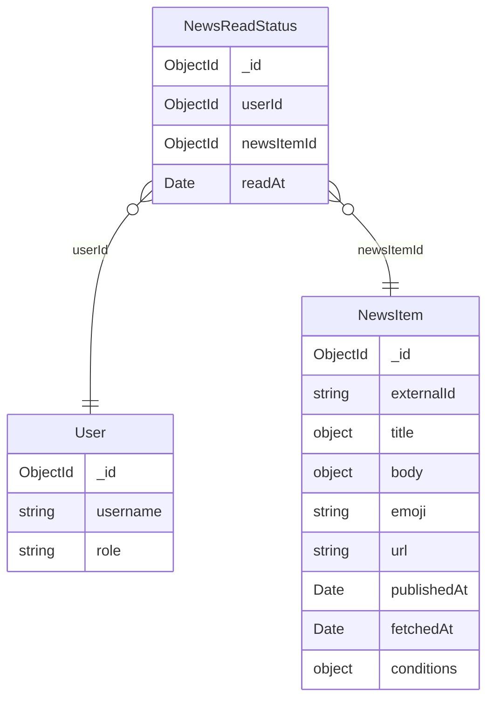

# Design Document: news-inappnotification

## Overview

本機能は GROWI インスタンスが外部の静的 JSON フィード（GitHub Pages）を定期取得し、ニュースとして InAppNotification パネルに表示する。既存の通知（InAppNotification）とニュース（NewsItem）は別モデルで管理し、UI のみクライアント側で時系列マージして統合表示する。

**Purpose**: GROWI 運営者が配信するニュース（リリース情報、セキュリティ通知、お知らせ等）を、ユーザーが既存の通知導線から確認できるようにする。

**Users**: すべての GROWI ログインユーザー。ロール（admin/general）により表示対象を制御できる。

**Impact**: InAppNotification サイドバーパネルに「すべて/通知/お知らせ」フィルタタブと無限スクロールを追加する。既存の「未読のみ」トグルは維持し、フィルタタブとの2重フィルタリングを提供する。

### Goals

- 外部フィード（`NEWS_FEED_URL`）を cron で定期取得し、MongoDB にキャッシュする
- InAppNotification パネルで通知とニュースを統合表示する
- ニュースの既読/未読状態をユーザー単位で管理する
- ロール別表示制御（admin/general）をサーバーサイドで強制する
- 多言語ニュース（`ja_JP`, `en_US` 等）をブラウザ言語に応じて表示する

### Non-Goals

- GROWI 管理者によるニュース作成・編集 UI（フィードリポジトリで管理）
- リアルタイムプッシュ通知（cron ポーリングのみ）
- `growiVersionRegExps` 以外の条件によるフィルタ（将来フェーズ）
- RSS/Atom フォーマットへの対応（将来フェーズ）

---

## Architecture

### Existing Architecture Analysis

InAppNotification は per-user ドキュメント設計であり、`user` フィールドが必須。通知発生時に全対象ユーザー分のドキュメントを生成する（push 型）。ニュースは全ユーザーで1件のドキュメントを共有し、ユーザーがパネルを開いたときに取得する（pull 型）。この設計上の差異により、ニュースは別モデルとして実装する（詳細は `research.md` の Design Decisions を参照）。

サイドバーパネルは `Sidebar/InAppNotification/InAppNotification.tsx` が `useState` でトグル state を管理し、`InAppNotificationSubstance.tsx` へ prop として渡すパターンを採用している。本機能のフィルタ state も同じパターンで実装する。

### Architecture Pattern & Boundary Map



**Architecture Integration**:
- 選択パターン: Pull 型 + クライアントサイドマージ
- 新規コンポーネント: `NewsCronService`, `NewsItem Model`, `NewsReadStatus Model`, `NewsService`, `News API`, `NewsItem Component`, `useSWRINFxNews`
- 既存コンポーネント拡張: `InAppNotification.tsx`（フィルタ state 追加）, `InAppNotificationSubstance.tsx`（フィルタタブ + InfiniteScroll）, `useSWRINFxInAppNotifications`（新設）, `PrimaryItemForNotification`（未読カウント合算）
- 既存 `InfiniteScroll.tsx` をそのまま再利用

### Technology Stack

| Layer | 選択 / バージョン | 役割 |
|---|---|---|
| Backend Cron | node-cron（既存） | フィード定期取得スケジューリング |
| Backend HTTP | node `fetch` / axios（既存） | `NEWS_FEED_URL` から feed.json 取得 |
| Data Store | MongoDB + Mongoose（既存） | NewsItem, NewsReadStatus の永続化 |
| Frontend Data | SWR `useSWRInfinite`（既存） | ニュース・通知の無限スクロール取得 |
| Frontend State | React `useState`（既存パターン） | フィルタタブ・未読トグルのローカル state |
| i18n | next-i18next / `commons.json`（既存） | UI ラベルの多言語化 |

---

## System Flows

### フィード取得フロー



### パネル表示フロー



### 既読フロー



---

## Requirements Traceability

| 要件 | Summary | コンポーネント | インターフェース | フロー |
|---|---|---|---|---|
| 1.1–1.7 | フィード定期取得 | NewsCronService | `executeJob()` | フィード取得フロー |
| 2.1–2.4 | NewsItem モデル | NewsItem Model | MongoDB schema | フィード取得フロー |
| 3.1–3.5 | 既読/未読管理 | NewsReadStatus Model, NewsService, News API | `POST /mark-read`, `GET /unread-count` | 既読フロー |
| 4.1–4.2 | ロール別表示制御 | NewsService | `listForUser(userRole)` | パネル表示フロー |
| 5.1–5.7 | UI 統合表示 | InAppNotification Panel, InAppNotificationSubstance | filter state props | パネル表示フロー |
| 6.1–6.4 | 視覚表示 | NewsItem Component | CSS classes（`fw-bold`, `bg-primary`） | — |
| 7.1–7.2 | 未読バッジ | PrimaryItemForNotification | `useSWRxNewsUnreadCount` | — |
| 8.1–8.4 | 多言語対応 | NewsItem Component, locales | locale fallback logic | — |

---

## Components and Interfaces

### サーバーサイド

| コンポーネント | 層 | Intent | 要件 | 主要依存 |
|---|---|---|---|---|
| NewsCronService | Server / Cron | フィード定期取得・DB 同期 | 1.1–1.7 | CronService (P0), NewsService (P0) |
| NewsItem Model | Server / Data | ニュースアイテムの永続化 | 2.1–2.4 | MongoDB (P0) |
| NewsReadStatus Model | Server / Data | ユーザー既読状態の永続化 | 3.1–3.3 | MongoDB (P0) |
| NewsService | Server / Domain | ニュース一覧・既読管理のビジネスロジック | 3.4–3.5, 4.1–4.2 | NewsItem Model (P0), NewsReadStatus Model (P0) |
| News API | Server / API | HTTP エンドポイント提供 | 3.1–3.5, 4.1–4.2 | NewsService (P0) |

---

#### NewsCronService

| Field | Detail |
|---|---|
| Intent | フィード URL から JSON を定期取得し NewsItem を upsert/delete する |
| Requirements | 1.1, 1.2, 1.3, 1.4, 1.5, 1.6, 1.7 |

**Responsibilities & Constraints**
- 毎日 AM 1:00 に実行（`'0 1 * * *'`）
- `NEWS_FEED_URL` 未設定時はスキップ（エラーなし）
- 取得失敗時は既存 DB データを維持
- `growiVersionRegExps` の照合はここで実施（DB には合致アイテムのみ保存）
- ランダムスリープ（0–5分）で複数インスタンスのリクエストを分散

**Dependencies**
- Inbound: node-cron — スケジュール実行（P0）
- Outbound: NewsService — upsert/delete（P0）
- External: `NEWS_FEED_URL` の HTTP エンドポイント — feed.json 取得（P0）

**Contracts**: Batch [x]

##### Batch / Job Contract
- Trigger: `node-cron` スケジュール `'0 1 * * *'`
- Input: `NEWS_FEED_URL` 環境変数、GROWI バージョン文字列
- Output: MongoDB の NewsItem コレクションを最新フィードと同期
- Idempotency: `externalId` ユニークインデックスにより冪等。再実行しても重複なし

##### Service Interface
```typescript
class NewsCronService extends CronService {
  getCronSchedule(): string;  // '0 1 * * *'
  executeJob(): Promise<void>;
}
```

**Implementation Notes**
- Integration: `server/service/cron.ts` の `CronService` を継承。`startCron()` をアプリ起動時に呼ぶ
- Validation: `NEWS_FEED_URL` の URL 検証は以下のルールで行う。`https://` で始まる URL は常に許可。`http://localhost` または `http://127.0.0.1` で始まる URL はローカル開発用として許可。それ以外の `http://` は拒否する。`growiVersionRegExps` は try-catch で個別評価し、不正 regex はスキップ
- Risks: フィード取得タイムアウト（10秒推奨）。外部依存のため失敗を前提に設計する

---

#### NewsItem Model

| Field | Detail |
|---|---|
| Intent | フィードから取得したニュースアイテムを全ユーザー共通で1件保持する |
| Requirements | 2.1, 2.2, 2.3, 2.4 |

**Contracts**: State [x]

##### State Management
```typescript
interface INewsItem {
  _id: Types.ObjectId;
  externalId: string;                    // unique index
  title: Record<string, string>;         // { ja_JP: string, en_US?: string, ... }
  body?: Record<string, string>;
  emoji?: string;
  url?: string;
  publishedAt: Date;                     // index
  fetchedAt: Date;                       // TTL index (90 days = 7776000s)
  conditions?: {
    targetRoles?: string[];              // ['admin'] | ['admin', 'general'] | undefined
  };
}
```

**Indexes**:
- `externalId`: unique index（重複排除）
- `publishedAt`: index（降順ソート）
- `fetchedAt`: TTL index（90日で自動削除）

---

#### NewsReadStatus Model

| Field | Detail |
|---|---|
| Intent | ユーザーが既読にした時のみドキュメントを作成。ドキュメント不在 = 未読 |
| Requirements | 3.1, 3.2, 3.3 |

**Contracts**: State [x]

##### State Management
```typescript
interface INewsReadStatus {
  _id: Types.ObjectId;
  userId: Types.ObjectId;              // compound unique index with newsItemId
  newsItemId: Types.ObjectId;         // compound unique index with userId
  readAt: Date;
}
```

**Indexes**:
- `{ userId, newsItemId }`: compound unique index（重複防止・冪等性保証）

---

#### NewsService

| Field | Detail |
|---|---|
| Intent | ニュース一覧取得・既読管理のビジネスロジックを担う |
| Requirements | 3.4, 3.5, 4.1, 4.2 |

**Contracts**: Service [x]

##### Service Interface
```typescript
interface INewsService {
  listForUser(
    userId: Types.ObjectId,
    userRoles: string[],
    options: { limit: number; offset: number; onlyUnread?: boolean }
  ): Promise<PaginateResult<INewsItemWithReadStatus>>;

  getUnreadCount(userId: Types.ObjectId, userRoles: string[]): Promise<number>;

  markRead(userId: Types.ObjectId, newsItemId: Types.ObjectId): Promise<void>;

  markAllRead(userId: Types.ObjectId, userRoles: string[]): Promise<void>;

  upsertNewsItems(items: INewsItemInput[]): Promise<void>;

  deleteNewsItemsByExternalIds(externalIds: string[]): Promise<void>;
}

interface INewsItemWithReadStatus extends INewsItem {
  isRead: boolean;
}
```

- Preconditions: `userId` は有効な ObjectId
- Postconditions: `listForUser` の結果は `publishedAt` 降順。各アイテムに `isRead` が付与される
- ロールフィルタ: `conditions.targetRoles` が未設定または `userRoles` に一致するアイテムのみ返す

---

#### News API

| Field | Detail |
|---|---|
| Intent | ニュース一覧取得・既読管理の HTTP エンドポイントを提供する |
| Requirements | 3.1, 3.4, 3.5, 4.1, 4.2 |

**Contracts**: API [x]

##### API Contract

| Method | Endpoint | Request | Response | Errors |
|---|---|---|---|---|
| GET | `/apiv3/news/list` | `?limit&offset&onlyUnread` | `PaginateResult<INewsItemWithReadStatus>` | 401 |
| GET | `/apiv3/news/unread-count` | — | `{ count: number }` | 401 |
| POST | `/apiv3/news/mark-read` | `{ newsItemId: string }` | `{ ok: true }` | 400, 401 |
| POST | `/apiv3/news/mark-all-read` | — | `{ ok: true }` | 401 |

全エンドポイントに `loginRequiredStrictly` と `accessTokenParser` を適用する。

**Implementation Notes**
- Integration: `apps/app/src/server/routes/apiv3/news.ts` に新規作成
- Validation: `newsItemId` は `mongoose.isValidObjectId()` で検証
- Risks: ロールフィルタはサーバーサイドで強制。クライアントから `targetRoles` を受け取らない

---

### クライアントサイド

| コンポーネント | 層 | Intent | 要件 | 主要依存 |
|---|---|---|---|---|
| useSWRINFxNews | Client / Hooks | ニュースアイテムの無限スクロール取得 | 5.4 | News API (P0) |
| useSWRxNewsUnreadCount | Client / Hooks | ニュース未読カウント取得 | 7.1 | News API (P0) |
| useSWRINFxInAppNotifications | Client / Hooks | 通知の無限スクロール取得（既存 hook を拡張） | 5.4 | InAppNotification API (P0) |
| InAppNotification.tsx（変更） | Client / UI | フィルタ state を追加管理 | 5.2, 5.3 | useState (P0) |
| InAppNotificationSubstance.tsx（変更） | Client / UI | フィルタタブ + InfiniteScroll | 5.1–5.5 | useSWRINFxNews (P0), InfiniteScroll (P0) |
| NewsItem Component | Client / UI | ニュースアイテム1件の表示 | 5.5, 5.6, 5.7, 6.1–6.4, 8.1–8.2 | — |
| PrimaryItemForNotification（変更） | Client / UI | 未読バッジに NewsItem の未読数を合算 | 7.1, 7.2 | useSWRxNewsUnreadCount (P0) |

---

#### useSWRINFxNews

| Field | Detail |
|---|---|
| Intent | ニュースアイテムの無限スクロールデータ取得 |
| Requirements | 5.4 |

**Contracts**: State [x]

##### State Management
```typescript
// stores/news.ts
export const useSWRINFxNews = (
  limit: number,
  options?: { onlyUnread?: boolean },
  config?: SWRConfiguration,
): SWRInfiniteResponse<PaginateResult<INewsItemWithReadStatus>, Error>;

export const useSWRxNewsUnreadCount = (): SWRResponse<number, Error>;
```

キー: `['/news/list', limit, pageIndex, options.onlyUnread]`

---

#### InAppNotification.tsx（変更）

| Field | Detail |
|---|---|
| Intent | フィルタタブ state を追加し、子コンポーネントへ伝播する |
| Requirements | 5.2, 5.3 |

**Implementation Notes**
- 既存 `isUnopendNotificationsVisible` state はそのまま維持
- `activeFilter: 'all' | 'news' | 'notifications'` を `useState('all')` で追加
- `InAppNotificationForms` と `InAppNotificationContent` へ prop を追加

```typescript
type FilterType = 'all' | 'news' | 'notifications';
```

---

#### InAppNotificationElm.tsx（既存・修正あり）

**実装後に判明した落とし穴**: 未読ドットに使われていた CSS クラス `grw-unopend-notification` はコードベースに定義が存在せず、ドットが不可視だった。`bg-primary rounded-circle` + インラインスタイル（`width/height: 8px, display: inline-block`）に置き換えて修正済み。このコンポーネントを今後変更する場合、同クラスを再導入しないこと。

---

#### InAppNotificationSubstance.tsx（変更）

| Field | Detail |
|---|---|
| Intent | フィルタタブ UI の追加と、InfiniteScroll を用いた統合リスト表示 |
| Requirements | 5.1, 5.2, 5.3, 5.4, 5.5 |

**Contracts**: State [x]

**InAppNotificationForms への追加**:
- フィルタボタン（「すべて」「通知」「お知らせ」）を Bootstrap `btn-group` で実装
- 既存「未読のみ」トグルは維持

**InAppNotificationContent の変更**:
- `activeFilter` に応じて3パターンに分岐
  - `'all'`: `useSWRINFxNews` + `useSWRINFxInAppNotifications` の両フックを呼び、現在ロード済みの全ページデータを `publishedAt/createdAt` 降順でマージして表示する。`InfiniteScroll.tsx` に渡すために **合成 `swrInifiniteResponse` オブジェクト**を生成する：`setSize` は終端に達していない方のストリームをインクリメント（両方未終端なら両方インクリメント）、`isValidating` はいずれかが true なら true、とする。両ストリームが終端に達したら `isReachingEnd = true` として `InfiniteScroll` に渡す
  - `'news'`: `useSWRINFxNews` のみ。`NewsList` に渡す
  - `'notifications'`: `useSWRINFxInAppNotifications` のみ。既存 `InAppNotificationList` に渡す
- 既存 `InfiniteScroll` コンポーネントを使用（`client/components/InfiniteScroll.tsx`）
- 既存 `// TODO: Infinite scroll implemented` コメントを解消

**サイドバーモード別スクロール戦略（実装後に判明した設計上の決定）**:

サイドバーには2種類のモードがあり、スクロール担当コンテナが異なる。

| モード | UI | スクロール担当 | コンテンツエリアの制約 |
|---|---|---|---|
| collapsed（ホバーパネル ①） | ベルアイコンにホバー時の小パネル | `InAppNotificationContent` 内の `overflow-auto` div | `maxHeight: 60vh` で高さを制限 |
| dock / drawer（全面サイドバー ②） | 展開した全面パネル | 外側の `SimpleBar`（`h-100`） | 制約なし。コンテンツが自然に伸長 |

collapsed モードで `overflow-auto + maxHeight` を使い、dock/drawer モードでは外していない場合、**二重スクロールコンテナ**が発生する。具体的には：
- `overflow-auto` div がサイドバーと同高の scroll context を作る
- スクロールバーがコンテンツ高さとほぼ同じ縦幅で出現し、わずかな余白でしか動かせなくなる（振動挙動）

対策として `InAppNotificationContent` 内で `useSidebarMode()` を呼び、`isCollapsedMode()` が true のときのみ `overflow-auto` クラスと `maxHeight: 60vh` を付与する。dock/drawer モードでは div に何も付与せず、SimpleBar にスクロールを委ねる。

**通知ドット即時消去のローカル state 戦略（実装後に判明した設計上の決定）**:

`InAppNotificationElm` はクリック時に `apiv3Post('/in-app-notification/open')` でサーバーへ書き込みを行うが、UI への反映は SWR の再フェッチに依存する。`InAppNotificationContent` 内で `useSWRInfinite` の `mutate(updater, { revalidate: false })` を使って楽観的更新を試みたが、ナビゲーション（`<a href>`）でコンポーネントがアンマウントされると `useSWRInfinite` のページ単位キャッシュが古い状態に戻り、再マウント時にドットが復活する問題があった。

対策として `InAppNotificationContent` に `useState<Set<string>>` を持ち、ユーザーがクリックした通知 ID をローカルに記録する。各 `InAppNotificationElm` のレンダリング時にこの set を参照し、ID が含まれる場合は `notification.status` を `STATUS_OPENED` にオーバーライドして渡す。これにより SWR キャッシュの状態によらず確実に即時反映される。

---

#### NewsItem Component

| Field | Detail |
|---|---|
| Intent | ニュースアイテム1件を表示する（emoji、タイトル、未読インジケータ） |
| Requirements | 5.5, 5.6, 5.7, 6.1, 6.2, 6.3, 6.4, 8.1, 8.2 |

**Implementation Notes**
- 配置: `features/news/client/components/NewsItem.tsx`
- **レイアウト**: 既存の `InAppNotificationElm` と同一カラム構成に揃える
  - 左端: 未読ドット（`bg-primary` 8px 丸）または同幅の透明スペーサー
  - アバター位置: `emoji` を表示（`UserPicture` が占める位置と同等）。未設定時は `📢` をフォールバック
  - コンテンツ列: タイトル（未読時 `fw-bold`、既読時 `fw-normal`）+ 公開日時
- ロケールフォールバック: `browserLocale → ja_JP → en_US → 最初に利用可能なキー`
- クリック時: `POST /mark-read` + SWR mutate + `url` があれば新タブで開く

---

## Data Models

### Domain Model



- NewsItem は全ユーザーで共有する集約ルート（per-instance、not per-user）
- NewsReadStatus は「ユーザーが既読にした」という事実のみを記録。削除によって「未読に戻す」ことも可能

### Physical Data Model

**NewsItem Collection** (`newsitems`):

```typescript
const NewsItemSchema = new Schema<INewsItem>({
  externalId: { type: String, required: true, unique: true },
  title: { type: Map, of: String, required: true },
  body: { type: Map, of: String },
  emoji: { type: String },
  url: { type: String },
  publishedAt: { type: Date, required: true, index: true },
  fetchedAt: { type: Date, required: true, index: { expires: '90d' } },
  conditions: {
    targetRoles: [{ type: String }],
  },
});
```

**NewsReadStatus Collection** (`newsreadstatuses`):

```typescript
const NewsReadStatusSchema = new Schema<INewsReadStatus>({
  userId: { type: Schema.Types.ObjectId, required: true, ref: 'User' },
  newsItemId: { type: Schema.Types.ObjectId, required: true, ref: 'NewsItem' },
  readAt: { type: Date, required: true, default: Date.now },
});
NewsReadStatusSchema.index({ userId: 1, newsItemId: 1 }, { unique: true });
```

### Data Contracts & Integration

**API レスポンス型**:

```typescript
interface INewsItemWithReadStatus {
  _id: string;
  externalId: string;
  title: Record<string, string>;
  body?: Record<string, string>;
  emoji?: string;
  url?: string;
  publishedAt: string;  // ISO 8601
  conditions?: { targetRoles?: string[] };
  isRead: boolean;
}

// PaginateResult<T> は ~/interfaces/in-app-notification の既存型を再利用する（再定義不要）
```

---

## Error Handling

### Error Strategy

フィード取得はフォールバック優先（失敗しても既存データを維持）。API エンドポイントは fail-fast（認証エラーは即時 401）。

### Error Categories and Responses

| カテゴリ | エラー | 対応 |
|---|---|---|
| Cron / External | フィード取得失敗（ネットワーク、タイムアウト） | `logger.error` + 既存 DB データ維持。次回 cron で再試行 |
| Cron / Config | `NEWS_FEED_URL` 未設定 | スキップ（ログなし）。設定されるまで無害に動作 |
| Cron / Validation | `growiVersionRegExps` に不正 regex | try-catch で該当アイテムをスキップ、`logger.warn` |
| API / Auth | 未認証リクエスト | 401（`loginRequiredStrictly` が処理） |
| API / Validation | 不正な `newsItemId` フォーマット | 400（`mongoose.isValidObjectId()` チェック） |
| API / Conflict | `mark-read` の重複呼び出し | upsert で冪等処理。エラーなし |

### Monitoring

- `NewsCronService.executeJob()` の成功/失敗を `logger.info` / `logger.error` で記録
- `mark-read` 件数を `logger.debug` で記録（デバッグ用）

---

## Testing Strategy

### Unit Tests

- `NewsCronService.executeJob()`: 正常取得 → upsert、取得失敗 → DB 変更なし、`NEWS_FEED_URL` 未設定 → スキップ
- `NewsCronService.executeJob()`: `growiVersionRegExps` 一致 → 保存、不一致 → 除外
- `NewsService.listForUser()`: `targetRoles` フィルタ（admin のみ、general 除外）
- `NewsService.listForUser()`: `onlyUnread=true` で未読のみ返す
- `NewsService.getUnreadCount()`: 未読件数の正確な計算

### Integration Tests

- `GET /apiv3/news/list`: ロール別フィルタが正しく動作する
- `POST /apiv3/news/mark-read`: 2回呼んでもエラーなし（冪等性）
- `POST /apiv3/news/mark-all-read` 後に `GET /apiv3/news/unread-count` が 0 を返す
- 未認証リクエストが 401 を返す

### Component Tests

- `NewsItem`: `emoji` 未設定時に 📢 が表示される
- `NewsItem`: `title` ロケールフォールバック（`browserLocale → ja_JP → en_US`）
- `NewsItem`: 未読時に `fw-bold` + 青ドット、既読時に `fw-normal` + スペーサー
- `InAppNotificationForms`: フィルタタブのクリックで `activeFilter` が変わる

---

## Security Considerations

- すべての `/apiv3/news/*` エンドポイントに `loginRequiredStrictly` を適用する
- `conditions.targetRoles` のフィルタリングはサーバーサイドの `NewsService.listForUser()` で強制する。クライアントから `targetRoles` パラメータを受け付けない
- `NEWS_FEED_URL` は `https://` で始まる URL は常に許可。`http://localhost` または `http://127.0.0.1` で始まる URL はローカル開発用として許可。それ以外の `http://` は拒否する
- フィードから取得したデータはそのまま DB に保存し、クライアントへのレスポンス時に Mongoose スキーマで型安全に扱う

## Performance & Scalability

- NewsItem は全ユーザーで1件共有のため、ユーザー数に比例してドキュメントが増えない
- `publishedAt` インデックスにより降順ソートが効率的
- `fetchedAt` TTL インデックス（90日）で古いデータを自動削除し、コレクションサイズを制限
- `NewsReadStatus` の compound unique index により `listForUser` の LEFT JOIN 相当クエリが効率的
