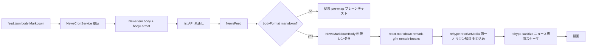

# Design Document: news-markdown-body

## Overview

**Purpose**: `/_news` のニュース本文をプレーンテキストから **Markdown 描画**へ変え、本文中の任意位置に書式・画像(GIF 含む)を配置できるようにする。

**Users**: 全ログインユーザーが `/_news` で書式付き・画像付きニュースを読む。GROWI 配信運営者は feed.json の body に Markdown を書くだけで全インスタンスに配信できる。

**Impact**: 既存 news 基盤(spec: `news-inappnotification`)への additive 拡張。描画層(NewsFeed の body 部)に**ニュース専用の制限レンダラ**を新設し、opt-in ゲートで従来のプレーンテキスト描画と切り替える。API・データモデルは additive、cron 取込・サイドバー・既存データは原則不変。

### Goals

- body の Markdown 描画(opt-in)と、本文中への複数画像(GIF 含む)埋め込み
- 外部フィード由来コンテンツを**最小権限で**描画する専用 sanitize(Wiki の許可範囲から隔離)
- 新規外部依存ゼロ・マイグレーション不要・前方/後方互換

### Non-Goals

- 動画(mp4 / `<video>`)— GIF で代替。将来の純追加とする
- サイドバー通知パネルの Markdown 描画(タイトルのみ維持)
- 配信リポジトリ(growi-news-feed)のスキーマ/CI/入稿(PrimaVista)整備
- GROWI 独自 Markdown 拡張(lsx / drawio / plantuml / mermaid 等)のニュースでの利用

## Boundary Commitments

### This Spec Owns

- ニュース専用の描画パス(option generator + 狭い sanitize スキーマ + body を描画に配線する UI)
- 本文 Markdown 中のメディア参照の**同一オリジン解決・封じ込め検証**と、失敗時のフォールバック
- opt-in ゲート(`bodyFormat`)のデータ形状と描画分岐

### Out of Boundary

- GROWI Wiki レンダラ本体、その sanitize 許可範囲(`recommended-whitelist.ts`)— **流用も改変もしない**
- cron のフェッチ/配信トグル/バージョン判定など既存取込ロジック(body の受け渡し以外は不変)
- 配信側の Markdown 入稿・画像配置(別リポジトリ)

### Allowed Dependencies

- 既存の描画機構: `react-markdown` v9 / `RevisionRenderer`(単体再利用可)/ `remark-gfm` / `remark-breaks` / `rehype-sanitize` / `hast-util-sanitize`(いずれも導入済み。**新規 npm 依存を追加しない**)
- 既存 news feature モジュール(`feed-parser` / `news-cron-service` / interfaces / `NewsFeed.tsx`)への編集
- `FEED_URL` 定数(`news-cron-service.ts`。解決処理のため export 化して共有)

### Revalidation Triggers

- ニュース sanitize スキーマの許可範囲変更(セキュリティ契約の変更)
- `bodyFormat` の値・意味の変更
- `FEED_URL` の移転(封じ込め基準オリジンが変わる)
- 動画対応の追加(`<video>` 解禁は本設計の「生 HTML 不可」前提を変える)

## Architecture

### Existing Architecture Analysis(gap 分析より)

- `NewsFeed.tsx` は現状 body を `whiteSpace: pre-wrap` のプレーンテキストで描画。Markdown parse は皆無
- Wiki レンダラ(`services/renderer` + client `renderer.tsx` + `RevisionRenderer`)は機構としては再利用可能だが、option generator が `pagePath`/`RendererConfig` に結合し、sanitize 許可範囲が広い(`iframe`/`video` 許可 + `rehype-raw` で生 HTML 通過)。**外部フィードにこの許可範囲は過剰**
- Markdown/sanitize ライブラリは全て導入済み。**最小サブセットレンダラは存在しない**ため新設する
- `resolve-image-url`(同一オリジン封じ込め)はこの branch に無い(PR #11512 のものは feat/news-images に保全)。cherry-pick + gif 追加で再利用

### Architecture Pattern & Boundary Map

ハイブリッド: **機構は Wiki と同じ react-markdown/rehype を再利用(Extend)、許可範囲・プラグイン集合・メディア解決は新規(New)**。



### 依存方向

```
consts(FEED_URL) → resolve-news-media-url(純関数)
                 → rehype-resolve-news-media(rehype プラグイン)
news-sanitize-schema(定数)   → news-markdown-options(option generator)
news-markdown-options + RevisionRenderer → NewsMarkdownBody(UI)
NewsMarkdownBody ← NewsFeed(bodyFormat で分岐)
feed-parser(zod: bodyFormat 追加) → news-cron-service → NewsItem model
```

各要素は左からのみ import する。`resolve-news-media-url` は base URL を引数で受け取る純関数(テスト容易 / FEED_URL に直接依存しない)。

### Technology Stack

| Layer | Choice | Role | Notes |
|-------|--------|------|-------|
| Markdown parse | react-markdown v9 + remark-gfm + remark-breaks(既存) | body を Markdown 描画 | 新規依存なし。**rehype-raw は使わない**(生 HTML を parse しない) |
| Sanitize | rehype-sanitize + hast-util-sanitize(既存) | ニュース専用の狭い許可スキーマ | Wiki の `recommended-whitelist` は流用しない |
| メディア解決 | 標準 `URL` + rehype プラグイン(新規・軽量) | 相対 img を絶対 URL 化 + 同一オリジン封じ込め | ESM 安全 |
| UI | React(NewsFeed に配線) | opt-in 分岐 + NewsMarkdownBody | client 描画(NewsFeed は SWR 駆動) |

## File Structure Plan

### New Files

```
apps/app/src/features/news/client/components/
├── NewsMarkdownBody.tsx            # 制限レンダラ本体(RevisionRenderer 相当 + news options)
└── NewsMarkdownBody.spec.tsx
apps/app/src/features/news/client/services/
├── news-markdown-options.ts        # react-markdown option generator(remark/rehype 構成 + sanitize schema 適用)
├── news-sanitize-schema.ts         # ニュース専用の hast-util-sanitize スキーマ(許可タグ/属性)
├── news-sanitize-schema.spec.ts
├── rehype-resolve-news-media.ts    # rehype プラグイン: img src を解決+封じ込め検証、不適合はノード除去
└── rehype-resolve-news-media.spec.ts
apps/app/src/features/news/server/services/            # ※クライアント共有の解決純関数
└── resolve-news-media-url.ts + .spec.ts   # PR #11512 の resolve-image-url を gif 対応で再導入(純関数)
```

> `resolve-news-media-url` は client/server 双方から使える純関数として配置(現状 client 描画だが、取込時検証にも将来転用可能な形)。

### Modified Files

- `apps/app/src/features/news/client/components/NewsFeed.tsx` — body 描画を「bodyFormat=markdown なら NewsMarkdownBody、それ以外は従来 pre-wrap」に分岐
- `apps/app/src/features/news/interfaces/news-item.ts` — `INewsItem` / `INewsItemInput` に `bodyFormat?: 'markdown'` を追加
- `apps/app/src/features/news/server/services/feed-parser.ts` — zod に `bodyFormat: z.literal('markdown').optional()` を追加
- `apps/app/src/features/news/server/models/news-item.ts` — `bodyFormat` フィールド追加(enum: 'markdown'、任意)
- `apps/app/src/features/news/server/services/news-cron-service.ts` — `bodyFormat` を INewsItemInput へ写経(body は従来どおり verbatim)、`FEED_URL` を export
- `apps/app/src/features/news/client/consts.ts` — 描画側でも参照する feed オリジン定数の集約(必要なら)

## Requirements Traceability

| Req | 要点 | Components |
|-----|------|-----------|
| 1.1–1.4 | Markdown 描画・opt-in・複数画像 | NewsFeed(分岐), NewsMarkdownBody, news-markdown-options |
| 2.1,2.2,2.5 | 許可範囲限定・生 HTML 不可・Wiki 非流用 | news-sanitize-schema(rehype-raw 不使用) |
| 2.3,2.4 | 非 http(s) リンク無効化・外部リンク rel | news-sanitize-schema(protocols) + a コンポーネント |
| 3.1–3.3 | 相対→絶対解決・https/同一オリジン封じ込め・拡張子(gif 含む) | resolve-news-media-url, rehype-resolve-news-media |
| 3.4 | lazy / no-referrer / 高さ上限 | NewsMarkdownBody の img コンポーネント |
| 4.1 | 検証失敗で該当画像除去・本文維持 | rehype-resolve-news-media(ノード除去) |
| 4.2 | 取得失敗で該当画像のみ非表示 | img コンポーネント onError |
| 4.3 | 描画時 http(s) 再検証 | news-sanitize-schema(protocols) + img コンポーネント |
| 5.1–5.4 | 互換・独立・サイドバー不変 | bodyFormat ゲート(additive)、NewsFeed のみ変更 |

## Components and Interfaces

| Component | Layer | Intent | Req | Contracts |
|-----------|-------|--------|-----|-----------|
| resolveNewsMediaUrl | Service(純関数) | 相対パス→検証済み絶対 URL(失敗 null) | 3.1–3.3 | Service |
| rehypeResolveNewsMedia | Client/rehype | hast の img src を解決+封じ込め、不適合ノード除去 | 3.1–3.3, 4.1 | — |
| newsSanitizeSchema | Client(定数) | ニュース専用の許可タグ/属性/プロトコル | 2.1–2.5, 4.3 | — |
| newsMarkdownOptions | Client/services | react-markdown 構成(remark/rehype/sanitize/components) | 1.1,1.3, 2.*, 3.4 | — |
| NewsMarkdownBody | Client/UI | body を制限レンダラで描画 | 1.1,1.3,1.4 | State |
| NewsFeed(変更) | Client/UI | bodyFormat で描画分岐 | 1.1,1.2, 5.1 | — |
| bodyFormat(model/interface/zod) | Server | opt-in ゲートのデータ形状 | 1.1, 5.1–5.3 | State |

#### newsSanitizeSchema(セキュリティの中核)

hast-util-sanitize 用スキーマ。**Wiki の `recommended-whitelist` を継承せず、明示ゼロベースで最小許可**:

- 許可タグ: `p, br, strong, em, del, a, code, pre, blockquote, ul, ol, li, h2, h3, h4, hr, img`(見出しは `h1` を避け h2–h4。表・raw HTML・`iframe`/`video`/`script`/`style` は**非許可**)
- 許可属性: `a: [href, title]`、`img: [src, alt, title]`、`code: [className(言語のみ)]`。`style` 属性・`on*` イベントハンドラ・任意 `class` は不許可
- protocols: `a[href]` = http/https/mailto、`img[src]` = https のみ
- rehype-raw を**パイプラインに含めない**ため、body 中の生 HTML(`<video>` 等)はそもそも parse されず、テキストとしても除去/エスケープされる(Req 2.2 を構造的に担保)

#### resolveNewsMediaUrl(純関数、再導入)

```typescript
// (imagePath, feedUrl) => 検証済み絶対 URL | null
export const resolveNewsMediaUrl = (imagePath: string, feedUrl: string): string | null;
```
- https のみ / credentials・query・hash 拒否 / 同一オリジン / feed の images ディレクトリ配下(末尾スラッシュ prefix)/ 拡張子 png・jpe?g・webp・**gif** / `%` 含みパス拒否。例外を投げず不正は null(PR #11512 の実装 + テストを gif 対応で移植)

#### KEY DECISION: メディア解決は「描画時」(案II)を採用

gap で挙げた案I(取込時)/案II(描画時)のうち **案II(rehype プラグインで描画時に解決+検証)** を採る。

- 理由: (a) body を verbatim 保存でき、取込時の Markdown parse/serialize による本文変形リスクを回避、(b) 解決ロジックを描画パイプラインに一元化し SSR/クライアントで同一適用、(c) 画像バイトはそもそもサーバに触れない(hotlink)ため「取込時ゲート」の価値が小さく、描画時の resolve プラグイン + sanitize の**二段ゲート**で十分
- 二段構え: `rehypeResolveNewsMedia`(オリジン+パス封じ込め、不適合ノード除去)→ `rehype-sanitize`(タグ/プロトコル許可)。前者が漏らしても後者が protocols で止める
- FEED_URL は定数 export し、描画側(クライアント)からも参照する

#### opt-in ゲート(`bodyFormat`)

- `INewsItem.bodyFormat?: 'markdown'`(アイテム単位。ロケール別ではない)。未指定=従来のプレーンテキスト描画
- feed-parser: `bodyFormat: z.literal('markdown').optional()`。旧アプリは未知フィールドを無視 → 生テキスト描画(前方互換、Req 5.3)
- NewsFeed: `item.bodyFormat === 'markdown'` のとき NewsMarkdownBody、else 従来 pre-wrap(Req 1.2, 5.1)

## Data Models

`NewsItem` に additive:
- `bodyFormat`: `{ type: String, enum: ['markdown'], required: false }`(未指定 = プレーンテキスト)
- `body` は現状のまま `Map<locale,string>`(Markdown 文字列を格納)。**スキーマ変更・マイグレーション不要**(Req 5.2)

## Error Handling

| 段階 | 失敗 | 応答 |
|------|------|------|
| 描画(解決) | img src が非 https/オリジン外/封じ込め外 | `rehypeResolveNewsMedia` が当該ノードを除去、本文の残りは描画(Req 4.1) |
| 描画(sanitize) | 許可外タグ/属性/プロトコル | rehype-sanitize が除去(Req 2.1–2.4, 4.3) |
| 描画(取得) | 画像 URL は妥当だが取得失敗 | img `onError` で当該画像のみ非表示(Req 4.2) |
| parse | 不正な Markdown | react-markdown は寛容 parse(壊れない)。ErrorBoundary で最悪時もページ全体は保つ |

## Testing Strategy

### Unit(純関数・スキーマ)

- `resolve-news-media-url.spec`: PR #11512 の境界マトリクス(29ケース)+ gif 受理・mp4 拒否・非同一オリジン拒否
- `news-sanitize-schema.spec`: 許可タグが残る / `iframe`・`video`・`script`・`style`・`on*` が除去される / `javascript:` リンク無効化 / img src の https 強制

### Component(NewsMarkdownBody / NewsFeed)

- Markdown(見出し・リスト・強調・リンク・複数画像)が要素として描画される
- `bodyFormat` 未指定で従来のプレーンテキスト描画になる(Req 1.2 / 5.1)
- 生 HTML(`<video>`, `<script>`)が本文にあっても実行・描画されない(Req 2.2)
- 同一オリジン外/非 https の img が描画されない(Req 3.2 / 4.3)、取得失敗で当該 img のみ消える(Req 4.2)
- 外部リンクが `target=_blank rel=noopener noreferrer`(Req 2.4)

### 敵対的テスト(セキュリティ)

- XSS ベクタ(``, `javascript:` href, `<iframe>`, data: src, HTML コメント内スクリプト等)が全て無害化されること

## Security Considerations

**なぜ Wiki レンダラを流用せず専用の制限レンダラにするか**(requirements Req 2.5 の根拠):

1. **影響範囲(最重要)**: ニュース body は外部配信元(growilabs)由来で**全インスタンスに一斉配信**される。Wiki コンテンツは各インスタンス自身の信頼済みユーザーが書くもので信頼境界が異なる。1つの不正フィードが全顧客に波及しうるため、外部入力として厳格に扱う
2. **最小権限**: ニュースに必要なのは基本書式 + 同一オリジン画像だけ。Wiki の許可範囲は `iframe`/`video`/生 HTML(`rehype-raw`)まで許し、外部由来コンテンツには過剰。余分な許可は攻撃面でしかない(例: `iframe` は任意外部サイトの埋め込み=トラッキング/クリックジャッキング/不適切表示を全顧客に持ち込みうる)
3. **Wiki 許可範囲からの隔離**: Wiki 側が将来自分たちの都合で許可範囲を広げても、共用していればニュースの許可範囲も黙って広がる。専用スキーマなら Wiki の変更から独立して最小を維持できる

**多層防御**: ①`rehype-raw` を含めない(生 HTML を parse しない)→ ②`rehypeResolveNewsMedia`(メディアを同一オリジン+封じ込めに限定)→ ③`rehype-sanitize`(タグ/属性/プロトコルの許可)。いずれか一層が漏らしても次で止まる。

**技術は再利用・設定は隔離**: react-markdown/rehype の**機構**は Wiki と共通のものを使う(実績・保守性)。隔離するのは寛容な**設定(スキーマ+プラグイン集合)**のみ。「一から別レンダラを書く」わけではない。

## design → tasks へ持ち越す確認

- news-sanitize-schema の最終的な許可タグ/属性の確定(上記は初期案)
- `resolve-news-media-url` の feat/news-images からの取り込み手順(cherry-pick or 手移植)
- /_news が完全 client 描画である前提の最終確認(SSR 経路が無いこと)
