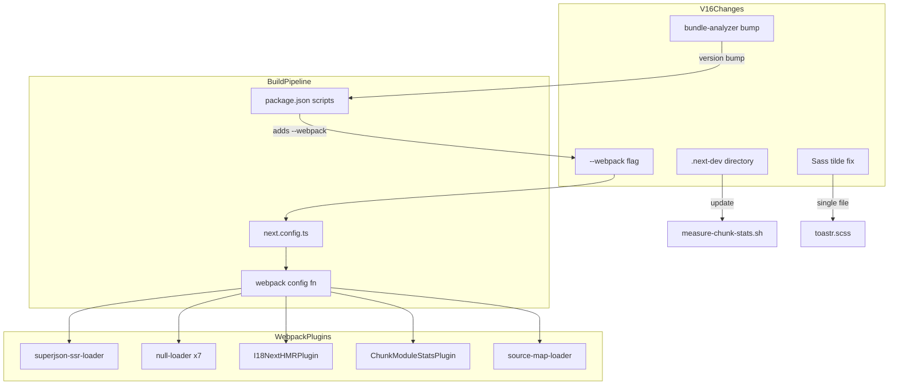
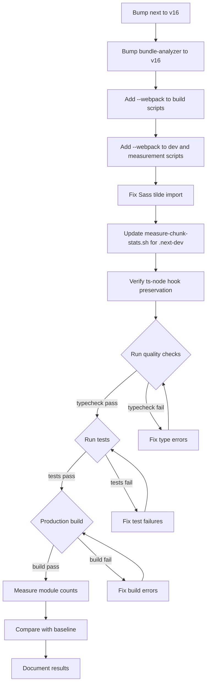

# Design Document: Next.js v16 Upgrade

## Overview

**Purpose**: This feature upgrades the GROWI main application from Next.js 15.5.12 to Next.js 16, preserving all custom webpack configurations and module reduction achievements from the `reduce-modules-loaded` feature.

**Users**: GROWI developers benefit from continued framework support, security patches, and a clear path to Turbopack adoption. End users experience no visible changes.

**Impact**: Changes the build toolchain configuration while maintaining identical runtime behavior. The `--webpack` flag opts out of Turbopack as the default bundler, preserving all 5 custom loaders/plugins and 7 null-loader rules.

### Goals
- Upgrade Next.js from v15 to v16 with zero functional regression
- Preserve all module reduction achievements (895 initial modules, 67% reduction)
- Update build scripts for v16 Turbopack-default behavior
- Prepare codebase for future Turbopack migration (Sass tilde fix)

### Non-Goals
- Turbopack migration (separate initiative — requires null-loader rewrites, custom loader testing)
- React 19 upgrade (no benefit for Pages Router; separate initiative)
- App Router migration
- Performance optimization beyond maintaining current metrics

## Architecture

### Existing Architecture Analysis

GROWI uses a custom Express server that programmatically initializes Next.js via `next({ dev })`. The build pipeline consists of:

- **Client build**: `next build` (webpack, Pages Router)
- **Server build**: `tspc` (TypeScript Project Compiler, separate from Next.js)
- **Dev mode**: Express server starts Next.js dev server internally

Custom webpack configuration (established in `reduce-modules-loaded`):
1. **superjson-ssr-loader**: Auto-wraps `getServerSideProps` with SuperJSON serialization
2. **null-loader rules** (7): Exclude server-only packages from client bundle
3. **I18NextHMRPlugin**: i18n hot module replacement in dev mode
4. **ChunkModuleStatsPlugin**: Module count analysis in dev mode
5. **source-map-loader**: Source map extraction in dev builds
6. **resolve.fallback**: `{ fs: false }` for client-side

### Architecture Pattern & Boundary Map

**Architecture Integration**:
- Selected pattern: In-place upgrade with webpack opt-out (see `research.md` Decision: Webpack-Only Upgrade Strategy)
- Domain boundaries: Build configuration only — no runtime logic changes
- Existing patterns preserved: Phase-based config, custom webpack function, all loaders/plugins
- New components: None
- Steering compliance: Maintains existing monorepo build patterns

### Technology Stack

| Layer | Choice / Version | Role in Feature | Notes |
|-------|------------------|-----------------|-------|
| Framework | Next.js ^16.0.0 | Core upgrade target | From ^15.0.0 |
| Bundler | webpack (via `--webpack`) | Client build | Turbopack opt-out |
| Runtime | React ^18.2.0 | No change | Pages Router supports React 18 in v16 |
| Analysis | @next/bundle-analyzer ^16.0.0 | Bundle analysis | Version bump from ^15.0.0 |
| Node.js | ^24 | No change | Exceeds v16 minimum (20.9+) |
| TypeScript | ~5.0.0 | No change | Exceeds v16 minimum (5.1+) |

## System Flows

### Upgrade Execution Flow

## Requirements Traceability

| Requirement | Summary | Components | Interfaces | Flows |
|-------------|---------|------------|------------|-------|
| 1.1 | Upgrade next dependency | PackageUpgrade | — | Upgrade step A |
| 1.2 | --webpack flag for build | BuildScriptUpdate | — | Upgrade step C |
| 1.3 | --webpack flag for dev | BuildScriptUpdate | — | Upgrade step D |
| 1.4 | Type compatibility | PackageUpgrade | — | Upgrade step H |
| 1.5 | Quality checks pass | RegressionValidation | — | Upgrade steps H-K |
| 2.1 | null-loader preservation | WebpackConfigPreservation | — | — |
| 2.2 | superjson-ssr-loader preservation | WebpackConfigPreservation | — | — |
| 2.3 | I18NextHMRPlugin preservation | WebpackConfigPreservation | — | — |
| 2.4 | ChunkModuleStatsPlugin preservation | WebpackConfigPreservation | — | — |
| 2.5 | source-map-loader preservation | WebpackConfigPreservation | — | — |
| 2.6 | Module count baseline | MetricsValidation | ChunkModuleStats output | Upgrade step M |
| 3.1 | build:client script update | BuildScriptUpdate | — | Upgrade step C |
| 3.2 | dev script update | BuildScriptUpdate | — | Upgrade step D |
| 3.3 | measure-chunk-stats.sh update | MeasurementToolUpdate | — | Upgrade step F |
| 3.4 | Root commands functional | RegressionValidation | — | Upgrade step K |
| 4.1 | Sass without tilde prefix | SassTildeFixup | — | Upgrade step E |
| 4.2 | toastr.scss fix | SassTildeFixup | — | Upgrade step E |
| 4.3 | No other tilde imports | SassTildeFixup | — | Upgrade step E |
| 4.4 | Identical rendering | RegressionValidation | — | Upgrade step K |
| 5.1 | bundlePagesRouterDependencies works | NextConfigValidation | — | Upgrade step K |
| 5.2 | optimizePackageImports works | NextConfigValidation | — | Upgrade step K |
| 5.3 | transpilePackages works | NextConfigValidation | — | Upgrade step K |
| 5.4 | New v16 options evaluation | NextConfigValidation | — | — |
| 5.5 | Deprecated options updated | NextConfigValidation | — | — |
| 6.1 | ts-node hook preservation | TsNodeHookPreservation | — | Upgrade step G |
| 6.2 | v16 transpiler behavior check | TsNodeHookPreservation | — | Upgrade step G |
| 6.3 | Dev mode TypeScript loading | TsNodeHookPreservation | — | Upgrade step G |
| 7.1 | Unit tests pass | RegressionValidation | — | Upgrade step I |
| 7.2 | TypeScript typecheck passes | RegressionValidation | — | Upgrade step H |
| 7.3 | Biome lint passes | RegressionValidation | — | Upgrade step H |
| 7.4 | Production build succeeds | RegressionValidation | — | Upgrade step K |
| 7.5 | SuperJSON round-trip works | RegressionValidation | — | Upgrade step I |
| 7.6 | Catch-all page compiles | RegressionValidation | — | Upgrade step M |
| 7.7 | Before/after metrics documented | MetricsValidation | — | Upgrade steps M-P |

## Components and Interfaces

| Component | Domain/Layer | Intent | Req Coverage | Key Dependencies | Contracts |
|-----------|-------------|--------|--------------|-----------------|-----------|
| PackageUpgrade | Build | Bump next and bundle-analyzer versions | 1.1, 1.4 | package.json (P0) | — |
| BuildScriptUpdate | Build | Add --webpack flag to scripts | 1.2, 1.3, 3.1, 3.2, 3.4 | package.json (P0) | — |
| MeasurementToolUpdate | Tooling | Update shell script for v16 | 3.3 | measure-chunk-stats.sh (P0) | — |
| SassTildeFixup | Styles | Remove node_modules tilde prefix | 4.1, 4.2, 4.3, 4.4 | toastr.scss (P0) | — |
| WebpackConfigPreservation | Build | Verify webpack config unchanged | 2.1–2.5 | next.config.ts (P0) | — |
| NextConfigValidation | Build | Verify v16 config compatibility | 5.1–5.5 | next.config.ts (P0) | — |
| TsNodeHookPreservation | Server | Verify ts-node hook survives v16 | 6.1–6.3 | crowi/index.ts (P0) | — |
| MetricsValidation | Tooling | Measure and compare module counts | 2.6, 7.7 | ChunkModuleStatsPlugin (P0) | — |
| RegressionValidation | QA | Full quality check suite | 1.5, 7.1–7.6 | turbo CLI (P0) | — |

### Build Layer

#### PackageUpgrade

| Field | Detail |
|-------|--------|
| Intent | Bump `next` and `@next/bundle-analyzer` to v16 in `apps/app/package.json` |
| Requirements | 1.1, 1.4 |

**Responsibilities & Constraints**
- Update `next` from `^15.0.0` to `^16.0.0`
- Update `@next/bundle-analyzer` from `^15.0.0` to `^16.0.0`
- Verify `@types/react` and `@types/react-dom` remain compatible (React 18 types work with v16)
- Run `pnpm install` to resolve dependency tree

**Dependencies**
- External: next@^16.0.0 — core framework (P0)
- External: @next/bundle-analyzer@^16.0.0 — analysis tool (P1)

**Implementation Notes**
- React stays at ^18.2.0 — v16 peer dependency range includes `^18.2.0`
- `babel-plugin-superjson-next` stays as-is — not used by custom loader approach
- The `next-i18next` package compatibility should be verified against Next.js 16

#### BuildScriptUpdate

| Field | Detail |
|-------|--------|
| Intent | Add `--webpack` flag to client build and dev scripts |
| Requirements | 1.2, 1.3, 3.1, 3.2, 3.4 |

**Responsibilities & Constraints**
- Update `build:client` script: `next build` → `next build --webpack`
- The `dev` script runs the Express server (not `next dev` directly), so `--webpack` cannot be added to the npm script
- The Express server calls `next({ dev })` programmatically — webpack usage is determined by the absence of Turbopack config, not a CLI flag
- Verify root-level commands: `pnpm run app:build`, `turbo run build`

**Implementation Notes**
- Integration: The `next({ dev })` API may need investigation to determine if v16 defaults to Turbopack when called programmatically. If so, a config option may be needed.
- Risk: Programmatic `next()` call may behave differently from CLI `next dev --webpack`. Must test thoroughly.

#### MeasurementToolUpdate

| Field | Detail |
|-------|--------|
| Intent | Update `bin/measure-chunk-stats.sh` for v16 directory changes and webpack flag |
| Requirements | 3.3 |

**Responsibilities & Constraints**
- Update line 27: `rm -rf .next` → `rm -rf .next/dev` (or both `.next` and `.next/dev`)
- Update line 31: `npx next dev` → `npx next dev --webpack`
- Verify log output path still works with `.next/dev` directory

**Dependencies**
- Inbound: ChunkModuleStatsPlugin — provides log output (P0)

### Styles Layer

#### SassTildeFixup

| Field | Detail |
|-------|--------|
| Intent | Remove Sass tilde prefix from node_modules imports |
| Requirements | 4.1, 4.2, 4.3, 4.4 |

**Responsibilities & Constraints**
- Change `@import '~react-toastify/scss/main'` → `@import 'react-toastify/scss/main'` in `src/styles/molecules/toastr.scss`
- The `~/...` pattern (path alias) used throughout other SCSS files is NOT the node_modules tilde prefix and requires no changes
- Verify style compilation produces identical output

**Implementation Notes**
- Scope is minimal: only 1 file affected
- webpack Sass resolution already supports non-tilde imports for node_modules

### Server Layer

#### TsNodeHookPreservation

| Field | Detail |
|-------|--------|
| Intent | Verify the ts-node `.ts` extension hook survives Next.js v16 initialization |
| Requirements | 6.1, 6.2, 6.3 |

**Responsibilities & Constraints**
- Existing defensive pattern in `src/server/crowi/index.ts` (lines 557-566) saves and restores `require.extensions['.ts']`
- v16 may change its config transpiler behavior — the save/restore pattern handles this generically
- Must verify by starting dev server and confirming TypeScript files load correctly

**Dependencies**
- External: ts-node — TypeScript execution (P0)
- Inbound: Next.js config transpiler — may deregister hooks (P0)

**Implementation Notes**
- The comment already references "Next.js 15's next.config.ts transpiler" — update comment to note v16 if behavior changes
- If v16 no longer deregisters the hook, the defensive code becomes a no-op (safe to keep)

## Error Handling

### Error Strategy

| Error Type | Scenario | Response |
|------------|----------|----------|
| Build failure | `next build` fails without `--webpack` | Hard error from Next.js — add `--webpack` flag |
| Type errors | New v16 types break existing code | Fix type annotations, check `@types/react` compatibility |
| Module count regression | Initial modules exceed 940 (895 + 5%) | Investigate webpack config changes, check null-loader rules |
| ts-node hook loss | Next.js v16 removes `.ts` extension hook | Existing save/restore pattern handles this |
| Dev server failure | `.next/dev` directory causes issues | Fall back to `isolatedDevBuild: false` |

## Testing Strategy

### Unit Tests
- Run existing superjson-ssr.spec.ts (10 tests) — verifies serialization round-trip
- Run existing mongo-id.spec.ts (8 tests) — verifies client utility
- Run existing locale-utils.spec.ts (18 tests) — verifies date-fns imports
- Run existing HotkeysManager.spec.tsx (3 tests) — verifies tinykeys integration
- Run existing PageContentRenderer.spec.tsx (3 tests) — verifies dynamic import

### Integration Tests
- Full test suite: `turbo run test --filter @growi/app` (1,375+ tests, 127+ files)
- TypeScript check: `turbo run lint:typecheck --filter @growi/app`
- Biome lint: `turbo run lint:biome --filter @growi/app`

### Build Tests
- Production build: `turbo run build --filter @growi/app`
- Bundle analysis: `ANALYZE=1 next build --webpack` (verify analyzer works)

### Manual Verification
- Start dev server, compile `[[...path]]`, record ChunkModuleStats output
- Compare initial/async-only/total module counts with baseline (895/4,775/5,670)
- Verify page renders correctly in browser

## Performance & Scalability

### Target Metrics

| Metric | Baseline (v15) | Target (v16) | Tolerance |
|--------|---------------|--------------|-----------|
| Initial modules | 895 | 895 | ±5% (850–940) |
| Async-only modules | 4,775 | 4,775 | ±10% |
| Total modules | 5,670 | 5,670 | ±10% |
| Compilation time | ~30s | ~30s | ±20% |

### Measurement Approach
- Use `bin/measure-chunk-stats.sh` (after v16 updates) for standardized measurement
- Record before/after in `analysis-ledger.md` or commit message
