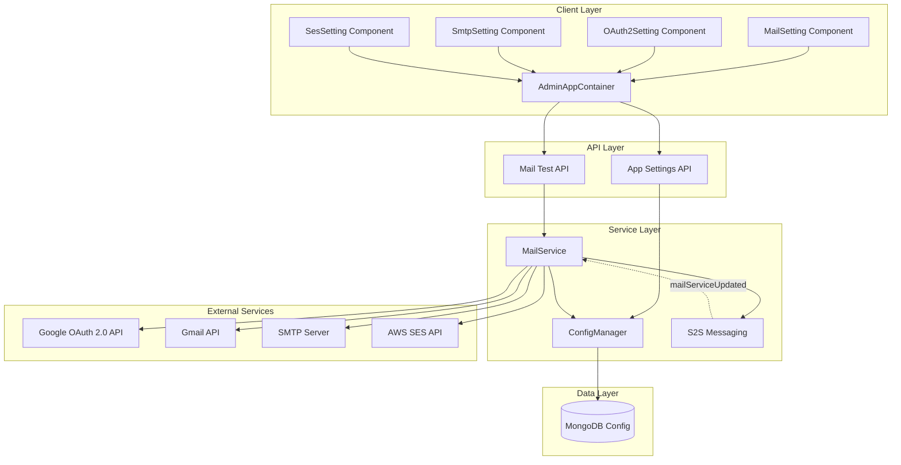
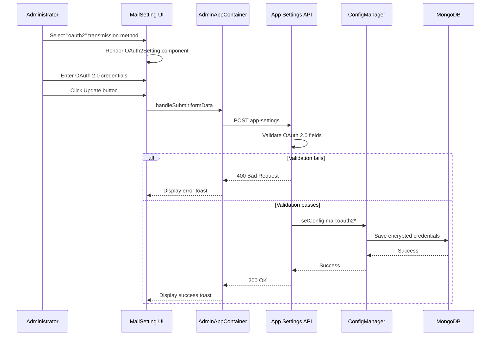
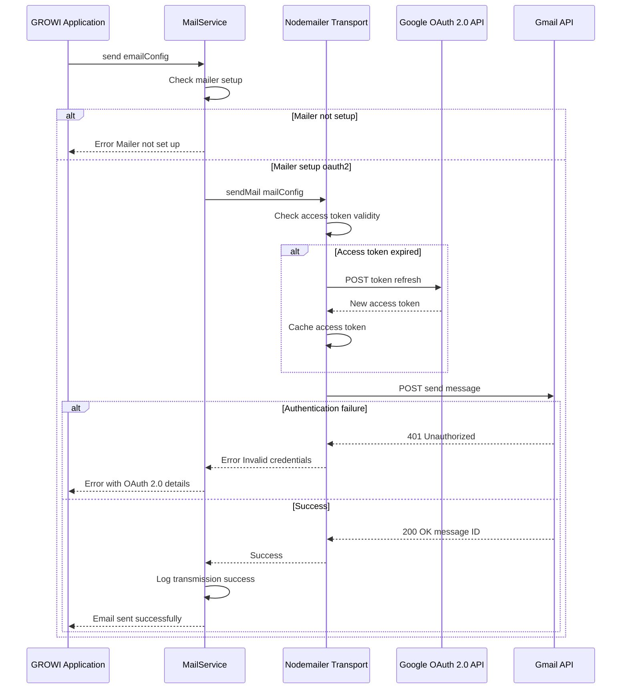

# OAuth 2.0 Email Support - Technical Design

## Overview

This feature adds OAuth 2.0 authentication support for sending emails through Google Workspace accounts in GROWI. Administrators can configure email transmission using OAuth 2.0 credentials (Client ID, Client Secret, Refresh Token) instead of traditional SMTP passwords. This integration extends the existing mail service architecture while maintaining full backward compatibility with SMTP and SES configurations.

**Purpose**: Enable secure, token-based email authentication for Google Workspace accounts, improving security by eliminating password-based SMTP authentication and following Google's recommended practices for application email integration.

**Users**: GROWI administrators configuring email transmission settings will use the new OAuth 2.0 option alongside existing SMTP and SES methods.

**Impact**: Extends the mail service to support a third transmission method (oauth2) without modifying existing SMTP or SES functionality. No breaking changes to existing deployments.

### Goals

- Add OAuth 2.0 as a transmission method option in mail settings
- Support Google Workspace email sending via Gmail API with OAuth 2.0 credentials
- Maintain backward compatibility with existing SMTP and SES configurations
- Provide consistent admin UI experience following SMTP/SES patterns
- Implement automatic OAuth 2.0 token refresh using nodemailer's built-in support
- Ensure secure storage and handling of OAuth 2.0 credentials

### Non-Goals

- OAuth 2.0 providers beyond Google Workspace (Microsoft 365, generic OAuth 2.0 servers)
- Migration tool from SMTP to OAuth 2.0 (administrators manually reconfigure)
- Authorization flow UI for obtaining refresh tokens (documented external process via Google Cloud Console)
- Multi-account or account rotation support (single OAuth 2.0 account per instance)
- Email queuing or rate limiting specific to OAuth 2.0 (relies on existing mail service behavior)

## Architecture

### Existing Architecture Analysis

**Current Mail Service Implementation**:
- **Service Location**: `apps/app/src/server/service/mail.ts` (MailService class)
- **Initialization**: MailService instantiated from Crowi container, loaded on app startup
- **Transmission Methods**: Currently supports 'smtp' and 'ses' via `mail:transmissionMethod` config
- **Factory Pattern**: `createSMTPClient()` and `createSESClient()` create nodemailer transports
- **Configuration**: ConfigManager loads settings from MongoDB via `mail:*` namespace keys
- **S2S Messaging**: Supports distributed config updates via `mailServiceUpdated` events
- **Test Email**: SMTP-only test email functionality in admin UI

**Current Admin UI Structure**:
- **Main Component**: `MailSetting.tsx` - form container with transmission method radio buttons
- **Sub-Components**: `SmtpSetting.tsx`, `SesSetting.tsx` - conditional rendering based on selected method
- **State Management**: AdminAppContainer (unstated) manages form state and API calls
- **Form Library**: react-hook-form for validation and submission
- **API Integration**: `updateMailSettingHandler()` saves all mail settings via REST API

**Integration Points**:
- Config definition in `config-definition.ts` (add OAuth 2.0 keys)
- MailService initialize() method (add OAuth 2.0 branch)
- MailSetting.tsx transmission method array (add 'oauth2' option)
- AdminAppContainer state methods (add OAuth 2.0 credential methods)

### Architecture Pattern & Boundary Map



**Architecture Integration**:
- **Selected Pattern**: Factory Method Extension - adds `createOAuth2Client()` to existing MailService factory methods
- **Domain Boundaries**:
  - **Client**: Admin UI components for OAuth 2.0 configuration (follows existing SmtpSetting/SesSetting pattern)
  - **Service**: MailService handles all transmission methods; OAuth 2.0 isolated in new factory method
  - **Config**: ConfigManager persists OAuth 2.0 credentials using `mail:oauth2*` namespace
  - **External**: Google OAuth 2.0 API for token management; Gmail API for email transmission
- **Existing Patterns Preserved**:
  - Transmission method selection pattern (radio buttons, conditional rendering)
  - Factory method pattern for transport creation
  - Config namespace pattern (`mail:*` keys)
  - Unstated container state management
  - S2S messaging for distributed config updates
- **New Components Rationale**:
  - **OAuth2Setting Component**: Maintains UI consistency with SMTP/SES; enables modular development
  - **createOAuth2Client() Method**: Isolates OAuth 2.0 transport logic; follows existing factory pattern
  - **Four Config Keys**: Minimal set for OAuth 2.0 (user, clientId, clientSecret, refreshToken)
- **Steering Compliance**:
  - Feature-based organization (mail service domain)
  - Named exports throughout
  - Type safety with explicit TypeScript interfaces
  - Immutable config updates
  - Security-first credential handling

### Technology Stack

| Layer | Choice / Version | Role in Feature | Notes |
|-------|------------------|-----------------|-------|
| Frontend | React 18.x + TypeScript | OAuth2Setting UI component | Existing stack, no new dependencies |
| Frontend | react-hook-form | Form validation and state | Existing dependency, consistent with SmtpSetting/SesSetting |
| Backend | Node.js + TypeScript | MailService OAuth 2.0 integration | Existing runtime, no version changes |
| Backend | nodemailer 6.x | OAuth 2.0 transport creation | Existing dependency with built-in OAuth 2.0 support |
| Data | MongoDB | Config storage for OAuth 2.0 credentials | Existing database, new config keys only |
| External | Google OAuth 2.0 API | Token refresh endpoint | Standard Google API, https://oauth2.googleapis.com/token |
| External | Gmail API | Email transmission via OAuth 2.0 | Accessed via nodemailer Gmail transport |

**Key Technology Decisions**:
- **Nodemailer OAuth 2.0**: Built-in support eliminates need for additional OAuth 2.0 libraries; automatic token refresh reduces complexity
- **No New Dependencies**: Feature fully implemented with existing packages; zero dependency risk
- **MongoDB Encryption**: Credentials stored using existing ConfigManager encryption (same as SMTP passwords)
- **Gmail Service Shortcut**: Nodemailer's `service: "gmail"` simplifies configuration and handles Gmail API specifics

## System Flows

### OAuth 2.0 Configuration Flow



### Email Sending with OAuth 2.0 Flow



**Flow-Level Decisions**:
- **Token Refresh**: Handled entirely by nodemailer; MailService does not implement custom refresh logic
- **Error Handling**: OAuth 2.0 errors logged with specific Google API error codes for admin troubleshooting
- **Credential Validation**: Performed at API layer before persisting to database; prevents invalid config states
- **S2S Sync**: OAuth 2.0 config changes trigger `mailServiceUpdated` event for distributed deployments (existing pattern)

## Requirements Traceability

| Requirement | Summary | Components | Interfaces | Flows |
|-------------|---------|------------|------------|-------|
| 1.1 | Add OAuth 2.0 transmission method option | MailSetting.tsx, config-definition.ts | ConfigDefinition | Configuration |
| 1.2 | Display OAuth 2.0 config fields when selected | OAuth2Setting.tsx, MailSetting.tsx | React Props | Configuration |
| 1.3 | Validate email address format | AdminAppContainer, App Settings API | API Contract | Configuration |
| 1.4 | Validate non-empty OAuth 2.0 credentials | AdminAppContainer, App Settings API | API Contract | Configuration |
| 1.5 | Securely store OAuth 2.0 credentials with encryption | ConfigManager, MongoDB | Data Model | Configuration |
| 1.6 | Confirm successful configuration save | AdminAppContainer, MailSetting.tsx | API Contract | Configuration |
| 1.7 | Display descriptive error messages on save failure | AdminAppContainer, MailSetting.tsx | API Contract | Configuration |
| 2.1 | Use nodemailer Gmail OAuth 2.0 transport | MailService.createOAuth2Client() | Service Interface | Email Sending |
| 2.2 | Authenticate to Gmail API with OAuth 2.0 | MailService.createOAuth2Client() | External API | Email Sending |
| 2.3 | Set FROM address to configured email | MailService.setupMailConfig() | Service Interface | Email Sending |
| 2.4 | Log successful email transmission | MailService.send() | Service Interface | Email Sending |
| 2.5 | Support all email content types | MailService.send() (existing) | Service Interface | Email Sending |
| 2.6 | Process email queue sequentially | MailService.send() (existing) | Service Interface | Email Sending |
| 3.1 | Use nodemailer automatic token refresh | Nodemailer OAuth 2.0 transport | External Library | Email Sending |
| 3.2 | Request new access token with refresh token | Nodemailer OAuth 2.0 transport | External API | Email Sending |
| 3.3 | Continue email sending after token refresh | Nodemailer OAuth 2.0 transport | External Library | Email Sending |
| 3.4 | Log error and notify admin on refresh failure | MailService.send(), Error Handler | Service Interface | Email Sending |
| 3.5 | Cache access tokens in memory | Nodemailer OAuth 2.0 transport | External Library | Email Sending |
| 3.6 | Invalidate cached tokens on config update | MailService.initialize() | Service Interface | Configuration |
| 4.1 | Display OAuth 2.0 form with consistent styling | OAuth2Setting.tsx | React Component | Configuration |
| 4.2 | Preserve OAuth 2.0 credentials when switching methods | AdminAppContainer state | State Management | Configuration |
| 4.3 | Provide field-level help text | OAuth2Setting.tsx | React Component | Configuration |
| 4.4 | Mask sensitive fields (last 4 characters) | OAuth2Setting.tsx | React Component | Configuration |
| 4.5 | Provide test email button | MailSetting.tsx | API Contract | Email Sending |
| 4.6 | Display test email result with detailed errors | AdminAppContainer, MailSetting.tsx | API Contract | Email Sending |
| 5.1 | Log specific OAuth 2.0 error codes | MailService error handler | Service Interface | Email Sending |
| 5.2 | Retry email sending with exponential backoff | MailService.send() | Service Interface | Email Sending |
| 5.3 | Store failed emails after all retries | MailService.send() | Service Interface | Email Sending |
| 5.4 | Never log credentials in plain text | MailService, ConfigManager | Security Pattern | All flows |
| 5.5 | Require admin authentication for config page | App Settings API | API Contract | Configuration |
| 5.6 | Stop OAuth 2.0 sending when credentials deleted | MailService.initialize() | Service Interface | Email Sending |
| 5.7 | Validate SSL/TLS for OAuth 2.0 endpoints | Nodemailer OAuth 2.0 transport | External Library | Email Sending |
| 6.1 | Maintain backward compatibility with SMTP/SES | MailService, config-definition.ts | All Interfaces | All flows |
| 6.2 | Use only active transmission method | MailService.initialize() | Service Interface | Email Sending |
| 6.3 | Allow switching transmission methods without data loss | AdminAppContainer, ConfigManager | State Management | Configuration |
| 6.4 | Display configuration error if no method set | MailService, MailSetting.tsx | Service Interface | Configuration |
| 6.5 | Expose OAuth 2.0 status via admin API | App Settings API | API Contract | Configuration |

## Components and Interfaces

### Component Summary

| Component | Domain/Layer | Intent | Req Coverage | Key Dependencies (P0/P1) | Contracts |
|-----------|--------------|--------|--------------|--------------------------|-----------|
| MailService | Server/Service | Email transmission with OAuth 2.0 support | 2.1-2.6, 3.1-3.6, 5.1-5.7, 6.2, 6.4 | ConfigManager (P0), Nodemailer (P0), S2SMessaging (P1) | Service |
| OAuth2Setting | Client/UI | OAuth 2.0 credential input form | 1.2, 4.1, 4.3, 4.4 | AdminAppContainer (P0), react-hook-form (P0) | State |
| AdminAppContainer | Client/State | State management for mail settings | 1.3, 1.4, 1.6, 1.7, 4.2, 6.3 | App Settings API (P0) | API |
| ConfigManager | Server/Service | Persist OAuth 2.0 credentials | 1.5, 6.1, 6.3 | MongoDB (P0) | Service, State |
| App Settings API | Server/API | Mail settings CRUD operations | 1.3-1.7, 4.5-4.6, 5.5, 6.5 | ConfigManager (P0), MailService (P1) | API |
| Config Definition | Server/Config | OAuth 2.0 config schema | 1.1, 6.1 | None | State |

### Server / Service Layer

#### MailService

| Field | Detail |
|-------|--------|
| Intent | Extend email transmission service with OAuth 2.0 support using Gmail API |
| Requirements | 2.1, 2.2, 2.3, 2.4, 2.5, 2.6, 3.1, 3.2, 3.3, 3.4, 3.5, 3.6, 5.1, 5.2, 5.3, 5.4, 5.6, 5.7, 6.2, 6.4 |
| Owner / Reviewers | Backend team |

**Responsibilities & Constraints**
- Create OAuth 2.0 nodemailer transport using Gmail service with credentials from ConfigManager
- Handle OAuth 2.0 authentication failures and token refresh errors with specific error logging
- Implement retry logic with exponential backoff (1s, 2s, 4s) for transient failures
- Store failed emails after all retry attempts for manual review
- Maintain single active transmission method (smtp, ses, or oauth2) per instance
- Invalidate cached OAuth 2.0 tokens when configuration changes via S2S messaging

**Dependencies**
- Inbound: Crowi container — service initialization (P0)
- Inbound: Application modules — email sending requests (P0)
- Inbound: S2S Messaging — config update notifications (P1)
- Outbound: ConfigManager — load OAuth 2.0 credentials (P0)
- Outbound: Nodemailer — create transport and send emails (P0)
- External: Google OAuth 2.0 API — token refresh (P0)
- External: Gmail API — email transmission (P0)

**Contracts**: Service [x]

##### Service Interface

```typescript
interface MailServiceOAuth2Extension {
  /**
   * Create OAuth 2.0 nodemailer transport for Gmail
   */
  createOAuth2Client(option?: OAuth2TransportOptions): Transporter | null;

  /**
   * Send email with retry logic and error handling
   */
  sendWithRetry(config: EmailConfig, maxRetries?: number): Promise<SendResult>;

  /**
   * Store failed email for manual review
   */
  storeFailedEmail(config: EmailConfig, error: Error): Promise<void>;

  /**
   * Wait with exponential backoff
   */
  exponentialBackoff(attempt: number): Promise<void>;
}

interface OAuth2TransportOptions {
  user: string;
  clientId: string;
  clientSecret: string;
  refreshToken: string;
}

interface MailService {
  send(config: EmailConfig): Promise<void>;
  initialize(): void;
  isMailerSetup: boolean;
}

interface EmailConfig {
  to: string;
  from?: string;
  subject?: string;
  template: string;
  vars?: Record<string, unknown>;
}

interface SendResult {
  messageId: string;
  response: string;
  envelope: {
    from: string;
    to: string[];
  };
}
```

- **Preconditions**:
  - ConfigManager loaded with valid `mail:oauth2*` configuration values
  - Nodemailer package version supports OAuth 2.0 (v6.x+)
  - Google OAuth 2.0 refresh token has `https://mail.google.com/` scope

- **Postconditions**:
  - OAuth 2.0 transport created with automatic token refresh enabled
  - `isMailerSetup` flag set to true when transport successfully created
  - Failed transport creation returns null and logs error
  - Successful email sends logged with messageId and recipient
  - Failed emails stored after retry exhaustion

- **Invariants**:
  - Only one transmission method active at a time
  - Credentials never logged in plain text
  - Token refresh handled transparently by nodemailer
  - Retry backoff: 1s, 2s, 4s


#### ConfigManager

| Field | Detail |
|-------|--------|
| Intent | Persist and retrieve OAuth 2.0 credentials with encryption |
| Requirements | 1.5, 6.1, 6.3 |

**Responsibilities & Constraints**
- Store four new OAuth 2.0 config keys with encryption
- Support transmission method value 'oauth2'
- Maintain all SMTP and SES config values when OAuth 2.0 is configured

**Dependencies**
- Inbound: MailService, App Settings API (P0)
- Outbound: MongoDB, Encryption Service (P0)

**Contracts**: Service [x] / State [x]

##### Service Interface

```typescript
interface ConfigManagerOAuth2Extension {
  getConfig(key: 'mail:oauth2User'): string | undefined;
  getConfig(key: 'mail:oauth2ClientId'): string | undefined;
  getConfig(key: 'mail:oauth2ClientSecret'): string | undefined;
  getConfig(key: 'mail:oauth2RefreshToken'): string | undefined;
  getConfig(key: 'mail:transmissionMethod'): 'smtp' | 'ses' | 'oauth2' | undefined;

  setConfig(key: 'mail:oauth2User', value: string): Promise<void>;
  setConfig(key: 'mail:oauth2ClientId', value: string): Promise<void>;
  setConfig(key: 'mail:oauth2ClientSecret', value: string): Promise<void>;
  setConfig(key: 'mail:oauth2RefreshToken', value: string): Promise<void>;
  setConfig(key: 'mail:transmissionMethod', value: 'smtp' | 'ses' | 'oauth2'): Promise<void>;
}
```

##### State Management

- **State Model**: OAuth 2.0 credentials stored as separate config documents in MongoDB
- **Persistence**: Encrypted at write time; decrypted at read time
- **Consistency**: Atomic writes per config key
- **Concurrency**: Last-write-wins; S2S messaging for eventual consistency


### Client / UI Layer

#### OAuth2Setting Component

| Field | Detail |
|-------|--------|
| Intent | Render OAuth 2.0 credential input form with help text and field masking |
| Requirements | 1.2, 4.1, 4.3, 4.4 |

**Responsibilities & Constraints**
- Display four input fields with help text
- Mask saved Client Secret and Refresh Token (show last 4 characters)
- Follow SMTP/SES visual patterns
- Use react-hook-form register

**Dependencies**
- Inbound: MailSetting component (P0)
- Outbound: AdminAppContainer (P1)
- External: react-hook-form (P0)

**Contracts**: State [x]

##### State Management

```typescript
interface OAuth2SettingProps {
  register: UseFormRegister<MailSettingsFormData>;
  adminAppContainer?: AdminAppContainer;
}

interface MailSettingsFormData {
  fromAddress: string;
  transmissionMethod: 'smtp' | 'ses' | 'oauth2';
  smtpHost: string;
  smtpPort: string;
  smtpUser: string;
  smtpPassword: string;
  sesAccessKeyId: string;
  sesSecretAccessKey: string;
  oauth2User: string;
  oauth2ClientId: string;
  oauth2ClientSecret: string;
  oauth2RefreshToken: string;
}
```


#### AdminAppContainer (Extension)

| Field | Detail |
|-------|--------|
| Intent | Manage OAuth 2.0 credential state and API interactions |
| Requirements | 1.3, 1.4, 1.6, 1.7, 4.2, 6.3 |

**Responsibilities & Constraints**
- Add four state properties and setter methods
- Include OAuth 2.0 credentials in API payload
- Validate email format before API call
- Display success/error toasts

**Dependencies**
- Inbound: MailSetting, OAuth2Setting (P0)
- Outbound: App Settings API (P0)

**Contracts**: State [x] / API [x]

##### State Management

```typescript
interface AdminAppContainerOAuth2State {
  fromAddress?: string;
  transmissionMethod?: 'smtp' | 'ses' | 'oauth2';
  smtpHost?: string;
  smtpPort?: string;
  smtpUser?: string;
  smtpPassword?: string;
  sesAccessKeyId?: string;
  sesSecretAccessKey?: string;
  isMailerSetup: boolean;
  oauth2User?: string;
  oauth2ClientId?: string;
  oauth2ClientSecret?: string;
  oauth2RefreshToken?: string;
}

interface AdminAppContainerOAuth2Methods {
  changeOAuth2User(oauth2User: string): Promise<void>;
  changeOAuth2ClientId(oauth2ClientId: string): Promise<void>;
  changeOAuth2ClientSecret(oauth2ClientSecret: string): Promise<void>;
  changeOAuth2RefreshToken(oauth2RefreshToken: string): Promise<void>;
  updateMailSettingHandler(): Promise<void>;
}
```


### Server / API Layer

#### App Settings API (Extension)

| Field | Detail |
|-------|--------|
| Intent | Handle OAuth 2.0 credential CRUD operations with validation |
| Requirements | 1.3, 1.4, 1.5, 1.6, 1.7, 4.5, 4.6, 5.5, 6.5 |

**Responsibilities & Constraints**
- Accept OAuth 2.0 credentials in PUT request
- Validate email format and non-empty credentials
- Persist via ConfigManager
- Trigger S2S messaging
- Require admin authentication

**Dependencies**
- Inbound: AdminAppContainer (P0)
- Outbound: ConfigManager, MailService, S2S Messaging (P0/P1)

**Contracts**: API [x]

##### API Contract

| Method | Endpoint | Request | Response | Errors |
|--------|----------|---------|----------|--------|
| PUT | /api/v3/app-settings | UpdateMailSettingsRequest | AppSettingsResponse | 400, 401, 500 |
| GET | /api/v3/app-settings | - | AppSettingsResponse | 401, 500 |
| POST | /api/v3/mail/send-test | - | TestEmailResponse | 400, 401, 500 |

**Request/Response Schemas**:

```typescript
interface UpdateMailSettingsRequest {
  'mail:from'?: string;
  'mail:transmissionMethod'?: 'smtp' | 'ses' | 'oauth2';
  'mail:smtpHost'?: string;
  'mail:smtpPort'?: string;
  'mail:smtpUser'?: string;
  'mail:smtpPassword'?: string;
  'mail:sesAccessKeyId'?: string;
  'mail:sesSecretAccessKey'?: string;
  'mail:oauth2User'?: string;
  'mail:oauth2ClientId'?: string;
  'mail:oauth2ClientSecret'?: string;
  'mail:oauth2RefreshToken'?: string;
}

interface AppSettingsResponse {
  appSettings: {
    'mail:from'?: string;
    'mail:transmissionMethod'?: 'smtp' | 'ses' | 'oauth2';
    'mail:smtpHost'?: string;
    'mail:smtpPort'?: string;
    'mail:smtpUser'?: string;
    'mail:sesAccessKeyId'?: string;
    'mail:oauth2User'?: string;
    'mail:oauth2ClientId'?: string;
  };
  isMailerSetup: boolean;
}

interface TestEmailResponse {
  success: boolean;
  message?: string;
  error?: {
    code: string;
    message: string;
  };
}
```


### Server / Config Layer

#### Config Definition (Extension)

| Field | Detail |
|-------|--------|
| Intent | Define OAuth 2.0 configuration schema with type safety |
| Requirements | 1.1, 6.1 |

**Config Schema**:

```typescript
const CONFIG_KEYS = [
  'mail:oauth2User',
  'mail:oauth2ClientId',
  'mail:oauth2ClientSecret',
  'mail:oauth2RefreshToken',
];

'mail:transmissionMethod': defineConfig<'smtp' | 'ses' | 'oauth2' | undefined>({
  defaultValue: undefined,
}),

'mail:oauth2User': defineConfig<string | undefined>({
  defaultValue: undefined,
}),
'mail:oauth2ClientId': defineConfig<string | undefined>({
  defaultValue: undefined,
}),
'mail:oauth2ClientSecret': defineConfig<string | undefined>({
  defaultValue: undefined,
  isSecret: true,
}),
'mail:oauth2RefreshToken': defineConfig<string | undefined>({
  defaultValue: undefined,
  isSecret: true,
}),
```

## Data Models

### Domain Model

**Mail Configuration Aggregate**:
- **Root Entity**: MailConfiguration
- **Value Objects**: TransmissionMethod, OAuth2Credentials, SmtpCredentials, SesCredentials
- **Business Rules**: Only one transmission method active; OAuth2Credentials complete when all fields present
- **Invariants**: Credentials encrypted; FROM address required

### Logical Data Model

**Structure Definition**:
- **Entity**: Config (MongoDB document)
- **Attributes**: ns, key, value, createdAt, updatedAt
- **Natural Keys**: ns field (unique)

**Consistency & Integrity**:
- **Transaction Boundaries**: Each config key saved independently
- **Temporal Aspects**: updatedAt tracked per entry

### Physical Data Model

- Config documents stored in MongoDB with ns/key/value pattern
- FailedEmail documents track failed email attempts with error context
- **Encryption**: AES-256 for clientSecret and refreshToken via environment-provided key

### Data Contracts & Integration

**API Data Transfer**:
- OAuth 2.0 credentials via JSON in PUT /api/v3/app-settings
- Client Secret and Refresh Token never returned in GET responses

**Cross-Service Data Management**:
- S2S messaging broadcasts mailServiceUpdated event
- Eventual consistency across instances


## Critical Implementation Constraints

### Nodemailer XOAuth2 Compatibility (CRITICAL)

**Constraint**: OAuth 2.0 credential validation **must use falsy checks** (`!value`) not null checks (`value != null`) to match nodemailer's internal XOAuth2 handler behavior.

**Rationale**: Nodemailer's XOAuth2.generateToken() method uses `!this.options.refreshToken` at line 184, which rejects empty strings as invalid. Using `!= null` checks in GROWI would allow empty strings through validation, causing runtime failures when nodemailer rejects them.

**Implementation Pattern**:
```typescript
// ✅ CORRECT: Falsy check matches nodemailer behavior
if (!clientId || !clientSecret || !refreshToken || !user) {
  return null;
}
```

**Impact**: Affects MailService.createOAuth2Client(), ConfigManager validation, and API validators. All OAuth 2.0 credential checks must follow this pattern.

**Reference**: [mail.ts:219-226](../../../apps/app/src/server/service/mail.ts#L219-L226), [research.md](research.md#1-nodemailer-xoauth2-falsy-check-requirement)

---

### Credential Preservation Pattern (CRITICAL)

**Constraint**: PUT requests updating OAuth 2.0 configuration **must only include secret fields (clientSecret, refreshToken) when non-empty values are provided**, preventing accidental credential overwrites.

**Rationale**: Standard PUT pattern sending all form fields would overwrite secrets with empty strings when administrators update non-secret fields (from address, user email). GET endpoint returns `undefined` for secrets (not masked placeholders) to prevent re-submission of placeholder text.

**Implementation Pattern**:
```typescript
// Build params with non-secret fields
const params = {
  'mail:oauth2ClientId': req.body.oauth2ClientId,
  'mail:oauth2User': req.body.oauth2User,
};

// Only include secrets if non-empty
if (req.body.oauth2ClientSecret) {
  params['mail:oauth2ClientSecret'] = req.body.oauth2ClientSecret;
}
```

**Impact**: Affects App Settings API PUT handler and any future API that updates OAuth 2.0 credentials.

**Reference**: [apiv3/app-settings/index.ts:293-306](../../../apps/app/src/server/routes/apiv3/app-settings/index.ts#L293-L306), [research.md](research.md#3-credential-preservation-pattern)

---

### Gmail API FROM Address Behavior (LIMITATION)

**Limitation**: Gmail API **rewrites FROM addresses to the authenticated account email** unless send-as aliases are configured in Google Workspace.

**Example**:
```
Configured: mail:from = "notifications@example.com"
Authenticated: oauth2User = "admin@company.com"
Actual sent FROM: "admin@company.com"
```

**Workaround**: Google Workspace administrators must configure send-as aliases in Gmail Settings → Accounts and Import → Send mail as, then verify domain ownership.

**Why This Happens**: Gmail API security policy prevents email spoofing by restricting FROM addresses to authenticated accounts or verified aliases.

**Impact**: GROWI's `mail:from` configuration has limited effect with OAuth 2.0. Custom FROM addresses require Google Workspace configuration. This is expected Gmail behavior, not a GROWI limitation.

**Reference**: [research.md](research.md#2-gmail-api-from-address-rewriting)

---

### OAuth 2.0 Retry Integration (DESIGN DECISION)

**Decision**: OAuth 2.0 transmission uses `sendWithRetry()` with exponential backoff (1s, 2s, 4s), while SMTP/SES use direct `sendMail()` without retries.

**Rationale**: OAuth 2.0 token refresh can fail transiently due to network issues or Google API rate limiting. Exponential backoff provides resilience without overwhelming the API.

**Implementation**:
```typescript
if (transmissionMethod === 'oauth2') {
  return this.sendWithRetry(mailConfig);
}
return this.mailer.sendMail(mailConfig);
```

**Impact**: OAuth 2.0 email failures are automatically retried, improving reliability for production deployments.

**Reference**: [mail.ts:392-400](../../../apps/app/src/server/service/mail.ts#L392-L400)
