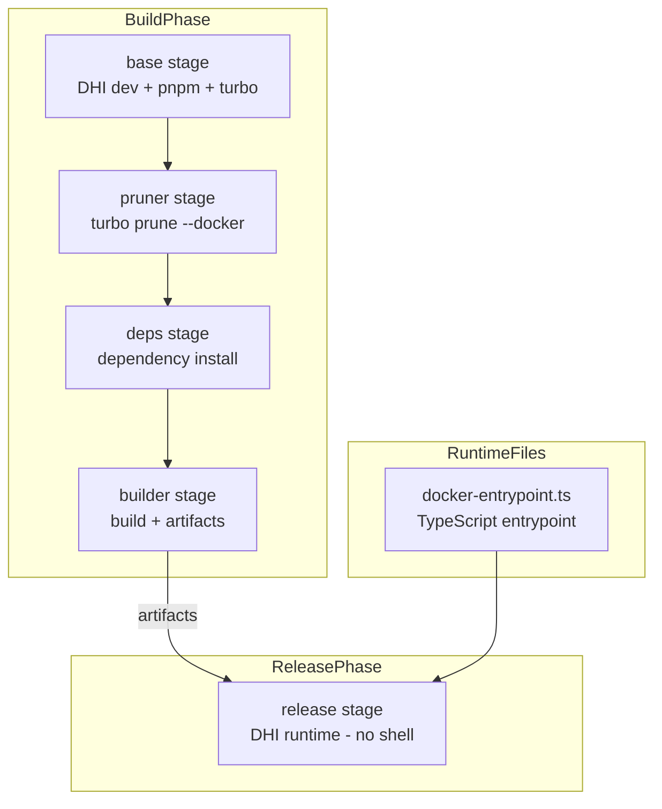
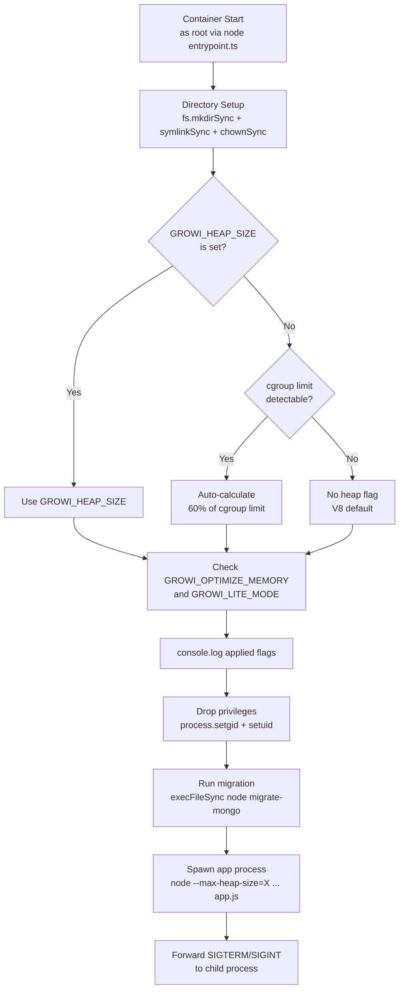

# Design Document: official-docker-image

## Overview

**Purpose**: GROWI 公式 Docker イメージの Dockerfile と entrypoint を 2025-2026 年のベストプラクティスに基づきモダナイズし、セキュリティ強化・メモリ管理最適化・ビルド効率向上を実現する。

**Users**: インフラ管理者（ビルド・デプロイ）、GROWI 運用者（メモリチューニング）、Docker image エンドユーザー（docker-compose での利用）が対象。

**Impact**: 既存の 3 ステージ Dockerfile を 5 ステージ構成に再設計。ベースイメージを Docker Hardened Images (DHI) に移行。entrypoint を shell script から TypeScript に変更し（Node.js 24 のネイティブ TypeScript 実行）、シェル不要の完全ハードニング構成を実現。

### Goals

- DHI ベースイメージ採用による CVE 最大 95% 削減
- **シェル完全不要の TypeScript entrypoint** — Node.js 24 のネイティブ TypeScript 実行（type stripping）、DHI runtime の攻撃面最小化をそのまま維持
- `GROWI_HEAP_SIZE` / cgroup 自動算出 / V8 デフォルトの 3 段フォールバックによるメモリ管理
- `turbo prune --docker` パターンによるビルドキャッシュ効率向上
- gosu → `process.setuid/setgid`（Node.js ネイティブ）による権限ドロップ

### Non-Goals

- Kubernetes マニフェスト / Helm chart の変更（GROWI.cloud 側の `GROWI_HEAP_SIZE` 設定は対象外）
- アプリケーションコードの変更（gc() 追加、.pipe() 移行等は別 spec）
- docker-compose.yml の更新（ドキュメント更新のみ）
- Node.js 24 未満のバージョンサポート
- HEALTHCHECK 命令の追加（k8s は独自 probe を使用、Docker Compose ユーザーは自前で設定可能）

## Architecture

### Existing Architecture Analysis

**現行 Dockerfile の 3 ステージ構成:**

| Stage | Base Image | 役割 |
|-------|-----------|------|
| `base` | `node:20-slim` | pnpm + turbo のインストール |
| `builder` | `base` | `COPY . .` → install → build → artifacts |
| release (unnamed) | `node:20-slim` | gosu install → artifacts 展開 → 実行 |

**主な課題:**
- `COPY . .` でモノレポ全体がビルドレイヤーに含まれる
- pnpm バージョンがハードコード (`PNPM_VERSION="10.4.1"`)
- `---frozen-lockfile` の typo
- ベースイメージが node:20-slim（CVE が蓄積しやすい）
- メモリ管理フラグなし
- OCI ラベルなし
- gosu のインストールに apt-get が必要（runtime に apt 依存）

### Architecture Pattern & Boundary Map



**Architecture Integration:**
- Selected pattern: Multi-stage build with dependency caching separation
- Domain boundaries: Build concerns (stages 1-4) vs Runtime concerns (stage 5 + entrypoint)
- Existing patterns preserved: pnpm deploy による本番依存抽出、tar.gz アーティファクト転送
- New components: pruner ステージ（turbo prune）、TypeScript entrypoint
- **Key change**: gosu + shell script → TypeScript entrypoint（`process.setuid/setgid` + `fs` module + `child_process.execFileSync/spawn`）。busybox/bash のコピーが不要になり、DHI runtime の攻撃面最小化をそのまま維持。Node.js 24 の type stripping で `.ts` を直接実行
- Steering compliance: Debian ベース維持（glibc パフォーマンス）、モノレポビルドパターン維持

### Technology Stack

| Layer | Choice / Version | Role in Feature | Notes |
|-------|------------------|-----------------|-------|
| Base Image (build) | `dhi.io/node:24-debian13-dev` | ビルドステージのベース | apt/bash/git/util-linux 利用可能 |
| Base Image (runtime) | `dhi.io/node:24-debian13` | リリースステージのベース | 極小構成、CVE 95% 削減、**シェルなし** |
| Entrypoint | Node.js (TypeScript) | 初期化・ヒープ算出・権限ドロップ・プロセス起動 | Node.js 24 native type stripping、busybox/bash 不要 |
| Privilege Drop | `process.setuid/setgid` (Node.js) | root → node ユーザー切替 | 外部バイナリ不要 |
| Build Tool | `turbo prune --docker` | モノレポ最小化 | Turborepo 公式推奨 |
| Package Manager | pnpm (wget standalone) | 依存管理 | corepack 不採用（Node.js 25+ で廃止予定） |

> TypeScript entrypoint 採用の経緯、busybox-static/setpriv との比較は `research.md` を参照。

## System Flows

### Entrypoint 実行フロー



**Key Decisions:**
- cgroup v2 (`/sys/fs/cgroup/memory.max`) を優先、v1 にフォールバック
- cgroup v1 の unlimited 値（巨大な数値）はフラグなしとして扱う（閾値: 64GB）
- `--max-heap-size` は entrypoint プロセスではなく、spawn される子プロセス（アプリ本体）に渡される
- migration は `child_process.execFileSync` で直接 node を呼び出す（`npm run` 不使用、シェル不要）
- アプリ起動は `child_process.spawn` + シグナルフォワーディングで PID 1 の責務を果たす

### Docker Build フロー



## Requirements Traceability

| Requirement | Summary | Components | Interfaces | Flows |
|-------------|---------|------------|------------|-------|
| 1.1 | DHI ベースイメージ | base, release ステージ | — | Build フロー |
| 1.2 | syntax ディレクティブ更新 | Dockerfile ヘッダ | — | — |
| 1.3 | pnpm wget インストール維持 | base ステージ | — | Build フロー |
| 1.4 | frozen-lockfile typo 修正 | deps ステージ | — | — |
| 1.5 | pnpm バージョン非ハードコード | base ステージ | — | — |
| 2.1 | GROWI_HEAP_SIZE | docker-entrypoint.ts | 環境変数 I/F | Entrypoint フロー |
| 2.2 | cgroup 自動算出 | docker-entrypoint.ts | cgroup fs I/F | Entrypoint フロー |
| 2.3 | フラグなしフォールバック | docker-entrypoint.ts | — | Entrypoint フロー |
| 2.4 | GROWI_OPTIMIZE_MEMORY | docker-entrypoint.ts | 環境変数 I/F | Entrypoint フロー |
| 2.5 | GROWI_LITE_MODE | docker-entrypoint.ts | 環境変数 I/F | Entrypoint フロー |
| 2.6 | --max-heap-size 使用 | docker-entrypoint.ts | spawn args | Entrypoint フロー |
| 2.7 | NODE_OPTIONS 不使用 | docker-entrypoint.ts | — | Entrypoint フロー |
| 3.1 | COPY . . 廃止 | pruner + deps ステージ | — | Build フロー |
| 3.2 | pnpm cache mount 維持 | deps, builder ステージ | — | Build フロー |
| 3.3 | apt cache mount 維持 | base ステージ | — | Build フロー |
| 3.4 | .next/cache 除外 | builder ステージ | — | — |
| 3.5 | bind from=builder パターン | release ステージ | — | Build フロー |
| 4.1 | 非 root 実行 | docker-entrypoint.ts | process.setuid/setgid | Entrypoint フロー |
| 4.2 | 不要パッケージ排除 | release ステージ | — | — |
| 4.3 | .dockerignore 強化 | Dockerfile.dockerignore | — | — |
| 4.4 | --no-install-recommends | base ステージ | — | — |
| 4.5 | ビルドツール排除 | release ステージ | — | — |
| 5.1 | OCI ラベル | release ステージ | — | — |
| 5.2 | EXPOSE 維持 | release ステージ | — | — |
| 5.3 | VOLUME 維持 | release ステージ | — | — |
| 6.1 | ヒープサイズ算出ロジック | docker-entrypoint.ts | — | Entrypoint フロー |
| 6.2 | 権限ドロップ exec | docker-entrypoint.ts | process.setuid/setgid | Entrypoint フロー |
| 6.3 | /data/uploads 維持 | docker-entrypoint.ts | fs module | Entrypoint フロー |
| 6.4 | /tmp/page-bulk-export 維持 | docker-entrypoint.ts | fs module | Entrypoint フロー |
| 6.5 | CMD migrate 維持 | docker-entrypoint.ts | execFileSync | Entrypoint フロー |
| 6.6 | --expose_gc 維持 | docker-entrypoint.ts | spawn args | Entrypoint フロー |
| 6.7 | フラグログ出力 | docker-entrypoint.ts | console.log | Entrypoint フロー |
| 6.8 | TypeScript で記述 | docker-entrypoint.ts | Node.js type stripping | — |
| 7.1-7.5 | 後方互換性 | 全コンポーネント | — | — |

```mermaid
flowchart LR
    subgraph Stage1[base]
        S1[DHI dev image<br>+ pnpm + turbo]
    end

    subgraph Stage2[pruner]
        S2A[COPY monorepo]
        S2B[turbo prune --docker]
    end

    subgraph Stage3[deps]
        S3A[COPY json + lockfile]
        S3B[pnpm install --frozen-lockfile]
    end

    subgraph Stage4[builder]
        S4A[COPY full source]
        S4B[turbo run build]
        S4C[pnpm deploy + tar.gz]
    end

    subgraph Stage5[release]
        S5A[DHI runtime<br>no additional binaries]
        S5B[Extract artifacts]
        S5C[COPY entrypoint.js]
    end

    Stage1 --> Stage2 --> Stage3 --> Stage4
    Stage4 -->|tar.gz| Stage5
```

## Components and Interfaces

| Component | Domain/Layer | Intent | Req Coverage | Key Dependencies | Contracts |
|-----------|-------------|--------|-------------|-----------------|-----------|
| Dockerfile | Infrastructure | Docker イメージビルド定義 | 1.1-1.5, 3.1-3.5, 4.1-4.5, 5.1-5.3, 6.5 | DHI images (P0), turbo (P0), pnpm (P0) | — |
| docker-entrypoint.ts | Infrastructure | コンテナ起動時の初期化（TypeScript） | 2.1-2.7, 6.1-6.4, 6.6-6.8 | Node.js fs/child_process (P0), cgroup fs (P1) | Batch |
| Dockerfile.dockerignore | Infrastructure | ビルドコンテキストフィルタ | 4.3 | — | — |

### Infrastructure Layer

#### Dockerfile

| Field | Detail |
|-------|--------|
| Intent | 5 ステージの Docker イメージビルド定義 |
| Requirements | 1.1-1.5, 3.1-3.5, 4.1-4.5, 5.1-5.3, 6.5, 7.1-7.5 |

**Responsibilities & Constraints**
- 5 ステージ構成: `base` → `pruner` → `deps` → `builder` → `release`
- DHI ベースイメージの使用（`dhi.io/node:24-debian13-dev` / `dhi.io/node:24-debian13`）
- **runtime にシェル・追加バイナリのコピーなし**（Node.js entrypoint で全て完結）
- OCI ラベルの付与

**Dependencies**
- External: `dhi.io/node:24-debian13-dev` — ビルドベースイメージ (P0)
- External: `dhi.io/node:24-debian13` — ランタイムベースイメージ (P0)
- Outbound: pnpm — 依存管理 (P0)
- Outbound: turbo — ビルドオーケストレーション (P0)

**Contracts**: Batch [x]

##### Stage Definitions

**Stage 1: `base`**
```
FROM dhi.io/node:24-debian13-dev AS base
```
- apt-get で `ca-certificates`, `wget` をインストール（ビルド専用）
- wget スタンドアロンスクリプトで pnpm をインストール（バージョンはスクリプトのデフォルト）
- pnpm add turbo --global

**Stage 2: `pruner`**
```
FROM base AS pruner
```
- `COPY . .` でモノレポ全体をコピー
- `turbo prune @growi/app --docker` で Docker 最適化ファイルを生成
- 出力: `out/json/`（package.json 群）、`out/pnpm-lock.yaml`、`out/full/`（ソース）

**Stage 3: `deps`**
```
FROM base AS deps
```
- `COPY --from=pruner` で json/ と lockfile のみコピー（キャッシュ効率化）
- `pnpm install --frozen-lockfile` で依存インストール
- `pnpm add node-gyp --global`（native modules 用）

**Stage 4: `builder`**
```
FROM deps AS builder
```
- `COPY --from=pruner` で full/ ソースをコピー
- `turbo run build --filter @growi/app`
- `pnpm deploy out --prod --filter @growi/app`
- artifacts を tar.gz にパッケージング（現行の内容を維持、`apps/app/tmp` 含む）

**Stage 5: `release`**
```
FROM dhi.io/node:24-debian13 AS release
```
- **追加バイナリのコピーなし**（シェル・gosu・setpriv・busybox 一切不要）
- artifacts を `--mount=type=bind,from=builder` で展開
- `docker-entrypoint.ts` を COPY
- OCI ラベル、EXPOSE、VOLUME を設定
- `ENTRYPOINT ["node", "/docker-entrypoint.ts"]`

**Implementation Notes**
- `turbo prune --docker` が pnpm workspace と互換でない場合のフォールバック: 最適化 COPY パターン（lockfile + package.json 群を先にコピー → install → ソースコピー → build）
- DHI イメージの pull には `docker login dhi.io` が必要（CI/CD での認証設定が必要）
- release ステージに apt-get は一切不要（現行の gosu install が完全に排除される）

#### docker-entrypoint.ts

| Field | Detail |
|-------|--------|
| Intent | コンテナ起動時の初期化処理（ディレクトリ設定、ヒープサイズ算出、権限ドロップ、migration 実行、アプリ起動）。TypeScript で記述、Node.js 24 のネイティブ type stripping で直接実行 |
| Requirements | 2.1-2.7, 6.1-6.8 |

**Responsibilities & Constraints**
- **TypeScript で記述**: Node.js 24 のネイティブ type stripping で直接実行（`node docker-entrypoint.ts`）。enum は使用不可（erasable syntax のみ使用）
- root 権限での初期化処理（`fs.mkdirSync`、`fs.symlinkSync`、`fs.chownSync` で実装）
- 3 段フォールバックによるヒープサイズ決定（`fs.readFileSync` で cgroup 読み取り）
- Node.js ネイティブの `process.setgid()` + `process.setuid()` で権限ドロップ
- `child_process.execFileSync` で migration を直接実行（npm run 不使用、シェル不要）
- `child_process.spawn` でアプリプロセスを起動し、SIGTERM/SIGINT をフォワード
- **外部バイナリ依存なし**（Node.js の標準ライブラリのみ使用）

**Dependencies**
- External: Node.js `fs` module — ファイルシステム操作 (P0)
- External: Node.js `child_process` module — プロセス起動 (P0)
- External: cgroup filesystem — メモリリミット取得 (P1)
- Inbound: Environment variables — GROWI_HEAP_SIZE, GROWI_OPTIMIZE_MEMORY, GROWI_LITE_MODE

**Contracts**: Batch [x]

##### Batch / Job Contract

- **Trigger**: コンテナ起動時（`ENTRYPOINT ["node", "/docker-entrypoint.ts"]` として実行）
- **Input / validation**:
  - `GROWI_HEAP_SIZE`: 正の整数（MB 単位）。空文字列は未設定として扱う
  - `GROWI_OPTIMIZE_MEMORY`: `"true"` のみ有効。それ以外は無視
  - `GROWI_LITE_MODE`: `"true"` のみ有効。それ以外は無視
  - cgroup v2: `/sys/fs/cgroup/memory.max` — 数値または `"max"`（unlimited）
  - cgroup v1: `/sys/fs/cgroup/memory/memory.limit_in_bytes` — 数値（unlimited 時は巨大値）
- **Output / destination**: `child_process.spawn` の引数として node フラグを直接渡す
- **Idempotency & recovery**: コンテナ再起動時に毎回実行。冪等（`fs.mkdirSync` の `recursive: true` で安全）

##### Environment Variable Interface

| Variable | Type | Default | Description |
|----------|------|---------|-------------|
| `GROWI_HEAP_SIZE` | int (MB) | (未設定) | Node.js の --max-heap-size 値を明示指定 |
| `GROWI_OPTIMIZE_MEMORY` | `"true"` / (未設定) | (未設定) | --optimize-for-size フラグを有効化 |
| `GROWI_LITE_MODE` | `"true"` / (未設定) | (未設定) | --lite-mode フラグを有効化 |

##### Heap Size Calculation Logic

```typescript
// Priority 1: GROWI_HEAP_SIZE env
// Priority 2: cgroup v2 (/sys/fs/cgroup/memory.max) — 60%
// Priority 3: cgroup v1 (/sys/fs/cgroup/memory/memory.limit_in_bytes) — 60%, < 64GB
// Priority 4: undefined (V8 default)

function detectHeapSize(): number | undefined {
  const envValue: string | undefined = process.env.GROWI_HEAP_SIZE;
  if (envValue != null && envValue !== '') {
    const parsed: number = parseInt(envValue, 10);
    return Number.isNaN(parsed) ? undefined : parsed;
  }

  // cgroup v2
  const cgroupV2: number | undefined = readCgroupLimit('/sys/fs/cgroup/memory.max');
  if (cgroupV2 != null) {
    return Math.floor(cgroupV2 / 1024 / 1024 * 0.6);
  }

  // cgroup v1
  const cgroupV1: number | undefined = readCgroupLimit('/sys/fs/cgroup/memory/memory.limit_in_bytes');
  if (cgroupV1 != null && cgroupV1 < 64 * 1024 * 1024 * 1024) {
    return Math.floor(cgroupV1 / 1024 / 1024 * 0.6);
  }

  return undefined;
}
```

##### Node Flags Assembly

```typescript
const nodeFlags: string[] = ['--expose_gc'];

const heapSize: number | undefined = detectHeapSize();
if (heapSize != null) {
  nodeFlags.push(`--max-heap-size=${heapSize}`);
}

if (process.env.GROWI_OPTIMIZE_MEMORY === 'true') {
  nodeFlags.push('--optimize-for-size');
}

if (process.env.GROWI_LITE_MODE === 'true') {
  nodeFlags.push('--lite-mode');
}
```

##### Directory Setup (as root)

```typescript
import fs from 'node:fs';

// /data/uploads for FILE_UPLOAD=local
fs.mkdirSync('/data/uploads', { recursive: true });
if (!fs.existsSync('./public/uploads')) {
  fs.symlinkSync('/data/uploads', './public/uploads');
}
chownRecursive('/data/uploads', 1000, 1000);
fs.lchownSync('./public/uploads', 1000, 1000);

// /tmp/page-bulk-export
fs.mkdirSync('/tmp/page-bulk-export', { recursive: true });
chownRecursive('/tmp/page-bulk-export', 1000, 1000);
fs.chmodSync('/tmp/page-bulk-export', 0o700);
```

`chownRecursive` は `fs.readdirSync` + `fs.chownSync` で再帰的に所有者を変更するヘルパー関数。

##### Privilege Drop

```typescript
process.initgroups('node', 1000);
process.setgid(1000);
process.setuid(1000);
```

`setgid` → `setuid` の順序は必須（setuid 後は setgid できない）。`initgroups` で supplementary groups も初期化。

##### Migration Execution

```typescript
import { execFileSync } from 'node:child_process';

execFileSync(process.execPath, [
  '-r', 'dotenv-flow/config',
  'node_modules/migrate-mongo/bin/migrate-mongo', 'up',
  '-f', 'config/migrate-mongo-config.js',
], { stdio: 'inherit', env: { ...process.env, NODE_ENV: 'production' } });
```

`execFileSync` はシェルを介さず直接 node バイナリを実行。`npm run migrate` と同等の動作をシェル不要で実現。

##### App Process Spawn

```typescript
import { spawn } from 'node:child_process';
import type { ChildProcess } from 'node:child_process';

const child: ChildProcess = spawn(process.execPath, [
  ...nodeFlags,
  '-r', 'dotenv-flow/config',
  'dist/server/app.js',
], { stdio: 'inherit', env: { ...process.env, NODE_ENV: 'production' } });

// PID 1 signal forwarding
const signals: NodeJS.Signals[] = ['SIGTERM', 'SIGINT', 'SIGHUP'];
for (const sig of signals) {
  process.on(sig, () => child.kill(sig));
}
child.on('exit', (code: number | null, signal: NodeJS.Signals | null) => {
  process.exit(code ?? (signal === 'SIGTERM' ? 0 : 1));
});
```

**Implementation Notes**
- TypeScript で記述し、Node.js 24 のネイティブ type stripping で直接実行。`ENTRYPOINT ["node", "/docker-entrypoint.ts"]`
- enum は使用不可（非 erasable syntax）。interface/type/type annotation のみ使用
- entrypoint は `process.execPath`（= `/usr/local/bin/node`）を使って migration と app を実行するため、シェルが一切不要
- `--max-heap-size` は spawn の引数として直接渡されるため、NODE_OPTIONS の制約を回避
- migration コマンドは `apps/app/package.json` の `migrate` スクリプトの中身を直接記述。package.json の変更時は entrypoint の更新も必要
- PID 1 の責務: シグナルフォワーディング、子プロセスの reap、正常終了コードの伝播

#### Dockerfile.dockerignore

| Field | Detail |
|-------|--------|
| Intent | ビルドコンテキストから不要ファイルを除外 |
| Requirements | 4.3 |

**Implementation Notes**
- 現行に追加すべきエントリ: `.git`, `.env*`（production 以外）, `*.md`, `test/`, `**/*.spec.*`, `**/*.test.*`, `.vscode/`, `.idea/`
- 現行維持: `**/node_modules`, `**/coverage`, `**/Dockerfile`, `**/*.dockerignore`, `**/.pnpm-store`, `**/.next`, `**/.turbo`, `out`, `apps/slackbot-proxy`

## Error Handling

### Error Strategy

entrypoint は try-catch で各フェーズのエラーを捕捉。致命的エラーは `process.exit(1)` でコンテナの起動失敗として Docker/k8s に通知。

### Error Categories and Responses

| Error | Category | Response |
|-------|----------|----------|
| cgroup ファイル読み取り失敗 | System | `console.warn` で警告し、フラグなし（V8 デフォルト）で続行 |
| GROWI_HEAP_SIZE が不正値（NaN 等） | User | `console.error` で警告し、フラグなしで続行（コンテナは起動する） |
| ディレクトリ作成/権限設定失敗 | System | `process.exit(1)` でコンテナ起動失敗。ボリュームマウント設定を確認 |
| Migration 失敗 | Business Logic | `execFileSync` が例外を throw → `process.exit(1)`。Docker/k8s が再起動 |
| アプリプロセス異常終了 | System | 子プロセスの exit code を伝播して `process.exit(code)` |

## Testing Strategy

### Unit Tests
- docker-entrypoint.ts のヒープサイズ算出ロジック: cgroup v2/v1/なし の 3 パターン（TypeScript で型安全にテスト）
- docker-entrypoint.ts の環境変数組み合わせ: GROWI_HEAP_SIZE + GROWI_OPTIMIZE_MEMORY + GROWI_LITE_MODE
- docker-entrypoint.ts の chownRecursive ヘルパー: ネストされたディレクトリ構造で正しく再帰 chown されること
- Node.js 24 の type stripping で docker-entrypoint.ts が直接実行可能なこと

### Integration Tests
- Docker build が成功し、全 5 ステージが完了すること
- `GROWI_HEAP_SIZE=250` を設定してコンテナ起動し、node プロセスの `--max-heap-size=250` を確認
- cgroup memory limit 付きでコンテナ起動し、自動算出の `--max-heap-size` が正しいことを確認
- migration が正常に実行されること（`execFileSync` 経由）

### E2E Tests
- `docker compose up` で GROWI + MongoDB が起動し、ブラウザアクセスが可能なこと
- `FILE_UPLOAD=local` でファイルアップロードが動作すること（/data/uploads の symlink 確認）
- SIGTERM 送信でコンテナが graceful に停止すること

## Security Considerations

- **DHI ベースイメージ**: CVE 最大 95% 削減、SLSA Build Level 3 の provenance
- **シェル不要**: runtime に bash/sh/busybox なし。コマンドインジェクションの攻撃ベクターを排除
- **gosu/setpriv 不要**: Node.js ネイティブの `process.setuid/setgid` で権限ドロップ。追加バイナリの攻撃面なし
- **非 root 実行**: アプリケーションは node (UID 1000) で実行。root は entrypoint の初期化（mkdir/chown）のみ
- **DHI レジストリ認証**: CI/CD で `docker login dhi.io` が必要。Docker Hub 認証情報を使用

## Performance & Scalability

- **ビルドキャッシュ**: `turbo prune --docker` により dependency install レイヤーをキャッシュ。ソースコード変更時の再ビルドで依存インストールをスキップ
- **イメージサイズ**: DHI runtime に追加バイナリなし。node:24-slim 比でベースレイヤーが縮小
- **メモリ効率**: `--max-heap-size` による total heap 制御で、v24 の trusted_space overhead 問題を回避。マルチテナントでのメモリ圧迫を防止
