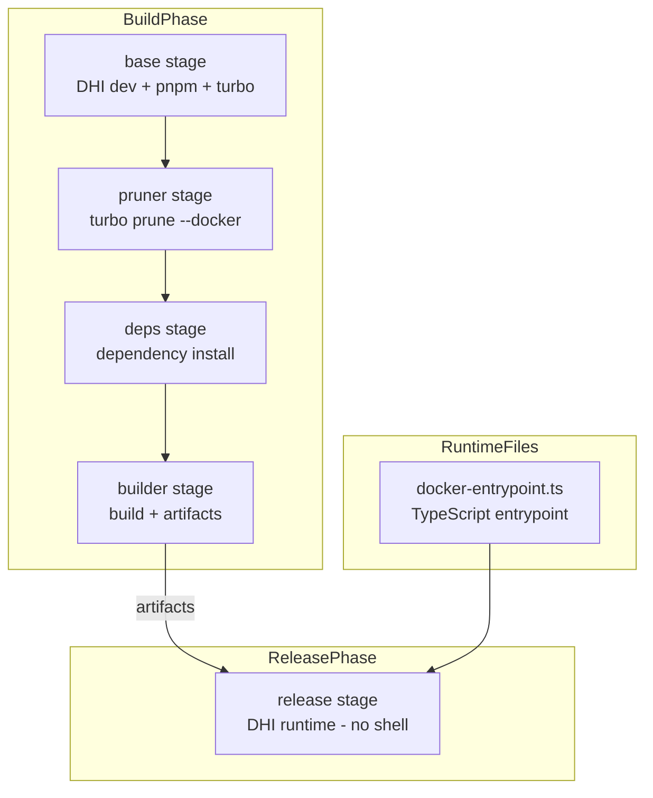
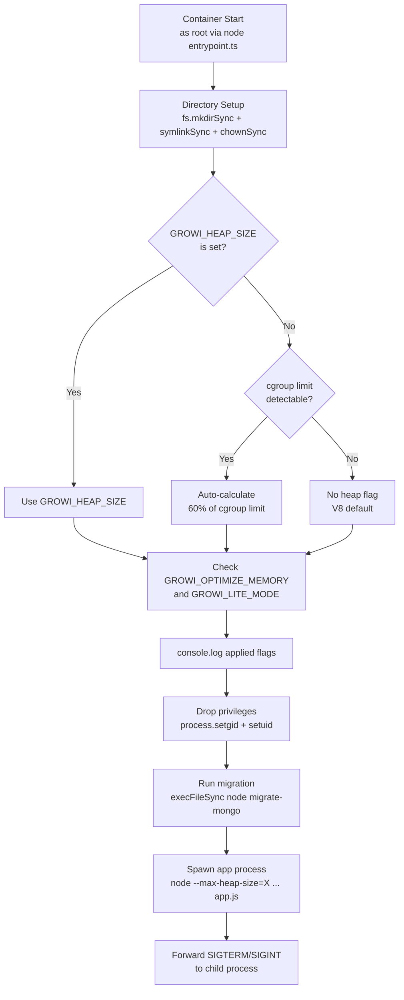

# Design Document: official-docker-image

## Overview

**Purpose**: Modernize the Dockerfile and entrypoint for the GROWI official Docker image based on 2025-2026 best practices, achieving enhanced security, optimized memory management, and improved build efficiency.

**Users**: Infrastructure administrators (build/deploy), GROWI operators (memory tuning), and Docker image end users (usage via docker-compose).

**Impact**: Redesign the existing 3-stage Dockerfile into a 5-stage configuration. Migrate the base image to Docker Hardened Images (DHI). Change the entrypoint from a shell script to TypeScript (using Node.js 24 native TypeScript execution), achieving a fully hardened configuration that requires no shell.

### Goals

- Up to 95% CVE reduction through DHI base image adoption
- **Fully shell-free TypeScript entrypoint** — Node.js 24 native TypeScript execution (type stripping), maintaining the minimized attack surface of the DHI runtime as-is
- Memory management via 3-tier fallback: `GROWI_HEAP_SIZE` / cgroup auto-calculation / V8 default
- Improved build cache efficiency through the `turbo prune --docker` pattern
- Privilege drop via gosu → `process.setuid/setgid` (Node.js native)

### Non-Goals

- Changes to Kubernetes manifests / Helm charts (GROWI.cloud `GROWI_HEAP_SIZE` configuration is out of scope)
- Application code changes (adding gc(), migrating to .pipe(), etc. are separate specs)
- Updating docker-compose.yml (documentation updates only)
- Support for Node.js versions below 24
- Adding HEALTHCHECK instructions (k8s uses its own probes, Docker Compose users can configure their own)

## Architecture

### Existing Architecture Analysis

**Current Dockerfile 3-stage configuration:**

| Stage | Base Image | Role |
|-------|-----------|------|
| `base` | `node:20-slim` | Install pnpm + turbo |
| `builder` | `base` | `COPY . .` → install → build → artifacts |
| release (unnamed) | `node:20-slim` | gosu install → artifact extraction → execution |

**Main issues:**
- `COPY . .` includes the entire monorepo in the build layer
- pnpm version is hardcoded (`PNPM_VERSION="10.4.1"`)
- Typo in `---frozen-lockfile`
- Base image is node:20-slim (prone to CVE accumulation)
- No memory management flags
- No OCI labels
- gosu installation requires apt-get (runtime dependency on apt)

### Architecture Pattern & Boundary Map


```mermaid
graph TB
    subgraph BuildPhase
        base[base stage<br>DHI dev + pnpm + turbo]
        pruner[pruner stage<br>turbo prune --docker]
        deps[deps stage<br>dependency install]
        builder[builder stage<br>build + artifacts]
    end

    subgraph ReleasePhase
        release[release stage<br>DHI runtime - no shell]
    end

    base --> pruner
    pruner --> deps
    deps --> builder
    builder -->|artifacts| release

    subgraph RuntimeFiles
        entrypoint[docker-entrypoint.ts<br>TypeScript entrypoint]
    end

    entrypoint --> release
```

**Architecture Integration:**
- Selected pattern: Multi-stage build with dependency caching separation
- Domain boundaries: Build concerns (stages 1-4) vs Runtime concerns (stage 5 + entrypoint)
- Existing patterns preserved: Production dependency extraction via pnpm deploy, tar.gz artifact transfer
- New components: pruner stage (turbo prune), TypeScript entrypoint
- **Key change**: gosu + shell script → TypeScript entrypoint (`process.setuid/setgid` + `fs` module + `child_process.execFileSync/spawn`). Eliminates the need for copying busybox/bash, maintaining the minimized attack surface of the DHI runtime as-is. Executes `.ts` directly via Node.js 24 type stripping
- Steering compliance: Maintains Debian base (glibc performance), maintains monorepo build pattern

### Technology Stack

| Layer | Choice / Version | Role in Feature | Notes |
|-------|------------------|-----------------|-------|
| Base Image (build) | `dhi.io/node:24-debian13-dev` | Base for build stages | apt/bash/git/util-linux available |
| Base Image (runtime) | `dhi.io/node:24-debian13` | Base for release stage | Minimal configuration, 95% CVE reduction, **no shell** |
| Entrypoint | Node.js (TypeScript) | Initialization, heap calculation, privilege drop, process startup | Node.js 24 native type stripping, no busybox/bash needed |
| Privilege Drop | `process.setuid/setgid` (Node.js) | root → node user switch | No external binaries needed |
| Build Tool | `turbo prune --docker` | Monorepo minimization | Official Turborepo recommendation |
| Package Manager | pnpm (wget standalone) | Dependency management | corepack not adopted (scheduled for removal in Node.js 25+) |

> For the rationale behind adopting the TypeScript entrypoint and comparison with busybox-static/setpriv, see `research.md`.

## System Flows

### Entrypoint Execution Flow


```mermaid
flowchart TD
    Start[Container Start<br>as root via node entrypoint.ts] --> Setup[Directory Setup<br>fs.mkdirSync + symlinkSync + chownSync]
    Setup --> HeapCalc{GROWI_HEAP_SIZE<br>is set?}
    HeapCalc -->|Yes| UseEnv[Use GROWI_HEAP_SIZE]
    HeapCalc -->|No| CgroupCheck{cgroup limit<br>detectable?}
    CgroupCheck -->|Yes| AutoCalc[Auto-calculate<br>60% of cgroup limit]
    CgroupCheck -->|No| NoFlag[No heap flag<br>V8 default]
    UseEnv --> OptFlags[Check GROWI_OPTIMIZE_MEMORY<br>and GROWI_LITE_MODE]
    AutoCalc --> OptFlags
    NoFlag --> OptFlags
    OptFlags --> LogFlags[console.log applied flags]
    LogFlags --> DropPriv[Drop privileges<br>process.setgid + setuid]
    DropPriv --> Migration[Run migration<br>execFileSync node migrate-mongo]
    Migration --> SpawnApp[Spawn app process<br>node --max-heap-size=X ... app.js]
    SpawnApp --> SignalFwd[Forward SIGTERM/SIGINT<br>to child process]
```

**Key Decisions:**
- Prioritize cgroup v2 (`/sys/fs/cgroup/memory.max`), fall back to v1
- Treat cgroup v1 unlimited value (very large number) as no flag (threshold: 64GB)
- `--max-heap-size` is passed to the spawned child process (the application itself), not the entrypoint process
- Migration is invoked directly via `child_process.execFileSync` calling node (no `npm run`, no shell needed)
- App startup uses `child_process.spawn` + signal forwarding to fulfill PID 1 responsibilities

### Docker Build Flow


```mermaid
flowchart LR
    subgraph Stage1[base]
        S1[DHI dev image<br>+ pnpm + turbo]
    end

    subgraph Stage2[pruner]
        S2A[COPY monorepo]
        S2B[turbo prune --docker]
    end

    subgraph Stage3[deps]
        S3A[COPY json + lockfile]
        S3B[pnpm install --frozen-lockfile]
    end

    subgraph Stage4[builder]
        S4A[COPY full source]
        S4B[turbo run build]
        S4C[pnpm deploy + tar.gz]
    end

    subgraph Stage5[release]
        S5A[DHI runtime<br>no additional binaries]
        S5B[Extract artifacts]
        S5C[COPY entrypoint.js]
    end

    Stage1 --> Stage2 --> Stage3 --> Stage4
    Stage4 -->|tar.gz| Stage5
```

## Requirements Traceability

| Requirement | Summary | Components | Interfaces | Flows |
|-------------|---------|------------|------------|-------|
| 1.1 | DHI base image | base, release stages | — | Build flow |
| 1.2 | Update syntax directive | Dockerfile header | — | — |
| 1.3 | Maintain pnpm wget installation | base stage | — | Build flow |
| 1.4 | Fix frozen-lockfile typo | deps stage | — | — |
| 1.5 | Non-hardcoded pnpm version | base stage | — | — |
| 2.1 | GROWI_HEAP_SIZE | docker-entrypoint.ts | Environment variable I/F | Entrypoint flow |
| 2.2 | cgroup auto-calculation | docker-entrypoint.ts | cgroup fs I/F | Entrypoint flow |
| 2.3 | No-flag fallback | docker-entrypoint.ts | — | Entrypoint flow |
| 2.4 | GROWI_OPTIMIZE_MEMORY | docker-entrypoint.ts | Environment variable I/F | Entrypoint flow |
| 2.5 | GROWI_LITE_MODE | docker-entrypoint.ts | Environment variable I/F | Entrypoint flow |
| 2.6 | Use --max-heap-size | docker-entrypoint.ts | spawn args | Entrypoint flow |
| 2.7 | Do not use NODE_OPTIONS | docker-entrypoint.ts | — | Entrypoint flow |
| 3.1 | Eliminate COPY . . | pruner + deps stages | — | Build flow |
| 3.2 | Maintain pnpm cache mount | deps, builder stages | — | Build flow |
| 3.3 | Maintain apt cache mount | base stage | — | Build flow |
| 3.4 | Exclude .next/cache | builder stage | — | — |
| 3.5 | bind from=builder pattern | release stage | — | Build flow |
| 4.1 | Non-root execution | docker-entrypoint.ts | process.setuid/setgid | Entrypoint flow |
| 4.2 | Exclude unnecessary packages | release stage | — | — |
| 4.3 | Enhanced .dockerignore | Dockerfile.dockerignore | — | — |
| 4.4 | --no-install-recommends | base stage | — | — |
| 4.5 | Exclude build tools | release stage | — | — |
| 5.1 | OCI labels | release stage | — | — |
| 5.2 | Maintain EXPOSE | release stage | — | — |
| 5.3 | Maintain VOLUME | release stage | — | — |
| 6.1 | Heap size calculation logic | docker-entrypoint.ts | — | Entrypoint flow |
| 6.2 | Privilege drop exec | docker-entrypoint.ts | process.setuid/setgid | Entrypoint flow |
| 6.3 | Maintain /data/uploads | docker-entrypoint.ts | fs module | Entrypoint flow |
| 6.4 | Maintain /tmp/page-bulk-export | docker-entrypoint.ts | fs module | Entrypoint flow |
| 6.5 | Maintain CMD migrate | docker-entrypoint.ts | execFileSync | Entrypoint flow |
| 6.6 | Maintain --expose_gc | docker-entrypoint.ts | spawn args | Entrypoint flow |
| 6.7 | Flag log output | docker-entrypoint.ts | console.log | Entrypoint flow |
| 6.8 | Written in TypeScript | docker-entrypoint.ts | Node.js type stripping | — |
| 7.1-7.5 | Backward compatibility | All components | — | — |
| 8.1 | Replace docker-new → docker | Directory structure | Filesystem | — |
| 8.2 | Update Dockerfile path references | Dockerfile | — | — |
| 8.3 | DHI registry login | buildspec.yml | secrets-manager | Build flow |
| 8.4 | Verify buildspec Dockerfile path | buildspec.yml | — | Build flow |

## Components and Interfaces

| Component | Domain/Layer | Intent | Req Coverage | Key Dependencies | Contracts |
|-----------|-------------|--------|-------------|-----------------|-----------|
| Dockerfile | Infrastructure | Docker image build definition | 1.1-1.5, 3.1-3.5, 4.1-4.5, 5.1-5.3, 6.5, 8.2 | DHI images (P0), turbo (P0), pnpm (P0) | — |
| docker-entrypoint.ts | Infrastructure | Container startup initialization (TypeScript) | 2.1-2.7, 6.1-6.4, 6.6-6.8 | Node.js fs/child_process (P0), cgroup fs (P1) | Batch |
| Dockerfile.dockerignore | Infrastructure | Build context filter | 4.3 | — | — |
| buildspec.yml | CI/CD | CodeBuild build definition | 8.3, 8.4 | AWS Secrets Manager (P0), dhi.io (P0) | Batch |

### Infrastructure Layer

#### Dockerfile

| Field | Detail |
|-------|--------|
| Intent | 5-stage Docker image build definition |
| Requirements | 1.1-1.5, 3.1-3.5, 4.1-4.5, 5.1-5.3, 6.5, 7.1-7.5 |

**Responsibilities & Constraints**
- 5-stage configuration: `base` → `pruner` → `deps` → `builder` → `release`
- Use of DHI base images (`dhi.io/node:24-debian13-dev` / `dhi.io/node:24-debian13`)
- **No shell or additional binary copying in runtime** (everything is handled by the Node.js entrypoint)
- OCI label assignment

**Dependencies**
- External: `dhi.io/node:24-debian13-dev` — Build base image (P0)
- External: `dhi.io/node:24-debian13` — Runtime base image (P0)
- Outbound: pnpm — Dependency management (P0)
- Outbound: turbo — Build orchestration (P0)

**Contracts**: Batch [x]

##### Stage Definitions

**Stage 1: `base`**
```
FROM dhi.io/node:24-debian13-dev AS base
```
- Install `ca-certificates`, `wget` via apt-get (build-only)
- Install pnpm via wget standalone script (version uses script default)
- pnpm add turbo --global

**Stage 2: `pruner`**
```
FROM base AS pruner
```
- `COPY . .` to copy the entire monorepo
- `turbo prune @growi/app --docker` to generate Docker-optimized files
- Output: `out/json/` (package.json files), `out/pnpm-lock.yaml`, `out/full/` (source)

**Stage 3: `deps`**
```
FROM base AS deps
```
- `COPY --from=pruner` to copy only json/ and lockfile (for cache efficiency)
- `pnpm install --frozen-lockfile` for dependency installation
- `pnpm add node-gyp --global` (for native modules)

**Stage 4: `builder`**
```
FROM deps AS builder
```
- `COPY --from=pruner` to copy full/ source
- `turbo run build --filter @growi/app`
- `pnpm deploy out --prod --filter @growi/app`
- Package artifacts into tar.gz (maintaining current contents, including `apps/app/tmp`)

**Stage 5: `release`**
```
FROM dhi.io/node:24-debian13 AS release
```
- **No additional binary copying** (no shell, gosu, setpriv, or busybox needed at all)
- Extract artifacts via `--mount=type=bind,from=builder`
- COPY `docker-entrypoint.ts`
- Set OCI labels, EXPOSE, VOLUME
- `ENTRYPOINT ["node", "/docker-entrypoint.ts"]`

**Implementation Notes**
- Fallback if `turbo prune --docker` is incompatible with pnpm workspace: optimized COPY pattern (copy lockfile + package.json files first → install → copy source → build)
- Pulling DHI images requires `docker login dhi.io` (authentication setup needed in CI/CD)
- No apt-get is needed at all in the release stage (the current gosu installation is completely eliminated)

#### docker-entrypoint.ts

| Field | Detail |
|-------|--------|
| Intent | Container startup initialization processing (directory setup, heap size calculation, privilege drop, migration execution, app startup). Written in TypeScript, executed directly via Node.js 24 native type stripping |
| Requirements | 2.1-2.7, 6.1-6.8 |

**Responsibilities & Constraints**
- **Written in TypeScript**: Executed directly via Node.js 24 native type stripping (`node docker-entrypoint.ts`). Enums cannot be used (only erasable syntax is allowed)
- Root privilege initialization processing (implemented with `fs.mkdirSync`, `fs.symlinkSync`, `fs.chownSync`)
- Heap size determination via 3-tier fallback (cgroup reading via `fs.readFileSync`)
- Privilege drop via Node.js native `process.setgid()` + `process.setuid()`
- Direct migration execution via `child_process.execFileSync` (no npm run, no shell needed)
- App process startup via `child_process.spawn` with SIGTERM/SIGINT forwarding
- **No external binary dependencies** (uses only Node.js standard library)

**Dependencies**
- External: Node.js `fs` module — Filesystem operations (P0)
- External: Node.js `child_process` module — Process startup (P0)
- External: cgroup filesystem — Memory limit retrieval (P1)
- Inbound: Environment variables — GROWI_HEAP_SIZE, GROWI_OPTIMIZE_MEMORY, GROWI_LITE_MODE

**Contracts**: Batch [x]

##### Batch / Job Contract

- **Trigger**: On container startup (executed as `ENTRYPOINT ["node", "/docker-entrypoint.ts"]`)
- **Input / validation**:
  - `GROWI_HEAP_SIZE`: Positive integer (in MB). Empty string is treated as unset
  - `GROWI_OPTIMIZE_MEMORY`: Only `"true"` is valid. Anything else is ignored
  - `GROWI_LITE_MODE`: Only `"true"` is valid. Anything else is ignored
  - cgroup v2: `/sys/fs/cgroup/memory.max` — Numeric or `"max"` (unlimited)
  - cgroup v1: `/sys/fs/cgroup/memory/memory.limit_in_bytes` — Numeric (very large value when unlimited)
- **Output / destination**: Node flags are passed directly as arguments to `child_process.spawn`
- **Idempotency & recovery**: Executed on every container restart. Idempotent (`fs.mkdirSync` with `recursive: true` ensures safety)

##### Environment Variable Interface

| Variable | Type | Default | Description |
|----------|------|---------|-------------|
| `GROWI_HEAP_SIZE` | int (MB) | (unset) | Explicitly specify the --max-heap-size value for Node.js |
| `GROWI_OPTIMIZE_MEMORY` | `"true"` / (unset) | (unset) | Enable the --optimize-for-size flag |
| `GROWI_LITE_MODE` | `"true"` / (unset) | (unset) | Enable the --lite-mode flag |

##### Heap Size Calculation Logic

```typescript
// Priority 1: GROWI_HEAP_SIZE env
// Priority 2: cgroup v2 (/sys/fs/cgroup/memory.max) — 60%
// Priority 3: cgroup v1 (/sys/fs/cgroup/memory/memory.limit_in_bytes) — 60%, < 64GB
// Priority 4: undefined (V8 default)

function detectHeapSize(): number | undefined {
  const envValue: string | undefined = process.env.GROWI_HEAP_SIZE;
  if (envValue != null && envValue !== '') {
    const parsed: number = parseInt(envValue, 10);
    return Number.isNaN(parsed) ? undefined : parsed;
  }

  // cgroup v2
  const cgroupV2: number | undefined = readCgroupLimit('/sys/fs/cgroup/memory.max');
  if (cgroupV2 != null) {
    return Math.floor(cgroupV2 / 1024 / 1024 * 0.6);
  }

  // cgroup v1
  const cgroupV1: number | undefined = readCgroupLimit('/sys/fs/cgroup/memory/memory.limit_in_bytes');
  if (cgroupV1 != null && cgroupV1 < 64 * 1024 * 1024 * 1024) {
    return Math.floor(cgroupV1 / 1024 / 1024 * 0.6);
  }

  return undefined;
}
```

##### Node Flags Assembly

```typescript
const nodeFlags: string[] = ['--expose_gc'];

const heapSize: number | undefined = detectHeapSize();
if (heapSize != null) {
  nodeFlags.push(`--max-heap-size=${heapSize}`);
}

if (process.env.GROWI_OPTIMIZE_MEMORY === 'true') {
  nodeFlags.push('--optimize-for-size');
}

if (process.env.GROWI_LITE_MODE === 'true') {
  nodeFlags.push('--lite-mode');
}
```

##### Directory Setup (as root)

```typescript
import fs from 'node:fs';

// /data/uploads for FILE_UPLOAD=local
fs.mkdirSync('/data/uploads', { recursive: true });
if (!fs.existsSync('./public/uploads')) {
  fs.symlinkSync('/data/uploads', './public/uploads');
}
chownRecursive('/data/uploads', 1000, 1000);
fs.lchownSync('./public/uploads', 1000, 1000);

// /tmp/page-bulk-export
fs.mkdirSync('/tmp/page-bulk-export', { recursive: true });
chownRecursive('/tmp/page-bulk-export', 1000, 1000);
fs.chmodSync('/tmp/page-bulk-export', 0o700);
```

`chownRecursive` is a helper function that recursively changes ownership using `fs.readdirSync` + `fs.chownSync`.

##### Privilege Drop

```typescript
process.initgroups('node', 1000);
process.setgid(1000);
process.setuid(1000);
```

The order `setgid` → `setuid` is mandatory (setgid cannot be called after setuid). `initgroups` also initializes supplementary groups.

##### Migration Execution

```typescript
import { execFileSync } from 'node:child_process';

execFileSync(process.execPath, [
  '-r', 'dotenv-flow/config',
  'node_modules/migrate-mongo/bin/migrate-mongo', 'up',
  '-f', 'config/migrate-mongo-config.js',
], { stdio: 'inherit', env: { ...process.env, NODE_ENV: 'production' } });
```

`execFileSync` directly executes the node binary without going through a shell. This achieves equivalent behavior to `npm run migrate` without requiring a shell.

##### App Process Spawn

```typescript
import { spawn } from 'node:child_process';
import type { ChildProcess } from 'node:child_process';

const child: ChildProcess = spawn(process.execPath, [
  ...nodeFlags,
  '-r', 'dotenv-flow/config',
  'dist/server/app.js',
], { stdio: 'inherit', env: { ...process.env, NODE_ENV: 'production' } });

// PID 1 signal forwarding
const signals: NodeJS.Signals[] = ['SIGTERM', 'SIGINT', 'SIGHUP'];
for (const sig of signals) {
  process.on(sig, () => child.kill(sig));
}
child.on('exit', (code: number | null, signal: NodeJS.Signals | null) => {
  process.exit(code ?? (signal === 'SIGTERM' ? 0 : 1));
});
```

**Implementation Notes**
- Written in TypeScript and executed directly via Node.js 24 native type stripping. `ENTRYPOINT ["node", "/docker-entrypoint.ts"]`
- Enums cannot be used (non-erasable syntax). Only interface/type/type annotation are used
- The entrypoint uses `process.execPath` (= `/usr/local/bin/node`) to execute migration and app, so no shell is needed at all
- `--max-heap-size` is passed directly as a spawn argument, bypassing NODE_OPTIONS restrictions
- The migration command directly describes the contents of the `migrate` script from `apps/app/package.json`. When package.json changes, the entrypoint also needs to be updated
- PID 1 responsibilities: signal forwarding, child process reaping, proper exit code propagation

#### Dockerfile.dockerignore

| Field | Detail |
|-------|--------|
| Intent | Exclude unnecessary files from the build context |
| Requirements | 4.3 |

**Implementation Notes**
- Entries to add to current: `.git`, `.env*` (except production), `*.md`, `test/`, `**/*.spec.*`, `**/*.test.*`, `.vscode/`, `.idea/`
- Maintain current: `**/node_modules`, `**/coverage`, `**/Dockerfile`, `**/*.dockerignore`, `**/.pnpm-store`, `**/.next`, `**/.turbo`, `out`, `apps/slackbot-proxy`

## Error Handling

### Error Strategy

The entrypoint catches errors at each phase using try-catch. Fatal errors notify Docker/k8s of container startup failure via `process.exit(1)`.

### Error Categories and Responses

| Error | Category | Response |
|-------|----------|----------|
| cgroup file read failure | System | Warn with `console.warn` and continue with no flag (V8 default) |
| GROWI_HEAP_SIZE is invalid (NaN, etc.) | User | Warn with `console.error` and continue with no flag (container still starts) |
| Directory creation/permission setup failure | System | Container startup failure via `process.exit(1)`. Check volume mount configuration |
| Migration failure | Business Logic | `execFileSync` throws an exception → `process.exit(1)`. Docker/k8s will restart |
| App process abnormal exit | System | Propagate child process exit code via `process.exit(code)` |

## Testing Strategy

### Unit Tests
- Heap size calculation logic in docker-entrypoint.ts: 3 patterns for cgroup v2/v1/none (type-safe testing in TypeScript)
- Environment variable combinations in docker-entrypoint.ts: GROWI_HEAP_SIZE + GROWI_OPTIMIZE_MEMORY + GROWI_LITE_MODE
- chownRecursive helper in docker-entrypoint.ts: Verify correct recursive chown on nested directory structures
- Verify that docker-entrypoint.ts can be directly executed via Node.js 24 type stripping

### Integration Tests
- Docker build succeeds and all 5 stages complete
- Start container with `GROWI_HEAP_SIZE=250` set and verify `--max-heap-size=250` on the node process
- Start container with cgroup memory limit and verify that the auto-calculated `--max-heap-size` is correct
- Migration executes successfully (via `execFileSync`)

### E2E Tests
- GROWI + MongoDB start via `docker compose up` and browser access is possible
- File upload works with `FILE_UPLOAD=local` (verify /data/uploads symlink)
- Container shuts down gracefully when SIGTERM is sent

## Security Considerations

- **DHI base image**: Up to 95% CVE reduction, SLSA Build Level 3 provenance
- **No shell needed**: No bash/sh/busybox in runtime. Eliminates command injection attack vectors
- **No gosu/setpriv needed**: Privilege drop via Node.js native `process.setuid/setgid`. No additional binary attack surface
- **Non-root execution**: Application runs as node (UID 1000). Root is used only for entrypoint initialization (mkdir/chown)
- **DHI registry authentication**: `docker login dhi.io` is required in CI/CD. Uses Docker Hub credentials

## Performance & Scalability

- **Build cache**: `turbo prune --docker` caches the dependency install layer. Skips dependency installation during rebuilds when only source code changes
- **Image size**: No additional binaries in DHI runtime. Base layer is smaller compared to node:24-slim
- **Memory efficiency**: Total heap control via `--max-heap-size` avoids the v24 trusted_space overhead issue. Prevents memory pressure in multi-tenant environments

## Phase 3: Production Replacement and CI/CD Support

### Directory Replacement

Move the artifacts from `apps/app/docker-new/` to `apps/app/docker/` and delete the old files.

**Replacement targets:**

| Operation | File | Notes |
|------|---------|------|
| Delete | `apps/app/docker/Dockerfile` | Old 3-stage Dockerfile (node:20-slim) |
| Delete | `apps/app/docker/docker-entrypoint.sh` | Old shell entrypoint (uses gosu) |
| Delete | `apps/app/docker/Dockerfile.dockerignore` | Old dockerignore |
| Move | `docker-new/Dockerfile` → `docker/Dockerfile` | New 5-stage DHI Dockerfile |
| Move | `docker-new/docker-entrypoint.ts` → `docker/docker-entrypoint.ts` | New TypeScript entrypoint |
| Move | `docker-new/docker-entrypoint.spec.ts` → `docker/docker-entrypoint.spec.ts` | Test file |
| Move | `docker-new/Dockerfile.dockerignore` → `docker/Dockerfile.dockerignore` | New dockerignore |
| Maintain | `apps/app/docker/codebuild/` | CodeBuild configuration (no changes) |
| Maintain | `apps/app/docker/README.md` | Docker Hub README |

**Path reference updates:**
- Dockerfile line 122: `apps/app/docker-new/docker-entrypoint.ts` → `apps/app/docker/docker-entrypoint.ts`

**Existing references not affected (verified via codebase investigation):**
- `buildspec.yml`: `-f ./apps/app/docker/Dockerfile` — Path remains the same
- `codebuild.tf`: `buildspec = "apps/app/docker/codebuild/buildspec.yml"` — Same
- `.github/workflows/release.yml`: `./apps/app/docker/README.md` — Same
- `.github/workflows/ci-app.yml`: `!apps/app/docker/**` exclusion pattern — Same
- `apps/app/bin/github-actions/update-readme.sh`: `cd docker` — Same

### buildspec.yml DHI Registry Authentication

`docker login dhi.io` is required for pulling DHI images. According to the [DHI documentation](https://docs.docker.com/dhi/how-to/use/), DHI uses Docker Hub credentials.

**Current buildspec.yml:**
```yaml
phases:
  pre_build:
    commands:
      - echo ${DOCKER_REGISTRY_PASSWORD} | docker login --username growimoogle --password-stdin
```

**Updated:**
```yaml
phases:
  pre_build:
    commands:
      # login to docker.io (for push)
      - echo ${DOCKER_REGISTRY_PASSWORD} | docker login --username growimoogle --password-stdin
      # login to dhi.io (for DHI base image pull)
      - echo ${DOCKER_REGISTRY_PASSWORD} | docker login dhi.io --username growimoogle --password-stdin
```

- Uses the same credentials as Docker Hub (DHI authenticates with Docker Hub accounts)
- Reuses the existing `DOCKER_REGISTRY_PASSWORD` secret
- No changes needed to `secretsmanager.tf`
