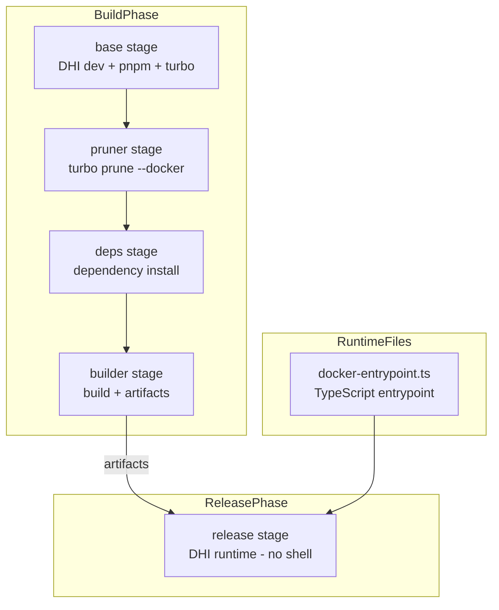
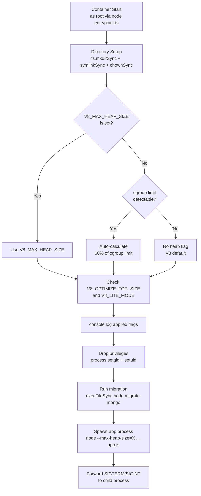

# Design Document: official-docker-image

## Overview

**Purpose**: Modernize the Dockerfile and entrypoint for the GROWI official Docker image based on 2025-2026 best practices, achieving enhanced security, optimized memory management, and improved build efficiency.

**Users**: Infrastructure administrators (build/deploy), GROWI operators (memory tuning), and Docker image end users (usage via docker-compose).

**Impact**: Redesign the existing 3-stage Dockerfile into a 5-stage configuration. Migrate the base image to Docker Hardened Images (DHI). Change the entrypoint from a shell script to TypeScript (using Node.js 24 native TypeScript execution), achieving a fully hardened configuration that requires no shell.

### Goals

- Up to 95% CVE reduction through DHI base image adoption
- **Fully shell-free TypeScript entrypoint** — Node.js 24 native TypeScript execution (type stripping), maintaining the minimized attack surface of the DHI runtime as-is
- Memory management via 3-tier fallback: `V8_MAX_HEAP_SIZE` / cgroup auto-calculation / V8 default
- Environment variable names aligned with V8 option names (`V8_MAX_HEAP_SIZE`, `V8_OPTIMIZE_FOR_SIZE`, `V8_LITE_MODE`)
- Improved build cache efficiency through the `turbo prune --docker` pattern
- Privilege drop via gosu → `process.setuid/setgid` (Node.js native)

### Non-Goals

- Changes to Kubernetes manifests / Helm charts (GROWI.cloud `V8_MAX_HEAP_SIZE` configuration is out of scope)
- Application code changes (adding gc(), migrating to .pipe(), etc. are separate specs)
- Updating docker-compose.yml (documentation updates only)
- Support for Node.js versions below 24
- Adding HEALTHCHECK instructions (k8s uses its own probes, Docker Compose users can configure their own)

## Architecture

### Existing Architecture Analysis

**Current Dockerfile 3-stage configuration:**

| Stage | Base Image | Role |
|-------|-----------|------|
| `base` | `node:20-slim` | Install pnpm + turbo |
| `builder` | `base` | `COPY . .` → install → build → artifacts |
| release (unnamed) | `node:20-slim` | gosu install → artifact extraction → execution |

**Main issues:**
- `COPY . .` includes the entire monorepo in the build layer
- pnpm version is hardcoded (`PNPM_VERSION="10.4.1"`)
- Typo in `---frozen-lockfile`
- Base image is node:20-slim (prone to CVE accumulation)
- No memory management flags
- No OCI labels
- gosu installation requires apt-get (runtime dependency on apt)

### Architecture Pattern & Boundary Map

```mermaid
graph TB
    subgraph BuildPhase
        base[base stage<br>DHI dev + pnpm + turbo]
        pruner[pruner stage<br>turbo prune --docker]
        deps[deps stage<br>dependency install]
        builder[builder stage<br>build + artifacts]
    end

    subgraph ReleasePhase
        release[release stage<br>DHI runtime - no shell]
    end

    base --> pruner
    pruner --> deps
    deps --> builder
    builder -->|artifacts| release

    subgraph RuntimeFiles
        entrypoint[docker-entrypoint.ts<br>TypeScript entrypoint]
    end

    entrypoint --> release
```

**Architecture Integration:**
- Selected pattern: Multi-stage build with dependency caching separation
- Domain boundaries: Build concerns (stages 1-4) vs Runtime concerns (stage 5 + entrypoint)
- Existing patterns preserved: Production dependency extraction via pnpm deploy, tar.gz artifact transfer
- New components: pruner stage (turbo prune), TypeScript entrypoint
- **Key change**: gosu + shell script → TypeScript entrypoint (`process.setuid/setgid` + `fs` module + `child_process.execFileSync/spawn`). Eliminates the need for copying busybox/bash, maintaining the minimized attack surface of the DHI runtime as-is. Executes `.ts` directly via Node.js 24 type stripping
- Steering compliance: Maintains Debian base (glibc performance), maintains monorepo build pattern

### Technology Stack

| Layer | Choice / Version | Role in Feature | Notes |
|-------|------------------|-----------------|-------|
| Base Image (build) | `dhi.io/node:24-debian13-dev` | Base for build stages | apt/bash/git/util-linux available |
| Base Image (runtime) | `dhi.io/node:24-debian13` | Base for release stage | Minimal configuration, 95% CVE reduction, **no shell** |
| Entrypoint | Node.js (TypeScript) | Initialization, heap calculation, privilege drop, process startup | Node.js 24 native type stripping, no busybox/bash needed |
| Privilege Drop | `process.setuid/setgid` (Node.js) | root → node user switch | No external binaries needed |
| Build Tool | `turbo prune --docker` | Monorepo minimization | Official Turborepo recommendation |
| Package Manager | pnpm (wget standalone) | Dependency management | corepack not adopted (scheduled for removal in Node.js 25+) |

> For the rationale behind adopting the TypeScript entrypoint and comparison with busybox-static/setpriv, see `research.md`.

## System Flows

### Entrypoint Execution Flow

```mermaid
flowchart TD
    Start[Container Start<br>as root via node entrypoint.ts] --> Setup[Directory Setup<br>fs.mkdirSync + symlinkSync + chownSync]
    Setup --> HeapCalc{V8_MAX_HEAP_SIZE<br>is set?}
    HeapCalc -->|Yes| UseEnv[Use V8_MAX_HEAP_SIZE]
    HeapCalc -->|No| CgroupCheck{cgroup limit<br>detectable?}
    CgroupCheck -->|Yes| AutoCalc[Auto-calculate<br>60% of cgroup limit]
    CgroupCheck -->|No| NoFlag[No heap flag<br>V8 default]
    UseEnv --> OptFlags[Check V8_OPTIMIZE_FOR_SIZE<br>and V8_LITE_MODE]
    AutoCalc --> OptFlags
    NoFlag --> OptFlags
    OptFlags --> LogFlags[console.log applied flags]
    LogFlags --> DropPriv[Drop privileges<br>process.setgid + setuid]
    DropPriv --> Migration[Run migration<br>execFileSync node migrate-mongo]
    Migration --> SpawnApp[Spawn app process<br>node --max-heap-size=X ... app.js]
    SpawnApp --> SignalFwd[Forward SIGTERM/SIGINT<br>to child process]
```

**Key Decisions:**
- Prioritize cgroup v2 (`/sys/fs/cgroup/memory.max`), fall back to v1
- Treat cgroup v1 unlimited value (very large number) as no flag (threshold: 64GB)
- `--max-heap-size` is passed to the spawned child process (the application itself), not the entrypoint process
- Migration is invoked directly via `child_process.execFileSync` calling node (no `npm run`, no shell needed)
- App startup uses `child_process.spawn` + signal forwarding to fulfill PID 1 responsibilities

### Docker Build Flow

```mermaid
flowchart LR
    subgraph Stage1[base]
        S1[DHI dev image<br>+ pnpm + turbo]
    end

    subgraph Stage2[pruner]
        S2A[COPY monorepo]
        S2B[turbo prune --docker]
    end

    subgraph Stage3[deps]
        S3A[COPY json + lockfile]
        S3B[pnpm install --frozen-lockfile]
    end

    subgraph Stage4[builder]
        S4A[COPY full source]
        S4B[turbo run build]
        S4C[pnpm deploy + tar.gz]
    end

    subgraph Stage5[release]
        S5A[DHI runtime<br>no additional binaries]
        S5B[Extract artifacts]
        S5C[COPY entrypoint.js]
    end

    Stage1 --> Stage2 --> Stage3 --> Stage4
    Stage4 -->|tar.gz| Stage5
```

## Components and Interfaces

| Component | Domain/Layer | Intent | Key Dependencies |
|-----------|-------------|--------|-----------------|
| Dockerfile | Infrastructure | 5-stage Docker image build definition | DHI images, turbo, pnpm |
| docker-entrypoint.ts | Infrastructure | Container startup initialization (TypeScript) | Node.js fs/child_process, cgroup fs |
| docker-entrypoint.spec.ts | Infrastructure | Unit tests for entrypoint | vitest |
| Dockerfile.dockerignore | Infrastructure | Build context filter | — |
| README.md | Documentation | Docker Hub image documentation | — |
| buildspec.yml | CI/CD | CodeBuild build definition | AWS Secrets Manager, dhi.io |

### Dockerfile

**Responsibilities & Constraints**
- 5-stage configuration: `base` → `pruner` → `deps` → `builder` → `release`
- Use of DHI base images (`dhi.io/node:24-debian13-dev` / `dhi.io/node:24-debian13`)
- **No shell or additional binary copying in runtime** (everything is handled by the Node.js entrypoint)

**Stage Definitions:**
- **base**: DHI dev image + pnpm (wget) + turbo + apt packages (`ca-certificates`, `wget`)
- **pruner**: `COPY . .` + `turbo prune @growi/app --docker`
- **deps**: COPY json/lockfile from pruner + `pnpm install --frozen-lockfile` + node-gyp
- **builder**: COPY full source from pruner + `turbo run build` + `pnpm deploy` + artifact packaging
- **release**: DHI runtime (no shell) + `COPY --from=builder` artifacts + entrypoint + OCI labels + EXPOSE/VOLUME

### docker-entrypoint.ts

**Responsibilities & Constraints**
- Written in TypeScript, executed via Node.js 24 native type stripping (enums not allowed)
- Directory setup as root (`/data/uploads` + symlink, `/tmp/page-bulk-export`)
- Heap size determination via 3-tier fallback
- Privilege drop via `process.setgid()` + `process.setuid()`
- Migration execution via `child_process.execFileSync` (direct node invocation, no shell)
- App process startup via `child_process.spawn` with signal forwarding (PID 1 responsibilities)
- No external binary dependencies

**Environment Variable Interface**

| Variable | Type | Default | Description |
|----------|------|---------|-------------|
| `V8_MAX_HEAP_SIZE` | int (MB) | (unset) | Explicitly specify the --max-heap-size value for Node.js |
| `V8_OPTIMIZE_FOR_SIZE` | `"true"` / (unset) | (unset) | Enable the --optimize-for-size flag |
| `V8_LITE_MODE` | `"true"` / (unset) | (unset) | Enable the --lite-mode flag |

> **Naming Convention**: Environment variable names are aligned with their corresponding V8 option names (`--max-heap-size`, `--optimize-for-size`, `--lite-mode`) prefixed with `V8_`. This improves discoverability and self-documentation compared to the previous `GROWI_`-prefixed names.

**Batch Contract**
- **Trigger**: On container startup (`ENTRYPOINT ["node", "/docker-entrypoint.ts"]`)
- **Input validation**: V8_MAX_HEAP_SIZE (positive int, empty = unset), V8_OPTIMIZE_FOR_SIZE/V8_LITE_MODE (only `"true"` is valid), cgroup v2 (`memory.max`: numeric or `"max"`), cgroup v1 (`memory.limit_in_bytes`: numeric, large value = unlimited)
- **Output**: Node flags passed directly as arguments to `child_process.spawn`
- **Idempotency**: Executed on every restart, safe via `fs.mkdirSync({ recursive: true })`

### README.md

**Responsibilities & Constraints**
- Docker Hub image documentation (published to hub.docker.com/r/growilabs/growi)
- Document the V8 memory management environment variables under Configuration > Environment Variables section
- Include variable name, type, default, and description for each: `V8_MAX_HEAP_SIZE`, `V8_OPTIMIZE_FOR_SIZE`, `V8_LITE_MODE`

## Error Handling

| Error | Category | Response |
|-------|----------|----------|
| cgroup file read failure | System | Warn and continue with no flag (V8 default) |
| V8_MAX_HEAP_SIZE is invalid | User | Warn and continue with no flag (container still starts) |
| Directory creation/permission failure | System | `process.exit(1)` — check volume mount configuration |
| Migration failure | Business Logic | `execFileSync` throws → `process.exit(1)` — Docker/k8s restarts |
| App process abnormal exit | System | Propagate child process exit code |

## Performance & Scalability

- **Build cache**: `turbo prune --docker` caches the dependency install layer. Skips dependency installation during rebuilds when only source code changes
- **Image size**: No additional binaries in DHI runtime. Base layer is smaller compared to node:24-slim
- **Memory efficiency**: Total heap control via `--max-heap-size` avoids the v24 trusted_space overhead issue. Prevents memory pressure in multi-tenant environments
