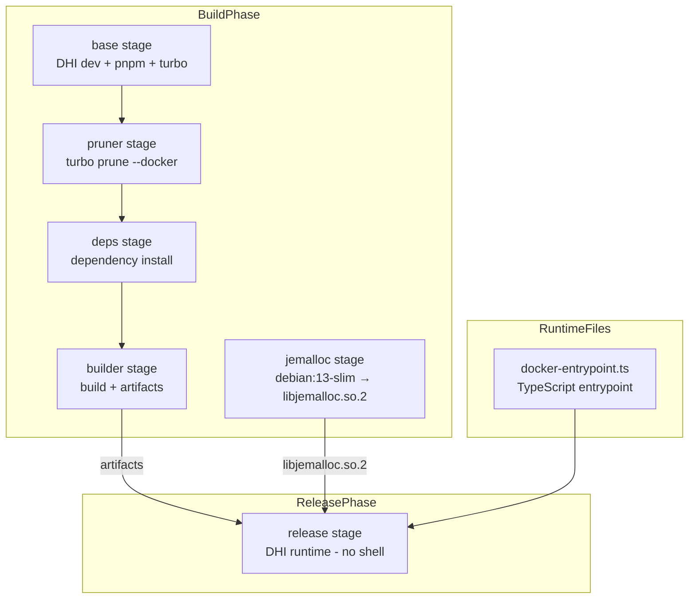
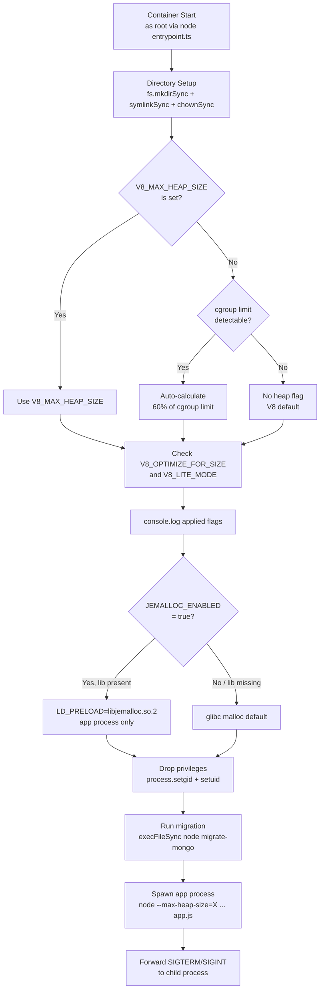
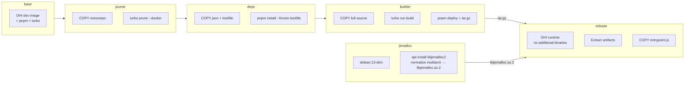

# Design Document: official-docker-image

## Overview

**Purpose**: Modernize the Dockerfile and entrypoint for the GROWI official Docker image based on 2025-2026 best practices, achieving enhanced security, optimized memory management, and improved build efficiency.

**Users**: Infrastructure administrators (build/deploy), GROWI operators (memory tuning), and Docker image end users (usage via docker-compose).

**Impact**: Redesign the existing 3-stage Dockerfile into a 6-stage configuration (a 5-stage build chain plus an independent `jemalloc` library-provider stage). Migrate the base image to Docker Hardened Images (DHI). Change the entrypoint from a shell script to TypeScript (using Node.js 24 native TypeScript execution), achieving a fully hardened configuration that requires no shell.

### Goals

- Up to 95% CVE reduction through DHI base image adoption
- **Fully shell-free TypeScript entrypoint** — Node.js 24 native TypeScript execution (type stripping), maintaining the minimized attack surface of the DHI runtime as-is
- Memory management via 3-tier fallback: `V8_MAX_HEAP_SIZE` / cgroup auto-calculation / V8 default
- Opt-in native allocator swap to jemalloc (`JEMALLOC_ENABLED=true`) to release glibc's retained main-arena memory under load — default stays glibc
- Environment variable names aligned with V8 option names (`V8_MAX_HEAP_SIZE`, `V8_OPTIMIZE_FOR_SIZE`, `V8_LITE_MODE`)
- Improved build cache efficiency through the `turbo prune --docker` pattern
- Privilege drop via gosu → `process.setuid/setgid` (Node.js native)

### Non-Goals

- Changes to Kubernetes manifests / Helm charts (GROWI.cloud `V8_MAX_HEAP_SIZE` configuration is out of scope)
- Application code changes (adding gc(), migrating to .pipe(), etc. are separate specs)
- Updating docker-compose.yml (documentation updates only)
- Support for Node.js versions below 24
- Adding HEALTHCHECK instructions (k8s uses its own probes, Docker Compose users can configure their own)

## Architecture

### Existing Architecture Analysis

**Current Dockerfile 3-stage configuration:**

| Stage | Base Image | Role |
|-------|-----------|------|
| `base` | `node:20-slim` | Install pnpm + turbo |
| `builder` | `base` | `COPY . .` → install → build → artifacts |
| release (unnamed) | `node:20-slim` | gosu install → artifact extraction → execution |

**Main issues:**
- `COPY . .` includes the entire monorepo in the build layer
- pnpm version is hardcoded (`PNPM_VERSION="10.32.1"`)
- Typo in `---frozen-lockfile`
- Base image is node:20-slim (prone to CVE accumulation)
- No memory management flags
- No OCI labels
- gosu installation requires apt-get (runtime dependency on apt)

### Architecture Pattern & Boundary Map

```mermaid
graph TB
    subgraph BuildPhase
        base[base stage<br>DHI dev + pnpm + turbo]
        pruner[pruner stage<br>turbo prune --docker]
        deps[deps stage<br>dependency install]
        builder[builder stage<br>build + artifacts]
        jemalloc[jemalloc stage<br>debian:13-slim → libjemalloc.so.2]
    end

    subgraph ReleasePhase
        release[release stage<br>DHI runtime - no shell]
    end

    base --> pruner
    pruner --> deps
    deps --> builder
    builder -->|artifacts| release
    jemalloc -->|libjemalloc.so.2| release

    subgraph RuntimeFiles
        entrypoint[docker-entrypoint.ts<br>TypeScript entrypoint]
    end

    entrypoint --> release
```

**Architecture Integration:**
- Selected pattern: Multi-stage build with dependency caching separation
- Domain boundaries: Build concerns (stages 1-4) vs Runtime concerns (stage 5 + entrypoint)
- Existing patterns preserved: Production dependency extraction via pnpm deploy, tar.gz artifact transfer
- New components: pruner stage (turbo prune), TypeScript entrypoint, independent `jemalloc` library-provider stage (opt-in allocator)
- **Key change**: gosu + shell script → TypeScript entrypoint (`process.setuid/setgid` + `fs` module + `child_process.execFileSync/spawn`). Eliminates the need for copying busybox/bash, maintaining the minimized attack surface of the DHI runtime as-is. Executes `.ts` directly via Node.js 24 type stripping
- Steering compliance: Maintains Debian base (glibc performance), maintains monorepo build pattern

### Technology Stack

| Layer | Choice / Version | Role in Feature | Notes |
|-------|------------------|-----------------|-------|
| Base Image (build) | `dhi.io/node:24-debian13-dev` | Base for build stages | apt/bash/git/util-linux available |
| Base Image (runtime) | `dhi.io/node:24-debian13` | Base for release stage | Minimal configuration, 95% CVE reduction, **no shell** |
| Entrypoint | Node.js (TypeScript) | Initialization, heap calculation, privilege drop, process startup | Node.js 24 native type stripping, no busybox/bash needed |
| Privilege Drop | `process.setuid/setgid` (Node.js) | root → node user switch | No external binaries needed |
| Build Tool | `turbo prune --docker` | Monorepo minimization | Official Turborepo recommendation |
| Package Manager | pnpm via `corepack enable` | Dependency management | Version pinned by workspace `packageManager`. A wget standalone install was tried first but caused recurring build issues — see Requirement 1 decision update |
| Native Allocator (opt-in) | jemalloc via `LD_PRELOAD` | Return freed memory to the OS under load | Provided by an independent `debian:13-slim` stage (glibc-generation match); enabled only when `JEMALLOC_ENABLED=true`; app process only; default glibc |

> For the rationale behind adopting the TypeScript entrypoint and comparison with busybox-static/setpriv, see `research.md`.

## System Flows

### Entrypoint Execution Flow

```mermaid
flowchart TD
    Start[Container Start<br>as root via node entrypoint.ts] --> Setup[Directory Setup<br>fs.mkdirSync + symlinkSync + chownSync]
    Setup --> HeapCalc{V8_MAX_HEAP_SIZE<br>is set?}
    HeapCalc -->|Yes| UseEnv[Use V8_MAX_HEAP_SIZE]
    HeapCalc -->|No| CgroupCheck{cgroup limit<br>detectable?}
    CgroupCheck -->|Yes| AutoCalc[Auto-calculate<br>60% of cgroup limit]
    CgroupCheck -->|No| NoFlag[No heap flag<br>V8 default]
    UseEnv --> OptFlags[Check V8_OPTIMIZE_FOR_SIZE<br>and V8_LITE_MODE]
    AutoCalc --> OptFlags
    NoFlag --> OptFlags
    OptFlags --> LogFlags[console.log applied flags]
    LogFlags --> ResolveAlloc{JEMALLOC_ENABLED<br>= true?}
    ResolveAlloc -->|Yes, lib present| Jemalloc[LD_PRELOAD=libjemalloc.so.2<br>app process only]
    ResolveAlloc -->|No / lib missing| Glibc[glibc malloc default]
    Jemalloc --> DropPriv[Drop privileges<br>process.setgid + setuid]
    Glibc --> DropPriv
    DropPriv --> Migration[Run migration<br>execFileSync node migrate-mongo]
    Migration --> SpawnApp[Spawn app process<br>node --max-heap-size=X ... app.js]
    SpawnApp --> SignalFwd[Forward SIGTERM/SIGINT<br>to child process]
```

**Key Decisions:**
- Prioritize cgroup v2 (`/sys/fs/cgroup/memory.max`), fall back to v1
- Treat cgroup v1 unlimited value (very large number) as no flag (threshold: 64GB)
- `--max-heap-size` is passed to the spawned child process (the application itself), not the entrypoint process
- Migration is invoked directly via `child_process.execFileSync` calling node (no `npm run`, no shell needed)
- App startup uses `child_process.spawn` + signal forwarding to fulfill PID 1 responsibilities
- The allocator is resolved after logging flags and before privilege drop; when opted in, `LD_PRELOAD` is set on the spawned **app process only** (not the migration child) — see "Native Allocator Resolution (opt-in jemalloc)"
- The Prisma query engine is **not** part of this flow — it is resolved at build time via `PRISMA_QUERY_ENGINE_LIBRARY` (see "Prisma Query Engine Resolution"); the entrypoint neither copies nor discovers it

### Docker Build Flow

```mermaid
flowchart LR
    subgraph Stage1[base]
        S1[DHI dev image<br>+ pnpm + turbo]
    end

    subgraph Stage2[pruner]
        S2A[COPY monorepo]
        S2B[turbo prune --docker]
    end

    subgraph Stage3[deps]
        S3A[COPY json + lockfile]
        S3B[pnpm install --frozen-lockfile]
    end

    subgraph Stage4[builder]
        S4A[COPY full source]
        S4B[turbo run build]
        S4C[pnpm deploy + tar.gz]
    end

    subgraph StageJ[jemalloc]
        SJA[debian:13-slim]
        SJB[apt install libjemalloc2<br>normalize multiarch → libjemalloc.so.2]
    end

    subgraph Stage5[release]
        S5A[DHI runtime<br>no additional binaries]
        S5B[Extract artifacts]
        S5C[COPY entrypoint.js]
    end

    Stage1 --> Stage2 --> Stage3 --> Stage4
    Stage4 -->|tar.gz| Stage5
    StageJ -->|libjemalloc.so.2| Stage5
```

## Components and Interfaces

| Component | Domain/Layer | Intent | Key Dependencies |
|-----------|-------------|--------|-----------------|
| Dockerfile | Infrastructure | 6-stage Docker image build definition (5-stage build chain + independent `jemalloc` provider); per-arch Prisma engine wiring via `PRISMA_QUERY_ENGINE_LIBRARY`; opt-in jemalloc `.so` for the runtime | DHI images, turbo, pnpm, debian:13-slim (jemalloc) |
| docker-entrypoint.ts | Infrastructure | Container startup initialization (TypeScript); resolves the opt-in jemalloc `LD_PRELOAD` for the app process | Node.js fs/child_process, cgroup fs |
| docker-entrypoint.spec.ts | Infrastructure | Unit tests for entrypoint | vitest |
| Dockerfile.dockerignore | Infrastructure | Build context filter | — |
| README.md | Documentation | Docker Hub image documentation | — |
| buildspec.yml | CI/CD | CodeBuild build definition | AWS Secrets Manager, dhi.io |

### Dockerfile

**Responsibilities & Constraints**
- 6-stage configuration: a 5-stage build chain `base` → `pruner` → `deps` → `builder` → `release`, plus an independent `jemalloc` stage that only provides `libjemalloc.so.2` to `release`
- Use of DHI base images (`dhi.io/node:24-debian13-dev` / `dhi.io/node:24-debian13`)
- **No shell or additional binary copying in runtime** (everything is handled by the Node.js entrypoint)

**Stage Definitions:**
- **base**: DHI dev image + `corepack enable` (pnpm, version-pinned) + turbo (no extra apt packages needed for the package manager)
- **pruner**: `COPY . .` + `turbo prune @growi/app --docker`
- **deps**: COPY json/lockfile from pruner + `pnpm install --frozen-lockfile` + node-gyp
- **builder**: COPY full source from pruner + `turbo run build` + `pnpm deploy` + artifact packaging + per-arch Prisma engine symlink (`libquery_engine-active.so.node` → the BuildKit `TARGETARCH` target, fail-fast; see "Prisma Query Engine Resolution")
- **jemalloc**: `debian:13-slim` (matches the release image's distro/glibc generation) + `apt-get install --no-install-recommends libjemalloc2` in a single RUN layer + normalize the multiarch path (`/usr/lib/*-linux-gnu/libjemalloc.so.2`) to a single `/jemalloc/libjemalloc.so.2`. Independent of the build chain; exists only because the DHI runtime has no package manager
- **release**: DHI runtime (no shell) + `COPY --from=builder` artifacts + entrypoint + `COPY --from=jemalloc` the single `libjemalloc.so.2` to `/usr/local/lib/` (opt-in allocator) + `ENV PRISMA_QUERY_ENGINE_LIBRARY` (per-arch engine symlink) + OCI labels + EXPOSE/VOLUME

### Prisma Query Engine Resolution

**Problem**: `@prisma/client` (the `prisma-client` generator) loads a native query engine (`.so.node`, architecture-specific: `debian-openssl-3.0.x` for amd64, `linux-arm64-openssl-3.0.x` for arm64). GROWI has two server-side consumers, built by different toolchains:
- **Express server** (`dist/server`, compiled by `tsc`) resolves the engine next to its own compiled module dir (`dist/generated/prisma/`, populated by `bin/postbuild-server.ts`) — this always worked.
- **Next.js SSR** (`getServerSideProps`), **bundled by Turbopack** into `.next/server/...`. At runtime it cannot resolve the engine through `@prisma/client`'s internal `resolveEnginePath` search: Turbopack rewrites `__dirname` and the baked generator `output.value`, so none of the search locations (`[dirname, resolve(dirname,".."), output.value, ".../.prisma/client", "/tmp/prisma-engines", cwd]`) point at the shipped engine. This surfaces as `PrismaClientInitializationError: could not locate the Query Engine` (HTTP 500) on any SSR page that runs a Prisma query (e.g. `prisma.bookmarks.count()` on page view).

**Resolution (build time, per-arch)**: `resolveEnginePath` reads the public, stable env var `PRISMA_QUERY_ENGINE_LIBRARY` *before* its internal search and, if set, returns it directly (skipping the search entirely). It does **not** verify the path exists — so a wrong or dangling value fails only at runtime (prod-only 500), which is why the builder step below is deliberately fail-fast. The Dockerfile wires it declaratively:
- **builder stage** (has a shell): creates a fixed-name symlink `dist/generated/prisma/libquery_engine-active.so.node` → `libquery_engine-<target>.so.node`, where `<target>` is mapped from BuildKit's predefined `TARGETARCH` ARG (`amd64` → `debian-openssl-3.0.x`, `arm64` → `linux-arm64-openssl-3.0.x`). `TARGETARCH` is used rather than `dpkg`/`uname` because it is independent of the builder base image and of future `--platform`/buildx multi-arch builds. The step is **fail-fast**: an unknown/unset `TARGETARCH` exits 1 (non-BuildKit builders leave it empty and are intentionally unsupported — CI enables BuildKit via `DOCKER_BUILDKIT=1`), and the target engine must exist (`test -f`) before the symlink is created (no dangling link). This turns what would be a runtime-only prod 500 into a build failure.
- **release stage** (no shell): `ENV PRISMA_QUERY_ENGINE_LIBRARY="${appDir}/apps/app/dist/generated/prisma/libquery_engine-active.so.node"` — one static string that resolves per-arch through the symlink.

`apps/app/prisma/schema.prisma` declares `binaryTargets = ["native", "debian-openssl-3.0.x", "linux-arm64-openssl-3.0.x"]` so both runtime engines are always generated into `dist` regardless of the build host (this also keeps the turbo `prisma:generate` cache architecture-safe). Operators can still override `PRISMA_QUERY_ENGINE_LIBRARY` via compose `environment:` (container env wins over image ENV).

**Why the env var, not the entrypoint**: `PRISMA_QUERY_ENGINE_LIBRARY` is a public, documented Prisma API and is declarative (visible via `docker inspect`). Relying instead on the hardcoded `/tmp/prisma-engines` entry of the internal search list — e.g. by copying the engine there in the entrypoint — is a maintenance hazard: it is undocumented, and a future Prisma release dropping that entry would silently return SSR to 500 while the entrypoint still exits successfully. Engine resolution is therefore a build-time Dockerfile concern; the entrypoint does not touch it. **Coupling to note**: the Dockerfile now owns the `arch → Prisma target name` mapping, which must stay in sync with `schema.prisma` `binaryTargets` and the runtime base-image libc (currently `dhi.io/node:24-debian13` = glibc) — a comment in the Dockerfile flags this.

### Native Allocator Resolution (opt-in jemalloc)

**Problem**: Under GROWI's sustained-load profile, glibc malloc retains hundreds of MiB of freed memory in its **main arena** — the `[heap]` (sbrk) segment grew 25 → 407 MiB in an smaps diff while the V8 heap, `external` Buffers, anonymous mmaps, and the Prisma engine stayed flat. This is freed-but-unreturned memory (fragmentation prevents glibc from trimming the heap), not a native leak and not arena proliferation (`MALLOC_ARENA_MAX=2` measured no effect). The container's working set stays inflated indefinitely. See research.md "Native Allocator Retention" for the full A/B table.

**Resolution (opt-in, app process only)**: jemalloc returns freed memory to the OS via time-based decay; the same scenario measured drain-phase RSS retention of +468 MiB on glibc vs +142 MiB with jemalloc (−70%). Because the DHI runtime ships no package manager, an independent `jemalloc` build stage (`debian:13-slim`, chosen to match the release image's distro so the library is built against the same glibc generation) installs `libjemalloc2` and normalizes the multiarch path to `/jemalloc/libjemalloc.so.2`; the release stage copies that single `.so` to `/usr/local/lib/libjemalloc.so.2`. jemalloc's own runtime deps (libc/libm/libstdc++/libgcc) are already present in any Node.js image.

The entrypoint's `resolveJemallocPreload(env, libPath, exists)` decides the `LD_PRELOAD`:
- Returns `undefined` (keep glibc) unless `env.JEMALLOC_ENABLED === 'true'` — the swap is strictly opt-in.
- If enabled but the library file is absent, it logs an error and returns `undefined` (boots normally on glibc — a missing library never blocks startup).
- If enabled and present, it returns the library path, **prepended** to any operator-supplied `LD_PRELOAD` (`${lib}:${existing}`) so the operator's value is preserved and jemalloc wins symbol interposition.

`spawnApp` applies the resolved value to the **app process only**. The migration child (`execFileSync`) is short-lived, so swapping its allocator buys nothing and would only widen the opt-in's blast radius. The entrypoint logs the active allocator at startup. `env` and the filesystem-existence check are **injected as parameters** so the decision logic is unit-tested without mutating `process.env` or touching the real filesystem.

**Why opt-in, not default**: the payoff grows with load (jemalloc adds ~12 MiB of metadata at idle), and CPU/latency under jemalloc must be validated before a default flip. Keeping glibc the default lets GROWI.cloud soak jemalloc per-app first.

**Known limitation**: the fallback guards only against the library *file* being absent (`fs.existsSync`). If the file exists but fails to load at runtime (transitive-dep or symbol-version mismatch), the dynamic linker aborts the app process — there is no graceful glibc fallback for that case. The deliberate `debian:13`/`debian13` glibc-generation match makes this unlikely, and the feature is opt-in and soak-tested per-app.

### docker-entrypoint.ts

**Responsibilities & Constraints**
- Written in TypeScript, executed via Node.js 24 native type stripping (enums not allowed)
- Directory setup as root (`/data/uploads` + symlink, `/tmp/page-bulk-export`)
- Heap size determination via 3-tier fallback
- Privilege drop via `process.setgid()` + `process.setuid()`
- Migration execution via `child_process.execFileSync` (direct node invocation, no shell)
- App process startup via `child_process.spawn` with signal forwarding (PID 1 responsibilities)
- Opt-in jemalloc allocator resolution (`resolveJemallocPreload`) — sets `LD_PRELOAD` on the app process only when `JEMALLOC_ENABLED=true` and the library is present
- No external binary dependencies

**Environment Variable Interface**

| Variable | Type | Default | Description |
|----------|------|---------|-------------|
| `V8_MAX_HEAP_SIZE` | int (MB) | (unset) | Explicitly specify the --max-heap-size value for Node.js |
| `V8_OPTIMIZE_FOR_SIZE` | `"true"` / (unset) | (unset) | Enable the --optimize-for-size flag |
| `V8_LITE_MODE` | `"true"` / (unset) | (unset) | Enable the --lite-mode flag |
| `JEMALLOC_ENABLED` | `"true"` / (unset) | (unset) | Opt-in: preload jemalloc (`LD_PRELOAD`) for the app process. Missing library → error log + glibc fallback. See "Native Allocator Resolution" |

> **Naming Convention**: Environment variable names are aligned with their corresponding V8 option names (`--max-heap-size`, `--optimize-for-size`, `--lite-mode`) prefixed with `V8_`. This improves discoverability and self-documentation compared to the previous `GROWI_`-prefixed names.

**Batch Contract**
- **Trigger**: On container startup (`ENTRYPOINT ["node", "/docker-entrypoint.ts"]`)
- **Input validation**: V8_MAX_HEAP_SIZE (positive int, empty = unset), V8_OPTIMIZE_FOR_SIZE/V8_LITE_MODE (only `"true"` is valid), cgroup v2 (`memory.max`: numeric or `"max"`), cgroup v1 (`memory.limit_in_bytes`: numeric, large value = unlimited)
- **Output**: Node flags passed directly as arguments to `child_process.spawn`
- **Idempotency**: Executed on every restart, safe via `fs.mkdirSync({ recursive: true })`

### README.md

**Responsibilities & Constraints**
- Docker Hub image documentation (published to hub.docker.com/r/growilabs/growi)
- Document the V8 memory management environment variables under Configuration > Environment Variables section
- Include variable name, type, default, and description for each: `V8_MAX_HEAP_SIZE`, `V8_OPTIMIZE_FOR_SIZE`, `V8_LITE_MODE`

## Error Handling

| Error | Category | Response |
|-------|----------|----------|
| cgroup file read failure | System | Warn and continue with no flag (V8 default) |
| V8_MAX_HEAP_SIZE is invalid | User | Warn and continue with no flag (container still starts) |
| Directory creation/permission failure | System | `process.exit(1)` — check volume mount configuration |
| Migration failure | Business Logic | `execFileSync` throws → `process.exit(1)` — Docker/k8s restarts |
| App process abnormal exit | System | Propagate child process exit code |
| jemalloc library missing (`JEMALLOC_ENABLED=true`) | System | Log an error and boot normally on glibc malloc (never blocks startup) |

## Performance & Scalability

- **Build cache**: `turbo prune --docker` caches the dependency install layer. Skips dependency installation during rebuilds when only source code changes
- **Image size**: No additional binaries in DHI runtime. Base layer is smaller compared to node:24-slim
- **Memory efficiency**: Total heap control via `--max-heap-size` avoids the v24 trusted_space overhead issue. Prevents memory pressure in multi-tenant environments
