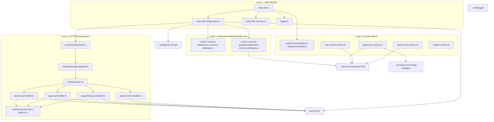
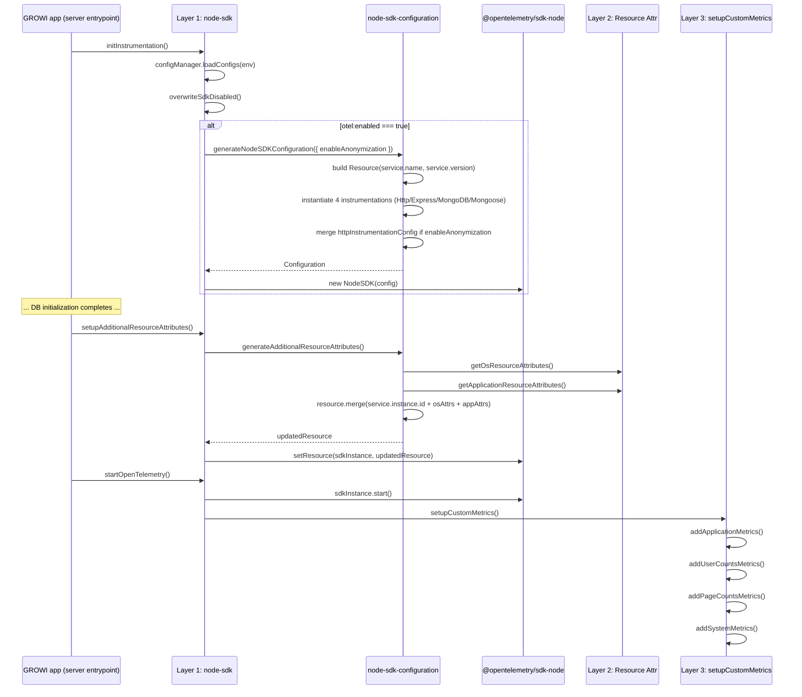

# Technical Design — opentelemetry

## Overview

**Purpose**: GROWI の OpenTelemetry 統合 (`apps/app/src/features/opentelemetry/`) を、SDK ライフサイクル / Resource Attribute / Custom Metric / HTTP Anonymization の 4 レイヤに分けて責務境界を明文化する大局的なメンテナンス spec。

**Users**:
- GROWI 開発者（メトリクス追加・anonymization handler 追加・SDK バージョンアップを行う）。
- OpenTelemetry 受信側インフラ管理者（Prometheus / Grafana / Collector を運用する）。

**Impact**: 既に稼働している実装の現状をスナップショットとして固定化する。新規実装はゼロで、コード変更は伴わない。将来の機能追加・変更は本 spec の Boundary Commitments に従って境界の中で行われる。

### Goals

- 4 レイヤそれぞれの責務・境界・依存関係を明文化する。
- Resource Attribute は identity 専用、設定値は `growi.configs` ラベル、観測値は `growi.*` / `system.*` / `process.*` メトリクスへ、というレイヤ分離を維持する。
- 新規 Custom Metric / Anonymization Handler の追加手順を「テンプレート化」して、追加時のレビュー差分を最小化する。
- Resource Attribute / Metric / Span Attribute の責務分離（identity / 設定値 / 観測値 / span attribute）を Design Decisions として固定する。

### Non-Goals

- 既存メトリクス / Resource Attribute の名称変更・再構成。
- OpenTelemetry Log Signal の利用開始。
- ブラウザサイドからの telemetry 出力。
- `@opentelemetry/host-metrics` 等への置き換え。
- `service.instance.id` の自動生成（現状は `otel:serviceInstanceId` か `app:serviceInstanceId` の config 値を passthrough する）。

## Boundary Commitments

### This Spec Owns

#### Layer 1: SDK ライフサイクル

- `node-sdk.ts` の `initInstrumentation()` / `setupAdditionalResourceAttributes()` / `startOpenTelemetry()` の 3 関数。
- `overwriteSdkDisabled()` による `OTEL_SDK_DISABLED` と `otel:enabled` の整合化。
- `node-sdk-configuration.ts` の `generateNodeSDKConfiguration(opts)` および `generateAdditionalResourceAttributes(opts)`。
- `node-sdk-resource.ts` の `getResource()` / `setResource()`（NodeSDK private `_resource` への reflective アクセサ）。
- `logger.ts` の `DiagLoggerPinoAdapter` と `initLogger()`。
- 同一プロセス内の SDK インスタンス二重生成防止（`sdkInstance` モジュール変数）。

#### Layer 2: Resource Attribute（identity 専用）

- `custom-resource-attributes/os-resource-attributes.ts` の `getOsResourceAttributes(): Attributes`。
- `custom-resource-attributes/application-resource-attributes.ts` の `getApplicationResourceAttributes(): Promise<Attributes>`。
- `custom-resource-attributes/index.ts` のバレル。
- emit する identity 属性: `os.type`, `os.platform`, `os.arch`, `growi.service.type`, `growi.deployment.type`。
- 2 段階初期化（DB 非依存の OS info → DB 初期化後の `service.instance.id` および application info）の責務。

#### Layer 3: Custom Metric

- `custom-metrics/index.ts` の barrel と `setupCustomMetrics(): Promise<void>`。
- `custom-metrics/application-metrics.ts` の `addApplicationMetrics()`（`growi.configs` info gauge + 5 ラベル）。
- `custom-metrics/user-counts-metrics.ts` の `addUserCountsMetrics()`（`growi.users.total` / `growi.users.active`）。
- `custom-metrics/page-counts-metrics.ts` の `addPageCountsMetrics()`（`growi.pages.total`）。
- `custom-metrics/system-metrics.ts` の `addSystemMetrics()`（`system.memory.limit` / `system.host.memory.total` / `process.memory.usage` / `process.runtime.v8.heap.{used,total,external}`）。
- Meter 命名規約: `growi-<scope>-metrics`, version `'1.0.0'`。
- Observation 実装規約: `ObservableGauge` + `addBatchObservableCallback` + try/catch + `diag.createComponentLogger` で例外吸収。

#### Layer 4: HTTP Anonymization

- `anonymization/index.ts` のバレル（`httpInstrumentationConfig` のエクスポート）。
- `anonymization/anonymize-http-requests.ts` の `startIncomingSpanHook` 実装（module discovery loop）。
- `anonymization/interfaces/anonymization-module.ts` の `AnonymizationModule` インターフェース。
- `anonymization/handlers/index.ts` の `anonymizationModules` 配列（4 module の登録順）。
- 4 つの handler 実装: `search-api-handler.ts`, `page-listing-api-handler.ts`, `page-api-handler.ts`, `page-access-handler.ts`。
- `anonymization/utils/anonymize-query-params.ts` の `anonymizeQueryParams(target, paramNames)`。
- `http.target` への匿名化 URL 出力。

#### Layer 5: SemConv ローカルコピー

- `semconv.ts` の `ATTR_SERVICE_INSTANCE_ID` / `ATTR_HTTP_TARGET` 定義。
- incubating semconv の文字列定数化と上流 minor リリース変更からの隔離。

### Out of Boundary

- `~/server/service/growi-info`（`growiInfoService`） — consumer として利用するのみ。`getGrowiInfo(opts)` の API 仕様は本 spec では定義しない。
- `~/server/service/config-manager` — `otel:*` config 4 種を読み取るのみ。config 定義の追加・改名は config-manager 側の責務。
- `~/utils/growi-version` — `service.version` の供給元。
- `~/utils/logger` — pino logger ファクトリ。
- `@growi/core/dist/utils/page-path-utils` — anonymization で利用する path helper（`isPermalink` / `isUserPage` / `getUsernameByPath` 等）。
- 各 `@opentelemetry/*` パッケージの内部実装。Auto-instrumentation の挙動チューニング（HTTP / Express / Mongoose 等の挙動は instrumentation の責務）。
- Trace span への独自 attribute 付与（`http.target` 以外）。
- OpenTelemetry Log Signal、ブラウザ telemetry。
- OTLP wire 仕様および受信側ダッシュボード／アラート。

### Allowed Dependencies

- Node.js 標準モジュール: `node:os`, `node:v8`, `node:process`, `node:crypto`, `node:http`。
- `@opentelemetry/api`: `metrics`, `diag`, `Attributes`, `Meter`, `ObservableGauge` 等の public API のみ。
- `@opentelemetry/sdk-node`, `@opentelemetry/sdk-metrics`, `@opentelemetry/sdk-trace-node`, `@opentelemetry/resources`: SDK 初期化用。
- `@opentelemetry/exporter-trace-otlp-grpc`, `@opentelemetry/exporter-metrics-otlp-grpc`: OTLP gRPC エクスポート。
- `@opentelemetry/instrumentation-http`, `@opentelemetry/instrumentation-express`, `@opentelemetry/instrumentation-mongodb`, `@opentelemetry/instrumentation-mongoose`: 4 instrumentation を direct import。`@opentelemetry/auto-instrumentations-node` は採用しない（Design Decisions 参照）。
- `@opentelemetry/instrumentation`（type-only import）: `Instrumentation` 型の取得用。
- `@opentelemetry/semantic-conventions`: stable attribute のみ（`ATTR_SERVICE_NAME` / `ATTR_SERVICE_VERSION`）。incubating は import しない。
- 上記以外の新規 npm dependency 追加は不可。追加する場合は `apps/app/.next/node_modules/` 残留有無の確認と `dependencies` 分類が必要（`.claude/rules/package-dependencies.md` 参照）。

### Revalidation Triggers

- `@opentelemetry/api` または `@opentelemetry/sdk-*` のメジャー更新 → Meter / ObservableGauge / NodeSDK API シグネチャの再確認、特に `node-sdk-resource.ts` の `_resource` private アクセスが public 化されていないか確認。
- `growiInfoService.getGrowiInfo()` の API 変更（追加フラグ削除、返り値型変更）→ 該当する `application-metrics.ts` / `user-counts-metrics.ts` / `page-counts-metrics.ts` / `application-resource-attributes.ts` の参照を再確認。
- `@opentelemetry/semantic-conventions` の `service.instance.id` / `http.target` の stable 化 → `semconv.ts` のローカル定数を撤去し、stable import に切り替える。
- Node.js ランタイム要件のダウングレード（`engines.node` が `^24` 未満）→ `process.constrainedMemory()` / `v8.getHeapStatistics()` の互換性再確認。
- 新規 anonymization 対象パス／パラメータ追加要望 → handler の登録順と canHandle 衝突の再評価。
- 受信側ダッシュボード／クエリの参照更新が未完了の状態でメトリクス／ラベル変更を行う → ロールアウト順序の再調整。
- 4 instrumentation（HTTP / Express / MongoDB / Mongoose）に新たな instrumentation を追加・削除する場合 → `generateNodeSDKConfiguration` の `instrumentations` 配列と `apps/app/package.json` の `dependencies` を同時に更新し、Turbopack bundling および `.next/server/chunks/` 配下への取り込みを `pnpm run build` 後に検証する。
- `@opentelemetry/auto-instrumentations-node` への切り戻し提案が出た場合 → research.md の "Decision: 4 instrumentation の direct import 採用" の rationale（`enabled: false` でも 31 instrumentation 全件が instantiate される仕様 / ≈ 11 MB の RSS オーバーヘッド）を再確認し、isolated benchmark での再計測が無い限り採用しない。

## Architecture

### Existing Architecture Analysis

`features/opentelemetry/server/` は以下の 5 レイヤを下流方向の単方向依存で構成する:

1. **SDK ライフサイクル** — `node-sdk.ts` が `node-sdk-configuration.ts` / `node-sdk-resource.ts` / `logger.ts` および `custom-metrics/index.ts` を統括する。
2. **Resource Attribute** — `custom-resource-attributes/` を `node-sdk-configuration.ts` の 2 段階目（`generateAdditionalResourceAttributes`）が consumer として呼ぶ。
3. **Custom Metric** — `custom-metrics/index.ts` の `setupCustomMetrics()` が起動時に 4 モジュールを順次登録。各モジュールは `growiInfoService` または Node.js stdlib を参照。
4. **HTTP Anonymization** — `anonymization/index.ts` から export される `httpInstrumentationConfig` が `node-sdk-configuration.ts` の auto-instrumentation 構築時に注入される。
5. **SemConv** — `semconv.ts` は Layer 1, 2, 4 から参照される葉ノード。

各レイヤは独立に拡張可能で、横断的な相互依存（Custom Metric が Anonymization に依存する等）は存在しない。

### Architecture Pattern & Boundary Map



### Bootstrap Sequence



### Technology Stack

| Layer | Choice / Version | Role in Feature | Notes |
|-------|------------------|-----------------|-------|
| Runtime | Node.js `^24` | `process.constrainedMemory()` / `v8.getHeapStatistics()` 等 stdlib API | `apps/app/package.json` の `engines` ではなくリポジトリルートの `engines` で指定 |
| Telemetry SDK | `@opentelemetry/api ^1.9.0`, `@opentelemetry/sdk-node ^0.217.0`, `@opentelemetry/sdk-metrics ^2.0.1`, `@opentelemetry/sdk-trace-node ^2.0.1`, `@opentelemetry/resources ^2.0.1` | NodeSDK / Meter / Resource | 既存導入済み |
| Exporter | `@opentelemetry/exporter-trace-otlp-grpc`, `@opentelemetry/exporter-metrics-otlp-grpc ^0.202.0` | OTLP gRPC エクスポート | 引数なしで生成し endpoint は OTel 標準 env var で解決 |
| Instrumentation (direct import) | `@opentelemetry/instrumentation-http ^0.217.0`, `@opentelemetry/instrumentation-express ^0.65.0`, `@opentelemetry/instrumentation-mongodb ^0.70.0`, `@opentelemetry/instrumentation-mongoose ^0.63.0` | HTTP / Express / MongoDB / Mongoose の計測（4 instrumentation を `generateNodeSDKConfiguration` 内で直接 `new`） | `@opentelemetry/auto-instrumentations-node` は不採用（Design Decisions 参照）。Turbopack によって chunk bundle 側に取り込まれるため、`.next/node_modules/` 配下に symlink は生成されない |
| SemConv | `@opentelemetry/semantic-conventions ^1.34.0` | stable attribute のみ import | incubating は `semconv.ts` にローカルコピー |
| Logger | pino（`~/utils/logger`） + `diag` アダプタ | dev 環境のみ DiagLogger を pino に差し替え | production は OpenTelemetry の default diag |
| Test | Vitest + `vitest-mock-extended` | `vi.mock('node:os'/'node:v8')`, `mock<Meter>()` パターン | 既存テスト基盤 |

## File Structure Plan

### Directory Structure

```
apps/app/src/features/opentelemetry/server/
├── index.ts                              # public export: `export * from './node-sdk'`
├── node-sdk.ts                           # Layer 1: SDK lifecycle entrypoints
├── node-sdk-configuration.ts             # Layer 1: NodeSDKConfiguration + Resource builders
├── node-sdk-resource.ts                  # Layer 1: NodeSDK._resource reflective accessor
├── logger.ts                             # Layer 1: DiagLoggerPinoAdapter
├── semconv.ts                            # Layer 5: incubating attribute local copy
├── custom-resource-attributes/
│   ├── index.ts                          # Layer 2: barrel
│   ├── os-resource-attributes.ts         # Layer 2: OS identity (stage-1)
│   ├── os-resource-attributes.spec.ts
│   ├── application-resource-attributes.ts # Layer 2: GROWI service identity (stage-2)
│   └── application-resource-attributes.spec.ts
├── custom-metrics/
│   ├── index.ts                          # Layer 3: barrel + setupCustomMetrics()
│   ├── application-metrics.ts            # Layer 3: growi.configs info gauge
│   ├── application-metrics.spec.ts
│   ├── user-counts-metrics.ts            # Layer 3: growi.users.{total,active}
│   ├── user-counts-metrics.spec.ts
│   ├── page-counts-metrics.ts            # Layer 3: growi.pages.total
│   ├── page-counts-metrics.spec.ts
│   ├── system-metrics.ts                 # Layer 3: system.* / process.* memory metrics
│   └── system-metrics.spec.ts
└── anonymization/
    ├── index.ts                          # Layer 4: barrel
    ├── anonymize-http-requests.ts        # Layer 4: startIncomingSpanHook + module loop
    ├── interfaces/
    │   └── anonymization-module.ts       # Layer 4: AnonymizationModule interface
    ├── handlers/
    │   ├── index.ts                      # Layer 4: anonymizationModules[] registration
    │   ├── search-api-handler.ts
    │   ├── search-api-handler.spec.ts
    │   ├── page-listing-api-handler.ts
    │   ├── page-listing-api-handler.spec.ts
    │   ├── page-api-handler.ts
    │   ├── page-api-handler.spec.ts
    │   ├── page-access-handler.ts
    │   └── page-access-handler.spec.ts
    └── utils/
        ├── anonymize-query-params.ts
        └── anonymize-query-params.spec.ts
```

### Extension Templates

#### 新規 Custom Metric モジュールの追加

1. `custom-metrics/<scope>-metrics.ts` を新規作成し、`addXxxMetrics(): void` を export する。
2. ファイル冒頭で `loggerFactory('growi:opentelemetry:custom-metrics:<scope>')` と `diag.createComponentLogger({ namespace: 'growi:custom-metrics:<scope>' })` を初期化する。
3. `metrics.getMeter('growi-<scope>-metrics', '1.0.0')` で Meter 取得。
4. `meter.createObservableGauge(name, { description, unit })` で gauge 群を作成。
5. `meter.addBatchObservableCallback(async (result) => { try { ... } catch (e) { loggerDiag.error(...) } }, [...gauges])` を 1 つ登録。
6. `custom-metrics/index.ts` の barrel に `export { addXxxMetrics } from './<scope>-metrics';` を追加し、`setupCustomMetrics()` 内で dynamic import + 呼び出し。
7. `*.spec.ts` を co-locate し、`vi.mock('@opentelemetry/api')` + `mock<Meter>()` パターンで unit test を書く。

#### 新規 Anonymization Handler の追加

1. `anonymization/handlers/<scope>-handler.ts` を新規作成し、`AnonymizationModule` 型の object を export する。
2. `canHandle(url): boolean` で対象 URL を判別する。先頭一致 / `URL` parser / 正規表現を適宜使用。
3. `handle(request, url): Record<string, string> | null` で `anonymizeQueryParams()` または独自ロジックを適用し、`{ [ATTR_HTTP_TARGET]: anonymizedUrl }` を返す。何も匿名化しない場合は `null`。
4. `handlers/index.ts` の `anonymizationModules` 配列に追加。**順序が重要**: より具体的なパスを先に置く（API > 静的 page access）。
5. `*.spec.ts` を co-locate し、`canHandle` の境界条件と `handle` の URL 変換を網羅する。

## Requirements Traceability

| Requirement | Summary | Components | Interfaces |
|-------------|---------|------------|------------|
| 1.1–1.4 | SDK ライフサイクルと有効化制御 | NodeSdkLifecycle, OverwriteSdkDisabled | `initInstrumentation()`, `setupAdditionalResourceAttributes()`, `startOpenTelemetry()` |
| 2.1–2.4 | identity 専用 Resource Attribute | OsResourceAttributes, ApplicationResourceAttributes, NodeSdkConfiguration | `getOsResourceAttributes()`, `getApplicationResourceAttributes()`, `generateAdditionalResourceAttributes()` |
| 3.1–3.5 | GROWI 設定情報の info-gauge ラベル統合 | ApplicationMetrics | `addApplicationMetrics()` の observe ラベル |
| 4.1–4.4 | 業務カウントメトリクス | UserCountsMetrics, PageCountsMetrics | `addUserCountsMetrics()`, `addPageCountsMetrics()` |
| 5.1–5.5 | コンテナ運用に対応したメモリ系メトリクス | SystemMetrics | `addSystemMetrics()` |
| 6.1–6.5 | HTTP リクエストの best-effort anonymization | HttpInstrumentationConfig, AnonymizationModules | `httpInstrumentationConfig.startIncomingSpanHook`, 各 `AnonymizationModule.{canHandle,handle}` |
| 7.1–7.3 | Diag Logger と pino の統合 | DiagLoggerPinoAdapter | `initLogger()` |
| 8.1–8.3 | メトリクスエクスポートと SDK 設定 | NodeSdkConfiguration | `generateNodeSDKConfiguration()` の reader / exporter / instrumentation 設定 |
| 9.1–9.2 | SemConv の不安定 attribute のローカルコピー | SemConv | `semconv.ts` の文字列定数 |
| 10.1–10.3 | 拡張・追加時の境界遵守 | CustomMetricsIndex, AnonymizationHandlersIndex | 拡張テンプレート（File Structure Plan 参照） |

## Components and Interfaces

### Layer 1: SDK ライフサイクル

#### NodeSdkLifecycle

| Field | Detail |
|-------|--------|
| Intent | OpenTelemetry SDK のプロセス内ライフサイクル管理 |
| Requirements | 1.1, 1.2, 1.3, 1.4, 8.1, 8.2, 8.3 |

**Responsibilities & Constraints**
- 同一プロセス内で 1 つの `NodeSDK` インスタンスのみを保持する。
- `otel:enabled` が `false` のときは SDK を構築しない。
- `OTEL_SDK_DISABLED` env var と `otel:enabled` の食い違いを warn で報告し上書きする。
- Resource 注入は 2 段階（SDK 構築時 / DB 初期化後）に分け、`setResource()` の private API 経由で 2 段階目を反映する。
- `start()` 直後に `setupCustomMetrics()` を呼び出して Custom Metric の登録を行う。

**Dependencies**
- Inbound: `apps/app/src/server/app.ts` 系の起動シーケンス（実体は本 spec の外）。
- Outbound: `@opentelemetry/sdk-node` (`NodeSDK`), `configManager`, `./node-sdk-configuration`, `./node-sdk-resource`, `./logger`, `./custom-metrics`.

##### Service Interface
```typescript
export const initInstrumentation: () => Promise<void>;
export const setupAdditionalResourceAttributes: () => Promise<void>;
export const startOpenTelemetry: () => void;
// テスト専用
export const __testing__: { getSdkInstance, reset };
```

**Implementation Notes**
- 二重 init 防止: モジュールスコープの `let sdkInstance: NodeSDK | undefined;` を見て、設定済みなら warn のみで return。
- `start()` 前後で `instrumentationEnabled` を再確認する（dev 時に env を切り替える運用への配慮）。
- `setResource()` は `NodeSDK._resource` を直接書き換える。OpenTelemetry SDK が public な resource 上書き API を提供したら撤去する候補（Revalidation Trigger）。

#### NodeSdkConfiguration

| Field | Detail |
|-------|--------|
| Intent | `NodeSDKConfiguration` オブジェクトと Resource の構築 |
| Requirements | 2.1, 2.2, 2.3, 6.1, 6.5, 8.1, 8.2, 8.3 |

**Responsibilities & Constraints**
- 1 段階目 Resource: `{ service.name: 'growi', service.version: <growi-version> }`。
- 2 段階目 Resource: `{ service.instance.id?, ...osAttrs, ...appAttrs }` を merge。
- Trace exporter: `OTLPTraceExporter()`（引数なし）。
- Metric reader: `PeriodicExportingMetricReader({ exporter: new OTLPMetricExporter(), exportIntervalMillis: 300000 })`。
- Instrumentation: `HttpInstrumentation` / `ExpressInstrumentation` / `MongoDBInstrumentation` / `MongooseInstrumentation` の 4 class を直接 `new` し、`instrumentations` 配列に inline 構築。`@opentelemetry/auto-instrumentations-node` および `OTEL_AUTO_INSTRUMENTATION_PROFILE` 環境変数は一切参照しない。
- `enableAnonymization` が `true` のときのみ `HttpInstrumentation` の constructor 第 1 引数に `httpInstrumentationConfigForAnonymize` を渡し、falsy / 未指定のときは引数なしで呼び出す。
- 戻り値 `Configuration` の `instrumentations` 配列は常に長さ 4。

**Dependencies**
- Outbound: `@opentelemetry/sdk-node`, `@opentelemetry/sdk-metrics`, `@opentelemetry/exporter-*-otlp-grpc`, `@opentelemetry/instrumentation-http`, `@opentelemetry/instrumentation-express`, `@opentelemetry/instrumentation-mongodb`, `@opentelemetry/instrumentation-mongoose`, `@opentelemetry/resources`, `@opentelemetry/semantic-conventions` (stable), `./semconv`, `./anonymization`, `./custom-resource-attributes`, `~/server/service/config-manager`, `~/utils/growi-version`.

##### Service Interface
```typescript
type Option = { enableAnonymization?: boolean };
type Configuration = Partial<NodeSDKConfiguration> & { resource: Resource };
export const generateNodeSDKConfiguration: (opts?: Option) => Configuration;
export const generateAdditionalResourceAttributes: (opts?: Option) => Promise<Resource>;
```

**Implementation Notes**
- `configuration` と `resource` をモジュールスコープで保持し、二重生成を防止する。
- `service.instance.id` の値は `otel:serviceInstanceId` を優先し、フォールバックで `app:serviceInstanceId`。

#### NodeSdkResource

| Field | Detail |
|-------|--------|
| Intent | NodeSDK の private `_resource` プロパティへの reflective アクセス |
| Requirements | 1.3 |

**Responsibilities & Constraints**
- `getResource(sdk)`: `_resource` の存在を検証し返す。失敗時は throw。
- `setResource(sdk, resource)`: `getResource` で生存確認した上で `_resource` を上書き。

**Implementation Notes**
- `as any` キャストでアクセスする。SDK のメジャー更新時に public API が出たら即座に撤去すべき箇所（Revalidation Trigger）。

#### DiagLoggerPinoAdapter

| Field | Detail |
|-------|--------|
| Intent | `@opentelemetry/api` の `DiagLogger` を pino logger にアダプトする |
| Requirements | 7.1, 7.2, 7.3 |

**Responsibilities & Constraints**
- 開発環境（`NODE_ENV === 'development'`）でのみ `initLogger()` を `node-sdk.ts` から呼び出す。
- `parseMessage(message, args)` で JSON 文字列を構造化 data に変換し、`logger.error(data, msg)` の pino 引数規約に整合する。
- `error` / `warn` / `info` / `debug` / `verbose` の 5 メソッドを実装。`verbose` は pino の `trace` レベルにマップ。

### Layer 2: Resource Attribute

#### OsResourceAttributes

| Field | Detail |
|-------|--------|
| Intent | OS identity を OTel Resource Attribute として返す |
| Requirements | 2.1, 2.3 |

**Responsibilities & Constraints**
- `os.type` / `os.platform` / `os.arch` を返す。
- 測定値（`os.totalmem` 等）は返さない（System Metric 側の責務）。

**Dependencies**
- External: `node:os` (`type()`, `platform()`, `arch()`).

##### Service Interface
```typescript
export function getOsResourceAttributes(): Attributes;
// 戻り値: { 'os.type': string, 'os.platform': string, 'os.arch': string }
```

#### ApplicationResourceAttributes

| Field | Detail |
|-------|--------|
| Intent | GROWI service identity を OTel Resource Attribute として返す |
| Requirements | 2.1, 2.3, 2.4 |

**Responsibilities & Constraints**
- `growi.service.type` / `growi.deployment.type` を返す。
- サブシステム設定値（`growi.attachment.type` 等）は返さない（`growi.configs` ラベル側の責務）。
- try/catch で `growiInfoService` の失敗を吸収し、空 attributes を返す。

**Dependencies**
- Outbound: `~/server/service/growi-info` の `growiInfoService.getGrowiInfo({})`（dynamic import で循環依存を回避）。

##### Service Interface
```typescript
export async function getApplicationResourceAttributes(): Promise<Attributes>;
// 戻り値: { 'growi.service.type': string, 'growi.deployment.type': string }
```

### Layer 3: Custom Metric

#### ApplicationMetrics

| Field | Detail |
|-------|--------|
| Intent | GROWI 設定情報を info-gauge `growi.configs` のラベルに集約 |
| Requirements | 3.1, 3.2, 3.3, 3.4, 3.5 |

**Responsibilities & Constraints**
- `growi.configs` ObservableGauge（unit `'1'`、値は常に 1）を 1 個 emit する。
- ラベル: `site_url`, `site_url_hashed?`, `wiki_type`, `external_auth_types`, `attachment_type`。
- `otel:isAppSiteUrlHashed === true` のとき `site_url = '[hashed]'`、`site_url_hashed = SHA-256(appSiteUrl)`。`false` のとき生 URL + `site_url_hashed = undefined`。
- `external_auth_types` / `attachment_type` の値が未取得時は空文字 `''`。

**Dependencies**
- Outbound: `growiInfoService.getGrowiInfo({ includeAttachmentInfo: true })`, `configManager.getConfig('otel:isAppSiteUrlHashed')`.

##### Service Interface
```typescript
export function addApplicationMetrics(): void;
```

##### Label Schema: `growi.configs`
| Label | Source | Notes |
|-------|--------|-------|
| `site_url` | `isAppSiteUrlHashed ? '[hashed]' : growiInfo.appSiteUrl` | required |
| `site_url_hashed` | `isAppSiteUrlHashed ? sha256(appSiteUrl) : undefined` | hashed 時のみ付与 |
| `wiki_type` | `growiInfo.wikiType` | required |
| `external_auth_types` | `additionalInfo?.activeExternalAccountTypes?.join(',') \|\| ''` | required（カンマ区切り） |
| `attachment_type` | `additionalInfo?.attachmentType ?? ''` | required |

#### UserCountsMetrics

| Field | Detail |
|-------|--------|
| Intent | GROWI 上のユーザー数とアクティブユーザー数の継続観測 |
| Requirements | 4.1, 4.2, 4.4 |

**Responsibilities & Constraints**
- `growi.users.total` / `growi.users.active` の 2 つの ObservableGauge（unit `'users'`）。
- `growiInfoService.getGrowiInfo({ includeUserCountInfo: true })` を呼び、`additionalInfo.currentUsersCount` / `currentActiveUsersCount` をそれぞれ observe。未取得時は 0。

##### Service Interface
```typescript
export function addUserCountsMetrics(): void;
```

#### PageCountsMetrics

| Field | Detail |
|-------|--------|
| Intent | GROWI 上の総ページ数の継続観測 |
| Requirements | 4.3, 4.4 |

**Responsibilities & Constraints**
- `growi.pages.total`（unit `'pages'`）の ObservableGauge 1 つ。
- `growiInfoService.getGrowiInfo({ includePageCountInfo: true })` の `additionalInfo.currentPagesCount` を observe。未取得時は 0。

##### Service Interface
```typescript
export function addPageCountsMetrics(): void;
```

#### SystemMetrics

| Field | Detail |
|-------|--------|
| Intent | コンテナ / ホスト / プロセス / V8 ヒープのメモリ系統計を ObservableGauge で出力 |
| Requirements | 5.1, 5.2, 5.3, 5.4, 5.5 |

**Responsibilities & Constraints**
- 単一 Meter `growi-system-metrics`（version `'1.0.0'`）で 6 つの ObservableGauge を作成。すべて単位 `'By'`。
- 1 つの `addBatchObservableCallback` で `process.constrainedMemory()` / `os.totalmem()` / `process.memoryUsage()` / `v8.getHeapStatistics()` を 1 回ずつ呼び、ローカル変数経由で 6 個の gauge に観測値を割り振る。
- `process.constrainedMemory()` が `> 0` のときのみ `system.memory.limit` を観測、`0` または falsy のときは当該 gauge のみスキップし他 5 個は観測する。
- コールバック全体を try/catch で囲み、例外時は `loggerDiag.error('Failed to collect system metrics', { error })` を呼んで `result.observe` を一切呼ばずに return。

##### Metric Schema
| Metric Name | Unit | Source | Skip Condition |
|-------------|------|--------|----------------|
| `system.memory.limit` | `By` | `process.constrainedMemory()` | 値が `0` または falsy |
| `system.host.memory.total` | `By` | `os.totalmem()` | — |
| `process.memory.usage` | `By` | `process.memoryUsage().rss` | — |
| `process.runtime.v8.heap.used` | `By` | `v8.getHeapStatistics().used_heap_size` | — |
| `process.runtime.v8.heap.total` | `By` | `v8.getHeapStatistics().total_heap_size` | — |
| `process.runtime.v8.heap.external` | `By` | `process.memoryUsage().external` | — |

##### Service Interface
```typescript
export function addSystemMetrics(): void;
```

**Implementation Notes**
- `process.constrainedMemory()` は Node.js 19.6 で導入 / 20.12 で stable。`apps/app` の `engines.node` は `^24` のためサポートされるが、防御的に `(process as NodeJS.Process & { constrainedMemory?(): number }).constrainedMemory?.() ?? 0` でアクセスする。
- API 呼び出しの重複を避けるため、各 stdlib API は callback 内で 1 回ずつのみ呼ぶ。

#### CustomMetricsIndex

| Field | Detail |
|-------|--------|
| Intent | Custom Metric モジュール群の起動合成点 |
| Requirements | 4.1–4.4, 10.1 |

**Responsibilities & Constraints**
- 各モジュールを dynamic import し、`addApplicationMetrics()` / `addUserCountsMetrics()` / `addPageCountsMetrics()` / `addSystemMetrics()` を順次呼ぶ。
- 新規モジュール追加時はこの順序の末尾に append する（既存ダッシュボードに影響しない）。

##### Service Interface
```typescript
export const setupCustomMetrics: () => Promise<void>;
export { addApplicationMetrics, addPageCountsMetrics, addSystemMetrics, addUserCountsMetrics };
```

### Layer 4: HTTP Anonymization

#### HttpInstrumentationConfig

| Field | Detail |
|-------|--------|
| Intent | `@opentelemetry/instrumentation-http` の `startIncomingSpanHook` に注入し、登録された anonymization module を順次評価する |
| Requirements | 6.1, 6.5 |

**Responsibilities & Constraints**
- `startIncomingSpanHook(request)` で URL を取り出し、`anonymizationModules` を `canHandle(url)` で順次フィルタ、マッチした module の `handle(request, url)` の戻り値（`{ [ATTR_HTTP_TARGET]: <anonymized> }` または `null`）を `Object.assign` で集約。
- 注入は `node-sdk-configuration.ts` 経由で、`otel:anonymizeInBestEffort` が `true` のときのみ行う。

##### Service Interface
```typescript
export const httpInstrumentationConfig: InstrumentationConfigMap['@opentelemetry/instrumentation-http'];
```

#### AnonymizationModule（interface）

| Field | Detail |
|-------|--------|
| Intent | 個別 anonymization handler の共通契約 |
| Requirements | 6.1, 6.2, 6.3, 6.4, 10.2 |

##### Interface
```typescript
export interface AnonymizationModule {
  canHandle(url: string): boolean;
  handle(request: IncomingMessage, url: string): Record<string, string> | null;
}
```

#### AnonymizationHandlersIndex

| Field | Detail |
|-------|--------|
| Intent | 登録済み handler のコレクション。**配列順 = 評価順**で、より具体的なパスから書く。 |
| Requirements | 6.2, 6.3, 6.4, 10.2 |

**Registration Order**
1. `searchApiModule` — 検索 API
2. `pageListingApiModule` — page-listing API
3. `pageApiModule` — pages/list 系 API
4. `pageAccessModule` — 非 API ページアクセス（最も汎用的なため最後）

#### SearchApiModule

| Field | Detail |
|-------|--------|
| Intent | `/_api/search`, `/_search` の `q` クエリパラメータを匿名化 |
| Requirements | 6.2 |

**canHandle**: `/\/_api\/search(\?|$)/` または `/\/_search(\?|$)/` または `'/_api/search/'` / `'/_search/'` を含む。
**handle**: `q` パラメータが含まれていれば `anonymizeQueryParams(url, ['q'])`。

#### PageListingApiModule

| Field | Detail |
|-------|--------|
| Intent | `/_api/v3/page-listing/{ancestors-children,children,item}` の `path` パラメータを匿名化 |
| Requirements | 6.3 |

#### PageApiModule

| Field | Detail |
|-------|--------|
| Intent | `/_api/v3/pages/{list,subordinated-list}` および `/_api/v3/page/{check-page-existence,get-page-paths-with-descendant-count}` の `path` / `paths` パラメータを匿名化 |
| Requirements | 6.3 |

#### PageAccessModule

| Field | Detail |
|-------|--------|
| Intent | API 以外のページアクセスのうち、`isCreatablePage` を満たすパスのみ匿名化。permalink（ObjectId）は素通し、user ページはユーザー名と残りパスを別々にハッシュ。 |
| Requirements | 6.4 |

**Behavior**:
- ルート `/`、静的リソース（`/static/`, `/_next/`, `/favicon`, `/assets/`, 拡張子付き）、`/user`（users top page）、permalink を除外。
- user page (`/user/<name>/...`) はユーザー名と残りパスを SHA-256 prefix（16 文字）で別々にハッシュ → `/user/[USERNAME_HASHED:<hash>][/?][HASHED:<hash>]`。
- それ以外の通常 page はパス全体を SHA-256 prefix で 1 ハッシュ → `[HASHED:<hash>]`。

#### AnonymizeQueryParams（utility）

| Field | Detail |
|-------|--------|
| Intent | クエリパラメータの値を `[ANONYMIZED]` リテラルに置換する純粋関数 |
| Requirements | 6.2, 6.3 |

##### Service Interface
```typescript
export function anonymizeQueryParams(target: string, paramNames: string[]): string;
```

**Behavior**:
- 通常パラメータは `[ANONYMIZED]` で置換。値が JSON 配列フォーマットなら `["[ANONYMIZED]"]` を返す。
- `paramName[]` 形式の配列パラメータには `[ANONYMIZED]` を 1 つだけ残す。
- 変更が無ければ入力をそのまま返す（無駄な URL 再構築を避ける）。

### Layer 5: SemConv ローカルコピー

#### SemConv

| Field | Detail |
|-------|--------|
| Intent | OpenTelemetry incubating semconv を文字列定数として固定化 |
| Requirements | 9.1, 9.2 |

##### Definitions
```typescript
export const ATTR_SERVICE_INSTANCE_ID = 'service.instance.id';
export const ATTR_HTTP_TARGET = 'http.target';
```

**Implementation Notes**
- 上流の incubating entry-point は import 禁止。stable 化されたら本ファイルから削除し、stable 定数の import に切り替える（Revalidation Trigger）。

## Error Handling

### Error Strategy

各レイヤで発生する例外は **その場で吸収し、上位レイヤや他メトリクスを巻き込まない** ことを基本方針とする。

- **Layer 1（SDK lifecycle）**: SDK 構築失敗時のみ throw を許容（起動を継続できないため）。Resource 取得失敗は warn ログでスキップ。
- **Layer 2（Resource Attribute）**: `growiInfoService` 失敗時は try/catch で空 `Attributes` を返す（SDK 起動は継続可能）。
- **Layer 3（Custom Metric）**: 各 `addBatchObservableCallback` 内で try/catch。例外時は `diag.createComponentLogger(...).error(...)` を呼び、その collection cycle では observe を 1 回も呼ばない。次の cycle で再試行。
- **Layer 4（Anonymization）**: 各 handler の `handle` / `canHandle` で try/catch、失敗時は anonymization をスキップし元の URL のまま span 属性に乗せる（または何もしない）。

### Error Categories and Responses

| Category | 例 | 振る舞い |
|----------|-----|---------|
| 起動時 SDK 構築失敗 | `OTLPTraceExporter()` のコンストラクタ例外 | プロセス起動継続不可。throw を上位に伝播。 |
| Resource 取得失敗 | `growiInfoService.getGrowiInfo()` 例外 | `logger.error` で記録し空 `Attributes` 返却。 |
| Metric collection 例外 | `growiInfoService` 失敗、stdlib 失敗（理論上発生しない） | `loggerDiag.error` で記録、当該 cycle の observe をスキップ。 |
| Anonymization 失敗 | URL parse 失敗、handler 内部例外 | `diag` logger に warn / debug、URL は元のまま。 |
| `process.constrainedMemory()` の戻り値が 0 | 非コンテナ環境 | `system.memory.limit` のみスキップ。他 5 メトリクスは observe。 |

### Monitoring

- Diag ログ namespace 規約:
  - `growi:custom-metrics:application`
  - `growi:custom-metrics:user-counts`
  - `growi:custom-metrics:page-counts`
  - `growi:custom-metrics:system`
  - `growi:anonymization:<handler-name>`
- アプリケーションログ（pino）: `loggerFactory('growi:opentelemetry:<sub-namespace>')` で起動完了メッセージを info ログ出力。

## Testing Strategy

### Unit Tests

各モジュールに `*.spec.ts` を co-locate する。テスト設計の指針:

- **Layer 2 spec**（`os-resource-attributes.spec.ts`, `application-resource-attributes.spec.ts`）: `vi.mock('node:os')` で stdlib を、`vi.mock` で `growiInfoService` をモックし、戻り値 attributes のキー集合を assert。
- **Layer 3 spec**: `vi.mock('@opentelemetry/api')` で `metrics`, `diag` をモック、`vitest-mock-extended` の `mock<Meter>()` / `mock<ObservableGauge>()` で gauge を取得し、`meter.addBatchObservableCallback.mock.calls[0][0]` でコールバックを取り出して直接実行する。`result.observe` のモックを assert する。
- **Layer 4 spec**: handler ごとに `canHandle` の境界条件（先頭一致 / クエリ有無 / 静的リソース除外 / permalink 除外）と `handle` の URL 変換を網羅。`anonymize-query-params.spec.ts` で JSON 配列 / `paramName[]` フォーマットを網羅。
- **SystemMetrics spec**: `vi.mock('node:os')`, `vi.mock('node:v8')`, `vi.spyOn(process, 'constrainedMemory')`, `vi.spyOn(process, 'memoryUsage')` を組み合わせる。

### Integration Tests

- `node-sdk.spec.ts` が SDK 構築・初期化シーケンスを統合的に検証。
- `node-sdk.testing.ts` がテストヘルパとして共通利用される。

### Manual / E2E Verification

- 開発 devcontainer で `OTEL_EXPORTER_OTLP_ENDPOINT` を `http://localhost:4317` 等に向け、Collector の receiver ログで以下を確認:
  - Resource Attribute が identity セット 8 種のみであること。
  - `growi.configs` の `attachment_type` ラベルが期待値（`aws` / `gcs` / `gridfs` / `local` / `mongodb` / `azure` 等）または空文字であること。
  - `system.host.memory.total` / `process.memory.usage` / `process.runtime.v8.heap.*` が約 5 分間隔で届くこと。
  - Docker container で `--memory=512m` を指定した場合に `system.memory.limit` が約 `536870912`、未指定時は emit されないこと。
- `OPENTELEMETRY_ANONYMIZE_IN_BEST_EFFORT=true` のとき、検索 / 編集等の操作後 span の `http.target` が `[ANONYMIZED]` / `[HASHED:...]` で置換されていること。
