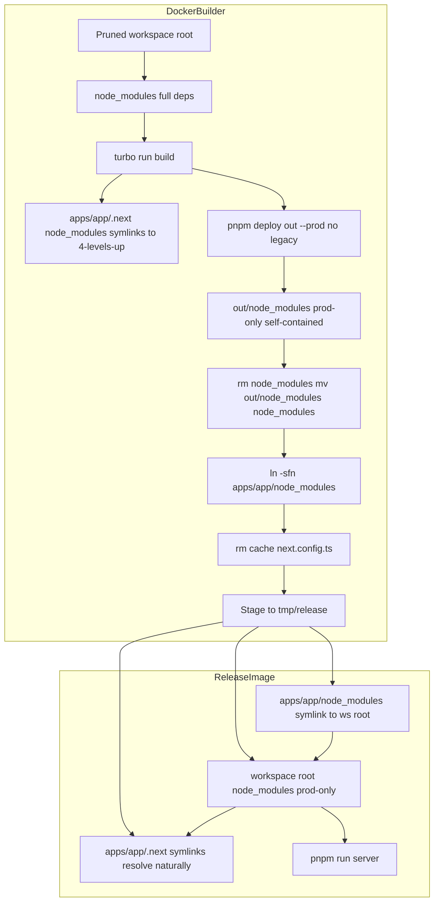
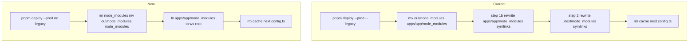
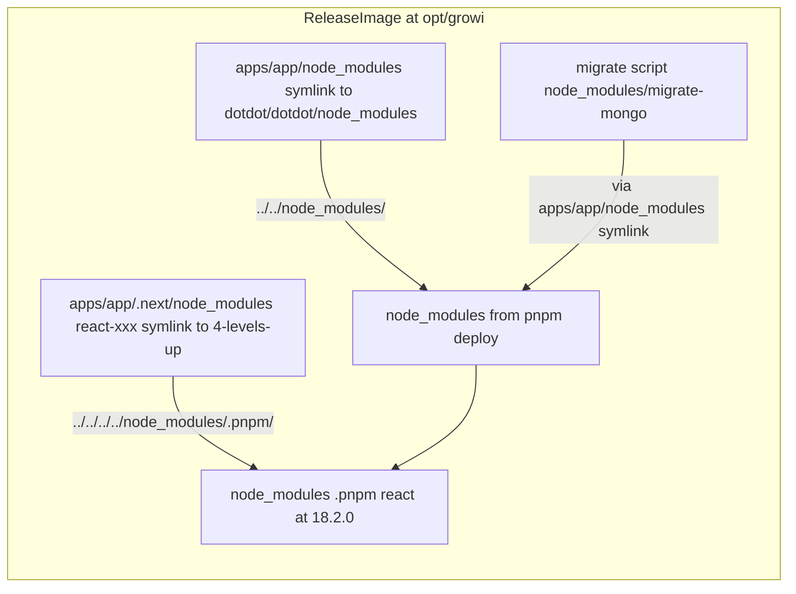
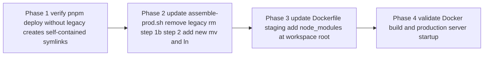

# Design Document: optimise-deps-for-prod-with-turbo-prune

## Overview

The GROWI production Docker build uses a multi-stage Dockerfile: `pruner` → `deps` → `builder` → `release`. The `pruner` stage already runs `turbo prune @growi/app @growi/pdf-converter --docker` to create a minimal monorepo subset. However, the `builder` stage still calls `assemble-prod.sh`, which contains two fragile post-build symlink-rewriting steps using `sed` and `find`:

- **Step [1b]**: Rewrites `apps/app/node_modules/` top-level symlinks from the workspace-root `.pnpm/` path (an artifact of `pnpm deploy --legacy`) to local `apps/app/node_modules/.pnpm/` paths.
- **Step [2]**: Rewrites `.next/node_modules/` symlinks (generated by Turbopack) from `../../../../node_modules/.pnpm/` (workspace root in Docker) to `../../node_modules/.pnpm/` (`apps/app/node_modules/`).

Both steps exist because of two coupled design decisions: (1) the `--legacy` flag in `pnpm deploy`, and (2) placing the deploy output at `apps/app/node_modules/` instead of the workspace root.

This design removes both root causes: dropping `--legacy` makes `pnpm deploy` create self-contained relative symlinks (eliminating step [1b]); staging the deploy output at workspace root instead of `apps/app/` means Turbopack's original symlink targets already resolve correctly (eliminating step [2]).

**Purpose**: Eliminate fragile bash symlink manipulation from the production assembly pipeline, replacing it with a structure that exploits the self-contained properties of `turbo prune` + `pnpm deploy` (without `--legacy`).

**Users**: Release engineers and CI/CD pipelines maintaining the production Docker build.

**Impact**: Modifies `apps/app/bin/assemble-prod.sh` (removes ~15 lines) and the `builder` stage artifact staging step in `apps/app/docker/Dockerfile`. No changes to source code, Next.js configuration, or dependency classifications.

### Goals
- Eliminate step [1b] and step [2] from `assemble-prod.sh` by fixing their root causes
- Reduce `assemble-prod.sh` to two operations: remove `.next/cache` and remove `next.config.ts`
- Maintain production server correctness (`GET /` → HTTP 200, zero `ERR_MODULE_NOT_FOUND`)
- Preserve Docker layer caching behavior (deps layer cached when only source changes)

### Non-Goals
- Changes to dependency classification (`dependencies` vs `devDependencies`) — handled by `optimise-deps-for-prod` spec
- Migration to Next.js standalone output mode
- Changes to the `pruner` or `deps` Docker stages
- Changes to the Express server, database migrations, or application logic

---

## Requirements Traceability

| Requirement | Summary | Components | Flows |
|-------------|---------|------------|-------|
| 1.1–1.4 | Eliminate symlink rewrite steps | `assemble-prod.sh` | Assembly Flow |
| 2.1–2.4 | `pnpm deploy --prod` (no `--legacy`) creates prod-only workspace-root `node_modules/` | `assemble-prod.sh` | Assembly Flow |
| 3.1–3.4 | Release artifact has `node_modules/` at workspace root; `apps/app/node_modules` is a symlink | `assemble-prod.sh`, Dockerfile staging | Assembly Flow, Release Image |
| 4.1–4.5 | Production server starts, `GET /` returns 200, no broken symlinks | All components | Validation |
| 5.1–5.5 | `pruner` stage unchanged; Docker layer caching preserved | Dockerfile | Build Flow |
| 6.1–6.4 | All `.next/node_modules/` packages are in `dependencies`; dep rule from `optimise-deps-for-prod` remains valid | (inherited, no new code) | — |

---

## Architecture

### Existing Architecture Analysis

The production assembly pipeline (current):

```
turbo run build --filter @growi/app
  └─ Turbopack → apps/app/.next/
       └─ .next/node_modules/<pkg> → ../../../../node_modules/.pnpm/<pkg>/...
                                      (workspace root in Docker = /opt/)

assemble-prod.sh (current):
  [1]   pnpm deploy out --prod --legacy --filter @growi/app
        └─ out/node_modules/<pkg> → ../../../node_modules/.pnpm/<pkg>/...  ← points to workspace root
  [mv]  rm -rf apps/app/node_modules && mv out/node_modules apps/app/node_modules
        └─ apps/app/node_modules/<pkg> → still points to workspace root ✗
  [1b]  find + sed: rewrite apps/app/node_modules/ symlinks
        └─ apps/app/node_modules/<pkg> → .pnpm/<pkg>/...  (local) ✓
  [2]   find + sed: rewrite .next/node_modules/ symlinks
        └─ ../../../../node_modules/.pnpm/ → ../../node_modules/.pnpm/
        └─ .next/node_modules/<pkg> → ../../node_modules/.pnpm/...  (= apps/app/node_modules/) ✓
  [3]   rm -rf .next/cache
  [4]   rm -f next.config.ts
```

Root causes of steps [1b] and [2]:
- **[1b] root cause**: `--legacy` linker creates top-level symlinks pointing to the workspace-root `.pnpm/` store, not the deploy output's local `.pnpm/`
- **[2] root cause**: Deploy output is placed at `apps/app/`, but Turbopack builds `.next/node_modules/` symlinks relative to the workspace root (4 levels up)

### Architecture Pattern & Boundary Map



**Key decisions**:
- Drop `--legacy`: isolated linker creates self-contained `out/node_modules/` with relative `.pnpm/` symlinks — no step [1b] needed
- Place deploy output at workspace root: Turbopack's `../../../../node_modules/.pnpm/` symlinks already point to workspace root — no step [2] needed
- `apps/app/node_modules` → symlink `../../node_modules` for `migrate-mongo` script compatibility and Node.js `require()` traversal

### Technology Stack

| Layer | Choice | Role | Notes |
|-------|--------|------|-------|
| Build orchestration | Turborepo `turbo prune --docker` | Generates minimal monorepo subset for Docker | `pruner` stage — unchanged |
| Package manager | pnpm (current version) | `pnpm deploy --prod` (no `--legacy`) | Removes `--legacy`; isolated linker |
| Build assembly | `assemble-prod.sh` | Simplified: deploy → stage (2 ops remain) | Removes steps [1b] and [2] |
| Container | Docker BuildKit `COPY` | Copies symlinks intact | Requires BuildKit (already in use) |

---

## System Flows

### Assembly Flow: Current vs New



### Symlink Resolution in Release Image



---

## Components and Interfaces

| Component | Domain | Intent | Req Coverage | Key Dependencies | Contracts |
|-----------|--------|--------|--------------|------------------|-----------|
| `assemble-prod.sh` | Build Assembly | Assemble prod artifact: deploy prod deps, stage symlinks, clean | 1.1–1.4, 2.1–2.4, 3.1–3.3 | pnpm, filesystem | Batch |
| Dockerfile `builder` staging step | Container Build | Copy release artifact to `/tmp/release/` with correct structure | 3.1, 3.3, 5.1–5.3 | Docker BuildKit COPY | Batch |
| Release image structure | Container Runtime | `node_modules/` at workspace root; `apps/app/node_modules` symlink | 3.2, 3.4, 4.1–4.4 | `assemble-prod.sh` output | State |

### Build Assembly

#### `apps/app/bin/assemble-prod.sh`

| Field | Detail |
|-------|--------|
| Intent | Produce a production-ready artifact by deploying prod-only deps to workspace root and creating `apps/app/node_modules` compatibility symlink |
| Requirements | 1.1, 1.2, 1.3, 1.4, 2.1, 2.2, 2.3, 2.4, 3.1, 3.2, 3.3 |

**Responsibilities & Constraints**
- Run from workspace root (same CWD as current usage)
- Deploy production dependencies using `pnpm deploy out --prod --filter @growi/app` (no `--legacy`)
- Replace workspace root `node_modules/` (full deps) with deploy output (prod-only)
- Create `apps/app/node_modules` as a symlink to `../../node_modules` for migration script and Node.js resolution compatibility
- Remove `.next/cache` to reduce release image size
- Remove `next.config.ts` to prevent Next.js from attempting TypeScript install at server startup

**Constraints**:
- Must run AFTER `pnpm deploy` output is created (pnpm requires workspace root `node_modules/` during deploy)
- Must run AFTER `turbo run build` (`.next/` must exist for cache removal)
- `rm -rf node_modules` destroys the workspace root's full-deps `node_modules/`; developers running this locally must run `pnpm install` to restore the development environment

**Contracts**: Batch [x]

##### Batch / Job Contract
- Trigger: Called by Dockerfile `builder` stage via `RUN bash apps/app/bin/assemble-prod.sh`; also callable locally
- Input: Workspace root with `node_modules/` (full deps) and `apps/app/.next/` (built)
- Output:
  - `node_modules/` at workspace root (prod-only, self-contained relative symlinks)
  - `apps/app/node_modules` → symlink `../../node_modules`
  - `apps/app/.next/` without `.next/cache/`
  - `apps/app/next.config.ts` removed
- Idempotency: Re-runnable; `rm -rf out` at start cleans previous output

**Implementation Notes**
- Integration: Replaces `pnpm deploy out --prod --legacy` with `pnpm deploy out --prod` and changes `mv out/node_modules apps/app/node_modules` to `rm -rf node_modules && mv out/node_modules node_modules && ln -sfn ../../node_modules apps/app/node_modules`; removes step [1b] and step [2] bash blocks entirely
- Validation: Verify that `out/node_modules/react` symlink target starts with `.pnpm/` (not `../../../node_modules/.pnpm/`) after running `pnpm deploy out --prod --filter @growi/app`
- Risks: pnpm version may affect isolated linker behavior — if `pnpm deploy` without `--legacy` still creates workspace-root-pointing symlinks, step [1b] would need to be reinstated. Document pnpm version requirement.

---

#### Dockerfile `builder` stage — artifact staging step

| Field | Detail |
|-------|--------|
| Intent | Copy the production artifact (workspace root `node_modules/` + `apps/app/` contents) into `/tmp/release/` for the `COPY --from=builder` instruction in the `release` stage |
| Requirements | 3.1, 3.3, 5.1, 5.2, 5.3 |

**Responsibilities & Constraints**
- Copy `node_modules/` from workspace root (prod-only, after `assemble-prod.sh`) to `/tmp/release/node_modules/`
- Copy `apps/app/node_modules` **as a symlink** (not dereferenced) to `/tmp/release/apps/app/node_modules`
- Use `cp -a` (includes `-d`/`-P` flag: no symlink dereferencing) for all copies
- Docker BuildKit `COPY` preserves symlinks; verify with `RUN test -L apps/app/node_modules` if needed

**Contracts**: Batch [x]

##### Batch / Job Contract
- Trigger: `RUN ...` step in Dockerfile `builder` stage, after `RUN bash apps/app/bin/assemble-prod.sh`
- Input: `/opt/node_modules/` (prod-only) + `/opt/apps/app/` (with `.next/`, `dist/`, etc.) + `/opt/apps/app/node_modules` (symlink)
- Output: `/tmp/release/` with:
  ```
  /tmp/release/
  ├── package.json
  ├── node_modules/              ← workspace-root prod node_modules
  └── apps/app/
      ├── .next/                 ← symlinks: ../../../../node_modules/.pnpm/ (resolvable in release)
      ├── dist/
      ├── config/
      ├── public/
      ├── resource/
      ├── tmp/
      ├── package.json
      └── node_modules           ← symlink: ../../node_modules (preserved)
  ```

**Implementation Notes**
- Integration: Change `cp -a apps/app/node_modules /tmp/release/apps/app/` to `cp -a node_modules /tmp/release/` and add `cp -a apps/app/node_modules /tmp/release/apps/app/` (symlink preserved by `-a`). Remove `apps/app/node_modules` from the existing long `cp -a` list that copies `.next`, `config`, `dist`, etc.
- Validation: In Dockerfile, add `RUN test -L /tmp/release/apps/app/node_modules` to assert symlink preservation before the release stage
- Risks: `cp -a` on a symlink-to-directory may dereference on some OS/busybox versions — test on the actual base image

---

### Release Image Structure

The `release` stage copies `/tmp/release/` to `${appDir}` (e.g. `/opt/growi/`):

```
/opt/growi/
├── package.json
├── node_modules/              ← prod-only (pnpm deploy output, self-contained)
│   ├── .pnpm/
│   │   ├── react@18.2.0/
│   │   │   └── node_modules/react/  ← physical package files
│   │   └── @growi+core@.../
│   │       └── node_modules/@growi/core/  ← physically injected by pnpm deploy
│   └── react                 ← symlink: .pnpm/react@18.2.0/node_modules/react  ✓
└── apps/
    └── app/
        ├── .next/
        │   └── node_modules/
        │       └── react-xxx  ← symlink: ../../../../node_modules/.pnpm/react@18.2.0/...  ✓
        ├── dist/
        ├── node_modules       ← symlink: ../../node_modules → /opt/growi/node_modules/  ✓
        └── package.json
```

**Resolution chains**:
- `.next/node_modules/react-xxx` → `../../../../node_modules/.pnpm/react@18.2.0/node_modules/react` → `/opt/growi/node_modules/.pnpm/react@18.2.0/node_modules/react` ✓
- `apps/app/node_modules/migrate-mongo` → via symlink `../../node_modules` → `/opt/growi/node_modules/migrate-mongo` ✓
- Node.js `require('express')` from `apps/app/dist/server/app.js` → traverses to `apps/app/node_modules/` (symlink) → `/opt/growi/node_modules/express` ✓

---

## Testing Strategy

### Production Server Startup Procedure (updated)

The procedure from `optimise-deps-for-prod/design.md` is simplified. With the new approach, after `assemble-prod.sh`, the workspace root's `node_modules/` IS already the prod-only deploy output. The `mv node_modules node_modules.bak` step is **no longer needed**.

**Step 1 — Clean build**
```bash
turbo run build --filter @growi/app
```

**Step 2 — Production assembly**
```bash
bash apps/app/bin/assemble-prod.sh
```

> **Note**: `assemble-prod.sh` now does `rm -rf node_modules && mv out/node_modules node_modules`. After this, the workspace root's `node_modules/` is prod-only. `apps/app/node_modules` is a symlink. Run `pnpm install` to restore the development environment after testing.

**Step 2b — Restore `next.config.ts`**
```bash
git show HEAD:apps/app/next.config.ts > apps/app/next.config.ts
```

**Step 3 — Start production server** (from `apps/app/`)
```bash
cd apps/app && pnpm run server > /tmp/server.log 2>&1 &
timeout 60 bash -c 'until grep -q "Express server is listening" /tmp/server.log; do sleep 2; done'
```

**Step 4 — Verify**
```bash
HTTP_CODE=$(curl -s -o /tmp/response.html -w "%{http_code}" http://localhost:3000/)
echo "HTTP: $HTTP_CODE"  # → 200
grep -c "ERR_MODULE_NOT_FOUND" /tmp/server.log  # → 0
```

**Step 5 — Stop and restore**
```bash
kill $(lsof -ti:3000)
pnpm install  # restore full-deps node_modules for development
```

### Symlink Integrity Verification

After `assemble-prod.sh`:
```bash
# Verify apps/app/node_modules is a symlink
test -L apps/app/node_modules && echo "OK: symlink" || echo "FAIL: not a symlink"

# Verify .next/node_modules symlinks resolve (no broken links)
find apps/app/.next/node_modules -maxdepth 2 -type l | while read link; do
  linkdir=$(dirname "$link"); target=$(readlink "$link")
  resolved=$(cd "$linkdir" 2>/dev/null && realpath "$target" 2>/dev/null || echo "BROKEN")
  [ "$resolved" = "BROKEN" ] && echo "BROKEN: $link"
done
# Expected: no output

# Verify pnpm deploy without --legacy creates self-contained symlinks
readlink out/node_modules/react 2>/dev/null  # Expected: .pnpm/react@.../node_modules/react (not ../../../...)
```

### Docker Build Verification

After each change, verify Docker build produces a working release image:
```bash
docker build -f apps/app/docker/Dockerfile -t growi-test .
docker run --rm growi-test ls /opt/growi/node_modules/.pnpm | head -5  # → packages listed
docker run --rm growi-test test -L /opt/growi/apps/app/node_modules && echo "symlink OK"
```

---

## Migration Strategy

The change is non-breaking and phased:



**Rollback**: Each phase modifies only `assemble-prod.sh` and/or the Dockerfile staging step. Rolling back is a targeted revert of those two files. The production build pipeline (turbo prune, deps install, turbo build) is unchanged.

**Phase 1 gate**: `readlink out/node_modules/react` must start with `.pnpm/` after `pnpm deploy out --prod --filter @growi/app` (without `--legacy`). If it starts with `../../../node_modules/`, the `--legacy` behavior is still present and the approach needs adjustment.

---

## Error Handling

### Assembly Failures

- **`pnpm deploy out --prod` fails**: The script exits with `set -euo pipefail`. Inspect pnpm output; check `pnpm-lock.yaml` is not dirty.
- **`rm -rf node_modules` fails**: Unlikely; check filesystem permissions.
- **`ln -sfn ../../node_modules apps/app/node_modules` fails**: Existing `apps/app/node_modules` is a real directory (from previous dev install). The `rm -rf apps/app/node_modules` step before `ln` handles this.
- **Broken symlinks in release image**: Indicates a package from `.next/node_modules/` is missing from `dependencies` — classification regression from `optimise-deps-for-prod`. Run the devDependencies regression check:
  ```bash
  # verify no devDep appears in .next/node_modules/
  ```

### Production Server Failures
- **`ERR_MODULE_NOT_FOUND`**: Package in `dependencies` was not included in `pnpm deploy` output, or `pnpm deploy` without `--legacy` behaves unexpectedly. Re-add `--legacy` as rollback.
- **`TypeError: Cannot read properties of null (reading 'useContext')`**: Broken symlink in `node_modules/` (React resolved from wrong location). Verify `apps/app/node_modules` symlink integrity.
