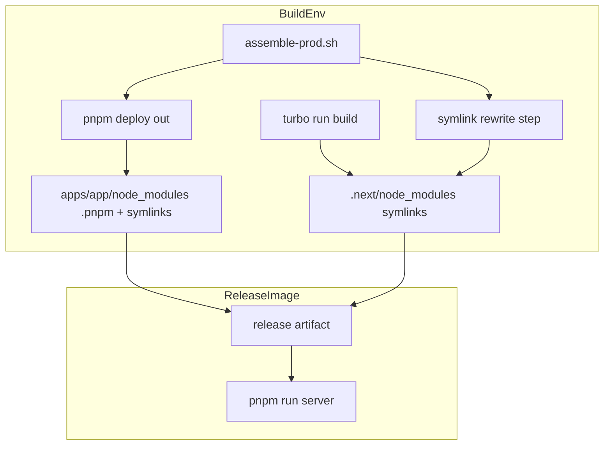
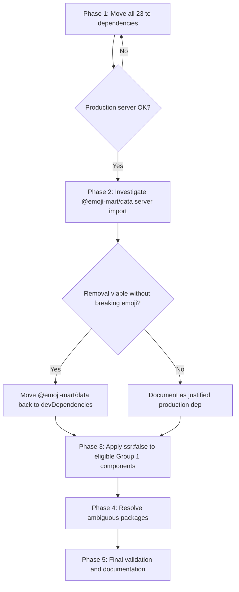
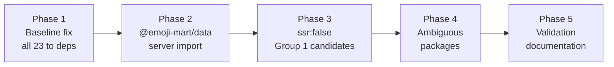

# Design Document: optimise-deps-for-prod

## Overview

This feature corrects the `devDependencies` / `dependencies` classification in `apps/app/package.json` for packages that Turbopack externalises at SSR runtime. When webpack was the bundler, all imports were inlined into self-contained chunks, making `devDependencies` sufficient. Turbopack instead loads certain packages at runtime via `.next/node_modules/` symlinks; `pnpm deploy --prod` excludes `devDependencies`, breaking the production server.

**Purpose**: Restore a working production build and then minimise the `dependencies` set to only what is genuinely required at runtime.

**Users**: Release engineers and developers maintaining the production deployment pipeline.

**Impact**: Modifies `apps/app/package.json` and up to four source files; no changes to user-facing features or API contracts.

### Goals

- `pnpm deploy --prod` produces a complete, self-contained production artifact (Req 1)
- Minimise `dependencies` by reverting packages where technically safe (Req 2, 3, 4)
- Document the Turbopack externalisation rule to prevent future misclassification (Req 5)

### Non-Goals

- Changes to Turbopack configuration or build pipeline beyond `assemble-prod.sh`
- Refactoring of feature logic or component APIs unrelated to SSR behaviour
- Migration from Pages Router to App Router

---

## Requirements Traceability

| Requirement | Summary | Components | Flows |
|-------------|---------|------------|-------|
| 1.1–1.5 | Move all 23 packages to `dependencies`; verify no missing-module errors | `package.json` | Phase 1 |
| 2.1–2.4 | Investigate and optionally remove `@emoji-mart/data` server-side import | `emoji.ts` | Phase 2 |
| 3.1–3.5 | Apply `dynamic({ ssr: false })` to eligible Group 1 components | Targeted component files | Phase 3 |
| 4.1–4.5 | Resolve `react-toastify`, `socket.io-client`, `bootstrap`, phantom packages | `admin/states/socket-io.ts`, `_app.page.tsx` | Phase 4 |
| 5.1–5.5 | Validate final state; add Turbopack externalisation rule documentation | `package.json`, steering doc | Phase 5 |

---

## Architecture

### Existing Architecture Analysis

The production assembly pipeline is:

```
turbo run build
  └─ Turbopack build → .next/ (with .next/node_modules/ symlinks → ../../../../node_modules/.pnpm/)

assemble-prod.sh
  ├─ pnpm deploy out --prod --legacy   → out/node_modules/ (pnpm-native: .pnpm/ + symlinks)
  ├─ rm + mv out/node_modules → apps/app/node_modules/
  ├─ [1b] symlink rewrite in apps/app/node_modules/:
  │     non-scoped: ../../../node_modules/.pnpm/ → .pnpm/
  │     scoped:    ../../../../node_modules/.pnpm/ → ../.pnpm/
  ├─ rm -rf .next/cache
  ├─ next.config.ts removal
  └─ [2] symlink rewrite in .next/node_modules/:
        ../../../../node_modules/.pnpm/ → ../../node_modules/.pnpm/

cp -a to /tmp/release/           → preserves pnpm symlinks intact
COPY --from=builder /tmp/release/ → release image
```

Two symlink rewrite steps are required:

1. **`apps/app/node_modules/` rewrite** (`[1b]`): `pnpm deploy --prod` generates top-level symlinks in `out/node_modules/` pointing to the workspace-root `.pnpm/`. After `mv out/node_modules apps/app/node_modules`, these symlinks still reference the workspace-root path, which does not exist in production. Rewriting them to point within `apps/app/node_modules/.pnpm/` makes the deploy self-contained.

2. **`.next/node_modules/` rewrite** (`[2]`): Turbopack generates symlinks in `.next/node_modules/` pointing to `../../../../node_modules/.pnpm/` (workspace root). After rewriting to `../../node_modules/.pnpm/`, they resolve to `apps/app/node_modules/.pnpm/`, preserving pnpm's sibling-resolution for transitive dependencies.

### Architecture Pattern & Boundary Map



**Key decisions**:
- Symlink rewrite (not `cp -rL`) preserves pnpm's sibling resolution for transitive deps (see `research.md` — Decision: Symlink Rewrite over cp -rL).
- `pnpm deploy --prod` (not `--dev`) is the correct scope; only runtime packages belong in the artifact.

### Technology Stack

| Layer | Choice | Role | Notes |
|-------|--------|------|-------|
| Package manifest | `apps/app/package.json` | Declares runtime vs build-time deps | 23 entries move from `devDependencies` to `dependencies` |
| Build assembly | `apps/app/bin/assemble-prod.sh` | Produces self-contained release artifact | Already contains symlink rewrite; no changes needed in Phase 1 |
| Bundler | Turbopack (Next.js 16) | Externalises packages to `.next/node_modules/` | Externalisation heuristic: static module-level imports in SSR code paths |
| Package manager | pnpm v10 with `--legacy` deploy | Produces pnpm-native `node_modules` with `.pnpm/` virtual store | `inject-workspace-packages` not required with `--legacy` |

---

## System Flows

### Phased Execution Flow



Each phase gate requires: production server starts without errors + `GET /` returns HTTP 200 with expected content (body contains `内部仕様や仕様策定中の議論の内容をメモしていく Wiki です。`) + zero `ERR_MODULE_NOT_FOUND` in server log. **Do NOT use `/login` as the smoke test URL** — it returns HTTP 200 even when SSR is broken because the login page does not render editor components.

---

## Components and Interfaces

### Summary Table

| Component | Domain | Intent | Req Coverage | Contracts |
|-----------|--------|--------|--------------|-----------|
| `package.json` | Build Config | Dependency manifest | 1.1, 2.3, 2.4, 3.4, 3.5, 4.1–4.4, 5.3 | State |
| `emoji.ts` (remark plugin) | Server Renderer | Emoji shortcode → native emoji lookup | 2.1, 2.2, 2.3 | Service |
| Admin socket atom | Client State | Socket.IO connection for admin panel | 4.2 | State |
| Group 1 component wrappers | UI | `dynamic({ ssr: false })` wrapping for eligible components | 3.1–3.5 | — |

---

### Build Config

#### `apps/app/package.json`

| Field | Detail |
|-------|--------|
| Intent | Central manifest governing which packages are included in `pnpm deploy --prod` output |
| Requirements | 1.1, 2.3, 2.4, 3.4, 3.5, 4.1–4.4, 5.3 |

**Responsibilities & Constraints**
- Determines the complete set of packages in the production artifact.
- Any package appearing in `.next/node_modules/` after a production build must be in `dependencies`, not `devDependencies`.
- Changes propagate to all consumers of the monorepo lock file; `pnpm install --frozen-lockfile` must remain valid.

**Phase 1 changes — move all 23 to `dependencies`**:

| Package | Current | Target | Rationale |
|---------|---------|--------|-----------|
| `@codemirror/state` | devDep | dep | Used in editor components (SSR'd) |
| `@emoji-mart/data` | devDep | dep | Static import in remark plugin (server-side) |
| `@handsontable/react` | devDep | dep | Used in HandsontableModal (SSR'd unless wrapped) |
| `@headless-tree/core` | devDep | dep | Used in PageTree hooks (SSR'd) |
| `@headless-tree/react` | devDep | dep | Used in ItemsTree (SSR'd) |
| `@tanstack/react-virtual` | devDep | dep | Used in ItemsTree (layout-critical, SSR'd) |
| `bootstrap` | devDep | dep | Dynamic JS import in `_app.page.tsx` (Phase 4 to verify) |
| `diff2html` | devDep | dep | Used in RevisionDiff (SSR'd) |
| `downshift` | devDep | dep | Used in SearchModal (SSR'd) |
| `fastest-levenshtein` | devDep | dep | Used in openai client service (SSR'd) |
| `fslightbox-react` | devDep | dep | Used in LightBox (SSR'd) |
| `i18next-http-backend` | devDep | dep | Present in `.next/node_modules/`; source unknown (Phase 4 to verify) |
| `i18next-localstorage-backend` | devDep | dep | Present in `.next/node_modules/`; source unknown (Phase 4 to verify) |
| `pretty-bytes` | devDep | dep | Used in RichAttachment (SSR'd) |
| `react-copy-to-clipboard` | devDep | dep | Used in multiple inline components (SSR'd) |
| `react-dnd` | devDep | dep | Used in PageTree drag-drop (SSR'd) |
| `react-dnd-html5-backend` | devDep | dep | Used in PageTree drag-drop (SSR'd) |
| `react-dropzone` | devDep | dep | Present in `.next/node_modules/`; source unknown (Phase 4 to verify) |
| `react-hook-form` | devDep | dep | Used in forms across app (SSR'd) |
| `react-input-autosize` | devDep | dep | Used in form inputs (SSR'd) |
| `react-toastify` | devDep | dep | Static import in `toastr.ts` (SSR'd) |
| `simplebar-react` | devDep | dep | Used in Sidebar, AiAssistant (layout-critical, SSR'd) |
| `socket.io-client` | devDep | dep | Static import in admin socket atom (Phase 4 refactor) |

**Phase 2–4 revert candidates** (move back to `devDependencies` if conditions met):

| Package | Condition for revert | Phase |
|---------|----------------------|-------|
| `@emoji-mart/data` | Server-side import removed or replaced with static file | 2 |
| `fslightbox-react` | Wrapped with `dynamic({ ssr: false })`; no longer in `.next/node_modules/` | 3 |
| `diff2html` | Wrapped with `dynamic({ ssr: false })`; no longer in `.next/node_modules/` | 3 |
| `react-dnd` | DnD-specific components wrapped with `dynamic({ ssr: false })` | 3 |
| `react-dnd-html5-backend` | Same as `react-dnd` | 3 |
| `@handsontable/react` | Confirmed `dynamic({ ssr: false })` in HandsontableModal | 3 |
| `socket.io-client` | Admin socket refactored to dynamic import | 4 |
| `bootstrap` | Confirmed `import()` is browser-only (inside `useEffect`) | 4 |
| `i18next-http-backend` | Confirmed absent from `.next/node_modules/` post-Phase-1 | 4 |
| `i18next-localstorage-backend` | Confirmed absent from `.next/node_modules/` post-Phase-1 | 4 |
| `react-dropzone` | Confirmed absent from `.next/node_modules/` post-Phase-1 | 4 |

**Contracts**: State [x]

**Implementation Notes**
- Integration: Edit `apps/app/package.json` directly; run `pnpm install --frozen-lockfile` to verify lock file integrity after changes.
- Validation: After each phase, run `assemble-prod.sh` locally and start `pnpm run server`; confirm no `ERR_MODULE_NOT_FOUND` in logs and HTTP 200 on `/login`.
- Risks: Moving packages from `devDependencies` to `dependencies` may increase Docker image size; acceptable trade-off for Phase 1.

---

### Server Renderer

#### `apps/app/src/services/renderer/remark-plugins/emoji.ts`

| Field | Detail |
|-------|--------|
| Intent | Resolve `:emoji-name:` shortcodes to native emoji characters during Markdown SSR |
| Requirements | 2.1, 2.2, 2.3 |

**Responsibilities & Constraints**
- Processes Markdown AST server-side via `findAndReplace`.
- Uses `@emoji-mart/data/sets/15/native.json` only to look up `emojiData.emojis[name]?.skins[0].native`.
- Must produce identical output before and after any refactor (Req 2.2).

**Dependencies**
- External: `@emoji-mart/data` — static emoji data (P1, Phase 2 investigation target)

**Contracts**: Service [x]

**Phase 2 investigation**: Determine whether `@emoji-mart/data` can be replaced with a repo-bundled static lookup file. The required data structure is:

```typescript
interface EmojiNativeLookup {
  emojis: Record<string, { skins: [{ native: string }] }>;
}
```

If a static extraction script (run at package update time) can produce this file, `@emoji-mart/data` can revert to `devDependencies`. If not, document as justified production dependency per Req 2.4.

**Implementation Notes**
- Integration: Any replacement file must be a static JSON import; no runtime fetch.
- Validation: Render a Markdown document containing known emoji shortcodes (`:+1:`, `:tada:`, etc.) and verify the native characters appear in the output.
- Risks: Static extraction requires a maintenance step when `@emoji-mart/data` is upgraded.

---

### Client State

#### `apps/app/src/features/admin/states/socket-io.ts`

| Field | Detail |
|-------|--------|
| Intent | Jotai atom managing Socket.IO connection for the admin panel |
| Requirements | 4.2 |

**Responsibilities & Constraints**
- Provides an `io` Socket.IO client instance to admin panel components.
- The static `import io from 'socket.io-client'` at module level causes Turbopack to externalise `socket.io-client` for SSR.

**Dependencies**
- External: `socket.io-client` — WebSocket client (P1 if static; P2 after dynamic import refactor)

**Contracts**: State [x]

**Phase 4 refactor target**: Replace static import with dynamic import to match the pattern in `states/socket-io/global-socket.ts`:

```typescript
// Before (causes SSR externalisation)
import io from 'socket.io-client';

// After (browser-only, matches global-socket.ts pattern)
const io = (await import('socket.io-client')).default;
```

**Implementation Notes**
- Integration: The atom must be an async atom or use `atomWithLazy` to defer the import.
- Validation: Verify admin socket connects in browser; verify `socket.io-client` no longer appears in `.next/node_modules/` after a production build.
- Risks: Admin socket consumers must handle the async initialisation; if synchronous access is required at page load, the refactor may not be feasible.

---

### UI — `dynamic({ ssr: false })` Wrapper Points

These are not new components; they are targeted wrapping of existing imports using Next.js `dynamic`.

**Phase 3 evaluation criteria**:
1. Component renders interactive content only (no meaningful text for SEO)
2. Initial HTML without the component does not cause visible layout shift
3. No hydration mismatch after applying `ssr: false`

| Component | Package | `ssr: false` Feasibility | Notes |
|-----------|---------|-------------------------|-------|
| `LightBox.tsx` | `fslightbox-react` | High — renders only after user interaction | No SSR content |
| `RevisionDiff.tsx` | `diff2html` | High — interactive diff viewer, no SEO content | Loaded on user action |
| `PageTree.tsx` drag-drop | `react-dnd`, `react-dnd-html5-backend` | Medium — DnD provider wraps tree; tree content is SSR'd | Wrap DnD provider only, not content |
| `HandsontableModal.tsx` | `@handsontable/react` | High — modal, not in initial HTML | Verify existing dynamic import pattern |
| `SearchModal.tsx` | `downshift` | Low — search input in sidebar, part of hydration | Risk of layout shift |
| openai fuzzy matching | `fastest-levenshtein` | Medium — algorithm utility; depends on call site | May be callable lazily |

**Contracts**: None (pure wrapping changes, no new interfaces)

**Implementation Notes**
- Apply `dynamic` wrapping to the specific consuming component file, not to the package entry point.
- Validation per component: (a) build with package removed from `dependencies`, (b) confirm it disappears from `.next/node_modules/`, (c) run Production Server Startup Procedure and assert `GET /` returns HTTP 200 with expected content, (d) confirm no hydration warnings in browser console.
- Risks: Wrapping components that render visible content may cause flash of missing content (FOMC); test on slow connections.

---

## Testing Strategy

### Production Server Startup Procedure

以下の手順でプロダクションサーバーを起動する。devcontainer 環境での検証を想定している。

**Step 1 — クリーンビルド**（ワークスペースルートから実行）

```bash
turbo run build --filter @growi/app
```

**Step 2 — プロダクション用アセンブル**（ワークスペースルートから実行）

```bash
bash apps/app/bin/assemble-prod.sh
```

> **注意**:
> - `assemble-prod.sh` は `apps/app/next.config.ts` を削除する。**`next.config.ts` はサーバーテスト完了後（Step 6）に復元すること。** サーバー起動前に復元すると、Next.js が起動時に TypeScript インストールを試みて pnpm install が走り、`apps/app/node_modules` の symlink が上書きされ HTTP 500 となる。
> - ワークスペースルートの `node_modules` は **削除・リネームしないこと**。workspace パッケージ（`@growi/core` 等）の `node_modules/` 内シンボリックリンクがワークスペースルート `node_modules` を参照しており、削除すると `MODULE_NOT_FOUND` でサーバーが起動しない。Docker 本番環境でも `packages/` ディレクトリごと COPY されるためこれは正常な挙動。

**Step 3 — プロダクションサーバー起動**（`apps/app/` から実行）

```bash
cd apps/app && pnpm run server > /tmp/server.log 2>&1 &
```

起動完了を待つ:

```bash
timeout 60 bash -c 'until grep -q "Express server is listening" /tmp/server.log; do sleep 2; done'
```

> **注意**: `preserver` スクリプトが `pnpm run migrate` を実行するため、起動に数十秒かかる。**Do NOT use mongosh/mongo** for DB connectivity checks — check server logs instead.

**Step 4 — 検証**

```bash
# HTTP ステータスとコンテンツ確認
HTTP_CODE=$(curl -s -o /tmp/response.html -w "%{http_code}" http://localhost:3000/)
echo "HTTP: $HTTP_CODE"  # → 200 であること
grep -c "内部仕様や仕様策定中の議論の内容をメモしていく Wiki です。" /tmp/response.html  # → 1 以上であること

# ERR_MODULE_NOT_FOUND がないことを確認
grep -c "ERR_MODULE_NOT_FOUND" /tmp/server.log  # → 0 であること
```

> **検証 URL は `/` を使うこと。`/login` は不可。** `/login` は SSR が壊れていても HTTP 200 を返すため正常動作の確認にならない。`/` はエディタ関連コンポーネントを SSR するため、パッケージが欠損すると HTTP 500 になる。

**Step 5 — サーバー停止**

```bash
kill $(lsof -ti:3000)
```

**Step 6 — 開発環境の復元**（検証後）

```bash
# next.config.ts を復元
git show HEAD:apps/app/next.config.ts > apps/app/next.config.ts
```

---

### Server Rendering Verification

プロダクションサーバー起動後、以下のコマンドで SSR の正常動作を確認する。

**検証コマンド（Production Server Startup Procedure の Step 5 参照）**

```bash
# URL は / を使うこと（/login は不可）
HTTP_CODE=$(curl -s -o /tmp/response.html -w "%{http_code}" http://localhost:3000/)
echo "HTTP: $HTTP_CODE"  # → 200
grep -c "内部仕様や仕様策定中の議論の内容をメモしていく Wiki です。" /tmp/response.html  # → 1 以上
grep -c "ERR_MODULE_NOT_FOUND" /tmp/server.log  # → 0
```

**破損シンボリックリンクの確認**

`assemble-prod.sh` 実行後、`.next/node_modules/` および `apps/app/node_modules/` 内のシンボリックリンクがすべて解決可能であることを確認する。

```bash
# .next/node_modules/ の確認
cd apps/app && find .next/node_modules -maxdepth 2 -type l | while read link; do
  linkdir=$(dirname "$link"); target=$(readlink "$link")
  resolved=$(cd "$linkdir" 2>/dev/null && realpath -m "$target" 2>/dev/null || echo "UNRESOLVABLE")
  [ "$resolved" = "UNRESOLVABLE" ] || [ ! -e "$resolved" ] && echo "BROKEN: $link"
done

# apps/app/node_modules/ の確認（ワークスペースルートの node_modules をリネーム後に実行）
find apps/app/node_modules -maxdepth 2 -type l | while read link; do
  linkdir=$(dirname "$link"); target=$(readlink "$link")
  resolved=$(cd "$linkdir" 2>/dev/null && realpath -m "$target" 2>/dev/null || echo "UNRESOLVABLE")
  [ "$resolved" = "UNRESOLVABLE" ] || [ ! -e "$resolved" ] && echo "BROKEN: $link"
done
```

> **注意**: `@growi/*` パッケージは `../../../../packages/` を指すシンボリックリンクだが、`packages/` はワークスペースルート直下に存在するため問題ない。

**devDependencies 逆入り確認**

```bash
# devDependencies に列挙されているパッケージが .next/node_modules/ に現れないことを確認
# （あれば Classification regression）
```

**devcontainer における再現性について**

`pnpm deploy --prod` 後もワークスペースルートの `node_modules/` が残存するため、**必ず `mv node_modules node_modules.bak` を実施してからサーバーを起動すること**。この手順を省略すると `apps/app/node_modules/` の壊れたシンボリックリンクがワークスペースルートの `node_modules/` によって補完され、誤って green と判定される。

---

### Phase 1 — Smoke Test (Req 1.3, 1.4, 1.5)

- 上記「Production Server Startup Procedure」に従いサーバーを起動し、stdout に `ERR_MODULE_NOT_FOUND` が出力されないことを確認する。
- **HTTP GET `/`** (not `/login`): assert HTTP 200, body contains `内部仕様や仕様策定中の議論の内容をメモしていく Wiki です。`, zero `ERR_MODULE_NOT_FOUND` in server log.
- Run `launch-prod` CI job: assert job passes against MongoDB 6.0 and 8.0.

### Phase 2 — Emoji Rendering (Req 2.2)

- Unit test: render Markdown string containing `:+1:`, `:tada:`, `:rocket:` through the remark plugin; assert native emoji characters in output.
- If static file replacement applied: run same test against replacement; assert identical output.

### Phase 3 — Hydration Integrity (Req 3.3)

- Per-package smoke test: for each package moved to devDependencies, run Production Server Startup Procedure and assert `GET /` HTTP 200 with expected content.
- Per-component browser test: load page containing the wrapped component; assert no React hydration warnings in browser console.
- Visual regression: screenshot comparison of affected pages before and after `ssr: false` wrapping.

### Phase 4 — Admin Socket and Bootstrap (Req 4.2, 4.3)

- Per-package smoke test: for each package moved to devDependencies, run Production Server Startup Procedure and assert `GET /` HTTP 200 with expected content.
- Admin socket: open admin panel in browser; assert Socket.IO connection established (WebSocket upgrade in browser DevTools Network tab).
- Bootstrap: assert Bootstrap dropdown/modal JavaScript functions correctly in browser after confirming `import()` placement.

### Phase 5 — Final Coverage Check (Req 5.1, 5.3)

- After deploy, assert that every symlink in `apps/app/.next/node_modules/` AND `apps/app/node_modules/` resolves to an existing file (zero broken symlinks, verified with workspace-root `node_modules` renamed).
- Assert no package listed in `devDependencies` appears in `apps/app/.next/node_modules/` after a production build.
- Run Production Server Startup Procedure (including `mv node_modules node_modules.bak`) and assert `GET /` HTTP 200 with expected content.

---

## Migration Strategy

The five phases are executed sequentially. Each phase is independently deployable and verifiable.



**Rollback**: Each phase modifies only `package.json` and/or one source file. Rolling back is a targeted revert of those changes; the production build pipeline (`assemble-prod.sh`, Dockerfile) is unchanged throughout.

**Phase 1 rollback trigger**: Production server fails to start or CI `launch-prod` fails → revert `package.json` changes.

**Phase 3/4 rollback trigger**: Hydration error or functional regression detected → revert the specific `dynamic()` wrapping or import refactor; package remains in `dependencies`.
