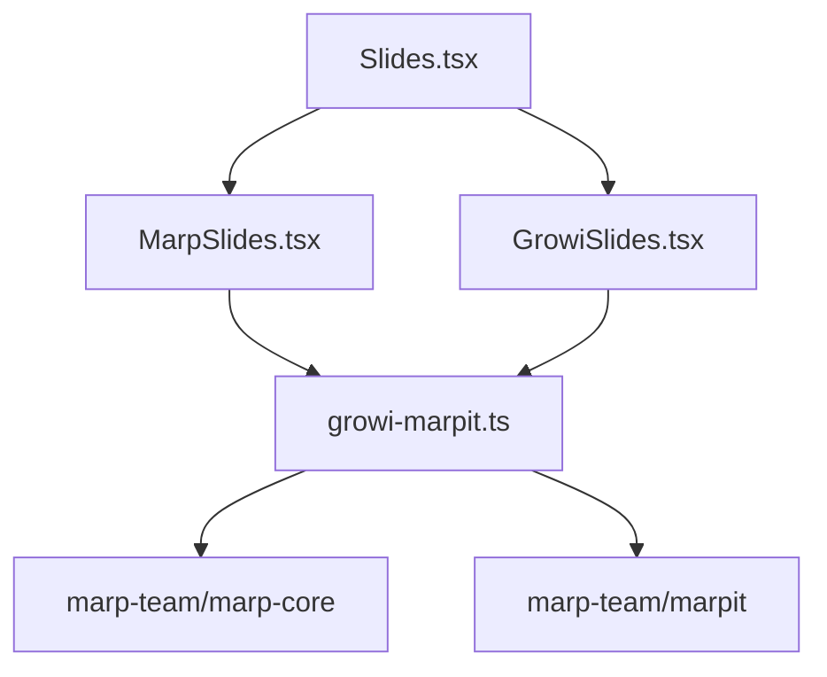
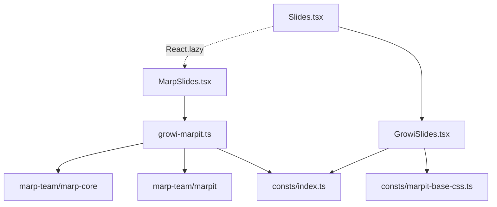
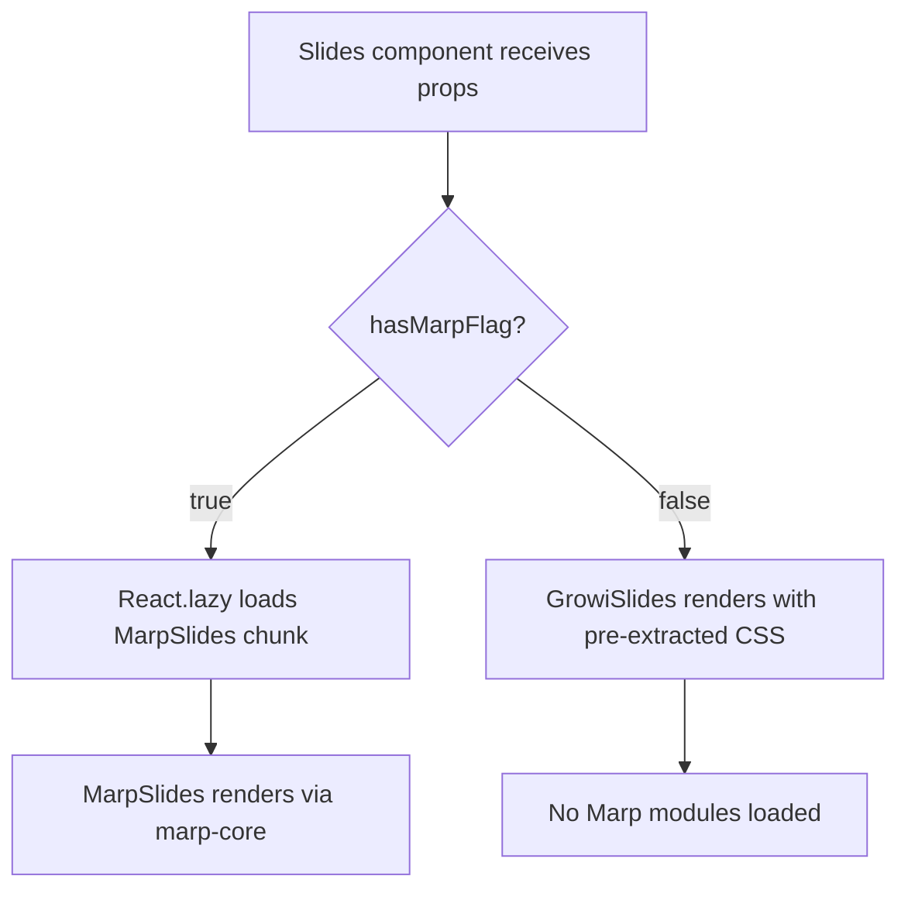
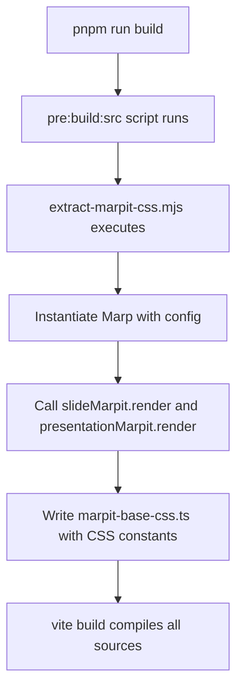

# Design Document: optimize-presentation

## Overview

**Purpose**: This feature decouples heavy Marp rendering dependencies (`@marp-team/marp-core`, `@marp-team/marpit`) from the common slide rendering path, so they are loaded only when a page explicitly uses `marp: true` frontmatter.

**Users**: All GROWI users benefit from reduced JavaScript payload when viewing slide pages that do not use Marp. Developers benefit from clearer module boundaries.

**Impact**: Changes the `@growi/presentation` package's internal import structure. No external API or behavioral changes.

### Goals
- Eliminate `@marp-team/marp-core` and `@marp-team/marpit` from the GrowiSlides module graph
- Load MarpSlides and its Marp dependencies only on demand via dynamic import
- Maintain identical rendering behavior for all slide types

### Non-Goals
- Optimizing the `useSlidesByFrontmatter` hook (already lightweight with internal dynamic imports)
- Changing the app-level lazy-loading architecture (`useLazyLoader`, `next/dynamic` for the modal)
- Modifying the Marp rendering logic or configuration itself
- Reducing the size of `@marp-team/marp-core` internals

## Architecture

### Existing Architecture Analysis

Current module dependency graph for `Slides.tsx`:



**Problem**: Both `MarpSlides` and `GrowiSlides` statically import `growi-marpit.ts`, which instantiates Marp at module scope. This forces ~896KB of Marp modules to load even when rendering non-Marp slides.

**Constraints**:
- `growi-marpit.ts` exports both runtime Marp instances and a simple string constant (`MARP_CONTAINER_CLASS_NAME`)
- `GrowiSlides` uses Marp only for CSS extraction (`marpit.render('')`), not for content rendering
- The package uses Vite with `preserveModules: true` and `nodeExternals({ devDeps: true })`

### Architecture Pattern & Boundary Map

Target module dependency graph:



**Key changes**:
- Dashed arrow = dynamic import (React.lazy), solid arrow = static import
- `GrowiSlides` no longer imports `growi-marpit.ts`; uses pre-extracted CSS from `marpit-base-css.ts`
- `MARP_CONTAINER_CLASS_NAME` moves to shared `consts/index.ts`
- Marp modules are only reachable through the dynamic `MarpSlides` path

**Steering compliance**:
- Follows "subpath imports over barrel imports" principle
- Aligns with `next/dynamic({ ssr: false })` technique from build-optimization skill
- Preserves existing lazy-loading boundaries at app level

### Technology Stack

| Layer | Choice / Version | Role in Feature | Notes |
|-------|------------------|-----------------|-------|
| Frontend | React 18 (`React.lazy`, `Suspense`) | Dynamic import boundary for MarpSlides | Standard React code-splitting; SSR not a concern (see research.md) |
| Build | Vite (existing) | Package compilation with `preserveModules` | Dynamic `import()` preserved in output |
| Build script | Node.js ESM (.mjs) | CSS extraction at build time | No additional tooling dependency |

## System Flows

### Slide Rendering Decision Flow



### Build-Time CSS Extraction Flow



## Requirements Traceability

| Requirement | Summary | Components | Interfaces | Flows |
|-------------|---------|------------|------------|-------|
| 1.1 | No marp-core references in GrowiSlides build output | GrowiSlides, marpit-base-css | — | — |
| 1.2 | Non-Marp slides render without loading Marp | Slides, GrowiSlides | — | Slide Rendering Decision |
| 1.3 | Pre-extracted CSS constants for container styling | marpit-base-css | MarpitBaseCss | CSS Extraction |
| 1.4 | MARP_CONTAINER_CLASS_NAME in shared consts | consts/index.ts | — | — |
| 2.1 | Dynamic load MarpSlides for marp:true pages | Slides | — | Slide Rendering Decision |
| 2.2 | Loading indicator during MarpSlides load | Slides | — | Slide Rendering Decision |
| 2.3 | No MarpSlides import triggered for non-Marp | Slides | — | Slide Rendering Decision |
| 3.1 | Build-time CSS extraction script | extract-marpit-css.mjs | ExtractScript | CSS Extraction |
| 3.2 | Extraction runs before source compilation | package.json pre:build:src | — | CSS Extraction |
| 3.3 | Generated file committed for dev mode | marpit-base-css.ts | — | — |
| 4.1–4.5 | Functional equivalence across all render paths | All components | — | Both flows |
| 5.1–5.4 | Build verification of module separation | Build outputs | — | — |

## Components and Interfaces

| Component | Domain | Intent | Req Coverage | Key Dependencies | Contracts |
|-----------|--------|--------|--------------|------------------|-----------|
| Slides | UI / Routing | Route between MarpSlides and GrowiSlides based on hasMarpFlag | 2.1, 2.2, 2.3 | MarpSlides (P1, dynamic), GrowiSlides (P0, static) | — |
| GrowiSlides | UI / Rendering | Render non-Marp slides with pre-extracted CSS | 1.1, 1.2, 1.3, 1.4 | consts (P0), marpit-base-css (P0) | — |
| marpit-base-css | Constants | Provide pre-extracted Marp theme CSS | 1.3, 3.3 | — | State |
| consts/index.ts | Constants | Shared constants including MARP_CONTAINER_CLASS_NAME | 1.4 | — | — |
| growi-marpit.ts | Service | Marp engine setup (unchanged, now only reached via MarpSlides) | 4.1, 4.3 | marp-core (P0, external), marpit (P0, external) | Service |
| extract-marpit-css.mjs | Build Script | Generate marpit-base-css.ts at build time | 3.1, 3.2 | marp-core (P0, external), marpit (P0, external) | — |

### UI / Routing Layer

#### Slides

| Field | Detail |
|-------|--------|
| Intent | Route rendering to MarpSlides (dynamic) or GrowiSlides (static) based on `hasMarpFlag` prop |
| Requirements | 2.1, 2.2, 2.3 |

**Responsibilities & Constraints**
- Conditionally render MarpSlides or GrowiSlides based on `hasMarpFlag`
- Wrap MarpSlides in `<Suspense>` with a loading fallback
- Must not statically import MarpSlides

**Dependencies**
- Outbound: MarpSlides — dynamic import for Marp rendering (P1)
- Outbound: GrowiSlides — static import for non-Marp rendering (P0)

**Contracts**: State [x]

##### State Management

```typescript
// Updated Slides component signature (unchanged externally)
type SlidesProps = {
  options: PresentationOptions;
  children?: string;
  hasMarpFlag?: boolean;
  presentation?: boolean;
};

// Internal: MarpSlides loaded via React.lazy
// const MarpSlides = lazy(() => import('./MarpSlides').then(mod => ({ default: mod.MarpSlides })))
```

- Persistence: None (stateless component)
- Concurrency: Single render path per props

**Implementation Notes**
- Integration: Replace static `import { MarpSlides }` with `React.lazy` dynamic import
- Validation: `hasMarpFlag` is optional boolean; undefined/false → GrowiSlides path
- Risks: Suspense fallback visible during first MarpSlides load (mitigated by parent-level loading indicators)

### UI / Rendering Layer

#### GrowiSlides

| Field | Detail |
|-------|--------|
| Intent | Render non-Marp slides using pre-extracted CSS instead of runtime Marp |
| Requirements | 1.1, 1.2, 1.3, 1.4 |

**Responsibilities & Constraints**
- Render slide content via ReactMarkdown with section extraction
- Apply Marp container CSS from pre-extracted constants (no runtime Marp dependency)
- Use `MARP_CONTAINER_CLASS_NAME` from shared constants module

**Dependencies**
- Inbound: Slides — rendering delegation (P0)
- Outbound: consts/index.ts — `MARP_CONTAINER_CLASS_NAME` (P0)
- Outbound: consts/marpit-base-css — `SLIDE_MARPIT_CSS`, `PRESENTATION_MARPIT_CSS` (P0)

**Implementation Notes**
- Integration: Replace `import { ... } from '../services/growi-marpit'` with imports from `../consts` and `../consts/marpit-base-css`
- Replace `const { css } = marpit.render('')` with `const css = presentation ? PRESENTATION_MARPIT_CSS : SLIDE_MARPIT_CSS`

### Constants Layer

#### marpit-base-css

| Field | Detail |
|-------|--------|
| Intent | Provide pre-extracted Marp theme CSS as string constants |
| Requirements | 1.3, 3.3 |

**Contracts**: State [x]

##### State Management

```typescript
// Generated file — do not edit manually
// Regenerate with: node scripts/extract-marpit-css.mjs

export const SLIDE_MARPIT_CSS: string;
export const PRESENTATION_MARPIT_CSS: string;
```

- Persistence: Committed to repository; regenerated at build time
- Consistency: Deterministic output from Marp config; changes only on `@marp-team/marp-core` version update

#### consts/index.ts

| Field | Detail |
|-------|--------|
| Intent | Shared constants for presentation package |
| Requirements | 1.4 |

**Implementation Notes**
- Add `export const MARP_CONTAINER_CLASS_NAME = 'marpit'` (moved from `growi-marpit.ts`)
- Existing `PresentationOptions` type export unchanged

### Service Layer

#### growi-marpit.ts

| Field | Detail |
|-------|--------|
| Intent | Marp engine setup and instance creation (unchanged behavior, now only reachable via MarpSlides dynamic path) |
| Requirements | 4.1, 4.3 |

**Contracts**: Service [x]

##### Service Interface

```typescript
// Existing exports (unchanged)
export const MARP_CONTAINER_CLASS_NAME: string; // Re-exported from consts for backward compat
export const slideMarpit: Marp;
export const presentationMarpit: Marp;
```

- Preconditions: `@marp-team/marp-core` and `@marp-team/marpit` available
- Postconditions: Marp instances configured with GROWI options
- Invariants: Instances are singletons created at module scope

**Implementation Notes**
- Import `MARP_CONTAINER_CLASS_NAME` from `../consts` instead of defining locally
- Re-export for backward compatibility (MarpSlides still imports from here)

### Build Script

#### extract-marpit-css.mjs

| Field | Detail |
|-------|--------|
| Intent | Generate `marpit-base-css.ts` by running Marp with the same configuration as `growi-marpit.ts` |
| Requirements | 3.1, 3.2 |

**Responsibilities & Constraints**
- Replicate the Marp configuration from `growi-marpit.ts` (container classes, inlineSVG, etc.)
- Generate `slideMarpit.render('')` and `presentationMarpit.render('')` CSS output
- Write TypeScript file with exported string constants
- Must run in Node.js ESM without additional tooling (no `tsx`, no `ts-node`)

**Dependencies**
- External: `@marp-team/marp-core` — Marp rendering engine (P0)
- External: `@marp-team/marpit` — Element class for container config (P0)

**Implementation Notes**
- Integration: Added as `"pre:build:src"` script in `package.json`; runs before `vite build`
- Validation: Script exits with error if CSS extraction produces empty output
- Risks: Marp options must stay synchronized with `growi-marpit.ts`

## Testing Strategy

### Unit Tests
- Verify `GrowiSlides` renders correctly with pre-extracted CSS constants (no Marp imports in test)
- Verify `Slides` renders `GrowiSlides` when `hasMarpFlag` is false/undefined
- Verify `Slides` renders `MarpSlides` (via Suspense) when `hasMarpFlag` is true

### Build Verification Tests
- `GrowiSlides.js` build output contains no references to `@marp-team/marp-core` or `@marp-team/marpit`
- `Slides.js` build output contains dynamic `import()` for MarpSlides
- `@growi/presentation` builds without errors
- `@growi/app` builds without errors

### Integration Tests
- Marp slide page (`marp: true`) renders correctly in inline view
- Non-Marp slide page (`slide: true`) renders correctly in inline view
- Presentation modal works for both Marp and non-Marp content

## Performance & Scalability

**Target**: Eliminate ~896KB of Marp-related JavaScript from the async chunk loaded for non-Marp slide rendering.

**Measurement**: Compare the chunk contents before and after optimization using the existing `ChunkModuleStatsPlugin` or manual inspection of build output. The `initial` module count (primary KPI from build-optimization skill) is not directly affected since slides are already in async chunks, but the async chunk size is reduced.
