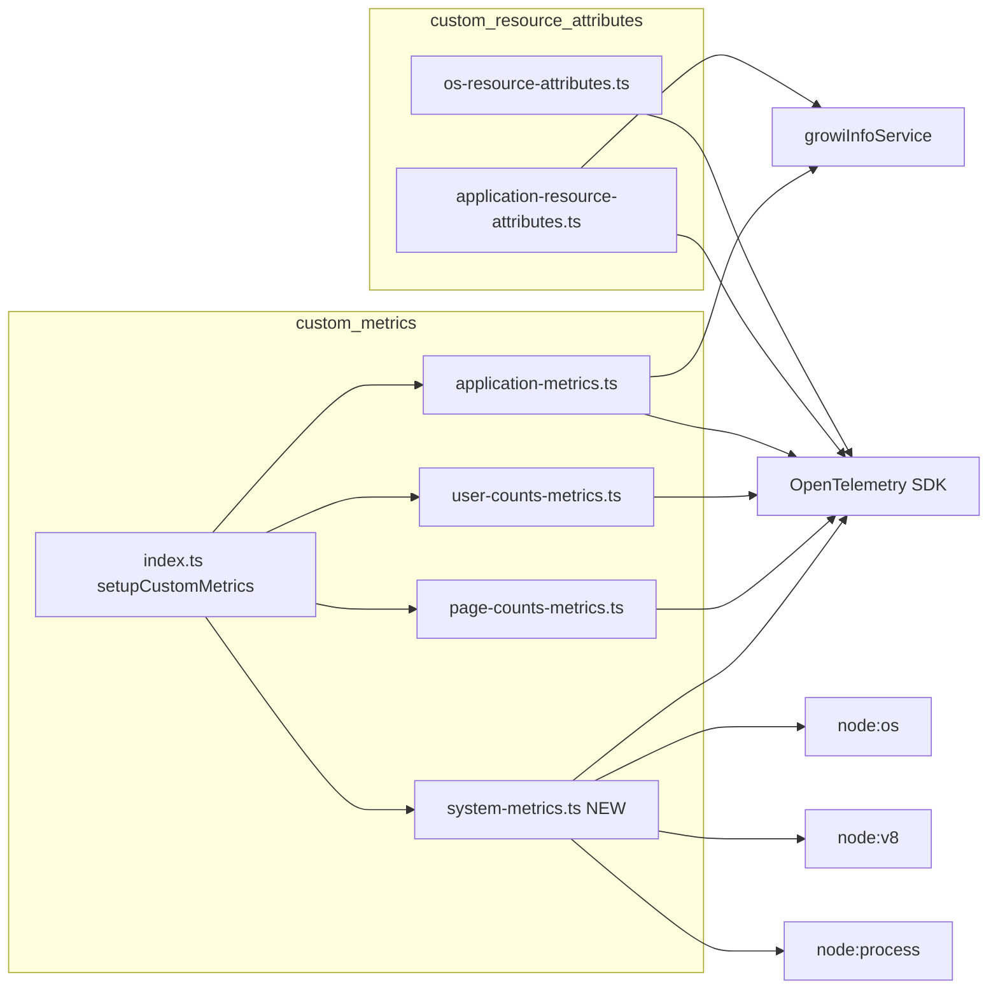

# Technical Design — otel-attributes-cleanup

## Overview

**Purpose**: GROWI OpenTelemetry 統合における Resource Attribute / Metric の責務を再分類し、コンテナ運用に必須のメモリ系メトリクスを追加する。

**Users**: OpenTelemetry 受信側インフラ管理者（GROWI からの telemetry を Prometheus / Grafana 等に取り込む運用者）。

**Impact**: Resource Attribute から `os.totalmem` と `growi.attachment.type` を削除する破壊的変更を伴い、その代わりに `growi.configs` info gauge の新ラベル 1 個と、新規メトリクス 6 個（`system.*` 2 個、`process.memory.usage` 1 個、`process.runtime.v8.heap.*` 3 個）を追加する。テレメトリ全体の wire 形式は OTLP のままで変更なし。

### Goals

- Resource Attribute を identity 専用に整理し、measurement / 設定値を排除する。
- コンテナ運用環境で cgroup memory limit とホスト物理メモリ総量を別メトリクスとして観測可能にする。
- プロセス RSS と V8 ヒープ統計を継続観測可能にする。
- 既存のカスタムメトリクスモジュール構造（1 モジュール = 1 ファイル = 1 setup 関数）に整合させ、レビュー差分を最小化する。

### Non-Goals

- 既存メトリクス（`growi.configs`, `growi.users.*`, `growi.pages.*`）の名称変更や再構成。
- `growi.deployment.type` の OTel semconv (`deployment.environment.name`) への移行。
- CPU / ネットワーク / GC / event loop lag 等のメトリクス追加。
- HTTP anonymization layer (`http.target` 等の span attribute) への変更。
- 外部パッケージ（`@opentelemetry/host-metrics` 等）の導入。

## Boundary Commitments

### This Spec Owns

- `os-resource-attributes.ts` から `os.totalmem` の出力を削除する責務。
- `application-resource-attributes.ts` から `growi.attachment.type` の出力を削除する責務。
- `application-metrics.ts` の `growi.configs` gauge に `attachment_type` ラベルを追加する責務。
- 新規モジュール `system-metrics.ts` の追加と、その 6 メトリクス（`system.memory.limit`, `system.host.memory.total`, `process.memory.usage`, `process.runtime.v8.heap.used`, `process.runtime.v8.heap.total`, `process.runtime.v8.heap.external`）の責務。
- `custom-metrics/index.ts` の `setupCustomMetrics()` への `addSystemMetrics()` の追加。
- 上記すべてに対応する spec.ts ファイルの追加・更新。
- リリース時の運用者向け移行マッピング（PR 説明 / リリースノート）。

### Out of Boundary

- `node-sdk-configuration.ts` 内の core service identity 属性（`service.name`, `service.version`, `service.instance.id`）。
- 他のカスタムメトリクスモジュール（`page-counts-metrics.ts`, `user-counts-metrics.ts`）の変更。
- HTTP anonymization（`anonymization/` 配下）。
- `growi.deployment.type` の renaming / 移行。
- CPU / network / GC / event-loop メトリクスの追加（将来要望時に別 spec で扱う）。
- `growi.configs` の既存ラベル（`site_url`, `site_url_hashed`, `wiki_type`, `external_auth_types`）の名称・値・付与条件。

### Allowed Dependencies

- Node.js 標準モジュール: `node:os`, `node:v8`, `node:process`。
- 既存 OpenTelemetry パッケージ: `@opentelemetry/api`（Meter / ObservableGauge / diag）。
- 既存サービス: `~/server/service/growi-info`（`growiInfoService.getGrowiInfo({ includeAttachmentInfo: true })`）。
- 既存ユーティリティ: `~/utils/logger`。
- **新規 npm 依存の追加は不可。**

### Revalidation Triggers

- `growiInfo.additionalInfo.attachmentType` の型・値域変更 → `growi.configs` のラベル付与ロジック再確認。
- `apps/app/package.json` の `engines.node` が v20.12 未満にダウングレード → `process.constrainedMemory()` 可用性の再確認（現状 `^24` なのでリスクなし）。
- `@opentelemetry/api` のメジャー更新（特に Meter / ObservableGauge API） → 全カスタムメトリクスの呼び出し方再確認。
- 受信側ダッシュボードのクエリ更新が未完了の状態でのリリース → ロールアウト順序の再調整。

## Architecture

### Existing Architecture Analysis

`features/opentelemetry/server/` は以下のような構造で確立している:

- `node-sdk-configuration.ts` が SDK 初期化と core Resource Attribute（service.*）を組み立てる。
- `node-sdk-resource.ts` / `generateAdditionalResourceAttributes()` が DB 初期化後に呼ばれ、`custom-resource-attributes/` から identity を補完する。
- `custom-metrics/setupCustomMetrics()` が起動時に各カスタムメトリクスモジュール（application / user-counts / page-counts）を順次登録する。
- 各カスタムメトリクスモジュールは `addXxxMetrics(): void` を export し、`metrics.getMeter('growi-<scope>-metrics', '1.0.0')` で Meter を取得 → `createObservableGauge` → `addBatchObservableCallback` の三段構成で実装される。

この構造をそのまま踏襲し、Resource Attribute 側はファイル内のキー削除のみ、Metric 側は新規 1 ファイル追加と既存 2 ファイルへの局所修正で完結させる。

### Architecture Pattern & Boundary Map



**Key Decisions**:
- 新規モジュール `system-metrics.ts` は `growiInfoService` に依存せず、Node.js stdlib のみを参照する（DB 初期化前でも動作可能だが、`setupCustomMetrics()` 経由で起動するため実行タイミングは他と同一）。
- 既存 4 モジュールに対する変更はすべて「ファイル内の追加・削除」で完結し、新たな相互依存は導入しない。

### Technology Stack

| Layer | Choice / Version | Role in Feature | Notes |
|-------|------------------|-----------------|-------|
| Runtime | Node.js `^24` | `process.constrainedMemory()`, `v8.getHeapStatistics()` 等 stdlib API を利用 | `engines` 既定値、変更なし |
| Telemetry SDK | `@opentelemetry/api ^1.9.0`, `@opentelemetry/sdk-metrics ^2.0.1` | Meter / ObservableGauge / diag | 既存導入済み、変更なし |
| Test | Vitest（既存設定） | `vi.mock('node:os')`, `vi.spyOn(process, 'constrainedMemory')`, `mock<Meter>()` パターン | 既存導入済み |

新規 npm 依存の追加なし。

## File Structure Plan

### Directory Structure

```
apps/app/src/features/opentelemetry/server/
├── custom-resource-attributes/
│   ├── os-resource-attributes.ts          # 修正: os.totalmem を削除
│   ├── os-resource-attributes.spec.ts     # 修正: totalmem 関連アサーション削除
│   ├── application-resource-attributes.ts # 修正: growi.attachment.type を削除
│   └── application-resource-attributes.spec.ts # 修正: attachment.type 関連アサーション削除
└── custom-metrics/
    ├── application-metrics.ts             # 修正: attachment_type ラベルを追加
    ├── application-metrics.spec.ts        # 修正: attachment_type のテストケース追加
    ├── system-metrics.ts                  # 新規: 6 メトリクスを emit
    ├── system-metrics.spec.ts             # 新規: テスト
    └── index.ts                           # 修正: addSystemMetrics の export と setupCustomMetrics への登録
```

### Modified Files

- `custom-resource-attributes/os-resource-attributes.ts` — `os.totalmem` を `osInfo` と返り値 attributes から削除。型と関数シグネチャは維持。
- `custom-resource-attributes/os-resource-attributes.spec.ts` — `vi.mock('node:os')` から `totalmem` のモックを除去、3 テストの期待値から `os.totalmem` キーを削除。
- `custom-resource-attributes/application-resource-attributes.ts` — 返り値 attributes から `growi.attachment.type` 行を削除。同時に `getGrowiInfo` 呼び出しから `includeAttachmentInfo: true` フラグも除去（このファイルからは `attachmentType` を参照しなくなるため）。
- `custom-resource-attributes/application-resource-attributes.spec.ts` — `growi.attachment.type` 関連アサーションを削除。
- `custom-metrics/application-metrics.ts` — `result.observe(growiInfoGauge, 1, { ... })` のラベルオブジェクトに `attachment_type: growiInfo.additionalInfo?.attachmentType ?? ''` を追加するのみ（`getGrowiInfo({ includeAttachmentInfo: true })` 呼び出しは既に存在するため変更不要）。
- `custom-metrics/application-metrics.spec.ts` — 期待ラベルに `attachment_type: <value>` を追加するテストケースを追加。空文字フォールバックのケースも追加。
- `custom-metrics/index.ts` — `export { addSystemMetrics } from './system-metrics';` を追加し、`setupCustomMetrics()` 内で `addSystemMetrics()` を呼び出す。

### New Files

- `custom-metrics/system-metrics.ts` — 1 ファイルで 6 メトリクスを emit する `addSystemMetrics(): void` を export。
- `custom-metrics/system-metrics.spec.ts` — `node:os` / `node:v8` / `process.constrainedMemory` をモックして、6 メトリクスそれぞれの観測 / `system.memory.limit` の cgroup 未設定時スキップ / エラー時の挙動を検証。

## Requirements Traceability

| Requirement | Summary | Components | Interfaces | Flows |
|-------------|---------|------------|------------|-------|
| 1.1 | `os.totalmem` を Resource Attribute に含めない | OsResourceAttributes | `getOsResourceAttributes()` 戻り値からキー削除 | — |
| 1.2 | `growi.attachment.type` を Resource Attribute に含めない | ApplicationResourceAttributes | `getApplicationResourceAttributes()` 戻り値からキー削除 | — |
| 1.3 | 既存 identity 系 attribute を変更しない | OsResourceAttributes, ApplicationResourceAttributes, node-sdk-configuration | 既存戻り値の他キー維持 | — |
| 2.1 | `growi.configs` に `attachment_type` ラベル付与 | ApplicationMetrics | `result.observe(growiInfoGauge, 1, { ..., attachment_type })` | — |
| 2.2 | 既存ラベルを変更しない | ApplicationMetrics | observe 呼び出しの他キー維持 | — |
| 2.3 | 取得不能時は空文字フォールバック | ApplicationMetrics | `attachmentType ?? ''` | — |
| 3.1 | cgroup limit 設定時 `system.memory.limit` を観測 | SystemMetrics | `process.constrainedMemory() > 0` 時に `result.observe(memoryLimitGauge, value)` | — |
| 3.2 | cgroup 未設定時はスキップ | SystemMetrics | 条件分岐で observe をスキップ | — |
| 3.3 | `system.host.memory.total` を常に観測 | SystemMetrics | `result.observe(hostMemoryTotalGauge, os.totalmem())` | — |
| 4.1 | `process.memory.usage` を観測 | SystemMetrics | `result.observe(processMemoryUsageGauge, process.memoryUsage().rss)` | — |
| 4.2 | `process.runtime.v8.heap.used` を観測 | SystemMetrics | `result.observe(v8HeapUsedGauge, v8.getHeapStatistics().used_heap_size)` | — |
| 4.3 | `process.runtime.v8.heap.total` を観測 | SystemMetrics | `result.observe(v8HeapTotalGauge, v8.getHeapStatistics().total_heap_size)` | — |
| 4.4 | `process.runtime.v8.heap.external` を観測 | SystemMetrics | `result.observe(v8HeapExternalGauge, process.memoryUsage().external)` | — |
| 5.1 | setup 時に新規モジュールを起動 | CustomMetricsIndex | `setupCustomMetrics()` 内で `addSystemMetrics()` を呼ぶ | — |
| 5.2 | コールバック内例外を吸収しログ | SystemMetrics | try/catch + `diag.createComponentLogger(...).error(...)` | — |
| 6.1 | 残存属性 / メトリクスを変更しない | 全モジュール | 削除以外の差分なし（既存 export / シグネチャ維持） | — |
| 6.2 | 移行マッピングを運用者に明示 | （PR / リリースノート） | 設計成果物外（ドキュメンテーション） | — |

## Components and Interfaces

| Component | Domain/Layer | Intent | Req Coverage | Key Dependencies | Contracts |
|-----------|--------------|--------|--------------|------------------|-----------|
| OsResourceAttributes | Resource Attribute | OS identity 属性を提供 | 1.1, 1.3 | `node:os` (P0) | Service |
| ApplicationResourceAttributes | Resource Attribute | GROWI service identity を提供 | 1.2, 1.3 | `growiInfoService` (P0) | Service |
| ApplicationMetrics | Metric | GROWI 設定情報を info gauge で出力 | 2.1, 2.2, 2.3 | `growiInfoService` (P0), `@opentelemetry/api` (P0) | Service |
| SystemMetrics（新規） | Metric | コンテナ / プロセスメモリの観測値を出力 | 3.1, 3.2, 3.3, 4.1, 4.2, 4.3, 4.4, 5.2 | `node:os`/`node:v8`/`node:process` (P0), `@opentelemetry/api` (P0) | Service |
| CustomMetricsIndex | Composition | カスタムメトリクス起動の合成点 | 5.1 | 各メトリクスモジュール (P0) | Service |

### Custom Resource Attributes Layer

#### OsResourceAttributes

| Field | Detail |
|-------|--------|
| Intent | OS identity を OTel Resource Attribute として返す |
| Requirements | 1.1, 1.3 |

**Responsibilities & Constraints**
- `os.type`, `os.platform`, `os.arch` を返す。
- `os.totalmem` は **返さない**。

**Dependencies**
- External: `node:os` — `type()`, `platform()`, `arch()` のみ呼ぶ（`totalmem()` は呼ばない） (P0)

**Contracts**: Service [x]

##### Service Interface
```typescript
export function getOsResourceAttributes(): Attributes;
// 戻り値: { 'os.type': string, 'os.platform': string, 'os.arch': string }
```

**Implementation Notes**
- 整合性: 既存関数シグネチャは維持し、戻り値オブジェクトからキーを除くだけにする。`logger.info` の "Collecting OS resource attributes" メッセージはそのまま。

#### ApplicationResourceAttributes

| Field | Detail |
|-------|--------|
| Intent | GROWI service identity を OTel Resource Attribute として返す |
| Requirements | 1.2, 1.3 |

**Responsibilities & Constraints**
- `growi.service.type`, `growi.deployment.type` を返す。
- `growi.attachment.type` は **返さない**。

**Dependencies**
- Inbound: `node-sdk-configuration.ts` の `generateAdditionalResourceAttributes` (P0)
- Outbound: `growiInfoService.getGrowiInfo()` (P0)

**Contracts**: Service [x]

##### Service Interface
```typescript
export async function getApplicationResourceAttributes(): Promise<Attributes>;
// 戻り値: { 'growi.service.type': string, 'growi.deployment.type': string }
```

**Implementation Notes**
- 整合性: `getGrowiInfo()` 呼び出し時の `includeAttachmentInfo: true` フラグはこのモジュールでは不要となるため除去する。`attachmentType` の値が必要なのは `application-metrics.ts` 側に移行する。
- 既存のエラーハンドリング（try/catch → 空 Attributes 返却）は維持。

### Custom Metrics Layer

#### ApplicationMetrics

| Field | Detail |
|-------|--------|
| Intent | GROWI 設定情報を info gauge `growi.configs` のラベルに集約 |
| Requirements | 2.1, 2.2, 2.3 |

**Responsibilities & Constraints**
- `growi.configs` ObservableGauge（値は常に 1）に既存 4 ラベル + `attachment_type` を付与。
- ラベル命名は snake_case で既存と整合。
- `attachmentType` 未取得時は空文字 `''` フォールバック。

**Dependencies**
- Outbound: `growiInfoService.getGrowiInfo({ includeAttachmentInfo: true })` (P0)
- External: `@opentelemetry/api` Meter / ObservableGauge / diag (P0)

**Contracts**: Service [x]

##### Service Interface
（既存と同じ。シグネチャ変更なし）
```typescript
export function addApplicationMetrics(): void;
```

##### Label Schema 変更後の `growi.configs` ラベル
| Label | Source | Notes |
|-------|--------|-------|
| `site_url` | `isAppSiteUrlHashed ? '[hashed]' : growiInfo.appSiteUrl` | 既存維持 |
| `site_url_hashed` | `isAppSiteUrlHashed ? hash(appSiteUrl) : undefined` | 既存維持 |
| `wiki_type` | `growiInfo.wikiType` | 既存維持 |
| `external_auth_types` | `additionalInfo?.activeExternalAccountTypes?.join(',') \|\| ''` | 既存維持 |
| `attachment_type` | `additionalInfo?.attachmentType ?? ''` | **新規追加** |

**Implementation Notes**
- 整合性: `result.observe(growiInfoGauge, 1, { ... })` のオブジェクトリテラルに 1 行追加するのみ。それ以外の制御フローは無変更。

#### SystemMetrics（新規）

| Field | Detail |
|-------|--------|
| Intent | コンテナ / ホスト / プロセス / V8 ヒープのメモリ系統計を ObservableGauge で出力 |
| Requirements | 3.1, 3.2, 3.3, 4.1, 4.2, 4.3, 4.4, 5.2 |

**Responsibilities & Constraints**
- 単一 Meter `growi-system-metrics`（version `'1.0.0'`）で 6 つの ObservableGauge を作成する。
- すべての gauge は単位 `By`（bytes）。
- 1 つの `addBatchObservableCallback` で全 gauge を観測（コールバック 1 回で 6 観測）。
- `process.constrainedMemory()` が `> 0` の場合のみ `system.memory.limit` を観測。`0` または `undefined` のときはこの 1 メトリクスのみスキップし、他 5 メトリクスは観測する。
- コールバック内で発生した例外は try/catch で吸収し `diag.createComponentLogger` でエラーログを出す。

**Dependencies**
- External: `node:os` (`totalmem()`), `node:v8` (`getHeapStatistics()`), `node:process` (`constrainedMemory()`, `memoryUsage()`) (P0)
- External: `@opentelemetry/api` Meter / ObservableGauge / BatchObservableCallback / diag (P0)

**Contracts**: Service [x]

##### Service Interface
```typescript
export function addSystemMetrics(): void;
```
- Preconditions: OpenTelemetry SDK が初期化済み（`metrics.getMeter` が有効な Meter を返す）。
- Postconditions: 1 Meter / 6 ObservableGauge / 1 BatchObservableCallback が登録される。
- Invariants: 各 collection cycle で `system.memory.limit` 以外は必ず観測される。

##### Metric Schema
| Metric Name | Unit | Source | Skip Condition |
|-------------|------|--------|----------------|
| `system.memory.limit` | `By` | `process.constrainedMemory()` | 値が `0` または falsy |
| `system.host.memory.total` | `By` | `os.totalmem()` | — |
| `process.memory.usage` | `By` | `process.memoryUsage().rss` | — |
| `process.runtime.v8.heap.used` | `By` | `v8.getHeapStatistics().used_heap_size` | — |
| `process.runtime.v8.heap.total` | `By` | `v8.getHeapStatistics().total_heap_size` | — |
| `process.runtime.v8.heap.external` | `By` | `process.memoryUsage().external` | — |

**Implementation Notes**
- 整合性: 既存 `application-metrics.ts` のスタイルを踏襲（`loggerFactory` / `loggerDiag` / `metrics.getMeter` / `addBatchObservableCallback`）。
- 観測の効率: `process.memoryUsage()` と `v8.getHeapStatistics()` はそれぞれ 1 コールバック内で 1 回ずつ呼び出し、結果をローカル変数に保持してから 6 つの gauge を観測する（API 呼び出しの重複を避ける）。
- リスク: なし（追加 dep ゼロ、stdlib 呼び出しのみ、副作用なし）。

#### CustomMetricsIndex

| Field | Detail |
|-------|--------|
| Intent | カスタムメトリクスモジュール群を順次起動 |
| Requirements | 5.1 |

**Responsibilities & Constraints**
- `setupCustomMetrics()` 内で既存 3 関数に加え `addSystemMetrics()` を呼び出す。
- 既存の dynamic import パターン（`await import('./xxx')`）を踏襲する。

**Dependencies**
- Inbound: SDK 起動シーケンス（`generateAdditionalResourceAttributes` の後段）
- Outbound: `addApplicationMetrics`, `addUserCountsMetrics`, `addPageCountsMetrics`, `addSystemMetrics`

**Contracts**: Service [x]

##### Service Interface
（既存シグネチャ維持、内部で 1 行追加）
```typescript
export const setupCustomMetrics = async (): Promise<void>;
```

## Error Handling

### Error Strategy

`SystemMetrics` のコールバック内で例外が発生した場合、既存の `application-metrics.ts` と同じく以下を行う:

1. `try { ... } catch (error) { loggerDiag.error(...) }` で例外を吸収。
2. 例外発生時、その collection cycle では何も観測しない（残りの gauge も不確実な値で観測しない）。
3. 次回 collection cycle で再試行（ObservableGauge の自然な振る舞い）。

### Error Categories and Responses

| Category | 例 | 振る舞い |
|----------|-----|---------|
| stdlib 呼び出し失敗 | `v8.getHeapStatistics()` が想定外の例外を throw（実際には発生しない） | `loggerDiag.error` してスキップ |
| `process.constrainedMemory()` の戻り値が異常 | 0 または undefined | `system.memory.limit` のみスキップ、他は観測継続 |
| Meter 取得失敗 | SDK 未初期化等 | `addSystemMetrics()` 起動時に例外伝播。`setupCustomMetrics()` の呼び出し元責任。 |

### Monitoring

- `diag.createComponentLogger({ namespace: 'growi:custom-metrics:system' })` で例外を OTel diag ロガーに記録（既存パターンと整合）。
- `loggerFactory('growi:opentelemetry:custom-metrics:system')` でアプリケーションロガーにも info ログを出力（起動完了時メッセージ）。

## Testing Strategy

### Unit Tests

新規・更新ファイルごとに以下のテスト項目を含める:

- **`os-resource-attributes.spec.ts`（更新）**:
  - `os.totalmem` キーが戻り値オブジェクトに含まれないこと（`expect(result).not.toHaveProperty('os.totalmem')`）。
  - `os.type` / `os.platform` / `os.arch` が引き続き含まれること。
- **`application-resource-attributes.spec.ts`（更新）**:
  - `growi.attachment.type` キーが戻り値オブジェクトに含まれないこと。
  - `growi.service.type` / `growi.deployment.type` が引き続き含まれること。
- **`application-metrics.spec.ts`（更新）**:
  - `attachment_type` ラベルが期待値（`'aws'`, `'gcs'` 等）で付与されること。
  - `additionalInfo` が undefined のとき `attachment_type: ''`（空文字）が付与されること。
  - 既存の 4 ラベルが引き続き正しく付与されること。
- **`system-metrics.spec.ts`（新規）**:
  - Meter が `'growi-system-metrics', '1.0.0'` で取得されること。
  - 6 個の `createObservableGauge` が正しい名称・unit `By` で作成されること。
  - `process.constrainedMemory()` が正の値を返すとき、`system.memory.limit` を当該値で観測すること（要件 3.1）。
  - `process.constrainedMemory()` が `0` を返すとき、`system.memory.limit` を観測しないこと（要件 3.2）。
  - 他 5 メトリクスは `process.constrainedMemory()` の戻り値によらず常に観測されること。
  - `process.memoryUsage()` の `rss` / `external` を `process.memory.usage` / `process.runtime.v8.heap.external` に正しくマップすること。
  - `v8.getHeapStatistics()` の `used_heap_size` / `total_heap_size` を `process.runtime.v8.heap.used` / `process.runtime.v8.heap.total` に正しくマップすること。
  - コールバック内例外時に `loggerDiag.error` が呼ばれ、`observe` が呼ばれないこと（要件 5.2）。

### Integration Tests

新規導入なし。本リファクタリングは module-local な変更のみで、cross-component の振る舞いを変更しない。`setupCustomMetrics()` 経由の起動順序の妥当性は unit テスト（index.ts 直接の spec は既存にないため、必要に応じて追加検討）と `node-sdk.spec.ts` の既存テスト範囲で担保する。

### E2E / Manual Verification

実環境（開発 devcontainer or staging container）で以下を確認する:

- OTLP collector 側に削除済み Resource Attribute（`os.totalmem`, `growi.attachment.type`）が **届かない** こと。
- `growi.configs` に `attachment_type` ラベルが **付与される** こと。
- 6 つの新規メトリクスが期待される名前と単位で **届く** こと。
- Docker container で `--memory=512m` を指定した場合に `system.memory.limit` が約 `536870912` を出力し、未指定時は出力されないこと（要件 3.1 / 3.2 の挙動確認）。
