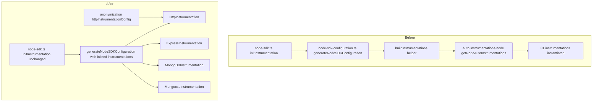
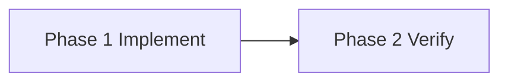

# Design Document — OTel Instrumentation Direct Import

## Overview

**Purpose**: `apps/app` の OpenTelemetry instrumentation 構成を、`@opentelemetry/auto-instrumentations-node` 経由の deny-list 方式から、必要な 4 instrumentation（HTTP / Express / MongoDB / Mongoose）の direct import 方式へ refactor する。`memory-leak-investigation` spec の L2 finding が「RSS 削減未達」となった根本原因（`getNodeAutoInstrumentations` が `enabled: false` 指定にかかわらず全 31 instrumentation を instantiate する仕様）を解消し、isolated benchmark で確認された約 11 MB / process の RSS 削減を GROWI runtime にも適用する。あわせて、deny-list 方式と一体だった `OTEL_AUTO_INSTRUMENTATION_PROFILE` 環境変数の参照を完全に取り除き、起動時の instrumentation 構成を固定の 4 個に単純化する。

**Users**: GROWI を自己ホストし OTel を有効化している運用者・SRE が直接の受益者。トレース機能を消費する開発者・運用者にとっては機能継続が保証される。

**Impact**: `generateNodeSDKConfiguration` 関数の内部で 4 instrumentation を直接 `new` する形に書き換え、`apps/app/package.json` の OTel 依存表面を 4 package の direct dep に置き換える。実行時の export 設定、custom metrics、anonymization 契約はすべて維持する。`OTEL_AUTO_INSTRUMENTATION_PROFILE` 環境変数は読み取り自体を廃止し、その値が何であっても runtime 挙動に影響しないようにする（warn ログ・分岐とも持たない）。

### Goals

- `generateNodeSDKConfiguration` が起動時に正確に 4 instrumentation のみを instantiate する状態にする
- `@growi/app` の runtime dependency surface から `@opentelemetry/auto-instrumentations-node` を除去し、4 instrumentation package を direct dep に昇格する
- HTTP anonymization config との合成契約を破壊せず維持する
- `OTEL_AUTO_INSTRUMENTATION_PROFILE` 環境変数への参照を完全に取り除き、当該変数の値が runtime に一切影響しないようにする
- GROWI runtime baseline mean RSS で 5 MB 以上の削減を verification report に記録する

### Non-Goals

- HTTP / Express / MongoDB / Mongoose 以外の新規 instrumentation 追加（必要になれば別 spec）
- BatchSpanProcessor / MetricReader / OTLP exporter 設定の変更
- custom metrics 5 個（application / user-counts / page-counts / system / yjs）の組み込み変更
- anonymization module 自体の変更（合成契約のみを保つ）
- `auto-instrumentations-node` の transitive 残存監視（`package-dependencies` rule の責務）

## Boundary Commitments

### This Spec Owns

- `apps/app/src/features/opentelemetry/server/node-sdk-configuration.ts` の `generateNodeSDKConfiguration` 関数の internal 構成、特に `instrumentations` 配列の構築方法
- `generateNodeSDKConfiguration` が `NodeSDKConfiguration.instrumentations` として渡す instrumentation 集合（HTTP / Express / MongoDB / Mongoose の 4 個）
- `OTEL_AUTO_INSTRUMENTATION_PROFILE` 環境変数を参照しない（読み取りロジック自体を持たない）こと
- `apps/app/package.json` の OTel 関連 runtime dependency 構成
  - 削除: `@opentelemetry/auto-instrumentations-node`
  - 追加: `@opentelemetry/instrumentation-http`、`@opentelemetry/instrumentation-express`、`@opentelemetry/instrumentation-mongodb`、`@opentelemetry/instrumentation-mongoose`
- 既存 `node-sdk-configuration.spec.ts` の test ケース更新（mock 構造の置き換え）
- 本 spec の verification report（before/after RSS 計測結果の記録）

### Out of Boundary

- `node-sdk.ts` の初期化フロー（`generateNodeSDKConfiguration` 呼び出し側）— 呼び出しシグネチャと使用方法は不変
- `setupCustomMetrics()` および `custom-metrics/` 配下の 5 個の metric 実装
- `anonymization/` モジュール内部の sanitization ロジック（合成入力としての contract のみ消費）
- `@opentelemetry/sdk-node`、`@opentelemetry/api`、OTLP exporter 等の SDK 基盤 dep のバージョン管理
- `memory-leak-investigation` の L1 / L3 / L4 / L5 finding
- `@opentelemetry/auto-instrumentations-node` の transitive dep 残存の検出・整理（`package-dependencies` rule の責務）

### Allowed Dependencies

- `@opentelemetry/instrumentation-http`、`@opentelemetry/instrumentation-express`、`@opentelemetry/instrumentation-mongodb`、`@opentelemetry/instrumentation-mongoose` — direct import 対象
- `@opentelemetry/instrumentation`（type-only import）— `Instrumentation` 型の取得用
- `@opentelemetry/sdk-node`、`@opentelemetry/api`、`@opentelemetry/resources`、`@opentelemetry/sdk-metrics`、`@opentelemetry/exporter-{trace,metrics}-otlp-grpc`、`@opentelemetry/semantic-conventions` — 既存依存（変更なし）
- 同モジュール内 `./anonymization` の `httpInstrumentationConfig` export — 既存契約を消費
- 同モジュール内 `./semconv` の `ATTR_SERVICE_INSTANCE_ID` — 既存契約を消費
- `~/utils/logger`、`~/utils/growi-version`、`~/server/service/config-manager` — 既存内部依存

### Revalidation Triggers

以下の変更が発生した場合、本 spec とその consumer の整合再確認が必要になる:

- `generateNodeSDKConfiguration` のシグネチャ変更（`Option` の field 追加・削除や戻り型の構造変更）
- 起動時に有効化される instrumentation 集合の追加・削除（4 個から増減）
- `httpInstrumentationConfigForAnonymize` の shape 変更（anonymization 側からの破壊的変更）
- `@opentelemetry/sdk-node` の `NodeSDKConfiguration.instrumentations` 入力型の major 変更
- `OTEL_AUTO_INSTRUMENTATION_*` 系の環境変数を runtime 挙動制御のために再導入する場合

## Architecture

### Existing Architecture Analysis

- 現行（本 spec 適用前）の `buildInstrumentations` は `OTEL_AUTO_INSTRUMENTATION_PROFILE` 値で 3 分岐し、いずれも `getNodeAutoInstrumentations(...)` を呼ぶ単一経路に収束する。
- `minimal` 分岐は内部で `ALL_AUTO_INSTRUMENTATION_PACKAGES`（31 entries）と `ALLOW_LIST_INSTRUMENTATION_PACKAGES`（4 entries）を組み合わせ deny-list config を組み立てる。
- `all` 分岐は legacy 互換のため pino / fs のみ disable する deny-list を組み立てる。
- HTTP instrumentation には `enableAnonymization` オプションに応じて `httpInstrumentationConfig`（`./anonymization`）が合成される。
- 戻り型は `ReturnType<typeof getNodeAutoInstrumentations>[]` の cast workaround で表現されている。
- 単一の caller は `generateNodeSDKConfiguration` で、結果配列は `NodeSDKConfiguration.instrumentations` にそのまま渡される。

### Architecture Pattern & Boundary Map

本 refactor は `generateNodeSDKConfiguration` の internal 実装入れ替え（旧 `buildInstrumentations` を独立関数ではなく `generateNodeSDKConfiguration` 内に inline 化する）にとどまり、上位 caller の契約（`generateNodeSDKConfiguration` の公開シグネチャ、`node-sdk.ts` の使用方法）は不変。



**Architecture Integration**:
- Selected pattern: **Inlined direct construction** — `generateNodeSDKConfiguration` 内で 4 instrumentation class を hard-coded で `new` し `instrumentations` 配列に組み立てる。専用の helper 関数や registry / DI は導入しない（YAGNI、Synthesis: Simplification）。
- Domain/feature boundaries: `opentelemetry/server/` モジュール内に閉じる。`anonymization/`・`custom-metrics/` との既存境界（import 経路のみ）を維持。
- Existing patterns preserved:
  - HTTP anonymization config の optional 合成
  - `generateNodeSDKConfiguration` の lazy initialization パターン（モジュールローカルな `configuration` キャッシュ）
- Removed patterns:
  - `OTEL_AUTO_INSTRUMENTATION_PROFILE` 環境変数による分岐（参照そのものを削除し、起動時挙動を固定の 4 instrumentation 構成に一本化）
- New components rationale: 新規コンポーネントは追加しない。既存関数 (`generateNodeSDKConfiguration`) の内部実装入れ替えと、旧 helper (`buildInstrumentations`) の inline 吸収のみ。
- Steering compliance: `tech.md` の Turbopack externalisation 規律に従い、SSR 経路で static import される 4 package を `dependencies` に追加。direct named import 化により Turbopack は当該 package を chunk bundle 側に組み込むため、`.next/node_modules/` 配下に symlink は生成されない（CI の `check-next-symlinks.sh` は当該 package について何も検査しない）。production artifact での解決可能性は build 後 `server:ci` 起動で担保される。

### Technology Stack

| Layer | Choice / Version | Role in Feature | Notes |
|-------|------------------|-----------------|-------|
| Backend (OTel SDK base) | `@opentelemetry/sdk-node` `^0.217.0`（既存） | `NodeSDK` instance を生成 | 変更なし |
| Backend (Instrumentation, removed) | ~~`@opentelemetry/auto-instrumentations-node` `^0.75.0`~~ | 旧 deny-list builder | 本 spec で `apps/app` の direct dep から削除 |
| Backend (Instrumentation, added) | `@opentelemetry/instrumentation-http` `^0.217.0` | HTTP server / client span 出力 | direct import 用、lockfile に既存解決あり |
| Backend (Instrumentation, added) | `@opentelemetry/instrumentation-express` `^0.65.0` | Express middleware / route span 出力 | direct import 用、lockfile に既存解決あり |
| Backend (Instrumentation, added) | `@opentelemetry/instrumentation-mongodb` `^0.70.0` | MongoDB driver span 出力 | direct import 用、lockfile に既存解決あり |
| Backend (Instrumentation, added) | `@opentelemetry/instrumentation-mongoose` `^0.63.0` | Mongoose 層 span 出力 | direct import 用、lockfile に既存解決あり |
| Backend (Instrumentation, type-only) | `@opentelemetry/instrumentation`（transitive） | `Instrumentation` 型の取得 | `import type` のみ、runtime dep 追加不要 |

> 上記バージョンは既に lockfile 内で `auto-instrumentations-node@0.75.0` 経由で解決済み（`research.md` 参照）。新規追加時のレンジは同一マイナーラインを採用する。

## File Structure Plan

### Directory Structure

```
apps/app/
├── src/features/opentelemetry/server/
│   ├── node-sdk-configuration.ts            # 本 spec の主改修対象（buildInstrumentations 再実装）
│   ├── node-sdk-configuration.spec.ts       # mock 構造を direct import 用に置換
│   ├── node-sdk.ts                          # 変更なし（caller 側、契約不変）
│   ├── anonymization/                       # 変更なし（合成入力としてのみ消費）
│   └── custom-metrics/                      # 変更なし（boundary 外）
├── package.json                             # OTel 依存表面の入れ替え
└── tmp/otel-import-bench/                   # 既存 benchmark（参考、変更なし）
.kiro/specs/otel-direct-import/
├── verification-report.md                   # 新規: before/after RSS 計測結果
├── requirements.md / design.md / research.md / tasks.md
└── spec.json
pnpm-lock.yaml                                # `pnpm install` で再生成
```

### Modified Files

- `apps/app/src/features/opentelemetry/server/node-sdk-configuration.ts` — 旧 `buildInstrumentations` helper を廃止し、`generateNodeSDKConfiguration` 内に 4 instrumentation の直接構築を inline 化。`ALL_AUTO_INSTRUMENTATION_PACKAGES` / `ALLOW_LIST_INSTRUMENTATION_PACKAGES` 定数、`getNodeAutoInstrumentations` import、`OTEL_AUTO_INSTRUMENTATION_PROFILE` の参照ロジック（環境変数 read／分岐／warn 出力）をすべて削除。HTTP anonymization 合成は `opts.enableAnonymization` フラグから直接 `HttpInstrumentation` の constructor 引数に渡す flat 構造に整理。
- `apps/app/src/features/opentelemetry/server/node-sdk-configuration.spec.ts` — `@opentelemetry/auto-instrumentations-node` mock を削除し、4 instrumentation package を個別に mock。各 constructor の `mock.calls[0]` を検査する形に test 構造を組み替え。anonymization 合成有無の検証のみを残し、`OTEL_AUTO_INSTRUMENTATION_PROFILE` 関連の test ケース（unset / `minimal` / `all` / unknown 値）は本実装で当該変数を参照しなくなったため除去。
- `apps/app/package.json` — `dependencies` から `@opentelemetry/auto-instrumentations-node` を削除し、4 instrumentation package を追加。
- `pnpm-lock.yaml` — `pnpm install` 実行による自動再生成。

### Added Files

- `.kiro/specs/otel-direct-import/verification-report.md` — devcontainer での before / after RSS 計測結果（baseline mean、delta、scenario 条件）の記録。

## Requirements Traceability

| Requirement | Summary | Components | Interfaces | Flows |
|-------------|---------|------------|------------|-------|
| 1.1 | 起動時に 4 instrumentation を有効化 | `generateNodeSDKConfiguration` の `instrumentations` 配列 | `NodeSDKConfiguration.instrumentations` 入力 | initInstrumentation → generateNodeSDKConfiguration |
| 1.2 | 4 個以外を instantiate しない | `generateNodeSDKConfiguration` | 4 class の direct constructor 呼び出しのみ | 同上 |
| 1.3 | 集合を unit test で assertable | `generateNodeSDKConfiguration` + spec | 4 instrumentation の constructor mock 呼び出し検査 | テスト経路 |
| 2.1 / 2.2 / 2.3 | http / express / mongodb / mongoose の span 出力継続 | `HttpInstrumentation`、`ExpressInstrumentation`、`MongoDBInstrumentation`、`MongooseInstrumentation`（4 class の instantiation） | NodeSDKConfiguration.instrumentations 入力 | NodeSDK.start() → instrumentations 起動 |
| 2.4 | custom metrics の継続出力 | （境界外：`setupCustomMetrics`）依存契約として保持 | OTLP metric exporter 経路（不変） | startOpenTelemetry → setupCustomMetrics |
| 3.1 / 3.2 / 3.3 | HTTP anonymization 合成 | `generateNodeSDKConfiguration` 内 HTTP 構築箇所、`httpInstrumentationConfigForAnonymize` 入力 | `Option.enableAnonymization` フラグ → HTTP instrumentation config | anonymization 合成経路 |
| 4.1 | 環境変数を読み取らない | `generateNodeSDKConfiguration`（実装内に `process.env.OTEL_AUTO_INSTRUMENTATION_PROFILE` への参照を持たない） | — | — |
| 4.2 | env var 値に関わらず同一の 4 instrumentation を起動 | `generateNodeSDKConfiguration` の固定実装 | NodeSDKConfiguration.instrumentations 入力（不変） | initInstrumentation → 4 instrumentation 起動 |
| 4.3 | env var に紐づく warn / deprecation ログを出さない | `generateNodeSDKConfiguration`（warn を含まない実装） | — | — |
| 4.4 | env var 値による startup throw を行わない | `generateNodeSDKConfiguration` の例外契約 | 例外を投げない契約 | 起動経路 |
| 5.1 / 5.2 | package.json 依存表面 | `apps/app/package.json` | npm dependencies 表面 | パッケージ install 経路 |
| 5.3 | production artifact で 4 package が解決可能 | `apps/app/package.json` + Turbopack chunk bundling | `.next/server/chunks/` 配下の bundle | build → assemble-prod → CI |
| 6.1 / 6.2 / 6.3 | RSS 削減効果の運用観察 | `verification-report.md`、memory-profiler scenario runner（既存ツール） | scenario 実行 → 計測値記録 | verification 実行経路 |

## Components and Interfaces

| Component | Domain/Layer | Intent | Req Coverage | Key Dependencies (P0/P1) | Contracts |
|-----------|--------------|--------|--------------|--------------------------|-----------|
| `generateNodeSDKConfiguration` | Backend / OTel init | `NodeSDKConfiguration` を組み立て、`instrumentations` 配列を 4 instrumentation の direct 構築で埋める | 1.1, 1.2, 1.3, 2.1, 2.2, 2.3, 3.1, 3.2, 3.3, 4.1, 4.2, 4.3, 4.4 | 4 instrumentation package (P0)、`./anonymization` (P0) | Service |
| `apps/app/package.json`（OTel 依存表面） | Build / Packaging | runtime dependency surface を direct import 構成に整える | 5.1, 5.2, 5.3 | pnpm workspace（P0）、Turbopack bundling（P0） | State |
| `verification-report.md` | Spec verification | before / after の RSS 計測結果を記録 | 6.1, 6.2, 6.3 | memory-profiler scenario runner（P0） | Batch |

### Backend / OTel init

#### `generateNodeSDKConfiguration`

| Field | Detail |
|-------|--------|
| Intent | `Option` を受け取り、`NodeSDKConfiguration` を組み立てる。その内部で HTTP / Express / MongoDB / Mongoose の 4 instrumentation を direct で構築して `instrumentations` 配列に詰める |
| Requirements | 1.1, 1.2, 1.3, 2.1, 2.2, 2.3, 3.1, 3.2, 3.3, 4.1, 4.2, 4.3, 4.4 |

**Responsibilities & Constraints**
- `NodeSDKConfiguration`（resource / traceExporter / metricReader / instrumentations）を組み立てて返すことを唯一の責務とする。
- `instrumentations` 配列は 4 instrumentation class（`HttpInstrumentation`、`ExpressInstrumentation`、`MongoDBInstrumentation`、`MongooseInstrumentation`）を直接 `new` で構築したもののみを含み、それ以外の instrumentation を一切 instantiate しない。
- HTTP instrumentation には `Option.enableAnonymization` が truthy のときのみ `httpInstrumentationConfigForAnonymize` を constructor 引数として渡し、falsy / 未指定のときは constructor を引数なしで呼び出す。
- `process.env.OTEL_AUTO_INSTRUMENTATION_PROFILE` を含む `OTEL_AUTO_INSTRUMENTATION_*` 系の環境変数を一切参照しない（実装内に当該キー名を持たない）。これに伴い、env var 値による分岐・warn ログ・縮退ロジックも持たない。
- 任意の入力値で例外を投げない（startup を破壊しない）。
- モジュールローカルな `configuration` キャッシュを介した lazy initialization パターンを維持する（同一プロセス内で 2 回目以降の呼び出しはキャッシュ済 `Configuration` を返す）。

**Dependencies**
- Inbound: `node-sdk.ts` の `initInstrumentation` から呼び出される（P0）
- Outbound: `HttpInstrumentation`、`ExpressInstrumentation`、`MongoDBInstrumentation`、`MongooseInstrumentation` の 4 class（P0）
- Outbound: `httpInstrumentationConfigForAnonymize`（`./anonymization`）— anonymization 合成入力（P0）
- Outbound: `OTLPTraceExporter`、`OTLPMetricExporter`、`PeriodicExportingMetricReader`、`resourceFromAttributes`（既存依存、変更なし）

**Contracts**: Service [x] / API [ ] / Event [ ] / Batch [ ] / State [ ]

##### Service Interface

```typescript
import type { Resource } from '@opentelemetry/resources';
import type { NodeSDKConfiguration } from '@opentelemetry/sdk-node';

type Option = {
  enableAnonymization?: boolean;
};

type Configuration = Partial<NodeSDKConfiguration> & {
  resource: Resource;
};

export const generateNodeSDKConfiguration = (opts?: Option): Configuration;
```

- Preconditions:
  - `httpInstrumentationConfigForAnonymize` が `./anonymization` から既存と同じ shape で export されている。
  - 環境変数の状態（`OTEL_AUTO_INSTRUMENTATION_PROFILE` を含む）は本関数の振る舞いに影響しない。
- Postconditions:
  - 戻り値 `Configuration` の `instrumentations` 配列の長さは常に 4。
  - 配列要素はそれぞれ `HttpInstrumentation`、`ExpressInstrumentation`、`MongoDBInstrumentation`、`MongooseInstrumentation` の instance。
  - `opts.enableAnonymization === true` のとき、`HttpInstrumentation` の constructor 第 1 引数に `httpInstrumentationConfigForAnonymize` の field が含まれる。
  - `opts.enableAnonymization` が falsy または未指定のとき、`HttpInstrumentation` の constructor 第 1 引数は `undefined` であり、anonymization 由来の field は含まれない。
  - `OTEL_AUTO_INSTRUMENTATION_PROFILE` 環境変数の値が何であっても（unset / `minimal` / `all` / 任意の未知の値）、戻り値の `instrumentations` 配列は同一の 4 instrumentation で構成され、warn ログは出ない。
- Invariants:
  - `instrumentations` 配列に 4 instrumentation 以外を含めない。
  - 同一プロセス内で初回呼び出し後はモジュールローカルキャッシュを返す（lazy initialization 維持）。
  - 関数本体内で `getNodeAutoInstrumentations` を import しない、`ALL_AUTO_INSTRUMENTATION_PACKAGES` / `ALLOW_LIST_INSTRUMENTATION_PACKAGES` を参照しない、`process.env.OTEL_AUTO_INSTRUMENTATION_PROFILE` を読み取らない。

**Implementation Notes**
- Integration: caller `node-sdk.ts` の使用方法は不変。`generateNodeSDKConfiguration` の戻り型と引数は既存契約と互換。
- Validation: 4 instrumentation の constructor を `vi.mock` で stub し、各 constructor の呼び出し回数・引数を `vi.mocked(...).mock.calls` で検査する。
- Risks: 4 instrumentation package が個別バージョンで lockfile に解決されるため、`@opentelemetry/api` の共通バージョン整合性を `pnpm install` 後に確認する。

### Build / Packaging

#### `apps/app/package.json`（OTel 依存表面）

| Field | Detail |
|-------|--------|
| Intent | runtime dependency surface を direct import 構成に整える |
| Requirements | 5.1, 5.2, 5.3 |

**Responsibilities & Constraints**
- `dependencies` から `@opentelemetry/auto-instrumentations-node` を削除する。
- `dependencies` に `@opentelemetry/instrumentation-http`、`@opentelemetry/instrumentation-express`、`@opentelemetry/instrumentation-mongodb`、`@opentelemetry/instrumentation-mongoose` を追加する。バージョンは lockfile 解決済みのレンジ（`^0.217.0` / `^0.65.0` / `^0.70.0` / `^0.63.0`）を採用。
- 4 instrumentation package は direct named import 化により Turbopack の chunk bundle 側に取り込まれる。production deployment artifact での解決可能性は build 後 `server:ci` 起動（または `assemble-prod.sh` 後の `launch-prod` job）で担保される。`.next/node_modules/` 配下に symlink は生成されないため `check-next-symlinks.sh` は本 package に対しては何も検査しない。

**Dependencies**
- Inbound: `apps/app` の SSR コードからの static import（P0）
- Outbound: pnpm workspace 解決（P0）、Turbopack externalisation（P0）

**Contracts**: State [x]（package dependency 表面の状態）

**Implementation Notes**
- Integration: `pnpm install` を root から実行して `pnpm-lock.yaml` を再生成。
- Validation: `pnpm run build` 後に `ls apps/app/.next/node_modules/` から `auto-instrumentations-node` の symlink が消えていることと、`.next/server/chunks/` 配下のいずれかの chunk に 4 instrumentation の import 痕跡（例: `instrumentation-http` 等の package 名 / module 識別子）が含まれることを確認。CI の `reusable-app-prod.yml` で `check-next-symlinks.sh`（broken symlink 不在の確認）と `server:ci`（production artifact で module load 失敗が起きないことの確認）を通す。
- Risks: 旧 `auto-instrumentations-node` が他 package の transitive dep として残る可能性は `package-dependencies` rule の責務（本 spec の boundary 外）。
- Notes: `@growi/app` は internal package（npm 公開対象は `@growi/core` / `@growi/pluginkit` のみ）のため、changeset は作成しない。`OTEL_AUTO_INSTRUMENTATION_PROFILE` 環境変数は本 spec で実装側の参照を完全に削除しており、当該変数の値は runtime に影響しない。運用者向けの追加通知（warn ログ等）は本実装では行わない。

### Verification

#### `verification-report.md`

| Field | Detail |
|-------|--------|
| Intent | devcontainer 上の memory-profiler scenario runner で取得した before / after baseline mean RSS と delta を記録する |
| Requirements | 6.1, 6.2, 6.3 |

**Responsibilities & Constraints**
- before / after それぞれを「OTel ON、5 分 idle baseline」シナリオで計測した結果として記録する。
- baseline mean RSS（before）、baseline mean RSS（after）、delta（MB）、計測日時、計測環境（devcontainer / Node.js version / commit SHA）を含める。
- delta が 5 MB 未満の場合、本 spec は要件 6.1 不達と判定する。
- 計測中 / 直後に既存 4 instrumentation のトレースが OTLP exporter に流れていることを確認した事実を記録する（要件 6.2 への観察的根拠）。

**Contracts**: Batch [x]（verification pipeline で 1 回作成）

**Implementation Notes**
- Integration: `apps/app` の memory-profiler scenario runner を使用（既存ツール、`memory-leak-investigation` spec で導入）。
- Validation: scenario runner の出力 JSON / log から baseline mean RSS を抽出し、本ファイルに転記。
- Risks: DB drift / ホスト負荷の noise — sample 数を確保し中央値ベースで評価する。

## Error Handling

### Error Strategy

- **環境変数値による起動阻害は行わない**: `OTEL_AUTO_INSTRUMENTATION_PROFILE` を含む `OTEL_AUTO_INSTRUMENTATION_*` 系の環境変数は実装側で参照しないため、その値が何であっても `generateNodeSDKConfiguration` は同一の 4 instrumentation 構成を返して正常終了する。throw しない。
- **deprecation 通知は出さない**: 本実装は当該環境変数の存在を認識しないため、warn / deprecation log は出力しない。
- **instrumentation 構築時の内部エラー**: 各 instrumentation の constructor が throw する可能性は OTel SDK 側の責務であり、本 spec では握りつぶさず上位（NodeSDK の起動）に伝搬する（既存挙動を維持）。

### Error Categories and Responses

- **User Errors（env var 誤設定）**: 該当なし。`OTEL_AUTO_INSTRUMENTATION_PROFILE` への参照を実装側で持たないため、値の妥当性検査・warn 通知も発生しない。
- **System Errors（instrumentation 構築失敗）**: 個別の instrumentation constructor が throw した場合、現状どおり起動が失敗する。本 spec では新規ハンドリングを追加しない（speculative）。
- **Business Logic Errors**: 該当なし。

### Monitoring

- 起動後の trace / metric 出力は既存 OTLP exporter を通じて観察可能（本 spec で挙動変化なし）。

## Testing Strategy

### Unit Tests（`node-sdk-configuration.spec.ts`）

- `generateNodeSDKConfiguration()` を呼び出したとき、`HttpInstrumentation`、`ExpressInstrumentation`、`MongoDBInstrumentation`、`MongooseInstrumentation` の 4 constructor が `vi.mock` でスタブされた状態でそれぞれ 1 回ずつ呼ばれることを確認。
- `generateNodeSDKConfiguration({ enableAnonymization: true })` で `HttpInstrumentation` constructor の第 1 引数に `httpInstrumentationConfigForAnonymize` の field が含まれることを確認。
- `generateNodeSDKConfiguration({ enableAnonymization: false })` および引数なし呼び出しで、`HttpInstrumentation` constructor の第 1 引数が `undefined` であり anonymization 由来の field を含まないことを確認。
- 本実装は `OTEL_AUTO_INSTRUMENTATION_PROFILE` を参照しないため、当該環境変数に関するテストケース（unset / `minimal` / `all` / unknown 値での挙動・warn 出力）は仕様上不要であり追加しない。

### Integration Tests

- `pnpm run build` 後に `apps/app/.next/node_modules/` 配下に `@opentelemetry/auto-instrumentations-node` の symlink が存在しないことを `ls` で確認。
- `pnpm run build` 後に `.next/server/chunks/` 配下のいずれかの chunk に 4 instrumentation の package 名 / module 識別子が grep でヒットすることを確認（bundle 形式での同梱を観測）。
- CI（`reusable-app-prod.yml`）で `check-next-symlinks.sh` が broken symlink を 1 件も出さないこと、および `server:ci` が exit 0 で終了することを通じ、production artifact で 4 instrumentation が runtime に解決可能であることを確認。
- `apps/app/package.json` の OTel 関連 `dependencies` が「`auto-instrumentations-node` 不在 / 4 instrumentation 存在」となっていることを確認。

### Verification（要件 6 系の運用観察）

- devcontainer で memory-profiler scenario runner を本 spec 適用前後のコミットそれぞれで実行し、OTel ON / 5 分 idle baseline の baseline mean RSS を取得。
- before / after の delta が 5 MB 以上であることを `verification-report.md` に記録（要件 6.1）。
- 計測中に GROWI のページ表示・編集・検索が機能することを目視確認（要件 6.2）。
- 計測結果を `verification-report.md` に転記し、commit SHA・Node.js version・計測日時を含める（要件 6.3）。

### Performance Sanity

- 4 instrumentation 起動による span emit のオーバーヘッドは既存と同等（同じ 4 instrumentation を有効化していたため）。新規ベンチマークは不要。

## Migration Strategy

### Rollout Phases



- **Phase 1 — Implement**: `generateNodeSDKConfiguration` 内の instrumentations 配列を 4 instrumentation の direct 構築に書き換え、旧 helper (`buildInstrumentations`) と `OTEL_AUTO_INSTRUMENTATION_PROFILE` の参照を削除。`package.json` 入れ替え、test 更新、`pnpm install`、`pnpm run lint` / `pnpm run test` / `pnpm run build` を通す。
- **Phase 2 — Verify**: memory-profiler scenario runner で before / after RSS 計測、`verification-report.md` 記録、`.next/node_modules/` の `auto-instrumentations-node` 不在確認、`.next/server/chunks/` 配下に 4 instrumentation の bundle 痕跡が含まれることの確認。
- **Env var の取り扱い**: 本 spec で `OTEL_AUTO_INSTRUMENTATION_PROFILE` の参照ロジックは完全に削除する。当該変数を deployment 環境で設定していても runtime 挙動には影響しない（無視される）。後方互換性は「同名変数を設定したまま deploy しても破壊されない」レベルで担保される。

### Rollback Triggers

- 本 spec 適用後に 4 instrumentation のいずれかでトレース欠落が発生した場合（要件 2.1〜2.3 違反）。
- `verification-report.md` の RSS delta が 5 MB 未満で再現する場合（要件 6.1 違反）。
- production deployment で 4 package のいずれかが `ERR_MODULE_NOT_FOUND` を起こした場合（要件 5.3 違反）。

いずれも `apps/app/package.json` と `node-sdk-configuration.ts` を git revert することで rollback 可能（本 spec の変更範囲が狭い）。

## Performance & Scalability

- **Target metric**: per-process RSS（baseline mean、OTel ON / 5 分 idle）。
- **Expected delta**: isolated benchmark で −11 MB（auto-deny → direct-import）。GROWI runtime での閾値は −5 MB（DB drift noise の下限）。
- **Measurement**: memory-profiler scenario runner（既存ツール、`memory-leak-investigation` spec で導入）。
- **No additional caching / batching changes**: span / metric 出力 frequency、batch サイズはすべて既存設定を維持。
