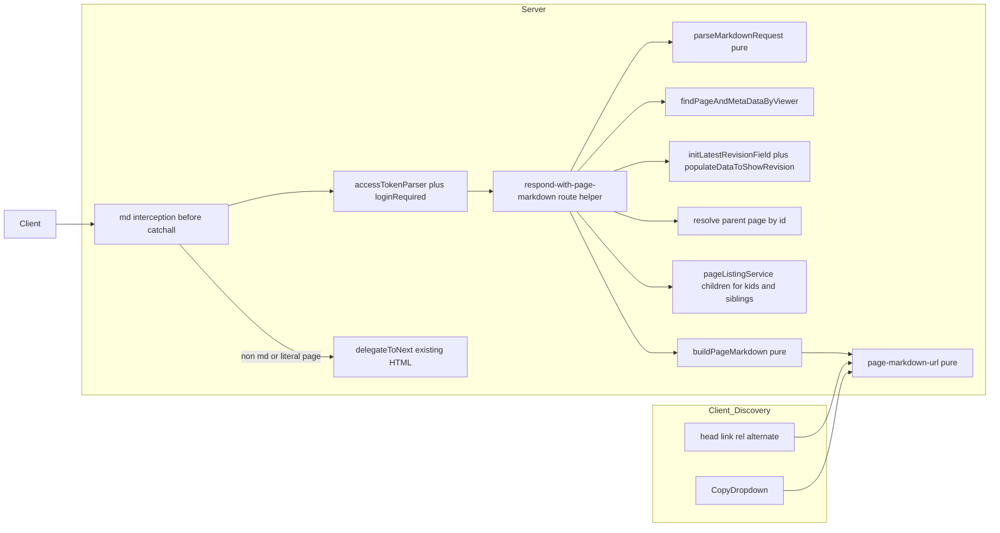
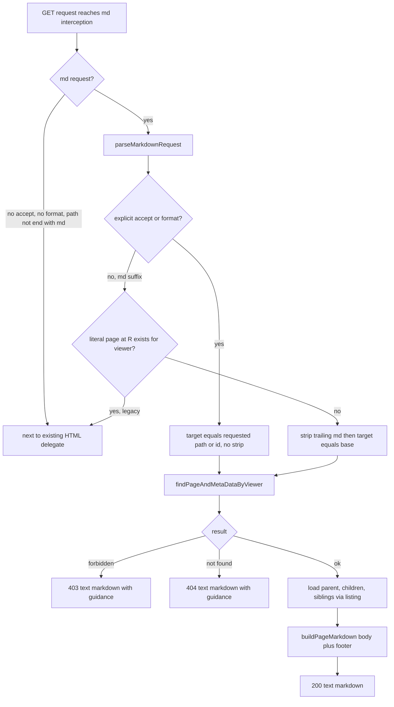

# Technical Design: page-markdown-endpoint

## Overview

**Purpose**: URL を渡された対話型 AI エージェント（および認証付きツール）が、JavaScript を実行せずに 1 回の取得で GROWI ページの本文と近傍ナビゲーションを得られるようにする。GROWI の各ページに対し `text/markdown` 表現を返す HTTP エンドポイントを追加する。

**Users**: `.md` URL を貼り付けられた AI エージェント、ページ URL を `Accept: text/markdown` で取得するツール／クローラ、および「AI 用 URL」をコピーする GROWI 利用者。

**Impact**: 既存のページ配信（Next.js 委譲）の手前に薄い interception を追加し、既存の認可・本文取得・ページツリーを再利用して Markdown を返す。既存の HTML 配信・API・認可には変更を加えない（追加のみ）。

**Base**: 実装ブランチは `origin/dev/8.0.x` から切る（master ではない）。本設計は 2026-07-11 に origin/dev/8.0.x 基準で再検証済み。設計思想は master 時点から変わらないが、dev/8.0.x での差分として (1) `routes/index.js` が ESM 化し catch-all の行番号が変わった、(2) `findPageAndMetaDataByViewer` が bookmark 集計を Prisma で行う（認可契約は不変・結合テストで Prisma 初期化が必要）の 2 点を各所へ反映した。literal-wins の前提（`.md` 予約）・認可ミドルウェア API・populate 手本は dev/8.0.x でも健在。

### Goals
- `/{pageId}.md`・`{pagePath}.md`・`Accept: text/markdown`（`?format=md`）で本文 Markdown を返す。
- 本文末尾に親・子・兄弟・正規 URL・permalink・更新情報を含む近傍ナビゲーション footer を付ける。
- 既存のページ閲覧と同一の認可に従う（新しい認可を作らない）。
- 人間（CopyDropdown）と機械（`<link rel="alternate">` / `Link` ヘッダ）の双方に `.md` URL の発見手段を提供する。

### Non-Goals
- SEO / GEO 向けの sitemap.xml / JSON-LD / Open Graph / SEO 用 canonical メタ / llms.txt / robots.txt と管理画面トグル（Phase 2・別スペック）。
- 子ページ一覧専用の Markdown エンドポイント（`/{pageId}/children.md` 等）。footer から既存のページ一覧 API へ案内する。
- 本文 Markdown の加工（lsx 等の動的展開、相対リンクの絶対化、HTML 化）。`revision.body` を逐語で返す。
- 応答のキャッシュ層（ETag / Cache-Control）。将来の NFR。

## Boundary Commitments

### This Spec Owns
- `.md` サフィックスおよび `Accept: text/markdown` / `?format=md` を検出し、ページを Markdown で返す HTTP 経路。
- `.md` サフィックスと実在ページの衝突解決規則（literal-wins）。
- Markdown 応答の本文組立（`revision.body` ＋近傍ナビゲーション footer）と、空ページ時の応答形。
- 対象ページの Markdown 版を指す `.md` URL の生成規則（共有ユーティリティ）と、その発見手段（CopyDropdown 項目、`<link rel="alternate">`、`Link` ヘッダ）。

### Out of Boundary
- ページの grant／閲覧権限の判定ロジック（既存の viewer 付きファインダに委譲）。
- ページ本文・リビジョンの永続化と取得の実装（既存 Page/Revision モデル）。
- 子ページ・ツリーの列挙アルゴリズム（既存 `pageListingService`）。
- Phase 2 の SEO/GEO 機能および管理画面トグル。

### Allowed Dependencies
- `findPageAndMetaDataByViewer`（`Page.findByIdAndViewer` / `Page.findByPathAndViewer` 経由）で**閲覧可否の判定とページ本体の解決**を行う。※この finder は `revision`／`parent`／`lastUpdateUser` を populate せず ObjectId のまま返す点に注意。※dev/8.0.x ではこの finder が bookmark 集計を Prisma（`prisma.bookmarks.count` / `findByPageIdAndUserId`）で行う。認可・not-found/forbidden の契約は master と同一で設計ロジックに影響しないが、**この経路を通る結合テストは bootstrap で Prisma 初期化が必要**（下記 Testing Strategy 参照）。
- `page.initLatestRevisionField(revisionId?)` + `page.populateDataToShowRevision(false)` で本文（`revision.body`）と更新者を populate する。読み取りエンドポイントでは **route 層で populate するのが慣習**（`respond-with-single-page.ts:78-81`, `page-data-props.ts:226-237`）。
- 親ページの path/title は `page.parent`（ObjectId）から**追加クエリ**で解決する（populate では得られない）。
- 子・兄弟導出は page-listing サービスの **limit 付き取得＋viewer-aware count**（id 指定で regex を作らない）。子リンクは `limit(N+1)`、直下子の正確な総数は `addViewerCondition` を重ねた `countDocuments({ parent: id })`（`countByIdAndViewer` `page.ts:722-729` と同流儀）。既存の全件返し `findChildrenByParentPathOrIdAndViewer` はメモリ観点で本用途には使わない。
- `accessTokenParser([SCOPE.READ.FEATURES.PAGE], { acceptLegacy: true })` + `loginRequired`（ゲスト許可）。
- `@growi/core` の `isPermalink` / `isValidObjectId` / `encodeSpaces`、`serializeUserSecurely`。
- 依存の向きは一方向（下記 Dependency Direction）。上位（route/UI）→下位（pure util）へのみ。

### Revalidation Triggers
- `findPageAndMetaDataByViewer` / `findChildrenByParentPathOrIdAndViewer` のシグネチャや forbidden/not-found 意味論が変わったとき。
- `routes/index.js` の catch-all の順序・パスが変わったとき（interception の登録位置に影響）。
- `.md` URL の形（`/{pageId}.md`）を変えたとき（CopyDropdown・`<link rel="alternate">`・footer 内リンク・Phase 2 の全消費者に波及）。
- `isCreatablePage` の `.md` 予約（`/.+\.md$/`）が撤廃されたとき（literal-wins の前提が崩れる）。

## Architecture

### Existing Architecture Analysis
- ページ配信は `apps/app/src/server/routes/index.js` の catch-all（dev/8.0.x では `:402` `/*/$` と `:403` `/*`、`loginRequired` = ゲスト許可）が Next.js の `[[...path]]` に委譲する。permalink `/{pageId}` も専用ルートが無く同経路。このモジュールは dev/8.0.x で **ESM 化**されており、エントリは `export const setup = (crowi, app) => {…}`、子ルーターは `import { setup as setupPage } from './page'` ＋ `setupPage(crowi, app)` で組む（catch-all の手前に `/vault.git`(:82) が追加されているが接頭辞が異なり衝突しない）。
- 認可はファインダ内包（`find-page-and-meta-data-by-viewer.ts:87,89`）。forbidden/not-found は「フィルタ無しで再カウントし count>0 なら forbidden」で区別（同 `:93-105`）。
- `isCreatablePage`（`packages/core/src/utils/page-path-utils/index.ts:119`）が `/.+\.md$/`（同 `:110`）で末尾 `.md` パスの作成を禁止。→ **`.md` 名前空間は予約済みで空いており**、literal-wins が守る「`.md` で終わる通常ページ」は通常操作では生じない（安全網）。

### Architecture Pattern & Boundary Map



**Architecture Integration**:
- Selected pattern: 既存 catch-all の**手前に置く単一 interception ハンドラ**＋route 層のレスポンスヘルパ。該当しなければ `next()` でフォールスルー。
- Domain/feature boundaries: HTTP 関心（検出・認可合成・Content-Type・ステータス）と、解決・populate・親子兄弟ロード・組立オーケストレーションは **route 層のレスポンスヘルパ**（既存 `respond-with-single-page.ts` と同じ層。読み取りページの populate は route 層で行うのが GROWI の慣習）。純ロジック（リクエスト解釈・footer・`.md` URL）は pure util に分離。
- Existing patterns preserved: TS factory ルート（`getBrandLogoRouterFactory` 型）、`accessTokenParser`+`loginRequired` 合成、viewer 付きファインダ、`serializeUserSecurely`。
- New components rationale: 既存ファイルを肥大化させず、footer・URL 生成を純関数化してテスト可能にするため。
- Steering compliance: server/client 境界を守り、`.md` URL util は client 安全な `src/utils/` に置く。`any` を使わず discriminated union で結果を表現。

### Dependency Direction
`page-markdown-url (pure)` / `parseMarkdownRequest (pure)` / `buildPageMarkdown (pure)` → `respond-with-page-markdown (route helper)` → `page-markdown route factory` → `routes/index.js`。UI（CopyDropdown）と SSR head は `page-markdown-url` のみを参照。各層は左の層のみ import し、上位へは import しない。

### Technology Stack

| Layer | Choice / Version | Role in Feature | Notes |
|-------|------------------|-----------------|-------|
| Backend / Services | Express (既存) | interception ルート＋route 層レスポンスヘルパ | catch-all 手前に登録 |
| Backend / Domain | 既存 Page/Revision モデル, pageListingService | 本文・親子・兄弟・認可 | 変更なし・再利用 |
| Frontend | React + reactstrap（既存 CopyDropdown） | `.md` URL コピー項目 | 拡張のみ |
| Shared util | TypeScript pure（`src/utils/`） | `.md` URL 生成 | client 安全・server/client 共用 |
| Data / Storage | 変更なし | — | スキーマ追加なし |

新規依存パッケージ: なし。

## File Structure Plan

### New Files
```
apps/app/src/
├── utils/
│   ├── page-markdown-url.ts            # pure: pageId/path/origin → .md URL（permalink形/パス形）。client安全・server/client共用
│   └── page-markdown-url.spec.ts
└── server/routes/page-markdown/
    ├── index.ts                        # factory(crowi): RequestHandler。md検出→認可合成→responder呼出→next()フォールスルー
    ├── respond-with-page-markdown.ts   # route層ヘルパ: 解決(literal-wins)→finder→initLatestRevisionField+populateDataToShowRevision(false)→親解決→子/兄弟(listing)→buildPageMarkdown→res。respond-with-single-page.ts と同じ層で populate を担う
    ├── parse-markdown-request.ts       # pure: (path, headers, query) → MarkdownRequestIntent
    ├── parse-markdown-request.spec.ts
    ├── build-page-markdown.ts          # pure: (PageMarkdownInput) → markdown文字列（本文＋footer）
    ├── build-page-markdown.spec.ts
    ├── constants.ts                    # MARKDOWN_FOOTER_MAX_LINKS 等
    └── page-markdown.integ.ts          # supertest 統合テスト
```

### Modified Files
- `apps/app/src/server/routes/index.js` — `page-markdown` ルートを catch-all（dev/8.0.x では `:402` `/*/$` と `:403` `/*`）の**直前**に登録。このモジュールは ESM のため、TS factory を名前付き export（`getBrandLogoRouterFactory` と同型）にして `import` し、`setup` 内で `app.use(...)` する（CJS の `require(...)` は使わない）。
- `apps/app/src/server/service/page-listing/page-listing.ts` — footer 用に **limit 付きの子取得** と **viewer-aware な直下子カウント**（`countDocuments({ parent: id })` ＋ `addViewerCondition`）のメソッドを追加。既存の全件返し `findChildrenByParentPathOrIdAndViewer` はメモリ観点で本用途に使わない。
- `apps/app/src/pages/[[...path]]/index.page.tsx` — `<Head>` に `<link rel="alternate" type="text/markdown" href={mdUrl}>` を追加。`mdUrl` は `pageId` があれば `/{pageId}.md`、無ければ（空ページ等で props に `_id` が無いケース）`currentPathname` から `{path}.md` にフォールバックする。
- `apps/app/src/pages/[[...path]]/page-data-props.ts` — GSSP の `context.res` に `Link` ヘッダを設定。空ページの早期 return（`data:null` 化）**より前**に、スコープに残る実体の `_id` を使って `</{pageId}.md>; rel="alternate"; type="text/markdown"` を付ける（空ページでも pageId 形の Link を出せる）。
- `apps/app/src/client/components/Common/CopyDropdown/CopyDropdown.tsx` — 「Markdown URL (.md)」の `DropdownItem` を追加（共有リンクモード時は非表示）。
- `apps/app/public/static/locales/en_US/commons.json` — `copy_to_clipboard."Markdown URL"` を追加（他 4 言語は同キーを英語値で追加、翻訳は後続タスク）。

## System Flows



- 判定順: `Accept: text/markdown` または `?format=md`（明示）が最優先で、この場合は末尾 `.md` を除去しない。次に `.md` サフィックス（糖衣）で、literal-wins（実在すれば HTML へフォールスルー、なければ base へ）。
- permalink 形（`/{pageId}.md`）は path の実在チェック不要（id 解決）。path 形のみ literal→base の二段解決。

## Requirements Traceability

| Requirement | Summary | Components | Interfaces / Flows |
|-------------|---------|------------|--------------------|
| 1.1, 1.2, 1.3 | `/{pageId}.md`・`{path}.md`・`Accept`/`?format=md` で md 返却 | Route, Responder, parseMarkdownRequest | API Contract / Resolution flow |
| 1.4 | 本文は最新リビジョンを逐語 | Responder(populate), buildPageMarkdown | populate→`revision.body` 逐語 |
| 1.5 | 非存在は 404 | Route, Responder | Resolution flow |
| 2.1 | literal `.md` 実在ページは HTML 表示 | Route, Responder | Passthrough branch |
| 2.2 | base 実在なら base の md | Responder, parseMarkdownRequest | Resolution flow |
| 2.3 | R も base も無ければ 404 | Route, Responder | Resolution flow |
| 2.4 | `Accept`/`?format=md` は除去せず要求パスの md | parseMarkdownRequest | Explicit branch |
| 3.1, 3.2 | 既存認可踏襲・権限外 403 | Authz middleware, Responder | 既存 viewer ファインダ |
| 3.3, 3.4 | ゲスト設定＋grant に従う匿名可否 | Authz middleware | `loginRequired` ゲスト許可 |
| 3.5 | 403/404 に認証/MCP 案内 | Route, buildPageMarkdown | Error bodies |
| 4.1, 4.2, 4.4, 4.5 | footer に URL/permalink/親/兄弟/更新情報 | buildPageMarkdown, Responder, page-markdown-url | Footer 組立 |
| 4.3 | 直下子リンク＋直下子総数（listing 長）＋子孫合計 `descendantCount` を併記 | Responder, buildPageMarkdown | Footer 組立 |
| 4.6 | 件数不問でページ一覧 API 案内 | buildPageMarkdown | Footer 組立 |
| 4.7 | 上限超過時は総数・残数明記 | buildPageMarkdown, constants | Footer 組立 |
| 4.8 | ルートは親リンク省略（兄弟も parent=null ガード） | buildPageMarkdown, Responder | Footer 組立 |
| 5.1, 5.2, 5.3 | 空ページはエラーにせずナビ中心 md | Responder, buildPageMarkdown | Empty branch |
| 6.1, 6.2, 6.3 | `<link rel=alternate>` ＋ `Link` ヘッダ（CSR 時も。pageId 無→path 形） | index.page.tsx Head, page-data-props, page-markdown-url | SSR head |
| 7.1, 7.2, 7.3, 7.4 | CopyDropdown に `.md` URL 項目 | CopyDropdown, page-markdown-url | UI |

## Components and Interfaces

| Component | Layer | Intent | Req Coverage | Key Dependencies | Contracts |
|-----------|-------|--------|--------------|------------------|-----------|
| PageMarkdownRoute | server/route | md 検出・認可合成・Content-Type/status・フォールスルー | 1.x, 2.x, 3.x, 5.x | respondWithPageMarkdown (P0), authz middleware (P0) | API |
| respondWithPageMarkdown | server/route (helper) | 解決(literal-wins)＋populate＋親子兄弟ロード＋組立 | 1.x, 2.x, 4.x, 5.x | viewer finders (P0), populate methods (P0), pageListingService (P0), buildPageMarkdown (P0) | Service |
| parseMarkdownRequest | server/pure | リクエスト→取得意図の解釈 | 1.1-1.3, 2.2, 2.4 | なし | Service |
| buildPageMarkdown | server/pure | 本文＋footer の文字列生成 | 3.5, 4.x, 5.x | page-markdown-url (P0), serializeUserSecurely (P1) | Service |
| pageMarkdownUrl | shared/pure | `.md` URL 生成（唯一の情報源） | 4.2-4.4, 6.1, 7.2, 7.3 | `@growi/core` encodeSpaces (P1) | Service |
| CopyDropdown (拡張) | client/UI | `.md` URL コピー項目 | 7.1-7.4 | pageMarkdownUrl (P0) | State |
| Page Head (拡張) | client/SSR | alternate link ＋ Link ヘッダ | 6.1-6.3 | pageMarkdownUrl (P0) | State |

### server/route (page-markdown)

#### respondWithPageMarkdown (route helper)

| Field | Detail |
|-------|--------|
| Intent | リクエストからページを解決・populate し、Markdown 文書（本文＋footer）または権限/未存在/passthrough を返す |
| Requirements | 1.1–1.5, 2.1–2.4, 4.1–4.8, 5.1–5.3 |

**Responsibilities & Constraints**
- `parseMarkdownRequest` の意図に従い、permalink は id、path は literal→base の順で `findPageAndMetaDataByViewer` を用いて解決。
- forbidden / not-found は既存ファインダの判定をそのまま反映（独自判定を作らない）。
- ok の場合、**finder は populate しない**ため `page.initLatestRevisionField()` ＋ `page.populateDataToShowRevision(false)` で本文（`revision.body`）と更新者を populate し、`page.parent`（ObjectId）から親を**追加クエリ**で path/title 解決する（`respond-with-single-page.ts:78-81` と同じ役割を route 層で担う）。
- 子・兄弟は page-listing サービスの **id 指定・limit 付き取得**でリンク用に最大 `MARKDOWN_FOOTER_MAX_LINKS + 1` 件だけロードし、直下子の**正確な総数**は `addViewerCondition` を重ねた `countDocuments({ parent: id })` で得る（`addViewerCondition` を find と count で**共有**＝grant ロジックを二重実装せず drift を避ける）。子孫合計 `page.descendantCount` は別途併記。兄弟も対象の `parent` id で同様に取得し自分を除外。`parent == null`（ルート）は親・兄弟を省略。メモリは最大 N+1 件に固定（全件ロード・cursor は不要）。
- 公開するユーザ情報（更新者）は `serializeUserSecurely` を通す。

**Contracts**: Service [x]

##### Interface
```typescript
type MarkdownResolution =
  | { type: 'ok'; markdown: string }
  | { type: 'forbidden'; markdown: string }
  | { type: 'notFound'; markdown: string }
  | { type: 'passthrough' }; // literal .md page exists → let Next serve HTML

// route 層ヘルパ。MarkdownResolution を返し、route factory が res へ書く（passthrough は next()）。
function respondWithPageMarkdown(crowi: Crowi, input: {
  reqPath: string;
  accept: string | undefined;
  formatQuery: string | undefined;
  user: IUserHasId | undefined;
  origin: string;
}): Promise<MarkdownResolution>;
```
- Preconditions: 認可ミドルウェアを通過済み（`user` は session/PAT/guest いずれかで解決済み、または未認証）。finder 直後の `page` は `revision.body`／`parent`／`lastUpdateUser` が未 populate。
- Postconditions: `ok`/`forbidden`/`notFound` は `text/markdown` 本文を持つ。`passthrough` は本文を持たず、route factory が `next()` する。
- Invariants: 認可判定は viewer 付きファインダ由来のみ。本文は `revision.body` を改変しない。

#### parseMarkdownRequest（pure）
```typescript
type MarkdownRequestIntent =
  | { kind: 'none' } // not a markdown request → caller does next()
  | { kind: 'permalink'; pageId: string; explicit: boolean }
  | { kind: 'path'; path: string; explicit: boolean };
// explicit=true: Accept/​?format=md（末尾 .md を除去しない）
// explicit=false: .md サフィックス（path の場合は literal→base）
function parseMarkdownRequest(reqPath: string, accept: string | undefined, formatQuery: string | undefined): MarkdownRequestIntent;
```
- 判定順は System Flows のとおり（明示 > `.md` サフィックス）。permalink 判定は `isPermalink`/`isValidObjectId`。

#### buildPageMarkdown（pure）
```typescript
interface FooterLink { title: string; mdUrl: string }
interface PageMarkdownInput {
  path: string;
  origin: string;
  permalinkUrl: string;      // host + /{pageId}
  canonicalUrl: string;      // host + path（「host+パスで開ける」ヒント）
  body: string;              // revision.body（空ページは空文字）
  isEmpty: boolean;
  parent: FooterLink | null; // ルートは null（4.8）
  children: FooterLink[];    // 上限まで
  childrenTotal: number;     // 直下子の正確な総数（viewer-aware countDocuments({parent:id})）
  descendantCount: number;   // 子孫合計（page.descendantCount。直下子数とは別物として併記・4.3）
  siblings: FooterLink[];    // 上限まで（自分を除外済み）
  siblingsTotal: number;     // 兄弟の正確な総数（viewer-aware count）
  pageListApiHint: string;   // 常に添える（4.6）
  updatedAt: string;
  updatedByUsername: string;
}
function buildPageMarkdown(input: PageMarkdownInput): string;
function buildErrorMarkdown(kind: 'forbidden' | 'notFound'): string; // 3.5
```
- 上限は `MARKDOWN_FOOTER_MAX_LINKS`。footer には直下子総数と子孫合計 `descendantCount` を別個に載せ、超過時は総数と残数を明記（4.7）。空ページは本文の代わりに「本文なし」の一文＋footer（5.1-5.3）。

#### PageMarkdownRoute (route factory)
| Field | Detail |
|-------|--------|
| Intent | md 検出・認可合成・応答生成・フォールスルー |
| Requirements | 1.x, 2.1, 3.1–3.5, 5.x |

**Responsibilities & Constraints**
- `factory(crowi): RequestHandler`。GET のみ対象。`parseMarkdownRequest.kind === 'none'` は即 `next()`。
- md 要求時は `accessTokenParser([SCOPE.READ.FEATURES.PAGE], { acceptLegacy: true })` と `loginRequired`（ゲスト許可）を経て `respondWithPageMarkdown` を呼ぶ。
- 結果に応じ `res.type('text/markdown; charset=utf-8')` で 200/403/404、`passthrough` は `next()`。

**Contracts**: API [x]

##### API Contract
| Method | Endpoint | Request | Response | Errors |
|--------|----------|---------|----------|--------|
| GET | `/{pageId}.md` | — | 200 `text/markdown` | 403, 404 |
| GET | `{pagePath}.md` | — | 200 `text/markdown` / HTML passthrough | 404 |
| GET | 任意ページ URL + `Accept: text/markdown` or `?format=md` | — | 200 `text/markdown` | 403, 404 |

**Implementation Notes**
- Integration: `routes/index.js` の catch-all（dev/8.0.x では `:402`/`:403`）直前に登録し、API・静的・`_next`・admin・attachment・ogp・share・`/`・`/vault.git` 等の既存ルートより後段に置く（それらは先に解決される）。ESM 化済みのため名前付き export ＋ `import` で組み込む。
- Content negotiation: `Accept` は**メディアタイプの明示一致のみ**で判定（`req.accepts('text/markdown')` は `*/*`＝curl 既定にも一致するため使わない）。`.md` サフィックスは末尾が厳密に `.md` のときのみ（`.mdx` 等は対象外）。
- Listing: 子・兄弟は id 指定で呼び MongoDB regex を生成しない（`escapeStringForMongoRegex` を不要にする）。
- Validation: permalink は `isValidObjectId` で 24-hex を検証。
- Known limitation: トップページ `/` は専用ルート（`routes/index.js:84`）が interception より先に解決するため、`/` への `Accept`/`?format=md` は md 化されない（`/{pageId}.md` permalink 形では取得可能）。
- Risks: 登録順序の誤りが唯一の重大リスク（通常配信を飲み込む恐れ）→ 統合テストで通常ページの HTML 配信が維持されることを検証。

### client（拡張）

#### CopyDropdown / Page Head
- CopyDropdown: 既存の並びに `DropdownItem`（`t('copy_to_clipboard.Markdown URL')`）を追加。値は `pageMarkdownUrl.toPathMdUrl(pagePathUrl)`（クエリ/ハッシュの前に `.md`）。`isShareLinkMode` 時は非表示（7.4）。
- Page Head: `index.page.tsx` の `<Head>` に `<link rel="alternate" type="text/markdown" href={mdUrl}>`。`mdUrl` は `currentPage?._id` があれば `pageMarkdownUrl.toPermalinkMdUrl(_id)`、無ければ（空ページ等で props に `_id` が無い）`pageMarkdownUrl.toPathMdUrl(currentPathname)` にフォールバック（6.1）。`Link` ヘッダは GSSP（`context.res`）で、空ページの早期 return より前のスコープに残る `_id` を使って設定する（6.2, 6.3）。

## Data Models

スキーマ変更なし。新規は上記 DTO（`MarkdownResolution` / `MarkdownRequestIntent` / `PageMarkdownInput`）のみ。既存フィールドを読み取り専用で使用: `page.parent`（`models/page.ts:208-213`。親解決の起点、ルートは null）、`page.updatedAt`（`:262`）、`page.lastUpdateUser`（`:255`。populate 後に username のみ露出）、`page.descendantCount`（`:214`。**子孫合計であり直下子数ではない**。footer には併記のみ）、`revision.body`（populate 後）。直下子総数は viewer-aware `countDocuments({ parent: id })`（リンク用の limit 付き取得と `addViewerCondition` を共有）で得る。

## Error Handling

### Error Strategy
- 認可・存在判定は viewer 付きファインダ由来のみ（Fail Fast、独自判定なし）。
- 応答は常に `text/markdown`。エラー本文も Markdown（3.5）。

### Error Categories and Responses
- **404 notFound**: R も base も解決不可。本文に「ページが見つからない／権限が無い可能性。認証付き取得または GROWI MCP が必要」を Markdown で提示（内容は漏らさない）。
- **403 forbidden**: 存在するが閲覧権限なし（既存の再カウント判定）。本文に認証/MCP 案内（ページ内容は含めない）。
- **passthrough**: literal `.md` 実在ページ → `next()` で既存 HTML 配信（2.1）。
- **guest 不可**: ゲスト読み取り無効インスタンスの未認証要求は `loginRequired` の既存挙動に従う（3.4）。

### Monitoring
- 既存の `loggerFactory`（pino）で md 経路の解決結果（ok/forbidden/notFound/passthrough）を debug ログ。新規メトリクスは追加しない。

## Testing Strategy

### Unit Tests
- `parseMarkdownRequest`: `.md` サフィックス検出 / `?format=md` / `Accept: text/markdown` / permalink 判定 / `.md.md` の除去（1.1-1.3, 2.2, 2.4）。
- `buildPageMarkdown`: footer に canonical/permalink/親/兄弟/更新情報＋**直下子リンク＋直下子総数（listing 長）＋子孫合計 descendantCount** を含む・ページ一覧 API 案内を常時含む（4.6）・上限超過で総数と残数明記（4.7）・ルートで親/兄弟省略（4.8）・空ページは「本文なし」＋footer（5.1-5.3）・`buildErrorMarkdown` が案内を含む（3.5）。
- `pageMarkdownUrl`: `/{pageId}.md`・パス形 `.md`・クエリ/ハッシュ前挿入（7.2, 7.3）。

### Integration Tests（supertest + `getInstance()`、手本 `apiv3/page/get-page-info.integ.ts`）
> **dev/8.0.x 前提**: `findPageAndMetaDataByViewer` が Prisma（bookmarks）に依存するため、integ の bootstrap で Prisma が初期化されていること。着手前に手本 `get-page-info.integ.ts` が dev/8.0.x で green になることを確認し、この経路を通る本 spec の integ が Prisma 未初期化で落ちないことを担保する。
- 公開ページ `GET /{pageId}.md` → 200 `text/markdown`＋body＋footer（1.1, 4.x）。
- `GET {path}.md` → 200（1.2）／非存在 → 404（1.5, 2.3）。
- 平文 URL + `Accept: text/markdown` → 200（1.3）。
- 権限外ページ（viewer に grant 無し）→ 403＋案内本文（3.2, 3.5）。
- ゲスト許可＋公開 → 匿名 200（3.3）／ゲスト不可 → ログイン挙動（3.4）。
- literal `.md` ページ（`isCreatablePage` を迂回して直接 seed）→ HTML passthrough（2.1）。
- 空ページ／コンテナページ → 200 ナビ中心 md（5.1）。
- populate 回帰: 返る md に本文（`revision.body`）と更新者名が含まれる（1.4, 4.5。finder 単体では populate されないため回帰を防ぐ）。
- 空ページの HTML `<head>` が path 形 `{path}.md` の alternate を持つ（6.1・空ページのフォールバック）。
- 直下子が上限超のページ: 子リンクは最大 N 件に制限され（全件ロードしない）、直下子総数は正確（viewer-aware count 由来）で残数が明記される（4.3, 4.7）。

### Component Tests（RTL）
- CopyDropdown に「Markdown URL (.md)」が表示され `{path}.md` をコピー（7.1, 7.2）／共有リンクモードで非表示（7.4）。

### E2E（任意）
- ページ HTML の `<head>` に `<link rel="alternate" type="text/markdown">` が存在（6.1, 6.3）。

## Security Considerations
- 認可は既存のページ閲覧と同一（`accessTokenParser`+`loginRequired`＋viewer ファインダ）。公開ページの本文はすでに HTML 表示で匿名到達可能なため、`.md` 経路で新たな露出面は増えない。
- forbidden/not-found の意味論は既存 apiv3 と同一（新たな情報漏洩なし）。エラー本文にページ内容は含めない。
- footer の更新者などユーザ情報は `serializeUserSecurely` を通す。
- `<link rel="alternate">` / `Link` の href は既存の permalink と同一情報（新規情報の露出なし）。取得時は認可が適用される。

## Open Questions / Risks
- `MARKDOWN_FOOTER_MAX_LINKS` の既定値は Phase 1 では定数（例: 50）。将来 Phase 2 の管理画面トグルで config 化しうる。
- interception の登録順序ミスが唯一の重大リスク → 統合テストで通常 HTML 配信の維持を担保。
- トップページ `/` の `Accept`/`?format=md` 経路は既存 `/` ルート優先のため非対応（`/{pageId}.md` permalink 形で代替可能）。許容済みの既知の限界。
- 直下子/兄弟が多いページのメモリ対策として、リンクは `limit(N+1)`、総数は viewer-aware `countDocuments({ parent: id })` で取得し全件ロード・cursor を回避する（`addViewerCondition` を find/count で共有し drift を防ぐ）。実装は page-listing サービス層（viewer フィルタの所在に合わせ model 層でなく service 層）。
