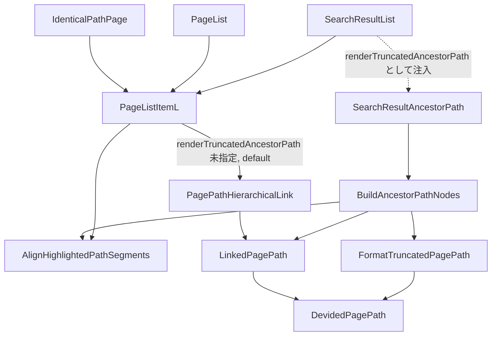
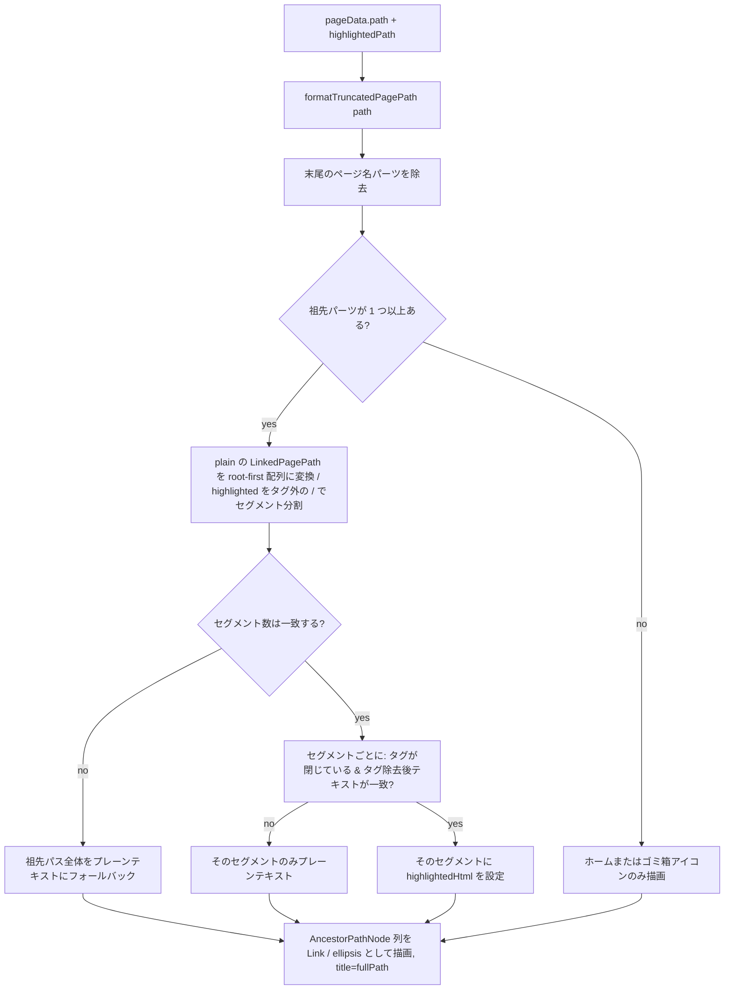

# 技術設計書 — page-path-truncation

## Overview

**Purpose**: 全文検索結果ページ（`/_search`）の各結果行に表示される祖先パスを、検索モーダル（`search-modal-path-truncation`、実装済み）と同じ Notion 風の中間省略表示にし、階層が深い・セグメント名が長い場合でも一覧のレイアウトが崩れないようにする。

**Users**: GROWI 利用者が全文検索結果一覧を閲覧する際、各行のパスを 1 行で見渡して目的ページを素早く判別できるようになる。省略時もホバーでフルパスを確認でき、表示されているセグメントは従来通りクリック遷移・検索キーワードのハイライトが機能する。

**Impact**: 現状、`PageListItemL`（`/_search` を含む 3 画面で共有されるページ一覧行コンポーネント）は祖先パスを `PagePathHierarchicalLink` で全セグション個別リンク描画し、`text-break` による折り返しのみでオーバーフローに対処している。本設計では `PageListItemL` に祖先パス描画を差し込むオプトイン prop を追加し、`/_search`（`SearchResultList`）からのみ新規コンポーネントを注入する。`PagePathHierarchicalLink` 自体・他の 2 消費者（`PageList.tsx`、`IdenticalPathPage.tsx`）は無変更のまま現行の全表示を維持する。

### Goals
- 祖先パス＋ページ名の表示単位数が 4 以上のとき、祖先パス部分を「先頭セグメント＋…＋親セグメント」に中間省略する。
- 祖先パス部分を常に 1 行に収め、階層の深さ・セグメント長（CJK 含む）に関わらず一覧の内容幅を超えない。
- 省略された行はホバーで（ページ名を含む）フルパスを確認できる。
- 表示されている祖先セグメントは現行通り個別クリック可能なリンクとして機能し、検索キーワードのハイライトも維持する。
- ページ名の決定規則（末尾日付の束ね、`evalDatePath`）を検索モーダルと統一する。
- `/_search` 以外の `PageListItemL` 消費画面（子ページ一覧、パス重複選択画面）の表示・挙動を変更しない。

### Non-Goals
- `PagePathNav`・`PagePathHeader`・`PagePathNavSticky`・`RecentChangesSubstance` など他の `PagePathHierarchicalLink` 消費箇所への適用。
- 検索クエリ挙動・検索結果データの取得方法の変更。
- 省略記号自体をクリック・ホバーして隠れたセグメントを個別表示する機能。
- ページ名（`PageListItemL` の H5 タイトル行、`UserPicture`・`Clamp` を含む行）の構造変更。日付束ねによる表示テキストの変化は許容するが、行構成・マークアップは変更しない。祖先パス行（row1）とページ名行（row2）を2行のまま維持する方針は `/kiro-validate-design` で確認済み（research.md「Row 1 vs Row 2 の scope」参照）。

## Boundary Commitments

### This Spec Owns
- `/_search` の検索結果一覧の各行における**祖先パス部分**の表示形式（中間省略の判定・生存セグメントのリンク／ハイライト描画・1 行制御・ホバーでのフルパス提示）。
- `formatTruncatedPagePath` の共有配置への移設（`features/search` → `client/util/`、振る舞い変更なし）。
- 祖先パスの中間省略判定結果と `LinkedPagePath`（リンク・ハイライト）を橋渡しする新規の純粋関数 `buildAncestorPathNodes`。**この関数も `client/util/` に配置する**（検索結果一覧固有ではなく、「truncation判定 ⇔ `LinkedPagePath` の橋渡し」という骨格自体は将来の他サーフェス — [roadmap.md](./roadmap.md) 参照 — でも同型で必要になるため。ハイライト対応は本specの検索結果一覧固有の関心事だが、`highlightedPath` を省略可能な引数にすることでインターフェース自体は汎用に保つ）。
- `PageListItemL` への新規オプトイン prop（`renderTruncatedAncestorPath`）と、それに伴う `evalDatePath` 統一。
- ES ハイライト markup をプレーンパスのセグメントに対応付ける純粋関数 `alignHighlightedPathSegments` / `buildHighlightedPageName`（`client/util/`）。
- 上記表示コンポーネント専用の CSS（1 行固定・オーバーフロー安全網）。

### Out of Boundary
- `PagePathHierarchicalLink`・`LinkedPagePath`・`DevidedPagePath` の実装変更（利用のみ）。
- `PageList.tsx`・`IdenticalPathPage.tsx` の呼び出し内容（prop を渡さないことで現状維持。ファイル自体への変更もなし）。
- `PageListItemL` のページ名表示行（H5 タイトル、`UserPicture`、`PageListMeta`、`PageItemControl`）の構造・マークアップ。
- 検索結果のデータ取得・追加ネットワークリクエスト。
- `search-modal-path-truncation` の成果物（`SearchResultPagePath`、`SearchMenuItem` 等）— import パスの追随以外は変更しない。

### Allowed Dependencies
- `@growi/core/dist/models` の `DevidedPagePath`（`evalDatePath` によるページ名決定・former/latter 分割に利用のみ）。
- `@growi/core/dist/utils` の `normalizePath`・`pagePathUtils.isTrashPage`。
- `~/models/linked-page-path` の `LinkedPagePath`・`buildLinkedPagePathHref`（祖先チェーンの走査・href 生成に利用のみ）。
- 移設後の `~/client/util/format-truncated-page-path`（`formatTruncatedPagePath`）。
- 既存の検索結果データ `pageData.path` / `elasticSearchResult.highlightedPath`（追加取得なし）。

### Revalidation Triggers
- `formatTruncatedPagePath` の戻り値（`TruncatedPagePath.parts` の形状・順序）が変わる場合。
- `DevidedPagePath` の former/latter 分割規則・`evalDatePath` の日付判定パターンが変わる場合。
- Elasticsearch のハイライト markup 形式（`<em>` 以外への変更、`/` を含む属性値など）や path の analyzer（`/` を跨ぐトークンが生成されるようになる等）が変わる場合。
- `PageListItemL` の新規 prop 以外の方法で `/_search` 以外の消費者が祖先パス表示のカスタマイズを必要とする場合（現状は「prop を渡さなければ現行維持」という前提に依存）。

## Architecture

### Existing Architecture Analysis

現状のレンダリングチェーンは `SearchResultList.tsx` → `PageListItemL.tsx` → `PagePathHierarchicalLink`（祖先パス、全セグメント個別リンク・`text-break` 折り返しのみ）+ 独立した `<Clamp lines={1}>` ページ名行、という構成である。`PagePathHierarchicalLink` はプレーン用とハイライト用の 2 本の `LinkedPagePath` を並行に再帰的に辿り、ハイライト側があれば `dangerouslySetInnerHTML` で描画する仕組みを既に持つ（本設計はこの仕組みを再利用するが、対象コンポーネント自体は変更しない）。

`search-modal-path-truncation` で実装済みの `formatTruncatedPagePath`（プレーン文字列 → 中間省略済み表示パーツ列を返す純粋関数）が判断ロジックの土台であり、本設計はこれを移設・再利用する。

### Architecture Pattern & Boundary Map



**Architecture Integration**:
- 選択パターン: Hybrid（`PageListItemL` 側の呼び出し切り替え + former 部分専用の新規コンポーネント）。research.md の Architecture Pattern Evaluation で比較検討済み。
- ドメイン境界: 「中間省略の判定 + `LinkedPagePath` への橋渡し」（`formatTruncatedPagePath` / `buildAncestorPathNodes`、いずれも共有 `client/util/`）と「リンク・ハイライト付き描画」（`SearchResultAncestorPath`、`features/search` 内の画面固有コンポーネント）を分離。
- 依存方向: 共有コンポーネント `PageListItemL` は `features/search` を import しない。`SearchResultAncestorPath` は `SearchResultList` が render prop として注入する（`features/search` → `client/components` の一方向のみ）。
- ハイライトの対応付け: `PagePathHierarchicalLink` のように「ハイライト文字列にも `DevidedPagePath` / `LinkedPagePath` を適用して並行ツリーを作る」方式は採らない。`</em>` の `/` を日付束ね正規表現が区切りとして拾い、プレーン側と分割がずれるため（tasks.md Implementation Notes 参照）。代わりにタグ外の `/` でセグメント分割し、タグ除去後のテキストがプレーンのセグメントと一致するかをセグメントごとに検証する。
- 新規コンポーネントの理由: モーダル用 `SearchResultPagePath`（リンクなし・ハイライトなし）とは表現したいものが異なるため、要件どおり別コンポーネントとする。
- Steering 準拠: サーバー/クライアント境界を跨がない。`client/util/` への配置は steering の既存方針（`structure.md`）に合致。

### Technology Stack

| Layer | Choice / Version | Role in Feature | Notes |
|-------|------------------|------------------|-------|
| Frontend | React 18 / Next.js（既存, `next/link`） | 祖先パスのリンク描画 | 新規ライブラリ追加なし |
| Frontend | `url-join`（既存依存） | href の正規化結合 | `PagePathHierarchicalLink` と同じ利用パターン |
| Styling | CSS Modules（既存, Biome/Stylelint 対象） | 1 行固定・flex-shrink によるオーバーフロー安全網 | `SearchResultPagePath.module.scss` のパターンを参考に、行幅制約の異なる新規ファイルとして作成 |

## File Structure Plan

### Directory Structure
```
apps/app/src/
├── client/
│   ├── util/
│   │   ├── format-truncated-page-path.ts        # 移設: features/search から（振る舞い変更なし）
│   │   ├── format-truncated-page-path.spec.ts   # 移設（既存テストのまま）
│   │   ├── build-ancestor-path-nodes.ts         # 新規: 中間省略判定と LinkedPagePath の橋渡し（純粋関数）。将来の他サーフェスからも再利用できるようここに配置
│   │   ├── build-ancestor-path-nodes.spec.ts    # 新規
│   │   ├── align-highlighted-path-segments.ts   # 新規: ハイライト markup とプレーンパスのセグメント対応付け（祖先行・ページ名行で共用）
│   │   └── align-highlighted-path-segments.spec.ts # 新規
│   └── components/PageList/
│       ├── PageListItemL.tsx                    # 変更: オプトイン prop 追加
│       └── PageListItemL.spec.tsx               # 新規: prop 配線の統合テスト
└── features/search/client/
    ├── components/
    │   ├── SearchResultPagePath.tsx              # 変更: import 元のみ更新（移設追随）
    │   ├── SearchResultAncestorPath.tsx           # 新規: 検索結果一覧専用の祖先パス描画コンポーネント
    │   ├── SearchResultAncestorPath.module.scss   # 新規: 1 行固定・オーバーフロー安全網 CSS
    │   ├── SearchResultAncestorPath.spec.tsx      # 新規
    │   └── SearchPage/
    │       └── SearchResultList.tsx               # 変更: `renderTruncatedAncestorPath` に `SearchResultAncestorPath` を注入
```

### Modified Files
- `apps/app/src/client/components/PageList/PageListItemL.tsx` — `renderTruncatedAncestorPath?: TruncatedAncestorPathRenderer` を追加。指定時は祖先パス描画をその戻り値に切り替え、ページ名を `buildHighlightedPageName`（`evalDatePath` 有効）で決定する。
- `apps/app/src/features/search/client/components/SearchPage/SearchResultList.tsx` — モジュールレベルで定義した `SearchResultAncestorPath` の renderer を `renderTruncatedAncestorPath` に渡す。
- `apps/app/src/features/search/client/components/SearchResultPagePath.tsx` — `formatTruncatedPagePath` の import パスを `~/client/util/format-truncated-page-path` に更新するのみ。

### Removed Files
- `apps/app/src/features/search/client/utils/format-truncated-page-path.ts`
- `apps/app/src/features/search/client/utils/format-truncated-page-path.spec.ts`

### 配置方針の補足
`buildAncestorPathNodes` の本 spec における唯一の消費者は検索結果一覧だが、内部でやっていること（truncation 判定の出力を `LinkedPagePath` チェーンにマッピングし直す）は、将来 `PagePathNav` 等でも同型で必要になる見込みが高い（[roadmap.md](./roadmap.md) 参照）。そのため `features/search/` ではなく `client/util/` に置き、`highlightedPath` を省略可能な引数にしてハイライト非対応の消費者からも呼べるインターフェースにする。呼び出し元（実際にこの関数を使う画面）は本 spec のスコープ内（検索結果一覧のみ）にとどめ、他サーフェスへの適用自体は行わない。

## System Flows

祖先パス 1 行が描画されるまでの判定・変換の流れ（`renderTruncatedAncestorPath` が指定された場合）:



- 生存する祖先パーツはチェーン上の位置に「省略記号より前は先頭から、後は末尾から」数えて対応付ける。`formatTruncatedPagePath` の省略形状（現状は「全祖先」または「先頭＋省略記号＋親」）に依存せず、省略記号が高々 1 つであれば成立するため、形状検査のガードは持たない。
- セグメント数の不一致（LengthCheck: no）は現実的な ES ハイライト出力では発生しない想定だが、ずれた対応付けを避けるための防御的分岐として設計に含める（research.md「Risks & Mitigations」）。
- セグメント単位のフォールバック（SegmentCheck: no）は、`<em>` が `/` を跨ぐ場合（`<em>B/C</em>` → `<em>B` / `C</em>`）に不整合タグを `innerHTML` に入れないためのもの。path の ES analyzer は letter/digit でトークン化するため実出力ではほぼ発生しない。

## Requirements Traceability

| Requirement | Summary | Components | Interfaces | Flows |
|-------------|---------|------------|------------|-------|
| 1.1–1.3 | 4 単位以上での中間省略判定 | `formatTruncatedPagePath`（既存・移設のみ） | `TruncatedPagePath` | System Flows: Format |
| 2.1–2.3 | 3 単位以下は全表示、ルートは現行表現 | `formatTruncatedPagePath`, `buildAncestorPathNodes` | `AncestorPathPlan.hasAncestors` | System Flows: HasAncestors |
| 3.1–3.3 | 1 行固定・横幅オーバーフロー防止 | `SearchResultAncestorPath`, `SearchResultAncestorPath.module.scss` | — | — |
| 4.1 | 省略時のフルパスホバー | `SearchResultAncestorPath` | `AncestorPathPlan.fullPath` → `title` 属性 | System Flows: Render |
| 5.1–5.2 | 生存セグメントのリンク維持・省略記号は非リンク | `buildAncestorPathNodes`, `SearchResultAncestorPath` | `AncestorPathNode`（`link` / `ellipsis` の判別） | System Flows: BuildChains→Render |
| 6.1–6.2 | 検索ハイライトの維持 | `alignHighlightedPathSegments`, `buildAncestorPathNodes`, `buildHighlightedPageName` | `AncestorPathNode.highlightedHtml` | System Flows: BuildChains→SegmentCheck |
| 7.1–7.2 | ページ名決定規則の統一（`evalDatePath`） | `PageListItemL`（`evalDatePath` 統一）, `formatTruncatedPagePath` | — | — |
| 8.1 | 適用範囲の限定（オプトイン） | `PageListItemL`（既定 未指定）, `PageList.tsx`, `IdenticalPathPage.tsx`（無変更） | `Props.renderTruncatedAncestorPath` | — |
| 9.1–9.2 | 既存挙動の非破壊・追加通信なし | `PageListItemL`（変更範囲を祖先パス描画に限定） | — | — |

## Components and Interfaces

| Component | Domain/Layer | Intent | Req Coverage | Key Dependencies (P0/P1) | Contracts |
|-----------|--------------|--------|---------------|---------------------------|-----------|
| `formatTruncatedPagePath` | Shared util | プレーンパス文字列から中間省略済み表示パーツ列を決定する（既存・移設のみ） | 1, 2, 7 | `DevidedPagePath`（P0） | Service |
| `alignHighlightedPathSegments` / `buildHighlightedPageName` | Shared util（`client/util/`） | ES ハイライト markup をプレーンパスのセグメントに検証付きで対応付ける／日付束ね済みページ名のハイライトを決定する | 6, 7 | `normalizePath`（P0）, `DevidedPagePath`（P0） | Service |
| `buildAncestorPathNodes` | Shared util（`client/util/`） | 中間省略判定・`LinkedPagePath`（リンク）・セグメント単位のハイライトを橋渡しし、React 非依存のレンダリング計画を返す | 2, 5, 6 | `formatTruncatedPagePath`（P0）, `LinkedPagePath`（P0）, `alignHighlightedPathSegments`（P0） | Service |
| `SearchResultAncestorPath` | `features/search` component | 検索結果一覧の祖先パス部分を 1 行・リンク付き・ハイライト付きで描画する | 1, 2, 3, 4, 5, 6 | `buildAncestorPathNodes`（P0） | State（Presentational） |
| `PageListItemL` | `client/components/PageList` | 注入された renderer の有無に応じて祖先パス描画先を切り替え、`evalDatePath` を統一する | 7, 8, 9 | `buildHighlightedPageName`（P0）, `PagePathHierarchicalLink`（P0, 既存） | State |

### Shared Util

#### `formatTruncatedPagePath`（移設のみ、契約変更なし）

| Field | Detail |
|-------|--------|
| Intent | プレーンパス文字列 1 本から、中間省略済みの表示パーツ列と完全パスを算出する |
| Requirements | 1.1, 1.2, 1.3, 2.1, 2.2, 2.3, 7.1, 7.2 |

**Responsibilities & Constraints**
- 純粋関数。React・DOM・ネットワークに依存しない。
- `evalDatePath` は常に有効（既存実装のまま）— これにより Requirement 7 のページ名決定規則統一は、この関数を呼ぶ側（`PageListItemL`）が今まで通っていなかった `evalDatePath=true` の経路に乗ること自体で満たされる。

**Contracts**: Service [x]

##### Service Interface
```typescript
export type PagePathPart =
  | { readonly type: 'segment'; readonly text: string; readonly isPageName: boolean }
  | { readonly type: 'ellipsis' };

export interface TruncatedPagePath {
  readonly isRoot: boolean;
  readonly parts: readonly PagePathPart[];
  readonly fullPath: string;
}

export const formatTruncatedPagePath: (path: string) => TruncatedPagePath;
```
- Preconditions: `path` は正規化前後を問わない任意のページパス文字列。
- Postconditions: `parts` は「全祖先＋ページ名」または「先頭祖先＋省略記号＋直近祖先＋ページ名」のいずれか。最後の `segment` が常に `isPageName: true`。
- Invariants: 副作用なし。同一入力に対し常に同一出力。

#### `buildAncestorPathNodes`（新規、`client/util/` 配置）

| Field | Detail |
|-------|--------|
| Intent | `formatTruncatedPagePath` の判定結果からページ名パーツを除いた「祖先のみ」の表示計画を、`LinkedPagePath` によるリンク／ハイライト情報と結合して返す |
| Requirements | 2.1, 2.2, 2.3, 5.1, 5.2, 6.1, 6.2 |

**Responsibilities & Constraints**
- 純粋関数。`LinkedPagePath` の構築・走査のみ行い、React 要素は生成しない。ロガー等の副作用も持たない。
- 生存する祖先の位置は、省略記号より前のパーツを先頭から、後のパーツを末尾から数えてチェーン上のインデックスに対応付ける（省略形状に依存しない）。
- ハイライトは `alignHighlightedPathSegments` でセグメントごとに解決する。セグメント**数**が一致しない場合は位置対応そのものが信頼できないため祖先パス全体をプレーンテキストにする。数が一致する場合、各セグメントはタグ除去後のテキストがプレーン側と一致すること（＝位置対応が偶然ではなく検証済みであること）を確認したうえで、確認できなかったセグメントのみプレーンテキストにする。
- 本 spec の呼び出し元は検索結果一覧のみだが、`highlightedPath` を省略可能な引数とすることで、ハイライト非対応の将来消費者(roadmap.md 参照)からも同じ関数をそのまま呼べるインターフェースにする。実装や呼び出し元を先取りして増やすことはしない。

**Dependencies**
- Outbound: `formatTruncatedPagePath`（P0） — 中間省略の判定
- Outbound: `LinkedPagePath`（P0） — 祖先チェーンの構築・href/pathName 取得

**Contracts**: Service [x]

##### Service Interface
```typescript
export type AncestorPathNode =
  | {
      readonly type: 'link';
      readonly href: string;
      readonly text: string;
      readonly highlightedHtml?: string; // 対応するハイライトノードが取得できた場合のみ
    }
  | { readonly type: 'ellipsis' };

export interface AncestorPathPlan {
  readonly hasAncestors: boolean; // false の場合、呼び出し側はホーム/ゴミ箱アイコンのみ描画する
  readonly nodes: readonly AncestorPathNode[];
  readonly fullPath: string; // ページ名を含む完全パス。ホバー用
}

export const buildAncestorPathNodes: (
  path: string,
  highlightedPath?: string | null,
) => AncestorPathPlan;
```
- Preconditions: `path` は対象ページの完全パス。`highlightedPath` は Elasticsearch のハイライト markup を含む文字列、または未取得時は `null`/`undefined`。
- Postconditions: `nodes` の `link` 要素の順序は root→leaf。`ellipsis` は高々 1 件、リンクを持たない。`highlightedPath` 未指定時は `path` 自身をハイライト側として扱う（`PageListItemL` の従来の `highlightedPath || path` と同じ）。
- Invariants: `path` が変わらない限り `nodes` の件数・順序は不変（ハイライトの有無は `highlightedHtml` の有無にのみ影響する）。

### `features/search` Domain

#### `SearchResultAncestorPath`（新規）

| Field | Detail |
|-------|--------|
| Intent | 検索結果一覧 1 行の祖先パス部分を、1 行固定・ホバーツールチップ付きで描画するプレゼンテーショナルコンポーネント |
| Requirements | 1.1, 1.2, 1.3, 3.1, 3.2, 3.3, 4.1, 5.1, 5.2, 6.1, 6.2 |

**Responsibilities & Constraints**
- `buildAncestorPathNodes` の結果を JSX にマッピングするのみ。判定ロジックを持たない。
- ルートアイコンは現行の `PagePathHierarchicalLink` root 分岐と同じ表現で常に描画する: ホームは「アイコン＋`/`」をまとめて `/` へのリンク、ゴミ箱は「アイコン（`/trash` へのリンク）＋`/`（`/` へのリンク）」。祖先 0 件でも末尾の `/` は省略しない（Requirement 2.2）。`PagePathHierarchicalLink` 自体は変更しないため、当該 JSX ブロックは小規模な重複として本コンポーネント内に持つ（research.md「Root-icon duplication vs. extraction」参照）。
- `memo` 化し、`buildAncestorPathNodes` の結果は `useMemo` でキャッシュする（行の選択変更などによる再描画でパス計算を繰り返さない）。
- コンテナに `title={fullPath}` を常時付与する（Requirement 4.1）。

**Implementation Notes**
- Integration: `SearchResultList` が renderer として `PageListItemL` に注入し、`PageListItemL` から `(pageData.path, elasticSearchResult?.highlightedPath)` を受け取る。
- Validation: なし（表示専用、入力はページデータ由来で信頼境界外の値ではない）。
- Risks: CSS の `flex-shrink` 優先度はモーダル版とは別チューニングが必要（`PageListItemL` の行はチェックボックス・アイコン・メタ情報を含み幅構成が異なるため）。

### `client/components/PageList` Domain

#### `PageListItemL`（変更）

| Field | Detail |
|-------|--------|
| Intent | ページ一覧 1 行を描画する共有コンポーネント。オプトイン prop で祖先パス描画先を切り替える |
| Requirements | 7.1, 7.2, 8.1, 9.1, 9.2 |

**Responsibilities & Constraints**
- 新規 prop `renderTruncatedAncestorPath?: (path, highlightedPath) => ReactNode`（既定 未指定）。`PageList.tsx`・`IdenticalPathPage.tsx` は本 prop を渡さないため無変更のまま現行の全表示を維持する（Requirement 8.1）。有効化フラグと描画コンポーネントを 1 つの prop にまとめることで「有効なのに描画先がない」状態を型で排除し、かつ `PageListItemL` が `features/search` に依存しない（依存方向の逆転を避ける）。
- 指定時: 祖先パス描画をその戻り値に切り替え、ページ名を `buildHighlightedPageName`（`evalDatePath` 有効、ハイライトはセグメント検証付き）で決定する（Requirement 6.1, 7.1）。
- 未指定（既定）のとき: 現行のまま `PagePathHierarchicalLink` ＋ `evalDatePath=false` を使用し、ページ名も従来どおり `highlightedPath || path` の分割結果をそのまま使う。オプトイン側のフォールバック判定は一切適用しない（挙動を一切変えない）。
- パス表示以外（チェックボックス、クリック遷移、`PageListMeta`、`PageItemControl`）のマークアップ・ロジックには触れない（Requirement 9.1）。
- 新たなデータ取得は追加しない（Requirement 9.2）。両分岐とも既存の `pageData` / `elasticSearchResult` から計算する。

**Contracts**: State [x]

##### State Management
- 追加の React state は不要。既存 props（`page`）から派生する純粋な描画分岐。

## Error Handling

パス文字列は常にサーバーから取得済みのページデータに由来し、ユーザー入力の直接検証は不要。フォールバックはハイライトの対応付け（`alignHighlightedPathSegments`）に限られ、いずれも例外を投げず表示劣化のみで継続する: セグメント数が不一致なら全セグメント、数が一致してもテキスト照合やタグの対応が取れないセグメントはそのセグメントのみをプレーンテキストで表示する。ページ名は、ページ名を構成する全セグメントが検証できた場合のみハイライト付きで表示する。

## Testing Strategy

- **Unit Tests**
  - `format-truncated-page-path.spec.ts`: 移設後も既存テストがそのまま緑であることを確認する（挙動無変更の証跡）。
  - `align-highlighted-path-segments.spec.ts`: `</em>` の `/` を区切りとみなさないこと、`<em>` が `/` を跨ぐセグメントのみのフォールバック、セグメント数不一致時の全体フォールバック、祖先とページ名の両方にハイライトがある場合・日付束ねページ名内のハイライト・日付パスの祖先ハイライトを検証する。入力は ES＋FilterXSS が実際に返す `<em class="highlighted-keyword">` 形式を用いる。
  - `build-ancestor-path-nodes.spec.ts`: ルート／0 祖先（`hasAncestors: false`）、3 単位以下（全祖先が `link` ノード）、4 単位以上（先頭＋省略記号＋直近祖先のみ）、ハイライト付き（`highlightedHtml` が対応する祖先にのみ設定される）、`<em>` が `/` を跨ぐ場合と日付パスの祖先ハイライトを検証する。
- **Component Tests**
  - `SearchResultAncestorPath.spec.tsx`: コンテナの `title` がページ名を含む完全パスであること（4.1）、省略記号がリンクを持たない独立ノードとして描画されること（5.2）、生存セグメントが `<a>`/`Link` として正しい `href` を持つこと（5.1）、ハイライト markup が `dangerouslySetInnerHTML` で生存セグメントにのみ反映されること（6.1, 6.2）、ルートアイコンの後に `/` が描画され（祖先 0 件でも）、ゴミ箱ではその `/` が `/` へのリンクであること（2.2）。
  - `PageListItemL.spec.tsx`（新規）: renderer 未指定のとき現行どおり祖先が個別リンクで描画され、祖先にハイライトがあってもページ名のハイライトが従来どおり維持され、チェックボックス・クリック遷移など他要素が変わらないこと（8.1, 9.1）、指定時は注入した renderer の出力が描画され、ページ名行の日付束ねとハイライトが有効になること（6.1, 7.1, 7.2）。内部の id や DOM 構造ではなく表示内容（リンク名・href・テキスト）で検証し、ページデータは `mock<T>()` ではなく型付きのプレーンオブジェクトで作る。
- **E2E / Runtime Smoke**
  - `/_search` で階層の深い実データを検索し、1 行表示・ホバーツールチップ・生存セグメントのクリック遷移・検索キーワードハイライトを目視確認する（`search-modal-path-truncation` の task 4 で行った手順に準拠）。
  - 実装時点では「curl 等の HTTP-only ツールでは `/_search` のクライアントサイドレンダリング結果を検証できず、ブラウザが必須」という制約があったが、`npx playwright install chromium` は本 devcontainer で実際に成功した（tasks.md Implementation Notes 参照）。将来この検証を自動化したい場合、headless Chromium 経由のスクリプトは技術的に可能 — 未実施なのは「試していないから」であり「環境上不可能だから」ではない。
