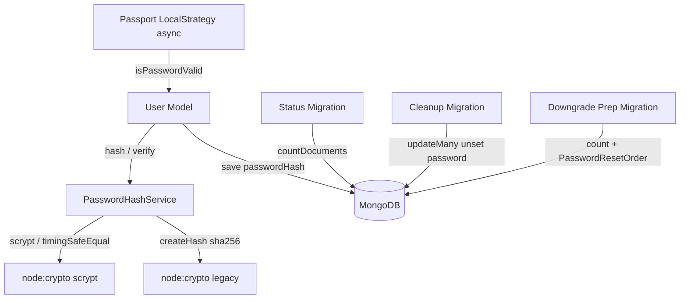
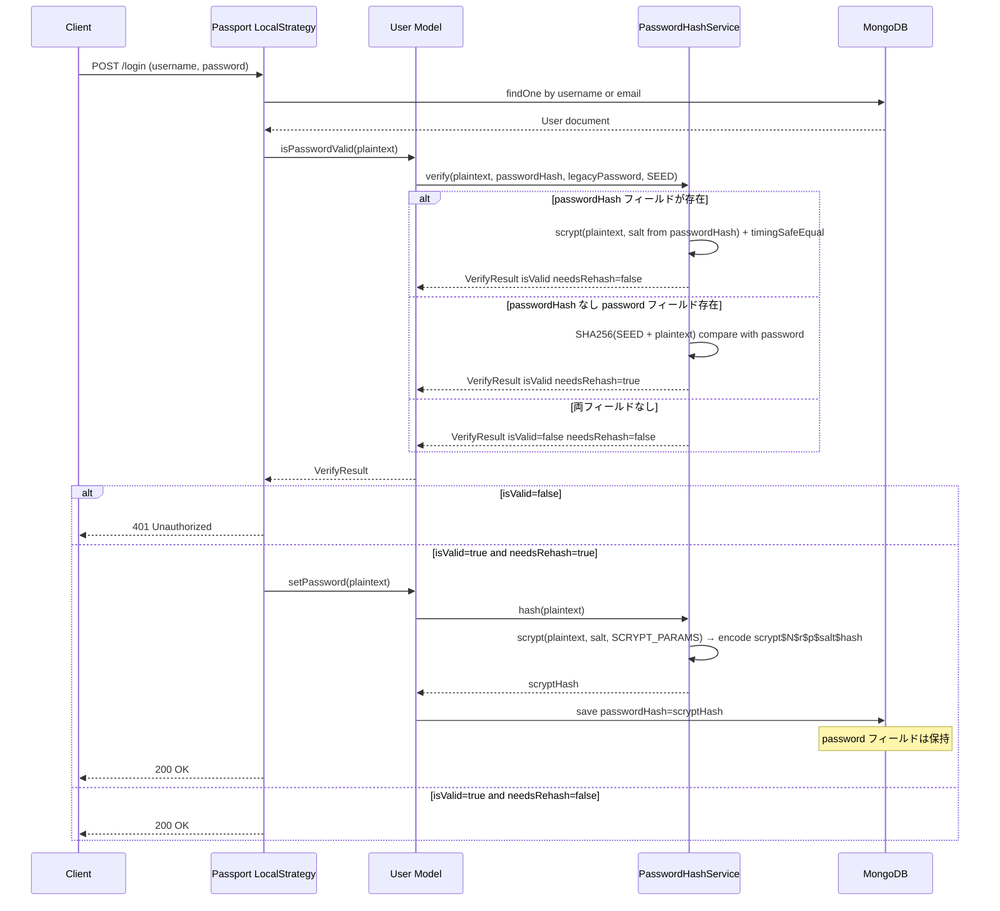
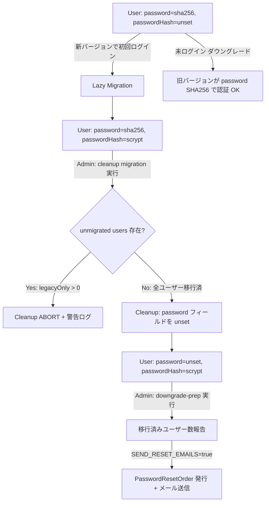
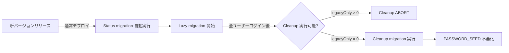

# Design Document: password-hash-upgrade

## Overview

GROWI のローカル認証システムにおけるパスワードハッシュを SHA-256（グローバル `PASSWORD_SEED` ペッパー、ユーザー単位ソルトなし）から `node:crypto` の **scrypt**（メモリ困難 KDF、ユーザー単位ランダムソルト）へ移行する。これにより CodeQL `js/insufficient-password-hash`（CWE-916）アラートを解消する。scrypt は Node.js 組み込み（OpenSSL）で新規依存が不要、Alpine/musl でネイティブビルドの問題もない。

移行は **遅延マイグレーション（lazy migration）** として実装する。既存ユーザーは再ログイン時に自動的に scrypt ハッシュへ再ハッシュされ、パスワードリセット不要でシームレスに移行する。**デュアルフィールド方式**（`password` = SHA-256保持、`passwordHash` = scrypt 自己記述文字列を格納）により、Cleanup migration 実行前はダウングレードしても旧バージョンが SHA-256 ハッシュで認証継続可能。

**Users**: GROWI 管理者（移行ライフサイクル管理）、エンドユーザー（透過的移行）。  
**Impact**: User model に `passwordHash` フィールド追加、パスワード検証を全スタックで async 化、1本の読み取り専用 migrate-mongo マイグレーション（status）と 2本の standalone 管理スクリプト（cleanup・downgrade-prep）追加。

### Goals

- CodeQL `js/insufficient-password-hash`（CWE-916）アラート解消
- 新規パスワードおよびパスワード変更時に scrypt（OWASP 推奨パラメータ以上、per-user salt）を適用
- 既存 SHA-256 ユーザーがパスワードリセットなしにシームレスにログイン継続
- Cleanup migration 実行前はダウングレード時に SHA-256 ユーザーの認証が継続
- 移行進捗の可視化・管理・クリーンアップ・ダウングレード対応のためのマイグレーションスクリプト群

### Non-Goals

- LDAP、OAuth、SAML、Passkey 等の外部認証プロバイダー
- `apiToken` フィールドのハッシュ化改善
- `PASSWORD_SEED` 環境変数の即時廃止
- 全ユーザーの一括強制マイグレーション（バッチ rehash）
- パスワード長に関する特殊対応（scrypt は bcrypt のような 72 バイト切り詰め制限を持たないため不要）

---

## Boundary Commitments

### This Spec Owns

- `PasswordHashService`（`src/server/service/password-hash.ts`）: scrypt ハッシュ生成・検証・legacy 判定
- User model のパスワード関連メソッド（`isPasswordValid`、`setPassword`、`updatePassword`、`isPasswordSet`）の async 化と `passwordHash` フィールド追加
- User model 内の `setPassword` を呼ぶ**全 5 メソッド**（`updatePassword`、`activateInvitedUser`、`resetPasswordByRandomString`、`createUserByEmail`、`createUserByEmailAndPasswordAndStatus`）の `await` 化
- `statusDelete()` での `passwordHash` 消去（既存の `password = ''` スクラブに合わせ、削除ユーザーが有効な認証情報ハッシュを保持しないようにする）
- `findUserByEmailAndPassword` の削除（デッドコード。呼び出し元が存在しないため fetch-then-compare リファクタではなく削除する）
- Passport LocalStrategy の async 化と lazy migration トリガー
- **`isPasswordValid` の全呼び出し元の async 化**: `passport.ts`（LocalStrategy）と `personal-setting/index.js`（パスワード変更時の旧パスワード検証）の 2 箇所
- **`password == null` 代用によるパスワード設定判定の `isPasswordSet()` への置換**: `login.js`、`personal-setting/index.js`、`user-activation.ts` の 3 箇所（passwordHash-only ユーザーの誤判定防止）
- **`passwordHash` の API レスポンス漏洩防止**: `@growi/core` の `omitInsecureAttributes()` に `passwordHash` を追加し、`IUser` インターフェースに `passwordHash?: string` を追加
- 1本の読み取り専用 migrate-mongo マイグレーション（status）と 2本の standalone 管理スクリプト（cleanup・downgrade-prep）
- scrypt ハッシュの自己記述符号化（`scrypt$N$r$p$salt$hash`）とパラメータ管理（新規依存なし。scrypt は `node:crypto` 組み込み）

### Out of Boundary

- 外部認証プロバイダー（LDAP、OAuth、SAML、Passkey）のパスワード処理
- `apiToken` フィールドのハッシュ化
- パスワードリセットメール送信インフラ（既存の `PasswordResetOrder` + メールサービスを利用）
- 全ユーザー強制マイグレーション（lazy migration のみ。未ログインユーザーは SHA-256 のまま残る）
- `PASSWORD_SEED` 環境変数の廃止（Cleanup migration 後も legacy 検証パスで使用済みのハッシュは不存在になるが、環境変数設定自体の廃止は別途）

### Allowed Dependencies

- `node:crypto`（built-in）: scrypt（新規ハッシュ生成・検証）＋ SHA-256 legacy 検証パス＋ `timingSafeEqual`。**新規依存の追加なし**
- `crypto.randomBytes`（built-in）: ユーザー単位ソルトの生成
- 既存 `PasswordResetOrder` model（downgrade-prep スクリプトでリセット発行に使用）
- 既存メールサービス（downgrade-prep スクリプトでリセットメール送信）
- `migrate-mongo`（既存マイグレーションインフラ、status migration のみ）
- Crowi bootstrap（`new Crowi(); await crowi.init()`、downgrade-prep standalone スクリプトでの mailService 初期化）

### Revalidation Triggers

- User model の `password` / `passwordHash` フィールド定義変更
- `PasswordHashService` の `verify()` / `hash()` インターフェース変更
- Passport LocalStrategy のコールバックシグネチャ変更
- `user/index.js` を TypeScript に移行する場合（型定義の更新が必要）

---

## Architecture

### Existing Architecture Analysis

```
generatePassword(password)          // private function, SHA-256(SEED + plain) → hex
  ↓ called by
User.isPasswordValid(password)     // sync, string compare
User.setPassword(password)         // sync, sets this.password
User.updatePassword(password)      // async, calls setPassword + save
User.findUserByEmailAndPassword()  // queries DB by { email, password: hash } ← 問題
User.createUserByEmailAndPasswordAndStatus()

Passport LocalStrategy callback    // sync, calls user.isPasswordValid inline
```

**改修が必要な理由**:
1. SHA-256 は fast hash（CWE-916）
2. `findUserByEmailAndPassword` は DB に password hash でクエリしているため scrypt 移行後は動作不能（scrypt はソルトにより非決定論的）
3. 全 password メソッドが同期的なため scrypt（非同期 `crypto.scrypt`）に対応不可

### Architecture Pattern & Boundary Map



**New architecture**:
- `PasswordHashService`: scrypt/legacy 両対応の薄いサービス層。User model と Passport は直接 crypto に依存しない
- User model: `passwordHash` フィールド追加、全パスワードメソッドを async 化
- Passport LocalStrategy: async callback。verify 結果の `needsRehash` を受けて lazy migration をトリガー
- Migration scripts: `migrate-mongo` 既存インフラ上で動作する 3 本

### Technology Stack

| Layer | Choice / Version | Role | Notes |
|-------|-----------------|------|-------|
| Backend / Auth | `node:crypto` scrypt (built-in) | scrypt ハッシュ生成・検証 | **新規依存なし**（OpenSSL 同梱）。memory-hard で GPU 耐性。Alpine/musl でネイティブビルド不要 |
| Backend / Auth | `node:crypto` (built-in) | Legacy SHA-256 検証 + `timingSafeEqual` | 既存コードと同じ API。移行期間のみ使用 |
| Backend / Model | Mongoose（既存） | User schema + `passwordHash` フィールド追加 | — |
| Backend / Auth | Passport.js（既存） | LocalStrategy の async 化 | — |
| Infrastructure | `migrate-mongo`（既存） | 3 本のマイグレーションスクリプト実行 | — |

---

## File Structure Plan

### New Files

```
apps/app/src/server/service/
└── password-hash.ts                        # PasswordHashService (scrypt + legacy verify, hash)

apps/app/src/migrations/
└── 20260514000001-password-hash-status.js     # Req 3.1, 3.2: hash format count report (read-only, migrate-mongo)

apps/app/src/server/scripts/
├── password-hash-cleanup.ts                   # Req 3.3, 3.4: remove legacy password (standalone admin script)
└── password-hash-downgrade-prep.ts            # Req 4.1, 4.2, 4.3: count + optional reset email (standalone, Crowi bootstrap)
```

> **standalone スクリプト化の理由（CRITICAL-6）**: cleanup は migrate-mongo 自動実行時に `throw` でデプロイを破壊するリスク、downgrade-prep は mailService のために Crowi bootstrap が必要。いずれも migrate-mongo コンテナでは実現できないため standalone スクリプトとする。

### Modified Files

```
apps/app/src/server/models/user/index.js
  — Add passwordHash: String to Mongoose schema
  — Update isPasswordSet() to check either field
  — Make isPasswordValid(password) async → delegates to PasswordHashService.verify()
  — Make setPassword(password) async → writes passwordHash via PasswordHashService.hash()
  — await ALL 5 setPassword call sites: updatePassword, activateInvitedUser,
    resetPasswordByRandomString, createUserByEmail, createUserByEmailAndPasswordAndStatus
  — statusDelete(): also clear passwordHash (set to undefined) — existing code scrubs
    password='' on user deletion but leaves passwordHash, so deleted users would retain
    a valid credential hash. Unset (not '') so verify() treats it as noPassword, not a
    malformed field (avoids spurious Req 2.4 WARNING)
  — DELETE findUserByEmailAndPassword() (dead code: no call sites exist)

apps/app/src/server/service/passport.ts
  — Make LocalStrategy callback async
  — Update isPasswordValid call site (line ~285) to await + read VerifyResult.isValid
  — Trigger lazy migration (await user.setPassword + save) when needsRehash is true

apps/app/src/server/routes/apiv3/personal-setting/index.js
  — isPasswordValid call site (line ~432): await user.isPasswordValid(oldPassword)
    → change to !(await user.isPasswordValid(oldPassword)).isValid
    (CRITICAL: !Promise is always false → old-password check would be bypassed)
  — password == null check (line ~702): replace with !user.isPasswordSet()
    (avoid wrongly blocking LDAP account detach for passwordHash-only users)

apps/app/src/server/routes/login.js
  — userData.password == null check (line ~145): replace with !userData.isPasswordSet()
    (avoid redirecting every passwordHash-only user to /me#password_settings)

apps/app/src/server/routes/apiv3/user-activation.ts
  — userData.password != null check (line ~278): replace with userData.isPasswordSet()
    (avoid mis-deciding redirect target for passwordHash-only users)

packages/core/src/models/serializers/user-serializer.ts
  — Add passwordHash to omitInsecureAttributes() omit list (prevent API response leak)

packages/core/src/interfaces/user.ts
  — Add passwordHash?: string to IUser interface

（apps/app/package.json への依存追加は不要 — scrypt は node:crypto 組み込み。bcryptjs / @types/bcryptjs の追加も不要。
 ただし @growi/core の serializer/IUser 変更は published package のため changeset が必要 — 上記参照）
```

---

## System Flows

### ログイン時 Lazy Migration フロー



### Migration Lifecycle フロー



---

## Requirements Traceability

| Requirement | Summary | Components | Interfaces | Flows |
|-------------|---------|------------|------------|-------|
| 1.1 | 新パスワードは scrypt（OWASP 推奨パラメータ）+ per-user salt | PasswordHashService | `hash()` | setPassword flow |
| 1.2 | 自己記述型フォーマット（`scrypt$N$r$p$salt$hash`） | PasswordHashService | `hash()` | — |
| 1.3 | 新パスワードに SHA-256+SEED を使用しない | PasswordHashService, User model | `hash()`, `setPassword()` | — |
| 1.4 | 同一平文 → 異なるハッシュ（per-user salt） | PasswordHashService | `hash()` | — |
| 2.1 | Legacy SHA-256 ユーザーがログイン継続 | PasswordHashService, Passport | `verify()` | Login flow |
| 2.2 | Legacy ログイン成功時に自動 rehash | Passport, User model | Lazy migration trigger | Login flow |
| 2.3 | 両フォーマット透過的処理 | PasswordHashService | `verify()` | Login flow |
| 2.4 | フィールド内容が既知フォーマット不一致（異常系）→ reject + WARNING ログ | PasswordHashService | `verify()` | Login flow |
| 2.5 | パスワード未設定（両フィールドなし = 正常系）→ reject、WARNING 出力なし | PasswordHashService | `verify()` | Login flow |
| 3.1 | Status migration: フォーマット別ユーザー数報告（読み取り専用） | Status migration script | Batch | — |
| 3.2 | Status migration: 標準出力へカウント出力 | Status migration script | Batch | — |
| 3.3 | Cleanup: 移行済みユーザーから `password` フィールド削除 | Cleanup migration script | Batch | — |
| 3.4 | Cleanup: 未移行ユーザーが残る場合は abort | Cleanup migration script | Batch | — |
| 4.1 | Downgrade prep: scrypt 移行済みユーザー数報告 | Downgrade prep script | Batch | — |
| 4.2 | Downgrade prep: リセットメール送信オプション | Downgrade prep script, PasswordResetOrder | Batch | — |
| 4.3 | Downgrade prep: passwordHash-only ユーザーをリセット必須状態にマーク | Downgrade prep script, PasswordResetOrder | Batch | — |

---

## Components and Interfaces

| Component | Domain/Layer | Intent | Req Coverage | Key Dependencies | Contracts |
|-----------|-------------|--------|--------------|------------------|-----------|
| PasswordHashService | Server / Auth | scrypt ハッシュ生成・検証・legacy 判定 | 1.1–1.4, 2.1–2.5 | node:crypto scrypt (P0) | Service |
| User model (password methods) | Server / Model | async パスワード操作、`passwordHash` フィールド、呼び出し元（isPasswordValid/isPasswordSet）修正 | 1.1, 1.3, 2.1, 2.2, 2.3 | PasswordHashService (P0) | Service |
| Passport LocalStrategy | Server / Auth | async 検証、lazy migration オーケストレーション | 2.1–2.3 | User model (P0) | Service |
| Status migration script | Infrastructure | フォーマット別ユーザー数集計（読み取り専用） | 3.1, 3.2 | MongoDB (P0) | Batch |
| Cleanup migration script | Infrastructure | 移行済みユーザーから `password` フィールド削除 | 3.3, 3.4 | MongoDB (P0) | Batch |
| Downgrade prep migration script | Infrastructure | 移行済みユーザー数報告 + リセットメール発行 | 4.1–4.3 | MongoDB (P0), PasswordResetOrder (P1) | Batch |

---

### Server / Auth Layer

#### PasswordHashService

| Field | Detail |
|-------|--------|
| Intent | scrypt ハッシュ生成と両フォーマット（scrypt / legacy SHA-256）検証の単一責任境界 |
| Requirements | 1.1, 1.2, 1.3, 1.4, 2.1, 2.2, 2.3, 2.4, 2.5 |

**Responsibilities & Constraints**

- `hash(plaintext)`: `crypto.randomBytes(16)` でソルト生成 → `crypto.scrypt(plaintext, salt, keylen, {N, r, p, maxmem})` → `scrypt$N$r$p$<salt(base64)>$<hash(base64)>` 形式に符号化して返す。SEED は不使用
- `verify(plaintext, scryptHash, legacyHash, passwordSeed)`:
  - `scryptHash` が存在 → `scrypt$…` を分解して N/r/p/salt を取り出し `crypto.scrypt` で再計算 → `crypto.timingSafeEqual` で比較 → `{ isValid, needsRehash: false }`
    - **（任意拡張）パラメータ更新時の自動再ハッシュ**: 保存済みパラメータ（N/r/p）が現行既定より弱い場合は `needsRehash: true` を返し、ログイン時に現行パラメータで再ハッシュする。verify は検証のため保存済み N/r/p を必ずパースするので、現行既定との比較を1つ加えるだけで追加コストはほぼない。将来 scrypt パラメータを引き上げた際に既存ユーザーが自動で追随できる（Req 1.1 の「OWASP 推奨パラメータ以上」を移行後も維持するための任意拡張。必須ではない）
  - `scryptHash` が存在せず `legacyHash` が存在 → `SHA256(SEED + plaintext) === legacyHash` → `{ isValid, needsRehash: true }`
  - 両フィールドが存在しない（パスワード未設定 = `noPassword`）→ `{ isValid: false, needsRehash: false }`。**これは外部認証専用ユーザーや未有効化ユーザーの正常状態であり WARNING ログは出力しない**（Req 2.5）
  - フィールドは存在するがその内容が既知フォーマット（`scrypt$…` プレフィックス / SHA-256 hex）に一致しない（データ破損等の異常系）→ `{ isValid: false, needsRehash: false }` を返し、ユーザー識別子を含む WARNING ログを出力（Req 2.4）
- `SCRYPT_PARAMS`: N/r/p を環境変数で調整可能（既定 **N=131072 (2^17), r=8, p=1 = OWASP 最小推奨**。keylen=64）。約128MB/回を消費するため `maxmem` を明示的に ≥192MB へ設定する（未設定だと Node 既定 `maxmem=32MB` を超えて `crypto.scrypt` が throw する）
- scrypt 生成・検証は `node:crypto` のみ。`node:crypto` の SHA-256 は legacy パスのみ

**Dependencies**

- External: `node:crypto` (built-in) — scrypt 生成・検証、legacy SHA-256 検証、`randomBytes`、`timingSafeEqual`（P0）
- Inbound: User model, Passport strategy（P0）

**Contracts**: Service [x]

```typescript
// apps/app/src/server/service/password-hash.ts

export interface VerifyResult {
  isValid: boolean;
  needsRehash: boolean;
}

export interface IPasswordHashService {
  hash(plaintext: string): Promise<string>;
  verify(
    plaintext: string,
    scryptHash: string | undefined,
    legacyHash: string | undefined,
    passwordSeed: string,
  ): Promise<VerifyResult>;
}
```

- **Preconditions**: `plaintext` は非空文字列。scrypt パラメータは OWASP 最小推奨（N≥2^17=131072, r=8, p=1）以上。`maxmem` は消費メモリ（≈128MB）を上回る値（≥192MB）に設定済み
- **Postconditions**: `hash()` は `scrypt$` プレフィックスの自己記述文字列を返す。`verify()` は必ず `VerifyResult` を返す（throw しない）
- **Invariants**: `needsRehash: true` は `isValid: true` のときのみ

**Implementation Notes**

- scrypt パラメータ（N/r/p）は既定 **N=131072 (2^17), r=8, p=1**（OWASP 最小推奨）、keylen=64。環境変数で調整可能だが、**下限（N=2^17）を下回る設定は起動時 WARNING を出して下限にクランプ**（セキュリティ基準の担保）
- **メモリ上限の管理**: scrypt は1回あたり約 `128 * N * r` バイト（既定 N=2^17 で**約128MB**）を消費する。`crypto.scrypt` の `maxmem` を明示的に **≥192MB** に設定する（**未設定だと Node 既定の 32MB を超えて throw する**）。パラメータ上限もクランプする（極端な N でのメモリ枯渇・DoS 防止）。非同期 `crypto.scrypt` は libuv スレッドプール上で動くため同時計算数は `UV_THREADPOOL_SIZE`（既定4）で自然に頭打ちとなり、ピークメモリは概ね「スレッド数 × 128MB ≒ 512MB」に収まる（詳細は Security Considerations 参照）
- パスワード未設定（両フィールドなし = `noPassword`）は `isValid: false` を返すが WARNING ログは出力しない（外部認証専用・未有効化ユーザーの正常状態。Req 2.5）。WARNING は「フィールドは存在するが内容が既知フォーマットに一致しない」異常系のみに限定し、ユーザー ID を含めて出力する（Req 2.4）
- scrypt は `node:crypto` 組み込みのため新規依存の追加は不要（Turbopack externalization の考慮も不要）

---

#### User Model (password methods)

| Field | Detail |
|-------|--------|
| Intent | `PasswordHashService` への委譲 + `passwordHash` フィールド管理 + 呼び出し元の async 化/判定置換 |
| Requirements | 1.1, 1.3, 2.1, 2.2, 2.3 |

**Responsibilities & Constraints**

- Schema に `passwordHash: String` フィールドを追加
- `isPasswordSet()`: `!!(this.passwordHash || this.password)` で両フィールドを確認
- `isPasswordValid(password)`: async。`PasswordHashService.verify(password, this.passwordHash, this.password, SEED)` を呼び出す
- `setPassword(password)`: async。`passwordHash = await PasswordHashService.hash(password)` のみ設定。`password`（SHA-256）フィールドは変更しない（ダウングレード安全維持）
- `setPassword` を呼ぶ **全 5 メソッド**を `await` 化する（未 await のまま `save()` すると passwordHash 未設定で保存されログイン不能になる）:
  - `updatePassword`、`activateInvitedUser`、`resetPasswordByRandomString`、`createUserByEmail`、`createUserByEmailAndPasswordAndStatus`
- `findUserByEmailAndPassword(email, password)`: **削除する**（デッドコード。リポジトリ全体で呼び出し元が存在しない）。DB を password hash でクエリするこのメソッドは scrypt 移行後に動作不能となるが、呼び出し元がないためリファクタではなく削除が適切

**Dependencies**

- Outbound: PasswordHashService — hash / verify（P0）
- External: MongoDB via Mongoose — `passwordHash` フィールド永続化（P0）

**Contracts**: Service [x]

```typescript
// User Mongoose document 追加メソッド（既存の .js ファイルに追加）

isPasswordSet(): boolean
isPasswordValid(password: string): Promise<VerifyResult>
setPassword(password: string): Promise<this>
updatePassword(password: string): Promise<UserDocument>
```

**Implementation Notes**

- `findUserByEmailAndPassword` は呼び出し元が存在しないデッドコードのため削除する（`grep -rn findUserByEmailAndPassword` で確認済み）
- `setPassword` を呼ぶ 5 メソッド（`updatePassword`・`activateInvitedUser`・`resetPasswordByRandomString`・`createUserByEmail`・`createUserByEmailAndPasswordAndStatus`）はすべて `await setPassword()` に変更する
- `isPasswordValid` の外部呼び出し元は `passport.ts` と `personal-setting/index.js` の 2 箇所。両方を `await` + `VerifyResult.isValid` 参照に更新する（特に `personal-setting` の `!user.isPasswordValid(...)` は `!Promise` が常に false となり旧パスワード検証をバイパスするため必須）
- `password == null` によるパスワード設定判定は `login.js`・`personal-setting/index.js`・`user-activation.ts` の 3 箇所に存在し、passwordHash-only ユーザー（`password` unset）を誤判定するため `isPasswordSet()` に置換する

---

#### Passport LocalStrategy

| Field | Detail |
|-------|--------|
| Intent | async 検証 + needsRehash 時の lazy migration トリガー |
| Requirements | 2.1, 2.2, 2.3 |

**Responsibilities & Constraints**

- LocalStrategy コールバックを async 化（try/catch で done(err) を保証）
- `isPasswordValid(password)` の `VerifyResult` を受け取り:
  - `isValid=false` → `done(null, false)` を返す
  - `isValid=true, needsRehash=true` → `await user.setPassword(password); await user.save()` 後に `done(null, user)` を返す
  - `isValid=true, needsRehash=false` → そのまま `done(null, user)` を返す

**Dependencies**

- Outbound: User model — `findOne`, `isPasswordValid`, `setPassword`, `save`（P0）

**Contracts**: Service [x]

```typescript
passport.use(
  new LocalStrategy(
    { usernameField, passwordField },
    async (username: string, password: string, done: StrategyCallback): Promise<void> => { ... }
  )
);
```

**Implementation Notes**

- `findUserByUsernameOrEmail` を Promise ベースに変更するか、async/await ラッパーを使用
- lazy migration の `save()` が失敗してもログイン自体は成功させる（rehash 失敗はログに記録し、次回ログイン時にリトライ可能）

---

### Infrastructure Layer (Migration Scripts)

#### Status Migration Script

| Field | Detail |
|-------|--------|
| Intent | フォーマット別ユーザー数を読み取り専用で集計・報告 |
| Requirements | 3.1, 3.2 |

**Contracts**: Batch [x]

```
Trigger: pnpm run migrate:migrate-mongo（起動時の通常マイグレーション実行）
Input: MongoDB Users コレクション（読み取りのみ）
Output: 標準出力（logger.info）へカウント出力
Idempotency: 常に読み取りのみ、何度実行しても安全
```

**カウント対象**:
- `upgradedOnly`: `{ passwordHash: { $exists: true }, password: { $exists: false } }` — 完全移行済み
- `both`: `{ passwordHash: { $exists: true }, password: { $exists: true } }` — 移行中（両フィールドあり）
- `legacyOnly`: `{ passwordHash: { $exists: false }, password: { $exists: true } }` — 未移行
- `noPassword`: `{ passwordHash: { $exists: false }, password: { $exists: false } }` — パスワード未設定

#### Cleanup Migration Script

| Field | Detail |
|-------|--------|
| Intent | 移行済みユーザー（passwordHash あり）から legacy `password` フィールドを削除 |
| Requirements | 3.3, 3.4 |

**Contracts**: Batch [x]

```
Trigger: 管理者が手動実行する standalone スクリプト（migrate-mongo 自動実行対象外）
  理由: abort throw がデプロイを破壊するリスクを避けるため
Input: MongoDB Users コレクション
Output: password フィールドを unset（移行済みユーザーのみ）
Idempotency: password が既に存在しないユーザーへの updateMany は no-op
```

**処理フロー**:
1. `legacyOnly` カウントを取得
2. `legacyOnly > 0` の場合: エラーメッセージ（件数含む）をログ出力して処理中断（Req 3.4）
3. `legacyOnly === 0` の場合: `User.updateMany({ passwordHash: { $exists: true }, password: { $exists: true } }, { $unset: { password: '' } })` を実行

**Risks**: Cleanup 実行後は `password` フィールドが消えるため、ダウングレードすると `passwordHash` のみのユーザーはログイン不可になる。管理者はダウングレード前に downgrade-prep スクリプトを実行する必要がある

#### Downgrade Prep Migration Script

| Field | Detail |
|-------|--------|
| Intent | ダウングレード前に移行済みユーザー数を報告し、リセットメール送信オプションを提供 |
| Requirements | 4.1, 4.2, 4.3 |

**Contracts**: Batch [x]

```
Trigger: ダウングレード前に管理者が手動実行する standalone スクリプト（Crowi bootstrap が必要）
  理由: mailService 初期化に Crowi.init() が必要なため migrate-mongo コンテナでは実行不可
Input: MongoDB Users コレクション、環境変数 SEND_RESET_EMAILS=true（省略可）
Output: 移行済みユーザー数ログ、SEND_RESET_EMAILS=true 時はリセット発行
Idempotency: カウントのみなら冪等。SEND_RESET_EMAILS=true は重複実行に注意（既存 PasswordResetOrder の確認を推奨）
```

**処理フロー**:
1. `upgradedOnly` ユーザー数（`passwordHash` あり、`password` なし）を集計・ログ出力（Req 4.1）
2. 環境変数 `SEND_RESET_EMAILS` が `'true'` でない場合: 警告メッセージを出力して終了
3. `SEND_RESET_EMAILS=true` の場合:
   - 対象ユーザーごとに `PasswordResetOrder` を作成（既存インフラ）
   - リセットメール送信（既存メールサービス）
   - **メール送信に成功したユーザーのみ** `passwordHash` フィールドを `$unset`（unset）してログイン不可化（Req 4.3）
   - 送信失敗ユーザーは unset しない（次回再実行でリトライ可能）
   - 成功・失敗件数を INFO/WARNING でそれぞれログ出力

> **CRITICAL: `null` ではなく `$unset` を使う理由**: 本設計はフォーマット分類をすべて `$exists` で行う（status/cleanup）。MongoDB では `{ $exists: true }` は **null 値のフィールドにもマッチ**するため、`passwordHash = null` としてもフィールドは「存在」扱いのまま残り、status migration で当該ユーザーが依然 `upgradedOnly` にカウントされ（Req 4.1 の件数不正確）、downgrade-prep 再実行時に**同じユーザーへ再度リセットメールを送信**してしまう（冪等性破綻）。必ず `$unset` でフィールドごと削除し `noPassword` 状態にする（statusDelete の `undefined` 方針とも統一）。

---

## Data Models

### Domain Model

```
User aggregate:
  password: String | undefined        — legacy SHA-256 ハッシュ（移行期間中保持）
  passwordHash: String | undefined  — scrypt 自己記述ハッシュ（新フィールド）

Migration state (derived from field existence):
  - legacyOnly:  password=set,   passwordHash=unset  → 未移行
  - both:        password=set,   passwordHash=set    → 移行中（ログイン済み）
  - upgradedOnly:  password=unset, passwordHash=set    → 完全移行
  - noPassword:  password=unset, passwordHash=unset  → パスワード未設定
```

### Logical Data Model

**Schema 変更（Mongoose）**:

```javascript
// apps/app/src/server/models/user/index.js に追加
passwordHash: { type: String },  // scrypt self-describing hash (scrypt$N$r$p$salt$hash)
// 既存フィールド:
// password: String  — SHA-256 ハッシュ、移行期間中保持、cleanup 後に削除
```

**Index**: `passwordHash` フィールドにインデックス不要（パスワード検証は fetch-then-compare のため DB クエリに使用しない）

---

## Error Handling

### Error Strategy

- `PasswordHashService.verify()`: 内部エラーは呼び出し元に throw せず、`{ isValid: false, needsRehash: false }` を返す。エラーは ERROR レベルでログ記録
  - **`timingSafeEqual` の注意**: 保存ハッシュが破損して計算結果と長さが異なると `crypto.timingSafeEqual` は throw する。verify 内で try/catch し、フォーマット不一致（Req 2.4 の異常系）として `{ isValid: false }` + WARNING に落とす（この経路が「verify は throw しない」不変条件を守る）
- Passport LocalStrategy: try/catch で全エラーを `done(err)` に渡す
- Lazy migration 失敗: rehash 保存の失敗はログに記録するが、ログイン自体は成功させる（次回ログイン時にリトライ可能）

### Error Categories

| シナリオ | 分類 | 対応 |
|---------|------|------|
| 無効な認証情報 | 401 | `done(null, false)` — 既存挙動と同じ |
| 不明フォーマットの password フィールド | 認証拒否 + WARNING ログ | Req 2.4 |
| scrypt 計算エラー（maxmem 超過等） | 500 → `done(err)` | エラーログ記録 |
| Lazy migration save 失敗 | ログ記録のみ | ログイン成功を継続 |
| Cleanup script: 未移行ユーザー存在 | Migration abort | エラーメッセージ + affected count ログ |

### Monitoring

- `PasswordHashService`: `needsRehash: true` 発生時に INFO レベルでログ（移行進捗の可視化）
- Passport: lazy migration 成功/失敗を INFO/ERROR でログ
- Migration scripts: 各カウントを INFO で logger 出力

---

## Testing Strategy

### Unit Tests

1. `PasswordHashService.hash()`: 返り値が `$2b$` プレフィックスで始まる、同一平文で異なるハッシュを返す（Req 1.1, 1.4）
2. `PasswordHashService.verify()`: scrypt パス（`needsRehash=false`）、SHA-256 パス（`needsRehash=true`）、無効認証情報、両フィールドなし（`isValid=false`・WARNING なし）、フォーマット不一致（`isValid=false`・WARNING あり）のケース（Req 2.1–2.5）
3. `User.isPasswordValid()`: verify 結果を正しく委譲する
4. `User.setPassword()`: `passwordHash` フィールドのみ更新し `password` フィールドを保持することを確認（Req 1.3）

### Integration Tests

1. Passport LocalStrategy: legacy SHA-256 ユーザーのログイン成功 → `passwordHash` が書き込まれていることを確認（Req 2.1, 2.2）
2. Passport LocalStrategy: 既存 scrypt ユーザーのログイン成功 → rehash が発生しないことを確認（Req 2.3）
3. Passport LocalStrategy: 無効な認証情報 → 401 を確認
4. **パスワード変更の認証バイパス回帰（最重要）**: `personal-setting` のパスワード変更で、旧パスワードが正しい場合のみ成功し、誤り/未指定では拒否されることを確認（`!Promise` バイパスの回帰防止。Req 2.1, 2.2）
5. **passwordHash-only ユーザーの誤リダイレクト回帰**: `password` unset・`passwordHash` set のユーザーがログイン後に `/me#password_settings` へ誤リダイレクトされないこと、LDAP 切り離しが誤ブロックされないことを確認（`isPasswordSet()` 置換の回帰防止。Req 2.2, 2.3）
6. **削除ユーザーの認証情報消去**: `statusDelete()` 後に `passwordHash` が unset され、削除ユーザーが有効な認証情報を保持しないことを確認（Req 1.1, 2.2）
7. Status migration script: フィールドパターン別ユーザー数が正しく集計される
8. Cleanup migration script: legacyOnly ユーザーが存在する場合は abort、全員移行済みなら `password` フィールドを削除（Req 3.3, 3.4）
9. Downgrade prep script: リセットメール送信成功ユーザーの `passwordHash` が `$unset` され、その後 status migration で `noPassword` に分類される（`upgradedOnly` 残留なし＝二重送信回帰防止。Req 4.1, 4.3）

### Security Tests

1. `PasswordHashService.hash()` が SHA-256 ハッシュを返さないこと（`scrypt$` プレフィックスであり、64 文字 hex でないことを確認）
2. scrypt パラメータ N が下限（2^17=131072）未満に設定された場合、起動時警告が出て下限にクランプされることを確認
3. `maxmem` 上限を超えるパラメータでも `hash()`/`verify()` が throw せず安全に処理されることを確認（DoS/メモリ枯渇耐性）

---

## Security Considerations

- **CWE-916 解消**: `PasswordHashService.hash()` は `crypto.scrypt`（memory-hard KDF）のみを使用し、`crypto.createHash('sha256')` はハッシュ生成（保存）に使用しない
- **CodeQL アラート（#541）解消の確認方針（重要）**: 後方互換のため、`verify()` の legacy パスは移行期間中 `SHA256(SEED + plaintext)` を計算し続ける（既存ユーザーの検証に必須。Req 2.1）。CodeQL `js/insufficient-password-hash` は「パスワードが弱いハッシュに流れる箇所」を検出するため、**保存に使わなくても legacy 検証コードが再フラグされる可能性がある**。したがってアラート解消は次の手順で確認・対処する:
  1. 実装後に CodeQL を**再スキャン**し、アラートが実際に解消されるか確認する（保存経路が scrypt 化されたことで解消されるケースを想定）
  2. legacy 検証パスが再フラグされる場合は、当該箇所に**正当理由付きの dismissal**（「移行期間限定の legacy ハッシュ検証専用。新規保存には未使用」）を付与する。SHA-256 は検証のためだけに残り、後方互換（Req 2）を満たす以上、計算自体を除去することはできない（除去＝全ユーザー強制リセットとなり要件違反）
  3. **完全な緑化は Cleanup フェーズ後**（全ユーザー移行完了 → legacy 検証コードを削除する将来リリース）に達成される。それまでは 1〜2 で扱う
  - なお、**セキュリティ上の目的（新規/変更パスワードを弱い SHA-256 で保存しない）は実装時点で確実に達成される**。上記はアラート表示（ツール上の状態）の扱いに関するもの
- **`passwordHash` の API レスポンス漏洩防止**: 既存の `omitInsecureAttributes()`（`@growi/core`）は `password`/`apiToken`/`email` のみを除外しており `passwordHash` を除外しない。新フィールド追加に合わせて omit リストに `passwordHash` を追加し、`IUser` にも `passwordHash?: string` を追加する。`@growi/core` は published package のため変更時は `npx changeset` が必要
- **削除ユーザーの認証情報消去**: `statusDelete()` は既存で `password = ''` によりレガシー認証情報を消去する意図を持つ。`passwordHash` も同時に unset しないと、削除ユーザーの scrypt ハッシュ（認証情報）が匿名化後も DB に永続化される。移行後の退行を防ぐため `statusDelete()` で `passwordHash` を消去する
- **Per-user salt**: `crypto.randomBytes(16)` でユーザーごとにソルトを生成し、自己記述文字列（`scrypt$N$r$p$salt$hash`）に埋め込んで保存する（bcrypt と異なり自動埋め込みではないため、生成・符号化・分解を自前実装する）
- **memory-hard による GPU 耐性**: scrypt は大量メモリを要求するため、SHA-256/bcrypt より GPU/ASIC ブルートフォースに強い（OWASP でも bcrypt より上位）
- **メモリ消費と DoS（運用上の考慮）**: OWASP 最小推奨（N=2^17, r=8）では scrypt は1回あたり**約128MB**を消費する。非同期 `crypto.scrypt` は libuv スレッドプール（既定4）上で動くため同時計算数が自然に頭打ちとなり、ピークメモリは概ね「スレッド数 × 128MB ≒ **512MB**」に収まる（リクエスト数 × 128MB にはならない）。この 512MB 程度の一時確保はコンテナのメモリ予算に織り込む必要がある（GROWI の推奨メモリと照らして確認。逼迫する場合は `UV_THREADPOOL_SIZE` を絞るか、OWASP 代替の N=2^16, r=8, p=2 ≒ 64MB/回 を検討）。高頻度ログイン（クレデンシャルスタッフィング）対策として**ログインエンドポイントのレート制限**を推奨（下記タイミング攻撃対策と共通）。`maxmem`（≥192MB）とパラメータ上限のクランプで極端な設定によるメモリ枯渇も防ぐ
- **PASSWORD_SEED の役割限定**: 移行後、`PASSWORD_SEED` は legacy SHA-256 ハッシュの検証のみに使用。新規ハッシュは `PASSWORD_SEED` に依存しない
- **Cleanup 後の PASSWORD_SEED**: 全ユーザーが `passwordHash` に移行し cleanup migration 実行後、`PASSWORD_SEED` は login 検証に不要。ただし既存の export `meta.json` 問題は本スコープ外
- **パスワード長制限なし**: scrypt は bcrypt のような 72 バイト切り詰めがないため、長いパスワードもそのまま安全にハッシュ化できる
- **ユーザー列挙タイミング攻撃（既知の制限）**: scrypt 導入により「存在しないユーザー」は即時返却・「存在するユーザー」は数十〜数百 ms となり、時間差でユーザー存在を推測できる。ダミー scrypt 比較で緩和可能だが、本スコープではログインエンドポイントのレート制限が既存か確認し、なければ別タスクで対応を検討する
- **legacy SHA-256 検証の非定数時間比較（低リスク）**: `===` は厳密な定数時間比較ではないが、ハッシュ同士の比較のため実際の攻撃リスクは極めて低い。必要であれば `crypto.timingSafeEqual` で代替可能
- **パスワード変更/リセット後のダウングレードで旧パスワードが復活する（既知の制限）**: `setPassword` はダウングレード安全のため `password`（SHA-256）フィールドを書き換えず `passwordHash` のみ更新する。この結果、新バージョンでパスワードを変更またはリセットした後に Cleanup 前のバージョンへダウングレードすると、旧バージョンは古い `password`（SHA-256）で認証するため、**変更/リセット前のパスワードが有効に戻り、新しいパスワードは無効になる**。特にパスワードリセット（漏洩・失念を動機とする場合）では、退役させたはずの旧資格情報が復活しうる点に注意する。これはデュアルフィールドによるダウングレード安全設計との本質的なトレードオフであり、本スコープでは挙動を変更せず既知の制限として扱う。なお、パスワード変更/リセット済みユーザーは `both` 状態（`password`=旧SHA-256 + `passwordHash`=新）であり、`upgradedOnly` を対象とする downgrade-prep スクリプトの検出・リセット対象には**含まれない**ため、本スコープ内に自動的な緩和策は存在しない（緩和が必要な場合は当該ユーザーへの手動パスワードリセットが必要だが、これはスコープ外）

---

## Migration Strategy



- **Phase 1** (新バージョンリリース直後): Status migration 自動実行、lazy migration 開始。`PASSWORD_SEED` は引き続き必要。CodeQL を再スキャンしアラート状態を確認（保存経路の scrypt 化で解消されない場合は legacy 検証行に正当理由付き dismissal を付与）
- **Phase 2** (移行期間): 全ユーザーがログインするまで自然に移行。Status migration で進捗確認
- **Phase 3** (任意): 全ユーザー移行確認後、管理者が Cleanup migration を含むリリースをデプロイ。`password` フィールドを削除し、**legacy SHA-256 検証コードを除去** → この時点で CodeQL アラート（#541）が dismissal なしで完全に緑化する
- **ダウングレードが必要な場合** (Phase 3 前): Downgrade prep script を実行して影響範囲を確認。必要に応じてリセットメール送信

**Rollback**: Phase 3（Cleanup）前であれば `password` フィールドが保持されているためコードロールバックで即時復旧可能。Phase 3 後は Downgrade prep script でリセットメールを送信する必要がある。
