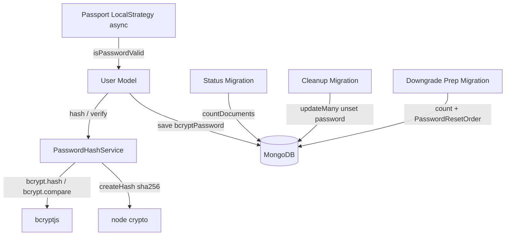
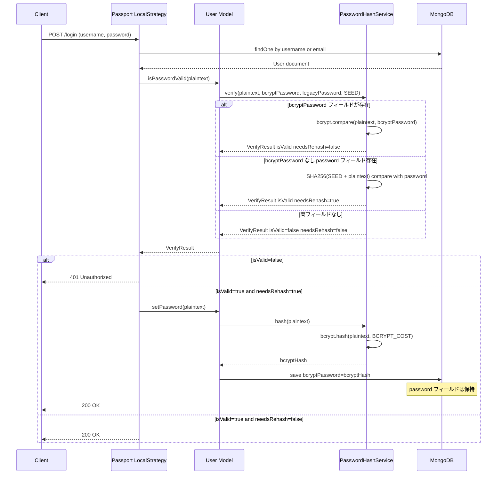
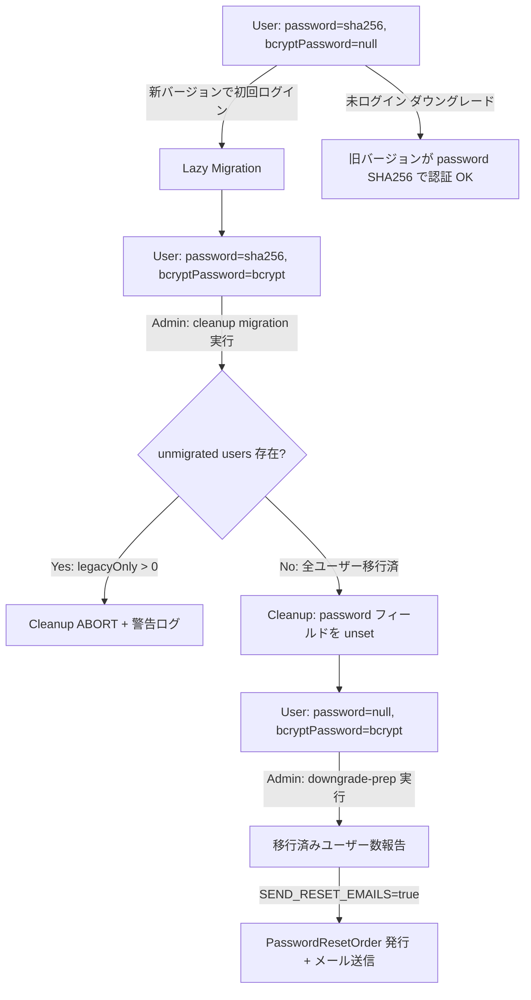
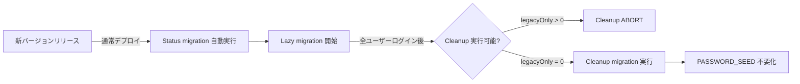

# Design Document: password-hash-upgrade

## Overview

GROWI のローカル認証システムにおけるパスワードハッシュを SHA-256（グローバル `PASSWORD_SEED` ペッパー、ユーザー単位ソルトなし）から `bcryptjs`（cost factor 12、ユーザー単位ランダムソルト）へ移行する。これにより CodeQL `js/insufficient-password-hash`（CWE-916）アラートを解消する。

移行は **遅延マイグレーション（lazy migration）** として実装する。既存ユーザーは再ログイン時に自動的に bcrypt ハッシュへ再ハッシュされ、パスワードリセット不要でシームレスに移行する。**デュアルフィールド方式**（`password` = SHA-256保持、`bcryptPassword` = bcrypt格納）により、Cleanup migration 実行前はダウングレードしても旧バージョンが SHA-256 ハッシュで認証継続可能。

**Users**: GROWI 管理者（移行ライフサイクル管理）、エンドユーザー（透過的移行）。  
**Impact**: User model に `bcryptPassword` フィールド追加、パスワード検証を全スタックで async 化、status migration 1 本 + standalone 管理スクリプト 2 本（cleanup・downgrade-prep）追加。

### Goals

- CodeQL `js/insufficient-password-hash`（CWE-916）アラート解消
- 新規パスワードおよびパスワード変更時に bcrypt（cost ≥ 12、per-user salt）を適用
- 既存 SHA-256 ユーザーがパスワードリセットなしにシームレスにログイン継続
- Cleanup migration 実行前はダウングレード時に SHA-256 ユーザーの認証が継続
- 移行進捗の可視化・管理・クリーンアップ・ダウングレード対応のためのマイグレーションスクリプト群

### Non-Goals

- LDAP、OAuth、SAML、Passkey 等の外部認証プロバイダー
- `apiToken` フィールドのハッシュ化改善
- `PASSWORD_SEED` 環境変数の即時廃止
- 全ユーザーの一括強制マイグレーション（バッチ rehash）
- 72 バイト超のパスワードに対する特殊対応（GROWI のパスワードポリシーの範囲内で問題なし）

---

## Boundary Commitments

### This Spec Owns

- `PasswordHashService`（`src/server/service/password-hash.ts`）: bcrypt ハッシュ生成・検証・legacy 判定
- User model のパスワード関連メソッド（`isPasswordValid`、`setPassword`、`updatePassword`、`isPasswordSet`）の async 化と `bcryptPassword` フィールド追加
- `findUserByEmailAndPassword` の削除（デッドコード）
- `password == null` 代用判定の `isPasswordSet()` 置換（`login.js`、`user-activation.ts`、`personal-setting/index.js`）
- Passport LocalStrategy の async 化と lazy migration トリガー
- status migration（migrate-mongo、1 本）+ cleanup・downgrade-prep standalone 管理スクリプト（2 本）
- `bcryptjs` 依存関係の追加（`apps/app/package.json`）
- `@growi/core` のシリアライザ・型定義への `bcryptPassword` 追加（漏洩防止のため必須）: `omitInsecureAttributes()`、`IUserSerializedSecurely` 型、`IUser` 型

### Out of Boundary

- 外部認証プロバイダー（LDAP、OAuth、SAML、Passkey）のパスワード処理
- `apiToken` フィールドのハッシュ化
- パスワードリセットメール送信インフラ（既存の `PasswordResetOrder` + メールサービスを利用）
- 全ユーザー強制マイグレーション（lazy migration のみ。未ログインユーザーは SHA-256 のまま残る）
- `PASSWORD_SEED` 環境変数の廃止（Cleanup migration 後も legacy 検証パスで使用済みのハッシュは不存在になるが、環境変数設定自体の廃止は別途）

### Allowed Dependencies

- `bcryptjs` ^3.0（新規依存、Pure JS、`apps/app/package.json` の `dependencies` に追加）
- `node:crypto`（built-in、SHA-256 legacy 検証パスで継続使用）
- 既存 `PasswordResetOrder` model（downgrade-prep スクリプトでリセット発行に使用、mongoose のみで動作）
- 既存メールサービス `crowi.mailService`（downgrade-prep スクリプトでリセットメール送信。**crowi 起動が前提** — `new Crowi(); await crowi.init()`、`repl.ts` パターン）
- `migrate-mongo`（既存マイグレーションインフラ。**status migration のみ**に使用）
- `Crowi` bootstrap（`src/server/crowi`、downgrade-prep standalone スクリプトで mailService 取得のため起動）

### Revalidation Triggers

- User model の `password` / `bcryptPassword` フィールド定義変更
- `PasswordHashService` の `verify()` / `hash()` インターフェース変更
- Passport LocalStrategy のコールバックシグネチャ変更
- `user/index.js` を TypeScript に移行する場合（型定義の更新が必要）

---

## Architecture

### Existing Architecture Analysis

```
generatePassword(password)          // private function, SHA-256(SEED + plain) → hex
  ↓ called by
User.isPasswordValid(password)     // sync, string compare
User.setPassword(password)         // sync, sets this.password
User.updatePassword(password)      // async, calls setPassword + save
User.findUserByEmailAndPassword()  // queries DB by { email, password: hash } ← 問題
User.createUserByEmailAndPasswordAndStatus()

Passport LocalStrategy callback    // sync, calls user.isPasswordValid inline
```

**改修が必要な理由**:
1. SHA-256 は fast hash（CWE-916）
2. `findUserByEmailAndPassword` は DB に password hash でクエリしているため bcrypt 移行後は動作不能（bcrypt は非決定論的）
3. 全 password メソッドが同期的なため bcrypt（async）に対応不可

### Architecture Pattern & Boundary Map



**New architecture**:
- `PasswordHashService`: bcrypt/legacy 両対応の薄いサービス層。User model と Passport は直接 crypto に依存しない
- User model: `bcryptPassword` フィールド追加、全パスワードメソッドを async 化
- Passport LocalStrategy: async callback。verify 結果の `needsRehash` を受けて lazy migration をトリガー
- status migration: `migrate-mongo` 既存インフラ上で動作（読み取り専用）。cleanup・downgrade-prep は standalone 管理スクリプト（`repl.ts` 同様の起動）

### Technology Stack

| Layer | Choice / Version | Role | Notes |
|-------|-----------------|------|-------|
| Backend / Auth | `bcryptjs` ^3.x | bcrypt ハッシュ生成・検証 | Pure JS、Alpine 互換、no native build。`dependencies` に追加（Turbopack SSR rule） |
| Backend / Auth | `node:crypto` (built-in) | Legacy SHA-256 検証 | 既存コードと同じ API。移行期間のみ使用 |
| Backend / Model | Mongoose（既存） | User schema + `bcryptPassword` フィールド追加 | — |
| Backend / Auth | Passport.js（既存） | LocalStrategy の async 化 | — |
| Infrastructure | `migrate-mongo`（既存） | status migration（読み取り専用）の自動実行 | cleanup/downgrade-prep は migration ではなく standalone スクリプト |
| Infrastructure | `Crowi` bootstrap（既存） | downgrade-prep スクリプトで `crowi.mailService` 取得のため起動 | `new Crowi(); await crowi.init()`（`repl.ts` パターン） |

---

## File Structure Plan

### New Files

```
apps/app/src/server/service/
└── password-hash.ts                        # PasswordHashService (bcrypt + legacy verify, hash)

apps/app/src/migrations/
└── 20260514000001-password-hash-status.js     # Req 3.1, 3.2: hash format count report (read-only, safe to auto-run)

apps/app/src/server/scripts/
├── password-hash-cleanup.ts        # Req 3.3, 3.4: standalone admin script (mongoose only). Run explicitly by admin.
└── password-hash-downgrade-prep.ts # Req 4.1, 4.2, 4.3: standalone admin script. Boots Crowi (new Crowi(); await crowi.init()) for mailService.
```

> **Vehicle decision (see research CRITICAL-6)**: Only the read-only **status** report is a `migrate-mongo` migration (auto-run, idempotent, safe). **cleanup** and **downgrade-prep** are deliberate admin operations and are implemented as **standalone scripts** run via `pnpm run` (modeled on `src/server/repl.ts` + `package.json` `repl`/`console` scripts), NOT as dated migration files. Rationale: (1) `migrate-mongo up` auto-runs all pending migrations on deploy — an on-demand "run before downgrade" op must not auto-fire; (2) cleanup's abort-on-unmigrated `throw` would fail the deploy's migrate step if it were a migration; (3) downgrade-prep needs `crowi.mailService`, which requires a booted Crowi unavailable in the bare `db` migration context.

### Modified Files

```
apps/app/src/server/models/user/index.js
  — Add bcryptPassword: String to Mongoose schema
  — Update isPasswordSet() to check either field
  — Make isPasswordValid(password) async → delegates to PasswordHashService.verify()
  — Make setPassword(password) async → writes bcryptPassword via PasswordHashService.hash()
  — updatePassword() → await setPassword()
  — activateInvitedUser() → await setPassword(); change save() callback to await
  — resetPasswordByRandomString() → await setPassword()
  — createUserByEmail() → await setPassword()
  — createUserByEmailAndPasswordAndStatus() → await setPassword()
  — findUserByEmailAndPassword() → DELETE (dead code: no callers in codebase; query-by-hash breaks under bcrypt anyway)

packages/core/src/interfaces/user.ts
  — Add bcryptPassword?: string to IUser type

packages/core/src/models/serializers/user-serializer.ts
  — omitInsecureAttributes(): add bcryptPassword to the destructure-omit (prevents hash leak in API responses & toObject transform)
  — IUserSerializedSecurely: add 'bcryptPassword' to the Omit union
  — REQUIRES changeset (npx changeset, patch bump for @growi/core)

apps/app/src/server/service/passport.ts
  — Make LocalStrategy callback async
  — Change findUserByUsernameOrEmail call from callback to Promise/await
  — Change isPasswordValid call: await result and check .isValid (was: !user.isPasswordValid(password))
  — Trigger lazy migration (await user.setPassword + save) when needsRehash is true

apps/app/src/server/routes/apiv3/personal-setting/index.js
  — Change isPasswordValid call: await result and check .isValid (was: !user.isPasswordValid(oldPassword))
  — Line 702: replace `user.password == null` with `!user.isPasswordSet()` (dual-field: bcrypt-only users have password==null but DO have a password)

apps/app/src/server/routes/login.js
  — Line 145: replace `userData.password == null` with `!userData.isPasswordSet()` (prevents bcrypt-only users being redirected to /me#password_settings after registration)

apps/app/src/server/routes/apiv3/user-activation.ts
  — Line 278: replace `userData.password != null` with `userData.isPasswordSet()` (prevents activated invited users being misrouted to /me#password_settings)

apps/app/package.json
  — Add bcryptjs to dependencies (server-side runtime, SSR reachable)
```

---

## System Flows

### ログイン時 Lazy Migration フロー



### Migration Lifecycle フロー



---

## Requirements Traceability

| Requirement | Summary | Components | Interfaces | Flows |
|-------------|---------|------------|------------|-------|
| 1.1 | 新パスワードは bcrypt cost≥12 + per-user salt | PasswordHashService | `hash()` | setPassword flow |
| 1.2 | 自己記述型フォーマット（`$2b$`プレフィックス） | PasswordHashService | `hash()` | — |
| 1.3 | 新パスワードに SHA-256+SEED を使用しない | PasswordHashService, User model | `hash()`, `setPassword()` | — |
| 1.4 | 同一平文 → 異なるハッシュ（per-user salt） | PasswordHashService | `hash()` | — |
| 2.1 | Legacy SHA-256 ユーザーがログイン継続 | PasswordHashService, Passport | `verify()` | Login flow |
| 2.2 | Legacy ログイン成功時に自動 rehash | Passport, User model | Lazy migration trigger | Login flow |
| 2.3 | 両フォーマット透過的処理 | PasswordHashService | `verify()` | Login flow |
| 2.4 | 不明フォーマット → reject + WARNING ログ | PasswordHashService | `verify()` | Login flow |
| 3.1 | Status migration: フォーマット別ユーザー数報告（読み取り専用） | Status migration script | Batch | — |
| 3.2 | Status migration: 標準出力へカウント出力 | Status migration script | Batch | — |
| 3.3 | Cleanup: 移行済みユーザーから `password` フィールド削除 | Cleanup script (standalone) | Batch | — |
| 3.4 | Cleanup: 未移行ユーザーが残る場合は abort | Cleanup script (standalone) | Batch | — |
| 4.1 | Downgrade prep: bcrypt 移行済みユーザー数報告 | Downgrade prep script | Batch | — |
| 4.2 | Downgrade prep: リセットメール送信オプション | Downgrade prep script, PasswordResetOrder | Batch | — |
| 4.3 | Downgrade prep: bcrypt-only ユーザーをリセット必須状態にマーク | Downgrade prep script, PasswordResetOrder | Batch | — |

---

## Components and Interfaces

| Component | Domain/Layer | Intent | Req Coverage | Key Dependencies | Contracts |
|-----------|-------------|--------|--------------|------------------|-----------|
| PasswordHashService | Server / Auth | bcrypt ハッシュ生成・検証・legacy 判定 | 1.1–1.4, 2.1–2.4 | bcryptjs (P0), node:crypto (P0) | Service |
| User model (password methods) | Server / Model | async パスワード操作、`bcryptPassword` フィールド | 1.1, 1.3, 2.2 | PasswordHashService (P0) | Service |
| User serializer (@growi/core) | Shared / Core | `bcryptPassword` をシリアライズ除去 + 型定義追加（漏洩防止） | 1.1, 1.2 | — | Service |
| Passport LocalStrategy | Server / Auth | async 検証、lazy migration オーケストレーション | 2.1–2.3 | User model (P0) | Service |
| Status migration script | Infrastructure | フォーマット別ユーザー数集計（読み取り専用） | 3.1, 3.2 | MongoDB (P0) | Batch |
| Cleanup script (standalone) | Infrastructure | 移行済みユーザーから `password` フィールド削除（mongoose のみ、手動実行） | 3.3, 3.4 | MongoDB (P0) | Batch |
| Downgrade prep script (standalone) | Infrastructure | 移行済みユーザー数報告 + リセットメール発行（crowi 起動、手動実行） | 4.1–4.3 | MongoDB (P0), Crowi/mailService (P0), PasswordResetOrder (P1) | Batch |

---

### Server / Auth Layer

#### PasswordHashService

| Field | Detail |
|-------|--------|
| Intent | bcrypt ハッシュ生成と両フォーマット（bcrypt / legacy SHA-256）検証の単一責任境界 |
| Requirements | 1.1, 1.2, 1.3, 1.4, 2.1, 2.2, 2.3, 2.4 |

**Responsibilities & Constraints**

- `hash(plaintext)`: `bcrypt.hash(plaintext, BCRYPT_COST)` — 常に bcrypt、SEED は不使用
- `verify(plaintext, bcryptHash, legacyHash, passwordSeed)`:
  - `bcryptHash` が存在 → `bcrypt.compare(plaintext, bcryptHash)` → `{ isValid, needsRehash: false }`
  - `bcryptHash` が存在せず `legacyHash` が存在 → `SHA256(SEED + plaintext) === legacyHash` → `{ isValid, needsRehash: true }`
  - 両フィールドが存在しない → `{ isValid: false, needsRehash: false }`（WARNING ログ出力）
- `BCRYPT_COST`: 環境変数 `BCRYPT_COST`（デフォルト 12）から取得
- `bcryptjs` のみが `bcryptHash` を生成・検証。`node:crypto` は legacy パスのみ

**Dependencies**

- External: `bcryptjs` ^3.x — bcrypt 生成・検証（P0）
- External: `node:crypto` (built-in) — legacy SHA-256 検証（P0）
- Inbound: User model, Passport strategy（P0）

**Contracts**: Service [x]

```typescript
// apps/app/src/server/service/password-hash.ts

export interface VerifyResult {
  isValid: boolean;
  needsRehash: boolean;
}

export interface IPasswordHashService {
  hash(plaintext: string): Promise<string>;
  verify(
    plaintext: string,
    bcryptHash: string | undefined,
    legacyHash: string | undefined,
    passwordSeed: string,
  ): Promise<VerifyResult>;
}
```

- **Preconditions**: `plaintext` は非空文字列。`BCRYPT_COST` は 12 以上
- **Postconditions**: `hash()` は `$2b$` プレフィックスの bcrypt ハッシュを返す。`verify()` は必ず `VerifyResult` を返す（throw しない）
- **Invariants**: `needsRehash: true` は `isValid: true` のときのみ

**Implementation Notes**

- `BCRYPT_COST` が 12 未満の場合は起動時に警告ログを出力（セキュリティ基準を下回る設定の検出）
- 不明なフォーマット（両フィールドなし）は `isValid: false` を返し、WARNING レベルでユーザー ID を含むログを出力（Req 2.4）
- `bcryptjs` は SSR 実行コードから static import されるため `dependencies` に追加（Turbopack externalization rule 準拠）

---

#### User Model (password methods)

| Field | Detail |
|-------|--------|
| Intent | `PasswordHashService` への委譲 + `bcryptPassword` フィールド管理 |
| Requirements | 1.1, 1.3, 2.2 |

**Responsibilities & Constraints**

- Schema に `bcryptPassword: String` フィールドを追加
- `isPasswordSet()`: `!!(this.bcryptPassword || this.password)` で両フィールドを確認
- `isPasswordValid(password)`: async。`PasswordHashService.verify(password, this.bcryptPassword, this.password, SEED)` を呼び出す
- `setPassword(password)`: async。`bcryptPassword = await PasswordHashService.hash(password)` のみ設定。`password`（SHA-256）フィールドは変更しない（ダウングレード安全維持）
- `findUserByEmailAndPassword(email, password)`: `{ email }` のみで検索後、`isPasswordValid()` で verify。DB クエリに `password` フィールドを含まない

**Dependencies**

- Outbound: PasswordHashService — hash / verify（P0）
- External: MongoDB via Mongoose — `bcryptPassword` フィールド永続化（P0）

**Contracts**: Service [x]

```typescript
// User Mongoose document 追加メソッド（既存の .js ファイルに追加）

isPasswordSet(): boolean
isPasswordValid(password: string): Promise<VerifyResult>
setPassword(password: string): Promise<this>
updatePassword(password: string): Promise<UserDocument>
```

**Implementation Notes**

- `isPasswordValid` は `boolean` から `Promise<VerifyResult>` へ変更になるため、呼び出し元をすべて async/await + `.isValid` 参照に更新する必要がある。更新対象:
  - `service/passport.ts:285` — `!user.isPasswordValid(password)` → `const r = await user.isPasswordValid(password); !r.isValid`（変更しないと Promise が常に truthy となり全員ログイン可能になる）
  - `routes/apiv3/personal-setting/index.js:432` — 同様（変更しないと旧パスワード検証がスキップされる）
- `setPassword` は `void` から `Promise<this>` へ変更になるため、以下の呼び出し元すべてで `await` が必要:
  - `updatePassword`（line 208）
  - `activateInvitedUser`（line 277）— さらに `this.save(callback)` を `await this.save()` に変更
  - `resetPasswordByRandomString`（line 575）
  - `createUserByEmail`（line 591）
  - `createUserByEmailAndPasswordAndStatus`（line 683）
- `findUserByEmailAndPassword` の query-by-hash パターンを除去し async fetch-then-compare に変更

---

#### Passport LocalStrategy

| Field | Detail |
|-------|--------|
| Intent | async 検証 + needsRehash 時の lazy migration トリガー |
| Requirements | 2.1, 2.2, 2.3 |

**Responsibilities & Constraints**

- LocalStrategy コールバックを async 化（try/catch で done(err) を保証）
- `isPasswordValid(password)` の `VerifyResult` を受け取り:
  - `isValid=false` → `done(null, false)` を返す
  - `isValid=true, needsRehash=true` → `await user.setPassword(password); await user.save()` 後に `done(null, user)` を返す
  - `isValid=true, needsRehash=false` → そのまま `done(null, user)` を返す

**Dependencies**

- Outbound: User model — `findOne`, `isPasswordValid`, `setPassword`, `save`（P0）

**Contracts**: Service [x]

```typescript
passport.use(
  new LocalStrategy(
    { usernameField, passwordField },
    async (username: string, password: string, done: StrategyCallback): Promise<void> => { ... }
  )
);
```

**Implementation Notes**

- `findUserByUsernameOrEmail` を Promise ベースに変更するか、async/await ラッパーを使用
- lazy migration の `save()` が失敗してもログイン自体は成功させる（rehash 失敗はログに記録し、次回ログイン時にリトライ可能）

---

### Infrastructure Layer (Migration Scripts)

#### Status Migration Script

| Field | Detail |
|-------|--------|
| Intent | フォーマット別ユーザー数を読み取り専用で集計・報告 |
| Requirements | 3.1, 3.2 |

**Contracts**: Batch [x]

```
Trigger: pnpm run migrate:migrate-mongo（起動時の通常マイグレーション実行）
Input: MongoDB Users コレクション（読み取りのみ）
Output: 標準出力（logger.info）へカウント出力
Idempotency: 常に読み取りのみ、何度実行しても安全
```

**カウント対象**:
- `bcryptOnly`: `{ bcryptPassword: { $exists: true }, password: { $exists: false } }` — 完全移行済み
- `both`: `{ bcryptPassword: { $exists: true }, password: { $exists: true } }` — 移行中（両フィールドあり）
- `legacyOnly`: `{ bcryptPassword: { $exists: false }, password: { $exists: true } }` — 未移行
- `noPassword`: `{ bcryptPassword: { $exists: false }, password: { $exists: false } }` — パスワード未設定

#### Cleanup Script (standalone)

| Field | Detail |
|-------|--------|
| Intent | 移行済みユーザー（bcryptPassword あり）から legacy `password` フィールドを削除 |
| Requirements | 3.3, 3.4 |

**Contracts**: Batch [x]

```
Trigger: 管理者が standalone スクリプトを明示実行（例: pnpm run script:password-hash-cleanup）。migrate-mongo migration ではない（abort throw がデプロイの migrate ステップを壊すため）
Context: mongoose 接続のみ（crowi 起動は不要）。getMongoUri()/mongoOptions で接続
Input: MongoDB Users コレクション
Output: password フィールドを unset（移行済みユーザーのみ）
Idempotency: password が既に存在しないユーザーへの updateMany は no-op
```

**処理フロー**:
1. `legacyOnly` カウントを取得
2. `legacyOnly > 0` の場合: `throw new Error(...)` でマイグレーション中断 + 件数ログ（Req 3.4）
3. `legacyOnly === 0` の場合: `User.updateMany({ bcryptPassword: { $exists: true }, password: { $exists: true } }, { $unset: { password: '' } })` を実行

**Risks**: Cleanup 実行後は `password` フィールドが消えるため、ダウングレードすると `bcryptPassword` のみのユーザーはログイン不可になる。管理者はダウングレード前に downgrade-prep スクリプトを実行する必要がある

#### Downgrade Prep Script (standalone)

| Field | Detail |
|-------|--------|
| Intent | ダウングレード前に移行済みユーザー数を報告し、リセットメール送信オプションを提供 |
| Requirements | 4.1, 4.2, 4.3 |

**Contracts**: Batch [x]

```
Trigger: ダウングレード前に管理者が standalone スクリプトを手動実行（例: pnpm run script:password-hash-downgrade-prep）。migrate-mongo migration ではない（自動実行されてはならない & mailService に crowi 起動が必要）
Context: new Crowi(); await crowi.init() でフル起動し crowi.mailService / crowi.appService にアクセス（repl.ts パターン）
Input: MongoDB Users コレクション、環境変数 SEND_RESET_EMAILS=true（省略可）
Output: 移行済みユーザー数ログ、SEND_RESET_EMAILS=true 時はリセット発行
Idempotency: カウントのみなら冪等。SEND_RESET_EMAILS=true は重複実行に注意（既存 PasswordResetOrder の確認を推奨）
```

**処理フロー**:
1. `bcryptOnly` ユーザー数（`bcryptPassword` あり、`password` なし）を集計・ログ出力（Req 4.1）
2. 環境変数 `SEND_RESET_EMAILS` が `'true'` でない場合: 警告メッセージを出力して終了
3. `SEND_RESET_EMAILS=true` の場合:
   - 対象ユーザーごとに `PasswordResetOrder` を作成（既存インフラ）
   - リセットメール送信（既存メールサービス）
   - `bcryptPassword` のみのユーザーの `bcryptPassword` フィールドを `null` に設定してログイン不可化（Req 4.3）

---

## Data Models

### Domain Model

```
User aggregate:
  password: String | undefined        — legacy SHA-256 ハッシュ（移行期間中保持）
  bcryptPassword: String | undefined  — bcrypt ハッシュ（新フィールド）

Migration state (derived from field existence):
  - legacyOnly:  password=set,   bcryptPassword=unset  → 未移行
  - both:        password=set,   bcryptPassword=set    → 移行中（ログイン済み）
  - bcryptOnly:  password=unset, bcryptPassword=set    → 完全移行
  - noPassword:  password=unset, bcryptPassword=unset  → パスワード未設定
```

### Logical Data Model

**Schema 変更（Mongoose）**:

```javascript
// apps/app/src/server/models/user/index.js に追加
bcryptPassword: { type: String },  // bcrypt hash ($2b$12$...)
// 既存フィールド:
// password: String  — SHA-256 ハッシュ、移行期間中保持、cleanup 後に削除
```

**Index**: `bcryptPassword` フィールドにインデックス不要（パスワード検証は fetch-then-compare のため DB クエリに使用しない）

---

## Error Handling

### Error Strategy

- `PasswordHashService.verify()`: 内部エラーは呼び出し元に throw せず、`{ isValid: false, needsRehash: false }` を返す。エラーは ERROR レベルでログ記録
- Passport LocalStrategy: try/catch で全エラーを `done(err)` に渡す
- Lazy migration 失敗: rehash 保存の失敗はログに記録するが、ログイン自体は成功させる（次回ログイン時にリトライ可能）

### Error Categories

| シナリオ | 分類 | 対応 |
|---------|------|------|
| 無効な認証情報 | 401 | `done(null, false)` — 既存挙動と同じ |
| 不明フォーマットの password フィールド | 認証拒否 + WARNING ログ | Req 2.4 |
| bcryptjs ライブラリエラー | 500 → `done(err)` | エラーログ記録 |
| Lazy migration save 失敗 | ログ記録のみ | ログイン成功を継続 |
| Cleanup script: 未移行ユーザー存在 | Migration abort | エラーメッセージ + affected count ログ |

### Monitoring

- `PasswordHashService`: `needsRehash: true` 発生時に INFO レベルでログ（移行進捗の可視化）
- Passport: lazy migration 成功/失敗を INFO/ERROR でログ
- Migration scripts: 各カウントを INFO で logger 出力

---

## Testing Strategy

### Unit Tests

1. `PasswordHashService.hash()`: 返り値が `$2b$` プレフィックスで始まる、同一平文で異なるハッシュを返す（Req 1.1, 1.4）
2. `PasswordHashService.verify()`: bcrypt パス（`needsRehash=false`）、SHA-256 パス（`needsRehash=true`）、無効認証情報、両フィールドなし（`isValid=false`）のケース（Req 2.1–2.4）
3. `User.isPasswordValid()`: verify 結果を正しく委譲する
4. `User.setPassword()`: `bcryptPassword` フィールドのみ更新し `password` フィールドを保持することを確認（Req 1.3）
5. `omitInsecureAttributes()` / `serializeUserSecurely()`: 戻り値に `bcryptPassword` が含まれないことを確認（漏洩防止）

### Integration Tests

1. Passport LocalStrategy: legacy SHA-256 ユーザーのログイン成功 → `bcryptPassword` が書き込まれていることを確認（Req 2.1, 2.2）
2. Passport LocalStrategy: 既存 bcrypt ユーザーのログイン成功 → rehash が発生しないことを確認（Req 2.3）
3. Passport LocalStrategy: 無効な認証情報 → 401 を確認
4. Status migration script: フィールドパターン別ユーザー数が正しく集計される
5. Cleanup script (standalone): legacyOnly ユーザーが存在する場合は abort、全員移行済みなら `password` フィールドを削除（Req 3.3, 3.4）

### Security Tests

1. `PasswordHashService.hash()` が SHA-256 ハッシュを返さないこと（hex のみ 64 文字でないことを確認）
2. Cost factor 12 未満の設定時に起動時警告が出ることを確認

---

## Security Considerations

- **CWE-916 解消**: `PasswordHashService.hash()` は `bcrypt.hash()` のみを使用し、`crypto.createHash('sha256')` はハッシュ生成に使用しない
- **ハッシュ漏洩防止（必須）**: 新フィールド `bcryptPassword` は `@growi/core` の `omitInsecureAttributes()` で除去対象に追加する。この関数は (1) `serializeUserSecurely()`（API レスポンス）と (2) User schema の `toObject` transform の両経路で使われるため、ここ 1 箇所の修正で全シリアライズ経路の漏洩を防げる。修正を怠ると bcrypt ハッシュがユーザー一覧 API 等で漏洩する
- **Per-user salt**: bcrypt はソルトを自動生成してハッシュに埋め込むため、追加のソルト管理が不要
- **PASSWORD_SEED の役割限定**: 移行後、`PASSWORD_SEED` は legacy SHA-256 ハッシュの検証のみに使用。新規ハッシュは `PASSWORD_SEED` に依存しない
- **Cleanup 後の PASSWORD_SEED**: 全ユーザーが `bcryptPassword` に移行し cleanup migration 実行後、`PASSWORD_SEED` は login 検証に不要。ただし既存の export `meta.json` 問題は本スコープ外
- **`password == null` 代用判定の修正（後方互換上の必須対応）**: 旧モデルでは `password == null` が「ローカルパスワード未設定」（external-account 専用ユーザー）の代用だったが、デュアルフィールド化で新規・移行済みユーザーも `password == null` になる。`isPasswordSet()`（両フィールド確認）に置換しないと、新規/移行ユーザーがパスワード未設定扱いになり、設定画面への誤リダイレクトや LDAP 解除不能を引き起こす。対象 3 箇所: `login.js:145`、`user-activation.ts:278`、`personal-setting/index.js:702`
- **bcryptjs の 72 バイト制限**: GROWI のパスワードバリデーターは `/^[\x20-\x7F]*$/`（ASCII 印字可能文字のみ）を適用するため、1 文字 = 1 バイトとなり 72 バイト = 72 文字制限。既存バリデーターに最大長上限はないため 72 文字超のパスワードは bcrypt が切り捨てる既知動作があるが、認証バイパスは起きず、本スコープでは許容する

---

## Migration Strategy



- **Phase 1** (新バージョンリリース直後): Status migration 自動実行、lazy migration 開始。`PASSWORD_SEED` は引き続き必要
- **Phase 2** (移行期間): 全ユーザーがログインするまで自然に移行。Status migration で進捗確認
- **Phase 3** (任意): 全ユーザー移行確認後、管理者が cleanup standalone スクリプトを明示実行（`pnpm run` 経由）。`password` フィールドを削除。**migration ではないため自動実行されず**、管理者の判断でタイミングを制御できる
- **ダウングレードが必要な場合** (Phase 3 前): Downgrade prep script を実行して影響範囲を確認。必要に応じてリセットメール送信

**Rollback**: Phase 3（Cleanup）前であれば `password` フィールドが保持されているためコードロールバックで即時復旧可能。Phase 3 後は Downgrade prep script でリセットメールを送信する必要がある。
