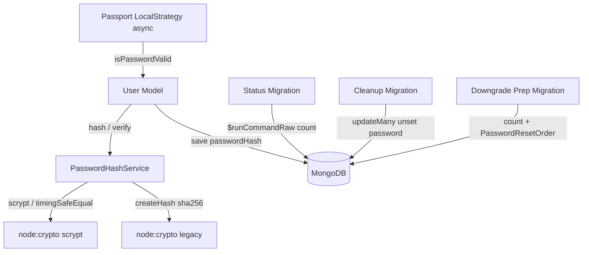
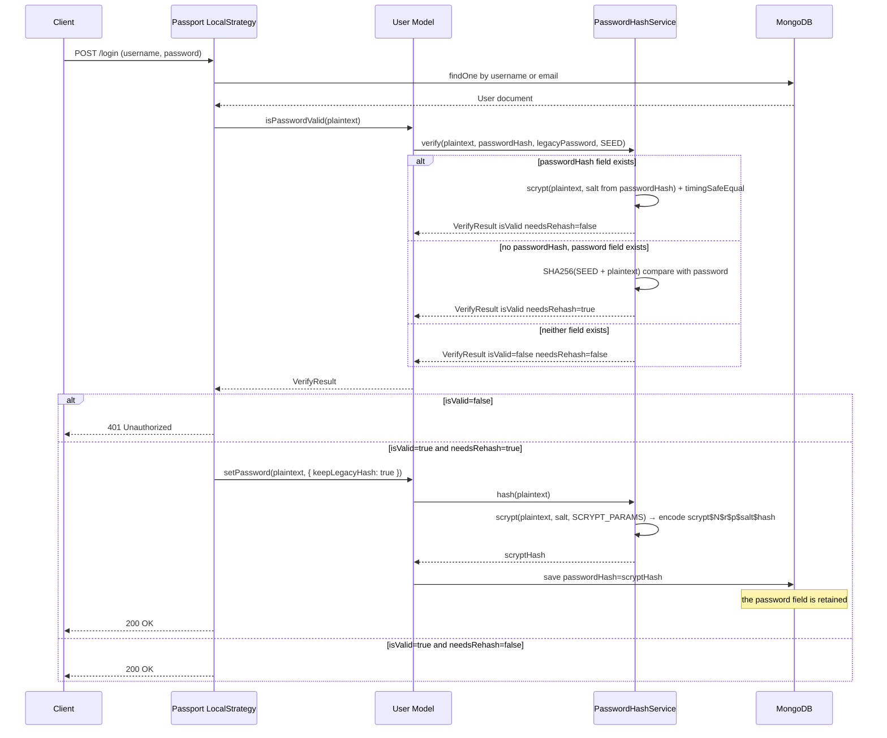
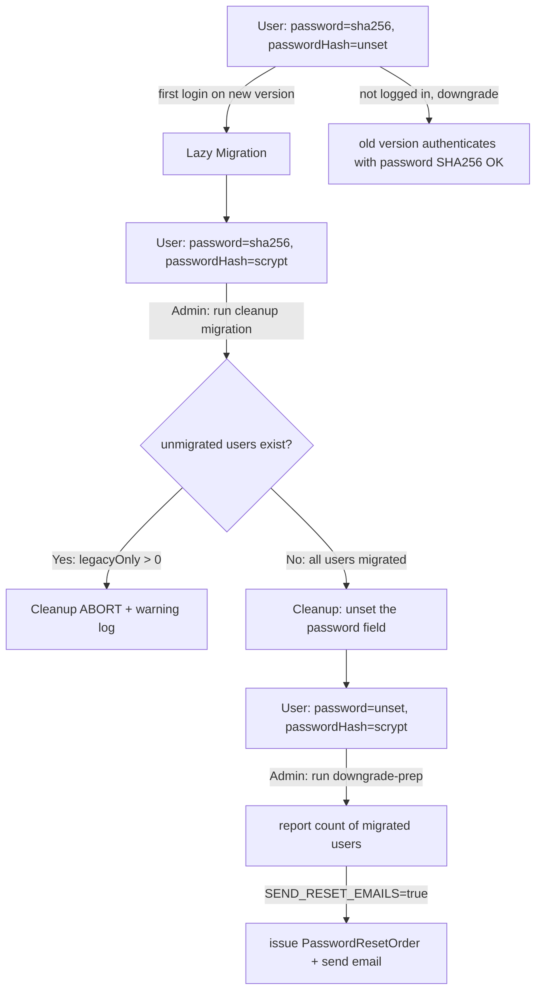
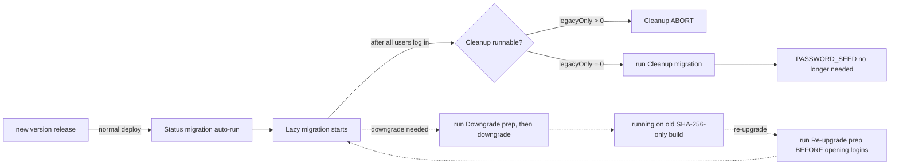

# Design Document: password-hash-upgrade

## Overview

Migrate the password hashing in GROWI's local authentication system from SHA-256 (global `PASSWORD_SEED` pepper, no per-user salt) to **scrypt** from `node:crypto` (a memory-hard KDF with a per-user random salt). This resolves the CodeQL `js/insufficient-password-hash` (CWE-916) alert. scrypt is built into Node.js (OpenSSL), requires no new dependency, and has no native-build issues on Alpine/musl.

The migration is implemented as a **lazy migration**. Existing users are automatically re-hashed to a scrypt hash on their next login, so the migration is seamless and requires no password reset. A **dual-field design** (`password` = retains the SHA-256 hash, `passwordHash` = stores the scrypt self-describing string) means that, before the Cleanup migration is run, a user who still has a `password` (SHA-256) field can continue to authenticate on the older version even after a downgrade. **This holds only for a credential that was never replaced**: the legacy hash is retained exactly in the lazy-migration case (the same password is only re-hashed, so nothing is retired). Users created, invited, or **whose password was changed / reset** on the new version have `passwordHash` only (`upgradedOnly`, no legacy `password`) and would be locked out by a downgrade even before Cleanup — the downgrade-prep script targets exactly these users. Retiring the legacy hash on a password change/reset is deliberate: keeping the SHA-256 hash of a **replaced** password would let that retired password still authenticate on a downgraded build (a credential-revocation hole).

**Users**: GROWI administrators (managing the migration lifecycle) and end users (transparent migration).  
**Impact**: Adds a `passwordHash` field to the User model, makes password verification async throughout the entire stack, and adds one read-only migrate-mongo migration (status) plus three standalone administrative scripts (cleanup, downgrade-prep, and re-upgrade-prep).

### Goals

- Resolve the CodeQL `js/insufficient-password-hash` (CWE-916) alert
- Apply scrypt (at or above OWASP-recommended parameters, with a per-user salt) for new passwords and password changes
- Allow existing SHA-256 users to continue logging in seamlessly without a password reset
- Keep SHA-256 users authenticating after a downgrade, as long as it happens before the Cleanup migration is run and their password has not been changed/reset in the meantime
- Provide a set of migration scripts for visualizing, managing, cleaning up, and handling downgrade of the migration progress

### Non-Goals

- External authentication providers such as LDAP, OAuth, SAML, Passkey
- Improving the hashing of the `apiToken` field
- Immediate deprecation of the `PASSWORD_SEED` environment variable
- Bulk forced migration of all users (batch rehash)
- Special handling of password length (not needed, since scrypt has no 72-byte truncation limit like bcrypt)

---

## Boundary Commitments

### This Spec Owns

- `PasswordHashService` (`src/server/service/password-hash.ts`): scrypt hash generation, verification, and legacy detection
- The User model's password-related methods (`isPasswordValid`, `setPassword`, `updatePassword`, `isPasswordSet`) — making them async and adding the `passwordHash` field
- Making **all 5 methods** in the User model that call `setPassword` use `await` (`updatePassword`, `activateInvitedUser`, `resetPasswordByRandomString`, `createUserByEmail`, `createUserByEmailAndPasswordAndStatus`)
- Clearing both credential fields in `statusDelete()` (`password` and `passwordHash` are both set to `undefined`/unset, so a deleted user does not retain a valid credential hash)
- Deleting `findUserByEmailAndPassword` (dead code; since no call sites exist, delete it rather than refactoring it into a fetch-then-compare)
- Making the Passport LocalStrategy async and triggering the lazy migration
- **Making all call sites of `isPasswordValid` async**: the 2 locations `passport.ts` (LocalStrategy) and `personal-setting/index.js` (old-password verification on password change)
- **Replacing password-set detection based on the `password == null` proxy with `isPasswordSet()`**: the 3 locations `login.js`, `personal-setting/index.js`, and `user-activation.ts` (to prevent misjudging passwordHash-only users)
- **Preventing `passwordHash` leakage in API responses**: add `passwordHash` to `omitInsecureAttributes()` in `@growi/core`, and add `passwordHash?: string` to the `IUser` interface
- One read-only migrate-mongo migration (status) plus three standalone administrative scripts (cleanup, downgrade-prep, and re-upgrade-prep)
- Self-describing encoding of the scrypt hash (`scrypt$N$r$p$salt$hash`) and parameter management (no new dependency; scrypt is built into `node:crypto`)

### Out of Boundary

- Password handling for external authentication providers (LDAP, OAuth, SAML, Passkey)
- Hashing of the `apiToken` field
- The password-reset email-sending infrastructure (reuses the existing `PasswordResetOrder` + mail service)
- Forced migration of all users (lazy migration only; users who never log in remain on SHA-256)
- Deprecation of the `PASSWORD_SEED` environment variable (even after the Cleanup migration, the hashes used by the legacy verification path no longer exist, but deprecating the environment variable setting itself is handled separately)

### Allowed Dependencies

- `node:crypto` (built-in): scrypt (new hash generation and verification) + the SHA-256 legacy verification path + `timingSafeEqual`. **No new dependency is added**
- `crypto.randomBytes` (built-in): generation of the per-user salt
- The existing `PasswordResetOrder` model (used by the downgrade-prep script to issue resets)
- The existing mail service (used by the downgrade-prep script to send reset emails)
- `migrate-mongo` (the existing migration infrastructure, for the status migration only)
- Crowi bootstrap (`new Crowi(); await crowi.init()`, for initializing mailService in the downgrade-prep standalone script)

### Revalidation Triggers

- Changes to the `password` / `passwordHash` field definitions in the User model
- Changes to the `verify()` / `hash()` interface of `PasswordHashService`
- Changes to the callback signature of the Passport LocalStrategy
- Migrating `user/index.js` to TypeScript (the type definitions would need to be updated)

---

## Architecture

### Existing Architecture Analysis

```
generatePassword(password)          // private function, SHA-256(SEED + plain) → hex
  ↓ called by
User.isPasswordValid(password)     // sync, string compare
User.setPassword(password)         // sync, sets this.password
User.updatePassword(password)      // async, calls setPassword + save
User.findUserByEmailAndPassword()  // queries DB by { email, password: hash } ← problem
User.createUserByEmailAndPasswordAndStatus()

Passport LocalStrategy callback    // sync, calls user.isPasswordValid inline
```

**Why changes are needed**:
1. SHA-256 is a fast hash (CWE-916)
2. `findUserByEmailAndPassword` queries the DB by password hash, so it will no longer work after the scrypt migration (scrypt is non-deterministic because of the salt)
3. All password methods are synchronous, so they cannot accommodate scrypt (the asynchronous `crypto.scrypt`)

### Architecture Pattern & Boundary Map


```mermaid
graph TB
    Passport[Passport LocalStrategy async] -->|isPasswordValid| UserModel[User Model]
    UserModel -->|hash / verify| PHS[PasswordHashService]
    PHS -->|scrypt / timingSafeEqual| NodeScrypt[node:crypto scrypt]
    PHS -->|createHash sha256| NodeCrypto[node:crypto legacy]
    UserModel -->|save passwordHash| MongoDB[(MongoDB)]
    StatusScript[Status Migration] -->|"$runCommandRaw count"| MongoDB
    CleanupScript[Cleanup Migration] -->|updateMany unset password| MongoDB
    DowngradeScript[Downgrade Prep Migration] -->|count + PasswordResetOrder| MongoDB
```

**New architecture**:
- `PasswordHashService`: a thin service layer supporting both scrypt and legacy. The User model and Passport do not depend on crypto directly
- User model: adds the `passwordHash` field and makes all password methods async
- Passport LocalStrategy: async callback. Receives `needsRehash` from the verify result and triggers the lazy migration
- Migration scripts: 3 scripts running on the existing `migrate-mongo` infrastructure

### Technology Stack

| Layer | Choice / Version | Role | Notes |
|-------|-----------------|------|-------|
| Backend / Auth | `node:crypto` scrypt (built-in) | scrypt hash generation and verification | **No new dependency** (bundled with OpenSSL). Memory-hard for GPU resistance. No native build needed on Alpine/musl |
| Backend / Auth | `node:crypto` (built-in) | Legacy SHA-256 verification + `timingSafeEqual` | Same API as the existing code. Used only during the migration period |
| Backend / Model | Mongoose (existing) | User schema + adding the `passwordHash` field | — |
| Backend / Auth | Passport.js (existing) | Making LocalStrategy async | — |
| Infrastructure | `migrate-mongo` (existing) | Running the 3 migration scripts | — |

---

## File Structure Plan

### New Files

```
apps/app/src/server/models/user/
└── password-hash-format-filters.ts            # shared dual-field classification filters (null/''-aware):
                                                # upgradedOnly/both/legacyOnly/noPassword — the single source of
                                                # truth reused by status / cleanup / downgrade-prep

apps/app/src/server/service/
├── password-hash.ts                           # PasswordHashService (scrypt + legacy verify, hash)
└── password-reset/                            # shared password-reset mail flow, extracted so the
    ├── index.ts                               # apiv3 forgot-password route and downgrade-prep cannot
    └── send-password-reset-email.ts           # drift: createAndSendPasswordResetOrder (PasswordResetOrder
                                                # creation + mail) and sendPasswordResetTemplateEmail
                                                # (template allowlist + subject + template vars)

apps/app/src/migrations/
└── 20260724000001-password-hash-status.js     # Req 3.1, 3.2: hash format count report (read-only, migrate-mongo)
                                                # v8: timestamp MUST be later than the latest existing migration (20260721103639)

apps/app/src/server/scripts/
├── script-runner.ts                           # shared standalone-script runtime: isEntryPoint,
                                                # withMongoConnection, redactMongoUri (keeps credentials
                                                # out of the connection log line) and exitAfterLogFlush
                                                # (drains pino's transport worker before exiting, so the
                                                # abort/completion report is never dropped)
├── password-hash-cleanup.ts                   # Req 3.3, 3.4: remove legacy password (standalone admin script)
├── password-hash-downgrade-prep.ts            # Req 4.1, 4.2, 4.3: count + optional reset email (standalone, Crowi bootstrap)
└── password-hash-reupgrade-prep.ts            # Req 4.4: $unset stale passwordHash from `both` users when re-upgrading after a downgrade (standalone admin script)
```

> **Why standalone scripts (CRITICAL-6)**: cleanup carries the risk of breaking a deployment with a `throw` when migrate-mongo runs it automatically, and downgrade-prep needs a Crowi bootstrap for mailService. Neither can be achieved in the migrate-mongo container, so all are implemented as standalone scripts. (Re-upgrade prep is standalone for the same operational reason as cleanup: it is a destructive `$unset` an admin runs deliberately as part of a downgrade-return procedure, not something to auto-run at boot.)

### Modified Files

```
apps/app/src/server/models/user/index.js
  — Add passwordHash: String to Mongoose schema
  — Update isPasswordSet() to check either field
  — Make isPasswordValid(password) async → delegates to PasswordHashService.verify()
  — Make setPassword(password, { keepLegacyHash }) async → writes passwordHash via
    PasswordHashService.hash(), and RETIRES the legacy `password` (SHA-256) unless
    keepLegacyHash is set. Only the Passport lazy re-hash (same password, nothing
    replaced) passes keepLegacyHash: true, so a changed/reset credential cannot
    still authenticate on a downgraded build
  — await ALL 5 setPassword call sites: updatePassword, activateInvitedUser,
    resetPasswordByRandomString, createUserByEmail, createUserByEmailAndPasswordAndStatus
  — statusDelete(): unset BOTH credential fields on user deletion — set
    password=undefined AND passwordHash=undefined (previously password was scrubbed to
    '' and passwordHash was left, so deleted users would retain a valid credential hash).
    Unset (not '') so verify() and the shared filters treat both as noPassword, not a
    malformed/legacy field (avoids a spurious Req 2.4 WARNING and mis-counting as legacyOnly)
  — DELETE findUserByEmailAndPassword() (dead code: no call sites exist)

apps/app/src/server/models/user/index.prisma.ts
  — serializeSecurely (the Prisma-side counterpart of @growi/core's omitInsecureAttributes)
    must select and then strip passwordHash. Selecting it is required: an omitted field
    cannot be stripped, and the raw scrypt hash otherwise reaches API responses that read
    users through Prisma (e.g. /bookmarks/info)

apps/app/src/server/routes/apiv3/forgot-password.js
  — Both mail sends now delegate to the shared service (createAndSendPasswordResetOrder for
    the request flow, sendPasswordResetTemplateEmail for the "reset succeeded" mail), so the
    route and the downgrade-prep script cannot drift apart

apps/app/src/features/rate-limiter/config/index.ts
  — Correct the login rate-limit key to the fully-mounted path '/_api/v3/login'.
    The middleware matches req.path EXACTLY, so the old '/login' key (a legacy route that
    no longer exists) matched nothing and login ran at the permissive default —
    unacceptable now that each attempt costs a ~128MiB / ~100ms scrypt on the libuv pool

apps/app/src/server/service/passport.ts
  — Make LocalStrategy callback async
  — Update isPasswordValid call site (line ~285) to await + read VerifyResult.isValid
  — Trigger lazy migration (await user.setPassword(pw, { keepLegacyHash: true }) + save) when needsRehash is true

apps/app/src/server/routes/apiv3/personal-setting/index.js
  — isPasswordValid call site (line ~432): await user.isPasswordValid(oldPassword)
    → change to !(await user.isPasswordValid(oldPassword)).isValid
    (CRITICAL: !Promise is always false → old-password check would be bypassed)
  — password == null check (line ~702): replace with !user.isPasswordSet()
    (avoid wrongly blocking LDAP account detach for passwordHash-only users)

apps/app/src/server/routes/login.js
  — userData.password == null check (line ~145): replace with !userData.isPasswordSet()
    (avoid redirecting every passwordHash-only user to /me#password_settings)

apps/app/src/server/routes/apiv3/user-activation.ts
  — userData.password != null check (line ~278): replace with userData.isPasswordSet()
    (avoid mis-deciding redirect target for passwordHash-only users)

packages/core/src/models/serializers/user-serializer.ts
  — Add passwordHash to omitInsecureAttributes() omit list (prevent API response leak)

packages/core/src/interfaces/user.ts
  — Add passwordHash?: string to IUser interface

apps/app/package.json
  — No dependency is added (scrypt is built into node:crypto; bcryptjs / @types/bcryptjs are
    unnecessary), but six scripts are: password-hash:cleanup / :downgrade-prep / :reupgrade-prep
    run the built output under `cross-env NODE_ENV=production node --import ./bin/runtime/env-preload.mjs
    dist/server/scripts/…` (the preload is what loads the deployment's env), and the
    :cleanup:dev / :downgrade-prep:dev / :reupgrade-prep:dev counterparts run the TS sources via `tsrun`.
    The scripts are the documented entry points — the JSDoc in both scripts points at them
    rather than at a bare `node dist/…` command, so the invocation cannot drift

(Changes to @growi/core's serializer/IUser require a changeset because it is a published package — see above)
```

---

## System Flows

### Login-time Lazy Migration Flow


```mermaid
sequenceDiagram
    participant Client
    participant Passport as Passport LocalStrategy
    participant User as User Model
    participant PHS as PasswordHashService
    participant DB as MongoDB

    Client->>Passport: POST /login (username, password)
    Passport->>DB: findOne by username or email
    DB-->>Passport: User document
    Passport->>User: isPasswordValid(plaintext)
    User->>PHS: verify(plaintext, passwordHash, legacyPassword, SEED)
    alt passwordHash field exists
        PHS->>PHS: scrypt(plaintext, salt from passwordHash) + timingSafeEqual
        PHS-->>User: VerifyResult isValid needsRehash=false
    else no passwordHash, password field exists
        PHS->>PHS: SHA256(SEED + plaintext) compare with password
        PHS-->>User: VerifyResult isValid needsRehash=true
    else neither field exists
        PHS-->>User: VerifyResult isValid=false needsRehash=false
    end
    User-->>Passport: VerifyResult
    alt isValid=false
        Passport-->>Client: 401 Unauthorized
    else isValid=true and needsRehash=true
        Passport->>User: setPassword(plaintext, { keepLegacyHash: true })
        User->>PHS: hash(plaintext)
        PHS->>PHS: scrypt(plaintext, salt, SCRYPT_PARAMS) → encode scrypt$N$r$p$salt$hash
        PHS-->>User: scryptHash
        User->>DB: save passwordHash=scryptHash
        Note over DB: the password field is retained
        Passport-->>Client: 200 OK
    else isValid=true and needsRehash=false
        Passport-->>Client: 200 OK
    end
```

### Migration Lifecycle Flow


```mermaid
flowchart TD
    A[User: password=sha256, passwordHash=unset] -->|first login on new version| B[Lazy Migration]
    B --> C[User: password=sha256, passwordHash=scrypt]
    C -->|Admin: run cleanup migration| D{unmigrated users exist?}
    D -->|Yes: legacyOnly > 0| E[Cleanup ABORT + warning log]
    D -->|No: all users migrated| F[Cleanup: unset the password field]
    F --> G[User: password=unset, passwordHash=scrypt]
    G -->|Admin: run downgrade-prep| H[report count of migrated users]
    H -->|SEND_RESET_EMAILS=true| I[issue PasswordResetOrder + send email]
    A -->|not logged in, downgrade| A2[old version authenticates with password SHA256 OK]
```

---

## Requirements Traceability

| Requirement | Summary | Components | Interfaces | Flows |
|-------------|---------|------------|------------|-------|
| 1.1 | New passwords use scrypt (OWASP-recommended parameters) + per-user salt | PasswordHashService | `hash()` | setPassword flow |
| 1.2 | Self-describing format (`scrypt$N$r$p$salt$hash`) | PasswordHashService | `hash()` | — |
| 1.3 | Do not use SHA-256+SEED for new passwords | PasswordHashService, User model | `hash()`, `setPassword()` | — |
| 1.4 | Same plaintext → different hash (per-user salt) | PasswordHashService | `hash()` | — |
| 2.1 | Legacy SHA-256 users continue to log in | PasswordHashService, Passport | `verify()` | Login flow |
| 2.2 | Automatic rehash on successful legacy login | Passport, User model | Lazy migration trigger | Login flow |
| 2.3 | Transparent handling of both formats | PasswordHashService | `verify()` | Login flow |
| 2.4 | Field content does not match any known format (error case) → reject + WARNING log | PasswordHashService | `verify()` | Login flow |
| 2.5 | Password not set (neither field = normal case) → reject, no WARNING output | PasswordHashService | `verify()` | Login flow |
| 3.1 | Status migration: report user count by format (read-only) | Status migration script | Batch | — |
| 3.2 | Status migration: output the counts to standard output | Status migration script | Batch | — |
| 3.3 | Cleanup: remove the `password` field from migrated users | Cleanup migration script | Batch | — |
| 3.4 | Cleanup: abort if any unmigrated users remain | Cleanup migration script | Batch | — |
| 4.1 | Downgrade prep: report count of scrypt-migrated users | Downgrade prep script | Batch | — |
| 4.2 | Downgrade prep: option to send reset emails | Downgrade prep script, PasswordResetOrder | Batch | — |
| 4.3 | Downgrade prep: mark passwordHash-only users as requiring a reset | Downgrade prep script, PasswordResetOrder | Batch | — |
| 4.4 | Re-upgrade prep: `$unset` passwordHash from `both` users so an old-build password change is not shadowed by a stale hash | Re-upgrade prep script | Batch | — |

---

## Components and Interfaces

| Component | Domain/Layer | Intent | Req Coverage | Key Dependencies | Contracts |
|-----------|-------------|--------|--------------|------------------|-----------|
| PasswordHashService | Server / Auth | scrypt hash generation, verification, and legacy detection | 1.1–1.4, 2.1–2.5 | node:crypto scrypt (P0) | Service |
| User model (password methods) | Server / Model | async password operations, `passwordHash` field, fixing call sites (isPasswordValid/isPasswordSet) | 1.1, 1.3, 2.1, 2.2, 2.3 | PasswordHashService (P0) | Service |
| Passport LocalStrategy | Server / Auth | async verification, lazy migration orchestration | 2.1–2.3 | User model (P0) | Service |
| Status migration script | Infrastructure | tally user count by format (read-only) | 3.1, 3.2 | MongoDB (P0) | Batch |
| Cleanup migration script | Infrastructure | remove the `password` field from migrated users | 3.3, 3.4 | MongoDB (P0) | Batch |
| Downgrade prep migration script | Infrastructure | report count of migrated users + issue reset emails | 4.1–4.3 | MongoDB (P0), PasswordResetOrder (P1) | Batch |
| Re-upgrade prep script | Infrastructure | `$unset` passwordHash from `both` users when returning to the new build after a downgrade | 4.4 | MongoDB (P0) | Batch |

---

### Server / Auth Layer

#### PasswordHashService

| Field | Detail |
|-------|--------|
| Intent | The single-responsibility boundary for scrypt hash generation and verification of both formats (scrypt / legacy SHA-256) |
| Requirements | 1.1, 1.2, 1.3, 1.4, 2.1, 2.2, 2.3, 2.4, 2.5 |

**Responsibilities & Constraints**

- `hash(plaintext)`: generate a salt with `crypto.randomBytes(16)` → `crypto.scrypt(plaintext, salt, keylen, {N, r, p, maxmem})` → encode and return in the form `scrypt$N$r$p$<salt(base64)>$<hash(base64)>`. SEED is not used
- `verify(plaintext, scryptHash, legacyHash, passwordSeed, context?)`:
  - `scryptHash` exists → parse `scrypt$…` to extract N/r/p/salt, recompute with `crypto.scrypt`, compare with `crypto.timingSafeEqual` → `{ isValid, needsRehash: false }`
    - **(Optional extension) automatic rehash on parameter update**: if the stored parameters (N/r/p) are weaker than the current defaults, return `needsRehash: true` and rehash at login time with the current parameters. Since verify already parses the stored N/r/p for verification, adding a single comparison against the current defaults costs almost nothing. This lets existing users automatically follow along when scrypt parameters are raised in the future (an optional extension to keep Req 1.1's "at or above OWASP-recommended parameters" satisfied even after migration; not required)
  - `scryptHash` does not exist and `legacyHash` exists → compare `SHA256(SEED + plaintext)` with `legacyHash` via `timingSafeEqual` → `{ isValid, needsRehash: true }`
  - Neither field exists (password not set = `noPassword`) → `{ isValid: false, needsRehash: false }`. **This is the normal state for external-auth-only or not-yet-activated users, and no WARNING log is output** (Req 2.5)
  - A field exists but its content does not match a known format (`scrypt$…` prefix / SHA-256 hex) (an error case such as data corruption) → return `{ isValid: false, needsRehash: false }` and output a WARNING log including the user identifier (Req 2.4)
    - **Deliberately no fallback to the legacy path**: when `passwordHash` is present but unparsable, verification is rejected outright — it does NOT retry against the SHA-256 `password` even for a `both` user who still holds a valid one. Which field is present is what decides the format, so an unparsable `passwordHash` is data corruption, not a format hint; silently falling back would both hide the corruption this WARNING exists to surface and let a forged/damaged envelope steer verification onto the weaker scheme. The cost is that such a user cannot log in until the corruption is fixed (password reset remains available), which is accepted: corruption is an abnormal state, and `both` is transient to the migration window
- `SCRYPT_PARAMS`: N/r/p are adjustable via environment variables (defaults **N=131072 (2^17), r=8, p=1 = the OWASP minimum recommendation**; keylen=64). Because it consumes about 128MB per call, `maxmem` must be explicitly set to ≥192MB (if unset, `crypto.scrypt` throws when it exceeds Node's default `maxmem=32MB`)
- scrypt generation and verification use `node:crypto` only. `node:crypto`'s SHA-256 is for the legacy path only

**Dependencies**

- External: `node:crypto` (built-in) — scrypt generation and verification, legacy SHA-256 verification, `randomBytes`, `timingSafeEqual` (P0)
- Inbound: User model, Passport strategy (P0)

**Contracts**: Service [x]

```typescript
// apps/app/src/server/service/password-hash.ts

export interface VerifyResult {
  isValid: boolean;
  needsRehash: boolean;
}

// Optional identity threaded into verify() so the Req 2.4 anomaly WARNING carries a
// user identifier. Optional and backward-compatible — existing 4-arg callers are unaffected.
export interface VerifyLogContext {
  userId?: string;
  username?: string;
}

export interface IPasswordHashService {
  hash(plaintext: string): Promise<string>;
  verify(
    plaintext: string,
    scryptHash: string | undefined,
    legacyHash: string | undefined,
    passwordSeed: string,
    context?: VerifyLogContext,
  ): Promise<VerifyResult>;
}
```

- **Preconditions**: `plaintext` is a non-empty string. The scrypt parameters are at or above the OWASP minimum recommendation (N≥2^17=131072, r=8, p=1). `maxmem` is set to a value (≥192MB) exceeding the consumed memory (≈128MB)
- **Postconditions**: `hash()` returns a self-describing string with the `scrypt$` prefix. `verify()` always returns a `VerifyResult` (does not throw)
- **Invariants**: `needsRehash: true` only when `isValid: true`

**Implementation Notes**

- The scrypt parameters (N/r/p) default to **N=131072 (2^17), r=8, p=1** (the OWASP minimum recommendation), keylen=64. They are adjustable via environment variables, but **a setting below the lower bound (N=2^17) emits a WARNING at startup and is clamped to the lower bound** (to guarantee the security baseline)
- **Managing the memory ceiling**: scrypt consumes about `128 * N * r` bytes per call (**about 128MB** at the default N=2^17). Explicitly set `maxmem` for `crypto.scrypt` to **≥192MB** (**if unset, it exceeds Node's default of 32MB and throws**). Also clamp the parameter upper bound (to prevent memory exhaustion / DoS with an extreme N). Because the asynchronous `crypto.scrypt` runs on the libuv thread pool, the number of concurrent computations is naturally capped by `UV_THREADPOOL_SIZE` (default 4), so the peak memory stays roughly within "number of threads × 128MB ≒ 512MB" (see Security Considerations for details)
- Password not set (neither field = `noPassword`) returns `isValid: false` but outputs no WARNING log (the normal state for external-auth-only / not-yet-activated users; Req 2.5). WARNING is limited to the error case "a field exists but its content does not match a known format," and is output including the user ID (Req 2.4)
- Since scrypt is built into `node:crypto`, no new dependency needs to be added (no consideration of Turbopack externalization is needed either)

---

#### User Model (password methods)

| Field | Detail |
|-------|--------|
| Intent | Delegation to `PasswordHashService` + management of the `passwordHash` field + making call sites async / replacing their detection logic |
| Requirements | 1.1, 1.3, 2.1, 2.2, 2.3 |

**Responsibilities & Constraints**

- Add a `passwordHash: String` field to the schema
- `isPasswordSet()`: check both fields with `!!(this.passwordHash || this.password)`
- `isPasswordValid(password)`: async. Calls `PasswordHashService.verify(password, this.passwordHash, this.password, SEED)`
- `setPassword(password, options?)`: async. Sets `passwordHash = await PasswordHashService.hash(password)` **and retires the legacy `password` (SHA-256) field** (`this.password = undefined` → `$unset` on save, consistent with `statusDelete()`). Retiring it is required for credential revocation: after a password change / admin reset, a retained SHA-256 hash would still authenticate the **old** password on a downgraded build. The user thereby becomes `upgradedOnly` and is covered by the downgrade-prep script
  - `options.keepLegacyHash: true` is used by **one** call site only — the lazy migration in `verifyLocalCredentials` — where the SAME plaintext that just verified against the legacy hash is being re-hashed. Nothing is retired there, so the legacy hash is kept and the user reaches the `both` state, which is what preserves downgrade safety during the migration period (Req 1.3)
- Make **all 5 methods** that call `setPassword` use `await` (leaving `save()` without awaiting would save without setting passwordHash, making login impossible):
  - `updatePassword`, `activateInvitedUser`, `resetPasswordByRandomString`, `createUserByEmail`, `createUserByEmailAndPasswordAndStatus`
- `findUserByEmailAndPassword(email, password)`: **delete it** (dead code; no call site exists anywhere in the repository). This method queries the DB by password hash and will no longer work after the scrypt migration, but since there is no call site, deletion (not refactoring) is the appropriate action

**Dependencies**

- Outbound: PasswordHashService — hash / verify (P0)
- External: MongoDB via Mongoose — persistence of the `passwordHash` field (P0)

**Contracts**: Service [x]

```typescript
// Methods added to the User Mongoose document (added to the existing .js file)

isPasswordSet(): boolean
isPasswordValid(password: string): Promise<VerifyResult>
setPassword(password: string, options?: { keepLegacyHash?: boolean }): Promise<this>
updatePassword(password: string): Promise<UserDocument>
```

**Implementation Notes**

- `findUserByEmailAndPassword` is dead code with no call sites, so delete it (confirmed with `grep -rn findUserByEmailAndPassword`)
- The 5 methods that call `setPassword` (`updatePassword`, `activateInvitedUser`, `resetPasswordByRandomString`, `createUserByEmail`, `createUserByEmailAndPasswordAndStatus`) are all changed to `await setPassword()`
- The external call sites of `isPasswordValid` are the 2 locations `passport.ts` and `personal-setting/index.js`. Update both to `await` + reading `VerifyResult.isValid` (in particular, `personal-setting`'s `!user.isPasswordValid(...)` is essential because `!Promise` is always false and would bypass the old-password verification)
- The password-set detection based on `password == null` exists in the 3 locations `login.js`, `personal-setting/index.js`, and `user-activation.ts`, and misjudges passwordHash-only users (`password` unset), so replace it with `isPasswordSet()`

---

#### Passport LocalStrategy

| Field | Detail |
|-------|--------|
| Intent | async verification + triggering the lazy migration when needsRehash |
| Requirements | 2.1, 2.2, 2.3 |

**Responsibilities & Constraints**

- Make the LocalStrategy callback async (guarantee done(err) with try/catch)
- Receive the `VerifyResult` of `isPasswordValid(password)`:
  - `isValid=false` → return `done(null, false)`
  - `isValid=true, needsRehash=true` → return `done(null, user)` after `await user.setPassword(password, { keepLegacyHash: true }); await user.save()` (the flag keeps the legacy SHA-256 hash: this path only re-hashes the SAME password, so nothing is retired and the user reaches the `both` state)
  - `isValid=true, needsRehash=false` → return `done(null, user)` as-is

**Dependencies**

- Outbound: User model — `findOne`, `isPasswordValid`, `setPassword`, `save` (P0)

**Contracts**: Service [x]

```typescript
passport.use(
  new LocalStrategy(
    { usernameField, passwordField },
    async (username: string, password: string, done: StrategyCallback): Promise<void> => { ... }
  )
);
```

**Implementation Notes**

- Either change `findUserByUsernameOrEmail` to be Promise-based, or use an async/await wrapper
- Even if the lazy migration `save()` fails, still let the login itself succeed (log the rehash failure; it can be retried on the next login)

---

### Infrastructure Layer (Migration Scripts)

#### Status Migration Script

| Field | Detail |
|-------|--------|
| Intent | Tally and report the user count by format, read-only |
| Requirements | 3.1, 3.2 |

**Contracts**: Batch [x]

```
Trigger: pnpm run migrate:migrate-mongo (the normal migration run at startup)
Input: MongoDB Users collection (read-only)
Output: counts output to standard output (logger.info)
Idempotency: always read-only; safe to run any number of times
```

**Count targets** — the four shared filters from `password-hash-format-filters.ts` (the single source of truth reused by status / cleanup / downgrade-prep). A field counts as PRESENT only when it exists **and** is non-empty (`{ $exists: true, $nin: [null, ''] }`); a `null`/`''` value reads as ABSENT — so a `password: ''` scrubbed-deleted user classifies as `noPassword`, **not** `legacyOnly`:
- `upgradedOnlyFilter`: `passwordHash` present, `password` absent — fully migrated
- `bothFilter`: both present — migrating (both fields present)
- `legacyOnlyFilter`: `passwordHash` absent, `password` present — not migrated
- `noPasswordFilter`: both absent — password not set

#### Cleanup Migration Script

| Field | Detail |
|-------|--------|
| Intent | Remove the legacy `password` field from migrated users (those with passwordHash) |
| Requirements | 3.3, 3.4 |

**Contracts**: Batch [x]

```
Trigger: a standalone script run manually by an administrator (not subject to migrate-mongo auto-run)
  Reason: to avoid the risk of an abort throw breaking a deployment
Input: MongoDB Users collection
Output: unset the password field (migrated users only)
Idempotency: updateMany against users that no longer have password is a no-op
```

**Processing flow**:
1. Obtain the `legacyOnly` count **for ACTIVE users** (`activeUserFilter`), and separately for non-active users (`nonActiveUserFilter`)
2. If the ACTIVE `legacyOnly` count > 0: log an error message (including both counts) and abort processing (Req 3.4)
3. Otherwise: WARN about any non-active `legacyOnly` users and run `updateMany(bothFilter, { $unset: { password: '' } })` using the shared `bothFilter` (both credentials present) from `password-hash-format-filters.ts`

> **Why only ACTIVE users block the abort**: lazy migration is the only thing that can move a `legacyOnly` user forward, and it happens on login. Non-active users are **not** excluded on the grounds that they cannot log in — they can: the login path applies no status filter (`findUserByUsernameOrEmail` has no status condition and `verifyLocalCredentials` rehashes without consulting status; status is read only *after* authentication succeeds, in `createRedirectToForUnauthenticated`, to choose the redirect — which is exactly how the invited-user onboarding flow works). They are excluded because an admin cannot **wait for or compel** them to log in before the cleanup window: an invitee may never accept, a suspended or deleted account may never return. Letting a single such document block would make Phase 3 unreachable indefinitely. They are reported at WARNING instead. The `$unset` itself is intentionally **not** status-scoped — removing a suspended user's retired legacy hash is correct and desirable.

**Risks**: After Cleanup runs, the `password` field is gone, so if you downgrade, users with only `passwordHash` cannot log in. Administrators must run the downgrade-prep script before downgrading

#### Downgrade Prep Migration Script

| Field | Detail |
|-------|--------|
| Intent | Report the count of migrated users before a downgrade and provide an option to send reset emails |
| Requirements | 4.1, 4.2, 4.3 |

**Contracts**: Batch [x]

```
Trigger: a standalone script run manually by an administrator before a downgrade (Crowi bootstrap required)
  Reason: mailService initialization requires Crowi.init(), so it cannot run in the migrate-mongo container
Input: MongoDB Users collection, environment variable SEND_RESET_EMAILS=true (optional)
Output: log of the migrated-user count; issues resets when SEND_RESET_EMAILS=true
Idempotency: idempotent if counting only. Be careful with SEND_RESET_EMAILS=true on repeated runs (checking existing PasswordResetOrder is recommended)
```

**Processing flow**:
1. Tally and log the count of `upgradedOnly` users (`passwordHash` present, `password` absent), split into **ACTIVE** (the actionable set) and non-active (WARNing only) (Req 4.1)
2. If the environment variable `SEND_RESET_EMAILS` is not `'true'`: output a warning message and exit
3. **Preflight (send mode only): refuse to run when the recovery path is unavailable.** The entrypoint resolves `isPasswordResetAvailable` from `security:passport-local:isPasswordResetEnabled` **and** `passportService.isLocalStrategySetup` — the same pair that gates `/forgot-password` (POST, PUT, and the reset-link page). If either is off, the core aborts before any email or write (`aborted: true`, exit 1): otherwise every emailed link would 404 and the users just `$unset` would be left with neither a credential nor a recovery path, recoverable only by DB surgery
4. If `SEND_RESET_EMAILS=true` and the preflight passed:
   - For each **ACTIVE** target user, create a `PasswordResetOrder` (existing infrastructure)
   - Send a reset email (existing mail service)
   - **Only for users whose email was sent successfully**, `$unset` the `passwordHash` field (unset) to make login impossible (Req 4.3)
   - Do not unset users whose send failed (they can be retried on the next run)
   - **Never email or unset a non-active user**: `/forgot-password` rejects them on both POST and PUT, so `$unset`ting their `passwordHash` would remove their only credential with no recovery path (permanent lockout). They are reported via `upgradedOnlyNonActive` + a WARNING and handled manually
   - Log the success and failure counts at INFO/WARNING respectively

> **KNOWN LIMITATION: a reset completed BEFORE the downgrade puts the user straight back into `upgradedOnly`.** The reset link is only valid for ~10 minutes (`PasswordResetOrder`), so the script is documented to run immediately before the downgrade — but that is exactly when a prompt user can still reach the *new* build. Following the link then runs `PUT /forgot-password` → `updatePassword` → `setPassword` (default, i.e. retiring the legacy hash), leaving them scrypt-only again and locked out the moment the downgrade lands. Nothing in the code detects or blocks this re-migration between the prep run and the downgrade. It is accepted rather than solved: the alternative (holding a "reset disabled until downgrade" state, or re-running prep after the switch) costs more than it saves for what is an exceptional, operator-driven procedure. Operationally: run the downgrade promptly after the send, and re-run the prep script (or have the affected users use `/forgot-password`) once the old build is live. Note that a user who misses the 10-minute window is NOT stranded — they are ACTIVE with no credential, which is exactly the state `/forgot-password` serves.

> **CRITICAL: why use `$unset` rather than assigning `null`/`''`**: The shared classification filters (`password-hash-format-filters.ts`) treat a credential field as PRESENT only when it exists **and** holds a non-empty value (`present = { $exists: true, $nin: [null, ''] }`; `absent = $or[{ $exists: false }, { $in: [null, ''] }]`). So a `passwordHash = null`/`''` already reads as ABSENT and the user classifies as `noPassword` — it would NOT be re-counted as `upgradedOnly` in the status migration, nor re-sent a reset email on a downgrade-prep re-run. `$unset` is nonetheless preferred: it removes the field entirely rather than leaving a stray `null`/`''` value, reaches the `noPassword` state cleanly, and stays consistent with `statusDelete`'s `undefined` scrub. Always delete the field entirely with `$unset`.

---

## Data Models

### Domain Model

```
User aggregate:
  password: String | undefined        — legacy SHA-256 hash (retained during migration)
  passwordHash: String | undefined  — scrypt self-describing hash (new field)

Migration state (derived from field existence):
  - legacyOnly:  password=set,   passwordHash=unset  → not migrated
  - both:        password=set,   passwordHash=set    → migrating (logged in)
  - upgradedOnly:  password=unset, passwordHash=set    → fully migrated
  - noPassword:  password=unset, passwordHash=unset  → password not set
```

### Logical Data Model

**Schema change (Mongoose)**:

```javascript
// Added to apps/app/src/server/models/user/index.js
passwordHash: { type: String },  // scrypt self-describing hash (scrypt$N$r$p$salt$hash)
// Existing field:
// password: String  — SHA-256 hash, retained during migration, removed after cleanup
```

**Index**: No index is needed on the `passwordHash` field (password verification is fetch-then-compare, so it is not used in a DB query)

---

## Error Handling

### Error Strategy

- `PasswordHashService.verify()`: never throws to the caller; it always returns a `VerifyResult`, returning `{ isValid: false, needsRehash: false }` on any internal error. Internal verify() errors and malformed-field anomalies (a stored credential field present but matching no known format) are logged at **WARNING** (Req 2.4), not ERROR
  - **Note on `timingSafeEqual`**: if the stored hash is corrupted and its length differs from the computed result, `crypto.timingSafeEqual` throws. Wrap it in try/catch inside verify and reduce it to a format mismatch (the Req 2.4 error case) as `{ isValid: false }` + WARNING (this path preserves the "verify never throws" invariant)
- Passport LocalStrategy: pass all errors to `done(err)` with try/catch
- Lazy migration failure: log a failure to save the rehash, but let the login itself succeed (it can be retried on the next login)

### Error Categories

| Scenario | Classification | Response |
|---------|------|------|
| Invalid credentials | 401 | `done(null, false)` — same as the existing behavior |
| Unknown-format password field | authentication rejected + WARNING log | Req 2.4 |
| scrypt computation error (maxmem exceeded, etc.) | 500 → `done(err)` | log the error |
| Lazy migration save failure | log only | continue with a successful login |
| Cleanup script: unmigrated users exist | Migration abort | error message + affected count log |

### Monitoring

- `PasswordHashService.verify()` does **not** emit a per-call INFO when `needsRehash: true`. Emitting one on every legacy verification would spam the log on each legacy login; the migration-progress signal is logged instead at the point migration actually happens (see below)
- Passport LocalStrategy: log successful lazy migration at INFO (the migration-progress signal — one line per user actually rehashed). A lazy-migration save failure is logged, but the login still succeeds and the rehash is retried on the next login
- Migration scripts: output each count to logger at INFO

---

## Testing Strategy

### Unit Tests

1. `PasswordHashService.hash()`: the return value is a `scrypt$`-prefixed self-describing string (NOT a 64-character SHA-256 hex); returns different hashes for the same plaintext (Req 1.1, 1.4)
2. `PasswordHashService.verify()`: cases for the scrypt path (`needsRehash=false`), the SHA-256 path (`needsRehash=true`), invalid credentials, neither field (`isValid=false`, no WARNING), and format mismatch (`isValid=false`, with WARNING) (Req 2.1–2.5)
3. `User.isPasswordValid()`: correctly delegates the verify result
4. `User.setPassword()`: confirm that it sets `passwordHash` **and clears the legacy `password` field** (credential revocation), and that `{ keepLegacyHash: true }` retains it (the lazy-migration path)

### Integration Tests

1. Passport LocalStrategy: successful login of a legacy SHA-256 user → confirm that `passwordHash` was written (Req 2.1, 2.2)
2. Passport LocalStrategy: successful login of an existing scrypt user → confirm that no rehash occurs (Req 2.3)
3. Passport LocalStrategy: invalid credentials → confirm 401
4. **Password-change authentication-bypass regression (most important)**: confirm that a password change in `personal-setting` succeeds only when the old password is correct, and is rejected when it is wrong/unspecified (regression prevention for the `!Promise` bypass; Req 2.1, 2.2)
5. **passwordHash-only user mis-redirect regression**: confirm that a user with `password` unset and `passwordHash` set is not mis-redirected to `/me#password_settings` after login, and that LDAP detach is not wrongly blocked (regression prevention for the `isPasswordSet()` replacement; Req 2.2, 2.3)
6. **Credential scrubbing for deleted users**: confirm that after `statusDelete()` the `passwordHash` is unset and a deleted user does not retain valid credentials (Req 1.1, 2.2)
7. Status migration script: the user counts per field pattern are tallied correctly
8. Cleanup migration script: abort if legacyOnly users exist; if all are migrated, remove the `password` field (Req 3.3, 3.4)
9. Downgrade prep script: the `passwordHash` of users whose reset email was sent successfully is `$unset`, and they are then classified as `noPassword` by the status migration (no residual `upgradedOnly` = regression prevention for double-sending; Req 4.1, 4.3)
10. **Re-upgrade prep script (downgrade → change → re-upgrade regression)**: `$unset`s `passwordHash` from every `both` user regardless of status (so a password changed on the downgraded build is not shadowed by a stale hash), leaves `legacyOnly` and `upgradedOnly` users untouched, and is idempotent (a second run finds no `both` users and writes nothing) (Req 4.4)

### Security Tests

1. `PasswordHashService.hash()` does not return a SHA-256 hash (confirm the `scrypt$` prefix and that it is not a 64-character hex string)
2. env-derived scrypt params below the OWASP floor (N=2^17, r=8, p=1) are clamped **up** with a startup WARNING (verified via the exported `resolveScryptParamsFromEnv`; env params above the DoS upper bound are likewise clamped **down** with a WARNING)
3. A stored scrypt envelope whose N/r/p exceed the upper bound — or whose salt/hash byte length is out of range — is **rejected at parse time, before `crypto.scrypt` is invoked** → `{ isValid: false }` + WARNING. So `verify()` never drives an extreme-memory scrypt call and never throws (DoS / memory-exhaustion resistance)

---

## Security Considerations

- **CWE-916 resolution**: `PasswordHashService.hash()` uses only `crypto.scrypt` (a memory-hard KDF) and does not use `crypto.createHash('sha256')` for hash generation (storage)
- **Approach to confirming CodeQL alert (#541) resolution (important)**: for backward compatibility, the legacy path of `verify()` keeps computing `SHA256(SEED + plaintext)` during the migration period (essential for verifying existing users; Req 2.1). Since CodeQL `js/insufficient-password-hash` detects "places where a password flows into a weak hash," **the legacy verification code may be re-flagged even though it is not used for storage**. Therefore, confirm and address alert resolution with the following steps:
  1. After implementation, **re-scan** with CodeQL and confirm whether the alert is actually resolved (assuming the case where it is resolved because the storage path is now scrypt-based)
  2. If the legacy verification path is re-flagged, apply a **justified dismissal** to that location ("legacy hash verification limited to the migration period; not used for new storage"). SHA-256 remains solely for verification, and as long as it satisfies backward compatibility (Req 2), the computation itself cannot be removed (removal = a forced reset for all users, violating the requirement)
  3. **Full green status is achieved after the Cleanup phase** (a future release that removes the legacy verification code once all users are migrated). Until then, handle it with steps 1–2
  - Note that **the security objective (not storing new/changed passwords with weak SHA-256) is reliably achieved at implementation time**. The above concerns the handling of the alert display (the tool-side state)
- **Preventing `passwordHash` leakage in API responses**: the existing `omitInsecureAttributes()` (`@growi/core`) excludes only `password`/`apiToken`/`email` and does not exclude `passwordHash`. In line with adding the new field, add `passwordHash` to the omit list and add `passwordHash?: string` to `IUser` as well. Because `@growi/core` is a published package, `npx changeset` is required when changing it
- **Credential scrubbing for deleted users**: `statusDelete()` unsets both credential fields (`password = undefined` and `passwordHash = undefined`). Previously it scrubbed the legacy credential via `password = ''`; unless `passwordHash` is unset at the same time, a deleted user's scrypt hash (a credential) persists in the DB even after anonymization. To prevent post-migration regression, `statusDelete()` unsets both fields — using `undefined` rather than `''` so the shared filters classify the user as `noPassword`, not `legacyOnly`
- **Per-user salt**: generate a salt per user with `crypto.randomBytes(16)`, embed it in the self-describing string (`scrypt$N$r$p$salt$hash`), and store it (unlike bcrypt, it is not embedded automatically, so generation, encoding, and parsing are implemented ourselves)
- **GPU resistance via memory-hardness**: scrypt requires a large amount of memory, so it is more resistant to GPU/ASIC brute force than SHA-256/bcrypt (OWASP also ranks it above bcrypt)
- **Memory consumption and DoS (operational consideration)**: at the OWASP minimum recommendation (N=2^17, r=8), scrypt consumes **about 128MB** per call. Because the asynchronous `crypto.scrypt` runs on the libuv thread pool (default 4), the number of concurrent computations is naturally capped, and the peak memory stays roughly within "number of threads × 128MB ≒ **512MB**" (it does not become number-of-requests × 128MB). This temporary allocation of around 512MB must be factored into the container's memory budget (check it against GROWI's recommended memory; if it is tight, consider narrowing `UV_THREADPOOL_SIZE`, or the OWASP alternative N=2^16, r=8, p=2 ≒ 64MB/call). As a countermeasure against high-frequency logins (credential stuffing), **rate limiting on the password-verifying endpoints was corrected in this scope** (see the dedicated item below). `maxmem` (≥192MB) and clamping the parameter upper bound also prevent memory exhaustion from extreme settings
- **Rate limiting on the login endpoint (fixed in this scope)**: `features/rate-limiter` matches its endpoint keys against `req.path` **exactly** (`middleware/factory.ts`), so a key that is not the fully-mounted path silently matches nothing and the endpoint falls back to the permissive default (`DEFAULT_MAX_REQUESTS` 500 × `usersPerIpProspection` 5 = 2500 req/min/IP). `/login` was in that state: the legacy `POST /login` route was removed and the live endpoint is `apiV3AuthRouter`'s, mounted at `/_api/v3`, so the key is now **`/_api/v3/login`**. This was latent before — it only became load-bearing once verification cost ~128MiB / ~100ms of scrypt on a libuv thread per unauthenticated attempt. `config/index.spec.ts` pins the mounted path and the effective per-IP ceiling so a remount or a loosened value fails the test
- **Remaining exposure (accepted, not closed here)**: the limiter is keyed per IP (and per user), so a *distributed* credential-stuffing campaign still spends one scrypt per source IP and can saturate the libuv pool — there is no global concurrency cap on password verification. Separately, **only the login key was corrected**: other `defaultConfig` keys are stale in the same way (`/invited`, `/register`, `/user-activation/register`, `/installer`, `/_api/check_username` are all pre-mount, and `POST/PUT /_api/v3/forgot-password` has no key at all while its PUT runs `updatePassword` → scrypt). Several of those are unauthenticated and password-hashing, so they carry the same DoS surface — but they are pre-existing defects unrelated to the hash algorithm, and auditing and correcting them belongs to a separate rate-limiter task, deliberately out of this spec's boundary
- **Limiting the role of PASSWORD_SEED**: after migration, `PASSWORD_SEED` is used only to verify legacy SHA-256 hashes. New hashes do not depend on `PASSWORD_SEED`
- **PASSWORD_SEED after Cleanup**: once all users have migrated to `passwordHash` and the cleanup migration has run, `PASSWORD_SEED` is unnecessary for login verification. However, the existing exported `meta.json` issue is out of scope
- **No password length limit**: scrypt has no 72-byte truncation like bcrypt, so long passwords can also be hashed safely as-is
- **User-enumeration timing attack (known limitation)**: with the introduction of scrypt, a "nonexistent user" returns immediately while an "existing user" takes tens to hundreds of ms, so user existence can be inferred from the time difference. This can be mitigated with a dummy scrypt comparison, which is **not** implemented here. Rate limiting on the login endpoint was checked in this scope and found to be misconfigured (the key did not match the mounted path) — that is now fixed (see the rate-limiting item above), which bounds how fast the timing oracle can be sampled from one IP but does not eliminate it. A dummy scrypt comparison for nonexistent users remains a separate, optional task
- **Constant-time comparison on the legacy path**: the legacy SHA-256 check uses `crypto.timingSafeEqual` (on equal-length buffers, guaranteed by the 64-char hex format check), not `===`. Hash-against-hash comparison made the risk low either way, but both verification paths are now constant-time
- **A changed/reset password is genuinely revoked (the old hash is retired, not kept)**: `setPassword` clears the legacy `password` (SHA-256) field whenever a password is replaced (change, admin reset, invited-user activation). Keeping it — the original dual-field behavior — would have meant that after a downgrade to a pre-Cleanup version the old build authenticates with the OLD `password` hash, i.e. **the credential the user thought they had retired becomes valid again while the new one does not** — unacceptable when the reset was motivated by a leak. The trade-off is deliberate: such a user is now `upgradedOnly` (scrypt only), so a downgrade **locks them out** instead of reviving the old password, and they are covered by the downgrade-prep script (which targets `upgradedOnly` ACTIVE users and mails them a reset link). Losing access is recoverable; a revived leaked password is not. Note the exception that preserves the migration-period downgrade story: the lazy migration on login passes `keepLegacyHash: true`, because it re-hashes the SAME password (nothing is retired), leaving the user in the `both` state
  - **The reverse direction (downgrade → change password on the old build → re-upgrade) reopens the same hole, and is closed by the re-upgrade prep script, NOT by verify().** The `both` state that keeps a user authenticating across a downgrade also carries a `passwordHash` the old build cannot see. If that user changes their password while on the downgraded build, the old build writes only the legacy `password`; the `passwordHash` still encodes the PRE-CHANGE password. On re-upgrade, because verify() always prefers `passwordHash` and never falls back to `password`, the stale hash revives the old (possibly leaked) password and locks out the current one — the exact resurrection this item forbids, reached from the other side. verify() cannot detect this (both fields are individually well-formed; only their disagreement is the tell, and it has no plaintext to compare). It is therefore an **operational** step: the "return from a downgrade" procedure runs the **re-upgrade prep script** (`password-hash-reupgrade-prep.ts`), which `$unset`s `passwordHash` from every `both` user, dropping them to `legacyOnly` so verify() uses the current legacy `password` and the next login re-migrates a matching `passwordHash`. All `both` users are reset unconditionally (a hash cannot be reversed, so the changed-on-old-build subset is indistinguishable; resetting an unchanged user is harmless — one re-migration). It is not status-scoped: every `both` user keeps a live `password`, so removing `passwordHash` can never strip a user's only credential (contrast downgrade-prep, whose ACTIVE-only + reset-email safeguards exist precisely because it strips `passwordHash` from `upgradedOnly` users who have none)
- **Non-active users are never stripped of their only credential**: the downgrade-prep script emails + `$unset`s **ACTIVE** users only. `/forgot-password` rejects non-active users on both POST and PUT, so an invited / registered / suspended `upgradedOnly` user (an invitee created by `createUserByEmail` is `upgradedOnly` by construction) has no reset path at all — unsetting their `passwordHash` would be a permanent lockout. They are counted, WARNed about, and left untouched for manual handling. Symmetrically, the cleanup script's abort counts only **ACTIVE** `legacyOnly` users — but for a *different* reason, which is worth stating precisely because the obvious-sounding one is wrong: a non-active user **can** still log in and **is** still migrated lazily (the login path applies no status filter; status only selects the post-authentication redirect). They are excluded because nobody can compel them to log in before the cleanup window, so counting them would make the cleanup phase unreachable indefinitely (the `$unset` of the legacy field itself is not status-scoped — retiring a suspended user's legacy hash is desirable)

---

## Migration Strategy


```mermaid
flowchart LR
    A[new version release] -->|normal deploy| B[Status migration auto-run]
    B --> C[Lazy migration starts]
    C -->|after all users log in| D{Cleanup runnable?}
    D -->|legacyOnly > 0| E[Cleanup ABORT]
    D -->|legacyOnly = 0| F[run Cleanup migration]
    F --> G[PASSWORD_SEED no longer needed]

    %% Exceptional path: downgrade before Phase 3, then re-upgrade
    C -.->|downgrade needed| H[run Downgrade prep, then downgrade]
    H -.-> I[running on old SHA-256-only build]
    I -.->|re-upgrade| J[run Re-upgrade prep BEFORE opening logins]
    J -.-> C
```

- **Phase 1** (immediately after the new version release): Status migration auto-runs, lazy migration starts. `PASSWORD_SEED` is still needed. Re-scan with CodeQL and confirm the alert status (if it is not resolved by making the storage path scrypt-based, apply a justified dismissal to the legacy verification lines)
- **Phase 2** (migration period): migrates naturally until all users have logged in. Check progress with the Status migration
- **Phase 3** (optional): after confirming all users are migrated, the administrator deploys a release that includes the Cleanup migration. Remove the `password` field and **remove the legacy SHA-256 verification code** → at this point the CodeQL alert (#541) becomes fully green without a dismissal
- **If a downgrade is needed** (before Phase 3): run the Downgrade prep script to check the scope of impact. Send reset emails if necessary
- **When re-upgrading after a downgrade**: run the Re-upgrade prep script (`password-hash:reupgrade-prep`) **before the re-upgraded build starts accepting logins** (while still on the old build, or after deploying the new build but before opening it to traffic). It `$unset`s `passwordHash` from every `both` user so that any password changed on the downgraded build (which the old build wrote only to the legacy `password`) is not overridden by a now-stale `passwordHash` — see the "A changed/reset password is genuinely revoked" item for why this is required. Running it after the new build is already serving logins leaves a window in which the stale hash accepts the old (possibly leaked) password, so run it before that window opens. Safe and idempotent: unchanged users simply re-migrate on their next login

**Rollback**: Before Phase 3 (Cleanup), a code rollback restores authentication **only for users who still have a `password` (SHA-256) field** — i.e. existing users who had not yet, or only partially (`both`), migrated. Users created, invited, or reset on the new version are `upgradedOnly` (scrypt only, no legacy `password`) and are locked out by a rollback even before Cleanup; run the Downgrade prep script (which targets `upgradedOnly`) first to send them reset emails. After Phase 3, reset emails must be sent for all migrated users with the Downgrade prep script. **When rolling forward again** (re-upgrading), run the Re-upgrade prep script first so a password changed during the rollback window is not shadowed by a stale `passwordHash`.
